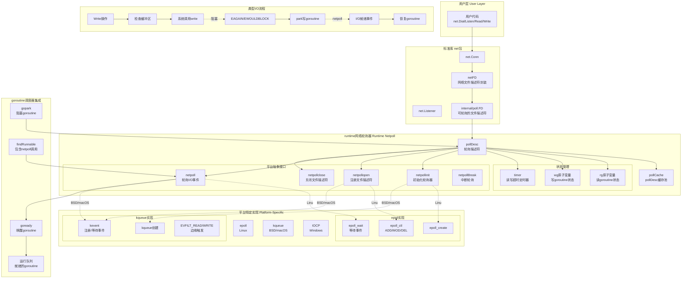
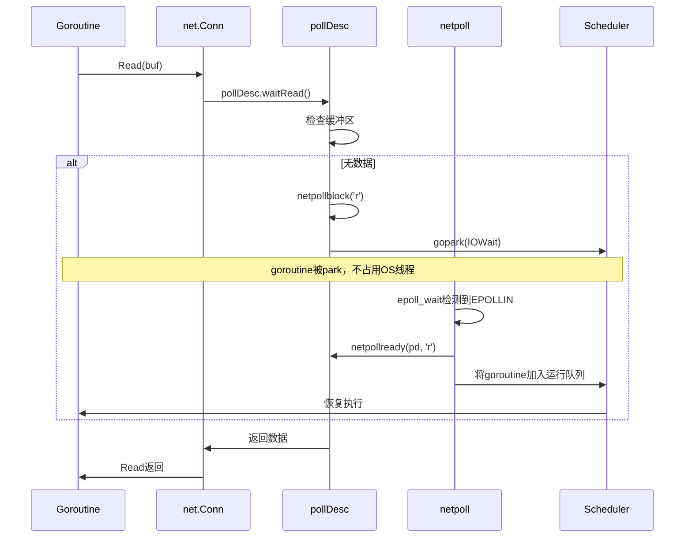

# Go语言源码剖析——网络轮询器（Network Poller）概览

## 模块概述

### 职责定义
网络轮询器（netpoll）是Go runtime中实现高效网络I/O的核心组件。它将操作系统的I/O多路复用机制（epoll/kqueue/IOCP）与goroutine调度器无缝集成，实现了以下目标：

- 将阻塞的网络I/O操作转换为非阻塞操作
- 等待I/O的goroutine会被park，不占用OS线程
- I/O就绪时自动唤醒相应的goroutine
- 支持超时控制和截止时间（deadline）

### 设计哲学

**非阻塞I/O + goroutine调度**

```
传统模型：1个线程处理1个连接（阻塞I/O）
Go模型：M个goroutine共享N个线程（N << M），非阻塞I/O
```

**关键特性**

- **透明性**：用户代码使用同步API，runtime自动处理非阻塞细节
- **高效性**：利用操作系统的高效I/O多路复用
- **可扩展性**：支持百万级并发连接
- **跨平台**：统一接口，平台特定实现

### 平台支持

| 平台 | I/O多路复用机制 | 文件 |
|-----|---------------|------|
| Linux | epoll | `netpoll_epoll.go` |
| BSD/macOS | kqueue | `netpoll_kqueue.go` |
| Windows | IOCP | `netpoll_windows.go` |
| Solaris | event ports | `netpoll_solaris.go` |
| AIX | pollset | `netpoll_aix.go` |
| WASI | poll_oneoff | `netpoll_wasip1.go` |

## 模块架构图



### 架构图说明

#### 核心组件

**1. pollDesc - 轮询描述符**

每个网络连接对应一个pollDesc，记录连接的I/O状态和等待的goroutine。

```go
type pollDesc struct {
    link  *pollDesc      // 缓存池链表
    fd    uintptr        // 文件描述符
    fdseq atomic.Uintptr // 序列号（防止stale notification）
    
    atomicInfo atomic.Uint32 // 原子信息（closing/eventErr/deadline）
    
    // 二元信号量：pdReady/pdWait/G指针/pdNil
    rg atomic.Uintptr // 读goroutine状态
    wg atomic.Uintptr // 写goroutine状态
    
    lock    mutex
    closing bool
    user    uint32    // 用户自定义cookie
    
    // 超时控制
    rseq    uintptr
    rt      timer     // 读截止时间定时器
    rd      int64     // 读截止时间
    
    wseq    uintptr
    wt      timer     // 写截止时间定时器
    wd      int64     // 写截止时间
}
```

**rg/wg状态机**

rg和wg是原子变量，取值：

```
pdNil (0)：没有等待的goroutine，也没有就绪通知
pdReady (1)：I/O就绪，等待goroutine消费
pdWait (2)：goroutine准备park，但还未park
G指针：goroutine已park，等待唤醒
```

**状态转换**

```
读操作：
pdNil → pdWait → G指针 → pdReady → pdNil
           ↓
      (I/O就绪)
           ↓
        pdReady

写操作同理
```

**2. pollCache - 缓存池**

```go
type pollCache struct {
    lock  mutex
    first *pollDesc
}
```

复用pollDesc，减少内存分配。每次分配4KB的pollDesc块。

**3. 平台抽象接口**

所有平台实现必须提供以下函数：

```go
// 初始化轮询器（仅调用一次）
func netpollinit()

// 注册fd到轮询器，边缘触发
func netpollopen(fd uintptr, pd *pollDesc) int32

// 关闭fd的轮询
func netpollclose(fd uintptr) int32

// 轮询I/O事件
// delay < 0：无限阻塞
// delay == 0：非阻塞轮询
// delay > 0：最多阻塞delay纳秒
func netpoll(delay int64) (gList, int32)

// 中断netpoll阻塞
func netpollBreak()
```

## 核心算法详解

### 1. netpoll() - 轮询I/O事件

**Linux epoll实现**

```go
func netpoll(delay int64) (gList, int32) {
    if epfd == -1 {
        return gList{}, 0
    }
    
    // 1. 计算超时时间
    var waitms int32
    if delay < 0 {
        waitms = -1  // 无限等待
    } else if delay == 0 {
        waitms = 0   // 立即返回
    } else if delay < 1e6 {
        waitms = 1   // 至少1ms
    } else if delay < 1e15 {
        waitms = int32(delay / 1e6)
    } else {
        waitms = 1e9  // 最多11.5天
    }
    
    // 2. 调用epoll_wait
    var events [128]linux.EpollEvent
retry:
    n, errno := linux.EpollWait(epfd, events[:], int32(len(events)), waitms)
    if errno != 0 {
        if errno != _EINTR {
            throw("runtime: netpoll failed")
        }
        if waitms > 0 {
            return gList{}, 0  // 超时中断
        }
        goto retry  // 无限等待时重试
    }
    
    // 3. 处理就绪事件
    var toRun gList
    delta := int32(0)
    for i := int32(0); i < n; i++ {
        ev := &events[i]
        
        if ev.events == 0 {
            continue
        }
        
        // 从event.data恢复pollDesc指针
        var mode int32
        if ev.events&(linux.EPOLLIN|linux.EPOLLRDHUP|linux.EPOLLHUP|linux.EPOLLERR) != 0 {
            mode += 'r'  // 可读
        }
        if ev.events&(linux.EPOLLOUT|linux.EPOLLHUP|linux.EPOLLERR) != 0 {
            mode += 'w'  // 可写
        }
        
        if mode != 0 {
            pd := *(**pollDesc)(unsafe.Pointer(&ev.data))
            pd.setEventErr(ev.events&linux.EPOLLERR != 0, 0)
            delta += netpollready(&toRun, pd, mode)
        }
    }
    
    return toRun, delta
}
```

**macOS kqueue实现**

```go
func netpoll(delay int64) (gList, int32) {
    if kq == -1 {
        return gList{}, 0
    }
    
    // 1. 设置超时
    var tp *timespec
    var ts timespec
    if delay < 0 {
        tp = nil  // 无限等待
    } else if delay == 0 {
        tp = &ts  // 立即返回
    } else {
        ts.setNsec(delay)
        if ts.tv_sec > 1e6 {
            ts.tv_sec = 1e6  // Darwin限制
        }
        tp = &ts
    }
    
    // 2. 调用kevent
    var events [64]keventt
retry:
    n := kevent(kq, nil, 0, &events[0], int32(len(events)), tp)
    if n < 0 {
        if n != -_EINTR && n != -_ETIMEDOUT {
            throw("runtime: netpoll failed")
        }
        if delay > 0 {
            return gList{}, 0
        }
        goto retry
    }
    
    // 3. 处理事件
    var toRun gList
    delta := int32(0)
    for i := 0; i < int(n); i++ {
        ev := &events[i]
        
        var mode int32
        if ev.filter == _EVFILT_READ {
            mode += 'r'
        }
        if ev.filter == _EVFILT_WRITE {
            mode += 'w'
        }
        
        if mode != 0 {
            // 从udata恢复pollDesc指针
            pd := (*pollDesc)(unsafe.Pointer(ev.udata))
            pd.setEventErr(ev.flags&_EV_ERROR != 0, 0)
            delta += netpollready(&toRun, pd, mode)
        }
    }
    
    return toRun, delta
}
```

**算法要点**

1. 根据delay计算超时参数
2. 调用平台特定的等待函数（epoll_wait/kevent）
3. 遍历就绪事件，从event中恢复pollDesc
4. 调用netpollready唤醒等待的goroutine
5. 返回就绪goroutine列表

### 2. netpollready() - 唤醒goroutine

```go
func netpollready(toRun *gList, pd *pollDesc, mode int32) int32 {
    var rg, wg *g
    
    // 1. 处理读事件
    if mode == 'r' || mode == 'r'+'w' {
        rg = netpollunblock(pd, 'r', true)
    }
    
    // 2. 处理写事件
    if mode == 'w' || mode == 'r'+'w' {
        wg = netpollunblock(pd, 'w', true)
    }
    
    // 3. 加入就绪列表
    delta := int32(0)
    if rg != nil {
        toRun.push(rg)
        delta++
    }
    if wg != nil {
        toRun.push(wg)
        delta++
    }
    
    return delta
}
```

**netpollunblock() - 解除阻塞**

```go
func netpollunblock(pd *pollDesc, mode int32, ioready bool) *g {
    // 选择rg或wg
    gpp := &pd.rg
    if mode == 'w' {
        gpp = &pd.wg
    }
    
    for {
        old := gpp.Load()
        
        // 1. 没有等待的goroutine
        if old == pdNil {
            return nil
        }
        
        // 2. 已经有就绪通知了
        if old == pdReady {
            return nil
        }
        
        // 3. goroutine正在准备park
        if old == pdWait {
            throw("runtime: netpollunblock on pdWait")
        }
        
        // 4. goroutine已经park，唤醒它
        new := pdNil
        if ioready {
            new = pdReady  // 设置就绪标志
        }
        
        if gpp.CompareAndSwap(old, new) {
            // 成功，返回goroutine指针
            if old == pdReady || old == pdWait {
                old = pdNil
            }
            return (*g)(unsafe.Pointer(old))
        }
    }
}
```

### 3. netpollblock() - 阻塞goroutine

```go
func netpollblock(pd *pollDesc, mode int32, waitio bool) bool {
    gpp := &pd.rg
    if mode == 'w' {
        gpp = &pd.wg
    }
    
    for {
        old := gpp.Load()
        
        // 1. 已有就绪通知，消费它
        if old == pdReady {
            gpp.Store(pdNil)
            return true
        }
        
        // 2. 不能阻塞（连接已关闭或超时）
        if old != pdNil {
            throw("runtime: netpollblock: double wait")
        }
        
        // 3. 设置为pdWait状态
        if gpp.CompareAndSwap(pdNil, pdWait) {
            break
        }
    }
    
    // 4. 检查是否需要等待I/O
    if waitio || netpollcheckerr(pd, mode) != pollNoError {
        gpp.Store(pdNil)
        return false
    }
    
    // 5. park当前goroutine
    gpp.Store(uintptr(unsafe.Pointer(getg())))
    
    // 6. 再次检查，可能在park前就绪了
    if gpp.Load() == pdReady {
        gpp.Store(pdNil)
        return true
    }
    
    // 7. 真正park
    gopark(netpollblockcommit, unsafe.Pointer(gpp), waitReasonIOWait, traceBlockNet, 5)
    
    // 8. 被唤醒后，检查原因
    old := gpp.Load()
    if old == pdReady {
        gpp.Store(pdNil)
        return true  // I/O就绪
    }
    
    return false  // 超时或关闭
}
```

**算法要点**

1. CAS设置状态为pdWait
2. 检查错误（关闭/超时）
3. CAS设置为G指针
4. Double-check避免race
5. gopark阻塞当前goroutine
6. 被唤醒后检查是I/O就绪还是超时

### 4. netpollopen() - 注册文件描述符

**Linux epoll实现**

```go
func netpollopen(fd uintptr, pd *pollDesc) int32 {
    var ev linux.EpollEvent
    
    // 边缘触发 + 读写事件
    ev.events = linux.EPOLLIN | linux.EPOLLOUT | linux.EPOLLRDHUP | linux.EPOLLET
    
    // 将pollDesc指针存入event.data
    *(**pollDesc)(unsafe.Pointer(&ev.data)) = pd
    
    // 调用epoll_ctl注册
    return -linux.EpollCtl(epfd, linux.EPOLL_CTL_ADD, int32(fd), &ev)
}
```

**macOS kqueue实现**

```go
func netpollopen(fd uintptr, pd *pollDesc) int32 {
    // 注册读写两个事件，边缘触发
    var ev [2]keventt
    
    // 读事件
    *(*uintptr)(unsafe.Pointer(&ev[0].ident)) = fd
    ev[0].filter = _EVFILT_READ
    ev[0].flags = _EV_ADD | _EV_CLEAR  // 边缘触发
    ev[0].udata = (*byte)(unsafe.Pointer(pd))
    
    // 写事件
    ev[1] = ev[0]
    ev[1].filter = _EVFILT_WRITE
    
    // 注册
    n := kevent(kq, &ev[0], 2, nil, 0, nil)
    if n < 0 {
        return -n
    }
    return 0
}
```

**边缘触发的重要性**

- 水平触发：只要条件满足就一直触发（效率低）
- 边缘触发：状态变化时触发一次（高效）
- Go使用边缘触发，避免无效唤醒

### 5. 与调度器的集成

**findRunnable中调用netpoll**

```go
func findRunnable() (*g, inheritTime) {
    // ...
    
    // 非阻塞轮询网络
    if netpollinited() && netpollWaiters.Load() > 0 {
        list, delta := netpoll(0)  // delay=0，非阻塞
        if !list.empty() {
            gp := list.pop()
            injectglist(&list)  // 其他goroutine放入全局队列
            netpollWaiters.Add(delta)
            return gp, false
        }
    }
    
    // ...
    
    // 阻塞轮询网络（最后手段）
    if netpollinited() && (netpollWaiters.Load() > 0 || pollUntil != 0) {
        delay := int64(-1)
        if pollUntil != 0 {
            delay = pollUntil - now
        }
        list, delta := netpoll(delay)  // 可能阻塞
        if !list.empty() {
            gp := list.pop()
            injectglist(&list)
            netpollWaiters.Add(delta)
            return gp, false
        }
    }
    
    // ...
}
```

**sysmon中调用netpoll**

```go
func sysmon() {
    for {
        // ...
        
        // 非阻塞轮询网络
        lastpoll := sched.lastpoll.Load()
        if netpollinited() && lastpoll != 0 && lastpoll+10*1000*1000 < now {
            sched.lastpoll.CompareAndSwap(lastpoll, now)
            list, delta := netpoll(0)  // 非阻塞
            if !list.empty() {
                injectglist(&list)
                netpollWaiters.Add(delta)
            }
        }
        
        // ...
    }
}
```

**调用时机**

1. **findRunnable**：P空闲时主动轮询
2. **sysmon**：定期轮询（10ms）
3. **park/ready**：goroutine阻塞/唤醒时

## 典型使用场景

### 1. TCP服务器

```go
package main

import (
    "fmt"
    "net"
)

func main() {
    // 监听端口
    ln, err := net.Listen("tcp", ":8080")
    if err != nil {
        panic(err)
    }
    
    fmt.Println("Server listening on :8080")
    
    // 接受连接（每个连接一个goroutine）
    for {
        conn, err := ln.Accept()  // 阻塞等待，实际上是netpoll
        if err != nil {
            continue
        }
        
        // 启动goroutine处理连接
        go handleConn(conn)
    }
}

func handleConn(conn net.Conn) {
    defer conn.Close()
    
    buf := make([]byte, 4096)
    for {
        // Read会调用netpoll等待数据
        n, err := conn.Read(buf)
        if err != nil {
            return
        }
        
        // Write会调用netpoll等待可写
        _, err = conn.Write(buf[:n])
        if err != nil {
            return
        }
    }
}
```

**幕后流程**



### 2. HTTP服务器

```go
package main

import (
    "fmt"
    "net/http"
)

func main() {
    http.HandleFunc("/", func(w http.ResponseWriter, r *http.Request) {
        fmt.Fprintf(w, "Hello, World!")
    })
    
    // ListenAndServe内部使用netpoll处理所有连接
    http.ListenAndServe(":8080", nil)
}
```

**性能特点**

- 可轻松处理10K+并发连接
- 每个连接一个goroutine（约2-4KB内存）
- 无需线程池，调度器自动复用OS线程

### 3. 超时控制

```go
package main

import (
    "fmt"
    "net"
    "time"
)

func main() {
    conn, err := net.Dial("tcp", "example.com:80")
    if err != nil {
        panic(err)
    }
    defer conn.Close()
    
    // 设置读写超时
    conn.SetDeadline(time.Now().Add(5 * time.Second))
    
    // Read会在5秒后超时
    buf := make([]byte, 1024)
    n, err := conn.Read(buf)
    if err != nil {
        if netErr, ok := err.(net.Error); ok && netErr.Timeout() {
            fmt.Println("Read timeout")
            return
        }
        panic(err)
    }
    
    fmt.Printf("Read %d bytes\n", n)
}
```

**超时机制**

```go
// pollDesc中的超时定时器
type pollDesc struct {
    rt timer  // 读超时定时器
    rd int64  // 读截止时间
    wt timer  // 写超时定时器
    wd int64  // 写截止时间
}

// 设置截止时间
func (pd *pollDesc) setDeadlineImpl(d int64, mode int) {
    if mode == 'r' || mode == 'r'+'w' {
        pd.rd = d
        if d > 0 {
            // 启动定时器
            modtimer(&pd.rt, d, 0, netpollReadDeadline, pd, 0)
        } else {
            deltimer(&pd.rt)
        }
    }
    // 写超时类似
}

// 定时器回调
func netpollReadDeadline(arg any, seq uintptr, delta int64) {
    pd := arg.(*pollDesc)
    pd.rd = -1  // 标记已过期
    netpollunblock(pd, 'r', false)  // 唤醒等待的goroutine
}
```

### 4. 并发客户端

```go
package main

import (
    "fmt"
    "io"
    "net/http"
    "sync"
)

func main() {
    urls := []string{
        "http://example.com",
        "http://google.com",
        "http://github.com",
        // ...1000个URL
    }
    
    var wg sync.WaitGroup
    
    // 启动1000个goroutine并发请求
    for _, url := range urls {
        wg.Add(1)
        go func(url string) {
            defer wg.Done()
            
            resp, err := http.Get(url)  // 内部使用netpoll
            if err != nil {
                return
            }
            defer resp.Body.Close()
            
            body, _ := io.ReadAll(resp.Body)
            fmt.Printf("%s: %d bytes\n", url, len(body))
        }(url)
    }
    
    wg.Wait()
}
```

**可扩展性**

- 1000个goroutine仅需几MB内存
- 实际并发受限于文件描述符限制和网络带宽
- netpoll自动管理所有连接的I/O

## 性能特性

### 1. 内存开销

**每个连接的内存**

```
pollDesc：     ~200字节
goroutine：    ~2-4KB
net.Conn：     ~1KB
总计：         ~3-5KB
```

**百万连接**

```
内存：3-5GB
OS线程：GOMAXPROCS个（通常=CPU核数）
```

### 2. 性能对比

**传统模型（每连接一线程）**

```
10K连接：需要10K个OS线程（~10GB内存）
上下文切换：频繁且昂贵
```

**Go模型（netpoll + goroutine）**

```
10K连接：10K个goroutine（~30-50MB内存）
OS线程：8个（8核机器）
上下文切换：用户态，极快
```

**性能数据**

```
吞吐量：可达100K+ QPS（单机）
延迟：P99 < 10ms
并发连接：百万级
```

### 3. 边缘触发优势

**水平触发（LT）**

```
每次epoll_wait都会返回所有就绪的fd
需要维护就绪列表
开销较大
```

**边缘触发（ET）**

```
只在状态变化时通知一次
必须处理完所有数据（直到EAGAIN）
高效，减少无效唤醒
```

**Go的选择**

- 使用边缘触发（EPOLLET/EV_CLEAR）
- 配合非阻塞I/O
- 减少系统调用

## 最佳实践

### 1. 合理设置超时

```go
// 推荐：设置合理的超时
conn.SetReadDeadline(time.Now().Add(30 * time.Second))
conn.SetWriteDeadline(time.Now().Add(30 * time.Second))

// 不推荐：无超时，可能永久阻塞
conn.Read(buf)
```

### 2. 控制并发数

```go
// 推荐：使用信号量限制并发
type Semaphore chan struct{}

func (s Semaphore) Acquire() { s <- struct{}{} }
func (s Semaphore) Release() { <-s }

func main() {
    sem := make(Semaphore, 1000)  // 最多1000个并发
    
    for _, url := range urls {
        sem.Acquire()
        go func(url string) {
            defer sem.Release()
            http.Get(url)
        }(url)
    }
}
```

### 3. 复用连接

```go
// 推荐：使用http.Client复用连接
var client = &http.Client{
    Transport: &http.Transport{
        MaxIdleConns:        100,
        MaxIdleConnsPerHost: 10,
        IdleConnTimeout:     90 * time.Second,
    },
}

func fetchURL(url string) {
    resp, err := client.Get(url)  // 复用连接
    // ...
}
```

### 4. 优雅关闭

```go
// 推荐：优雅关闭连接
func handleConn(conn net.Conn) {
    defer func() {
        conn.SetLinger(0)  // 立即关闭，不等待数据发送完
        conn.Close()
    }()
    
    // 处理连接...
}

// 推荐：优雅关闭服务器
func main() {
    ln, _ := net.Listen("tcp", ":8080")
    
    go func() {
        sigChan := make(chan os.Signal, 1)
        signal.Notify(sigChan, os.Interrupt)
        <-sigChan
        
        ln.Close()  // 停止接受新连接
    }()
    
    for {
        conn, err := ln.Accept()
        if err != nil {
            return  // 服务器关闭
        }
        go handleConn(conn)
    }
}
```

### 5. 错误处理

```go
// 推荐：区分临时错误和永久错误
func handleError(err error) bool {
    if err == nil {
        return true
    }
    
    // 网络超时错误，可重试
    if netErr, ok := err.(net.Error); ok && netErr.Timeout() {
        return false  // 可重试
    }
    
    // EOF，连接关闭
    if err == io.EOF {
        return false  // 不可重试
    }
    
    // 其他错误
    return false
}
```

## 调试技巧

### 1. GODEBUG查看netpoll事件

```bash
GODEBUG=netpoll=1 go run server.go
```

输出：

```
netpoll: epfd=3 init
netpoll: fd=5 ev=2147483649 add
netpoll: fd=5 ev=2147483649 ready
```

### 2. pprof查看阻塞

```go
import _ "net/http/pprof"

go http.ListenAndServe(":6060", nil)
```

访问：`http://localhost:6060/debug/pprof/goroutine`

### 3. 检查文件描述符限制

```bash
ulimit -n     # 查看当前限制
ulimit -n 100000  # 设置为100K
```

---

*详细的API文档、数据结构和时序图请参阅后续文档。*
