# Go语言源码剖析——编译器（Compiler）概览

## 模块概述

### 职责定义
Go编译器（`cmd/compile`）是将Go源代码转换为机器码的工具链核心。它采用多阶段流水线架构，从源代码的文本解析开始，经过类型检查、中间表示转换、优化、最终生成目标平台的机器码和目标文件。

**关键特性**

- **快速编译**：优化编译速度，支持增量编译
- **跨平台**：支持多种操作系统和架构（GOOS/GOARCH）
- **优化**：内联、逃逸分析、死代码消除、SSA优化等
- **并发编译**：包级别并行编译
- **统一IR**：包导入/导出使用统一中间表示

### 编译流程概览

```
源代码 (.go文件)
    ↓
[1] Parsing (词法+语法分析)
    ↓
语法树 (AST)
    ↓
[2] Type Checking (类型检查)
    ↓
类型化AST
    ↓
[3] IR Construction (构建编译器IR)
    ↓
编译器内部IR
    ↓
[4] Middle End (中端优化)
    ↓
优化后的IR
    ↓
[5] Walk (语句分解与脱糖)
    ↓
简化的IR
    ↓
[6] Generic SSA (SSA生成与优化)
    ↓
SSA (静态单赋值)
    ↓
[7] Machine Code Generation (机器码生成)
    ↓
目标文件 (.o)
```

## 编译器架构图

```mermaid
flowchart TB
    subgraph "输入 Input"
        GOSRC[Go源文件<br/>*.go]
        IMPORTS[导入的包<br/>export data]
    end
    
    subgraph "1. Parsing 词法与语法分析"
        LEXER[词法分析器<br/>syntax.Scanner]
        PARSER[语法分析器<br/>syntax.Parser]
        AST1[语法树<br/>syntax.Node]
        
        LEXER --> PARSER
        PARSER --> AST1
    end
    
    subgraph "2. Type Checking 类型检查"
        TYPES2[types2包<br/>类型检查器]
        TYPEINFO[类型信息<br/>types2.Info]
        
        AST1 --> TYPES2
        TYPES2 --> TYPEINFO
    end
    
    subgraph "3. IR Construction 中间表示构建"
        NODER[noder包<br/>IR转换器]
        IR[编译器IR<br/>ir.Node]
        TYPES[types包<br/>编译器类型]
        UNIFIEDIR[Unified IR<br/>序列化IR]
        
        TYPES2 --> NODER
        TYPEINFO --> NODER
        NODER --> IR
        NODER --> TYPES
        NODER <--> UNIFIEDIR
    end
    
    subgraph "4. Middle End 中端优化"
        INLINE[内联<br/>inline包]
        DEVIRT[去虚化<br/>devirtualize包]
        ESCAPE[逃逸分析<br/>escape包]
        DEADCODE1[死代码消除]
        
        IR --> INLINE
        INLINE --> DEVIRT
        DEVIRT --> ESCAPE
        ESCAPE --> DEADCODE1
    end
    
    subgraph "5. Walk 语句分解与脱糖"
        WALK[walk包<br/>语句分解器]
        ORDER[求值顺序<br/>order子阶段]
        DESUGAR[脱糖<br/>desugar子阶段]
        
        DEADCODE1 --> WALK
        WALK --> ORDER
        WALK --> DESUGAR
    end
    
    subgraph "6. Generic SSA SSA生成与优化"
        SSAGEN[ssagen包<br/>IR→SSA转换]
        SSA[SSA表示<br/>ssa.Func]
        
        subgraph "SSA优化Pass"
            CSE[公共子表达式消除]
            DCE[死代码消除]
            NILCHECK[nil检查消除]
            PROVE[边界检查消除]
            PHIOPT[phi优化]
        end
        
        DESUGAR --> SSAGEN
        SSAGEN --> SSA
        SSA --> CSE
        CSE --> DCE
        DCE --> NILCHECK
        NILCHECK --> PROVE
        PROVE --> PHIOPT
    end
    
    subgraph "7. Machine Code Generation 机器码生成"
        LOWER[lower pass<br/>架构特化]
        REGALLOC[寄存器分配]
        OBJ[obj包<br/>汇编器]
        
        PHIOPT --> LOWER
        LOWER --> REGALLOC
        REGALLOC --> OBJ
    end
    
    subgraph "输出 Output"
        OBJFILE[目标文件<br/>*.o]
        EXPORTDATA[导出数据<br/>用于其他包导入]
    end
    
    OBJ --> OBJFILE
    UNIFIEDIR --> EXPORTDATA
    
    GOSRC --> LEXER
    IMPORTS --> NODER
    
    style GOSRC fill:#e1f5ff
    style OBJFILE fill:#ffe1e1
    style SSA fill:#fff4e1
```



### 架构图说明

#### 七个编译阶段

**1. Parsing（词法与语法分析）**

- **包**：`cmd/compile/internal/syntax`
- **输入**：`.go`源文件（文本）
- **输出**：语法树（`syntax.Node`）
- **功能**：
  - 词法分析：将源代码分解为token流
  - 语法分析：根据Go语法规则构建AST
  - 位置信息：记录每个节点的源码位置（用于错误报告）

```go
// 语法树节点示例
type File struct {
    PkgName  *Name
    DeclList []Decl
    // ...
}

type FuncDecl struct {
    Name *Name
    Type *FuncType
    Body *BlockStmt
    // ...
}
```

**2. Type Checking（类型检查）**

- **包**：`cmd/compile/internal/types2`
- **输入**：语法树
- **输出**：类型化的AST + 类型信息
- **功能**：
  - 符号解析：将标识符绑定到声明
  - 类型推导：推断表达式类型
  - 类型检查：验证类型正确性
  - 泛型实例化：处理类型参数

```go
// 类型信息
type Info struct {
    Types      map[syntax.Expr]TypeAndValue
    Defs       map[*syntax.Name]Object
    Uses       map[*syntax.Name]Object
    Implicits  map[syntax.Node]Object
    Selections map[*syntax.SelectorExpr]*Selection
    Scopes     map[syntax.Node]*Scope
    // ...
}
```

**3. IR Construction（中间表示构建）**

- **包**：`cmd/compile/internal/noder`、`cmd/compile/internal/ir`、`cmd/compile/internal/types`
- **输入**：types2的AST和类型信息
- **输出**：编译器内部IR
- **功能**：
  - 转换为编译器专用的IR和类型系统
  - 构建Unified IR（用于包导入/导出和内联）
  - 处理包级别的初始化

```go
// 编译器IR节点
type Func struct {
    miniNode
    Body   Nodes
    Type   *types.Type
    Inl    *Inline  // 内联信息
    // ...
}

type CallExpr struct {
    miniExpr
    Fun  Node
    Args Nodes
    // ...
}
```

**4. Middle End（中端优化）**

- **包**：`cmd/compile/internal/inline`、`cmd/compile/internal/devirtualize`、`cmd/compile/internal/escape`
- **输入**：编译器IR
- **输出**：优化后的IR
- **功能**：
  - **内联（Inlining）**：将小函数体直接嵌入调用点
  - **去虚化（Devirtualization）**：将接口方法调用转为直接调用
  - **逃逸分析（Escape Analysis）**：决定变量分配在栈还是堆

**内联示例**

```go
// 源代码
func add(a, b int) int {
    return a + b
}

func main() {
    x := add(1, 2)
    println(x)
}

// 内联后
func main() {
    x := 1 + 2  // add函数被内联
    println(x)
}
```

**逃逸分析示例**

```go
// 逃逸到堆
func makePoint() *Point {
    p := Point{X: 1, Y: 2}
    return &p  // p逃逸到堆
}

// 不逃逸，分配在栈
func usePoint() {
    p := Point{X: 1, Y: 2}
    println(p.X)  // p不逃逸
}
```

**5. Walk（语句分解与脱糖）**

- **包**：`cmd/compile/internal/walk`
- **输入**：优化后的IR
- **输出**：简化的IR
- **功能**：
  - **Order**：确定求值顺序，引入临时变量
  - **Desugar**：将高级语法结构转换为原语
    - `switch` → 二分查找/跳转表
    - `range` → `for`循环
    - `map`/`chan`操作 → runtime调用

**脱糖示例**

```go
// 源代码
switch x {
case 1:
    f1()
case 2:
    f2()
case 3:
    f3()
default:
    fd()
}

// 脱糖为二分查找
if x < 2 {
    if x == 1 {
        f1()
    } else {
        fd()
    }
} else {
    if x == 2 {
        f2()
    } else if x == 3 {
        f3()
    } else {
        fd()
    }
}
```

**6. Generic SSA（SSA生成与优化）**

- **包**：`cmd/compile/internal/ssagen`、`cmd/compile/internal/ssa`
- **输入**：简化的IR
- **输出**：SSA形式的中间表示
- **功能**：
  - 转换为SSA（Static Single Assignment）
  - 应用函数内联（intrinsics）
  - 通用优化pass（30+ passes）
    - 公共子表达式消除（CSE）
    - 死代码消除（DCE）
    - nil检查消除
    - 边界检查消除（BCE）
    - 常量传播
    - phi优化

**SSA示例**

```go
// 源代码
func foo(a, b int) int {
    x := a + b
    if x > 10 {
        x = x * 2
    }
    return x
}

// SSA形式（简化）
b1:
    v1 = Arg <int> {a}
    v2 = Arg <int> {b}
    v3 = Add64 <int> v1 v2
    v4 = Const64 <int> [10]
    v5 = Greater64 <bool> v3 v4
    If v5 -> b2 b3
    
b2: (x > 10)
    v6 = Const64 <int> [2]
    v7 = Mul64 <int> v3 v6
    Goto b4
    
b3: (x <= 10)
    Goto b4
    
b4:
    v8 = Phi <int> v7 v3  // 来自b2或b3
    Ret v8
```

**SSA优化Pass列表（部分）**

```go
var passes = [...]pass{
    {name: "early deadcode", fn: deadcode},
    {name: "short circuit", fn: shortcircuit},
    {name: "opt", fn: opt},  // 通用重写规则
    {name: "generic cse", fn: cse},
    {name: "nilcheckelim", fn: nilcheckelim},
    {name: "prove", fn: prove},  // 边界检查消除
    {name: "expand calls", fn: expandCalls},
    {name: "lower", fn: lower},  // 架构特化
    {name: "regalloc", fn: regalloc},  // 寄存器分配
    // ... 30+ passes
}
```

**7. Machine Code Generation（机器码生成）**

- **包**：`cmd/compile/internal/ssa`、`cmd/internal/obj`
- **输入**：架构特化的SSA
- **输出**：目标文件（`.o`）
- **功能**：
  - **Lower pass**：将通用SSA转为架构特定指令
  - **寄存器分配**：将虚拟寄存器映射到物理寄存器
  - **栈帧布局**：分配栈上变量的位置
  - **指针活性分析**：标记GC安全点
  - **汇编生成**：生成机器指令

**架构支持**

| 架构 | GOARCH | 寄存器数 | 特点 |
|-----|--------|---------|------|
| x86-64 | amd64 | 16通用 | 内存操作数 |
| ARM64 | arm64 | 31通用 | Load-Store架构 |
| ARM | arm | 16通用 | Thumb指令集 |
| RISC-V | riscv64 | 32通用 | 开源指令集 |
| WebAssembly | wasm | 无限虚拟 | 栈机器 |

## 核心算法详解

### 1. 内联（Inlining）

**算法目的**
将小函数的函数体直接嵌入到调用点，减少函数调用开销。

**内联决策**

```go
func (v *hairyVisitor) doNode(n ir.Node) error {
    // 计算"复杂度"预算
    const maxBudget = 80  // 默认预算
    
    switch n.Op() {
    case ir.OCALLFUNC:
        v.budget -= inlineCallCost  // 函数调用：57
    case ir.OCALLINTER:
        v.budget -= inlineIndirectCallCost  // 接口调用：72
    case ir.OAS:
        v.budget -= 1  // 赋值：1
    case ir.OIF:
        v.budget -= 1  // if语句：1
    case ir.OFOR, ir.ORANGE:
        v.budget -= 25  // 循环：25
    case ir.OSWITCH:
        v.budget -= 5  // switch：5
    // ...
    }
    
    if v.budget < 0 {
        return errBudget  // 超出预算，不内联
    }
    return nil
}
```

**内联流程**

```go
func InlineCalls(fn *ir.Func) {
    for _, n := range fn.Body {
        if call, ok := n.(*ir.CallExpr); ok {
            callee := call.Fun
            
            // 1. 检查是否可内联
            if callee.Inl == nil {
                continue  // 没有内联体
            }
            
            // 2. 检查预算
            if cost(callee.Inl.Body) > maxBudget {
                continue  // 太复杂
            }
            
            // 3. 复制函数体
            inlBody := copyBody(callee.Inl.Body)
            
            // 4. 替换参数
            substParams(inlBody, call.Args)
            
            // 5. 替换调用为内联体
            replaceCall(call, inlBody)
        }
    }
}
```

**内联效果**

```
小函数（1-5行）：100%内联
中等函数（6-20行）：有条件内联
大函数（>20行）：很少内联
```

### 2. 逃逸分析（Escape Analysis）

**算法目的**
确定变量应该分配在栈还是堆，栈分配更快且无需GC。

**逃逸规则**

```go
// 1. 返回局部变量指针 → 逃逸
func f1() *int {
    x := 42
    return &x  // x逃逸到堆
}

// 2. 赋值给全局变量 → 逃逸
var global *int
func f2() {
    x := 42
    global = &x  // x逃逸到堆
}

// 3. 发送到channel → 逃逸
func f3(ch chan *int) {
    x := 42
    ch <- &x  // x逃逸到堆
}

// 4. 赋值给接口 → 可能逃逸
func f4() interface{} {
    x := 42
    return x  // x逃逸到堆（接口存储）
}

// 5. 局部使用 → 不逃逸
func f5() {
    x := 42
    y := &x
    println(*y)  // x不逃逸，分配在栈
}
```

**逃逸分析算法（简化）**

```go
func escape(fn *ir.Func) {
    // 1. 构建变量的引用图
    graph := buildGraph(fn)
    
    // 2. 标记直接逃逸的变量
    for _, v := range graph.vars {
        if v.escapesDirectly() {
            v.addrs.markEscape()
        }
    }
    
    // 3. 传播逃逸信息
    for changed := true; changed; {
        changed = false
        for _, e := range graph.edges {
            if e.src.escapes && !e.dst.escapes {
                e.dst.addrs.markEscape()
                changed = true
            }
        }
    }
    
    // 4. 将逃逸变量移到堆
    for _, v := range graph.vars {
        if v.escapes {
            moveToHeap(v)
        }
    }
}
```

**优化效果**

```
栈分配：~10ns
堆分配：~100ns（+ GC压力）
逃逸分析减少堆分配：30-50%
```

### 3. SSA优化 - 公共子表达式消除（CSE）

**算法目的**
消除重复计算，减少指令数量。

**CSE算法**

```go
func cse(f *Func) {
    // 1. 为每个基本块构建值表
    for _, b := range f.Blocks {
        seen := make(map[valueKey]*Value)
        
        for _, v := range b.Values {
            // 2. 计算值的key（opcode + args）
            key := valueKey{
                op:   v.Op,
                typ:  v.Type,
                args: v.Args,
            }
            
            // 3. 查找是否已计算过
            if prev := seen[key]; prev != nil {
                // 4. 替换为已有的值
                v.copyOf(prev)
            } else {
                seen[key] = v
            }
        }
    }
}
```

**优化示例**

```go
// 优化前
v1 = Add64 a b
v2 = Mul64 v1 c
v3 = Add64 a b  // 重复计算
v4 = Mul64 v3 d

// 优化后（CSE）
v1 = Add64 a b
v2 = Mul64 v1 c
v3 = Copy v1    // 复用v1
v4 = Mul64 v3 d
```

### 4. 边界检查消除（BCE）

**算法目的**
证明数组/切片访问在边界内，消除runtime检查。

**prove pass算法**

```go
func prove(f *Func) {
    // 1. 为每个基本块收集事实
    facts := make(map[*Block]factSet)
    
    for _, b := range f.Blocks {
        ft := newFactsTable()
        
        // 2. 从前驱块传播事实
        for _, p := range b.Preds {
            ft.update(p.b, facts[p.b])
        }
        
        // 3. 添加当前块的条件
        if b.Kind == BlockIf {
            // if v.Op == OpLess64 {
            //     true分支：v.Args[0] < v.Args[1]
            //     false分支：v.Args[0] >= v.Args[1]
            // }
            ft.checkpoint()
            ft.addRelation(b.Control)
        }
        
        // 4. 应用事实消除检查
        for _, v := range b.Values {
            if v.Op == OpIsInBounds {
                if ft.proves(v.Args[0], '<', v.Args[1]) {
                    v.reset(OpConstBool)  // 已证明安全
                    v.AuxInt = 1
                }
            }
        }
        
        facts[b] = ft
    }
}
```

**优化示例**

```go
// 源代码
func sum(arr []int) int {
    if len(arr) < 10 {
        return 0
    }
    s := 0
    for i := 0; i < 10; i++ {
        s += arr[i]  // 边界检查
    }
    return s
}

// prove分析
// 已知：len(arr) >= 10
// 循环：i ∈ [0, 10)
// 推导：i < len(arr)  （因为i < 10 && 10 <= len(arr)）
// 结论：边界检查总是成功，可消除

// 优化后（无边界检查）
func sum(arr []int) int {
    if len(arr) < 10 {
        return 0
    }
    s := 0
    for i := 0; i < 10; i++ {
        s += arr[i]  // 无边界检查（已消除）
    }
    return s
}
```

### 5. 寄存器分配

**算法：图着色 + 线性扫描**

```go
func regalloc(f *Func) {
    // 1. 构建干扰图
    interference := buildInterferenceGraph(f)
    
    // 2. 计算活跃区间
    intervals := liveIntervals(f)
    
    // 3. 按区间起始位置排序
    sort.Slice(intervals, func(i, j int) bool {
        return intervals[i].start < intervals[j].start
    })
    
    // 4. 线性扫描分配寄存器
    active := []*interval{}
    for _, itv := range intervals {
        // 释放已结束的区间
        for len(active) > 0 && active[0].end < itv.start {
            freeReg(active[0].reg)
            active = active[1:]
        }
        
        // 分配寄存器
        if reg := findFreeReg(); reg != noReg {
            itv.reg = reg
        } else {
            // 溢出到栈
            spill(itv)
        }
        
        active = append(active, itv)
    }
}
```

**寄存器压力**

```
少量寄存器：需要频繁溢出
充足寄存器：大部分值保留在寄存器
x86-64（16个寄存器）：中等压力
ARM64（31个寄存器）：低压力
```

## 编译器标志与调试

### 常用标志

**查看优化信息**

```bash
# 内联决策
go build -gcflags=-m main.go

# 内联+逃逸分析
go build -gcflags="-m -m" main.go

# 边界检查消除
go build -gcflags=-d=ssa/check_bce/debug=1 main.go
```

**查看生成的代码**

```bash
# 查看汇编
go build -gcflags=-S main.go

# 查看IR（类型检查后）
go build -gcflags=-W main.go

# 生成SSA可视化
GOSSAFUNC=main go build main.go  # 生成ssa.html
```

**禁用优化**

```bash
# 禁用内联
go build -gcflags=-l main.go

# 禁用所有优化
go build -gcflags="-N -l" main.go
```

### SSA可视化

```bash
# 生成SSA HTML
GOSSAFUNC=FuncName go build file.go
# 输出：ssa.html（在浏览器中打开）
```

**ssa.html内容**

- 每个优化pass的SSA图
- 基本块的控制流
- 值的定义和使用
- 优化前后对比

## 性能特性

### 编译速度

**编译速度因素**

```
源代码行数：线性关系
包依赖数：影响导入时间
优化级别：-N禁用优化可加速2-3倍
并行度：GOMAXPROCS控制并发编译
```

**典型数据**

```
小项目（<10K行）：<1秒
中等项目（10K-100K行）：5-30秒
大型项目（>100K行）：1-5分钟
```

### 代码质量

**优化效果**

```
内联：减少函数调用开销，30%+性能提升
逃逸分析：减少堆分配，减少GC压力
边界检查消除：减少10-20%的检查
CSE：减少重复计算
```

**代码大小**

```
无优化（-N）：基准
默认优化：+10-20%（内联导致）
-ldflags="-s -w"：去除符号表，-30%
```

## 最佳实践

### 1. 帮助编译器优化

**利用内联**

```go
// 推荐：小函数容易内联
func add(a, b int) int {
    return a + b
}

// 不推荐：复杂函数不易内联
func complexCalc(a, b, c, d int) int {
    // 20+行代码
}
```

**避免不必要的逃逸**

```go
// 推荐：不逃逸
func process() {
    data := make([]byte, 1024)
    // 局部使用data
}

// 不推荐：逃逸
func process() []byte {
    data := make([]byte, 1024)
    return data  // data逃逸
}
```

**帮助边界检查消除**

```go
// 推荐：编译器可证明安全
func sum(arr []int) int {
    s := 0
    for i := 0; i < len(arr); i++ {
        s += arr[i]  // 边界检查消除
    }
    return s
}

// 不推荐：难以证明
func sum(arr []int, indices []int) int {
    s := 0
    for _, i := range indices {
        s += arr[i]  // 无法消除边界检查
    }
    return s
}
```

### 2. 理解编译器限制

**内联限制**

```go
// 不会内联的情况
func recursive() {
    recursive()  // 递归函数
}

func hasDefer() {
    defer cleanup()  // 有defer（部分Go版本）
    // ...
}

func tooLarge() {
    // 100+行代码，超出预算
}
```

**逃逸分析限制**

```go
// 难以优化的情况
func indirect() *int {
    x := 42
    p := &x
    q := &p
    return *q  // 间接引用，逃逸
}
```

### 3. 编译时断言

```go
// 编译时检查类型大小
const _ = uint(^uint(0)>>63) / 2  // 只在64位编译通过

// 编译时检查接口实现
var _ io.Reader = (*MyReader)(nil)  // 确保MyReader实现Reader
```

### 4. 条件编译

```go
//go:build linux && amd64

// 此文件只在Linux AMD64编译
```

### 5. 编译器指令

```go
//go:noinline
func noInline() {
    // 禁止内联此函数
}

//go:nosplit
func noSplit() {
    // 禁止栈分裂检查（小心使用）
}

//go:linkname localname importpath.remotename
// 链接到另一个包的私有符号
```

## 编译器演进

### 历史版本

| 版本 | 重大改进 |
|------|---------|
| Go 1.0 | 基础编译器 |
| Go 1.5 | 编译器用Go重写 |
| Go 1.7 | 新SSA后端 |
| Go 1.10 | 边界检查消除改进 |
| Go 1.17 | 寄存器ABI（AMD64） |
| Go 1.18 | 泛型支持 |
| Go 1.20 | 改进的内联 |

### 未来方向

- 更激进的优化
- 更好的泛型性能
- 增量编译改进
- 更多架构支持

---

*详细的编译器内部实现、SSA规则和架构特定优化请参阅后续专题文档。*
