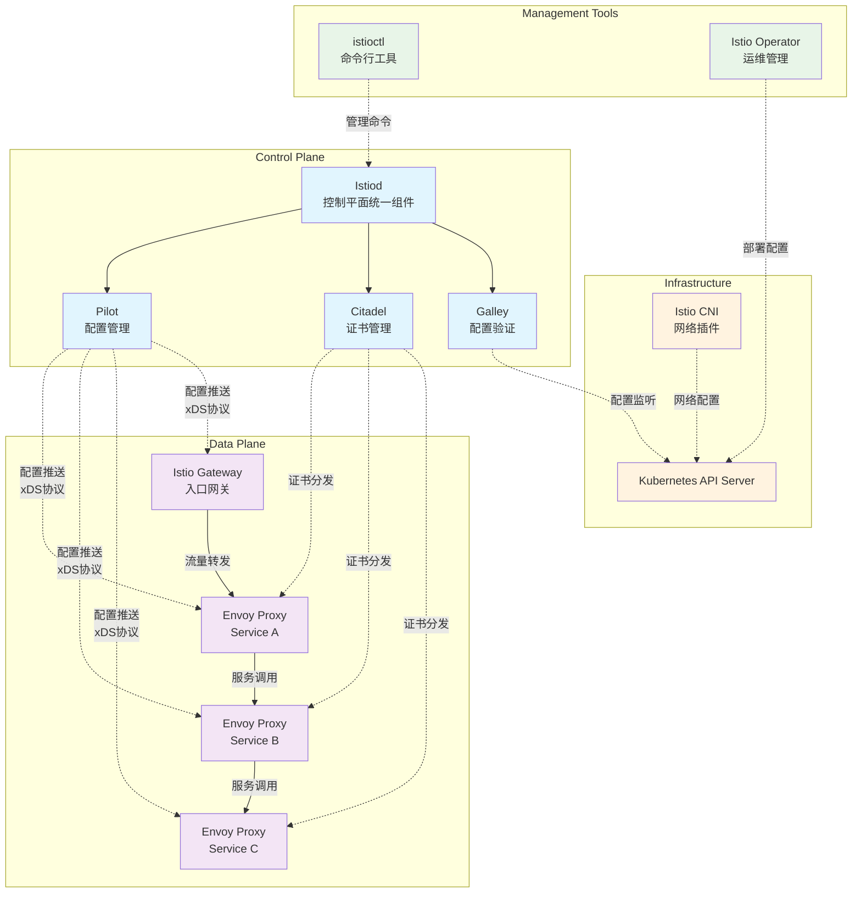
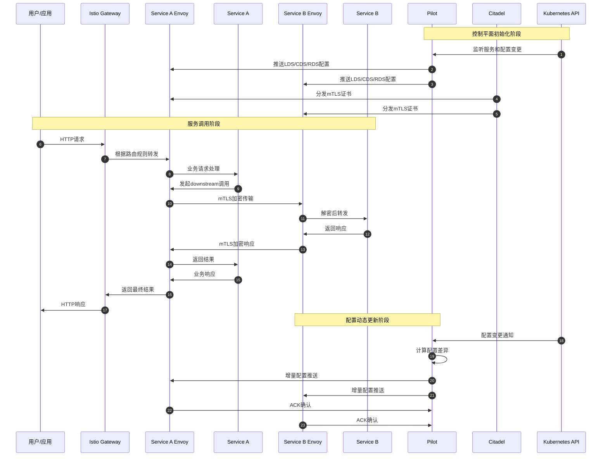

# Istio 源码剖析 - 总览

## 项目摘要

### 目标与边界
Istio是一个开源的服务网格平台，提供微服务间的连接、保护、控制和观测能力。其核心目标是：
- 为微服务提供统一的连接和管理层
- 实现流量管理、安全策略和可观测性
- 支持多种平台和协议的无侵入式集成

### 运行环境与部署形态
- **主要部署环境**：Kubernetes集群
- **支持平台**：虚拟机、容器、混合云环境
- **部署模式**：控制平面集中式管理，数据平面边车代理分布式部署

## 整体架构

### 系统架构图

#### 架构图说明

**图意概述**：该架构图展示了Istio服务网格的完整组件架构，包括控制平面、数据平面、管理工具和基础设施四个层次。

**关键组件功能**：
- **Istiod**：统一的控制平面组件，整合了Pilot、Citadel、Galley功能
- **Pilot**：负责服务发现、流量管理配置的生成和分发
- **Citadel**：提供身份和凭证管理，负责证书生成和轮换
- **Galley**：配置管理和验证，负责监听Kubernetes配置变更
- **Envoy Proxy**：数据平面代理，处理所有服务间通信

**边界与约束**：
- **并发处理**：控制平面支持数千个代理的并发连接和配置推送
- **配置一致性**：通过版本控制和增量更新确保配置的最终一致性
- **超时控制**：xDS连接默认30秒超时，配置推送支持批量和增量模式
- **资源隔离**：多租户通过Namespace和RBAC实现隔离

**异常与回退**：
- **控制平面故障**：数据平面代理使用本地缓存继续服务
- **配置错误**：Galley验证拒绝无效配置，保持系统稳定性
- **网络分区**：支持多集群联邦，单集群故障不影响其他集群

**性能与容量**：
- **推送效率**：增量xDS减少网络传输，批量推送降低频次
- **内存占用**：单个Istiod实例支持10000+工作负载
- **启动时间**：冷启动时间< 30秒，热重启时间< 5秒

**版本兼容与演进**：
- **向后兼容**：支持N-1版本的数据平面代理
- **灰度升级**：支持控制平面和数据平面独立升级
- **API版本**：遵循Kubernetes API版本策略

### 全局时序图

#### 全局时序图说明

**图意概述**：该时序图展示了Istio服务网格中一个完整的服务调用生命周期，包括控制平面初始化、服务间通信和配置动态更新三个关键阶段。

**关键交互流程**：
1. **控制平面初始化**（步骤1-6）：Pilot监听Kubernetes API，生成并推送xDS配置到各个Envoy代理，Citadel分发mTLS证书
2. **服务调用处理**（步骤7-16）：用户请求经过Gateway路由到服务A，服务A调用服务B，全程使用mTLS加密
3. **配置动态更新**（步骤17-22）：配置变更触发增量推送，Envoy代理确认接收

**边界与约束**：
- **事务性**：单次配置推送支持原子性更新，避免中间状态
- **幂等性**：相同配置的重复推送不会产生副作用
- **顺序保证**：xDS协议确保配置的有序推送和应用
- **超时处理**：各阶段都有相应的超时和重试机制

**异常与回退**：
- **推送失败**：Pilot支持重试和回退机制，Envoy使用之前有效配置
- **证书过期**：Citadel自动轮换，支持热更新
- **网络中断**：Envoy代理缓存配置，断网期间正常服务

**性能与容量**：
- **批量推送**：减少推送频次，提高网络效率
- **增量更新**：仅推送变更部分，降低资源消耗
- **并行处理**：多个代理的配置推送并行执行

**版本兼容与演进**：
- **协议版本**：xDS v3协议向后兼容v2
- **配置迁移**：支持平滑的配置格式升级
- **API演进**：遵循语义化版本控制

## 模块交互矩阵

| 调用方 | 被调方 | 调用方式 | 错误语义 | 一致性要求 |
|-------|-------|----------|----------|------------|
| Pilot | Kubernetes API | 异步Watch | 重试+指数退避 | 最终一致性 |
| Pilot | Envoy代理 | gRPC Stream | 连接重建+配置重推 | 顺序一致性 |
| Citadel | Kubernetes API | 同步调用 | 立即失败+重试 | 强一致性 |
| Citadel | Envoy代理 | gRPC推送 | 证书缓存+轮换 | 最终一致性 |
| Galley | Kubernetes API | 异步Watch | 配置验证+拒绝 | 强一致性 |
| Istioctl | Istiod | gRPC/HTTP | 用户错误提示 | 读写一致性 |
| Operator | Kubernetes API | 声明式管理 | 状态同步+重试 | 最终一致性 |
| CNI | Kubernetes API | 事件驱动 | 网络回滚 | 强一致性 |
| Envoy | Service | HTTP/gRPC | 断路器+重试 | 无特殊要求 |

## 关键设计与权衡

### 一致性与事务模型
- **最终一致性**：控制平面配置推送采用最终一致性模型，通过版本号确保收敛
- **乐观并发**：配置更新使用版本号进行冲突检测，支持并发更新
- **事务边界**：单个xDS推送作为事务单元，保证配置的原子性应用

### 性能关键路径
- **配置推送路径**：Kubernetes API → Pilot → xDS → Envoy，是影响配置生效时间的关键路径
- **数据平面性能**：Envoy代理的请求处理性能直接影响服务调用延迟
- **证书轮换路径**：Citadel → SDS → Envoy，影响mTLS的可用性

### 可观测性设计
- **遥测数据流**：Envoy → 遥测后端，支持Prometheus、Jaeger等多种后端
- **配置可见性**：通过istioctl和管理接口暴露配置状态和诊断信息
- **调试能力**：支持配置转储、xDS状态查询、代理配置检查等调试功能

### 配置项说明

#### 核心配置参数
- **PILOT_ENABLE_WORKLOAD_ENTRY**：启用虚拟机工作负载支持，默认true
- **PILOT_ENABLE_AMBIENT**：启用Ambient模式，简化sidecar部署，默认false  
- **PILOT_JWT_PUB_KEY_REFRESH_INTERVAL**：JWT公钥刷新间隔，默认20分钟
- **CITADEL_ENABLE_WORKLOAD_CERT_ROTATION**：启用工作负载证书自动轮换，默认true
- **ISTIOD_ADDR**：控制平面地址，用于多集群联邦配置

#### 性能调优参数
- **PILOT_PUSH_THROTTLE**：配置推送限流，默认100个/秒
- **PILOT_MAX_REQUESTS_PER_SECOND**：xDS请求速率限制，默认25
- **CITADEL_SELF_SIGNED_CA_CERT_TTL**：自签名CA证书有效期，默认10年

