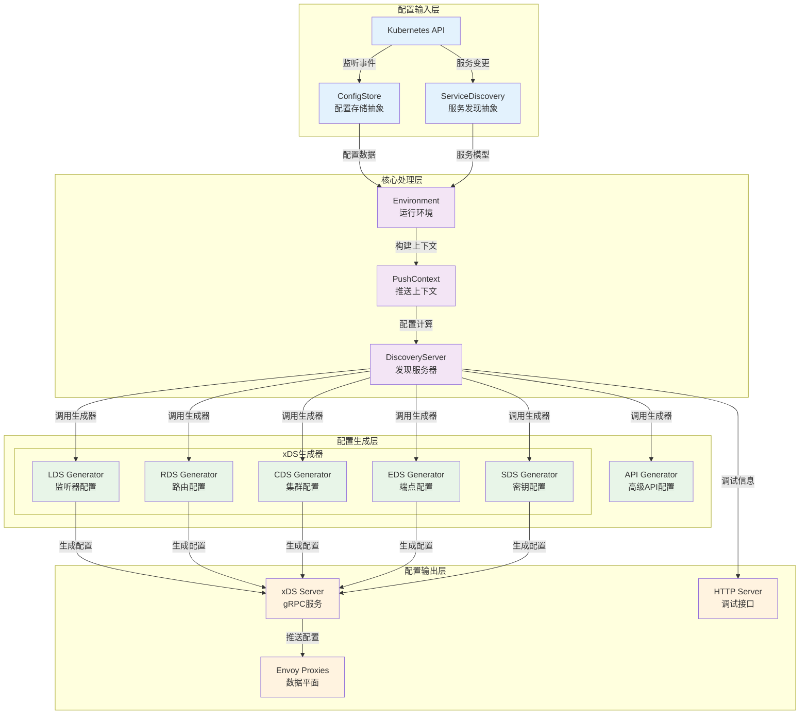
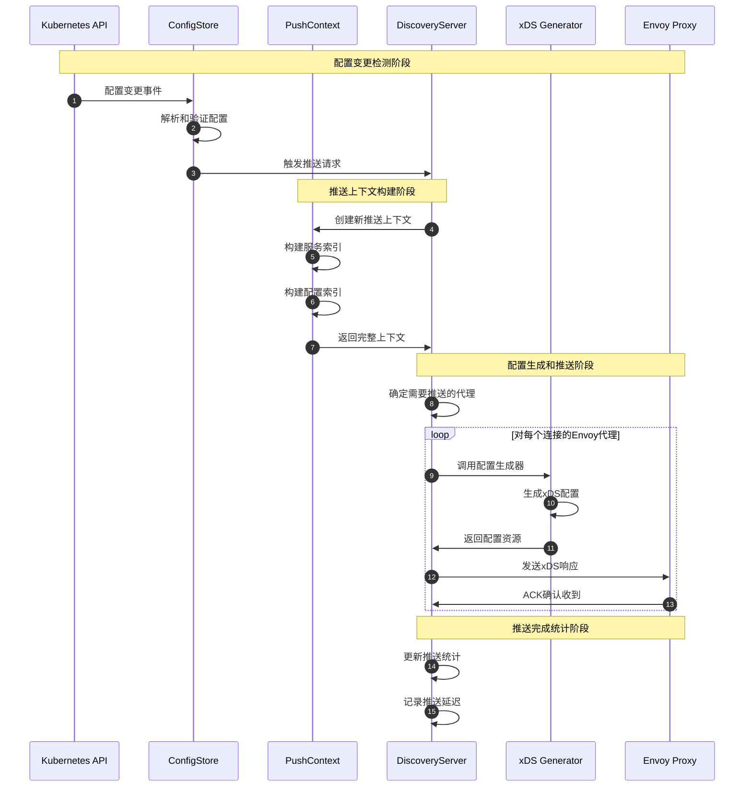
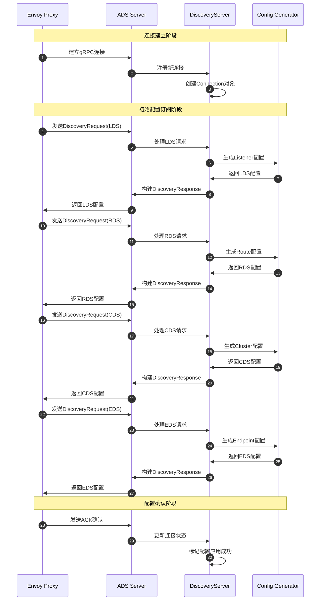

# Istio 源码剖析 - Pilot模块

## 模块概览

### 职责边界
Pilot是Istio控制平面的核心组件，承担以下关键职责：
- **配置管理**：从Kubernetes API中获取Istio配置，进行验证、转换和索引
- **服务发现**：聚合多种服务发现源，构建统一的服务模型
- **流量管理**：根据VirtualService、DestinationRule等配置生成Envoy代理配置
- **配置分发**：通过xDS协议将配置推送到数据平面的Envoy代理

### 输入输出
- **输入**：Kubernetes API事件、Istio CRD配置、服务注册信息
- **输出**：xDS配置（LDS/RDS/CDS/EDS/SDS等）、调试和监控信息

### 上下游依赖
- **上游依赖**：Kubernetes API Server、服务注册中心
- **下游消费者**：Envoy代理、istioctl工具、监控系统
- **平行组件**：Citadel（证书管理）、Galley（配置验证）

### 生命周期
1. **启动阶段**：初始化服务发现、配置存储、xDS服务器
2. **运行阶段**：监听配置变更、计算配置差异、推送配置更新
3. **关闭阶段**：优雅停止xDS服务、清理资源连接

## 架构设计

### 模块架构图


#### 架构图说明

**图意概述**：该架构图展示了Pilot模块的四层架构设计，从配置输入到最终的xDS配置输出的完整数据流。

**关键接口设计**：
- **ConfigStore接口**：抽象配置存储，支持多种配置源（Kubernetes、文件、内存）
- **ServiceDiscovery接口**：统一服务发现API，聚合多种服务注册源
- **XdsResourceGenerator接口**：xDS配置生成器的统一接口，支持增量和全量生成

**边界与约束**：
- **配置一致性**：PushContext确保单次推送的配置快照一致性
- **推送并发**：通过并发限制和速率限制控制推送压力
- **内存管理**：大型环境下单个PushContext可能占用数GB内存
- **推送延迟**：从配置变更到Envoy应用通常在100ms-1s范围

**异常与回退**：
- **生成器错误**：单个生成器失败不影响其他类型配置的推送
- **连接断开**：Envoy代理重连后重新订阅所需配置
- **配置冲突**：通过配置验证和排序规则解决冲突

**性能与容量**：
- **批量处理**：多个配置变更合并为单次推送，减少网络开销
- **增量推送**：仅推送变更的配置资源，提高推送效率
- **缓存机制**：生成的配置进行缓存，避免重复计算

**版本兼容与演进**：
- **xDS版本管理**：支持v2和v3协议，平滑迁移
- **配置向下兼容**：新版本配置向老版本Envoy兼容
- **API演进**：通过接口抽象支持配置格式演进

## 核心API与数据结构

### PushContext - 推送上下文

#### 数据结构定义
```go
type PushContext struct {
    // 代理状态管理
    proxyStatusMutex sync.RWMutex
    ProxyStatus      map[string]map[string]ProxyPushStatus
    
    // 服务索引和缓存
    ServiceIndex        serviceIndex
    serviceAccounts     map[serviceAccountKey][]string
    
    // 配置资源索引
    virtualServiceIndex    virtualServiceIndex
    destinationRuleIndex   destinationRuleIndex  
    gatewayIndex          gatewayIndex
    sidecarIndex          sidecarIndex
    
    // 策略配置
    AuthnPolicies         *AuthenticationPolicies
    AuthzPolicies         *AuthorizationPolicies
    Telemetry            *Telemetries
    ProxyConfigs         *ProxyConfigs
    
    // 网格配置
    Mesh                 *meshconfig.MeshConfig
    PushVersion          string
    LedgerVersion        string
}
```

| 字段 | 类型 | 必填 | 默认 | 约束 | 说明 |
|------|------|------|------|------|------|
| ServiceIndex | serviceIndex | 是 | - | 只读 | 服务快速查找索引，按hostname/namespace分组 |
| virtualServiceIndex | virtualServiceIndex | 是 | - | 只读 | VirtualService配置索引，支持Gateway维度查询 |
| destinationRuleIndex | destinationRuleIndex | 是 | - | 只读 | DestinationRule配置索引，支持host匹配 |
| ProxyStatus | map[string]map[string]ProxyPushStatus | 否 | 空map | 线程安全 | 代理推送状态跟踪，用于调试和监控 |
| PushVersion | string | 是 | - | UUID格式 | 推送版本标识，确保配置一致性 |

#### 核心方法实现
```go
func (pc *PushContext) InitContext(env *Environment, oldPushContext *PushContext, pushReq *PushRequest) error {
    // 1) 初始化基础配置
    pc.Mesh = env.Mesh()
    pc.PushVersion = pushReq.Push.PushVersion
    
    // 2) 构建服务索引
    pc.ServiceIndex = buildServiceIndex(env.ServiceDiscovery.Services())
    
    // 3) 构建配置索引
    pc.virtualServiceIndex = buildVirtualServiceIndex(env.ConfigStore.List(gvk.VirtualService))
    pc.destinationRuleIndex = buildDestinationRuleIndex(env.ConfigStore.List(gvk.DestinationRule))
    
    // 4) 处理增量更新优化
    if oldPushContext != nil && !pushReq.Full {
        pc.optimizeIncrementalUpdate(oldPushContext, pushReq)
    }
    
    return nil
}

func (pc *PushContext) ServiceByHostname(hostname host.Name) *Service {
    // 快速索引查找，O(1)时间复杂度
    return pc.ServiceIndex.ByHostname[hostname]
}
```

### DiscoveryServer - xDS发现服务

#### 服务结构定义
```go
type DiscoveryServer struct {
    // 环境和生成器
    Env        *model.Environment
    Generators map[string]model.XdsResourceGenerator
    
    // 推送控制
    ProxyNeedsPush      func(*model.Proxy, *model.PushRequest) (*model.PushRequest, bool)
    concurrentPushLimit chan struct{}
    RequestRateLimit    *rate.Limiter
    
    // 更新统计
    InboundUpdates   *atomic.Int64
    CommittedUpdates *atomic.Int64
    
    // 推送队列
    pushChannel chan *model.PushRequest
    pushQueue   *PushQueue
}
```

#### xDS配置推送API
```go
// 基本信息
// 名称: `pushXds`
// 协议/方法: gRPC内部方法
// 幂等性: 否（每次推送都有新的版本号）

// 请求结构体
func (s *DiscoveryServer) pushXds(con *Connection, w *model.WatchedResource, req *model.PushRequest) error {
    // 1) 查找对应的配置生成器
    gen := s.findGenerator(w.TypeUrl, con)
    if gen == nil {
        return nil
    }
    
    // 2) 处理增量请求优化
    if !req.Delta.IsEmpty() && !con.proxy.IsProxylessGrpc() {
        w = &model.WatchedResource{
            TypeUrl:       w.TypeUrl,
            ResourceNames: req.Delta.Subscribed,
        }
    }
    
    // 3) 生成配置资源
    res, logdata, err := gen.Generate(con.proxy, w, req)
    if err != nil || res == nil {
        return err
    }
    
    // 4) 构建xDS响应
    resp := &discovery.DiscoveryResponse{
        ControlPlane: ControlPlane(w.TypeUrl),
        TypeUrl:      w.TypeUrl,
        VersionInfo:  req.Push.PushVersion,
        Nonce:       nonce(req.Push.PushVersion),
        Resources:   xds.ResourcesToAny(res),
    }
    
    // 5) 发送配置到Envoy代理
    return xds.Send(con, resp)
}
```

### EDS Generator - 端点发现生成器

#### 生成器实现
```go
type EdsGenerator struct {
    Cache        model.XdsCache
    EndpointIndex model.EndpointIndex
}

// 核心生成方法
func (eds *EdsGenerator) Generate(proxy *model.Proxy, w *model.WatchedResource, req *model.PushRequest) (model.Resources, model.XdsLogDetails, error) {
    // 1) 判断是否需要推送
    if !edsNeedsPush(req, proxy) {
        return nil, model.DefaultXdsLogDetails, nil
    }
    
    // 2) 构建端点配置
    resources, logDetails := eds.buildEndpoints(proxy, req, w)
    return resources, logDetails, nil
}

// 增量生成方法
func (eds *EdsGenerator) GenerateDeltas(proxy *model.Proxy, req *model.PushRequest, w *model.WatchedResource) (model.Resources, model.DeletedResources, model.XdsLogDetails, bool, error) {
    if !edsNeedsPush(req, proxy) {
        return nil, nil, model.DefaultXdsLogDetails, false, nil
    }
    
    // 优化：仅处理端点变更
    if shouldUseDeltaEds(req) {
        resources, removed, logs := eds.buildDeltaEndpoints(proxy, req, w)
        return resources, removed, logs, true, nil
    }
    
    // 回退到全量生成
    resources, logDetails := eds.buildEndpoints(proxy, req, w)
    return resources, nil, logDetails, false, nil
}
```

### ServiceDiscovery - 服务发现接口

#### 接口定义
```go
type ServiceDiscovery interface {
    NetworkGatewaysWatcher
    
    // 服务查询接口
    Services() []*Service
    GetService(hostname host.Name) *Service
    GetProxyServiceTargets(*Proxy) []ServiceTarget
    GetProxyWorkloadLabels(*Proxy) labels.Instance
    
    // 多集群服务支持
    MCSServices() []MCSServiceInfo
    AmbientIndexes
}
```

#### Service数据模型
```go
type Service struct {
    // 基础属性
    Hostname       host.Name
    Namespace      string
    DefaultAddress string
    
    // 端口配置
    Ports          []*Port
    ServiceAccounts []string
    
    // 网络属性  
    MeshExternal   bool
    Resolution     Resolution
    
    // 扩展属性
    Attributes     ServiceAttributes
    K8sAttributes  K8sAttributes
}
```

## 时序图分析

### 配置推送完整流程


#### 时序图说明

**图意概述**：该时序图展示了Pilot模块中一个完整的配置推送流程，从Kubernetes配置变更到Envoy代理接收配置的全过程。

**关键交互环节**：
1. **配置变更检测**（步骤1-3）：Kubernetes API的配置变更触发ConfigStore更新，并通知DiscoveryServer
2. **推送上下文构建**（步骤4-7）：构建新的PushContext，包含所有配置的索引和快照
3. **配置生成推送**（步骤8-13）：为每个Envoy代理生成对应的xDS配置并推送
4. **推送统计更新**（步骤14-15）：记录推送完成状态和性能指标

**边界与约束**：
- **原子性**：单次推送使用相同的PushContext，确保配置一致性
- **幂等性**：相同版本的配置重复推送不会产生副作用
- **顺序性**：同一代理的配置推送按类型有序进行
- **超时控制**：推送操作有30秒超时限制

**异常与回退**：
- **生成失败**：单个生成器失败时跳过该类型配置，不影响其他类型
- **网络异常**：推送失败的连接会重新排队重试
- **代理离线**：离线代理重连后自动重新订阅配置

**性能与容量**：
- **批量处理**：多个配置变更合并为单次推送上下文构建
- **并发推送**：多个代理的配置推送并行执行，受并发限制控制
- **内存优化**：推送完成后及时释放PushContext，避免内存泄漏

**版本兼容与演进**：
- **版本管理**：每次推送生成唯一版本号，支持版本回滚
- **协议兼容**：同时支持xDS v2和v3协议版本
- **配置迁移**：支持配置格式的平滑升级和迁移

### Envoy代理连接建立流程  


## 关键算法与实现

### 配置索引构建算法
Pilot需要从大量的配置资源中快速查找和匹配，索引构建算法的效率直接影响推送性能。

#### 服务索引构建
```go
func buildServiceIndex(services []*Service) serviceIndex {
    index := serviceIndex{
        ByHostname:  make(map[host.Name]*Service),
        ByNamespace: make(map[string][]*Service),
    }
    
    for _, svc := range services {
        // 按主机名索引，O(1)查找
        index.ByHostname[svc.Hostname] = svc
        
        // 按命名空间分组，支持批量操作
        index.ByNamespace[svc.Namespace] = append(
            index.ByNamespace[svc.Namespace], svc)
    }
    
    return index
}
```

#### VirtualService索引构建  
```go
func buildVirtualServiceIndex(configs []config.Config) virtualServiceIndex {
    index := virtualServiceIndex{
        ByGateway: make(map[string][]config.Config),
        ByHost:    make(map[string][]config.Config),
    }
    
    for _, cfg := range configs {
        vs := cfg.Spec.(*v1alpha3.VirtualService)
        
        // 按网关分组索引
        for _, gateway := range vs.Gateways {
            key := gateway + "/" + cfg.Namespace
            index.ByGateway[key] = append(index.ByGateway[key], cfg)
        }
        
        // 按主机名分组索引  
        for _, host := range vs.Hosts {
            index.ByHost[host] = append(index.ByHost[host], cfg)
        }
    }
    
    return index
}
```

### 增量推送优化算法
增量推送是Pilot性能优化的关键，通过只推送变更的配置减少网络传输和Envoy处理开销。

#### 配置变更检测
```go
func (eds *EdsGenerator) GenerateDeltas(proxy *model.Proxy, req *model.PushRequest, w *model.WatchedResource) (model.Resources, model.DeletedResources, model.XdsLogDetails, bool, error) {
    
    // 1) 检查是否可以使用增量推送
    if !shouldUseDeltaEds(req) {
        // 回退到全量推送
        resources, logDetails := eds.buildEndpoints(proxy, req, w)
        return resources, nil, logDetails, false, nil
    }
    
    // 2) 计算端点变更
    updatedEndpoints := make(model.Resources, 0)
    deletedEndpoints := make(model.DeletedResources, 0)
    
    // 仅处理变更的服务端点
    for _, serviceName := range req.Delta.Subscribed {
        if endpoints := eds.buildServiceEndpoints(proxy, serviceName, req); endpoints != nil {
            updatedEndpoints = append(updatedEndpoints, endpoints)
        }
    }
    
    // 处理删除的端点
    for _, deletedService := range req.Delta.Unsubscribed {
        deletedEndpoints = append(deletedEndpoints, deletedService)
    }
    
    return updatedEndpoints, deletedEndpoints, model.XdsLogDetails{Incremental: true}, true, nil
}
```

## 框架使用示例与最佳实践

### 自定义配置生成器
当需要为特殊场景生成自定义的xDS配置时，可以实现XdsResourceGenerator接口：

```go
type CustomGenerator struct {
    env *model.Environment
}

func (g *CustomGenerator) Generate(proxy *model.Proxy, w *model.WatchedResource, req *model.PushRequest) (model.Resources, model.XdsLogDetails, error) {
    // 1) 根据代理类型判断是否需要生成配置
    if proxy.Type != model.SidecarProxy {
        return nil, model.DefaultXdsLogDetails, nil
    }
    
    // 2) 从环境中获取必要的配置信息
    services := g.env.ServiceDiscovery.Services()
    
    // 3) 生成自定义配置资源
    resources := make(model.Resources, 0)
    for _, service := range services {
        if customConfig := g.buildCustomConfig(proxy, service, req.Push); customConfig != nil {
            resources = append(resources, customConfig)
        }
    }
    
    return resources, model.XdsLogDetails{AdditionalInfo: "custom-gen"}, nil
}

// 注册自定义生成器
func RegisterCustomGenerator(discoveryServer *xds.DiscoveryServer) {
    discoveryServer.Generators["custom"] = &CustomGenerator{
        env: discoveryServer.Env,
    }
}
```

### 配置推送监控
在生产环境中，监控配置推送的性能和成功率至关重要：

```go
// 推送延迟监控
func monitorPushLatency() {
    // 监听推送事件
    go func() {
        for pushEvent := range pilot.PushEvents() {
            // 记录推送延迟
            latency := time.Since(pushEvent.StartTime)
            pushLatencyHistogram.With(prometheus.Labels{
                "type": pushEvent.TypeUrl,
                "result": pushEvent.Result,
            }).Observe(latency.Seconds())
            
            // 记录推送大小
            pushSizeGauge.With(prometheus.Labels{
                "type": pushEvent.TypeUrl,
            }).Set(float64(pushEvent.ConfigSize))
        }
    }()
}

// 连接状态监控
func monitorConnectionStatus(ds *xds.DiscoveryServer) {
    ticker := time.NewTicker(30 * time.Second)
    defer ticker.Stop()
    
    for range ticker.C {
        connections := ds.Connections()
        connectedProxies.Set(float64(len(connections)))
        
        // 按代理类型统计
        typeCount := make(map[string]int)
        for _, conn := range connections {
            typeCount[string(conn.proxy.Type)]++
        }
        
        for proxyType, count := range typeCount {
            proxyTypeGauge.With(prometheus.Labels{
                "type": proxyType,
            }).Set(float64(count))
        }
    }
}
```

### 性能调优最佳实践

#### 1. 推送批量优化
```go
// 配置推送防抖动
func optimizePushBatching() {
    // 推送请求防抖动，避免频繁推送
    deBouncer := NewDebouncer(200 * time.Millisecond)
    
    go func() {
        for configChange := range configChangeEvents {
            deBouncer.AddEvent(configChange, func() {
                // 批量处理配置变更
                pilot.TriggerPush(&model.PushRequest{
                    Full: false,
                    ConfigsUpdated: deBouncer.GetBatchedChanges(),
                })
            })
        }
    }()
}
```

#### 2. 内存使用优化
```go
// PushContext内存管控
func optimizeMemoryUsage(pc *model.PushContext) {
    // 限制单个PushContext的存活时间
    ctx, cancel := context.WithTimeout(context.Background(), 5*time.Minute)
    defer cancel()
    
    // 定期清理不再使用的索引
    go func() {
        <-ctx.Done()
        pc.Cleanup() // 清理内部索引和缓存
    }()
}
```

#### 3. 配置验证优化
```go
// 配置预验证，避免无效推送
func validateConfigBeforePush(configs []config.Config) []config.Config {
    validConfigs := make([]config.Config, 0, len(configs))
    
    for _, cfg := range configs {
        // 执行配置验证逻辑
        if validator := validation.GetValidator(cfg.GroupVersionKind); validator != nil {
            if err := validator.ValidateConfig(cfg); err != nil {
                log.Warnf("跳过无效配置 %s/%s: %v", cfg.Namespace, cfg.Name, err)
                continue
            }
        }
        validConfigs = append(validConfigs, cfg)
    }
    
    return validConfigs
}
```

### 具体案例：灰度发布配置推送

在微服务灰度发布场景中，需要精确控制配置推送的范围和时机：

```go
// 灰度发布配置管理器
type CanaryConfigManager struct {
    discoveryServer *xds.DiscoveryServer
    canaryProxies   map[string]bool // 灰度代理列表
}

func (ccm *CanaryConfigManager) PushCanaryConfig(newConfig config.Config) error {
    // 1) 创建灰度专用的推送请求
    pushReq := &model.PushRequest{
        Full: false,
        ConfigsUpdated: map[model.ConfigKey]struct{}{
            model.ConfigKey{
                Kind:      newConfig.GroupVersionKind,
                Name:      newConfig.Name,
                Namespace: newConfig.Namespace,
            }: {},
        },
        Reason: model.NewReasonStats("canary-deployment"),
    }
    
    // 2) 仅推送到灰度代理  
    ccm.discoveryServer.ProxyNeedsPush = func(proxy *model.Proxy, req *model.PushRequest) (*model.PushRequest, bool) {
        // 检查是否为灰度代理
        if ccm.canaryProxies[proxy.ID] {
            return req, true
        }
        return nil, false
    }
    
    // 3) 执行定向推送
    ccm.discoveryServer.ConfigUpdate(pushReq)
    
    return nil
}

// 灰度验证和回滚
func (ccm *CanaryConfigManager) ValidateAndRollback() error {
    // 监控灰度代理的健康状况
    for proxyID := range ccm.canaryProxies {
        if !ccm.isProxyHealthy(proxyID) {
            log.Warnf("灰度代理 %s 异常，执行配置回滚", proxyID)
            return ccm.rollbackConfig(proxyID)
        }
    }
    return nil
}
```

这种设计可以实现：
- **精确控制**：只有指定的灰度代理接收新配置
- **风险隔离**：异常时可以快速回滚，不影响全量服务
- **监控验证**：结合健康检查确保配置变更的安全性

## 总结

Pilot模块作为Istio控制平面的核心，通过精巧的架构设计和算法优化，实现了高效的配置管理和分发。其关键设计特点包括：

1. **分层架构**：清晰的输入-处理-生成-输出四层架构，职责明确
2. **索引优化**：多维度配置索引，支持快速查找和匹配
3. **增量推送**：智能的变更检测和增量推送，显著提升性能
4. **接口抽象**：良好的接口设计，支持扩展和定制
5. **监控可观测**：完善的指标和调试接口，便于运维管理

通过深入理解Pilot的设计和实现，可以更好地运维和扩展Istio服务网格，同时为类似的分布式配置管理系统提供参考。
