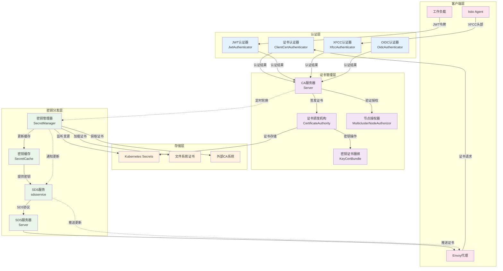
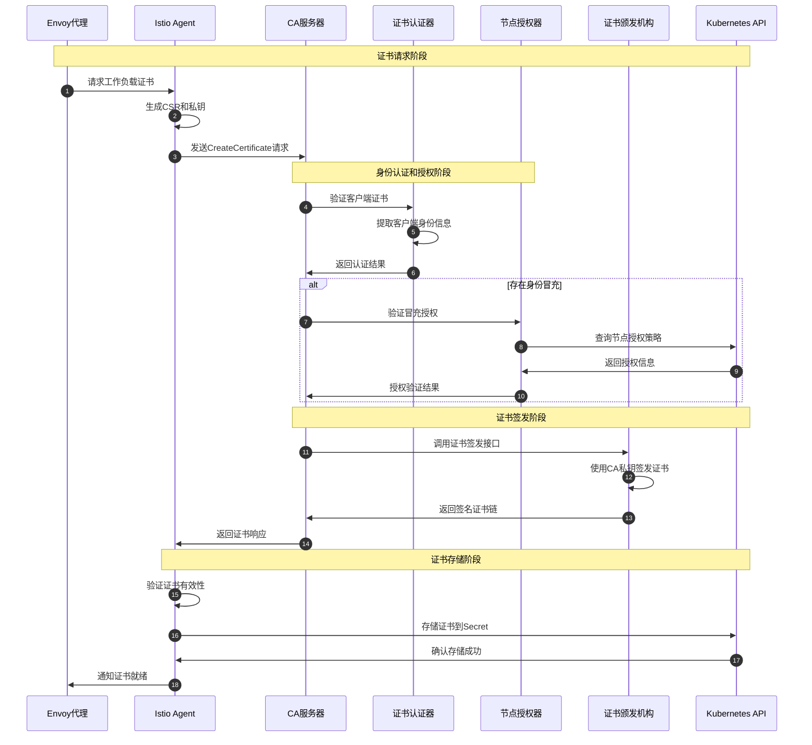
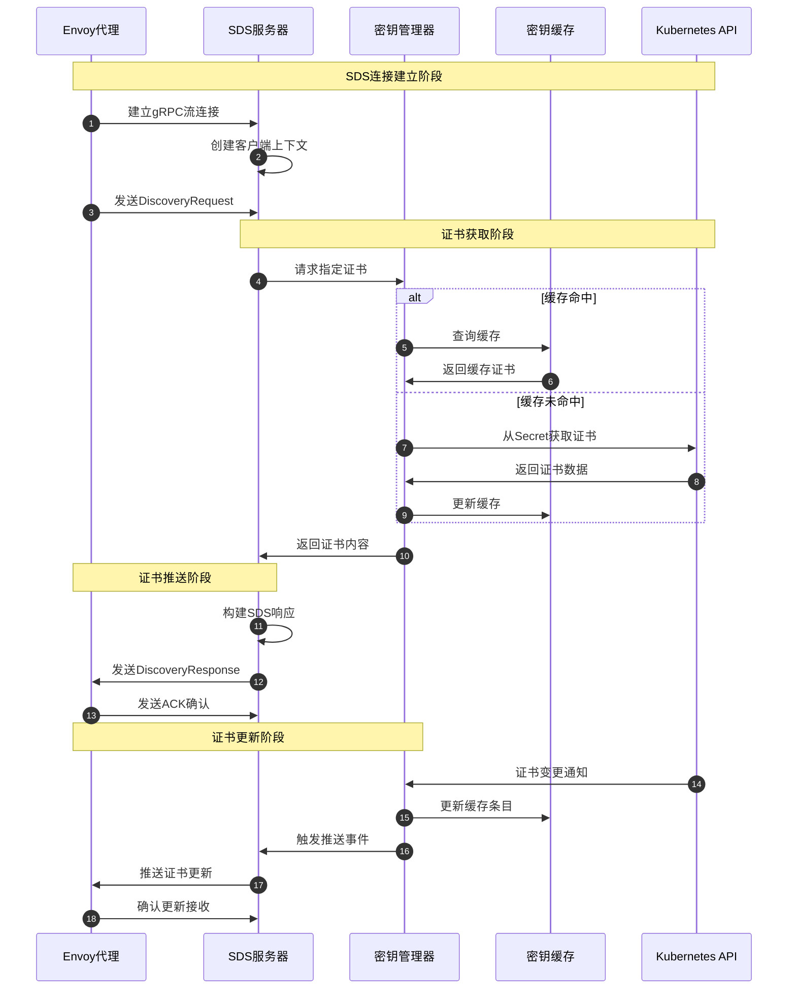

# Istio 源码剖析 - Security模块

## 模块概览

### 职责边界
Security模块是Istio安全体系的核心，承担以下关键职责：
- **证书管理**：充当证书颁发机构(CA)，为工作负载颁发和管理mTLS证书
- **身份认证**：支持多种认证机制，包括JWT、mTLS、XFCC等
- **证书分发**：通过SDS(Secret Discovery Service)协议动态分发证书到代理
- **授权控制**：基于身份和策略进行访问控制决策

### 输入输出
- **输入**：证书签名请求(CSR)、身份认证信息、安全策略配置
- **输出**：签名证书、根证书、SDS配置、授权决策

### 上下游依赖
- **上游依赖**：Kubernetes API、外部CA系统、密钥管理系统
- **下游消费者**：Envoy代理、应用程序、其他Istio组件
- **平行组件**：Pilot（策略配置）、Operator（部署管理）

### 生命周期
1. **初始化阶段**：生成或加载根证书、启动CA服务和SDS服务
2. **运行阶段**：处理证书请求、动态分发证书、执行证书轮换
3. **关闭阶段**：停止服务、清理证书缓存、保存状态信息

## 架构设计

### 模块架构图


#### 架构图说明

**图意概述**：该架构图展示了Istio Security模块的五层安全架构，从身份认证到证书分发的完整安全链路。

**关键组件功能**：
- **认证层**：支持多种认证机制，验证客户端身份的合法性
- **证书管理层**：核心CA功能，负责证书的签发、管理和授权控制
- **密钥分发层**：通过SDS协议实现证书的动态分发和更新
- **存储层**：支持多种证书存储方式，包括Kubernetes、文件系统和外部CA
- **客户端层**：证书的最终消费者，包括Envoy代理和应用程序

**边界与约束**：
- **并发处理**：CA服务器支持数千个并发证书请求
- **证书有效期**：默认证书有效期24小时，支持自定义配置
- **轮换策略**：证书在有效期50%时开始预轮换，确保连续性
- **存储一致性**：多副本环境下通过Kubernetes API确保证书一致性

**异常与回退**：
- **CA不可用**：使用本地缓存证书继续服务，降级到文件模式
- **网络分区**：SDS支持断线重连和证书重新获取
- **证书过期**：自动检测并触发证书更新，失败时告警

**性能与容量**：
- **签发性能**：单个CA实例支持1000+证书/秒的签发能力
- **分发效率**：SDS使用流式传输，支持增量证书更新
- **内存占用**：证书缓存采用LRU策略，控制内存使用

**版本兼容与演进**：
- **协议兼容**：同时支持SDS v2和v3协议版本
- **证书格式**：支持PKCS#1和PKCS#8私钥格式
- **算法升级**：支持RSA和ECDSA签名算法的平滑切换

## 核心API与数据结构

### CA服务器 - 证书颁发核心

#### 服务结构定义
```go
type Server struct {
    pb.UnimplementedIstioCertificateServiceServer
    monitoring     monitoringMetrics
    Authenticators []security.Authenticator
    ca             CertificateAuthority
    serverCertTTL  time.Duration
    nodeAuthorizer *MulticlusterNodeAuthorizor
}

type CertificateAuthority interface {
    Sign(csrPEM []byte, opts ca.CertOpts) ([]byte, error)
    SignWithCertChain(csrPEM []byte, opts ca.CertOpts) ([]string, error)
    GetCAKeyCertBundle() *util.KeyCertBundle
}
```

#### CreateCertificate API - 证书创建接口

```go
// 基本信息
// 名称: `CreateCertificate`
// 协议/方法: gRPC `IstioCertificateService.CreateCertificate`
// 幂等性: 否（每次调用生成不同的证书）

// 请求结构体
type IstioCertificateRequest struct {
    // 证书签名请求，PEM格式
    Csr string
    // 证书有效期（秒）
    ValidityDuration int64
    // 请求元数据，包含身份信息
    Metadata *google_protobuf.Struct
}
```

| 字段 | 类型 | 必填 | 默认 | 约束 | 说明 |
|------|------|------|------|------|------|
| Csr | string | 是 | - | PEM格式 | 证书签名请求，包含公钥和主体信息 |
| ValidityDuration | int64 | 否 | 86400 | 60-604800秒 | 证书有效期，默认24小时，最长7天 |
| Metadata | Struct | 否 | {} | 键值对 | 附加元数据，如身份冒充、签名者信息 |

```go
// 响应结构体
type IstioCertificateResponse struct {
    // 证书链，PEM格式数组
    CertChain []string
}
```

| 字段 | 类型 | 必填 | 默认 | 约束 | 说明 |
|------|------|------|------|------|------|
| CertChain | []string | 是 | - | PEM格式 | 完整证书链，叶子证书在前，根证书在后 |

#### 核心实现逻辑
```go
func (s *Server) CreateCertificate(ctx context.Context, request *pb.IstioCertificateRequest) (*pb.IstioCertificateResponse, error) {
    // 1) 客户端身份认证
    caller, err := security.Authenticate(ctx, s.Authenticators)
    if caller == nil || err != nil {
        s.monitoring.AuthnError.Increment()
        return nil, status.Error(codes.Unauthenticated, "request authenticate failure")
    }
    
    // 2) 处理身份冒充授权（如果存在）
    sans := caller.Identities
    impersonatedIdentity := request.Metadata.GetFields()[security.ImpersonatedIdentity].GetStringValue()
    if impersonatedIdentity != "" {
        if s.nodeAuthorizer == nil {
            return nil, status.Error(codes.Unauthenticated, "request impersonation authentication failure")
        }
        if err := s.nodeAuthorizer.authenticateImpersonation(ctx, caller.KubernetesInfo, impersonatedIdentity); err != nil {
            return nil, status.Error(codes.Unauthenticated, "request impersonation authentication failure")
        }
        sans = []string{impersonatedIdentity}
    }
    
    // 3) 构建证书选项
    certOpts := ca.CertOpts{
        SubjectIDs: sans,
        TTL:        time.Duration(request.ValidityDuration) * time.Second,
        ForCA:      false,
        CertSigner: request.Metadata.GetFields()[security.CertSigner].GetStringValue(),
    }
    
    // 4) 签发证书
    var signErr error
    var respCertChain []string
    if certOpts.CertSigner == "" {
        cert, signErr := s.ca.Sign([]byte(request.Csr), certOpts)
        if signErr == nil {
            respCertChain = []string{string(cert)}
        }
    } else {
        respCertChain, signErr = s.ca.SignWithCertChain([]byte(request.Csr), certOpts)
    }
    
    if signErr != nil {
        return nil, status.Errorf(signErr.(*caerror.Error).HTTPErrorCode(), "CSR signing error (%v)", signErr.(*caerror.Error))
    }
    
    // 5) 构建响应，扁平化证书链
    response := &pb.IstioCertificateResponse{}
    for _, pem := range respCertChain {
        for _, cert := range util.PemCertBytestoString([]byte(pem)) {
            response.CertChain = append(response.CertChain, cert+"\n")
        }
    }
    
    return response, nil
}
```

### SDS服务 - 证书动态分发

#### SDS服务结构
```go
type sdsservice struct {
    st security.SecretManager
    stop       chan struct{}
    rootCaPath string
    pkpConf    *mesh.PrivateKeyProvider
    sync.Mutex
    clients    map[string]*Context
}

type Context struct {
    BaseConnection xds.Connection
    s              *sdsservice
    w              *Watch
}
```

#### StreamSecrets API - 证书流式分发

```go
// 基本信息
// 名称: `StreamSecrets`
// 协议/方法: gRPC Stream `SecretDiscoveryService.StreamSecrets`
// 幂等性: 是（相同请求返回相同证书）

// 请求处理核心逻辑
func (c *Context) Process(req *discovery.DiscoveryRequest) error {
    // 1) 判断是否需要响应
    shouldRespond, delta := xds.ShouldRespond(c.Watcher(), c.XdsConnection().ID(), req)
    if !shouldRespond {
        return nil
    }
    
    // 2) 确定需要生成的资源
    resources := req.ResourceNames
    if !delta.IsEmpty() {
        resources = delta.Subscribed.UnsortedList()
    }
    
    // 3) 生成SDS响应
    res, err := c.s.generate(resources)
    if err != nil {
        return err
    }
    
    // 4) 发送给客户端
    return xds.Send(c, res)
}

// 主动推送更新
func (c *Context) Push(ev any) error {
    secretName := ev.(string)
    
    // 检查客户端是否订阅了该证书
    if !c.w.requested(secretName) {
        return nil
    }
    
    // 生成并推送证书更新
    res, err := c.s.generate([]string{secretName})
    if err != nil {
        return err
    }
    return xds.Send(c, res)
}
```

### 认证器架构 - 多种认证方式

#### 认证器接口定义
```go
type Authenticator interface {
    AuthenticatorType() string
    Authenticate(authCtx AuthContext) (*Caller, error)
}

type Caller struct {
    Identities        []string
    KubernetesInfo    KubernetesInfo  
    CredentialType    string
}
```

#### 客户端证书认证器
```go
type ClientCertAuthenticator struct{}

func (cca *ClientCertAuthenticator) Authenticate(authCtx security.AuthContext) (*security.Caller, error) {
    if authCtx.GrpcContext != nil {
        return cca.authenticateGrpc(authCtx.GrpcContext)
    }
    if authCtx.Request != nil {
        return cca.authenticateHTTP(authCtx.Request)
    }
    return nil, nil
}

func (cca *ClientCertAuthenticator) authenticateGrpc(ctx context.Context) (*security.Caller, error) {
    peer, ok := peer.FromContext(ctx)
    if !ok {
        return nil, fmt.Errorf("no peer info")
    }
    
    if tlsInfo, ok := peer.AuthInfo.(credentials.TLSInfo); ok {
        // 验证证书链和提取身份信息
        chains := tlsInfo.State.VerifiedChains
        if len(chains) == 0 || len(chains[0]) == 0 {
            return nil, fmt.Errorf("no verified chain")
        }
        
        cert := chains[0][0]
        caller := &security.Caller{
            Identities: util.ExtractIDsFromCert(cert),
            CredentialType: "mtls",
        }
        
        return caller, nil
    }
    
    return nil, fmt.Errorf("no TLS info")
}
```

## 时序图分析

### 证书签发完整流程


#### 时序图说明

**图意概述**：该时序图展示了Istio中一个完整的工作负载证书签发流程，包括身份认证、授权验证、证书签发和存储的全过程。

**关键交互环节**：
1. **证书请求**（步骤1-3）：Envoy代理通过Istio Agent生成CSR并向CA服务器请求证书
2. **身份认证授权**（步骤4-10）：CA服务器验证客户端身份，如有身份冒充则进行额外授权检查
3. **证书签发**（步骤11-14）：CA使用根证书私钥为CSR签发新证书
4. **证书存储**（步骤15-18）：Agent验证证书并存储到Kubernetes，通知Envoy证书就绪

**边界与约束**：
- **认证强度**：要求客户端提供有效的mTLS证书或JWT令牌
- **授权粒度**：支持命名空间和服务账户级别的精细授权控制
- **证书有效期**：默认24小时，支持1分钟到7天的自定义范围
- **并发限制**：单个CA实例支持1000个并发请求

**异常与回退**：
- **认证失败**：返回401未授权错误，客户端需要重新获取有效凭证
- **授权拒绝**：记录审计日志，返回403禁止访问错误
- **签发失败**：根据错误类型返回相应的HTTP状态码和错误信息
- **网络异常**：客户端实现指数退避重试机制

**性能与容量**：
- **签发延迟**：正常情况下单次证书签发延迟<100ms
- **吞吐能力**：单CA实例支持1000+证书/秒的签发能力
- **缓存优化**：对频繁请求的证书进行缓存，提高响应速度

**版本兼容与演进**：
- **协议版本**：支持向前兼容的gRPC协议演进
- **证书格式**：支持X.509v3标准，兼容不同密钥算法
- **API演进**：通过字段标记实现平滑的API升级

### SDS证书分发流程


## 关键算法与实现

### 证书自动轮换算法
证书的自动轮换是Security模块的核心功能，确保证书在过期前及时更新。

#### 轮换触发策略
```go
func (sc *SecretCache) shouldRefresh(certItem *SecretItem) bool {
    // 获取证书过期时间
    cert, err := parseWorkloadCertificate(certItem.CertificateChain)
    if err != nil {
        return true // 解析失败，强制刷新
    }
    
    now := time.Now()
    // 证书在有效期50%时开始预轮换
    threshold := cert.NotBefore.Add(cert.NotAfter.Sub(cert.NotBefore) / 2)
    
    // 添加随机抖动，避免同时轮换
    jitter := time.Duration(rand.Int63n(int64(time.Hour)))
    return now.After(threshold.Add(-jitter))
}

// 证书轮换调度器
func (sc *SecretCache) startCertRotationScheduler() {
    ticker := time.NewTicker(10 * time.Minute) // 每10分钟检查一次
    defer ticker.Stop()
    
    for {
        select {
        case <-ticker.C:
            sc.rotateExpiredCertificates()
        case <-sc.stopCh:
            return
        }
    }
}

func (sc *SecretCache) rotateExpiredCertificates() {
    sc.mu.RLock()
    itemsToRotate := make([]*SecretItem, 0)
    
    for _, item := range sc.cache {
        if sc.shouldRefresh(item) {
            itemsToRotate = append(itemsToRotate, item)
        }
    }
    sc.mu.RUnlock()
    
    // 并发轮换多个证书
    var wg sync.WaitGroup
    semaphore := make(chan struct{}, 10) // 限制并发数
    
    for _, item := range itemsToRotate {
        wg.Add(1)
        go func(secretName string) {
            defer wg.Done()
            semaphore <- struct{}{}
            defer func() { <-semaphore }()
            
            // 重新生成证书
            sc.GenerateSecret(secretName)
        }(item.ResourceName)
    }
    
    wg.Wait()
}
```

### SDS增量更新算法
SDS服务支持增量更新，只推送变更的证书，提高分发效率。

#### 增量差异计算
```go
func (s *sdsservice) calculateDelta(clientState map[string]string, currentSecrets map[string]*SecretItem) (*DeltaUpdate, error) {
    delta := &DeltaUpdate{
        Updated: make(map[string]*SecretItem),
        Deleted: make([]string, 0),
    }
    
    // 检查更新和新增的证书
    for name, secret := range currentSecrets {
        clientVersion, exists := clientState[name]
        if !exists || clientVersion != secret.Version {
            delta.Updated[name] = secret
        }
    }
    
    // 检查已删除的证书
    for name := range clientState {
        if _, exists := currentSecrets[name]; !exists {
            delta.Deleted = append(delta.Deleted, name)
        }
    }
    
    return delta, nil
}

// 增量推送实现
func (s *sdsservice) pushDeltaUpdate(ctx *Context, delta *DeltaUpdate) error {
    resources := make([]*any.Any, 0, len(delta.Updated))
    removedResources := delta.Deleted
    
    // 构建更新的资源
    for name, secret := range delta.Updated {
        tlsSecret := &tls.Secret{
            Name: name,
            Type: &tls.Secret_TlsCertificate{
                TlsCertificate: &tls.TlsCertificate{
                    CertificateChain: &core.DataSource{
                        Specifier: &core.DataSource_InlineBytes{
                            InlineBytes: secret.CertificateChain,
                        },
                    },
                    PrivateKey: &core.DataSource{
                        Specifier: &core.DataSource_InlineBytes{
                            InlineBytes: secret.PrivateKey,
                        },
                    },
                },
            },
        }
        
        resource, _ := anypb.New(tlsSecret)
        resources = append(resources, resource)
    }
    
    // 发送增量响应
    response := &discovery.DeltaDiscoveryResponse{
        SystemVersionInfo: version.GetString(),
        Resources:         resources, 
        RemovedResources:  removedResources,
        TypeUrl:          SecretTypeURL,
        Nonce:            generateNonce(),
    }
    
    return ctx.SendDelta(response)
}
```

### 多集群证书同步算法
在多集群环境中，需要确保证书在各个集群间的一致性和可用性。

#### 跨集群证书同步
```go
type MultiClusterCertSync struct {
    clusters       map[string]*ClusterClient
    syncInterval   time.Duration
    conflictResolver CertConflictResolver
}

func (mcs *MultiClusterCertSync) syncCertificatesAcrossClusters() {
    ticker := time.NewTicker(mcs.syncInterval)
    defer ticker.Stop()
    
    for {
        select {
        case <-ticker.C:
            mcs.performSync()
        }
    }
}

func (mcs *MultiClusterCertSync) performSync() {
    // 1) 收集所有集群的证书状态
    clusterStates := make(map[string]map[string]*CertInfo)
    
    for clusterID, client := range mcs.clusters {
        certs, err := client.ListCertificates()
        if err != nil {
            log.Warnf("无法获取集群 %s 的证书: %v", clusterID, err)
            continue
        }
        clusterStates[clusterID] = certs
    }
    
    // 2) 计算需要同步的证书
    syncPlan := mcs.calculateSyncPlan(clusterStates)
    
    // 3) 执行同步操作
    mcs.executeSyncPlan(syncPlan)
}

func (mcs *MultiClusterCertSync) calculateSyncPlan(states map[string]map[string]*CertInfo) *SyncPlan {
    plan := &SyncPlan{
        Create: make(map[string]map[string]*CertInfo),
        Update: make(map[string]map[string]*CertInfo),
        Delete: make(map[string][]string),
    }
    
    // 找到全局最新版本的证书
    globalLatest := make(map[string]*CertInfo)
    for _, clusterCerts := range states {
        for certName, certInfo := range clusterCerts {
            if existing, exists := globalLatest[certName]; !exists || certInfo.Version > existing.Version {
                globalLatest[certName] = certInfo
            }
        }
    }
    
    // 为每个集群计算需要的操作
    for clusterID, clusterCerts := range states {
        plan.Create[clusterID] = make(map[string]*CertInfo)
        plan.Update[clusterID] = make(map[string]*CertInfo)
        
        for certName, latestCert := range globalLatest {
            if clusterCert, exists := clusterCerts[certName]; exists {
                if clusterCert.Version < latestCert.Version {
                    plan.Update[clusterID][certName] = latestCert
                }
            } else {
                plan.Create[clusterID][certName] = latestCert
            }
        }
        
        // 检查需要删除的证书
        for certName := range clusterCerts {
            if _, exists := globalLatest[certName]; !exists {
                plan.Delete[clusterID] = append(plan.Delete[clusterID], certName)
            }
        }
    }
    
    return plan
}
```

## 框架使用示例与最佳实践

### 自定义认证器实现
在特殊场景下，可能需要实现自定义的身份认证机制：

```go
// 自定义API密钥认证器
type APIKeyAuthenticator struct {
    validKeys map[string]*KeyInfo
    mutex     sync.RWMutex
}

type KeyInfo struct {
    Identity   string
    Namespace  string
    Expiry     time.Time
    Scopes     []string
}

func (aka *APIKeyAuthenticator) AuthenticatorType() string {
    return "APIKeyAuthenticator"
}

func (aka *APIKeyAuthenticator) Authenticate(authCtx security.AuthContext) (*security.Caller, error) {
    var apiKey string
    
    // 从gRPC元数据中提取API密钥
    if authCtx.GrpcContext != nil {
        if md, ok := metadata.FromIncomingContext(authCtx.GrpcContext); ok {
            if keys := md.Get("x-api-key"); len(keys) > 0 {
                apiKey = keys[0]
            }
        }
    }
    
    // 从HTTP头部中提取API密钥
    if authCtx.Request != nil {
        apiKey = authCtx.Request.Header.Get("X-API-Key")
    }
    
    if apiKey == "" {
        return nil, fmt.Errorf("missing API key")
    }
    
    // 验证API密钥
    aka.mutex.RLock()
    keyInfo, exists := aka.validKeys[apiKey]
    aka.mutex.RUnlock()
    
    if !exists {
        return nil, fmt.Errorf("invalid API key")
    }
    
    // 检查密钥是否过期
    if time.Now().After(keyInfo.Expiry) {
        return nil, fmt.Errorf("API key expired")
    }
    
    return &security.Caller{
        Identities: []string{keyInfo.Identity},
        KubernetesInfo: security.KubernetesInfo{
            Namespace: keyInfo.Namespace,
        },
        CredentialType: "api-key",
    }, nil
}

// 注册自定义认证器
func setupCustomAuthentication(caServer *ca.Server) {
    apiKeyAuth := &APIKeyAuthenticator{
        validKeys: loadAPIKeysFromConfig(),
    }
    
    // 将自定义认证器添加到CA服务器
    caServer.Authenticators = append(caServer.Authenticators, apiKeyAuth)
    
    // 定期刷新API密钥配置
    go func() {
        ticker := time.NewTicker(5 * time.Minute)
        defer ticker.Stop()
        
        for range ticker.C {
            newKeys := loadAPIKeysFromConfig()
            apiKeyAuth.mutex.Lock()
            apiKeyAuth.validKeys = newKeys
            apiKeyAuth.mutex.Unlock()
        }
    }()
}
```

### 证书监控和告警
在生产环境中，需要对证书的健康状况进行监控和告警：

```go
// 证书健康检查器
type CertificateHealthChecker struct {
    secretManager security.SecretManager
    alertManager  AlertManager
    checkInterval time.Duration
}

func (chc *CertificateHealthChecker) StartMonitoring() {
    ticker := time.NewTicker(chc.checkInterval)
    defer ticker.Stop()
    
    for range ticker.C {
        chc.checkCertificateHealth()
    }
}

func (chc *CertificateHealthChecker) checkCertificateHealth() {
    // 检查工作负载证书
    workloadCert, err := chc.secretManager.GenerateSecret(security.WorkloadKeyCertResourceName)
    if err != nil {
        chc.alertManager.SendAlert(&Alert{
            Level:   "critical",
            Message: fmt.Sprintf("工作负载证书获取失败: %v", err),
            Type:    "certificate_error",
        })
        return
    }
    
    // 解析证书并检查有效期
    cert, err := parseWorkloadCertificate(workloadCert.CertificateChain)
    if err != nil {
        chc.alertManager.SendAlert(&Alert{
            Level:   "critical", 
            Message: fmt.Sprintf("证书解析失败: %v", err),
            Type:    "certificate_parse_error",
        })
        return
    }
    
    // 检查证书即将过期
    now := time.Now()
    timeToExpiry := cert.NotAfter.Sub(now)
    
    if timeToExpiry < 24*time.Hour {
        chc.alertManager.SendAlert(&Alert{
            Level:   "warning",
            Message: fmt.Sprintf("证书将在 %v 后过期", timeToExpiry),
            Type:    "certificate_expiring",
        })
    }
    
    // 检查根证书
    rootCert, err := chc.secretManager.GenerateSecret(security.RootCertReqResourceName)
    if err != nil {
        chc.alertManager.SendAlert(&Alert{
            Level:   "critical",
            Message: fmt.Sprintf("根证书获取失败: %v", err),
            Type:    "root_certificate_error", 
        })
    }
    
    // 记录健康指标
    certExpiryGauge.With(prometheus.Labels{
        "cert_type": "workload",
    }).Set(timeToExpiry.Seconds())
}

// Prometheus指标定义
var (
    certExpiryGauge = prometheus.NewGaugeVec(
        prometheus.GaugeOpts{
            Name: "istio_cert_expiry_seconds",
            Help: "证书剩余有效时间（秒）",
        },
        []string{"cert_type"},
    )
    
    certRotationCounter = prometheus.NewCounterVec(
        prometheus.CounterOpts{
            Name: "istio_cert_rotations_total", 
            Help: "证书轮换总次数",
        },
        []string{"cert_type", "status"},
    )
)
```

### 高可用CA部署
在生产环境中，CA服务需要实现高可用部署：

```go
// 高可用CA管理器
type HACAManager struct {
    nodes        []CANode
    leader       *CANode
    leaderElection *LeaderElection
    healthChecker *HealthChecker
}

type CANode struct {
    ID       string
    Address  string
    IsLeader bool
    IsHealthy bool
    LastSeen time.Time
}

func (ha *HACAManager) Start() error {
    // 1) 启动健康检查
    go ha.healthChecker.Start()
    
    // 2) 启动领导者选举
    go ha.leaderElection.Start()
    
    // 3) 监听角色变更
    go ha.handleRoleChanges()
    
    return nil
}

func (ha *HACAManager) handleRoleChanges() {
    for event := range ha.leaderElection.Events() {
        switch event.Type {
        case "leader_elected":
            ha.becomeLeader(event.NodeID)
        case "leader_lost":
            ha.becomeFollower()
        case "node_failed":
            ha.handleNodeFailure(event.NodeID)
        }
    }
}

func (ha *HACAManager) becomeLeader(nodeID string) {
    log.Infof("节点 %s 成为CA领导者", nodeID)
    
    if nodeID == ha.getCurrentNodeID() {
        // 当前节点成为领导者
        ha.startCAServices()
        
        // 同步其他节点的状态
        go ha.syncFollowerNodes()
    } else {
        // 其他节点成为领导者，当前节点转为跟随者
        ha.stopCAServices()
        ha.leader = ha.findNodeByID(nodeID)
    }
}

func (ha *HACAManager) startCAServices() {
    // 启动CA服务器
    go func() {
        caServer := ca.NewServer(/* 配置参数 */)
        if err := caServer.Start(); err != nil {
            log.Errorf("CA服务启动失败: %v", err)
        }
    }()
    
    // 启动SDS服务器  
    go func() {
        sdsServer := sds.NewServer(/* 配置参数 */)
        if err := sdsServer.Start(); err != nil {
            log.Errorf("SDS服务启动失败: %v", err)
        }
    }()
}

// 证书状态同步
func (ha *HACAManager) syncCertificateState() {
    if !ha.isLeader() {
        return
    }
    
    // 同步证书到所有跟随者节点
    for _, node := range ha.nodes {
        if node.ID == ha.getCurrentNodeID() || !node.IsHealthy {
            continue
        }
        
        go func(targetNode CANode) {
            client := ha.createNodeClient(targetNode)
            defer client.Close()
            
            // 获取本地证书列表
            localCerts := ha.getLocalCertificates()
            
            // 同步到目标节点
            for _, cert := range localCerts {
                if err := client.SyncCertificate(cert); err != nil {
                    log.Warnf("向节点 %s 同步证书失败: %v", targetNode.ID, err)
                }
            }
        }(node)
    }
}
```

## 具体案例：零信任网络安全实现

在零信任网络架构中，每个服务间的通信都需要进行身份验证和授权：

```go
// 零信任策略执行器
type ZeroTrustPolicyEnforcer struct {
    ca            *ca.Server
    policyStore   PolicyStore
    metricsCollector MetricsCollector
}

func (zte *ZeroTrustPolicyEnforcer) EnforceCertificatePolicy(ctx context.Context, request *pb.IstioCertificateRequest) (*pb.IstioCertificateResponse, error) {
    // 1) 提取请求者身份
    caller, err := security.Authenticate(ctx, zte.ca.Authenticators)
    if err != nil {
        zte.metricsCollector.RecordAuthFailure("authentication", err.Error())
        return nil, status.Error(codes.Unauthenticated, "authentication failed")
    }
    
    // 2) 获取适用的零信任策略
    policies := zte.policyStore.GetPoliciesForIdentity(caller.Identities[0])
    
    // 3) 验证请求是否符合策略
    for _, policy := range policies {
        if err := zte.validateAgainstPolicy(request, caller, policy); err != nil {
            zte.metricsCollector.RecordAuthFailure("policy_violation", err.Error())
            return nil, status.Error(codes.PermissionDenied, err.Error())
        }
    }
    
    // 4) 动态调整证书属性
    adjustedRequest := zte.adjustCertificateRequest(request, policies)
    
    // 5) 调用原始证书创建逻辑
    response, err := zte.ca.CreateCertificate(ctx, adjustedRequest)
    if err != nil {
        return nil, err
    }
    
    // 6) 记录审计日志
    zte.auditCertificateIssuance(caller, adjustedRequest, response)
    
    return response, nil
}

func (zte *ZeroTrustPolicyEnforcer) validateAgainstPolicy(request *pb.IstioCertificateRequest, caller *security.Caller, policy *ZeroTrustPolicy) error {
    // 验证时间窗口
    if policy.TimeRestrictions != nil {
        now := time.Now()
        if now.Before(policy.TimeRestrictions.NotBefore) || now.After(policy.TimeRestrictions.NotAfter) {
            return fmt.Errorf("请求超出允许的时间窗口")
        }
    }
    
    // 验证证书有效期限制
    maxTTL := time.Duration(policy.MaxCertificateTTL) * time.Second
    requestedTTL := time.Duration(request.ValidityDuration) * time.Second
    if requestedTTL > maxTTL {
        return fmt.Errorf("请求的证书有效期 %v 超过策略允许的最大值 %v", requestedTTL, maxTTL)
    }
    
    // 验证请求频率限制
    if policy.RateLimit != nil {
        key := fmt.Sprintf("cert_requests:%s", caller.Identities[0])
        if !zte.checkRateLimit(key, policy.RateLimit) {
            return fmt.Errorf("请求频率超过限制")
        }
    }
    
    // 验证网络位置限制
    if policy.NetworkRestrictions != nil {
        clientIP := security.GetConnectionAddress(context.Background()) // 简化实现
        if !zte.isAllowedNetwork(clientIP, policy.NetworkRestrictions) {
            return fmt.Errorf("请求来源网络不在允许范围内")
        }
    }
    
    return nil
}

// 证书使用监控
func (zte *ZeroTrustPolicyEnforcer) monitorCertificateUsage() {
    // 定期检查证书使用情况
    ticker := time.NewTicker(1 * time.Hour)
    defer ticker.Stop()
    
    for range ticker.C {
        // 分析证书使用模式
        usagePatterns := zte.analyzeCertificateUsage()
        
        // 检测异常使用模式
        for identity, pattern := range usagePatterns {
            if zte.isAnomalousUsage(pattern) {
                alert := &SecurityAlert{
                    Level:     "high",
                    Type:      "anomalous_certificate_usage",
                    Identity:  identity,
                    Details:   pattern,
                    Timestamp: time.Now(),
                }
                zte.sendSecurityAlert(alert)
            }
        }
        
        // 更新风险评分
        zte.updateRiskScores(usagePatterns)
    }
}
```

这种零信任实现提供了：
- **身份验证**：每个请求都需要验证身份
- **策略执行**：基于身份和上下文的动态策略
- **审计追踪**：完整的证书颁发和使用审计
- **异常检测**：基于行为分析的安全监控
- **风险评估**：动态的安全风险评分机制

## 总结

Security模块作为Istio安全体系的基础，通过精心设计的架构和算法，实现了企业级的证书管理和身份认证能力。其关键特点包括：

1. **多层安全架构**：从认证到授权再到证书分发的完整安全链路
2. **灵活认证机制**：支持mTLS、JWT、OIDC等多种认证方式的组合使用
3. **自动化运维**：证书自动轮换和健康监控，降低运维复杂度
4. **高可用设计**：支持CA服务的高可用部署和故障转移
5. **零信任支持**：完整的审计和策略执行能力，支持零信任网络架构

通过深入理解Security模块的设计和实现，可以更好地运维和扩展Istio的安全能力，同时为构建企业级的零信任安全架构提供坚实的基础。
