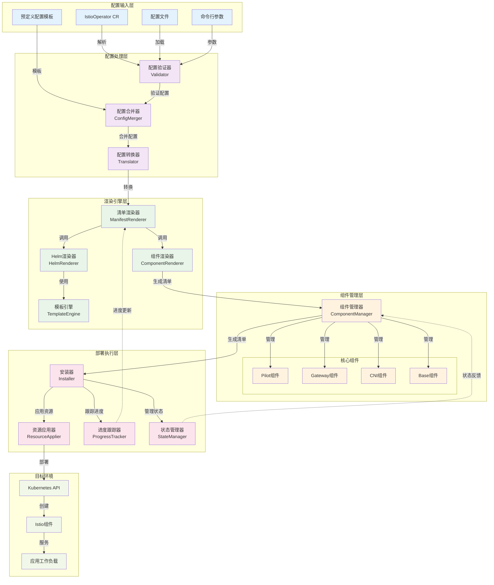
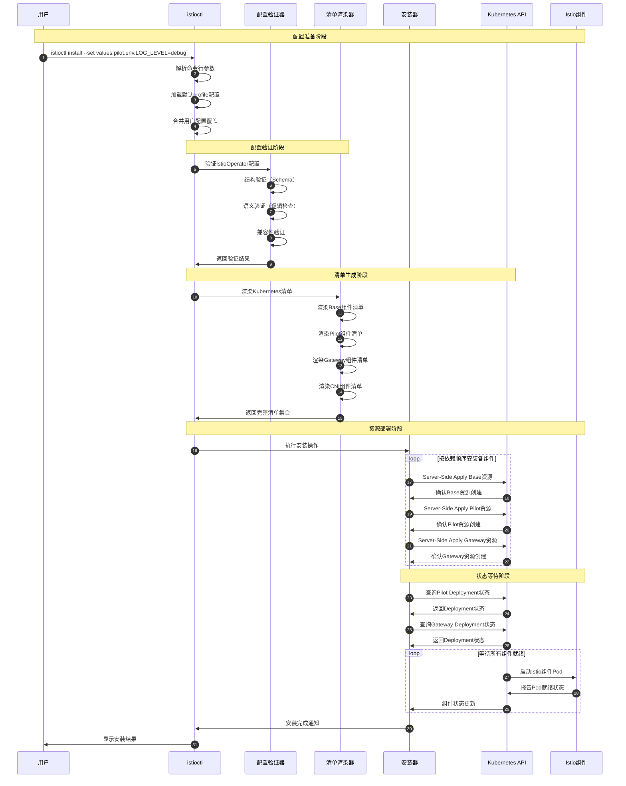
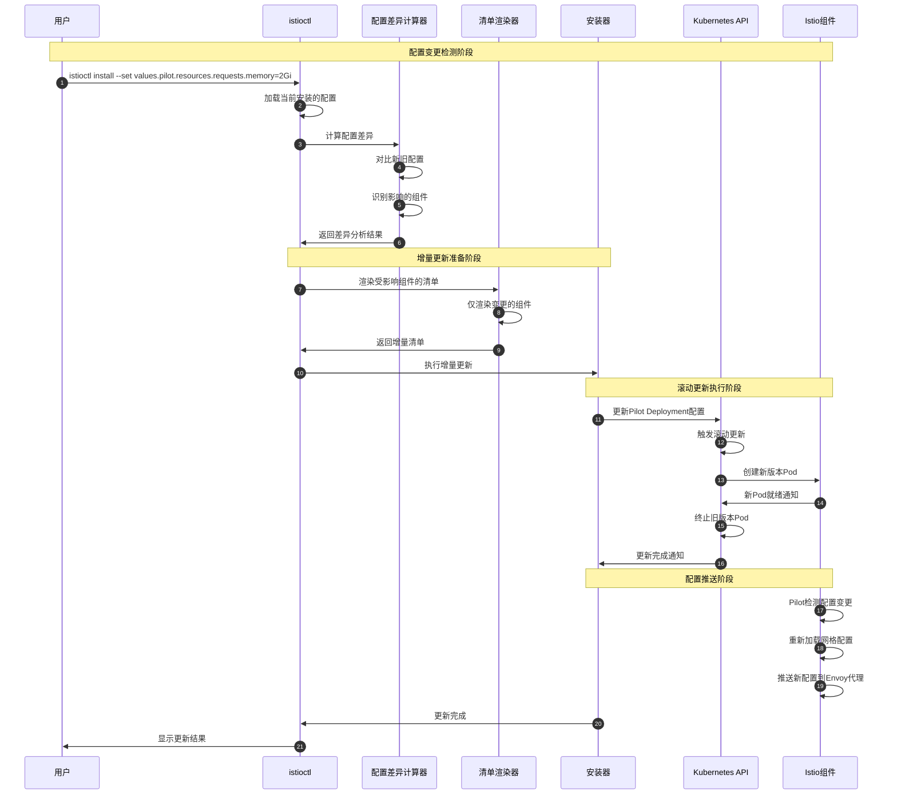

# Istio 源码剖析 - Operator模块

## 模块概览

### 职责边界
Operator模块是Istio的运维管理核心，承担以下关键职责：
- **安装管理**：通过声明式API管理Istio组件的安装和卸载
- **配置渲染**：将IstioOperator配置转换为Kubernetes资源清单
- **组件协调**：管理Pilot、Gateway、CNI等组件的生命周期
- **版本升级**：支持Istio版本的平滑升级和回滚操作

### 输入输出
- **输入**：IstioOperator CR、配置文件、Helm values、命令行参数
- **输出**：Kubernetes资源清单、组件状态、安装进度、错误诊断信息

### 上下游依赖
- **上游依赖**：Kubernetes API Server、Helm模板引擎、配置验证器
- **下游消费者**：Kubernetes集群、Istio组件、运维人员
- **平行组件**：istioctl（CLI工具）、监控系统

### 生命周期
1. **配置解析阶段**：解析IstioOperator配置，进行验证和标准化
2. **清单生成阶段**：基于配置渲染Kubernetes资源清单
3. **资源应用阶段**：通过Server-Side Apply部署资源到集群
4. **状态监控阶段**：监控组件状态，处理异常和故障恢复

## 架构设计

### 模块架构图


#### 架构图说明

**图意概述**：该架构图展示了Istio Operator模块的六层架构设计，从配置输入到最终部署的完整流程。

**关键组件功能**：
- **配置输入层**：支持多种配置来源，包括CR、文件、命令行和预定义模板
- **配置处理层**：进行配置验证、合并和转换，确保配置的完整性和正确性
- **渲染引擎层**：将配置转换为Kubernetes资源清单，支持Helm模板渲染
- **组件管理层**：管理各个Istio组件的生命周期和依赖关系
- **部署执行层**：负责资源的实际部署、状态跟踪和进度管理
- **目标环境**：最终的Kubernetes集群和Istio组件

**边界与约束**：
- **配置一致性**：通过多阶段验证确保配置的语法和语义正确性
- **资源管理**：使用Server-Side Apply确保资源的幂等性和一致性
- **版本兼容**：支持多版本Istio的并存和平滑升级
- **回滚能力**：支持配置变更的快速回滚和故障恢复

**异常与回退**：
- **配置错误**：在验证阶段捕获配置错误，提供详细的错误信息
- **部署失败**：支持部分组件失败时的状态恢复和重试机制
- **资源冲突**：通过标签和字段管理器解决资源冲突问题
- **网络异常**：实现断点续传和增量更新机制

**性能与容量**：
- **渲染效率**：使用缓存和增量渲染提高大规模部署的性能
- **并发处理**：支持多组件的并行安装和更新
- **资源占用**：优化内存使用，支持大规模集群的管理

**版本兼容与演进**：
- **API版本管理**：支持多版本IstioOperator API的兼容性
- **组件演进**：通过组件接口抽象支持新组件的扩展
- **配置迁移**：提供配置格式的自动迁移和升级工具

## 核心API与数据结构

### IstioOperator - 核心配置资源

#### 资源定义结构
```go
type IstioOperator struct {
    metav1.TypeMeta   `json:",inline"`
    metav1.ObjectMeta `json:"metadata,omitempty"`
    Spec              IstioOperatorSpec `json:"spec,omitempty"`
}

type IstioOperatorSpec struct {
    // 配置模板名称（如default、minimal、demo等）
    Profile string `json:"profile,omitempty"`
    
    // 镜像仓库根路径
    Hub string `json:"hub,omitempty"`
    
    // 镜像标签版本
    Tag any `json:"tag,omitempty"`
    
    // 安装命名空间
    Namespace string `json:"namespace,omitempty"`
    
    // 修订版本标识
    Revision string `json:"revision,omitempty"`
    
    // 兼容性版本
    CompatibilityVersion string `json:"compatibilityVersion,omitempty"`
    
    // 网格配置
    MeshConfig json.RawMessage `json:"meshConfig,omitempty"`
    
    // 组件配置
    Components *IstioComponentSpec `json:"components,omitempty"`
    
    // Helm values覆盖
    Values json.RawMessage `json:"values,omitempty"`
}
```

| 字段 | 类型 | 必填 | 默认 | 约束 | 说明 |
|------|------|------|------|------|------|
| Profile | string | 否 | "default" | 预定义模板名 | 基础配置模板，如minimal、default、demo |
| Hub | string | 否 | "docker.io/istio" | 镜像仓库地址 | 容器镜像的仓库根路径 |
| Tag | any | 否 | 当前版本 | 版本标签 | 镜像标签，支持字符串和数字 |
| Namespace | string | 否 | "istio-system" | 命名空间名称 | 控制平面安装的目标命名空间 |
| Revision | string | 否 | "" | 版本标识符 | 用于多版本共存的修订标识 |
| Components | *IstioComponentSpec | 否 | nil | 组件配置对象 | 各组件的详细配置 |

#### IstioComponentSpec - 组件配置规范
```go
type IstioComponentSpec struct {
    // 基础组件（CRD、RBAC等）
    Base *BaseComponentSpec `json:"base,omitempty"`
    
    // Pilot组件配置
    Pilot *ComponentSpec `json:"pilot,omitempty"`
    
    // 代理配置
    Proxy *ProxyComponentSpec `json:"proxy,omitempty"`
    
    // 入口网关配置
    IngressGateways []*GatewaySpec `json:"ingressGateways,omitempty"`
    
    // 出口网关配置
    EgressGateways []*GatewaySpec `json:"egressGateways,omitempty"`
    
    // CNI组件配置
    Cni *ComponentSpec `json:"cni,omitempty"`
    
    // Ztunnel组件配置
    Ztunnel *ComponentSpec `json:"ztunnel,omitempty"`
}
```

### 配置验证API - Validator接口

#### 验证器结构
```go
type Validator struct {
    schemaValidator *SchemaValidator
    semanticValidator *SemanticValidator
    warningHandler WarningHandler
}

// 验证IstioOperator配置
func (v *Validator) ValidateConfig(iop *IstioOperator) error {
    // 1) 结构验证 - 检查字段类型和格式
    if err := v.schemaValidator.Validate(iop); err != nil {
        return fmt.Errorf("配置结构验证失败: %v", err)
    }
    
    // 2) 语义验证 - 检查配置逻辑合理性
    if err := v.semanticValidator.Validate(iop); err != nil {
        return fmt.Errorf("配置语义验证失败: %v", err)
    }
    
    // 3) 兼容性检查 - 验证版本兼容性
    if err := v.validateCompatibility(iop); err != nil {
        return fmt.Errorf("兼容性验证失败: %v", err)
    }
    
    return nil
}

// 语义验证核心逻辑
func (sv *SemanticValidator) validateComponent(component *ComponentSpec) error {
    // 验证资源限制合理性
    if component.K8s != nil && component.K8s.Resources != nil {
        if err := sv.validateResourceRequirements(component.K8s.Resources); err != nil {
            return err
        }
    }
    
    // 验证副本数配置
    if component.K8s != nil && component.K8s.ReplicaCount != nil {
        if *component.K8s.ReplicaCount < 0 {
            return fmt.Errorf("副本数不能为负数")
        }
    }
    
    // 验证环境变量配置
    if component.K8s != nil {
        for _, env := range component.K8s.Env {
            if env.Name == "" {
                return fmt.Errorf("环境变量名称不能为空")
            }
        }
    }
    
    return nil
}
```

### 清单渲染API - ManifestRenderer

#### 渲染器实现
```go
type ManifestRenderer struct {
    helmRenderer      *HelmRenderer
    componentRenderer *ComponentRenderer
    templateCache     map[string]*template.Template
    mutex            sync.RWMutex
}

// 渲染配置为Kubernetes清单
func (mr *ManifestRenderer) RenderManifest(iop *IstioOperator) (*ManifestSet, error) {
    manifestSet := &ManifestSet{
        Manifests: make(map[ComponentName][]Manifest),
    }
    
    // 1) 渲染基础组件
    baseManifests, err := mr.renderBaseComponent(iop)
    if err != nil {
        return nil, fmt.Errorf("渲染基础组件失败: %v", err)
    }
    manifestSet.Manifests[ComponentNameBase] = baseManifests
    
    // 2) 渲染Pilot组件
    if iop.Spec.Components != nil && iop.Spec.Components.Pilot != nil {
        pilotManifests, err := mr.renderPilotComponent(iop)
        if err != nil {
            return nil, fmt.Errorf("渲染Pilot组件失败: %v", err)
        }
        manifestSet.Manifests[ComponentNamePilot] = pilotManifests
    }
    
    // 3) 渲染网关组件
    gatewayManifests, err := mr.renderGatewayComponents(iop)
    if err != nil {
        return nil, fmt.Errorf("渲染网关组件失败: %v", err)
    }
    for name, manifests := range gatewayManifests {
        manifestSet.Manifests[name] = manifests
    }
    
    return manifestSet, nil
}

// Helm模板渲染
func (mr *ManifestRenderer) renderHelmChart(chartPath string, values map[string]interface{}) ([]Manifest, error) {
    // 1) 加载Helm图表
    chart, err := loader.Load(chartPath)
    if err != nil {
        return nil, fmt.Errorf("加载Helm图表失败: %v", err)
    }
    
    // 2) 渲染模板
    renderOpts := chartutil.ReleaseOptions{
        Name:      "istio",
        Namespace: "istio-system",
        Revision:  1,
        IsInstall: true,
    }
    
    caps := &chartutil.Capabilities{
        APIVersions: chartutil.DefaultVersionSet,
        KubeVersion: chartutil.DefaultKubeVersion,
    }
    
    valuesToRender, err := chartutil.ToRenderValues(chart, values, renderOpts, caps)
    if err != nil {
        return nil, fmt.Errorf("准备渲染值失败: %v", err)
    }
    
    files, err := engine.Render(chart, valuesToRender)
    if err != nil {
        return nil, fmt.Errorf("渲染模板失败: %v", err)
    }
    
    // 3) 转换为Manifest对象
    manifests := make([]Manifest, 0)
    for filename, content := range files {
        if strings.HasSuffix(filename, ".yaml") && content != "" {
            manifest := Manifest{
                Name:    filepath.Base(filename),
                Content: content,
            }
            manifests = append(manifests, manifest)
        }
    }
    
    return manifests, nil
}
```

### 安装器API - Installer

#### 安装器结构
```go
type Installer struct {
    Kube          kubernetes.Interface
    DryRun        bool
    SkipWait      bool
    WaitTimeout   time.Duration
    ProgressLogger ProgressLogger
    FieldManager  string
}

// 安装Istio组件
func (i *Installer) Install(manifestSet *ManifestSet) error {
    // 1) 按依赖关系排序组件
    sortedComponents := i.sortComponentsByDependency(manifestSet)
    
    // 2) 逐个安装组件
    for _, componentName := range sortedComponents {
        manifests := manifestSet.Manifests[componentName]
        if len(manifests) == 0 {
            continue
        }
        
        if err := i.installComponent(componentName, manifests); err != nil {
            return fmt.Errorf("安装组件 %s 失败: %v", componentName, err)
        }
    }
    
    return nil
}

// 安装单个组件
func (i *Installer) installComponent(componentName ComponentName, manifests []Manifest) error {
    componentLogger := i.ProgressLogger.NewComponent(string(componentName))
    
    // 1) 按资源类型排序（确保依赖顺序）
    sortedManifests := i.sortManifestsByKind(manifests)
    
    // 2) 应用每个资源
    for _, manifest := range sortedManifests {
        // 添加标签和注解
        labeledManifest, err := i.applyLabelsAndAnnotations(manifest, string(componentName))
        if err != nil {
            componentLogger.ReportError(err.Error())
            return err
        }
        
        // 执行Server-Side Apply
        if err := i.serverSideApply(labeledManifest); err != nil {
            componentLogger.ReportError(err.Error())
            return err
        }
        
        componentLogger.ReportProgress()
    }
    
    // 3) 等待资源就绪（如果需要）
    if !i.SkipWait {
        if err := i.waitForResourcesReady(manifests); err != nil {
            componentLogger.ReportError(err.Error())
            return err
        }
    }
    
    componentLogger.ReportFinished()
    return nil
}

// Server-Side Apply实现
func (i *Installer) serverSideApply(manifest Manifest) error {
    // 1) 获取动态客户端
    gvk := manifest.GroupVersionKind()
    dynamicClient, err := i.Kube.DynamicClientFor(gvk, manifest.Unstructured, "")
    if err != nil {
        return fmt.Errorf("获取动态客户端失败: %v", err)
    }
    
    // 2) 执行Server-Side Apply
    patchOptions := metav1.PatchOptions{
        DryRun:       i.getDryRunOptions(),
        Force:        ptr.Of(true),
        FieldManager: i.FieldManager,
    }
    
    _, err = dynamicClient.Patch(
        context.TODO(),
        manifest.GetName(),
        types.ApplyPatchType,
        []byte(manifest.Content),
        patchOptions,
    )
    
    if err != nil {
        return fmt.Errorf("应用资源失败 %s/%s: %v", 
            manifest.GetKind(), manifest.GetName(), err)
    }
    
    return nil
}
```

## 时序图分析

### Istio安装完整流程


#### 时序图说明

**图意概述**：该时序图展示了通过istioctl工具安装Istio的完整流程，从用户命令到组件就绪的全过程。

**关键交互环节**：
1. **配置准备**（步骤1-4）：用户执行命令，CLI解析参数并加载默认配置
2. **配置验证**（步骤5-9）：对合并后的配置进行多层次验证，确保配置正确
3. **清单生成**（步骤10-15）：将配置渲染为Kubernetes资源清单
4. **资源部署**（步骤16-21）：按依赖顺序部署各组件资源
5. **状态等待**（步骤22-29）：等待所有组件启动并达到就绪状态

**边界与约束**：
- **配置完整性**：通过多阶段验证确保配置的语法和语义正确
- **部署顺序**：严格按照组件依赖关系进行有序部署
- **资源幂等**：使用Server-Side Apply确保重复操作的幂等性
- **状态一致性**：等待所有组件就绪后才报告安装成功

**异常与回退**：
- **配置错误**：在验证阶段中断流程，提供详细错误信息
- **网络异常**：支持断点续传和重试机制
- **资源冲突**：通过字段管理器解决多方修改冲突
- **部署失败**：支持部分回滚和故障恢复

**性能与容量**：
- **并行渲染**：多组件清单生成支持并行处理
- **增量部署**：支持增量更新，仅部署变更的资源
- **状态检查优化**：使用Watch机制减少轮询开销

**版本兼容与演进**：
- **API版本管理**：支持多版本IstioOperator API
- **配置迁移**：自动处理配置格式升级
- **组件向后兼容**：支持新旧组件的混合部署

### 配置变更更新流程


## 关键算法与实现

### 配置合并算法
Operator需要将多个配置源（默认配置、profile、用户覆盖）进行智能合并。

#### 深度合并实现
```go
type ConfigMerger struct {
    strategy MergeStrategy
}

type MergeStrategy string

const (
    MergeStrategyReplace MergeStrategy = "replace"
    MergeStrategyMerge   MergeStrategy = "merge"
    MergeStrategyAppend  MergeStrategy = "append"
)

func (cm *ConfigMerger) MergeConfigs(base, overlay *IstioOperator) (*IstioOperator, error) {
    result := base.DeepCopy()
    
    // 1) 合并基础字段
    if overlay.Spec.Hub != "" {
        result.Spec.Hub = overlay.Spec.Hub
    }
    
    if overlay.Spec.Tag != nil {
        result.Spec.Tag = overlay.Spec.Tag
    }
    
    // 2) 合并MeshConfig（深度合并JSON）
    if overlay.Spec.MeshConfig != nil {
        mergedMeshConfig, err := cm.mergeJSONFields(
            result.Spec.MeshConfig, 
            overlay.Spec.MeshConfig,
        )
        if err != nil {
            return nil, fmt.Errorf("合并MeshConfig失败: %v", err)
        }
        result.Spec.MeshConfig = mergedMeshConfig
    }
    
    // 3) 合并组件配置
    if overlay.Spec.Components != nil {
        if result.Spec.Components == nil {
            result.Spec.Components = &IstioComponentSpec{}
        }
        
        if err := cm.mergeComponentSpecs(result.Spec.Components, overlay.Spec.Components); err != nil {
            return nil, fmt.Errorf("合并组件配置失败: %v", err)
        }
    }
    
    // 4) 合并Values（Helm覆盖值）
    if overlay.Spec.Values != nil {
        mergedValues, err := cm.mergeJSONFields(
            result.Spec.Values,
            overlay.Spec.Values,
        )
        if err != nil {
            return nil, fmt.Errorf("合并Values失败: %v", err)
        }
        result.Spec.Values = mergedValues
    }
    
    return result, nil
}

func (cm *ConfigMerger) mergeJSONFields(base, overlay json.RawMessage) (json.RawMessage, error) {
    var baseObj, overlayObj map[string]interface{}
    
    // 解析base配置
    if len(base) > 0 {
        if err := json.Unmarshal(base, &baseObj); err != nil {
            return nil, fmt.Errorf("解析base JSON失败: %v", err)
        }
    } else {
        baseObj = make(map[string]interface{})
    }
    
    // 解析overlay配置
    if len(overlay) > 0 {
        if err := json.Unmarshal(overlay, &overlayObj); err != nil {
            return nil, fmt.Errorf("解析overlay JSON失败: %v", err)
        }
    } else {
        overlayObj = make(map[string]interface{})
    }
    
    // 执行深度合并
    merged := cm.deepMergeMap(baseObj, overlayObj)
    
    // 序列化结果
    result, err := json.Marshal(merged)
    if err != nil {
        return nil, fmt.Errorf("序列化合并结果失败: %v", err)
    }
    
    return result, nil
}

func (cm *ConfigMerger) deepMergeMap(base, overlay map[string]interface{}) map[string]interface{} {
    result := make(map[string]interface{})
    
    // 复制base中的所有键值
    for key, value := range base {
        result[key] = value
    }
    
    // 合并overlay中的键值
    for key, overlayValue := range overlay {
        if baseValue, exists := result[key]; exists {
            // 如果两边都是map，进行递归合并
            if baseMap, baseIsMap := baseValue.(map[string]interface{}); baseIsMap {
                if overlayMap, overlayIsMap := overlayValue.(map[string]interface{}); overlayIsMap {
                    result[key] = cm.deepMergeMap(baseMap, overlayMap)
                    continue
                }
            }
            
            // 如果两边都是数组，根据策略处理
            if baseArray, baseIsArray := baseValue.([]interface{}); baseIsArray {
                if overlayArray, overlayIsArray := overlayValue.([]interface{}); overlayIsArray {
                    switch cm.strategy {
                    case MergeStrategyAppend:
                        result[key] = append(baseArray, overlayArray...)
                    case MergeStrategyReplace:
                        result[key] = overlayArray
                    default:
                        result[key] = overlayArray
                    }
                    continue
                }
            }
        }
        
        // 默认情况：直接覆盖
        result[key] = overlayValue
    }
    
    return result
}
```

### 组件依赖管理算法
不同Istio组件之间存在依赖关系，需要按正确顺序进行安装和卸载。

#### 拓扑排序实现
```go
type ComponentDependencyManager struct {
    dependencies map[ComponentName][]ComponentName
    graph        *DependencyGraph
}

type DependencyGraph struct {
    nodes    map[ComponentName]*GraphNode
    edges    map[ComponentName][]ComponentName
    inDegree map[ComponentName]int
}

type GraphNode struct {
    Name         ComponentName
    Dependencies []ComponentName
    Status       ComponentStatus
}

func (cdm *ComponentDependencyManager) GetInstallOrder(components []ComponentName) ([]ComponentName, error) {
    // 1) 构建依赖图
    graph := cdm.buildDependencyGraph(components)
    
    // 2) 执行拓扑排序
    return cdm.topologicalSort(graph)
}

func (cdm *ComponentDependencyManager) buildDependencyGraph(components []ComponentName) *DependencyGraph {
    graph := &DependencyGraph{
        nodes:    make(map[ComponentName]*GraphNode),
        edges:    make(map[ComponentName][]ComponentName),
        inDegree: make(map[ComponentName]int),
    }
    
    // 初始化所有节点
    for _, component := range components {
        graph.nodes[component] = &GraphNode{
            Name:         component,
            Dependencies: cdm.dependencies[component],
            Status:       ComponentStatusPending,
        }
        graph.inDegree[component] = 0
    }
    
    // 构建边和计算入度
    for _, component := range components {
        deps := cdm.dependencies[component]
        for _, dep := range deps {
            // 只有当依赖组件也在安装列表中时才添加边
            if _, exists := graph.nodes[dep]; exists {
                graph.edges[dep] = append(graph.edges[dep], component)
                graph.inDegree[component]++
            }
        }
    }
    
    return graph
}

func (cdm *ComponentDependencyManager) topologicalSort(graph *DependencyGraph) ([]ComponentName, error) {
    result := make([]ComponentName, 0, len(graph.nodes))
    queue := make([]ComponentName, 0)
    
    // 1) 找到所有入度为0的节点
    for component, inDegree := range graph.inDegree {
        if inDegree == 0 {
            queue = append(queue, component)
        }
    }
    
    // 2) 执行拓扑排序
    for len(queue) > 0 {
        // 取出队首元素
        current := queue[0]
        queue = queue[1:]
        result = append(result, current)
        
        // 更新所有依赖当前节点的节点
        for _, dependent := range graph.edges[current] {
            graph.inDegree[dependent]--
            if graph.inDegree[dependent] == 0 {
                queue = append(queue, dependent)
            }
        }
    }
    
    // 3) 检查是否存在循环依赖
    if len(result) != len(graph.nodes) {
        return nil, fmt.Errorf("检测到组件间的循环依赖")
    }
    
    return result, nil
}

// 预定义的组件依赖关系
func (cdm *ComponentDependencyManager) initDependencies() {
    cdm.dependencies = map[ComponentName][]ComponentName{
        ComponentNameBase: {}, // Base组件无依赖，最先安装
        
        ComponentNamePilot: {
            ComponentNameBase, // Pilot依赖Base组件
        },
        
        ComponentNameIngressGateway: {
            ComponentNameBase,  // Gateway依赖Base组件
            ComponentNamePilot, // Gateway依赖Pilot进行配置推送
        },
        
        ComponentNameEgressGateway: {
            ComponentNameBase,
            ComponentNamePilot,
        },
        
        ComponentNameCNI: {
            ComponentNameBase, // CNI依赖Base组件中的CRD
        },
        
        ComponentNameZtunnel: {
            ComponentNameBase,
            ComponentNameCNI, // Ztunnel依赖CNI进行网络配置
        },
    }
}
```

### 增量更新算法
当配置发生变更时，只更新受影响的组件，提高更新效率。

#### 差异计算和增量更新
```go
type IncrementalUpdater struct {
    diffCalculator *ConfigDiffCalculator
    impactAnalyzer *ImpactAnalyzer
    updateExecutor *UpdateExecutor
}

type ConfigDiff struct {
    ModifiedComponents map[ComponentName]*ComponentDiff
    AddedComponents    []ComponentName
    RemovedComponents  []ComponentName
}

type ComponentDiff struct {
    ConfigChanges  map[string]*FieldDiff
    ResourceChanges map[string]*ResourceDiff
    RequiresRestart bool
}

func (iu *IncrementalUpdater) UpdateConfig(oldConfig, newConfig *IstioOperator) error {
    // 1) 计算配置差异
    diff, err := iu.diffCalculator.CalculateDiff(oldConfig, newConfig)
    if err != nil {
        return fmt.Errorf("计算配置差异失败: %v", err)
    }
    
    // 2) 分析影响范围
    impact, err := iu.impactAnalyzer.AnalyzeImpact(diff)
    if err != nil {
        return fmt.Errorf("分析影响范围失败: %v", err)
    }
    
    // 3) 执行增量更新
    return iu.updateExecutor.ExecuteIncrementalUpdate(impact)
}

func (dc *ConfigDiffCalculator) CalculateDiff(oldConfig, newConfig *IstioOperator) (*ConfigDiff, error) {
    diff := &ConfigDiff{
        ModifiedComponents: make(map[ComponentName]*ComponentDiff),
        AddedComponents:    make([]ComponentName, 0),
        RemovedComponents:  make([]ComponentName, 0),
    }
    
    oldComponents := dc.extractComponentConfigs(oldConfig)
    newComponents := dc.extractComponentConfigs(newConfig)
    
    // 检查修改和新增的组件
    for name, newComponent := range newComponents {
        if oldComponent, exists := oldComponents[name]; exists {
            // 组件存在，检查是否有变更
            componentDiff := dc.compareComponents(oldComponent, newComponent)
            if componentDiff != nil {
                diff.ModifiedComponents[name] = componentDiff
            }
        } else {
            // 新增的组件
            diff.AddedComponents = append(diff.AddedComponents, name)
        }
    }
    
    // 检查删除的组件
    for name := range oldComponents {
        if _, exists := newComponents[name]; !exists {
            diff.RemovedComponents = append(diff.RemovedComponents, name)
        }
    }
    
    return diff, nil
}

func (ia *ImpactAnalyzer) AnalyzeImpact(diff *ConfigDiff) (*UpdateImpact, error) {
    impact := &UpdateImpact{
        ComponentsToUpdate:  make(map[ComponentName]*UpdatePlan),
        ComponentsToRestart: make([]ComponentName, 0),
        DependentComponents: make(map[ComponentName][]ComponentName),
    }
    
    // 分析每个变更组件的影响
    for componentName, componentDiff := range diff.ModifiedComponents {
        plan := &UpdatePlan{
            UpdateType:    ia.determineUpdateType(componentDiff),
            ResourceDiffs: componentDiff.ResourceChanges,
            ConfigDiffs:   componentDiff.ConfigChanges,
        }
        
        impact.ComponentsToUpdate[componentName] = plan
        
        // 检查是否需要重启
        if componentDiff.RequiresRestart {
            impact.ComponentsToRestart = append(impact.ComponentsToRestart, componentName)
        }
        
        // 分析对其他组件的影响
        dependents := ia.findDependentComponents(componentName)
        impact.DependentComponents[componentName] = dependents
    }
    
    return impact, nil
}

func (ue *UpdateExecutor) ExecuteIncrementalUpdate(impact *UpdateImpact) error {
    // 1) 按依赖顺序确定更新序列
    updateOrder, err := ue.calculateUpdateOrder(impact)
    if err != nil {
        return fmt.Errorf("计算更新顺序失败: %v", err)
    }
    
    // 2) 执行滚动更新
    for _, componentName := range updateOrder {
        plan := impact.ComponentsToUpdate[componentName]
        if plan == nil {
            continue
        }
        
        switch plan.UpdateType {
        case UpdateTypeConfigOnly:
            if err := ue.updateComponentConfig(componentName, plan); err != nil {
                return fmt.Errorf("更新组件配置失败 %s: %v", componentName, err)
            }
            
        case UpdateTypeRollingRestart:
            if err := ue.performRollingRestart(componentName, plan); err != nil {
                return fmt.Errorf("滚动重启组件失败 %s: %v", componentName, err)
            }
            
        case UpdateTypeRecreate:
            if err := ue.recreateComponent(componentName, plan); err != nil {
                return fmt.Errorf("重建组件失败 %s: %v", componentName, err)
            }
        }
    }
    
    return nil
}
```

## 框架使用示例与最佳实践

### 自定义配置Profile
创建自定义的配置模板，适应特定的部署需求：

```yaml
# custom-profile.yaml
apiVersion: install.istio.io/v1alpha1
kind: IstioOperator
metadata:
  name: control-plane
spec:
  # 基础配置
  profile: minimal
  hub: registry.example.com/istio
  tag: 1.23.0
  
  # 网格配置
  meshConfig:
    accessLogFile: /dev/stdout
    defaultConfig:
      discoveryRefreshDelay: 10s
      proxyStatsMatcher:
        inclusionRegexps:
        - ".*outlier_detection.*"
        - ".*circuit_breakers.*"
    extensionProviders:
    - name: jaeger
      envoyOtelAls:
        service: jaeger-collector.istio-system.svc.cluster.local
        port: 4317
        
  # 组件配置
  components:
    pilot:
      k8s:
        resources:
          requests:
            cpu: 200m
            memory: 256Mi
          limits:
            cpu: 500m
            memory: 512Mi
        hpaSpec:
          minReplicas: 2
          maxReplicas: 5
          metrics:
          - type: Resource
            resource:
              name: cpu
              target:
                type: Utilization
                averageUtilization: 80
        env:
        - name: PILOT_ENABLE_WORKLOAD_ENTRY
          value: "true"
        - name: PILOT_ENABLE_AMBIENT
          value: "false"
          
    ingressGateways:
    - name: istio-ingressgateway
      enabled: true
      k8s:
        service:
          type: LoadBalancer
          loadBalancerIP: 192.168.1.100
          ports:
          - port: 80
            targetPort: 8080
            name: http2
          - port: 443
            targetPort: 8443
            name: https
        resources:
          requests:
            cpu: 100m
            memory: 128Mi
          limits:
            cpu: 200m
            memory: 256Mi
            
    egressGateways:
    - name: istio-egressgateway
      enabled: true
      k8s:
        resources:
          requests:
            cpu: 50m
            memory: 64Mi
          limits:
            cpu: 100m
            memory: 128Mi
            
  # Helm值覆盖
  values:
    global:
      meshID: mesh1
      multiCluster:
        clusterName: cluster1
      network: network1
    pilot:
      env:
        EXTERNAL_ISTIOD: false
        PILOT_ENABLE_CROSS_CLUSTER_WORKLOAD_ENTRY: true
```

使用自定义Profile进行安装：

```go
func installWithCustomProfile() error {
    // 1) 加载自定义Profile
    profilePath := "./custom-profile.yaml"
    profileContent, err := os.ReadFile(profilePath)
    if err != nil {
        return fmt.Errorf("读取Profile文件失败: %v", err)
    }
    
    var iop IstioOperator
    if err := yaml.Unmarshal(profileContent, &iop); err != nil {
        return fmt.Errorf("解析Profile失败: %v", err)
    }
    
    // 2) 创建安装器
    installer := &Installer{
        Kube:          kubeClient,
        DryRun:        false,
        SkipWait:      false,
        WaitTimeout:   10 * time.Minute,
        FieldManager:  "istio-operator",
        ProgressLogger: NewProgressLogger(),
    }
    
    // 3) 渲染配置清单
    renderer := NewManifestRenderer()
    manifestSet, err := renderer.RenderManifest(&iop)
    if err != nil {
        return fmt.Errorf("渲染清单失败: %v", err)
    }
    
    // 4) 执行安装
    return installer.Install(manifestSet)
}
```

### 多集群部署管理
在多集群环境中管理Istio的安装和配置：

```go
type MultiClusterManager struct {
    clusters       map[string]*ClusterConfig
    primaryCluster string
    meshConfig     *meshconfig.MeshConfig
}

type ClusterConfig struct {
    Name           string
    KubeClient     kubernetes.Interface
    Role           ClusterRole // Primary, Remote
    NetworkConfig  *NetworkConfig
    InstallConfig  *IstioOperator
}

type ClusterRole string

const (
    ClusterRolePrimary ClusterRole = "primary"
    ClusterRoleRemote  ClusterRole = "remote"
)

func (mcm *MultiClusterManager) InstallMultiCluster() error {
    // 1) 首先安装主集群
    if err := mcm.installPrimaryCluster(); err != nil {
        return fmt.Errorf("安装主集群失败: %v", err)
    }
    
    // 2) 等待主集群就绪
    if err := mcm.waitForPrimaryClusterReady(); err != nil {
        return fmt.Errorf("等待主集群就绪失败: %v", err)
    }
    
    // 3) 获取主集群的根CA证书
    rootCA, err := mcm.extractRootCA()
    if err != nil {
        return fmt.Errorf("获取根CA证书失败: %v", err)
    }
    
    // 4) 并行安装远程集群
    var wg sync.WaitGroup
    errChan := make(chan error, len(mcm.clusters)-1)
    
    for clusterName, config := range mcm.clusters {
        if config.Role != ClusterRoleRemote {
            continue
        }
        
        wg.Add(1)
        go func(name string, cfg *ClusterConfig) {
            defer wg.Done()
            if err := mcm.installRemoteCluster(name, cfg, rootCA); err != nil {
                errChan <- fmt.Errorf("安装远程集群 %s 失败: %v", name, err)
            }
        }(clusterName, config)
    }
    
    wg.Wait()
    close(errChan)
    
    // 检查是否有错误
    for err := range errChan {
        return err
    }
    
    // 5) 配置跨集群网络连接
    if err := mcm.setupCrossClusterNetworking(); err != nil {
        return fmt.Errorf("配置跨集群网络失败: %v", err)
    }
    
    return nil
}

func (mcm *MultiClusterManager) installPrimaryCluster() error {
    primaryConfig := mcm.clusters[mcm.primaryCluster]
    
    // 主集群配置模板
    iop := &IstioOperator{
        Spec: IstioOperatorSpec{
            Values: json.RawMessage(`{
                "global": {
                    "meshID": "mesh1",
                    "multiCluster": {
                        "clusterName": "` + primaryConfig.Name + `"
                    },
                    "network": "` + primaryConfig.NetworkConfig.Name + `"
                },
                "pilot": {
                    "env": {
                        "PILOT_ENABLE_WORKLOAD_ENTRY": true,
                        "PILOT_ENABLE_CROSS_CLUSTER_WORKLOAD_ENTRY": true,
                        "EXTERNAL_ISTIOD": true
                    }
                },
                "istiodRemote": {
                    "enabled": false
                }
            }`),
        },
    }
    
    // 合并用户自定义配置
    if primaryConfig.InstallConfig != nil {
        mergedIop, err := mcm.mergeConfigs(iop, primaryConfig.InstallConfig)
        if err != nil {
            return err
        }
        iop = mergedIop
    }
    
    // 执行安装
    return mcm.installToCluster(primaryConfig.KubeClient, iop)
}

func (mcm *MultiClusterManager) installRemoteCluster(clusterName string, config *ClusterConfig, rootCA []byte) error {
    // 获取主集群的外部访问地址
    externalIstiodAddress, err := mcm.getExternalIstiodAddress()
    if err != nil {
        return err
    }
    
    // 远程集群配置模板
    iop := &IstioOperator{
        Spec: IstioOperatorSpec{
            Values: json.RawMessage(`{
                "global": {
                    "meshID": "mesh1",
                    "multiCluster": {
                        "clusterName": "` + clusterName + `"
                    },
                    "network": "` + config.NetworkConfig.Name + `",
                    "remotePilotAddress": "` + externalIstiodAddress + `"
                },
                "pilot": {
                    "env": {
                        "EXTERNAL_ISTIOD": true
                    }
                },
                "istiodRemote": {
                    "enabled": true
                }
            }`),
        },
    }
    
    // 创建包含根CA的Secret
    if err := mcm.createCACertSecret(config.KubeClient, rootCA); err != nil {
        return fmt.Errorf("创建CA证书Secret失败: %v", err)
    }
    
    // 执行安装
    return mcm.installToCluster(config.KubeClient, iop)
}

func (mcm *MultiClusterManager) setupCrossClusterNetworking() error {
    // 1) 为每个集群创建Secret，包含其他集群的访问凭证
    for primaryName, primaryConfig := range mcm.clusters {
        for remoteName, remoteConfig := range mcm.clusters {
            if primaryName == remoteName {
                continue
            }
            
            // 在primaryCluster中创建访问remoteCluster的Secret
            secret := &corev1.Secret{
                ObjectMeta: metav1.ObjectMeta{
                    Name:      fmt.Sprintf("istio-remote-secret-%s", remoteName),
                    Namespace: "istio-system",
                    Labels: map[string]string{
                        "istio/multiCluster": "remote",
                    },
                    Annotations: map[string]string{
                        "networking.istio.io/cluster": remoteName,
                    },
                },
                Type: corev1.SecretTypeOpaque,
                Data: map[string][]byte{
                    "kubeconfig": mcm.generateKubeconfig(remoteConfig),
                },
            }
            
            _, err := primaryConfig.KubeClient.CoreV1().Secrets("istio-system").Create(
                context.TODO(), secret, metav1.CreateOptions{})
            if err != nil && !errors.IsAlreadyExists(err) {
                return fmt.Errorf("创建远程集群Secret失败: %v", err)
            }
        }
    }
    
    // 2) 配置网络端点
    return mcm.setupNetworkEndpoints()
}
```

### 金丝雀升级策略
实现Istio控制平面的金丝雀升级：

```go
type CanaryUpgradeManager struct {
    currentVersion string
    targetVersion  string
    rolloutStrategy *RolloutStrategy
    healthChecker   *HealthChecker
}

type RolloutStrategy struct {
    CanaryPercentage int
    StablePercentage int
    HealthCheckConfig *HealthCheckConfig
    RollbackTriggers []*RollbackTrigger
}

func (cum *CanaryUpgradeManager) StartCanaryUpgrade(targetVersion string) error {
    cum.targetVersion = targetVersion
    
    // 1) 安装金丝雀版本的控制平面
    if err := cum.installCanaryControlPlane(); err != nil {
        return fmt.Errorf("安装金丝雀控制平面失败: %v", err)
    }
    
    // 2) 逐步迁移流量到金丝雀版本
    if err := cum.performGradualTrafficShift(); err != nil {
        return fmt.Errorf("流量迁移失败: %v", err)
    }
    
    // 3) 持续监控健康状态
    go cum.monitorCanaryHealth()
    
    return nil
}

func (cum *CanaryUpgradeManager) installCanaryControlPlane() error {
    // 生成金丝雀版本的修订标识
    canaryRevision := fmt.Sprintf("canary-%s", cum.targetVersion)
    
    // 金丝雀控制平面配置
    canaryIOP := &IstioOperator{
        ObjectMeta: metav1.ObjectMeta{
            Name: fmt.Sprintf("control-plane-%s", canaryRevision),
        },
        Spec: IstioOperatorSpec{
            Revision: canaryRevision,
            Tag:      cum.targetVersion,
            Components: &IstioComponentSpec{
                Pilot: &ComponentSpec{
                    K8s: &KubernetesResourceSpec{
                        Env: []*EnvVar{
                            {
                                Name:  "REVISION",
                                Value: canaryRevision,
                            },
                            {
                                Name:  "PILOT_ENABLE_WORKLOAD_ENTRY",
                                Value: "true",
                            },
                        },
                        // 使用不同的选择器避免冲突
                        Service: &ServiceSpec{
                            Selector: map[string]string{
                                "app":   "istiod",
                                "istio": canaryRevision,
                            },
                        },
                    },
                },
            },
        },
    }
    
    // 执行安装
    installer := NewInstaller()
    manifestSet, err := NewManifestRenderer().RenderManifest(canaryIOP)
    if err != nil {
        return err
    }
    
    return installer.Install(manifestSet)
}

func (cum *CanaryUpgradeManager) performGradualTrafficShift() error {
    // 定义流量迁移阶段
    migrationStages := []struct {
        canaryPercent int
        waitDuration  time.Duration
    }{
        {10, 5 * time.Minute},   // 10%流量，等待5分钟
        {25, 10 * time.Minute},  // 25%流量，等待10分钟
        {50, 15 * time.Minute},  // 50%流量，等待15分钟
        {75, 10 * time.Minute},  // 75%流量，等待10分钟
        {100, 5 * time.Minute},  // 100%流量，等待5分钟
    }
    
    for _, stage := range migrationStages {
        log.Infof("迁移 %d%% 流量到金丝雀版本", stage.canaryPercent)
        
        // 更新流量分割配置
        if err := cum.updateTrafficSplit(stage.canaryPercent); err != nil {
            return fmt.Errorf("更新流量分割失败: %v", err)
        }
        
        // 等待一段时间观察稳定性
        time.Sleep(stage.waitDuration)
        
        // 检查健康状态
        if !cum.healthChecker.IsHealthy() {
            log.Warnf("检测到健康问题，触发回滚")
            return cum.rollbackToStable()
        }
        
        log.Infof("阶段完成，当前金丝雀流量: %d%%", stage.canaryPercent)
    }
    
    // 所有阶段完成，提升金丝雀为稳定版本
    return cum.promoteCanaryToStable()
}

func (cum *CanaryUpgradeManager) monitorCanaryHealth() {
    ticker := time.NewTicker(30 * time.Second)
    defer ticker.Stop()
    
    for range ticker.C {
        healthStatus := cum.healthChecker.CheckOverallHealth()
        
        // 检查错误率
        if healthStatus.ErrorRate > cum.rolloutStrategy.HealthCheckConfig.MaxErrorRate {
            log.Errorf("金丝雀版本错误率过高: %.2f%%", healthStatus.ErrorRate*100)
            cum.rollbackToStable()
            return
        }
        
        // 检查延迟
        if healthStatus.P99Latency > cum.rolloutStrategy.HealthCheckConfig.MaxP99Latency {
            log.Errorf("金丝雀版本P99延迟过高: %v", healthStatus.P99Latency)
            cum.rollbackToStable()
            return
        }
        
        // 检查资源使用
        if healthStatus.CPUUsage > cum.rolloutStrategy.HealthCheckConfig.MaxCPUUsage {
            log.Errorf("金丝雀版本CPU使用率过高: %.2f%%", healthStatus.CPUUsage*100)
            cum.rollbackToStable()
            return
        }
    }
}

func (cum *CanaryUpgradeManager) rollbackToStable() error {
    log.Infof("开始回滚到稳定版本: %s", cum.currentVersion)
    
    // 1) 将所有流量切回稳定版本
    if err := cum.updateTrafficSplit(0); err != nil {
        return fmt.Errorf("回滚流量失败: %v", err)
    }
    
    // 2) 清理金丝雀版本资源
    if err := cum.cleanupCanaryResources(); err != nil {
        log.Warnf("清理金丝雀资源失败: %v", err)
    }
    
    log.Infof("回滚完成")
    return nil
}
```

## 具体案例：企业级多环境管理

在企业环境中，通常需要管理开发、测试、预生产、生产等多个环境的Istio部署：

```go
type EnvironmentManager struct {
    environments map[string]*Environment
    gitOpsConfig *GitOpsConfig
    cicdIntegration *CICDIntegration
}

type Environment struct {
    Name           string
    Stage          EnvironmentStage // dev, test, staging, prod
    KubeConfig     string
    IstioConfig    *IstioOperator
    Policies       []*SecurityPolicy
    MonitoringConfig *MonitoringConfig
}

type EnvironmentStage string

const (
    EnvironmentStageDev     EnvironmentStage = "dev"
    EnvironmentStageTest    EnvironmentStage = "test"
    EnvironmentStageStaging EnvironmentStage = "staging"
    EnvironmentStageProd    EnvironmentStage = "prod"
)

func (em *EnvironmentManager) DeployToEnvironment(envName string, version string) error {
    env := em.environments[envName]
    if env == nil {
        return fmt.Errorf("环境 %s 不存在", envName)
    }
    
    // 1) 根据环境阶段选择部署策略
    deploymentStrategy := em.selectDeploymentStrategy(env.Stage)
    
    // 2) 准备环境特定的配置
    envSpecificConfig, err := em.prepareEnvironmentConfig(env, version)
    if err != nil {
        return fmt.Errorf("准备环境配置失败: %v", err)
    }
    
    // 3) 执行部署前检查
    if err := em.preDeploymentChecks(env, envSpecificConfig); err != nil {
        return fmt.Errorf("部署前检查失败: %v", err)
    }
    
    // 4) 根据策略执行部署
    switch deploymentStrategy {
    case DeploymentStrategyBlueGreen:
        return em.executeBlueGreenDeployment(env, envSpecificConfig)
    case DeploymentStrategyCanary:
        return em.executeCanaryDeployment(env, envSpecificConfig)
    case DeploymentStrategyRolling:
        return em.executeRollingDeployment(env, envSpecificConfig)
    default:
        return em.executeDirectDeployment(env, envSpecificConfig)
    }
}

func (em *EnvironmentManager) prepareEnvironmentConfig(env *Environment, version string) (*IstioOperator, error) {
    baseConfig := env.IstioConfig.DeepCopy()
    
    // 根据环境阶段调整配置
    switch env.Stage {
    case EnvironmentStageDev:
        // 开发环境：启用调试功能，降低资源要求
        baseConfig.Spec.Values = json.RawMessage(`{
            "global": {
                "proxy": {
                    "logLevel": "debug",
                    "componentLogLevel": "misc:error"
                }
            },
            "pilot": {
                "env": {
                    "PILOT_ENABLE_WORKLOAD_ENTRY": true,
                    "PILOT_ENABLE_CONFIG_DISTRIBUTION_TRACKING": true
                }
            }
        }`)
        
        // 降低资源要求
        if baseConfig.Spec.Components.Pilot.K8s.Resources == nil {
            baseConfig.Spec.Components.Pilot.K8s.Resources = &ResourceRequirements{}
        }
        baseConfig.Spec.Components.Pilot.K8s.Resources.Requests = map[string]string{
            "cpu":    "100m",
            "memory": "256Mi",
        }
        
    case EnvironmentStageTest:
        // 测试环境：启用遥测和跟踪
        baseConfig.Spec.MeshConfig = json.RawMessage(`{
            "accessLogFile": "/dev/stdout",
            "defaultConfig": {
                "tracing": {
                    "sampling": 100.0
                }
            },
            "extensionProviders": [{
                "name": "jaeger",
                "envoyOtelAls": {
                    "service": "jaeger-collector.istio-system.svc.cluster.local",
                    "port": 4317
                }
            }]
        }`)
        
    case EnvironmentStageStaging:
        // 预生产环境：生产级配置但保留更多调试信息
        baseConfig.Spec.Values = json.RawMessage(`{
            "global": {
                "proxy": {
                    "logLevel": "info"
                }
            },
            "pilot": {
                "env": {
                    "PILOT_ENABLE_STATUS": true,
                    "PILOT_ENABLE_CONFIG_DISTRIBUTION_TRACKING": true
                }
            }
        }`)
        
        // 配置HPA
        baseConfig.Spec.Components.Pilot.K8s.HpaSpec = &HorizontalPodAutoscalerSpec{
            MinReplicas: ptr.Of(int32(2)),
            MaxReplicas: 5,
            Metrics: []autoscaling.MetricSpec{
                {
                    Type: autoscaling.ResourceMetricSourceType,
                    Resource: &autoscaling.ResourceMetricSource{
                        Name: corev1.ResourceCPU,
                        Target: autoscaling.MetricTarget{
                            Type:               autoscaling.UtilizationMetricType,
                            AverageUtilization: ptr.Of(int32(70)),
                        },
                    },
                },
            },
        }
        
    case EnvironmentStageProd:
        // 生产环境：最高性能和可靠性配置
        baseConfig.Spec.Values = json.RawMessage(`{
            "global": {
                "proxy": {
                    "logLevel": "warning"
                }
            },
            "pilot": {
                "env": {
                    "PILOT_ENABLE_STATUS": true,
                    "PILOT_PUSH_THROTTLE": 100,
                    "PILOT_MAX_REQUESTS_PER_SECOND": 25
                }
            }
        }`)
        
        // 生产级资源配置
        baseConfig.Spec.Components.Pilot.K8s.Resources = &ResourceRequirements{
            Requests: map[string]string{
                "cpu":    "500m",
                "memory": "1Gi",
            },
            Limits: map[string]string{
                "cpu":    "1000m",
                "memory": "2Gi",
            },
        }
        
        // 高可用配置
        baseConfig.Spec.Components.Pilot.K8s.HpaSpec = &HorizontalPodAutoscalerSpec{
            MinReplicas: ptr.Of(int32(3)),
            MaxReplicas: 10,
            Metrics: []autoscaling.MetricSpec{
                {
                    Type: autoscaling.ResourceMetricSourceType,
                    Resource: &autoscaling.ResourceMetricSource{
                        Name: corev1.ResourceCPU,
                        Target: autoscaling.MetricTarget{
                            Type:               autoscaling.UtilizationMetricType,
                            AverageUtilization: ptr.Of(int32(60)),
                        },
                    },
                },
            },
        }
        
        // PodDisruptionBudget
        baseConfig.Spec.Components.Pilot.K8s.PodDisruptionBudget = &policy.PodDisruptionBudgetSpec{
            MinAvailable: &intstr.IntOrString{
                Type:   intstr.Int,
                IntVal: 2,
            },
        }
    }
    
    // 设置版本标签
    baseConfig.Spec.Tag = version
    
    return baseConfig, nil
}

func (em *EnvironmentManager) executeBlueGreenDeployment(env *Environment, config *IstioOperator) error {
    // 蓝绿部署实现
    blueVersion := "blue"
    greenVersion := "green"
    
    // 1) 检查当前活跃版本
    currentActive, err := em.getCurrentActiveVersion(env)
    if err != nil {
        return err
    }
    
    // 2) 确定目标版本
    var targetVersion string
    if currentActive == blueVersion {
        targetVersion = greenVersion
    } else {
        targetVersion = blueVersion
    }
    
    // 3) 部署到目标环境
    targetConfig := config.DeepCopy()
    targetConfig.Spec.Revision = targetVersion
    targetConfig.ObjectMeta.Name = fmt.Sprintf("control-plane-%s", targetVersion)
    
    if err := em.deployToCluster(env, targetConfig); err != nil {
        return fmt.Errorf("部署到 %s 环境失败: %v", targetVersion, err)
    }
    
    // 4) 等待新版本就绪
    if err := em.waitForVersionReady(env, targetVersion); err != nil {
        return fmt.Errorf("等待 %s 版本就绪失败: %v", targetVersion, err)
    }
    
    // 5) 执行健康检查
    if !em.performHealthCheck(env, targetVersion) {
        return fmt.Errorf("%s 版本健康检查失败", targetVersion)
    }
    
    // 6) 切换流量
    if err := em.switchTrafficTo(env, targetVersion); err != nil {
        return fmt.Errorf("切换流量到 %s 失败: %v", targetVersion, err)
    }
    
    // 7) 清理旧版本
    go func() {
        time.Sleep(5 * time.Minute) // 等待5分钟确保稳定
        em.cleanupVersion(env, currentActive)
    }()
    
    return nil
}

// GitOps集成
func (em *EnvironmentManager) setupGitOpsIntegration() error {
    // 监听Git仓库变更
    gitWatcher := NewGitWatcher(em.gitOpsConfig.RepoURL, em.gitOpsConfig.Branch)
    
    go func() {
        for event := range gitWatcher.Events() {
            switch event.Type {
            case GitEventTypePush:
                // 处理配置推送
                if err := em.handleConfigPush(event); err != nil {
                    log.Errorf("处理配置推送失败: %v", err)
                }
                
            case GitEventTypeTag:
                // 处理版本标签
                if err := em.handleVersionTag(event); err != nil {
                    log.Errorf("处理版本标签失败: %v", err)
                }
            }
        }
    }()
    
    return nil
}
```

这种企业级多环境管理方案提供了：
- **环境隔离**：每个环境独立的配置和资源管理
- **阶段化部署**：根据环境类型选择合适的部署策略
- **自动化流程**：与CI/CD和GitOps工具集成
- **安全控制**：不同环境的安全策略和访问控制
- **监控告警**：全面的健康检查和监控体系

## 总结

Operator模块作为Istio的运维管理核心，通过精心设计的架构和算法，实现了声明式的服务网格管理能力。其关键特点包括：

1. **声明式管理**：通过IstioOperator资源实现配置的声明式管理
2. **智能渲染**：支持多种配置源的合并和Kubernetes清单的智能生成
3. **组件协调**：管理复杂的组件依赖关系和生命周期
4. **增量更新**：支持配置变更的增量更新和滚动升级
5. **企业级特性**：支持多环境、多集群的复杂部署场景

通过深入理解Operator模块的设计和实现，可以更好地管理和运维Istio服务网格，同时为构建企业级的云原生基础设施提供参考。
