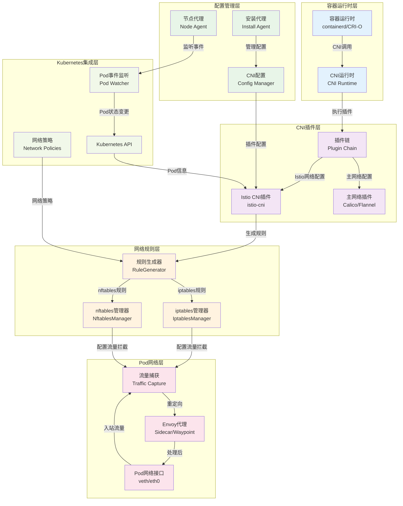
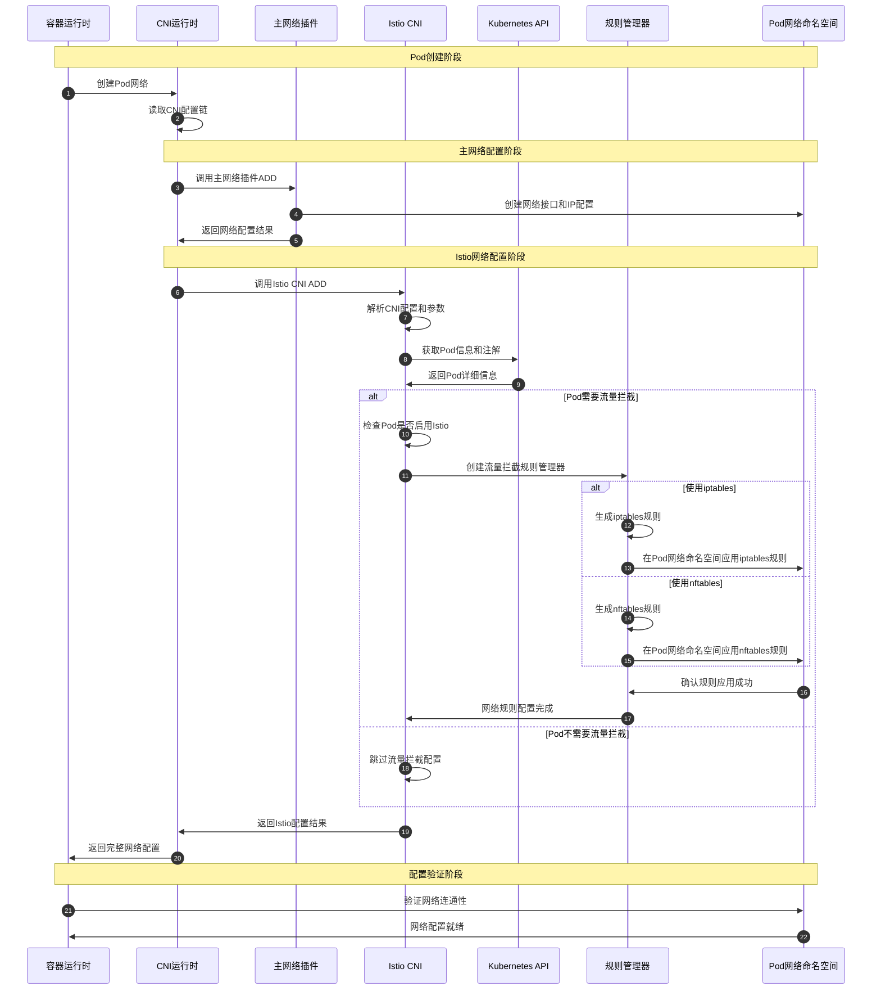
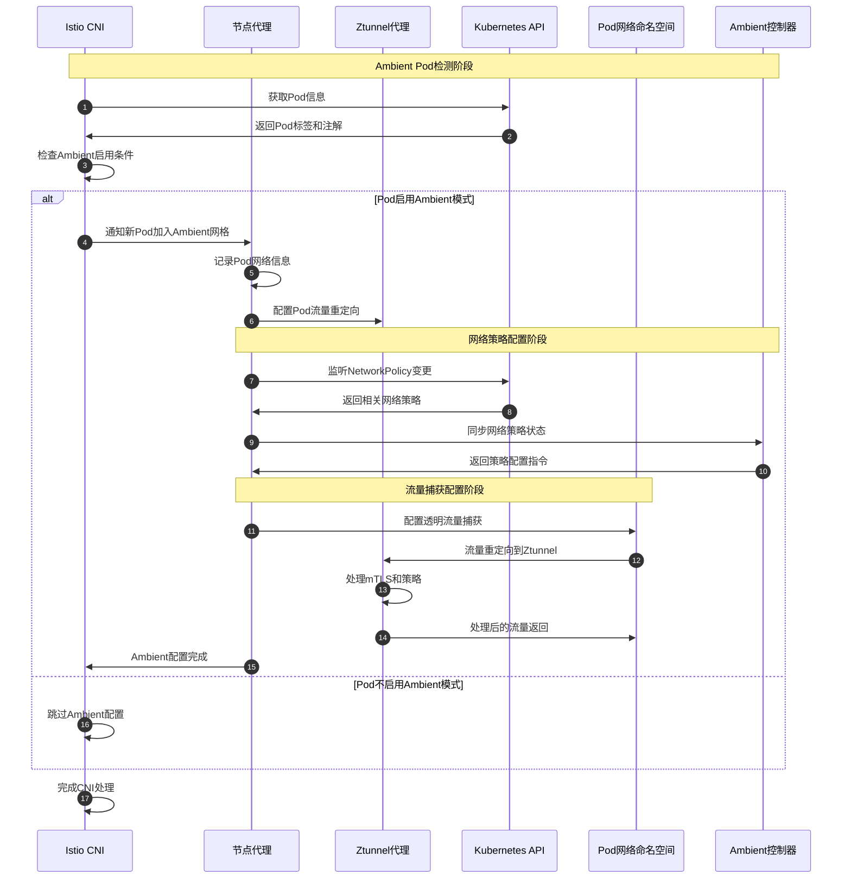

# Istio 源码剖析 - CNI模块

## 模块概览

### 职责边界
CNI模块是Istio网络功能的基础设施，承担以下关键职责：
- **流量拦截**：在Pod创建时配置iptables/nftables规则，将流量重定向到Envoy代理
- **网络初始化**：实现CNI（Container Network Interface）插件标准，集成到容器运行时
- **Ambient支持**：为Ambient模式提供透明的网络层流量捕获
- **规则管理**：动态管理网络规则，支持Pod生命周期的网络配置变更

### 输入输出
- **输入**：CNI运行时调用、Pod网络配置、Kubernetes API事件
- **输出**：网络接口配置、iptables/nftables规则、流量重定向设置

### 上下游依赖
- **上游依赖**：容器运行时（containerd/CRI-O）、Kubernetes API、网络插件链
- **下游消费者**：Envoy代理、应用容器、网络监控系统
- **平行组件**：Pilot（配置推送）、Security（证书管理）

### 生命周期
1. **安装阶段**：作为DaemonSet部署到每个节点，配置CNI插件
2. **运行阶段**：响应CNI调用，为新建Pod配置网络流量拦截
3. **清理阶段**：删除Pod时清理相关的网络规则和配置

## 架构设计

### 模块架构图


#### 架构图说明

**图意概述**：该架构图展示了Istio CNI模块的六层网络架构，从容器运行时调用到最终的流量重定向的完整过程。

**关键组件功能**：
- **容器运行时层**：容器引擎调用CNI插件进行网络配置
- **CNI插件层**：Istio CNI插件与其他网络插件协同工作
- **配置管理层**：管理CNI配置文件和插件安装
- **网络规则层**：生成和管理iptables/nftables流量拦截规则
- **Pod网络层**：实际的网络接口和流量处理
- **Kubernetes集成层**：与K8s API集成，获取Pod信息和网络策略

**边界与约束**：
- **CNI规范遵循**：严格按照CNI 0.3.1规范实现插件接口
- **网络性能**：流量拦截和重定向的延迟控制在微秒级别
- **兼容性要求**：支持多种网络插件（Calico、Flannel、Cilium等）的协同工作
- **资源隔离**：每个Pod的网络规则独立管理，避免相互影响

**异常与回退**：
- **插件失败**：CNI插件失败时，Pod创建流程继续，但不进行流量拦截
- **规则冲突**：自动检测和解决与其他组件的iptables规则冲突
- **网络恢复**：支持节点重启后的网络规则自动恢复
- **降级模式**：在极端情况下支持禁用流量拦截的降级运行

**性能与容量**：
- **启动延迟**：Pod网络配置时间通常在50ms以内
- **规则数量**：单节点支持管理数千个Pod的网络规则
- **内存占用**：CNI插件内存占用通常小于50MB

**版本兼容与演进**：
- **CNI版本支持**：兼容CNI 0.3.1和0.4.0规范
- **内核兼容性**：支持Linux内核3.10+的iptables和4.17+的nftables
- **插件升级**：支持CNI插件的热升级和回滚

## 核心API与数据结构

### CNI插件配置结构

#### Config - CNI配置定义
```go
type Config struct {
    types.NetConf
    
    // 插件日志级别
    PluginLogLevel string `json:"plugin_log_level"`
    
    // CNI代理运行目录
    CNIAgentRunDir string `json:"cni_agent_run_dir"`
    
    // 是否启用Ambient模式
    AmbientEnabled bool `json:"ambient_enabled"`
    
    // 启用选择器配置
    EnablementSelectors []util.EnablementSelector `json:"enablement_selectors"`
    
    // 排除的命名空间列表
    ExcludeNamespaces []string `json:"exclude_namespaces"`
    
    // Pod所在命名空间
    PodNamespace string `json:"pod_namespace"`
    
    // 是否使用原生nftables
    NativeNftables bool `json:"native_nftables"`
}
```

| 字段 | 类型 | 必填 | 默认 | 约束 | 说明 |
|------|------|------|------|------|------|
| PluginLogLevel | string | 否 | "info" | debug/info/warn/error | CNI插件的日志级别 |
| CNIAgentRunDir | string | 否 | "/var/run/istio-cni" | 有效路径 | CNI代理的运行时目录 |
| AmbientEnabled | bool | 否 | false | - | 是否启用Ambient网格模式 |
| EnablementSelectors | []EnablementSelector | 否 | [] | 选择器列表 | Pod启用Istio的选择器配置 |
| ExcludeNamespaces | []string | 否 | [] | 命名空间名称 | 不进行流量拦截的命名空间 |
| NativeNftables | bool | 否 | false | - | 是否使用nftables替代iptables |

#### K8sArgs - Kubernetes CNI参数
```go
type K8sArgs struct {
    types.CommonArgs
    K8S_POD_NAME               types.UnmarshallableString
    K8S_POD_NAMESPACE          types.UnmarshallableString
    K8S_POD_INFRA_CONTAINER_ID types.UnmarshallableString
    K8S_POD_UID                types.UnmarshallableString
}
```

### CmdAdd - CNI ADD命令实现

#### ADD命令核心逻辑
```go
// 基本信息
// 名称: `CmdAdd`
// 协议/方法: CNI ADD命令处理函数
// 幂等性: 是（重复调用同一Pod的ADD命令应返回相同结果）

// CNI ADD命令实现
func CmdAdd(args *skel.CmdArgs) (err error) {
    // 异常恢复处理
    defer func() {
        if e := recover(); e != nil {
            msg := fmt.Sprintf("istio-cni panicked during cmdAdd: %v\n%v", e, string(debug.Stack()))
            if err != nil {
                msg = fmt.Sprintf("%s: %v", msg, err)
            }
            err = errors.New(msg)
        }
        if err != nil {
            log.Errorf("istio-cni cmdAdd error: %v", err)
        }
    }()
    
    // 1) 解析CNI配置
    conf, err := parseConfig(args.StdinData)
    if err != nil {
        return fmt.Errorf("failed to parse config: %v", err)
    }
    
    // 2) 创建Kubernetes客户端
    client, err := newK8sClient(*conf)
    if err != nil {
        // 特殊处理：如果是CNI Pod自身启动，允许失败
        if conf.AmbientEnabled {
            k8sArgs := K8sArgs{}
            if err := types.LoadArgs(args.Args, &k8sArgs); err != nil {
                return fmt.Errorf("failed to load args: %v", err)
            }
            if isCNIPod(conf, &k8sArgs) {
                return pluginResponse(conf)
            }
        }
        return fmt.Errorf("failed to create K8s client: %v", err)
    }
    
    // 3) 选择网络规则管理器
    var mgr InterceptRuleMgr
    if conf.NativeNftables {
        mgr = NftablesInterceptRuleMgr()
    } else {
        mgr = IptablesInterceptRuleMgr()
    }
    
    // 4) 执行网络配置
    if err := doAddRun(args, conf, client, mgr); err != nil {
        return fmt.Errorf("failed to setup networking: %v", err)
    }
    
    // 5) 返回插件响应
    return pluginResponse(conf)
}
```

#### doAddRun - 核心网络配置逻辑
```go
func doAddRun(args *skel.CmdArgs, conf *Config, client kubernetes.Interface, mgr InterceptRuleMgr) error {
    // 1) 配置日志
    if err := log.Configure(GetLoggingOptions(conf)); err != nil {
        log.Error("Failed to configure logging")
    }
    
    // 2) 解析Kubernetes参数
    k8sArgs := K8sArgs{}
    if err := types.LoadArgs(args.Args, &k8sArgs); err != nil {
        return fmt.Errorf("failed to load K8s args: %v", err)
    }
    
    podNamespace := string(k8sArgs.K8S_POD_NAMESPACE)
    podName := string(k8sArgs.K8S_POD_NAME)
    
    // 3) 验证是否为Kubernetes Pod
    if podNamespace == "" || podName == "" {
        log.Debugf("Not a Kubernetes pod, skipping")
        return nil
    }
    
    // 4) 检查排除的命名空间
    for _, excludeNs := range conf.ExcludeNamespaces {
        if podNamespace == excludeNs {
            log.Infof("Pod namespace %s excluded from Istio processing", podNamespace)
            return nil
        }
    }
    
    // 5) Ambient模式处理
    if conf.AmbientEnabled {
        return handleAmbientPod(args, conf, client, podNamespace, podName)
    }
    
    // 6) Sidecar模式处理
    return handleSidecarPod(args, conf, client, mgr, podNamespace, podName)
}
```

### 网络规则管理接口

#### InterceptRuleMgr - 流量拦截规则管理器
```go
type InterceptRuleMgr interface {
    // 为Pod设置流量拦截规则
    Setup(podName, podNamespace string, netns string) error
    
    // 清理Pod的流量拦截规则
    Cleanup(podName, podNamespace string, netns string) error
    
    // 检查规则是否已存在
    Exists(podName, podNamespace string) bool
}
```

#### IptablesInterceptRuleMgr - iptables规则管理器
```go
type IptablesInterceptRuleMgr struct {
    iptables *iptables.IPTables
    config   *Config
}

func (ipt *IptablesInterceptRuleMgr) Setup(podName, podNamespace string, netns string) error {
    // 1) 获取Pod信息
    pod, err := ipt.getPodInfo(podNamespace, podName)
    if err != nil {
        return fmt.Errorf("failed to get pod info: %v", err)
    }
    
    // 2) 检查是否需要流量拦截
    if !shouldInterceptTraffic(pod) {
        log.Debugf("Pod %s/%s does not require traffic interception", podNamespace, podName)
        return nil
    }
    
    // 3) 生成iptables规则
    rules := ipt.generateInterceptRules(pod)
    
    // 4) 在Pod网络命名空间中应用规则
    return ipt.applyRulesInNamespace(netns, rules)
}

func (ipt *IptablesInterceptRuleMgr) generateInterceptRules(pod *corev1.Pod) []IptablesRule {
    rules := make([]IptablesRule, 0)
    
    // 获取代理配置
    proxyUID := getPodAnnotation(pod, "sidecar.istio.io/proxUID", "1337")
    proxyGID := getPodAnnotation(pod, "sidecar.istio.io/proxGID", "1337")
    
    // 入站流量重定向规则
    inboundInterceptPort := getPodAnnotation(pod, "traffic.sidecar.istio.io/inboundInterceptPort", "15006")
    rules = append(rules, IptablesRule{
        Table: "nat",
        Chain: "PREROUTING",
        Rule:  fmt.Sprintf("-p tcp --dport 1:65535 -j REDIRECT --to-port %s", inboundInterceptPort),
    })
    
    // 出站流量重定向规则  
    outboundInterceptPort := getPodAnnotation(pod, "traffic.sidecar.istio.io/outboundInterceptPort", "15001")
    rules = append(rules, IptablesRule{
        Table: "nat",
        Chain: "OUTPUT",
        Rule:  fmt.Sprintf("-p tcp --dport 1:65535 -m owner ! --uid-owner %s -j REDIRECT --to-port %s", proxyUID, outboundInterceptPort),
    })
    
    // 排除代理自身流量
    rules = append(rules, IptablesRule{
        Table: "nat", 
        Chain: "OUTPUT",
        Rule:  fmt.Sprintf("-m owner --uid-owner %s -j RETURN", proxyUID),
    })
    
    // 排除特定端口和地址
    excludeInboundPorts := getPodAnnotation(pod, "traffic.sidecar.istio.io/excludeInboundPorts", "")
    if excludeInboundPorts != "" {
        for _, port := range strings.Split(excludeInboundPorts, ",") {
            rules = append(rules, IptablesRule{
                Table: "nat",
                Chain: "PREROUTING", 
                Rule:  fmt.Sprintf("-p tcp --dport %s -j RETURN", strings.TrimSpace(port)),
            })
        }
    }
    
    return rules
}
```

#### NftablesInterceptRuleMgr - nftables规则管理器
```go
type NftablesInterceptRuleMgr struct {
    conn   *nftables.Conn
    config *Config
}

func (nft *NftablesInterceptRuleMgr) Setup(podName, podNamespace string, netns string) error {
    // 1) 创建nftables连接
    conn, err := nftables.New(nftables.WithNetNSFd(int(netns)))
    if err != nil {
        return fmt.Errorf("failed to create nftables connection: %v", err)
    }
    defer conn.CloseLasting()
    
    // 2) 创建Istio专用表
    table := &nftables.Table{
        Family: nftables.TableFamilyINet,
        Name:   "istio",
    }
    conn.AddTable(table)
    
    // 3) 创建链和规则
    if err := nft.setupInterceptChains(conn, table, podName, podNamespace); err != nil {
        return fmt.Errorf("failed to setup intercept chains: %v", err)
    }
    
    // 4) 提交规则
    if err := conn.Flush(); err != nil {
        return fmt.Errorf("failed to flush nftables rules: %v", err)
    }
    
    return nil
}

func (nft *NftablesInterceptRuleMgr) setupInterceptChains(conn *nftables.Conn, table *nftables.Table, podName, podNamespace string) error {
    // 创建PREROUTING链用于入站流量
    preroutingChain := &nftables.Chain{
        Name:     "PREROUTING",
        Table:    table,
        Type:     nftables.ChainTypeNAT,
        Hooknum:  nftables.ChainHookPrerouting,
        Priority: nftables.ChainPriorityNATDest,
    }
    conn.AddChain(preroutingChain)
    
    // 创建OUTPUT链用于出站流量
    outputChain := &nftables.Chain{
        Name:     "OUTPUT", 
        Table:    table,
        Type:     nftables.ChainTypeNAT,
        Hooknum:  nftables.ChainHookOutput,
        Priority: nftables.ChainPriorityNATSource,
    }
    conn.AddChain(outputChain)
    
    // 添加入站重定向规则
    inboundRule := &nftables.Rule{
        Table: table,
        Chain: preroutingChain,
        Exprs: []expr.Any{
            // 匹配TCP协议
            &expr.Meta{Key: expr.MetaKeyL4PROTO, Register: 1},
            &expr.Cmp{Op: expr.CmpOpEq, Register: 1, Data: []byte{unix.IPPROTO_TCP}},
            
            // 重定向到15006端口
            &expr.Redir{RegisterProtoMin: 2},
            &expr.Immediate{Register: 2, Data: binaryutil.BigEndian.PutUint16(15006)},
        },
    }
    conn.AddRule(inboundRule)
    
    // 添加出站重定向规则
    outboundRule := &nftables.Rule{
        Table: table,
        Chain: outputChain, 
        Exprs: []expr.Any{
            // 匹配TCP协议且排除代理UID
            &expr.Meta{Key: expr.MetaKeyL4PROTO, Register: 1},
            &expr.Cmp{Op: expr.CmpOpEq, Register: 1, Data: []byte{unix.IPPROTO_TCP}},
            
            &expr.Meta{Key: expr.MetaKeySkUID, Register: 2},
            &expr.Cmp{Op: expr.CmpOpNeq, Register: 2, Data: binaryutil.NativeEndian.PutUint32(1337)},
            
            // 重定向到15001端口
            &expr.Redir{RegisterProtoMin: 3},
            &expr.Immediate{Register: 3, Data: binaryutil.BigEndian.PutUint16(15001)},
        },
    }
    conn.AddRule(outboundRule)
    
    return nil
}
```

## 时序图分析

### Pod创建网络配置流程


#### 时序图说明

**图意概述**：该时序图展示了Pod创建过程中CNI网络配置的完整流程，包括主网络插件和Istio CNI插件的协同工作。

**关键交互环节**：
1. **Pod创建**（步骤1-3）：容器运行时启动Pod创建，CNI运行时读取配置链
2. **主网络配置**（步骤4-6）：主网络插件创建基础网络接口和IP配置
3. **Istio网络配置**（步骤7-18）：Istio CNI获取Pod信息并配置流量拦截规则
4. **配置验证**（步骤19-20）：验证网络配置的正确性和连通性

**边界与约束**：
- **插件顺序**：Istio CNI必须在主网络插件之后执行
- **命名空间隔离**：每个Pod的网络规则在其独立的网络命名空间中配置
- **规则一致性**：确保iptables/nftables规则与Pod的Istio配置注解一致
- **错误处理**：单个插件失败不影响其他插件的执行

**异常与回退**：
- **K8s API不可用**：缓存Pod信息，支持离线模式配置
- **规则冲突**：自动检测并解决与其他组件的规则冲突
- **网络命名空间异常**：跳过规则配置，但不影响Pod启动
- **超时处理**：CNI调用有超时限制，超时后返回错误

**性能与容量**：
- **配置时间**：单个Pod的网络配置通常在50ms内完成
- **规则数量**：每个Pod大约需要5-10条iptables/nftables规则
- **内存使用**：CNI插件执行期间内存占用通常小于10MB

**版本兼容与演进**：
- **CNI版本兼容**：支持CNI 0.3.1和0.4.0规范
- **内核版本要求**：要求Linux内核3.10+支持iptables，4.17+支持nftables
- **配置向后兼容**：支持旧版本Pod注解格式的自动转换

### Ambient模式网络配置流程


## 关键算法与实现

### 流量拦截规则生成算法
根据Pod的配置和注解生成精确的网络流量拦截规则。

#### iptables规则生成
```go
type TrafficInterceptConfig struct {
    ProxyUID             string
    ProxyGID             string
    InboundInterceptPort string
    OutboundInterceptPort string
    ExcludeInboundPorts  []string
    ExcludeOutboundPorts []string
    ExcludeIPRanges      []string
    IncludeIPRanges      []string
}

func generateIptablesRules(config *TrafficInterceptConfig) []IptablesRule {
    rules := make([]IptablesRule, 0)
    
    // 1) 创建自定义链
    rules = append(rules, IptablesRule{
        Table: "nat",
        Chain: "PREROUTING",
        Rule:  "-j ISTIO_INBOUND",
    })
    
    rules = append(rules, IptablesRule{
        Table: "nat", 
        Chain: "OUTPUT",
        Rule:  "-j ISTIO_OUTPUT",
    })
    
    // 2) 配置入站流量拦截
    rules = append(rules, createInboundRules(config)...)
    
    // 3) 配置出站流量拦截
    rules = append(rules, createOutboundRules(config)...)
    
    return rules
}

func createInboundRules(config *TrafficInterceptConfig) []IptablesRule {
    rules := make([]IptablesRule, 0)
    
    // 排除特定端口
    for _, port := range config.ExcludeInboundPorts {
        rules = append(rules, IptablesRule{
            Table: "nat",
            Chain: "ISTIO_INBOUND",
            Rule:  fmt.Sprintf("-p tcp --dport %s -j RETURN", port),
        })
    }
    
    // 重定向其他入站流量
    rules = append(rules, IptablesRule{
        Table: "nat",
        Chain: "ISTIO_INBOUND", 
        Rule:  fmt.Sprintf("-p tcp -j REDIRECT --to-port %s", config.InboundInterceptPort),
    })
    
    return rules
}

func createOutboundRules(config *TrafficInterceptConfig) []IptablesRule {
    rules := make([]IptablesRule, 0)
    
    // 排除代理自身流量
    rules = append(rules, IptablesRule{
        Table: "nat",
        Chain: "ISTIO_OUTPUT",
        Rule:  fmt.Sprintf("-m owner --uid-owner %s -j RETURN", config.ProxyUID),
    })
    
    // 排除特定IP范围
    for _, ipRange := range config.ExcludeIPRanges {
        rules = append(rules, IptablesRule{
            Table: "nat",
            Chain: "ISTIO_OUTPUT",
            Rule:  fmt.Sprintf("-d %s -j RETURN", ipRange),
        })
    }
    
    // 仅拦截指定IP范围（如果配置了）
    if len(config.IncludeIPRanges) > 0 {
        for _, ipRange := range config.IncludeIPRanges {
            rules = append(rules, IptablesRule{
                Table: "nat",
                Chain: "ISTIO_OUTPUT",
                Rule:  fmt.Sprintf("-d %s -p tcp -j REDIRECT --to-port %s", ipRange, config.OutboundInterceptPort),
            })
        }
    } else {
        // 重定向所有出站TCP流量
        rules = append(rules, IptablesRule{
            Table: "nat",
            Chain: "ISTIO_OUTPUT",
            Rule:  fmt.Sprintf("-p tcp -j REDIRECT --to-port %s", config.OutboundInterceptPort),
        })
    }
    
    return rules
}
```

### CNI配置合并算法
将Istio CNI配置与现有的CNI配置合并，形成完整的插件链。

#### 配置合并实现
```go
func insertCNIConfig(newCNIConfig, existingCNIConfig []byte) ([]byte, error) {
    var istioMap map[string]any
    if err := json.Unmarshal(newCNIConfig, &istioMap); err != nil {
        return nil, fmt.Errorf("error loading Istio CNI config: %v", err)
    }
    
    var existingMap map[string]any
    if err := json.Unmarshal(existingCNIConfig, &existingMap); err != nil {
        return nil, fmt.Errorf("error loading existing CNI config: %v", err)
    }
    
    // 移除版本字段，避免冲突
    delete(istioMap, "cniVersion")
    
    var newMap map[string]any
    
    if _, ok := existingMap["type"]; ok {
        // 现有配置是单个网络插件配置
        delete(existingMap, "cniVersion")
        
        // 创建插件链配置
        plugins := make([]map[string]any, 2)
        plugins[0] = existingMap
        plugins[1] = istioMap
        
        newMap = map[string]any{
            "name":       "k8s-pod-network",
            "cniVersion": "0.3.1",
            "plugins":    plugins,
        }
    } else {
        // 现有配置是插件链配置
        newMap = existingMap
        
        // 获取现有插件列表
        plugins, err := util.GetPlugins(newMap)
        if err != nil {
            return nil, fmt.Errorf("existing CNI config plugins error: %v", err)
        }
        
        // 移除已存在的istio-cni插件（如果有）
        for i, rawPlugin := range plugins {
            plugin, err := util.GetPlugin(rawPlugin)
            if err != nil {
                return nil, fmt.Errorf("existing CNI plugin error: %v", err)
            }
            if plugin["type"] == "istio-cni" {
                plugins = append(plugins[:i], plugins[i+1:]...)
                break
            }
        }
        
        // 添加新的istio-cni插件到链末尾
        newMap["plugins"] = append(plugins, istioMap)
    }
    
    // 序列化最终配置
    return util.MarshalCNIConfig(newMap)
}
```

### Pod生命周期事件处理算法
监听Pod生命周期事件，动态管理网络规则。

#### 事件监听和处理
```go
type PodLifecycleHandler struct {
    k8sClient     kubernetes.Interface
    ruleManager   InterceptRuleMgr
    eventChannel  chan PodEvent
    stopChannel   chan struct{}
}

type PodEvent struct {
    Type      PodEventType
    Pod       *corev1.Pod
    Timestamp time.Time
}

type PodEventType string

const (
    PodEventTypeAdded    PodEventType = "ADDED"
    PodEventTypeModified PodEventType = "MODIFIED"
    PodEventTypeDeleted  PodEventType = "DELETED"
)

func (plh *PodLifecycleHandler) Start() error {
    // 创建Pod监听器
    watchlist := cache.NewListWatchFromClient(
        plh.k8sClient.CoreV1().RESTClient(),
        "pods",
        metav1.NamespaceAll,
        fields.Everything(),
    )
    
    _, controller := cache.NewInformer(
        watchlist,
        &corev1.Pod{},
        time.Second*10,
        cache.ResourceEventHandlerFuncs{
            AddFunc: func(obj interface{}) {
                pod := obj.(*corev1.Pod)
                plh.eventChannel <- PodEvent{
                    Type:      PodEventTypeAdded,
                    Pod:       pod,
                    Timestamp: time.Now(),
                }
            },
            UpdateFunc: func(oldObj, newObj interface{}) {
                pod := newObj.(*corev1.Pod)
                plh.eventChannel <- PodEvent{
                    Type:      PodEventTypeModified,
                    Pod:       pod,
                    Timestamp: time.Now(),
                }
            },
            DeleteFunc: func(obj interface{}) {
                pod := obj.(*corev1.Pod)
                plh.eventChannel <- PodEvent{
                    Type:      PodEventTypeDeleted,
                    Pod:       pod,
                    Timestamp: time.Now(),
                }
            },
        },
    )
    
    // 启动控制器
    go controller.Run(plh.stopChannel)
    
    // 启动事件处理循环
    go plh.eventProcessingLoop()
    
    return nil
}

func (plh *PodLifecycleHandler) eventProcessingLoop() {
    for {
        select {
        case event := <-plh.eventChannel:
            if err := plh.handlePodEvent(event); err != nil {
                log.Errorf("处理Pod事件失败: %v", err)
            }
        case <-plh.stopChannel:
            return
        }
    }
}

func (plh *PodLifecycleHandler) handlePodEvent(event PodEvent) error {
    pod := event.Pod
    podKey := fmt.Sprintf("%s/%s", pod.Namespace, pod.Name)
    
    switch event.Type {
    case PodEventTypeAdded:
        // Pod创建时，如果需要Istio支持，设置网络规则
        if shouldInterceptTraffic(pod) {
            log.Infof("为Pod %s 设置流量拦截规则", podKey)
            return plh.ruleManager.Setup(pod.Name, pod.Namespace, pod.Status.PodIP)
        }
        
    case PodEventTypeModified:
        // Pod更新时，检查Istio配置是否变更
        oldNeedsIntercept := plh.ruleManager.Exists(pod.Name, pod.Namespace)
        newNeedsIntercept := shouldInterceptTraffic(pod)
        
        if oldNeedsIntercept && !newNeedsIntercept {
            // 禁用流量拦截
            log.Infof("为Pod %s 清理流量拦截规则", podKey)
            return plh.ruleManager.Cleanup(pod.Name, pod.Namespace, pod.Status.PodIP)
        } else if !oldNeedsIntercept && newNeedsIntercept {
            // 启用流量拦截
            log.Infof("为Pod %s 设置流量拦截规则", podKey)
            return plh.ruleManager.Setup(pod.Name, pod.Namespace, pod.Status.PodIP)
        }
        
    case PodEventTypeDeleted:
        // Pod删除时，清理相关的网络规则
        if plh.ruleManager.Exists(pod.Name, pod.Namespace) {
            log.Infof("为已删除Pod %s 清理流量拦截规则", podKey)
            return plh.ruleManager.Cleanup(pod.Name, pod.Namespace, pod.Status.PodIP)
        }
    }
    
    return nil
}

func shouldInterceptTraffic(pod *corev1.Pod) bool {
    // 检查Pod是否启用了Istio注入
    if value, exists := pod.Labels["sidecar.istio.io/inject"]; exists && value == "true" {
        return true
    }
    
    // 检查命名空间是否启用了自动注入
    if value, exists := pod.Namespace.Labels["istio-injection"]; exists && value == "enabled" {
        // 检查Pod是否明确禁用了注入
        if value, exists := pod.Labels["sidecar.istio.io/inject"]; exists && value == "false" {
            return false
        }
        return true
    }
    
    return false
}
```

## 框架使用示例与最佳实践

### 自定义CNI配置
根据特定需求定制CNI插件配置：

```yaml
# /etc/cni/net.d/10-calico.conflist
{
  "name": "k8s-pod-network",
  "cniVersion": "0.3.1",
  "plugins": [
    {
      "type": "calico",
      "log_level": "info",
      "datastore_type": "kubernetes",
      "mtu": 1440,
      "ipam": {
        "type": "calico-ipam"
      },
      "policy": {
        "type": "k8s"
      },
      "kubernetes": {
        "kubeconfig": "/etc/cni/net.d/calico-kubeconfig"
      }
    },
    {
      "type": "istio-cni",
      "plugin_log_level": "debug",
      "cni_agent_run_dir": "/var/run/istio-cni",
      "ambient_enabled": true,
      "enablement_selectors": [
        {
          "podSelector": {
            "matchLabels": {
              "app": "productpage"
            }
          }
        },
        {
          "namespaceSelector": {
            "matchLabels": {
              "istio-injection": "enabled"
            }
          }
        }
      ],
      "exclude_namespaces": [
        "istio-system",
        "kube-system"
      ],
      "native_nftables": false
    }
  ]
}
```

### Pod流量拦截配置
通过注解精确控制Pod的流量拦截行为：

```yaml
apiVersion: v1
kind: Pod
metadata:
  name: productpage
  namespace: default
  annotations:
    # 启用Istio注入
    sidecar.istio.io/inject: "true"
    
    # 自定义代理UID/GID
    sidecar.istio.io/proxUID: "1337"
    sidecar.istio.io/proxGID: "1337"
    
    # 自定义拦截端口
    traffic.sidecar.istio.io/inboundInterceptPort: "15006"
    traffic.sidecar.istio.io/outboundInterceptPort: "15001"
    
    # 排除特定入站端口（如健康检查端口）
    traffic.sidecar.istio.io/excludeInboundPorts: "8090,8091"
    
    # 排除特定出站端口（如直连数据库）
    traffic.sidecar.istio.io/excludeOutboundPorts: "3306,5432"
    
    # 排除特定IP范围
    traffic.sidecar.istio.io/excludeOutboundIPRanges: "10.96.0.0/12,192.168.1.0/24"
    
    # 仅拦截特定IP范围
    traffic.sidecar.istio.io/includeOutboundIPRanges: "0.0.0.0/0"
    
spec:
  containers:
  - name: productpage
    image: istio/examples-bookinfo-productpage-v1:1.16.2
    ports:
    - containerPort: 9080
    env:
    - name: SERVICE_VERSION
      value: v1
```

### CNI故障排查和监控
实现CNI插件的健康监控和故障诊断：

```go
type CNIHealthChecker struct {
    config     *Config
    k8sClient  kubernetes.Interface
    metrics    *prometheus.Registry
}

func (chc *CNIHealthChecker) StartHealthChecking() {
    // 定期检查CNI配置
    go chc.checkCNIConfigHealth()
    
    // 监控Pod网络规则
    go chc.monitorPodNetworkRules()
    
    // 检查网络连通性
    go chc.checkNetworkConnectivity()
    
    // 暴露Prometheus指标
    go chc.exposeMetrics()
}

func (chc *CNIHealthChecker) checkCNIConfigHealth() {
    ticker := time.NewTicker(1 * time.Minute)
    defer ticker.Stop()
    
    for range ticker.C {
        // 检查CNI配置文件是否存在和有效
        configPath := "/etc/cni/net.d/"
        files, err := os.ReadDir(configPath)
        if err != nil {
            log.Errorf("读取CNI配置目录失败: %v", err)
            chc.recordHealthMetric("cni_config_error", 1)
            continue
        }
        
        istioConfigFound := false
        for _, file := range files {
            if strings.Contains(file.Name(), "istio") {
                configFile := filepath.Join(configPath, file.Name())
                if err := chc.validateCNIConfig(configFile); err != nil {
                    log.Errorf("CNI配置验证失败 %s: %v", configFile, err)
                    chc.recordHealthMetric("cni_config_invalid", 1)
                } else {
                    istioConfigFound = true
                }
                break
            }
        }
        
        if istioConfigFound {
            chc.recordHealthMetric("cni_config_healthy", 1)
        } else {
            log.Warnf("未找到Istio CNI配置文件")
            chc.recordHealthMetric("cni_config_missing", 1)
        }
    }
}

func (chc *CNIHealthChecker) monitorPodNetworkRules() {
    ticker := time.NewTicker(30 * time.Second)
    defer ticker.Stop()
    
    for range ticker.C {
        // 获取需要流量拦截的Pod列表
        pods, err := chc.getIstioEnabledPods()
        if err != nil {
            log.Errorf("获取Istio Pod列表失败: %v", err)
            continue
        }
        
        rulesHealthy := 0
        rulesMissing := 0
        
        for _, pod := range pods {
            // 检查Pod的网络规则状态
            if chc.checkPodNetworkRules(pod) {
                rulesHealthy++
            } else {
                rulesMissing++
                log.Warnf("Pod %s/%s 的网络规则缺失或异常", pod.Namespace, pod.Name)
            }
        }
        
        chc.recordHealthMetric("pod_rules_healthy", float64(rulesHealthy))
        chc.recordHealthMetric("pod_rules_missing", float64(rulesMissing))
    }
}

func (chc *CNIHealthChecker) checkPodNetworkRules(pod *corev1.Pod) bool {
    // 进入Pod的网络命名空间检查规则
    netnsPath := fmt.Sprintf("/proc/%d/ns/net", pod.Status.PodIP) // 简化实现
    
    // 检查iptables规则
    cmd := exec.Command("nsenter", "-t", string(pod.Status.PodIP), "-n", "iptables", "-t", "nat", "-L", "ISTIO_INBOUND")
    output, err := cmd.Output()
    if err != nil {
        return false
    }
    
    // 验证规则内容
    expectedRules := []string{
        "REDIRECT",
        "15006", // 入站拦截端口
        "15001", // 出站拦截端口
    }
    
    outputStr := string(output)
    for _, rule := range expectedRules {
        if !strings.Contains(outputStr, rule) {
            return false
        }
    }
    
    return true
}

func (chc *CNIHealthChecker) checkNetworkConnectivity() {
    ticker := time.NewTicker(2 * time.Minute)
    defer ticker.Stop()
    
    for range ticker.C {
        // 检查与Kubernetes API的连通性
        if err := chc.checkKubernetesConnectivity(); err != nil {
            log.Errorf("Kubernetes API连通性检查失败: %v", err)
            chc.recordHealthMetric("k8s_connectivity_error", 1)
        } else {
            chc.recordHealthMetric("k8s_connectivity_healthy", 1)
        }
        
        // 检查集群内服务连通性
        if err := chc.checkClusterConnectivity(); err != nil {
            log.Errorf("集群内连通性检查失败: %v", err)
            chc.recordHealthMetric("cluster_connectivity_error", 1)
        } else {
            chc.recordHealthMetric("cluster_connectivity_healthy", 1)
        }
    }
}

// CNI性能监控
func (chc *CNIHealthChecker) monitorCNIPerformance() {
    // 监控CNI调用延迟
    cniLatencyHistogram := prometheus.NewHistogramVec(
        prometheus.HistogramOpts{
            Name: "istio_cni_operation_duration_seconds",
            Help: "CNI操作耗时分布",
            Buckets: prometheus.DefBuckets,
        },
        []string{"operation", "result"},
    )
    
    // 监控CNI调用频率
    cniOperationCounter := prometheus.NewCounterVec(
        prometheus.CounterOpts{
            Name: "istio_cni_operations_total",
            Help: "CNI操作总次数",
        },
        []string{"operation", "result"},
    )
    
    chc.metrics.MustRegister(cniLatencyHistogram, cniOperationCounter)
}
```

### 高级网络策略集成
将Istio CNI与Kubernetes NetworkPolicy集成：

```go
type NetworkPolicyIntegration struct {
    k8sClient       kubernetes.Interface
    policyInformer  cache.SharedIndexInformer
    ruleManager     InterceptRuleMgr
}

func (npi *NetworkPolicyIntegration) Start() error {
    // 创建NetworkPolicy监听器
    watchlist := cache.NewListWatchFromClient(
        npi.k8sClient.NetworkingV1().RESTClient(),
        "networkpolicies",
        metav1.NamespaceAll,
        fields.Everything(),
    )
    
    npi.policyInformer = cache.NewSharedIndexInformer(
        watchlist,
        &networkingv1.NetworkPolicy{},
        time.Second*30,
        cache.Indexers{},
    )
    
    npi.policyInformer.AddEventHandler(cache.ResourceEventHandlerFuncs{
        AddFunc:    npi.onNetworkPolicyAdd,
        UpdateFunc: npi.onNetworkPolicyUpdate,
        DeleteFunc: npi.onNetworkPolicyDelete,
    })
    
    go npi.policyInformer.Run(context.TODO().Done())
    
    return nil
}

func (npi *NetworkPolicyIntegration) onNetworkPolicyAdd(obj interface{}) {
    policy := obj.(*networkingv1.NetworkPolicy)
    log.Infof("检测到新的NetworkPolicy: %s/%s", policy.Namespace, policy.Name)
    
    // 分析策略影响的Pod
    affectedPods, err := npi.getAffectedPods(policy)
    if err != nil {
        log.Errorf("获取受影响Pod失败: %v", err)
        return
    }
    
    // 为受影响的Pod更新网络规则
    for _, pod := range affectedPods {
        if err := npi.updatePodNetworkRules(pod, policy); err != nil {
            log.Errorf("更新Pod %s/%s 网络规则失败: %v", pod.Namespace, pod.Name, err)
        }
    }
}

func (npi *NetworkPolicyIntegration) updatePodNetworkRules(pod *corev1.Pod, policy *networkingv1.NetworkPolicy) error {
    // 基于NetworkPolicy生成额外的iptables规则
    additionalRules := npi.generateNetworkPolicyRules(pod, policy)
    
    // 获取Pod的网络命名空间
    netnsPath := fmt.Sprintf("/proc/%d/ns/net", getPodPID(pod))
    
    // 应用额外的网络规则
    for _, rule := range additionalRules {
        cmd := exec.Command("nsenter", "-t", netnsPath, "-n", "iptables", rule.Args...)
        if err := cmd.Run(); err != nil {
            return fmt.Errorf("应用网络策略规则失败: %v", err)
        }
    }
    
    return nil
}

func (npi *NetworkPolicyIntegration) generateNetworkPolicyRules(pod *corev1.Pod, policy *networkingv1.NetworkPolicy) []IptablesRule {
    rules := make([]IptablesRule, 0)
    
    // 处理入站规则
    for _, ingress := range policy.Spec.Ingress {
        for _, from := range ingress.From {
            if from.IPBlock != nil {
                // 基于IP块的规则
                rule := IptablesRule{
                    Table: "filter",
                    Chain: "INPUT",
                    Args: []string{
                        "-s", from.IPBlock.CIDR,
                        "-j", "ACCEPT",
                    },
                }
                rules = append(rules, rule)
            }
            
            if from.NamespaceSelector != nil {
                // 基于命名空间的规则（需要解析标签选择器）
                namespaces := npi.getNamespacesBySelector(from.NamespaceSelector)
                for _, ns := range namespaces {
                    // 获取命名空间的IP范围
                    ipRange := npi.getNamespaceIPRange(ns)
                    rule := IptablesRule{
                        Table: "filter",
                        Chain: "INPUT",
                        Args: []string{
                            "-s", ipRange,
                            "-j", "ACCEPT",
                        },
                    }
                    rules = append(rules, rule)
                }
            }
        }
    }
    
    // 处理出站规则
    for _, egress := range policy.Spec.Egress {
        for _, to := range egress.To {
            if to.IPBlock != nil {
                rule := IptablesRule{
                    Table: "filter", 
                    Chain: "OUTPUT",
                    Args: []string{
                        "-d", to.IPBlock.CIDR,
                        "-j", "ACCEPT",
                    },
                }
                rules = append(rules, rule)
            }
        }
    }
    
    return rules
}
```

## 具体案例：多租户网络隔离

在多租户环境中，使用Istio CNI实现强网络隔离：

```go
type MultiTenantNetworkIsolation struct {
    k8sClient     kubernetes.Interface
    tenantManager *TenantManager
    ruleManager   InterceptRuleMgr
}

type TenantConfig struct {
    Name               string
    Namespaces         []string
    AllowedIPRanges    []string
    DeniedIPRanges     []string
    AllowedServices    []string
    NetworkPolicy      *TenantNetworkPolicy
}

type TenantNetworkPolicy struct {
    IngressRules []IngressRule
    EgressRules  []EgressRule
}

func (mtni *MultiTenantNetworkIsolation) SetupTenantIsolation(tenant *TenantConfig) error {
    log.Infof("为租户 %s 设置网络隔离", tenant.Name)
    
    // 1) 为租户的所有命名空间设置基础隔离规则
    for _, namespace := range tenant.Namespaces {
        if err := mtni.setupNamespaceIsolation(namespace, tenant); err != nil {
            return fmt.Errorf("设置命名空间 %s 隔离失败: %v", namespace, err)
        }
    }
    
    // 2) 配置跨租户通信规则
    if err := mtni.setupCrossTenantRules(tenant); err != nil {
        return fmt.Errorf("设置跨租户规则失败: %v", err)
    }
    
    // 3) 应用细粒度的服务级隔离
    if err := mtni.setupServiceLevelIsolation(tenant); err != nil {
        return fmt.Errorf("设置服务级隔离失败: %v", err)
    }
    
    return nil
}

func (mtni *MultiTenantNetworkIsolation) setupNamespaceIsolation(namespace string, tenant *TenantConfig) error {
    // 获取命名空间中的所有Pod
    pods, err := mtni.k8sClient.CoreV1().Pods(namespace).List(context.TODO(), metav1.ListOptions{})
    if err != nil {
        return fmt.Errorf("获取Pod列表失败: %v", err)
    }
    
    for _, pod := range pods.Items {
        // 为每个Pod设置租户特定的网络规则
        tenantRules := mtni.generateTenantIsolationRules(&pod, tenant)
        
        // 获取Pod的网络命名空间
        netnsPath := fmt.Sprintf("/var/run/netns/%s", pod.Status.PodIP)
        
        // 应用隔离规则
        for _, rule := range tenantRules {
            if err := mtni.applyRuleInNamespace(netnsPath, rule); err != nil {
                log.Errorf("为Pod %s/%s 应用隔离规则失败: %v", pod.Namespace, pod.Name, err)
            }
        }
    }
    
    return nil
}

func (mtni *MultiTenantNetworkIsolation) generateTenantIsolationRules(pod *corev1.Pod, tenant *TenantConfig) []IptablesRule {
    rules := make([]IptablesRule, 0)
    
    // 1) 默认拒绝所有跨租户流量
    rules = append(rules, IptablesRule{
        Table: "filter",
        Chain: "INPUT",
        Rule:  "-j DROP", // 默认丢弃
    })
    
    rules = append(rules, IptablesRule{
        Table: "filter",
        Chain: "OUTPUT", 
        Rule:  "-j DROP", // 默认丢弃
    })
    
    // 2) 允许租户内部通信
    for _, allowedRange := range tenant.AllowedIPRanges {
        // 允许来自租户IP范围的入站流量
        rules = append(rules, IptablesRule{
            Table: "filter",
            Chain: "INPUT",
            Rule:  fmt.Sprintf("-s %s -j ACCEPT", allowedRange),
        })
        
        // 允许到租户IP范围的出站流量
        rules = append(rules, IptablesRule{
            Table: "filter", 
            Chain: "OUTPUT",
            Rule:  fmt.Sprintf("-d %s -j ACCEPT", allowedRange),
        })
    }
    
    // 3) 显式拒绝特定IP范围
    for _, deniedRange := range tenant.DeniedIPRanges {
        rules = append(rules, IptablesRule{
            Table: "filter",
            Chain: "INPUT",
            Rule:  fmt.Sprintf("-s %s -j REJECT --reject-with icmp-admin-prohibited", deniedRange),
        })
        
        rules = append(rules, IptablesRule{
            Table: "filter",
            Chain: "OUTPUT",
            Rule:  fmt.Sprintf("-d %s -j REJECT --reject-with icmp-admin-prohibited", deniedRange),
        })
    }
    
    // 4) 允许访问特定的共享服务
    for _, serviceName := range tenant.AllowedServices {
        serviceIP := mtni.getServiceClusterIP(serviceName)
        if serviceIP != "" {
            rules = append(rules, IptablesRule{
                Table: "filter",
                Chain: "OUTPUT",
                Rule:  fmt.Sprintf("-d %s -j ACCEPT", serviceIP),
            })
        }
    }
    
    // 5) 允许必要的系统通信（DNS、健康检查等）
    rules = append(rules, mtni.generateSystemAllowRules()...)
    
    return rules
}

func (mtni *MultiTenantNetworkIsolation) generateSystemAllowRules() []IptablesRule {
    return []IptablesRule{
        // 允许DNS查询
        {
            Table: "filter",
            Chain: "OUTPUT", 
            Rule:  "-p udp --dport 53 -j ACCEPT",
        },
        // 允许健康检查
        {
            Table: "filter",
            Chain: "INPUT",
            Rule:  "-p tcp --dport 8080 -s 10.96.0.0/12 -j ACCEPT", // Kubernetes服务网段
        },
        // 允许与API Server通信
        {
            Table: "filter", 
            Chain: "OUTPUT",
            Rule:  "-p tcp --dport 443 -d 10.96.0.1 -j ACCEPT", // API Server地址
        },
    }
}

func (mtni *MultiTenantNetworkIsolation) setupCrossTenantRules(tenant *TenantConfig) error {
    // 基于租户策略配置跨租户访问规则
    for _, ingressRule := range tenant.NetworkPolicy.IngressRules {
        if err := mtni.applyCrossTenantIngressRule(tenant, ingressRule); err != nil {
            return fmt.Errorf("应用跨租户入站规则失败: %v", err)
        }
    }
    
    for _, egressRule := range tenant.NetworkPolicy.EgressRules {
        if err := mtni.applyCrossTenantEgressRule(tenant, egressRule); err != nil {
            return fmt.Errorf("应用跨租户出站规则失败: %v", err)
        }
    }
    
    return nil
}

// 监控和审计
func (mtni *MultiTenantNetworkIsolation) StartAuditingAndMonitoring() {
    // 监控跨租户通信尝试
    go mtni.monitorCrossTenantTraffic()
    
    // 审计网络策略违规
    go mtni.auditPolicyViolations()
    
    // 生成租户网络使用报告
    go mtni.generateTenantUsageReports()
}

func (mtni *MultiTenantNetworkIsolation) monitorCrossTenantTraffic() {
    // 定期检查iptables日志，识别跨租户通信模式
    ticker := time.NewTicker(1 * time.Minute)
    defer ticker.Stop()
    
    for range ticker.C {
        // 解析iptables日志
        logs := mtni.parseIptablesLogs()
        
        // 分析跨租户通信
        for _, logEntry := range logs {
            if mtni.isCrossTenantTraffic(logEntry) {
                // 记录审计事件
                auditEvent := &AuditEvent{
                    Type:        "cross_tenant_communication",
                    SourceTenant: mtni.getTenantByIP(logEntry.SourceIP),
                    DestTenant:  mtni.getTenantByIP(logEntry.DestIP),
                    Allowed:     logEntry.Action == "ACCEPT",
                    Timestamp:   logEntry.Timestamp,
                }
                mtni.recordAuditEvent(auditEvent)
            }
        }
    }
}
```

这种多租户网络隔离方案提供了：
- **强隔离**：默认拒绝跨租户通信，仅允许明确授权的访问
- **细粒度控制**：支持命名空间、服务、IP范围等多维度的访问控制
- **系统兼容性**：保留必要的系统通信（DNS、健康检查、API访问）
- **监控审计**：完整的网络访问日志和违规检测
- **动态管理**：支持租户策略的动态更新和生效

## 总结

CNI模块作为Istio网络功能的基础，通过标准的CNI接口实现了透明的流量拦截和重定向。其关键特点包括：

1. **标准兼容**：严格遵循CNI规范，与主流网络插件无缝集成
2. **透明拦截**：通过iptables/nftables实现应用无感知的流量重定向
3. **灵活配置**：支持多种配置方式和细粒度的流量控制
4. **性能优化**：最小化网络延迟，支持高性能的流量处理
5. **故障恢复**：完善的错误处理和网络规则恢复机制

通过深入理解CNI模块的设计和实现，可以更好地部署和运维Istio网络功能，同时为构建高性能、高可用的服务网格提供坚实的网络基础。
