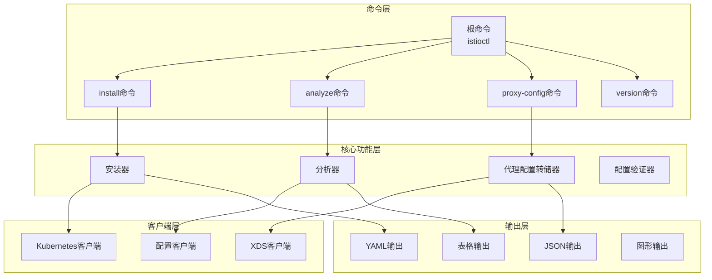
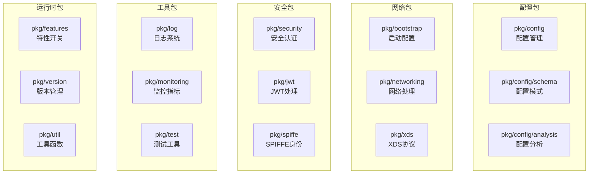

# Istio 源码剖析 - 综合实践指南

## 概览

本文档综合介绍Istio项目中的Istioctl命令行工具、PKG核心包以及框架使用的最佳实践。通过深入分析这些组件的设计和实现，为开发者提供全面的Istio开发和运维指导。

## Istioctl命令行工具

### 模块职责与架构

Istioctl是Istio的官方命令行工具，提供服务网格的管理、配置、调试和故障排查功能。

#### 核心架构


### 核心命令实现

#### Install命令 - 安装管理
```go
type InstallCommand struct {
    // 配置选项
    SetFlags        []string
    ManifestsPath   string
    Force           bool
    Verify          bool
    
    // 客户端
    kubeClient      kube.Client
    operatorClient  *operatorClient.Client
}

func (ic *InstallCommand) Run() error {
    // 1) 解析和验证安装配置
    iop, err := ic.parseInstallConfig()
    if err != nil {
        return fmt.Errorf("解析安装配置失败: %v", err)
    }
    
    // 2) 生成安装清单
    manifests, err := manifest.Generate(iop, ic.kubeClient)
    if err != nil {
        return fmt.Errorf("生成安装清单失败: %v", err)
    }
    
    // 3) 验证集群兼容性
    if ic.Verify {
        if err := ic.verifyClusterCompatibility(); err != nil {
            if !ic.Force {
                return fmt.Errorf("集群兼容性检查失败: %v", err)
            }
            log.Warnf("集群兼容性检查失败，但强制继续: %v", err)
        }
    }
    
    // 4) 应用安装清单
    installer := install.NewInstaller(ic.kubeClient)
    return installer.Install(manifests)
}

func (ic *InstallCommand) verifyClusterCompatibility() error {
    // 检查Kubernetes版本
    version, err := ic.kubeClient.GetKubernetesVersion()
    if err != nil {
        return fmt.Errorf("获取Kubernetes版本失败: %v", err)
    }
    
    if !isKubernetesVersionSupported(version) {
        return fmt.Errorf("不支持的Kubernetes版本: %s", version.String())
    }
    
    // 检查必要的权限
    if err := ic.checkRequiredPermissions(); err != nil {
        return fmt.Errorf("权限检查失败: %v", err)
    }
    
    // 检查资源要求
    if err := ic.checkResourceRequirements(); err != nil {
        return fmt.Errorf("资源要求检查失败: %v", err)
    }
    
    return nil
}
```

#### Analyze命令 - 配置分析
```go
type AnalyzeCommand struct {
    // 分析选项
    Namespace       string
    AllNamespaces   bool
    OutputThreshold analysis.Level
    ColorOutput     bool
    
    // 分析器
    analyzers       []analysis.Analyzer
    configStore     model.ConfigStore
}

func (ac *AnalyzeCommand) Run() error {
    // 1) 收集配置资源
    configs, err := ac.collectConfigurations()
    if err != nil {
        return fmt.Errorf("收集配置失败: %v", err)
    }
    
    // 2) 执行配置分析
    analysisResult := ac.analyzeConfigurations(configs)
    
    // 3) 输出分析结果
    return ac.outputAnalysisResult(analysisResult)
}

func (ac *AnalyzeCommand) analyzeConfigurations(configs []config.Config) *analysis.Result {
    result := &analysis.Result{
        Messages: make([]*analysis.Message, 0),
    }
    
    // 构建分析上下文
    ctx := &analysis.Context{
        Configs:       configs,
        ConfigStore:   ac.configStore,
        MessageReporter: result,
    }
    
    // 运行所有分析器
    for _, analyzer := range ac.analyzers {
        log.Debugf("运行分析器: %s", analyzer.Metadata().Name)
        analyzer.Analyze(ctx)
    }
    
    return result
}

func (ac *AnalyzeCommand) outputAnalysisResult(result *analysis.Result) error {
    // 按严重级别过滤消息
    filteredMessages := make([]*analysis.Message, 0)
    for _, msg := range result.Messages {
        if msg.Type.Level >= ac.OutputThreshold {
            filteredMessages = append(filteredMessages, msg)
        }
    }
    
    if len(filteredMessages) == 0 {
        fmt.Println("✅ 未发现配置问题")
        return nil
    }
    
    // 格式化输出
    for _, msg := range filteredMessages {
        levelIcon := ac.getLevelIcon(msg.Type.Level)
        colorFunc := ac.getColorFunc(msg.Type.Level)
        
        fmt.Printf("%s %s\n", levelIcon, colorFunc(msg.Type.Code))
        fmt.Printf("   资源: %s\n", msg.Resource)
        fmt.Printf("   消息: %s\n", msg.Description)
        
        if msg.DocumentationURL != "" {
            fmt.Printf("   文档: %s\n", msg.DocumentationURL)
        }
        fmt.Println()
    }
    
    return nil
}
```

#### Proxy-Config命令 - 代理配置查看
```go
type ProxyConfigCommand struct {
    // 目标选项
    PodName     string
    Namespace   string
    ConfigType  string // cluster, listener, route, endpoint
    
    // 输出选项
    OutputFormat string // json, yaml, short
    OutputFile   string
    
    // 客户端
    xdsClient   *xdsclient.Client
}

func (pcc *ProxyConfigCommand) Run() error {
    // 1) 连接到Envoy管理接口
    envoyClient, err := pcc.connectToEnvoyAdmin()
    if err != nil {
        return fmt.Errorf("连接Envoy管理接口失败: %v", err)
    }
    defer envoyClient.Close()
    
    // 2) 获取指定类型的配置
    config, err := pcc.getProxyConfig(envoyClient)
    if err != nil {
        return fmt.Errorf("获取代理配置失败: %v", err)
    }
    
    // 3) 格式化并输出配置
    return pcc.outputConfig(config)
}

func (pcc *ProxyConfigCommand) getProxyConfig(client *envoy.AdminClient) (interface{}, error) {
    switch pcc.ConfigType {
    case "cluster", "clusters":
        return client.GetClusters()
    case "listener", "listeners":
        return client.GetListeners()
    case "route", "routes":
        return client.GetRoutes()
    case "endpoint", "endpoints":
        return client.GetEndpoints()
    case "bootstrap":
        return client.GetBootstrap()
    case "config_dump":
        return client.GetConfigDump()
    default:
        return nil, fmt.Errorf("不支持的配置类型: %s", pcc.ConfigType)
    }
}

func (pcc *ProxyConfigCommand) outputConfig(config interface{}) error {
    var output []byte
    var err error
    
    switch pcc.OutputFormat {
    case "json":
        output, err = json.MarshalIndent(config, "", "  ")
    case "yaml":
        output, err = yaml.Marshal(config)
    case "short":
        output, err = pcc.formatShortOutput(config)
    default:
        return fmt.Errorf("不支持的输出格式: %s", pcc.OutputFormat)
    }
    
    if err != nil {
        return fmt.Errorf("格式化输出失败: %v", err)
    }
    
    if pcc.OutputFile != "" {
        return os.WriteFile(pcc.OutputFile, output, 0644)
    }
    
    fmt.Print(string(output))
    return nil
}
```

## PKG核心包分析

### 包结构概览
PKG包包含了Istio项目的核心基础设施代码，提供了配置管理、网络处理、安全认证等基础功能。

#### 核心包组织


### 配置管理核心实现

#### Config包 - 统一配置接口
```go
// 配置资源的统一表示
type Config struct {
    // 配置元数据
    Meta ConfigMeta
    
    // 配置规范（具体的配置内容）
    Spec config.Spec
    
    // 配置状态（运行时状态）
    Status config.Status
}

type ConfigMeta struct {
    // 配置类型信息
    GroupVersionKind schema.GroupVersionKind
    
    // 配置标识
    Name      string
    Namespace string
    
    // 配置标签和注解
    Labels      map[string]string
    Annotations map[string]string
    
    // 版本信息
    ResourceVersion string
    CreationTime    time.Time
}

// 配置存储接口
type ConfigStore interface {
    // 配置查询
    Get(typ schema.GroupVersionKind, name, namespace string) (*Config, error)
    List(typ schema.GroupVersionKind, namespace string) ([]Config, error)
    
    // 配置修改
    Create(config Config) (*Config, error)
    Update(config Config) (*Config, error)
    Delete(typ schema.GroupVersionKind, name, namespace string) error
    
    // 配置监听
    RegisterEventHandler(typ schema.GroupVersionKind, handler func(Config, Event))
}

// Kubernetes配置存储实现
type KubernetesConfigStore struct {
    client    kubernetes.Interface
    crdClient crd.Interface
    informers map[schema.GroupVersionKind]cache.SharedIndexInformer
    handlers  map[schema.GroupVersionKind][]func(Config, Event)
    mutex     sync.RWMutex
}

func (kcs *KubernetesConfigStore) Get(typ schema.GroupVersionKind, name, namespace string) (*Config, error) {
    // 1) 获取对应类型的informer
    informer, exists := kcs.informers[typ]
    if !exists {
        return nil, fmt.Errorf("不支持的配置类型: %s", typ)
    }
    
    // 2) 从本地缓存查询
    key := namespace + "/" + name
    if namespace == "" {
        key = name
    }
    
    obj, exists, err := informer.GetStore().GetByKey(key)
    if err != nil {
        return nil, fmt.Errorf("查询配置失败: %v", err)
    }
    
    if !exists {
        return nil, NewNotFoundError(typ, name, namespace)
    }
    
    // 3) 转换为统一的Config对象
    return kcs.convertToConfig(obj, typ)
}

func (kcs *KubernetesConfigStore) List(typ schema.GroupVersionKind, namespace string) ([]Config, error) {
    informer, exists := kcs.informers[typ]
    if !exists {
        return nil, fmt.Errorf("不支持的配置类型: %s", typ)
    }
    
    var configs []Config
    
    // 从informer缓存中获取所有对象
    for _, obj := range informer.GetStore().List() {
        config, err := kcs.convertToConfig(obj, typ)
        if err != nil {
            log.Warnf("转换配置对象失败: %v", err)
            continue
        }
        
        // 命名空间过滤
        if namespace != "" && config.Meta.Namespace != namespace {
            continue
        }
        
        configs = append(configs, *config)
    }
    
    return configs, nil
}
```

#### Schema包 - 配置模式定义
```go
// 配置资源类型定义
type Resource struct {
    Group               string
    Version             string
    Kind                string
    Plural              string
    ClusterScoped       bool
    Proto               string              // Protobuf消息类型
    ProtoPackage        string              // Protobuf包名
    ValidateProto       validation.ValidateFunc
    StatusProto         string              // 状态字段Protobuf类型
    MCP                 bool                // 是否支持MCP协议
}

// 内置资源类型注册表
var (
    VirtualService = Resource{
        Group:         "networking.istio.io",
        Version:       "v1beta1", 
        Kind:          "VirtualService",
        Plural:        "virtualservices",
        Proto:         "istio.networking.v1beta1.VirtualService",
        ProtoPackage:  "istio.networking.v1beta1",
        ValidateProto: validation.ValidateVirtualService,
        MCP:           true,
    }
    
    DestinationRule = Resource{
        Group:         "networking.istio.io",
        Version:       "v1beta1",
        Kind:          "DestinationRule", 
        Plural:        "destinationrules",
        Proto:         "istio.networking.v1beta1.DestinationRule",
        ProtoPackage:  "istio.networking.v1beta1",
        ValidateProto: validation.ValidateDestinationRule,
        MCP:           true,
    }
    
    Gateway = Resource{
        Group:         "networking.istio.io",
        Version:       "v1beta1",
        Kind:          "Gateway",
        Plural:        "gateways", 
        Proto:         "istio.networking.v1beta1.Gateway",
        ProtoPackage:  "istio.networking.v1beta1",
        ValidateProto: validation.ValidateGateway,
        MCP:           true,
    }
)

// 资源类型集合
type Set struct {
    resources map[GroupVersionKind]Resource
    kinds     map[string][]GroupVersionKind
}

func (s *Set) Add(resource Resource) {
    gvk := GroupVersionKind{
        Group:   resource.Group,
        Version: resource.Version,
        Kind:    resource.Kind,
    }
    
    s.resources[gvk] = resource
    s.kinds[resource.Kind] = append(s.kinds[resource.Kind], gvk)
}

func (s *Set) Get(gvk GroupVersionKind) (Resource, bool) {
    resource, exists := s.resources[gvk]
    return resource, exists
}
```

### 网络处理核心实现

#### Bootstrap包 - 启动配置生成
```go
// Envoy配置生成器
type ConfigGenerator struct {
    configStore  model.ConfigStore
    meshConfig   *meshconfig.MeshConfig
    proxyMetadata *model.NodeMetadata
}

func (cg *ConfigGenerator) BuildBootstrap(proxy *model.Proxy, push *model.PushContext) (*bootstrap.Bootstrap, error) {
    // 1) 构建基础bootstrap配置
    bootstrap := &bootstrap.Bootstrap{
        Node: &core.Node{
            Id:       proxy.ID,
            Cluster:  proxy.ConfigNamespace,
            Metadata: cg.buildNodeMetadata(proxy),
        },
        
        Admin: &bootstrap.Admin{
            Address: &core.Address{
                Address: &core.Address_SocketAddress{
                    SocketAddress: &core.SocketAddress{
                        Address:   "127.0.0.1",
                        PortValue: 15000,  // Envoy管理端口
                    },
                },
            },
        },
        
        StaticResources: &bootstrap.Bootstrap_StaticResources{
            Listeners: cg.buildStaticListeners(proxy, push),
            Clusters:  cg.buildStaticClusters(proxy, push),
        },
        
        DynamicResources: &bootstrap.Bootstrap_DynamicResources{
            LdsConfig: cg.buildLDSConfig(proxy),
            CdsConfig: cg.buildCDSConfig(proxy), 
            AdsConfig: cg.buildADSConfig(proxy),
        },
    }
    
    // 2) 应用特定于代理类型的配置
    switch proxy.Type {
    case model.SidecarProxy:
        cg.applySidecarBootstrapConfig(bootstrap, proxy, push)
    case model.Router:
        cg.applyGatewayBootstrapConfig(bootstrap, proxy, push)
    }
    
    // 3) 应用自定义bootstrap配置
    if err := cg.applyCustomBootstrap(bootstrap, proxy); err != nil {
        return nil, fmt.Errorf("应用自定义bootstrap配置失败: %v", err)
    }
    
    return bootstrap, nil
}

func (cg *ConfigGenerator) buildNodeMetadata(proxy *model.Proxy) *googlepb.Struct {
    metadata := &googlepb.Struct{
        Fields: make(map[string]*googlepb.Value),
    }
    
    // 添加代理身份信息
    if proxy.Metadata != nil {
        if proxy.Metadata.ServiceAccount != "" {
            metadata.Fields["SERVICE_ACCOUNT"] = &googlepb.Value{
                Kind: &googlepb.Value_StringValue{
                    StringValue: proxy.Metadata.ServiceAccount,
                },
            }
        }
        
        if proxy.Metadata.WorkloadName != "" {
            metadata.Fields["WORKLOAD_NAME"] = &googlepb.Value{
                Kind: &googlepb.Value_StringValue{
                    StringValue: proxy.Metadata.WorkloadName,
                },
            }
        }
    }
    
    // 添加网格配置信息
    metadata.Fields["MESH_ID"] = &googlepb.Value{
        Kind: &googlepb.Value_StringValue{
            StringValue: cg.meshConfig.DefaultConfig.MeshId,
        },
    }
    
    return metadata
}
```

### 安全认证实现

#### Security包 - 统一安全接口
```go
// 认证上下文
type AuthContext struct {
    Request       *http.Request      // HTTP请求上下文
    GrpcContext   context.Context    // gRPC上下文
    Connection    *ConnectionInfo    // 连接信息
}

type ConnectionInfo struct {
    ClientIP     net.IP
    ServerIP     net.IP
    ClientCerts  []*x509.Certificate
    ServerName   string
}

// 认证器接口
type Authenticator interface {
    AuthenticatorType() string
    Authenticate(ctx AuthContext) (*Caller, error)
}

// 认证结果
type Caller struct {
    Identities     []string           // 身份标识列表
    Claims         map[string]any     // JWT声明信息
    KubernetesInfo KubernetesInfo     // Kubernetes相关信息
    CredentialType string             // 凭证类型
}

type KubernetesInfo struct {
    PodName        string
    PodNamespace   string  
    ServiceAccount string
    PodUID         string
}

// JWT认证器实现
type JWTAuthenticator struct {
    jwtRules   []config.JWTRule
    jwksCache  *jwks.Cache
    keyResolver jwt.KeyResolver
}

func (ja *JWTAuthenticator) Authenticate(ctx AuthContext) (*Caller, error) {
    // 1) 从请求中提取JWT
    token, err := ja.extractJWTFromRequest(ctx.Request)
    if err != nil {
        return nil, fmt.Errorf("提取JWT失败: %v", err)
    }
    
    if token == "" {
        return nil, nil // 无JWT，跳过此认证器
    }
    
    // 2) 解析JWT头部，确定签名算法和密钥ID
    header, err := jwt.ParseHeader(token)
    if err != nil {
        return nil, fmt.Errorf("解析JWT头部失败: %v", err)
    }
    
    // 3) 根据issuer匹配JWT规则
    claims := &jwt.Claims{}
    if err := jwt.Parse(token, claims); err != nil {
        return nil, fmt.Errorf("解析JWT声明失败: %v", err)
    }
    
    jwtRule := ja.findMatchingJWTRule(claims.Issuer, ctx.Request)
    if jwtRule == nil {
        return nil, fmt.Errorf("未找到匹配的JWT规则: issuer=%s", claims.Issuer)
    }
    
    // 4) 获取验证密钥
    key, err := ja.keyResolver.ResolveKey(jwtRule.JwksUri, header.KeyID)
    if err != nil {
        return nil, fmt.Errorf("解析验证密钥失败: %v", err)
    }
    
    // 5) 验证JWT签名和声明
    if err := jwt.Verify(token, key, jwtRule); err != nil {
        return nil, fmt.Errorf("JWT验证失败: %v", err)
    }
    
    // 6) 构建认证结果
    caller := &Caller{
        Identities:     []string{claims.Subject},
        Claims:         claims.ToMap(),
        CredentialType: "jwt",
    }
    
    // 提取Kubernetes信息（如果存在）
    if kubeInfo := ja.extractKubernetesInfo(claims); kubeInfo != nil {
        caller.KubernetesInfo = *kubeInfo
    }
    
    return caller, nil
}

func (ja *JWTAuthenticator) findMatchingJWTRule(issuer string, req *http.Request) *config.JWTRule {
    for _, rule := range ja.jwtRules {
        if rule.Issuer == issuer {
            // 检查路径匹配（如果配置了）
            if len(rule.IncludePaths) > 0 {
                matched := false
                for _, path := range rule.IncludePaths {
                    if strings.HasPrefix(req.URL.Path, path) {
                        matched = true
                        break
                    }
                }
                if !matched {
                    continue
                }
            }
            
            // 检查排除路径
            excluded := false
            for _, path := range rule.ExcludePaths {
                if strings.HasPrefix(req.URL.Path, path) {
                    excluded = true
                    break
                }
            }
            if excluded {
                continue
            }
            
            return &rule
        }
    }
    return nil
}
```

## 框架使用示例与最佳实践

### 企业级部署架构

#### 生产环境完整部署方案
```go
type EnterpriseDeployment struct {
    // 环境配置
    Environment     string // prod, staging, dev
    Region          string
    ClusterName     string
    
    // 高可用配置
    MultiZone       bool
    ReplicaCount    int
    BackupConfig    *BackupConfig
    
    // 安全配置
    SecurityPolicy  *SecurityPolicy
    CertManager     *CertManagerConfig
    
    // 监控配置
    Monitoring      *MonitoringConfig
    Logging         *LoggingConfig
    
    // 网络配置
    NetworkPolicy   *NetworkPolicyConfig
    IngressConfig   *IngressConfig
}

func (ed *EnterpriseDeployment) Deploy() error {
    log.Infof("开始部署企业级Istio环境: %s", ed.Environment)
    
    // 1) 部署控制平面
    if err := ed.deployControlPlane(); err != nil {
        return fmt.Errorf("部署控制平面失败: %v", err)
    }
    
    // 2) 配置安全策略
    if err := ed.setupSecurityPolicies(); err != nil {
        return fmt.Errorf("配置安全策略失败: %v", err)
    }
    
    // 3) 部署网关组件
    if err := ed.deployGateways(); err != nil {
        return fmt.Errorf("部署网关失败: %v", err)
    }
    
    // 4) 配置监控和日志
    if err := ed.setupObservability(); err != nil {
        return fmt.Errorf("配置可观测性失败: %v", err)
    }
    
    // 5) 验证部署状态
    if err := ed.validateDeployment(); err != nil {
        return fmt.Errorf("部署验证失败: %v", err)
    }
    
    log.Infof("企业级Istio部署完成")
    return nil
}

func (ed *EnterpriseDeployment) deployControlPlane() error {
    // 生成控制平面配置
    iop := &v1alpha1.IstioOperator{
        ObjectMeta: metav1.ObjectMeta{
            Name:      "control-plane",
            Namespace: "istio-system",
        },
        Spec: v1alpha1.IstioOperatorSpec{
            Revision: ed.getRevisionName(),
            
            // 高可用配置
            Components: &v1alpha1.IstioComponentSpec{
                Pilot: &v1alpha1.ComponentSpec{
                    K8s: &v1alpha1.KubernetesResourceSpec{
                        ReplicaCount: &ed.ReplicaCount,
                        
                        // 资源配置
                        Resources: &corev1.ResourceRequirements{
                            Requests: corev1.ResourceList{
                                corev1.ResourceCPU:    resource.MustParse("500m"),
                                corev1.ResourceMemory: resource.MustParse("1Gi"),
                            },
                            Limits: corev1.ResourceList{
                                corev1.ResourceCPU:    resource.MustParse("1000m"),
                                corev1.ResourceMemory: resource.MustParse("2Gi"),
                            },
                        },
                        
                        // 反亲和性配置
                        Affinity: &corev1.Affinity{
                            PodAntiAffinity: &corev1.PodAntiAffinity{
                                PreferredDuringSchedulingIgnoredDuringExecution: []corev1.WeightedPodAffinityTerm{
                                    {
                                        Weight: 100,
                                        PodAffinityTerm: corev1.PodAffinityTerm{
                                            LabelSelector: &metav1.LabelSelector{
                                                MatchLabels: map[string]string{
                                                    "app": "istiod",
                                                },
                                            },
                                            TopologyKey: "kubernetes.io/hostname",
                                        },
                                    },
                                },
                            },
                        },
                        
                        // HPA配置
                        HpaSpec: &autoscalingv2.HorizontalPodAutoscalerSpec{
                            MinReplicas: &ed.ReplicaCount,
                            MaxReplicas: ed.ReplicaCount * 3,
                            Metrics: []autoscalingv2.MetricSpec{
                                {
                                    Type: autoscalingv2.ResourceMetricSourceType,
                                    Resource: &autoscalingv2.ResourceMetricSource{
                                        Name: corev1.ResourceCPU,
                                        Target: autoscalingv2.MetricTarget{
                                            Type:               autoscalingv2.UtilizationMetricType,
                                            AverageUtilization: ptr.Of(int32(70)),
                                        },
                                    },
                                },
                            },
                        },
                        
                        // PDB配置
                        PodDisruptionBudget: &policyv1.PodDisruptionBudgetSpec{
                            MinAvailable: &intstr.IntOrString{
                                Type:   intstr.Int,
                                IntVal: int32(ed.ReplicaCount / 2),
                            },
                        },
                    },
                },
            },
            
            // 网格配置
            MeshConfig: &meshconfig.MeshConfig{
                AccessLogFile: "/dev/stdout",
                DefaultConfig: &meshconfig.ProxyConfig{
                    ProxyStatsMatcher: &meshconfig.ProxyStatsMatcher{
                        InclusionRegexps: []string{
                            ".*outlier_detection.*",
                            ".*circuit_breakers.*",
                            ".*upstream_rq_retry.*",
                            ".*_cx_.*",
                        },
                        ExclusionRegexps: []string{
                            ".*osconfig.*",
                        },
                    },
                    Concurrency: wrapperspb.Int32(2),
                },
                ExtensionProviders: ed.buildExtensionProviders(),
            },
            
            // Values覆盖
            Values: ed.buildHelmValues(),
        },
    }
    
    // 应用配置
    return ed.applyIstioOperator(iop)
}

func (ed *EnterpriseDeployment) buildExtensionProviders() []*meshconfig.MeshConfig_ExtensionProvider {
    providers := make([]*meshconfig.MeshConfig_ExtensionProvider, 0)
    
    // Jaeger追踪
    if ed.Monitoring.TracingEnabled {
        providers = append(providers, &meshconfig.MeshConfig_ExtensionProvider{
            Name: "jaeger",
            Provider: &meshconfig.MeshConfig_ExtensionProvider_EnvoyOtelAls{
                EnvoyOtelAls: &meshconfig.MeshConfig_ExtensionProvider_EnvoyOpenTelemetryLogProvider{
                    Service: "jaeger-collector.istio-system.svc.cluster.local",
                    Port:    4317,
                },
            },
        })
    }
    
    // Prometheus指标
    providers = append(providers, &meshconfig.MeshConfig_ExtensionProvider{
        Name: "prometheus", 
        Provider: &meshconfig.MeshConfig_ExtensionProvider_Prometheus{
            Prometheus: &meshconfig.MeshConfig_ExtensionProvider_PrometheusMetricsProvider{},
        },
    })
    
    // 外部授权服务
    if ed.SecurityPolicy.ExternalAuthzEnabled {
        providers = append(providers, &meshconfig.MeshConfig_ExtensionProvider{
            Name: "external-authz",
            Provider: &meshconfig.MeshConfig_ExtensionProvider_EnvoyExtAuthzGrpc{
                EnvoyExtAuthzGrpc: &meshconfig.MeshConfig_ExtensionProvider_EnvoyExternalAuthorizationGrpcProvider{
                    Service: ed.SecurityPolicy.AuthzService,
                    Port:    uint32(ed.SecurityPolicy.AuthzPort),
                },
            },
        })
    }
    
    return providers
}
```

### 渐进式微服务迁移

#### 从单体到微服务的平滑迁移策略
```go
type MigrationStrategy struct {
    // 迁移配置
    MonolithService  *ServiceConfig
    MicroServices    []*ServiceConfig
    MigrationPhases  []*MigrationPhase
    
    // 流量控制
    TrafficSplitting *TrafficSplittingConfig
    CanaryConfig     *CanaryConfig
    
    // 监控配置
    Monitoring       *MigrationMonitoring
}

type MigrationPhase struct {
    Name            string
    Description     string
    Duration        time.Duration
    TrafficPercent  int
    Services        []string
    ValidationRules []*ValidationRule
    RollbackTriggers []*RollbackTrigger
}

func (ms *MigrationStrategy) ExecuteMigration() error {
    log.Infof("开始执行微服务迁移策略")
    
    // 1) 准备迁移环境
    if err := ms.prepareMigrationEnvironment(); err != nil {
        return fmt.Errorf("准备迁移环境失败: %v", err)
    }
    
    // 2) 逐阶段执行迁移
    for i, phase := range ms.MigrationPhases {
        log.Infof("执行迁移阶段 %d: %s", i+1, phase.Name)
        
        if err := ms.executePhase(phase); err != nil {
            log.Errorf("迁移阶段失败: %v", err)
            if err := ms.rollbackPhase(phase); err != nil {
                return fmt.Errorf("回滚失败: %v", err)
            }
            return fmt.Errorf("迁移阶段 %s 失败: %v", phase.Name, err)
        }
        
        // 阶段验证
        if err := ms.validatePhase(phase); err != nil {
            return fmt.Errorf("阶段验证失败: %v", err)
        }
        
        log.Infof("迁移阶段 %s 完成", phase.Name)
    }
    
    // 3) 最终验证和清理
    if err := ms.finalizeAndCleanup(); err != nil {
        return fmt.Errorf("最终化失败: %v", err)
    }
    
    log.Infof("微服务迁移完成")
    return nil
}

func (ms *MigrationStrategy) executePhase(phase *MigrationPhase) error {
    // 1) 部署目标微服务
    for _, serviceName := range phase.Services {
        service := ms.findServiceConfig(serviceName)
        if service == nil {
            return fmt.Errorf("未找到服务配置: %s", serviceName)
        }
        
        if err := ms.deployMicroservice(service); err != nil {
            return fmt.Errorf("部署微服务 %s 失败: %v", serviceName, err)
        }
    }
    
    // 2) 配置流量分割
    if err := ms.configureTrafficSplitting(phase); err != nil {
        return fmt.Errorf("配置流量分割失败: %v", err)
    }
    
    // 3) 渐进式流量迁移
    return ms.performGradualTrafficMigration(phase)
}

func (ms *MigrationStrategy) configureTrafficSplitting(phase *MigrationPhase) error {
    // 创建VirtualService进行流量分割
    vs := &v1beta1.VirtualService{
        ObjectMeta: metav1.ObjectMeta{
            Name:      ms.MonolithService.Name + "-migration",
            Namespace: ms.MonolithService.Namespace,
        },
        Spec: v1beta1.VirtualService{
            Hosts: []string{ms.MonolithService.Name},
            Http: []*v1beta1.HTTPRoute{
                {
                    // 根据header进行流量分割
                    Match: []*v1beta1.HTTPMatchRequest{
                        {
                            Headers: map[string]*v1beta1.StringMatch{
                                "x-migration-phase": {
                                    MatchType: &v1beta1.StringMatch_Exact{
                                        Exact: phase.Name,
                                    },
                                },
                            },
                        },
                    },
                    Route: ms.buildMicroserviceRoutes(phase),
                },
                {
                    // 默认路由到单体服务
                    Route: []*v1beta1.HTTPRouteDestination{
                        {
                            Destination: &v1beta1.Destination{
                                Host: ms.MonolithService.Name,
                            },
                            Weight: int32(100 - phase.TrafficPercent),
                        },
                    },
                },
            },
        },
    }
    
    // 应用配置
    return ms.applyVirtualService(vs)
}

func (ms *MigrationStrategy) buildMicroserviceRoutes(phase *MigrationPhase) []*v1beta1.HTTPRouteDestination {
    routes := make([]*v1beta1.HTTPRouteDestination, 0)
    
    // 为阶段中的每个微服务配置路由
    for _, serviceName := range phase.Services {
        routes = append(routes, &v1beta1.HTTPRouteDestination{
            Destination: &v1beta1.Destination{
                Host: serviceName,
            },
            Weight: int32(phase.TrafficPercent / len(phase.Services)),
        })
    }
    
    return routes
}

func (ms *MigrationStrategy) performGradualTrafficMigration(phase *MigrationPhase) error {
    // 定义流量迁移步骤
    migrationSteps := []struct {
        percent  int
        duration time.Duration
    }{
        {5, 10 * time.Minute},   // 5%流量，观察10分钟
        {10, 15 * time.Minute},  // 10%流量，观察15分钟
        {25, 20 * time.Minute},  // 25%流量，观察20分钟
        {50, 30 * time.Minute},  // 50%流量，观察30分钟
        {phase.TrafficPercent, phase.Duration}, // 目标百分比
    }
    
    for _, step := range migrationSteps {
        if step.percent > phase.TrafficPercent {
            step.percent = phase.TrafficPercent
        }
        
        log.Infof("迁移 %d%% 流量到微服务", step.percent)
        
        // 更新流量分割配置
        if err := ms.updateTrafficSplit(phase, step.percent); err != nil {
            return fmt.Errorf("更新流量分割失败: %v", err)  
        }
        
        // 等待并监控
        if err := ms.monitorAndWait(step.duration, phase); err != nil {
            return fmt.Errorf("监控期间发现问题: %v", err)
        }
        
        if step.percent >= phase.TrafficPercent {
            break
        }
    }
    
    return nil
}

func (ms *MigrationStrategy) monitorAndWait(duration time.Duration, phase *MigrationPhase) error {
    ticker := time.NewTicker(1 * time.Minute)
    defer ticker.Stop()
    
    deadline := time.Now().Add(duration)
    
    for time.Now().Before(deadline) {
        select {
        case <-ticker.C:
            // 检查关键指标
            metrics := ms.Monitoring.CollectMetrics()
            
            // 检查错误率
            if metrics.ErrorRate > phase.ValidationRules[0].MaxErrorRate {
                return fmt.Errorf("错误率过高: %.2f%%", metrics.ErrorRate*100)
            }
            
            // 检查延迟
            if metrics.P99Latency > phase.ValidationRules[0].MaxLatency {
                return fmt.Errorf("P99延迟过高: %v", metrics.P99Latency)
            }
            
            // 检查吞吐量
            if metrics.Throughput < phase.ValidationRules[0].MinThroughput {
                return fmt.Errorf("吞吐量过低: %.2f req/s", metrics.Throughput)
            }
            
            log.Debugf("监控指标正常: 错误率=%.2f%%, P99延迟=%v, 吞吐量=%.2f",
                metrics.ErrorRate*100, metrics.P99Latency, metrics.Throughput)
        }
    }
    
    return nil
}
```

### 多集群服务网格管理

#### 跨集群服务发现和流量管理
```go
type MultiClusterMesh struct {
    // 集群配置
    PrimaryClusters  []*ClusterConfig
    RemoteClusters   []*ClusterConfig
    NetworkTopology  *NetworkTopology
    
    // 服务发现配置  
    ServiceDiscovery *MultiClusterServiceDiscovery
    
    // 流量管理
    TrafficManager   *CrossClusterTrafficManager
    
    // 安全配置
    Security         *CrossClusterSecurity
}

type ClusterConfig struct {
    Name           string
    Endpoint       string
    Region         string
    Zone           string
    Network        string
    KubeConfig     string
    IstioNamespace string
    Role           string // primary, remote
}

func (mcm *MultiClusterMesh) SetupMultiClusterMesh() error {
    log.Infof("开始设置多集群服务网格")
    
    // 1) 验证集群连通性
    if err := mcm.validateClusterConnectivity(); err != nil {
        return fmt.Errorf("集群连通性验证失败: %v", err)
    }
    
    // 2) 安装主集群
    for _, cluster := range mcm.PrimaryClusters {
        if err := mcm.installPrimaryCluster(cluster); err != nil {
            return fmt.Errorf("安装主集群 %s 失败: %v", cluster.Name, err)
        }
    }
    
    // 3) 安装远程集群
    for _, cluster := range mcm.RemoteClusters {
        if err := mcm.installRemoteCluster(cluster); err != nil {
            return fmt.Errorf("安装远程集群 %s 失败: %v", cluster.Name, err)
        }
    }
    
    // 4) 配置跨集群服务发现
    if err := mcm.setupCrossClusterServiceDiscovery(); err != nil {
        return fmt.Errorf("配置跨集群服务发现失败: %v", err)
    }
    
    // 5) 配置跨集群流量管理
    if err := mcm.setupCrossClusterTrafficManagement(); err != nil {
        return fmt.Errorf("配置跨集群流量管理失败: %v", err)
    }
    
    // 6) 验证多集群网格状态
    if err := mcm.validateMultiClusterMesh(); err != nil {
        return fmt.Errorf("多集群网格验证失败: %v", err)
    }
    
    log.Infof("多集群服务网格设置完成")
    return nil
}

func (mcm *MultiClusterMesh) installPrimaryCluster(cluster *ClusterConfig) error {
    log.Infof("安装主集群: %s", cluster.Name)
    
    // 主集群IstioOperator配置
    iop := &v1alpha1.IstioOperator{
        ObjectMeta: metav1.ObjectMeta{
            Name:      "control-plane",
            Namespace: cluster.IstioNamespace,
        },
        Spec: v1alpha1.IstioOperatorSpec{
            Values: map[string]interface{}{
                "global": map[string]interface{}{
                    "meshID":     "mesh1",
                    "multiCluster": map[string]interface{}{
                        "clusterName": cluster.Name,
                    },
                    "network": cluster.Network,
                },
                "pilot": map[string]interface{}{
                    "env": map[string]interface{}{
                        "EXTERNAL_ISTIOD":                          true,
                        "PILOT_ENABLE_WORKLOAD_ENTRY":              true,
                        "PILOT_ENABLE_CROSS_CLUSTER_WORKLOAD_ENTRY": true,
                        "PILOT_ENABLE_AMBIENT":                     false,
                    },
                },
                "istiodRemote": map[string]interface{}{
                    "enabled": false,
                },
            },
        },
    }
    
    // 应用配置到集群
    return mcm.applyToCluster(cluster, iop)
}

func (mcm *MultiClusterMesh) installRemoteCluster(cluster *ClusterConfig) error {
    log.Infof("安装远程集群: %s", cluster.Name)
    
    // 获取主集群的外部访问地址
    primaryCluster := mcm.PrimaryClusters[0] // 简化，使用第一个主集群
    externalIP, err := mcm.getExternalIstiodAddress(primaryCluster)
    if err != nil {
        return fmt.Errorf("获取主集群外部地址失败: %v", err)
    }
    
    // 远程集群配置
    iop := &v1alpha1.IstioOperator{
        ObjectMeta: metav1.ObjectMeta{
            Name:      "control-plane",
            Namespace: cluster.IstioNamespace,
        },
        Spec: v1alpha1.IstioOperatorSpec{
            Values: map[string]interface{}{
                "global": map[string]interface{}{
                    "meshID": "mesh1",
                    "multiCluster": map[string]interface{}{
                        "clusterName": cluster.Name,
                    },
                    "network":            cluster.Network,
                    "remotePilotAddress": externalIP,
                },
                "pilot": map[string]interface{}{
                    "env": map[string]interface{}{
                        "EXTERNAL_ISTIOD": true,
                    },
                },
                "istiodRemote": map[string]interface{}{
                    "enabled": true,
                },
            },
        },
    }
    
    // 应用配置到远程集群
    return mcm.applyToCluster(cluster, iop)
}

func (mcm *MultiClusterMesh) setupCrossClusterServiceDiscovery() error {
    log.Infof("配置跨集群服务发现")
    
    // 为每个主集群创建访问其他集群的Secret
    for _, primaryCluster := range mcm.PrimaryClusters {
        primaryClient, err := mcm.getClusterClient(primaryCluster)
        if err != nil {
            return fmt.Errorf("获取主集群客户端失败: %v", err)
        }
        
        // 为每个远程集群创建访问Secret
        for _, remoteCluster := range mcm.RemoteClusters {
            secret := &corev1.Secret{
                ObjectMeta: metav1.ObjectMeta{
                    Name:      fmt.Sprintf("istio-remote-secret-%s", remoteCluster.Name),
                    Namespace: primaryCluster.IstioNamespace,
                    Labels: map[string]string{
                        "istio/multiCluster": "remote",
                    },
                    Annotations: map[string]string{
                        "networking.istio.io/cluster": remoteCluster.Name,
                    },
                },
                Type: corev1.SecretTypeOpaque,
                Data: map[string][]byte{
                    "kubeconfig": mcm.generateRemoteKubeconfig(remoteCluster),
                },
            }
            
            _, err := primaryClient.CoreV1().Secrets(primaryCluster.IstioNamespace).Create(
                context.TODO(), secret, metav1.CreateOptions{})
            if err != nil && !errors.IsAlreadyExists(err) {
                return fmt.Errorf("创建远程集群Secret失败: %v", err)
            }
        }
    }
    
    return nil
}

func (mcm *MultiClusterMesh) setupCrossClusterTrafficManagement() error {
    log.Infof("配置跨集群流量管理")
    
    // 配置跨集群网关
    for _, cluster := range mcm.PrimaryClusters {
        if err := mcm.setupCrossClusterGateway(cluster); err != nil {
            return fmt.Errorf("配置跨集群网关失败 %s: %v", cluster.Name, err)
        }
    }
    
    // 配置网络端点
    if err := mcm.setupNetworkEndpoints(); err != nil {
        return fmt.Errorf("配置网络端点失败: %v", err)
    }
    
    return nil
}

func (mcm *MultiClusterMesh) setupCrossClusterGateway(cluster *ClusterConfig) error {
    // 创建跨集群Gateway
    gateway := &v1beta1.Gateway{
        ObjectMeta: metav1.ObjectMeta{
            Name:      "cross-network-gateway",
            Namespace: cluster.IstioNamespace,
        },
        Spec: v1beta1.Gateway{
            Selector: map[string]string{
                "istio": "eastwestgateway",
            },
            Servers: []*v1beta1.Server{
                {
                    Port: &v1beta1.Port{
                        Number:   15443,
                        Name:     "tls",
                        Protocol: "TLS",
                    },
                    Tls: &v1beta1.ServerTLSSettings{
                        Mode: v1beta1.ServerTLSSettings_PASSTHROUGH,
                    },
                    Hosts: []string{"*.local"},
                },
            },
        },
    }
    
    return mcm.applyToCluster(cluster, gateway)
}

// 跨集群流量路由示例
func (mcm *MultiClusterMesh) CreateCrossClusterTrafficPolicy(serviceName string, trafficDistribution map[string]int) error {
    // 创建跨集群VirtualService
    vs := &v1beta1.VirtualService{
        ObjectMeta: metav1.ObjectMeta{
            Name:      serviceName + "-cross-cluster",
            Namespace: "default",
        },
        Spec: v1beta1.VirtualService{
            Hosts: []string{serviceName},
            Http: []*v1beta1.HTTPRoute{
                {
                    Route: mcm.buildCrossClusterRoutes(serviceName, trafficDistribution),
                },
            },
        },
    }
    
    // 应用到所有主集群
    for _, cluster := range mcm.PrimaryClusters {
        if err := mcm.applyToCluster(cluster, vs); err != nil {
            return fmt.Errorf("应用跨集群路由失败 %s: %v", cluster.Name, err)
        }
    }
    
    return nil
}

func (mcm *MultiClusterMesh) buildCrossClusterRoutes(serviceName string, distribution map[string]int) []*v1beta1.HTTPRouteDestination {
    routes := make([]*v1beta1.HTTPRouteDestination, 0)
    
    for clusterName, weight := range distribution {
        routes = append(routes, &v1beta1.HTTPRouteDestination{
            Destination: &v1beta1.Destination{
                Host: serviceName,
                // 使用集群名称作为subset或通过其他方式路由到特定集群
            },
            Weight: int32(weight),
            Headers: &v1beta1.Headers{
                Request: &v1beta1.Headers_HeaderOperations{
                    Add: map[string]string{
                        "x-target-cluster": clusterName,
                    },
                },
            },
        })
    }
    
    return routes
}
```

## 性能优化和故障排查

### 性能监控和调优

#### 全链路性能监控系统
```go
type PerformanceMonitor struct {
    metricsCollector *MetricsCollector
    alertManager     *AlertManager
    dashboardManager *DashboardManager
    tuningEngine     *AutoTuningEngine
}

func (pm *PerformanceMonitor) StartMonitoring() error {
    // 1) 启动指标收集
    go pm.collectPerformanceMetrics()
    
    // 2) 启动性能分析
    go pm.analyzePerformance()
    
    // 3) 启动自动调优
    go pm.autoTunePerformance()
    
    // 4) 启动告警监控
    go pm.monitorAlerts()
    
    return nil
}

func (pm *PerformanceMonitor) collectPerformanceMetrics() {
    ticker := time.NewTicker(30 * time.Second)
    defer ticker.Stop()
    
    for range ticker.C {
        // 收集控制平面指标
        controlPlaneMetrics := pm.collectControlPlaneMetrics()
        pm.metricsCollector.Record("istio_control_plane", controlPlaneMetrics)
        
        // 收集数据平面指标
        dataPlaneMetrics := pm.collectDataPlaneMetrics()
        pm.metricsCollector.Record("istio_data_plane", dataPlaneMetrics)
        
        // 收集网络性能指标
        networkMetrics := pm.collectNetworkMetrics()
        pm.metricsCollector.Record("istio_network", networkMetrics)
    }
}

func (pm *PerformanceMonitor) collectControlPlaneMetrics() map[string]float64 {
    metrics := make(map[string]float64)
    
    // Pilot性能指标
    metrics["pilot_xds_push_latency_p99"] = pm.getPilotXDSPushLatency()
    metrics["pilot_config_validation_errors"] = pm.getPilotConfigValidationErrors()
    metrics["pilot_proxy_connections"] = pm.getPilotProxyConnections()
    metrics["pilot_memory_usage"] = pm.getPilotMemoryUsage()
    metrics["pilot_cpu_usage"] = pm.getPilotCPUUsage()
    
    // Citadel性能指标
    metrics["citadel_cert_issuance_rate"] = pm.getCitadelCertIssuanceRate()
    metrics["citadel_cert_errors"] = pm.getCitadelCertErrors()
    
    return metrics
}

func (pm *PerformanceMonitor) analyzePerformance() {
    ticker := time.NewTicker(5 * time.Minute)
    defer ticker.Stop()
    
    for range ticker.C {
        // 分析延迟分布
        latencyAnalysis := pm.analyzeLatencyDistribution()
        if latencyAnalysis.P99 > 1000 { // 1秒
            pm.alertManager.SendAlert(&Alert{
                Level:   "warning",
                Message: fmt.Sprintf("高延迟检测到: P99=%dms", latencyAnalysis.P99),
                Type:    "performance_degradation",
            })
        }
        
        // 分析吞吐量趋势
        throughputTrend := pm.analyzeThroughputTrend()
        if throughputTrend.ChangePercent < -20 { // 吞吐量下降20%
            pm.alertManager.SendAlert(&Alert{
                Level:   "critical",
                Message: fmt.Sprintf("吞吐量显著下降: %+.2f%%", throughputTrend.ChangePercent),
                Type:    "throughput_degradation",
            })
        }
        
        // 分析错误率
        errorRateAnalysis := pm.analyzeErrorRate()
        if errorRateAnalysis.Rate > 0.05 { // 5%错误率
            pm.alertManager.SendAlert(&Alert{
                Level:   "critical",
                Message: fmt.Sprintf("高错误率检测到: %.2f%%", errorRateAnalysis.Rate*100),
                Type:    "high_error_rate",
            })
        }
    }
}

func (pm *PerformanceMonitor) autoTunePerformance() {
    ticker := time.NewTicker(10 * time.Minute)
    defer ticker.Stop()
    
    for range ticker.C {
        currentMetrics := pm.metricsCollector.GetCurrentMetrics()
        
        // 自动调优建议
        recommendations := pm.tuningEngine.GenerateRecommendations(currentMetrics)
        
        for _, rec := range recommendations {
            log.Infof("性能调优建议: %s", rec.Description)
            
            // 如果配置了自动应用，则执行调优
            if pm.tuningEngine.AutoApplyEnabled && rec.Confidence > 0.8 {
                if err := pm.applyTuningRecommendation(rec); err != nil {
                    log.Errorf("应用调优建议失败: %v", err)
                } else {
                    log.Infof("已应用调优建议: %s", rec.Description)
                }
            }
        }
    }
}

func (pm *PerformanceMonitor) applyTuningRecommendation(rec *TuningRecommendation) error {
    switch rec.Type {
    case "increase_pilot_replicas":
        return pm.scalePilotReplicas(rec.TargetValue)
    case "adjust_proxy_concurrency":
        return pm.adjustProxyConcurrency(rec.TargetValue)
    case "tune_circuit_breaker":
        return pm.tuneCircuitBreaker(rec.Parameters)
    case "optimize_batch_size":
        return pm.optimizeBatchSize(rec.TargetValue)
    default:
        return fmt.Errorf("不支持的调优类型: %s", rec.Type)
    }
}
```

### 故障排查工具集

#### 综合故障诊断系统
```go
type TroubleshootingToolkit struct {
    configAnalyzer    *ConfigAnalyzer
    connectivityTester *ConnectivityTester
    proxyDiagnostics  *ProxyDiagnostics
    traceAnalyzer     *TraceAnalyzer
}

func (tt *TroubleshootingToolkit) DiagnoseIssue(issueType string, context map[string]string) (*DiagnosisReport, error) {
    report := &DiagnosisReport{
        IssueType:   issueType,
        Context:     context,
        Timestamp:   time.Now(),
        Findings:    make([]*Finding, 0),
        Recommendations: make([]*Recommendation, 0),
    }
    
    switch issueType {
    case "connectivity":
        return tt.diagnoseConnectivityIssue(report)
    case "performance":
        return tt.diagnosePerformanceIssue(report)
    case "configuration":
        return tt.diagnoseConfigurationIssue(report)
    case "security":
        return tt.diagnoseSecurityIssue(report)
    default:
        return tt.diagnoseGenericIssue(report)
    }
}

func (tt *TroubleshootingToolkit) diagnoseConnectivityIssue(report *DiagnosisReport) (*DiagnosisReport, error) {
    sourcePod := report.Context["source_pod"]
    targetService := report.Context["target_service"]
    
    log.Infof("诊断连通性问题: %s -> %s", sourcePod, targetService)
    
    // 1) 检查网络连通性
    if connectivity := tt.connectivityTester.TestConnectivity(sourcePod, targetService); !connectivity.Success {
        report.Findings = append(report.Findings, &Finding{
            Category:    "network",
            Severity:    "high",
            Title:       "网络连通性失败",
            Description: connectivity.ErrorMessage,
            Evidence:    connectivity.Details,
        })
        
        report.Recommendations = append(report.Recommendations, &Recommendation{
            Title:       "检查网络策略",
            Description: "验证NetworkPolicy和PeerAuthentication配置",
            Action:      "kubectl get networkpolicy,peerauthentication -A",
        })
    }
    
    // 2) 检查代理配置
    proxyConfig := tt.proxyDiagnostics.GetProxyConfig(sourcePod)
    if cluster := proxyConfig.GetCluster(targetService); cluster == nil {
        report.Findings = append(report.Findings, &Finding{
            Category:    "configuration",
            Severity:    "high", 
            Title:       "目标服务集群未找到",
            Description: fmt.Sprintf("代理配置中未找到目标服务 %s 的集群配置", targetService),
        })
        
        report.Recommendations = append(report.Recommendations, &Recommendation{
            Title:       "检查服务发现",
            Description: "确认目标服务已正确注册并可被发现",
            Action:      fmt.Sprintf("kubectl get svc,endpoints %s", targetService),
        })
    }
    
    // 3) 检查证书和mTLS
    if tlsIssue := tt.diagnoseTLSIssue(sourcePod, targetService); tlsIssue != nil {
        report.Findings = append(report.Findings, tlsIssue)
        
        report.Recommendations = append(report.Recommendations, &Recommendation{
            Title:       "检查mTLS配置",
            Description: "验证PeerAuthentication和DestinationRule的mTLS设置",
            Action:      "istioctl authn tls-check " + sourcePod + " " + targetService,
        })
    }
    
    // 4) 分析访问日志
    accessLogs := tt.proxyDiagnostics.GetAccessLogs(sourcePod, targetService)
    if len(accessLogs) == 0 {
        report.Findings = append(report.Findings, &Finding{
            Category:    "logs",
            Severity:    "medium",
            Title:       "未找到相关访问日志",
            Description: "代理访问日志中未找到相关请求记录",
        })
    } else {
        errorLogs := filterErrorLogs(accessLogs)
        if len(errorLogs) > 0 {
            report.Findings = append(report.Findings, &Finding{
                Category:    "logs",
                Severity:    "high",
                Title:       fmt.Sprintf("发现 %d 条错误日志", len(errorLogs)),
                Description: "访问日志显示请求失败",
                Evidence:    errorLogs,
            })
        }
    }
    
    return report, nil
}

func (tt *TroubleshootingToolkit) diagnosePerformanceIssue(report *DiagnosisReport) (*DiagnosisReport, error) {
    serviceName := report.Context["service"]
    timeRange := report.Context["time_range"]
    
    log.Infof("诊断性能问题: %s (时间范围: %s)", serviceName, timeRange)
    
    // 1) 分析延迟分布
    latencyMetrics := tt.collectLatencyMetrics(serviceName, timeRange)
    if latencyMetrics.P99 > 1000 { // 超过1秒
        report.Findings = append(report.Findings, &Finding{
            Category:    "performance",
            Severity:    "high",
            Title:       "高延迟检测",
            Description: fmt.Sprintf("P99延迟达到 %dms", latencyMetrics.P99),
            Evidence:    latencyMetrics,
        })
        
        // 分析延迟来源
        latencySources := tt.analyzeLatencySources(serviceName, timeRange)
        for _, source := range latencySources {
            if source.Contribution > 0.3 { // 贡献超过30%
                report.Recommendations = append(report.Recommendations, &Recommendation{
                    Title:       fmt.Sprintf("优化 %s", source.Component),
                    Description: fmt.Sprintf("%s 贡献了 %.1f%% 的延迟", source.Component, source.Contribution*100),
                    Action:      source.OptimizationAction,
                })
            }
        }
    }
    
    // 2) 分析资源使用情况
    resourceUsage := tt.analyzeResourceUsage(serviceName)
    if resourceUsage.CPUUsage > 0.8 { // CPU使用率超过80%
        report.Findings = append(report.Findings, &Finding{
            Category:    "resources",
            Severity:    "medium",
            Title:       "高CPU使用率",
            Description: fmt.Sprintf("CPU使用率达到 %.1f%%", resourceUsage.CPUUsage*100),
        })
        
        report.Recommendations = append(report.Recommendations, &Recommendation{
            Title:       "增加资源配置",
            Description: "考虑增加CPU请求和限制",
            Action:      "kubectl patch deployment " + serviceName + " -p '{\"spec\":{\"template\":{\"spec\":{\"containers\":[{\"name\":\"" + serviceName + "\",\"resources\":{\"requests\":{\"cpu\":\"500m\"},\"limits\":{\"cpu\":\"1000m\"}}}]}}}}'",
        })
    }
    
    // 3) 检查连接池配置
    connectionPoolIssue := tt.analyzeConnectionPool(serviceName)
    if connectionPoolIssue != nil {
        report.Findings = append(report.Findings, connectionPoolIssue)
        
        report.Recommendations = append(report.Recommendations, &Recommendation{
            Title:       "优化连接池配置",
            Description: "调整DestinationRule中的连接池设置",
            Action:      "kubectl edit destinationrule " + serviceName,
        })
    }
    
    return report, nil
}

// 自动化问题修复
func (tt *TroubleshootingToolkit) AutoFixIssue(finding *Finding) error {
    switch finding.Category {
    case "configuration":
        return tt.autoFixConfigurationIssue(finding)
    case "network":
        return tt.autoFixNetworkIssue(finding)
    case "security":
        return tt.autoFixSecurityIssue(finding)
    default:
        return fmt.Errorf("不支持自动修复的问题类型: %s", finding.Category)
    }
}

func (tt *TroubleshootingToolkit) autoFixConfigurationIssue(finding *Finding) error {
    switch finding.Title {
    case "VirtualService配置错误":
        return tt.fixVirtualServiceConfig(finding.Evidence)
    case "DestinationRule冲突":
        return tt.resolveDestinationRuleConflict(finding.Evidence)
    case "Gateway配置无效":
        return tt.fixGatewayConfig(finding.Evidence)
    default:
        return fmt.Errorf("未知的配置问题: %s", finding.Title)
    }
}

func (tt *TroubleshootingToolkit) fixVirtualServiceConfig(evidence interface{}) error {
    // 分析VirtualService配置问题并自动修复
    configData := evidence.(map[string]interface{})
    
    resourceName := configData["name"].(string)
    namespace := configData["namespace"].(string)
    issues := configData["issues"].([]string)
    
    log.Infof("自动修复VirtualService %s/%s", namespace, resourceName)
    
    // 获取当前配置
    vs, err := tt.configAnalyzer.GetVirtualService(namespace, resourceName)
    if err != nil {
        return fmt.Errorf("获取VirtualService失败: %v", err)
    }
    
    // 应用修复
    for _, issue := range issues {
        switch issue {
        case "missing_destination_host":
            // 自动补充目标主机
            if err := tt.addMissingDestinationHost(vs); err != nil {
                return err
            }
        case "invalid_weight_sum":
            // 修复权重总和
            if err := tt.fixWeightSum(vs); err != nil {
                return err
            }
        case "unreachable_destination":
            // 移除不可达的目标
            if err := tt.removeUnreachableDestinations(vs); err != nil {
                return err
            }
        }
    }
    
    // 应用修复后的配置
    return tt.configAnalyzer.UpdateVirtualService(vs)
}
```

## 总结

本综合实践指南涵盖了Istio项目的核心组件和实际应用场景：

### 核心要点总结

1. **Istioctl工具**：提供了完整的安装、配置、调试和故障排查功能，是运维Istio的主要接口
2. **PKG基础包**：实现了配置管理、网络处理、安全认证等核心基础设施
3. **企业级部署**：展示了高可用、多集群、渐进式迁移等生产级部署方案
4. **性能优化**：提供了全链路监控、自动调优、故障诊断等运维工具

### 最佳实践建议

1. **渐进式采用**：从单个服务开始，逐步扩展到完整的微服务架构
2. **监控先行**：部署完善的监控和告警体系，确保系统可观测性
3. **安全第一**：实施多层安全防护，包括网络策略、mTLS、访问控制等
4. **自动化运维**：通过GitOps、CI/CD等方式实现配置和部署的自动化
5. **故障预案**：建立完善的故障排查和应急响应机制

通过深入理解这些组件的设计和实现，开发者可以更好地使用Istio构建高可用、高性能、安全的云原生应用平台。
