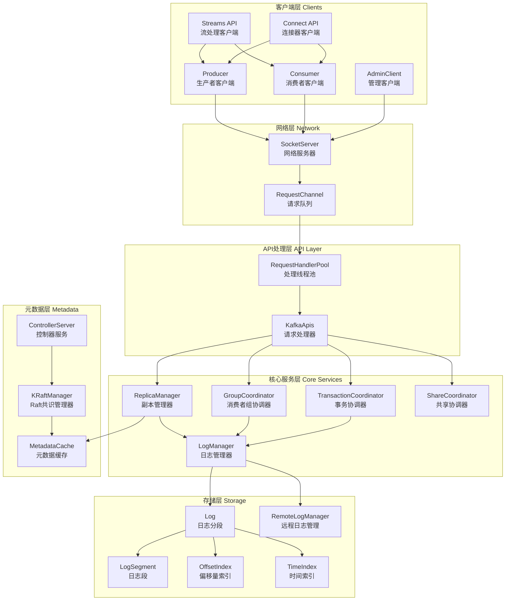
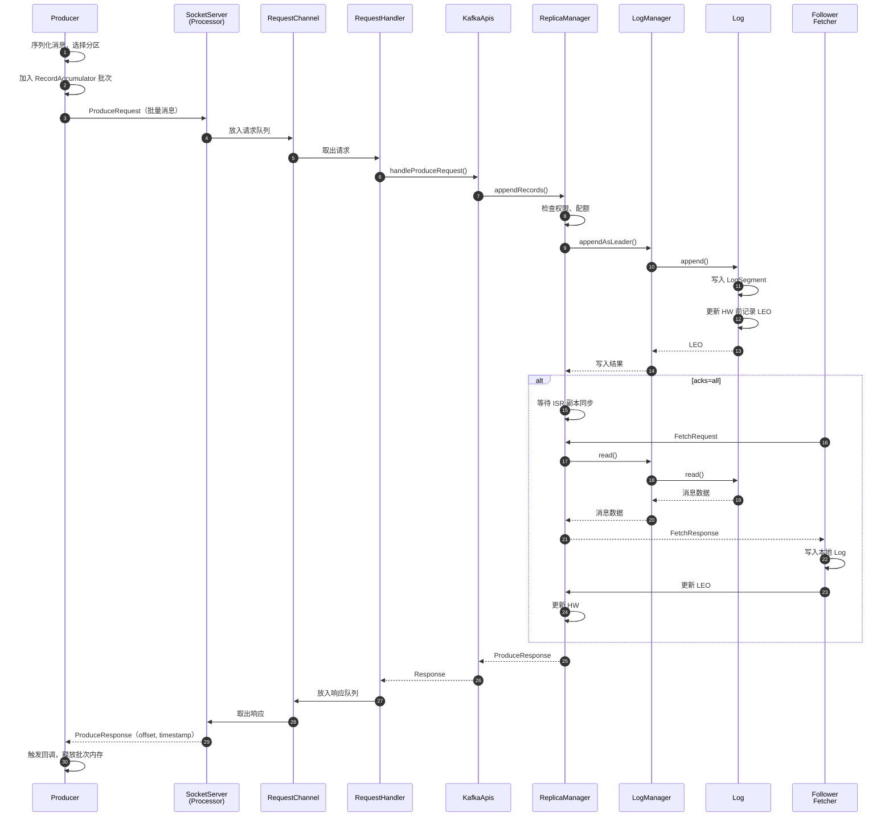
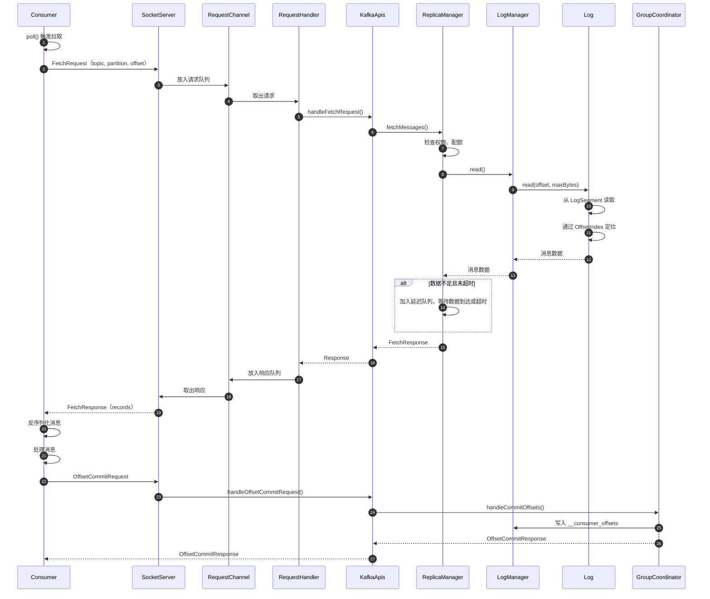
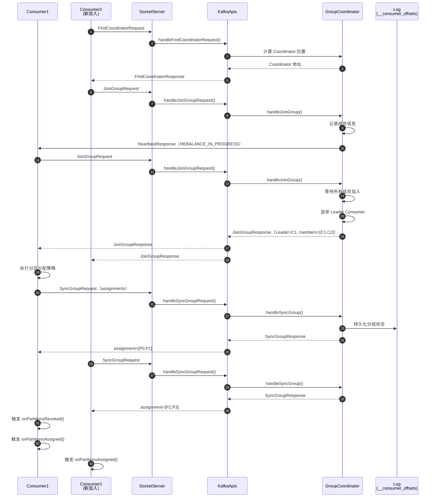
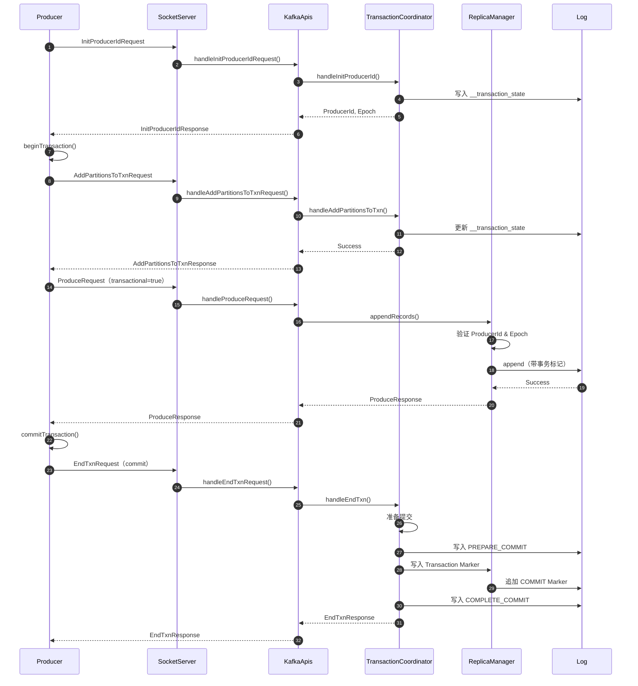
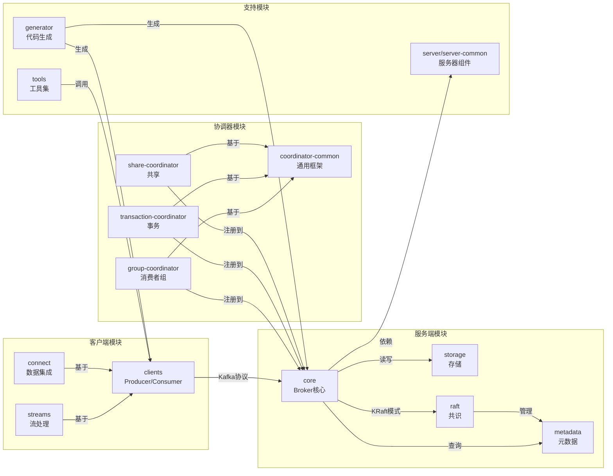

# Kafka-00-总览

## 0. 摘要

### 0.1 项目目标与核心能力

Apache Kafka 是一个开源的分布式事件流平台，用于构建实时数据管道和流式应用。核心能力包括：

- **消息发布与订阅**：类似消息队列系统，支持多生产者、多消费者模式
- **存储持久化**：以容错方式持久化存储事件流数据
- **流处理**：实时处理和转换事件流数据
- **高吞吐低延迟**：支持每秒处理数百万条消息
- **水平扩展**：通过分区机制实现线性扩展能力
- **强一致性保证**：提供 exactly-once 语义和事务性消息

### 0.2 问题域与边界

**问题域**：
- 实时数据管道构建：在系统或应用之间可靠地获取数据
- 流式应用开发：实时转换或响应数据流
- 事件驱动架构：系统间通过事件进行解耦通信
- 日志聚合：收集和中心化日志数据
- 活动跟踪：跟踪用户行为事件流

**核心边界**：
- 不提供复杂的路由逻辑（需通过 Kafka Connect 或 Streams 实现）
- 不提供内置的数据转换（通过 Streams API 或外部处理器实现）
- 不保证全局消息顺序（仅保证分区内顺序）

**非目标**：
- 不是传统的企业消息总线（ESB）
- 不是完整的 ETL 工具
- 不是实时查询数据库
- 不提供复杂的消息过滤和路由

### 0.3 运行环境

**语言与运行时**：
- Java 17+ / Scala 2.13（服务端）
- Java 11+（客户端）
- 支持多语言客户端：Python, Go, C/C++, .NET 等

**依赖项**：
- Apache ZooKeeper（旧版模式，逐步被 KRaft 替代）
- KRaft（Kafka Raft）：新的共识协议，无需 ZooKeeper

**部署形态**：
- **Broker 集群模式**：多个 Broker 节点组成集群
- **KRaft 模式**：Controller + Broker 的分离或混合部署
- **容器化部署**：支持 Docker, Kubernetes
- **云原生部署**：支持 AWS, Azure, GCP 等云平台

### 0.4 版本架构演进

- **0.x 版本**：依赖 ZooKeeper 进行元数据管理
- **2.x 版本**：引入 KRaft 模式（实验性）
- **3.x 版本**：KRaft 模式生产就绪，逐步移除 ZooKeeper 依赖

---

## 1. 整体架构图



### 1.1 架构图说明

#### 1.1.1 组件职责与耦合关系

**客户端层（Clients）**：
- **Producer**：负责将消息发送到 Kafka 集群，支持批量发送、压缩、分区选择等功能
- **Consumer**：从 Kafka 集群拉取消息，支持消费者组、自动提交偏移量、手动提交等
- **AdminClient**：执行集群管理操作，如创建主题、修改配置、查看元数据等
- **Streams API**：基于 Producer 和 Consumer 构建的流处理框架
- **Connect API**：数据集成框架，支持从外部系统导入/导出数据

**网络层（Network）**：
- **SocketServer**：基于 Java NIO 的网络服务器，处理客户端连接和请求接收
- **RequestChannel**：请求队列，解耦网络线程和业务处理线程

**API处理层（API Layer）**：
- **KafkaApis**：请求处理中枢，根据请求类型分发到不同的处理逻辑
- **RequestHandlerPool**：业务处理线程池，从 RequestChannel 获取请求并调用 KafkaApis 处理

**核心服务层（Core Services）**：
- **ReplicaManager**：副本管理器，负责分区的读写、副本同步、ISR 管理
- **LogManager**：日志管理器，管理所有分区的日志文件生命周期
- **GroupCoordinator**：消费者组协调器，处理消费者组的加入、离开、再平衡
- **TransactionCoordinator**：事务协调器，管理事务性消息的两阶段提交
- **ShareCoordinator**：共享协调器，支持共享订阅模式

**元数据层（Metadata）**：
- **KRaftManager**：基于 Raft 协议的共识管理器，替代 ZooKeeper
- **MetadataCache**：元数据缓存，缓存主题、分区、副本等元数据信息
- **ControllerServer**：集群控制器，负责分区分配、Leader 选举等全局决策

**存储层（Storage）**：
- **Log**：分区日志抽象，管理一个分区的所有日志段
- **LogSegment**：日志段，实际存储消息的文件
- **OffsetIndex/TimeIndex**：索引文件，支持快速定位消息
- **RemoteLogManager**：远程日志管理，支持将冷数据迁移到对象存储

#### 1.1.2 数据流与控制流分界

**数据流路径**：
- 生产路径：Producer → SocketServer → KafkaApis → ReplicaManager → LogManager → Log → 磁盘
- 消费路径：Consumer → SocketServer → KafkaApis → ReplicaManager → LogManager → Log → 内存 → Consumer

**控制流路径**：
- 元数据更新：Controller → KRaftManager → MetadataCache → 各组件（ReplicaManager, GroupCoordinator 等）
- 协调器操作：Client → KafkaApis → Coordinator → Log（状态持久化）

**跨进程/跨线程路径**：
- 网络线程（Acceptor/Processor）与业务线程（RequestHandler）通过 RequestChannel 解耦
- Controller 线程与 Broker 线程通过 MetadataCache 共享元数据
- 副本同步通过 Fetcher 线程异步拉取 Leader 数据

#### 1.1.3 高可用与扩展性

**高可用机制**：
- **副本机制**：每个分区有多个副本（1 Leader + N Follower），Leader 故障时自动切换
- **ISR（In-Sync Replicas）**：只有与 Leader 保持同步的副本才能被选举为新 Leader
- **Controller 高可用**：KRaft 模式下，多个 Controller 节点通过 Raft 协议选举 Leader
- **数据持久化**：所有消息写入磁盘，支持配置同步刷盘策略

**扩展性设计**：
- **分区机制**：Topic 被分割为多个 Partition，分布在不同 Broker 上
- **水平扩展**：增加 Broker 节点，自动重新分配分区
- **消费者组**：一个分区只能被组内一个消费者消费，增加消费者数量可提高并行度
- **批量处理**：Producer 和 Consumer 都支持批量操作，提高吞吐量

**状态管理位置**：
- **无状态组件**：SocketServer, KafkaApis（可水平扩展）
- **有状态组件**：ReplicaManager（管理分区副本状态），Coordinators（管理消费者组/事务状态）
- **集中式状态**：MetadataCache（缓存全局元数据），KRaftManager（持久化元数据日志）

---

## 2. 全局时序图（主要业务闭环）

### 2.1 生产者发送消息时序图



### 2.2 消费者拉取消息时序图



### 2.3 消费者组再平衡时序图



### 2.4 事务性消息时序图



### 2.5 图解与要点

#### 2.5.1 入口与鉴权

**入口点**：
- 所有客户端请求通过 `SocketServer` 接收，由 Acceptor 线程接受连接，Processor 线程处理 I/O
- 请求经过网络层后进入 `RequestChannel` 队列，由 `RequestHandler` 线程池处理

**鉴权机制**：
- SASL/SCRAM、SASL/PLAIN、SASL/GSSAPI（Kerberos）等认证机制
- ACL（Access Control List）权限控制，支持 Topic、Group、Cluster 级别
- 在 `KafkaApis` 处理请求前，通过 `Authorizer` 接口进行权限检查

#### 2.5.2 幂等性保证

**Producer 幂等性**：
- 每个 Producer 有唯一的 `ProducerId` 和递增的 `Sequence Number`
- Broker 端通过 `(ProducerId, Partition, Sequence)` 三元组去重
- 重复消息（相同 Sequence）会被 Broker 拒绝，但返回成功响应

**Consumer 幂等性**：
- 通过提交 Offset 实现 at-least-once 或 at-most-once
- 结合事务性消费（read_committed）实现 exactly-once

**事务幂等性**：
- 两阶段提交协议，TransactionCoordinator 协调多个分区
- 所有分区写入 Transaction Marker 后，事务才对消费者可见

#### 2.5.3 回退策略

**Producer 回退**：
- **网络失败**：自动重试，可配置 `retries` 和 `delivery.timeout.ms`
- **配额超限**：阻塞等待或抛出异常
- **分区不可用**：等待元数据更新后重试
- **事务失败**：调用 `abortTransaction()` 回滚

**Consumer 回退**：
- **偏移量越界**：根据 `auto.offset.reset`（earliest/latest）重置
- **反序列化失败**：跳过错误消息或停止消费
- **再平衡**：触发 `ConsumerRebalanceListener` 回调，重新分配分区

**Broker 回退**：
- **副本同步失败**：从 ISR 中移除 Follower，降低 `min.insync.replicas` 风险
- **磁盘故障**：标记目录为离线，停止服务该目录的分区
- **Controller 失败**：通过 KRaft 或 ZooKeeper 重新选举 Controller

#### 2.5.4 重试点

**客户端重试**：
- Producer：`send()` 失败后自动重试，直到 `delivery.timeout.ms` 超时
- Consumer：`poll()` 失败后自动重试（如网络临时中断）
- AdminClient：大部分操作支持自动重试

**服务端重试**：
- Replica Fetcher：副本同步失败后自动重试
- Controller：分区分配、Leader 选举失败后重试

#### 2.5.5 超时设定

**客户端超时**：
- `request.timeout.ms`：单个请求超时时间（默认 30s）
- `delivery.timeout.ms`：Producer 发送总超时（默认 120s）
- `session.timeout.ms`：Consumer 会话超时（默认 10s）
- `max.poll.interval.ms`：Consumer 两次 poll 间最大间隔（默认 5min）

**服务端超时**：
- `replica.lag.time.max.ms`：Follower 同步延迟超时（默认 10s）
- `group.initial.rebalance.delay.ms`：再平衡延迟时间（默认 3s）
- `transaction.timeout.ms`：事务超时时间（默认 1min）

#### 2.5.6 资源上界

**内存上界**：
- Producer：`buffer.memory`（默认 32MB）
- Consumer：`fetch.max.bytes`（默认 50MB）
- Broker：`replica.fetch.max.bytes`（默认 1MB）

**磁盘上界**：
- 日志保留：`log.retention.bytes` 或 `log.retention.ms`
- 段文件大小：`log.segment.bytes`（默认 1GB）

**网络上界**：
- `socket.send.buffer.bytes` / `socket.receive.buffer.bytes`（默认 100KB）
- `num.network.threads`：网络线程数（默认 3）
- `num.io.threads`：I/O 线程数（默认 8）

---

## 3. 模块边界与交互图

### 3.1 模块列表与职责

| 模块名称 | 目录路径 | 主要职责 | 对外 API | 调用方 |
|---------|---------|---------|---------|--------|
| **clients** | `clients/` | 客户端库（Producer/Consumer/Admin） | Producer.send(), Consumer.poll(), AdminClient APIs | 用户应用 |
| **core** | `core/` | Broker 核心实现（网络、日志、副本、协调器） | Kafka 协议请求 | clients, connect, streams |
| **metadata** | `metadata/` | 元数据管理（Topic/Partition/Replica） | MetadataRequest/UpdateMetadata | core, clients |
| **storage** | `storage/` | 存储层（Log/Segment/Index） | Log.append(), Log.read() | core |
| **raft** | `raft/` | Raft 共识协议实现 | RaftClient APIs | core（KRaft 模式） |
| **group-coordinator** | `group-coordinator/` | 消费者组协调器 | JoinGroup, SyncGroup, Heartbeat | clients（Consumer） |
| **transaction-coordinator** | `transaction-coordinator/` | 事务协调器 | InitProducerId, AddPartitionsToTxn, EndTxn | clients（Producer） |
| **share-coordinator** | `share-coordinator/` | 共享协调器 | ShareFetch, ShareAcknowledge | clients（ShareConsumer） |
| **connect** | `connect/` | Kafka Connect 框架 | REST API（Connector 管理） | 外部系统 |
| **streams** | `streams/` | Kafka Streams 流处理库 | KafkaStreams APIs | 用户应用 |
| **server/server-common** | `server/`, `server-common/` | 服务器通用组件 | N/A（内部） | core |
| **coordinator-common** | `coordinator-common/` | 协调器通用框架 | N/A（内部） | group-coordinator, transaction-coordinator |
| **tools** | `tools/` | 管理工具集 | CLI 命令 | 运维人员 |
| **generator** | `generator/` | 消息协议代码生成器 | N/A（构建时） | 构建系统 |

### 3.2 模块交互矩阵



### 3.3 交互说明

#### 3.3.1 同步调用

| 调用方 | 被调方 | 接口名称 | 说明 |
|-------|-------|---------|------|
| clients | core | ProduceRequest | Producer 发送消息到 Broker |
| clients | core | FetchRequest | Consumer 从 Broker 拉取消息 |
| clients | core | MetadataRequest | 获取 Topic/Partition 元数据 |
| core | storage | Log.append() | 写入日志数据 |
| core | storage | Log.read() | 读取日志数据 |
| core | metadata | MetadataCache.getPartitionInfo() | 查询分区元数据 |
| core | group-coordinator | handleJoinGroup() | 处理消费者组加入 |
| core | transaction-coordinator | handleInitProducerId() | 初始化事务 Producer |

#### 3.3.2 异步消息

| 发送方 | 接收方 | 消息类型 | 说明 |
|-------|-------|---------|------|
| core（Controller） | core（Broker） | UpdateMetadataRequest | 异步推送元数据更新 |
| core（Leader） | core（Follower） | FetchRequest | 副本异步拉取数据 |
| group-coordinator | clients（Consumer） | HeartbeatResponse | 通知再平衡 |
| transaction-coordinator | core（ReplicaManager） | WriteTxnMarkers | 写入事务标记 |

#### 3.3.3 共享存储

| 模块 | 共享存储 | 用途 |
|-----|---------|------|
| group-coordinator | __consumer_offsets topic | 持久化消费者组状态和偏移量 |
| transaction-coordinator | __transaction_state topic | 持久化事务状态 |
| raft | __cluster_metadata topic | 持久化集群元数据（KRaft 模式） |

#### 3.3.4 订阅/发布

| 发布者 | 订阅者 | 事件类型 | 说明 |
|-------|-------|---------|------|
| metadata | core（多个组件） | MetadataUpdate | 元数据变更通知 |
| raft | core（BrokerMetadataPublisher） | MetadataSnapshot | 元数据快照推送 |
| core（LogManager） | core（ReplicaManager） | LogAppendEvent | 日志追加事件 |

---

## 4. 关键设计与权衡

### 4.1 数据一致性

#### 4.1.1 副本一致性（强一致性）

**设计**：
- 每个分区有 1 个 Leader 和 N 个 Follower 副本
- 只有 Leader 处理读写请求，Follower 通过 Fetch 请求同步数据
- ISR（In-Sync Replicas）机制：只有与 Leader 保持同步的副本才在 ISR 集合中

**一致性保证**：
- `acks=all`：Producer 必须等待所有 ISR 副本确认才返回成功
- `min.insync.replicas`：ISR 最小副本数，低于此值拒绝写入
- HW（High Watermark）：所有 ISR 副本都已同步的最大偏移量，Consumer 只能读取 HW 之前的消息

**权衡**：
- 强一致性 vs 可用性：`min.insync.replicas=N`（N 越大，一致性越强，但可用性越低）
- 性能 vs 持久性：`acks=all` 保证持久性，但延迟较高

#### 4.1.2 最终一致性

**场景**：
- 元数据更新：Controller 异步推送 `UpdateMetadataRequest` 到所有 Broker
- 消费者组状态：不同 Consumer 可能短暂看到不一致的分区分配

**权衡**：
- 元数据最终一致，但可能导致短暂的路由错误（客户端会重试）
- 再平衡期间，Consumer 可能重复消费或丢失消息（需要应用层保证幂等性）

### 4.2 事务边界

#### 4.2.1 单分区事务

**设计**：
- Producer 通过 `ProducerId` 和递增的 `Sequence Number` 实现幂等性
- Broker 端去重，保证单分区内消息不重复

#### 4.2.2 多分区事务

**设计**：
- 引入 `TransactionCoordinator`，协调多个分区的两阶段提交
- 事务状态持久化到 `__transaction_state` topic
- 所有参与分区写入 `Transaction Marker`（COMMIT 或 ABORT）

**权衡**：
- 事务保证跨分区 exactly-once，但增加延迟和协调开销
- 事务超时后自动回滚，避免长事务阻塞

### 4.3 锁与并发策略

#### 4.3.1 分区级锁

**设计**：
- 每个分区的 `Log` 对象有独立的读写锁
- 写入时加写锁，读取时加读锁（读写分离）

**权衡**：
- 细粒度锁提高并发，但增加锁开销
- 避免全局锁，支持多分区并行读写

#### 4.3.2 协调器锁

**设计**：
- `GroupCoordinator` 和 `TransactionCoordinator` 使用分段锁
- 不同组/事务可以并行处理

**权衡**：
- 分段锁提高并发，但增加内存开销
- 组内操作串行化，保证一致性

### 4.4 性能关键路径

#### 4.4.1 零拷贝（Zero-Copy）

**设计**：
- 消费路径使用 `sendfile()` 系统调用，直接从文件传输到网络
- 避免数据在内核态和用户态之间复制

**性能提升**：
- 减少 CPU 使用率 40%-50%
- 提高吞吐量 2-3 倍

#### 4.4.2 批量处理

**设计**：
- Producer 批量发送消息（`batch.size` 和 `linger.ms`）
- Broker 批量写入磁盘
- Consumer 批量拉取消息

**性能提升**：
- 减少网络往返次数
- 提高磁盘 I/O 效率（顺序写优于随机写）

#### 4.4.3 页缓存（Page Cache）

**设计**：
- Kafka 依赖操作系统页缓存，不自己管理缓存
- 消息先写入页缓存，由操作系统决定何时刷盘

**性能提升**：
- 利用操作系统优化，减少重复工作
- 消费路径大概率从页缓存读取，接近内存速度

### 4.5 可观测性指标

#### 4.5.1 Broker 指标

| 指标名称 | 含义 | 阈值建议 |
|---------|------|---------|
| `BytesInPerSec` | 每秒写入字节数 | 根据网络带宽设定 |
| `BytesOutPerSec` | 每秒读取字节数 | 根据网络带宽设定 |
| `RequestsPerSec` | 每秒请求数 | 根据硬件能力设定 |
| `UnderReplicatedPartitions` | 副本不足的分区数 | 0（非 0 表示有副本掉队） |
| `OfflinePartitionsCount` | 离线分区数 | 0（非 0 表示有分区不可用） |
| `RequestHandlerAvgIdlePercent` | 请求处理线程空闲率 | >20%（低于 20% 表示过载） |

#### 4.5.2 Producer 指标

| 指标名称 | 含义 | 阈值建议 |
|---------|------|---------|
| `record-send-rate` | 每秒发送记录数 | 根据业务需求设定 |
| `record-error-rate` | 每秒错误记录数 | <1%（高错误率需排查） |
| `buffer-available-bytes` | 可用缓冲区字节数 | >0（为 0 表示背压） |
| `request-latency-avg` | 平均请求延迟 | <100ms（P99 <500ms） |

#### 4.5.3 Consumer 指标

| 指标名称 | 含义 | 阈值建议 |
|---------|------|---------|
| `records-lag-max` | 最大消费延迟（条数） | <10000（根据业务容忍度） |
| `records-consumed-rate` | 每秒消费记录数 | 应接近生产速率 |
| `fetch-latency-avg` | 平均拉取延迟 | <50ms |
| `commit-latency-avg` | 平均提交延迟 | <100ms |

### 4.6 配置项与可变参数

#### 4.6.1 Broker 关键配置

| 配置项 | 默认值 | 说明 |
|-------|-------|------|
| `num.network.threads` | 3 | 网络线程数（处理请求接收和响应发送） |
| `num.io.threads` | 8 | I/O 线程数（处理业务逻辑） |
| `log.segment.bytes` | 1GB | 日志段文件大小 |
| `log.retention.hours` | 168（7天） | 日志保留时间 |
| `replica.lag.time.max.ms` | 10000 | 副本同步最大延迟 |
| `min.insync.replicas` | 1 | ISR 最小副本数 |

#### 4.6.2 Producer 关键配置

| 配置项 | 默认值 | 说明 |
|-------|-------|------|
| `batch.size` | 16384（16KB） | 批次大小 |
| `linger.ms` | 0 | 批次等待时间 |
| `buffer.memory` | 33554432（32MB） | 缓冲区大小 |
| `acks` | all | 确认级别（0/1/all） |
| `retries` | Integer.MAX_VALUE | 重试次数 |
| `delivery.timeout.ms` | 120000 | 发送总超时 |

#### 4.6.3 Consumer 关键配置

| 配置项 | 默认值 | 说明 |
|-------|-------|------|
| `fetch.min.bytes` | 1 | 最小拉取字节数 |
| `fetch.max.wait.ms` | 500 | 最大等待时间 |
| `max.poll.records` | 500 | 单次拉取最大记录数 |
| `session.timeout.ms` | 10000 | 会话超时 |
| `max.poll.interval.ms` | 300000 | poll 间隔超时 |
| `enable.auto.commit` | true | 自动提交偏移量 |

---

## 5. 典型使用示例与最佳实践（总览级）

### 5.1 示例 1：最小可运行入口 + 端到端调用

#### 5.1.1 启动 Kafka Broker（KRaft 模式）

```bash
# 生成集群 ID
KAFKA_CLUSTER_ID="$(bin/kafka-storage.sh random-uuid)"

# 格式化存储目录
bin/kafka-storage.sh format --standalone -t $KAFKA_CLUSTER_ID -c config/server.properties

# 启动 Broker
bin/kafka-server-start.sh config/server.properties
```

**说明**：
- KRaft 模式无需 ZooKeeper，直接使用 Raft 协议管理元数据
- `--standalone` 表示单节点模式（开发测试用）
- 生产环境需配置多个 Controller 节点

#### 5.1.2 创建 Topic

```bash
bin/kafka-topics.sh --create \
  --bootstrap-server localhost:9092 \
  --topic test-topic \
  --partitions 3 \
  --replication-factor 1
```

**说明**：
- `partitions=3`：3 个分区，支持 3 个消费者并行消费
- `replication-factor=1`：单副本（测试用，生产环境至少 3 副本）

#### 5.1.3 Producer 发送消息（Java 示例）

```java
import org.apache.kafka.clients.producer.*;
import java.util.Properties;

public class ProducerExample {
    public static void main(String[] args) {
        Properties props = new Properties();
        props.put("bootstrap.servers", "localhost:9092");
        props.put("key.serializer", "org.apache.kafka.common.serialization.StringSerializer");
        props.put("value.serializer", "org.apache.kafka.common.serialization.StringSerializer");
        props.put("acks", "all"); // 等待所有 ISR 副本确认
        props.put("retries", Integer.MAX_VALUE); // 自动重试
        props.put("enable.idempotence", true); // 开启幂等性

        Producer<String, String> producer = new KafkaProducer<>(props);

        try {
            for (int i = 0; i < 100; i++) {
                ProducerRecord<String, String> record = new ProducerRecord<>(
                    "test-topic", 
                    "key-" + i, 
                    "value-" + i
                );
                
                producer.send(record, (metadata, exception) -> {
                    if (exception != null) {
                        System.err.println("发送失败: " + exception.getMessage());
                    } else {
                        System.out.printf("发送成功: partition=%d, offset=%d%n",
                            metadata.partition(), metadata.offset());
                    }
                });
            }
        } finally {
            producer.close(); // 等待所有消息发送完成
        }
    }
}
```

**关键点**：
- `acks=all`：确保消息持久化到所有 ISR 副本
- `enable.idempotence=true`：避免重复消息
- 异步发送 + 回调：提高吞吐量，同时处理失败

#### 5.1.4 Consumer 消费消息（Java 示例）

```java
import org.apache.kafka.clients.consumer.*;
import java.time.Duration;
import java.util.*;

public class ConsumerExample {
    public static void main(String[] args) {
        Properties props = new Properties();
        props.put("bootstrap.servers", "localhost:9092");
        props.put("group.id", "test-group");
        props.put("key.deserializer", "org.apache.kafka.common.serialization.StringDeserializer");
        props.put("value.deserializer", "org.apache.kafka.common.serialization.StringDeserializer");
        props.put("enable.auto.commit", "false"); // 手动提交偏移量
        props.put("auto.offset.reset", "earliest"); // 从最早的偏移量开始

        Consumer<String, String> consumer = new KafkaConsumer<>(props);
        consumer.subscribe(Collections.singletonList("test-topic"));

        try {
            while (true) {
                ConsumerRecords<String, String> records = consumer.poll(Duration.ofMillis(1000));
                
                for (ConsumerRecord<String, String> record : records) {
                    System.out.printf("接收消息: partition=%d, offset=%d, key=%s, value=%s%n",
                        record.partition(), record.offset(), record.key(), record.value());
                    
                    // 处理消息逻辑
                    processRecord(record);
                }
                
                // 手动提交偏移量（批量提交，提高性能）
                consumer.commitSync();
            }
        } finally {
            consumer.close();
        }
    }

    private static void processRecord(ConsumerRecord<String, String> record) {
        // 业务逻辑处理
    }
}
```

**关键点**：
- `enable.auto.commit=false`：手动提交，避免消息丢失
- `commitSync()`：同步提交，确保偏移量持久化后再拉取新消息
- 异常处理：捕获反序列化异常、处理失败等

### 5.2 示例 2：扩展点/插件接入

#### 5.2.1 自定义 Partitioner

```java
import org.apache.kafka.clients.producer.Partitioner;
import org.apache.kafka.common.Cluster;
import java.util.Map;

public class CustomPartitioner implements Partitioner {
    @Override
    public int partition(String topic, Object key, byte[] keyBytes, 
                         Object value, byte[] valueBytes, Cluster cluster) {
        int numPartitions = cluster.partitionCountForTopic(topic);
        
        // 自定义分区逻辑：根据 key 的哈希值分区
        if (key == null) {
            return 0; // 默认分区
        }
        return Math.abs(key.hashCode()) % numPartitions;
    }

    @Override
    public void close() {
        // 清理资源
    }

    @Override
    public void configure(Map<String, ?> configs) {
        // 初始化配置
    }
}
```

**配置**：
```java
props.put("partitioner.class", "com.example.CustomPartitioner");
```

#### 5.2.2 自定义 Interceptor

```java
import org.apache.kafka.clients.producer.*;
import java.util.Map;

public class MetricsProducerInterceptor implements ProducerInterceptor<String, String> {
    @Override
    public ProducerRecord<String, String> onSend(ProducerRecord<String, String> record) {
        // 发送前拦截：添加时间戳头
        record.headers().add("send-time", 
            String.valueOf(System.currentTimeMillis()).getBytes());
        return record;
    }

    @Override
    public void onAcknowledgement(RecordMetadata metadata, Exception exception) {
        // 发送后拦截：记录指标
        if (exception != null) {
            System.err.println("发送失败: " + exception.getMessage());
        } else {
            System.out.println("发送成功: offset=" + metadata.offset());
        }
    }

    @Override
    public void close() {}

    @Override
    public void configure(Map<String, ?> configs) {}
}
```

**配置**：
```java
props.put("interceptor.classes", "com.example.MetricsProducerInterceptor");
```

### 5.3 示例 3：规模化/上线注意事项清单

#### 5.3.1 硬件规划

- **CPU**：每个 Broker 至少 8 核，网络和压缩密集型任务需更多核心
- **内存**：32GB 起步，页缓存越大越好（建议操作系统总内存的 50%-75% 用于页缓存）
- **磁盘**：
  - SSD 优于 HDD（提升 I/O 性能）
  - RAID 10（兼顾性能和冗余）
  - 独立磁盘用于日志存储（避免与操作系统共享）
- **网络**：10Gbps 网络（大规模集群需更高带宽）

#### 5.3.2 Broker 配置优化

```properties
# 网络与线程
num.network.threads=8
num.io.threads=16
num.replica.fetchers=4

# 日志配置
log.segment.bytes=1073741824
log.retention.hours=168
log.retention.check.interval.ms=300000
log.cleaner.enable=true

# 副本配置
default.replication.factor=3
min.insync.replicas=2
unclean.leader.election.enable=false

# 性能优化
compression.type=lz4
message.max.bytes=10485760
replica.fetch.max.bytes=10485760
```

#### 5.3.3 Topic 设计原则

- **分区数**：根据吞吐量需求计算
  - 单分区吞吐量：约 10-50 MB/s（取决于硬件和消息大小）
  - 分区数 = 目标吞吐量 / 单分区吞吐量
  - 预留 20%-30% 余量
- **副本因子**：生产环境至少 3 副本
- **保留策略**：
  - 时间保留：`retention.ms`
  - 大小保留：`retention.bytes`
  - 压缩日志：`cleanup.policy=compact`（用于状态存储）

#### 5.3.4 客户端最佳实践

**Producer**：
- 开启幂等性：`enable.idempotence=true`
- 批量发送：`batch.size=32KB`, `linger.ms=10`
- 压缩：`compression.type=lz4`（或 snappy/zstd）
- 合理设置超时：`delivery.timeout.ms=120000`
- 异常处理：捕获 `TimeoutException`, `SerializationException` 等

**Consumer**：
- 消费者组大小 ≤ 分区数（避免空闲消费者）
- 手动提交偏移量：确保消息处理完成后再提交
- 控制拉取批次：`max.poll.records=500`（避免超时）
- 合理设置超时：`session.timeout.ms=30000`, `max.poll.interval.ms=300000`
- 处理再平衡：实现 `ConsumerRebalanceListener`

#### 5.3.5 监控与告警

**关键指标**：
- `UnderReplicatedPartitions > 0`：副本掉队
- `OfflinePartitionsCount > 0`：分区离线
- `IsrShrinksPerSec > 0`：ISR 频繁变化
- `LeaderElectionRateAndTimeMs > 0`：Leader 频繁切换
- CPU、内存、磁盘、网络使用率

**告警阈值**：
- `UnderReplicatedPartitions` 持续 5 分钟 > 0
- `OfflinePartitionsCount` > 0
- Broker 磁盘使用率 > 80%
- Consumer Lag 持续增长

#### 5.3.6 故障演练

- **单 Broker 宕机**：验证 Leader 自动切换
- **网络分区**：验证 ISR 机制和数据不丢失
- **磁盘故障**：验证日志目录隔离
- **滚动升级**：验证零停机更新

---

## 6. 文档索引

本项目源码剖析文档按模块组织，每个模块包含以下子文档：

- **模块-概览.md**：模块职责、架构图、核心流程
- **模块-API.md**：对外 API 详细规格、请求/响应结构体、时序图
- **模块-数据结构.md**：关键数据结构、UML 类图
- **模块-时序图.md**：典型调用场景时序图

### 6.1 核心模块文档

1. [Kafka-01-Clients-概览.md](./Kafka-01-Clients-概览.md) - 客户端模块总览
2. [Kafka-01-Clients-API.md](./Kafka-01-Clients-API.md) - Producer/Consumer API
3. [Kafka-01-Clients-数据结构.md](./Kafka-01-Clients-数据结构.md) - 客户端数据结构
4. [Kafka-01-Clients-时序图.md](./Kafka-01-Clients-时序图.md) - 客户端调用时序

5. [Kafka-02-Core-概览.md](./Kafka-02-Core-概览.md) - Broker 核心模块
6. [Kafka-02-Core-API.md](./Kafka-02-Core-API.md) - Broker 协议 API
7. [Kafka-02-Core-数据结构.md](./Kafka-02-Core-数据结构.md) - Broker 数据结构
8. [Kafka-02-Core-时序图.md](./Kafka-02-Core-时序图.md) - Broker 处理时序

### 6.2 协调器模块文档

9. [Kafka-06-GroupCoordinator-概览.md](./Kafka-06-GroupCoordinator-概览.md) - 消费者组协调器
10. [Kafka-07-TransactionCoordinator-概览.md](./Kafka-07-TransactionCoordinator-概览.md) - 事务协调器
11. [Kafka-11-ShareCoordinator-概览.md](./Kafka-11-ShareCoordinator-概览.md) - 共享协调器

### 6.3 存储与元数据模块

12. [Kafka-03-Metadata-概览.md](./Kafka-03-Metadata-概览.md) - 元数据管理
13. [Kafka-04-Storage-概览.md](./Kafka-04-Storage-概览.md) - 存储层
14. [Kafka-05-Raft-概览.md](./Kafka-05-Raft-概览.md) - Raft 共识协议

### 6.4 扩展框架模块

15. [Kafka-08-Connect-概览.md](./Kafka-08-Connect-概览.md) - Kafka Connect
16. [Kafka-09-Streams-概览.md](./Kafka-09-Streams-概览.md) - Kafka Streams

---

## 7. 参考资源

### 7.1 官方文档

- [Apache Kafka Documentation](https://kafka.apache.org/documentation/)
- [Kafka Improvement Proposals (KIPs)](https://cwiki.apache.org/confluence/display/KAFKA/Kafka+Improvement+Proposals)
- [Kafka Protocol Guide](https://kafka.apache.org/protocol.html)

### 7.2 源码仓库

- [Apache Kafka GitHub](https://github.com/apache/kafka)
- [Kafka Docker](https://github.com/apache/kafka/tree/trunk/docker)

### 7.3 社区资源

- [Confluent Blog](https://www.confluent.io/blog/)
- [Kafka Summit](https://kafka-summit.org/)
- [Kafka 邮件列表](https://kafka.apache.org/contact)


---

## Kafka 核心机制与生产实践

### Broker 核心架构

- **网络处理层**：
  - **SocketServer**：基于 Java NIO 的非阻塞网络服务器，监听多个端口（PLAINTEXT、SSL、SASL）。
  - **Acceptor**：每个端口一个 Acceptor 线程，接受新连接并轮询分配给 Processor。
  - **Processor**：网络线程池（默认 3 个），处理读写请求，将请求放入 RequestChannel。
  - **RequestChannel**：请求队列（容量 500），解耦网络层和处理层。

- **请求处理层**：
  - **KafkaApis**：路由请求到具体处理方法（Produce、Fetch、Metadata、OffsetCommit 等）。
  - **RequestHandlerPool**：处理线程池（默认 8 个），从 RequestChannel 取请求并调用 KafkaApis。
  - **DelayedRequestPurgatory**：延迟请求管理（Produce acks=all、Fetch minBytes、Join Group 等），超时或条件满足时触发回调。

- **副本管理层**：
  - **ReplicaManager**：管理所有分区副本，协调 Leader 写入和 Follower 复制。
  - **ISR 管理**：维护 In-Sync Replicas 集合，动态调整（lag 超过 `replica.lag.time.max.ms` 移出 ISR）。
  - **ReplicaFetcher**：Follower 通过 Fetcher 线程从 Leader 拉取数据，批量复制。
  - **高水位（HW）**：ISR 中最小的 LEO（Log End Offset），消费者只能读到 HW 之前的数据。

- **存储管理层**：
  - **LogManager**：管理所有 Topic-Partition 的日志，负责日志创建、删除、清理。
  - **UnifiedLog**：单个分区的抽象，由多个 LogSegment 组成。
  - **LogSegment**：日志段（默认 1GB），包含 .log、.index、.timeindex、.txnindex 文件。
  - **LogCleaner**：后台清理线程，支持 delete（删除过期段）和 compact（压缩保留最新值）策略。

### 存储引擎深度

- **分段日志设计**：
  - 日志按 Segment 分段存储（基于大小或时间），方便过期删除和并行读写。
  - Active Segment：当前写入段，其他为 Inactive Segment（只读）。
  - 文件命名：baseOffset.log（如 00000000000000000000.log），便于二分查找。

- **索引机制**：
  - **偏移量索引（.index）**：稀疏索引，映射相对偏移量到物理位置（4KB 一个条目）。
  - **时间戳索引（.timeindex）**：映射时间戳到偏移量，支持按时间查询。
  - **事务索引（.txnindex）**：记录 aborted transactions，过滤未提交消息。
  - 查找流程：定位 Segment（二分查找） → 索引二分查找 → 日志顺序扫描。

- **零拷贝技术**：
  - **sendfile 系统调用**：数据从磁盘直接传输到网络，避免用户空间拷贝。
  - 条件：未压缩或 Broker 和 Consumer 压缩格式一致，消息格式相同。
  - 性能提升：减少 CPU 开销和内存拷贝，大幅提升吞吐量。

- **页缓存优化**：
  - 依赖操作系统页缓存：写入和读取都经过页缓存，顺序 I/O 性能接近内存。
  - 预读（Readahead）：操作系统自动预读后续数据，适合顺序消费场景。
  - 避免堆内缓存：减少 GC 压力，利用系统内存管理。

- **日志清理策略**：
  - **delete**：基于时间（`retention.ms`）或大小（`retention.bytes`）删除过期段。
  - **compact**：保留每个 Key 的最新值，适用于变更日志（Changelog）场景。
  - 清理流程：选择高脏数据比例的日志 → 构建偏移量映射 → 重写保留部分 → 替换旧段。

### 客户端实现机制

- **Producer 架构**：
  - **序列化器**：将对象序列化为字节数组（StringSerializer、JsonSerializer、Avro）。
  - **分区器**：根据 Key 哈希或自定义逻辑选择分区（默认 murmur2 哈希）。
  - **RecordAccumulator**：按分区缓存消息，批量发送（`batch.size: 16KB`，`linger.ms: 0`）。
  - **Sender**：后台线程从 Accumulator 取批次，通过 NetworkClient 发送到 Broker。
  - **幂等性**：`enable.idempotence: true`，Broker 去重（PID + Sequence Number）。
  - **事务性**：`transactional.id` 启用事务，跨分区原子写入（Two-Phase Commit）。

- **Producer 关键配置**：
  - `acks`：0（不等待），1（Leader 确认），all/-1（ISR 全部确认）。
  - `retries`：重试次数（默认 Integer.MAX_VALUE），配合 `delivery.timeout.ms`。
  - `max.in.flight.requests.per.connection`：未确认请求数（默认 5），设为 1 保证顺序。
  - `compression.type`：none/gzip/snappy/lz4/zstd，减少网络和存储开销。

- **Consumer 架构**：
  - **订阅模式**：subscribe（自动分配分区）、assign（手动指定分区）。
  - **ConsumerCoordinator**：与 GroupCoordinator 交互，处理心跳、Rebalance、偏移量提交。
  - **Fetcher**：从 Broker 拉取消息（`fetch.min.bytes: 1`，`fetch.max.wait.ms: 500`）。
  - **反序列化器**：将字节数组反序列化为对象。
  - **偏移量管理**：自动提交（`enable.auto.commit: true`，`auto.commit.interval.ms: 5000`）或手动提交。

- **Consumer Rebalance**：
  - **触发条件**：成员加入/离开、订阅变更、分区数变化。
  - **协议**：Range（默认，按主题均分）、RoundRobin（全局轮询）、Sticky（尽量保留原分配）、CooperativeSticky（增量 Rebalance）。
  - **流程**：JoinGroup（选举 Leader） → SyncGroup（Leader 分配分区，广播给成员） → Heartbeat（维持成员资格）。
  - **优化**：增大 `session.timeout.ms`（默认 45s），减少 `max.poll.interval.ms`（默认 5min），避免频繁 Rebalance。

### 协调器机制

- **GroupCoordinator**：
  - 管理消费者组：成员管理、分区分配、偏移量管理。
  - 偏移量存储：内部主题 `__consumer_offsets`（50 个分区，压缩日志）。
  - 心跳检测：成员定期发送心跳，超时移出组触发 Rebalance。

- **TransactionCoordinator**：
  - 管理事务：事务状态存储在内部主题 `__transaction_state`（50 个分区）。
  - 两阶段提交：Prepare（写入所有分区） → Commit（写入事务标记，更新状态）。
  - 隔离级别：read_uncommitted（读所有）、read_committed（过滤未提交）。

### KRaft 共识协议

- **架构演进**：
  - 替代 ZooKeeper：移除外部依赖，简化部署和运维。
  - Controller Quorum：专用 Controller 节点（或混合模式）运行 Raft 协议。
  - 元数据日志：`__cluster_metadata` 主题存储元数据变更日志。

- **Raft 实现**：
  - **Leader 选举**：投票机制，多数派确认，任期（Epoch）递增。
  - **日志复制**：Leader 追加日志，Follower 复制，多数派确认后提交。
  - **快照**：定期生成快照（默认 100 万条记录），加速恢复。

- **元数据管理**：
  - MetadataCache：Broker 本地缓存元数据（Topic、Partition、Replica、Config）。
  - 增量更新：Broker 订阅元数据日志，接收增量变更（Delta）并应用。
  - 一致性：所有 Broker 通过日志同步保证元数据最终一致。

### 网络协议架构

- **协议设计**：
  - 二进制协议：基于 TLV（Type-Length-Value），紧凑高效。
  - 请求-响应模型：请求携带 CorrelationId，响应匹配 ID。
  - API 版本：支持多版本兼容，客户端和 Broker 协商最高支持版本。

- **关键 API**：
  - **Produce**：生产消息，acks 控制确认级别。
  - **Fetch**：拉取消息，支持批量拉取和长轮询。
  - **Metadata**：查询集群元数据（Topic、Partition、Leader、ISR）。
  - **OffsetCommit/OffsetFetch**：提交和查询偏移量。
  - **JoinGroup/SyncGroup/Heartbeat**：消费者组协调。
  - **ApiVersions**：查询 Broker 支持的 API 版本。

- **连接管理**：
  - 长连接：客户端和 Broker 保持长连接，复用连接发送请求。
  - 多路复用：一个连接并发发送多个请求（In-Flight Requests）。
  - 连接池：客户端为每个 Broker 维护连接，避免频繁建立。

### 性能优化实践

- **生产端优化**：
  - 批量发送：增大 `batch.size`（如 32KB），增加 `linger.ms`（如 10ms）。
  - 压缩：启用 lz4 或 zstd 压缩，降低网络和存储开销。
  - 异步发送：使用回调处理响应，避免阻塞。
  - 分区数：根据吞吐量设置分区数（经验：1 个分区 10-30MB/s）。

- **消费端优化**：
  - 并行消费：多消费者实例，每个实例处理部分分区。
  - 批量拉取：增大 `fetch.min.bytes`（如 1MB），减少请求次数。
  - 手动提交：批处理后手动提交偏移量，减少提交频率。
  - 预读：增大 `max.partition.fetch.bytes`（默认 1MB），提升吞吐。

- **Broker 优化**：
  - JVM 堆内存：6-8GB，避免过大导致 GC 停顿。
  - 文件描述符：至少 10 万，支持大量分区和连接。
  - 网络线程：`num.network.threads: 8`（根据 CPU 核数调整）。
  - I/O 线程：`num.io.threads: 8`，处理磁盘读写。
  - 页缓存：预留足够系统内存用于页缓存（总内存 - JVM 堆 - 系统开销）。

### 监控与运维

- **关键指标**：
  - **Broker 指标**：RequestsPerSec（QPS）、BytesInPerSec/BytesOutPerSec（吞吐量）、TotalTimeMs（请求延迟）、UnderReplicatedPartitions（未同步副本数）。
  - **Producer 指标**：record-send-rate（发送速率）、record-error-rate（错误率）、request-latency-avg（延迟）。
  - **Consumer 指标**：records-consumed-rate（消费速率）、fetch-latency-avg（拉取延迟）、records-lag-max（消费滞后）。

- **常见问题排查**：
  - **副本不同步**：检查 Follower 是否宕机、网络延迟、磁盘 I/O 瓶颈。
  - **消费滞后**：增加消费者实例、优化处理逻辑、调整拉取参数。
  - **Rebalance 频繁**：增大 `session.timeout.ms`、减少 `max.poll.interval.ms`、优化处理时间。
  - **磁盘满**：调整保留策略（`retention.ms`、`retention.bytes`），启用压缩。
  - **高延迟**：检查网络、磁盘 I/O、GC 停顿、请求队列积压。

- **安全加固**：
  - **认证**：SASL/PLAIN、SASL/SCRAM、SASL/GSSAPI（Kerberos）。
  - **授权**：ACL（Access Control List）控制主题和组的访问权限。
  - **加密**：SSL/TLS 加密传输，保护数据隐私。
  - **审计**：记录管理操作日志，追踪配置变更。

### Kafka Connect 框架

- **架构**：
  - **Source Connector**：从外部系统导入数据到 Kafka（如数据库、文件系统）。
  - **Sink Connector**：从 Kafka 导出数据到外部系统（如 HDFS、Elasticsearch）。
  - **Task**：Connector 分解为多个 Task 并行执行。
  - **Worker**：运行 Connector 和 Task 的进程，支持单机和分布式模式。

- **分布式模式**：
  - 配置存储：内部主题 `connect-configs`、`connect-offsets`、`connect-status`。
  - 容错：Task 失败自动重启，Worker 故障重新分配 Task。
  - 扩展性：增加 Worker 实例，自动平衡 Task 分配。

### Kafka Streams 引擎

- **流处理模型**：
  - **拓扑（Topology）**：定义流处理逻辑（Source → Processor → Sink）。
  - **流和表**：KStream（事件流）、KTable（变更日志）、GlobalKTable（全局表）。
  - **窗口**：Tumbling（固定窗口）、Hopping（滑动窗口）、Session（会话窗口）。

- **状态管理**：
  - **State Store**：本地 RocksDB 存储状态，支持持久化和容错。
  - **Changelog Topic**：状态变更写入 Kafka 主题，用于恢复。
  - **Interactive Queries**：查询本地状态，支持分布式状态聚合。

- **容错与扩展**：
  - **任务分配**：按分区分配 Task，自动负载均衡。
  - **Rebalance**：实例加入/离开触发 Rebalance，重新分配 Task。
  - **Exactly-Once**：事务性处理，保证端到端精确一次语义。

