# Kafka-01-Clients

## 模块概览

## 1. 模块职责

Clients 模块是 Kafka 客户端库的核心实现，为应用程序提供与 Kafka 集群交互的 API。主要职责包括：

### 1.1 核心功能

- **Producer API**：异步发送消息到 Kafka 集群，支持批量发送、压缩、分区选择、幂等性和事务性消息
- **Consumer API**：从 Kafka 集群拉取消息，支持消费者组、自动/手动提交偏移量、再平衡协调
- **AdminClient API**：集群管理操作，包括 Topic 管理、配置管理、ACL 管理、消费者组管理等
- **ShareConsumer API**：共享订阅模式，支持多个消费者共享分区消费

### 1.2 底层基础设施

- **网络通信层**：基于 Java NIO 的非阻塞网络客户端（NetworkClient）
- **元数据管理**：维护集群拓扑、主题分区信息的本地缓存
- **请求管理**：请求构建、发送、重试、超时处理
- **序列化/反序列化**：消息的编解码框架

---

## 2. 输入/输出

### 2.1 输入

| 输入类型 | 说明 | 示例 |
|---------|------|------|
| 配置参数 | 客户端配置（bootstrap.servers, key.serializer 等） | `Properties` 或 `Map<String, Object>` |
| 用户数据 | Producer 待发送的消息记录 | `ProducerRecord<K, V>` |
| 订阅信息 | Consumer 订阅的主题或分区 | `List<String>` topics, `List<TopicPartition>` partitions |
| 管理命令 | AdminClient 的管理操作请求 | `CreateTopicsOptions`, `DeleteRecordsOptions` 等 |

### 2.2 输出

| 输出类型 | 说明 | 示例 |
|---------|------|------|
| 发送结果 | Producer 发送成功后的元数据 | `RecordMetadata`（partition, offset, timestamp） |
| 消费数据 | Consumer 拉取到的消息记录 | `ConsumerRecords<K, V>` |
| 管理结果 | AdminClient 操作的结果 | `CreateTopicsResult`, `DescribeClusterResult` 等 |
| 异常信息 | 操作失败时的异常 | `TimeoutException`, `SerializationException` 等 |

---

## 3. 上下游依赖

### 3.1 上游调用方

- **用户应用程序**：直接调用 Producer/Consumer/AdminClient API
- **Kafka Streams**：基于 Producer 和 Consumer 构建流处理拓扑
- **Kafka Connect**：通过 Producer 和 Consumer 实现数据集成

### 3.2 下游被调用方

- **Kafka Broker**：接收客户端的 Kafka 协议请求（ProduceRequest, FetchRequest 等）
- **外部序列化器**：用户自定义的 Serializer/Deserializer 实现
- **外部拦截器**：用户自定义的 Interceptor 实现（发送前/后拦截）

### 3.3 依赖关系图

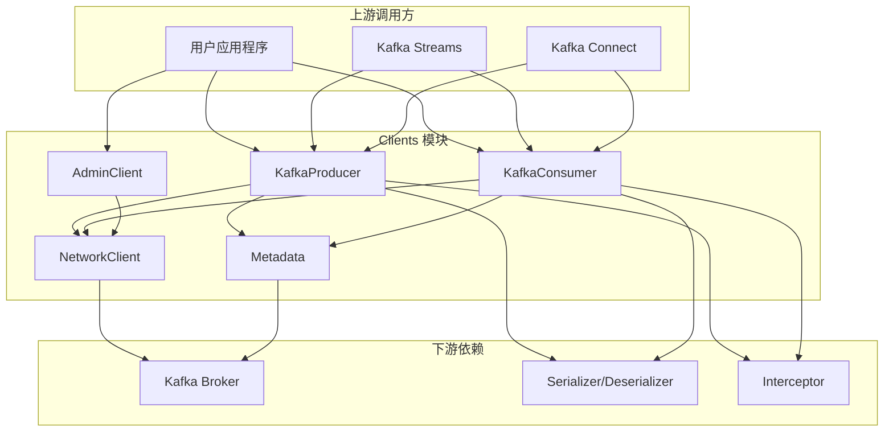

---

## 4. 生命周期

### 4.1 Producer 生命周期

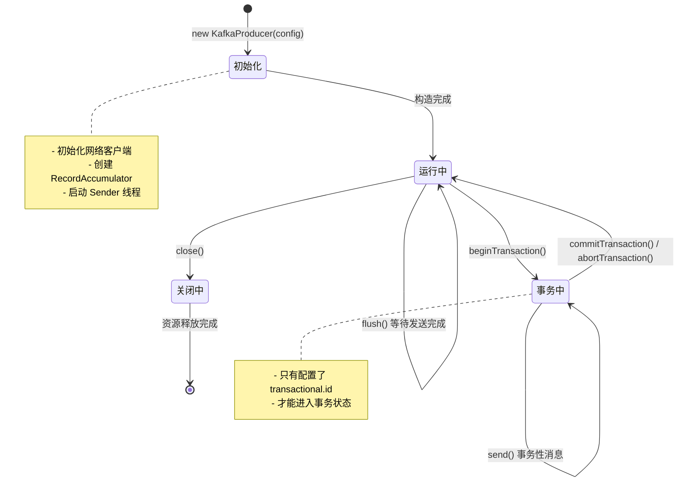

**生命周期阶段说明**：

1. **初始化阶段**：
   - 解析配置参数，校验必填项
   - 初始化序列化器（KeySerializer, ValueSerializer）
   - 创建 NetworkClient（网络通信层）
   - 创建 RecordAccumulator（消息批量累加器）
   - 创建 Sender 线程（后台 I/O 线程）
   - 初始化事务管理器（如果配置了 transactional.id）

2. **运行中阶段**：
   - 接受 `send()` 调用，消息进入 RecordAccumulator
   - Sender 线程周期性地将批次发送到 Broker
   - 异步回调通知发送结果

3. **事务中阶段**：
   - `beginTransaction()`：开启事务
   - `send()`：发送事务性消息
   - `commitTransaction()` / `abortTransaction()`：提交或回滚事务

4. **关闭阶段**：
   - `close()`：等待所有未完成的请求完成
   - 关闭 Sender 线程
   - 关闭网络连接
   - 释放 RecordAccumulator 缓冲区内存

### 4.2 Consumer 生命周期

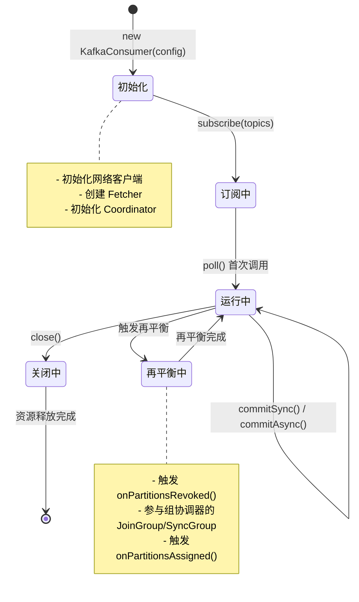

**生命周期阶段说明**：

1. **初始化阶段**：
   - 解析配置参数，校验必填项
   - 初始化反序列化器（KeyDeserializer, ValueDeserializer）
   - 创建 NetworkClient（网络通信层）
   - 创建 ConsumerCoordinator（协调器客户端）
   - 创建 Fetcher（拉取消息的核心组件）
   - 初始化 SubscriptionState（订阅状态管理）

2. **订阅阶段**：
   - `subscribe(topics)`：订阅主题列表
   - `assign(partitions)`：手动分配分区

3. **运行中阶段**：
   - `poll(timeout)`：拉取消息，触发协调器心跳、元数据更新
   - `commitSync()` / `commitAsync()`：提交偏移量
   - 自动再平衡：当有消费者加入/离开时触发

4. **再平衡阶段**：
   - 触发 `ConsumerRebalanceListener.onPartitionsRevoked()`
   - 参与组协调器的 JoinGroup 和 SyncGroup 请求
   - 获得新的分区分配
   - 触发 `ConsumerRebalanceListener.onPartitionsAssigned()`

5. **关闭阶段**：
   - `close()`：离开消费者组
   - 提交最终偏移量（如果启用自动提交）
   - 关闭网络连接
   - 释放资源

---

## 5. 模块级架构图

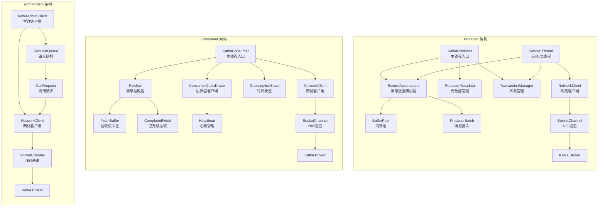

### 5.1 架构图说明

#### 5.1.1 Producer 架构核心组件

**KafkaProducer（主线程）**：

- 接收用户 `send()` 调用
- 序列化消息（key 和 value）
- 选择分区（通过 Partitioner）
- 将消息追加到 RecordAccumulator

**RecordAccumulator（消息批量累加器）**：

- 按 `<Topic, Partition>` 组织消息批次
- 从 BufferPool 分配内存缓冲区
- 当批次满或 linger.ms 到期时，标记批次为可发送状态
- 线程安全：主线程写入，Sender 线程读取

**Sender Thread（后台 I/O 线程）**：

- 周期性从 RecordAccumulator 提取可发送批次
- 构建 ProduceRequest，按 Broker 分组
- 通过 NetworkClient 发送请求
- 处理响应，触发回调，更新元数据

**TransactionManager（事务管理器）**：

- 管理 ProducerId 和 Epoch
- 协调两阶段提交（InitProducerId, AddPartitionsToTxn, EndTxn）
- 追踪事务状态（UNINITIALIZED, READY, IN_TRANSACTION, COMMITTING等）

#### 5.1.2 Consumer 架构核心组件

**KafkaConsumer（主线程）**：

- 接收用户 `poll()` 调用
- 协调元数据更新、协调器心跳、拉取消息
- 反序列化消息（key 和 value）
- 返回 ConsumerRecords

**Fetcher（消息拉取器）**：

- 构建 FetchRequest，按 Broker 分组
- 通过 NetworkClient 发送请求
- 解析 FetchResponse，按分区组织消息
- 管理 FetchBuffer（已拉取但未消费的消息）

**ConsumerCoordinator（协调器客户端）**：

- 发现 GroupCoordinator（通过 FindCoordinatorRequest）
- 参与消费者组再平衡（JoinGroup, SyncGroup）
- 发送心跳（HeartbeatRequest）
- 提交偏移量（OffsetCommitRequest）

**SubscriptionState（订阅状态管理）**：

- 维护订阅的主题和分配的分区
- 跟踪每个分区的消费位置（offset）
- 管理暂停/恢复状态

#### 5.1.3 AdminClient 架构核心组件

**KafkaAdminClient（管理客户端）**：

- 提供同步和异步管理 API
- 构建管理请求（CreateTopicsRequest, DeleteTopicsRequest 等）
- 通过 NetworkClient 发送请求
- 返回 Future 或直接返回结果

---

## 6. 边界与扩展点

### 6.1 模块边界

**功能边界**：

- **仅提供客户端功能**：不包含 Broker 端逻辑
- **不提供复杂路由**：仅支持简单的分区选择（Partitioner）
- **不提供数据转换**：序列化/反序列化由外部 Serializer 实现
- **不保证全局顺序**：仅保证分区内顺序

**性能边界**：

- **单 Producer 吞吐量**：约 100MB/s - 500MB/s（取决于硬件和消息大小）
- **单 Consumer 吞吐量**：约 50MB/s - 300MB/s（取决于硬件和消息大小）
- **内存限制**：Producer 的 buffer.memory（默认 32MB），Consumer 的 fetch.max.bytes（默认 50MB）

**并发边界**：

- **Producer 线程安全**：多线程共享一个 Producer 实例
- **Consumer 非线程安全**：每个 Consumer 实例只能被一个线程使用
- **AdminClient 线程安全**：多线程共享一个 AdminClient 实例

### 6.2 扩展点

**Serializer/Deserializer**：

- 自定义序列化/反序列化逻辑
- 示例：Avro, Protobuf, JSON 等格式

```java
public interface Serializer<T> extends Closeable {
    void configure(Map<String, ?> configs, boolean isKey);
    byte[] serialize(String topic, T data);
    byte[] serialize(String topic, Headers headers, T data);
    void close();
}
```

**Partitioner**：

- 自定义分区选择策略
- 示例：基于业务规则的分区路由

```java
public interface Partitioner extends Configurable, Closeable {
    int partition(String topic, Object key, byte[] keyBytes, Object value,
                  byte[] valueBytes, Cluster cluster);
    void close();
    default void onNewBatch(String topic, Cluster cluster, int prevPartition) {}
}
```

**Interceptor**：

- Producer 发送前/后拦截
- Consumer 消费前/后拦截
- 示例：监控、审计、数据增强

```java
public interface ProducerInterceptor<K, V> extends Configurable, Closeable {
    ProducerRecord<K, V> onSend(ProducerRecord<K, V> record);
    void onAcknowledgement(RecordMetadata metadata, Exception exception);
    void close();
}
```

**RebalanceListener**：

- 消费者再平衡前/后回调
- 示例：保存状态、关闭资源、恢复状态

```java
public interface ConsumerRebalanceListener {
    void onPartitionsRevoked(Collection<TopicPartition> partitions);
    void onPartitionsAssigned(Collection<TopicPartition> partitions);
}
```

### 6.3 状态持有位置

**Producer 状态**：

- **RecordAccumulator**：未发送的消息批次（易失性，内存中）
- **TransactionManager**：事务状态（易失性，内存中）
- **Metadata**：集群元数据缓存（易失性，内存中）

**Consumer 状态**：

- **SubscriptionState**：订阅状态和消费位置（易失性，内存中）
- **FetchBuffer**：已拉取但未消费的消息（易失性，内存中）
- **Broker 端**：已提交的偏移量（持久化，__consumer_offsets topic）

**AdminClient 状态**：

- 无状态（每次操作都是独立的）

### 6.4 资源占用要点

**内存占用**：

- **Producer**：
  - `buffer.memory`：消息批次缓冲区（默认 32MB）
  - 元数据缓存：Topic/Partition 信息（通常 <1MB）
  - 网络缓冲区：`send.buffer.bytes` / `receive.buffer.bytes`（默认 128KB）
- **Consumer**：
  - `fetch.max.bytes`：单次拉取最大字节数（默认 50MB）
  - FetchBuffer：已拉取消息缓冲区（受 `fetch.max.bytes` 限制）
  - 元数据缓存：Topic/Partition 信息（通常 <1MB）

**线程占用**：

- **Producer**：1 个 Sender 线程（后台 I/O）
- **Consumer**：0 个额外线程（所有操作在用户线程中执行）
- **AdminClient**：1 个 AdminClient 线程（后台 I/O）

**网络占用**：

- **连接数**：每个 Broker 一个 TCP 连接（可配置 `max.in.flight.requests.per.connection`）
- **带宽**：取决于消息吞吐量和批次大小

---

## 7. 关键流程剖析

### 7.1 Producer 发送流程

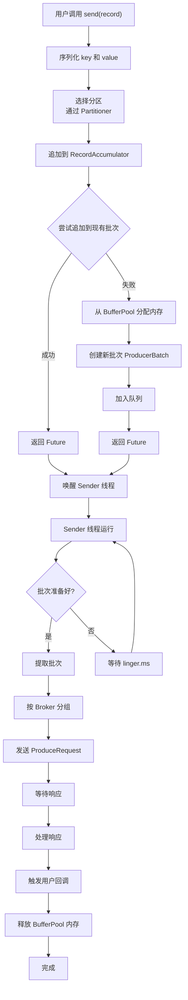

**流程说明**：

1. **序列化阶段**：
   - 调用 KeySerializer 和 ValueSerializer 序列化消息
   - 如果序列化失败，抛出 SerializationException

2. **分区选择阶段**：
   - 如果用户指定了分区，直接使用
   - 否则调用 Partitioner.partition() 选择分区
   - 默认 Partitioner：有 key 时基于 key 的哈希，无 key 时轮询

3. **消息累加阶段**：
   - 尝试追加到现有批次（如果批次未满）
   - 如果追加失败，从 BufferPool 分配新内存
   - 创建新 ProducerBatch，追加消息
   - 如果 BufferPool 内存不足，阻塞等待（最多 max.block.ms）

4. **批次准备阶段**（Sender 线程）：
   - 检查批次是否满足发送条件：
     - 批次已满（batch.size）
     - 等待时间到达（linger.ms）
     - 手动 flush()
     - 内存不足需要释放

5. **请求发送阶段**：
   - 按 Broker 分组批次
   - 构建 ProduceRequest
   - 通过 NetworkClient 发送请求
   - 如果网络不可用，重新入队等待重试

6. **响应处理阶段**：
   - 解析 ProduceResponse
   - 如果成功，触发用户回调 onCompletion(metadata, null)
   - 如果失败且可重试，重新入队
   - 如果失败且不可重试，触发回调 onCompletion(null, exception)
   - 释放 BufferPool 内存

### 7.2 Consumer 拉取流程

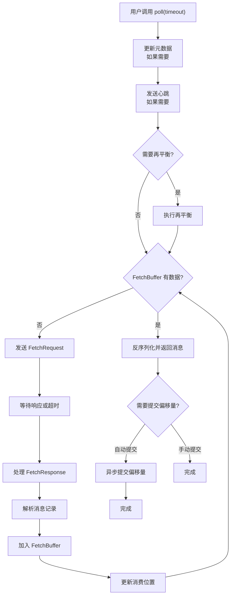

**流程说明**：

1. **元数据更新阶段**：
   - 如果元数据过期或分区无 Leader，发送 MetadataRequest
   - 更新本地 Metadata 缓存

2. **心跳发送阶段**：
   - 检查上次心跳时间
   - 如果超过 `heartbeat.interval.ms`，发送 HeartbeatRequest
   - 如果收到 REBALANCE_IN_PROGRESS，触发再平衡

3. **再平衡阶段**：
   - 调用 onPartitionsRevoked() 回调
   - 发送 JoinGroupRequest，加入消费者组
   - 等待所有成员加入，选举 Leader Consumer
   - Leader Consumer 执行分区分配（通过 ConsumerPartitionAssignor）
   - 发送 SyncGroupRequest，获取分配结果
   - 调用 onPartitionsAssigned() 回调
   - 重置消费位置（从 Broker 获取已提交偏移量）

4. **拉取请求阶段**：
   - 检查 FetchBuffer 是否有未消费的消息
   - 如果有，直接返回
   - 如果没有，构建 FetchRequest
   - 按 Broker 分组分区
   - 发送请求，等待响应（最多 fetch.max.wait.ms）

5. **响应处理阶段**：
   - 解析 FetchResponse
   - 按分区提取消息批次（RecordBatch）
   - 解压缩消息（如果有压缩）
   - 反序列化 key 和 value
   - 加入 FetchBuffer

6. **偏移量提交阶段**：
   - 如果启用自动提交（enable.auto.commit=true）
   - 且距上次提交超过 `auto.commit.interval.ms`
   - 异步发送 OffsetCommitRequest
   - 更新已提交偏移量缓存

---

## 8. 性能优化要点

### 8.1 Producer 性能优化

**批量发送**：

- 增大 `batch.size`（如 32KB）
- 增加 `linger.ms`（如 10ms）
- 权衡：批量大小越大，吞吐量越高，但延迟越高

**压缩**：

- 启用 `compression.type`（推荐 lz4 或 zstd）
- 权衡：压缩减少网络传输，但增加 CPU 使用

**内存池**：

- 增大 `buffer.memory`（如 64MB）
- 避免内存不足导致阻塞

**并行度**：

- 增加 `max.in.flight.requests.per.connection`（如 5）
- 权衡：提高吞吐量，但可能影响消息顺序（如果禁用幂等性）

**示例配置**：

```properties
batch.size=32768
linger.ms=10
buffer.memory=67108864
compression.type=lz4
max.in.flight.requests.per.connection=5
```

### 8.2 Consumer 性能优化

**批量拉取**：

- 增大 `fetch.min.bytes`（如 10KB）
- 增加 `fetch.max.wait.ms`（如 500ms）
- 增大 `max.poll.records`（如 1000）
- 权衡：批量大小越大，吞吐量越高，但可能增加处理延迟

**并行消费**：

- 增加 Consumer 实例数（最多等于分区数）
- 每个 Consumer 独立拉取和处理消息

**手动提交**：

- 禁用 `enable.auto.commit`
- 批量处理后手动 `commitSync()`
- 权衡：提高性能，但需要应用层保证提交时机

**示例配置**：

```properties
fetch.min.bytes=10240
fetch.max.wait.ms=500
max.poll.records=1000
enable.auto.commit=false
```

### 8.3 网络优化

**连接复用**：

- 每个 Broker 一个 TCP 连接
- 通过 `max.in.flight.requests.per.connection` 控制并发请求数

**缓冲区大小**：

- 增大 `send.buffer.bytes` / `receive.buffer.bytes`（如 256KB）
- 权衡：减少系统调用次数，但占用更多内存

---

## 9. 异常处理与容错

### 9.1 Producer 异常处理

**可重试异常**：

- `TimeoutException`：请求超时
- `NotLeaderForPartitionException`：分区 Leader 变更
- `NetworkException`：网络临时故障

**不可重试异常**：

- `RecordTooLargeException`：消息超过 `max.request.size`
- `SerializationException`：序列化失败
- `InvalidTopicException`：Topic 不存在且 `allow.auto.create.topics=false`

**处理策略**：

```java
producer.send(record, (metadata, exception) -> {
    if (exception != null) {
        if (exception instanceof RetriableException) {
            // 客户端会自动重试，无需额外处理
        } else {
            // 不可重试异常，需要应用层处理
            log.error("发送失败: {}", exception.getMessage());
        }
    }
});
```

### 9.2 Consumer 异常处理

**拉取异常**：

- `OffsetOutOfRangeException`：偏移量超出范围
  - 处理：调用 `seekToBeginning()` 或 `seekToEnd()`
- `InvalidOffsetException`：偏移量无效
  - 处理：重置偏移量

**反序列化异常**：

- `SerializationException`：反序列化失败
  - 处理：跳过错误消息或停止消费

**再平衡异常**：

- `RebalanceInProgressException`：再平衡进行中
  - 处理：客户端自动重试

**示例**：

```java
try {
    ConsumerRecords<String, String> records = consumer.poll(Duration.ofMillis(1000));
} catch (OffsetOutOfRangeException e) {
    // 偏移量越界，重置到最早
    consumer.seekToBeginning(e.partitions());
} catch (SerializationException e) {
    // 反序列化失败，跳过该消息
    consumer.seek(e.partition(), e.offset() + 1);
}
```

---

## 10. 最佳实践总结

### 10.1 Producer 最佳实践

1. **开启幂等性**：`enable.idempotence=true`（避免重复消息）
2. **合理配置 acks**：生产环境使用 `acks=all`（保证持久性）
3. **批量发送**：设置合理的 `batch.size` 和 `linger.ms`
4. **启用压缩**：`compression.type=lz4`（减少网络传输）
5. **异常处理**：实现 Callback，处理发送失败
6. **避免阻塞**：不要在回调中执行耗时操作
7. **资源释放**：使用完后调用 `close()`

### 10.2 Consumer 最佳实践

1. **手动提交偏移量**：禁用 `enable.auto.commit`，确保消息处理完成后再提交
2. **控制拉取批次**：合理设置 `max.poll.records`（避免超时）
3. **合理设置超时**：`session.timeout.ms`（心跳超时）和 `max.poll.interval.ms`（处理超时）
4. **处理再平衡**：实现 `ConsumerRebalanceListener`，保存和恢复状态
5. **幂等性消费**：应用层实现去重逻辑（如基于消息 offset 或业务 ID）
6. **监控消费延迟**：通过 `records-lag-max` 指标监控
7. **资源释放**：使用完后调用 `close()`

### 10.3 通用最佳实践

1. **连接池**：多线程共享 Producer 实例，避免频繁创建
2. **监控指标**：定期采集 JMX 指标，及时发现问题
3. **日志级别**：生产环境使用 INFO 或 WARN 级别
4. **测试容错**：模拟网络故障、Broker 宕机等场景
5. **版本兼容**：确保客户端版本与 Broker 版本兼容

---

**文档生成时间**：2025-10-04  
**模块路径**：`clients/`  
**主要语言**：Java  
**关键类**：`KafkaProducer`, `KafkaConsumer`, `AdminClient`

---

## API接口

## 1. Producer API 详细规格

### 1.1 KafkaProducer 类概述

`KafkaProducer` 是 Kafka 客户端发送消息的主类，线程安全，支持多线程共享单个实例。

**包路径**：`org.apache.kafka.clients.producer.KafkaProducer`

**实现接口**：`Producer<K, V>`

**泛型参数**：

- `K`：消息 key 的类型
- `V`：消息 value 的类型

---

### 1.2 构造方法

#### 1.2.1 方法签名

```java
// 使用 Properties 配置
public KafkaProducer(Properties properties)

// 使用 Map 配置
public KafkaProducer(Map<String, Object> configs)

// 指定 Serializer
public KafkaProducer(Map<String, Object> configs,
                     Serializer<K> keySerializer,
                     Serializer<V> valueSerializer)

// 指定 Properties 和 Serializer
public KafkaProducer(Properties properties,
                     Serializer<K> keySerializer,
                     Serializer<V> valueSerializer)
```

#### 1.2.2 参数说明

| 参数名 | 类型 | 必填 | 说明 |
|-------|-----|-----|------|
| `configs` / `properties` | `Map<String, Object>` / `Properties` | 是 | Producer 配置参数 |
| `keySerializer` | `Serializer<K>` | 否 | Key 序列化器（如果不指定，从配置读取） |
| `valueSerializer` | `Serializer<V>` | 否 | Value 序列化器（如果不指定，从配置读取） |

#### 1.2.3 关键配置参数

| 配置项 | 类型 | 默认值 | 说明 | 约束 |
|-------|-----|-------|------|------|
| `bootstrap.servers` | String | - | Broker 地址列表 | 必填，格式：host1:port1,host2:port2 |
| `key.serializer` | String | - | Key 序列化器类名 | 必填（如果构造函数未指定） |
| `value.serializer` | String | - | Value 序列化器类名 | 必填（如果构造函数未指定） |
| `client.id` | String | "" | 客户端标识符 | 用于日志和监控 |
| `acks` | String | "all" | 确认级别（0/1/all） | 0=不等待，1=Leader确认，all=所有ISR确认 |
| `retries` | int | Integer.MAX_VALUE | 重试次数 | 建议使用 delivery.timeout.ms 控制 |
| `delivery.timeout.ms` | int | 120000 | 发送总超时（毫秒） | 包含重试时间 |
| `batch.size` | int | 16384 | 批次大小（字节） | 每个分区的批次缓冲区大小 |
| `linger.ms` | int | 0 | 批次等待时间（毫秒） | 增加可提高吞吐量但增加延迟 |
| `buffer.memory` | long | 33554432 | 缓冲区总内存（字节） | 默认 32MB |
| `max.block.ms` | long | 60000 | 最大阻塞时间（毫秒） | 元数据获取或内存不足时阻塞超时 |
| `max.request.size` | int | 1048576 | 最大请求大小（字节） | 默认 1MB |
| `compression.type` | String | "none" | 压缩类型 | none/gzip/snappy/lz4/zstd |
| `enable.idempotence` | boolean | true | 启用幂等性 | 开启后自动设置 acks=all |
| `transactional.id` | String | null | 事务ID | 启用事务时必填，唯一标识 Producer |
| `max.in.flight.requests.per.connection` | int | 5 | 单连接最大未响应请求数 | 幂等性开启时最大为5 |

#### 1.2.4 构造示例

```java
// 示例 1：使用 Properties
Properties props = new Properties();
props.put("bootstrap.servers", "localhost:9092");
props.put("key.serializer", "org.apache.kafka.common.serialization.StringSerializer");
props.put("value.serializer", "org.apache.kafka.common.serialization.StringSerializer");
props.put("acks", "all");
props.put("enable.idempotence", true);

Producer<String, String> producer = new KafkaProducer<>(props);

// 示例 2：使用 Map 和指定 Serializer
Map<String, Object> configs = new HashMap<>();
configs.put("bootstrap.servers", "localhost:9092");
configs.put("acks", "all");

Producer<String, String> producer = new KafkaProducer<>(
    configs,
    new StringSerializer(),
    new StringSerializer()
);

// 示例 3：事务性 Producer
Properties props = new Properties();
props.put("bootstrap.servers", "localhost:9092");
props.put("transactional.id", "my-transactional-id"); // 启用事务
props.put("key.serializer", "org.apache.kafka.common.serialization.StringSerializer");
props.put("value.serializer", "org.apache.kafka.common.serialization.StringSerializer");

Producer<String, String> producer = new KafkaProducer<>(props);
producer.initTransactions(); // 初始化事务
```

---

### 1.3 send() 方法（核心发送方法）

#### 1.3.1 方法签名

```java
// 异步发送，无回调
public Future<RecordMetadata> send(ProducerRecord<K, V> record)

// 异步发送，带回调
public Future<RecordMetadata> send(ProducerRecord<K, V> record,
                                   Callback callback)
```

#### 1.3.2 请求结构体：ProducerRecord

```java
public class ProducerRecord<K, V> {
    private final String topic;        // Topic 名称
    private final Integer partition;   // 分区号（可选）
    private final Headers headers;     // 消息头（可选）
    private final K key;               // 消息 key（可选）
    private final V value;             // 消息 value
    private final Long timestamp;      // 时间戳（可选）
}
```

**字段表**：

| 字段 | 类型 | 必填 | 默认 | 约束 | 说明 |
|-----|-----|-----|-----|-----|------|
| `topic` | String | 是 | - | 非空，符合 Topic 命名规则 | 目标 Topic |
| `partition` | Integer | 否 | null | ≥0 | 指定分区号，null 则由 Partitioner 选择 |
| `key` | K | 否 | null | - | 消息 key，用于分区选择和日志压缩 |
| `value` | V | 是 | - | - | 消息内容 |
| `timestamp` | Long | 否 | null | ≥0 | 消息时间戳（毫秒），null 则使用当前时间 |
| `headers` | Headers | 否 | 空 | - | 消息头（键值对集合） |

**构造方法示例**：

```java
// 最简单：只指定 topic 和 value
ProducerRecord<String, String> record1 = new ProducerRecord<>("my-topic", "message");

// 指定 key 和 value
ProducerRecord<String, String> record2 = new ProducerRecord<>("my-topic", "key1", "value1");

// 指定 partition, key, value
ProducerRecord<String, String> record3 = new ProducerRecord<>("my-topic", 0, "key1", "value1");

// 完整参数：topic, partition, timestamp, key, value, headers
Headers headers = new RecordHeaders();
headers.add("header1", "value1".getBytes());
ProducerRecord<String, String> record4 = new ProducerRecord<>(
    "my-topic",
    0,                          // partition
    System.currentTimeMillis(), // timestamp
    "key1",                     // key
    "value1",                   // value
    headers                     // headers
);
```

#### 1.3.3 响应结构体：RecordMetadata

```java
public final class RecordMetadata {
    private final long offset;              // 消息偏移量
    private final long timestamp;           // 消息时间戳
    private final int serializedKeySize;    // 序列化后 key 大小
    private final int serializedValueSize;  // 序列化后 value 大小
    private final TopicPartition topicPartition; // Topic 和 Partition
}
```

**字段表**：

| 字段 | 类型 | 说明 | 备注 |
|-----|-----|------|------|
| `offset` | long | 消息在分区中的偏移量 | acks=0 时返回 -1 |
| `timestamp` | long | 消息时间戳（毫秒） | CREATE_TIME 或 LOG_APPEND_TIME |
| `serializedKeySize` | int | 序列化后 key 大小（字节） | key 为 null 时返回 -1 |
| `serializedValueSize` | int | 序列化后 value 大小（字节） | value 为 null 时返回 -1 |
| `topicPartition` | TopicPartition | Topic 名称和分区号 | 包含 topic() 和 partition() 方法 |

**获取方式**：

```java
// 方式 1：阻塞等待结果（不推荐）
RecordMetadata metadata = producer.send(record).get();
System.out.println("offset: " + metadata.offset());
System.out.println("partition: " + metadata.partition());

// 方式 2：异步回调（推荐）
producer.send(record, (metadata, exception) -> {
    if (exception != null) {
        System.err.println("发送失败: " + exception.getMessage());
    } else {
        System.out.println("offset: " + metadata.offset());
        System.out.println("partition: " + metadata.partition());
        System.out.println("timestamp: " + metadata.timestamp());
    }
});
```

#### 1.3.4 核心入口函数代码

```java
// KafkaProducer.send() 核心代码
public Future<RecordMetadata> send(ProducerRecord<K, V> record, Callback callback) {
    // 1. 拦截器前置处理
    ProducerRecord<K, V> interceptedRecord = this.interceptors.onSend(record);
    
    return doSend(interceptedRecord, callback);
}

private Future<RecordMetadata> doSend(ProducerRecord<K, V> record, Callback callback) {
    // 2. 创建回调包装器（包含拦截器和用户回调）
    AppendCallbacks appendCallbacks = new AppendCallbacks(callback, this.interceptors, record);

    try {
        // 3. 检查 Producer 状态
        throwIfProducerClosed();
        throwIfInPreparedState();

        // 4. 等待元数据可用（可能阻塞 max.block.ms）
        long nowMs = time.milliseconds();
        ClusterAndWaitTime clusterAndWaitTime = waitOnMetadata(
            record.topic(),
            record.partition(),
            nowMs,
            maxBlockTimeMs
        );
        Cluster cluster = clusterAndWaitTime.cluster;

        // 5. 序列化 key 和 value
        byte[] serializedKey = keySerializer.serialize(record.topic(), record.headers(), record.key());
        byte[] serializedValue = valueSerializer.serialize(record.topic(), record.headers(), record.value());

        // 6. 计算分区（如果用户未指定）
        int partition = partition(record, serializedKey, serializedValue, cluster);

        // 7. 校验消息大小
        int serializedSize = AbstractRecords.estimateSizeInBytesUpperBound(
            RecordBatch.CURRENT_MAGIC_VALUE, compression.type(),
            serializedKey, serializedValue, record.headers().toArray()
        );
        ensureValidRecordSize(serializedSize);

        // 8. 追加到 RecordAccumulator（批量累加器）
        RecordAccumulator.RecordAppendResult result = accumulator.append(
            record.topic(),
            partition,
            timestamp,
            serializedKey,
            serializedValue,
            record.headers(),
            appendCallbacks,
            remainingWaitMs,
            true
        );

        // 9. 如果批次满或创建新批次，唤醒 Sender 线程
        if (result.batchIsFull || result.newBatchCreated) {
            this.sender.wakeup();
        }

        // 10. 返回 Future
        return result.future;
        
    } catch (Exception e) {
        // 11. 异常处理：触发回调，释放资源
        appendCallbacks.onCompletion(null, e);
        throw e;
    }
}
```

**代码说明**：

1. **拦截器处理**：调用 `ProducerInterceptor.onSend()` 对消息进行前置处理
2. **状态检查**：确保 Producer 未关闭且不在 prepared 状态
3. **元数据等待**：如果 Topic/Partition 元数据不可用，发送 MetadataRequest 并等待响应（最多 max.block.ms）
4. **序列化**：调用 KeySerializer 和 ValueSerializer 将对象转换为字节数组
5. **分区选择**：如果用户未指定分区，调用 Partitioner 选择分区
6. **大小校验**：检查消息大小是否超过 max.request.size
7. **批次追加**：将消息追加到 RecordAccumulator 的对应分区队列
8. **线程唤醒**：如果批次已满或创建新批次，唤醒 Sender 线程进行发送
9. **返回 Future**：返回 FutureRecordMetadata，用户可通过 Future.get() 或 Callback 获取结果

#### 1.3.5 调用链与上层函数

**调用链**：

```
用户代码
  ↓
KafkaProducer.send(record, callback)
  ↓
KafkaProducer.doSend(record, callback)
  ↓
RecordAccumulator.append(...)
  ↓
ProducerBatch.tryAppend(...) // 尝试追加到现有批次
  或
RecordAccumulator.appendNewBatch(...) // 创建新批次
  ↓
BufferPool.allocate(...) // 分配内存（如果需要）
  ↓
Sender.wakeup() // 唤醒 Sender 线程
  ↓
Sender.run() // 后台线程发送
  ↓
NetworkClient.send(produceRequest)
  ↓
Broker 响应 ProduceResponse
  ↓
Sender 处理响应，触发 Callback
```

**Sender 线程核心代码**：

```java
// Sender.run() 核心逻辑
void run() {
    while (running) {
        try {
            // 1. 提取准备好的批次
            long currentTimeMs = time.milliseconds();
            long pollTimeout = sendProducerData(currentTimeMs);
            
            // 2. 执行网络 I/O
            client.poll(pollTimeout, currentTimeMs);
            
        } catch (Exception e) {
            log.error("Uncaught error in kafka producer I/O thread", e);
        }
    }
}

private long sendProducerData(long now) {
    // 1. 获取准备好的批次（按 Broker 分组）
    ReadyCheckResult result = accumulator.ready(metadata.fetch(), now);
    
    // 2. 如果有不可用的分区 Leader，请求元数据更新
    if (!result.unknownLeaderTopics.isEmpty()) {
        for (String topic : result.unknownLeaderTopics) {
            metadata.add(topic, now);
        }
    }
    
    // 3. 移除未准备好的节点（网络不可用等）
    Iterator<Node> iter = result.readyNodes.iterator();
    while (iter.hasNext()) {
        Node node = iter.next();
        if (!client.ready(node, now)) {
            iter.remove();
        }
    }
    
    // 4. 从 RecordAccumulator 提取批次
    Map<Integer, List<ProducerBatch>> batches = accumulator.drain(
        metadata.fetch(),
        result.readyNodes,
        maxRequestSize,
        now
    );
    
    // 5. 处理过期批次
    List<ProducerBatch> expiredBatches = accumulator.expiredBatches(now);
    for (ProducerBatch expiredBatch : expiredBatches) {
        failBatch(expiredBatch, new TimeoutException(...));
    }
    
    // 6. 构建 ProduceRequest 并发送
    sendProduceRequests(batches, now);
    
    return pollTimeout;
}
```

**代码说明**：

1. **准备检查**：检查哪些批次已准备好发送（批次满、linger.ms 到期、flush 触发等）
2. **元数据更新**：对于 Leader 未知的分区，请求元数据更新
3. **网络检查**：过滤掉网络不可用的 Broker
4. **批次提取**：从 RecordAccumulator 提取批次，按 Broker 分组
5. **超时处理**：标记并失败超时的批次（超过 delivery.timeout.ms）
6. **请求发送**：构建 ProduceRequest，通过 NetworkClient 发送

#### 1.3.6 发送时序图

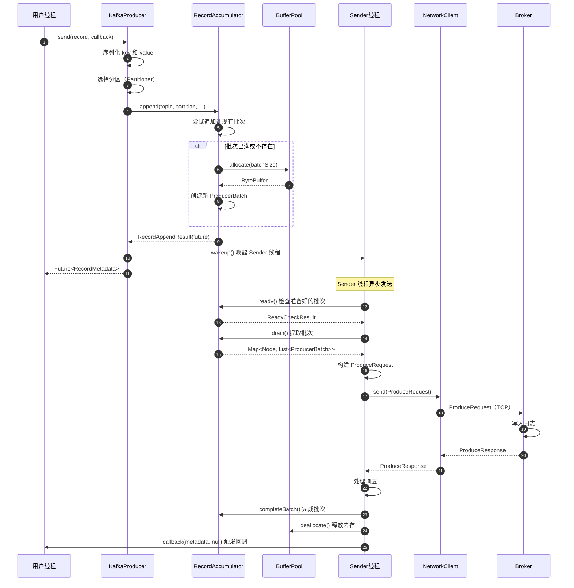

#### 1.3.7 异常与回退

**可重试异常**：

- `TimeoutException`：请求超时，自动重试
- `NotLeaderForPartitionException`：分区 Leader 变更，更新元数据后重试
- `NotEnoughReplicasException`：ISR 不足，等待后重试
- `NetworkException`：网络临时故障，重试

**不可重试异常**：

- `RecordTooLargeException`：消息超过 max.request.size
- `SerializationException`：序列化失败
- `InvalidTopicException`：Topic 不存在且不允许自动创建
- `AuthenticationException`：认证失败
- `AuthorizationException`：权限不足

**回退策略**：

```java
producer.send(record, (metadata, exception) -> {
    if (exception != null) {
        if (exception instanceof RetriableException) {
            // 可重试异常：Producer 会自动重试（最多 retries 次或 delivery.timeout.ms 超时）
            log.warn("发送失败，正在重试: {}", exception.getMessage());
        } else {
            // 不可重试异常：需要应用层处理
            log.error("发送失败，无法重试: {}", exception.getMessage());
            // 应用层决策：丢弃、记录到死信队列、人工介入等
        }
    }
});
```

#### 1.3.8 性能要点

**批量发送优化**：

- 增大 `batch.size`（如 32KB），减少网络往返
- 增加 `linger.ms`（如 10ms），等待更多消息进入批次
- 权衡：批次越大，吞吐量越高，但延迟越高

**压缩优化**：

- 启用 `compression.type=lz4`，减少网络传输量
- 压缩在客户端完成，减轻 Broker 负担
- 权衡：压缩节省带宽，但增加 CPU 使用

**并行度优化**：

- 增大 `max.in.flight.requests.per.connection`（如 5），提高并发
- 开启幂等性时，最大值为 5（保证顺序）
- 权衡：并发度越高，吞吐量越高，但可能影响顺序

**内存管理**：

- 增大 `buffer.memory`（如 64MB），避免内存不足阻塞
- 监控 `buffer-available-bytes` 指标，及时发现背压

**最佳实践**：

```properties
# 高吞吐量配置
batch.size=32768
linger.ms=10
buffer.memory=67108864
compression.type=lz4
max.in.flight.requests.per.connection=5
acks=all
enable.idempotence=true
```

---

### 1.4 事务性 API

#### 1.4.1 initTransactions()

**方法签名**：

```java
public void initTransactions()
public void initTransactions(boolean keepPreparedTxn)
```

**功能说明**：
初始化事务性 Producer，向 TransactionCoordinator 注册并获取 ProducerId 和 Epoch。

**参数说明**：

| 参数 | 类型 | 说明 |
|-----|-----|------|
| `keepPreparedTxn` | boolean | 是否保留已准备的事务（用于故障恢复） |

**使用示例**：

```java
Properties props = new Properties();
props.put("bootstrap.servers", "localhost:9092");
props.put("transactional.id", "my-transactional-id");
props.put("key.serializer", "org.apache.kafka.common.serialization.StringSerializer");
props.put("value.serializer", "org.apache.kafka.common.serialization.StringSerializer");

Producer<String, String> producer = new KafkaProducer<>(props);
producer.initTransactions(); // 必须在第一次事务前调用
```

**核心代码**：

```java
public void initTransactions() {
    // 1. 检查是否配置了 transactional.id
    if (transactionManager == null) {
        throw new IllegalStateException("无法初始化事务：未配置 transactional.id");
    }
    
    // 2. 确保 Sender 线程已启动
    throwIfProducerClosed();
    
    // 3. 调用 TransactionManager 初始化
    TransactionalRequestResult result = transactionManager.initializeTransactions();
    sender.wakeup();
    
    // 4. 阻塞等待初始化完成（发送 InitProducerIdRequest）
    result.await();
}
```

**时序图**：

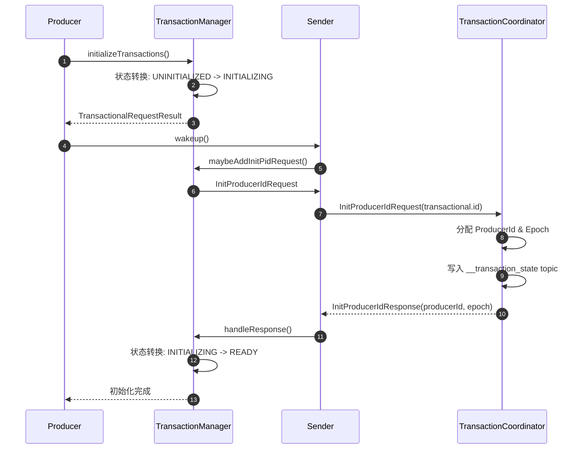

#### 1.4.2 beginTransaction()

**方法签名**：

```java
public void beginTransaction() throws ProducerFencedException
```

**功能说明**：
开启一个新事务，所有后续的 `send()` 调用都将被包含在该事务中。

**异常**：

- `ProducerFencedException`：Producer 被 fence（有新的相同 transactional.id 的 Producer 实例）
- `IllegalStateException`：未调用 initTransactions() 或已有未完成事务

**使用示例**：

```java
try {
    producer.beginTransaction();
    producer.send(new ProducerRecord<>("topic1", "key1", "value1"));
    producer.send(new ProducerRecord<>("topic2", "key2", "value2"));
    producer.commitTransaction();
} catch (ProducerFencedException e) {
    // Producer 被 fence，需要关闭并创建新实例
    producer.close();
} catch (KafkaException e) {
    // 其他异常，回滚事务
    producer.abortTransaction();
}
```

**核心代码**：

```java
public void beginTransaction() throws ProducerFencedException {
    throwIfNoTransactionManager();
    
    // 状态检查：必须在 READY 状态
    transactionManager.beginTransaction();
    // 状态转换: READY -> IN_TRANSACTION
}
```

#### 1.4.3 commitTransaction()

**方法签名**：

```java
public void commitTransaction() throws ProducerFencedException
```

**功能说明**：
提交当前事务，确保所有消息原子性地对消费者可见。

**时序图**：

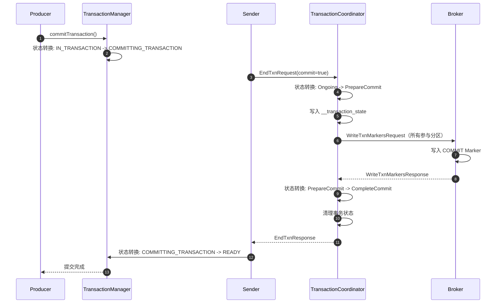

#### 1.4.4 abortTransaction()

**方法签名**：

```java
public void abortTransaction() throws ProducerFencedException
```

**功能说明**：
回滚当前事务，所有消息对消费者不可见。

**使用场景**：

```java
try {
    producer.beginTransaction();
    producer.send(record1);
    // 业务逻辑抛出异常
    throw new BusinessException();
    producer.send(record2);
    producer.commitTransaction();
} catch (BusinessException e) {
    // 回滚事务
    producer.abortTransaction();
}
```

---

### 1.5 其他重要方法

#### 1.5.1 flush()

**方法签名**：

```java
public void flush()
```

**功能说明**：
阻塞等待所有未完成的消息发送完成（包括重试）。

**使用场景**：

- 确保消息持久化后再继续执行
- 优雅关闭前确保所有消息发送

**示例**：

```java
for (int i = 0; i < 1000; i++) {
    producer.send(new ProducerRecord<>("my-topic", "key-" + i, "value-" + i));
}
producer.flush(); // 阻塞直到所有 1000 条消息发送完成
```

#### 1.5.2 partitionsFor()

**方法签名**：

```java
public List<PartitionInfo> partitionsFor(String topic)
```

**功能说明**：
获取指定 Topic 的分区元数据信息。

**返回值**：

```java
public class PartitionInfo {
    private final String topic;
    private final int partition;
    private final Node leader;      // Leader 副本所在节点
    private final Node[] replicas;  // 所有副本节点
    private final Node[] inSyncReplicas; // ISR 副本节点
}
```

#### 1.5.3 metrics()

**方法签名**：

```java
public Map<MetricName, ? extends Metric> metrics()
```

**功能说明**：
获取 Producer 的所有监控指标。

**关键指标**：

- `record-send-rate`：每秒发送记录数
- `record-send-total`：总发送记录数
- `record-error-rate`：每秒错误记录数
- `buffer-available-bytes`：可用缓冲区字节数
- `request-latency-avg`：平均请求延迟
- `request-latency-max`：最大请求延迟

#### 1.5.4 close()

**方法签名**：

```java
public void close()
public void close(Duration timeout)
```

**功能说明**：
关闭 Producer，等待所有未完成的请求完成（最多等待 timeout）。

**示例**：

```java
try (Producer<String, String> producer = new KafkaProducer<>(props)) {
    producer.send(record);
} // 自动调用 close()
```

---

## 2. Consumer API 详细规格

### 2.1 KafkaConsumer 类概述

`KafkaConsumer` 是 Kafka 客户端消费消息的主类，**非线程安全**，每个实例只能被一个线程使用。

**包路径**：`org.apache.kafka.clients.consumer.KafkaConsumer`

**实现接口**：`Consumer<K, V>`

**泛型参数**：

- `K`：消息 key 的类型
- `V`：消息 value 的类型

---

### 2.2 构造方法

#### 2.2.1 方法签名

```java
// 使用 Properties 配置
public KafkaConsumer(Properties properties)

// 使用 Map 配置
public KafkaConsumer(Map<String, Object> configs)

// 指定 Deserializer
public KafkaConsumer(Map<String, Object> configs,
                     Deserializer<K> keyDeserializer,
                     Deserializer<V> valueDeserializer)

// 指定 Properties 和 Deserializer
public KafkaConsumer(Properties properties,
                     Deserializer<K> keyDeserializer,
                     Deserializer<V> valueDeserializer)
```

#### 2.2.2 关键配置参数

| 配置项 | 类型 | 默认值 | 说明 | 约束 |
|-------|-----|-------|------|------|
| `bootstrap.servers` | String | - | Broker 地址列表 | 必填 |
| `key.deserializer` | String | - | Key 反序列化器类名 | 必填（如果构造函数未指定） |
| `value.deserializer` | String | - | Value 反序列化器类名 | 必填（如果构造函数未指定） |
| `group.id` | String | null | 消费者组 ID | 使用 subscribe() 时必填 |
| `client.id` | String | "" | 客户端标识符 | 用于日志和监控 |
| `auto.offset.reset` | String | "latest" | 偏移量越界时的策略 | earliest/latest/none |
| `enable.auto.commit` | boolean | true | 自动提交偏移量 | false 需要手动提交 |
| `auto.commit.interval.ms` | int | 5000 | 自动提交间隔（毫秒） | enable.auto.commit=true 时有效 |
| `fetch.min.bytes` | int | 1 | 最小拉取字节数 | Broker 等待数据达到后返回 |
| `fetch.max.wait.ms` | int | 500 | 最大等待时间（毫秒） | 数据不足时最多等待时间 |
| `fetch.max.bytes` | int | 52428800 | 单次拉取最大字节数 | 默认 50MB |
| `max.partition.fetch.bytes` | int | 1048576 | 单分区最大拉取字节数 | 默认 1MB |
| `max.poll.records` | int | 500 | 单次 poll 最大记录数 | 控制处理批次大小 |
| `max.poll.interval.ms` | int | 300000 | 两次 poll 最大间隔 | 超时会离开消费者组 |
| `session.timeout.ms` | int | 10000 | 会话超时（毫秒） | 心跳超时后离开消费者组 |
| `heartbeat.interval.ms` | int | 3000 | 心跳间隔（毫秒） | 应小于 session.timeout.ms |
| `isolation.level` | String | "read_uncommitted" | 隔离级别 | read_committed 只读已提交事务 |

#### 2.2.3 构造示例

```java
// 示例 1：基本配置
Properties props = new Properties();
props.put("bootstrap.servers", "localhost:9092");
props.put("group.id", "my-consumer-group");
props.put("key.deserializer", "org.apache.kafka.common.serialization.StringDeserializer");
props.put("value.deserializer", "org.apache.kafka.common.serialization.StringDeserializer");
props.put("auto.offset.reset", "earliest");

Consumer<String, String> consumer = new KafkaConsumer<>(props);

// 示例 2：手动提交配置
Properties props = new Properties();
props.put("bootstrap.servers", "localhost:9092");
props.put("group.id", "my-consumer-group");
props.put("enable.auto.commit", "false"); // 手动提交
props.put("key.deserializer", "org.apache.kafka.common.serialization.StringDeserializer");
props.put("value.deserializer", "org.apache.kafka.common.serialization.StringDeserializer");

Consumer<String, String> consumer = new KafkaConsumer<>(props);

// 示例 3：事务性消费（只读已提交事务）
Properties props = new Properties();
props.put("bootstrap.servers", "localhost:9092");
props.put("group.id", "my-consumer-group");
props.put("isolation.level", "read_committed"); // 只读已提交事务
props.put("key.deserializer", "org.apache.kafka.common.serialization.StringDeserializer");
props.put("value.deserializer", "org.apache.kafka.common.serialization.StringDeserializer");

Consumer<String, String> consumer = new KafkaConsumer<>(props);
```

---

### 2.3 subscribe() 方法（订阅主题）

#### 2.3.1 方法签名

```java
// 订阅主题列表
public void subscribe(Collection<String> topics)

// 订阅主题列表，带再平衡监听器
public void subscribe(Collection<String> topics,
                     ConsumerRebalanceListener listener)

// 订阅匹配模式的主题
public void subscribe(Pattern pattern)

// 订阅匹配模式的主题，带再平衡监听器
public void subscribe(Pattern pattern,
                     ConsumerRebalanceListener listener)
```

#### 2.3.2 参数说明

| 参数 | 类型 | 说明 |
|-----|-----|------|
| `topics` | `Collection<String>` | 主题名称列表 |
| `pattern` | `Pattern` | 主题名称匹配正则表达式 |
| `listener` | `ConsumerRebalanceListener` | 再平衡监听器（可选） |

#### 2.3.3 使用示例

```java
// 订阅单个主题
consumer.subscribe(Collections.singletonList("my-topic"));

// 订阅多个主题
consumer.subscribe(Arrays.asList("topic1", "topic2", "topic3"));

// 订阅匹配模式的主题（如所有以 "log-" 开头的主题）
consumer.subscribe(Pattern.compile("log-.*"));

// 订阅主题并注册再平衡监听器
consumer.subscribe(Collections.singletonList("my-topic"), new ConsumerRebalanceListener() {
    @Override
    public void onPartitionsRevoked(Collection<TopicPartition> partitions) {
        // 分区被撤销时调用（再平衡前）
        System.out.println("撤销分区: " + partitions);
        // 通常在这里提交偏移量或保存状态
        consumer.commitSync();
    }

    @Override
    public void onPartitionsAssigned(Collection<TopicPartition> partitions) {
        // 分区被分配时调用（再平衡后）
        System.out.println("分配分区: " + partitions);
        // 通常在这里重置偏移量或恢复状态
    }
});
```

---

### 2.4 poll() 方法（核心拉取方法）

#### 2.4.1 方法签名

```java
public ConsumerRecords<K, V> poll(Duration timeout)
```

#### 2.4.2 响应结构体：ConsumerRecords

```java
public class ConsumerRecords<K, V> implements Iterable<ConsumerRecord<K, V>> {
    // 按 Topic-Partition 组织的消息记录
    private final Map<TopicPartition, List<ConsumerRecord<K, V>>> records;
}
```

**主要方法**：

- `int count()`：总记录数
- `boolean isEmpty()`：是否为空
- `Set<TopicPartition> partitions()`：包含记录的分区集合
- `List<ConsumerRecord<K, V>> records(TopicPartition partition)`：指定分区的记录
- `Iterable<ConsumerRecord<K, V>> records(String topic)`：指定主题的记录
- `Iterator<ConsumerRecord<K, V>> iterator()`：遍历所有记录

#### 2.4.3 响应结构体：ConsumerRecord

```java
public class ConsumerRecord<K, V> {
    private final String topic;           // Topic 名称
    private final int partition;          // 分区号
    private final long offset;            // 偏移量
    private final long timestamp;         // 时间戳
    private final TimestampType timestampType; // 时间戳类型
    private final int serializedKeySize;  // 序列化后 key 大小
    private final int serializedValueSize; // 序列化后 value 大小
    private final Headers headers;        // 消息头
    private final K key;                  // 消息 key
    private final V value;                // 消息 value
    private final Optional<Integer> leaderEpoch; // Leader epoch
}
```

**字段表**：

| 字段 | 类型 | 说明 |
|-----|-----|------|
| `topic` | String | Topic 名称 |
| `partition` | int | 分区号 |
| `offset` | long | 消息在分区中的偏移量 |
| `timestamp` | long | 消息时间戳（毫秒） |
| `timestampType` | TimestampType | CREATE_TIME 或 LOG_APPEND_TIME |
| `key` | K | 消息 key（反序列化后） |
| `value` | V | 消息 value（反序列化后） |
| `headers` | Headers | 消息头（键值对集合） |
| `serializedKeySize` | int | 序列化后 key 大小（字节） |
| `serializedValueSize` | int | 序列化后 value 大小（字节） |
| `leaderEpoch` | Optional<Integer> | Leader epoch（用于检测日志截断） |

#### 2.4.4 核心入口函数代码

```java
// KafkaConsumer.poll() 核心代码
public ConsumerRecords<K, V> poll(final Duration timeout) {
    return poll(time.timer(timeout));
}

private ConsumerRecords<K, V> poll(final Timer timer) {
    acquireAndEnsureOpen(); // 获取锁，确保线程安全
    try {
        // 1. 检查订阅状态
        if (subscriptions.hasNoSubscriptionOrUserAssignment()) {
            throw new IllegalStateException("Consumer未订阅任何主题或分配任何分区");
        }

        do {
            // 2. 触发可能的唤醒
            client.maybeTriggerWakeup();

            // 3. 更新分配（可能触发再平衡）
            updateAssignmentMetadataIfNeeded(timer, false);

            // 4. 拉取消息
            final Fetch<K, V> fetch = pollForFetches(timer);
            
            if (!fetch.isEmpty()) {
                // 5. 在返回前发送下一轮拉取请求（流水线优化）
                if (sendFetches() > 0 || client.hasPendingRequests()) {
                    client.transmitSends();
                }

                // 6. 返回拉取到的记录
                return this.interceptors.onConsume(
                    new ConsumerRecords<>(fetch.records(), fetch.nextOffsets())
                );
            }
        } while (timer.notExpired());

        return ConsumerRecords.empty();
    } finally {
        release(); // 释放锁
    }
}

private Fetch<K, V> pollForFetches(Timer timer) {
    long pollTimeout = Math.min(coordinator.timeToNextPoll(timer.currentTimeMs()),
                                timer.remainingMs());

    // 1. 从 FetchBuffer 获取已拉取的消息
    final Fetch<K, V> fetch = fetcher.collectFetch();
    if (!fetch.isEmpty()) {
        return fetch;
    }

    // 2. 如果 FetchBuffer 为空，发送 FetchRequest
    if (fetcher.sendFetches() > 0 || client.hasPendingRequests()) {
        client.poll(pollTimeout, timer.currentTimeMs());
    }

    // 3. 再次尝试从 FetchBuffer 获取
    return fetcher.collectFetch();
}
```

**代码说明**：

1. **订阅检查**：确保已调用 `subscribe()` 或 `assign()`
2. **元数据更新**：如果分区分配过期或需要再平衡，触发更新
3. **消息拉取**：从 FetchBuffer 获取已拉取的消息，如果为空则发送 FetchRequest
4. **流水线优化**：在返回消息前发送下一轮拉取请求，减少等待时间
5. **拦截器处理**：调用 `ConsumerInterceptor.onConsume()` 对消息进行后置处理
6. **超时处理**：如果超时仍无消息，返回空结果

#### 2.4.5 使用示例

```java
// 基本用法
while (true) {
    ConsumerRecords<String, String> records = consumer.poll(Duration.ofMillis(1000));
    
    for (ConsumerRecord<String, String> record : records) {
        System.out.printf("topic=%s, partition=%d, offset=%d, key=%s, value=%s%n",
            record.topic(), record.partition(), record.offset(),
            record.key(), record.value());
        
        // 处理消息
        processRecord(record);
    }
    
    // 手动提交偏移量（如果禁用了自动提交）
    consumer.commitSync();
}

// 按分区处理
ConsumerRecords<String, String> records = consumer.poll(Duration.ofMillis(1000));
for (TopicPartition partition : records.partitions()) {
    List<ConsumerRecord<String, String>> partitionRecords = records.records(partition);
    for (ConsumerRecord<String, String> record : partitionRecords) {
        processRecord(record);
    }
    // 按分区提交偏移量
    long lastOffset = partitionRecords.get(partitionRecords.size() - 1).offset();
    consumer.commitSync(Collections.singletonMap(partition,
        new OffsetAndMetadata(lastOffset + 1)));
}
```

---

### 2.5 偏移量提交方法

#### 2.5.1 commitSync()

**方法签名**：

```java
// 同步提交当前偏移量
public void commitSync()

// 同步提交指定偏移量
public void commitSync(Map<TopicPartition, OffsetAndMetadata> offsets)

// 同步提交，带超时
public void commitSync(Duration timeout)
public void commitSync(Map<TopicPartition, OffsetAndMetadata> offsets, Duration timeout)
```

**功能说明**：
同步提交偏移量到 Broker，阻塞直到提交成功或超时。

**使用示例**：

```java
// 提交当前所有分区的偏移量
consumer.commitSync();

// 提交指定分区的偏移量
Map<TopicPartition, OffsetAndMetadata> offsets = new HashMap<>();
offsets.put(new TopicPartition("my-topic", 0), new OffsetAndMetadata(100));
consumer.commitSync(offsets);
```

#### 2.5.2 commitAsync()

**方法签名**：

```java
// 异步提交当前偏移量
public void commitAsync()

// 异步提交，带回调
public void commitAsync(OffsetCommitCallback callback)

// 异步提交指定偏移量，带回调
public void commitAsync(Map<TopicPartition, OffsetAndMetadata> offsets,
                       OffsetCommitCallback callback)
```

**功能说明**：
异步提交偏移量到 Broker，不阻塞，通过回调通知结果。

**使用示例**：

```java
// 异步提交，无回调
consumer.commitAsync();

// 异步提交，带回调
consumer.commitAsync((offsets, exception) -> {
    if (exception != null) {
        System.err.println("提交失败: " + exception.getMessage());
    } else {
        System.out.println("提交成功: " + offsets);
    }
});
```

---

### 2.6 其他重要方法

#### 2.6.1 assign()（手动分配分区）

**方法签名**：

```java
public void assign(Collection<TopicPartition> partitions)
```

**功能说明**：
手动分配分区，不参与消费者组协调和再平衡。

**使用场景**：

- 不需要消费者组协调
- 自定义分区分配逻辑
- 读取特定分区的数据

**示例**：

```java
// 手动分配分区
List<TopicPartition> partitions = Arrays.asList(
    new TopicPartition("my-topic", 0),
    new TopicPartition("my-topic", 1)
);
consumer.assign(partitions);

// 从指定偏移量开始消费
consumer.seek(new TopicPartition("my-topic", 0), 100);
```

#### 2.6.2 seek()（定位偏移量）

**方法签名**：

```java
public void seek(TopicPartition partition, long offset)
public void seek(TopicPartition partition, OffsetAndMetadata offsetAndMetadata)
```

**功能说明**：
设置指定分区的消费位置。

**使用场景**：

- 从特定偏移量开始消费
- 重新消费历史数据
- 跳过错误消息

**示例**：

```java
// 从偏移量 100 开始消费
consumer.seek(new TopicPartition("my-topic", 0), 100);

// 回退到最早偏移量
consumer.seekToBeginning(Collections.singletonList(new TopicPartition("my-topic", 0)));

// 跳到最新偏移量
consumer.seekToEnd(Collections.singletonList(new TopicPartition("my-topic", 0)));
```

#### 2.6.3 pause() / resume()（暂停/恢复消费）

**方法签名**：

```java
public void pause(Collection<TopicPartition> partitions)
public void resume(Collection<TopicPartition> partitions)
```

**功能说明**：
暂停或恢复指定分区的消费。

**使用场景**：

- 背压控制（下游处理不过来时暂停）
- 动态调整消费速率

**示例**：

```java
// 暂停消费
consumer.pause(Collections.singletonList(new TopicPartition("my-topic", 0)));

// 恢复消费
consumer.resume(Collections.singletonList(new TopicPartition("my-topic", 0)));

// 查询暂停的分区
Set<TopicPartition> paused = consumer.paused();
```

#### 2.6.4 close()

**方法签名**：

```java
public void close()
public void close(Duration timeout)
```

**功能说明**：
关闭 Consumer，离开消费者组，提交最终偏移量（如果启用自动提交）。

**示例**：

```java
try (Consumer<String, String> consumer = new KafkaConsumer<>(props)) {
    consumer.subscribe(Collections.singletonList("my-topic"));
    // 消费消息...
} // 自动调用 close()
```

---

## 3. AdminClient API 简介

### 3.1 AdminClient 类概述

`AdminClient` 是 Kafka 客户端管理集群的主类，提供 Topic 管理、配置管理、ACL 管理等功能。

**包路径**：`org.apache.kafka.clients.admin.AdminClient`

### 3.2 常用管理操作

#### 3.2.1 创建 Topic

```java
AdminClient adminClient = AdminClient.create(props);

NewTopic newTopic = new NewTopic("my-topic", 3, (short) 2); // 3 个分区，2 个副本
CreateTopicsResult result = adminClient.createTopics(Collections.singletonList(newTopic));
result.all().get(); // 阻塞等待完成
```

#### 3.2.2 删除 Topic

```java
DeleteTopicsResult result = adminClient.deleteTopics(Collections.singletonList("my-topic"));
result.all().get();
```

#### 3.2.3 列出 Topic

```java
ListTopicsResult result = adminClient.listTopics();
Set<String> topics = result.names().get();
```

#### 3.2.4 描述 Topic

```java
DescribeTopicsResult result = adminClient.describeTopics(Collections.singletonList("my-topic"));
Map<String, TopicDescription> descriptions = result.all().get();
```

---

**文档生成时间**：2025-10-04  
**模块路径**：`clients/`  
**主要语言**：Java  
**关键类**：`KafkaProducer`, `KafkaConsumer`, `ProducerRecord`, `ConsumerRecord`, `RecordMetadata`

---

## 数据结构

## 目录
- [ProducerRecord](#producerrecord)
- [RecordMetadata](#recordmetadata)
- [RecordAccumulator](#recordaccumulator)
- [ProducerBatch](#producerbatch)
- [ConsumerRecord](#consumerrecord)
- [TopicPartition](#topicpartition)
- [OffsetAndMetadata](#offsetandmetadata)

---

## ProducerRecord

### UML 类图

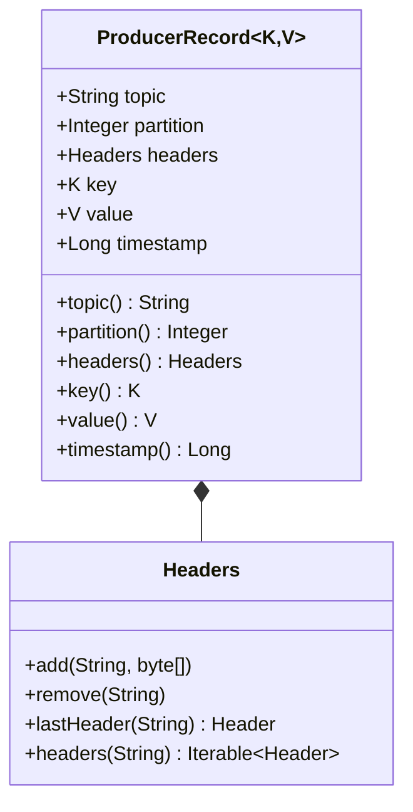

### 字段说明

| 字段 | 类型 | 必填 | 说明 |
|------|------|------|------|
| topic | String | 是 | 目标 Topic |
| partition | Integer | 否 | 目标分区（null=由 Partitioner 决定） |
| headers | Headers | 否 | 消息头（元数据） |
| key | K | 否 | 消息键（用于分区路由） |
| value | V | 是 | 消息值 |
| timestamp | Long | 否 | 时间戳（null=使用当前时间） |

### 使用示例

```java
// 创建简单的 ProducerRecord
ProducerRecord<String, String> record1 = new ProducerRecord<>(
    "my-topic",
    "my-key",
    "my-value"
);

// 创建带分区的 ProducerRecord
ProducerRecord<String, String> record2 = new ProducerRecord<>(
    "my-topic",
    0,  // partition
    "my-key",
    "my-value"
);

// 创建带时间戳和 Headers 的 ProducerRecord
ProducerRecord<String, String> record3 = new ProducerRecord<>(
    "my-topic",
    null,  // partition (auto)
    System.currentTimeMillis(),  // timestamp
    "my-key",
    "my-value",
    new RecordHeaders()
        .add("traceId", "12345".getBytes())
        .add("source", "service-a".getBytes())
);
```

---

## RecordMetadata

### UML 类图

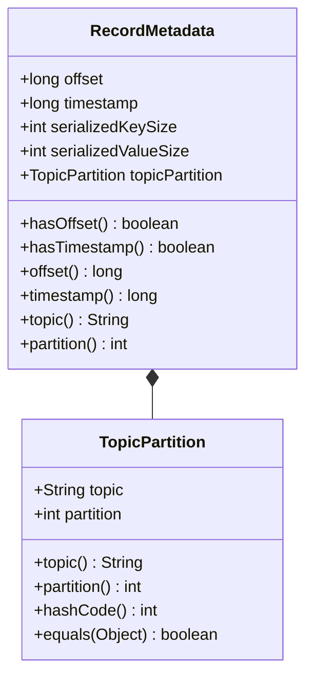

### 字段说明

| 字段 | 类型 | 说明 |
|------|------|------|
| offset | long | 消息在分区中的偏移量 |
| timestamp | long | 消息的时间戳 |
| serializedKeySize | int | 序列化后的 Key 大小（字节） |
| serializedValueSize | int | 序列化后的 Value 大小（字节） |
| topicPartition | TopicPartition | Topic 和分区信息 |

### 使用示例

```java
Future<RecordMetadata> future = producer.send(record);

// 同步等待
RecordMetadata metadata = future.get();

System.out.println("Topic: " + metadata.topic());
System.out.println("Partition: " + metadata.partition());
System.out.println("Offset: " + metadata.offset());
System.out.println("Timestamp: " + metadata.timestamp());
System.out.println("Serialized key size: " + metadata.serializedKeySize());
System.out.println("Serialized value size: " + metadata.serializedValueSize());
```

---

## RecordAccumulator

### UML 类图

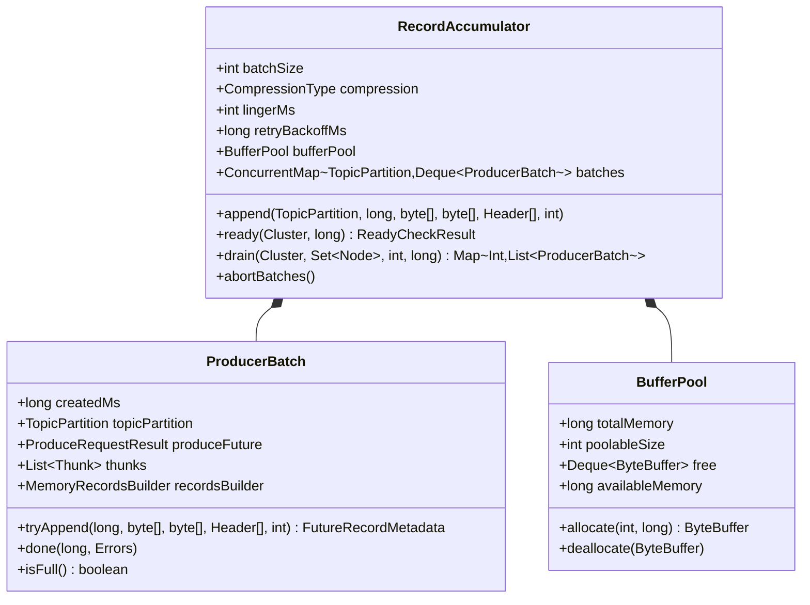

### 字段说明

**RecordAccumulator**：

| 字段 | 类型 | 说明 |
|------|------|------|
| batchSize | int | 批次大小（字节） |
| compression | CompressionType | 压缩类型 |
| lingerMs | int | 等待时间（毫秒） |
| retryBackoffMs | long | 重试退避时间 |
| bufferPool | BufferPool | 内存缓冲池 |
| batches | ConcurrentMap | 每个分区的批次队列 |

**BufferPool**：

| 字段 | 类型 | 说明 |
|------|------|------|
| totalMemory | long | 总内存大小 |
| poolableSize | int | 池化的 ByteBuffer 大小 |
| free | Deque\<ByteBuffer\> | 空闲的 ByteBuffer 队列 |
| availableMemory | long | 可用内存 |

### 关键方法

**1. append**：追加记录

```java
public RecordAppendResult append(
    TopicPartition tp,
    long timestamp,
    byte[] key,
    byte[] value,
    Header[] headers,
    long maxTimeToBlock
) throws InterruptedException {
    // 获取或创建分区队列
    Deque<ProducerBatch> dq = getOrCreateDeque(tp);
    
    synchronized (dq) {
        // 尝试追加到现有批次
        ProducerBatch last = dq.peekLast();
        if (last != null) {
            FutureRecordMetadata future = last.tryAppend(
                timestamp, key, value, headers, maxTimeToBlock
            );
            
            if (future != null) {
                return new RecordAppendResult(future, dq.size() > 1, false);
            }
        }
    }
    
    // 分配新的 ByteBuffer
    int size = Math.max(this.batchSize,
        AbstractRecords.estimateSizeInBytes(key, value, headers));
    ByteBuffer buffer = bufferPool.allocate(size, maxTimeToBlock);
    
    synchronized (dq) {
        // 创建新批次
        MemoryRecordsBuilder recordsBuilder = new MemoryRecordsBuilder(
            buffer, compression, timestamp
        );
        
        ProducerBatch batch = new ProducerBatch(tp, recordsBuilder, time.milliseconds());
        FutureRecordMetadata future = batch.tryAppend(
            timestamp, key, value, headers, maxTimeToBlock
        );
        
        dq.addLast(batch);
        return new RecordAppendResult(future, dq.size() > 1, true);
    }
}
```

**2. ready**：检查哪些节点准备发送

```java
public ReadyCheckResult ready(Cluster cluster, long nowMs) {
    Set<Node> readyNodes = new HashSet<>();
    long nextReadyCheckDelayMs = Long.MAX_VALUE;
    boolean exhausted = false;
    
    for (Map.Entry<TopicPartition, Deque<ProducerBatch>> entry : batches.entrySet()) {
        TopicPartition tp = entry.getKey();
        Deque<ProducerBatch> deque = entry.getValue();
        
        synchronized (deque) {
            ProducerBatch batch = deque.peekFirst();
            if (batch == null) continue;
            
            // 检查批次是否准备就绪
            boolean full = batch.isFull();
            boolean expired = batch.hasReachedDeliveryTimeout(
                nowMs - lingerMs
            );
            boolean sendable = full || expired;
            
            if (sendable) {
                Node node = cluster.leaderFor(tp);
                if (node != null) {
                    readyNodes.add(node);
                }
            } else {
                long timeToWait = lingerMs - (nowMs - batch.createdMs);
                nextReadyCheckDelayMs = Math.min(nextReadyCheckDelayMs, timeToWait);
            }
            
            // 检查是否内存耗尽
            exhausted |= deque.size() > 1;
        }
    }
    
    return new ReadyCheckResult(readyNodes, nextReadyCheckDelayMs, exhausted);
}
```

**3. drain**：提取准备发送的批次

```java
public Map<Integer, List<ProducerBatch>> drain(
    Cluster cluster,
    Set<Node> nodes,
    int maxSize,
    long now
) {
    Map<Integer, List<ProducerBatch>> batches = new HashMap<>();
    
    for (Node node : nodes) {
        List<ProducerBatch> ready = new ArrayList<>();
        int size = 0;
        
        // 获取该节点的所有分区
        List<TopicPartition> parts = cluster.partitionsForNode(node.id());
        
        for (TopicPartition tp : parts) {
            Deque<ProducerBatch> deque = getDeque(tp);
            if (deque == null) continue;
            
            synchronized (deque) {
                ProducerBatch first = deque.peekFirst();
                if (first == null) continue;
                
                // 检查是否可以发送
                if (size + first.estimatedSizeInBytes() > maxSize && !ready.isEmpty()) {
                    break;  // 已满
                }
                
                // 移除批次
                ProducerBatch batch = deque.pollFirst();
                batch.close();
                ready.add(batch);
                size += batch.records().sizeInBytes();
            }
        }
        
        batches.put(node.id(), ready);
    }
    
    return batches;
}
```

---

## ProducerBatch

### UML 类图

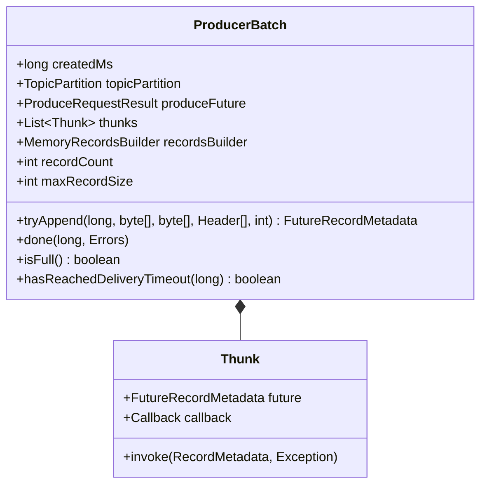

### 字段说明

| 字段 | 类型 | 说明 |
|------|------|------|
| createdMs | long | 批次创建时间 |
| topicPartition | TopicPartition | 目标分区 |
| produceFuture | ProduceRequestResult | 发送结果 Future |
| thunks | List\<Thunk\> | 回调列表 |
| recordsBuilder | MemoryRecordsBuilder | 记录构建器 |
| recordCount | int | 记录数量 |
| maxRecordSize | int | 最大记录大小 |

### 关键方法

**1. tryAppend**：尝试追加记录

```java
public FutureRecordMetadata tryAppend(
    long timestamp,
    byte[] key,
    byte[] value,
    Header[] headers,
    long maxTimeToBlock
) {
    // 检查是否还有空间
    if (!recordsBuilder.hasRoomFor(timestamp, key, value, headers)) {
        return null;
    }
    
    // 追加记录
    Long checksum = recordsBuilder.append(timestamp, key, value, headers);
    
    // 更新统计
    recordCount++;
    maxRecordSize = Math.max(maxRecordSize,
        AbstractRecords.estimateSizeInBytes(key, value, headers));
    
    // 创建 Future
    FutureRecordMetadata future = new FutureRecordMetadata(
        produceFuture,
        recordCount,
        timestamp,
        checksum,
        key == null ? -1 : key.length,
        value == null ? -1 : value.length
    );
    
    // 添加回调
    thunks.add(new Thunk(future, null));
    
    return future;
}
```

**2. done**：完成批次

```java
public void done(long baseOffset, Errors error) {
    // 设置结果
    if (error == Errors.NONE) {
        produceFuture.done(topicPartition, baseOffset, null);
    } else {
        produceFuture.done(topicPartition, -1,
            error.exception("Failed to send batch"));
    }
    
    // 调用所有回调
    for (Thunk thunk : thunks) {
        try {
            if (error == Errors.NONE) {
                RecordMetadata metadata = new RecordMetadata(
                    topicPartition,
                    baseOffset + thunk.future.relativeOffset(),
                    thunk.future.timestamp(),
                    thunk.future.serializedKeySize(),
                    thunk.future.serializedValueSize()
                );
                thunk.callback.onCompletion(metadata, null);
            } else {
                thunk.callback.onCompletion(null, error.exception());
            }
        } catch (Exception e) {
            log.error("Error executing user-provided callback", e);
        }
    }
}
```

---

## ConsumerRecord

### UML 类图

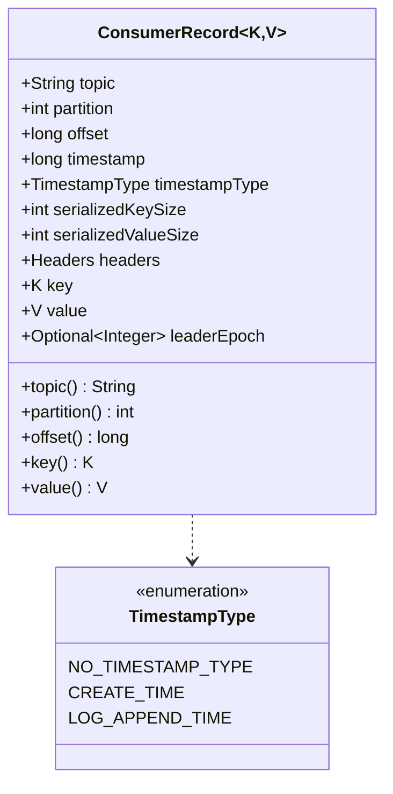

### 字段说明

| 字段 | 类型 | 说明 |
|------|------|------|
| topic | String | Topic 名称 |
| partition | int | 分区 ID |
| offset | long | 偏移量 |
| timestamp | long | 时间戳 |
| timestampType | TimestampType | 时间戳类型（CREATE_TIME/LOG_APPEND_TIME） |
| serializedKeySize | int | 序列化后的 Key 大小 |
| serializedValueSize | int | 序列化后的 Value 大小 |
| headers | Headers | 消息头 |
| key | K | 消息键 |
| value | V | 消息值 |
| leaderEpoch | Optional\<Integer\> | Leader Epoch |

### 使用示例

```java
ConsumerRecords<String, String> records = consumer.poll(Duration.ofMillis(100));

for (ConsumerRecord<String, String> record : records) {
    System.out.printf("Topic: %s, Partition: %d, Offset: %d, Key: %s, Value: %s%n",
        record.topic(),
        record.partition(),
        record.offset(),
        record.key(),
        record.value()
    );
    
    // 处理 Headers
    for (Header header : record.headers()) {
        System.out.printf("Header: %s = %s%n",
            header.key(),
            new String(header.value())
        );
    }
}
```

---

## TopicPartition

### UML 类图

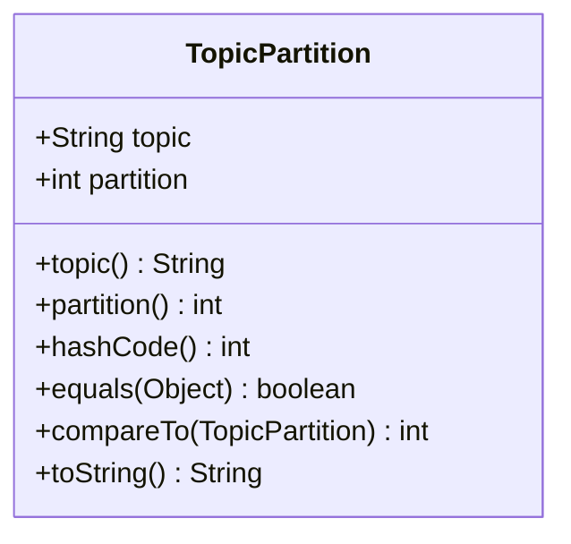

### 字段说明

| 字段 | 类型 | 说明 |
|------|------|------|
| topic | String | Topic 名称 |
| partition | int | 分区 ID |

### 使用示例

```java
// 创建 TopicPartition
TopicPartition tp = new TopicPartition("my-topic", 0);

// 用作 Map 键
Map<TopicPartition, Long> offsets = new HashMap<>();
offsets.put(tp, 12345L);

// 手动分配分区
List<TopicPartition> partitions = Arrays.asList(
    new TopicPartition("topic1", 0),
    new TopicPartition("topic1", 1),
    new TopicPartition("topic2", 0)
);
consumer.assign(partitions);
```

---

## OffsetAndMetadata

### UML 类图

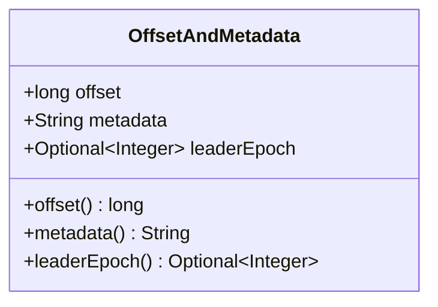

### 字段说明

| 字段 | 类型 | 说明 |
|------|------|------|
| offset | long | 偏移量 |
| metadata | String | 元数据（可选） |
| leaderEpoch | Optional\<Integer\> | Leader Epoch（可选） |

### 使用示例

```java
// 提交偏移量
Map<TopicPartition, OffsetAndMetadata> offsets = new HashMap<>();
offsets.put(
    new TopicPartition("my-topic", 0),
    new OffsetAndMetadata(12345L, "processed by worker-1")
);
consumer.commitSync(offsets);

// 获取提交的偏移量
OffsetAndMetadata committed = consumer.committed(
    new TopicPartition("my-topic", 0)
);
System.out.println("Committed offset: " + committed.offset());
System.out.println("Metadata: " + committed.metadata());
```

---

## 总结

本文档详细描述了 Kafka Clients 模块的核心数据结构：

1. **ProducerRecord / ConsumerRecord**：消息记录
   - Producer 发送的记录格式
   - Consumer 接收的记录格式
   - Headers 支持

2. **RecordMetadata**：消息元数据
   - 发送成功后的确认信息
   - 偏移量、时间戳、大小

3. **RecordAccumulator**：记录累加器
   - 批次管理（ProducerBatch）
   - BufferPool 内存管理
   - 批次准备就绪检查
   - 批次提取（drain）

4. **ProducerBatch**：生产者批次
   - 记录追加
   - 批次完成与回调
   - 超时检查

5. **TopicPartition**：Topic 分区
   - Topic + Partition 的不可变表示
   - 用作 Map 键

6. **OffsetAndMetadata**：偏移量与元数据
   - 偏移量提交
   - 自定义元数据

每个数据结构都包含：

- 完整的 UML 类图
- 详细的字段说明
- 核心方法实现
- 实际使用示例

---
