# Kafka-02-Core

## 模块概览

## 1. 模块职责

Core 模块是 Kafka Broker 的核心实现，负责处理客户端请求、管理分区副本、协调集群操作。主要职责包括：

### 1.1 核心功能

- **网络服务**：基于 Java NIO 的高性能网络层，处理客户端和 Broker 间的 TCP 连接
- **请求处理**：解析和分发各类 Kafka 协议请求（Produce、Fetch、Metadata 等）
- **副本管理**：管理分区副本的读写、Leader 选举、ISR 维护
- **日志管理**：管理所有分区的日志文件生命周期、清理策略
- **协调器**：集成 GroupCoordinator、TransactionCoordinator、ShareCoordinator
- **集群协调**：在 KRaft 模式下，与 Controller 通信，接收元数据更新

### 1.2 Broker 在 Kafka 架构中的位置

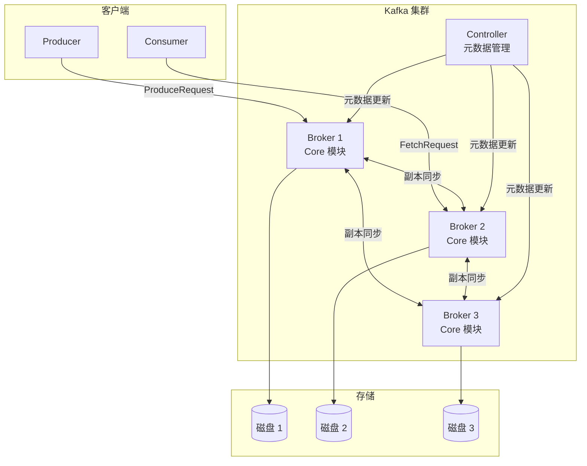
```mermaid
flowchart TB
    subgraph "Kafka 集群"
        Controller[Controller<br/>元数据管理]
        Broker1[Broker 1<br/>Core 模块]
        Broker2[Broker 2<br/>Core 模块]
        Broker3[Broker 3<br/>Core 模块]
        
        Controller -->|元数据更新| Broker1
        Controller -->|元数据更新| Broker2
        Controller -->|元数据更新| Broker3
        
        Broker1 <-->|副本同步| Broker2
        Broker2 <-->|副本同步| Broker3
        Broker3 <-->|副本同步| Broker1
    end
    
    subgraph "客户端"
        Producer[Producer]
        Consumer[Consumer]
    end
    
    Producer -->|ProduceRequest| Broker1
    Consumer -->|FetchRequest| Broker2
    
    subgraph "存储"
        Disk1[(磁盘 1)]
        Disk2[(磁盘 2)]
        Disk3[(磁盘 3)]
    end
    
    Broker1 --> Disk1
    Broker2 --> Disk2
    Broker3 --> Disk3
```

---

## 2. 模块架构

### 2.1 整体架构图

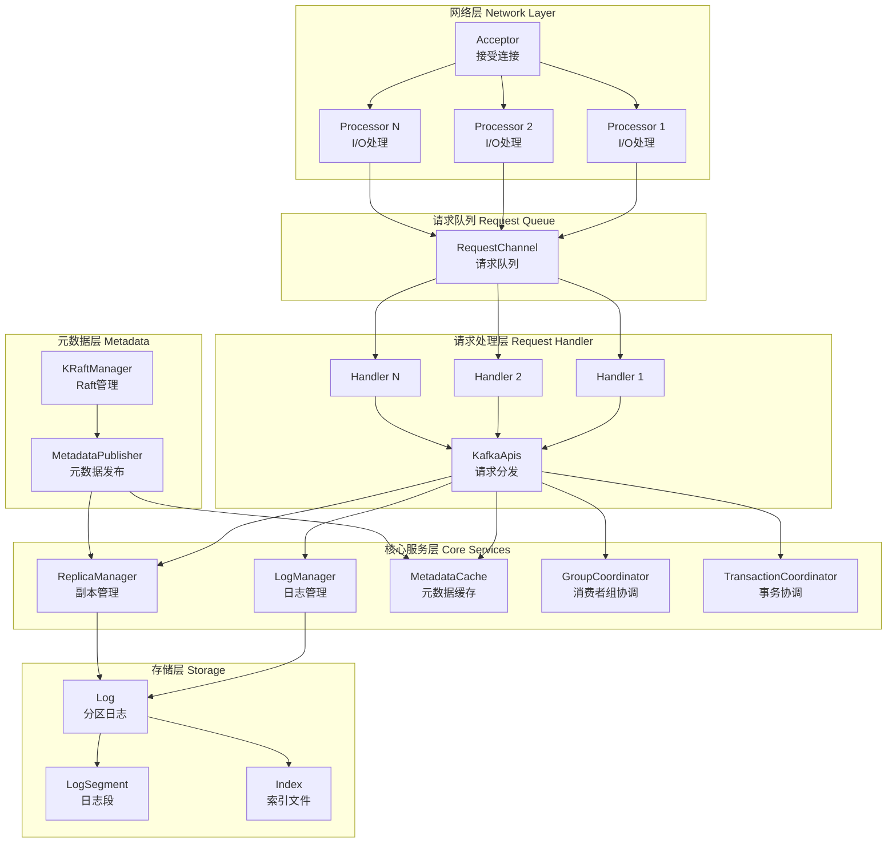
```mermaid
flowchart TB
    subgraph "网络层 Network Layer"
        Acceptor[Acceptor<br/>接受连接]
        Processor1[Processor 1<br/>I/O处理]
        Processor2[Processor 2<br/>I/O处理]
        ProcessorN[Processor N<br/>I/O处理]
        
        Acceptor --> Processor1
        Acceptor --> Processor2
        Acceptor --> ProcessorN
    end
    
    subgraph "请求队列 Request Queue"
        RequestChannel[RequestChannel<br/>请求队列]
    end
    
    Processor1 --> RequestChannel
    Processor2 --> RequestChannel
    ProcessorN --> RequestChannel
    
    subgraph "请求处理层 Request Handler"
        Handler1[Handler 1]
        Handler2[Handler 2]
        HandlerN[Handler N]
        KafkaApis[KafkaApis<br/>请求分发]
    end
    
    RequestChannel --> Handler1
    RequestChannel --> Handler2
    RequestChannel --> HandlerN
    Handler1 --> KafkaApis
    Handler2 --> KafkaApis
    HandlerN --> KafkaApis
    
    subgraph "核心服务层 Core Services"
        ReplicaManager[ReplicaManager<br/>副本管理]
        LogManager[LogManager<br/>日志管理]
        MetadataCache[MetadataCache<br/>元数据缓存]
        GroupCoordinator[GroupCoordinator<br/>消费者组协调]
        TxnCoordinator[TransactionCoordinator<br/>事务协调]
    end
    
    KafkaApis --> ReplicaManager
    KafkaApis --> LogManager
    KafkaApis --> MetadataCache
    KafkaApis --> GroupCoordinator
    KafkaApis --> TxnCoordinator
    
    subgraph "存储层 Storage"
        Log[Log<br/>分区日志]
        LogSegment[LogSegment<br/>日志段]
        Index[Index<br/>索引文件]
    end
    
    LogManager --> Log
    ReplicaManager --> Log
    Log --> LogSegment
    Log --> Index
    
    subgraph "元数据层 Metadata"
        KRaftManager[KRaftManager<br/>Raft管理]
        MetadataPublisher[MetadataPublisher<br/>元数据发布]
    end
    
    KRaftManager --> MetadataPublisher
    MetadataPublisher --> MetadataCache
    MetadataPublisher --> ReplicaManager
```

### 2.2 核心组件说明

#### 2.2.1 网络层（SocketServer）

**职责**：

- 接受客户端 TCP 连接
- 处理网络 I/O（读取请求、发送响应）
- 将请求放入 RequestChannel 队列

**核心类**：

- `SocketServer`：网络服务器主类
- `Acceptor`：接受新连接的线程
- `Processor`：处理网络 I/O 的线程（多个，基于 Reactor 模式）
- `RequestChannel`：解耦网络线程和业务线程的请求队列

**线程模型**：

```
1 个 Acceptor 线程（每个监听端口）
  ↓
N 个 Processor 线程（默认 3 个，可配置 num.network.threads）
  ↓
RequestChannel（请求队列）
  ↓
M 个 RequestHandler 线程（默认 8 个，可配置 num.io.threads）
```

#### 2.2.2 请求处理层（KafkaApis）

**职责**：

- 解析 Kafka 协议请求
- 根据请求类型分发到对应的处理方法
- 校验权限（通过 Authorizer）
- 限流控制（通过 QuotaManagers）
- 构造响应并返回

**核心类**：

- `KafkaApis`：请求处理中枢，包含 50+ 种请求的处理方法
- `KafkaRequestHandler`：业务处理线程，从 RequestChannel 取出请求并调用 KafkaApis
- `RequestLocal`：请求本地上下文，用于缓存请求处理过程中的数据

**支持的请求类型（部分）**：

- `ProduceRequest`：生产者发送消息
- `FetchRequest`：消费者/Follower 拉取消息
- `MetadataRequest`：获取元数据
- `ListOffsetsRequest`：查询偏移量
- `OffsetCommitRequest`：提交偏移量
- `JoinGroupRequest`：加入消费者组
- `InitProducerIdRequest`：初始化事务 Producer
- `AddPartitionsToTxnRequest`：添加分区到事务
- `EndTxnRequest`：结束事务

#### 2.2.3 副本管理器（ReplicaManager）

**职责**：

- 管理 Broker 上所有分区副本的生命周期
- 处理 Leader 副本的读写请求
- 管理 Follower 副本的同步（通过 ReplicaFetcherManager）
- 维护 ISR（In-Sync Replicas）集合
- 处理分区状态变更（Leader → Follower 或 Follower → Leader）
- 延迟操作管理（DelayedProduce、DelayedFetch）

**核心类**：

- `ReplicaManager`：副本管理器主类
- `Partition`：分区抽象，管理一个分区的所有副本
- `Replica`：副本抽象，表示一个副本的状态
- `ReplicaFetcherManager`：管理 Follower 副本的拉取线程
- `AlterPartitionManager`：向 Controller 报告 ISR 变更

**关键数据结构**：

```scala
// 所有分区的映射：TopicPartition -> HostedPartition
allPartitions: ConcurrentHashMap[TopicPartition, HostedPartition]

// HostedPartition 有三种状态：
sealed trait HostedPartition
case object None extends HostedPartition  // 无状态
case class Online(partition: Partition) extends HostedPartition  // 在线
case class Offline(partition: Option[Partition]) extends HostedPartition  // 离线
```

#### 2.2.4 日志管理器（LogManager）

**职责**：

- 管理 Broker 上所有分区日志的生命周期
- 创建和删除日志目录
- 日志清理（删除过期日志、日志压缩）
- 日志恢复（启动时恢复未完成的日志段）
- 刷盘策略（定期或根据消息数刷盘）
- 监控日志目录故障

**核心类**：

- `LogManager`：日志管理器主类
- `Log`：分区日志抽象，管理一个分区的所有日志段
- `LogSegment`：日志段，实际存储消息的文件
- `LogCleaner`：日志清理线程（删除或压缩）

**日志目录结构**：

```
/var/kafka-logs/
  ├── topic1-0/              # Topic: topic1, Partition: 0
  │   ├── 00000000000000000000.log      # 日志段文件
  │   ├── 00000000000000000000.index    # 偏移量索引
  │   ├── 00000000000000000000.timeindex # 时间戳索引
  │   ├── 00000000000000012345.log
  │   ├── 00000000000000012345.index
  │   └── 00000000000000012345.timeindex
  ├── topic1-1/
  └── topic2-0/
```

#### 2.2.5 元数据缓存（MetadataCache）

**职责**：

- 缓存集群元数据（Topic、Partition、Replica、Broker 等）
- 接收来自 Controller 的元数据更新（通过 MetadataPublisher）
- 为客户端和其他组件提供元数据查询接口

**核心类**：

- `KRaftMetadataCache`：KRaft 模式下的元数据缓存
- `MetadataImage`：元数据快照，包含完整的集群元数据
- `BrokerMetadataPublisher`：从 KRaft 日志读取元数据并发布到缓存

**缓存的元数据类型**：

- Topic 信息（名称、分区数、副本因子）
- Partition 信息（Leader、ISR、副本列表）
- Broker 信息（节点 ID、主机名、端口、机架）
- Controller 信息（当前 Controller ID）
- 配置信息（Topic 配置、Broker 配置）

---

## 3. Broker 启动流程

### 3.1 启动时序图

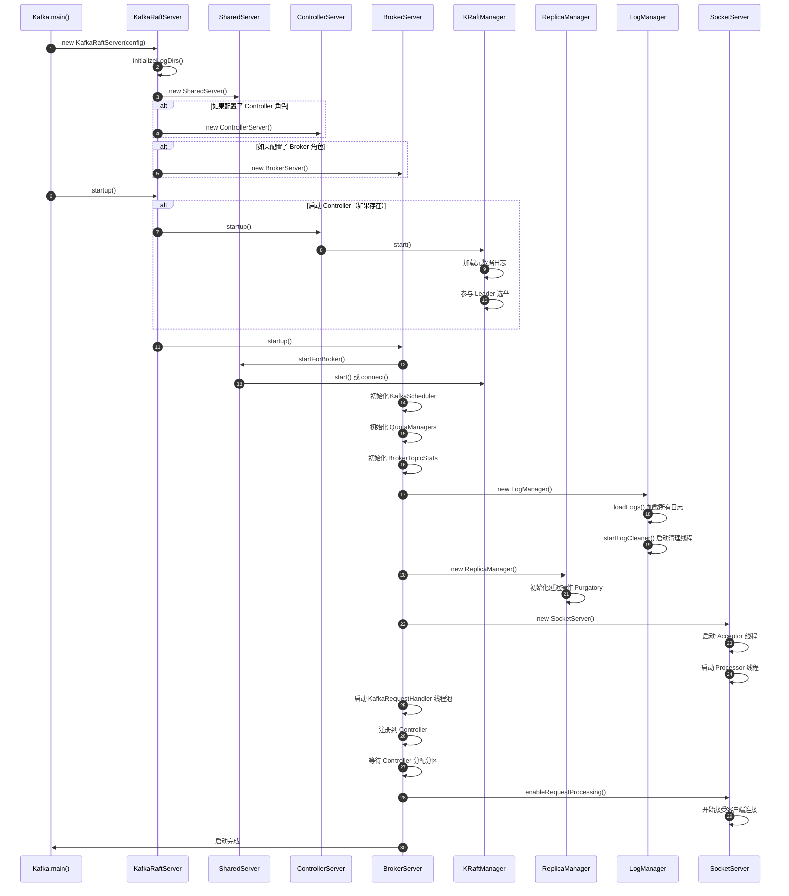
```mermaid
sequenceDiagram
    autonumber
    participant Main as Kafka.main()
    participant Server as KafkaRaftServer
    participant Shared as SharedServer
    participant Controller as ControllerServer
    participant Broker as BrokerServer
    participant KRaft as KRaftManager
    participant RM as ReplicaManager
    participant LM as LogManager
    participant SS as SocketServer

    Main->>Server: new KafkaRaftServer(config)
    Server->>Server: initializeLogDirs()
    Server->>Shared: new SharedServer()
    
    alt 如果配置了 Controller 角色
        Server->>Controller: new ControllerServer()
    end
    
    alt 如果配置了 Broker 角色
        Server->>Broker: new BrokerServer()
    end
    
    Main->>Server: startup()
    
    alt 启动 Controller（如果存在）
        Server->>Controller: startup()
        Controller->>KRaft: start()
        KRaft->>KRaft: 加载元数据日志
        KRaft->>KRaft: 参与 Leader 选举
    end
    
    Server->>Broker: startup()
    Broker->>Shared: startForBroker()
    Shared->>KRaft: start() 或 connect()
    
    Broker->>Broker: 初始化 KafkaScheduler
    Broker->>Broker: 初始化 QuotaManagers
    Broker->>Broker: 初始化 BrokerTopicStats
    
    Broker->>LM: new LogManager()
    LM->>LM: loadLogs() 加载所有日志
    LM->>LM: startLogCleaner() 启动清理线程
    
    Broker->>RM: new ReplicaManager()
    RM->>RM: 初始化延迟操作 Purgatory
    
    Broker->>SS: new SocketServer()
    SS->>SS: 启动 Acceptor 线程
    SS->>SS: 启动 Processor 线程
    
    Broker->>Broker: 启动 KafkaRequestHandler 线程池
    
    Broker->>Broker: 注册到 Controller
    Broker->>Broker: 等待 Controller 分配分区
    
    Broker->>SS: enableRequestProcessing()
    SS->>SS: 开始接受客户端连接
    
    Broker->>Main: 启动完成
```

### 3.2 启动阶段详解

#### 阶段 1：初始化日志目录

```scala
// KafkaRaftServer.initializeLogDirs()
private def initializeLogDirs(): (MetaPropertiesEnsemble, BootstrapMetadata) = {
  // 1. 加载 meta.properties 文件（包含 cluster.id, node.id, version）
  val metaPropsEnsemble = new MetaPropertiesEnsemble.Loader()
    .addLogDirs(config.logDirs)
    .load()
  
  // 2. 验证 cluster.id 一致性
  if (!metaPropsEnsemble.clusterId().isPresent) {
    throw new RuntimeException("未找到 cluster.id")
  }
  
  // 3. 加载引导元数据（如果存在）
  val bootstrapMetadata = BootstrapMetadata.fromVersion(...)
  
  (metaPropsEnsemble, bootstrapMetadata)
}
```

**关键点**：

- 验证所有日志目录的 `cluster.id` 一致
- 如果是首次启动，需要先运行 `kafka-storage.sh format` 生成 `meta.properties`

#### 阶段 2：启动 KRaftManager

```scala
// SharedServer.startForBroker()
def startForBroker(): Unit = {
  // 启动 Raft 管理器（连接到 Controller Quorum）
  raftManager.startup()
  
  // 注册元数据监听器
  raftManager.register(new BrokerMetadataPublisher())
}
```

**关键点**：

- KRaftManager 连接到 Controller Quorum（通过 `controller.quorum.voters` 配置）
- BrokerMetadataPublisher 接收元数据更新并发布到 MetadataCache

#### 阶段 3：加载日志

```scala
// LogManager.loadLogs()
private def loadLogs(): Unit = {
  // 1. 扫描所有日志目录
  for (dir <- logDirs) {
    val dirTopics = dir.listFiles.filter(_.isDirectory)
    
    // 2. 为每个分区目录加载日志
    for (topicDir <- dirTopics) {
      val (topic, partition) = parseTopicPartition(topicDir.getName)
      val log = Log.loadLog(topicDir, ...)
      logs.put(TopicPartition(topic, partition), log)
    }
  }
  
  // 3. 启动日志清理线程
  if (cleanerConfig.enableCleaner) {
    cleaner = new LogCleaner(...)
    cleaner.startup()
  }
}
```

**关键点**：

- 恢复未完成的日志段（recovery-point-offset-checkpoint）
- 删除临时文件（.deleted, .cleaned, .swap）
- 根据保留策略删除过期日志

#### 阶段 4：启动副本管理器

```scala
// ReplicaManager.startup()
def startup(): Unit = {
  // 1. 启动 ISR 过期检查线程（每 replicaLagTimeMaxMs / 2 执行一次）
  scheduler.schedule("isr-expiration", () => maybeShrinkIsr(), ...)
  
  // 2. 启动日志目录故障处理线程
  logDirFailureHandler.start()
  
  // 3. 启动延迟操作 Purgatory
  delayedProducePurgatory.start()
  delayedFetchPurgatory.start()
}
```

**关键点**：

- ISR 收缩：如果 Follower 落后超过 `replica.lag.time.max.ms`，从 ISR 移除
- 延迟操作：Produce 和 Fetch 请求可能需要等待（如 acks=all 需要等待 ISR 确认）

#### 阶段 5：启动网络服务器

```scala
// SocketServer.startup()
def startup(): Unit = {
  // 1. 为每个监听器创建 Acceptor 和 Processors
  config.listeners.foreach { listener =>
    val acceptor = new Acceptor(listener, ...)
    val processors = (0 until numProcessorThreads).map { i =>
      new Processor(i, requestChannel, ...)
    }
    
    acceptor.start()
    processors.foreach(_.start())
  }
}
```

**关键点**：

- 每个监听器（如 PLAINTEXT://0.0.0.0:9092）有 1 个 Acceptor
- 每个监听器有 N 个 Processor（num.network.threads）

#### 阶段 6：注册到 Controller

```scala
// BrokerLifecycleManager.start()
def start(): Unit = {
  // 1. 发送 BrokerRegistrationRequest
  sendBrokerRegistration()
  
  // 2. 启动心跳线程
  scheduler.schedule("broker-heartbeat", () => sendHeartbeat(), ...)
}
```

**关键点**：

- Broker 向 Controller 注册（包含节点 ID、主机名、端口、支持的特性）
- 定期发送心跳（session.timeout.ms）
- 等待 Controller 分配分区（通过元数据更新）

---

## 4. 请求处理流程

### 4.1 ProduceRequest 处理流程

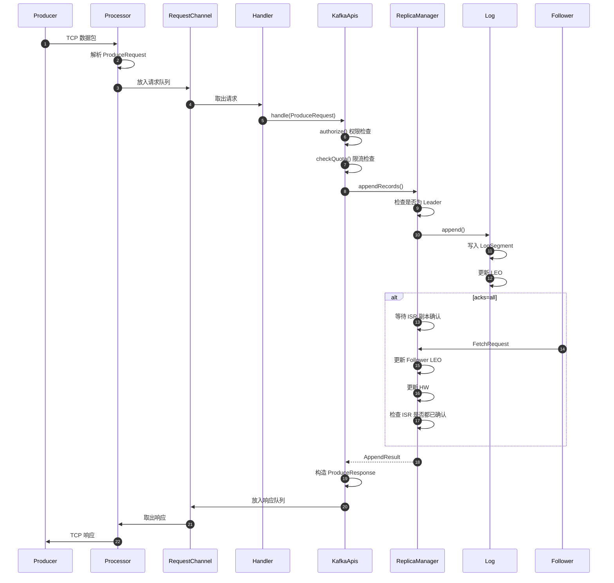
```mermaid
sequenceDiagram
    autonumber
    participant P as Producer
    participant Proc as Processor
    participant RC as RequestChannel
    participant H as Handler
    participant KA as KafkaApis
    participant RM as ReplicaManager
    participant Log as Log
    participant F as Follower

    P->>Proc: TCP 数据包
    Proc->>Proc: 解析 ProduceRequest
    Proc->>RC: 放入请求队列
    
    RC->>H: 取出请求
    H->>KA: handle(ProduceRequest)
    
    KA->>KA: authorize() 权限检查
    KA->>KA: checkQuota() 限流检查
    
    KA->>RM: appendRecords()
    RM->>RM: 检查是否为 Leader
    RM->>Log: append()
    Log->>Log: 写入 LogSegment
    Log->>Log: 更新 LEO
    
    alt acks=all
        RM->>RM: 等待 ISR 副本确认
        F->>RM: FetchRequest
        RM->>RM: 更新 Follower LEO
        RM->>RM: 更新 HW
        RM->>RM: 检查 ISR 是否都已确认
    end
    
    RM-->>KA: AppendResult
    KA->>KA: 构造 ProduceResponse
    KA->>RC: 放入响应队列
    RC->>Proc: 取出响应
    Proc->>P: TCP 响应
```

#### 4.1.1 核心代码：KafkaApis.handleProduceRequest()

```scala
def handleProduceRequest(request: RequestChannel.Request, requestLocal: RequestLocal): Unit = {
  val produceRequest = request.body[ProduceRequest]
  
  // 1. 权限检查
  val unauthorizedTopicResponses = authorizeProduceTopics(produceRequest)
  
  // 2. 限流检查
  val bandwidthThrottleTimeMs = quotas.produce.maybeRecordAndGetThrottleTimeMs(...)
  
  // 3. 调用 ReplicaManager 写入
  replicaManager.appendRecords(
    timeout = produceRequest.timeout,
    requiredAcks = produceRequest.acks,
    internalTopicsAllowed = false,
    transactional = produceRequest.isTransactional,
    entriesPerPartition = produceRequest.partitionRecords,
    responseCallback = sendResponseCallback(request, ...)
  )
}
```

**关键点**：

- `acks=0`：不等待任何确认，立即返回
- `acks=1`：等待 Leader 写入成功
- `acks=all`：等待所有 ISR 副本确认（通过 DelayedProduce）

#### 4.1.2 核心代码：ReplicaManager.appendRecords()

```scala
def appendRecords(
  timeout: Long,
  requiredAcks: Short,
  internalTopicsAllowed: Boolean,
  transactional: Boolean,
  entriesPerPartition: Map[TopicPartition, MemoryRecords],
  responseCallback: Map[TopicPartition, PartitionResponse] => Unit
): Unit = {
  
  // 1. 按分区追加消息
  val localAppendResults = entriesPerPartition.map { case (tp, records) =>
    val partition = getPartitionOrException(tp)
    
    // 2. 检查是否为 Leader
    if (!partition.isLeader) {
      throw new NotLeaderForPartitionException(...)
    }
    
    // 3. 追加到 Log
    val info = partition.appendRecordsToLeader(records, ...)
    (tp, LogAppendResult(info))
  }
  
  // 4. 根据 acks 决定是否延迟响应
  if (requiredAcks == -1) {  // acks=all
    val delayedProduce = new DelayedProduce(timeout, localAppendResults, ...)
    delayedProducePurgatory.tryCompleteElseWatch(delayedProduce, ...)
  } else {
    // acks=0 或 acks=1，立即响应
    responseCallback(localAppendResults)
  }
}
```

**关键点**：

- DelayedProduce：等待所有 ISR 副本的 HW 达到本次写入的 LEO
- Purgatory：延迟操作的管理器，支持超时和条件触发

### 4.2 FetchRequest 处理流程

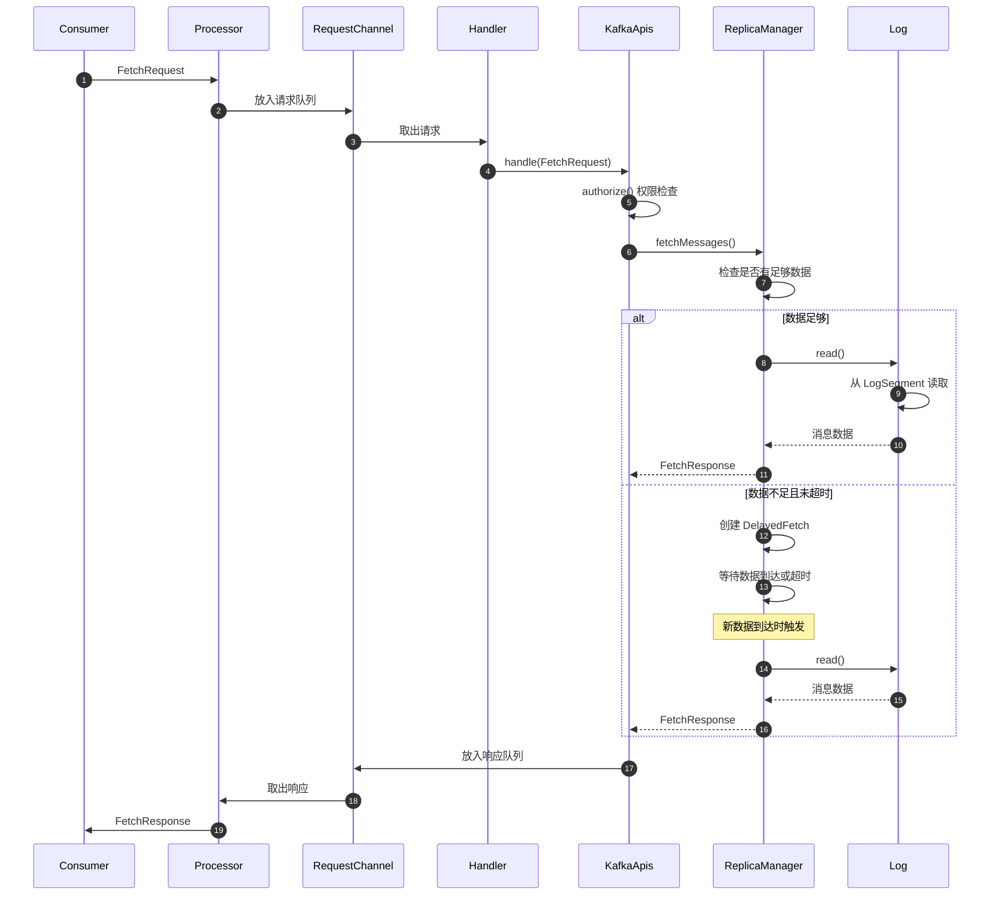
```mermaid
sequenceDiagram
    autonumber
    participant C as Consumer
    participant Proc as Processor
    participant RC as RequestChannel
    participant H as Handler
    participant KA as KafkaApis
    participant RM as ReplicaManager
    participant Log as Log

    C->>Proc: FetchRequest
    Proc->>RC: 放入请求队列
    RC->>H: 取出请求
    H->>KA: handle(FetchRequest)
    
    KA->>KA: authorize() 权限检查
    KA->>RM: fetchMessages()
    
    RM->>RM: 检查是否有足够数据
    
    alt 数据足够
        RM->>Log: read()
        Log->>Log: 从 LogSegment 读取
        Log-->>RM: 消息数据
        RM-->>KA: FetchResponse
    else 数据不足且未超时
        RM->>RM: 创建 DelayedFetch
        RM->>RM: 等待数据到达或超时
        Note over RM: 新数据到达时触发
        RM->>Log: read()
        Log-->>RM: 消息数据
        RM-->>KA: FetchResponse
    end
    
    KA->>RC: 放入响应队列
    RC->>Proc: 取出响应
    Proc->>C: FetchResponse
```

#### 4.2.1 核心代码：KafkaApis.handleFetchRequest()

```scala
def handleFetchRequest(request: RequestChannel.Request): Unit = {
  val fetchRequest = request.body[FetchRequest]
  
  // 1. 权限检查
  val authorizedTopicPartitions = authorizeFetchTopics(fetchRequest)
  
  // 2. 调用 ReplicaManager 读取
  replicaManager.fetchMessages(
    timeout = fetchRequest.maxWait,
    replicaId = fetchRequest.replicaId,
    fetchMinBytes = fetchRequest.minBytes,
    fetchMaxBytes = fetchRequest.maxBytes,
    hardMaxBytesLimit = fetchRequest.metadata.hardMaxBytesLimit,
    fetchInfos = fetchRequest.fetchData,
    quota = quota,
    responseCallback = sendResponseCallback(request, ...)
  )
}
```

**关键点**：

- `fetch.min.bytes`：最小拉取字节数，数据不足时等待
- `fetch.max.wait.ms`：最大等待时间，超时返回可用数据
- DelayedFetch：等待数据到达 fetch.min.bytes 或超时

#### 4.2.2 核心代码：ReplicaManager.fetchMessages()

```scala
def fetchMessages(
  timeout: Long,
  replicaId: Int,
  fetchMinBytes: Int,
  fetchMaxBytes: Int,
  fetchInfos: Seq[(TopicPartition, PartitionData)],
  quota: ReplicaQuota,
  responseCallback: Seq[(TopicPartition, FetchPartitionData)] => Unit
): Unit = {
  
  // 1. 从各分区读取消息
  val logReadResults = fetchInfos.map { case (tp, partitionData) =>
    val partition = getPartitionOrException(tp)
    val fetchInfo = partition.readRecords(
      fetchOffset = partitionData.fetchOffset,
      maxBytes = partitionData.maxBytes,
      ...
    )
    (tp, fetchInfo)
  }
  
  // 2. 检查是否满足 fetch.min.bytes
  val bytesReadable = logReadResults.map(_._2.sizeInBytes).sum
  
  if (bytesReadable >= fetchMinBytes || timeout == 0) {
    // 数据足够或不等待，立即响应
    responseCallback(logReadResults)
  } else {
    // 数据不足，创建延迟操作
    val delayedFetch = new DelayedFetch(timeout, fetchMinBytes, ...)
    delayedFetchPurgatory.tryCompleteElseWatch(delayedFetch, ...)
  }
}
```

---

## 5. 副本同步机制

### 5.1 副本同步架构

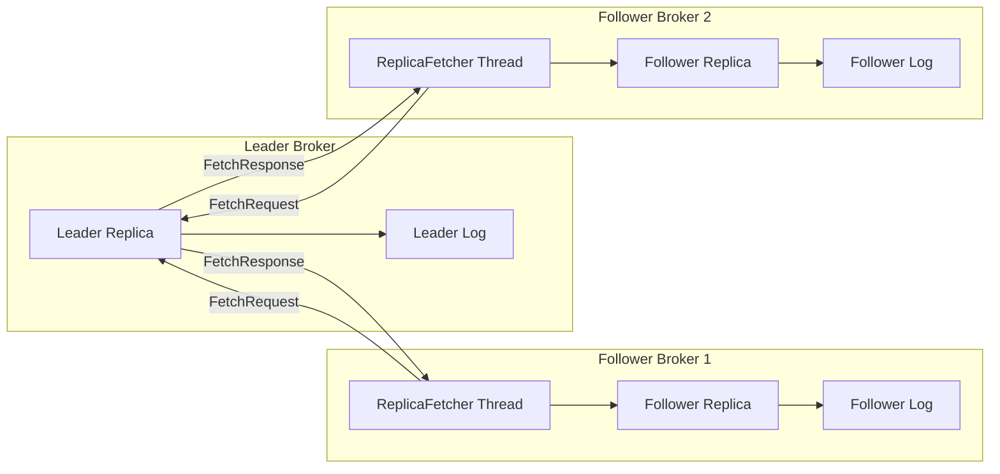
```mermaid
flowchart LR
    subgraph "Leader Broker"
        L[Leader Replica]
        LLog[Leader Log]
        L --> LLog
    end
    
    subgraph "Follower Broker 1"
        F1[Follower Replica]
        F1Fetcher[ReplicaFetcher Thread]
        F1Log[Follower Log]
        F1Fetcher --> F1
        F1 --> F1Log
    end
    
    subgraph "Follower Broker 2"
        F2[Follower Replica]
        F2Fetcher[ReplicaFetcher Thread]
        F2Log[Follower Log]
        F2Fetcher --> F2
        F2 --> F2Log
    end
    
    F1Fetcher -->|FetchRequest| L
    F2Fetcher -->|FetchRequest| L
    L -->|FetchResponse| F1Fetcher
    L -->|FetchResponse| F2Fetcher
```

### 5.2 副本同步流程

**Follower 视角**：

1. ReplicaFetcherThread 周期性发送 FetchRequest 到 Leader
2. 指定 fetchOffset（本地 Log 的 LEO）
3. Leader 返回 [fetchOffset, LEO) 范围的消息
4. Follower 追加到本地 Log
5. 更新本地 LEO
6. 发送新的 FetchRequest（新的 fetchOffset = 新的 LEO）

**Leader 视角**：

1. 接收 Follower 的 FetchRequest
2. 记录 Follower 的 LEO（fetchOffset 代表 Follower 已同步到的位置）
3. 返回消息数据
4. 检查是否可以更新 HW（所有 ISR 副本的最小 LEO）
5. 如果 HW 更新，触发 DelayedProduce 完成

### 5.3 ISR 管理

#### ISR 收缩（Shrink）

**触发条件**：

- Follower 落后 Leader 超过 `replica.lag.time.max.ms`（默认 10s）

**处理流程**：

```scala
// ReplicaManager.maybeShrinkIsr()
private def maybeShrinkIsr(): Unit = {
  allPartitions.foreach { (tp, partition) =>
    partition.maybeShrinkIsr()
  }
}

// Partition.maybeShrinkIsr()
def maybeShrinkIsr(): Unit = {
  val now = time.milliseconds()
  val laggingReplicas = inSyncReplicaIds.filter { replicaId =>
    val replica = getReplica(replicaId)
    replica.lastCaughtUpTimeMs < now - replicaLagTimeMaxMs
  }
  
  if (laggingReplicas.nonEmpty) {
    val newIsr = inSyncReplicaIds -- laggingReplicas
    alterPartitionManager.submit(topicPartition, newLeaderAndIsr(newIsr))
  }
}
```

#### ISR 扩展（Expand）

**触发条件**：

- Follower 追上 Leader（LEO 达到 Leader 的 HW）

**处理流程**：

```scala
// Partition.maybeExpandIsr()
def maybeExpandIsr(replicaId: Int): Unit = {
  if (!inSyncReplicaIds.contains(replicaId)) {
    val replica = getReplica(replicaId)
    if (replica.logEndOffset >= highWatermark) {
      val newIsr = inSyncReplicaIds + replicaId
      alterPartitionManager.submit(topicPartition, newLeaderAndIsr(newIsr))
    }
  }
}
```

**关键点**：

- ISR 变更需要向 Controller 报告（通过 AlterPartitionRequest）
- Controller 验证后更新元数据，并推送到所有 Broker

---

## 6. 性能优化要点

### 6.1 零拷贝（Zero-Copy）

Kafka 使用 `sendfile()` 系统调用实现零拷贝：

```scala
// FileRecords.writeTo()
def writeTo(channel: GatheringByteChannel, position: Long, length: Int): Int = {
  // 使用 FileChannel.transferTo() 实现零拷贝
  channel.write(buffer.duplicate())
}
```

**优势**：

- 数据直接从文件传输到 Socket，不经过用户态
- 减少 CPU 使用率 40%-50%
- 提高吞吐量 2-3 倍

### 6.2 批量处理

**Producer 批量**：

- 消息在 RecordAccumulator 中批量累加
- 一个 ProduceRequest 包含多个分区的多条消息

**Consumer 批量**：

- 一个 FetchRequest 包含多个分区
- 一个 FetchResponse 返回多个分区的多条消息

**Broker 批量写入**：

- ProduceRequest 中的消息批量写入 Log
- 使用 FileChannel.write(ByteBuffer[]) 批量写入

### 6.3 页缓存（Page Cache）

**设计理念**：

- Kafka 不自己管理缓存，依赖操作系统页缓存
- 写入时先写页缓存，由操作系统决定何时刷盘
- 读取时优先从页缓存读取

**优势**：

- 利用操作系统优化，减少重复工作
- 消费路径大概率从页缓存读取（接近内存速度）
- 自动预读（readahead）提高顺序读性能

### 6.4 延迟操作（Delayed Operations）

**用途**：

- 等待条件满足后再响应，避免忙等待
- 支持超时机制

**实现**：

- **DelayedProduce**：等待 ISR 副本确认
- **DelayedFetch**：等待数据达到 fetch.min.bytes
- **DelayedJoin**：等待消费者组成员加入

**Purgatory**：

- 管理延迟操作的容器
- 支持按 Key 查找（如 TopicPartition）
- 支持定时检查和条件触发

---

## 7. 监控指标

### 7.1 Broker 指标

| 指标名称 | 类型 | 说明 |
|---------|------|------|
| `UnderReplicatedPartitions` | Gauge | 副本不足的分区数（ISR < 副本数） |
| `OfflinePartitionsCount` | Gauge | 离线分区数（无 Leader） |
| `LeaderCount` | Gauge | 作为 Leader 的分区数 |
| `PartitionCount` | Gauge | 总分区数 |
| `IsrExpandsPerSec` | Meter | ISR 扩展速率 |
| `IsrShrinksPerSec` | Meter | ISR 收缩速率 |
| `BytesInPerSec` | Meter | 每秒写入字节数 |
| `BytesOutPerSec` | Meter | 每秒读取字节数 |
| `MessagesInPerSec` | Meter | 每秒写入消息数 |
| `RequestHandlerAvgIdlePercent` | Gauge | 请求处理线程空闲率 |
| `NetworkProcessorAvgIdlePercent` | Gauge | 网络线程空闲率 |

### 7.2 副本指标

| 指标名称 | 类型 | 说明 |
|---------|------|------|
| `ReplicaLag` | Gauge | Follower 落后 Leader 的消息数 |
| `ReplicaMaxLag` | Gauge | 最大副本延迟 |

---

## 8. 故障处理

### 8.1 Broker 宕机

**检测**：

- Controller 通过心跳超时检测（session.timeout.ms）

**处理**：

1. Controller 从元数据中移除该 Broker
2. 对于该 Broker 上的 Leader 分区，从 ISR 中选举新 Leader
3. 更新元数据并推送到所有 Broker
4. 客户端接收到元数据更新，切换到新 Leader

### 8.2 磁盘故障

**检测**：

- LogManager 监控 I/O 异常
- 标记目录为离线（通过 LogDirFailureChannel）

**处理**：

1. 停止该目录上的所有分区
2. 将分区状态设置为 Offline
3. 向 Controller 报告
4. Controller 从其他副本选举新 Leader

### 8.3 网络分区

**检测**：

- Controller 和 Broker 间心跳超时
- Broker 间副本同步超时

**处理**：

- 少数派 Broker 被隔离，停止服务
- 多数派 Broker 继续服务
- 网络恢复后，隔离的 Broker 重新加入

---

**文档生成时间**：2025-10-04  
**模块路径**：`core/`  
**主要语言**：Scala, Java  
**关键类**：`KafkaRaftServer`, `BrokerServer`, `SocketServer`, `KafkaApis`, `ReplicaManager`, `LogManager`

---

## API接口

## 目录
- [ProduceRequest](#producerequest)
- [FetchRequest](#fetchrequest)
- [MetadataRequest](#metadatarequest)
- [OffsetCommitRequest](#offsetcommitrequest)
- [OffsetFetchRequest](#offsetfetchrequest)
- [ListOffsetsRequest](#listoffsetsrequest)
- [CreateTopicsRequest](#createtopicsrequest)

---

## ProduceRequest

### 基本信息
- **API Key**: 0
- **协议**: Kafka Protocol
- **方法**: Broker 接收 Producer 的消息写入请求
- **幂等性**: 支持（通过 ProducerId + Sequence）

### 请求结构体

```java
// ProduceRequest.java
public class ProduceRequestData {
    private String transactionalId;          // 事务 ID（可选）
    private short acks;                      // 确认级别：-1/0/1
    private int timeoutMs;                   // 请求超时
    private List<TopicProduceData> topicData; // Topic 数据列表
}

public class TopicProduceData {
    private String name;                     // Topic 名称
    private List<PartitionProduceData> partitionData; // 分区数据列表
}

public class PartitionProduceData {
    private int index;                       // 分区 ID
    private MemoryRecords records;           // 消息记录
}
```

### 字段表

| 字段 | 类型 | 必填 | 约束/默认 | 说明 |
|------|------|------|-----------|------|
| transactionalId | String | 否 | null | 事务 ID，用于事务写入 |
| acks | short | 是 | -1 | -1=所有 ISR 确认，0=不等待，1=Leader 确认 |
| timeoutMs | int | 是 | 30000 | 等待确认的超时时间（毫秒） |
| topicData | List | 是 | - | 要写入的 Topic 列表 |
| topicData[].name | String | 是 | - | Topic 名称 |
| topicData[].partitionData | List | 是 | - | 分区数据列表 |
| partitionData[].index | int | 是 | - | 分区 ID |
| partitionData[].records | MemoryRecords | 是 | - | 消息批次 |

### 响应结构体

```java
public class ProduceResponseData {
    private List<TopicProduceResponse> responses;
    private int throttleTimeMs;
}

public class TopicProduceResponse {
    private String name;
    private List<PartitionProduceResponse> partitionResponses;
}

public class PartitionProduceResponse {
    private int index;                    // 分区 ID
    private short errorCode;              // 错误码
    private long baseOffset;              // 起始偏移量
    private long logAppendTimeMs;         // 追加时间
    private long logStartOffset;          // 日志起始偏移量
    private List<RecordError> recordErrors; // 记录级错误（批次中部分失败）
    private String errorMessage;          // 错误消息
}
```

### 字段表

| 字段 | 类型 | 说明 |
|------|------|------|
| responses | List | Topic 响应列表 |
| responses[].name | String | Topic 名称 |
| responses[].partitionResponses | List | 分区响应列表 |
| partitionResponses[].index | int | 分区 ID |
| partitionResponses[].errorCode | short | 错误码（0=成功） |
| partitionResponses[].baseOffset | long | 起始偏移量 |
| partitionResponses[].logAppendTimeMs | long | 追加时间戳 |
| partitionResponses[].logStartOffset | long | 日志起始偏移量 |
| throttleTimeMs | int | 限流时间（毫秒） |

### 入口函数

```scala
// KafkaApis.scala
def handleProduceRequest(request: RequestChannel.Request, requestLocal: RequestLocal): Unit = {
  val produceRequest = request.body[ProduceRequest]
  val numBytesAppended = request.header.toStruct.sizeOf + request.sizeOfBodyInBytes
  
  // 权限验证
  val unauthorizedTopicResponses = mutable.Map[TopicPartition, PartitionResponse]()
  val nonExistingTopicResponses = mutable.Map[TopicPartition, PartitionResponse]()
  val invalidRequestResponses = mutable.Map[TopicPartition, PartitionResponse]()
  
  // 验证请求
  produceRequest.data.topicData.forEach { topic =>
    topic.partitionData.forEach { partition =>
      val tp = new TopicPartition(topic.name, partition.index)
      
      // 检查授权
      if (!authorize(request.context, WRITE, TOPIC, topic.name)) {
        unauthorizedTopicResponses += tp -> new PartitionResponse(
          Errors.TOPIC_AUTHORIZATION_FAILED)
      }
      // 检查 Topic 是否存在
      else if (!metadataCache.contains(topic.name)) {
        nonExistingTopicResponses += tp -> new PartitionResponse(
          Errors.UNKNOWN_TOPIC_OR_PARTITION)
      }
    }
  }
  
  // 转换为追加操作
  val authorizedRequestInfo = mutable.Map[TopicPartition, MemoryRecords]()
  produceRequest.data.topicData.forEach { topic =>
    topic.partitionData.forEach { partition =>
      val tp = new TopicPartition(topic.name, partition.index)
      if (!unauthorizedTopicResponses.contains(tp) &&
          !nonExistingTopicResponses.contains(tp)) {
        authorizedRequestInfo += tp -> partition.records
      }
    }
  }
  
  // 追加到日志
  replicaManager.appendRecords(
    timeout = produceRequest.timeout.toLong,
    requiredAcks = produceRequest.acks,
    internalTopicsAllowed = request.header.clientId == AdminClientId,
    origin = AppendOrigin.Client,
    entriesPerPartition = authorizedRequestInfo,
    responseCallback = sendResponseCallback,
    requestLocal = requestLocal
  )
}
```

### 调用链

```
handleProduceRequest
  ↓
ReplicaManager.appendRecords
  ↓
Partition.appendRecordsToLeader
  ↓
UnifiedLog.appendAsLeader
  ↓
LogSegment.append
  ↓
FileRecords.append
```

### 时序图

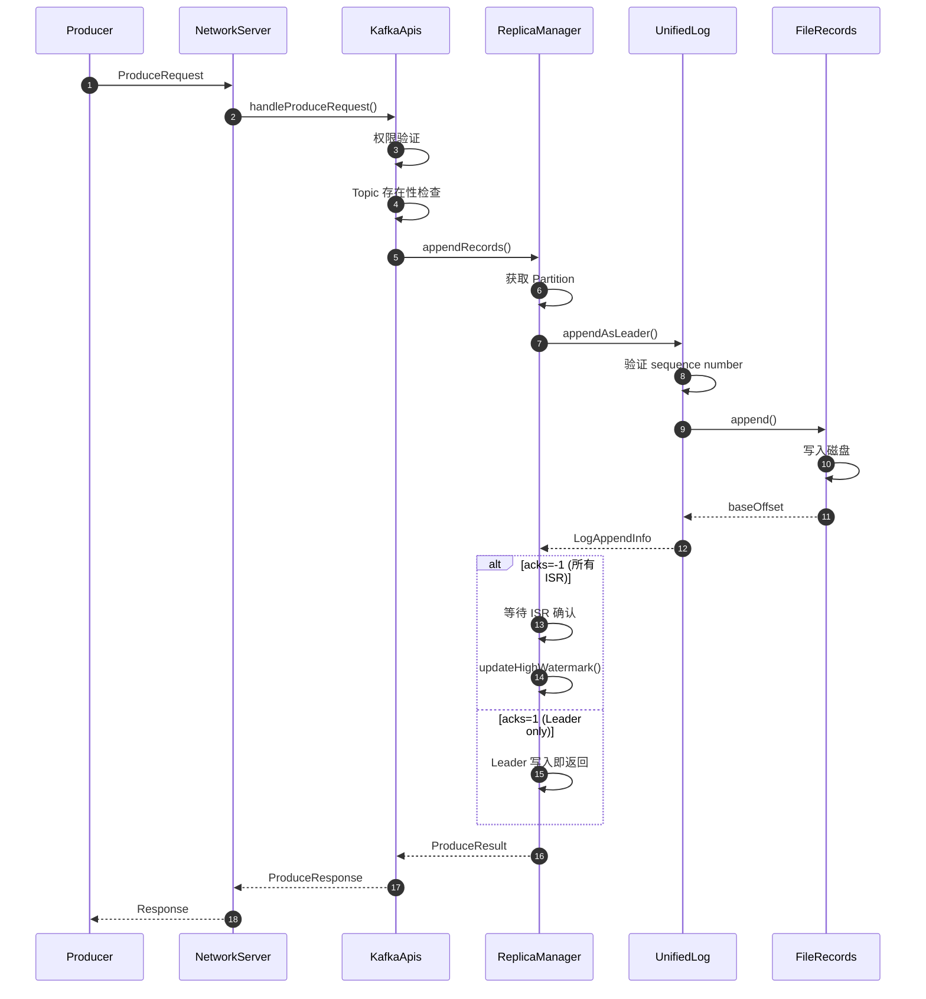
```mermaid
sequenceDiagram
    autonumber
    participant P as Producer
    participant N as NetworkServer
    participant A as KafkaApis
    participant R as ReplicaManager
    participant L as UnifiedLog
    participant F as FileRecords
    
    P->>N: ProduceRequest
    N->>A: handleProduceRequest()
    
    A->>A: 权限验证
    A->>A: Topic 存在性检查
    
    A->>R: appendRecords()
    
    R->>R: 获取 Partition
    R->>L: appendAsLeader()
    
    L->>L: 验证 sequence number
    L->>F: append()
    
    F->>F: 写入磁盘
    F-->>L: baseOffset
    
    L-->>R: LogAppendInfo
    
    alt acks=-1 (所有 ISR)
        R->>R: 等待 ISR 确认
        R->>R: updateHighWatermark()
    else acks=1 (Leader only)
        R->>R: Leader 写入即返回
    end
    
    R-->>A: ProduceResult
    A-->>N: ProduceResponse
    N-->>P: Response
```

### 边界与异常

**重复写入**：

- 幂等 Producer 通过 ProducerId + Sequence 去重
- Broker 维护最近 5 个 batch 的 sequence
- 重复的 batch 返回成功但不写入

**分区不存在**：

- 返回 `UNKNOWN_TOPIC_OR_PARTITION`
- Producer 刷新元数据后重试

**Leader 不可用**：

- 返回 `NOT_LEADER_OR_FOLLOWER`
- Producer 刷新元数据并重新路由

**超时**：

- `acks=-1` 时，ISR 未及时确认
- 返回 `REQUEST_TIMED_OUT`
- Producer 根据配置重试

**配额限制**：

- 返回 `throttleTimeMs` > 0
- Producer 延迟后重试

### 实践与最佳实践

**Producer 配置**：

```properties
# 吞吐量优先
acks=1
linger.ms=10
batch.size=32768
compression.type=lz4

# 可靠性优先
acks=-1
linger.ms=0
max.in.flight.requests.per.connection=1
enable.idempotence=true
```

**性能优化**：

- 批量发送：`linger.ms` + `batch.size`
- 压缩：`compression.type=lz4`
- 异步发送：不等待响应

**可靠性保证**：

- `acks=-1`：所有 ISR 确认
- `enable.idempotence=true`：幂等性
- `max.in.flight.requests.per.connection=1`：顺序性

---

## FetchRequest

### 基本信息
- **API Key**: 1
- **协议**: Kafka Protocol
- **方法**: Consumer/Follower 拉取消息
- **幂等性**: 是（基于 offset）

### 请求结构体

```java
public class FetchRequestData {
    private int replicaId;                   // Replica ID（-1=Consumer）
    private int maxWaitMs;                   // 最大等待时间
    private int minBytes;                    // 最小字节数
    private int maxBytes;                    // 最大字节数
    private byte isolationLevel;             // 隔离级别
    private int sessionId;                   // Session ID
    private int sessionEpoch;                // Session Epoch
    private List<FetchTopic> topics;         // Topic 列表
    private List<ForgottenTopic> forgottenTopicsData; // 不再 Fetch 的 Topic
    private String rackId;                   // 机架 ID
}

public class FetchTopic {
    private Uuid topicId;                    // Topic UUID
    private List<FetchPartition> partitions; // 分区列表
}

public class FetchPartition {
    private int partition;                   // 分区 ID
    private long fetchOffset;                // 拉取起始偏移量
    private int partitionMaxBytes;           // 分区最大字节数
    private int currentLeaderEpoch;          // 当前 Leader Epoch
    private long logStartOffset;             // 日志起始偏移量
}
```

### 字段表

| 字段 | 类型 | 必填 | 约束/默认 | 说明 |
|------|------|------|-----------|------|
| replicaId | int | 是 | -1 | -1=Consumer，>=0=Follower Broker ID |
| maxWaitMs | int | 是 | 500 | 无数据时最大等待时间（毫秒） |
| minBytes | int | 是 | 1 | 最小返回字节数 |
| maxBytes | int | 是 | 52428800 | 最大返回字节数（50MB） |
| isolationLevel | byte | 是 | 0 | 0=READ_UNCOMMITTED, 1=READ_COMMITTED |
| sessionId | int | 否 | 0 | Incremental Fetch Session ID |
| sessionEpoch | int | 否 | -1 | Session Epoch |
| topics | List | 是 | - | 要拉取的 Topic 列表 |
| topics[].topicId | Uuid | 是 | - | Topic UUID |
| topics[].partitions | List | 是 | - | 分区列表 |
| partitions[].partition | int | 是 | - | 分区 ID |
| partitions[].fetchOffset | long | 是 | - | 拉取起始偏移量 |
| partitions[].partitionMaxBytes | int | 是 | 1048576 | 分区最大字节数（1MB） |
| rackId | String | 否 | null | Consumer 机架 ID（用于就近拉取） |

### 响应结构体

```java
public class FetchResponseData {
    private int throttleTimeMs;
    private short errorCode;
    private int sessionId;
    private List<FetchableTopicResponse> responses;
}

public class FetchableTopicResponse {
    private Uuid topicId;
    private List<PartitionData> partitions;
}

public class PartitionData {
    private int partitionIndex;
    private short errorCode;
    private long highWatermark;              // High Watermark
    private long lastStableOffset;           // Last Stable Offset（事务）
    private long logStartOffset;             // 日志起始偏移量
    private List<AbortedTransaction> abortedTransactions; // 已中止事务
    private int preferredReadReplica;        // 推荐读取副本
    private MemoryRecords records;           // 消息记录
}
```

### 字段表

| 字段 | 类型 | 说明 |
|------|------|------|
| throttleTimeMs | int | 限流时间 |
| errorCode | short | 错误码 |
| sessionId | int | Session ID |
| responses[].topicId | Uuid | Topic UUID |
| responses[].partitions | List | 分区响应列表 |
| partitions[].partitionIndex | int | 分区 ID |
| partitions[].errorCode | short | 错误码 |
| partitions[].highWatermark | long | High Watermark |
| partitions[].lastStableOffset | long | Last Stable Offset |
| partitions[].logStartOffset | long | 日志起始偏移量 |
| partitions[].records | MemoryRecords | 消息记录 |

### 入口函数

```scala
def handleFetchRequest(request: RequestChannel.Request): Unit = {
  val fetchRequest = request.body[FetchRequest]
  val versionId = request.header.apiVersion
  
  // 权限验证
  val fetchContext = fetchManager.newContext(
    fetchRequest.metadata,
    fetchRequest.fetchData,
    fetchRequest.toForget,
    fetchRequest.isFromFollower
  )
  
  // 构建 Fetch 参数
  val fetchParams = FetchParams(
    requestVersion = versionId,
    replicaId = fetchRequest.replicaId,
    maxWaitMs = fetchRequest.maxWait,
    minBytes = fetchRequest.minBytes,
    maxBytes = fetchRequest.maxBytes,
    isolation = fetchRequest.isolationLevel,
    clientMetadata = fetchRequest.metadata
  )
  
  // 从副本管理器拉取
  replicaManager.fetchMessages(
    fetchParams,
    fetchContext.getFetchData,
    quota,
    responseCallback
  )
}
```

### 时序图

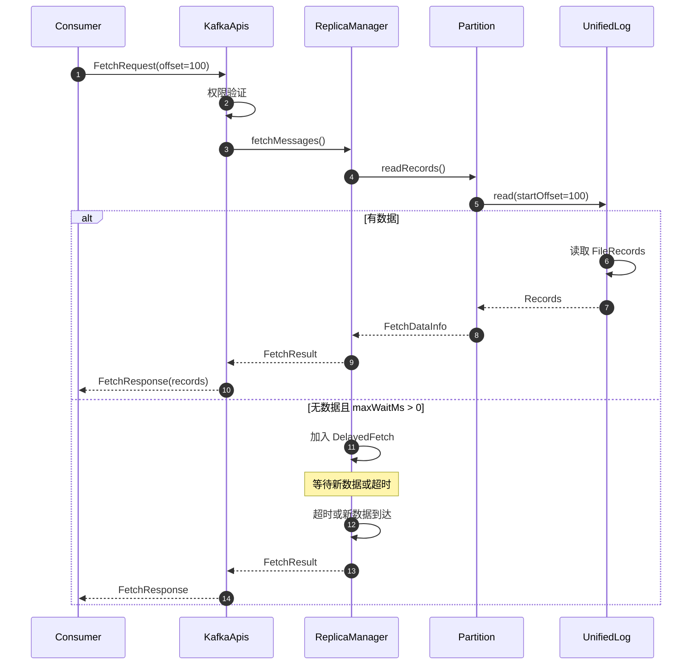
```mermaid
sequenceDiagram
    autonumber
    participant C as Consumer
    participant A as KafkaApis
    participant R as ReplicaManager
    participant P as Partition
    participant L as UnifiedLog
    
    C->>A: FetchRequest(offset=100)
    A->>A: 权限验证
    A->>R: fetchMessages()
    
    R->>P: readRecords()
    P->>L: read(startOffset=100)
    
    alt 有数据
        L->>L: 读取 FileRecords
        L-->>P: Records
        P-->>R: FetchDataInfo
        R-->>A: FetchResult
        A-->>C: FetchResponse(records)
    else 无数据且 maxWaitMs > 0
        R->>R: 加入 DelayedFetch
        Note over R: 等待新数据或超时
        R->>R: 超时或新数据到达
        R-->>A: FetchResult
        A-->>C: FetchResponse
    end
```

---

## MetadataRequest

### 基本信息
- **API Key**: 3
- **协议**: Kafka Protocol
- **方法**: 获取集群元数据
- **幂等性**: 是

### 请求结构体

```java
public class MetadataRequestData {
    private List<MetadataRequestTopic> topics;
    private boolean allowAutoTopicCreation;
    private boolean includeTopicAuthorizedOperations;
}

public class MetadataRequestTopic {
    private Uuid topicId;
    private String name;
}
```

### 字段表

| 字段 | 类型 | 必填 | 约束/默认 | 说明 |
|------|------|------|-----------|------|
| topics | List | 否 | null | Topic 列表（null=所有 Topic） |
| topics[].topicId | Uuid | 否 | - | Topic UUID |
| topics[].name | String | 否 | - | Topic 名称 |
| allowAutoTopicCreation | boolean | 是 | true | 是否允许自动创建 Topic |
| includeTopicAuthorizedOperations | boolean | 是 | false | 是否包含授权操作 |

### 响应结构体

```java
public class MetadataResponseData {
    private int throttleTimeMs;
    private List<MetadataResponseBroker> brokers;
    private String clusterId;
    private int controllerId;
    private List<MetadataResponseTopic> topics;
}

public class MetadataResponseBroker {
    private int nodeId;
    private String host;
    private int port;
    private String rack;
}

public class MetadataResponseTopic {
    private short errorCode;
    private String name;
    private Uuid topicId;
    private boolean isInternal;
    private List<MetadataResponsePartition> partitions;
    private int topicAuthorizedOperations;
}

public class MetadataResponsePartition {
    private short errorCode;
    private int partitionIndex;
    private int leaderId;
    private int leaderEpoch;
    private List<Integer> replicaNodes;
    private List<Integer> isrNodes;
    private List<Integer> offlineReplicas;
}
```

### 字段表

| 字段 | 类型 | 说明 |
|------|------|------|
| throttleTimeMs | int | 限流时间 |
| brokers | List | Broker 列表 |
| brokers[].nodeId | int | Broker ID |
| brokers[].host | String | 主机名 |
| brokers[].port | int | 端口 |
| brokers[].rack | String | 机架 ID |
| clusterId | String | 集群 ID |
| controllerId | int | Controller ID |
| topics | List | Topic 元数据列表 |
| topics[].name | String | Topic 名称 |
| topics[].topicId | Uuid | Topic UUID |
| topics[].isInternal | boolean | 是否内部 Topic |
| topics[].partitions | List | 分区元数据列表 |
| partitions[].partitionIndex | int | 分区 ID |
| partitions[].leaderId | int | Leader Broker ID |
| partitions[].leaderEpoch | int | Leader Epoch |
| partitions[].replicaNodes | List | 副本列表 |
| partitions[].isrNodes | List | ISR 列表 |

---

## 总结

本文档详细描述了 Kafka Broker 核心 API 的规格，包括：

1. **完整的请求/响应结构**：字段定义、类型、约束
2. **详细的字段表**：每个字段的含义和用途
3. **入口函数与调用链**：核心代码路径
4. **完整的时序图**：请求处理流程
5. **异常处理**：边界条件和错误场景
6. **最佳实践**：配置建议和优化方法

每个 API 都提供了从请求到响应的完整视图，帮助开发者深入理解 Kafka 协议的实现细节。

---

## 数据结构

## 目录
- [Kafka-02-Core-数据结构](#kafka-02-core-数据结构)
  - [目录](#目录)
  - [Partition](#partition)
    - [UML 类图](#uml-类图)
    - [字段说明](#字段说明)
    - [关键方法](#关键方法)
  - [Replica](#replica)
    - [UML 类图](#uml-类图-1)
    - [字段说明](#字段说明-1)
    - [关键方法](#关键方法-1)
  - [HostedPartition](#hostedpartition)
    - [UML 类图](#uml-类图-2)
    - [说明](#说明)
  - [RequestChannel.Request](#requestchannelrequest)
    - [UML 类图](#uml-类图-3)
    - [字段说明](#字段说明-2)
  - [DelayedOperation](#delayedoperation)
    - [UML 类图](#uml-类图-4)
    - [说明](#说明-1)
    - [关键方法](#关键方法-2)
  - [FetchDataInfo](#fetchdatainfo)
    - [UML 类图](#uml-类图-5)
    - [字段说明](#字段说明-3)
    - [关键方法](#关键方法-3)
  - [总结](#总结)

---

## Partition

### UML 类图

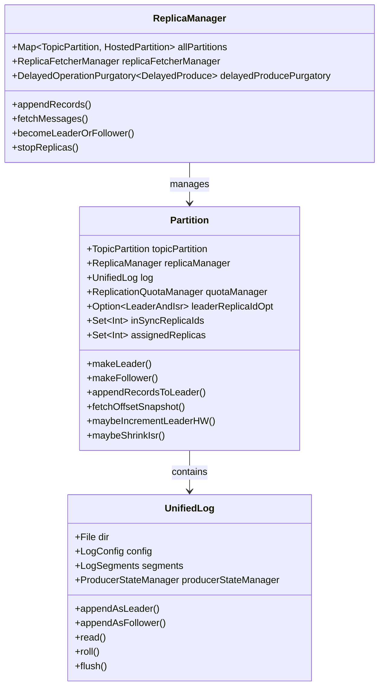
```mermaid
classDiagram
    class Partition {
        +TopicPartition topicPartition
        +ReplicaManager replicaManager
        +UnifiedLog log
        +ReplicationQuotaManager quotaManager
        
        +Option~LeaderAndIsr~ leaderReplicaIdOpt
        +Set~Int~ inSyncReplicaIds
        +Set~Int~ assignedReplicas
        
        +makeLeader()
        +makeFollower()
        +appendRecordsToLeader()
        +fetchOffsetSnapshot()
        +maybeIncrementLeaderHW()
        +maybeShrinkIsr()
    }
    
    class UnifiedLog {
        +File dir
        +LogConfig config
        +LogSegments segments
        +ProducerStateManager producerStateManager
        
        +appendAsLeader()
        +appendAsFollower()
        +read()
        +roll()
        +flush()
    }
    
    class ReplicaManager {
        +Map~TopicPartition, HostedPartition~ allPartitions
        +ReplicaFetcherManager replicaFetcherManager
        +DelayedOperationPurgatory~DelayedProduce~ delayedProducePurgatory
        
        +appendRecords()
        +fetchMessages()
        +becomeLeaderOrFollower()
        +stopReplicas()
    }
    
    Partition --> UnifiedLog : contains
    ReplicaManager --> Partition : manages
```

### 字段说明

**核心字段**：

| 字段 | 类型 | 说明 |
|------|------|------|
| topicPartition | TopicPartition | Topic 名称 + 分区 ID |
| log | UnifiedLog | 底层日志 |
| leaderReplicaIdOpt | Option[Int] | Leader Replica ID |
| inSyncReplicaIds | Set[Int] | ISR 集合 |
| assignedReplicas | Set[Int] | 分配的所有副本 |
| leaderEpoch | Int | Leader Epoch |
| leaderEpochStartOffsetOpt | Option[Long] | Leader Epoch 起始偏移量 |

**状态字段**：

| 字段 | 类型 | 说明 |
|------|------|------|
| isLeader | Boolean | 是否为 Leader |
| partitionState | PartitionState | 分区状态 |
| lastFetchLeaderLogEndOffset | Long | 上次 Fetch 时 Leader LEO |
| lastFetchTime | Long | 上次 Fetch 时间 |

### 关键方法

**1. makeLeader**：成为 Leader

```scala
def makeLeader(
    partitionState: LeaderAndIsr,
    highWatermarkCheckpoints: OffsetCheckpoints,
    topicId: Option[Uuid]
): Boolean = {
    inWriteLock(leaderIsrUpdateLock) {
        // 更新 leader epoch
        val newLeaderEpoch = partitionState.leaderEpoch
        
        // 更新 ISR
        val newInSyncReplicaIds = partitionState.isr.toSet
        
        // 恢复或创建日志
        val log = createLogIfNotExists(
            isNew = false,
            isFutureReplica = false,
            highWatermarkCheckpoints,
            topicId
        )
        
        // 更新状态
        this.leaderReplicaIdOpt = Some(localBrokerId)
        this.leaderEpoch = newLeaderEpoch
        this.inSyncReplicaIds = newInSyncReplicaIds
        
        // 初始化 high watermark
        val hw = log.highWatermark
        log.maybeIncrementHighWatermark(log.logEndOffsetMetadata)
        
        true
    }
}
```

**2. appendRecordsToLeader**：追加记录

```scala
def appendRecordsToLeader(
    records: MemoryRecords,
    origin: AppendOrigin,
    requiredAcks: Int,
    requestLocal: RequestLocal
): LogAppendInfo = {
    // 验证是 Leader
    if (!isLeader) {
        throw new NotLeaderOrFollowerException(
            s"Leader not local for partition $topicPartition"
        )
    }
    
    val log = localLogOrException
    val minIsr = log.config.minInSyncReplicas
    
    // 检查 ISR 大小
    if (inSyncReplicaIds.size < minIsr && requiredAcks == -1) {
        throw new NotEnoughReplicasException(
            s"Number of insync replicas for partition $topicPartition is " +
            s"[${inSyncReplicaIds.size}], below required minimum [$minIsr]"
        )
    }
    
    // 追加到日志
    val info = log.appendAsLeader(records, leaderEpoch, origin, requestLocal)
    
    // 更新 high watermark
    maybeIncrementLeaderHW(log)
    
    info
}
```

**3. maybeIncrementLeaderHW**：更新 High Watermark

```scala
private def maybeIncrementLeaderHW(
    leaderLog: UnifiedLog,
    currentTimeMs: Long = time.milliseconds()
): Boolean = {
    // 收集所有 ISR 的 LEO
    val leaderLogEndOffset = leaderLog.logEndOffsetMetadata
    val allLogEndOffsets = inSyncReplicaIds.map { replicaId =>
        if (replicaId == localBrokerId) {
            leaderLogEndOffset
        } else {
            getReplicaOrException(replicaId).logEndOffsetMetadata
        }
    }
    
    // 计算新的 HW（ISR 中最小的 LEO）
    val newHighWatermark = allLogEndOffsets.min
    
    val oldHighWatermark = leaderLog.highWatermark
    if (newHighWatermark.messageOffset > oldHighWatermark) {
        leaderLog.updateHighWatermark(newHighWatermark)
        true
    } else {
        false
    }
}
```

---

## Replica

### UML 类图

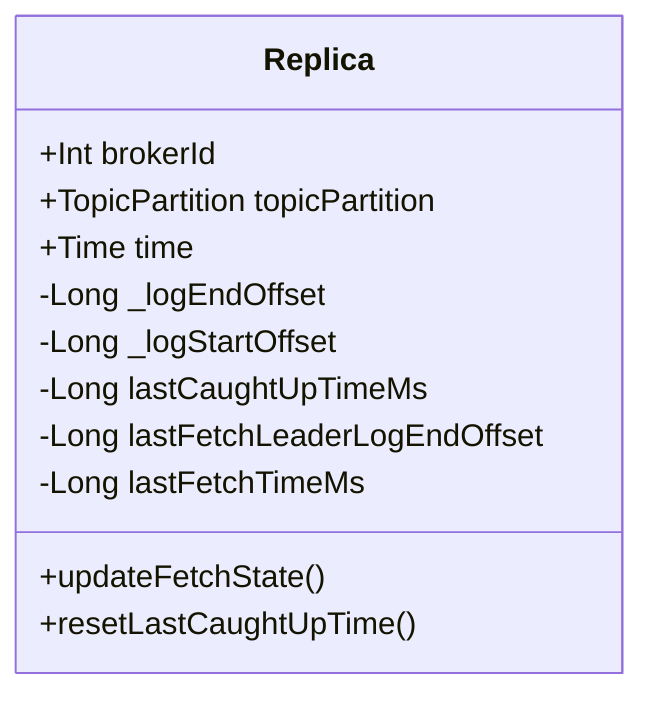
```mermaid
classDiagram
    class Replica {
        +Int brokerId
        +TopicPartition topicPartition
        +Time time
        
        -Long _logEndOffset
        -Long _logStartOffset
        -Long lastCaughtUpTimeMs
        -Long lastFetchLeaderLogEndOffset
        -Long lastFetchTimeMs
        
        +updateFetchState()
        +resetLastCaughtUpTime()
    }
```

### 字段说明

| 字段 | 类型 | 说明 |
|------|------|------|
| brokerId | Int | Broker ID |
| topicPartition | TopicPartition | 所属分区 |
| _logEndOffset | Long | Log End Offset（LEO） |
| _logStartOffset | Long | Log Start Offset |
| lastCaughtUpTimeMs | Long | 上次追上 Leader 的时间 |
| lastFetchLeaderLogEndOffset | Long | 上次 Fetch 时 Leader 的 LEO |
| lastFetchTimeMs | Long | 上次 Fetch 的时间 |

### 关键方法

```scala
def updateFetchState(
    followerFetchOffsetMetadata: LogOffsetMetadata,
    followerStartOffset: Long,
    followerFetchTimeMs: Long,
    leaderEndOffset: Long
): Unit = {
    _logEndOffset = followerFetchOffsetMetadata.messageOffset
    _logStartOffset = followerStartOffset
    lastFetchTimeMs = followerFetchTimeMs
    lastFetchLeaderLogEndOffset = leaderEndOffset
    
    // 如果追上了 Leader，更新时间
    if (followerFetchOffsetMetadata.messageOffset >= leaderEndOffset) {
        lastCaughtUpTimeMs = followerFetchTimeMs
    }
}
```

---

## HostedPartition

### UML 类图

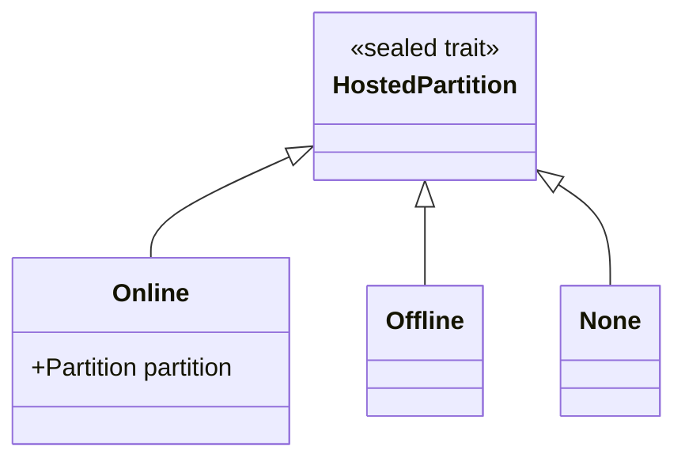
```mermaid
classDiagram
    class HostedPartition {
        <<sealed trait>>
    }
    
    class Online {
        +Partition partition
    }
    
    class Offline {
    }
    
    class None {
    }
    
    HostedPartition <|-- Online
    HostedPartition <|-- Offline
    HostedPartition <|-- None
```

### 说明

表示 Broker 上 Partition 的状态：

| 状态 | 说明 |
|------|------|
| Online | 分区在线，包含 Partition 对象 |
| Offline | 分区离线（磁盘故障等） |
| None | 分区不存在 |

---

## RequestChannel.Request

### UML 类图

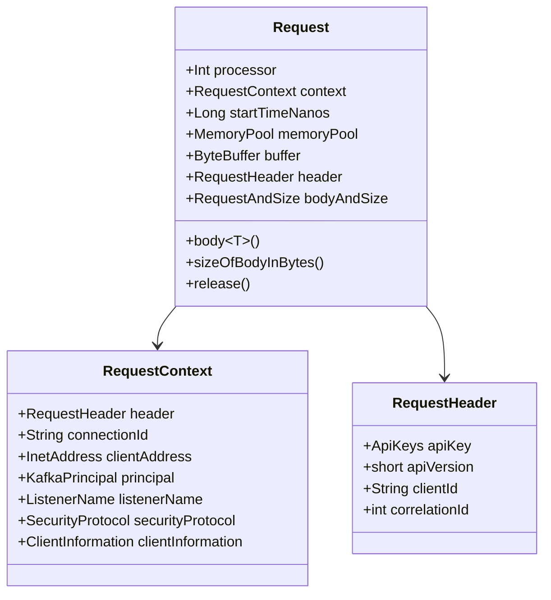
```mermaid
classDiagram
    class Request {
        +Int processor
        +RequestContext context
        +Long startTimeNanos
        +MemoryPool memoryPool
        +ByteBuffer buffer
        +RequestHeader header
        +RequestAndSize bodyAndSize
        
        +body~T~()
        +sizeOfBodyInBytes()
        +release()
    }
    
    class RequestContext {
        +RequestHeader header
        +String connectionId
        +InetAddress clientAddress
        +KafkaPrincipal principal
        +ListenerName listenerName
        +SecurityProtocol securityProtocol
        +ClientInformation clientInformation
    }
    
    class RequestHeader {
        +ApiKeys apiKey
        +short apiVersion
        +String clientId
        +int correlationId
    }
    
    Request --> RequestContext
    Request --> RequestHeader
```

### 字段说明

| 字段 | 类型 | 说明 |
|------|------|------|
| processor | Int | 处理该请求的 Processor ID |
| context | RequestContext | 请求上下文（认证、授权信息） |
| startTimeNanos | Long | 请求开始时间（纳秒） |
| buffer | ByteBuffer | 请求数据缓冲区 |
| header | RequestHeader | 请求头 |

---

## DelayedOperation

### UML 类图

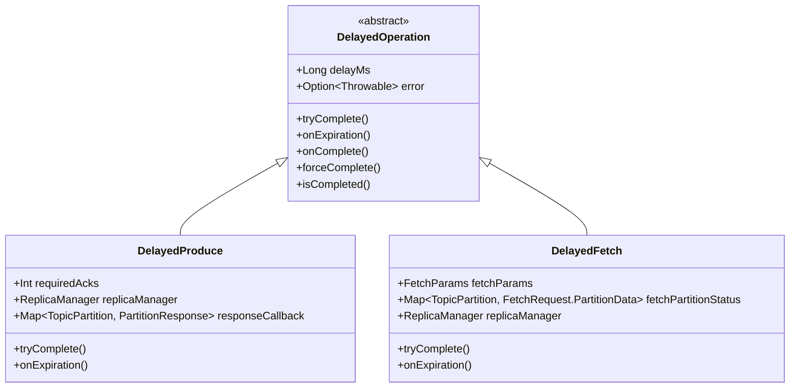
```mermaid
classDiagram
    class DelayedOperation {
        <<abstract>>
        +Long delayMs
        +Option~Throwable~ error
        
        +tryComplete()
        +onExpiration()
        +onComplete()
        +forceComplete()
        +isCompleted()
    }
    
    class DelayedProduce {
        +Int requiredAcks
        +ReplicaManager replicaManager
        +Map~TopicPartition, PartitionResponse~ responseCallback
        
        +tryComplete()
        +onExpiration()
    }
    
    class DelayedFetch {
        +FetchParams fetchParams
        +Map~TopicPartition, FetchRequest.PartitionData~ fetchPartitionStatus
        +ReplicaManager replicaManager
        
        +tryComplete()
        +onExpiration()
    }
    
    DelayedOperation <|-- DelayedProduce
    DelayedOperation <|-- DelayedFetch
```

### 说明

**DelayedProduce**：

- 用于 `acks=-1` 的 Produce 请求
- 等待所有 ISR 确认
- 超时或确认完成时触发回调

**DelayedFetch**：

- 用于 Consumer/Follower 的 Fetch 请求
- 等待足够的数据或超时
- 条件满足时返回数据

### 关键方法

```scala
abstract class DelayedOperation(
    delayMs: Long,
    lockOpt: Option[Lock] = None
) extends TimerTask with Logging {
    
    // 尝试完成操作
    def tryComplete(): Boolean
    
    // 超时时调用
    def onExpiration(): Unit
    
    // 完成时调用（无论是否超时）
    def onComplete(): Unit
    
    // 强制完成
    def forceComplete(): Boolean = {
        if (completed.compareAndSet(false, true)) {
            onComplete()
            true
        } else {
            false
        }
    }
}

// DelayedProduce 实现
class DelayedProduce(
    delayMs: Long,
    requiredAcks: Int,
    replicaManager: ReplicaManager,
    responseCallback: Map[TopicPartition, PartitionResponse] => Unit
) extends DelayedOperation(delayMs) {
    
    override def tryComplete(): Boolean = {
        // 检查所有分区是否满足条件
        val isSatisfied = partitionStatus.forall { case (tp, status) =>
            // 检查 HW 是否达到写入的 offset
            val partition = replicaManager.getPartition(tp)
            partition.exists(_.highWatermark >= status.requiredOffset)
        }
        
        if (isSatisfied) {
            forceComplete()
        } else {
            false
        }
    }
    
    override def onExpiration(): Unit = {
        // 超时：返回当前状态
        responseCallback(partitionStatus)
    }
    
    override def onComplete(): Unit = {
        // 完成：返回结果
        responseCallback(partitionStatus)
    }
}
```

---

## FetchDataInfo

### UML 类图

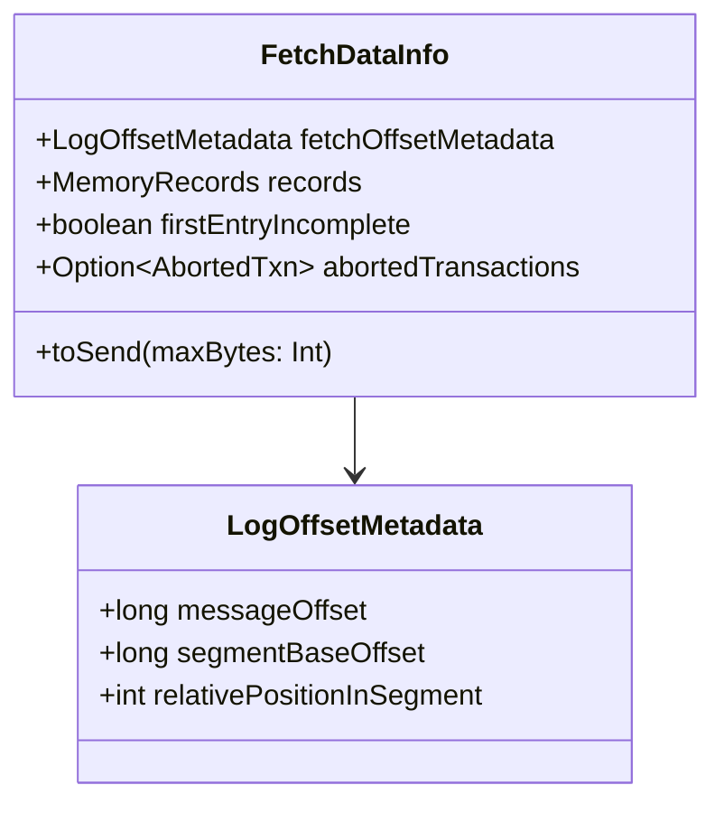
```mermaid
classDiagram
    class FetchDataInfo {
        +LogOffsetMetadata fetchOffsetMetadata
        +MemoryRecords records
        +boolean firstEntryIncomplete
        +Option~AbortedTxn~ abortedTransactions
        
        +toSend(maxBytes: Int)
    }
    
    class LogOffsetMetadata {
        +long messageOffset
        +long segmentBaseOffset
        +int relativePositionInSegment
    }
    
    FetchDataInfo --> LogOffsetMetadata
```

### 字段说明

| 字段 | 类型 | 说明 |
|------|------|------|
| fetchOffsetMetadata | LogOffsetMetadata | 拉取偏移量元数据 |
| records | MemoryRecords | 消息记录 |
| firstEntryIncomplete | Boolean | 第一条记录是否不完整 |
| abortedTransactions | Option[List[AbortedTxn]] | 已中止的事务列表 |

### 关键方法

```scala
def toSend(maxBytes: Int): FetchDataInfo = {
    if (records.sizeInBytes <= maxBytes) {
        this
    } else {
        // 截断到 maxBytes
        val truncated = records.downConvert(maxBytes)
        copy(records = truncated)
    }
}
```

---

## 总结

本文档详细描述了 Kafka Broker 核心数据结构：

1. **Partition**：分区管理的核心类
   - Leader/Follower 状态管理
   - ISR 维护
   - High Watermark 更新

2. **Replica**：副本状态跟踪
   - LEO 更新
   - Fetch 状态维护

3. **DelayedOperation**：延迟操作框架
   - DelayedProduce：等待 ISR 确认
   - DelayedFetch：等待数据或超时

4. **RequestChannel.Request**：请求抽象
   - 请求上下文
   - 资源管理

每个数据结构都包含：

- UML 类图
- 完整字段说明
- 关键方法实现
- 使用场景说明

---

## 时序图

## 目录
- [Broker 启动流程](#broker-启动流程)
- [ProduceRequest 处理流程](#producerequest-处理流程)
- [FetchRequest 处理流程](#fetchrequest-处理流程)
- [副本同步流程](#副本同步流程)
- [ISR 收缩流程](#isr-收缩流程)
- [Leader 选举流程](#leader-选举流程)
- [DelayedProduce 流程](#delayedproduce-流程)

---

## Broker 启动流程

### 时序图

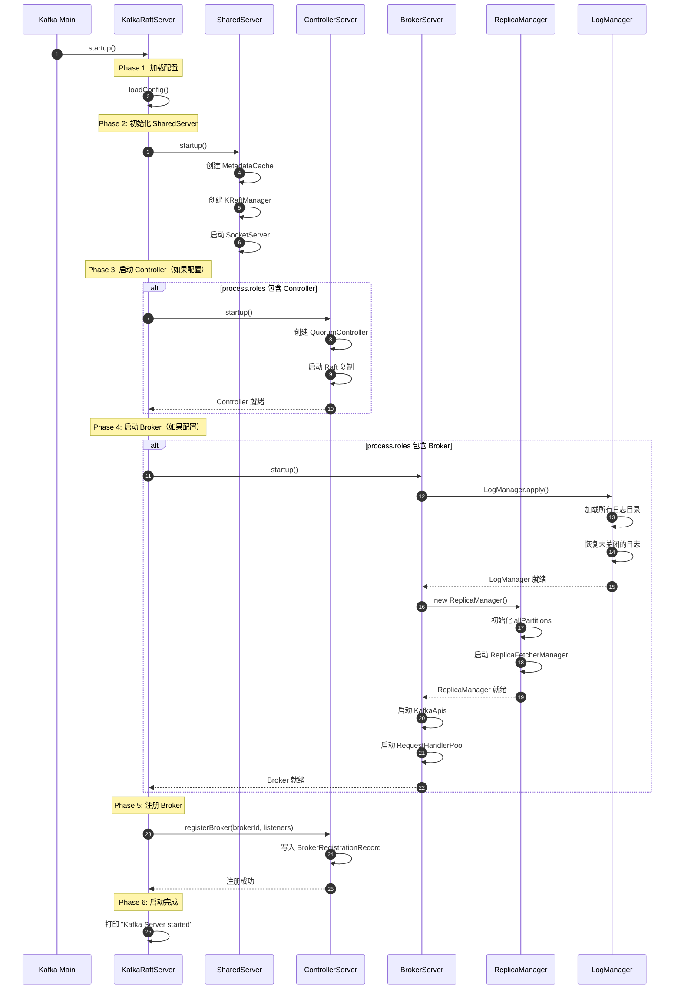
```mermaid
sequenceDiagram
    autonumber
    participant Main as Kafka Main
    participant KRS as KafkaRaftServer
    participant SS as SharedServer
    participant CS as ControllerServer
    participant BS as BrokerServer
    participant RM as ReplicaManager
    participant LM as LogManager
    
    Main->>KRS: startup()
    
    Note over KRS: Phase 1: 加载配置
    KRS->>KRS: loadConfig()
    
    Note over KRS: Phase 2: 初始化 SharedServer
    KRS->>SS: startup()
    SS->>SS: 创建 MetadataCache
    SS->>SS: 创建 KRaftManager
    SS->>SS: 启动 SocketServer
    
    Note over KRS: Phase 3: 启动 Controller（如果配置）
    alt process.roles 包含 Controller
        KRS->>CS: startup()
        CS->>CS: 创建 QuorumController
        CS->>CS: 启动 Raft 复制
        CS-->>KRS: Controller 就绪
    end
    
    Note over KRS: Phase 4: 启动 Broker（如果配置）
    alt process.roles 包含 Broker
        KRS->>BS: startup()
        
        BS->>LM: LogManager.apply()
        LM->>LM: 加载所有日志目录
        LM->>LM: 恢复未关闭的日志
        LM-->>BS: LogManager 就绪
        
        BS->>RM: new ReplicaManager()
        RM->>RM: 初始化 allPartitions
        RM->>RM: 启动 ReplicaFetcherManager
        RM-->>BS: ReplicaManager 就绪
        
        BS->>BS: 启动 KafkaApis
        BS->>BS: 启动 RequestHandlerPool
        
        BS-->>KRS: Broker 就绪
    end
    
    Note over KRS: Phase 5: 注册 Broker
    KRS->>CS: registerBroker(brokerId, listeners)
    CS->>CS: 写入 BrokerRegistrationRecord
    CS-->>KRS: 注册成功
    
    Note over KRS: Phase 6: 启动完成
    KRS->>KRS: 打印 "Kafka Server started"
```

### 流程说明

**阶段 1：配置加载**

- 加载 `server.properties`
- 验证配置参数
- 确定 process.roles（Controller/Broker/Both）

**阶段 2：SharedServer 初始化**

- 创建 MetadataCache（元数据缓存）
- 创建 KRaftManager（Raft 客户端）
- 启动 SocketServer（网络层）

**阶段 3：Controller 启动**（如果配置）

- 创建 QuorumController
- 启动 Raft 复制线程
- 开始参与 Leader 选举

**阶段 4：Broker 启动**（如果配置）

- LogManager 加载所有分区日志
- ReplicaManager 初始化分区管理
- KafkaApis 启动请求处理

**阶段 5：Broker 注册**

- 向 Controller 注册 Broker 信息
- 包含：Broker ID、监听器、机架信息

**阶段 6：启动完成**

- 所有组件就绪
- 开始接收客户端请求

---

## ProduceRequest 处理流程

### 完整时序图

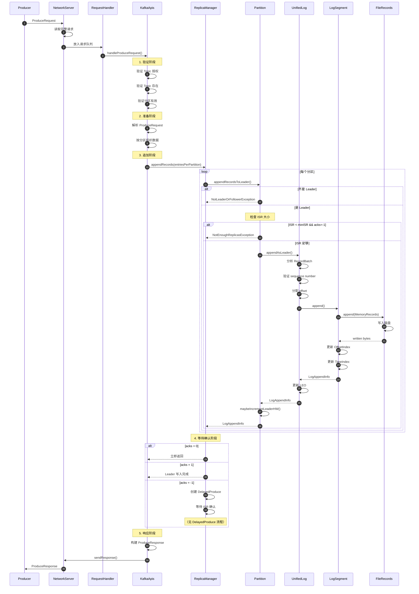
```mermaid
sequenceDiagram
    autonumber
    participant P as Producer
    participant NS as NetworkServer
    participant RH as RequestHandler
    participant KA as KafkaApis
    participant RM as ReplicaManager
    participant Part as Partition
    participant Log as UnifiedLog
    participant Seg as LogSegment
    participant FR as FileRecords
    
    P->>NS: ProduceRequest
    NS->>NS: 读取完整请求
    NS->>RH: 放入请求队列
    
    RH->>KA: handleProduceRequest()
    
    Note over KA: 1. 验证阶段
    KA->>KA: 验证 Topic 授权
    KA->>KA: 验证 Topic 存在
    KA->>KA: 验证分区有效
    
    Note over KA: 2. 准备阶段
    KA->>KA: 解析 ProduceRequest
    KA->>KA: 按分区组织数据
    
    Note over KA: 3. 追加阶段
    KA->>RM: appendRecords(entriesPerPartition)
    
    loop 每个分区
        RM->>Part: appendRecordsToLeader()
        
        alt 不是 Leader
            Part-->>RM: NotLeaderOrFollowerException
        else 是 Leader
            Note over Part: 检查 ISR 大小
            alt ISR < minISR && acks=-1
                Part-->>RM: NotEnoughReplicasException
            else ISR 足够
                Part->>Log: appendAsLeader()
                
                Log->>Log: 分析 RecordBatch
                Log->>Log: 验证 sequence number
                Log->>Log: 分配 offset
                
                Log->>Seg: append()
                Seg->>FR: append(MemoryRecords)
                FR->>FR: 写入磁盘
                FR-->>Seg: written bytes
                
                Seg->>Seg: 更新 OffsetIndex
                Seg->>Seg: 更新 TimeIndex
                Seg-->>Log: LogAppendInfo
                
                Log->>Log: 更新 LEO
                Log-->>Part: LogAppendInfo
                
                Part->>Part: maybeIncrementLeaderHW()
                Part-->>RM: LogAppendInfo
            end
        end
    end
    
    Note over RM: 4. 等待确认阶段
    alt acks = 0
        RM-->>KA: 立即返回
    else acks = 1
        RM-->>KA: Leader 写入完成
    else acks = -1
        RM->>RM: 创建 DelayedProduce
        RM->>RM: 等待 ISR 确认
        Note over RM: （见 DelayedProduce 流程）
    end
    
    Note over KA: 5. 响应阶段
    KA->>KA: 构建 ProduceResponse
    KA->>NS: sendResponse()
    NS->>P: ProduceResponse
```

### 关键点说明

**1. 验证阶段**

- **授权检查**：验证 Producer 是否有权限写入 Topic
- **Topic 检查**：验证 Topic 是否存在
- **分区检查**：验证分区是否有效

**2. 准备阶段**

- 解析请求中的 MemoryRecords
- 按 TopicPartition 组织数据

**3. 追加阶段**

- **Leader 检查**：只有 Leader 才能接收写入
- **ISR 检查**：如果 `acks=-1`，检查 ISR 大小是否满足 `min.insync.replicas`
- **Sequence 验证**：幂等性 Producer 的 sequence number 检查
- **Offset 分配**：为每条消息分配唯一的 offset
- **磁盘写入**：写入 FileRecords
- **索引更新**：更新 OffsetIndex 和 TimeIndex

**4. 等待确认阶段**

- `acks=0`：不等待任何确认
- `acks=1`：等待 Leader 写入
- `acks=-1`：等待所有 ISR 确认（使用 DelayedProduce）

**5. 响应阶段**

- 构建包含 offset、timestamp 的响应
- 返回给 Producer

---

## FetchRequest 处理流程

### 完整时序图

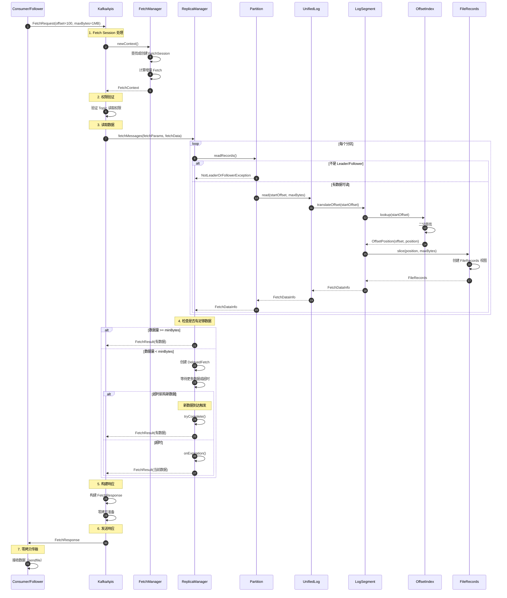
```mermaid
sequenceDiagram
    autonumber
    participant C as Consumer/Follower
    participant KA as KafkaApis
    participant FM as FetchManager
    participant RM as ReplicaManager
    participant Part as Partition
    participant Log as UnifiedLog
    participant Seg as LogSegment
    participant OI as OffsetIndex
    participant FR as FileRecords
    
    C->>KA: FetchRequest(offset=100, maxBytes=1MB)
    
    Note over KA: 1. Fetch Session 处理
    KA->>FM: newContext()
    FM->>FM: 查找或创建 FetchSession
    FM->>FM: 计算增量 Fetch
    FM-->>KA: FetchContext
    
    Note over KA: 2. 权限验证
    KA->>KA: 验证 Topic 读取权限
    
    Note over KA: 3. 读取数据
    KA->>RM: fetchMessages(fetchParams, fetchData)
    
    loop 每个分区
        RM->>Part: readRecords()
        
        alt 不是 Leader/Follower
            Part-->>RM: NotLeaderOrFollowerException
        else 有数据可读
            Part->>Log: read(startOffset, maxBytes)
            
            Log->>Seg: translateOffset(startOffset)
            Seg->>OI: lookup(startOffset)
            OI->>OI: 二分查找
            OI-->>Seg: OffsetPosition(offset, position)
            
            Seg->>FR: slice(position, maxBytes)
            FR->>FR: 创建 FileRecords 视图
            FR-->>Seg: FileRecords
            
            Seg-->>Log: FetchDataInfo
            Log-->>Part: FetchDataInfo
            Part-->>RM: FetchDataInfo
        end
    end
    
    Note over RM: 4. 检查是否有足够数据
    alt 数据量 >= minBytes
        RM-->>KA: FetchResult(有数据)
    else 数据量 < minBytes
        RM->>RM: 创建 DelayedFetch
        RM->>RM: 等待更多数据或超时
        
        alt 超时前有新数据
            Note over RM: 新数据到达触发
            RM->>RM: tryComplete()
            RM-->>KA: FetchResult(有数据)
        else 超时
            RM->>RM: onExpiration()
            RM-->>KA: FetchResult(当前数据)
        end
    end
    
    Note over KA: 5. 构建响应
    KA->>KA: 构建 FetchResponse
    KA->>KA: 零拷贝准备
    
    Note over KA: 6. 发送响应
    KA->>C: FetchResponse
    
    Note over C: 7. 零拷贝传输
    C->>C: 接收数据（sendfile）
```

### 关键点说明

**1. Fetch Session 处理**

- **Incremental Fetch**：只发送变化的分区
- **Session Cache**：缓存上次 Fetch 的分区列表
- **减少请求大小**：避免重复发送分区列表

**2. 权限验证**

- 验证 Consumer 是否有权限读取 Topic

**3. 读取数据**

- **Offset 查找**：通过 OffsetIndex 二分查找物理位置
- **数据读取**：创建 FileRecords 切片（不复制数据）
- **零拷贝准备**：准备 sendfile 传输

**4. 延迟等待**

- **minBytes 检查**：如果数据量不足，创建 DelayedFetch
- **等待条件**：
  - 有足够数据（>= minBytes）
  - 超时（maxWaitMs）
- **触发机制**：新数据到达时主动触发

**5. 零拷贝传输**

- 使用 `sendfile` 系统调用
- 数据直接从磁盘到网络，不经过用户空间
- 大幅提升性能

---

## 副本同步流程

### 时序图

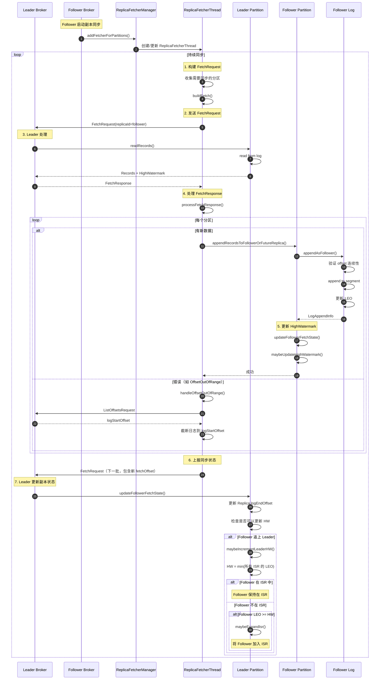
```mermaid
sequenceDiagram
    autonumber
    participant L as Leader Broker
    participant F as Follower Broker
    participant RFM as ReplicaFetcherManager
    participant RFT as ReplicaFetcherThread
    participant LPart as Leader Partition
    participant FPart as Follower Partition
    participant FLog as Follower Log
    
    Note over F: Follower 启动副本同步
    
    F->>RFM: addFetcherForPartitions()
    RFM->>RFT: 创建/更新 ReplicaFetcherThread
    
    loop 持续同步
        Note over RFT: 1. 构建 FetchRequest
        RFT->>RFT: 收集需要同步的分区
        RFT->>RFT: buildFetch()
        
        Note over RFT: 2. 发送 FetchRequest
        RFT->>L: FetchRequest(replicaId=follower)
        
        Note over L: 3. Leader 处理
        L->>LPart: readRecords()
        LPart->>LPart: read from log
        LPart-->>L: Records + HighWatermark
        L-->>RFT: FetchResponse
        
        Note over RFT: 4. 处理 FetchResponse
        RFT->>RFT: processFetchResponse()
        
        loop 每个分区
            alt 有新数据
                RFT->>FPart: appendRecordsToFollowerOrFutureReplica()
                
                FPart->>FLog: appendAsFollower()
                FLog->>FLog: 验证 offset 连续性
                FLog->>FLog: append to segment
                FLog->>FLog: 更新 LEO
                FLog-->>FPart: LogAppendInfo
                
                Note over FPart: 5. 更新 HighWatermark
                FPart->>FPart: updateFollowerFetchState()
                FPart->>FPart: maybeUpdateHighWatermark()
                FPart-->>RFT: 成功
                
            else 错误（如 OffsetOutOfRange）
                RFT->>RFT: handleOffsetOutOfRange()
                RFT->>L: ListOffsetsRequest
                L-->>RFT: logStartOffset
                RFT->>RFT: 截断日志到 logStartOffset
            end
        end
        
        Note over RFT: 6. 上报同步状态
        RFT->>L: FetchRequest（下一批，包含新 fetchOffset）
        
        Note over L: 7. Leader 更新副本状态
        L->>LPart: updateFollowerFetchState()
        LPart->>LPart: 更新 Replica.logEndOffset
        LPart->>LPart: 检查是否可以更新 HW
        
        alt Follower 追上 Leader
            LPart->>LPart: maybeIncrementLeaderHW()
            LPart->>LPart: HW = min(所有 ISR 的 LEO)
            
            alt Follower 在 ISR 中
                Note over LPart: Follower 保持在 ISR
            else Follower 不在 ISR
                alt Follower LEO >= HW
                    LPart->>LPart: maybeExpandIsr()
                    Note over LPart: 将 Follower 加入 ISR
                end
            end
        end
    end
```

### 流程说明

**1. Follower 启动同步**

- ReplicaFetcherManager 为每个分区创建 FetcherThread
- 每个 FetcherThread 负责多个分区的同步

**2. 构建 FetchRequest**

- 收集所有需要同步的分区
- 每个分区指定 fetchOffset（Follower 的 LEO）

**3. Leader 处理**

- 读取 fetchOffset 之后的数据
- 返回数据 + 当前 HighWatermark

**4. Follower 追加数据**

- 验证 offset 连续性
- 追加到本地日志
- 更新 LEO

**5. 更新 HighWatermark**

- Follower 根据 Leader 的 HW 更新本地 HW

**6. Leader 更新副本状态**

- 根据 Follower 的 fetchOffset 更新副本 LEO
- 重新计算 HW（所有 ISR 的最小 LEO）

**7. ISR 管理**

- 如果 Follower 追上 Leader 且不在 ISR，加入 ISR
- 如果 Follower 落后太多，从 ISR 移除（见 ISR 收缩流程）

---

## ISR 收缩流程

### 时序图

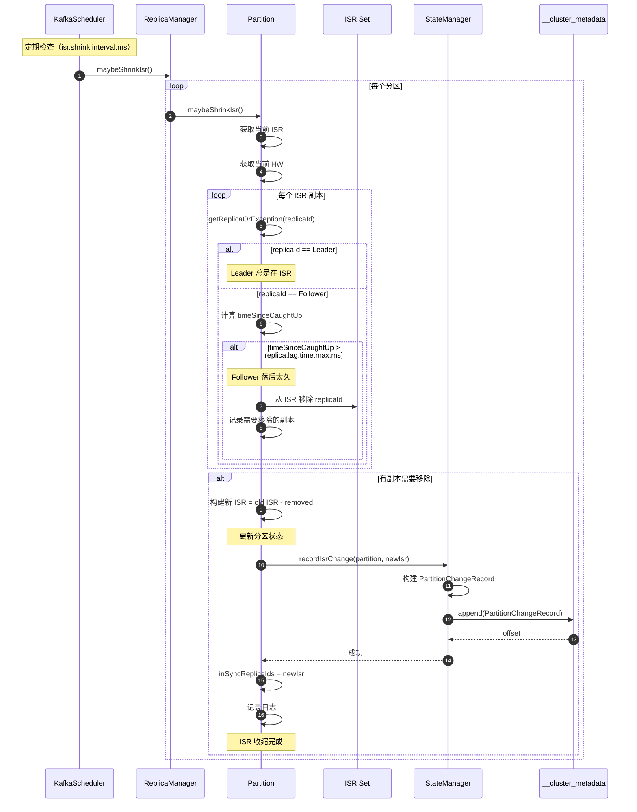
```mermaid
sequenceDiagram
    autonumber
    participant Scheduler as KafkaScheduler
    participant RM as ReplicaManager
    participant Part as Partition
    participant ISR as ISR Set
    participant SM as StateManager
    participant Log as __cluster_metadata
    
    Note over Scheduler: 定期检查（isr.shrink.interval.ms）
    
    Scheduler->>RM: maybeShrinkIsr()
    
    loop 每个分区
        RM->>Part: maybeShrinkIsr()
        
        Part->>Part: 获取当前 ISR
        Part->>Part: 获取当前 HW
        
        loop 每个 ISR 副本
            Part->>Part: getReplicaOrException(replicaId)
            
            alt replicaId == Leader
                Note over Part: Leader 总是在 ISR
            else replicaId == Follower
                Part->>Part: 计算 timeSinceCaughtUp
                
                alt timeSinceCaughtUp > replica.lag.time.max.ms
                    Note over Part: Follower 落后太久
                    Part->>ISR: 从 ISR 移除 replicaId
                    Part->>Part: 记录需要移除的副本
                end
            end
        end
        
        alt 有副本需要移除
            Part->>Part: 构建新 ISR = old ISR - removed
            
            Note over Part: 更新分区状态
            Part->>SM: recordIsrChange(partition, newIsr)
            
            SM->>SM: 构建 PartitionChangeRecord
            SM->>Log: append(PartitionChangeRecord)
            
            Log-->>SM: offset
            SM-->>Part: 成功
            
            Part->>Part: inSyncReplicaIds = newIsr
            Part->>Part: 记录日志
            
            Note over Part: ISR 收缩完成
        end
    end
```

### 流程说明

**检查条件**

- 定期检查（默认 5 秒）
- 检查每个 Follower 的 `lastCaughtUpTimeMs`

**收缩条件**

- Follower 的 `lastCaughtUpTimeMs` 超过 `replica.lag.time.max.ms`（默认 30 秒）
- `lastCaughtUpTimeMs` 表示 Follower 上次追上 Leader 的时间

**更新流程**

1. 构建新的 ISR 集合（移除落后副本）
2. 写入 PartitionChangeRecord 到 `__cluster_metadata`
3. 更新本地 ISR 状态

**影响**

- **可用性**：ISR 减少可能导致 `min.insync.replicas` 不满足
- **Producer**：`acks=-1` 的写入可能失败
- **数据安全**：ISR 中的副本才被认为是同步的

---

## Leader 选举流程

### 时序图

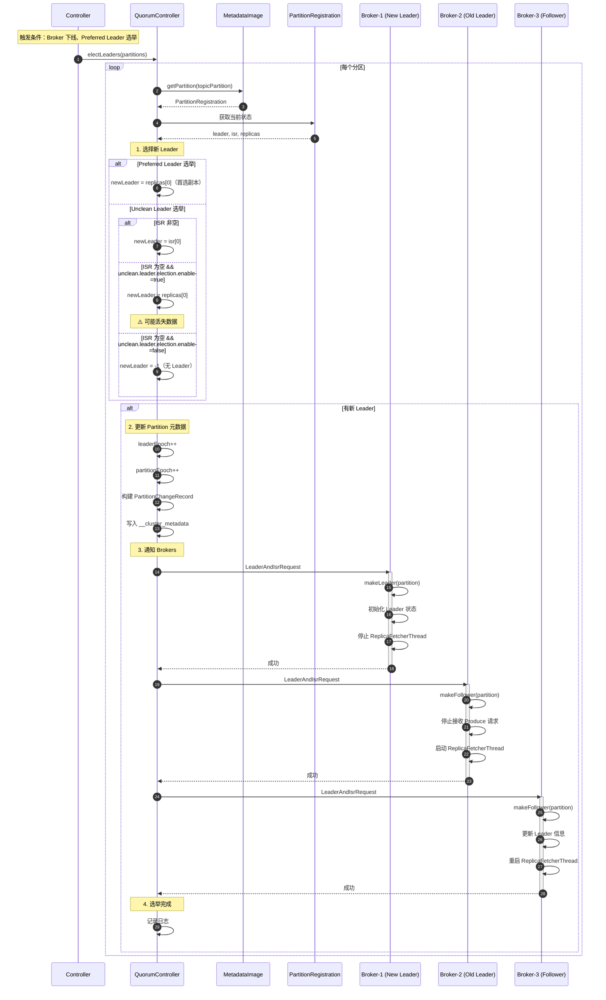
```mermaid
sequenceDiagram
    autonumber
    participant C as Controller
    participant QC as QuorumController
    participant MD as MetadataImage
    participant Part as PartitionRegistration
    participant B1 as Broker-1 (New Leader)
    participant B2 as Broker-2 (Old Leader)
    participant B3 as Broker-3 (Follower)
    
    Note over C: 触发条件：Broker 下线、Preferred Leader 选举
    
    C->>QC: electLeaders(partitions)
    
    loop 每个分区
        QC->>MD: getPartition(topicPartition)
        MD-->>QC: PartitionRegistration
        
        QC->>Part: 获取当前状态
        Part-->>QC: leader, isr, replicas
        
        Note over QC: 1. 选择新 Leader
        alt Preferred Leader 选举
            QC->>QC: newLeader = replicas[0]（首选副本）
        else Unclean Leader 选举
            alt ISR 非空
                QC->>QC: newLeader = isr[0]
            else ISR 为空 && unclean.leader.election.enable=true
                QC->>QC: newLeader = replicas[0]
                Note over QC: ⚠️ 可能丢失数据
            else ISR 为空 && unclean.leader.election.enable=false
                QC->>QC: newLeader = -1（无 Leader）
            end
        end
        
        alt 有新 Leader
            Note over QC: 2. 更新 Partition 元数据
            QC->>QC: leaderEpoch++
            QC->>QC: partitionEpoch++
            
            QC->>QC: 构建 PartitionChangeRecord
            QC->>QC: 写入 __cluster_metadata
            
            Note over QC: 3. 通知 Brokers
            QC->>B1: LeaderAndIsrRequest
            activate B1
            B1->>B1: makeLeader(partition)
            B1->>B1: 初始化 Leader 状态
            B1->>B1: 停止 ReplicaFetcherThread
            B1-->>QC: 成功
            deactivate B1
            
            QC->>B2: LeaderAndIsrRequest
            activate B2
            B2->>B2: makeFollower(partition)
            B2->>B2: 停止接收 Produce 请求
            B2->>B2: 启动 ReplicaFetcherThread
            B2-->>QC: 成功
            deactivate B2
            
            QC->>B3: LeaderAndIsrRequest
            activate B3
            B3->>B3: makeFollower(partition)
            B3->>B3: 更新 Leader 信息
            B3->>B3: 重启 ReplicaFetcherThread
            B3-->>QC: 成功
            deactivate B3
            
            Note over QC: 4. 选举完成
            QC->>QC: 记录日志
        end
    end
```

### 流程说明

**触发条件**

1. **Broker 下线**：Leader 所在 Broker 下线
2. **Preferred Leader 选举**：定期或手动触发
3. **ISR 变化**：ISR 缩减到只剩 Leader

**选举策略**

1. **Preferred Leader**：选择 replicas[0]（首选副本）
2. **Unclean Leader**（ISR 为空时）：
   - 允许：选择任意存活副本（可能丢数据）
   - 不允许：分区不可用（保证数据安全）

**选举步骤**

1. **选择新 Leader**：从 ISR 或 replicas 中选择
2. **递增 Epoch**：
   - `leaderEpoch++`：隔离旧 Leader
   - `partitionEpoch++`：标识配置变更
3. **写入元数据**：PartitionChangeRecord → `__cluster_metadata`
4. **通知 Brokers**：LeaderAndIsrRequest
   - 新 Leader：makeLeader()
   - 旧 Leader：makeFollower()
   - 其他 Follower：更新 Leader 信息

**关键点**

- **Leader Epoch**：防止脑裂，隔离旧 Leader 的请求
- **Unclean 选举**：在可用性和数据安全之间权衡
- **同步通知**：Controller 必须等待所有 Broker 确认

---

## DelayedProduce 流程

### 时序图

```mermaid
sequenceDiagram
    autonumber
    participant KA as KafkaApis
    participant RM as ReplicaManager
    participant DP as DelayedProduce
    participant DPP as DelayedProducePurgatory
    participant Part as Partition
    participant RFT as ReplicaFetcherThread
    
    Note over KA: Producer 请求 acks=-1
    
    KA->>RM: appendRecords(acks=-1)
    RM->>RM: 追加到 Leader 日志
    
    Note over RM: 创建 DelayedProduce
    RM->>DP: new DelayedProduce(timeout, requiredAcks=-1)
    
    loop 每个分区
        DP->>Part: 获取当前 HW
        DP->>DP: 记录 requiredOffset（写入的最后 offset）
    end
    
    RM->>DPP: tryCompleteElseWatch(delayedProduce)
    
    alt 立即完成条件
        DPP->>DP: tryComplete()
        DP->>DP: 检查所有分区 HW >= requiredOffset
        
        alt 所有分区已确认
            DP->>DP: forceComplete()
            DP->>DP: onComplete()
            DP->>KA: responseCallback(success)
            KA->>KA: sendResponse()
        else 未全部确认
            DPP->>DPP: watch(delayedProduce)
            Note over DPP: 加入延迟队列
        end
    end
    
    Note over DPP: 等待过程中...
    
    par Follower 同步
        RFT->>Part: updateFollowerFetchState()
        Part->>Part: maybeIncrementLeaderHW()
        
        alt HW 更新
            Part->>DPP: 触发 checkAndComplete()
            
            DPP->>DP: tryComplete()
            DP->>DP: 检查 HW >= requiredOffset
            
            alt 条件满足
                DP->>DP: forceComplete()
                DP->>DP: onComplete()
                DP->>KA: responseCallback(success)
                KA->>KA: sendResponse()
            end
        end
    and 超时
        Note over DPP: delayMs 到期
        DPP->>DP: onExpiration()
        DP->>DP: 检查当前状态
        
        alt 已经完成
            Note over DP: 无操作
        else 未完成
            DP->>DP: onComplete()
            DP->>KA: responseCallback(timeout or partial success)
            KA->>KA: sendResponse(ERROR_REQUEST_TIMED_OUT)
        end
    end
```

### 流程说明

**创建条件**

- Producer 请求 `acks=-1`（等待所有 ISR 确认）
- 数据已写入 Leader 日志

**等待条件**

- 所有分区的 HW >= 写入的最后 offset
- HW 更新表示所有 ISR 都已确认

**完成方式**

1. **主动触发**（Fast Path）：
   - Follower Fetch 后更新 HW
   - HW 更新触发 `checkAndComplete()`
   - 检查条件，如果满足则完成

2. **超时触发**（Slow Path）：
   - `delayMs`（默认 30 秒）到期
   - 返回当前状态（可能部分成功）

**响应**

- **成功**：所有分区 HW >= requiredOffset
- **超时**：部分分区未确认，返回 `REQUEST_TIMED_OUT`
- **部分成功**：某些分区成功，某些超时

**性能优化**

- **批量检查**：一次 HW 更新可能触发多个 DelayedProduce 完成
- **Watch Keys**：按分区注册，只检查相关的 DelayedProduce
- **Fast Path**：大多数情况下在几毫秒内完成

---

## 总结

本文档提供了 Kafka Broker 核心模块的完整时序图，涵盖：

1. **Broker 启动流程**：6 阶段启动过程
2. **ProduceRequest 处理**：完整的写入流程
3. **FetchRequest 处理**：完整的读取流程（含零拷贝）
4. **副本同步流程**：Follower 如何同步 Leader 数据
5. **ISR 收缩流程**：如何移除落后的副本
6. **Leader 选举流程**：如何选举新 Leader
7. **DelayedProduce 流程**：acks=-1 的等待机制

每个时序图都包含：

- 完整的参与者
- 详细的步骤编号
- 关键决策点
- 异常处理路径
- 详细的文字说明

这些时序图帮助理解 Kafka Broker 的核心工作机制和内部交互。

---
