# Kafka-03-Metadata

## 模块概览

## 目录
- [模块职责](#模块职责)
- [模块级架构图](#模块级架构图)
- [核心组件](#核心组件)
  - [MetadataImage](#metadataimage)
  - [MetadataCache](#metadatacache)
  - [KRaftMetadataCache](#kraftmetadatacache)
  - [MetadataDelta](#metadatadelta)
  - [MetadataPublisher](#metadatapublisher)
- [元数据更新流程](#元数据更新流程)
- [元数据查询流程](#元数据查询流程)
- [关键设计](#关键设计)
- [性能优化](#性能优化)
- [异常处理](#异常处理)

---

## 模块职责

**Metadata 模块**负责管理 Kafka 集群的所有元数据信息，是集群运行的核心基础设施。主要职责包括：

1. **元数据存储**：维护集群、主题、分区、副本、配置等元数据的内存快照
2. **元数据更新**：接收来自 Controller 的元数据变更，并原子性地应用到本地缓存
3. **元数据查询**：为 Broker 的各个组件（KafkaApis、ReplicaManager 等）提供高性能的元数据查询服务
4. **元数据同步**：在 KRaft 模式下，通过 Raft 日志保证元数据在整个集群的一致性
5. **元数据发布**：通过 Publisher 机制将元数据变更通知给订阅者

**上下游依赖**：

- **上游**：Controller（元数据变更源）、Raft Log（KRaft 模式）
- **下游**：KafkaApis、ReplicaManager、GroupCoordinator、TransactionCoordinator、Client（元数据消费者）

**生命周期**：

- 在 Broker/Controller 启动时初始化
- 持续接收并应用元数据更新
- 在 Broker/Controller 关闭时清理资源

---

## 模块级架构图

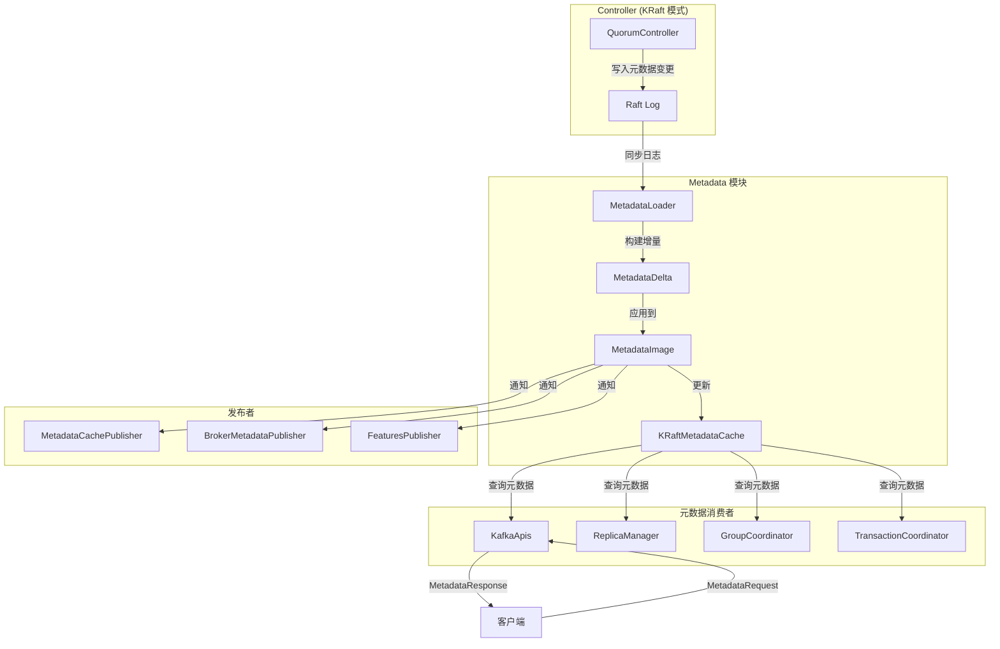

### 架构图说明

#### 1. 图意概述
该架构展示了 Kafka KRaft 模式下元数据的完整生命周期：从 Controller 生成变更、通过 Raft 日志同步、在 Broker 端加载并缓存、最终服务于各类元数据查询请求。

#### 2. 核心组件职责

**Controller 层**：

- `QuorumController`：集群元数据的唯一写入者，所有元数据变更（创建 Topic、分区迁移、配置修改等）都通过 Controller 处理
- `Raft Log`：存储元数据变更的持久化日志，保证集群内元数据的一致性和持久性

**Metadata 模块层**：

- `MetadataLoader`：从 Raft Log 读取元数据记录，批量加载并转换为内部表示
- `MetadataDelta`：表示两个 MetadataImage 之间的增量变更，包含新增、修改、删除的元数据
- `MetadataImage`：不可变的元数据快照，包含 Cluster、Topics、Configs、ACLs 等完整元数据
- `KRaftMetadataCache`：基于 MetadataImage 的查询接口实现，提供高性能的元数据查询

**Publishers 层**：

- `MetadataCachePublisher`：将 MetadataImage 更新到 KRaftMetadataCache
- `BrokerMetadataPublisher`：将元数据变更通知到 Broker 的各个管理器（LogManager、ReplicaManager 等）
- `FeaturesPublisher`：发布特性版本变更（metadata.version、KRaft version 等）

**Consumers 层**：

- 各个 Broker 组件通过 MetadataCache 查询所需的元数据

#### 3. 边界条件

**并发控制**：

- `MetadataImage` 是不可变对象，更新时采用 Copy-on-Write（写时复制）策略
- `KRaftMetadataCache._currentImage` 使用 `@volatile` 修饰，保证可见性
- 读操作无需加锁，直接读取当前 image 的引用，整个读取过程基于同一快照

**更新原子性**：

- 单次元数据更新包含多个变更时（如删除 Topic 及其所有分区），通过 MetadataDelta 的批量应用保证原子性
- 更新 `_currentImage` 的操作是单个引用赋值，具有原子性

**顺序性保证**：

- 元数据更新严格按照 Raft Log 的 offset 顺序应用
- 每个 MetadataImage 记录其对应的 offset 和 epoch，保证版本单调递增

**超时与重试**：

- 元数据加载阻塞过久会触发警告，但不会中断
- 查询操作无超时（本地内存操作）

#### 4. 异常路径与回退

**加载失败**：

- Raft Log 损坏或无法读取：Broker 启动失败，需要手动修复
- 元数据记录格式不兼容：回退到兼容的 metadata.version，或拒绝启动

**查询异常**：

- Topic 不存在：返回 `UNKNOWN_TOPIC_OR_PARTITION` 错误
- Broker 不存在/已下线：返回 `NO_NODE` 或 `LEADER_NOT_AVAILABLE`
- Listener 不可用：返回 `LISTENER_NOT_FOUND`

**内存压力**：

- MetadataImage 占用内存过大（Topic/Partition 数量极多）：
  - 触发 GC 压力，影响请求延迟
  - 无自动回退机制，需通过配置调优（增加堆内存、减少 Topic 数量）

#### 5. 性能与容量假设

**内存占用**：

- 每个 Topic：约 200 字节（名称、UUID、配置指针）
- 每个 Partition：约 100 字节（Leader、Replicas、ISR、LeaderEpoch）
- 每个 Broker：约 1 KB（Listener、Rack、特性信息）
- **示例**：1000 Topics × 10 Partitions + 100 Brokers ≈ 1 MB + 100 KB ≈ 1.1 MB

**查询性能**：

- Topic 元数据查询：O(1) HashMap 查找 + O(Partitions) 遍历，通常 < 1 ms
- Partition Leader 查询：O(1)，通常 < 100 µs
- Broker 列表查询：O(Brokers)，通常 < 1 ms

**更新延迟**：

- Raft Log commit 延迟：通常 10-50 ms（取决于网络和 ISR 大小）
- 本地应用延迟：< 10 ms（内存操作）
- 端到端延迟：20-100 ms

**容量上限**：

- **实际限制**：
  - Topics：数万级别（取决于内存）
  - Partitions：数十万级别（取决于内存和 Raft Log 大小）
  - Brokers：数千级别
- **性能瓶颈**：
  - 大规模 Topic/Partition 更新时，Raft Log 写入和应用延迟增加
  - MetadataResponse 序列化/反序列化开销增大

#### 6. 版本兼容与演进

**Metadata Version**：

- 每个 MetadataImage 记录其对应的 `metadata.version`
- 升级时：Controller 写入新版本特性，Broker 通过 FeaturesPublisher 感知
- 降级时：新特性数据通过 ImageWriterOptions.handleLoss 处理（记录警告或拒绝）

**KRaft Version**：

- 用于控制 KRaft 协议本身的特性（如 Controller 注册、Multi-Raft）
- 通过 `kraftVersionSupplier` 动态获取

**协议演进**：

- 新增字段：通过 Optional 或默认值兼容旧版本
- 删除字段：通过 deprecated 标记逐步淘汰
- 结构变更：通过 MetadataVersion 门控，旧版本拒绝加载新格式

---

## 核心组件

### MetadataImage

`MetadataImage` 是 Kafka 元数据的**不可变快照**，包含某一时刻集群的完整元数据状态。

#### 数据结构

```java
public record MetadataImage(
    MetadataProvenance provenance,      // 元数据来源（offset, epoch, lastContainedLogTimeMs）
    FeaturesImage features,             // 特性版本（metadata.version, KRaft version）
    ClusterImage cluster,               // 集群信息（Brokers, Controllers）
    TopicsImage topics,                 // Topic/Partition 元数据
    ConfigurationsImage configs,        // 配置信息（Topic/Broker/Client 配置）
    ClientQuotasImage clientQuotas,     // 客户端配额
    ProducerIdsImage producerIds,       // Producer ID 分配
    AclsImage acls,                     // ACL 权限
    ScramImage scram,                   // SCRAM 认证
    DelegationTokenImage delegationTokens  // 委派令牌
) {
    public static final MetadataImage EMPTY = new MetadataImage(...);
    
    public OffsetAndEpoch highestOffsetAndEpoch() {
        return new OffsetAndEpoch(
            provenance.lastContainedOffset(),
            provenance.lastContainedEpoch()
        );
    }
}
```

#### 组成部分

**1. ClusterImage**：集群拓扑信息

```java
public record ClusterImage(
    Map<Integer, BrokerRegistration> brokers,        // Broker 注册信息
    Map<Integer, ControllerRegistration> controllers  // Controller 注册信息
) {
    public BrokerRegistration broker(int nodeId) {
        return brokers.get(nodeId);
    }
    
    public long brokerEpoch(int brokerId) {
        BrokerRegistration brokerRegistration = broker(brokerId);
        return brokerRegistration == null ? -1L : brokerRegistration.epoch();
    }
}
```

**BrokerRegistration** 字段：

- `id`：Broker ID
- `epoch`：注册 epoch（递增，用于检测重启）
- `incarnationId`：UUID，每次 Broker 启动生成
- `listeners`：监听器列表（名称 → SecurityProtocol + Host + Port）
- `supportedFeatures`：支持的特性版本范围
- `rack`：机架信息
- `fenced`：是否被隔离（Fenced 状态的 Broker 不能作为 Leader）
- `inControlledShutdown`：是否正在优雅关闭

**2. TopicsImage**：Topic 和 Partition 元数据

```java
public class TopicsImage {
    private final Map<Uuid, TopicImage> topicsById;
    private final Map<String, TopicImage> topicsByName;
    
    public TopicImage getTopic(Uuid id) { /* ... */ }
    public TopicImage getTopic(String name) { /* ... */ }
}

public class TopicImage {
    private final String name;
    private final Uuid id;
    private final Map<Integer, PartitionRegistration> partitions;
    
    public Map<Integer, PartitionRegistration> partitions() {
        return partitions;
    }
}
```

**PartitionRegistration** 字段：

- `replicas`：副本列表（Broker ID 数组）
- `isr`：In-Sync Replicas（同步副本列表）
- `removingReplicas`：正在移除的副本
- `addingReplicas`：正在添加的副本
- `leader`：Leader Broker ID
- `leaderEpoch`：Leader Epoch（递增，用于隔离旧 Leader）
- `partitionEpoch`：Partition Epoch（每次配置变更递增）

**3. FeaturesImage**：特性版本

```java
public record FeaturesImage(
    Map<String, Short> supportedFeatures,   // 支持的特性及版本
    MetadataVersion metadataVersion,        // 当前 metadata.version
    KRaftVersion kraftVersion               // 当前 KRaft version
) {}
```

**4. ConfigurationsImage**：配置信息

```java
public class ConfigurationsImage {
    private final Map<ConfigResource, ConfigurationImage> data;
    
    public Map<String, String> configMapForResource(ConfigResource resource) {
        ConfigurationImage image = data.get(resource);
        return image == null ? Collections.emptyMap() : image.data();
    }
}
```

**ConfigResource** 类型：

- `TOPIC`：Topic 配置（retention.ms、compression.type 等）
- `BROKER`：Broker 配置（动态配置）
- `CLIENT_METRICS`：客户端指标配置

#### 不可变性保证

**设计原则**：

- 所有字段使用 `final` 修饰
- 所有集合通过 `Collections.unmodifiableMap()` 包装
- 使用 Java 16+ `record` 语法（自动生成不可变类）

**更新机制**：

- 通过 `MetadataDelta` 构建新的 `MetadataImage`
- 旧 Image 继续被正在进行的读操作使用
- 新 Image 替换 `KRaftMetadataCache._currentImage`

**内存管理**：

- 旧 Image 在所有引用释放后由 GC 回收
- 大部分子 Image（如 TopicImage）在小幅变更时可共享引用

---

### MetadataCache

`MetadataCache` 是元数据查询的统一接口，定义了所有元数据查询操作。

#### 接口定义

```java
public interface MetadataCache extends ConfigRepository {
    
    // Topic 元数据查询
    List<MetadataResponseData.MetadataResponseTopic> getTopicMetadata(
        Set<String> topics,
        ListenerName listenerName,
        boolean errorUnavailableEndpoints,
        boolean errorUnavailableListeners
    );
    
    Set<String> getAllTopics();
    
    Uuid getTopicId(String topicName);
    
    Optional<String> getTopicName(Uuid topicId);
    
    Optional<Integer> numPartitions(String topic);
    
    // Partition 元数据查询
    Optional<LeaderAndIsr> getLeaderAndIsr(String topic, int partitionId);
    
    Optional<Node> getPartitionLeaderEndpoint(String topic, int partitionId, ListenerName listenerName);
    
    Map<Integer, Node> getPartitionReplicaEndpoints(TopicPartition tp, ListenerName listenerName);
    
    // Broker 元数据查询
    boolean hasAliveBroker(int brokerId);
    
    Optional<Long> getAliveBrokerEpoch(int brokerId);
    
    boolean isBrokerFenced(int brokerId);
    
    boolean isBrokerShuttingDown(int brokerId);
    
    Optional<Node> getAliveBrokerNode(int brokerId, ListenerName listenerName);
    
    List<Node> getAliveBrokerNodes(ListenerName listenerName);
    
    List<Node> getBrokerNodes(ListenerName listenerName);
    
    // 映射查询
    Map<Uuid, String> topicIdsToNames();
    
    Map<String, Uuid> topicNamesToIds();
    
    // 特性查询
    MetadataVersion metadataVersion();
    
    FinalizedFeatures features();
    
    // 配置查询
    DescribeClientQuotasResponseData describeClientQuotas(DescribeClientQuotasRequestData request);
    
    DescribeUserScramCredentialsResponseData describeScramCredentials(DescribeUserScramCredentialsRequestData request);
}
```

#### LeaderAndIsr 结构

```java
public class LeaderAndIsr {
    private final int leader;             // Leader Broker ID
    private final int leaderEpoch;        // Leader Epoch
    private final List<Integer> isr;      // ISR 列表
    private final int partitionEpoch;     // Partition Epoch
    
    // 用于 Replica Fetcher 判断是否需要更新
    public boolean hasSameIsr(LeaderAndIsr other) {
        return new HashSet<>(isr).equals(new HashSet<>(other.isr));
    }
}
```

---

### KRaftMetadataCache

`KRaftMetadataCache` 是 `MetadataCache` 接口在 KRaft 模式下的实现，基于 `MetadataImage` 提供查询服务。

#### 核心实现

```java
class KRaftMetadataCache(
    val brokerId: Int,
    val kraftVersionSupplier: Supplier[KRaftVersion]
) extends MetadataCache with Logging {
    
    // 核心：当前元数据快照（volatile 保证可见性）
    @volatile private var _currentImage: MetadataImage = MetadataImage.EMPTY
    
    def currentImage(): MetadataImage = _currentImage
    
    // 更新元数据快照（由 MetadataCachePublisher 调用）
    def setImage(newImage: MetadataImage): Unit = {
        _currentImage = newImage
    }
    
    // ... 查询方法实现 ...
}
```

#### 关键查询实现

**1. Topic 元数据查询**

```java
override def getTopicMetadata(
    topics: Set[String],
    listenerName: ListenerName,
    errorUnavailableEndpoints: Boolean,
    errorUnavailableListeners: Boolean
): List[MetadataResponseTopic] = {
    val image = _currentImage  // 获取快照引用
    
    topics.map { topicName =>
        val topicImage = Option(image.topics().getTopic(topicName))
        
        topicImage match {
            case None =>
                // Topic 不存在
                new MetadataResponseTopic()
                    .setName(topicName)
                    .setErrorCode(Errors.UNKNOWN_TOPIC_OR_PARTITION.code)
            
            case Some(topic) =>
                // 构建 Partition 元数据列表
                val partitions = topic.partitions().entrySet().asScala.map { entry =>
                    val partitionId = entry.getKey
                    val partition = entry.getValue
                    
                    // 查找 Leader 节点
                    val maybeLeader = getAliveEndpoint(image, partition.leader, listenerName)
                    
                    maybeLeader match {
                        case None =>
                            // Leader 不可用
                            new MetadataResponsePartition()
                                .setErrorCode(Errors.LEADER_NOT_AVAILABLE.code)
                                .setPartitionIndex(partitionId)
                                .setLeaderId(MetadataResponse.NO_LEADER_ID)
                                .setLeaderEpoch(partition.leaderEpoch)
                                .setReplicaNodes(Replicas.toList(partition.replicas))
                                .setIsrNodes(Replicas.toList(partition.isr))
                        
                        case Some(leader) =>
                            // Leader 可用
                            new MetadataResponsePartition()
                                .setErrorCode(Errors.NONE.code)
                                .setPartitionIndex(partitionId)
                                .setLeaderId(leader.id())
                                .setLeaderEpoch(partition.leaderEpoch)
                                .setReplicaNodes(Replicas.toList(partition.replicas))
                                .setIsrNodes(Replicas.toList(partition.isr))
                    }
                }.toList
                
                new MetadataResponseTopic()
                    .setName(topicName)
                    .setTopicId(topic.id())
                    .setErrorCode(Errors.NONE.code)
                    .setPartitions(partitions.asJava)
        }
    }.toList.asJava
}
```

**查询流程说明**：

1. **获取快照**：读取 `_currentImage` 引用，后续操作基于此快照（保证一致性视图）
2. **查找 Topic**：通过 `image.topics().getTopic(topicName)` 查找（O(1) HashMap 查找）
3. **遍历 Partitions**：遍历 Topic 的所有 Partition（O(Partitions)）
4. **查找 Leader**：对每个 Partition，通过 `getAliveEndpoint` 查找 Leader 节点
5. **构建响应**：填充 MetadataResponsePartition 结构

**2. Partition Leader 查询**

```java
override def getLeaderAndIsr(topic: String, partitionId: Int): Optional[LeaderAndIsr] = {
    val image = _currentImage
    
    Option(image.topics().getTopic(topic)).flatMap { topicImage =>
        Option(topicImage.partitions().get(partitionId)).map { partition =>
            new LeaderAndIsr(
                partition.leader,
                partition.leaderEpoch,
                Replicas.toList(partition.isr).asScala.map(_.toInt).toList.asJava,
                partition.partitionEpoch
            )
        }
    }.toJava
}
```

**3. Broker 节点查询**

```java
override def getAliveBrokerNode(
    brokerId: Int,
    listenerName: ListenerName
): Optional[Node] = {
    val image = _currentImage
    
    Option(image.cluster().broker(brokerId)).flatMap { broker =>
        if (broker.fenced()) {
            None  // Fenced 的 Broker 视为不可用
        } else {
            Option(broker.listeners().get(listenerName.value())).map { listener =>
                new Node(brokerId, listener.host(), listener.port(), broker.rack())
            }
        }
    }.toJava
}

override def getAliveBrokerNodes(listenerName: ListenerName): List[Node] = {
    val image = _currentImage
    
    image.cluster().brokers().values().asScala
        .filterNot(_.fenced())  // 过滤 Fenced 的 Broker
        .flatMap { broker =>
            Option(broker.listeners().get(listenerName.value())).map { listener =>
                new Node(broker.id(), listener.host(), listener.port(), broker.rack())
            }
        }
        .toList.asJava
}
```

**4. Topic/ID 映射查询**

```java
override def getTopicId(topicName: String): Uuid = {
    val image = _currentImage
    val topic = image.topics().getTopic(topicName)
    if (topic == null) Uuid.ZERO_UUID else topic.id()
}

override def getTopicName(topicId: Uuid): Optional[String] = {
    val image = _currentImage
    Option(image.topics().getTopic(topicId)).map(_.name()).toJava
}

override def topicNamesToIds(): Map[String, Uuid] = {
    val image = _currentImage
    image.topics().topicsByName().asScala
        .map { case (name, topic) => (name, topic.id()) }
        .toMap.asJava
}
```

#### 查询性能优化

**1. 无锁读取**：

- 使用 `@volatile` 而非锁，避免读写竞争
- 读操作获取引用后，整个查询过程无需担心并发修改

**2. HashMap 查找**：

- Topic 查找：O(1)，通过 `topicsByName` 或 `topicsById`
- Partition 查找：O(1)，通过 `partitions.get(partitionId)`
- Broker 查找：O(1)，通过 `brokers.get(brokerId)`

**3. 缓存友好**：

- MetadataImage 及其子对象紧凑存储，提高 CPU 缓存命中率
- 热点数据（如 Partition Leader）访问局部性好

**4. 避免重复计算**：

- Topic/ID 映射在 TopicsImage 中已建立索引
- Broker Listener 信息预先解析为 Map

---

### MetadataDelta

`MetadataDelta` 表示两个 `MetadataImage` 之间的**增量变更**，用于高效地应用元数据更新。

#### 数据结构

```java
public class MetadataDelta {
    private final MetadataImage image;  // 基线 Image
    private MetadataProvenance provenance;
    
    // 各类增量
    private FeaturesDelta featuresDelta;
    private ClusterDelta clusterDelta;
    private TopicsDelta topicsDelta;
    private ConfigurationsDelta configsDelta;
    private ClientQuotasDelta clientQuotasDelta;
    private ProducerIdsDelta producerIdsDelta;
    private AclsDelta aclsDelta;
    private ScramDelta scramDelta;
    private DelegationTokenDelta delegationTokensDelta;
    
    public MetadataDelta(MetadataImage image) {
        this.image = image;
        this.provenance = image.provenance();
    }
    
    // 应用单条元数据记录
    public void replay(ApiMessageAndVersion record) {
        ApiMessage message = record.message();
        switch (message.apiKey()) {
            case REGISTER_BROKER_RECORD:
                clusterDelta().replay((RegisterBrokerRecord) message);
                break;
            case TOPIC_RECORD:
                topicsDelta().replay((TopicRecord) message);
                break;
            case PARTITION_RECORD:
                topicsDelta().replay((PartitionRecord) message);
                break;
            case CONFIG_RECORD:
                configsDelta().replay((ConfigRecord) message);
                break;
            // ... 其他记录类型 ...
        }
    }
    
    // 生成新的 MetadataImage
    public MetadataImage apply() {
        return new MetadataImage(
            provenance,
            featuresDelta == null ? image.features() : featuresDelta.apply(),
            clusterDelta == null ? image.cluster() : clusterDelta.apply(),
            topicsDelta == null ? image.topics() : topicsDelta.apply(),
            configsDelta == null ? image.configs() : configsDelta.apply(),
            clientQuotasDelta == null ? image.clientQuotas() : clientQuotasDelta.apply(),
            producerIdsDelta == null ? image.producerIds() : producerIdsDelta.apply(),
            aclsDelta == null ? image.acls() : aclsDelta.apply(),
            scramDelta == null ? image.scram() : scramDelta.apply(),
            delegationTokensDelta == null ? image.delegationTokens() : delegationTokensDelta.apply()
        );
    }
}
```

#### TopicsDelta 实现

```java
public class TopicsDelta {
    private final TopicsImage image;
    private final Map<Uuid, TopicDelta> changedTopics = new HashMap<>();
    private final Map<Uuid, TopicImage> deletedTopics = new HashMap<>();
    
    public void replay(TopicRecord record) {
        TopicDelta delta = getOrCreateTopicDelta(record.topicId());
        delta.replay(record);
    }
    
    public void replay(PartitionRecord record) {
        TopicDelta delta = getOrCreateTopicDelta(record.topicId());
        delta.replay(record);
    }
    
    public void replay(RemoveTopicRecord record) {
        Uuid topicId = record.topicId();
        TopicImage topic = image.getTopic(topicId);
        if (topic != null) {
            changedTopics.remove(topicId);
            deletedTopics.put(topicId, topic);
        }
    }
    
    public TopicsImage apply() {
        Map<Uuid, TopicImage> newTopicsById = new HashMap<>(image.topicsById());
        Map<String, TopicImage> newTopicsByName = new HashMap<>(image.topicsByName());
        
        // 应用删除
        for (TopicImage deleted : deletedTopics.values()) {
            newTopicsById.remove(deleted.id());
            newTopicsByName.remove(deleted.name());
        }
        
        // 应用变更
        for (TopicDelta delta : changedTopics.values()) {
            TopicImage newTopic = delta.apply();
            newTopicsById.put(newTopic.id(), newTopic);
            newTopicsByName.put(newTopic.name(), newTopic);
        }
        
        return new TopicsImage(newTopicsById, newTopicsByName);
    }
}
```

#### TopicDelta 实现

```java
public class TopicDelta {
    private final TopicImage image;  // 基线 Topic
    private String name;
    private Uuid id;
    private final Map<Integer, PartitionRegistration> changedPartitions = new HashMap<>();
    private final Set<Integer> deletedPartitions = new HashSet<>();
    
    public void replay(PartitionRecord record) {
        changedPartitions.put(record.partitionId(), new PartitionRegistration(
            Replicas.toArray(record.replicas()),
            Replicas.toArray(record.isr()),
            Replicas.toArray(record.removingReplicas()),
            Replicas.toArray(record.addingReplicas()),
            record.leader(),
            record.leaderEpoch(),
            record.partitionEpoch()
        ));
    }
    
    public TopicImage apply() {
        Map<Integer, PartitionRegistration> newPartitions =
            new HashMap<>(image.partitions());
        
        // 删除 Partitions
        for (Integer partitionId : deletedPartitions) {
            newPartitions.remove(partitionId);
        }
        
        // 更新/新增 Partitions
        newPartitions.putAll(changedPartitions);
        
        return new TopicImage(name, id, newPartitions);
    }
}
```

#### Delta 应用流程

**1. 批量加载元数据记录**：

```java
// 在 MetadataLoader 中
public void handleSnapshot(SnapshotReader<ApiMessageAndVersion> reader) {
    MetadataDelta delta = new MetadataDelta(image);
    
    while (reader.hasNext()) {
        Batch<ApiMessageAndVersion> batch = reader.next();
        for (ApiMessageAndVersion record : batch) {
            delta.replay(record);  // 应用每条记录
        }
    }
    
    // 更新 provenance
    delta.setProvenance(new MetadataProvenance(
        reader.lastContainedLogOffset(),
        reader.lastContainedLogEpoch(),
        reader.lastContainedLogTimeMs()
    ));
    
    // 生成新 Image 并发布
    MetadataImage newImage = delta.apply();
    publish(delta, newImage);
}
```

**2. 增量更新元数据记录**：

```java
public void handleCommit(long offset, long epoch, long lastContainedLogTimeMs,
                         List<ApiMessageAndVersion> records) {
    MetadataDelta delta = new MetadataDelta(image);
    
    for (ApiMessageAndVersion record : records) {
        delta.replay(record);
    }
    
    delta.setProvenance(new MetadataProvenance(offset, epoch, lastContainedLogTimeMs));
    
    MetadataImage newImage = delta.apply();
    publish(delta, newImage);
}
```

---

### MetadataPublisher

`MetadataPublisher` 是元数据变更的订阅者接口，当新的 `MetadataImage` 生成时，所有注册的 Publisher 都会收到通知。

#### 接口定义

```java
public interface MetadataPublisher extends AutoCloseable {
    
    String name();
    
    /**

     * 初始化（在第一次发布前调用）
     */
    default void onMetadataUpdate(
        MetadataDelta delta,
        MetadataImage newImage,
        LoaderManifest manifest
    ) {}
    
    /**
     * 发布元数据变更
     */
    void onMetadataUpdate(
        MetadataDelta delta,
        MetadataImage newImage,
        LoaderManifest manifest
    );
    
    @Override
    default void close() throws Exception {}

}
```

#### BrokerMetadataPublisher

负责将元数据变更同步到 Broker 的各个管理器。

```java
class BrokerMetadataPublisher extends MetadataPublisher {
    private val metadataCache: KRaftMetadataCache
    private val logManager: LogManager
    private val replicaManager: ReplicaManager
    // ... 其他管理器 ...
    
    override def onMetadataUpdate(
        delta: MetadataDelta,
        newImage: MetadataImage,
        manifest: LoaderManifest
    ): Unit = {
        val highestOffsetAndEpoch = newImage.highestOffsetAndEpoch()
        
        // 1. 更新 MetadataCache
        metadataCache.setImage(newImage)
        
        if (_firstPublish) {
            info(s"Publishing initial metadata at offset $highestOffsetAndEpoch")
            initializeManagers(newImage)
        } else {
            debug(s"Publishing metadata at offset $highestOffsetAndEpoch")
        }
        
        // 2. 处理 Topic 变更
        Option(delta.topicsDelta()).foreach { topicsDelta =>
            // 删除 Topic
            topicsDelta.deletedTopicIds().forEach { topicId =>
                val topicName = newImage.topics().getTopic(topicId).name()
                replicaManager.stopReplicas(topicName)
                logManager.asyncDelete(topicName)
            }
            
            // 新增/变更 Partitions
            topicsDelta.changedTopics().forEach { (topicId, topicDelta) =>
                topicDelta.changedPartitions().forEach { (partitionId, partition) =>
                    val topicPartition = new TopicPartition(topicDelta.name(), partitionId)
                    
                    // 如果本 Broker 是 Replica，创建/更新 Partition
                    if (partition.replicas.contains(brokerId)) {
                        replicaManager.makeFollowers(
                            topicPartition,
                            partition.leader,
                            partition.leaderEpoch,
                            partition.isr
                        )
                    } else {
                        // 不再是 Replica，删除本地数据
                        replicaManager.stopReplicas(topicPartition)
                        logManager.asyncDelete(topicPartition)
                    }
                }
            }
        }
        
        // 3. 处理配置变更
        Option(delta.configsDelta()).foreach { configsDelta =>
            configsDelta.changes().forEach { (resource, configDelta) =>
                resource.`type`() match {
                    case ConfigResource.Type.TOPIC =>
                        logManager.updateTopicConfig(resource.name(), configDelta.data())
                    case ConfigResource.Type.BROKER =>
                        if (resource.name() == brokerId.toString) {
                            dynamicConfigManager.updateBrokerConfig(brokerId, configDelta.data())
                        }
                    case _ =>
                }
            }
        }
        
        _firstPublish = false
    }
}
```

#### KRaftMetadataCachePublisher

负责将 `MetadataImage` 更新到 `KRaftMetadataCache`。

```java
class KRaftMetadataCachePublisher(
    val metadataCache: KRaftMetadataCache
) extends MetadataPublisher {
    
    override def name(): String = "KRaftMetadataCachePublisher"
    
    override def onMetadataUpdate(
        delta: MetadataDelta,
        newImage: MetadataImage,
        manifest: LoaderManifest
    ): Unit = {
        metadataCache.setImage(newImage)
    }
}
```

#### FeaturesPublisher

负责处理特性版本变更。

```java
class FeaturesPublisher(
    logContext: LogContext,
    faultHandler: FaultHandler
) extends MetadataPublisher {
    
    @volatile private var _features: FinalizedFeatures = FinalizedFeatures.EMPTY
    
    def features(): FinalizedFeatures = _features
    
    override def onMetadataUpdate(
        delta: MetadataDelta,
        newImage: MetadataImage,
        manifest: LoaderManifest
    ): Unit = {
        Option(delta.featuresDelta()).foreach { featuresDelta =>
            val newFeatures = new FinalizedFeatures(
                newImage.features().metadataVersion(),
                newImage.features().supportedFeatures(),
                manifest.kraftVersion()
            )
            
            if (!_features.equals(newFeatures)) {
                info(s"Updating features from ${_features} to ${newFeatures}")
                _features = newFeatures
            }
        }
    }
}
```

---

## 元数据更新流程

元数据更新是 Kafka 集群运行的核心流程，涉及从 Controller 生成变更、通过 Raft 日志同步、到 Broker 应用更新的完整链路。

### 更新流程图

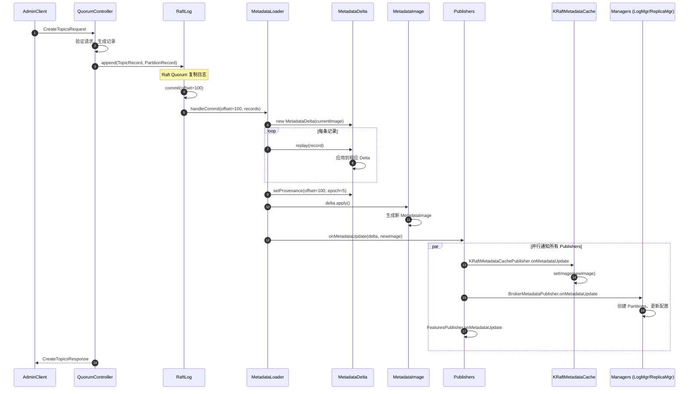

### 流程说明

#### 1. Controller 处理请求

**Controller 接收客户端请求**（如 CreateTopics）：

```java
// 在 QuorumController 中
public CompletableFuture<CreateTopicsResponseData> createTopics(
    CreateTopicsRequestData request
) {
    CompletableFuture<CreateTopicsResponseData> future = new CompletableFuture<>();
    
    appendControlEvent("createTopics", () -> {
        CreateTopicsResponseData response = new CreateTopicsResponseData();
        
        for (CreatableTopic topic : request.topics()) {
            try {
                // 1. 验证 Topic 名称、配置
                validateTopicName(topic.name());
                validateTopicConfigs(topic.configs());
                
                // 2. 分配 Partitions 到 Brokers
                List<List<Integer>> replicaAssignment =
                    assignReplicasToBrokers(topic.numPartitions(), topic.replicationFactor());
                
                // 3. 生成元数据记录
                Uuid topicId = Uuid.randomUuid();
                List<ApiMessageAndVersion> records = new ArrayList<>();
                
                records.add(new ApiMessageAndVersion(
                    new TopicRecord()
                        .setName(topic.name())
                        .setTopicId(topicId),
                    (short) 0
                ));
                
                for (int partitionId = 0; partitionId < topic.numPartitions(); partitionId++) {
                    List<Integer> replicas = replicaAssignment.get(partitionId);
                    records.add(new ApiMessageAndVersion(
                        new PartitionRecord()
                            .setTopicId(topicId)
                            .setPartitionId(partitionId)
                            .setReplicas(replicas)
                            .setIsr(replicas)
                            .setLeader(replicas.get(0))
                            .setLeaderEpoch(0)
                            .setPartitionEpoch(0),
                        (short) 0
                    ));
                }
                
                // 4. 写入 Raft Log
                appendRecords(records).thenApply(offset -> {
                    response.topics().add(new CreatableTopicResult()
                        .setName(topic.name())
                        .setTopicId(topicId)
                        .setErrorCode(Errors.NONE.code()));
                    return null;
                });
                
            } catch (Exception e) {
                response.topics().add(new CreatableTopicResult()
                    .setName(topic.name())
                    .setErrorCode(Errors.forException(e).code())
                    .setErrorMessage(e.getMessage()));
            }
        }
        
        future.complete(response);
    });
    
    return future;
}
```

#### 2. Raft 日志复制

**Raft Quorum 复制日志到多数派**：

```java
// 在 KafkaRaftClient 中
public long append(List<ApiMessageAndVersion> records, long maxBatchSizeInBytes) {
    // 1. 序列化记录
    MemoryRecords memoryRecords = buildMemoryRecords(records);
    
    // 2. 追加到本地 Log
    long offset = log.appendAsLeader(memoryRecords);
    
    // 3. 触发 Followers 拉取
    followers.forEach(follower -> follower.wakeup());
    
    // 4. 等待多数派确认
    return offset;
}

// Followers 拉取并确认
public void handleFetchRequest(FetchRequest request) {
    // 从 Log 读取记录
    Records records = log.read(request.fetchOffset(), request.maxBytes());
    
    // 返回给 Follower
    FetchResponse response = new FetchResponse()
        .setRecords(records)
        .setHighWatermark(log.highWatermark());
    
    send(response);
}

// Leader 更新 High Watermark
public void maybeAdvanceHighWatermark() {
    // 计算多数派的最小 offset
    long newHighWatermark = calculateHighWatermark(followers);
    
    if (newHighWatermark > log.highWatermark()) {
        log.updateHighWatermark(newHighWatermark);
        // 触发 commit 回调
        handleCommit(newHighWatermark);
    }
}
```

#### 3. MetadataLoader 加载记录

**从 Raft Log 加载已提交的记录**：

```java
// 在 MetadataLoader 中
public void handleCommit(long offset, long epoch, long lastContainedLogTimeMs,
                         List<ApiMessageAndVersion> records) {
    MetadataDelta delta = new MetadataDelta(image);
    
    for (ApiMessageAndVersion record : records) {
        try {
            delta.replay(record);
        } catch (Exception e) {
            faultHandler.handleFault("Error replaying record at offset " + offset, e);
            throw e;
        }
    }
    
    delta.setProvenance(new MetadataProvenance(offset, epoch, lastContainedLogTimeMs));
    
    MetadataImage newImage = delta.apply();
    publish(delta, newImage);
}
```

#### 4. 构建 MetadataDelta

**应用单条记录到 Delta**：

```java
// 在 MetadataDelta 中
public void replay(ApiMessageAndVersion record) {
    ApiMessage message = record.message();
    
    switch (message.apiKey()) {
        case TOPIC_RECORD:
            topicsDelta().replay((TopicRecord) message);
            break;
            
        case PARTITION_RECORD:
            topicsDelta().replay((PartitionRecord) message);
            break;
            
        case REGISTER_BROKER_RECORD:
            clusterDelta().replay((RegisterBrokerRecord) message);
            break;
            
        case CONFIG_RECORD:
            configsDelta().replay((ConfigRecord) message);
            break;
            
        // ... 其他记录类型 ...
    }
}

// 在 TopicsDelta 中
public void replay(TopicRecord record) {
    TopicDelta delta = getOrCreateTopicDelta(record.topicId());
    delta.setName(record.name());
    delta.setId(record.topicId());
}

public void replay(PartitionRecord record) {
    TopicDelta delta = getOrCreateTopicDelta(record.topicId());
    delta.replay(record);
}

// 在 TopicDelta 中
public void replay(PartitionRecord record) {
    changedPartitions.put(record.partitionId(), new PartitionRegistration(
        Replicas.toArray(record.replicas()),
        Replicas.toArray(record.isr()),
        Replicas.toArray(record.removingReplicas()),
        Replicas.toArray(record.addingReplicas()),
        record.leader(),
        record.leaderEpoch(),
        record.partitionEpoch()
    ));
}
```

#### 5. 生成新 MetadataImage

**从 Delta 生成新 Image**：

```java
// 在 MetadataDelta 中
public MetadataImage apply() {
    return new MetadataImage(
        provenance,
        featuresDelta == null ? image.features() : featuresDelta.apply(),
        clusterDelta == null ? image.cluster() : clusterDelta.apply(),
        topicsDelta == null ? image.topics() : topicsDelta.apply(),
        configsDelta == null ? image.configs() : configsDelta.apply(),
        clientQuotasDelta == null ? image.clientQuotas() : clientQuotasDelta.apply(),
        producerIdsDelta == null ? image.producerIds() : producerIdsDelta.apply(),
        aclsDelta == null ? image.acls() : aclsDelta.apply(),
        scramDelta == null ? image.scram() : scramDelta.apply(),
        delegationTokensDelta == null ? image.delegationTokens() : delegationTokensDelta.apply()
    );
}

// 在 TopicsDelta 中
public TopicsImage apply() {
    Map<Uuid, TopicImage> newTopicsById = new HashMap<>(image.topicsById());
    Map<String, TopicImage> newTopicsByName = new HashMap<>(image.topicsByName());
    
    // 删除 Topics
    for (TopicImage deleted : deletedTopics.values()) {
        newTopicsById.remove(deleted.id());
        newTopicsByName.remove(deleted.name());
    }
    
    // 应用变更
    for (TopicDelta delta : changedTopics.values()) {
        TopicImage newTopic = delta.apply();
        newTopicsById.put(newTopic.id(), newTopic);
        newTopicsByName.put(newTopic.name(), newTopic);
    }
    
    return new TopicsImage(newTopicsById, newTopicsByName);
}
```

#### 6. 发布到 Publishers

**通知所有订阅者**：

```java
// 在 MetadataLoader 中
private void publish(MetadataDelta delta, MetadataImage newImage) {
    LoaderManifest manifest = new LoaderManifest(
        newImage.provenance(),
        loadStatistics()
    );
    
    for (MetadataPublisher publisher : publishers) {
        try {
            publisher.onMetadataUpdate(delta, newImage, manifest);
        } catch (Exception e) {
            faultHandler.handleFault(
                "Error from publisher " + publisher.name(),
                e
            );
        }
    }
    
    // 更新当前 image
    this.image = newImage;
}
```

#### 7. BrokerMetadataPublisher 应用变更

**将元数据变更同步到 Broker 组件**：

```java
// 在 BrokerMetadataPublisher 中
override def onMetadataUpdate(
    delta: MetadataDelta,
    newImage: MetadataImage,
    manifest: LoaderManifest
): Unit = {
    // 1. 更新 MetadataCache
    metadataCache.setImage(newImage)
    
    // 2. 处理 Topic 删除
    Option(delta.topicsDelta()).foreach { topicsDelta =>
        topicsDelta.deletedTopicIds().forEach { topicId =>
            val topic = image.topics().getTopic(topicId)
            val topicName = topic.name()
            
            // 停止所有相关 Replicas
            topic.partitions().keySet().forEach { partitionId =>
                val tp = new TopicPartition(topicName, partitionId)
                replicaManager.stopReplica(tp, deletePartition = true)
            }
            
            // 异步删除日志
            logManager.asyncDelete(topicName)
        }
    }
    
    // 3. 处理 Partition 变更
    Option(delta.topicsDelta()).foreach { topicsDelta =>
        topicsDelta.changedTopics().forEach { (topicId, topicDelta) =>
            val topicName = topicDelta.name()
            
            topicDelta.changedPartitions().forEach { (partitionId, partition) =>
                val tp = new TopicPartition(topicName, partitionId)
                val isReplica = partition.replicas.contains(brokerId)
                
                if (isReplica) {
                    // 本 Broker 是 Replica
                    if (partition.leader == brokerId) {
                        // 成为 Leader
                        replicaManager.makeLeader(
                            tp,
                            partition.leaderEpoch,
                            partition.isr,
                            partition.replicas
                        )
                    } else {
                        // 成为 Follower
                        replicaManager.makeFollower(
                            tp,
                            partition.leader,
                            partition.leaderEpoch,
                            partition.isr
                        )
                    }
                } else {
                    // 不再是 Replica，删除本地数据
                    replicaManager.stopReplica(tp, deletePartition = true)
                }
            }
        }
    }
    
    // 4. 处理配置变更
    Option(delta.configsDelta()).foreach { configsDelta =>
        configsDelta.changes().forEach { (resource, configDelta) =>
            resource.`type`() match {
                case ConfigResource.Type.TOPIC =>
                    val topicName = resource.name()
                    val newConfig = configDelta.data()
                    logManager.updateTopicConfig(topicName, newConfig)
                    
                case ConfigResource.Type.BROKER =>
                    if (resource.name() == brokerId.toString) {
                        val newConfig = configDelta.data()
                        dynamicConfigManager.updateBrokerConfig(brokerId, newConfig)
                    }
                    
                case _ =>
            }
        }
    }
}
```

### 更新性能优化

**批量应用**：

- 单次 Raft commit 可能包含多条记录，批量应用到 Delta，减少 Image 重建次数

**增量更新**：

- 只更新变更的部分（TopicDelta、ClusterDelta），未变更的子 Image 直接复用引用

**写时复制**：

- 新 Image 与旧 Image 共享未变更的子对象，减少内存分配和复制开销

**无锁发布**：

- 更新 `_currentImage` 引用是原子操作，读操作无需等待

---

## 元数据查询流程

元数据查询是 Broker 的高频操作，性能直接影响请求处理延迟。

### 查询流程图（以 MetadataRequest 为例）

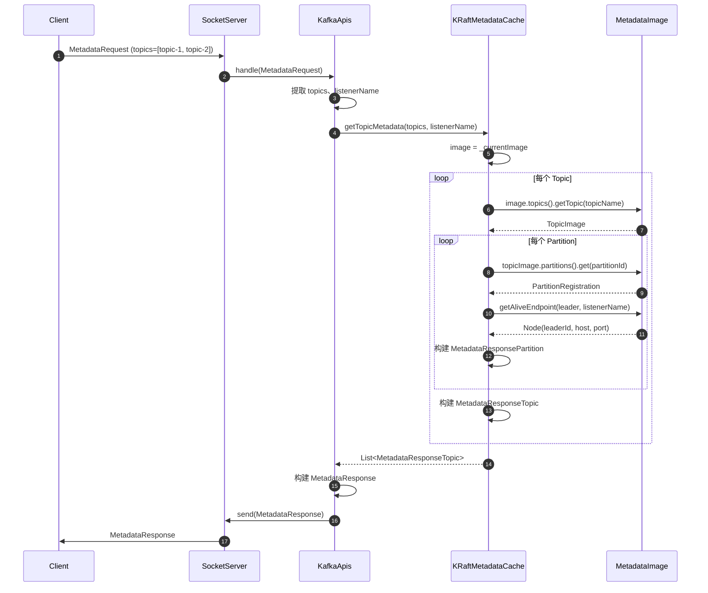

### 查询实现示例

**KafkaApis 处理 MetadataRequest**：

```scala
// 在 KafkaApis 中
def handleTopicMetadataRequest(request: RequestChannel.Request): Unit = {
    val metadataRequest = request.body[MetadataRequest]
    val topics = if (metadataRequest.isAllTopics) {
        metadataCache.getAllTopics.asScala.toSet
    } else {
        metadataRequest.topics().asScala.toSet
    }
    
    val listenerName = request.context.listenerName
    
    // 查询元数据
    val topicMetadata = metadataCache.getTopicMetadata(
        topics.asJava,
        listenerName,
        errorUnavailableEndpoints = metadataRequest.version() == 0,
        errorUnavailableListeners = metadataRequest.version() <= 5
    )
    
    // 查询 Broker 列表
    val brokers = metadataCache.getAliveBrokerNodes(listenerName).asScala
    
    // 构建响应
    val responseData = new MetadataResponseData()
        .setTopics(topicMetadata)
        .setBrokers(brokers.map { node =>
            new MetadataResponseData.MetadataResponseBroker()
                .setNodeId(node.id())
                .setHost(node.host())
                .setPort(node.port())
                .setRack(node.rack())
        }.asJava)
        .setClusterId(clusterId)
        .setControllerId(metadataCache.getControllerId.getOrElse(MetadataResponse.NO_CONTROLLER_ID))
    
    requestChannel.sendResponse(request, new MetadataResponse(responseData, metadataRequest.version()))
}
```

**MetadataCache 查询实现**：

```scala
// 在 KRaftMetadataCache 中
override def getTopicMetadata(
    topics: Set[String],
    listenerName: ListenerName,
    errorUnavailableEndpoints: Boolean,
    errorUnavailableListeners: Boolean
): List[MetadataResponseTopic] = {
    // 获取快照引用（后续查询基于此快照，保证一致性）
    val image = _currentImage
    
    topics.map { topicName =>
        Option(image.topics().getTopic(topicName)) match {
            case None =>
                // Topic 不存在
                new MetadataResponseTopic()
                    .setName(topicName)
                    .setErrorCode(Errors.UNKNOWN_TOPIC_OR_PARTITION.code)
            
            case Some(topic) =>
                // 遍历 Partitions
                val partitions = topic.partitions().entrySet().asScala.map { entry =>
                    val partitionId = entry.getKey
                    val partition = entry.getValue
                    
                    // 查找 Leader 节点
                    val maybeLeader = getAliveEndpoint(image, partition.leader, listenerName)
                    
                    maybeLeader match {
                        case None =>
                            // Leader 不可用
                            new MetadataResponsePartition()
                                .setErrorCode(
                                    if (!image.cluster().brokers.containsKey(partition.leader))
                                        Errors.LEADER_NOT_AVAILABLE.code
                                    else if (errorUnavailableListeners)
                                        Errors.LISTENER_NOT_FOUND.code
                                    else
                                        Errors.LEADER_NOT_AVAILABLE.code
                                )
                                .setPartitionIndex(partitionId)
                                .setLeaderId(MetadataResponse.NO_LEADER_ID)
                                .setLeaderEpoch(partition.leaderEpoch)
                                .setReplicaNodes(Replicas.toList(partition.replicas))
                                .setIsrNodes(Replicas.toList(partition.isr))
                        
                        case Some(leader) =>
                            // Leader 可用，检查 Replicas 可用性
                            val filteredReplicas = maybeFilterAliveReplicas(
                                image, partition.replicas, listenerName, errorUnavailableEndpoints
                            )
                            val filteredIsr = maybeFilterAliveReplicas(
                                image, partition.isr, listenerName, errorUnavailableEndpoints
                            )
                            
                            val error = if (filteredReplicas.size < partition.replicas.length) {
                                Errors.REPLICA_NOT_AVAILABLE
                            } else if (filteredIsr.size < partition.isr.length) {
                                Errors.REPLICA_NOT_AVAILABLE
                            } else {
                                Errors.NONE
                            }
                            
                            new MetadataResponsePartition()
                                .setErrorCode(error.code)
                                .setPartitionIndex(partitionId)
                                .setLeaderId(leader.id())
                                .setLeaderEpoch(partition.leaderEpoch)
                                .setReplicaNodes(filteredReplicas)
                                .setIsrNodes(filteredIsr)
                    }
                }.toList
                
                new MetadataResponseTopic()
                    .setName(topicName)
                    .setTopicId(topic.id())
                    .setErrorCode(Errors.NONE.code)
                    .setPartitions(partitions.asJava)
        }
    }.toList.asJava
}

private def getAliveEndpoint(
    image: MetadataImage,
    brokerId: Int,
    listenerName: ListenerName
): Option[Node] = {
    Option(image.cluster().broker(brokerId)).flatMap { broker =>
        if (broker.fenced()) {
            None
        } else {
            Option(broker.listeners().get(listenerName.value())).map { listener =>
                new Node(brokerId, listener.host(), listener.port(), broker.rack())
            }
        }
    }
}
```

### 查询性能分析

**时间复杂度**：

- **Topic 查找**：O(1)，HashMap 查找
- **Partition 遍历**：O(P)，P 为 Partition 数量
- **Leader/Replica 查找**：O(1)，HashMap 查找
- **整体**：O(Topics × Partitions)

**典型耗时**：

- 单 Topic，10 Partitions：< 100 µs
- 10 Topics，100 Partitions：< 1 ms
- 100 Topics，1000 Partitions：< 10 ms

**性能优化要点**：

- **快照引用**：读取 `_currentImage` 一次，后续查询基于此引用，避免多次 volatile 读取
- **无锁操作**：整个查询过程无锁，利用 Image 的不可变性
- **索引优化**：Topic/ID 双向索引，支持按名称或 UUID 快速查找
- **缓存友好**：MetadataImage 紧凑存储，提高 CPU 缓存命中率

---

## 关键设计

### 1. 不可变快照（Immutable Snapshot）

**设计理念**：

- 每个 `MetadataImage` 是完全不可变的，所有字段和集合都不可修改
- 更新时生成新的 Image，而非修改现有 Image

**优势**：

- **无锁读取**：读操作无需加锁，多个线程可以并发读取同一快照
- **一致性视图**：单次查询基于同一快照，避免读到中间状态
- **简化并发**：无需担心读写冲突、脏读、幻读等问题

**实现技术**：

- Java 16+ `record` 语法
- `Collections.unmodifiableMap()`
- `final` 字段修饰

### 2. 写时复制（Copy-on-Write）

**设计理念**：

- 更新时只复制变更的部分，未变更的子 Image 直接复用引用

**实现示例**：

```java
// 在 MetadataDelta 中
public MetadataImage apply() {
    return new MetadataImage(
        provenance,
        featuresDelta == null ? image.features() : featuresDelta.apply(),  // 未变更：复用引用
        clusterDelta == null ? image.cluster() : clusterDelta.apply(),    // 变更：生成新对象
        topicsDelta == null ? image.topics() : topicsDelta.apply(),
        // ... 其他子 Image ...
    );
}

// 在 TopicsDelta 中
public TopicsImage apply() {
    // 只有变更的 Topics 会创建新 TopicImage
    Map<Uuid, TopicImage> newTopicsById = new HashMap<>(image.topicsById());
    
    for (TopicDelta delta : changedTopics.values()) {
        TopicImage newTopic = delta.apply();
        newTopicsById.put(newTopic.id(), newTopic);  // 替换变更的 Topic
    }
    
    // 未变更的 Topics 仍指向旧 TopicImage
    return new TopicsImage(newTopicsById, newTopicsByName);
}
```

**内存优化**：

- 假设集群有 10000 Topics，单次更新只修改 10 个 Topics
- 传统方案：复制整个 TopicsImage（10000 个 TopicImage）
- Copy-on-Write：只创建 10 个新 TopicImage + 1 个新 TopicsImage，其余 9990 个复用引用
- **内存节省**：约 99% 的 TopicImage 对象复用

### 3. 增量更新（Delta-based Update）

**设计理念**：

- 通过 `MetadataDelta` 记录变更，而非完全重建 Image
- 批量应用多条变更，减少 Image 重建次数

**Delta 类型**：

- `TopicsDelta`：Topic/Partition 变更
- `ClusterDelta`：Broker/Controller 注册变更
- `ConfigsDelta`：配置变更
- `AclsDelta`：ACL 变更
- 等等

**性能优势**：

- **减少计算**：只处理变更的部分，而非遍历所有元数据
- **批量优化**：多条变更合并为一次 Image 更新，减少发布次数
- **内存友好**：避免频繁创建大对象

### 4. 发布-订阅模式（Publish-Subscribe）

**设计理念**：

- 元数据更新通过 `MetadataPublisher` 接口解耦
- 多个订阅者（Publishers）可以并发接收同一变更

**Publishers 类型**：

- `KRaftMetadataCachePublisher`：更新 MetadataCache
- `BrokerMetadataPublisher`：通知 Broker 组件
- `FeaturesPublisher`：处理特性版本变更
- `ControllerRegistrationsPublisher`：跟踪 Controller 注册

**优势**：

- **解耦**：元数据加载逻辑与应用逻辑分离
- **扩展性**：新增订阅者无需修改加载逻辑
- **并发**：多个 Publisher 可以并行处理

### 5. Raft 一致性

**设计理念**：

- 所有元数据变更通过 Raft Log 持久化和复制
- Controller 是唯一的写入者（Leader）
- Brokers 作为 Raft Followers 同步元数据

**一致性保证**：

- **持久化**：变更写入 Raft Log，持久化到磁盘
- **复制**：多数派（Quorum）确认后才能 commit
- **顺序性**：严格按照 Log offset 顺序应用
- **容错**：Controller 故障时自动选举新 Leader

**性能考量**：

- **批量复制**：多条变更合并为一个 Raft batch
- **异步应用**：Raft commit 和元数据应用解耦，避免阻塞写入
- **本地读取**：元数据查询无需经过 Raft，直接读取本地缓存

---

## 性能优化

### 1. 无锁并发读取

**机制**：

- `KRaftMetadataCache._currentImage` 使用 `@volatile` 修饰
- 读操作获取引用后，基于不可变快照进行查询

**性能提升**：

- 避免锁竞争，支持高并发读取
- 读操作延迟低且稳定（无锁等待）

### 2. 紧凑数据结构

**优化点**：

- `PartitionRegistration` 使用 `int[]` 而非 `List<Integer>` 存储 Replicas/ISR
- `Uuid` 使用两个 `long` 字段而非 `String`
- `Node` 信息内联在 `BrokerRegistration` 中

**内存节省**：

- 每个 Partition 节省约 50 字节
- 大规模集群（10万 Partition）节省约 5 MB

### 3. 索引双写

**设计**：

- `TopicsImage` 同时维护 `topicsById` 和 `topicsByName` 两个索引

**优势**：

- 支持按名称或 UUID 快速查找（O(1)）
- 避免全表扫描或二次查找

**代价**：

- 额外内存：约 2倍 Map overhead（每个 Topic 约 100 字节）
- 更新时需同步维护两个索引

### 4. 批量加载

**机制**：

- 启动时从 Snapshot 批量加载全量元数据
- 运行时从 Raft Log 批量加载增量变更

**性能优势**：

- 减少 Image 重建次数
- 摊销对象创建和 GC 开销

### 5. 异步发布

**设计**：

- 元数据更新和 Publisher 通知解耦
- Publisher 处理异常不会阻塞元数据加载

**实现**：

```java
private void publish(MetadataDelta delta, MetadataImage newImage) {
    LoaderManifest manifest = new LoaderManifest(
        newImage.provenance(),
        loadStatistics()
    );
    
    for (MetadataPublisher publisher : publishers) {
        try {
            publisher.onMetadataUpdate(delta, newImage, manifest);
        } catch (Exception e) {
            // 记录错误但不中断后续 Publishers
            faultHandler.handleFault("Error from publisher " + publisher.name(), e);
        }
    }
    
    this.image = newImage;
}
```

---

## 异常处理

### 1. 元数据加载失败

**场景**：

- Raft Log 损坏或无法读取
- 元数据记录格式不兼容

**处理策略**：

- 记录错误日志
- 通知 FaultHandler
- Broker 启动失败（无法降级运行）

**恢复方式**：

- 修复 Raft Log
- 回退到兼容的 metadata.version
- 从 Snapshot 重新加载

### 2. Publisher 异常

**场景**：

- BrokerMetadataPublisher 创建 Partition 失败
- 配置更新异常

**处理策略**：

- 捕获异常，记录日志
- 继续处理后续 Publishers
- 通知 FaultHandler

**影响**：

- 单个 Publisher 失败不影响其他 Publishers
- 元数据缓存仍然更新，查询不受影响

### 3. 查询异常

**Topic 不存在**：

- 返回 `UNKNOWN_TOPIC_OR_PARTITION` 错误码
- 客户端需要重新拉取元数据或处理错误

**Leader 不可用**：

- 返回 `LEADER_NOT_AVAILABLE` 错误码
- 客户端重试或选择其他 Partition

**Broker 不可用**：

- 返回 `NO_NODE` 或空节点信息
- 客户端需要更新元数据并重试

**Listener 不可用**：

- 返回 `LISTENER_NOT_FOUND` 错误码（MetadataResponse v6+）
- 或返回 `LEADER_NOT_AVAILABLE`（v5 及以下，兼容性）

### 4. 内存溢出

**场景**：

- Topic/Partition 数量过多
- MetadataImage 占用内存超过堆大小

**预防措施**：

- 监控 MetadataImage 大小
- 限制 Topic/Partition 数量（配置或配额）
- 增大 JVM 堆内存

**应急方案**：

- 触发 GC
- 删除不必要的 Topics
- 拆分集群

### 5. 版本不兼容

**场景**：

- 升级 metadata.version 后无法降级
- 新版本特性数据在旧版本无法解析

**处理策略**：

- 通过 `ImageWriterOptions.handleLoss` 处理不兼容字段
- 记录警告或拒绝降级
- 保持向后兼容（通过 Optional 字段）

**兼容性保证**：

- 新字段：通过 Optional 或默认值兼容
- 删除字段：通过 deprecated 标记逐步淘汰
- 结构变更：通过 metadata.version 门控

---

## 总结

**Metadata 模块的核心价值**：

1. **高性能**：
   - 无锁并发读取
   - O(1) 查询复杂度
   - 批量更新和 Copy-on-Write 优化

2. **强一致性**：
   - Raft 协议保证元数据在集群内一致
   - 不可变快照保证单次查询的一致性视图

3. **高可用**：
   - Controller 故障自动选举
   - 元数据持久化到 Raft Log
   - 多副本容错

4. **可扩展**：
   - 发布-订阅模式支持灵活的扩展
   - 增量更新机制适应大规模集群

5. **版本兼容**：
   - 通过 metadata.version 控制特性演进
   - 向后兼容保证平滑升级

**最佳实践**：

1. **监控 MetadataImage 大小**：避免内存溢出
2. **限制 Topic/Partition 数量**：根据集群规模合理规划
3. **定期快照（Snapshot）**：加速启动和恢复
4. **优化 Raft 配置**：平衡一致性和性能
5. **使用合适的 metadata.version**：避免不必要的新特性开销

---

## 数据结构

## 目录
- [MetadataImage](#metadataimage)
- [TopicsImage](#topicsimage)
- [TopicImage](#topicimage)
- [PartitionRegistration](#partitionregistration)
- [ClusterImage](#clusterimage)
- [BrokerRegistration](#brokerregistration)

---

## MetadataImage

### UML 类图

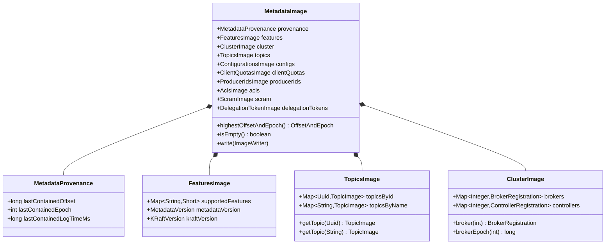

### 字段说明

| 字段 | 类型 | 说明 |
|------|------|------|
| provenance | MetadataProvenance | 元数据来源信息（offset, epoch, timestamp） |
| features | FeaturesImage | 特性版本信息 |
| cluster | ClusterImage | 集群拓扑信息（Brokers, Controllers） |
| topics | TopicsImage | Topic/Partition 元数据 |
| configs | ConfigurationsImage | 配置信息 |
| clientQuotas | ClientQuotasImage | 客户端配额 |
| producerIds | ProducerIdsImage | Producer ID 分配 |
| acls | AclsImage | ACL 权限 |
| scram | ScramImage | SCRAM 认证 |
| delegationTokens | DelegationTokenImage | 委派令牌 |

### 不可变性

**所有 MetadataImage 字段都是不可变的**：

```java
public record MetadataImage(
    MetadataProvenance provenance,
    FeaturesImage features,
    ClusterImage cluster,
    TopicsImage topics,
    ConfigurationsImage configs,
    ClientQuotasImage clientQuotas,
    ProducerIdsImage producerIds,
    AclsImage acls,
    ScramImage scram,
    DelegationTokenImage delegationTokens
) {
    // record 自动生成不可变类
    // 所有字段都是 final
    // 没有 setter 方法
}
```

### 关键方法

**1. highestOffsetAndEpoch**：获取最高 offset 和 epoch

```java
public OffsetAndEpoch highestOffsetAndEpoch() {
    return new OffsetAndEpoch(
        provenance.lastContainedOffset(),
        provenance.lastContainedEpoch()
    );
}
```

**2. write**：序列化到快照

```java
public void write(ImageWriter writer, ImageWriterOptions options) {
    // Features 必须先写入（包含 metadata.version）
    features.write(writer, options);
    cluster.write(writer, options);
    topics.write(writer, options);
    configs.write(writer);
    clientQuotas.write(writer);
    producerIds.write(writer);
    acls.write(writer);
    scram.write(writer, options);
    delegationTokens.write(writer, options);
    writer.close(true);
}
```

---

## TopicsImage

### UML 类图

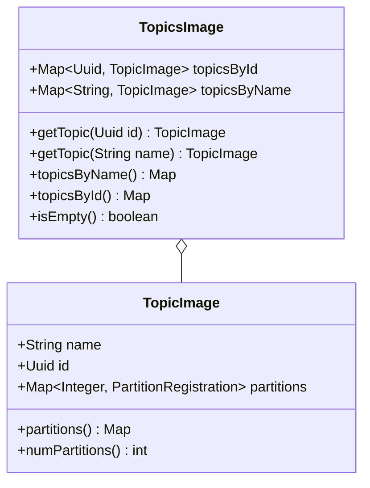

### 字段说明

| 字段 | 类型 | 说明 |
|------|------|------|
| topicsById | Map<Uuid, TopicImage> | 按 UUID 索引的 Topic |
| topicsByName | Map<String, TopicImage> | 按名称索引的 Topic |

**双索引设计**：

- 同时维护 ID 和名称索引
- 支持 O(1) 查找
- 内存开销：每个 Topic 额外约 100 字节

### 关键方法

```java
public class TopicsImage {
    private final Map<Uuid, TopicImage> topicsById;
    private final Map<String, TopicImage> topicsByName;
    
    public TopicsImage(
        Map<Uuid, TopicImage> topicsById,
        Map<String, TopicImage> topicsByName
    ) {
        this.topicsById = Collections.unmodifiableMap(topicsById);
        this.topicsByName = Collections.unmodifiableMap(topicsByName);
    }
    
    public TopicImage getTopic(Uuid id) {
        return topicsById.get(id);
    }
    
    public TopicImage getTopic(String name) {
        return topicsByName.get(name);
    }
}
```

---

## TopicImage

### UML 类图

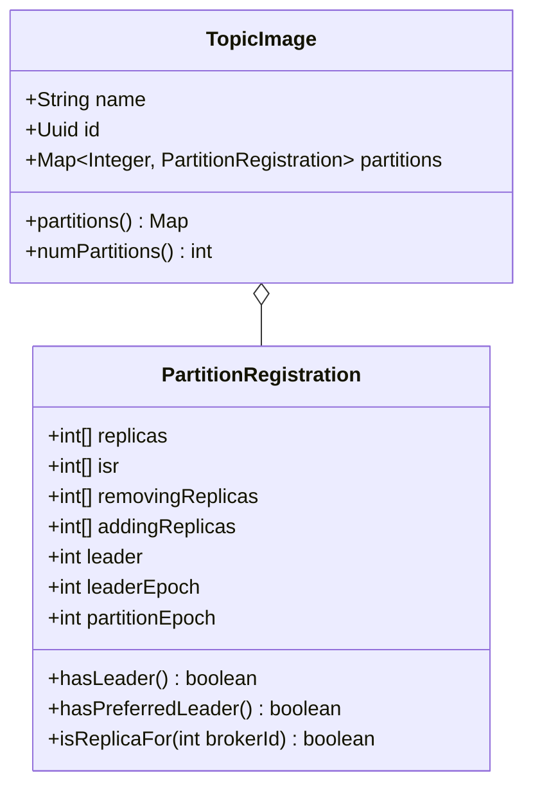

### 字段说明

| 字段 | 类型 | 说明 |
|------|------|------|
| name | String | Topic 名称 |
| id | Uuid | Topic UUID（唯一标识） |
| partitions | Map<Integer, PartitionRegistration> | 分区注册信息 |

### 关键方法

```java
public class TopicImage {
    private final String name;
    private final Uuid id;
    private final Map<Integer, PartitionRegistration> partitions;
    
    public TopicImage(
        String name,
        Uuid id,
        Map<Integer, PartitionRegistration> partitions
    ) {
        this.name = Objects.requireNonNull(name);
        this.id = Objects.requireNonNull(id);
        this.partitions = Collections.unmodifiableMap(partitions);
    }
    
    public int numPartitions() {
        return partitions.size();
    }
}
```

---

## PartitionRegistration

### UML 类图

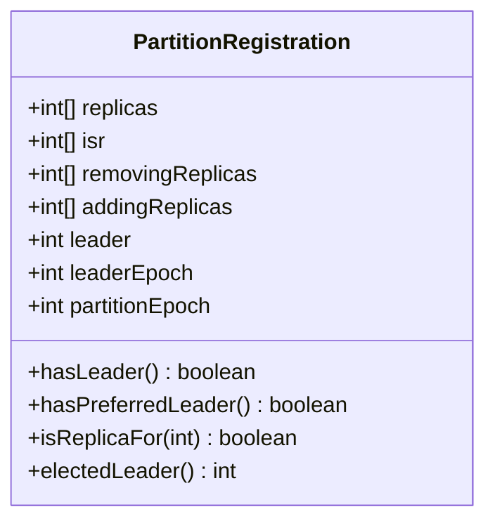

### 字段说明

| 字段 | 类型 | 约束 | 说明 |
|------|------|------|------|
| replicas | int[] | 不可变 | 副本列表（Broker ID） |
| isr | int[] | 不可变 | In-Sync Replicas |
| removingReplicas | int[] | 不可变 | 正在移除的副本 |
| addingReplicas | int[] | 不可变 | 正在添加的副本 |
| leader | int | -1 表示无 Leader | Leader Broker ID |
| leaderEpoch | int | >= 0 | Leader Epoch |
| partitionEpoch | int | >= 0 | Partition Epoch |

### 字段详解

**replicas**：

- 所有副本的 Broker ID 列表
- 第一个副本通常是 preferred leader
- 例如：`[1, 2, 3]` 表示副本在 Broker 1、2、3 上

**isr**：

- In-Sync Replicas（同步副本）
- 必须是 replicas 的子集
- Leader 总是在 ISR 中
- 例如：`[1, 2]` 表示 Broker 1、2 是同步的

**removingReplicas / addingReplicas**：

- 用于分区重新分配（Partition Reassignment）
- removingReplicas：正在被移除的副本
- addingReplicas：正在被添加的副本
- 通常为空数组

**leader / leaderEpoch**：

- leader：当前 Leader 的 Broker ID（-1 表示无 Leader）
- leaderEpoch：Leader 的 epoch，每次 Leader 变更时递增
- 用于隔离旧 Leader 的请求

**partitionEpoch**：

- Partition 的 epoch
- 每次分区配置变更（ISR 变化、副本变化）时递增
- 用于检测过期的元数据

### 关键方法

```java
public class PartitionRegistration {
    public final int[] replicas;
    public final int[] isr;
    public final int[] removingReplicas;
    public final int[] addingReplicas;
    public final int leader;
    public final int leaderEpoch;
    public final int partitionEpoch;
    
    // 是否有 Leader
    public boolean hasLeader() {
        return leader >= 0;
    }
    
    // 是否有 Preferred Leader
    public boolean hasPreferredLeader() {
        return replicas.length > 0 &&
               replicas[0] == leader;
    }
    
    // 是否是该 Broker 的副本
    public boolean isReplicaFor(int brokerId) {
        for (int replica : replicas) {
            if (replica == brokerId) {
                return true;
            }
        }
        return false;
    }
    
    // 选举新 Leader（从 ISR 中选择）
    public int electedLeader(int[] preferredReplicas) {
        // 优先选择 preferred replica
        for (int replica : preferredReplicas) {
            for (int isrMember : isr) {
                if (replica == isrMember) {
                    return replica;
                }
            }
        }
        
        // 否则选择 ISR 中第一个
        return isr.length > 0 ? isr[0] : -1;
    }
}
```

---

## ClusterImage

### UML 类图

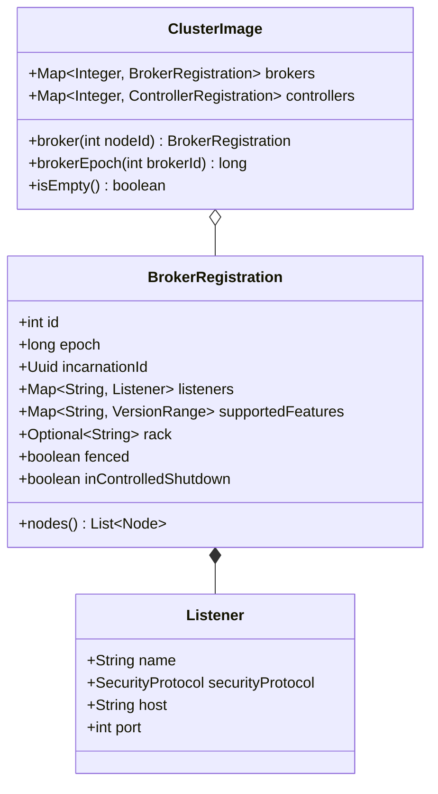

### 字段说明

**ClusterImage**：

| 字段 | 类型 | 说明 |
|------|------|------|
| brokers | Map<Integer, BrokerRegistration> | Broker 注册信息 |
| controllers | Map<Integer, ControllerRegistration> | Controller 注册信息 |

**BrokerRegistration**：

| 字段 | 类型 | 说明 |
|------|------|------|
| id | int | Broker ID |
| epoch | long | 注册 epoch（每次重启递增） |
| incarnationId | Uuid | 每次启动生成的唯一 ID |
| listeners | Map<String, Listener> | 监听器列表（名称 → Listener） |
| supportedFeatures | Map<String, VersionRange> | 支持的特性版本 |
| rack | Optional<String> | 机架 ID |
| fenced | boolean | 是否被隔离（不能作为 Leader） |
| inControlledShutdown | boolean | 是否正在优雅关闭 |

### 关键方法

**ClusterImage**：

```java
public class ClusterImage {
    private final Map<Integer, BrokerRegistration> brokers;
    private final Map<Integer, ControllerRegistration> controllers;
    
    public BrokerRegistration broker(int nodeId) {
        return brokers.get(nodeId);
    }
    
    public long brokerEpoch(int brokerId) {
        BrokerRegistration broker = broker(brokerId);
        return broker == null ? -1L : broker.epoch();
    }
}
```

**BrokerRegistration**：

```java
public class BrokerRegistration {
    // 获取所有 Listener 对应的 Node
    public List<Node> nodes() {
        List<Node> nodes = new ArrayList<>();
        for (Listener listener : listeners.values()) {
            nodes.add(new Node(
                id,
                listener.host(),
                listener.port(),
                rack.orElse(null)
            ));
        }
        return nodes;
    }
    
    // 转换为 Raft Record
    public ApiMessageAndVersion toRecord(ImageWriterOptions options) {
        RegisterBrokerRecord record = new RegisterBrokerRecord()
            .setBrokerId(id)
            .setBrokerEpoch(epoch)
            .setIncarnationId(incarnationId)
            .setRack(rack.orElse(null))
            .setFenced(fenced)
            .setInControlledShutdown(inControlledShutdown);
        
        // 添加 listeners
        listeners.forEach((name, listener) -> {
            record.listeners().add(new BrokerEndpoint()
                .setName(name)
                .setHost(listener.host())
                .setPort(listener.port())
                .setSecurityProtocol(listener.securityProtocol().id));
        });
        
        return new ApiMessageAndVersion(record, (short) 0);
    }
}
```

---

## MetadataDelta

### UML 类图

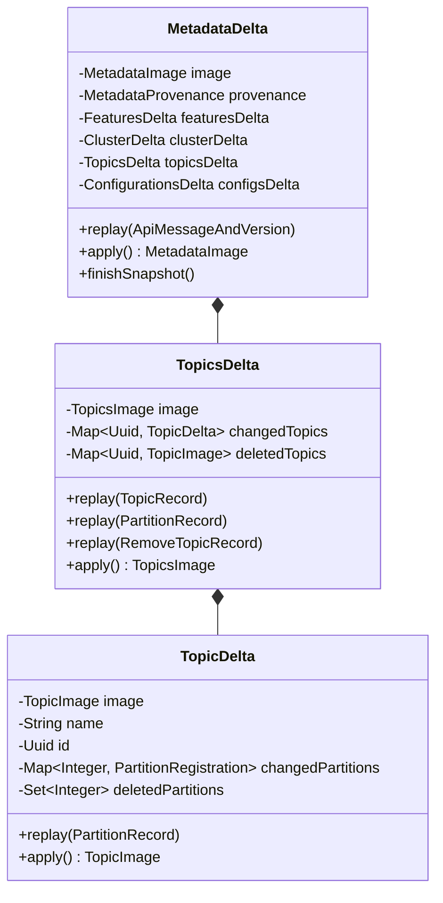

### 字段说明

**MetadataDelta**：

| 字段 | 类型 | 说明 |
|------|------|------|
| image | MetadataImage | 基线 Image |
| provenance | MetadataProvenance | 新的 provenance |
| featuresDelta | FeaturesDelta | Features 增量 |
| clusterDelta | ClusterDelta | Cluster 增量 |
| topicsDelta | TopicsDelta | Topics 增量 |

**TopicsDelta**：

| 字段 | 类型 | 说明 |
|------|------|------|
| image | TopicsImage | 基线 TopicsImage |
| changedTopics | Map<Uuid, TopicDelta> | 变更的 Topics |
| deletedTopics | Map<Uuid, TopicImage> | 删除的 Topics |

### 关键方法

**1. replay**：应用单条记录

```java
public void replay(ApiMessageAndVersion record) {
    ApiMessage message = record.message();
    switch (message.apiKey()) {
        case TOPIC_RECORD:
            topicsDelta().replay((TopicRecord) message);
            break;
        case PARTITION_RECORD:
            topicsDelta().replay((PartitionRecord) message);
            break;
        case REMOVE_TOPIC_RECORD:
            topicsDelta().replay((RemoveTopicRecord) message);
            break;
        case REGISTER_BROKER_RECORD:
            clusterDelta().replay((RegisterBrokerRecord) message);
            break;
        // ... 其他记录类型
    }
}
```

**2. apply**：生成新 Image

```java
public MetadataImage apply() {
    return new MetadataImage(
        provenance,
        featuresDelta == null ? image.features() : featuresDelta.apply(),
        clusterDelta == null ? image.cluster() : clusterDelta.apply(),
        topicsDelta == null ? image.topics() : topicsDelta.apply(),
        configsDelta == null ? image.configs() : configsDelta.apply(),
        // ...
    );
}
```

**TopicsDelta.apply**：

```java
public TopicsImage apply() {
    Map<Uuid, TopicImage> newTopicsById = new HashMap<>(image.topicsById());
    Map<String, TopicImage> newTopicsByName = new HashMap<>(image.topicsByName());
    
    // 删除 Topics
    for (TopicImage deleted : deletedTopics.values()) {
        newTopicsById.remove(deleted.id());
        newTopicsByName.remove(deleted.name());
    }
    
    // 应用变更
    for (TopicDelta delta : changedTopics.values()) {
        TopicImage newTopic = delta.apply();
        newTopicsById.put(newTopic.id(), newTopic);
        newTopicsByName.put(newTopic.name(), newTopic);
    }
    
    return new TopicsImage(newTopicsById, newTopicsByName);
}
```

---

## 总结

本文档详细描述了 Kafka Metadata 模块的核心数据结构：

1. **MetadataImage**：不可变元数据快照
   - 包含所有元数据子系统
   - 支持高效的 Copy-on-Write 更新

2. **TopicsImage / TopicImage**：Topic 元数据
   - 双索引设计（ID + 名称）
   - O(1) 查找性能

3. **PartitionRegistration**：分区注册信息
   - 副本列表、ISR、Leader
   - Leader Epoch 和 Partition Epoch

4. **ClusterImage / BrokerRegistration**：集群拓扑
   - Broker 注册信息
   - Listener、Rack、Fenced 状态

5. **MetadataDelta**：元数据增量
   - 批量应用变更
   - Copy-on-Write 优化

每个数据结构都包含：

- UML 类图
- 完整字段说明
- 关键方法实现
- 不可变性保证

---

## 时序图

## 目录
- [Kafka-03-Metadata-时序图](#kafka-03-metadata-时序图)
  - [目录](#目录)
  - [元数据加载流程](#元数据加载流程)
    - [时序图](#时序图)
    - [流程说明](#流程说明)
  - [元数据更新流程](#元数据更新流程)
    - [时序图](#时序图-1)
    - [流程说明](#流程说明-1)
  - [MetadataDelta 应用流程](#metadatadelta-应用流程)
    - [时序图](#时序图-2)
    - [流程说明](#流程说明-2)
  - [Metadata 发布流程](#metadata-发布流程)
    - [时序图](#时序图-3)
    - [流程说明](#流程说明-3)
  - [Topic 创建流程](#topic-创建流程)
    - [时序图](#时序图-4)
    - [流程说明](#流程说明-4)
  - [Partition 分配流程](#partition-分配流程)
    - [时序图](#时序图-5)
    - [流程说明](#流程说明-5)
  - [总结](#总结)

---

## 元数据加载流程

### 时序图

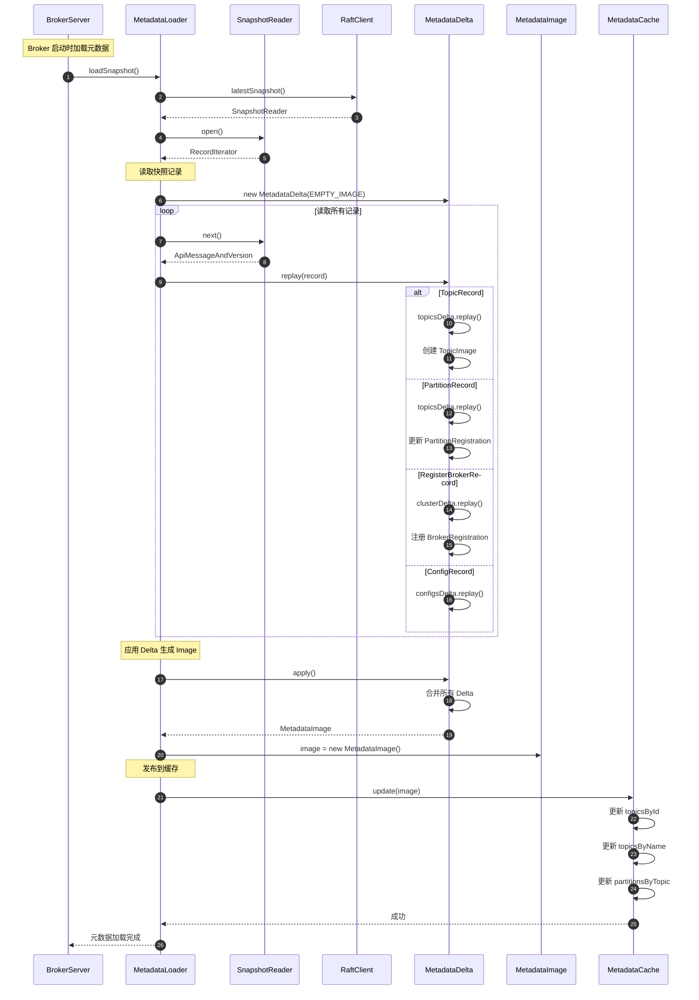

### 流程说明

**阶段 1：获取快照**

- 从 RaftClient 获取最新的快照文件
- 快照包含完整的元数据状态

**阶段 2：读取记录**

- 迭代读取快照中的所有记录
- 记录类型包括：TopicRecord、PartitionRecord、BrokerRecord 等

**阶段 3：应用 Delta**

- 每条记录通过 `MetadataDelta.replay()` 应用
- Delta 累积所有变更

**阶段 4：生成 Image**

- `MetadataDelta.apply()` 生成新的 `MetadataImage`
- Image 是不可变的快照

**阶段 5：发布到缓存**

- 更新 MetadataCache
- 为查询提供快速访问

---

## 元数据更新流程

### 时序图

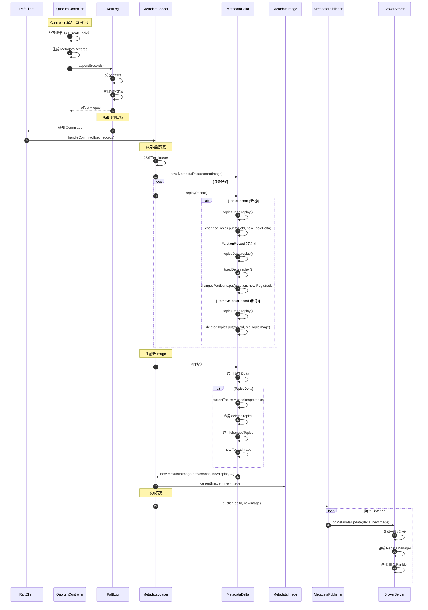

### 流程说明

**阶段 1：Controller 写入**

- Controller 处理客户端请求（如 CreateTopic）
- 生成元数据记录（TopicRecord, PartitionRecord 等）
- 写入 Raft Log

**阶段 2：Raft 复制**

- Raft 协议确保多数派写入成功
- 分配 offset 和 epoch

**阶段 3：Broker 接收**

- RaftClient 通知 Broker 新的 committed 记录
- MetadataLoader 处理记录

**阶段 4：应用 Delta**

- 基于当前 Image 创建 Delta
- replay 每条记录，累积变更
- 支持增量更新（只更新变化的部分）

**阶段 5：生成新 Image**

- Delta.apply() 生成新的不可变 Image
- Copy-on-Write：只复制变化的部分

**阶段 6：发布变更**

- MetadataPublisher 通知所有监听器
- Broker 根据变更更新本地状态
- 创建/删除 Partition、更新 ISR 等

---

## MetadataDelta 应用流程

### 时序图

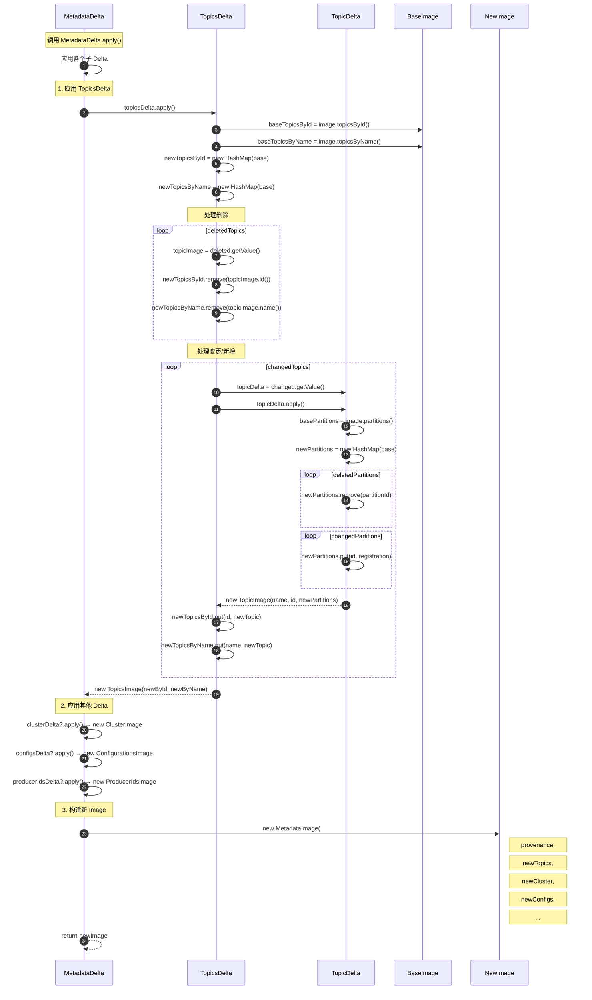

### 流程说明

**Copy-on-Write 机制**

1. **基于 Base Image**：从当前 Image 开始
2. **复制变化部分**：只复制有变更的 Map
3. **不变部分共享**：未变更的部分直接引用

**TopicsDelta 应用**

1. **复制基础 Map**：`new HashMap(baseImage.topicsById)`
2. **应用删除**：从 Map 中移除
3. **应用变更**：更新或新增 Topic
4. **生成新 Image**：不可变的 TopicsImage

**TopicDelta 应用**

1. **复制分区 Map**：`new HashMap(baseImage.partitions)`
2. **应用删除**：移除分区
3. **应用变更**：更新 PartitionRegistration
4. **生成新 TopicImage**

**性能优化**

- **增量更新**：只处理变化的部分
- **结构共享**：未变更的子树直接引用
- **无锁并发**：Image 不可变，读取无需加锁

---

## Metadata 发布流程

### 时序图

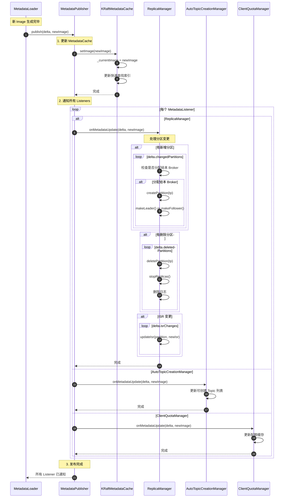

### 流程说明

**发布阶段**

**1. 更新 MetadataCache**

- 原子替换 `_currentImage`
- 更新索引结构（Topics, Partitions, Brokers）
- 提供无锁并发访问

**2. 通知 Listeners**

**ReplicaManager**：

- **新增分区**：创建 Partition 对象，初始化为 Leader 或 Follower
- **删除分区**：停止副本同步，删除本地日志
- **ISR 变更**：更新 Partition 的 ISR 列表
- **Leader 变更**：切换 Leader/Follower 状态

**AutoTopicCreationManager**：

- 更新可自动创建的 Topic 模式
- 更新 Topic 配置

**ClientQuotaManager**：

- 更新客户端配额配置
- 更新限流规则

**3. 异常处理**

- Listener 抛出异常不影响其他 Listener
- 记录错误日志
- 继续通知下一个 Listener

---

## Topic 创建流程

### 时序图

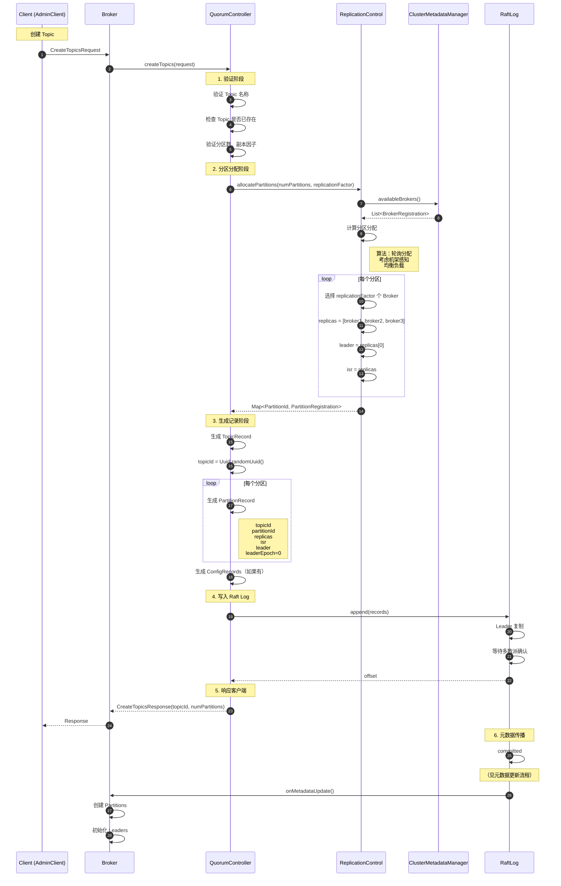

### 流程说明

**阶段 1：验证**

- Topic 名称合法性（长度、字符）
- Topic 是否已存在
- 分区数、副本因子是否合理

**阶段 2：分区分配**

**分配算法**：

1. **轮询**：依次选择 Broker
2. **机架感知**：尽量分散到不同机架
3. **负载均衡**：考虑现有分区数

**示例**（3 分区，3 副本，3 Broker）：

```
Partition 0: [Broker-1, Broker-2, Broker-3]  Leader=Broker-1
Partition 1: [Broker-2, Broker-3, Broker-1]  Leader=Broker-2
Partition 2: [Broker-3, Broker-1, Broker-2]  Leader=Broker-3
```

**阶段 3：生成记录**

- **TopicRecord**：Topic 名称、ID
- **PartitionRecord**：每个分区的配置
  - replicas：所有副本
  - isr：初始时 = replicas
  - leader：replicas[0]
  - leaderEpoch：0

**阶段 4：写入 Raft**

- 追加到 Raft Log
- 等待多数派确认
- 返回 offset

**阶段 5：响应客户端**

- 返回 topicId、分区数等信息

**阶段 6：元数据传播**

- Raft committed 后触发元数据更新
- Broker 创建 Partition 对象
- 初始化 Leader/Follower 状态

---

## Partition 分配流程

### 时序图

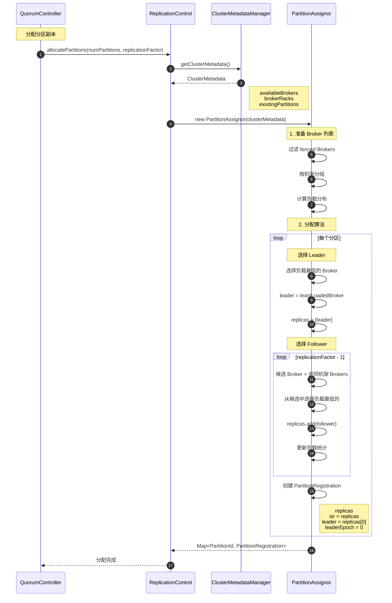

### 流程说明

**目标**

1. **负载均衡**：分区均匀分布到所有 Broker
2. **机架感知**：副本分散到不同机架（容错）
3. **Leader 均衡**：Leader 均匀分布（性能）

**分配算法**

**1. 准备阶段**

- 获取可用 Broker 列表
- 过滤 fenced 状态的 Broker
- 按机架分组

**2. Leader 选择**

- 选择当前负载最低的 Broker
- 负载 = 该 Broker 上的分区数

**3. Follower 选择**

- **机架约束**：优先选择不同机架的 Broker
- **负载均衡**：从符合约束的 Broker 中选择负载最低的
- **兜底策略**：如果机架不足，可以同机架

**4. 更新负载**

- 每分配一个副本，更新该 Broker 的负载计数

**示例**

假设：3 Broker，2 机架

- Broker-1: rack-1
- Broker-2: rack-2
- Broker-3: rack-1

创建 Topic（3 分区，3 副本）：

```
Partition 0:
  Leader: Broker-1 (rack-1)
  Followers: Broker-2 (rack-2), Broker-3 (rack-1)
  
Partition 1:
  Leader: Broker-2 (rack-2)
  Followers: Broker-3 (rack-1), Broker-1 (rack-1)
  
Partition 2:
  Leader: Broker-3 (rack-1)
  Followers: Broker-1 (rack-1), Broker-2 (rack-2)
```

**负载分布**：

- Broker-1: 3 副本（1 Leader, 2 Follower）
- Broker-2: 3 副本（1 Leader, 2 Follower）
- Broker-3: 3 副本（1 Leader, 2 Follower）

**机架分布**：

- rack-1: 7 副本
- rack-2: 2 副本

---

## 总结

本文档提供了 Kafka Metadata 模块的完整时序图，涵盖：

1. **元数据加载流程**：Broker 启动时从快照加载
2. **元数据更新流程**：接收 Raft committed 记录并应用
3. **MetadataDelta 应用流程**：Copy-on-Write 机制
4. **Metadata 发布流程**：通知所有监听器
5. **Topic 创建流程**：从验证到 Raft 写入的完整过程
6. **Partition 分配流程**：负载均衡与机架感知算法

每个时序图都包含：

- 完整的参与者
- 详细的步骤编号
- 关键决策点
- 算法说明
- 详细的文字说明

这些时序图帮助理解 Kafka 元数据管理的核心机制和 KRaft 模式的工作原理。

---
