# Kafka-04-Storage

## 模块概览

## 1. 模块职责

Storage 模块是 Kafka 的存储层实现，负责消息的持久化、索引、检索和清理。主要职责包括：

### 1.1 核心功能

- **日志存储**：以追加方式（Append-Only）存储消息到磁盘
- **索引管理**：维护偏移量索引和时间戳索引，支持快速定位消息
- **日志段管理**：将日志分割为多个段（Segment），支持高效的日志清理
- **日志清理**：支持基于时间、大小的日志删除，以及日志压缩（Log Compaction）
- **日志恢复**：Broker 重启时恢复未完成的日志段
- **远程存储**：支持将冷数据迁移到对象存储（如 S3）

### 1.2 存储层在 Kafka 架构中的位置

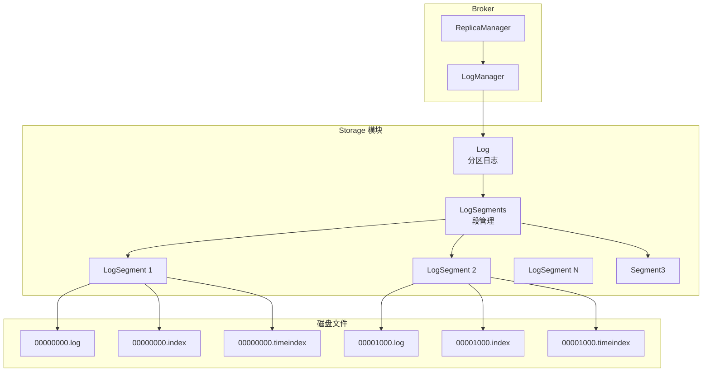

---

## 2. 模块架构

### 2.1 整体架构图

```mermaid
flowchart TB
    subgraph "Log 层"
        ULog[UnifiedLog<br/>统一日志]
        LocalLog[LocalLog<br/>本地日志]
        RemoteLog[RemoteLog<br/>远程日志]
        
        ULog --> LocalLog
        ULog --> RemoteLog
    end
    
    subgraph "LogSegments 管理"
        LS[LogSegments<br/>线程安全的段集合]
        Active[Active Segment<br/>活跃段]
        Inactive[Inactive Segments<br/>非活跃段]
        
        LS --> Active
        LS --> Inactive
    end
    
    LocalLog --> LS
    
    subgraph "LogSegment 层"
        Segment[LogSegment<br/>日志段]
        FR[FileRecords<br/>文件记录]
        OI[OffsetIndex<br/>偏移量索引]
        TI[TimeIndex<br/>时间戳索引]
        TxI[TransactionIndex<br/>事务索引]
        
        Segment --> FR
        Segment --> OI
        Segment --> TI
        Segment --> TxI
    end
    
    Active --> Segment
    Inactive --> Segment
    
    subgraph "索引结构"
        AbstractIndex[AbstractIndex<br/>索引抽象]
        OffsetIndex[OffsetIndex<br/>offset->position]
        TimeIndex[TimeIndex<br/>timestamp->offset]
        
        AbstractIndex <|-- OffsetIndex
        AbstractIndex <|-- TimeIndex
    end
    
    OI -.-> OffsetIndex
    TI -.-> TimeIndex
    
    subgraph "磁盘文件"
        LogFiles[.log 文件]
        IndexFiles[.index 文件]
        TimeIndexFiles[.timeindex 文件]
        TxnIndexFiles[.txnindex 文件]
    end
    
    FR --> LogFiles
    OffsetIndex --> IndexFiles
    TimeIndex --> TimeIndexFiles
    TxI --> TxnIndexFiles
```

### 2.2 核心组件说明

#### 2.2.1 UnifiedLog（统一日志）

**职责**：

- 管理一个分区的完整日志（本地 + 远程）
- 提供统一的读写接口
- 管理日志段的滚动（Roll）
- 管理日志清理策略
- 管理 LEO（Log End Offset）和 HW（High Watermark）

**核心类**：

- `UnifiedLog`：统一日志主类（Scala）
- `LocalLog`：本地日志部分
- `RemoteLog`：远程日志部分（可选）

**关键方法**：

```scala
// 追加消息
def appendAsLeader(records: MemoryRecords, ...): LogAppendInfo

// 读取消息
def read(startOffset: Long, maxLength: Int, ...): FetchDataInfo

// 滚动新段
def roll(expectedNextOffset: Option[Long]): LogSegment

// 删除过期段
def deleteOldSegments(): Int

// 恢复日志
def recover(): Unit
```

#### 2.2.2 LogSegments（段管理器）

**职责**：

- 管理一个分区的所有日志段
- 线程安全的段集合（基于 ConcurrentSkipListMap）
- 提供段的查找、添加、删除操作

**核心类**：

- `LogSegments`：段管理器

**关键数据结构**：

```java
// 按 baseOffset 排序的段集合
private final ConcurrentNavigableMap<Long, LogSegment> segments = new ConcurrentSkipListMap<>();
```

**关键方法**：

- `add(LogSegment segment)`：添加段
- `remove(long offset)`：移除段
- `higherSegment(long offset)`：查找大于给定偏移量的段
- `activeSegment()`：获取活跃段（最后一个段）

#### 2.2.3 LogSegment（日志段）

**职责**：

- 表示一个日志段（包含 .log, .index, .timeindex, .txnindex 文件）
- 提供消息追加、读取接口
- 维护索引（每 indexIntervalBytes 字节添加一个索引项）
- 管理段的元数据（baseOffset, maxTimestamp 等）

**核心类**：

- `LogSegment`

**关键字段**：

```java
private final FileRecords log;                      // .log 文件
private final LazyIndex<OffsetIndex> lazyOffsetIndex;  // .index 文件（懒加载）
private final LazyIndex<TimeIndex> lazyTimeIndex;      // .timeindex 文件（懒加载）
private final TransactionIndex txnIndex;               // .txnindex 文件
private final long baseOffset;                         // 段的基准偏移量
private final int indexIntervalBytes;                  // 索引间隔（默认 4KB）
```

**关键方法**：

```java
// 追加消息
public void append(long largestOffset, MemoryRecords records)

// 读取消息
public FetchDataInfo read(long startOffset, int maxSize)

// 刷盘
public void flush()

// 关闭段
public void close()
```

#### 2.2.4 OffsetIndex（偏移量索引）

**职责**：

- 将逻辑偏移量映射到物理文件位置
- 支持二分查找，快速定位消息
- 索引文件格式：`<offset: 4 bytes><position: 4 bytes>`

**核心类**：

- `OffsetIndex`

**索引结构**：

```
偏移量 -> 文件位置
----------------------------------------
100     -> 0       (baseOffset=100, position=0)
200     -> 5000
300     -> 10000
400     -> 15000
```

**关键方法**：

```java
// 追加索引项
public void append(long offset, int position)

// 查找偏移量对应的位置
public OffsetPosition lookup(long targetOffset)

// 截断索引
public void truncateTo(long offset)
```

**查找示例**：
假设要查找 offset=250 的消息：

1. 二分查找索引，找到 `offset=200 -> position=5000` 和 `offset=300 -> position=10000`
2. 从 position=5000 开始顺序扫描 .log 文件，找到 offset=250

#### 2.2.5 TimeIndex（时间戳索引）

**职责**：

- 将时间戳映射到偏移量
- 支持基于时间的消息查询（如 ListOffsetsRequest）
- 索引文件格式：`<timestamp: 8 bytes><offset: 4 bytes>`

**核心类**：

- `TimeIndex`

**索引结构**：

```
时间戳 -> 偏移量
----------------------------------------
1609459200000  -> 100
1609459260000  -> 200
1609459320000  -> 300
```

**关键方法**：

```java
// 追加索引项
public void maybeAppend(long timestamp, long offset)

// 查找时间戳对应的偏移量
public TimestampOffset lookup(long targetTimestamp)
```

#### 2.2.6 FileRecords（文件记录）

**职责**：

- 封装 .log 文件的读写操作
- 支持零拷贝读取（sendfile）
- 支持批量写入

**核心类**：

- `FileRecords`

**文件格式**：

- Kafka 消息格式（v0/v1/v2）
- v2 格式（当前使用）：RecordBatch 格式，支持压缩、事务、幂等性

**关键方法**：

```java
// 追加消息
public long append(MemoryRecords records)

// 读取消息
public FileLogInputStream.FileChannelRecordBatch read(long startOffset, int maxSize)

// 截断文件
public void truncateTo(long targetSize)

// 刷盘
public void flush()
```

---

## 3. 日志文件结构

### 3.1 目录结构

```
/var/kafka-logs/
  ├── topic1-0/                         # Topic: topic1, Partition: 0
  │   ├── 00000000000000000000.log      # 第1个段的日志文件
  │   ├── 00000000000000000000.index    # 第1个段的偏移量索引
  │   ├── 00000000000000000000.timeindex # 第1个段的时间戳索引
  │   ├── 00000000000000000000.txnindex  # 第1个段的事务索引
  │   ├── 00000000000000001000.log      # 第2个段的日志文件
  │   ├── 00000000000000001000.index
  │   ├── 00000000000000001000.timeindex
  │   ├── 00000000000000001000.txnindex
  │   ├── 00000000000000002000.log      # 第3个段（活跃段）
  │   ├── 00000000000000002000.index
  │   ├── 00000000000000002000.timeindex
  │   ├── 00000000000000002000.txnindex
  │   ├── leader-epoch-checkpoint       # Leader epoch 检查点
  │   ├── partition.metadata            # 分区元数据
  │   └── replication-offset-checkpoint # 副本偏移量检查点
  ├── topic1-1/
  └── topic2-0/
```

### 3.2 文件命名规则

**命名格式**：`<baseOffset>.<extension>`

- `baseOffset`：20 位数字，补零（如 `00000000000000001000`）
- `extension`：文件类型（log, index, timeindex, txnindex）

**示例**：

- `00000000000000001000.log`：baseOffset=1000 的日志段
- `00000000000000001000.index`：对应的偏移量索引
- `00000000000000001000.timeindex`：对应的时间戳索引

### 3.3 .log 文件格式（v2 消息格式）

```
RecordBatch 1:
  ┌─────────────────────────────────────────┐
  │ baseOffset: 8 bytes                     │ ← 批次的起始偏移量
  │ batchLength: 4 bytes                    │ ← 批次长度
  │ partitionLeaderEpoch: 4 bytes           │ ← Leader epoch
  │ magic: 1 byte (0x02)                    │ ← 消息格式版本
  │ crc: 4 bytes                            │ ← CRC 校验
  │ attributes: 2 bytes                     │ ← 压缩类型、事务标记等
  │ lastOffsetDelta: 4 bytes                │ ← 最后一条消息的偏移量增量
  │ firstTimestamp: 8 bytes                 │ ← 第一条消息的时间戳
  │ maxTimestamp: 8 bytes                   │ ← 最大时间戳
  │ producerId: 8 bytes                     │ ← Producer ID（幂等性/事务）
  │ producerEpoch: 2 bytes                  │ ← Producer Epoch
  │ baseSequence: 4 bytes                   │ ← 序列号基准
  │ records count: 4 bytes                  │ ← 批次中的消息数
  │ ┌─────────────────────────────────────┐ │
  │ │ Record 1:                           │ │
  │ │   length: varint                    │ │
  │ │   attributes: 1 byte                │ │
  │ │   timestampDelta: varint            │ │
  │ │   offsetDelta: varint               │ │
  │ │   keyLength: varint                 │ │
  │ │   key: bytes                        │ │
  │ │   valueLength: varint               │ │
  │   │   value: bytes                      │ │
  │ │   headers: varint + headers         │ │
  │ └─────────────────────────────────────┘ │
  │ Record 2:                               │
  │ ...                                     │
  └─────────────────────────────────────────┘

RecordBatch 2:
  ...
```

**关键字段说明**：

- `baseOffset`：批次的起始偏移量（绝对偏移量）
- `offsetDelta`：批次内消息的偏移量增量（相对偏移量）
- `timestampDelta`：批次内消息的时间戳增量
- `producerId` + `producerEpoch` + `baseSequence`：用于幂等性和事务

### 3.4 .index 文件格式（偏移量索引）

```
索引项 1: <relativeOffset: 4 bytes><position: 4 bytes>
索引项 2: <relativeOffset: 4 bytes><position: 4 bytes>
索引项 3: <relativeOffset: 4 bytes><position: 4 bytes>
...

示例（baseOffset=1000）：
  0   ->  0        (绝对偏移量 1000, 文件位置 0)
  100 ->  5000     (绝对偏移量 1100, 文件位置 5000)
  200 ->  10000    (绝对偏移量 1200, 文件位置 10000)
```

**关键点**：

- `relativeOffset`：相对于 baseOffset 的偏移量（节省空间）
- `position`：消息在 .log 文件中的物理位置（字节）
- 索引是稀疏的（默认每 4KB 一个索引项）

### 3.5 .timeindex 文件格式（时间戳索引）

```
索引项 1: <timestamp: 8 bytes><relativeOffset: 4 bytes>
索引项 2: <timestamp: 8 bytes><relativeOffset: 4 bytes>
索引项 3: <timestamp: 8 bytes><relativeOffset: 4 bytes>
...

示例（baseOffset=1000）：
  1609459200000  ->  0     (时间戳, 绝对偏移量 1000)
  1609459260000  ->  100   (时间戳, 绝对偏移量 1100)
  1609459320000  ->  200   (时间戳, 绝对偏移量 1200)
```

---

## 4. 日志写入流程

### 4.1 写入时序图

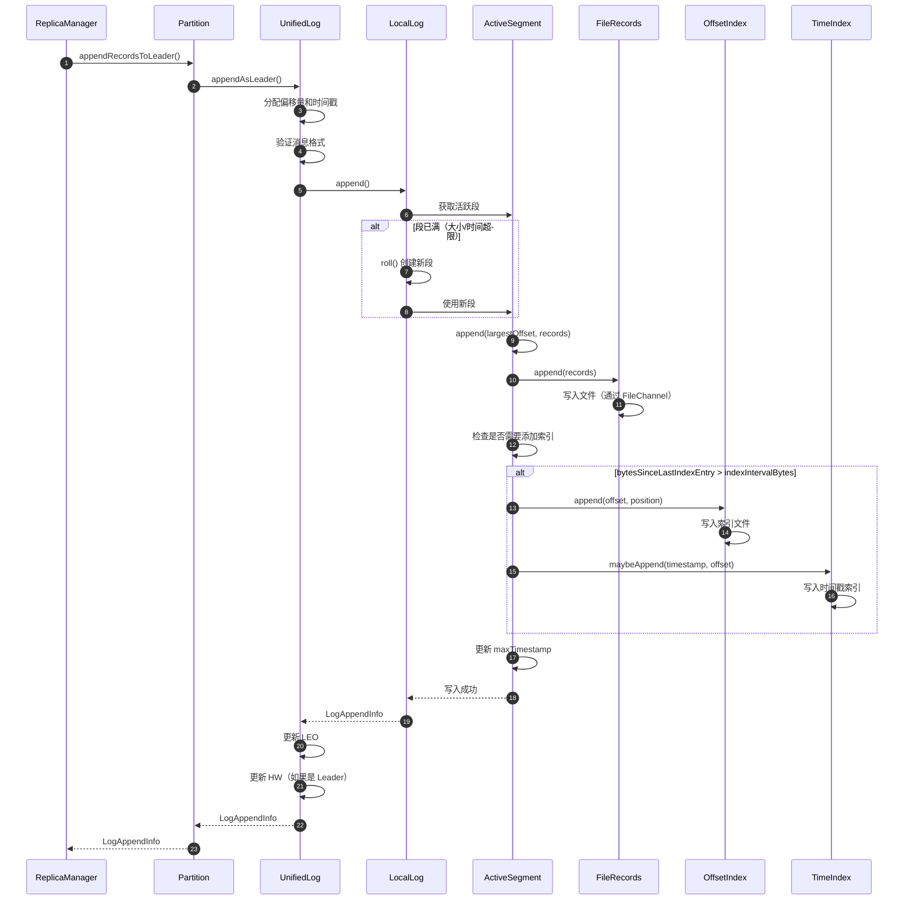

### 4.2 写入核心代码

#### UnifiedLog.appendAsLeader()

```scala
def appendAsLeader(records: MemoryRecords, leaderEpoch: Int, ...): LogAppendInfo = {
  // 1. 验证消息格式
  analyzeAndValidateRecords(records, ...)
  
  // 2. 分配偏移量
  val offset = localLog.logEndOffset
  
  // 3. 分配时间戳
  val now = time.milliseconds()
  val timestamp = records.batches().asScala.map(_.maxTimestamp).max
  
  // 4. 追加到本地日志
  val appendInfo = localLog.append(offset, records)
  
  // 5. 更新 LEO
  updateLogEndOffset(appendInfo.lastOffset + 1)
  
  // 6. 更新 HW（如果需要）
  maybeIncrementHighWatermark(...)
  
  appendInfo
}
```

#### LocalLog.append()

```scala
def append(offset: Long, records: MemoryRecords): Unit = {
  // 1. 获取活跃段
  val segment = segments.activeSegment
  
  // 2. 检查是否需要滚动新段
  if (segment.shouldRoll(...)) {
    val newSegment = roll(Some(offset))
    newSegment.append(offset, records)
  } else {
    segment.append(offset, records)
  }
}
```

#### LogSegment.append()

```java
public void append(long largestOffset, MemoryRecords records) throws IOException {
    if (records.sizeInBytes() > 0) {
        // 1. 记录当前文件位置
        int physicalPosition = log.sizeInBytes();
        
        // 2. 追加到 .log 文件
        long appendedBytes = log.append(records);
        
        // 3. 遍历批次，更新索引和时间戳
        for (RecordBatch batch : records.batches()) {
            long batchMaxTimestamp = batch.maxTimestamp();
            long batchLastOffset = batch.lastOffset();
            
            // 更新最大时间戳
            if (batchMaxTimestamp > maxTimestampSoFar()) {
                maxTimestampAndOffsetSoFar = new TimestampOffset(batchMaxTimestamp, batchLastOffset);
            }
            
            // 检查是否需要添加索引项
            if (bytesSinceLastIndexEntry > indexIntervalBytes) {
                offsetIndex().append(batchLastOffset, physicalPosition);
                timeIndex().maybeAppend(maxTimestampSoFar(), shallowOffsetOfMaxTimestampSoFar());
                bytesSinceLastIndexEntry = 0;
            }
            
            physicalPosition += batch.sizeInBytes();
            bytesSinceLastIndexEntry += batch.sizeInBytes();
        }
    }
}
```

### 4.3 写入关键点

**偏移量分配**：

- Leader 分配绝对偏移量（连续递增）
- 批次内使用相对偏移量（offsetDelta）

**索引更新**：

- 默认每 4KB（indexIntervalBytes）添加一个索引项
- 索引是稀疏的，查找时需要顺序扫描 .log 文件

**刷盘策略**：

- 默认依赖操作系统页缓存（异步刷盘）
- 可配置同步刷盘：`log.flush.interval.messages` 或 `log.flush.interval.ms`
- 生产环境通常使用异步刷盘 + 副本机制保证持久性

---

## 5. 日志读取流程

### 5.1 读取时序图

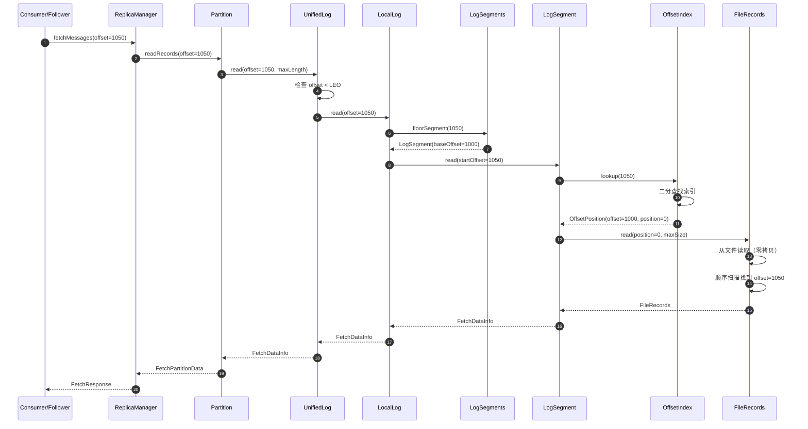

### 5.2 读取核心代码

#### UnifiedLog.read()

```scala
def read(startOffset: Long, maxLength: Int, ...): FetchDataInfo = {
  // 1. 检查偏移量范围
  if (startOffset > localLog.logEndOffset) {
    throw new OffsetOutOfRangeException(...)
  }
  
  // 2. 从本地日志读取
  localLog.read(startOffset, maxLength, ...)
}
```

#### LocalLog.read()

```scala
def read(startOffset: Long, maxLength: Int, ...): FetchDataInfo = {
  // 1. 查找包含 startOffset 的段
  val segment = segments.floorSegment(startOffset).getOrElse {
    throw new OffsetOutOfRangeException(...)
  }
  
  // 2. 从段中读取
  segment.read(startOffset, maxLength)
}
```

#### LogSegment.read()

```java
public FetchDataInfo read(long startOffset, int maxSize) throws IOException {
    // 1. 通过 OffsetIndex 查找物理位置
    OffsetPosition startOffsetAndPosition = offsetIndex().lookup(startOffset);
    
    // 2. 从 .log 文件读取
    FileRecords fileRecords = log.slice(
        startOffsetAndPosition.position,
        maxSize
    );
    
    // 3. 顺序扫描找到精确的 startOffset
    return new FetchDataInfo(
        new LogOffsetMetadata(startOffset, startOffsetAndPosition.position),
        fileRecords
    );
}
```

### 5.3 读取优化：零拷贝

**零拷贝（Zero-Copy）**：

```java
// FileRecords.writeTo()
public long writeTo(GatheringByteChannel channel, long position, int length) {
    // 使用 FileChannel.transferTo() 实现零拷贝
    return channel.transferFrom(fileChannel, position, length);
}
```

**优势**：

- 数据直接从文件传输到 Socket，不经过用户态
- 减少 CPU 使用率和内存拷贝
- 消费路径性能提升 2-3 倍

---

## 6. 日志滚动（Roll）

### 6.1 滚动触发条件

**条件 1：段大小超限**

- 段文件大小超过 `log.segment.bytes`（默认 1GB）

**条件 2：段时间超限**

- 段的第一条消息时间戳距今超过 `log.roll.ms`（默认 7 天）

**条件 3：索引已满**

- OffsetIndex 或 TimeIndex 文件已满（默认 10MB）

**条件 4：偏移量溢出**

- 相对偏移量超过 Int.MaxValue（约 21 亿）

### 6.2 滚动流程

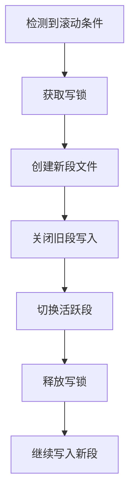

### 6.3 滚动核心代码

```scala
// LocalLog.roll()
def roll(expectedNextOffset: Option[Long]): LogSegment = {
  // 1. 计算新段的 baseOffset
  val newOffset = expectedNextOffset.getOrElse(logEndOffset)
  
  // 2. 创建新段文件
  val newSegment = LogSegment.open(
    dir = dir,
    baseOffset = newOffset,
    config = config,
    time = time,
    fileAlreadyExists = false,
    initFileSize = config.initFileSize,
    preallocate = config.preallocate
  )
  
  // 3. 添加到段集合
  segments.add(newSegment)
  
  // 4. 关闭旧活跃段的写入（flush）
  val previousSegment = segments.activeSegment
  previousSegment.flush()
  
  newSegment
}
```

---

## 7. 日志清理（Log Cleaning）

### 7.1 清理策略

#### 策略 1：基于时间删除（Delete）

**配置**：

- `log.retention.ms`：日志保留时间（默认 7 天）

**机制**：

- 删除段的最大时间戳早于 `now - log.retention.ms` 的段
- 保留至少一个段（即使已过期）

#### 策略 2：基于大小删除（Delete）

**配置**：

- `log.retention.bytes`：日志保留大小（默认 -1，不限制）

**机制**：

- 删除最旧的段，直到日志总大小 <= `log.retention.bytes`

#### 策略 3：日志压缩（Compact）

**配置**：

- `log.cleanup.policy=compact`

**机制**：

- 保留每个 key 的最新值
- 删除旧值（相同 key 的旧记录）
- 用于状态存储场景（如 Kafka Streams）

### 7.2 日志压缩（Log Compaction）

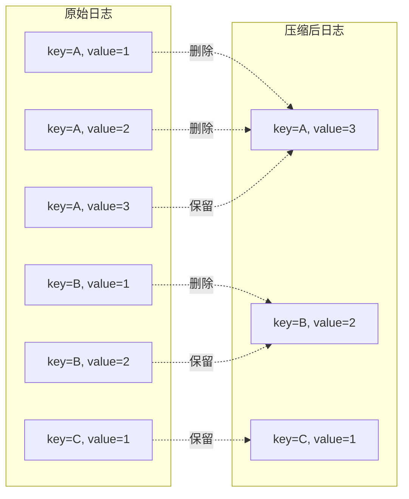

**压缩过程**：

1. LogCleaner 线程周期性扫描日志
2. 将日志分为两部分：
   - **Clean 部分**：已压缩的旧段
   - **Dirty 部分**：未压缩的新段
3. 压缩 Dirty 部分：
   - 扫描所有消息，构建 key -> 最新 offset 映射
   - 只保留最新 offset 的消息，删除旧消息
4. 合并 Clean 和 Dirty 部分

**配置参数**：

- `log.cleaner.min.cleanable.ratio`：Dirty 占比阈值（默认 0.5）
- `log.cleaner.min.compaction.lag.ms`：最小压缩延迟（默认 0）

### 7.3 清理核心代码

```scala
// LogCleaner.clean()
def clean(log: UnifiedLog): Unit = {
  // 1. 选择需要清理的段
  val (cleanableSegments, firstDirtyOffset) = log.cleanableSegments()
  
  if (cleanableSegments.nonEmpty) {
    // 2. 构建偏移量映射（key -> 最新 offset）
    val offsetMap = buildOffsetMap(cleanableSegments)
    
    // 3. 重写段，只保留最新值
    val cleanedSegments = cleanSegments(cleanableSegments, offsetMap, firstDirtyOffset)
    
    // 4. 替换旧段
    log.replaceSegments(cleanedSegments, cleanableSegments)
  }
}
```

---

## 8. 日志恢复（Log Recovery）

### 8.1 恢复触发场景

- Broker 正常启动
- Broker 异常关闭后重启
- 日志目录损坏后恢复

### 8.2 恢复流程

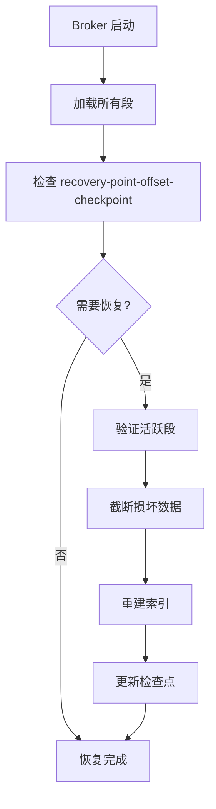

### 8.3 恢复核心代码

```scala
// UnifiedLog.recover()
def recover(): Unit = {
  // 1. 加载恢复点
  val recoveryPoint = loadRecoveryPoint()
  
  // 2. 找到需要恢复的段（活跃段）
  val segmentsToRecover = segments.activeSegment :: Nil
  
  // 3. 验证每个段
  segmentsToRecover.foreach { segment =>
    val validBytes = recoverSegment(segment)
    
    // 4. 截断损坏数据
    if (validBytes < segment.size) {
      segment.truncateTo(validBytes)
    }
  }
  
  // 5. 更新恢复点
  saveRecoveryPoint(localLog.logEndOffset)
}

def recoverSegment(segment: LogSegment): Int = {
  var validBytes = 0
  
  // 扫描段中的每个批次
  for (batch <- segment.log.batches) {
    // 验证 CRC
    if (batch.isValid) {
      validBytes += batch.sizeInBytes
    } else {
      // 发现损坏，停止扫描
      break
    }
  }
  
  validBytes
}
```

---

## 9. 性能优化要点

### 9.1 顺序写入

**设计理念**：

- 所有消息追加写入（Append-Only）
- 避免随机写入

**优势**：

- 顺序写性能接近内存速度（数百 MB/s）
- 充分利用磁盘预写（write-ahead）

### 9.2 批量写入

**机制**：

- Producer 批量发送消息（RecordBatch）
- Broker 批量写入日志段

**优势**：

- 减少磁盘 I/O 次数
- 减少索引更新次数

### 9.3 页缓存

**设计理念**：

- 依赖操作系统页缓存，不自己管理缓存
- 写入时先写页缓存，异步刷盘
- 读取时优先从页缓存读取

**优势**：

- 利用操作系统优化（预读、写合并）
- 热数据读取接近内存速度
- 减少 JVM 堆内存压力

### 9.4 索引优化

**稀疏索引**：

- 默认每 4KB 一个索引项
- 减少索引文件大小
- 查找时需要少量顺序扫描

**懒加载索引**：

- 索引文件按需加载到内存
- 减少启动时间和内存占用

---

## 10. 监控指标

### 10.1 日志指标

| 指标名称 | 类型 | 说明 |
|---------|------|------|
| `LogSize` | Gauge | 日志总大小（字节） |
| `NumLogSegments` | Gauge | 日志段数量 |
| `LogStartOffset` | Gauge | 日志起始偏移量 |
| `LogEndOffset` | Gauge | 日志结束偏移量（LEO） |
| `LogFlushRateAndTimeMs` | Timer | 刷盘速率和耗时 |

### 10.2 清理指标

| 指标名称 | 类型 | 说明 |
|---------|------|------|
| `CleanerRecopyPercent` | Gauge | 压缩时重新复制的比例 |
| `MaxDirtyPercent` | Gauge | 最大脏数据比例 |
| `CleanerRunTime` | Histogram | 清理运行时间 |

---

**文档生成时间**：2025-10-04  
**模块路径**：`storage/`  
**主要语言**：Java, Scala  
**关键类**：`UnifiedLog`, `LocalLog`, `LogSegment`, `LogSegments`, `OffsetIndex`, `TimeIndex`, `FileRecords`

---

## 数据结构

## 目录
- [LogSegment](#logsegment)
- [FileRecords](#filerecords)
- [OffsetIndex](#offsetindex)
- [TimeIndex](#timeindex)
- [LogAppendInfo](#logappendinfo)
- [RecordBatch](#recordbatch)

---

## LogSegment

### UML 类图

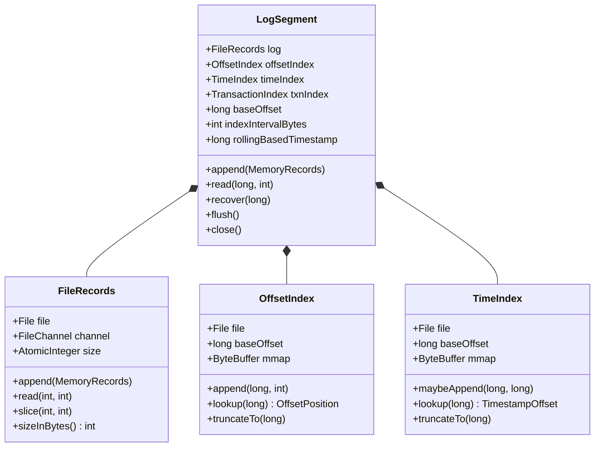

### 字段说明

| 字段 | 类型 | 说明 |
|------|------|------|
| log | FileRecords | 消息日志文件 |
| offsetIndex | OffsetIndex | 偏移量索引（offset → 物理位置） |
| timeIndex | TimeIndex | 时间索引（timestamp → offset） |
| txnIndex | TransactionIndex | 事务索引（事务 ID → offset） |
| baseOffset | long | Segment 起始偏移量 |
| indexIntervalBytes | int | 索引间隔（字节数，默认 4096） |
| rollingBasedTimestamp | long | Segment 滚动时间戳 |

### 文件命名

```
00000000000000000000.log       # 消息文件
00000000000000000000.index     # 偏移量索引
00000000000000000000.timeindex # 时间索引
00000000000000000000.txnindex  # 事务索引

# 文件名是 20 位的 baseOffset（左填充 0）
```

### 关键方法

**1. append**：追加消息

```java
public void append(
    long largestOffset,
    long largestTimestamp,
    long shallowOffsetOfMaxTimestamp,
    MemoryRecords records
) throws IOException {
    if (records.sizeInBytes() > 0) {
        // 写入消息
        int physicalPosition = log.sizeInBytes();
        log.append(records);
        
        // 更新索引
        bytesSinceLastIndexEntry += records.sizeInBytes();
        if (bytesSinceLastIndexEntry > indexIntervalBytes) {
            // 每隔 indexIntervalBytes 字节添加一个索引项
            offsetIndex.append(largestOffset, physicalPosition);
            timeIndex.maybeAppend(
                largestTimestamp,
                largestOffset
            );
            bytesSinceLastIndexEntry = 0;
        }
        
        // 更新最大时间戳
        maxTimestampSoFar = Math.max(maxTimestampSoFar, largestTimestamp);
        offsetOfMaxTimestampSoFar = shallowOffsetOfMaxTimestamp;
    }
}
```

**2. read**：读取消息

```java
public FetchDataInfo read(
    long startOffset,
    int maxSize
) throws IOException {
    if (maxSize < 0) {
        throw new IllegalArgumentException("Invalid max size " + maxSize);
    }
    
    // 查找物理位置
    OffsetPosition startOffsetPosition = translateOffset(startOffset);
    
    // 读取数据
    int startPosition = startOffsetPosition.position;
    int endPosition = Math.min(startPosition + maxSize, log.sizeInBytes());
    FileRecords records = log.slice(startPosition, endPosition - startPosition);
    
    return new FetchDataInfo(
        new LogOffsetMetadata(
            startOffset,
            this.baseOffset,
            startPosition
        ),
        records
    );
}

private OffsetPosition translateOffset(long offset) throws IOException {
    OffsetPosition mapping = offsetIndex.lookup(offset);
    
    // 二分查找精确位置
    return log.searchForOffsetWithSize(offset, Math.max(mapping.position, 0));
}
```

**3. recover**：恢复 Segment

```java
public int recover(
    long logStartOffset,
    long maxTimestampSoFar,
    ProducerStateManager producerStateManager
) throws IOException {
    // 清空索引
    offsetIndex.truncateTo(0);
    timeIndex.truncateTo(0);
    txnIndex.truncateTo(0);
    
    int validBytes = 0;
    long lastIndexEntry = baseOffset;
    maxTimestampSoFar = RecordBatch.NO_TIMESTAMP;
    
    try {
        // 重建索引
        for (RecordBatch batch : log.batches()) {
            batch.ensureValid();
            
            // 验证偏移量连续性
            if (batch.lastOffset() >= lastIndexEntry + indexIntervalBytes / log.averageRecordSize()) {
                offsetIndex.append(batch.lastOffset(), validBytes);
                timeIndex.maybeAppend(batch.maxTimestamp(), batch.lastOffset());
                lastIndexEntry = batch.lastOffset();
            }
            
            validBytes += batch.sizeInBytes();
            
            // 更新 ProducerState
            if (batch.hasProducerId()) {
                producerStateManager.update(batch);
            }
            
            // 更新最大时间戳
            if (batch.maxTimestamp() > maxTimestampSoFar) {
                maxTimestampSoFar = batch.maxTimestamp();
                offsetOfMaxTimestampSoFar = batch.lastOffset();
            }
        }
    } catch (CorruptRecordException e) {
        // 截断损坏的数据
        log.truncateTo(validBytes);
    }
    
    return validBytes;
}
```

---

## FileRecords

### UML 类图

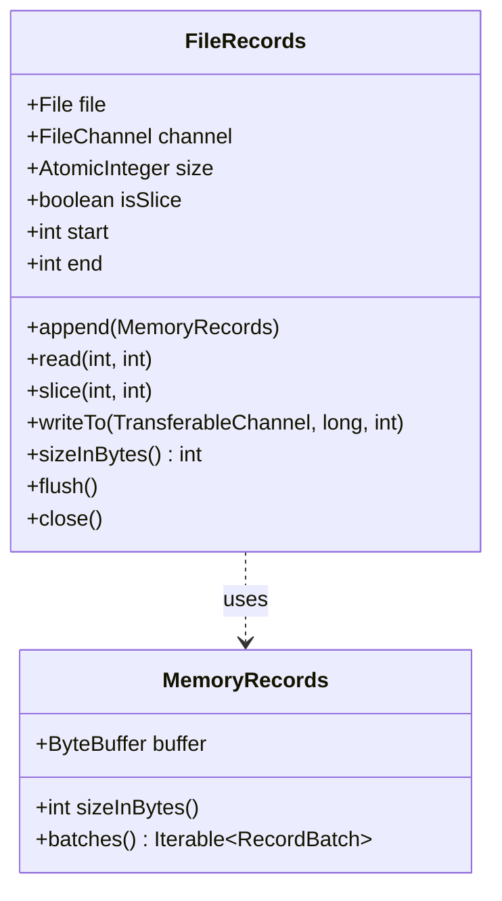

### 字段说明

| 字段 | 类型 | 说明 |
|------|------|------|
| file | File | 日志文件 |
| channel | FileChannel | 文件通道 |
| size | AtomicInteger | 文件大小（字节） |
| isSlice | boolean | 是否是切片（子视图） |
| start | int | 切片起始位置 |
| end | int | 切片结束位置 |

### 关键方法

**1. append**：追加数据

```java
public int append(MemoryRecords records) throws IOException {
    if (records.sizeInBytes() == 0) {
        return 0;
    }
    
    int written = records.writeFullyTo(channel);
    size.addAndGet(written);
    return written;
}
```

**2. slice**：创建切片

```java
public FileRecords slice(int position, int size) throws IOException {
    int availableBytes = this.size.get() - position;
    if (size > availableBytes) {
        throw new IllegalArgumentException(
            "Slice size " + size + " exceeds available bytes " + availableBytes
        );
    }
    
    return new FileRecords(
        file,
        channel,
        position,
        position + size,
        true  // isSlice
    );
}
```

**3. writeTo**：零拷贝传输

```java
public long writeTo(
    TransferableChannel destChannel,
    long position,
    int count
) throws IOException {
    long written = 0;
    while (written < count) {
        long transferred = channel.transferTo(
            start + position + written,
            count - written,
            destChannel
        );
        
        if (transferred == 0) {
            break;
        }
        
        written += transferred;
    }
    
    return written;
}
```

---

## OffsetIndex

### UML 类图

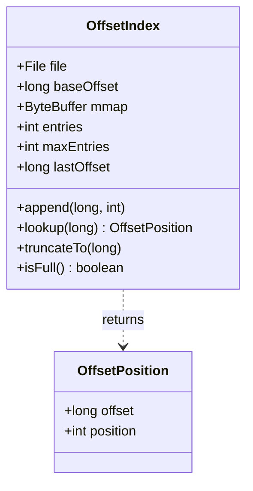

### 数据格式

```
每个索引项：8 字节
+-------------------+-------------------+
| Relative Offset   | Physical Position |
| (4 bytes)         | (4 bytes)         |
+-------------------+-------------------+
```

- **Relative Offset**：相对于 baseOffset 的偏移量（4 字节整数）
- **Physical Position**：消息在 .log 文件中的物理位置（字节偏移量）

### 字段说明

| 字段 | 类型 | 说明 |
|------|------|------|
| file | File | 索引文件 |
| baseOffset | long | Segment 起始偏移量 |
| mmap | ByteBuffer | 内存映射（mmap）缓冲区 |
| entries | int | 当前索引项数量 |
| maxEntries | int | 最大索引项数量 |
| lastOffset | long | 最后一个索引项的偏移量 |

### 关键方法

**1. append**：添加索引项

```java
public void append(long offset, int position) {
    if (isFull()) {
        throw new IllegalArgumentException("Index is full");
    }
    
    if (entries == 0) {
        baseOffset = offset;
    }
    
    // 计算相对偏移量
    long relativeOffset = offset - baseOffset;
    if (relativeOffset > Integer.MAX_VALUE) {
        throw new IllegalArgumentException(
            "Offset " + offset + " is too large relative to base " + baseOffset
        );
    }
    
    // 写入索引项（8 字节）
    mmap.putInt((int) relativeOffset);
    mmap.putInt(position);
    
    entries++;
    lastOffset = offset;
}
```

**2. lookup**：二分查找

```java
public OffsetPosition lookup(long targetOffset) {
    if (entries == 0) {
        return new OffsetPosition(baseOffset, 0);
    }
    
    // 二分查找第一个 >= targetOffset 的索引项
    int low = 0;
    int high = entries - 1;
    
    while (low < high) {
        int mid = (low + high + 1) / 2;
        long offset = relativeOffset(mid) + baseOffset;
        
        if (offset > targetOffset) {
            high = mid - 1;
        } else {
            low = mid;
        }
    }
    
    return parseEntry(low);
}

private long relativeOffset(int index) {
    return mmap.getInt(index * 8);
}

private OffsetPosition parseEntry(int index) {
    long relativeOffset = mmap.getInt(index * 8);
    int position = mmap.getInt(index * 8 + 4);
    return new OffsetPosition(baseOffset + relativeOffset, position);
}
```

---

## TimeIndex

### UML 类图

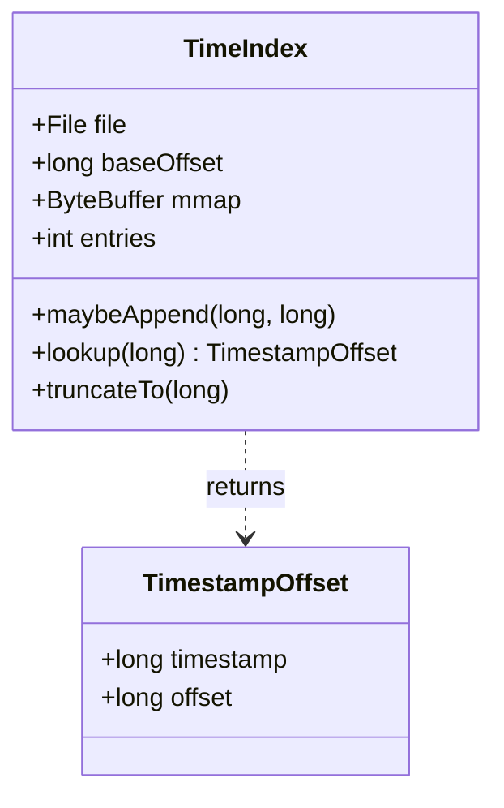

### 数据格式

```
每个索引项：12 字节
+-------------------+-------------------+
| Timestamp         | Relative Offset   |
| (8 bytes)         | (4 bytes)         |
+-------------------+-------------------+
```

### 关键方法

**1. maybeAppend**：添加索引项

```java
public void maybeAppend(long timestamp, long offset) {
    if (isFull()) {
        return;
    }
    
    // 只有时间戳递增才添加
    if (entries == 0 || timestamp > lastTimestamp()) {
        mmap.putLong(timestamp);
        mmap.putInt((int) (offset - baseOffset));
        entries++;
    }
}
```

**2. lookup**：查找时间戳对应的偏移量

```java
public TimestampOffset lookup(long targetTimestamp) {
    if (entries == 0) {
        return new TimestampOffset(-1, baseOffset);
    }
    
    // 二分查找第一个 >= targetTimestamp 的索引项
    int low = 0;
    int high = entries - 1;
    
    while (low < high) {
        int mid = (low + high + 1) / 2;
        long timestamp = timestampAt(mid);
        
        if (timestamp > targetTimestamp) {
            high = mid - 1;
        } else {
            low = mid;
        }
    }
    
    return parseEntry(low);
}

private long timestampAt(int index) {
    return mmap.getLong(index * 12);
}

private TimestampOffset parseEntry(int index) {
    long timestamp = mmap.getLong(index * 12);
    long relativeOffset = mmap.getInt(index * 12 + 8);
    return new TimestampOffset(timestamp, baseOffset + relativeOffset);
}
```

---

## LogAppendInfo

### UML 类图

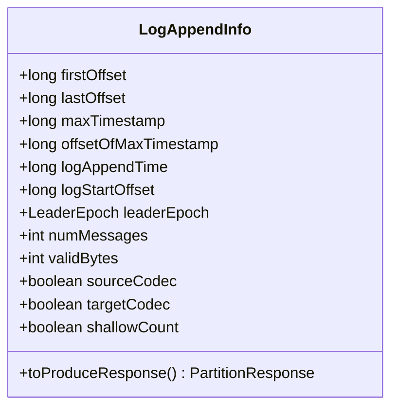

### 字段说明

| 字段 | 类型 | 说明 |
|------|------|------|
| firstOffset | long | 第一条消息的偏移量 |
| lastOffset | long | 最后一条消息的偏移量 |
| maxTimestamp | long | 批次中的最大时间戳 |
| offsetOfMaxTimestamp | long | 最大时间戳对应的偏移量 |
| logAppendTime | long | 日志追加时间 |
| logStartOffset | long | 日志起始偏移量 |
| leaderEpoch | LeaderEpoch | Leader Epoch |
| numMessages | int | 消息数量 |
| validBytes | int | 有效字节数 |
| sourceCodec | boolean | 源压缩编码 |
| targetCodec | boolean | 目标压缩编码 |
| shallowCount | int | 顶层批次数量 |

---

## RecordBatch

### UML 类图

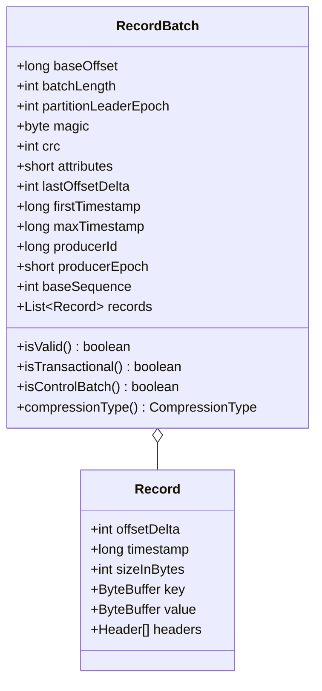

### RecordBatch 格式（v2）

```
+----------------+----------------+
| Base Offset    | (8 bytes)      |
+----------------+----------------+
| Batch Length   | (4 bytes)      |
+----------------+----------------+
| Partition      | (4 bytes)      |
| Leader Epoch   |                |
+----------------+----------------+
| Magic          | (1 byte)       |
+----------------+----------------+
| CRC            | (4 bytes)      |
+----------------+----------------+
| Attributes     | (2 bytes)      |
+----------------+----------------+
| Last Offset    | (4 bytes)      |
| Delta          |                |
+----------------+----------------+
| First          | (8 bytes)      |
| Timestamp      |                |
+----------------+----------------+
| Max Timestamp  | (8 bytes)      |
+----------------+----------------+
| Producer ID    | (8 bytes)      |
+----------------+----------------+
| Producer Epoch | (2 bytes)      |
+----------------+----------------+
| Base Sequence  | (4 bytes)      |
+----------------+----------------+
| Records Count  | (4 bytes)      |
+----------------+----------------+
| Records        | (variable)     |
+----------------+----------------+
```

### Attributes 位掩码

```
Bit 0-2: Compression Type
  0: None
  1: GZIP
  2: Snappy
  3: LZ4
  4: ZSTD

Bit 3: Timestamp Type
  0: CreateTime
  1: LogAppendTime

Bit 4: Is Transactional
  1: Yes

Bit 5: Is Control Batch
  1: Yes (Transaction Marker)

Bit 6-15: Reserved
```

---

## 总结

本文档详细描述了 Kafka Storage 模块的核心数据结构：

1. **LogSegment**：日志段
   - 包含消息文件和三种索引
   - 支持高效的追加、读取、恢复

2. **FileRecords**：文件记录
   - 基于 FileChannel 的日志文件
   - 支持零拷贝传输

3. **OffsetIndex / TimeIndex**：索引结构
   - 基于 mmap 的高性能索引
   - 稀疏索引设计（4KB 间隔）
   - 二分查找算法

4. **LogAppendInfo**：追加信息
   - 记录追加结果的元数据

5. **RecordBatch**：消息批次
   - v2 格式（支持事务、幂等性）
   - 压缩、时间戳、Producer ID 等属性

每个数据结构都包含：

- UML 类图
- 数据格式说明
- 完整字段描述
- 核心算法实现

---

## 时序图

## 目录
- [Kafka-04-Storage-时序图](#kafka-04-storage-时序图)
  - [目录](#目录)
  - [日志追加流程](#日志追加流程)
    - [时序图](#时序图)
    - [流程说明](#流程说明)
  - [日志读取流程](#日志读取流程)
    - [时序图](#时序图-1)
    - [流程说明](#流程说明-1)
  - [日志滚动流程](#日志滚动流程)
    - [时序图](#时序图-2)
    - [流程说明](#流程说明-2)
  - [日志恢复流程](#日志恢复流程)
    - [时序图](#时序图-3)
    - [流程说明](#流程说明-3)
  - [日志清理流程 (Delete)](#日志清理流程-delete)
    - [时序图](#时序图-4)
    - [流程说明](#流程说明-4)
  - [日志压缩流程 (Compact)](#日志压缩流程-compact)
    - [时序图](#时序图-5)
    - [流程说明](#流程说明-5)
  - [总结](#总结)

---

## 日志追加流程

### 时序图

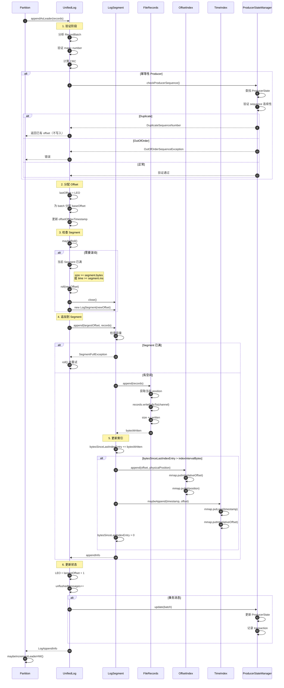

### 流程说明

**阶段 1：验证**

- 验证 RecordBatch 格式
- 计算并验证 CRC
- 幂等性 Producer：验证 sequence number 连续性

**阶段 2：分配 Offset**

- 从当前 LEO 开始分配
- 为 batch 中的每条消息分配唯一 offset

**阶段 3：检查 Segment**

- 检查当前 Segment 是否需要滚动
- 滚动条件：
  - 大小超过 `segment.bytes`
  - 时间超过 `segment.ms`
  - 索引已满

**阶段 4：追加到 Segment**

- 写入 FileRecords（磁盘）
- 默认不立即 fsync（依赖 OS 页缓存）

**阶段 5：更新索引**

- 每隔 `index.interval.bytes`（默认 4KB）添加一个索引项
- 稀疏索引设计，节省空间

**阶段 6：更新状态**

- 更新 LEO
- 更新 ProducerState（幂等性/事务）
- 更新 unflushedMessages 计数

---

## 日志读取流程

### 时序图

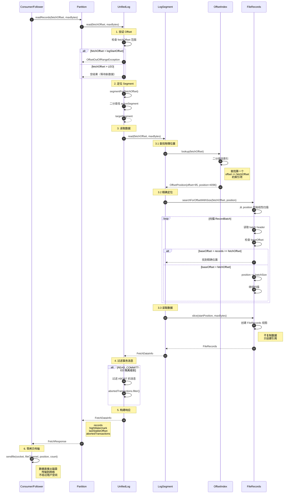

### 流程说明

**阶段 1：验证 Offset**

- 检查 fetchOffset 是否在 [logStartOffset, LEO] 范围内
- 越界返回 OffsetOutOfRangeException

**阶段 2：定位 Segment**

- 二分查找包含 fetchOffset 的 Segment
- activeSegments 按 baseOffset 排序

**阶段 3：读取数据**

**3.1 查找物理位置**

- 在 OffsetIndex 中二分查找
- 找到 <= fetchOffset 的最大索引项
- 获取物理位置（position）

**3.2 精确定位**

- 从索引指向的位置开始线性扫描
- 找到 baseOffset + records = fetchOffset 的 batch

**3.3 读取数据**

- 创建 FileRecords 切片（不复制数据）
- 准备零拷贝传输

**阶段 4：过滤事务消息**

- READ_COMMITTED 隔离级别下，过滤未提交/已中止的消息
- 使用 AbortedTransaction 索引

**阶段 5：构建响应**

- 包含 records、highWatermark、lastStableOffset

**阶段 6：零拷贝传输**

- 使用 sendfile 系统调用
- 数据直接从磁盘到网络，性能极高

---

## 日志滚动流程

### 时序图

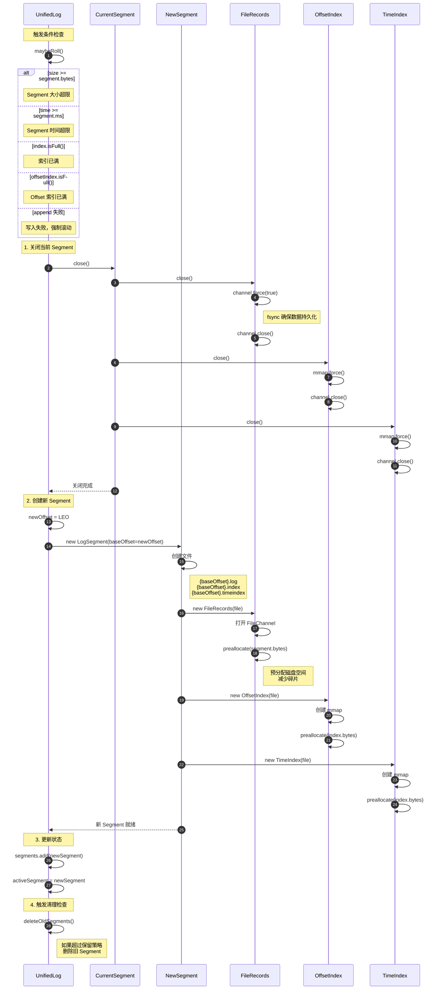

### 流程说明

**触发条件**

1. **大小限制**：Segment 大小 >= `segment.bytes`（默认 1GB）
2. **时间限制**：Segment 时间 >= `segment.ms`（默认 7 天）
3. **索引已满**：索引文件达到最大大小
4. **写入失败**：强制滚动

**阶段 1：关闭当前 Segment**

- 关闭 FileRecords（fsync）
- 关闭所有索引（force mmap）
- 确保数据持久化

**阶段 2：创建新 Segment**

- 文件命名：`{baseOffset}.log/index/timeindex`
- 预分配磁盘空间（减少碎片）
- 创建 mmap 映射

**阶段 3：更新状态**

- 将新 Segment 加入 activeSegments
- 更新 activeSegment 指针

**阶段 4：触发清理**

- 检查是否需要删除旧 Segment
- 根据保留策略（时间/大小）

---

## 日志恢复流程

### 时序图

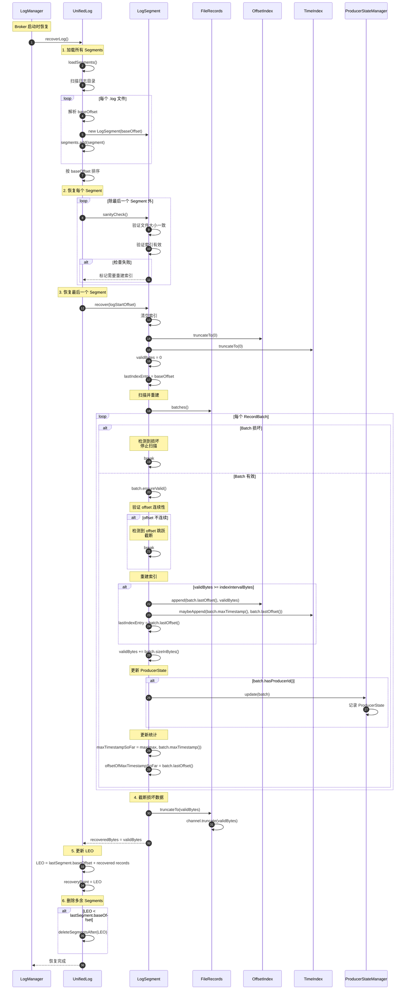

### 流程说明

**触发时机**

- Broker 启动时
- 日志目录未正常关闭

**阶段 1：加载 Segments**

- 扫描日志目录
- 解析 .log 文件名获取 baseOffset
- 构建 LogSegment 对象

**阶段 2：验证 Segments**

- 验证除最后一个外的所有 Segment
- 检查文件大小、索引有效性

**阶段 3：恢复最后一个 Segment**

- 清空索引
- 扫描所有 RecordBatch
- 验证每个 batch：
  - CRC 校验
  - Offset 连续性
  - Magic number
- 重建索引
- 更新 ProducerState

**阶段 4：截断损坏数据**

- 发现损坏的 batch 时停止
- 截断文件到最后一个有效位置

**阶段 5：更新 LEO**

- 根据恢复的数据更新 LEO
- 设置 recoveryPoint

**阶段 6：删除多余 Segments**

- 如果 LEO < lastSegment.baseOffset
- 删除多余的 Segment 文件

---

## 日志清理流程 (Delete)

### 时序图

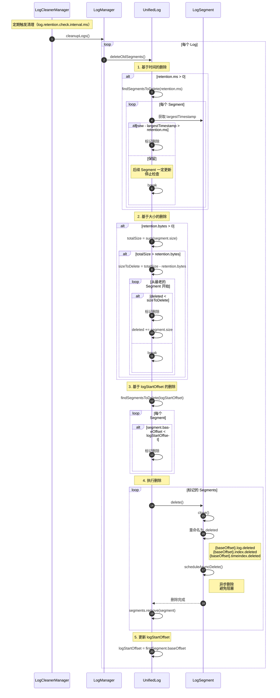

### 流程说明

**触发条件**

- 定期检查（默认 5 分钟）
- 手动触发

**删除策略**

**1. 基于时间**

- `log.retention.ms`（默认 7 天）
- 检查 Segment 的 `largestTimestamp`
- 删除超过保留时间的 Segment

**2. 基于大小**

- `log.retention.bytes`
- 计算所有 Segment 总大小
- 从最老的 Segment 开始删除，直到满足大小限制

**3. 基于 logStartOffset**

- 删除 baseOffset < logStartOffset 的 Segment
- 用于手动删除旧数据

**删除过程**

1. **关闭 Segment**：关闭文件句柄
2. **重命名**：添加 `.deleted` 后缀
3. **异步删除**：后台线程删除物理文件
4. **更新状态**：从 segments 列表移除

**注意事项**

- 至少保留一个 Segment
- 不删除 activeSegment
- 异步删除避免阻塞主线程

---

## 日志压缩流程 (Compact)

### 时序图

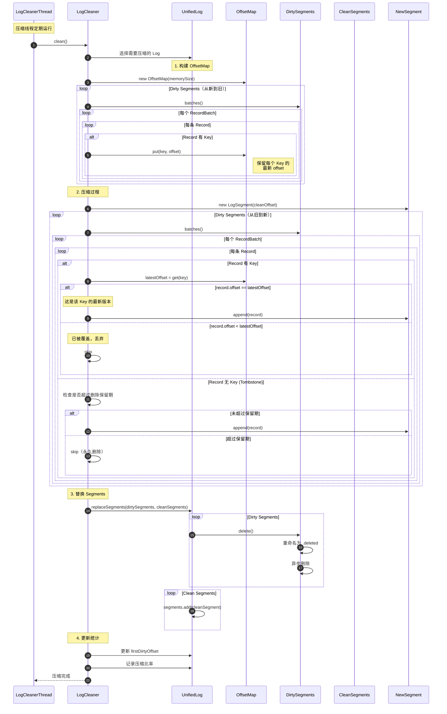

### 流程说明

**适用场景**

- Topic 配置 `cleanup.policy=compact`
- 每个 Key 只保留最新值
- 适用于状态存储（如 Changelog）

**阶段 1：构建 OffsetMap**

- 扫描所有 Dirty Segments
- 记录每个 Key 的最新 offset
- OffsetMap：Key → Latest Offset

**阶段 2：压缩过程**

- 从旧到新扫描 Dirty Segments
- 对于每条记录：
  - 有 Key：检查是否是最新版本
  - 最新版本：保留
  - 旧版本：丢弃
  - Tombstone（null value）：
    - 未超过删除保留期：保留
    - 超过删除保留期：永久删除

**阶段 3：替换 Segments**

- 删除 Dirty Segments
- 添加 Clean Segments

**Tombstone 处理**

- Tombstone：Key 存在但 Value 为 null
- 用于标记删除
- 保留一段时间（`delete.retention.ms`，默认 24 小时）
- 确保所有 Consumer 都能看到删除标记

**性能优化**

- OffsetMap 使用内存映射
- 压缩在后台线程执行
- 不影响读写性能

---

## 总结

本文档提供了 Kafka Storage 模块的完整时序图，涵盖：

1. **日志追加流程**：从验证到写入的完整过程
2. **日志读取流程**：索引查找、精确定位、零拷贝传输
3. **日志滚动流程**：Segment 切换机制
4. **日志恢复流程**：Broker 启动时的恢复过程
5. **日志清理流程（Delete）**：基于时间/大小的删除
6. **日志压缩流程（Compact）**：保留每个 Key 的最新值

每个时序图都包含：

- 完整的参与者
- 详细的步骤编号
- 关键决策点
- 性能优化要点
- 详细的文字说明

这些时序图帮助理解 Kafka 存储引擎的核心机制和设计哲学。

---
