# Kafka-05-Raft

## 模块概览

## 目录
- [模块职责](#模块职责)
- [模块级架构图](#模块级架构图)
- [核心组件](#核心组件)
- [状态机](#状态机)
- [Leader 选举流程](#leader-选举流程)
- [日志复制流程](#日志复制流程)
- [关键设计](#关键设计)
- [性能优化](#性能优化)

---

## 模块职责

**Raft 模块**实现了 Kafka 的共识协议（KRaft - Kafka Raft），负责元数据的一致性复制和 Leader 选举。

**主要职责**：

1. **Leader 选举**：在 Controller 节点间选举唯一 Leader
2. **日志复制**：将元数据变更同步到 Quorum 多数派
3. **一致性保证**：确保元数据在集群内的强一致性
4. **状态管理**：维护节点状态（Leader/Follower/Candidate 等）
5. **高可用**：Leader 故障时自动选举新 Leader

---

## 模块级架构图

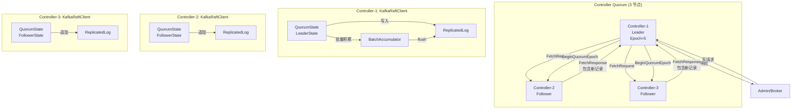

### 架构说明

**Controller Quorum**：

- 3 或 5 个 Controller 节点组成 Quorum（仲裁组）
- 同一时刻只有一个 Leader，其余为 Followers
- Leader 负责处理写请求并复制到 Followers

**KafkaRaftClient**：

- 每个 Controller 运行一个 KafkaRaftClient 实例
- 管理节点状态（Leader/Follower/Candidate）
- 负责选举和日志复制

**QuorumState**：

- 维护当前节点的 Raft 状态
- 管理状态转换逻辑

**ReplicatedLog**：

- 持久化 Raft 日志
- 提供日志读写接口

**BatchAccumulator**（仅 Leader）：

- 批量积累写请求
- 减少磁盘 I/O 和网络开销

---

## 核心组件

### KafkaRaftClient

Kafka Raft 协议的核心实现类。

```java
public final class KafkaRaftClient<T> implements RaftClient<T> {
    private final OptionalInt nodeId;
    private final NetworkChannel channel;
    private final ReplicatedLog log;
    private final RecordSerde<T> serde;
    
    private QuorumState quorum;
    private final FuturePurgatory<Long> appendPurgatory;  // Leader 等待多数派确认
    private final FuturePurgatory<Long> fetchPurgatory;   // Follower 等待新数据
    
    public void poll() {
        long currentTimeMs = time.milliseconds();
        
        // 1. 处理当前状态（选举/复制/心跳）
        pollCurrentState(currentTimeMs);
        
        // 2. 处理入站消息（Vote/Fetch/BeginQuorumEpoch 等）
        RaftMessage message = messageQueue.poll(pollTimeoutMs);
        if (message != null) {
            handleInboundMessage(message, currentTimeMs);
        }
    }
    
    // Leader 追加记录
    private long append(int epoch, List<T> records) {
        LeaderState<T> state = quorum.leaderStateOrThrow();
        
        // 追加到本地 Log
        LogAppendInfo info = log.appendAsLeader(memoryRecords, epoch);
        
        // 注册 Future 等待多数派确认
        CompletableFuture<Long> future = appendPurgatory.await(
            info.lastOffset(),
            maxRecords
        );
        
        return info.lastOffset();
    }
}
```

### QuorumState

管理节点的 Raft 状态。

```java
public class QuorumState {
    private volatile EpochState state;  // 当前状态
    
    private final int electionTimeoutMs;   // 选举超时
    private final int fetchTimeoutMs;      // Fetch 超时
    
    // 状态转换方法
    public void transitionToProspective();      // 转换到 Prospective（预选举）
    public void transitionToCandidate();        // 转换到 Candidate（候选者）
    public void transitionToLeader();           // 转换到 Leader
    public void transitionToFollower();         // 转换到 Follower
    public void transitionToUnattached();       // 转换到 Unattached（游离）
    public void transitionToResigned();         // 转换到 Resigned（辞职）
    
    // 状态查询
    public boolean isLeader();
    public boolean isCandidate();
    public boolean isFollower();
}
```

### LeaderState

Leader 状态管理。

```java
public class LeaderState<T> implements EpochState {
    private final int epoch;                      // 当前 Epoch
    private final long epochStartOffset;          // Epoch 起始 Offset
    
    private Optional<LogOffsetMetadata> highWatermark;  // High Watermark
    private Map<Integer, ReplicaState> voterStates;     // Voter 状态
    private Map<ReplicaKey, ReplicaState> observerStates;  // Observer 状态
    
    private final BatchAccumulator<T> accumulator;  // 批量累积器
    private final Timer checkQuorumTimer;           // Quorum 检查定时器
    
    // 更新 High Watermark
    public boolean updateHighWatermark() {
        // 计算多数派的最小 fetchedOffset
        long newHighWatermark = calculateMinimumFetchedOffset();
        
        if (newHighWatermark > highWatermark.offset) {
            highWatermark = Optional.of(new LogOffsetMetadata(newHighWatermark));
            
            // 唤醒等待的 Append Futures
            appendPurgatory.completeAllMatching(
                offset -> offset <= newHighWatermark
            );
            
            return true;
        }
        return false;
    }
}
```

---

## 状态机

Kafka Raft 定义了 6 种节点状态。

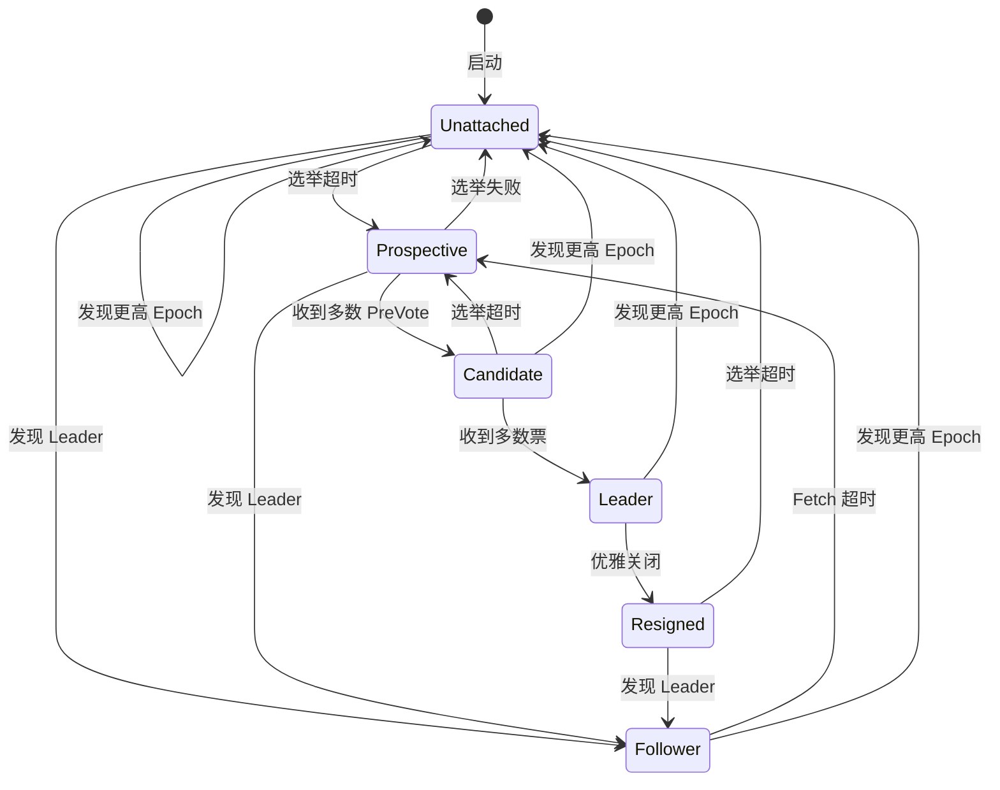

### 状态说明

**Unattached（游离）**：

- 节点未加入任何 Epoch
- 初始状态或退出旧 Epoch 后的状态

**Prospective（预候选者）**：

- 选举超时后进入 Prospective
- 发送 PreVote 请求（不增加 Epoch）
- 收到多数 PreVote 后转为 Candidate

**Candidate（候选者）**：

- 增加 Epoch 并发送 Vote 请求
- 收到多数票后成为 Leader
- 选举超时或失败后返回 Prospective

**Leader（领导者）**：

- 唯一的写入节点
- 复制日志到 Followers
- 定期发送心跳（通过 FetchResponse）

**Follower（跟随者）**：

- 从 Leader 拉取日志
- Fetch 超时后触发选举

**Resigned（辞职）**：

- Leader 优雅关闭时进入
- 发送 EndQuorumEpoch 通知 Followers

---

## Leader 选举流程

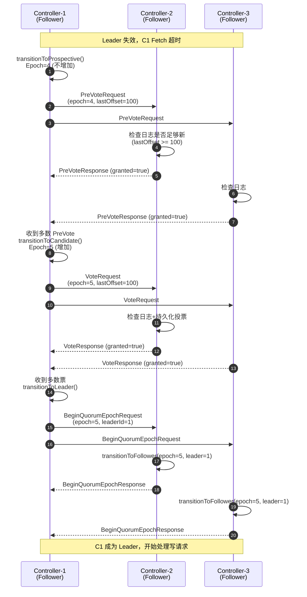

### 选举关键点

**PreVote 机制**：

- 避免无效的 Epoch 增加
- 先进行预选举，确认能够赢得选举后再真正开始选举

**日志完整性检查**：

```java
private boolean handleVoteRequest(VoteRequest request) {
    int candidateEpoch = request.candidateEpoch();
    long candidateLastOffset = request.lastOffset();
    
    // 检查候选者日志是否至少和本节点一样新
    if (candidateEpoch > log.lastFetchedEpoch()) {
        return true;  // 候选者 Epoch 更大，授予投票
    } else if (candidateEpoch == log.lastFetchedEpoch() &&
               candidateLastOffset >= log.endOffset().offset()) {
        return true;  // 相同 Epoch，候选者 Offset >= 本节点
    } else {
        return false;  // 候选者日志不够新，拒绝投票
    }
}
```

**投票持久化**：

- 每个节点在一个 Epoch 内只能投一票
- 投票信息持久化到 `quorum-state` 文件

---

## 日志复制流程

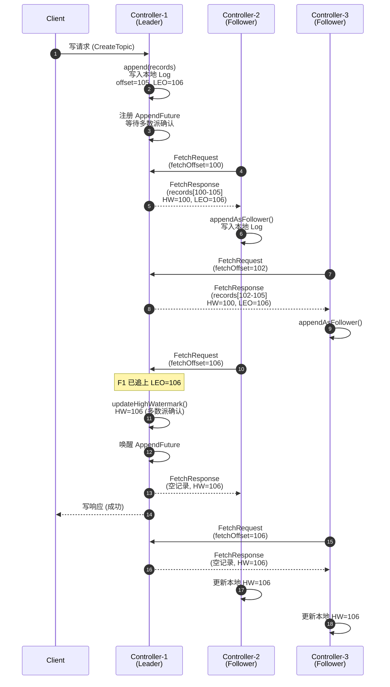

### 复制关键点

**Log End Offset (LEO)**：

- Leader 写入后立即更新 LEO
- Followers 追加日志后更新本地 LEO

**High Watermark (HW)**：

- 多数派已确认的最大 Offset
- 只有 HW 之前的记录对客户端可见

**计算 High Watermark**：

```java
private long calculateHighWatermark(LeaderState state) {
    List<Long> fetchedOffsets = new ArrayList<>();
    
    // 加入 Leader 自己的 LEO
    fetchedOffsets.add(log.endOffset().offset());
    
    // 收集所有 Voters 的 fetchedOffset
    for (ReplicaState replica : state.voterStates().values()) {
        fetchedOffsets.add(replica.fetchedOffset());
    }
    
    // 排序并取中位数（多数派的最小值）
    Collections.sort(fetchedOffsets);
    int quorumSize = (fetchedOffsets.size() / 2) + 1;
    return fetchedOffsets.get(quorumSize - 1);
}
```

**Fetch-driven 复制**：

- Followers 主动拉取，而非 Leader 推送
- Followers 控制拉取速率
- 简化 Leader 实现

---

## 关键设计

### 1. Fetch-driven 复制

**与标准 Raft 的区别**：

- 标准 Raft：Leader 主动推送 AppendEntries
- Kafka Raft：Followers 主动拉取 Fetch

**优势**：

- Leader 无需跟踪每个 Follower 的状态
- Followers 可以控制拉取速率（背压）
- 复用 Kafka 的 Fetch 协议

### 2. BeginQuorumEpoch

**目的**：

- 通知 Followers 新 Leader 已选出
- 标准 Raft 通过空 AppendEntries 实现，但 Kafka 是 Fetch-driven

**流程**：

```java
// Leader 成为 Leader 后
private void onBecomeLeader(long currentTimeMs) {
    // 向所有 Voters 发送 BeginQuorumEpoch
    for (ReplicaState replica : leaderState.voterStates().values()) {
        if (!replica.hasAcknowledgedLeader()) {
            sendBeginQuorumEpoch(replica.replicaKey());
        }
    }
}
```

### 3. Snapshot 支持

**触发时机**：

- Follower LEO < Leader Log Start Offset
- 日志太旧，已被清理

**流程**：

1. Leader 返回 FetchResponse 包含 Snapshot ID
2. Follower 发送 FetchSnapshotRequest
3. Leader 返回 Snapshot 数据
4. Follower 加载 Snapshot 并更新状态

### 4. Check Quorum

**目的**：

- Leader 定期检查是否仍有多数派支持
- 避免网络分区导致的脑裂

**实现**：

```java
private boolean checkQuorum(LeaderState state, long currentTimeMs) {
    Set<Integer> fetchedVoters = state.fetchedVoters();
    
    // 检查在 checkQuorumTimeout 内有多少 Voters Fetch 过
    int requiredQuorum = (voterStates.size() / 2) + 1;
    
    if (fetchedVoters.size() < requiredQuorum) {
        log.warn("Leader {} lost quorum, resigning", nodeId);
        transitionToResigned();
        return false;
    }
    
    return true;
}
```

---

## 性能优化

### 1. 批量写入

```java
public class BatchAccumulator<T> {
    private final int lingerMs;           // 批量延迟
    private final int maxBatchSizeBytes;  // 最大批量大小
    
    public void append(T record) {
        // 追加到当前批次
        currentBatch.add(record);
        
        // 批次满或超时后 flush
        if (currentBatch.sizeInBytes() >= maxBatchSizeBytes ||
            currentBatch.ageMs() >= lingerMs) {
            flush();
        }
    }
}
```

### 2. Pipelined Fetch

- Followers 无需等待上一次 Fetch 响应
- 可以发送多个并发 Fetch 请求
- 提高日志复制吞吐量

### 3. 零拷贝日志复制

```java
// Followers Fetch 时，Leader 直接发送 FileRecords
FetchResponse response = new FetchResponse();
response.setRecords(log.read(fetchOffset, maxBytes).records());
```

### 4. 异步 Append

```java
CompletableFuture<Long> future = appendPurgatory.await(offset, maxWaitMs);

future.thenAccept(committedOffset -> {
    // 异步处理提交后的逻辑
});
```

---

## 总结

**Kafka Raft (KRaft) 的核心价值**：

1. **去除 ZooKeeper 依赖**：
   - 简化部署和运维
   - 减少外部依赖

2. **强一致性**：
   - Raft 协议保证元数据一致性
   - 多数派确认保证持久化

3. **高可用**：
   - 自动 Leader 选举
   - 容忍少数派故障

4. **高性能**：
   - 批量写入减少 I/O
   - Fetch-driven 复制简化 Leader 逻辑
   - 零拷贝优化

5. **可扩展**：
   - 支持动态增减 Voter（未来）
   - Snapshot 机制支持大规模元数据

**最佳实践**：

1. **Quorum 大小**：推荐 3 或 5 个 Controller
2. **硬件配置**：使用 SSD 以降低日志写入延迟
3. **网络配置**：低延迟网络有利于选举和复制
4. **监控指标**：
   - Leader 选举延迟
   - High Watermark 进度
   - Follower Fetch 延迟

---

## 数据结构

## 目录
- [QuorumState](#quorumstate)
- [EpochState](#epochstate)
- [LeaderState](#leaderstate)
- [FollowerState](#followerstate)
- [VotedState](#votedstate)
- [LogOffsetMetadata](#logoffsetmetadata)

---

## QuorumState

### UML 类图

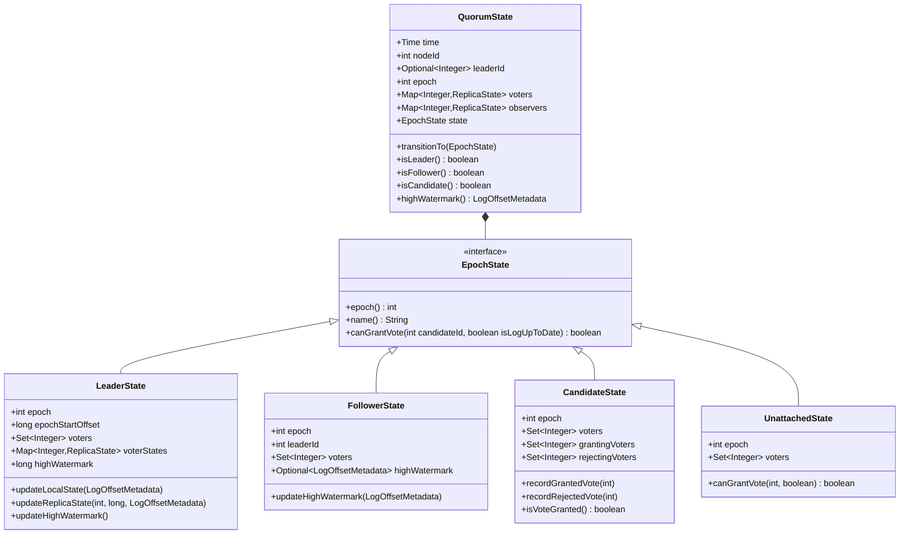

### 字段说明

**QuorumState**：

| 字段 | 类型 | 说明 |
|------|------|------|
| time | Time | 时间源 |
| nodeId | int | 当前节点 ID |
| leaderId | Optional\<Integer\> | 当前 Leader ID |
| epoch | int | 当前 Epoch |
| voters | Map\<Integer, ReplicaState\> | 投票者状态 |
| observers | Map\<Integer, ReplicaState\> | 观察者状态 |
| state | EpochState | 当前状态（Leader/Follower/Candidate 等） |

**EpochState** 子类型：

| 状态 | 说明 |
|------|------|
| **LeaderState** | Leader 状态 |
| **FollowerState** | Follower 状态 |
| **CandidateState** | Candidate 状态（竞选中） |
| **ProspectiveState** | Prospective 状态（PreVote 阶段） |
| **UnattachedState** | Unattached 状态（无 Leader） |
| **ResignedState** | Resigned 状态（Leader 放弃领导权） |

### 状态转换图

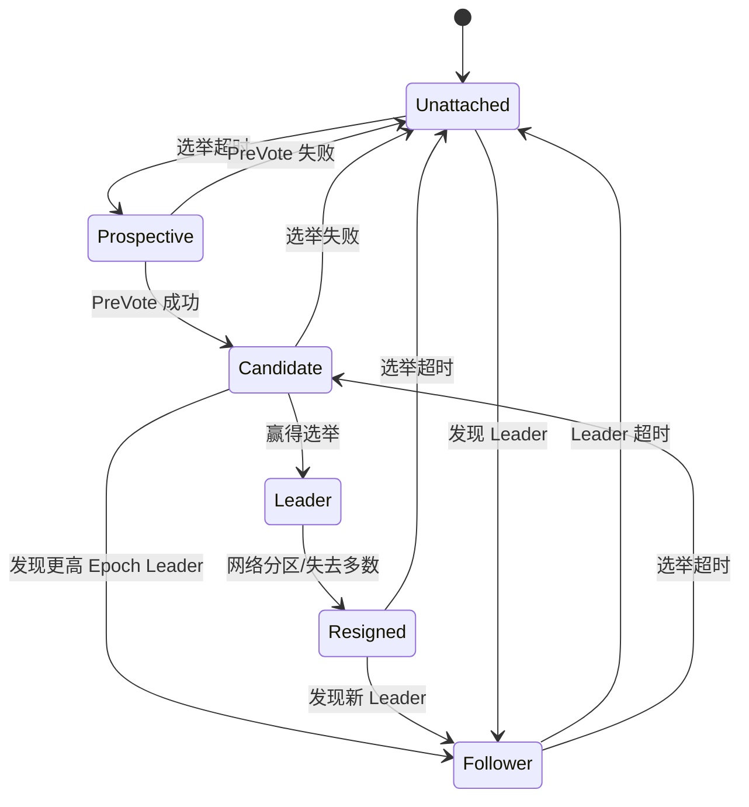

### 关键方法

**1. transitionTo**：状态转换

```java
public void transitionTo(EpochState newState) {
    // 验证状态转换合法性
    validateTransition(this.state, newState);
    
    // 更新状态
    EpochState previousState = this.state;
    this.state = newState;
    this.epoch = newState.epoch();
    
    // 更新 Leader ID
    if (newState instanceof LeaderState) {
        this.leaderId = Optional.of(nodeId);
    } else if (newState instanceof FollowerState) {
        FollowerState followerState = (FollowerState) newState;
        this.leaderId = Optional.of(followerState.leaderId());
    } else {
        this.leaderId = Optional.empty();
    }
    
    // 记录状态转换
    log.info("Transitioned from {} to {} at epoch {}",
        previousState.name(), newState.name(), epoch);
}

private void validateTransition(EpochState from, EpochState to) {
    // Unattached 可以转换到任何状态
    if (from instanceof UnattachedState) {
        return;
    }
    
    // Leader 只能转换到 Resigned
    if (from instanceof LeaderState && !(to instanceof ResignedState)) {
        throw new IllegalStateException(
            "Leader can only transition to Resigned, attempted: " + to.name()
        );
    }
    
    // Epoch 必须单调递增（除了某些特殊情况）
    if (to.epoch() < from.epoch()) {
        throw new IllegalStateException(
            "Epoch must not decrease: " + from.epoch() + " -> " + to.epoch()
        );
    }
}
```

**2. highWatermark**：获取 High Watermark

```java
public LogOffsetMetadata highWatermark() {
    if (state instanceof LeaderState) {
        LeaderState leaderState = (LeaderState) state;
        return new LogOffsetMetadata(leaderState.highWatermark());
    } else if (state instanceof FollowerState) {
        FollowerState followerState = (FollowerState) state;
        return followerState.highWatermark()
            .orElse(LogOffsetMetadata.EMPTY);
    } else {
        return LogOffsetMetadata.EMPTY;
    }
}
```

---

## LeaderState

### UML 类图

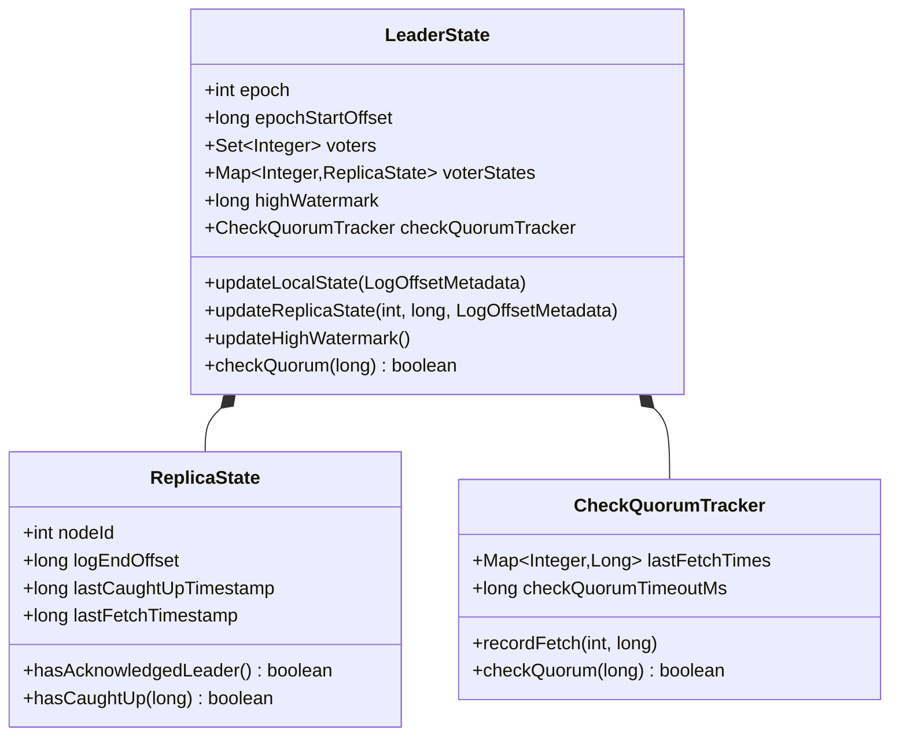

### 字段说明

| 字段 | 类型 | 说明 |
|------|------|------|
| epoch | int | Leader 的 Epoch |
| epochStartOffset | long | Leader Epoch 起始偏移量 |
| voters | Set\<Integer\> | 投票者节点 ID 集合 |
| voterStates | Map\<Integer, ReplicaState\> | 每个投票者的复制状态 |
| highWatermark | long | High Watermark（所有副本确认的偏移量） |
| checkQuorumTracker | CheckQuorumTracker | Check Quorum 追踪器 |

### 关键方法

**1. updateReplicaState**：更新副本状态

```java
public boolean updateReplicaState(
    int replicaId,
    long currentTimeMs,
    LogOffsetMetadata fetchOffsetMetadata
) {
    ReplicaState state = voterStates.get(replicaId);
    if (state == null) {
        throw new IllegalArgumentException(
            "Unknown replica " + replicaId
        );
    }
    
    long fetchOffset = fetchOffsetMetadata.offset();
    
    // 更新状态
    state.logEndOffset = fetchOffset;
    state.lastFetchTimestamp = currentTimeMs;
    
    // 检查是否追上 Leader
    if (fetchOffset >= highWatermark) {
        state.lastCaughtUpTimestamp = currentTimeMs;
    }
    
    // 重新计算 High Watermark
    return updateHighWatermark();
}
```

**2. updateHighWatermark**：更新 High Watermark

```java
private boolean updateHighWatermark() {
    // 收集所有副本的 LEO
    List<Long> replicaOffsets = new ArrayList<>();
    replicaOffsets.add(epochStartOffset); // Local state
    
    for (ReplicaState state : voterStates.values()) {
        replicaOffsets.add(state.logEndOffset);
    }
    
    // 按升序排序
    Collections.sort(replicaOffsets);
    
    // High Watermark = 第 (N/2 + 1) 个偏移量
    // 即多数派中的最小值
    int majority = voters.size() / 2 + 1;
    long newHighWatermark = replicaOffsets.get(majority - 1);
    
    if (newHighWatermark > highWatermark) {
        long oldHighWatermark = highWatermark;
        highWatermark = newHighWatermark;
        
        log.debug("High watermark updated from {} to {}",
            oldHighWatermark, newHighWatermark);
        
        return true;
    }
    
    return false;
}
```

**3. checkQuorum**：检查多数派可达性

```java
public boolean checkQuorum(long currentTimeMs) {
    int numAcknowledged = 0;
    
    for (ReplicaState state : voterStates.values()) {
        long timeSinceLastFetch = currentTimeMs - state.lastFetchTimestamp;
        
        if (timeSinceLastFetch < checkQuorumTimeoutMs) {
            numAcknowledged++;
        }
    }
    
    // 包括 Leader 自己
    numAcknowledged++;
    
    int majority = voters.size() / 2 + 1;
    return numAcknowledged >= majority;
}
```

---

## FollowerState

### UML 类图

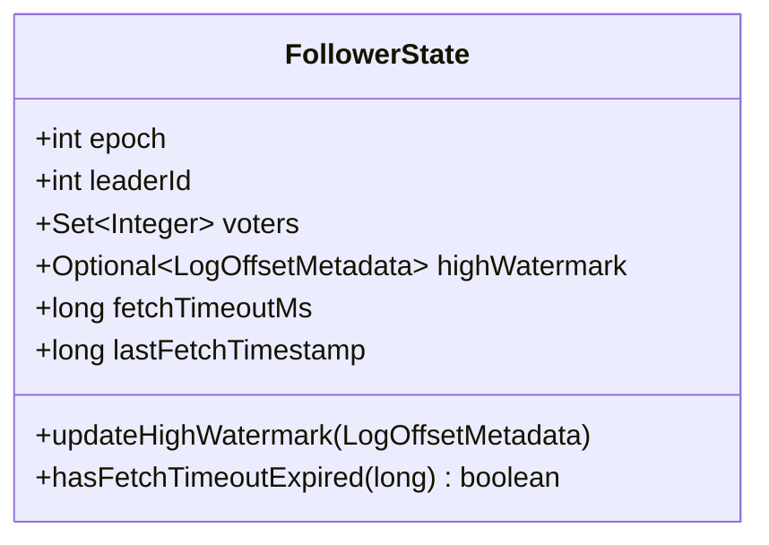

### 字段说明

| 字段 | 类型 | 说明 |
|------|------|------|
| epoch | int | 当前 Epoch |
| leaderId | int | Leader 节点 ID |
| voters | Set\<Integer\> | 投票者节点 ID 集合 |
| highWatermark | Optional\<LogOffsetMetadata\> | High Watermark |
| fetchTimeoutMs | long | Fetch 超时时间 |
| lastFetchTimestamp | long | 上次 Fetch 时间戳 |

### 关键方法

**1. updateHighWatermark**：更新 High Watermark

```java
public boolean updateHighWatermark(LogOffsetMetadata newHighWatermark) {
    if (highWatermark.isPresent()) {
        LogOffsetMetadata currentHW = highWatermark.get();
        
        if (newHighWatermark.offset() > currentHW.offset()) {
            highWatermark = Optional.of(newHighWatermark);
            return true;
        }
    } else {
        highWatermark = Optional.of(newHighWatermark);
        return true;
    }
    
    return false;
}
```

**2. hasFetchTimeoutExpired**：检查 Fetch 超时

```java
public boolean hasFetchTimeoutExpired(long currentTimeMs) {
    return currentTimeMs - lastFetchTimestamp >= fetchTimeoutMs;
}
```

---

## VotedState

### UML 类图

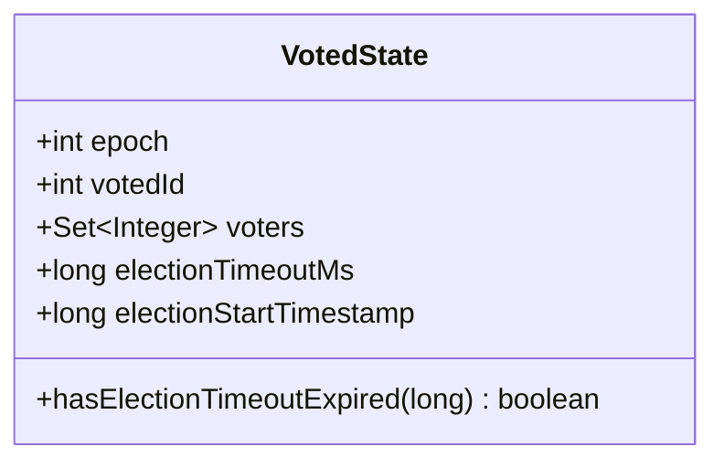

### 字段说明

| 字段 | 类型 | 说明 |
|------|------|------|
| epoch | int | 投票的 Epoch |
| votedId | int | 投票给的候选者 ID |
| voters | Set\<Integer\> | 投票者节点 ID 集合 |
| electionTimeoutMs | long | 选举超时时间 |
| electionStartTimestamp | long | 选举开始时间戳 |

### 关键方法

```java
public boolean hasElectionTimeoutExpired(long currentTimeMs) {
    return currentTimeMs - electionStartTimestamp >= electionTimeoutMs;
}
```

---

## CandidateState

### UML 类图

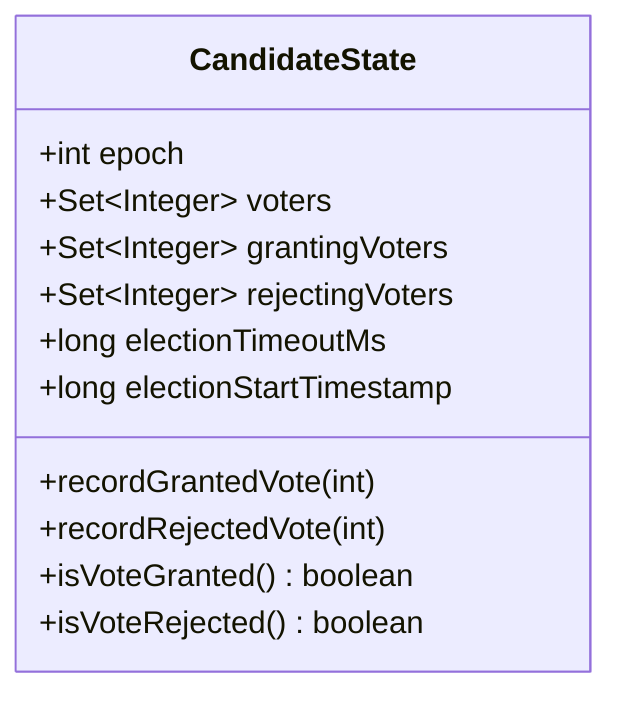

### 字段说明

| 字段 | 类型 | 说明 |
|------|------|------|
| epoch | int | 候选者的 Epoch |
| voters | Set\<Integer\> | 投票者节点 ID 集合 |
| grantingVoters | Set\<Integer\> | 已投赞成票的节点 |
| rejectingVoters | Set\<Integer\> | 已投反对票的节点 |
| electionTimeoutMs | long | 选举超时时间 |
| electionStartTimestamp | long | 选举开始时间戳 |

### 关键方法

**1. recordGrantedVote**：记录赞成票

```java
public void recordGrantedVote(int nodeId) {
    if (!voters.contains(nodeId)) {
        throw new IllegalArgumentException(
            "Node " + nodeId + " is not a voter"
        );
    }
    
    grantingVoters.add(nodeId);
    log.debug("Received vote from node {}, total votes: {}/{}",
        nodeId, grantingVoters.size(), voters.size());
}
```

**2. isVoteGranted**：检查是否赢得选举

```java
public boolean isVoteGranted() {
    int majority = voters.size() / 2 + 1;
    return grantingVoters.size() >= majority;
}
```

**3. isVoteRejected**：检查是否输掉选举

```java
public boolean isVoteRejected() {
    int majority = voters.size() / 2 + 1;
    int maxPossibleVotes = voters.size() - rejectingVoters.size();
    return maxPossibleVotes < majority;
}
```

---

## LogOffsetMetadata

### UML 类图

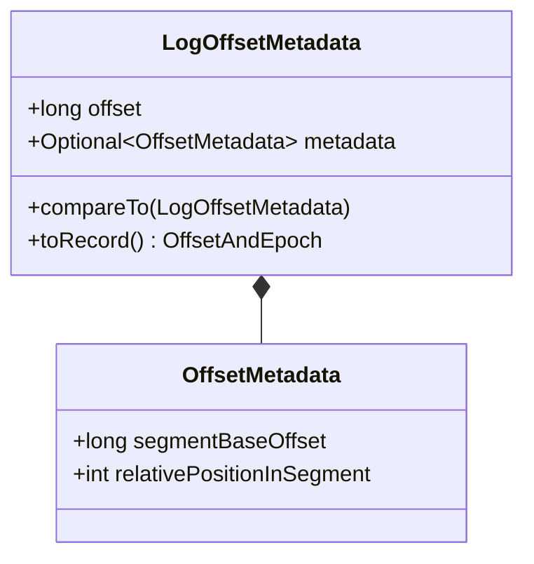

### 字段说明

| 字段 | 类型 | 说明 |
|------|------|------|
| offset | long | 日志偏移量 |
| metadata | Optional\<OffsetMetadata\> | 偏移量元数据（Segment 信息） |

**OffsetMetadata**：

| 字段 | 类型 | 说明 |
|------|------|------|
| segmentBaseOffset | long | Segment 起始偏移量 |
| relativePositionInSegment | int | Segment 内相对位置（字节） |

### 关键方法

```java
public int compareTo(LogOffsetMetadata other) {
    return Long.compare(this.offset, other.offset);
}

public OffsetAndEpoch toRecord(int epoch) {
    return new OffsetAndEpoch(offset, epoch);
}
```

---

## ReplicaState

### UML 类图

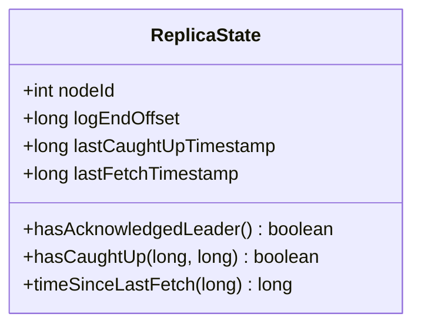

### 字段说明

| 字段 | 类型 | 说明 |
|------|------|------|
| nodeId | int | 副本节点 ID |
| logEndOffset | long | 副本的 Log End Offset（LEO） |
| lastCaughtUpTimestamp | long | 上次追上 Leader 的时间戳 |
| lastFetchTimestamp | long | 上次 Fetch 的时间戳 |

### 关键方法

**1. hasAcknowledgedLeader**：是否确认了 Leader

```java
public boolean hasAcknowledgedLeader() {
    return lastFetchTimestamp > 0;
}
```

**2. hasCaughtUp**：是否追上了 Leader

```java
public boolean hasCaughtUp(long currentTimeMs, long maxLagMs) {
    long timeSinceCaughtUp = currentTimeMs - lastCaughtUpTimestamp;
    return timeSinceCaughtUp <= maxLagMs;
}
```

**3. timeSinceLastFetch**：距离上次 Fetch 的时间

```java
public long timeSinceLastFetch(long currentTimeMs) {
    return currentTimeMs - lastFetchTimestamp;
}
```

---

## 总结

本文档详细描述了 Kafka Raft 模块的核心数据结构：

1. **QuorumState**：Quorum 状态管理
   - 管理 6 种 EpochState（Leader, Follower, Candidate, Prospective, Unattached, Resigned）
   - 状态转换验证
   - High Watermark 管理

2. **LeaderState**：Leader 状态
   - 副本状态跟踪（ReplicaState）
   - High Watermark 计算（多数派确认）
   - Check Quorum 机制

3. **FollowerState**：Follower 状态
   - Leader 跟踪
   - High Watermark 更新
   - Fetch 超时检测

4. **CandidateState**：Candidate 状态
   - 投票统计
   - 赢得选举判断（多数派）
   - 输掉选举判断

5. **LogOffsetMetadata**：偏移量元数据
   - 偏移量 + Segment 信息
   - 用于高效的日志复制

6. **ReplicaState**：副本状态
   - LEO 跟踪
   - 追赶状态（Caught Up）
   - Fetch 时间戳

每个数据结构都包含：

- 完整的 UML 类图
- 详细的字段说明
- 核心方法实现
- 状态转换图（QuorumState）
- 算法说明（High Watermark 计算、多数派判断）

---
