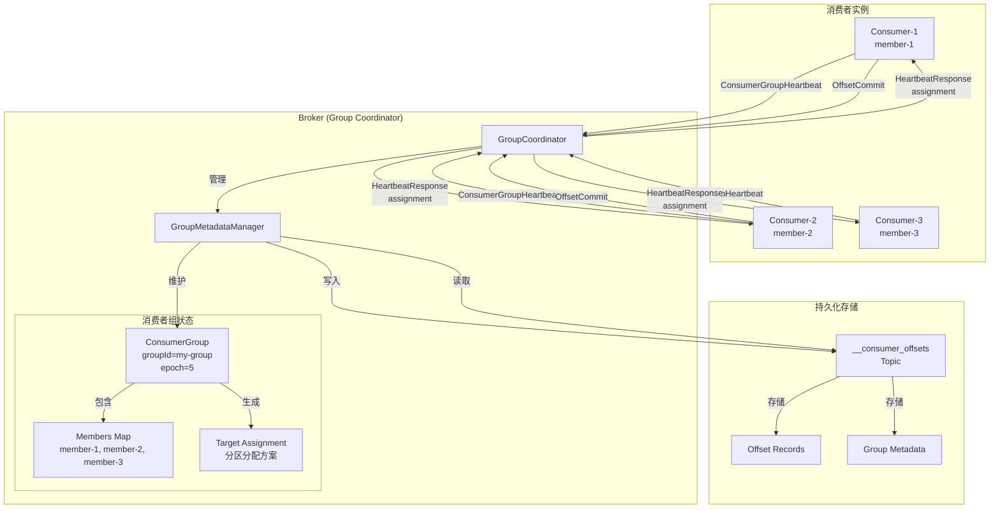
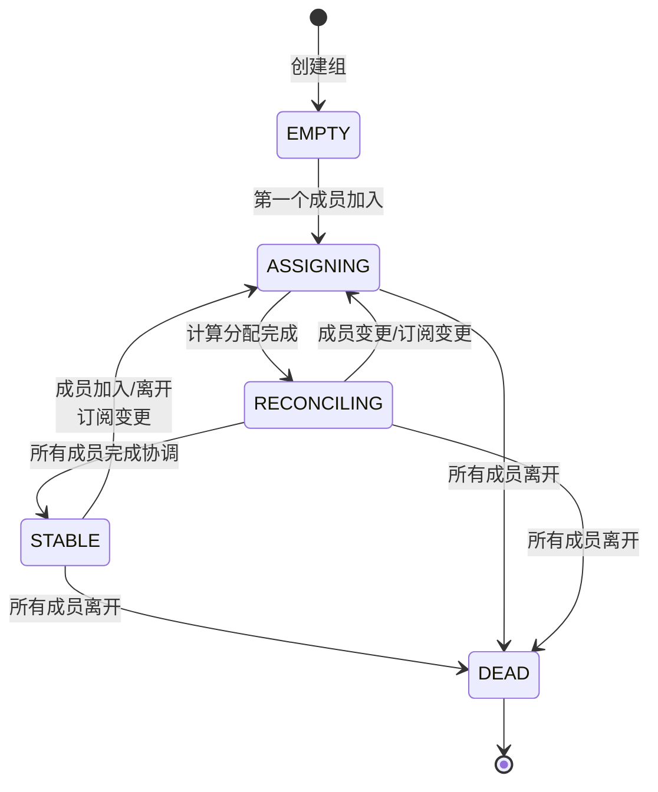
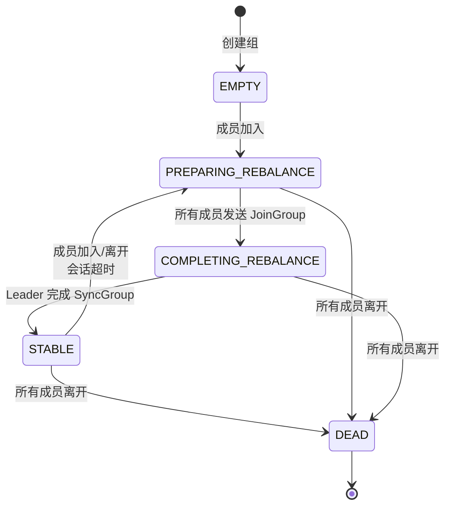
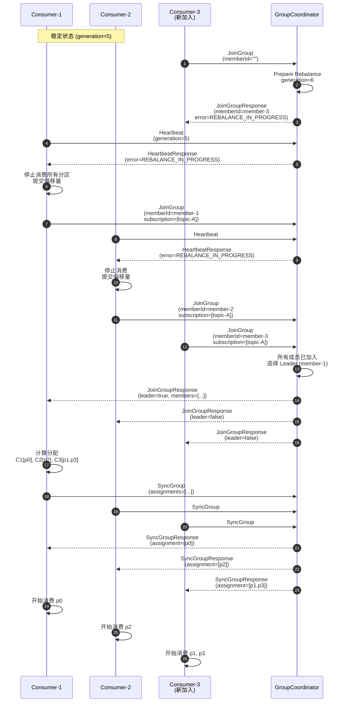
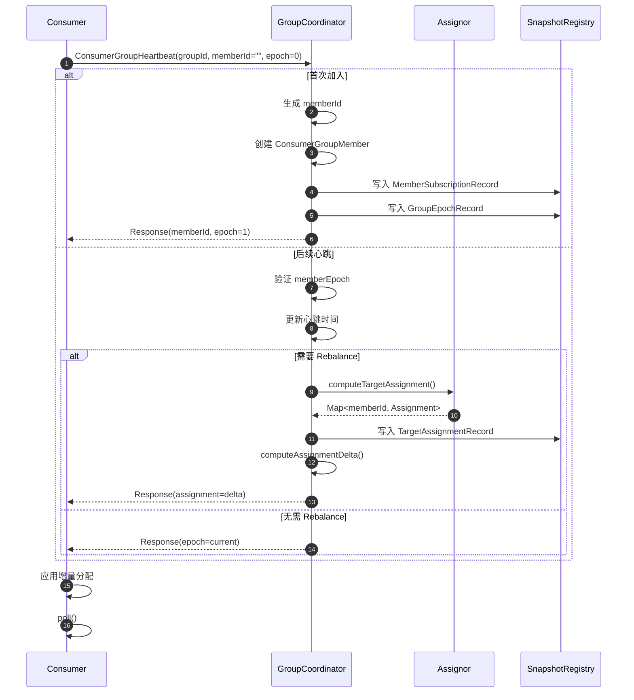
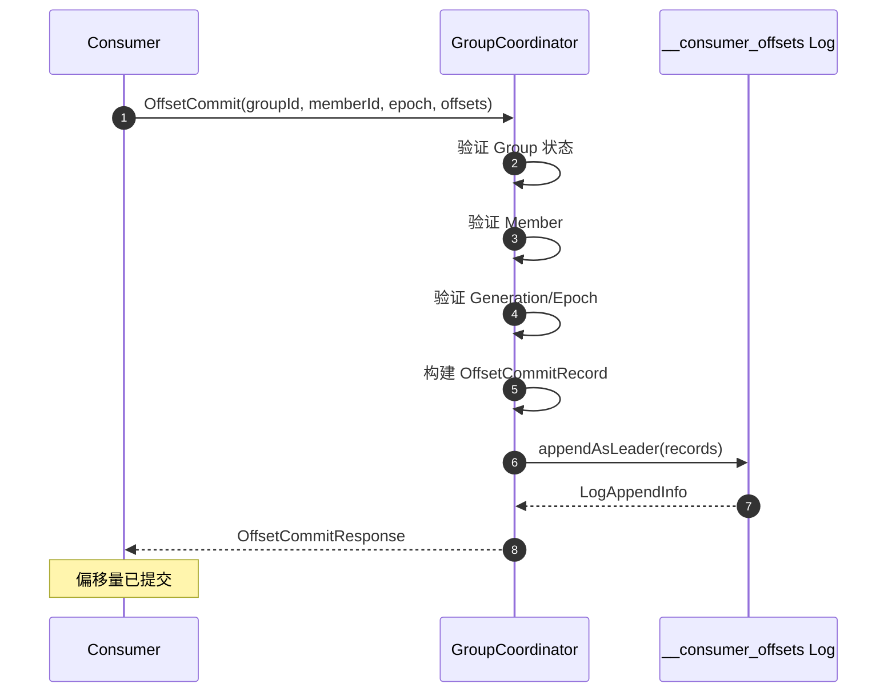

# Kafka-06-GroupCoordinator

## 模块概览

## 目录
- [模块职责](#模块职责)
- [模块级架构图](#模块级架构图)
- [核心组件](#核心组件)
- [消费者组状态机](#消费者组状态机)
- [Rebalance 流程](#rebalance-流程)
- [心跳与会话管理](#心跳与会话管理)
- [分区分配策略](#分区分配策略)
- [偏移量管理](#偏移量管理)
- [性能优化](#性能优化)

---

## 模块职责

**GroupCoordinator 模块**负责管理消费者组，协调消费者与分区之间的分配关系，是 Kafka 消费者组功能的核心。

**主要职责**：

1. **消费者组管理**：创建、维护、删除消费者组
2. **成员管理**：跟踪组内成员的加入、离开、心跳
3. **Rebalance 协调**：触发并协调分区重新分配
4. **分区分配**：根据分配策略将分区分配给消费者
5. **偏移量管理**：持久化和查询消费者偏移量
6. **会话管理**：检测消费者故障并踢出失活成员

---

## 模块级架构图



### 架构说明

**GroupCoordinator**：

- 每个 Broker 管理部分消费者组（基于 `__consumer_offsets` 分区分配）
- 处理 ConsumerGroupHeartbeat、OffsetCommit、OffsetFetch 等请求

**GroupMetadataManager**：

- 管理消费者组的元数据和状态
- 将变更持久化到 `__consumer_offsets` Topic

**ConsumerGroup**：

- 表示单个消费者组的状态
- 维护成员列表、订阅信息、分区分配

**__consumer_offsets Topic**：

- 存储消费者偏移量
- 存储消费者组元数据（成员信息、分配方案）
- 50 个分区（可配置），高可用

---

## 核心组件

### GroupCoordinator

处理消费者组相关的所有请求。

```java
public class GroupCoordinator implements Coordinator {
    private final GroupMetadataManager groupMetadataManager;
    private final OffsetMetadataManager offsetMetadataManager;
    
    // 处理消费者心跳（新协议）
    public CompletableFuture<ConsumerGroupHeartbeatResponseData> consumerGroupHeartbeat(
        ConsumerGroupHeartbeatRequestData request
    ) {
        String groupId = request.groupId();
        String memberId = request.memberId();
        int memberEpoch = request.memberEpoch();
        
        // 委托给 GroupMetadataManager
        return groupMetadataManager.consumerGroupHeartbeat(
            groupId,
            memberId,
            memberEpoch,
            request.instanceId(),
            request.rackId(),
            request.rebalanceTimeoutMs(),
            request.subscribedTopicNames(),
            request.subscribedTopicRegex(),
            request.assignorName(),
            request.topicPartitions()
        );
    }
    
    // 提交偏移量
    public CompletableFuture<OffsetCommitResponseData> commitOffsets(
        OffsetCommitRequestData request
    ) {
        return offsetMetadataManager.commitOffsets(
            request.groupId(),
            request.memberId(),
            request.generationIdOrMemberEpoch(),
            request.topics()
        );
    }
    
    // 查询偏移量
    public CompletableFuture<OffsetFetchResponseData> fetchOffsets(
        OffsetFetchRequestData request
    ) {
        return offsetMetadataManager.fetchOffsets(
            request.groupId(),
            request.topics()
        );
    }
}
```

### GroupMetadataManager

管理消费者组的核心逻辑。

```java
public class GroupMetadataManager {
    // 内存中的消费者组
    private final Map<String, Group> groups = new ConcurrentHashMap<>();
    
    // 处理消费者心跳
    public CoordinatorResult<ConsumerGroupHeartbeatResponseData, CoordinatorRecord>
    consumerGroupHeartbeat(
        String groupId,
        String memberId,
        int memberEpoch,
        // ... 其他参数
    ) {
        List<CoordinatorRecord> records = new ArrayList<>();
        
        // 1. 获取或创建消费者组
        ConsumerGroup group = getOrMaybeCreateConsumerGroup(groupId, createIfNotExists, records);
        
        // 2. 获取或创建成员
        ConsumerGroupMember member = getOrMaybeCreateMember(
            group,
            memberId,
            memberEpoch,
            createIfNotExists
        );
        
        // 3. 更新成员元数据（订阅、rack 等）
        ConsumerGroupMember updatedMember = new ConsumerGroupMember.Builder(member)
            .maybeUpdateSubscribedTopicNames(subscribedTopicNames)
            .maybeUpdateRackId(rackId)
            .maybeUpdateRebalanceTimeoutMs(rebalanceTimeoutMs)
            .build();
        
        boolean bumpGroupEpoch = !updatedMember.equals(member);
        
        // 4. 更新订阅元数据（如有变更，bumps group epoch）
        int groupEpoch = group.groupEpoch();
        if (bumpGroupEpoch || group.hasMetadataExpired(currentTimeMs)) {
            groupEpoch = updateSubscriptionMetadata(group, updatedMember, records);
        }
        
        // 5. 计算目标分配（如 group epoch 增加）
        Assignment targetAssignment;
        int targetAssignmentEpoch;
        
        if (groupEpoch > group.assignmentEpoch()) {
            targetAssignment = computeTargetAssignment(
                group,
                groupEpoch,
                updatedMember
            );
            targetAssignmentEpoch = groupEpoch;
            
            // 持久化目标分配
            records.add(newTargetAssignmentRecord(groupId, targetAssignment));
        } else {
            targetAssignmentEpoch = group.assignmentEpoch();
            targetAssignment = group.targetAssignment(memberId);
        }
        
        // 6. 协调成员的当前分配与目标分配
        updatedMember = maybeReconcile(
            groupId,
            updatedMember,
            targetAssignmentEpoch,
            targetAssignment,
            ownedTopicPartitions,
            records
        );
        
        // 7. 调度会话超时检查
        scheduleConsumerGroupSessionTimeout(groupId, memberId);
        
        // 8. 构建响应
        ConsumerGroupHeartbeatResponseData response =
            new ConsumerGroupHeartbeatResponseData()
                .setMemberId(memberId)
                .setMemberEpoch(updatedMember.memberEpoch())
                .setAssignment(toResponseAssignment(updatedMember.assignedPartitions()));
        
        return new CoordinatorResult<>(records, response);
    }
}
```

### ConsumerGroup

表示单个消费者组的状态。

```java
public class ConsumerGroup implements Group {
    private final String groupId;
    private int groupEpoch;                                  // 组 Epoch（每次 Rebalance 递增）
    private int assignmentEpoch;                             // 分配 Epoch
    
    private final Map<String, ConsumerGroupMember> members; // 成员列表
    private final Map<String, Assignment> targetAssignments; // 目标分配
    
    private final Map<String, TopicMetadata> subscribedTopicMetadata;  // 订阅的 Topic 元数据
    private final Map<String, Integer> subscribedTopicNames;           // 订阅的 Topic 名称
    
    private SubscriptionType subscriptionType;  // HOMOGENEOUS / HETEROGENEOUS
    
    // 计算目标分配
    public Map<String, Assignment> computeTargetAssignment(
        int groupEpoch,
        TopicsImage topicsImage,
        PartitionAssignor assignor
    ) {
        // 1. 收集所有订阅的分区
        Set<TopicPartition> allPartitions = new HashSet<>();
        for (String topicName : subscribedTopicNames.keySet()) {
            TopicImage topic = topicsImage.getTopic(topicName);
            if (topic != null) {
                for (int partitionId : topic.partitions().keySet()) {
                    allPartitions.add(new TopicPartition(topicName, partitionId));
                }
            }
        }
        
        // 2. 构建分配器输入
        Map<String, Subscription> subscriptions = new HashMap<>();
        for (ConsumerGroupMember member : members.values()) {
            subscriptions.put(member.memberId(), new Subscription(
                member.subscribedTopicNames(),
                member.ownedPartitions(),
                member.rackId()
            ));
        }
        
        // 3. 调用分配器
        Map<String, Assignment> assignments = assignor.assign(
            allPartitions,
            subscriptions
        );
        
        return assignments;
    }
}
```

### ConsumerGroupMember

表示消费者组中的单个成员。

```java
public class ConsumerGroupMember {
    private final String memberId;                    // 成员 ID
    private final int memberEpoch;                    // 成员 Epoch
    private final int previousMemberEpoch;            // 前一个 Epoch
    
    private final String instanceId;                  // 静态成员 ID（可选）
    private final String rackId;                      // 机架 ID
    
    private final int rebalanceTimeoutMs;             // Rebalance 超时
    private final int sessionTimeoutMs;               // 会话超时
    
    private final List<String> subscribedTopicNames;  // 订阅的 Topic
    private final String subscribedTopicRegex;        // 订阅的正则表达式
    
    private final String assignorName;                // 分配器名称
    
    private final Map<Uuid, Set<Integer>> assignedPartitions;           // 已分配的分区
    private final Map<Uuid, Set<Integer>> partitionsPendingRevocation;  // 待撤销的分区
    
    private final MemberState state;  // STABLE / UNREVOKED_PARTITIONS / UNRELEASED_PARTITIONS
}
```

---

## 消费者组状态机

### 新协议（Consumer Group Protocol）



### 旧协议（Classic Group Protocol）



### 状态说明

**新协议状态**：

**EMPTY**：

- 组已创建但无成员
- 等待第一个成员加入

**ASSIGNING**：

- 正在计算目标分配
- Group Epoch 已增加，触发重新分配

**RECONCILING**：

- 成员正在协调分配（撤销旧分区、获取新分区）
- 部分成员可能仍在 UNREVOKED_PARTITIONS 状态

**STABLE**：

- 所有成员已完成协调
- 分区分配稳定

**DEAD**：

- 组已被删除或所有成员离开

---

## Rebalance 流程

### 新协议（Incremental Cooperative Rebalance）

```mermaid
sequenceDiagram
    autonumber
    participant C1 as Consumer-1
    participant C2 as Consumer-2
    participant C3 as Consumer-3<br/>(新加入)
    participant GC as GroupCoordinator
    
    Note over C1,C2: 稳定状态：C1[p0,p1], C2[p2,p3]
    
    C3->>GC: Heartbeat<br/>(memberId="", epoch=0)
    GC->>GC: 创建 member-3<br/>Bump groupEpoch=6
    
    GC->>GC: 重新计算分配<br/>C1[p0], C2[p2], C3[p1,p3]
    
    GC-->>C3: Response<br/>(memberId=member-3, epoch=1<br/>assignment=[p1,p3])
    
    C1->>GC: Heartbeat<br/>(memberId=member-1, epoch=5<br/>owned=[p0,p1])
    
    GC->>GC: 协调：member-1 需撤销 p1<br/>state=UNREVOKED_PARTITIONS
    
    GC-->>C1: Response<br/>(epoch=6, assignment=[p0]<br/>revoking=[p1])
    
    C1->>C1: 停止消费 p1<br/>提交 p1 的偏移量
    
    C1->>GC: Heartbeat<br/>(epoch=6, owned=[p0])
    
    GC->>GC: member-1 已撤销 p1<br/>state=STABLE
    
    GC-->>C1: Response<br/>(epoch=6, assignment=[p0])
    
    C2->>GC: Heartbeat<br/>(epoch=5, owned=[p2,p3])
    
    GC->>GC: 协调：member-2 需撤销 p3<br/>state=UNREVOKED_PARTITIONS
    
    GC-->>C2: Response<br/>(epoch=6, assignment=[p2]<br/>revoking=[p3])
    
    C2->>C2: 停止消费 p3<br/>提交 p3 的偏移量
    
    C2->>GC: Heartbeat<br/>(epoch=6, owned=[p2])
    
    GC->>GC: member-2 已撤销 p3<br/>所有成员完成协调
    
    GC-->>C2: Response<br/>(epoch=6, assignment=[p2])
    
    C3->>GC: Heartbeat<br/>(epoch=1, owned=[])
    
    GC-->>C3: Response<br/>(epoch=6, assignment=[p1,p3])
    
    C3->>C3: 开始消费 p1, p3
    
    Note over C1,C2,C3: 新稳定状态：C1[p0], C2[p2], C3[p1,p3]
```

### 旧协议（Eager Rebalance）



### Rebalance 触发条件

**新协议**：

1. 新成员加入
2. 成员离开（主动或超时）
3. 成员订阅变更
4. Topic 元数据变更（新增/删除 Partition）

**旧协议**：

1. 新成员加入
2. 成员离开
3. Leader 重新选举

---

## 心跳与会话管理

### 心跳机制

**新协议**：

```java
// Consumer 定期发送心跳
while (running) {
    ConsumerGroupHeartbeatRequest request = new ConsumerGroupHeartbeatRequest()
        .setGroupId(groupId)
        .setMemberId(memberId)
        .setMemberEpoch(memberEpoch)
        .setRebalanceTimeoutMs(rebalanceTimeoutMs)
        .setSubscribedTopicNames(subscribedTopics)
        .setTopicPartitions(ownedPartitions);
    
    ConsumerGroupHeartbeatResponse response = send(request);
    
    if (response.memberEpoch() > memberEpoch) {
        // 新的分配，需要协调
        reconcileAssignment(response.assignment());
        memberEpoch = response.memberEpoch();
    }
    
    Thread.sleep(heartbeatIntervalMs);
}
```

### 会话超时检测

**GroupCoordinator 侧**：

```java
private void scheduleConsumerGroupSessionTimeout(String groupId, String memberId) {
    ConsumerGroup group = groups.get(groupId);
    ConsumerGroupMember member = group.member(memberId);
    
    long deadlineMs = time.milliseconds() + member.sessionTimeoutMs();
    
    timer.schedule(
        consumerGroupSessionTimeoutKey(groupId, memberId),
        deadlineMs,
        () -> onConsumerGroupSessionTimeout(groupId, memberId)
    );
}

private void onConsumerGroupSessionTimeout(String groupId, String memberId) {
    ConsumerGroup group = groups.get(groupId);
    
    if (group != null && group.hasMember(memberId)) {
        log.info("Member {} in group {} has been removed due to session timeout",
            memberId, groupId);
        
        // 移除成员并触发 Rebalance
        removeMemberFromGroup(group, memberId);
        prepareRebalance(group, "Member session timeout");
    }
}
```

---

## 分区分配策略

### Range Assignor

按 Topic 分配，每个 Topic 的分区均匀分配给消费者。

```java
public class RangeAssignor implements PartitionAssignor {
    @Override
    public Map<String, Assignment> assign(
        Set<TopicPartition> allPartitions,
        Map<String, Subscription> subscriptions
    ) {
        Map<String, Assignment> assignments = new HashMap<>();
        
        // 按 Topic 分组
        Map<String, List<TopicPartition>> partitionsByTopic =
            allPartitions.stream()
                .collect(Collectors.groupingBy(TopicPartition::topic));
        
        for (Map.Entry<String, List<TopicPartition>> entry : partitionsByTopic.entrySet()) {
            String topic = entry.getKey();
            List<TopicPartition> partitions = entry.getValue();
            
            // 找出订阅该 Topic 的消费者
            List<String> subscribers = subscriptions.entrySet().stream()
                .filter(e -> e.getValue().topics().contains(topic))
                .map(Map.Entry::getKey)
                .sorted()
                .collect(Collectors.toList());
            
            int numPartitions = partitions.size();
            int numConsumers = subscribers.size();
            int partitionsPerConsumer = numPartitions / numConsumers;
            int consumersWithExtraPartition = numPartitions % numConsumers;
            
            // 分配分区
            int partitionIndex = 0;
            for (int i = 0; i < numConsumers; i++) {
                String consumerId = subscribers.get(i);
                int numPartitionsToAssign = partitionsPerConsumer +
                    (i < consumersWithExtraPartition ? 1 : 0);
                
                for (int j = 0; j < numPartitionsToAssign; j++) {
                    TopicPartition partition = partitions.get(partitionIndex++);
                    assignments.computeIfAbsent(consumerId, k -> new Assignment())
                        .addPartition(partition);
                }
            }
        }
        
        return assignments;
    }
}
```

### Round-Robin Assignor

所有分区全局轮询分配。

```java
public class RoundRobinAssignor implements PartitionAssignor {
    @Override
    public Map<String, Assignment> assign(
        Set<TopicPartition> allPartitions,
        Map<String, Subscription> subscriptions
    ) {
        List<String> consumerIds = new ArrayList<>(subscriptions.keySet());
        Collections.sort(consumerIds);
        
        List<TopicPartition> sortedPartitions = new ArrayList<>(allPartitions);
        Collections.sort(sortedPartitions);
        
        Map<String, Assignment> assignments = new HashMap<>();
        
        for (int i = 0; i < sortedPartitions.size(); i++) {
            TopicPartition partition = sortedPartitions.get(i);
            String consumerId = consumerIds.get(i % consumerIds.size());
            
            assignments.computeIfAbsent(consumerId, k -> new Assignment())
                .addPartition(partition);
        }
        
        return assignments;
    }
}
```

### Sticky Assignor

尽量保持原有分配，减少分区移动。

```java
public class StickyAssignor implements PartitionAssignor {
    @Override
    public Map<String, Assignment> assign(
        Set<TopicPartition> allPartitions,
        Map<String, Subscription> subscriptions
    ) {
        // 1. 收集当前拥有的分区
        Map<String, List<TopicPartition>> currentAssignments = new HashMap<>();
        for (Map.Entry<String, Subscription> entry : subscriptions.entrySet()) {
            currentAssignments.put(entry.getKey(), entry.getValue().ownedPartitions());
        }
        
        // 2. 移除不再订阅的分区
        Set<TopicPartition> unassignedPartitions = new HashSet<>(allPartitions);
        for (List<TopicPartition> owned : currentAssignments.values()) {
            unassignedPartitions.removeAll(owned);
        }
        
        // 3. 计算每个消费者应分配的分区数
        int numPartitions = allPartitions.size();
        int numConsumers = subscriptions.size();
        int minPartitionsPerConsumer = numPartitions / numConsumers;
        int consumersWithExtraPartition = numPartitions % numConsumers;
        
        // 4. 分配未分配的分区
        List<String> consumerIds = new ArrayList<>(subscriptions.keySet());
        Collections.sort(consumerIds);
        
        for (String consumerId : consumerIds) {
            List<TopicPartition> owned = currentAssignments.get(consumerId);
            int targetSize = minPartitionsPerConsumer +
                (consumerIds.indexOf(consumerId) < consumersWithExtraPartition ? 1 : 0);
            
            while (owned.size() < targetSize && !unassignedPartitions.isEmpty()) {
                TopicPartition partition = unassignedPartitions.iterator().next();
                unassignedPartitions.remove(partition);
                owned.add(partition);
            }
        }
        
        // 5. 构建 Assignment
        Map<String, Assignment> assignments = new HashMap<>();
        for (Map.Entry<String, List<TopicPartition>> entry : currentAssignments.entrySet()) {
            assignments.put(entry.getKey(), new Assignment(entry.getValue()));
        }
        
        return assignments;
    }
}
```

---

## 偏移量管理

### 提交偏移量

```java
// Consumer 侧
consumer.commitSync(Map.of(
    new TopicPartition("topic-A", 0), new OffsetAndMetadata(100),
    new TopicPartition("topic-A", 1), new OffsetAndMetadata(200)
));

// GroupCoordinator 侧
public CoordinatorResult<OffsetCommitResponseData, CoordinatorRecord> commitOffsets(
    String groupId,
    String memberId,
    int generationIdOrMemberEpoch,
    List<OffsetCommitRequestData.OffsetCommitRequestTopic> topics
) {
    ConsumerGroup group = groups.get(groupId);
    
    // 验证成员和 Epoch
    ConsumerGroupMember member = group.member(memberId);
    if (member.memberEpoch() != generationIdOrMemberEpoch) {
        throw Errors.FENCED_MEMBER_EPOCH.exception();
    }
    
    List<CoordinatorRecord> records = new ArrayList<>();
    
    for (OffsetCommitRequestTopic topic : topics) {
        for (OffsetCommitRequestPartition partition : topic.partitions()) {
            // 创建偏移量记录
            records.add(new CoordinatorRecord(
                new OffsetCommitKey(groupId, topic.name(), partition.partitionIndex()),
                new OffsetCommitValue(
                    partition.committedOffset(),
                    partition.committedLeaderEpoch(),
                    partition.committedMetadata(),
                    time.milliseconds()
                )
            ));
        }
    }
    
    // 写入 __consumer_offsets
    return new CoordinatorResult<>(records, new OffsetCommitResponseData());
}
```

### 查询偏移量

```java
// Consumer 侧
Map<TopicPartition, OffsetAndMetadata> offsets = consumer.committed(Set.of(
    new TopicPartition("topic-A", 0),
    new TopicPartition("topic-A", 1)
));

// GroupCoordinator 侧
public OffsetFetchResponseData fetchOffsets(
    String groupId,
    List<OffsetFetchRequestData.OffsetFetchRequestTopic> topics
) {
    OffsetFetchResponseData response = new OffsetFetchResponseData();
    
    for (OffsetFetchRequestData.OffsetFetchRequestTopic topic : topics) {
        OffsetFetchResponseData.OffsetFetchResponseTopic responseTopic =
            new OffsetFetchResponseData.OffsetFetchResponseTopic()
                .setName(topic.name());
        
        for (Integer partitionId : topic.partitionIndexes()) {
            // 从 __consumer_offsets 读取
            OffsetAndMetadata offset = offsetStorage.get(
                new OffsetKey(groupId, topic.name(), partitionId)
            );
            
            if (offset != null) {
                responseTopic.partitions().add(
                    new OffsetFetchResponseData.OffsetFetchResponsePartition()
                        .setPartitionIndex(partitionId)
                        .setCommittedOffset(offset.offset())
                        .setCommittedLeaderEpoch(offset.leaderEpoch())
                        .setMetadata(offset.metadata())
                );
            }
        }
        
        response.topics().add(responseTopic);
    }
    
    return response;
}
```

---

## 性能优化

### 1. 增量协调式 Rebalance

**优势**：

- 只撤销需要移动的分区
- 减少停止消费的时间窗口
- 提高 Rebalance 效率

**对比**：

- 旧协议（Eager）：所有消费者停止消费 → 重新分配 → 恢复消费
- 新协议（Incremental Cooperative）：部分消费者撤销部分分区 → 其他消费者继续消费

### 2. 静态成员（Static Membership）

```java
// Consumer 配置
props.put(ConsumerConfig.GROUP_INSTANCE_ID_CONFIG, "consumer-instance-1");

// 优势
// - 重启后保持 member ID
// - 避免不必要的 Rebalance
// - 减少分区移动
```

### 3. 批量心跳

- 单次心跳携带完整状态（订阅、拥有的分区）
- 减少 RPC 次数
- 降低网络开销

### 4. 异步偏移量提交

```java
consumer.commitAsync((offsets, exception) -> {
    if (exception != null) {
        log.error("Commit failed", exception);
    }
});
```

---

## 总结

**GroupCoordinator 模块的核心价值**：

1. **高效 Rebalance**：
   - 增量协调式重平衡减少停顿
   - 静态成员减少不必要的 Rebalance

2. **灵活分配策略**：
   - Range、RoundRobin、Sticky 等多种策略
   - 支持自定义分配器

3. **可靠偏移量管理**：
   - 持久化到 `__consumer_offsets`
   - 高可用（多副本）

4. **会话管理**：
   - 心跳检测消费者存活
   - 自动踢出失活成员

5. **可扩展性**：
   - 支持大规模消费者组
   - 多 Coordinator 分担负载

**最佳实践**：

1. **使用新协议**：启用增量协调式 Rebalance
2. **合理配置超时**：`session.timeout.ms`、`rebalance.timeout.ms`
3. **使用静态成员**：对于长期运行的消费者
4. **选择合适的分配策略**：根据业务需求选择
5. **监控 Rebalance**：跟踪 Rebalance 频率和耗时

---

## API接口

## 目录
- [ConsumerGroupHeartbeat](#consumergroupheartbeat)
- [JoinGroup](#joingroup)
- [SyncGroup](#syncgroup)
- [Heartbeat](#heartbeat)
- [LeaveGroup](#leavegroup)
- [OffsetCommit](#offsetcommit)
- [OffsetFetch](#offsetfetch)

---

## ConsumerGroupHeartbeat

### 基本信息
- **API Key**: 68
- **协议**: Kafka Protocol
- **方法**: 现代消费者组心跳（KIP-848）
- **幂等性**: 是

### 请求结构体

```java
public class ConsumerGroupHeartbeatRequestData {
    private String groupId;                    // 消费者组 ID
    private String memberId;                   // 成员 ID
    private int memberEpoch;                   // 成员 Epoch
    private String instanceId;                 // 静态成员 ID（可选）
    private String rackId;                     // 机架 ID
    private int rebalanceTimeoutMs;            // Rebalance 超时
    private List<String> subscribedTopicNames; // 订阅的 Topic 名称列表
    private String subscribedTopicRegex;       // 订阅的 Topic 正则表达式
    private String serverAssignor;             // 服务端分配器名称
    private List<TopicPartitions> topicPartitions; // 当前拥有的分区
}

public class TopicPartitions {
    private Uuid topicId;
    private List<Integer> partitions;
}
```

### 字段表

| 字段 | 类型 | 必填 | 约束/默认 | 说明 |
|------|------|------|-----------|------|
| groupId | String | 是 | - | 消费者组 ID |
| memberId | String | 是 | "" | 成员 ID（首次加入为空） |
| memberEpoch | int | 是 | 0 | 成员 Epoch（首次加入为 0） |
| instanceId | String | 否 | null | 静态成员 ID |
| rackId | String | 否 | null | 成员所在机架 |
| rebalanceTimeoutMs | int | 是 | 300000 | Rebalance 超时（5 分钟） |
| subscribedTopicNames | List | 否 | null | 订阅的 Topic 列表 |
| subscribedTopicRegex | String | 否 | null | 订阅的 Topic 正则 |
| serverAssignor | String | 否 | null | 服务端分配器 |
| topicPartitions | List | 否 | [] | 当前拥有的分区列表 |

### 响应结构体

```java
public class ConsumerGroupHeartbeatResponseData {
    private short errorCode;
    private String errorMessage;
    private String memberId;                   // 分配的成员 ID
    private int memberEpoch;                   // 新的成员 Epoch
    private boolean shouldComputeAssignment;   // 是否需要计算分配
    private Assignment assignment;             // 分配的分区
}

public class Assignment {
    private List<TopicPartitions> topicPartitions;
}
```

### 字段表

| 字段 | 类型 | 说明 |
|------|------|------|
| errorCode | short | 错误码 |
| errorMessage | String | 错误消息 |
| memberId | String | 分配的成员 ID |
| memberEpoch | int | 新的成员 Epoch |
| shouldComputeAssignment | boolean | 是否需要客户端计算分配 |
| assignment | Assignment | 分配的分区（增量） |

### 入口函数

```java
// GroupMetadataManager.java
private CoordinatorResult<ConsumerGroupHeartbeatResponseData, CoordinatorRecord> consumerGroupHeartbeat(
    AuthorizableRequestContext context,
    ConsumerGroupHeartbeatRequestData request
) throws ApiException {
    String groupId = request.groupId();
    String memberId = request.memberId();
    int memberEpoch = request.memberEpoch();
    
    // 获取或创建 ConsumerGroup
    ConsumerGroup group = getOrMaybeCreateConsumerGroup(groupId, true);
    
    // 获取或创建 Member
    ConsumerGroupMember member;
    if (memberId.isEmpty()) {
        // 新成员加入
        member = new ConsumerGroupMember.Builder(generateMemberId())
            .setInstanceId(request.instanceId())
            .setRackId(request.rackId())
            .setRebalanceTimeoutMs(request.rebalanceTimeoutMs())
            .setSubscribedTopicNames(request.subscribedTopicNames())
            .setSubscribedTopicRegex(request.subscribedTopicRegex())
            .setServerAssignorName(request.serverAssignor())
            .build();
        
        // 生成记录
        records.add(newMemberSubscriptionRecord(groupId, member));
        records.add(newGroupEpochRecord(groupId, group.groupEpoch() + 1));
    } else {
        // 现有成员心跳
        member = group.getOrMaybeCreateMember(memberId, true);
        
        // 验证 Epoch
        if (memberEpoch != member.memberEpoch()) {
            throw new FencedMemberEpochException(
                "Member epoch " + memberEpoch + " does not match current epoch " +
                member.memberEpoch()
            );
        }
        
        // 更新订阅
        if (!request.subscribedTopicNames().equals(member.subscribedTopicNames())) {
            records.add(newMemberSubscriptionRecord(groupId, member));
            records.add(newGroupEpochRecord(groupId, group.groupEpoch() + 1));
        }
    }
    
    // 更新心跳时间
    member.updateMemberEpoch(memberEpoch + 1);
    member.setLastHeartbeatMs(time.milliseconds());
    
    // 计算目标分配
    if (group.targetAssignmentEpoch() < group.groupEpoch()) {
        Map<String, Assignment> targetAssignment = computeTargetAssignment(group);
        records.add(newTargetAssignmentRecord(groupId, targetAssignment));
    }
    
    // 构建响应
    ConsumerGroupHeartbeatResponseData response = new ConsumerGroupHeartbeatResponseData()
        .setMemberId(member.memberId())
        .setMemberEpoch(member.memberEpoch());
    
    // 计算增量分配
    Assignment currentAssignment = member.assignedPartitions();
    Assignment targetAssignment = group.targetAssignment(member.memberId());
    Assignment delta = computeAssignmentDelta(currentAssignment, targetAssignment);
    
    if (!delta.isEmpty()) {
        response.setAssignment(delta);
    }
    
    return new CoordinatorResult<>(records, response);
}
```

### 调用链

```
consumerGroupHeartbeat
  ↓
getOrMaybeCreateConsumerGroup
  ↓
group.getOrMaybeCreateMember
  ↓
computeTargetAssignment
  ↓
computeAssignmentDelta
  ↓
返回增量分配
```

### 时序图



### 边界与异常

**FENCED_MEMBER_EPOCH**：

- 请求的 `memberEpoch` 与服务器不一致
- Consumer 需要重新加入组

**UNKNOWN_MEMBER_ID**：

- `memberId` 不存在
- Consumer 需要重新加入组

**REBALANCE_IN_PROGRESS**：

- 组正在 Rebalance
- Consumer 等待分配

**NOT_COORDINATOR**：

- 请求发送到错误的 Coordinator
- Consumer 刷新元数据并重试

### 实践与最佳实践

**心跳间隔**：

```properties
heartbeat.interval.ms=3000  # 心跳间隔 3 秒
session.timeout.ms=45000    # 会话超时 45 秒
```

**Rebalance 超时**：

```properties
max.poll.interval.ms=300000  # 最大 poll 间隔 5 分钟
```

**静态成员**：

```properties
group.instance.id=consumer-1  # 静态成员 ID，避免 Rebalance
```

---

## OffsetCommit

### 基本信息
- **API Key**: 8
- **协议**: Kafka Protocol
- **方法**: 提交偏移量
- **幂等性**: 是（基于 offset）

### 请求结构体

```java
public class OffsetCommitRequestData {
    private String groupId;
    private int generationIdOrMemberEpoch;
    private String memberId;
    private String groupInstanceId;
    private long retentionTimeMs;
    private List<OffsetCommitRequestTopic> topics;
}

public class OffsetCommitRequestTopic {
    private String name;
    private List<OffsetCommitRequestPartition> partitions;
}

public class OffsetCommitRequestPartition {
    private int partitionIndex;
    private long committedOffset;
    private int committedLeaderEpoch;
    private String committedMetadata;
}
```

### 字段表

| 字段 | 类型 | 必填 | 约束/默认 | 说明 |
|------|------|------|-----------|------|
| groupId | String | 是 | - | 消费者组 ID |
| generationIdOrMemberEpoch | int | 是 | -1 | Generation ID 或 Member Epoch |
| memberId | String | 是 | "" | 成员 ID |
| groupInstanceId | String | 否 | null | 静态成员 ID |
| retentionTimeMs | long | 否 | -1 | 偏移量保留时间（-1=默认） |
| topics | List | 是 | - | Topic 列表 |
| topics[].name | String | 是 | - | Topic 名称 |
| topics[].partitions | List | 是 | - | 分区列表 |
| partitions[].partitionIndex | int | 是 | - | 分区 ID |
| partitions[].committedOffset | long | 是 | - | 提交的偏移量 |
| partitions[].committedLeaderEpoch | int | 否 | -1 | Leader Epoch |
| partitions[].committedMetadata | String | 否 | null | 元数据 |

### 响应结构体

```java
public class OffsetCommitResponseData {
    private int throttleTimeMs;
    private List<OffsetCommitResponseTopic> topics;
}

public class OffsetCommitResponseTopic {
    private String name;
    private List<OffsetCommitResponsePartition> partitions;
}

public class OffsetCommitResponsePartition {
    private int partitionIndex;
    private short errorCode;
}
```

### 入口函数

```java
private void commitOffsets(
    String groupId,
    String memberId,
    int generationId,
    Map<TopicPartition, OffsetAndMetadata> offsets
) throws ApiException {
    // 验证组状态
    Group group = groupManager.getGroup(groupId);
    if (group == null) {
        throw new IllegalGenerationException("Group " + groupId + " does not exist");
    }
    
    // 验证成员
    if (!group.hasMemberId(memberId)) {
        throw new UnknownMemberIdException("Member " + memberId + " not found");
    }
    
    // 验证 Generation
    if (group.generationId() != generationId) {
        throw new IllegalGenerationException(
            "Generation " + generationId + " does not match current " +
            group.generationId()
        );
    }
    
    // 构建记录
    List<CoordinatorRecord> records = new ArrayList<>();
    for (Map.Entry<TopicPartition, OffsetAndMetadata> entry : offsets.entrySet()) {
        TopicPartition tp = entry.getKey();
        OffsetAndMetadata offsetAndMetadata = entry.getValue();
        
        records.add(new OffsetCommitRecord()
            .setGroupId(groupId)
            .setTopic(tp.topic())
            .setPartition(tp.partition())
            .setOffset(offsetAndMetadata.offset())
            .setLeaderEpoch(offsetAndMetadata.leaderEpoch())
            .setMetadata(offsetAndMetadata.metadata())
            .setCommitTimestamp(time.milliseconds())
        );
    }
    
    // 写入 __consumer_offsets
    log.appendAsLeader(records);
}
```

### 时序图



---

## OffsetFetch

### 基本信息
- **API Key**: 9
- **协议**: Kafka Protocol
- **方法**: 获取提交的偏移量
- **幂等性**: 是

### 请求结构体

```java
public class OffsetFetchRequestData {
    private String groupId;
    private List<OffsetFetchRequestTopic> topics;
    private boolean requireStable;
}

public class OffsetFetchRequestTopic {
    private String name;
    private List<Integer> partitionIndexes;
}
```

### 响应结构体

```java
public class OffsetFetchResponseData {
    private int throttleTimeMs;
    private List<OffsetFetchResponseTopic> topics;
    private short errorCode;
}

public class OffsetFetchResponseTopic {
    private String name;
    private List<OffsetFetchResponsePartition> partitions;
}

public class OffsetFetchResponsePartition {
    private int partitionIndex;
    private long committedOffset;
    private int committedLeaderEpoch;
    private String metadata;
    private short errorCode;
}
```

### 入口函数

```java
private Map<TopicPartition, OffsetAndMetadata> fetchOffsets(
    String groupId,
    List<TopicPartition> partitions
) {
    Map<TopicPartition, OffsetAndMetadata> offsets = new HashMap<>();
    
    for (TopicPartition tp : partitions) {
        // 从 __consumer_offsets 读取
        OffsetAndMetadata offsetAndMetadata = offsetsCache.get(
            new GroupTopicPartition(groupId, tp)
        );
        
        if (offsetAndMetadata != null) {
            offsets.put(tp, offsetAndMetadata);
        }
    }
    
    return offsets;
}
```

---

## 总结

本文档详细描述了 Kafka GroupCoordinator 核心 API：

1. **ConsumerGroupHeartbeat**（KIP-848）：
   - 现代消费者组协议
   - 增量协调式 Rebalance
   - 服务端分配

2. **OffsetCommit / OffsetFetch**：
   - 偏移量提交与获取
   - 存储在 `__consumer_offsets`

每个 API 都包含：

- 完整的请求/响应结构
- 详细的字段表
- 入口函数与调用链
- 完整的时序图
- 异常处理与最佳实践

---
