# Kafka-07-TransactionCoordinator

## 模块概览

## 目录
- [模块职责](#模块职责)
- [模块级架构图](#模块级架构图)
- [核心组件](#核心组件)
- [事务状态机](#事务状态机)
- [事务流程](#事务流程)
- [两阶段提交](#两阶段提交)
- [ProducerId 管理](#producerid-管理)
- [关键设计](#关键设计)

---

## 模块职责

**TransactionCoordinator 模块**负责管理 Kafka 的事务功能，确保跨分区的原子性写入和 Exactly-Once 语义。

**主要职责**：

1. **事务管理**：创建、提交、中止事务
2. **ProducerId 分配**：为 Producer 分配唯一 ID
3. **事务状态跟踪**：维护事务的状态机
4. **两阶段提交**：协调跨分区的事务提交
5. **事务标记写入**：在相关分区写入 Transaction Marker
6. **事务超时管理**：检测并中止超时的事务
7. **Producer Epoch 管理**：防止僵尸 Producer

---

## 模块级架构图

```mermaid
flowchart TB
    subgraph Producer["事务 Producer"]
        P[Transactional<br/>Producer<br/>transactional.id=tx-1]
    end
    
    subgraph Broker["Broker (Transaction Coordinator)"]
        TC[TransactionCoordinator]
        TSM[TransactionStateManager]
        
        subgraph TransactionState["事务状态"]
            TXN[Transaction<br/>transactionalId=tx-1<br/>producerId=1001<br/>epoch=5<br/>state=Ongoing]
            PARTS[Partitions<br/>[topic-A-0, topic-B-1]]
        end
        
        TC -->|管理| TSM
        TSM -->|维护| TXN
        TXN -->|记录| PARTS
    end
    
    subgraph DataBrokers["数据 Brokers"]
        B1[Broker-1<br/>topic-A-0]
        B2[Broker-2<br/>topic-B-1]
    end
    
    subgraph Storage["持久化存储"]
        TXNTOPIC[__transaction_state<br/>Topic<br/>50 分区]
        MARKERS[Transaction<br/>Markers]
        
        TXNTOPIC -->|存储事务元数据| MARKERS
    end
    
    P -->|1. InitProducerId| TC
    TC -->|返回 producerId+epoch| P
    
    P -->|2. AddPartitionsToTxn| TC
    P -->|3. Produce Records| B1
    P -->|3. Produce Records| B2
    
    P -->|4. CommitTxn| TC
    
    TC -->|5. WriteTxnMarker| B1
    TC -->|5. WriteTxnMarker| B2
    
    TSM -->|持久化| TXNTOPIC
```

### 架构说明

**TransactionCoordinator**：

- 每个 Broker 管理部分事务（基于 `transactional.id` 哈希）
- 处理 InitProducerId、AddPartitionsToTxn、EndTxn 等请求

**TransactionStateManager**：

- 管理事务元数据
- 维护事务状态机
- 将变更持久化到 `__transaction_state` Topic

**__transaction_state Topic**：

- 存储事务元数据（ProducerId、Epoch、状态、参与分区）
- 50 个分区（可配置）

**Transaction Markers**：

- 在数据分区写入 COMMIT/ABORT 标记
- 标识事务的最终状态

---

## 核心组件

### TransactionCoordinator

处理事务相关请求。

```java
public class TransactionCoordinator {
    private final TransactionStateManager transactionStateManager;
    private final ProducerIdManager producerIdManager;
    private final TransactionMarkerChannelManager markerChannelManager;
    
    // 初始化 ProducerId
    public InitProducerIdResult initProducerId(
        String transactionalId,
        int transactionTimeoutMs,
        Optional<ProducerIdAndEpoch> expectedProducerIdAndEpoch
    ) {
        if (transactionalId.isEmpty()) {
            // 非事务 Producer，直接分配 ProducerId
            long producerId = producerIdManager.generateProducerId();
            return new InitProducerIdResult(producerId, 0);
        }
        
        // 事务 Producer
        return transactionStateManager.getOrInitTransactionState(
            transactionalId,
            transactionTimeoutMs,
            expectedProducerIdAndEpoch
        );
    }
    
    // 添加分区到事务
    public AddPartitionsToTxnResult addPartitionsToTxn(
        String transactionalId,
        long producerId,
        short producerEpoch,
        Set<TopicPartition> partitions
    ) {
        TransactionMetadata txnMetadata =
            transactionStateManager.getTransactionState(transactionalId);
        
        // 验证 ProducerId 和 Epoch
        if (txnMetadata.producerId() != producerId ||
            txnMetadata.producerEpoch() != producerEpoch) {
            throw new ProducerFencedException("Producer fenced");
        }
        
        // 添加分区
        txnMetadata.addPartitions(partitions);
        
        // 持久化
        transactionStateManager.appendTransactionToLog(
            transactionalId,
            txnMetadata
        );
        
        return AddPartitionsToTxnResult.success();
    }
    
    // 提交/中止事务
    public EndTxnResult endTransaction(
        String transactionalId,
        long producerId,
        short producerEpoch,
        TransactionResult result  // COMMIT or ABORT
    ) {
        TransactionMetadata txnMetadata =
            transactionStateManager.getTransactionState(transactionalId);
        
        // 验证
        if (txnMetadata.producerId() != producerId ||
            txnMetadata.producerEpoch() != producerEpoch) {
            throw new ProducerFencedException("Producer fenced");
        }
        
        // 转换状态
        if (result == TransactionResult.COMMIT) {
            txnMetadata.transitionTo(TransactionState.PREPARE_COMMIT);
        } else {
            txnMetadata.transitionTo(TransactionState.PREPARE_ABORT);
        }
        
        // 持久化
        transactionStateManager.appendTransactionToLog(
            transactionalId,
            txnMetadata
        );
        
        // 异步写入 Transaction Markers
        markerChannelManager.addTxnMarkersToSend(
            transactionalId,
            producerId,
            producerEpoch,
            result,
            txnMetadata.topicPartitions()
        );
        
        return EndTxnResult.success();
    }
}
```

### TransactionStateManager

管理事务状态。

```java
public class TransactionStateManager {
    // 内存中的事务元数据
    private final Map<String, TransactionMetadata> transactionMetadataCache =
        new ConcurrentHashMap<>();
    
    private final ReplicatedLog transactionLog;  // __transaction_state
    
    // 获取或初始化事务状态
    public InitProducerIdResult getOrInitTransactionState(
        String transactionalId,
        int transactionTimeoutMs,
        Optional<ProducerIdAndEpoch> expectedProducerIdAndEpoch
    ) {
        TransactionMetadata txnMetadata =
            transactionMetadataCache.computeIfAbsent(
                transactionalId,
                id -> new TransactionMetadata(
                    transactionalId,
                    producerIdManager.generateProducerId(),
                    0,  // initial epoch
                    transactionTimeoutMs,
                    TransactionState.EMPTY
                )
            );
        
        // 处理 Producer Epoch
        if (expectedProducerIdAndEpoch.isPresent()) {
            // Producer 重启，验证并增加 Epoch
            ProducerIdAndEpoch expected = expectedProducerIdAndEpoch.get();
            
            if (txnMetadata.producerId() == expected.producerId()) {
                if (txnMetadata.producerEpoch() == expected.epoch()) {
                    // 增加 Epoch，隔离旧 Producer
                    txnMetadata.incrementEpoch();
                } else if (txnMetadata.producerEpoch() < expected.epoch()) {
                    throw new ProducerFencedException("Producer epoch too old");
                }
            }
        }
        
        // 持久化
        appendTransactionToLog(transactionalId, txnMetadata);
        
        return new InitProducerIdResult(
            txnMetadata.producerId(),
            txnMetadata.producerEpoch()
        );
    }
    
    // 持久化事务元数据
    public void appendTransactionToLog(
        String transactionalId,
        TransactionMetadata txnMetadata
    ) {
        // 计算分区（基于 transactionalId 哈希）
        int partition = Math.abs(transactionalId.hashCode()) %
            transactionLog.numberOfPartitions();
        
        // 构建记录
        TransactionLogValue value = new TransactionLogValue()
            .setProducerId(txnMetadata.producerId())
            .setProducerEpoch(txnMetadata.producerEpoch())
            .setState(txnMetadata.state().name())
            .setTransactionTimeoutMs(txnMetadata.transactionTimeoutMs())
            .setTransactionStartTimeMs(txnMetadata.startTime())
            .setTopicPartitions(txnMetadata.topicPartitions());
        
        TransactionLogKey key = new TransactionLogKey()
            .setTransactionalId(transactionalId);
        
        // 写入日志
        transactionLog.append(
            partition,
            key,
            value
        );
    }
}
```

### TransactionMetadata

表示单个事务的元数据。

```java
public class TransactionMetadata {
    private final String transactionalId;
    private final long producerId;
    private short producerEpoch;
    
    private TransactionState state;
    private final Set<TopicPartition> topicPartitions;
    
    private final int transactionTimeoutMs;
    private long startTime;
    private long lastUpdateTime;
    
    // 状态转换
    public void transitionTo(TransactionState newState) {
        TransactionState currentState = this.state;
        
        // 验证状态转换的合法性
        if (!currentState.isValidTransition(newState)) {
            throw new IllegalStateException(
                String.format("Invalid transition from %s to %s",
                    currentState, newState)
            );
        }
        
        this.state = newState;
        this.lastUpdateTime = System.currentTimeMillis();
    }
    
    // 添加分区
    public void addPartitions(Set<TopicPartition> partitions) {
        if (state != TransactionState.ONGOING &&
            state != TransactionState.BEGIN) {
            throw new IllegalStateException(
                "Cannot add partitions in state " + state
            );
        }
        
        topicPartitions.addAll(partitions);
        
        if (state == TransactionState.BEGIN) {
            transitionTo(TransactionState.ONGOING);
        }
    }
    
    // 增加 Producer Epoch
    public void incrementEpoch() {
        producerEpoch++;
    }
    
    // 检查是否超时
    public boolean isExpired(long currentTimeMs) {
        return currentTimeMs - startTime > transactionTimeoutMs;
    }
}
```

---

## 事务状态机


### 状态说明

**EMPTY**：

- 事务刚创建，Producer 已获得 ProducerId
- 尚未添加任何分区

**BEGIN**：

- 第一个分区已添加
- 事务开始

**ONGOING**：

- 事务进行中
- Producer 向多个分区写入数据

**PREPARE_COMMIT**：

- Producer 请求提交事务
- 准备写入 COMMIT Markers

**PREPARE_ABORT**：

- Producer 请求中止事务，或事务超时
- 准备写入 ABORT Markers

**COMPLETE_COMMIT**：

- COMMIT Markers 已写入所有分区
- 事务提交完成

**COMPLETE_ABORT**：

- ABORT Markers 已写入所有分区
- 事务中止完成

**DEAD**：

- 事务已完成且清理

---

## 事务流程

### 完整事务流程


### 中止事务流程


---

## 两阶段提交

### Prepare Phase

**Coordinator 侧**：

```java
public void prepareCommit(TransactionMetadata txnMetadata) {
    // 1. 转换状态
    txnMetadata.transitionTo(TransactionState.PREPARE_COMMIT);
    
    // 2. 持久化到 __transaction_state
    appendTransactionToLog(txnMetadata.transactionalId(), txnMetadata);
    
    // 3. 等待日志写入完成
    // 如果此时 Coordinator 故障，新 Coordinator 会从日志恢复并继续
}
```

### Commit Phase

**Marker 写入**：

```java
public class TransactionMarkerChannelManager {
    
    public void addTxnMarkersToSend(
        String transactionalId,
        long producerId,
        short producerEpoch,
        TransactionResult result,
        Set<TopicPartition> partitions
    ) {
        // 按 Broker 分组
        Map<Integer, List<TopicPartition>> partitionsByBroker =
            groupPartitionsByBroker(partitions);
        
        // 为每个 Broker 创建 Marker 请求
        for (Map.Entry<Integer, List<TopicPartition>> entry :
             partitionsByBroker.entrySet()) {
            int brokerId = entry.getKey();
            List<TopicPartition> brokerPartitions = entry.getValue();
            
            WriteTxnMarkersRequest request = new WriteTxnMarkersRequest()
                .setTransactionalId(transactionalId)
                .setProducerId(producerId)
                .setProducerEpoch(producerEpoch)
                .setTransactionResult(result)
                .setTopicPartitions(brokerPartitions);
            
            // 异步发送
            sendMarkerRequest(brokerId, request);
        }
    }
    
    private void sendMarkerRequest(int brokerId, WriteTxnMarkersRequest request) {
        CompletableFuture<WriteTxnMarkersResponse> future =
            networkClient.send(brokerId, request);
        
        future.whenComplete((response, exception) -> {
            if (exception != null || response.hasError()) {
                // 重试
                retryMarkerRequest(brokerId, request);
            } else {
                // 成功，检查是否所有 Markers 都已写入
                onMarkerWritten(request.transactionalId());
            }
        });
    }
    
    private void onMarkerWritten(String transactionalId) {
        TransactionMetadata txnMetadata =
            transactionStateManager.getTransactionState(transactionalId);
        
        if (allMarkersWritten(txnMetadata)) {
            // 转换到最终状态
            if (txnMetadata.state() == TransactionState.PREPARE_COMMIT) {
                txnMetadata.transitionTo(TransactionState.COMPLETE_COMMIT);
            } else {
                txnMetadata.transitionTo(TransactionState.COMPLETE_ABORT);
            }
            
            // 持久化
            transactionStateManager.appendTransactionToLog(
                transactionalId,
                txnMetadata
            );
        }
    }
}
```

### Broker 侧处理 Marker

```java
// 在 ReplicaManager 中
public void handleWriteTxnMarkers(WriteTxnMarkersRequest request) {
    long producerId = request.producerId();
    short producerEpoch = request.producerEpoch();
    TransactionResult result = request.transactionResult();
    
    for (TopicPartition partition : request.topicPartitions()) {
        Partition p = getPartition(partition);
        
        // 构建 Control Batch（包含 Transaction Marker）
        MemoryRecords marker = buildTransactionMarker(
            producerId,
            producerEpoch,
            result
        );
        
        // 追加到日志
        p.appendRecordsToLeader(marker);
        
        // 更新 Producer 状态
        if (result == TransactionResult.COMMIT) {
            p.completeTxn(producerId, producerEpoch);
        } else {
            p.abortTxn(producerId, producerEpoch);
        }
    }
}
```

---

## ProducerId 管理

### ProducerId 分配

```java
public class ProducerIdManager {
    private final AtomicLong nextProducerId;
    private final long producerIdBlockSize = 1000;
    
    // 从 ZooKeeper 或 Controller 获取 ProducerId 块
    public void initialize() {
        ProducerIdBlock block = requestProducerIdBlock();
        nextProducerId.set(block.firstProducerId());
    }
    
    // 分配 ProducerId
    public long generateProducerId() {
        long producerId = nextProducerId.getAndIncrement();
        
        // 检查是否需要请求新的块
        if (producerId % producerIdBlockSize == producerIdBlockSize - 1) {
            requestNewProducerIdBlock();
        }
        
        return producerId;
    }
    
    private ProducerIdBlock requestProducerIdBlock() {
        // 在 KRaft 模式下，向 Controller 请求
        AllocateProducerIdsRequest request =
            new AllocateProducerIdsRequest(brokerId, producerIdBlockSize);
        
        AllocateProducerIdsResponse response =
            sendToController(request);
        
        return new ProducerIdBlock(
            response.producerIdStart(),
            response.producerIdLen()
        );
    }
}
```

### Producer Epoch 管理

**目的**：隔离僵尸 Producer

```java
// Producer 重启
Properties props = new Properties();
props.put(ProducerConfig.TRANSACTIONAL_ID_CONFIG, "tx-1");

KafkaProducer<String, String> producer = new KafkaProducer<>(props);

// 初始化事务
producer.initTransactions();
// 内部会请求 InitProducerId，Coordinator 会增加 Epoch

// 旧 Producer 的请求会被拒绝（Epoch 过期）
```

**Coordinator 侧验证**：

```java
private void validateProducerEpoch(
    TransactionMetadata txnMetadata,
    long producerId,
    short producerEpoch
) {
    if (txnMetadata.producerId() != producerId) {
        throw new InvalidProducerIdMappingException(
            "ProducerId mismatch"
        );
    }
    
    if (txnMetadata.producerEpoch() > producerEpoch) {
        throw new ProducerFencedException(
            String.format("Producer epoch %d is fenced by %d",
                producerEpoch, txnMetadata.producerEpoch())
        );
    }
    
    if (txnMetadata.producerEpoch() < producerEpoch) {
        throw new InvalidProducerEpochException(
            "Producer epoch ahead of coordinator"
        );
    }
}
```

---

## 关键设计

### 1. 幂等性 Producer

**基础**：

- 每个 Producer 有唯一的 ProducerId
- 每条消息有单调递增的 Sequence Number

**去重机制**：

```java
// Broker 侧维护 Producer 状态
public class ProducerStateEntry {
    private final long producerId;
    private final short producerEpoch;
    private final Map<Integer, Integer> sequenceNumbers;  // partition -> lastSeq
    
    public boolean isDuplicate(int partition, int sequence) {
        Integer lastSeq = sequenceNumbers.get(partition);
        if (lastSeq == null) {
            return false;
        }
        
        // 如果 sequence <= lastSeq，说明是重复
        return sequence <= lastSeq;
    }
    
    public void update(int partition, int sequence) {
        sequenceNumbers.put(partition, sequence);
    }
}
```

### 2. Transaction Marker

**结构**：

```java
public class TransactionMarker {
    private final long producerId;
    private final short producerEpoch;
    private final TransactionResult result;  // COMMIT or ABORT
    private final long coordinatorEpoch;
    
    // 写入到 Log 的 Control Batch
    public MemoryRecords toControlBatch() {
        ControlRecordType controlType = result == TransactionResult.COMMIT
            ? ControlRecordType.COMMIT
            : ControlRecordType.ABORT;
        
        EndTransactionMarker marker = new EndTransactionMarker()
            .setControlType(controlType.id())
            .setCoordinatorEpoch(coordinatorEpoch);
        
        return MemoryRecords.withEndTransactionMarker(
            producerId,
            producerEpoch,
            marker
        );
    }
}
```

**Consumer 侧处理**：

```java
// Consumer 读取数据时
public ConsumerRecords<K, V> poll(Duration timeout) {
    Map<TopicPartition, List<ConsumerRecord<K, V>>> records =
        fetcher.fetchedRecords();
    
    // 过滤事务数据
    return filterAbortedTransactions(records);
}

private Map<TopicPartition, List<ConsumerRecord<K, V>>>
    filterAbortedTransactions(Map<TopicPartition, List<ConsumerRecord<K, V>>> records) {
    
    Map<TopicPartition, List<ConsumerRecord<K, V>>> filtered = new HashMap<>();
    
    for (Map.Entry<TopicPartition, List<ConsumerRecord<K, V>>> entry : records.entrySet()) {
        TopicPartition partition = entry.getKey();
        List<ConsumerRecord<K, V>> partitionRecords = entry.getValue();
        
        // 读取 Aborted Transaction Index
        Set<Long> abortedProducerIds =
            fetchAbortedTransactions(partition);
        
        // 过滤
        List<ConsumerRecord<K, V>> filteredRecords =
            partitionRecords.stream()
                .filter(record -> !abortedProducerIds.contains(record.producerId()))
                .collect(Collectors.toList());
        
        filtered.put(partition, filteredRecords);
    }
    
    return filtered;
}
```

### 3. 事务超时

**检测**：

```java
public class TransactionStateManager {
    private final Timer transactionTimeoutTimer;
    
    public void scheduleTransactionTimeout(String transactionalId) {
        TransactionMetadata txnMetadata =
            transactionMetadataCache.get(transactionalId);
        
        transactionTimeoutTimer.schedule(
            transactionalId,
            txnMetadata.transactionTimeoutMs(),
            () -> onTransactionTimeout(transactionalId)
        );
    }
    
    private void onTransactionTimeout(String transactionalId) {
        TransactionMetadata txnMetadata =
            transactionMetadataCache.get(transactionalId);
        
        if (txnMetadata.state() == TransactionState.ONGOING) {
            log.warn("Transaction {} has timed out, aborting", transactionalId);
            
            // 自动中止
            abortTransaction(transactionalId, "Transaction timeout");
        }
    }
}
```

### 4. Coordinator 故障恢复

**从日志恢复**：

```java
public class TransactionStateManager {
    
    public void loadTransactionsFromLog() {
        // 读取 __transaction_state 分区
        for (int partition = 0; partition < numPartitions; partition++) {
            if (isCoordinatorFor(partition)) {
                loadPartition(partition);
            }
        }
    }
    
    private void loadPartition(int partition) {
        LogSegment segment = transactionLog.getSegment(partition);
        
        // 遍历所有记录
        for (Record record : segment.records()) {
            TransactionLogKey key = deserializeKey(record.key());
            TransactionLogValue value = deserializeValue(record.value());
            
            String transactionalId = key.transactionalId();
            
            // 重建内存状态
            TransactionMetadata txnMetadata = new TransactionMetadata(
                transactionalId,
                value.producerId(),
                value.producerEpoch(),
                value.transactionTimeoutMs(),
                TransactionState.valueOf(value.state())
            );
            
            txnMetadata.setTopicPartitions(value.topicPartitions());
            
            transactionMetadataCache.put(transactionalId, txnMetadata);
            
            // 如果状态是 PREPARE_COMMIT/PREPARE_ABORT，继续写入 Markers
            if (txnMetadata.state() == TransactionState.PREPARE_COMMIT ||
                txnMetadata.state() == TransactionState.PREPARE_ABORT) {
                
                TransactionResult result =
                    txnMetadata.state() == TransactionState.PREPARE_COMMIT
                        ? TransactionResult.COMMIT
                        : TransactionResult.ABORT;
                
                markerChannelManager.addTxnMarkersToSend(
                    transactionalId,
                    txnMetadata.producerId(),
                    txnMetadata.producerEpoch(),
                    result,
                    txnMetadata.topicPartitions()
                );
            }
        }
    }
}
```

---

## 总结

**TransactionCoordinator 模块的核心价值**：

1. **Exactly-Once 语义**：
   - 跨分区原子性写入
   - 幂等性保证不重复
   - Transaction Markers 标识事务结果

2. **两阶段提交**：
   - Prepare 阶段持久化状态
   - Commit 阶段写入 Markers
   - 容错设计保证一致性

3. **Producer 隔离**：
   - ProducerId + Epoch 防止僵尸 Producer
   - 自动增加 Epoch 隔离旧实例

4. **高可用**：
   - 事务状态持久化到 __transaction_state
   - Coordinator 故障后从日志恢复
   - 多 Coordinator 分担负载

5. **超时保护**：
   - 检测并中止长时间运行的事务
   - 防止资源泄漏

**最佳实践**：

1. **合理设置超时**：`transaction.timeout.ms`（默认 60s）
2. **小事务**：减少事务包含的分区数量
3. **快速提交**：避免长时间占用资源
4. **错误处理**：正确处理 ProducerFencedException
5. **监控指标**：
   - 事务成功/失败率
   - 事务延迟
   - Pending 事务数量

---

## API接口

## 目录
- [InitProducerId](#initproducerid)
- [AddPartitionsToTxn](#addpartitionstotxn)
- [AddOffsetsToTxn](#addoffsetstotxn)
- [EndTxn](#endtxn)
- [WriteTxnMarkers](#writetxnmarkers)

---

## InitProducerId

### 基本信息
- **API Key**: 22
- **协议**: Kafka Protocol
- **方法**: 初始化 Producer ID
- **幂等性**: 是

### 请求结构体

```java
public class InitProducerIdRequestData {
    private String transactionalId;       // 事务 ID（可选）
    private int transactionTimeoutMs;     // 事务超时
    private long producerId;              // 已有的 Producer ID（-1 表示新分配）
    private short producerEpoch;          // 已有的 Producer Epoch（-1 表示新分配）
}
```

### 字段表

| 字段 | 类型 | 必填 | 约束/默认 | 说明 |
|------|------|------|-----------|------|
| transactionalId | String | 否 | null | 事务 ID（null=仅幂等性） |
| transactionTimeoutMs | int | 是 | 60000 | 事务超时（1 分钟） |
| producerId | long | 是 | -1 | 已有的 Producer ID（-1=新分配） |
| producerEpoch | short | 是 | -1 | 已有的 Producer Epoch（-1=新分配） |

### 响应结构体

```java
public class InitProducerIdResponseData {
    private int throttleTimeMs;
    private short errorCode;
    private long producerId;              // 分配的 Producer ID
    private short producerEpoch;          // 分配的 Producer Epoch
}
```

### 字段表

| 字段 | 类型 | 说明 |
|------|------|------|
| throttleTimeMs | int | 限流时间 |
| errorCode | short | 错误码 |
| producerId | long | 分配的 Producer ID |
| producerEpoch | short | 分配的 Producer Epoch |

### 入口函数

```java
// TransactionCoordinator.java
public CompletableFuture<InitProducerIdResponseData> handleInitProducerId(
    InitProducerIdRequestData request
) {
    String transactionalId = request.transactionalId();
    
    if (transactionalId == null) {
        // 仅幂等性 Producer：直接分配 PID
        long producerId = producerIdManager.generateProducerId();
        return CompletableFuture.completedFuture(
            new InitProducerIdResponseData()
                .setProducerId(producerId)
                .setProducerEpoch((short) 0)
        );
    }
    
    // 事务性 Producer：需要管理事务元数据
    return txnManager.getOrCreateTransactionMetadata(transactionalId)
        .thenCompose(txnMetadata -> {
            synchronized (txnMetadata.lock) {
                TransactionState currentState = txnMetadata.state();
                
                switch (currentState) {
                    case EMPTY:
                    case COMPLETE_COMMIT:
                    case COMPLETE_ABORT:
                        // 初始化或事务完成：分配新 epoch
                        return initializeNewTransaction(
                            txnMetadata,
                            request.transactionTimeoutMs()
                        );
                    
                    case ONGOING:
                    case PREPARE_COMMIT:
                    case PREPARE_ABORT:
                        // 事务进行中：终止并重新初始化
                        return abortAndReinitialize(
                            txnMetadata,
                            request.transactionTimeoutMs()
                        );
                    
                    default:
                        throw new IllegalStateException("Unknown state: " + currentState);
                }
            }
        });
}

private CompletableFuture<InitProducerIdResponseData> initializeNewTransaction(
    TransactionMetadata txnMetadata,
    int transactionTimeoutMs
) {
    long producerId;
    short producerEpoch;
    
    if (txnMetadata.producerId() == RecordBatch.NO_PRODUCER_ID) {
        // 首次初始化：分配新 PID
        producerId = producerIdManager.generateProducerId();
        producerEpoch = 0;
    } else {
        // 已有 PID：递增 epoch（用于隔离旧事务）
        producerId = txnMetadata.producerId();
        producerEpoch = (short) (txnMetadata.producerEpoch() + 1);
    }
    
    // 更新事务元数据
    txnMetadata.prepareTransit(
        producerId,
        producerEpoch,
        transactionTimeoutMs,
        TransactionState.EMPTY
    );
    
    // 写入 __transaction_state
    TransactionMetadataRecord record = new TransactionMetadataRecord()
        .setTransactionalId(txnMetadata.transactionalId())
        .setProducerId(producerId)
        .setProducerEpoch(producerEpoch)
        .setTransactionTimeoutMs(transactionTimeoutMs)
        .setTransactionState(TransactionState.EMPTY.id());
    
    return appendToLog(record).thenApply(offset -> {
        txnMetadata.completeTransit();
        
        return new InitProducerIdResponseData()
            .setProducerId(producerId)
            .setProducerEpoch(producerEpoch);
    });
}
```

### 调用链

```
handleInitProducerId
  ↓
getOrCreateTransactionMetadata
  ↓
initializeNewTransaction 或 abortAndReinitialize
  ↓
producerIdManager.generateProducerId
  ↓
appendToLog(__transaction_state)
  ↓
返回 ProducerId + Epoch
```

### 时序图



```mermaid
sequenceDiagram
    autonumber
    participant P as Producer
    participant TC as TransactionCoordinator
    participant PM as ProducerIdManager
    participant L as __transaction_state Log
    
    P->>TC: InitProducerId(transactionalId, timeout)
    
    TC->>TC: getOrCreateTransactionMetadata()
    
    alt 首次初始化
        TC->>PM: generateProducerId()
        PM-->>TC: producerId
        TC->>TC: 创建 TransactionMetadata
        TC->>TC: state = EMPTY, epoch = 0
    else 已有 PID
        TC->>TC: epoch = current + 1
        TC->>TC: 隔离旧事务
    end
    
    TC->>L: append(TransactionMetadataRecord)
    L-->>TC: offset
    
    TC-->>P: Response(producerId, epoch)
    
    Note over P: Producer 开始使用 PID + Epoch
```

### 边界与异常

**CONCURRENT_TRANSACTIONS**：

- 同一 `transactionalId` 的并发初始化请求
- 返回错误，Producer 重试

**COORDINATOR_LOAD_IN_PROGRESS**：

- Coordinator 正在加载事务状态
- Producer 等待后重试

**NOT_COORDINATOR**：

- 请求发送到错误的 Coordinator
- Producer 刷新元数据并重试

---

## AddPartitionsToTxn

### 基本信息
- **API Key**: 24
- **协议**: Kafka Protocol
- **方法**: 添加分区到事务
- **幂等性**: 是

### 请求结构体

```java
public class AddPartitionsToTxnRequestData {
    private String transactionalId;
    private long producerId;
    private short producerEpoch;
    private List<AddPartitionsToTxnTopic> topics;
}

public class AddPartitionsToTxnTopic {
    private String name;
    private List<Integer> partitions;
}
```

### 字段表

| 字段 | 类型 | 必填 | 约束/默认 | 说明 |
|------|------|------|-----------|------|
| transactionalId | String | 是 | - | 事务 ID |
| producerId | long | 是 | - | Producer ID |
| producerEpoch | short | 是 | - | Producer Epoch |
| topics | List | 是 | - | Topic 列表 |
| topics[].name | String | 是 | - | Topic 名称 |
| topics[].partitions | List | 是 | - | 分区列表 |

### 响应结构体

```java
public class AddPartitionsToTxnResponseData {
    private int throttleTimeMs;
    private List<AddPartitionsToTxnTopicResult> results;
}

public class AddPartitionsToTxnTopicResult {
    private String name;
    private List<AddPartitionsToTxnPartitionResult> results;
}

public class AddPartitionsToTxnPartitionResult {
    private int partitionIndex;
    private short errorCode;
}
```

### 入口函数

```java
public CompletableFuture<AddPartitionsToTxnResponseData> handleAddPartitionsToTxn(
    AddPartitionsToTxnRequestData request
) {
    String transactionalId = request.transactionalId();
    long producerId = request.producerId();
    short producerEpoch = request.producerEpoch();
    
    return txnManager.getTransactionMetadata(transactionalId)
        .thenCompose(txnMetadata -> {
            synchronized (txnMetadata.lock) {
                // 验证 Producer ID 和 Epoch
                if (txnMetadata.producerId() != producerId) {
                    throw new InvalidProducerIdMappingException(
                        "Producer ID " + producerId + " does not match " +
                        txnMetadata.producerId()
                    );
                }
                
                if (txnMetadata.producerEpoch() != producerEpoch) {
                    throw new InvalidProducerEpochException(
                        "Producer epoch " + producerEpoch + " does not match " +
                        txnMetadata.producerEpoch()
                    );
                }
                
                // 状态转换：EMPTY → ONGOING
                if (txnMetadata.state() == TransactionState.EMPTY) {
                    txnMetadata.prepareTransit(TransactionState.ONGOING);
                } else if (txnMetadata.state() != TransactionState.ONGOING) {
                    throw new InvalidTxnStateException(
                        "Cannot add partitions in state " + txnMetadata.state()
                    );
                }
                
                // 添加分区
                Set<TopicPartition> newPartitions = extractPartitions(request.topics());
                txnMetadata.addPartitions(newPartitions);
                
                // 写入 __transaction_state
                TransactionPartitionRecord record = new TransactionPartitionRecord()
                    .setTransactionalId(transactionalId)
                    .setProducerId(producerId)
                    .setProducerEpoch(producerEpoch)
                    .setPartitions(newPartitions);
                
                return appendToLog(record).thenApply(offset -> {
                    txnMetadata.completeTransit();
                    
                    return new AddPartitionsToTxnResponseData()
                        .setResults(createSuccessResults(request.topics()));
                });
            }
        });
}
```

### 时序图


---

## EndTxn

### 基本信息
- **API Key**: 26
- **协议**: Kafka Protocol
- **方法**: 结束事务（提交或中止）
- **幂等性**: 是

### 请求结构体

```java
public class EndTxnRequestData {
    private String transactionalId;
    private long producerId;
    private short producerEpoch;
    private boolean committed;  // true=提交, false=中止
}
```

### 响应结构体

```java
public class EndTxnResponseData {
    private int throttleTimeMs;
    private short errorCode;
}
```

### 入口函数

```java
public CompletableFuture<EndTxnResponseData> handleEndTxn(
    EndTxnRequestData request
) {
    String transactionalId = request.transactionalId();
    boolean committed = request.committed();
    
    return txnManager.getTransactionMetadata(transactionalId)
        .thenCompose(txnMetadata -> {
            synchronized (txnMetadata.lock) {
                // 验证 Producer ID 和 Epoch
                validateProducerIdAndEpoch(txnMetadata, request);
                
                // 状态转换
                TransactionState targetState = committed ?
                    TransactionState.PREPARE_COMMIT :
                    TransactionState.PREPARE_ABORT;
                
                if (txnMetadata.state() != TransactionState.ONGOING) {
                    throw new InvalidTxnStateException(
                        "Cannot end transaction in state " + txnMetadata.state()
                    );
                }
                
                txnMetadata.prepareTransit(targetState);
                
                // 写入 __transaction_state
                return appendToLog(txnMetadata).thenCompose(offset -> {
                    txnMetadata.completeTransit();
                    
                    // 写入 Transaction Markers 到数据分区
                    return writeTransactionMarkers(
                        txnMetadata,
                        committed
                    );
                }).thenCompose(v -> {
                    // 完成事务：PREPARE_* → COMPLETE_*
                    TransactionState completeState = committed ?
                        TransactionState.COMPLETE_COMMIT :
                        TransactionState.COMPLETE_ABORT;
                    
                    txnMetadata.prepareTransit(completeState);
                    
                    return appendToLog(txnMetadata).thenApply(offset -> {
                        txnMetadata.completeTransit();
                        txnMetadata.clearPartitions();
                        
                        return new EndTxnResponseData()
                            .setErrorCode(Errors.NONE.code());
                    });
                });
            }
        });
}

private CompletableFuture<Void> writeTransactionMarkers(
    TransactionMetadata txnMetadata,
    boolean committed
) {
    Set<TopicPartition> partitions = txnMetadata.topicPartitions();
    
    // 构建 WriteTxnMarkersRequest
    List<CompletableFuture<Void>> futures = new ArrayList<>();
    
    for (TopicPartition partition : partitions) {
        WriteTxnMarkersRequest request = new WriteTxnMarkersRequest(
            txnMetadata.producerId(),
            txnMetadata.producerEpoch(),
            partition,
            committed ? TransactionResult.COMMIT : TransactionResult.ABORT
        );
        
        // 发送到分区 Leader
        CompletableFuture<Void> future = sendToPartitionLeader(partition, request);
        futures.add(future);
    }
    
    return CompletableFuture.allOf(futures.toArray(new CompletableFuture[0]));
}
```

### 时序图（两阶段提交）


---

## WriteTxnMarkers

### 基本信息
- **API Key**: 27
- **协议**: Kafka Protocol（Internal）
- **方法**: 写入事务标记
- **幂等性**: 是

### 请求结构体

```java
public class WriteTxnMarkersRequestData {
    private List<WriteTxnMarkersTopic> topics;
}

public class WriteTxnMarkersTopic {
    private String name;
    private List<WriteTxnMarkersPartition> partitions;
}

public class WriteTxnMarkersPartition {
    private int partitionIndex;
    private long producerId;
    private short producerEpoch;
    private boolean committed;  // true=COMMIT, false=ABORT
}
```

### Transaction Marker 格式

```java
// Control Record
RecordBatch {
    baseOffset: <partition LEO>
    magic: 2
    attributes: 0x20  // Control bit set
    producerId: <PID>
    producerEpoch: <epoch>
    baseSequence: -1
    records: [
        ControlRecord {
            version: 0
            type: COMMIT (0) or ABORT (1)
        }
    ]
}
```

### 入口函数

```java
// ReplicaManager.scala
def handleWriteTxnMarkers(request: WriteTxnMarkersRequest): WriteTxnMarkersResponse = {
    val results = new ArrayBuffer[WriteTxnMarkersPartitionResult]()
    
    for (marker <- request.markers) {
        val tp = new TopicPartition(marker.topic, marker.partition)
        val partition = getPartition(tp).get
        
        // 构建 Control Record
        val controlRecordType = if (marker.committed) {
            ControlRecordType.COMMIT
        } else {
            ControlRecordType.ABORT
        }
        
        val controlRecord = new EndTransactionMarker(
            controlRecordType,
            marker.coordinatorEpoch
        )
        
        val memoryRecords = MemoryRecords.withEndTransactionMarker(
            marker.producerId,
            marker.producerEpoch,
            controlRecord
        )
        
        // 追加到日志
        partition.appendRecordsToLeader(
            memoryRecords,
            origin = AppendOrigin.Coordinator,
            requiredAcks = 1
        )
        
        results += new WriteTxnMarkersPartitionResult(
            tp.partition,
            Errors.NONE.code
        )
    }
    
    new WriteTxnMarkersResponse(results)
}
```

---

## 总结

本文档详细描述了 Kafka TransactionCoordinator 核心 API：

1. **InitProducerId**：
   - 初始化 Producer ID 和 Epoch
   - 支持幂等性和事务性 Producer
   - Epoch 递增用于隔离旧事务

2. **AddPartitionsToTxn**：
   - 添加分区到当前事务
   - 状态转换：EMPTY → ONGOING

3. **EndTxn**：
   - 两阶段提交协议
   - Phase 1：ONGOING → PREPARE_COMMIT/ABORT
   - Phase 2：写入 Transaction Markers → COMPLETE_COMMIT/ABORT

4. **WriteTxnMarkers**：
   - 写入 Control Records 到数据分区
   - 标记事务边界（COMMIT 或 ABORT）

每个 API 都包含：

- 完整的请求/响应结构
- 详细的字段表
- 入口函数与调用链
- 完整的时序图（包括两阶段提交）
- 异常处理与边界条件

---
