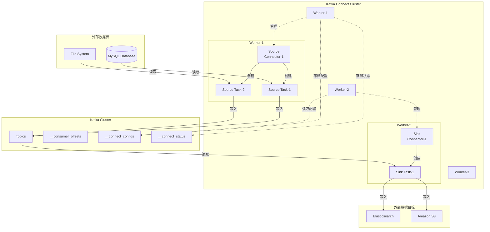

# Kafka-08-Connect-概览

## 目录
- [模块职责](#模块职责)
- [模块级架构图](#模块级架构图)
- [核心组件](#核心组件)
- [Connector 开发](#connector-开发)
- [数据转换](#数据转换)
- [关键设计](#关键设计)

---

## 模块职责

**Kafka Connect** 是一个可扩展的数据集成框架，用于在 Kafka 和外部系统之间可靠地传输数据。

**主要职责**：

1. **Source Connector**：从外部系统导入数据到 Kafka
2. **Sink Connector**：从 Kafka 导出数据到外部系统
3. **分布式运行**：支持集群模式，自动负载均衡和故障转移
4. **数据转换**：内置 Transformations 支持数据转换
5. **偏移量管理**：自动管理数据同步的偏移量
6. **配置管理**：动态创建、更新、删除 Connector
7. **REST API**：提供 HTTP API 管理 Connector

---

## 模块级架构图



### 架构说明

**Workers**：

- Connect 集群的工作节点
- 运行 Connectors 和 Tasks
- 支持分布式模式和单机模式

**Connectors**：

- 定义数据源/目标的逻辑
- 管理 Tasks 的创建和分配
- Source Connector：导入数据
- Sink Connector：导出数据

**Tasks**：

- 执行实际的数据复制工作
- 可以并行执行
- 由 Worker 管理生命周期

**内部 Topics**：

- `__connect_configs`：存储 Connector 配置
- `__connect_status`：存储 Connector/Task 状态
- `__connect_offsets`：存储 Source Connector 偏移量

---

## 核心组件

### ConnectWorker

Worker 是 Connect 集群的基本单元。

```java
public class Worker {
    private final String workerId;
    private final Time time;
    private final KafkaProducer<byte[], byte[]> producer;
    private final KafkaConsumer<byte[], byte[]> consumer;
    
    private final Map<String, WorkerConnector> connectors = new HashMap<>();
    private final Map<ConnectorTaskId, WorkerTask> tasks = new HashMap<>();
    
    // 启动 Connector
    public void startConnector(
        String connectorName,
        Map<String, String> connectorProps,
        ConnectorContext ctx,
        ConnectorStatusListener statusListener
    ) {
        Connector connector = plugins.newConnector(connectorProps.get(CONNECTOR_CLASS_CONFIG));
        
        WorkerConnector workerConnector = new WorkerConnector(
            connectorName,
            connector,
            connectorProps,
            ctx,
            statusListener
        );
        
        connectors.put(connectorName, workerConnector);
        
        // 启动 Connector
        connector.start(connectorProps);
        
        // 生成 Task 配置
        List<Map<String, String>> taskConfigs = connector.taskConfigs(maxTasks);
        
        // 分配 Tasks
        for (int i = 0; i < taskConfigs.size(); i++) {
            ConnectorTaskId taskId = new ConnectorTaskId(connectorName, i);
            startTask(taskId, taskConfigs.get(i));
        }
    }
    
    // 启动 Task
    private void startTask(
        ConnectorTaskId id,
        Map<String, String> taskConfig
    ) {
        Task task = plugins.newTask(taskConfig.get(TASK_CLASS_CONFIG));
        
        WorkerTask workerTask;
        if (task instanceof SourceTask) {
            workerTask = new WorkerSourceTask(
                id,
                (SourceTask) task,
                taskConfig,
                producer,
                offsetReader,
                offsetWriter
            );
        } else {
            workerTask = new WorkerSinkTask(
                id,
                (SinkTask) task,
                taskConfig,
                consumer
            );
        }
        
        tasks.put(id, workerTask);
        workerTask.initialize();
        executor.submit(workerTask);
    }
}
```

### Source Connector

从外部系统导入数据到 Kafka。

```java
public abstract class SourceConnector extends Connector {
    // 配置验证
    @Override
    public ConfigDef config() {
        return new ConfigDef()
            .define("name", ConfigDef.Type.STRING, ConfigDef.Importance.HIGH, "Connector name")
            .define("topics", ConfigDef.Type.LIST, ConfigDef.Importance.HIGH, "Destination topics")
            .define("database.hostname", ConfigDef.Type.STRING, ConfigDef.Importance.HIGH, "Database host")
            .define("database.port", ConfigDef.Type.INT, 3306, ConfigDef.Importance.MEDIUM, "Database port");
    }
    
    // 生成 Task 配置
    @Override
    public List<Map<String, String>> taskConfigs(int maxTasks) {
        List<Map<String, String>> configs = new ArrayList<>();
        
        // 假设读取多个表
        List<String> tables = Arrays.asList("users", "orders", "products");
        
        // 为每个 Task 分配表
        int tablesPerTask = (tables.size() + maxTasks - 1) / maxTasks;
        
        for (int i = 0; i < maxTasks && i * tablesPerTask < tables.size(); i++) {
            Map<String, String> taskConfig = new HashMap<>(config);
            
            List<String> taskTables = tables.subList(
                i * tablesPerTask,
                Math.min((i + 1) * tablesPerTask, tables.size())
            );
            
            taskConfig.put("tables", String.join(",", taskTables));
            configs.add(taskConfig);
        }
        
        return configs;
    }
    
    // 返回 Task 类
    @Override
    public Class<? extends Task> taskClass() {
        return MySourceTask.class;
    }
}
```

### Source Task

执行实际的数据读取。

```java
public abstract class SourceTask extends Task {
    protected SourceTaskContext context;
    
    public void initialize(SourceTaskContext context) {
        this.context = context;
    }
    
    // 轮询数据
    public abstract List<SourceRecord> poll() throws InterruptedException;
    
    // 提交偏移量
    public void commit() throws InterruptedException {
        // 默认实现：无操作
    }
}

// 示例实现
public class MySourceTask extends SourceTask {
    private Connection dbConnection;
    private String table;
    private long lastOffset;
    
    @Override
    public void start(Map<String, String> props) {
        String hostname = props.get("database.hostname");
        int port = Integer.parseInt(props.get("database.port"));
        table = props.get("table");
        
        // 连接数据库
        dbConnection = DriverManager.getConnection(
            "jdbc:mysql://" + hostname + ":" + port,
            props.get("database.user"),
            props.get("database.password")
        );
        
        // 恢复偏移量
        Map<String, Object> offset = context.offsetStorageReader()
            .offset(Collections.singletonMap("table", table));
        
        lastOffset = offset != null ? (Long) offset.get("offset") : 0L;
    }
    
    @Override
    public List<SourceRecord> poll() throws InterruptedException {
        List<SourceRecord> records = new ArrayList<>();
        
        try {
            // 查询新数据
            Statement stmt = dbConnection.createStatement();
            ResultSet rs = stmt.executeQuery(
                "SELECT * FROM " + table + " WHERE id > " + lastOffset + " LIMIT 100"
            );
            
            while (rs.next()) {
                long id = rs.getLong("id");
                String data = rs.getString("data");
                
                // 构建 SourceRecord
                Map<String, Object> sourcePartition = Collections.singletonMap("table", table);
                Map<String, Object> sourceOffset = Collections.singletonMap("offset", id);
                
                SourceRecord record = new SourceRecord(
                    sourcePartition,
                    sourceOffset,
                    "my-topic",  // 目标 Topic
                    Schema.INT64_SCHEMA,
                    id,
                    Schema.STRING_SCHEMA,
                    data
                );
                
                records.add(record);
                lastOffset = id;
            }
            
            rs.close();
            stmt.close();
        } catch (SQLException e) {
            throw new ConnectException("Failed to poll data", e);
        }
        
        if (records.isEmpty()) {
            Thread.sleep(1000);  // 没有新数据，等待
        }
        
        return records;
    }
    
    @Override
    public void stop() {
        try {
            if (dbConnection != null) {
                dbConnection.close();
            }
        } catch (SQLException e) {
            // 记录错误
        }
    }
}
```

### Sink Connector

从 Kafka 导出数据到外部系统。

```java
public abstract class SinkConnector extends Connector {
    @Override
    public ConfigDef config() {
        return new ConfigDef()
            .define("topics", ConfigDef.Type.LIST, ConfigDef.Importance.HIGH, "Source topics")
            .define("elasticsearch.url", ConfigDef.Type.STRING, ConfigDef.Importance.HIGH, "ES URL");
    }
    
    @Override
    public List<Map<String, String>> taskConfigs(int maxTasks) {
        List<Map<String, String>> configs = new ArrayList<>();
        
        // 每个 Task 使用相同的配置
        for (int i = 0; i < maxTasks; i++) {
            configs.add(new HashMap<>(config));
        }
        
        return configs;
    }
}
```

### Sink Task

执行实际的数据写入。

```java
public abstract class SinkTask extends Task {
    protected SinkTaskContext context;
    
    public void initialize(SinkTaskContext context) {
        this.context = context;
    }
    
    // 处理记录
    public abstract void put(Collection<SinkRecord> records);
    
    // 刷盘
    public void flush(Map<TopicPartition, OffsetAndMetadata> currentOffsets) {
        // 默认实现：无操作
    }
}

// 示例实现
public class ElasticsearchSinkTask extends SinkTask {
    private RestHighLevelClient esClient;
    
    @Override
    public void start(Map<String, String> props) {
        String esUrl = props.get("elasticsearch.url");
        
        esClient = new RestHighLevelClient(
            RestClient.builder(HttpHost.create(esUrl))
        );
    }
    
    @Override
    public void put(Collection<SinkRecord> records) {
        BulkRequest bulkRequest = new BulkRequest();
        
        for (SinkRecord record : records) {
            // 构建 ES 索引请求
            String id = record.key().toString();
            String source = record.value().toString();
            
            IndexRequest indexRequest = new IndexRequest("my-index")
                .id(id)
                .source(source, XContentType.JSON);
            
            bulkRequest.add(indexRequest);
        }
        
        try {
            BulkResponse response = esClient.bulk(bulkRequest, RequestOptions.DEFAULT);
            
            if (response.hasFailures()) {
                throw new ConnectException("Bulk indexing failed: " +
                    response.buildFailureMessage());
            }
        } catch (IOException e) {
            throw new ConnectException("Failed to index documents", e);
        }
    }
    
    @Override
    public void stop() {
        try {
            if (esClient != null) {
                esClient.close();
            }
        } catch (IOException e) {
            // 记录错误
        }
    }
}
```

---

## Connector 开发

### 开发流程

**1. 实现 Connector 类**：

```java
public class MySourceConnector extends SourceConnector {
    private Map<String, String> configProps;
    
    @Override
    public void start(Map<String, String> props) {
        this.configProps = props;
    }
    
    @Override
    public Class<? extends Task> taskClass() {
        return MySourceTask.class;
    }
    
    @Override
    public List<Map<String, String>> taskConfigs(int maxTasks) {
        // 生成 Task 配置
        return ...;
    }
    
    @Override
    public void stop() {
        // 清理资源
    }
    
    @Override
    public ConfigDef config() {
        // 定义配置项
        return ...;
    }
    
    @Override
    public String version() {
        return "1.0.0";
    }
}
```

**2. 实现 Task 类**：

```java
public class MySourceTask extends SourceTask {
    @Override
    public void start(Map<String, String> props) {
        // 初始化
    }
    
    @Override
    public List<SourceRecord> poll() throws InterruptedException {
        // 读取数据
        return ...;
    }
    
    @Override
    public void stop() {
        // 清理资源
    }
    
    @Override
    public String version() {
        return "1.0.0";
    }
}
```

**3. 打包部署**：

```bash
# 打包 JAR
mvn clean package

# 复制到 Connect plugins 目录
cp target/my-connector-1.0.0.jar $KAFKA_HOME/plugins/

# 重启 Connect Worker
```

**4. 创建 Connector**：

```bash
curl -X POST http://localhost:8083/connectors \
  -H "Content-Type: application/json" \
  -d '{
    "name": "my-source-connector",
    "config": {
      "connector.class": "com.example.MySourceConnector",
      "tasks.max": "3",
      "topics": "my-topic",
      "database.hostname": "localhost",
      "database.port": "3306"
    }
  }'
```

---

## 数据转换

Connect 支持 Single Message Transforms (SMT) 对数据进行转换。

### 内置 Transformations

**1. InsertField**：添加字段

```json
{
  "transforms": "InsertSource",
  "transforms.InsertSource.type": "org.apache.kafka.connect.transforms.InsertField$Value",
  "transforms.InsertSource.static.field": "source",
  "transforms.InsertSource.static.value": "mysql"
}
```

**2. ReplaceField**：重命名字段

```json
{
  "transforms": "RenameField",
  "transforms.RenameField.type": "org.apache.kafka.connect.transforms.ReplaceField$Value",
  "transforms.RenameField.renames": "old_name:new_name"
}
```

**3. MaskField**：掩码字段

```json
{
  "transforms": "MaskSensitive",
  "transforms.MaskSensitive.type": "org.apache.kafka.connect.transforms.MaskField$Value",
  "transforms.MaskSensitive.fields": "password,credit_card"
}
```

### 自定义 Transformation

```java
public class MyTransform implements Transformation<SinkRecord> {
    
    @Override
    public SinkRecord apply(SinkRecord record) {
        Object value = record.value();
        
        if (value instanceof Struct) {
            Struct struct = (Struct) value;
            
            // 转换逻辑
            String data = struct.getString("data");
            String transformed = data.toUpperCase();
            
            // 构建新 Struct
            Struct newStruct = new Struct(struct.schema())
                .put("data", transformed);
            
            return record.newRecord(
                record.topic(),
                record.kafkaPartition(),
                record.keySchema(),
                record.key(),
                newStruct.schema(),
                newStruct,
                record.timestamp()
            );
        }
        
        return record;
    }
    
    @Override
    public ConfigDef config() {
        return new ConfigDef();
    }
    
    @Override
    public void close() {}
    
    @Override
    public void configure(Map<String, ?> configs) {}
}
```

---

## 关键设计

### 1. 分布式协调

**基于 Kafka 的协调**：

- Worker 通过 Group Coordination 协议协调
- 使用 `connect.group.id` 作为 Consumer Group ID
- Rebalance 时重新分配 Connectors 和 Tasks

### 2. 偏移量管理

**Source Connector 偏移量**：

```java
// 存储偏移量
context.offsetStorageWriter().offset(
    Collections.singletonMap("table", "users"),
    Collections.singletonMap("offset", 12345L)
);

// 读取偏移量
Map<String, Object> offset = context.offsetStorageReader()
    .offset(Collections.singletonMap("table", "users"));
```

**Sink Connector 偏移量**：

- 使用 Kafka Consumer 的偏移量管理
- 自动提交到 `__consumer_offsets`

### 3. 容错机制

**Task 重试**：

```java
@Override
public void put(Collection<SinkRecord> records) {
    int retries = 0;
    while (retries < MAX_RETRIES) {
        try {
            writeToExternalSystem(records);
            return;
        } catch (Exception e) {
            retries++;
            if (retries >= MAX_RETRIES) {
                throw new ConnectException("Failed after " + retries + " retries", e);
            }
            Thread.sleep(retryBackoffMs);
        }
    }
}
```

**Dead Letter Queue**：

```json
{
  "errors.tolerance": "all",
  "errors.deadletterqueue.topic.name": "dlq-topic",
  "errors.deadletterqueue.context.headers.enable": "true"
}
```

### 4. REST API

**常用 API**：

```bash
# 列出 Connectors
GET /connectors

# 创建 Connector
POST /connectors

# 获取 Connector 配置
GET /connectors/{name}/config

# 更新 Connector 配置
PUT /connectors/{name}/config

# 获取 Connector 状态
GET /connectors/{name}/status

# 暂停 Connector
PUT /connectors/{name}/pause

# 恢复 Connector
PUT /connectors/{name}/resume

# 重启 Connector
POST /connectors/{name}/restart

# 删除 Connector
DELETE /connectors/{name}
```

---

## 总结

**Kafka Connect 的核心价值**：

1. **简化集成**：
   - 无需编写复杂的 Producer/Consumer 代码
   - 丰富的 Connector 生态

2. **可扩展性**：
   - 支持分布式部署
   - 自动负载均衡

3. **容错性**：
   - 自动重试
   - Dead Letter Queue

4. **易管理**：
   - REST API 管理
   - 动态配置更新

5. **数据转换**：
   - 内置 SMT
   - 支持自定义转换

**最佳实践**：

1. **合理设置并行度**：`tasks.max` 根据数据量调整
2. **监控指标**：Task 失败率、延迟、吞吐量
3. **错误处理**：配置 DLQ 处理错误数据
4. **配置管理**：使用版本控制管理 Connector 配置
5. **测试**：充分测试 Connector 的容错性
