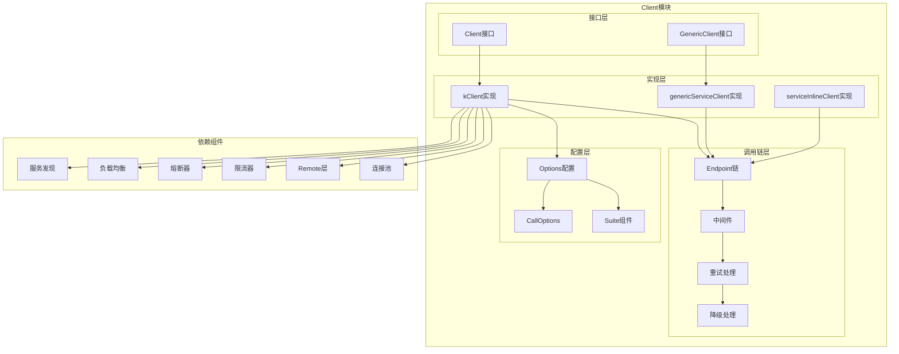
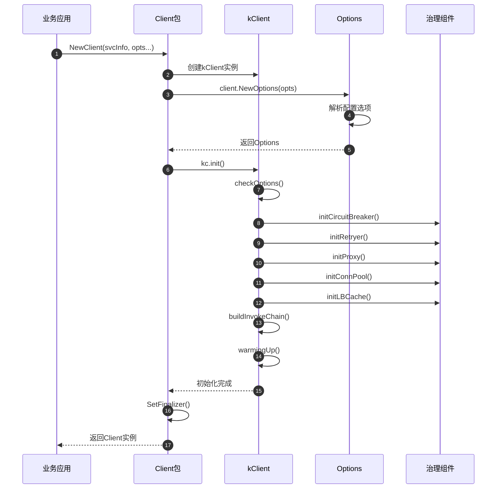
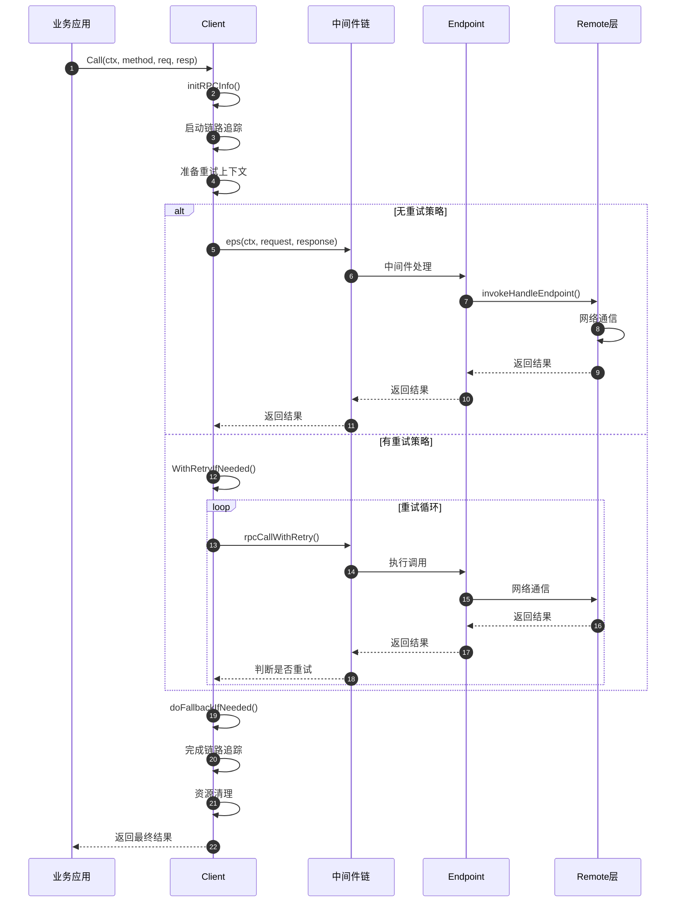
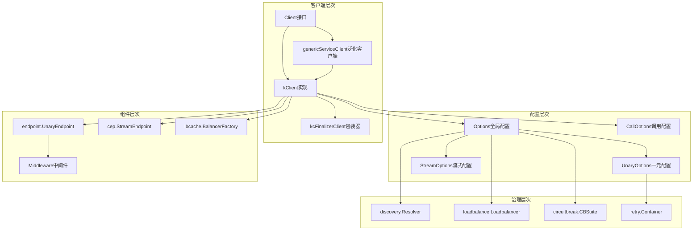
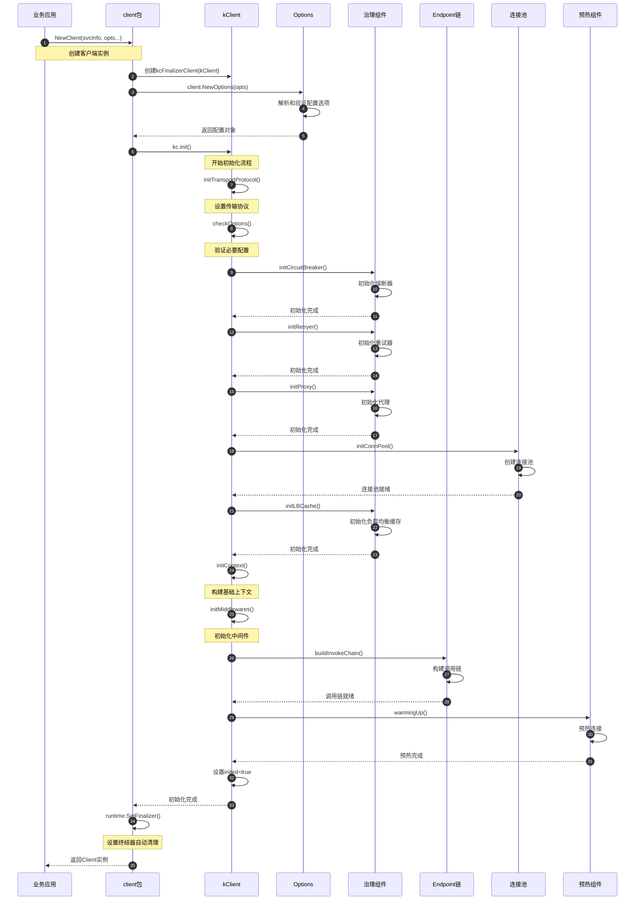
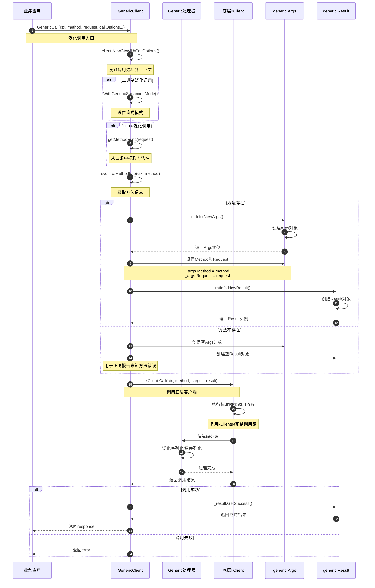
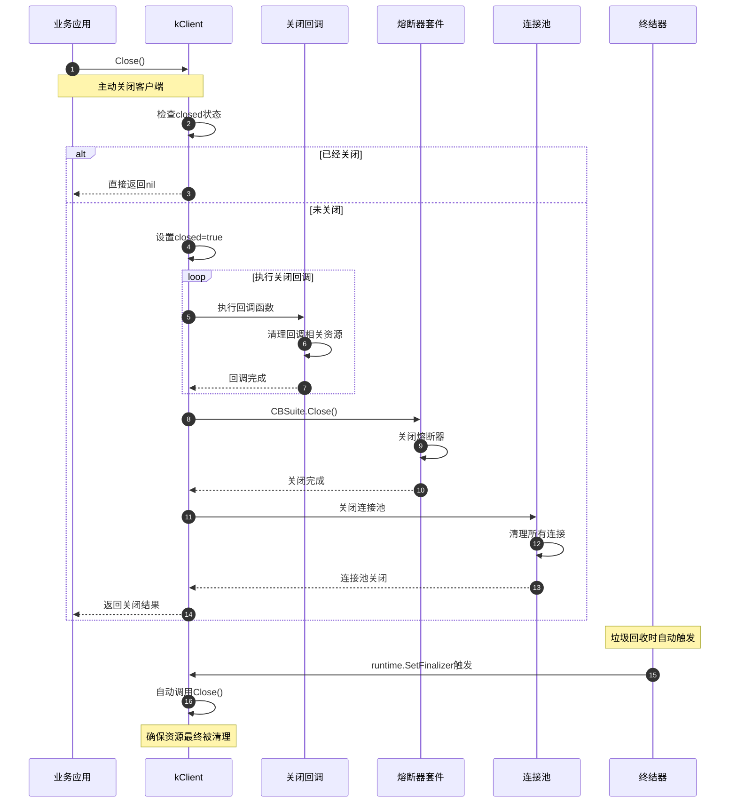

# Kitex-01-Client

## 模块概览

## 模块职责与边界

### 核心职责
Client模块是Kitex框架的客户端核心，负责发起RPC调用并处理响应。主要职责包括：

- **RPC调用管理**：提供统一的调用接口，支持同步和异步调用
- **连接管理**：维护与服务端的连接池，支持连接复用和负载均衡
- **请求路由**：根据服务发现结果选择合适的服务实例
- **协议处理**：支持多种RPC协议（Thrift、gRPC、Kitex Protobuf）
- **治理功能**：集成重试、熔断、限流、超时等服务治理能力

### 输入输出
- **输入**：业务请求对象、方法名、调用选项
- **输出**：业务响应对象或错误信息
- **上游依赖**：业务应用层
- **下游依赖**：Remote传输层、服务发现、负载均衡等治理组件

### 生命周期
1. **初始化阶段**：创建客户端实例，初始化各种组件
2. **运行阶段**：处理RPC调用请求，维护连接状态
3. **销毁阶段**：优雅关闭连接，清理资源

## 模块架构图



### 架构说明

**1. 分层设计**

- **接口层**：定义Client和GenericClient的核心接口，提供类型安全的调用方式
- **实现层**：提供不同场景下的客户端实现，支持普通调用和泛化调用
- **调用链层**：构建中间件调用链，支持重试、降级等处理逻辑
- **配置层**：管理客户端配置选项和调用时选项

**2. 组件交互**

- Client接口通过kClient实现与底层组件交互
- GenericClient支持无需代码生成的泛化调用
- serviceInlineClient用于内联服务调用优化
- 所有实现都通过Endpoint链处理请求

**3. 扩展点**

- 中间件机制支持自定义拦截器
- Suite模式支持组件化配置
- 多种负载均衡和服务发现策略

## 核心算法与流程

### 客户端初始化流程

```go
func (kc *kClient) init() (err error) {
    // 1. 初始化传输协议
    initTransportProtocol(kc.svcInfo, kc.opt.Configs)
    
    // 2. 检查配置选项
    if err = kc.checkOptions(); err != nil {
        return err
    }
    
    // 3. 初始化熔断器
    if err = kc.initCircuitBreaker(); err != nil {
        return err
    }
    
    // 4. 初始化重试器
    if err = kc.initRetryer(); err != nil {
        return err
    }
    
    // 5. 初始化代理
    if err = kc.initProxy(); err != nil {
        return err
    }
    
    // 6. 初始化连接池
    if err = kc.initConnPool(); err != nil {
        return err
    }
    
    // 7. 初始化负载均衡缓存
    if err = kc.initLBCache(); err != nil {
        return err
    }
    
    // 8. 构建调用链
    ctx := kc.initContext()
    mw := kc.initMiddlewares(ctx)
    kc.richRemoteOption()
    if err = kc.buildInvokeChain(mw); err != nil {
        return err
    }
    
    // 9. 预热连接
    if err = kc.warmingUp(); err != nil {
        return err
    }
    
    kc.inited = true
    return nil
}
```

**初始化流程说明**：

1. **协议初始化**：根据ServiceInfo设置传输协议类型
2. **配置验证**：检查必要配置项如服务名是否设置
3. **组件初始化**：按依赖顺序初始化各治理组件
4. **调用链构建**：组装中间件和端点处理器
5. **连接预热**：建立初始连接以减少首次调用延迟

### RPC调用核心流程

```go
func (kc *kClient) Call(ctx context.Context, method string, request, response interface{}) (err error) {
    // 1. 恢复上下文信息
    ctx = backup.RecoverCtxOnDemands(ctx, kc.opt.CtxBackupHandler)
    
    // 2. 校验调用状态
    validateForCall(ctx, kc.inited, kc.closed)
    
    // 3. 初始化RPC信息
    var ri rpcinfo.RPCInfo
    var callOpts *callopt.CallOptions
    ctx, ri, callOpts = kc.initRPCInfo(ctx, method, 0, nil, false)
    
    // 4. 启动链路追踪
    ctx = kc.opt.TracerCtl.DoStart(ctx, ri)
    
    // 5. 设置延迟清理逻辑
    defer func() {
        if panicInfo := recover(); panicInfo != nil {
            err = rpcinfo.ClientPanicToErr(ctx, panicInfo, ri, false)
        }
        kc.opt.TracerCtl.DoFinish(ctx, ri, err)
        if recycleRI {
            rpcinfo.PutRPCInfo(ri)
        }
        callOpts.Recycle()
    }()
    
    // 6. 准备重试上下文
    ctx = retry.PrepareRetryContext(ctx)
    
    // 7. 执行调用逻辑
    if mi := ri.Invocation().MethodInfo(); mi == nil {
        err = kerrors.ErrNonExistentMethod(kc.svcInfo.ServiceName, method)
    } else if kc.opt.UnaryOptions.RetryContainer == nil {
        // 无重试策略的调用
        err = kc.eps(ctx, request, response)
    } else {
        // 带重试策略的调用
        var lastRI rpcinfo.RPCInfo
        lastRI, recycleRI, err = kc.opt.UnaryOptions.RetryContainer.WithRetryIfNeeded(
            ctx, callOptRetry, kc.rpcCallWithRetry(ri, method), ri, request, response)
        ri = lastRI
    }
    
    // 8. 执行降级逻辑
    err, _ = doFallbackIfNeeded(ctx, ri, request, response, err,
        kc.opt.UnaryOptions.Fallback, callOpts)
    
    return err
}
```

**调用流程说明**：

1. **上下文准备**：恢复备份上下文，构建RPCInfo
2. **状态检查**：确保客户端已初始化且未关闭
3. **链路追踪**：启动分布式追踪，记录调用信息
4. **重试处理**：根据策略决定是否启用重试机制
5. **端点调用**：通过中间件链执行实际的RPC调用
6. **错误处理**：处理panic和业务错误
7. **资源清理**：回收RPCInfo和CallOptions

### 端点调用处理

```go
func (kc *kClient) invokeHandleEndpoint() (endpoint.Endpoint, error) {
    transPipl, err := newCliTransHandler(kc.opt.RemoteOpt)
    if err != nil {
        return nil, err
    }
    
    return func(ctx context.Context, req, resp interface{}) (err error) {
        var sendMsg remote.Message
        var recvMsg remote.Message
        defer func() {
            remote.RecycleMessage(sendMsg)
            remote.RecycleMessage(recvMsg)
        }()
        
        ri := rpcinfo.GetRPCInfo(ctx)
        
        // 1. 创建远程客户端
        cli, err := remotecli.NewClient(ctx, ri, transPipl, kc.opt.RemoteOpt)
        if err != nil {
            return
        }
        defer cli.Recycle()
        
        // 2. 构建发送消息
        m := ri.Invocation().MethodInfo()
        if m.OneWay() {
            sendMsg = remote.NewMessage(req, ri, remote.Oneway, remote.Client)
        } else {
            sendMsg = remote.NewMessage(req, ri, remote.Call, remote.Client)
        }
        
        // 3. 发送请求
        if err = cli.Send(ctx, ri, sendMsg); err != nil {
            return
        }
        
        // 4. 接收响应（单向调用除外）
        if m.OneWay() {
            cli.Recv(ctx, ri, nil)
            return nil
        }
        
        recvMsg = remote.NewMessage(resp, ri, remote.Reply, remote.Client)
        err = cli.Recv(ctx, ri, recvMsg)
        return err
    }, nil
}
```

**端点处理说明**：

1. **传输管道**：创建客户端传输处理管道
2. **消息构建**：根据调用类型构建发送和接收消息
3. **远程通信**：通过Remote层发送请求并接收响应
4. **资源管理**：确保消息对象和客户端连接的正确回收

## 性能优化要点

### 1. 内存管理优化
- **对象池**：RPCInfo和CallOptions使用对象池减少GC压力
- **消息回收**：及时回收Message对象避免内存泄漏
- **连接复用**：维护连接池避免频繁建立连接

### 2. 并发安全设计
- **无锁操作**：使用原子操作和不可变对象
- **上下文隔离**：每次调用使用独立的上下文
- **资源竞争**：避免多协程间的资源竞争

### 3. 调用链优化
- **中间件缓存**：预构建中间件调用链
- **端点复用**：endpoint函数可重复调用
- **延迟初始化**：按需初始化非关键组件

### 4. 错误处理优化
- **快速失败**：配置检查阶段快速发现问题
- **panic恢复**：统一的panic处理避免程序崩溃
- **错误分类**：区分业务错误和框架错误

这个概览文档详细介绍了Client模块的架构设计、核心流程和性能优化策略。接下来将继续分析Client模块的API接口和数据结构。

---

## API接口

## 基本接口定义

### Client核心接口

```go
// Client是Kitex客户端的核心接口抽象
// 专为生成代码设计，不应直接使用
type Client interface {
    Call(ctx context.Context, method string, request, response interface{}) error
}
```

| 参数 | 类型 | 必填 | 说明 |
|------|------|------|------|
| ctx | context.Context | 是 | 请求上下文，包含超时、元信息等 |
| method | string | 是 | RPC方法名，对应IDL中定义的方法 |
| request | interface{} | 是 | 请求参数对象 |
| response | interface{} | 是 | 响应结果对象 |

**返回值**：

- error：调用错误，包括网络错误、业务错误、超时错误等

### GenericClient泛化接口

```go
// GenericClient支持泛化调用，无需预生成代码
type Client interface {
    generic.Closer
    
    // GenericCall泛化调用
    GenericCall(ctx context.Context, method string, request interface{},
        callOptions ...callopt.Option) (response interface{}, err error)
        
    // 流式调用接口
    ClientStreaming(ctx context.Context, method string,
        callOptions ...streamcall.Option) (ClientStreamingClient, error)
    ServerStreaming(ctx context.Context, method string, req interface{},
        callOptions ...streamcall.Option) (ServerStreamingClient, error)
    BidirectionalStreaming(ctx context.Context, method string,
        callOptions ...streamcall.Option) (BidiStreamingClient, error)
}
```

## 客户端创建API

### NewClient - 创建类型化客户端

```go
func NewClient(svcInfo *serviceinfo.ServiceInfo, opts ...Option) (Client, error)
```

**功能说明**：
创建标准的Kitex客户端实例，需要预先通过代码生成工具生成ServiceInfo。

**请求参数**：
| 参数 | 类型 | 必填 | 说明 |
|------|------|------|------|
| svcInfo | *serviceinfo.ServiceInfo | 是 | 服务信息，包含方法定义、协议类型等 |
| opts | ...Option | 否 | 客户端配置选项 |

**响应结果**：
| 字段 | 类型 | 说明 |
|------|------|------|
| Client | Client | 客户端实例 |
| error | error | 创建错误 |

**核心实现代码**：

```go
func NewClient(svcInfo *serviceinfo.ServiceInfo, opts ...Option) (Client, error) {
    if svcInfo == nil {
        return nil, errors.New("NewClient: no service info")
    }
    
    // 1. 创建客户端实例
    kc := &kcFinalizerClient{kClient: &kClient{}}
    kc.svcInfo = svcInfo
    kc.opt = client.NewOptions(opts)
    
    // 2. 初始化客户端
    if err := kc.init(); err != nil {
        _ = kc.Close()
        return nil, err
    }
    
    // 3. 设置终结器自动清理资源
    runtime.SetFinalizer(kc, func(c *kcFinalizerClient) {
        _ = c.Close()
    })
    
    return kc, nil
}
```

### NewGenericClient - 创建泛化客户端

```go
func NewClient(destService string, g generic.Generic, opts ...client.Option) (Client, error)
```

**功能说明**：
创建泛化客户端，支持动态调用，无需预生成代码。

**请求参数**：
| 参数 | 类型 | 必填 | 说明 |
|------|------|------|------|
| destService | string | 是 | 目标服务名 |
| g | generic.Generic | 是 | 泛化调用处理器 |
| opts | ...client.Option | 否 | 客户端配置选项 |

**核心实现代码**：

```go
func NewClient(destService string, g generic.Generic, opts ...client.Option) (Client, error) {
    // 1. 生成泛化服务信息
    svcInfo := generic.ServiceInfoWithGeneric(g)
    
    // 2. 组装配置选项
    var options []client.Option
    options = append(options, client.WithGeneric(g))
    options = append(options, client.WithDestService(destService))
    options = append(options, client.WithTransportProtocol(transport.TTHeaderStreaming))
    options = append(options, opts...)
    
    // 3. 创建底层客户端
    kc, err := client.NewClient(svcInfo, options...)
    if err != nil {
        return nil, err
    }
    
    // 4. 封装为泛化客户端
    cli := &genericServiceClient{
        svcInfo: svcInfo,
        kClient: kc,
        sClient: kc.(client.Streaming),
        g:       g,
    }
    
    return cli, nil
}
```

## 配置选项API

### 基础配置选项

#### WithDestService - 设置目标服务

```go
func WithDestService(svr string) Option
```

**功能说明**：设置RPC调用的目标服务名。

**参数说明**：

- svr：目标服务名，用于服务发现和负载均衡

#### WithTransportProtocol - 设置传输协议

```go
func WithTransportProtocol(tp transport.Protocol) Option
```

**功能说明**：设置客户端使用的传输协议。

**支持的协议类型**：

- `transport.TTHeader`：TTHeader协议，支持元信息传递
- `transport.Framed`：Thrift Framed协议
- `transport.TTHeaderFramed`：TTHeader + Framed组合
- `transport.GRPC`：gRPC协议
- `transport.TTHeaderStreaming`：流式TTHeader协议

**核心实现代码**：

```go
func WithTransportProtocol(tp transport.Protocol) Option {
    return Option{F: func(o *client.Options, di *utils.Slice) {
        tpName := tp.String()
        if tpName == transport.Unknown {
            panic(fmt.Errorf("WithTransportProtocol: invalid '%v'", tp))
        }
        rpcinfo.AsMutableRPCConfig(o.Configs).SetTransportProtocol(tp)
    }}
}
```

### 连接管理配置

#### WithHostPorts - 设置目标地址

```go
func WithHostPorts(hostports ...string) Option
```

**功能说明**：设置直连目标地址，不使用服务发现。

**参数格式**：

- "host:port" 格式的地址列表
- 支持IPv4、IPv6和域名

#### WithShortConnection - 短连接模式

```go
func WithShortConnection() Option
```

**功能说明**：强制每次调用后关闭连接，适用于低频调用场景。

#### WithLongConnection - 长连接模式

```go
func WithLongConnection(cfg connpool.IdleConfig) Option
```

**功能说明**：启用长连接池，提高调用性能。

**配置参数**：

```go
type IdleConfig struct {
    MaxIdlePerAddress int           // 每个地址最大空闲连接数
    MaxIdleGlobal     int           // 全局最大空闲连接数  
    MaxIdleTimeout    time.Duration // 空闲连接超时时间
    MinIdlePerAddress int           // 每个地址最小空闲连接数
}
```

#### WithMuxConnection - 多路复用连接

```go
func WithMuxConnection(connNum int) Option
```

**功能说明**：启用连接多路复用，单连接支持并发请求。

**核心实现代码**：

```go
func WithMuxConnection(connNum int) Option {
    return Option{F: func(o *client.Options, di *utils.Slice) {
        // 1. 设置多路复用连接池
        o.RemoteOpt.ConnPool = netpollmux.NewMuxConnPool(connNum)
        
        // 2. 设置传输处理器工厂
        WithTransHandlerFactory(netpollmux.NewCliTransHandlerFactory()).F(o, di)
        
        // 3. 强制使用TTHeader协议
        rpcinfo.AsMutableRPCConfig(o.Configs).SetTransportProtocol(transport.TTHeader)
    }}
}
```

### 超时配置

#### WithRPCTimeout - RPC超时时间

```go
func WithRPCTimeout(d time.Duration) Option
```

**功能说明**：设置RPC调用的总超时时间。

**注意事项**：

- 仅对一元调用有效
- 建议使用WithUnaryOptions(WithUnaryRPCTimeout(d))替代

#### WithConnectTimeout - 连接超时时间

```go
func WithConnectTimeout(d time.Duration) Option
```

**功能说明**：设置建立连接的超时时间。

### 服务治理配置

#### WithResolver - 服务发现

```go
func WithResolver(r discovery.Resolver) Option
```

**功能说明**：设置服务发现解析器，用于获取服务实例列表。

#### WithLoadBalancer - 负载均衡

```go
func WithLoadBalancer(lb loadbalance.Loadbalancer, opts ...*lbcache.Options) Option
```

**功能说明**：设置负载均衡策略。

**支持的负载均衡算法**：

- 轮询（Round Robin）
- 随机（Random）
- 一致性哈希（Consistent Hash）
- 加权轮询（Weighted Round Robin）
- 加权随机（Weighted Random）

#### WithCircuitBreaker - 熔断器

```go
func WithCircuitBreaker(s *circuitbreak.CBSuite) Option
```

**功能说明**：设置熔断器，防止故障传播。

#### WithRetryPolicy - 重试策略

```go
func WithFailureRetry(p *retry.FailurePolicy) Option
func WithBackupRequest(p *retry.BackupPolicy) Option
```

**功能说明**：设置失败重试和备份请求策略。

### 中间件配置

#### WithMiddleware - 添加中间件

```go
func WithMiddleware(mw endpoint.Middleware) Option
```

**功能说明**：添加请求处理中间件。

**中间件签名**：

```go
type Middleware func(endpoint.Endpoint) endpoint.Endpoint
type Endpoint func(ctx context.Context, req, resp interface{}) error
```

**核心实现代码**：

```go
func WithMiddleware(mw endpoint.Middleware) Option {
    mwb := func(ctx context.Context) endpoint.Middleware {
        return mw
    }
    return Option{F: func(o *client.Options, di *utils.Slice) {
        o.MWBs = append(o.MWBs, mwb)
    }}
}
```

#### WithInstanceMW - 实例级中间件

```go
func WithInstanceMW(mw endpoint.Middleware) Option
```

**功能说明**：添加在服务发现和负载均衡之后执行的中间件。

### 链路追踪配置

#### WithTracer - 添加追踪器

```go
func WithTracer(c stats.Tracer) Option
```

**功能说明**：添加分布式链路追踪器。

#### WithStatsLevel - 统计级别

```go
func WithStatsLevel(level stats.Level) Option
```

**功能说明**：设置统计信息收集级别。

**统计级别**：

- `stats.LevelDisabled`：禁用统计
- `stats.LevelBase`：基础统计
- `stats.LevelDetailed`：详细统计

## 调用选项API

### CallOptions - 调用时选项

```go
type CallOptions struct {
    Tags    map[string]string    // 调用标签
    Timeout time.Duration        // 调用超时
    Retry   *retry.Policy        // 重试策略
    // 其他选项...
}
```

### 常用调用选项

#### WithCallTimeout - 调用超时

```go
func WithCallTimeout(d time.Duration) callopt.Option
```

#### WithCallTag - 调用标签

```go
func WithCallTag(key, val string) callopt.Option
```

#### WithCallRetry - 调用重试

```go
func WithCallRetry(p retry.Policy) callopt.Option
```

## 时序图 - 客户端创建流程



## 时序图 - RPC调用流程



## 异常处理与性能要点

### 异常处理策略

**1. 配置验证错误**

- 客户端创建时进行配置验证
- 无效配置直接panic，快速失败
- 必要参数缺失返回明确错误信息

**2. 网络通信错误**

- 连接超时：触发重试或熔断
- 传输错误：根据错误类型决定重试
- 协议错误：记录日志并返回框架错误

**3. 业务逻辑错误**

- 透传业务异常给调用方
- 区分框架错误和业务错误
- 支持自定义错误处理逻辑

### 性能优化要点

**1. 连接管理优化**

- 连接池复用减少握手开销
- 多路复用提高连接利用率
- 空闲连接清理避免资源浪费

**2. 内存管理优化**

- RPCInfo对象池减少分配
- Message对象及时回收
- 避免不必要的内存拷贝

**3. 调用链优化**

- 中间件链预构建
- 端点函数可重复调用
- 减少反射和动态分配

**4. 并发安全优化**

- 无锁数据结构
- 原子操作替代锁
- 上下文隔离避免竞争

这个API文档详细介绍了Client模块的所有公开接口、配置选项和使用方式，为开发者提供了完整的API参考。

---

## 数据结构

## 核心数据结构UML图

```mermaid
classDiagram
    class Client {
        <<interface>>
        +Call(ctx context.Context, method string, request, response interface{}) error
    }
    
    class kClient {
        -svcInfo *serviceinfo.ServiceInfo
        -eps endpoint.UnaryEndpoint
        -sEps cep.StreamEndpoint
        -opt *client.Options
        -lbf *lbcache.BalancerFactory
        -inited bool
        -closed bool
        +Call(ctx context.Context, method string, request, response interface{}) error
        +Close() error
        -init() error
        -buildInvokeChain(mw middleware) error
        -invokeHandleEndpoint() endpoint.Endpoint
    }
    
    class kcFinalizerClient {
        -kClient *kClient
        +Call(ctx context.Context, method string, request, response interface{}) error
    }
    
    class Options {
        +Cli *rpcinfo.EndpointBasicInfo
        +Svr *rpcinfo.EndpointBasicInfo
        +Configs rpcinfo.RPCConfig
        +Locks *ConfigLocks
        +UnaryOptions UnaryOptions
        +StreamOptions StreamOptions
        +MetaHandlers []remote.MetaHandler
        +RemoteOpt *remote.ClientOption
        +Proxy proxy.ForwardProxy
        +Resolver discovery.Resolver
        +Balancer loadbalance.Loadbalancer
        +CBSuite *circuitbreak.CBSuite
        +TracerCtl *rpcinfo.TraceController
        +Apply(opts []Option)
    }
    
    class CallOptions {
        -configs rpcinfo.MutableRPCConfig
        -svr remoteinfo.RemoteInfo
        -locks *ConfigLocks
        -httpResolver http.Resolver
        +RetryPolicy retry.Policy
        +Fallback *fallback.Policy
        +CompressorName string
        +StreamOptions StreamOptions
        +Recycle()
    }
    
    class Option {
        +F func(o *Options, di *utils.Slice)
    }
    
    class UnaryOptions {
        -opts *Options
        +UnaryMiddlewares []endpoint.UnaryMiddleware
        +UnaryMiddlewareBuilders []endpoint.UnaryMiddlewareBuilder
        +RetryMethodPolicies map[string]retry.Policy
        +RetryContainer *retry.Container
        +Fallback *fallback.Policy
        +InitMiddlewares(ctx context.Context)
        +SetUnaryRPCTimeout(d time.Duration)
    }
    
    class genericServiceClient {
        -svcInfo *serviceinfo.ServiceInfo
        -kClient client.Client
        -sClient client.Streaming
        -g generic.Generic
        -isBinaryGeneric bool
        -getMethodFunc generic.GetMethodNameByRequestFunc
        +GenericCall(ctx context.Context, method string, request interface{}, callOptions ...callopt.Option) (interface{}, error)
        +Close() error
    }
    
    Client <|-- kClient
    Client <|-- genericServiceClient
    kClient <|-- kcFinalizerClient
    kClient --> Options
    kClient --> CallOptions
    Options --> UnaryOptions
    Options --> StreamOptions
    Options --> Option
    genericServiceClient --> kClient
```

## 主要数据结构详解

### 1. Client接口

```go
// Client是Kitex客户端的核心接口抽象
// 专为生成代码设计，不应直接使用
type Client interface {
    Call(ctx context.Context, method string, request, response interface{}) error
}
```

**字段说明**：

- 这是一个接口定义，所有客户端实现都必须实现Call方法
- 设计为代码生成工具使用，业务代码不直接调用
- 支持同步RPC调用，异步调用通过其他接口实现

### 2. kClient核心实现

```go
type kClient struct {
    svcInfo *serviceinfo.ServiceInfo  // 服务信息，包含方法定义和协议类型
    eps     endpoint.UnaryEndpoint    // 一元调用端点
    sEps    cep.StreamEndpoint        // 流式调用端点
    
    opt *client.Options               // 客户端配置选项
    lbf *lbcache.BalancerFactory     // 负载均衡器工厂
    
    inited bool                      // 初始化状态标记
    closed bool                      // 关闭状态标记
}
```

**字段映射与说明**：

| 字段 | 类型 | 必填 | 默认值 | 约束 | 说明 |
|------|------|------|--------|------|------|
| svcInfo | *serviceinfo.ServiceInfo | 是 | nil | 非空 | 服务元信息，包含IDL定义的方法签名 |
| eps | endpoint.UnaryEndpoint | 否 | nil | - | 一元调用处理链，包含中间件和端点处理器 |
| sEps | cep.StreamEndpoint | 否 | nil | - | 流式调用处理链 |
| opt | *client.Options | 是 | nil | 非空 | 客户端全局配置选项 |
| lbf | *lbcache.BalancerFactory | 否 | nil | - | 负载均衡器工厂，用于创建负载均衡器实例 |
| inited | bool | - | false | - | 标记客户端是否已完成初始化 |
| closed | bool | - | false | - | 标记客户端是否已关闭 |

**生命周期管理**：

- **创建阶段**：通过NewClient函数创建，设置ServiceInfo和Options
- **初始化阶段**：调用init()方法初始化各组件，构建调用链
- **运行阶段**：处理RPC调用，维护连接和状态
- **销毁阶段**：调用Close()方法清理资源，设置closed标记

### 3. kcFinalizerClient包装器

```go
type kcFinalizerClient struct {
    *kClient
}
```

**设计目的**：

- 解决kClient的循环引用问题，确保垃圾回收器能正确回收
- 在invokeHandleEndpoint构建端点时会产生循环引用
- 通过包装器模式，在包装器上设置finalizer实现自动清理

**核心方法**：

```go
func (kf *kcFinalizerClient) Call(ctx context.Context, method string, request, response interface{}) error {
    defer runtime.KeepAlive(kf)  // 确保对象在调用期间不被回收
    return kf.kClient.Call(ctx, method, request, response)
}
```

### 4. Options配置结构

```go
type Options struct {
    // 基础信息
    Cli     *rpcinfo.EndpointBasicInfo  // 客户端端点信息
    Svr     *rpcinfo.EndpointBasicInfo  // 服务端端点信息
    Configs rpcinfo.RPCConfig           // RPC配置信息
    Locks   *ConfigLocks                // 配置锁定状态
    Once    *configutil.OptionOnce      // 一次性配置检查
    
    // 调用选项
    UnaryOptions  UnaryOptions          // 一元调用选项
    StreamOptions StreamOptions         // 流式调用选项
    
    // 扩展组件
    MetaHandlers []remote.MetaHandler   // 元信息处理器
    RemoteOpt    *remote.ClientOption   // 远程调用选项
    Proxy        proxy.ForwardProxy     // 代理配置
    
    // 服务治理
    Resolver         discovery.Resolver      // 服务发现解析器
    HTTPResolver     http.Resolver           // HTTP解析器
    Balancer         loadbalance.Loadbalancer // 负载均衡器
    BalancerCacheOpt *lbcache.Options        // 负载均衡缓存选项
    PoolCfg          *connpool.IdleConfig    // 连接池配置
    CBSuite          *circuitbreak.CBSuite   // 熔断器套件
    Timeouts         rpcinfo.TimeoutProvider // 超时提供器
    
    // 安全控制
    ACLRules []acl.RejectFunc           // 访问控制规则
    
    // 中间件
    MWBs  []endpoint.MiddlewareBuilder  // 中间件构建器
    IMWBs []endpoint.MiddlewareBuilder  // 实例中间件构建器
    
    // 事件系统
    Bus          event.Bus              // 事件总线
    Events       event.Queue            // 事件队列
    ExtraTimeout time.Duration          // 额外超时时间
    
    // 调试与诊断
    DebugInfo    utils.Slice            // 调试信息
    DebugService diagnosis.Service      // 诊断服务
    
    // 可观测性
    TracerCtl  *rpcinfo.TraceController // 链路追踪控制器
    StatsLevel *stats.Level             // 统计级别
    
    // 生命周期
    CloseCallbacks []func() error       // 关闭回调函数
    WarmUpOption   *warmup.ClientOption // 预热选项
    
    // 协议特定选项
    GRPCConnPoolSize         uint32                    // gRPC连接池大小
    GRPCConnectOpts          *grpc.ConnectOptions      // gRPC连接选项
    TTHeaderStreamingOptions TTHeaderStreamingOptions  // TTHeader流式选项
    
    // XDS支持
    XDSEnabled          bool                 // XDS功能开关
    XDSRouterMiddleware endpoint.Middleware  // XDS路由中间件
    
    // 上下文备份
    CtxBackupHandler backup.BackupHandler   // 上下文备份处理器
}
```

**关键字段说明**：

1. **基础配置**：
   - `Cli/Svr`：客户端和服务端的基础信息，包含服务名、地址等
   - `Configs`：RPC配置，包含超时、协议等设置
   - `Locks`：配置锁定机制，防止运行时修改关键配置

2. **服务治理**：
   - `Resolver`：服务发现组件，获取服务实例列表
   - `Balancer`：负载均衡器，选择目标服务实例
   - `CBSuite`：熔断器套件，提供故障隔离能力
   - `Timeouts`：超时管理，支持动态超时配置

3. **扩展机制**：
   - `MWBs`：中间件构建器，支持请求拦截和处理
   - `MetaHandlers`：元信息处理器，处理协议头信息
   - `ACLRules`：访问控制规则，提供安全过滤

### 5. CallOptions调用选项

```go
type CallOptions struct {
    configs      rpcinfo.MutableRPCConfig  // 可变RPC配置
    svr          remoteinfo.RemoteInfo     // 远程服务信息
    locks        *ConfigLocks              // 配置锁
    httpResolver http.Resolver             // HTTP解析器
    
    // 导出字段供客户端使用
    RetryPolicy    retry.Policy            // 重试策略
    Fallback       *fallback.Policy        // 降级策略
    CompressorName string                  // 压缩器名称
    StreamOptions  StreamOptions           // 流式选项
}
```

**字段映射与版本演进**：

| 字段 | 类型 | 版本 | 约束 | 说明 |
|------|------|------|------|------|
| configs | rpcinfo.MutableRPCConfig | v1.0+ | 非空 | 单次调用的RPC配置，可覆盖全局配置 |
| svr | remoteinfo.RemoteInfo | v1.0+ | - | 目标服务的远程信息 |
| RetryPolicy | retry.Policy | v1.2+ | - | 调用级别的重试策略，优先级高于全局策略 |
| Fallback | *fallback.Policy | v1.3+ | - | 降级策略，调用失败时的备选方案 |
| CompressorName | string | v1.4+ | - | 数据压缩器名称，如gzip、snappy等 |
| StreamOptions | StreamOptions | v1.5+ | - | 流式调用相关选项 |

**对象池管理**：

```go
var callOptionsPool = sync.Pool{
    New: newOptions,
}

// 回收CallOptions对象到池中
func (co *CallOptions) Recycle() {
    if co == nil {
        return
    }
    // 清零所有字段
    co.configs = nil
    co.svr = nil
    co.RetryPolicy = retry.Policy{}
    co.Fallback = nil
    co.locks.Zero()
    callOptionsPool.Put(co)
}
```

### 6. UnaryOptions一元调用选项

```go
type UnaryOptions struct {
    opts *Options  // 父级Options引用
    
    // 中间件配置
    UnaryMiddlewares        []endpoint.UnaryMiddleware        // 一元中间件列表
    UnaryMiddlewareBuilders []endpoint.UnaryMiddlewareBuilder // 中间件构建器
    
    // 重试配置
    RetryMethodPolicies map[string]retry.Policy // 按方法的重试策略
    RetryContainer      *retry.Container        // 重试容器
    RetryWithResult     *retry.ShouldResultRetry // 结果重试判断器
    
    // 降级配置
    Fallback *fallback.Policy // 降级策略
}
```

**核心方法实现**：

```go
// 初始化中间件，将构建器转换为实际中间件
func (o *UnaryOptions) InitMiddlewares(ctx context.Context) {
    if len(o.UnaryMiddlewareBuilders) > 0 {
        unaryMiddlewares := make([]endpoint.UnaryMiddleware, 0, len(o.UnaryMiddlewareBuilders))
        for _, mwb := range o.UnaryMiddlewareBuilders {
            unaryMiddlewares = append(unaryMiddlewares, mwb(ctx))
        }
        o.UnaryMiddlewares = append(o.UnaryMiddlewares, unaryMiddlewares...)
    }
}

// 设置一元调用的RPC超时时间
func (o *UnaryOptions) SetUnaryRPCTimeout(d time.Duration) {
    rpcinfo.AsMutableRPCConfig(o.opts.Configs).SetRPCTimeout(d)
    o.opts.Locks.Bits |= rpcinfo.BitRPCTimeout
}
```

### 7. genericServiceClient泛化客户端

```go
type genericServiceClient struct {
    svcInfo *serviceinfo.ServiceInfo  // 服务信息
    kClient client.Client             // 底层客户端
    sClient client.Streaming          // 流式客户端
    g       generic.Generic           // 泛化处理器
    
    // 泛化调用特殊标记
    isBinaryGeneric bool                                    // 是否为二进制泛化
    getMethodFunc   generic.GetMethodNameByRequestFunc     // 从请求获取方法名的函数
}
```

**字段说明**：

- `svcInfo`：通过generic.ServiceInfoWithGeneric()生成的服务信息
- `kClient`：复用标准客户端的底层实现
- `g`：泛化处理器，负责请求/响应的序列化和反序列化
- `isBinaryGeneric`：标记是否为二进制泛化调用模式
- `getMethodFunc`：HTTP泛化中从请求体提取方法名的函数

## 数据结构关系图



## 内存管理与性能优化

### 1. 对象池化设计

**CallOptions对象池**：

```go
var callOptionsPool = sync.Pool{
    New: newOptions,
}
```

- 减少CallOptions对象的频繁分配和GC压力
- 每次调用结束后通过Recycle()方法回收对象
- 支持高并发场景下的内存复用

### 2. 引用管理策略

**循环引用解决**：

- kClient在构建endpoint时会产生循环引用
- 通过kcFinalizerClient包装器解决引用问题
- 使用runtime.SetFinalizer确保资源正确释放

**资源生命周期**：

- Options在客户端创建时分配，生命周期与客户端一致
- CallOptions按调用分配，调用结束后立即回收
- ServiceInfo全局共享，支持多个客户端实例复用

### 3. 并发安全设计

**配置锁机制**：

```go
type ConfigLocks struct {
    Bits rpcinfo.Lockable  // 位标记锁定的配置项
    Tags map[string]struct{} // 锁定的标签键
}
```

- 防止运行时修改关键配置导致的并发问题
- 支持细粒度的配置项锁定
- 通过位操作提高锁检查性能

**无锁数据结构**：

- 中间件列表在初始化后不再修改，支持并发读取
- 使用原子操作管理客户端状态（inited、closed）
- 事件系统采用无锁队列实现高性能事件传递

这个数据结构文档详细介绍了Client模块的核心数据结构、字段含义、版本演进和性能优化策略，为开发者理解和扩展Client功能提供了完整的参考。

---

## 时序图

## 1. 客户端创建与初始化时序图



### 初始化时序说明

**1. 配置解析阶段（步骤1-3）**

- 业务应用调用NewClient创建客户端
- 解析传入的配置选项，构建Options对象
- 创建kClient实例并设置基础属性

**2. 组件初始化阶段（步骤4-11）**

- 按依赖顺序初始化各个治理组件
- 熔断器、重试器、代理等组件独立初始化
- 连接池创建并准备接受连接

**3. 调用链构建阶段（步骤12-15）**

- 初始化中间件和上下文
- 构建端点调用链，包含所有中间件
- 设置流式调用端点

**4. 预热与完成阶段（步骤16-19）**

- 执行连接预热，建立初始连接
- 设置初始化完成标记
- 配置终结器确保资源清理

## 2. RPC调用主流程时序图

```mermaid
sequenceDiagram
    autonumber
    participant APP as 业务应用
    participant CLIENT as kClient
    participant CALLOPT as CallOptions
    participant TRACER as 链路追踪
    participant RETRY as 重试容器
    participant ENDPOINT as Endpoint链
    participant MW as 中间件
    participant HANDLER as 端点处理器
    participant REMOTE as Remote层
    participant FALLBACK as 降级处理
    
    APP->>CLIENT: Call(ctx, method, req, resp)
    Note over APP,CLIENT: 发起RPC调用
    
    CLIENT->>CLIENT: backup.RecoverCtxOnDemands()
    Note over CLIENT: 恢复上下文备份
    
    CLIENT->>CLIENT: validateForCall()
    Note over CLIENT: 验证调用状态
    
    CLIENT->>CALLOPT: initRPCInfo()
    CALLOPT->>CALLOPT: 构建RPCInfo和CallOptions
    CALLOPT-->>CLIENT: 返回ctx, ri, callOpts
    
    CLIENT->>TRACER: TracerCtl.DoStart()
    TRACER->>TRACER: 启动链路追踪
    TRACER-->>CLIENT: 追踪上下文
    
    CLIENT->>CLIENT: retry.PrepareRetryContext()
    Note over CLIENT: 准备重试上下文
    
    alt 无重试策略
        CLIENT->>ENDPOINT: eps(ctx, request, response)
        ENDPOINT->>MW: 执行中间件链
        MW->>HANDLER: 调用端点处理器
        HANDLER->>REMOTE: invokeHandleEndpoint()
        REMOTE->>REMOTE: 网络通信处理
        REMOTE-->>HANDLER: 返回结果
        HANDLER-->>MW: 返回结果
        MW-->>ENDPOINT: 返回结果
        ENDPOINT-->>CLIENT: 返回结果
    else 有重试策略
        CLIENT->>RETRY: WithRetryIfNeeded()
        loop 重试循环
            RETRY->>CLIENT: rpcCallWithRetry()
            CLIENT->>ENDPOINT: eps(ctx, request, response)
            ENDPOINT->>MW: 执行中间件链
            MW->>HANDLER: 调用端点处理器
            HANDLER->>REMOTE: invokeHandleEndpoint()
            REMOTE->>REMOTE: 网络通信处理
            REMOTE-->>HANDLER: 返回结果或错误
            HANDLER-->>MW: 返回结果或错误
            MW-->>ENDPOINT: 返回结果或错误
            ENDPOINT-->>CLIENT: 返回结果或错误
            CLIENT->>RETRY: 判断是否需要重试
            alt 需要重试
                RETRY->>RETRY: 准备下次重试
            else 不需要重试
                break 退出重试循环
            end
        end
        RETRY-->>CLIENT: 返回最终结果
    end
    
    CLIENT->>FALLBACK: doFallbackIfNeeded()
    alt 需要降级
        FALLBACK->>FALLBACK: 执行降级逻辑
        FALLBACK-->>CLIENT: 返回降级结果
    else 不需要降级
        FALLBACK-->>CLIENT: 返回原始结果
    end
    
    CLIENT->>TRACER: TracerCtl.DoFinish()
    TRACER->>TRACER: 完成链路追踪
    TRACER-->>CLIENT: 追踪完成
    
    CLIENT->>CALLOPT: callOpts.Recycle()
    CALLOPT->>CALLOPT: 回收对象到池
    CALLOPT-->>CLIENT: 回收完成
    
    CLIENT-->>APP: 返回最终结果
```

### 调用流程说明

**1. 请求准备阶段（步骤1-6）**

- 恢复上下文备份信息，确保元信息传递
- 验证客户端状态，确保已初始化且未关闭
- 构建RPCInfo和CallOptions，包含调用元信息
- 启动分布式链路追踪，记录调用开始

**2. 重试判断与执行阶段（步骤7-15）**

- 根据配置决定是否启用重试机制
- 无重试：直接执行端点调用链
- 有重试：通过重试容器管理重试逻辑
- 重试循环中根据错误类型决定是否继续

**3. 降级处理阶段（步骤16-17）**

- 根据错误类型和配置决定是否执行降级
- 降级逻辑可以返回默认值或调用备用服务
- 确保服务在异常情况下的可用性

**4. 资源清理阶段（步骤18-20）**

- 完成链路追踪，记录调用结果和耗时
- 回收CallOptions对象到对象池
- 返回最终结果给业务应用

## 3. 端点处理器调用时序图

```mermaid
sequenceDiagram
    autonumber
    participant EP as Endpoint
    participant HANDLER as invokeHandleEndpoint
    parameter TRANS as TransHandler
    participant CLI as RemoteClient
    participant CODEC as 编解码器
    participant NETPOLL as Netpoll网络层
    participant SERVER as 远程服务器
    
    EP->>HANDLER: invokeHandleEndpoint()
    Note over EP,HANDLER: 端点处理器调用
    
    HANDLER->>TRANS: newCliTransHandler()
    TRANS->>TRANS: 创建传输处理管道
    TRANS-->>HANDLER: 返回传输管道
    
    HANDLER->>CLI: remotecli.NewClient()
    CLI->>CLI: 创建远程客户端实例
    CLI-->>HANDLER: 返回客户端
    
    HANDLER->>HANDLER: 构建发送消息
    Note over HANDLER: 根据调用类型创建Message
    
    alt OneWay调用
        HANDLER->>HANDLER: remote.NewMessage(req, ri, Oneway, Client)
    else 普通调用
        HANDLER->>HANDLER: remote.NewMessage(req, ri, Call, Client)
    end
    
    HANDLER->>CLI: cli.Send(ctx, ri, sendMsg)
    CLI->>CODEC: 编码请求消息
    CODEC->>CODEC: 序列化请求对象
    CODEC-->>CLI: 返回编码数据
    
    CLI->>NETPOLL: 发送网络数据包
    NETPOLL->>NETPOLL: 网络传输处理
    NETPOLL->>SERVER: 数据包到达服务器
    
    alt OneWay调用
        CLI->>CLI: cli.Recv(ctx, ri, nil)
        Note over CLI: 单向调用不等待响应
        CLI-->>HANDLER: 立即返回
    else 普通调用
        SERVER->>NETPOLL: 服务器返回响应
        NETPOLL->>NETPOLL: 接收网络数据包
        NETPOLL-->>CLI: 响应数据到达
        
        CLI->>HANDLER: 构建接收消息
        HANDLER->>HANDLER: remote.NewMessage(resp, ri, Reply, Client)
        
        CLI->>CLI: cli.Recv(ctx, ri, recvMsg)
        CLI->>CODEC: 解码响应消息
        CODEC->>CODEC: 反序列化响应对象
        CODEC-->>CLI: 返回解码对象
        CLI-->>HANDLER: 返回响应结果
    end
    
    HANDLER->>HANDLER: 资源清理
    Note over HANDLER: 回收Message和Client
    
    HANDLER-->>EP: 返回调用结果
```

### 端点处理说明

**1. 传输层准备（步骤1-3）**

- 创建传输处理管道，配置协议和编解码器
- 创建远程客户端实例，管理连接和通信
- 根据RPCInfo选择合适的传输策略

**2. 消息构建与发送（步骤4-8）**

- 根据调用类型（OneWay/Call）构建不同的消息
- 通过编解码器序列化请求对象
- 使用Netpoll网络层发送数据包

**3. 响应处理（步骤9-15）**

- OneWay调用：直接返回，不等待响应
- 普通调用：等待服务器响应并解码
- 处理网络传输和协议解析

**4. 资源管理（步骤16-17）**

- 及时回收Message对象避免内存泄漏
- 回收RemoteClient连接到连接池
- 确保异常情况下的资源清理

## 4. 泛化调用时序图



### 泛化调用说明

**1. 调用准备阶段（步骤1-4）**

- 设置调用选项到上下文中
- 二进制泛化需要设置流式模式标记
- HTTP泛化从请求体中动态提取方法名
- 支持多种泛化调用模式

**2. 参数构建阶段（步骤5-10）**

- 根据方法信息创建Args和Result对象
- Args包装原始请求，Result用于接收响应
- 处理未知方法的情况，确保错误正确报告
- 泛化对象承载实际的业务数据

**3. 底层调用阶段（步骤11-14）**

- 复用kClient的完整调用链和治理能力
- 泛化处理器负责动态的序列化和反序列化
- 支持所有标准RPC功能（重试、熔断、追踪等）
- 保持与类型化调用相同的性能特征

**4. 结果处理阶段（步骤15-17）**

- 从Result对象中提取成功结果
- 错误直接透传给业务应用
- 支持复杂的响应结构和错误处理

## 5. 客户端关闭时序图



### 关闭流程说明

**1. 状态检查（步骤1-3）**

- 检查客户端是否已经关闭
- 设置关闭标记防止重复关闭
- 确保关闭操作的幂等性

**2. 回调执行（步骤4-6）**

- 按顺序执行所有注册的关闭回调
- 回调函数负责清理各自管理的资源
- 收集所有回调的错误信息

**3. 组件关闭（步骤7-10）**

- 关闭熔断器套件，停止状态统计
- 关闭连接池，释放所有网络连接
- 清理其他需要显式释放的资源

**4. 终结器保障（步骤11-13）**

- 垃圾回收时自动触发终结器
- 确保即使忘记调用Close也能清理资源
- 提供最后的资源泄漏防护

## 时序图总结

这些时序图展示了Kitex Client模块的完整生命周期：

1. **创建初始化**：展示了客户端从创建到可用的完整过程
2. **RPC调用**：展示了标准RPC调用的完整流程，包括重试和降级
3. **端点处理**：展示了底层网络通信的详细过程
4. **泛化调用**：展示了无代码生成的动态调用机制
5. **资源清理**：展示了客户端关闭和资源回收过程

每个时序图都包含了详细的步骤说明和关键节点分析，帮助开发者理解Client模块的内部工作机制和扩展点。

---
