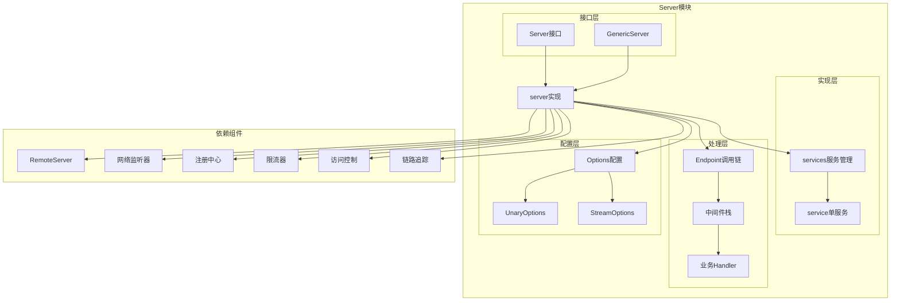
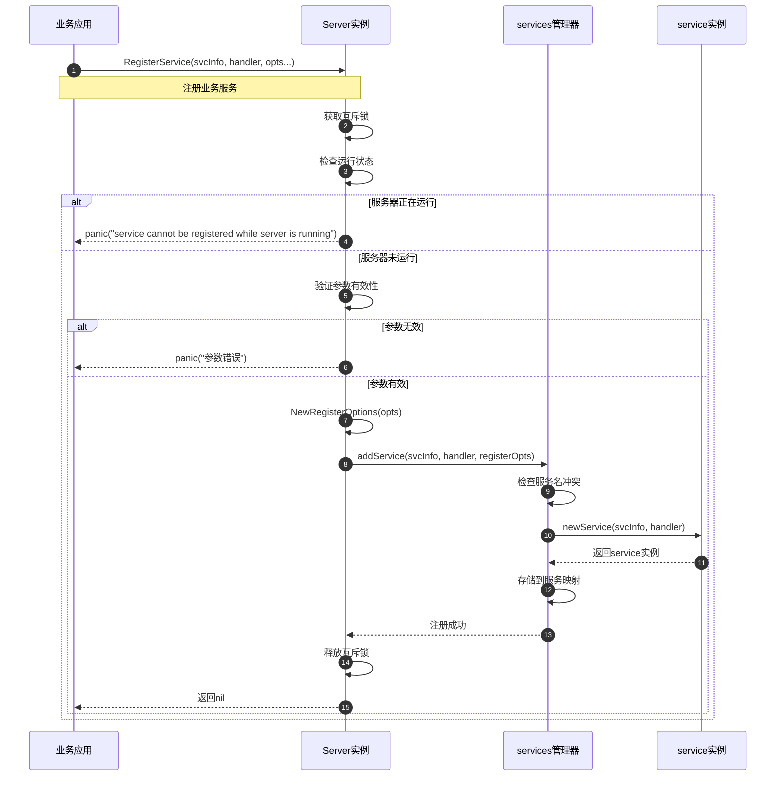
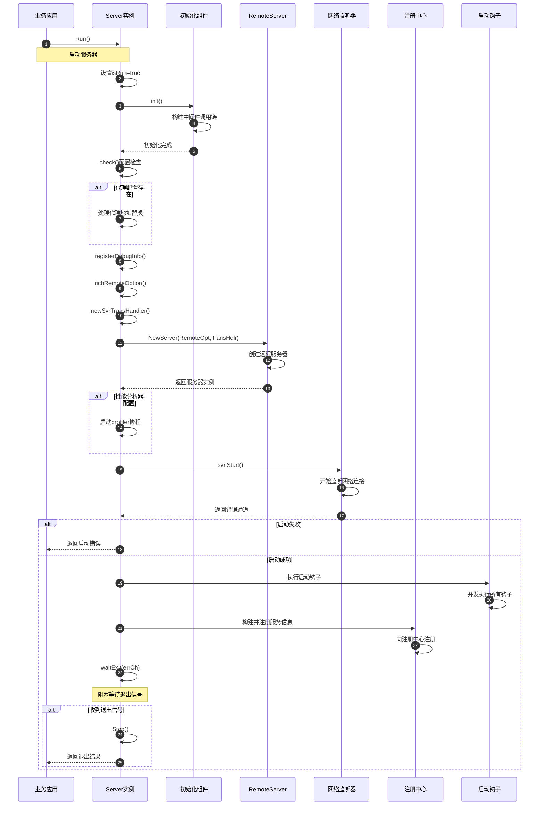
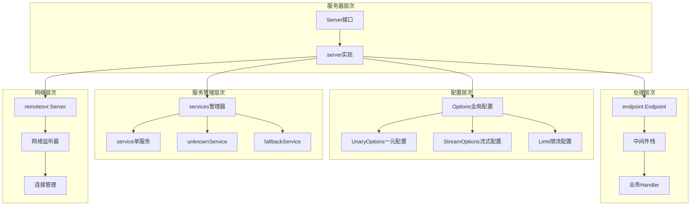
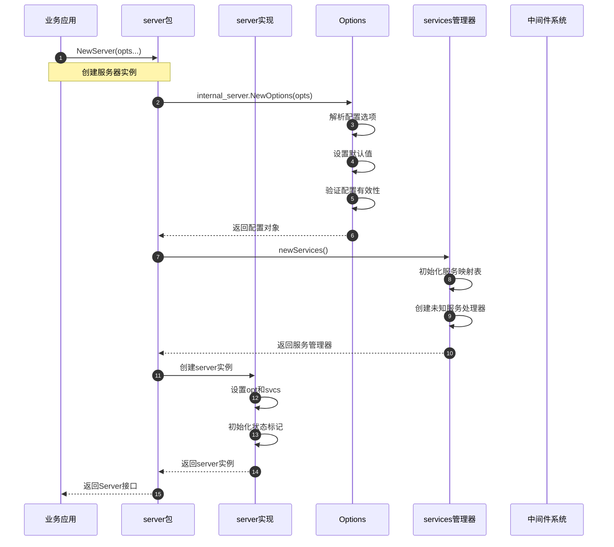
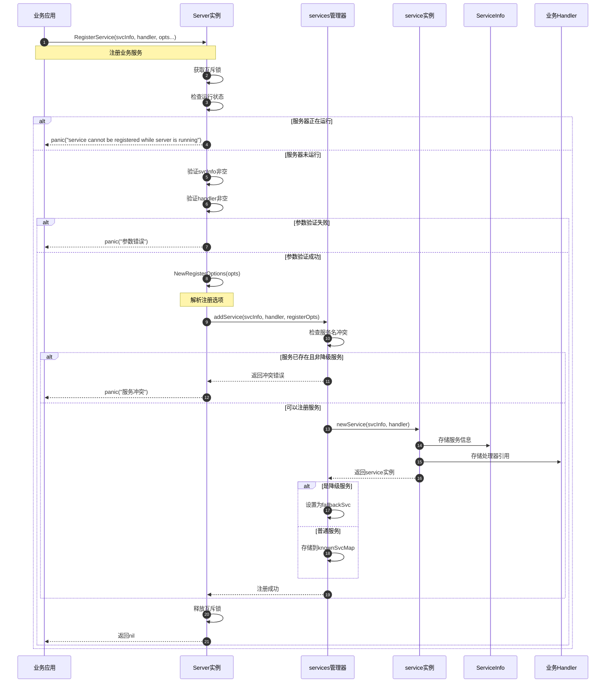
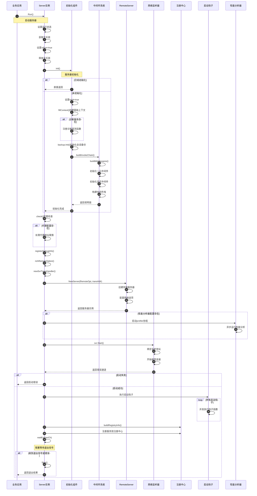
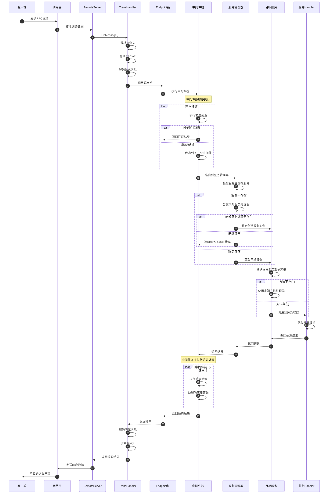
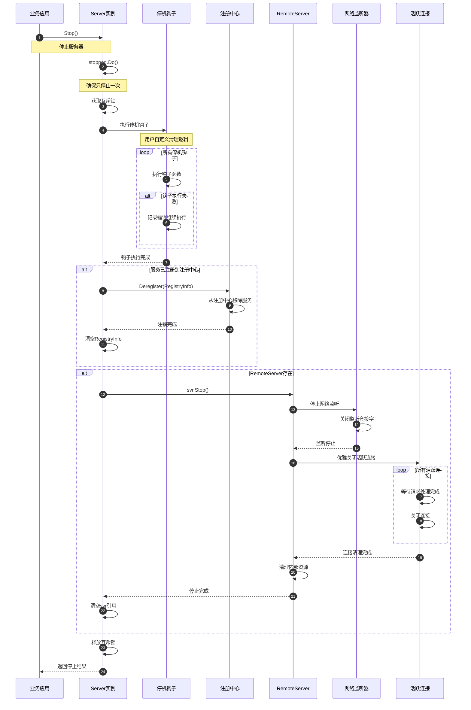
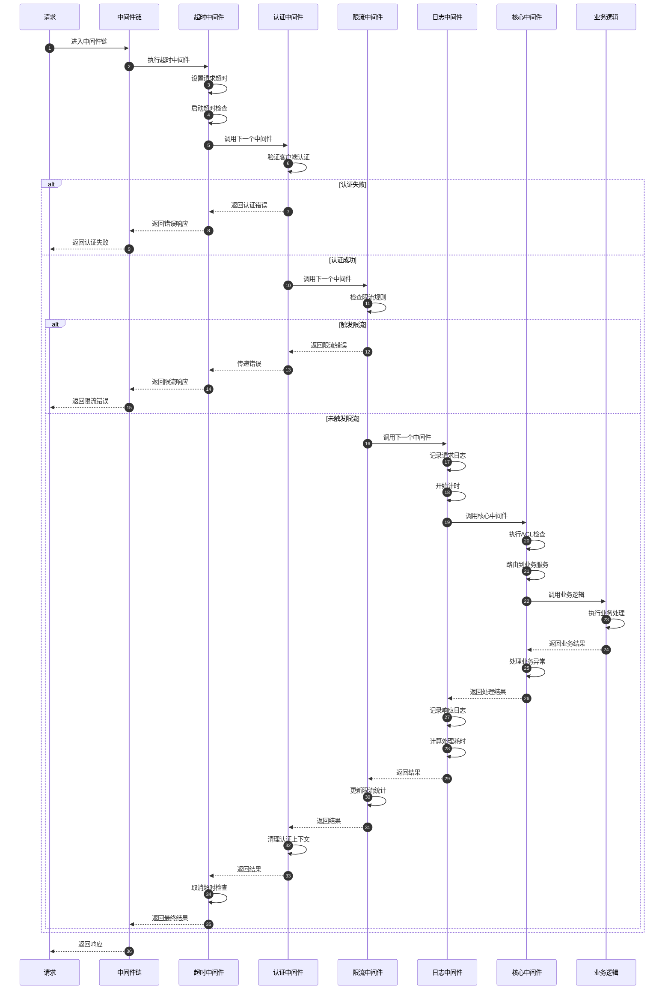

# Kitex-02-Server

## 模块概览

## 模块职责与边界

### 核心职责
Server模块是Kitex框架的服务端核心，负责接收和处理RPC请求。主要职责包括：

- **服务注册管理**：注册业务服务和处理器，支持多服务共存
- **请求接收处理**：监听网络连接，接收客户端请求
- **协议解析**：支持多种RPC协议（Thrift、gRPC、Kitex Protobuf）
- **中间件执行**：提供请求拦截和处理链，支持自定义扩展
- **治理功能集成**：集成限流、ACL、统计、链路追踪等治理能力
- **生命周期管理**：管理服务启动、运行和优雅停机

### 输入输出
- **输入**：客户端RPC请求、服务注册信息、配置选项
- **输出**：RPC响应结果、服务状态信息、统计数据
- **上游依赖**：业务Handler实现、IDL生成代码
- **下游依赖**：Remote传输层、网络监听器、注册中心

### 生命周期
1. **创建阶段**：通过NewServer创建服务器实例，设置配置选项
2. **注册阶段**：注册业务服务和处理器，构建服务映射
3. **初始化阶段**：初始化组件，构建中间件调用链
4. **运行阶段**：启动网络监听，处理客户端请求
5. **停机阶段**：优雅停止服务，清理资源和连接

## 模块架构图



### 架构说明

**1. 分层设计**

- **接口层**：定义Server和GenericServer的标准接口
- **实现层**：提供服务器核心实现和服务管理功能
- **处理层**：构建请求处理链，包含中间件和业务逻辑
- **配置层**：管理服务器配置选项和调用时选项

**2. 组件交互**

- Server接口通过server实现管理服务生命周期
- services负责多服务注册和路由分发
- Endpoint链串联中间件和业务Handler
- 各治理组件通过中间件机制集成

**3. 扩展机制**

- 中间件机制支持请求拦截和处理
- Suite模式支持组件化配置
- 多种传输协议和编解码器支持
- 插件化治理组件集成

## 核心算法与流程

### 服务器初始化流程

```go
func (s *server) init() {
    if s.isInit {
        return
    }
    s.isInit = true
    
    // 1. 填充基础上下文
    ctx := fillContext(s.opt)
    
    // 2. 注册诊断服务
    if ds := s.opt.DebugService; ds != nil {
        ds.RegisterProbeFunc(diagnosis.OptionsKey, diagnosis.WrapAsProbeFunc(s.opt.DebugInfo))
        ds.RegisterProbeFunc(diagnosis.ChangeEventsKey, s.opt.Events.Dump)
    }
    
    // 3. 初始化本地会话备份
    backup.Init(s.opt.BackupOpt)
    
    // 4. 构建调用链
    s.buildInvokeChain(ctx)
}
```

**初始化流程说明**：

1. **上下文准备**：创建包含事件总线和队列的基础上下文
2. **诊断注册**：注册调试和诊断相关的探测函数
3. **会话初始化**：初始化本地会话备份机制
4. **调用链构建**：构建包含所有中间件的请求处理链

### 中间件构建流程

```go
func (s *server) buildMiddlewares(ctx context.Context) []endpoint.Middleware {
    // 1. 初始化一元中间件
    s.opt.UnaryOptions.InitMiddlewares(ctx)
    
    // 2. 初始化流式中间件
    s.opt.Streaming.InitMiddlewares(ctx)
    s.opt.StreamOptions.EventHandler = s.opt.TracerCtl.GetStreamEventHandler()
    s.opt.StreamOptions.InitMiddlewares(ctx)
    
    // 3. 构建通用中间件栈
    var mws []endpoint.Middleware
    
    // 流式中间件包装器
    mws = append(mws, s.wrapStreamMiddleware())
    
    // 超时中间件（如果启用）
    if s.opt.EnableContextTimeout {
        mws = append(mws, serverTimeoutMW)
    }
    
    // 用户自定义中间件
    for i := range s.opt.MWBs {
        if mw := s.opt.MWBs[i](ctx); mw != nil {
            mws = append(mws, mw)
        }
    }
    
    // 核心中间件（必须是最后一个）
    mws = append(mws, s.buildCoreMiddleware())
    
    return mws
}
```

**中间件构建说明**：

1. **分类初始化**：分别初始化一元和流式中间件
2. **顺序组装**：按固定顺序组装中间件栈
3. **核心中间件**：包含ACL、错误处理等框架核心逻辑
4. **执行顺序**：外层中间件先执行，核心中间件最后执行

### 服务注册流程

```go
func (s *server) RegisterService(svcInfo *serviceinfo.ServiceInfo, handler interface{}, opts ...RegisterOption) error {
    s.Lock()
    defer s.Unlock()
    
    // 1. 状态检查
    if s.isRun {
        panic("service cannot be registered while server is running")
    }
    if svcInfo == nil {
        panic("svcInfo is nil. please specify non-nil svcInfo")
    }
    if handler == nil || reflect.ValueOf(handler).IsNil() {
        panic("handler is nil. please specify non-nil handler")
    }
    
    // 2. 解析注册选项
    registerOpts := internal_server.NewRegisterOptions(opts)
    
    // 3. 添加服务到服务管理器
    if err := s.svcs.addService(svcInfo, handler, registerOpts); err != nil {
        panic(err.Error())
    }
    
    return nil
}
```

**服务注册说明**：

1. **并发安全**：使用互斥锁保护服务注册过程
2. **状态验证**：确保服务器未运行时才能注册服务
3. **参数检查**：验证服务信息和处理器的有效性
4. **服务存储**：将服务添加到内部服务管理器

### 服务器启动流程

```go
func (s *server) Run() (err error) {
    // 1. 设置运行状态
    s.Lock()
    s.isRun = true
    s.Unlock()
    
    // 2. 初始化服务器
    s.init()
    if err = s.check(); err != nil {
        return err
    }
    
    // 3. 处理代理配置
    svrCfg := s.opt.RemoteOpt
    addr := svrCfg.Address
    if s.opt.Proxy != nil {
        svrCfg.Address, err = s.opt.Proxy.Replace(addr)
        if err != nil {
            return
        }
    }
    
    // 4. 注册调试信息和丰富远程选项
    s.registerDebugInfo()
    s.richRemoteOption()
    
    // 5. 创建传输处理器和远程服务器
    transHdlr, err := s.newSvrTransHandler()
    if err != nil {
        return err
    }
    svr, err := remotesvr.NewServer(s.opt.RemoteOpt, transHdlr)
    if err != nil {
        return err
    }
    s.Lock()
    s.svr = svr
    s.Unlock()
    
    // 6. 启动性能分析器（如果配置）
    if s.opt.RemoteOpt.Profiler != nil {
        gofunc.GoFunc(context.Background(), func() {
            err := s.opt.RemoteOpt.Profiler.Run(context.Background())
            if err != nil {
                klog.Errorf("KITEX: server started profiler error: error=%s", err.Error())
            }
        })
    }
    
    // 7. 启动服务器监听
    errCh := svr.Start()
    select {
    case err = <-errCh:
        klog.Errorf("KITEX: server start error: error=%s", err.Error())
        return err
    default:
    }
    
    // 8. 执行启动钩子
    muStartHooks.Lock()
    for i := range onServerStart {
        go onServerStart[i]()
    }
    muStartHooks.Unlock()
    
    // 9. 构建注册信息
    s.Lock()
    s.buildRegistryInfo(svr.Address())
    s.Unlock()
    
    // 10. 等待退出信号
    if err = s.waitExit(errCh); err != nil {
        klog.Errorf("KITEX: received error and exit: error=%s", err.Error())
    }
    
    // 11. 停止服务器
    if e := s.Stop(); e != nil && err == nil {
        err = e
        klog.Errorf("KITEX: stop server error: error=%s", e.Error())
    }
    
    return
}
```

**启动流程说明**：

1. **状态管理**：设置运行状态，防止重复启动
2. **初始化检查**：确保服务器完全初始化并通过检查
3. **代理处理**：如果配置了代理，替换监听地址
4. **组件创建**：创建传输处理器和远程服务器实例
5. **监听启动**：开始监听网络连接，处理客户端请求
6. **钩子执行**：执行用户注册的启动钩子函数
7. **服务注册**：向注册中心注册服务信息
8. **阻塞等待**：等待退出信号或错误发生
9. **优雅停机**：收到停止信号后执行清理逻辑

## 性能优化要点

### 1. 中间件性能优化
- **预构建调用链**：在初始化阶段构建完整的中间件调用链
- **中间件缓存**：避免每次请求重新构建中间件
- **条件中间件**：根据配置有条件地添加中间件
- **零分配设计**：中间件执行过程中尽量避免内存分配

### 2. 服务路由优化
- **服务映射缓存**：使用map快速查找服务和方法
- **读写锁优化**：服务注册使用读写锁，减少读取竞争
- **懒加载机制**：按需创建泛化服务实例
- **方法信息缓存**：缓存方法元信息避免重复解析

### 3. 网络处理优化
- **连接复用**：支持长连接和连接池
- **多路复用**：单连接支持并发请求处理
- **零拷贝**：基于Netpoll的零拷贝网络处理
- **批量处理**：支持批量读写网络数据

### 4. 内存管理优化
- **对象池**：复用频繁分配的对象
- **缓冲区复用**：编解码缓冲区复用
- **引用计数**：精确控制对象生命周期
- **垃圾回收优化**：减少GC压力和停顿时间

### 5. 并发安全设计
- **无锁数据结构**：使用原子操作和无锁算法
- **读写分离**：配置读多写少使用读写锁
- **协程池**：复用goroutine避免频繁创建
- **上下文隔离**：每个请求使用独立上下文

这个概览文档详细介绍了Server模块的架构设计、核心流程和性能优化策略。接下来将继续分析Server模块的API接口和数据结构。

---

## API接口

## 基本接口定义

### Server核心接口

```go
// Server是RPC服务器的抽象接口
// 接受连接并将请求分发到注册的服务
type Server interface {
    RegisterService(svcInfo *serviceinfo.ServiceInfo, handler interface{}, opts ...RegisterOption) error
    GetServiceInfos() map[string]*serviceinfo.ServiceInfo
    Run() error
    Stop() error
}
```

| 方法 | 参数 | 返回值 | 说明 |
|------|------|--------|------|
| RegisterService | svcInfo, handler, opts | error | 注册业务服务和处理器 |
| GetServiceInfos | - | map[string]*serviceinfo.ServiceInfo | 获取已注册的服务信息 |
| Run | - | error | 启动服务器，阻塞直到停止 |
| Stop | - | error | 优雅停止服务器 |

## 服务器创建API

### NewServer - 创建标准服务器

```go
func NewServer(ops ...Option) Server
```

**功能说明**：
创建标准的Kitex服务器实例，支持多种配置选项。

**请求参数**：
| 参数 | 类型 | 必填 | 说明 |
|------|------|------|------|
| ops | ...Option | 否 | 服务器配置选项列表 |

**响应结果**：
| 字段 | 类型 | 说明 |
|------|------|------|
| Server | Server | 服务器实例 |

**核心实现代码**：

```go
func NewServer(ops ...Option) Server {
    s := &server{
        opt:  internal_server.NewOptions(ops),  // 解析配置选项
        svcs: newServices(),                     // 初始化服务管理器
    }
    return s
}
```

### NewGenericServer - 创建泛化服务器

```go
func NewServer(handler generic.Service, g generic.Generic, opts ...server.Option) server.Server
```

**功能说明**：
创建泛化服务器，支持动态服务处理，无需预生成代码。

**请求参数**：
| 参数 | 类型 | 必填 | 说明 |
|------|------|------|------|
| handler | generic.Service | 是 | 泛化服务处理器 |
| g | generic.Generic | 是 | 泛化处理器实例 |
| opts | ...server.Option | 否 | 服务器配置选项 |

**核心实现代码**：

```go
func NewServer(handler generic.Service, g generic.Generic, opts ...server.Option) server.Server {
    // 1. 生成泛化服务信息
    svcInfo := generic.ServiceInfoWithGeneric(g)
    
    // 2. 组装配置选项
    var options []server.Option
    options = append(options, server.WithGeneric(g))
    options = append(options, opts...)
    
    // 3. 创建服务器并注册服务
    svr := server.NewServer(options...)
    if err := svr.RegisterService(svcInfo, handler); err != nil {
        panic(err)
    }
    
    return svr
}
```

## 服务管理API

### RegisterService - 注册服务

```go
func (s *server) RegisterService(svcInfo *serviceinfo.ServiceInfo, handler interface{}, opts ...RegisterOption) error
```

**功能说明**：
向服务器注册业务服务和对应的处理器实现。

**请求参数**：
| 参数 | 类型 | 必填 | 说明 |
|------|------|------|------|
| svcInfo | *serviceinfo.ServiceInfo | 是 | 服务元信息，包含方法定义 |
| handler | interface{} | 是 | 业务处理器实现 |
| opts | ...RegisterOption | 否 | 服务注册选项 |

**核心实现代码**：

```go
func (s *server) RegisterService(svcInfo *serviceinfo.ServiceInfo, handler interface{}, opts ...RegisterOption) error {
    s.Lock()
    defer s.Unlock()
    
    // 1. 状态检查
    if s.isRun {
        panic("service cannot be registered while server is running")
    }
    if svcInfo == nil {
        panic("svcInfo is nil. please specify non-nil svcInfo")
    }
    if handler == nil || reflect.ValueOf(handler).IsNil() {
        panic("handler is nil. please specify non-nil handler")
    }
    
    // 2. 解析注册选项
    registerOpts := internal_server.NewRegisterOptions(opts)
    
    // 3. 添加服务到服务管理器
    if err := s.svcs.addService(svcInfo, handler, registerOpts); err != nil {
        panic(err.Error())
    }
    
    return nil
}
```

### GetServiceInfos - 获取服务信息

```go
func (s *server) GetServiceInfos() map[string]*serviceinfo.ServiceInfo
```

**功能说明**：
获取服务器上已注册的所有服务信息。

**响应结果**：
| 字段 | 类型 | 说明 |
|------|------|------|
| map[string]*serviceinfo.ServiceInfo | map | 服务名到服务信息的映射 |

## 生命周期管理API

### Run - 启动服务器

```go
func (s *server) Run() (err error)
```

**功能说明**：
启动服务器，开始监听网络连接并处理客户端请求。该方法会阻塞直到服务器停止。

**核心实现代码**：

```go
func (s *server) Run() (err error) {
    // 1. 设置运行状态
    s.Lock()
    s.isRun = true
    s.Unlock()
    
    // 2. 初始化服务器
    s.init()
    if err = s.check(); err != nil {
        return err
    }
    
    // 3. 处理代理配置
    svrCfg := s.opt.RemoteOpt
    addr := svrCfg.Address
    if s.opt.Proxy != nil {
        svrCfg.Address, err = s.opt.Proxy.Replace(addr)
        if err != nil {
            return
        }
    }
    
    // 4. 创建传输处理器和远程服务器
    s.registerDebugInfo()
    s.richRemoteOption()
    transHdlr, err := s.newSvrTransHandler()
    if err != nil {
        return err
    }
    svr, err := remotesvr.NewServer(s.opt.RemoteOpt, transHdlr)
    if err != nil {
        return err
    }
    
    // 5. 启动网络监听
    errCh := svr.Start()
    select {
    case err = <-errCh:
        return err
    default:
    }
    
    // 6. 执行启动钩子和服务注册
    // 执行启动钩子函数
    // 向注册中心注册服务
    
    // 7. 等待退出信号
    if err = s.waitExit(errCh); err != nil {
        // 处理退出错误
    }
    
    return
}
```

### Stop - 停止服务器

```go
func (s *server) Stop() (err error)
```

**功能说明**：
优雅停止服务器，清理资源并断开连接。

**核心实现代码**：

```go
func (s *server) Stop() (err error) {
    s.stopped.Do(func() {
        s.Lock()
        defer s.Unlock()
        
        // 1. 执行停机钩子
        muShutdownHooks.Lock()
        for i := range onShutdown {
            onShutdown[i]()
        }
        muShutdownHooks.Unlock()
        
        // 2. 从注册中心注销服务
        if s.opt.RegistryInfo != nil {
            err = s.opt.Registry.Deregister(s.opt.RegistryInfo)
            s.opt.RegistryInfo = nil
        }
        
        // 3. 停止远程服务器
        if s.svr != nil {
            if e := s.svr.Stop(); e != nil {
                err = e
            }
            s.svr = nil
        }
    })
    return
}
```

## 配置选项API

### 基础配置选项

#### WithServiceAddr - 设置服务地址

```go
func WithServiceAddr(addr net.Addr) Option
```

**功能说明**：设置服务器监听地址。

**参数说明**：

- addr：网络地址，支持TCP、Unix Socket等

#### WithMuxTransport - 多路复用传输

```go
func WithMuxTransport() Option
```

**功能说明**：启用多路复用传输，单连接支持并发请求。

**核心实现代码**：

```go
func WithMuxTransport() Option {
    return Option{F: func(o *internal_server.Options, di *utils.Slice) {
        // 设置多路复用传输处理器工厂
        o.RemoteOpt.SvrHandlerFactory = netpollmux.NewSvrTransHandlerFactory()
        // 设置QPS限流在解码后执行
        o.Limit.QPSLimitPostDecode = true
    }}
}
```

### 中间件配置

#### WithMiddleware - 添加中间件

```go
func WithMiddleware(mw endpoint.Middleware) Option
```

**功能说明**：添加请求处理中间件。

**中间件签名**：

```go
type Middleware func(endpoint.Endpoint) endpoint.Endpoint
type Endpoint func(ctx context.Context, req, resp interface{}) error
```

**核心实现代码**：

```go
func WithMiddleware(mw endpoint.Middleware) Option {
    mwb := func(ctx context.Context) endpoint.Middleware {
        return mw
    }
    return Option{F: func(o *internal_server.Options, di *utils.Slice) {
        o.MWBs = append(o.MWBs, mwb)
    }}
}
```

#### WithMiddlewareBuilder - 添加中间件构建器

```go
func WithMiddlewareBuilder(mwb endpoint.MiddlewareBuilder, funcName ...string) Option
```

**功能说明**：添加依赖上下文的中间件构建器。

#### WithUnaryMiddleware - 一元中间件

```go
func WithUnaryMiddleware(mw endpoint.UnaryMiddleware) UnaryOption
```

**功能说明**：添加专门用于一元调用的中间件。

#### WithStreamMiddleware - 流式中间件

```go
func WithStreamMiddleware(mw sep.StreamMiddleware) StreamOption
```

**功能说明**：添加专门用于流式调用的中间件。

### 服务治理配置

#### WithRegistry - 服务注册

```go
func WithRegistry(r registry.Registry) Option
```

**功能说明**：设置服务注册中心，用于服务发现。

#### WithRegistryInfo - 注册信息

```go
func WithRegistryInfo(info *registry.Info) Option
```

**功能说明**：设置服务注册信息，包含服务名、标签等。

#### WithLimit - 限流配置

```go
func WithLimit(lim *limit.Option) Option
```

**功能说明**：设置服务器限流策略。

**限流配置**：

```go
type Option struct {
    MaxConnections int    // 最大连接数
    MaxQPS         int    // 最大QPS
    UpdateControl  func(int) bool  // 动态更新控制
    QPSLimitPostDecode bool // QPS限流在解码后执行
}
```

#### WithLimiter - 限流器

```go
func WithLimiter(limiter limiter.Limiter) Option
```

**功能说明**：设置自定义限流器实现。

#### WithACLRules - 访问控制

```go
func WithACLRules(rules ...acl.RejectFunc) Option
```

**功能说明**：设置访问控制规则。

**ACL规则签名**：

```go
type RejectFunc func(ctx context.Context, request interface{}) (reason error)
```

### 链路追踪配置

#### WithTracer - 添加追踪器

```go
func WithTracer(c stats.Tracer) Option
```

**功能说明**：添加分布式链路追踪器。

#### WithStatsLevel - 统计级别

```go
func WithStatsLevel(level stats.Level) Option
```

**功能说明**：设置统计信息收集级别。

### 协议配置

#### WithTransportProtocol - 传输协议

```go
func WithTransportProtocol(tp transport.Protocol) Option
```

**功能说明**：设置传输协议类型。

#### WithTransHandlerFactory - 传输处理器工厂

```go
func WithTransHandlerFactory(f remote.ServerTransHandlerFactory) Option
```

**功能说明**：设置自定义传输处理器工厂。

#### WithTransServerFactory - 传输服务器工厂

```go
func WithTransServerFactory(f remote.TransServerFactory) Option
```

**功能说明**：设置自定义传输服务器工厂。

### 高级配置

#### WithProxy - 反向代理

```go
func WithProxy(p proxy.ReverseProxy) Option
```

**功能说明**：设置反向代理，用于地址替换。

#### WithMetaHandler - 元信息处理器

```go
func WithMetaHandler(h remote.MetaHandler) Option
```

**功能说明**：添加元信息处理器，处理协议头信息。

#### WithDiagnosisService - 诊断服务

```go
func WithDiagnosisService(ds diagnosis.Service) Option
```

**功能说明**：设置诊断服务，用于收集调试信息。

## 注册选项API

### RegisterOption - 服务注册选项

```go
type RegisterOption struct {
    F func(o *RegisterOptions)
}

type RegisterOptions struct {
    IsFallbackService bool  // 是否为降级服务
}
```

### WithFallbackService - 降级服务

```go
func WithFallbackService() RegisterOption
```

**功能说明**：将服务标记为降级服务，用于处理未知方法。

**核心实现代码**：

```go
func WithFallbackService() RegisterOption {
    return RegisterOption{F: func(o *internal_server.RegisterOptions) {
        o.IsFallbackService = true
    }}
}
```

## 时序图 - 服务器创建流程

```mermaid
sequenceDiagram
    autonumber
    participant APP as 业务应用
    participant SERVER as server包
    participant SERVERIMPL as server实现
    participant OPTIONS as Options
    parameter SERVICES as services管理器
    
    APP->>SERVER: NewServer(opts...)
    Note over APP,SERVER: 创建服务器实例
    
    SERVER->>OPTIONS: internal_server.NewOptions(opts)
    OPTIONS->>OPTIONS: 解析和验证配置选项
    OPTIONS-->>SERVER: 返回配置对象
    
    SERVER->>SERVICES: newServices()
    SERVICES->>SERVICES: 初始化服务管理器
    SERVICES-->>SERVER: 返回服务管理器
    
    SERVER->>SERVERIMPL: 创建server实例
    SERVERIMPL->>SERVERIMPL: 设置opt和svcs
    SERVERIMPL-->>SERVER: 返回server实例
    
    SERVER-->>APP: 返回Server接口
```

## 时序图 - 服务注册流程



## 时序图 - 服务器启动流程



## 异常处理与性能要点

### 异常处理策略

**1. 服务注册错误**

- 运行时注册：直接panic，快速失败
- 参数验证：严格检查svcInfo和handler有效性
- 服务冲突：检测服务名和方法名冲突

**2. 服务器启动错误**

- 地址绑定失败：返回具体的网络错误
- 组件初始化失败：逐步回滚已初始化的组件
- 注册中心连接失败：记录错误但不阻止启动

**3. 运行时错误**

- 请求处理错误：通过中间件统一处理
- 网络连接错误：自动重连和连接池管理
- 资源耗尽：触发限流和负载保护

### 性能优化要点

**1. 服务路由优化**

- 服务映射表预构建，O(1)查找复杂度
- 方法信息缓存，避免重复解析
- 读写锁优化，减少服务注册时的锁竞争

**2. 中间件性能优化**

- 中间件链预构建，避免运行时构建开销
- 条件中间件，根据配置按需添加
- 中间件缓存，复用中间件实例

**3. 网络处理优化**

- 基于Netpoll的高性能网络I/O
- 连接复用和多路复用支持
- 零拷贝数据传输

**4. 内存管理优化**

- 对象池复用频繁分配的对象
- 缓冲区池管理编解码缓冲区
- 及时回收请求上下文和响应对象

这个API文档详细介绍了Server模块的所有公开接口、配置选项、注册机制和使用方法，为开发者提供了完整的服务端开发指南。

---

## 数据结构

## 核心数据结构UML图

```mermaid
classDiagram
    class Server {
        <<interface>>
        +RegisterService(svcInfo *serviceinfo.ServiceInfo, handler interface{}, opts ...RegisterOption) error
        +GetServiceInfos() map[string]*serviceinfo.ServiceInfo
        +Run() error
        +Stop() error
    }
    
    class server {
        -opt *internal_server.Options
        -svcs *services
        -eps endpoint.Endpoint
        -svr remotesvr.Server
        -stopped sync.Once
        -isInit bool
        -isRun bool
        -sync.Mutex
        +RegisterService(svcInfo *serviceinfo.ServiceInfo, handler interface{}, opts ...RegisterOption) error
        +GetServiceInfos() map[string]*serviceinfo.ServiceInfo
        +Run() error
        +Stop() error
        -init()
        -buildInvokeChain(ctx context.Context)
        -buildMiddlewares(ctx context.Context) []endpoint.Middleware
    }
    
    class Options {
        +Svr *rpcinfo.EndpointBasicInfo
        +Configs rpcinfo.RPCConfig
        +LockBits int
        +Once *configutil.OptionOnce
        +UnaryOptions UnaryOptions
        +StreamOptions StreamOptions
        +MetaHandlers []remote.MetaHandler
        +RemoteOpt *remote.ServerOption
        +Registry registry.Registry
        +RegistryInfo *registry.Info
        +ACLRules []acl.RejectFunc
        +Limit Limit
        +MWBs []endpoint.MiddlewareBuilder
        +Bus event.Bus
        +Events event.Queue
        +TracerCtl *rpcinfo.TraceController
        +BackupOpt backup.Options
        +EnableContextTimeout bool
    }
    
    class services {
        -knownSvcMap map[string]*service
        -fallbackSvc *service
        -unknownSvc *unknownService
        +addService(svcInfo *serviceinfo.ServiceInfo, handler interface{}, opts *RegisterOptions) error
        +getKnownSvcInfoMap() map[string]*serviceinfo.ServiceInfo
        +getSvc(svcName string) *service
    }
    
    class service {
        -svcInfo *serviceinfo.ServiceInfo
        -handler interface{}
        -unknownMethodHandler interface{}
        +getHandler(methodName string) interface{}
    }
    
    class UnaryOptions {
        +UnaryMiddlewares []endpoint.UnaryMiddleware
        +UnaryMiddlewareBuilders []endpoint.UnaryMiddlewareBuilder
        +InitMiddlewares(ctx context.Context)
    }
    
    class StreamOptions {
        +EventHandler streaming.EventHandler
        +StreamMiddlewares []sep.StreamMiddleware
        +StreamMiddlewareBuilders []sep.StreamMiddlewareBuilder
        +StreamRecvMiddlewares []sep.StreamRecvMiddleware
        +StreamSendMiddlewares []sep.StreamSendMiddleware
        +InitMiddlewares(ctx context.Context)
    }
    
    class Limit {
        +Limits *limit.Option
        +LimitReporter limiter.LimitReporter
        +ConLimit limiter.ConcurrencyLimiter
        +QPSLimit limiter.RateLimiter
        +QPSLimitPostDecode bool
    }
    
    class RegisterOptions {
        +IsFallbackService bool
    }
    
    Server <|-- server
    server --> Options
    server --> services
    services --> service
    Options --> UnaryOptions
    Options --> StreamOptions
    Options --> Limit
    service --> RegisterOptions
```

## 主要数据结构详解

### 1. Server接口

```go
// Server是RPC服务器的抽象接口
// 接受连接并将请求分发到注册的服务
type Server interface {
    RegisterService(svcInfo *serviceinfo.ServiceInfo, handler interface{}, opts ...RegisterOption) error
    GetServiceInfos() map[string]*serviceinfo.ServiceInfo
    Run() error
    Stop() error
}
```

**接口说明**：

- 这是服务器的核心接口定义，所有服务器实现都必须实现这些方法
- 提供服务注册、获取服务信息、启动和停止的基本能力
- 支持多服务注册和管理

### 2. server核心实现

```go
type server struct {
    opt  *internal_server.Options  // 服务器配置选项
    svcs *services                 // 服务管理器
    
    // 实际的RPC服务实现
    eps     endpoint.Endpoint      // 端点处理链
    svr     remotesvr.Server      // 远程服务器实例
    stopped sync.Once             // 确保只停止一次
    isInit  bool                  // 初始化状态标记
    isRun   bool                  // 运行状态标记
    
    sync.Mutex                    // 并发保护锁
}
```

**字段映射与说明**：

| 字段 | 类型 | 必填 | 默认值 | 约束 | 说明 |
|------|------|------|--------|------|------|
| opt | *internal_server.Options | 是 | nil | 非空 | 服务器全局配置选项 |
| svcs | *services | 是 | nil | 非空 | 服务管理器，管理所有注册的服务 |
| eps | endpoint.Endpoint | 否 | nil | - | 端点处理链，包含中间件和业务逻辑 |
| svr | remotesvr.Server | 否 | nil | - | 远程服务器实例，处理网络通信 |
| stopped | sync.Once | - | - | - | 确保Stop方法只执行一次 |
| isInit | bool | - | false | - | 标记服务器是否已完成初始化 |
| isRun | bool | - | false | - | 标记服务器是否正在运行 |
| sync.Mutex | sync.Mutex | - | - | - | 保护并发访问的互斥锁 |

**生命周期管理**：

- **创建阶段**：通过NewServer函数创建，设置Options和services
- **注册阶段**：通过RegisterService注册业务服务
- **初始化阶段**：调用init()方法构建中间件调用链
- **运行阶段**：调用Run()方法启动网络监听
- **停止阶段**：调用Stop()方法优雅停机

### 3. Options配置结构

```go
type Options struct {
    // 基础信息
    Svr      *rpcinfo.EndpointBasicInfo  // 服务端端点信息
    Configs  rpcinfo.RPCConfig           // RPC配置信息
    LockBits int                         // 配置锁定位标记
    Once     *configutil.OptionOnce      // 一次性配置检查
    
    // 调用选项
    UnaryOptions  UnaryOptions           // 一元调用选项
    StreamOptions StreamOptions          // 流式调用选项
    
    // 扩展组件
    MetaHandlers []remote.MetaHandler    // 元信息处理器
    RemoteOpt    *remote.ServerOption    // 远程服务器选项
    ErrHandle    func(context.Context, error) error  // 错误处理函数
    ExitSignal   func() <-chan error     // 退出信号函数
    Proxy        proxy.ReverseProxy      // 反向代理
    
    // 服务注册
    Registry     registry.Registry       // 服务注册中心
    RegistryInfo *registry.Info          // 服务注册信息
    
    // 服务治理
    ACLRules []acl.RejectFunc           // 访问控制规则
    Limit    Limit                      // 限流配置
    
    // 中间件
    MWBs []endpoint.MiddlewareBuilder   // 中间件构建器
    
    // 事件系统
    Bus    event.Bus                    // 事件总线
    Events event.Queue                  // 事件队列
    
    // 调试与诊断
    DebugInfo    utils.Slice            // 调试信息
    DebugService diagnosis.Service      // 诊断服务
    
    // 可观测性
    TracerCtl  *rpcinfo.TraceController // 链路追踪控制器
    StatsLevel *stats.Level             // 统计级别
    
    // 其他配置
    BackupOpt                backup.Options  // 备份选项
    Streaming                stream.StreamingConfig  // 流式配置（已废弃）
    RefuseTrafficWithoutServiceName bool     // 拒绝无服务名流量
    EnableContextTimeout            bool     // 启用上下文超时
}
```

**关键字段说明**：

1. **基础配置**：
   - `Svr`：服务端端点信息，包含服务名、地址等
   - `Configs`：RPC配置，包含超时、协议等设置
   - `LockBits`：配置锁定机制，防止运行时修改关键配置

2. **服务治理**：
   - `Registry/RegistryInfo`：服务注册中心和注册信息
   - `ACLRules`：访问控制规则列表
   - `Limit`：限流配置，包含连接数和QPS限制

3. **扩展机制**：
   - `MWBs`：中间件构建器，支持请求拦截和处理
   - `MetaHandlers`：元信息处理器，处理协议头信息
   - `Proxy`：反向代理，支持地址替换

### 4. services服务管理器

```go
type services struct {
    knownSvcMap map[string]*service  // 已知服务映射表，key为服务名
    
    // fallbackSvc用于获取唯一的svcInfo
    // 当多个服务有相同方法时使用
    fallbackSvc *service
    
    // unknownSvc用于处理未知服务的请求
    unknownSvc *unknownService
}
```

**字段说明**：

- `knownSvcMap`：存储所有已注册的服务，支持O(1)查找
- `fallbackSvc`：降级服务，处理找不到具体服务的请求
- `unknownSvc`：未知服务处理器，支持动态服务创建

**核心方法**：

```go
// 添加服务到管理器
func (s *services) addService(svcInfo *serviceinfo.ServiceInfo, handler interface{}, opts *RegisterOptions) error

// 获取所有已知服务信息
func (s *services) getKnownSvcInfoMap() map[string]*serviceinfo.ServiceInfo

// 根据服务名获取服务实例
func (s *services) getSvc(svcName string) *service
```

### 5. service单服务结构

```go
type service struct {
    svcInfo              *serviceinfo.ServiceInfo  // 服务元信息
    handler              interface{}               // 业务处理器
    unknownMethodHandler interface{}               // 未知方法处理器
}
```

**字段映射与版本演进**：

| 字段 | 类型 | 版本 | 约束 | 说明 |
|------|------|------|------|------|
| svcInfo | *serviceinfo.ServiceInfo | v1.0+ | 非空 | 服务元信息，包含方法定义和协议类型 |
| handler | interface{} | v1.0+ | 非空 | 业务处理器实现，通常是生成的服务接口 |
| unknownMethodHandler | interface{} | v1.2+ | 可空 | 未知方法处理器，用于处理未定义的方法 |

**核心方法**：

```go
// 根据方法名获取对应的处理器
func (s *service) getHandler(methodName string) interface{} {
    if s.unknownMethodHandler == nil {
        return s.handler
    }
    if mi := s.svcInfo.MethodInfo(notAllowBinaryGenericCtx, methodName); mi != nil {
        return s.handler
    }
    return s.unknownMethodHandler
}
```

### 6. UnaryOptions一元调用选项

```go
type UnaryOptions struct {
    UnaryMiddlewares        []endpoint.UnaryMiddleware        // 一元中间件列表
    UnaryMiddlewareBuilders []endpoint.UnaryMiddlewareBuilder // 中间件构建器
}
```

**核心方法实现**：

```go
// 初始化中间件，将构建器转换为实际中间件
func (o *UnaryOptions) InitMiddlewares(ctx context.Context) {
    if len(o.UnaryMiddlewareBuilders) > 0 {
        unaryMiddlewares := make([]endpoint.UnaryMiddleware, 0, len(o.UnaryMiddlewareBuilders))
        for _, mwb := range o.UnaryMiddlewareBuilders {
            unaryMiddlewares = append(unaryMiddlewares, mwb(ctx))
        }
        o.UnaryMiddlewares = append(o.UnaryMiddlewares, unaryMiddlewares...)
    }
}
```

### 7. StreamOptions流式调用选项

```go
type StreamOptions struct {
    EventHandler                 streaming.EventHandler        // 事件处理器
    StreamMiddlewares            []sep.StreamMiddleware        // 流式中间件
    StreamMiddlewareBuilders     []sep.StreamMiddlewareBuilder // 流式中间件构建器
    StreamRecvMiddlewares        []sep.StreamRecvMiddleware    // 接收中间件
    StreamRecvMiddlewareBuilders []sep.StreamRecvMiddlewareBuilder // 接收中间件构建器
    StreamSendMiddlewares        []sep.StreamSendMiddleware    // 发送中间件
    StreamSendMiddlewareBuilders []sep.StreamSendMiddlewareBuilder // 发送中间件构建器
}
```

**中间件分类**：

- **StreamMiddleware**：通用流式中间件，处理流的创建和销毁
- **StreamRecvMiddleware**：接收中间件，处理从客户端接收的消息
- **StreamSendMiddleware**：发送中间件，处理向客户端发送的消息

### 8. Limit限流配置

```go
type Limit struct {
    Limits        *limit.Option              // 限流选项
    LimitReporter limiter.LimitReporter      // 限流报告器
    ConLimit      limiter.ConcurrencyLimiter // 并发限流器
    QPSLimit      limiter.RateLimiter        // QPS限流器
    
    // QPSLimitPostDecode为true表示QPS限流器在OnMessage回调中生效
    // 为false表示在OnRead回调中生效
    // 通常当服务器是多路复用时，Kitex默认设置为True
    QPSLimitPostDecode bool
}
```

**限流类型**：

- **连接数限流**：控制同时连接的客户端数量
- **并发限流**：控制同时处理的请求数量
- **QPS限流**：控制每秒处理的请求数量

### 9. RegisterOptions注册选项

```go
type RegisterOptions struct {
    IsFallbackService bool  // 是否为降级服务
}
```

**注册选项说明**：

- `IsFallbackService`：标记服务为降级服务，用于处理未知方法或服务

## 数据结构关系图



## 内存管理与性能优化

### 1. 服务映射优化

**服务查找优化**：

```go
// O(1)时间复杂度的服务查找
func (s *services) getSvc(svcName string) *service {
    // 直接从map中查找，避免遍历
    return s.knownSvcMap[svcName]
}
```

- 使用map结构实现O(1)查找复杂度
- 服务注册时预构建映射表
- 支持服务名和方法名的快速路由

### 2. 中间件性能优化

**中间件链预构建**：

```go
func (s *server) buildInvokeChain(ctx context.Context) {
    mws := s.buildMiddlewares(ctx)
    s.eps = endpoint.Chain(mws...)(s.unaryOrStreamEndpoint(ctx))
}
```

- 在初始化阶段预构建中间件调用链
- 避免每次请求重新构建中间件
- 支持中间件的条件添加和动态配置

### 3. 并发安全设计

**读写锁优化**：

```go
type unknownService struct {
    mutex   sync.RWMutex              // 读写锁
    svcs    map[string]*service       // 服务映射
    handler interface{}               // 处理器
}

func (u *unknownService) getSvc(svcName string) *service {
    u.mutex.RLock()                   // 读锁
    svc := u.svcs[svcName]
    u.mutex.RUnlock()
    return svc
}
```

- 服务查找使用读锁，支持并发读取
- 服务注册使用写锁，确保数据一致性
- 双重检查锁定模式避免重复创建

### 4. 资源生命周期管理

**优雅停机机制**：

```go
func (s *server) Stop() (err error) {
    s.stopped.Do(func() {
        // 1. 执行停机钩子
        // 2. 从注册中心注销服务
        // 3. 停止远程服务器
        // 4. 清理资源
    })
    return
}
```

- 使用sync.Once确保停机逻辑只执行一次
- 按顺序清理资源，避免资源泄漏
- 支持优雅停机和强制停机

### 5. 配置管理优化

**配置锁定机制**：

```go
type Options struct {
    LockBits int                      // 配置锁定位标记
    Once     *configutil.OptionOnce   // 一次性配置检查
}
```

- 防止运行时修改关键配置
- 支持配置项的细粒度锁定
- 一次性配置检查避免重复设置

这个数据结构文档详细介绍了Server模块的核心数据结构、字段含义、关系图和性能优化策略，为开发者理解和扩展Server功能提供了完整的参考。

---

## 时序图

## 1. 服务器创建与初始化时序图



### 创建时序说明

**1. 配置解析阶段（步骤1-4）**

- 业务应用调用NewServer创建服务器
- 解析传入的配置选项，设置默认值
- 验证配置的有效性和兼容性
- 构建完整的Options配置对象

**2. 组件初始化阶段（步骤5-8）**

- 创建服务管理器，初始化服务映射表
- 设置未知服务和降级服务处理器
- 准备中间件系统和事件总线

**3. 实例创建阶段（步骤9-12）**

- 创建server实现实例
- 设置配置和服务管理器引用
- 初始化状态标记和同步原语
- 返回Server接口给业务应用

## 2. 服务注册时序图



### 服务注册时序说明

**1. 状态检查阶段（步骤1-6）**

- 获取互斥锁保护并发安全
- 检查服务器运行状态，运行中不允许注册
- 验证服务信息和处理器的有效性

**2. 参数验证阶段（步骤7-10）**

- 严格验证ServiceInfo和Handler非空
- 解析注册选项，支持降级服务等特殊配置
- 参数无效时直接panic快速失败

**3. 服务存储阶段（步骤11-20）**

- 检查服务名冲突，防止重复注册
- 创建service实例，封装服务信息和处理器
- 根据注册选项决定存储位置（普通服务或降级服务）
- 更新服务映射表，支持快速查找

## 3. 服务器启动时序图



### 启动时序说明

**1. 状态设置阶段（步骤1-5）**

- 设置服务器运行状态标记
- 使用互斥锁保护状态变更
- 防止重复启动和并发问题

**2. 初始化阶段（步骤6-18）**

- 检查是否已初始化，支持幂等调用
- 创建基础上下文，包含事件总线和队列
- 构建完整的中间件调用链
- 初始化会话备份和诊断服务

**3. 网络启动阶段（步骤19-28）**

- 创建传输处理器和远程服务器
- 配置网络监听参数和协议选项
- 启动网络监听，开始接受客户端连接
- 可选启动性能分析器

**4. 服务注册阶段（步骤29-35）**

- 执行用户定义的启动钩子函数
- 构建服务注册信息
- 向注册中心注册服务实例
- 阻塞等待退出信号

## 4. 请求处理时序图



### 请求处理时序说明

**1. 网络接收阶段（步骤1-6）**

- 客户端发送RPC请求到服务器
- 网络层接收数据并传递给RemoteServer
- TransHandler解析协议头和请求消息
- 构建RPCInfo包含调用元信息

**2. 中间件处理阶段（步骤7-12）**

- 按配置顺序执行中间件栈
- 支持中间件拦截和短路返回
- 处理认证、限流、日志等横切关注点
- 传递请求到服务路由层

**3. 服务路由阶段（步骤13-22）**

- 根据服务名从映射表中查找服务
- 支持未知服务的动态处理
- 根据方法名获取具体的处理器
- 处理方法不存在的异常情况

**4. 业务处理阶段（步骤23-26）**

- 调用业务Handler执行具体逻辑
- 处理业务异常和返回结果
- 支持同步和异步处理模式

**5. 响应返回阶段（步骤27-35）**

- 中间件逆序执行后置处理
- 编码响应消息和设置响应头
- 通过网络层发送响应给客户端
- 完成一次完整的RPC调用

## 5. 服务器停止时序图



### 停止时序说明

**1. 停止保护阶段（步骤1-4）**

- 使用sync.Once确保Stop方法只执行一次
- 获取互斥锁保护停止过程
- 防止并发停止导致的资源竞争

**2. 钩子执行阶段（步骤5-9）**

- 执行用户注册的停机钩子函数
- 支持自定义的资源清理逻辑
- 即使某个钩子失败也继续执行其他钩子

**3. 服务注销阶段（步骤10-14）**

- 从注册中心注销服务实例
- 防止新的客户端发现和连接服务
- 清理注册信息，标记服务不可用

**4. 网络停止阶段（步骤15-25）**

- 停止网络监听，不再接受新连接
- 优雅关闭活跃连接，等待请求处理完成
- 清理网络资源和内部状态
- 确保所有连接正确关闭

**5. 资源清理阶段（步骤26-28）**

- 清空RemoteServer引用
- 释放互斥锁
- 返回停止结果给调用方

## 6. 中间件执行时序图



### 中间件执行时序说明

**1. 中间件顺序执行（步骤1-16）**

- 按配置顺序依次执行中间件
- 每个中间件可以选择继续或短路返回
- 支持条件执行和错误处理

**2. 核心业务处理（步骤17-22）**

- 核心中间件执行ACL检查和服务路由
- 调用实际的业务处理逻辑
- 处理业务异常和错误转换

**3. 中间件逆序清理（步骤23-32）**

- 按相反顺序执行中间件的后置处理
- 清理资源和更新统计信息
- 确保所有中间件正确完成处理

**4. 错误处理机制**

- 任何中间件都可以短路返回错误
- 错误会逐层向上传播
- 支持错误转换和包装

## 时序图总结

这些时序图展示了Kitex Server模块的完整生命周期：

1. **创建初始化**：展示了服务器从创建到可用的完整过程
2. **服务注册**：展示了业务服务注册和管理的详细流程
3. **服务器启动**：展示了网络监听和服务注册的启动过程
4. **请求处理**：展示了从请求接收到响应返回的完整链路
5. **服务器停止**：展示了优雅停机和资源清理过程
6. **中间件执行**：展示了中间件链的执行顺序和错误处理

每个时序图都包含了详细的步骤说明和关键节点分析，帮助开发者理解Server模块的内部工作机制、扩展点和最佳实践。

---
