# Kitex-03-Remote

## 模块概览

## 模块职责与边界

### 核心职责
Remote模块是Kitex框架的传输层核心，负责处理网络通信和协议编解码。主要职责包括：

- **网络传输管理**：提供统一的网络I/O抽象，支持多种传输协议
- **协议编解码**：支持Thrift、gRPC、Protobuf等多种序列化协议
- **连接池管理**：管理客户端连接池，支持长连接和短连接
- **消息抽象**：提供统一的消息模型，封装请求和响应数据
- **传输管道**：支持可扩展的传输处理管道，类似Netty的Pipeline
- **多路复用**：支持连接多路复用，提高网络利用率

### 输入输出
- **输入**：业务请求对象、网络连接、配置选项
- **输出**：编码后的网络数据、解码后的业务对象、传输状态
- **上游依赖**：Client和Server模块的调用请求
- **下游依赖**：Netpoll网络库、具体的编解码器实现

### 生命周期
1. **初始化阶段**：创建传输处理器和编解码器
2. **连接建立**：建立网络连接，初始化传输管道
3. **消息传输**：处理请求和响应的编解码与传输
4. **连接管理**：维护连接状态，处理连接复用和回收
5. **资源清理**：关闭连接，清理传输资源

## 模块架构图

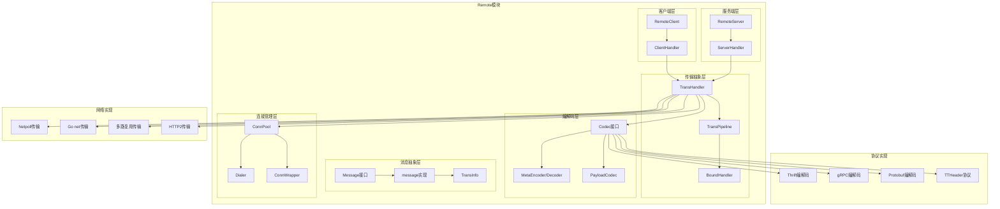

### 架构说明

**1. 分层设计**

- **传输抽象层**：定义传输处理器和管道的核心接口
- **消息抽象层**：提供统一的消息模型和传输信息
- **编解码层**：支持多种协议的编码和解码
- **连接管理层**：管理网络连接的创建、复用和回收
- **客户端/服务端层**：提供面向客户端和服务端的传输实现

**2. 组件交互**

- TransHandler是传输处理的核心接口
- TransPipeline提供可扩展的处理管道
- Message统一抽象请求和响应消息
- Codec提供协议无关的编解码接口
- ConnPool管理连接的生命周期

**3. 扩展机制**

- 支持自定义传输协议和编解码器
- 提供BoundHandler扩展点
- 支持多种网络传输实现
- 可插拔的连接池策略

## 核心算法与流程

### 消息传输核心流程

```go
// 客户端发送消息流程
func (c *client) Send(ctx context.Context, ri rpcinfo.RPCInfo, req remote.Message) (err error) {
    // 1. 通过传输处理器写入消息
    _, err = c.transHdlr.Write(ctx, c.conn, req)
    if err != nil {
        // 2. 发送失败时释放连接
        c.connManager.ReleaseConn(err, ri)
    }
    return err
}

// 客户端接收消息流程
func (c *client) Recv(ctx context.Context, ri rpcinfo.RPCInfo, resp remote.Message) (err error) {
    if resp != nil {
        // 1. 通过传输处理器读取消息
        ctx, err = c.transHdlr.Read(ctx, c.conn, resp)
        // 2. 处理接收到的消息
        c.transHdlr.OnMessage(ctx, nil, resp)
    } else {
        // 3. 单向调用等待数据刷新
        time.Sleep(time.Millisecond / 2)
    }
    
    // 4. 释放连接回连接池
    c.connManager.ReleaseConn(err, ri)
    return err
}
```

**传输流程说明**：

1. **消息发送**：通过TransHandler的Write方法发送消息
2. **消息接收**：通过TransHandler的Read方法接收消息
3. **消息处理**：通过OnMessage方法处理接收到的消息
4. **连接管理**：根据传输结果决定连接的复用或释放

### 传输管道处理流程

```go
func (p *TransPipeline) Write(ctx context.Context, conn net.Conn, sendMsg Message) (nctx context.Context, err error) {
    // 1. 依次执行出站处理器
    for _, h := range p.outboundHdrls {
        ctx, err = h.Write(ctx, conn, sendMsg)
        if err != nil {
            return ctx, err
        }
    }
    // 2. 执行网络处理器
    return p.netHdlr.Write(ctx, conn, sendMsg)
}

func (p *TransPipeline) OnMessage(ctx context.Context, args, result Message) (context.Context, error) {
    // 1. 依次执行入站处理器
    for _, h := range p.inboundHdrls {
        ctx, err = h.OnMessage(ctx, args, result)
        if err != nil {
            return ctx, err
        }
    }
    // 2. 执行网络处理器
    return p.netHdlr.OnMessage(ctx, args, result)
}
```

**管道处理说明**：

1. **出站处理**：消息发送时依次执行出站处理器
2. **入站处理**：消息接收时依次执行入站处理器
3. **网络处理**：最终由网络处理器执行实际的网络I/O
4. **错误处理**：任何处理器出错都会中断管道执行

### 消息编解码流程

```go
// 编码流程
func (c *defaultCodec) Encode(ctx context.Context, msg Message, out ByteBuffer) error {
    // 1. 编码元信息和负载
    if me, ok := c.payloadCodec.(MetaEncoder); ok {
        return me.EncodeMetaAndPayload(ctx, msg, out, me)
    }
    
    // 2. 分别编码元信息和负载
    if err := c.encodeMeta(ctx, msg, out); err != nil {
        return err
    }
    return c.payloadCodec.Marshal(ctx, msg, out)
}

// 解码流程
func (c *defaultCodec) Decode(ctx context.Context, msg Message, in ByteBuffer) error {
    // 1. 解码元信息
    if md, ok := c.payloadCodec.(MetaDecoder); ok {
        if err := md.DecodeMeta(ctx, msg, in); err != nil {
            return err
        }
    }
    
    // 2. 解码负载数据
    return c.payloadCodec.Unmarshal(ctx, msg, in)
}
```

**编解码流程说明**：

1. **元信息处理**：首先处理协议头和元信息
2. **负载处理**：然后处理实际的业务数据
3. **协议适配**：支持不同协议的编解码策略
4. **错误处理**：编解码失败时返回具体错误信息

### 连接池管理流程

```go
// 获取连接
func (p *LongPool) Get(ctx context.Context, network, address string, opt *ConnOption) (net.Conn, error) {
    // 1. 从连接池获取可用连接
    if conn := p.tryGetConn(address); conn != nil {
        return conn, nil
    }
    
    // 2. 连接池无可用连接，创建新连接
    conn, err := opt.Dialer.DialContext(ctx, network, address)
    if err != nil {
        return nil, err
    }
    
    // 3. 设置连接参数
    if err := p.setConnOptions(conn, opt); err != nil {
        conn.Close()
        return nil, err
    }
    
    return conn, nil
}

// 释放连接
func (p *LongPool) Put(conn net.Conn, err error) {
    if err != nil {
        // 1. 有错误时直接关闭连接
        conn.Close()
        return
    }
    
    // 2. 检查连接是否可复用
    if !p.isReusable(conn) {
        conn.Close()
        return
    }
    
    // 3. 放回连接池
    p.putConn(conn)
}
```

**连接池管理说明**：

1. **连接获取**：优先从池中获取，无可用连接时创建新连接
2. **连接配置**：设置超时、缓冲区等连接参数
3. **连接释放**：根据错误状态和连接状态决定复用或关闭
4. **连接清理**：定期清理空闲超时的连接

## 性能优化要点

### 1. 内存管理优化
- **对象池**：Message和TransInfo使用对象池减少分配
- **缓冲区复用**：ByteBuffer支持缓冲区复用和扩容
- **零拷贝**：支持零拷贝的网络数据传输
- **内存预分配**：预分配常用大小的缓冲区

### 2. 网络传输优化
- **连接复用**：长连接池减少连接建立开销
- **多路复用**：单连接支持并发请求处理
- **批量处理**：支持批量读写网络数据
- **异步I/O**：基于Netpoll的高性能异步网络处理

### 3. 编解码优化
- **快速编解码**：使用高性能的Thrift和Protobuf编解码器
- **流式处理**：支持流式编解码，减少内存占用
- **编解码缓存**：缓存编解码结果，避免重复计算
- **协议优化**：针对不同协议进行特定优化

### 4. 传输管道优化
- **管道缓存**：预构建传输管道，避免运行时创建
- **处理器复用**：复用BoundHandler实例
- **条件执行**：根据配置有条件地执行处理器
- **短路优化**：支持处理器短路返回

### 5. 连接管理优化
- **连接池分片**：使用分片连接池减少锁竞争
- **连接预热**：预创建连接避免首次调用延迟
- **健康检查**：定期检查连接健康状态
- **优雅关闭**：支持连接的优雅关闭和资源清理

### 6. 协议特定优化
- **TTHeader优化**：针对TTHeader协议的特定优化
- **gRPC兼容**：与标准gRPC协议的高效兼容
- **HTTP2支持**：原生支持HTTP2协议特性
- **压缩算法**：支持多种数据压缩算法

## 扩展点设计

### 1. 自定义传输协议

```go
// 实现自定义的传输处理器
type CustomTransHandler struct {
    // 自定义字段
}

func (h *CustomTransHandler) Write(ctx context.Context, conn net.Conn, send Message) (context.Context, error) {
    // 自定义写入逻辑
}

func (h *CustomTransHandler) Read(ctx context.Context, conn net.Conn, msg Message) (context.Context, error) {
    // 自定义读取逻辑
}
```

### 2. 自定义编解码器

```go
// 实现自定义的编解码器
type CustomCodec struct {
    // 自定义字段
}

func (c *CustomCodec) Encode(ctx context.Context, msg Message, out ByteBuffer) error {
    // 自定义编码逻辑
}

func (c *CustomCodec) Decode(ctx context.Context, msg Message, in ByteBuffer) error {
    // 自定义解码逻辑
}
```

### 3. 自定义BoundHandler

```go
// 实现自定义的边界处理器
type CustomBoundHandler struct {
    // 自定义字段
}

func (h *CustomBoundHandler) Write(ctx context.Context, conn net.Conn, send Message) (context.Context, error) {
    // 自定义出站处理逻辑
}

func (h *CustomBoundHandler) OnMessage(ctx context.Context, args, result Message) (context.Context, error) {
    // 自定义入站处理逻辑
}
```

这个概览文档详细介绍了Remote模块的架构设计、核心流程和性能优化策略。Remote模块作为Kitex的传输层核心，提供了高度可扩展和高性能的网络通信能力。

---

## API接口

## API概览

Remote模块提供了传输层的核心API，主要包括：

- **Message API**：统一的消息抽象接口
- **Codec API**：编解码器接口
- **TransHandler API**：传输处理器接口
- **Pipeline API**：传输管道接口
- **ConnPool API**：连接池接口
- **Factory API**：各种工厂接口

## 1. Message消息接口

### 基本信息
- 名称：`Message`
- 协议/方法：接口定义
- 幂等性：否（状态可变）

### 接口定义

```go
// Message是Kitex消息的核心抽象
type Message interface {
    RPCInfo() rpcinfo.RPCInfo                    // 获取RPC调用信息
    Data() interface{}                           // 获取消息数据
    NewData(method string) (ok bool)             // 创建新的数据对象
    MessageType() MessageType                    // 获取消息类型
    SetMessageType(MessageType)                  // 设置消息类型
    RPCRole() RPCRole                           // 获取RPC角色
    PayloadLen() int                            // 获取负载长度
    SetPayloadLen(size int)                     // 设置负载长度
    TransInfo() TransInfo                       // 获取传输信息
    Tags() map[string]interface{}               // 获取标签信息
    PayloadCodec() PayloadCodec                 // 获取负载编解码器
    SetPayloadCodec(pc PayloadCodec)            // 设置负载编解码器
    Recycle()                                   // 回收消息对象
}
```

| 方法 | 返回类型 | 必填 | 约束 | 说明 |
|------|----------|------|------|------|
| RPCInfo | rpcinfo.RPCInfo | 是 | 非空 | 包含服务名、方法名、调用方信息 |
| Data | interface{} | 否 | - | 业务数据，请求参数或响应结果 |
| MessageType | MessageType | 是 | 枚举值 | Call/Reply/Exception/Oneway/Stream/Heartbeat |
| RPCRole | RPCRole | 是 | 枚举值 | Client/Server角色标识 |
| PayloadLen | int | 是 | >=0 | 序列化后的负载数据长度 |
| TransInfo | TransInfo | 是 | 非空 | 传输层元信息，包含协议头信息 |
| Tags | map[string]interface{} | 是 | 非空 | 用户自定义标签和框架内部标记 |

### 入口函数与关键代码

```go
// 创建新消息
func NewMessage(data interface{}, ri rpcinfo.RPCInfo, msgType MessageType, rpcRole RPCRole) Message {
    // 1. 从对象池获取消息实例
    msg := messagePool.Get().(*message)
    
    // 2. 初始化消息字段
    msg.data = data
    msg.rpcInfo = ri
    msg.msgType = msgType
    msg.rpcRole = rpcRole
    
    // 3. 获取传输信息对象
    msg.transInfo = transInfoPool.Get().(*transInfo)
    
    return msg
}

// 回收消息对象
func RecycleMessage(msg Message) {
    if msg != nil {
        msg.Recycle()
    }
}
```

### 上层适配/调用链核心代码

```go
// 在客户端发送消息时的使用
func (c *client) Send(ctx context.Context, ri rpcinfo.RPCInfo, req remote.Message) (err error) {
    // 通过传输处理器写入消息
    _, err = c.transHdlr.Write(ctx, c.conn, req)
    return err
}

// 在服务端处理消息时的使用
func (s *serverHandler) OnMessage(ctx context.Context, args, result Message) (context.Context, error) {
    // 处理接收到的消息
    return s.eps.Call(ctx, args, result)
}
```

### 时序图（消息创建→回收）

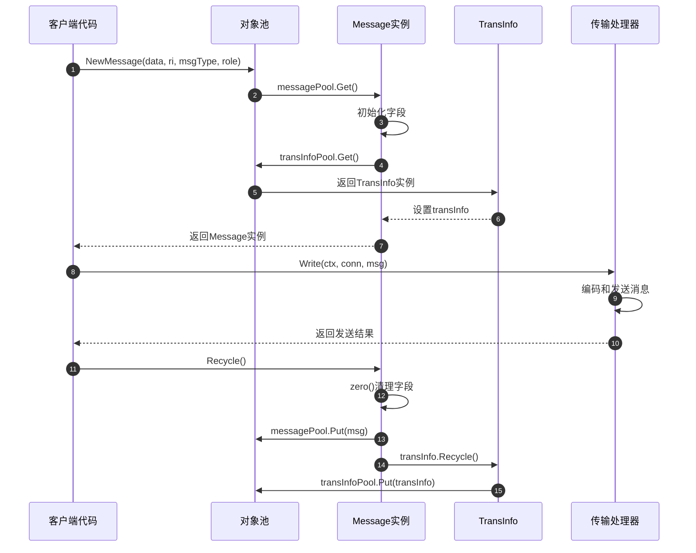

### 异常/回退与性能要点
- **对象池优化**：使用sync.Pool减少内存分配，提高性能
- **零值重置**：回收时清理所有字段，防止内存泄漏
- **并发安全**：Message实例在单个goroutine中使用，避免并发问题
- **内存管理**：及时回收Message和TransInfo，控制内存使用
- **标签管理**：合理使用Tags字段，避免过多的键值对

## 2. Codec编解码接口

### 基本信息
- 名称：`Codec`
- 协议/方法：接口定义
- 幂等性：是（相同输入产生相同输出）

### 接口定义

```go
// Codec是Kitex编解码层的抽象
type Codec interface {
    Encode(ctx context.Context, msg Message, out ByteBuffer) error  // 编码消息
    Decode(ctx context.Context, msg Message, in ByteBuffer) error   // 解码消息
    Name() string                                                   // 编解码器名称
}

// MetaEncoder是具有元信息和负载阶段的编码层抽象
type MetaEncoder interface {
    EncodeMetaAndPayload(ctx context.Context, msg Message, out ByteBuffer, me MetaEncoder) error
    EncodePayload(ctx context.Context, msg Message, out ByteBuffer) error
}

// MetaDecoder是具有元信息和负载阶段的解码层抽象
type MetaDecoder interface {
    DecodeMeta(ctx context.Context, msg Message, in ByteBuffer) error
    DecodePayload(ctx context.Context, msg Message, in ByteBuffer) error
}
```

| 方法 | 参数类型 | 必填 | 约束 | 说明 |
|------|----------|------|------|------|
| Encode | (context.Context, Message, ByteBuffer) | 是 | msg非空 | 将Message编码到ByteBuffer |
| Decode | (context.Context, Message, ByteBuffer) | 是 | in非空 | 从ByteBuffer解码到Message |
| Name | () | 是 | 非空字符串 | 返回编解码器的唯一标识 |
| EncodeMetaAndPayload | (context.Context, Message, ByteBuffer, MetaEncoder) | 是 | - | 编码元信息和负载 |
| EncodePayload | (context.Context, Message, ByteBuffer) | 是 | - | 仅编码负载数据 |
| DecodeMeta | (context.Context, Message, ByteBuffer) | 是 | - | 仅解码元信息 |
| DecodePayload | (context.Context, Message, ByteBuffer) | 是 | - | 仅解码负载数据 |

### 入口函数与关键代码

```go
// 默认编解码器实现
type defaultCodec struct {
    payloadCodec PayloadCodec
}

func (c *defaultCodec) Encode(ctx context.Context, msg Message, out ByteBuffer) error {
    // 1. 检查是否支持元信息编码
    if me, ok := c.payloadCodec.(MetaEncoder); ok {
        return me.EncodeMetaAndPayload(ctx, msg, out, me)
    }
    
    // 2. 分别编码元信息和负载
    if err := c.encodeMeta(ctx, msg, out); err != nil {
        return err
    }
    return c.payloadCodec.Marshal(ctx, msg, out)
}

func (c *defaultCodec) Decode(ctx context.Context, msg Message, in ByteBuffer) error {
    // 1. 检查是否支持元信息解码
    if md, ok := c.payloadCodec.(MetaDecoder); ok {
        if err := md.DecodeMeta(ctx, msg, in); err != nil {
            return err
        }
    }
    
    // 2. 解码负载数据
    return c.payloadCodec.Unmarshal(ctx, msg, in)
}

func (c *defaultCodec) Name() string {
    return c.payloadCodec.Name()
}
```

### 时序图（编码→解码）

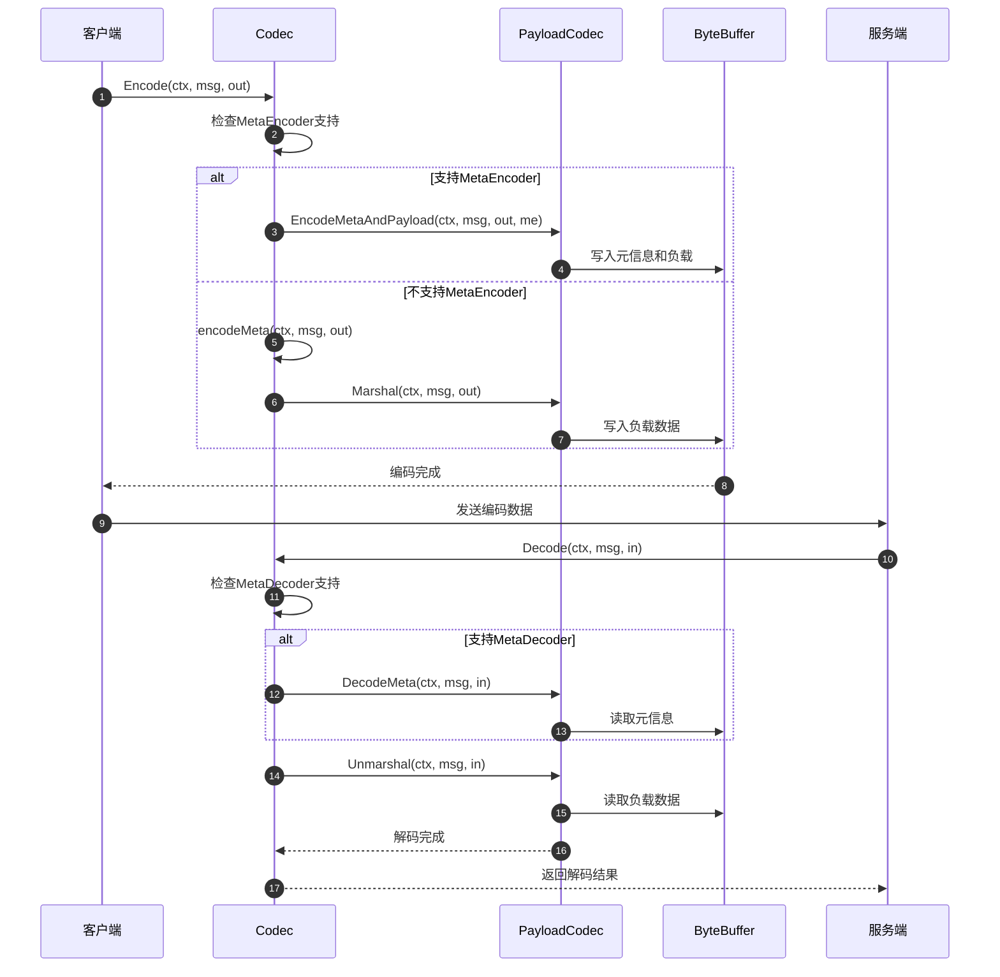

### 异常/回退与性能要点
- **编码错误处理**：编码失败时返回具体错误信息，支持错误链追踪
- **解码错误处理**：解码失败时清理已解码的部分数据
- **缓冲区管理**：合理使用ByteBuffer，避免频繁的内存分配和拷贝
- **协议兼容性**：支持协议版本升级和向后兼容
- **性能优化**：使用高效的序列化库，如fast thrift、protobuf等

## 3. TransHandler传输处理器接口

### 基本信息
- 名称：`TransHandler`
- 协议/方法：接口定义
- 幂等性：否（有状态的网络操作）

### 接口定义

```go
// TransReadWriter定义读写操作
type TransReadWriter interface {
    Write(ctx context.Context, conn net.Conn, send Message) (nctx context.Context, err error)
    Read(ctx context.Context, conn net.Conn, msg Message) (nctx context.Context, err error)
}

// TransHandler类似Netty中的handler角色
type TransHandler interface {
    TransReadWriter
    OnInactive(ctx context.Context, conn net.Conn)                           // 连接关闭回调
    OnError(ctx context.Context, err error, conn net.Conn)                  // 错误处理回调
    OnMessage(ctx context.Context, args, result Message) (context.Context, error)  // 消息处理回调
    SetPipeline(pipeline *TransPipeline)                                    // 设置传输管道
}

// ClientTransHandler客户端传输处理器
type ClientTransHandler interface {
    TransHandler
}

// ServerTransHandler服务端传输处理器
type ServerTransHandler interface {
    TransHandler
    OnActive(ctx context.Context, conn net.Conn) (context.Context, error)   // 连接激活回调
    OnRead(ctx context.Context, conn net.Conn) (context.Context, error)     // 读取数据回调
}
```

| 方法 | 参数类型 | 必填 | 约束 | 说明 |
|------|----------|------|------|------|
| Write | (context.Context, net.Conn, Message) | 是 | conn非空 | 向连接写入消息 |
| Read | (context.Context, net.Conn, Message) | 是 | conn非空 | 从连接读取消息 |
| OnActive | (context.Context, net.Conn) | 否 | 仅服务端 | 连接建立时的回调 |
| OnInactive | (context.Context, net.Conn) | 是 | - | 连接关闭时的回调 |
| OnRead | (context.Context, net.Conn) | 否 | 仅服务端 | 有数据可读时的回调 |
| OnMessage | (context.Context, Message, Message) | 是 | - | 消息处理完成的回调 |
| OnError | (context.Context, error, net.Conn) | 是 | - | 发生错误时的回调 |

### 入口函数与关键代码

```go
// 默认服务端传输处理器
type svrTransHandler struct {
    opt      *ServerOption
    codec    Codec
    pipeline *TransPipeline
}

func (t *svrTransHandler) Write(ctx context.Context, conn net.Conn, send Message) (context.Context, error) {
    // 1. 获取写缓冲区
    buf := netpoll.NewLinkBuffer()
    defer buf.Release()
    
    // 2. 编码消息到缓冲区
    if err := t.codec.Encode(ctx, send, buf); err != nil {
        return ctx, err
    }
    
    // 3. 写入网络连接
    _, err := conn.Write(buf.Bytes())
    return ctx, err
}

func (t *svrTransHandler) Read(ctx context.Context, conn net.Conn, msg Message) (context.Context, error) {
    // 1. 获取读缓冲区
    buf := netpoll.NewLinkBuffer()
    defer buf.Release()
    
    // 2. 从连接读取数据
    if _, err := buf.ReadFrom(conn); err != nil {
        return ctx, err
    }
    
    // 3. 解码消息
    if err := t.codec.Decode(ctx, msg, buf); err != nil {
        return ctx, err
    }
    
    return ctx, nil
}

func (t *svrTransHandler) OnMessage(ctx context.Context, args, result Message) (context.Context, error) {
    // 业务逻辑处理
    return t.opt.SvcSearcher.Call(ctx, args, result)
}
```

### 时序图（请求处理）

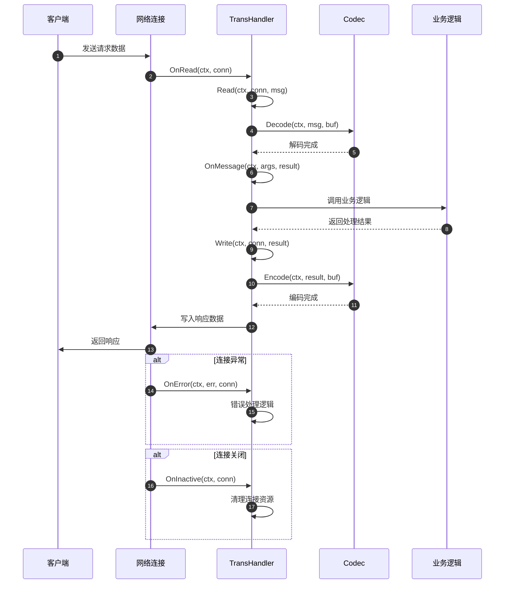

### 异常/回退与性能要点
- **连接管理**：正确处理连接的生命周期，及时清理资源
- **错误处理**：区分不同类型的错误，采取相应的处理策略
- **缓冲区管理**：使用高效的缓冲区实现，减少内存分配
- **并发安全**：TransHandler实例可能被多个goroutine使用，需要保证并发安全
- **超时处理**：设置合理的读写超时，避免连接长时间阻塞

## 4. TransPipeline传输管道接口

### 基本信息
- 名称：`TransPipeline`
- 协议/方法：结构体和方法
- 幂等性：否（管道状态可变）

### 结构体定义

```go
// TransPipeline包含传输处理器链
type TransPipeline struct {
    netHdlr       TransHandler      // 网络处理器
    inboundHdrls  []InboundHandler  // 入站处理器列表
    outboundHdrls []OutboundHandler // 出站处理器列表
}

// BoundHandler是边界处理器的抽象
type BoundHandler interface{}

// OutboundHandler处理写事件
type OutboundHandler interface {
    BoundHandler
    Write(ctx context.Context, conn net.Conn, send Message) (context.Context, error)
}

// InboundHandler处理读事件
type InboundHandler interface {
    BoundHandler
    OnActive(ctx context.Context, conn net.Conn) (context.Context, error)
    OnInactive(ctx context.Context, conn net.Conn) context.Context
    OnRead(ctx context.Context, conn net.Conn) (context.Context, error)
    OnMessage(ctx context.Context, args, result Message) (context.Context, error)
}
```

| 字段 | 类型 | 必填 | 约束 | 说明 |
|------|------|------|------|------|
| netHdlr | TransHandler | 是 | 非空 | 网络层传输处理器 |
| inboundHdrls | []InboundHandler | 否 | - | 入站处理器链，按顺序执行 |
| outboundHdrls | []OutboundHandler | 否 | - | 出站处理器链，按顺序执行 |

### 入口函数与关键代码

```go
// 创建传输管道
func NewTransPipeline(netHdlr TransHandler) *TransPipeline {
    transPl := newTransPipeline()
    transPl.netHdlr = netHdlr
    netHdlr.SetPipeline(transPl)
    return transPl
}

// 添加入站处理器
func (p *TransPipeline) AddInboundHandler(hdlr InboundHandler) *TransPipeline {
    p.inboundHdrls = append(p.inboundHdrls, hdlr)
    return p
}

// 添加出站处理器
func (p *TransPipeline) AddOutboundHandler(hdlr OutboundHandler) *TransPipeline {
    p.outboundHdrls = append(p.outboundHdrls, hdlr)
    return p
}

// 写入消息（出站处理）
func (p *TransPipeline) Write(ctx context.Context, conn net.Conn, sendMsg Message) (nctx context.Context, err error) {
    // 1. 依次执行出站处理器
    for _, h := range p.outboundHdrls {
        ctx, err = h.Write(ctx, conn, sendMsg)
        if err != nil {
            return ctx, err
        }
    }
    // 2. 执行网络处理器
    return p.netHdlr.Write(ctx, conn, sendMsg)
}

// 消息处理（入站处理）
func (p *TransPipeline) OnMessage(ctx context.Context, args, result Message) (context.Context, error) {
    var err error
    // 1. 依次执行入站处理器
    for _, h := range p.inboundHdrls {
        ctx, err = h.OnMessage(ctx, args, result)
        if err != nil {
            return ctx, err
        }
    }
    // 2. 执行网络处理器
    return p.netHdlr.OnMessage(ctx, args, result)
}
```

### 时序图（管道处理）

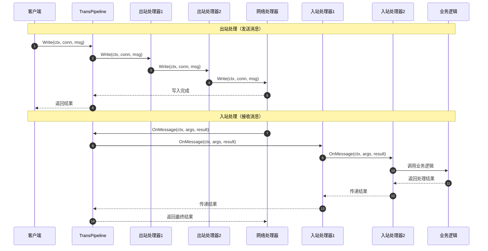

### 异常/回退与性能要点
- **处理器顺序**：入站和出站处理器的执行顺序很重要，需要合理设计
- **错误传播**：任何处理器出错都会中断管道执行，错误会向上传播
- **性能优化**：避免在处理器中执行耗时操作，使用异步处理
- **资源管理**：处理器需要正确管理资源，避免内存泄漏
- **扩展性**：支持动态添加和移除处理器，提供良好的扩展性

## 5. ConnPool连接池接口

### 基本信息
- 名称：`ConnPool`
- 协议/方法：接口定义
- 幂等性：否（连接状态管理）

### 接口定义

```go
// ConnPool是连接池的抽象接口
type ConnPool interface {
    Get(ctx context.Context, network, address string, opt *ConnOption) (net.Conn, error)
    Put(net.Conn, error)
    Discard(net.Conn)
    Clean(network, address string)
    Reporter() ConnPoolReporter
}

// ConnOption连接选项
type ConnOption struct {
    Dialer    Dialer
    ConnectTimeout time.Duration
    ReadTimeout    time.Duration
    WriteTimeout   time.Duration
}
```

| 方法 | 参数类型 | 必填 | 约束 | 说明 |
|------|----------|------|------|------|
| Get | (context.Context, string, string, *ConnOption) | 是 | address非空 | 获取连接 |
| Put | (net.Conn, error) | 是 | conn非空 | 归还连接 |
| Discard | (net.Conn) | 是 | conn非空 | 丢弃连接 |
| Clean | (string, string) | 是 | - | 清理指定地址的连接 |
| Reporter | () | 否 | - | 获取连接池报告器 |

### 入口函数与关键代码

```go
// 长连接池实现
type LongPool struct {
    pools    sync.Map  // 地址到连接池的映射
    maxIdle  int       // 最大空闲连接数
    reporter ConnPoolReporter
}

func (p *LongPool) Get(ctx context.Context, network, address string, opt *ConnOption) (net.Conn, error) {
    // 1. 获取地址对应的连接池
    pool := p.getPool(address)
    
    // 2. 尝试从池中获取连接
    if conn := pool.tryGet(); conn != nil {
        return conn, nil
    }
    
    // 3. 池中无可用连接，创建新连接
    conn, err := opt.Dialer.DialContext(ctx, network, address)
    if err != nil {
        return nil, err
    }
    
    // 4. 设置连接选项
    if err := setConnOption(conn, opt); err != nil {
        conn.Close()
        return nil, err
    }
    
    return conn, nil
}

func (p *LongPool) Put(conn net.Conn, err error) {
    if err != nil {
        // 有错误时直接关闭连接
        conn.Close()
        return
    }
    
    // 检查连接是否可复用
    if !isConnReusable(conn) {
        conn.Close()
        return
    }
    
    // 放回连接池
    address := conn.RemoteAddr().String()
    pool := p.getPool(address)
    pool.put(conn)
}
```

### 时序图（连接获取→归还）

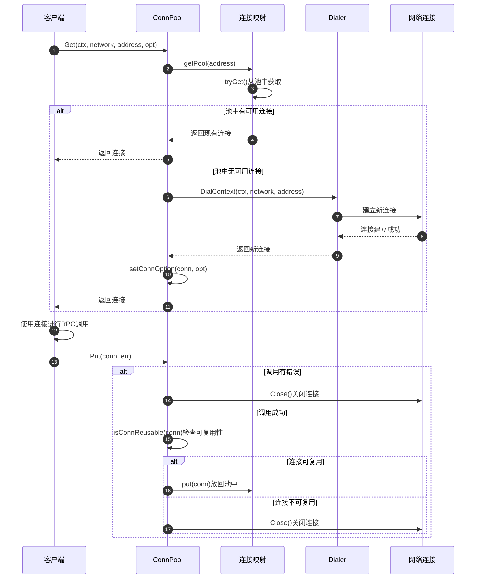

### 异常/回退与性能要点
- **连接复用**：合理管理连接的生命周期，最大化连接复用率
- **连接检查**：定期检查连接的健康状态，及时清理无效连接
- **并发安全**：连接池需要支持并发访问，使用适当的同步机制
- **资源限制**：设置合理的连接数上限，避免资源耗尽
- **监控统计**：通过Reporter接口提供连接池的使用统计信息

## API使用最佳实践

### 1. Message使用实践

```go
// 创建消息时指定正确的类型和角色
msg := remote.NewMessage(req, ri, remote.Call, remote.Client)
defer remote.RecycleMessage(msg)

// 设置必要的传输信息
msg.TransInfo().PutTransStrInfo(map[string]string{
    "custom-header": "value",
})
```

### 2. Codec扩展实践

```go
// 实现自定义编解码器
type CustomCodec struct {
    name string
}

func (c *CustomCodec) Encode(ctx context.Context, msg remote.Message, out remote.ByteBuffer) error {
    // 自定义编码逻辑
    return nil
}

func (c *CustomCodec) Decode(ctx context.Context, msg remote.Message, in remote.ByteBuffer) error {
    // 自定义解码逻辑
    return nil
}

func (c *CustomCodec) Name() string {
    return c.name
}
```

### 3. Pipeline扩展实践

```go
// 添加自定义处理器
type LoggingHandler struct{}

func (h *LoggingHandler) Write(ctx context.Context, conn net.Conn, send remote.Message) (context.Context, error) {
    // 记录发送日志
    log.Infof("Sending message: %+v", send)
    return ctx, nil
}

// 在创建TransPipeline时添加处理器
pipeline := remote.NewTransPipeline(netHandler)
pipeline.AddOutboundHandler(&LoggingHandler{})
```

这个API文档详细介绍了Remote模块的核心接口，包括接口定义、参数说明、实现示例和使用最佳实践，为开发者提供了完整的API参考。

---

## 数据结构

## 核心数据结构UML图

```mermaid
classDiagram
    class Message {
        <<interface>>
        +RPCInfo() rpcinfo.RPCInfo
        +Data() interface{}
        +NewData(method string) bool
        +MessageType() MessageType
        +SetMessageType(MessageType)
        +RPCRole() RPCRole
        +PayloadLen() int
        +SetPayloadLen(size int)
        +TransInfo() TransInfo
        +Tags() map[string]interface{}
        +PayloadCodec() PayloadCodec
        +SetPayloadCodec(pc PayloadCodec)
        +Recycle()
    }
    
    class message {
        -msgType MessageType
        -data interface{}
        -rpcInfo rpcinfo.RPCInfo
        -rpcRole RPCRole
        -compressType CompressType
        -payloadSize int
        -transInfo TransInfo
        -tags map[string]interface{}
        -payloadCodec PayloadCodec
        +zero()
        +Recycle()
    }
    
    class TransInfo {
        <<interface>>
        +TransStrInfo() map[string]string
        +TransIntInfo() map[uint16]string
        +PutTransIntInfo(map[uint16]string)
        +PutTransStrInfo(kvInfo map[string]string)
        +Recycle()
    }
    
    class transInfo {
        -strInfo map[string]string
        -intInfo map[uint16]string
        +zero()
        +Recycle()
    }
    
    class ServerOption {
        +SvcSearcher ServiceSearcher
        +TransServerFactory TransServerFactory
        +SvrHandlerFactory ServerTransHandlerFactory
        +Codec Codec
        +PayloadCodec PayloadCodec
        +Listener net.Listener
        +Address net.Addr
        +ReusePort bool
        +ExitWaitTime time.Duration
        +AcceptFailedDelayTime time.Duration
        +MaxConnectionIdleTime time.Duration
        +ReadWriteTimeout time.Duration
        +TracerCtl *rpcinfo.TraceController
        +GRPCCfg *grpc.ServerConfig
        +TTHeaderStreamingOptions TTHeaderStreamingOptions
        +CompatibleMiddlewareForUnary bool
    }
    
    class ClientOption {
        +SvcInfo *serviceinfo.ServiceInfo
        +CliHandlerFactory ClientTransHandlerFactory
        +Codec Codec
        +PayloadCodec PayloadCodec
        +ConnPool ConnPool
        +Dialer Dialer
        +EnableConnPoolReporter bool
        +GRPCStreamingCliHandlerFactory ClientTransHandlerFactory
        +GRPCStreamingConnPool ConnPool
        +TTHeaderStreamingCliHandlerFactory ClientStreamFactory
    }
    
    class Option {
        +Outbounds []OutboundHandler
        +Inbounds []InboundHandler
        +StreamingMetaHandlers []StreamingMetaHandler
        +PrependBoundHandler(h BoundHandler)
        +AppendBoundHandler(h BoundHandler)
    }
    
    class TransPipeline {
        -netHdlr TransHandler
        -inboundHdrls []InboundHandler
        -outboundHdrls []OutboundHandler
        +AddInboundHandler(hdlr InboundHandler) *TransPipeline
        +AddOutboundHandler(hdlr OutboundHandler) *TransPipeline
        +Write(ctx context.Context, conn net.Conn, sendMsg Message) (context.Context, error)
        +OnMessage(ctx context.Context, args, result Message) (context.Context, error)
    }
    
    class MessageType {
        <<enumeration>>
        InvalidMessageType = 0
        Call = 1
        Reply = 2
        Exception = 3
        Oneway = 4
        Stream = 5
        Heartbeat = 6
    }
    
    class RPCRole {
        <<enumeration>>
        Client
        Server
    }
    
    class CompressType {
        <<enumeration>>
        NoCompress
        Gzip
        Snappy
    }
    
    Message <|-- message
    TransInfo <|-- transInfo
    message --> MessageType
    message --> RPCRole
    message --> CompressType
    message --> TransInfo
    ServerOption --> Option
    ClientOption --> Option
    TransPipeline --> TransHandler
    TransPipeline --> InboundHandler
    TransPipeline --> OutboundHandler
```

## 主要数据结构详解

### 1. Message消息核心结构

```go
// Message接口定义
type Message interface {
    RPCInfo() rpcinfo.RPCInfo                    // RPC调用信息
    Data() interface{}                           // 消息数据
    NewData(method string) (ok bool)             // 创建新数据
    MessageType() MessageType                    // 消息类型
    SetMessageType(MessageType)                  // 设置消息类型
    RPCRole() RPCRole                           // RPC角色
    PayloadLen() int                            // 负载长度
    SetPayloadLen(size int)                     // 设置负载长度
    TransInfo() TransInfo                       // 传输信息
    Tags() map[string]interface{}               // 标签信息
    PayloadCodec() PayloadCodec                 // 负载编解码器
    SetPayloadCodec(pc PayloadCodec)            // 设置编解码器
    Recycle()                                   // 回收消息
}

// message实现结构
type message struct {
    msgType      MessageType                    // 消息类型
    data         interface{}                    // 消息数据
    rpcInfo      rpcinfo.RPCInfo               // RPC信息
    rpcRole      RPCRole                       // RPC角色
    compressType CompressType                  // 压缩类型
    payloadSize  int                           // 负载大小
    transInfo    TransInfo                     // 传输信息
    tags         map[string]interface{}        // 标签映射
    payloadCodec PayloadCodec                  // 负载编解码器
}
```

**字段映射与说明**：

| 字段 | 类型 | 必填 | 默认值 | 约束 | 说明 |
|------|------|------|--------|------|------|
| msgType | MessageType | 是 | InvalidMessageType | 枚举值 | 消息类型：Call/Reply/Exception/Oneway/Stream/Heartbeat |
| data | interface{} | 否 | nil | - | 业务数据，请求参数或响应结果 |
| rpcInfo | rpcinfo.RPCInfo | 是 | nil | 非空 | RPC调用元信息，包含服务名、方法名等 |
| rpcRole | RPCRole | 是 | -1 | Client/Server | RPC调用中的角色标识 |
| compressType | CompressType | 否 | NoCompress | 枚举值 | 数据压缩类型 |
| payloadSize | int | 是 | 0 | >=0 | 序列化后的负载数据字节长度 |
| transInfo | TransInfo | 是 | nil | 非空 | 传输层元信息，协议头信息 |
| tags | map[string]interface{} | 是 | make(map) | 非空 | 用户自定义标签和框架内部标记 |
| payloadCodec | PayloadCodec | 否 | nil | - | 负载数据的编解码器 |

**生命周期管理**：

```go
// 创建消息
func NewMessage(data interface{}, ri rpcinfo.RPCInfo, msgType MessageType, rpcRole RPCRole) Message {
    msg := messagePool.Get().(*message)  // 从对象池获取
    msg.data = data
    msg.rpcInfo = ri
    msg.msgType = msgType
    msg.rpcRole = rpcRole
    msg.transInfo = transInfoPool.Get().(*transInfo)  // 获取传输信息
    return msg
}

// 回收消息
func (m *message) Recycle() {
    m.zero()              // 清零所有字段
    messagePool.Put(m)    // 放回对象池
}
```

### 2. TransInfo传输信息结构

```go
// TransInfo接口定义
type TransInfo interface {
    TransStrInfo() map[string]string             // 字符串类型传输信息
    TransIntInfo() map[uint16]string             // 整数类型传输信息
    PutTransIntInfo(map[uint16]string)           // 设置整数传输信息
    PutTransStrInfo(kvInfo map[string]string)    // 设置字符串传输信息
    Recycle()                                    // 回收传输信息
}

// transInfo实现结构
type transInfo struct {
    strInfo map[string]string    // 字符串键值对信息
    intInfo map[uint16]string    // 整数键值对信息
}
```

**字段说明与约束**：

| 字段 | 类型 | 用途 | 约束 | 说明 |
|------|------|------|------|------|
| strInfo | map[string]string | 协议头信息 | 键值对格式 | 存储字符串类型的传输元信息，如HTTP头 |
| intInfo | map[uint16]string | 协议标识 | 键为uint16 | 存储数字标识的传输信息，如协议ID |

**核心方法实现**：

```go
// 合并字符串传输信息
func (ti *transInfo) PutTransStrInfo(kvInfo map[string]string) {
    if kvInfo == nil {
        return
    }
    if len(ti.strInfo) == 0 {
        ti.strInfo = kvInfo  // 直接赋值
    } else {
        for k, v := range kvInfo {
            ti.strInfo[k] = v  // 逐个合并
        }
    }
}

// 回收传输信息
func (ti *transInfo) Recycle() {
    ti.zero()              // 清理映射
    transInfoPool.Put(ti)  // 放回对象池
}
```

### 3. ServerOption服务端配置结构

```go
type ServerOption struct {
    // 核心组件
    SvcSearcher       ServiceSearcher              // 服务搜索器
    TransServerFactory TransServerFactory          // 传输服务器工厂
    SvrHandlerFactory ServerTransHandlerFactory    // 服务端处理器工厂
    Codec             Codec                        // 编解码器
    PayloadCodec      PayloadCodec                 // 负载编解码器
    
    // 网络配置
    Listener          net.Listener                 // 网络监听器
    Address           net.Addr                     // 监听地址
    ReusePort         bool                         // 端口复用
    
    // 超时配置
    ExitWaitTime            time.Duration          // 优雅停机等待时间
    AcceptFailedDelayTime   time.Duration          // 接受连接失败延迟时间
    MaxConnectionIdleTime   time.Duration          // 连接最大空闲时间
    ReadWriteTimeout        time.Duration          // 读写超时时间
    
    // 功能组件
    InitOrResetRPCInfoFunc func(rpcinfo.RPCInfo, net.Addr) rpcinfo.RPCInfo  // RPC信息初始化函数
    TracerCtl              *rpcinfo.TraceController                          // 链路追踪控制器
    Profiler               profiler.Profiler                                 // 性能分析器
    
    // 协议支持
    GRPCCfg                        *grpc.ServerConfig                        // gRPC配置
    GRPCUnknownServiceHandler      func(ctx context.Context, method string, stream streaming.Stream) error  // gRPC未知服务处理器
    TTHeaderStreamingOptions       TTHeaderStreamingOptions                  // TTHeader流式选项
    CompatibleMiddlewareForUnary   bool                                      // 一元调用中间件兼容性
    
    // 基础选项
    Option  // 嵌入基础选项
}
```

**配置分类与说明**：

1. **核心组件配置**：
   - `SvcSearcher`：服务发现和路由组件
   - `TransServerFactory`：传输服务器创建工厂
   - `Codec/PayloadCodec`：消息编解码组件

2. **网络配置**：
   - `Listener/Address`：网络监听配置
   - `ReusePort`：支持端口复用，提高性能

3. **超时配置**：
   - `ExitWaitTime`：优雅停机等待时间
   - `ReadWriteTimeout`：读写操作超时时间
   - `MaxConnectionIdleTime`：连接空闲超时时间

4. **协议支持**：
   - `GRPCCfg`：gRPC协议特定配置
   - `TTHeaderStreamingOptions`：TTHeader流式协议配置

### 4. ClientOption客户端配置结构

```go
type ClientOption struct {
    // 服务信息
    SvcInfo *serviceinfo.ServiceInfo              // 服务信息
    
    // 核心组件
    CliHandlerFactory ClientTransHandlerFactory   // 客户端处理器工厂
    Codec             Codec                       // 编解码器
    PayloadCodec      PayloadCodec                // 负载编解码器
    
    // 连接管理
    ConnPool          ConnPool                    // 连接池
    Dialer            Dialer                      // 连接拨号器
    
    // 监控配置
    EnableConnPoolReporter bool                   // 启用连接池报告
    
    // 流式支持
    GRPCStreamingCliHandlerFactory    ClientTransHandlerFactory  // gRPC流式处理器工厂
    GRPCStreamingConnPool             ConnPool                   // gRPC流式连接池
    TTHeaderStreamingCliHandlerFactory ClientStreamFactory       // TTHeader流式工厂
    
    // 基础选项
    Option  // 嵌入基础选项
}
```

**客户端特定配置**：

| 配置项 | 类型 | 必填 | 说明 |
|--------|------|------|------|
| SvcInfo | *serviceinfo.ServiceInfo | 是 | 目标服务的元信息 |
| ConnPool | ConnPool | 是 | 连接池实现，管理到服务端的连接 |
| Dialer | Dialer | 是 | 网络连接拨号器 |
| EnableConnPoolReporter | bool | 否 | 是否启用连接池监控报告 |

### 5. Option基础选项结构

```go
type Option struct {
    Outbounds             []OutboundHandler        // 出站处理器列表
    Inbounds              []InboundHandler         // 入站处理器列表
    StreamingMetaHandlers []StreamingMetaHandler   // 流式元信息处理器
}

// 处理器管理方法
func (o *Option) PrependBoundHandler(h BoundHandler) {
    switch v := h.(type) {
    case DuplexBoundHandler:
        o.Inbounds = append([]InboundHandler{v}, o.Inbounds...)
        o.Outbounds = append([]OutboundHandler{v}, o.Outbounds...)
    case InboundHandler:
        o.Inbounds = append([]InboundHandler{v}, o.Inbounds...)
    case OutboundHandler:
        o.Outbounds = append([]OutboundHandler{v}, o.Outbounds...)
    }
}
```

**处理器类型**：

- **InboundHandler**：处理入站数据（接收）
- **OutboundHandler**：处理出站数据（发送）
- **DuplexBoundHandler**：同时处理入站和出站数据

### 6. TransPipeline传输管道结构

```go
type TransPipeline struct {
    netHdlr       TransHandler        // 网络处理器
    inboundHdrls  []InboundHandler    // 入站处理器链
    outboundHdrls []OutboundHandler   // 出站处理器链
}
```

**管道处理流程**：

```go
// 出站处理（发送消息）
func (p *TransPipeline) Write(ctx context.Context, conn net.Conn, sendMsg Message) (context.Context, error) {
    // 1. 依次执行出站处理器
    for _, h := range p.outboundHdrls {
        ctx, err = h.Write(ctx, conn, sendMsg)
        if err != nil {
            return ctx, err
        }
    }
    // 2. 执行网络处理器
    return p.netHdlr.Write(ctx, conn, sendMsg)
}

// 入站处理（接收消息）
func (p *TransPipeline) OnMessage(ctx context.Context, args, result Message) (context.Context, error) {
    var err error
    // 1. 依次执行入站处理器
    for _, h := range p.inboundHdrls {
        ctx, err = h.OnMessage(ctx, args, result)
        if err != nil {
            return ctx, err
        }
    }
    // 2. 执行网络处理器
    return p.netHdlr.OnMessage(ctx, args, result)
}
```

### 7. 枚举类型定义

#### MessageType消息类型

```go
type MessageType int32

const (
    InvalidMessageType MessageType = 0  // 无效消息类型
    Call               MessageType = 1  // 调用请求
    Reply              MessageType = 2  // 响应消息
    Exception          MessageType = 3  // 异常消息
    Oneway             MessageType = 4  // 单向调用（无需响应）
    Stream             MessageType = 5  // 流式消息
    Heartbeat          MessageType = 6  // 心跳消息
)
```

#### RPCRole角色类型

```go
type RPCRole int

const (
    Client RPCRole = 1  // 客户端角色
    Server RPCRole = 2  // 服务端角色
)
```

#### CompressType压缩类型

```go
type CompressType int

const (
    NoCompress CompressType = 0  // 无压缩
    Gzip       CompressType = 1  // Gzip压缩
    Snappy     CompressType = 2  // Snappy压缩
)
```

## 数据结构关系图

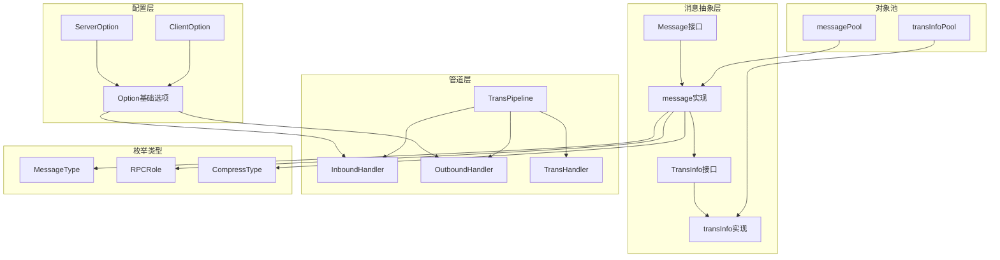

## 内存管理与性能优化

### 1. 对象池优化

**消息对象池**：

```go
var messagePool = &sync.Pool{
    New: func() interface{} {
        return &message{tags: make(map[string]interface{})}
    },
}

var transInfoPool = &sync.Pool{
    New: func() interface{} {
        return &transInfo{
            intInfo: make(map[uint16]string),
            strInfo: make(map[string]string),
        }
    },
}
```

**优化要点**：

- 使用sync.Pool减少GC压力
- 预分配map容量，减少扩容开销
- 及时回收对象，避免内存泄漏

### 2. 零值重置优化

**消息零值重置**：

```go
func (m *message) zero() {
    m.msgType = InvalidMessageType
    m.data = nil
    m.rpcInfo = nil
    m.rpcRole = -1
    m.compressType = NoCompress
    m.payloadSize = 0
    if m.transInfo != nil {
        m.transInfo.Recycle()  // 递归回收
        m.transInfo = nil
    }
    for k := range m.tags {
        delete(m.tags, k)      // 清理map
    }
}
```

**优化策略**：

- 彻底清理所有字段，防止数据泄漏
- 递归回收嵌套对象
- 高效清理map和slice

### 3. 配置结构优化

**嵌入式设计**：

```go
type ServerOption struct {
    // 具体字段...
    Option  // 嵌入基础选项，减少重复代码
}

type ClientOption struct {
    // 具体字段...
    Option  // 嵌入基础选项
}
```

**优化效果**：

- 减少代码重复，提高维护性
- 统一处理器管理接口
- 支持配置继承和扩展

### 4. 管道处理优化

**处理器链优化**：

```go
// 预分配处理器切片容量
func NewTransPipeline(netHdlr TransHandler) *TransPipeline {
    return &TransPipeline{
        netHdlr:       netHdlr,
        inboundHdrls:  make([]InboundHandler, 0, 4),   // 预分配容量
        outboundHdrls: make([]OutboundHandler, 0, 4),  // 预分配容量
    }
}
```

**性能优化**：

- 预分配切片容量，减少扩容开销
- 按顺序执行处理器，支持短路返回
- 错误快速传播，避免无效处理

### 5. 标签管理优化

**标签映射优化**：

```go
// 高效的标签操作
func (m *message) SetTag(key string, value interface{}) {
    if m.tags == nil {
        m.tags = make(map[string]interface{}, 4)  // 预分配容量
    }
    m.tags[key] = value
}

func (m *message) GetTag(key string) (interface{}, bool) {
    if m.tags == nil {
        return nil, false
    }
    value, exists := m.tags[key]
    return value, exists
}
```

**优化要点**：

- 延迟初始化标签映射
- 预分配合理的初始容量
- 提供高效的标签操作接口

这个数据结构文档详细介绍了Remote模块的核心数据结构、字段含义、关系图和性能优化策略，为开发者理解和扩展Remote功能提供了完整的参考。

---

## 时序图

## 1. 消息创建与回收时序图

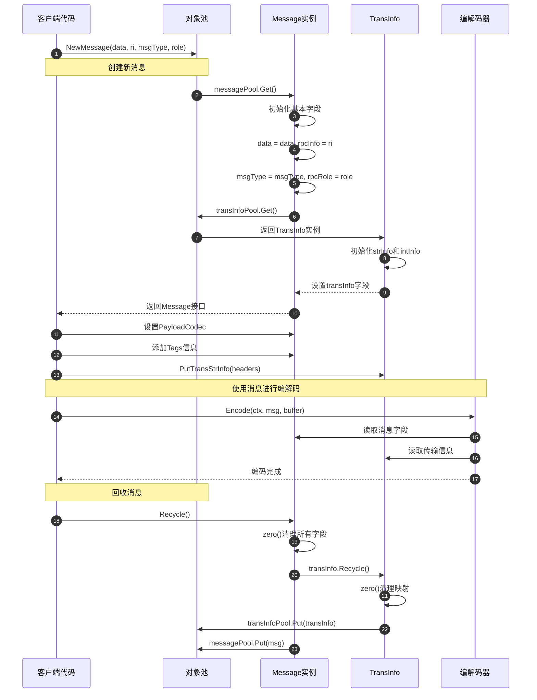

### 消息生命周期说明

**1. 创建阶段（步骤1-8）**

- 客户端调用NewMessage创建消息实例
- 从messagePool对象池获取message实例
- 初始化消息的基本字段（数据、RPC信息、类型、角色）
- 从transInfoPool获取TransInfo实例并关联

**2. 配置阶段（步骤9-12）**

- 设置负载编解码器
- 添加用户自定义标签
- 设置传输层元信息（如HTTP头）

**3. 使用阶段（步骤13-16）**

- 编解码器读取消息字段进行序列化
- 传输信息用于协议头构建
- 完成网络传输

**4. 回收阶段（步骤17-22）**

- 调用Recycle方法回收消息
- zero方法清理所有字段防止内存泄漏
- 递归回收TransInfo实例
- 将对象放回对象池供下次使用

## 2. 客户端消息发送时序图

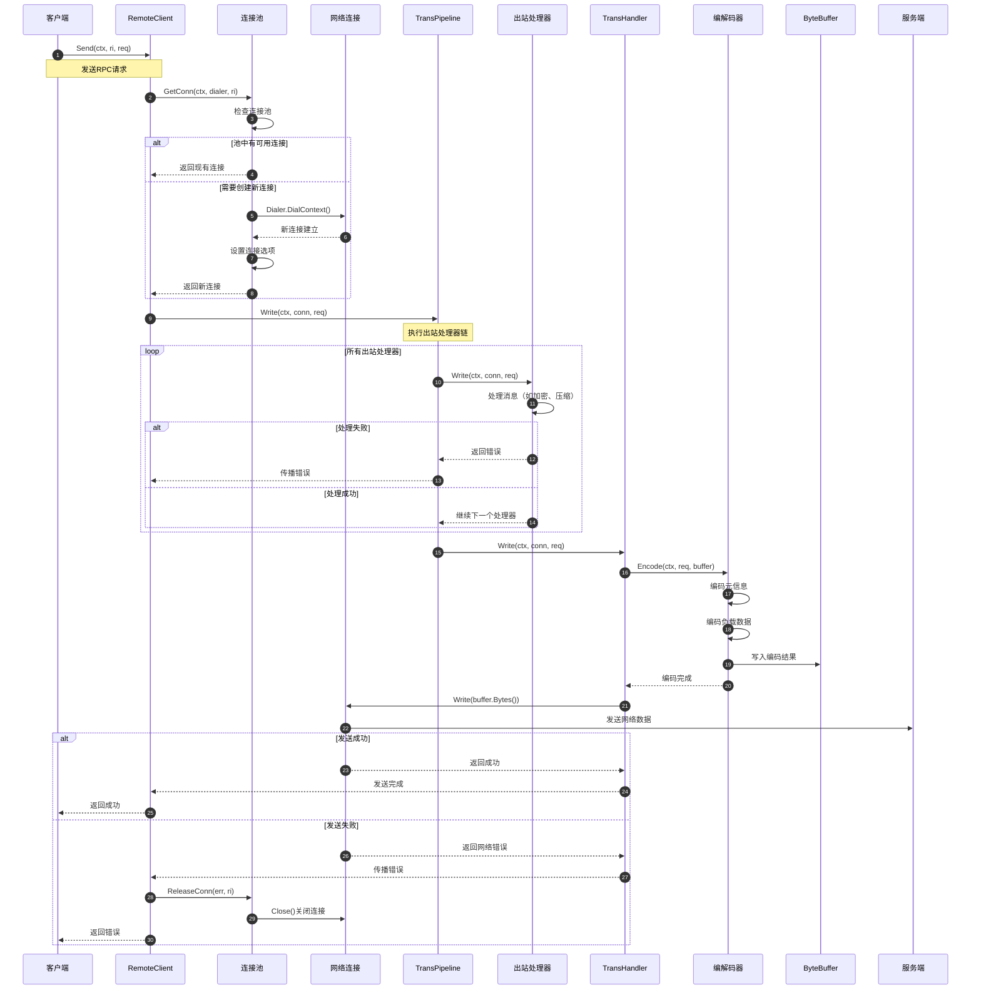

### 发送流程说明

**1. 连接获取阶段（步骤1-8）**

- 客户端发起发送请求
- 从连接池获取到目标服务的连接
- 优先使用池中现有连接，无可用连接时创建新连接
- 设置连接的超时和缓冲区参数

**2. 管道处理阶段（步骤9-18）**

- 进入传输管道的出站处理流程
- 依次执行所有出站处理器（如加密、压缩、监控）
- 任何处理器失败都会中断管道执行
- 最后由TransHandler执行实际的网络写入

**3. 编码发送阶段（步骤19-27）**

- TransHandler调用编解码器编码消息
- 编码器分别处理元信息和负载数据
- 将编码结果写入网络连接
- 数据通过网络发送到服务端

**4. 结果处理阶段（步骤28-35）**

- 根据发送结果决定连接的处理方式
- 发送成功时保持连接供后续复用
- 发送失败时关闭连接并从池中移除
- 向客户端返回最终的发送结果

## 3. 服务端消息接收时序图

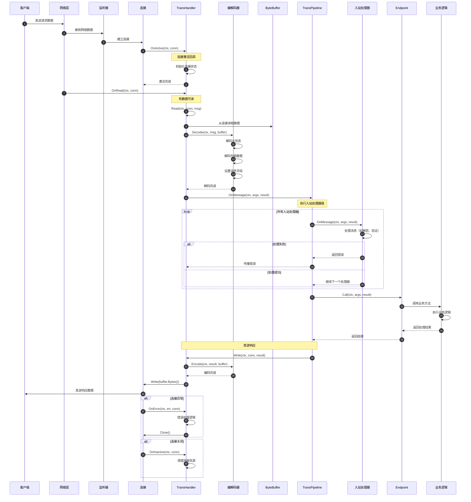

### 接收处理说明

**1. 连接建立阶段（步骤1-6）**

- 客户端发送请求到服务端
- 网络监听器接收连接请求
- TransHandler的OnActive回调处理连接激活
- 初始化连接相关的状态和资源

**2. 数据读取阶段（步骤7-13）**

- OnRead回调通知有数据可读
- TransHandler从连接读取原始数据
- 调用编解码器解码消息
- 设置Message对象的各个字段

**3. 管道处理阶段（步骤14-24）**

- 进入传输管道的入站处理流程
- 依次执行所有入站处理器（如解密、验证、日志）
- 处理器可以修改消息内容或中断处理
- 最终调用业务Endpoint处理请求

**4. 业务处理阶段（步骤25-29）**

- Endpoint调用具体的业务方法
- 执行业务逻辑并生成响应结果
- 将结果封装到响应Message中

**5. 响应发送阶段（步骤30-35）**

- 通过相同的管道发送响应消息
- 编码响应并写入网络连接
- 将响应数据发送回客户端

**6. 异常处理阶段（步骤36-42）**

- OnError处理各种网络和协议错误
- OnInactive处理连接关闭事件
- 正确清理连接相关的资源

## 4. 传输管道处理时序图

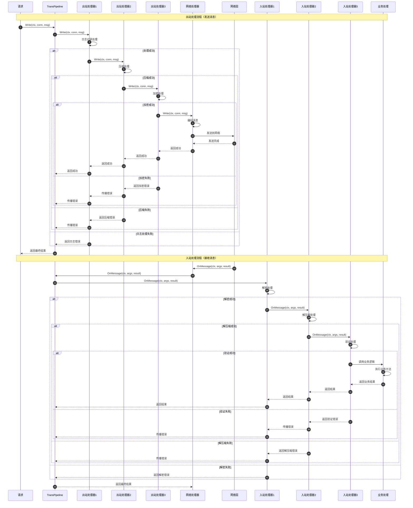

### 管道处理说明

**1. 出站处理流程（步骤1-23）**

- 请求进入传输管道进行出站处理
- 按顺序执行出站处理器：日志→压缩→加密
- 每个处理器都可能失败并中断后续处理
- 最终由网络处理器完成实际的网络发送
- 错误会逐层向上传播到管道调用方

**2. 入站处理流程（步骤24-47）**

- 网络数据进入管道进行入站处理
- 按顺序执行入站处理器：解密→解压缩→验证
- 处理顺序与出站相反，实现对称处理
- 最终调用业务逻辑处理请求
- 业务结果逐层返回到网络层

**3. 错误处理机制**

- 任何处理器失败都会中断管道执行
- 错误信息包含失败的具体原因和位置
- 支持错误恢复和降级处理策略
- 错误统计和监控便于问题排查

## 5. 连接池管理时序图

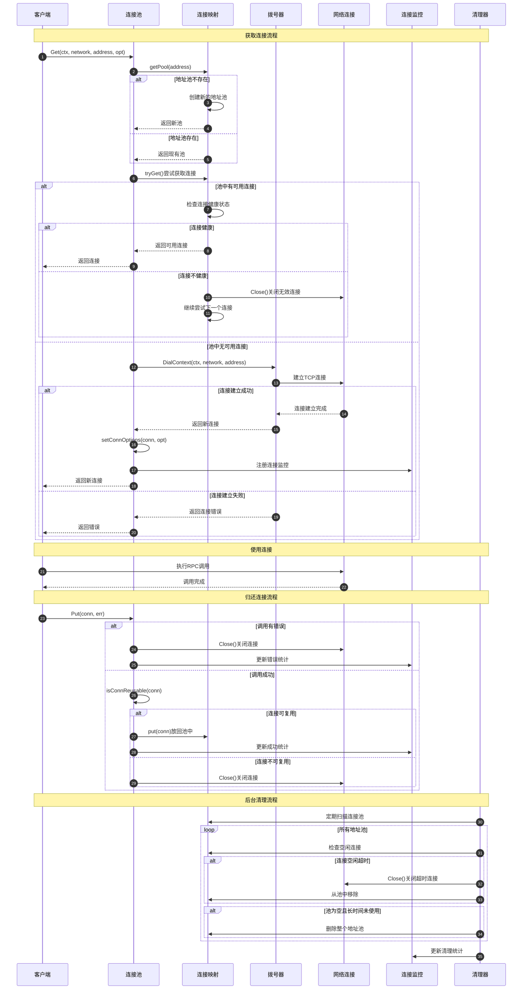

### 连接池管理说明

**1. 连接获取流程（步骤1-21）**

- 客户端请求获取到指定地址的连接
- 根据地址获取对应的连接池，不存在则创建
- 优先从池中获取可用连接，检查连接健康状态
- 池中无可用连接时通过Dialer创建新连接
- 设置连接参数并注册监控

**2. 连接使用阶段（步骤22-24）**

- 客户端使用连接执行RPC调用
- 连接承载实际的网络通信
- 记录连接的使用统计信息

**3. 连接归还流程（步骤25-35）**

- 客户端归还连接到连接池
- 根据调用结果决定连接的处理方式
- 有错误时直接关闭连接
- 无错误时检查连接可复用性，决定是否放回池中

**4. 后台清理流程（步骤36-46）**

- 定期扫描所有连接池
- 清理空闲超时的连接
- 删除长时间未使用的地址池
- 更新清理统计信息

**5. 监控统计**

- 连接创建、复用、关闭的统计
- 连接池大小和使用率监控
- 错误率和性能指标统计
- 支持连接池健康状态报告

## 6. 编解码处理时序图

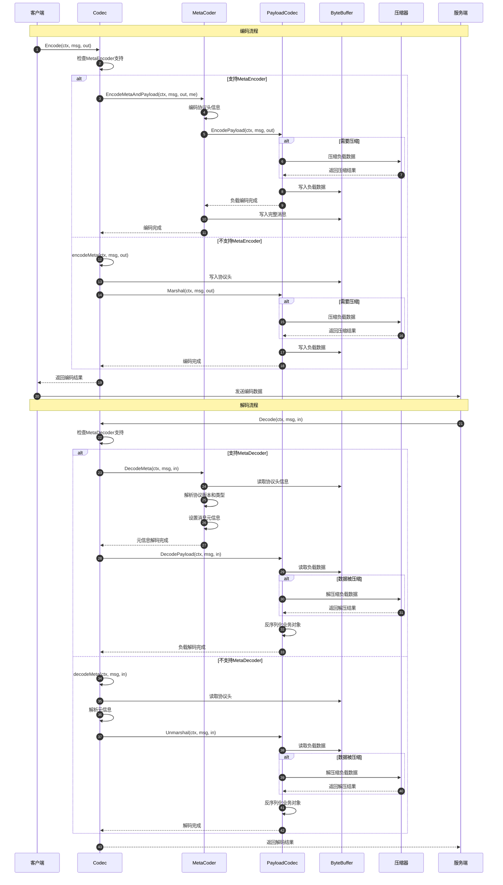

### 编解码处理说明

**1. 编码流程（步骤1-20）**

- 客户端调用Codec进行消息编码
- 检查是否支持MetaEncoder接口
- 支持时使用统一的EncodeMetaAndPayload方法
- 不支持时分别编码元信息和负载
- 根据配置决定是否压缩负载数据
- 将完整的编码结果写入ByteBuffer

**2. 解码流程（步骤21-40）**

- 服务端调用Codec进行消息解码
- 检查是否支持MetaDecoder接口
- 首先解码协议头和元信息
- 然后解码负载数据
- 根据协议头信息决定是否解压缩
- 反序列化得到最终的业务对象

**3. 压缩处理**

- 编码时根据配置和数据大小决定是否压缩
- 支持多种压缩算法（Gzip、Snappy等）
- 解码时根据协议头标识进行相应解压缩
- 压缩可以显著减少网络传输数据量

**4. 协议适配**

- 支持不同协议的元信息格式
- 兼容协议版本升级和降级
- 处理协议特定的编解码逻辑
- 提供协议无关的统一接口

## 时序图总结

这些时序图展示了Remote模块的完整工作流程：

1. **消息生命周期**：从创建到回收的完整过程，展示了对象池的优化机制
2. **客户端发送**：从连接获取到数据发送的完整链路，包含管道处理
3. **服务端接收**：从数据接收到业务处理的完整流程，包含异常处理
4. **传输管道**：出站和入站处理器的执行顺序和错误传播机制
5. **连接池管理**：连接的获取、使用、归还和清理的完整生命周期
6. **编解码处理**：消息序列化和反序列化的详细过程，包含压缩处理

每个时序图都包含了详细的步骤说明和关键节点分析，帮助开发者理解Remote模块的内部工作机制、扩展点和性能优化策略。

---
