# Kitex-04-Generic

## 模块概览

## 模块职责与边界

### 核心职责
Generic模块是Kitex框架的泛型调用核心，负责处理无需IDL生成代码的动态RPC调用。主要职责包括：

- **泛型调用支持**：支持无IDL代码生成的动态RPC调用
- **多协议适配**：支持Thrift、Protobuf、JSON等多种序列化协议
- **动态编解码**：基于运行时信息进行消息编解码
- **HTTP映射**：支持HTTP请求到RPC调用的映射转换
- **流式调用**：支持客户端流、服务端流和双向流的泛型调用
- **服务发现**：支持动态服务名和方法名的解析

### 输入输出
- **输入**：泛型请求数据（JSON、二进制、Map等）、方法名、服务名
- **输出**：泛型响应数据、流式数据、错误信息
- **上游依赖**：Client和Server模块的泛型调用请求
- **下游依赖**：Remote模块的编解码器、IDL解析器

### 生命周期
1. **初始化阶段**：创建Generic实例，加载IDL信息或协议描述
2. **服务注册**：注册泛型服务处理器
3. **请求处理**：动态解析请求，执行业务逻辑
4. **响应编码**：将响应结果编码为目标格式
5. **资源清理**：清理IDL缓存和编解码器资源

## 模块架构图

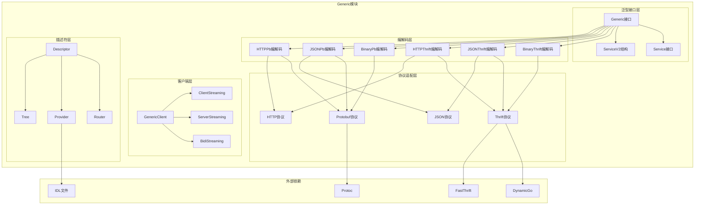

### 架构说明

**1. 分层设计**

- **泛型接口层**：定义泛型调用的核心接口和服务抽象
- **客户端层**：提供泛型客户端和流式调用支持
- **编解码层**：支持多种协议和格式的编解码实现
- **描述符层**：管理IDL描述信息和路由规则
- **协议适配层**：适配不同的序列化协议

**2. 组件交互**

- Generic接口定义泛型调用的核心能力
- 编解码层根据协议类型选择具体实现
- 描述符层提供IDL信息和路由支持
- 协议适配层处理具体的序列化逻辑

**3. 扩展机制**

- 支持自定义Generic实现
- 可插拔的编解码器
- 灵活的描述符提供器
- 支持新协议的扩展

## 核心算法与流程

### 泛型调用核心流程

```go
// 泛型客户端调用流程
func (gc *genericServiceClient) GenericCall(ctx context.Context, method string, request interface{}, callOptions ...callopt.Option) (response interface{}, err error) {
    // 1. 设置调用选项
    ctx = client.NewCtxWithCallOptions(ctx, callOptions)
    
    // 2. 处理二进制泛型特殊逻辑
    if gc.isBinaryGeneric {
        ctx = igeneric.WithGenericStreamingMode(ctx, serviceinfo.StreamingNone)
    }
    
    // 3. 动态获取方法名（HTTP泛型）
    if gc.getMethodFunc != nil {
        method, _ = gc.getMethodFunc(request)
    }
    
    // 4. 构建泛型参数和结果
    var _args *generic.Args
    var _result *generic.Result
    mtInfo := gc.svcInfo.MethodInfo(ctx, method)
    if mtInfo != nil {
        _args = mtInfo.NewArgs().(*generic.Args)
        _args.Method = method
        _args.Request = request
        _result = mtInfo.NewResult().(*generic.Result)
    } else {
        _args = &generic.Args{}
        _result = &generic.Result{}
    }
    
    // 5. 执行RPC调用
    if err = gc.kClient.Call(ctx, method, _args, _result); err != nil {
        return
    }
    
    // 6. 返回结果
    return _result.GetSuccess(), nil
}
```

**调用流程说明**：

1. **选项处理**：设置调用级别的配置选项
2. **协议适配**：根据泛型类型设置特定的协议参数
3. **方法解析**：动态解析方法名，支持HTTP路由映射
4. **参数构建**：构建泛型参数和结果容器
5. **RPC执行**：通过底层客户端执行实际的RPC调用
6. **结果提取**：从泛型结果中提取业务数据

### 泛型服务处理流程

```go
func callHandler(ctx context.Context, handler, arg, result interface{}) error {
    realArg := arg.(*Args)
    realResult := result.(*Result)
    
    switch svc := handler.(type) {
    case *ServiceV2:
        // 1. 获取RPC信息
        ri := rpcinfo.GetRPCInfo(ctx)
        methodName := ri.Invocation().MethodName()
        serviceName := ri.Invocation().ServiceName()
        
        // 2. 检查处理器是否实现
        if svc.GenericCall == nil {
            return errGenericCallNotImplemented
        }
        
        // 3. 调用业务处理器
        success, err := svc.GenericCall(ctx, serviceName, methodName, realArg.Request)
        if err != nil {
            return err
        }
        
        // 4. 设置结果
        realResult.Success = success
        return nil
        
    case Service:
        // 兼容旧版本Service接口
        success, err := handler.(Service).GenericCall(ctx, realArg.Method, realArg.Request)
        if err != nil {
            return err
        }
        realResult.Success = success
        return nil
        
    default:
        return fmt.Errorf("CallHandler: unknown handler type %T", handler)
    }
}
```

**服务处理说明**：

1. **参数提取**：从泛型参数中提取实际的请求数据
2. **信息获取**：从RPC上下文获取服务名和方法名
3. **处理器调用**：根据处理器类型调用相应的业务逻辑
4. **结果封装**：将业务结果封装到泛型结果中
5. **版本兼容**：支持Service和ServiceV2两种接口

### HTTP映射处理流程

```go
// HTTP请求到RPC调用的映射
func (h *HTTPThriftCodec) Decode(ctx context.Context, msg remote.Message, in remote.ByteBuffer) error {
    // 1. 解析HTTP请求
    req, err := h.parseHTTPRequest(in)
    if err != nil {
        return err
    }
    
    // 2. 路由匹配
    route, err := h.router.Match(req.Method, req.URL.Path)
    if err != nil {
        return err
    }
    
    // 3. 参数映射
    args, err := h.mapRequestToArgs(req, route)
    if err != nil {
        return err
    }
    
    // 4. 设置消息数据
    msg.SetData(args)
    return nil
}

// RPC响应到HTTP响应的映射
func (h *HTTPThriftCodec) Encode(ctx context.Context, msg remote.Message, out remote.ByteBuffer) error {
    // 1. 获取RPC结果
    result := msg.Data()
    
    // 2. 构建HTTP响应
    resp := h.buildHTTPResponse(result)
    
    // 3. 序列化响应
    data, err := h.serializeResponse(resp)
    if err != nil {
        return err
    }
    
    // 4. 写入缓冲区
    _, err = out.Write(data)
    return err
}
```

**HTTP映射说明**：

1. **请求解析**：解析HTTP请求的方法、路径、参数等
2. **路由匹配**：根据路由规则匹配到对应的RPC方法
3. **参数映射**：将HTTP参数映射为RPC调用参数
4. **响应构建**：将RPC结果构建为HTTP响应格式

### 动态编解码流程

```go
// JSON Thrift动态编解码
func (c *jsonThriftCodec) Marshal(ctx context.Context, msg remote.Message, out remote.ByteBuffer) error {
    // 1. 获取方法信息
    method := msg.RPCInfo().Invocation().MethodName()
    svcInfo := msg.RPCInfo().Invocation().ServiceInfo()
    
    // 2. 获取类型描述符
    descriptor, err := c.provider.Provide(svcInfo.ServiceName, method)
    if err != nil {
        return err
    }
    
    // 3. 动态序列化
    data := msg.Data()
    jsonData, err := c.dynamicMarshal(data, descriptor)
    if err != nil {
        return err
    }
    
    // 4. 写入缓冲区
    _, err = out.Write(jsonData)
    return err
}

func (c *jsonThriftCodec) Unmarshal(ctx context.Context, msg remote.Message, in remote.ByteBuffer) error {
    // 1. 读取JSON数据
    jsonData, err := ioutil.ReadAll(in)
    if err != nil {
        return err
    }
    
    // 2. 获取类型描述符
    method := msg.RPCInfo().Invocation().MethodName()
    svcInfo := msg.RPCInfo().Invocation().ServiceInfo()
    descriptor, err := c.provider.Provide(svcInfo.ServiceName, method)
    if err != nil {
        return err
    }
    
    // 3. 动态反序列化
    data, err := c.dynamicUnmarshal(jsonData, descriptor)
    if err != nil {
        return err
    }
    
    // 4. 设置消息数据
    msg.SetData(data)
    return nil
}
```

**动态编解码说明**：

1. **描述符获取**：根据服务名和方法名获取类型描述符
2. **动态序列化**：使用描述符信息进行运行时序列化
3. **格式转换**：在不同格式间进行数据转换
4. **错误处理**：处理序列化过程中的各种异常

## 性能优化要点

### 1. 描述符缓存优化
- **IDL缓存**：缓存解析后的IDL描述信息
- **类型缓存**：缓存类型描述符，避免重复解析
- **路由缓存**：缓存HTTP路由匹配结果
- **编解码器复用**：复用编解码器实例

### 2. 动态编解码优化
- **DynamicGo集成**：使用高性能的动态编解码库
- **零拷贝优化**：减少数据拷贝操作
- **内存池**：使用对象池管理临时对象
- **流式处理**：支持流式编解码，减少内存占用

### 3. HTTP映射优化
- **路由树优化**：使用高效的路由匹配算法
- **参数解析优化**：优化HTTP参数解析性能
- **响应缓存**：缓存常见的HTTP响应格式
- **连接复用**：支持HTTP连接复用

### 4. 流式调用优化
- **背压控制**：实现流式调用的背压机制
- **批量处理**：支持批量发送和接收
- **异步处理**：异步处理流式数据
- **资源管理**：及时清理流式资源

### 5. 协议适配优化
- **协议检测**：快速检测协议类型
- **编解码选择**：根据性能需求选择编解码器
- **格式转换**：优化不同格式间的转换
- **兼容性处理**：高效处理协议版本兼容

## 扩展点设计

### 1. 自定义Generic实现

```go
// 实现自定义的Generic接口
type CustomGeneric struct {
    // 自定义字段
}

func (g *CustomGeneric) PayloadCodecType() serviceinfo.PayloadCodec {
    // 返回自定义的编解码类型
}

func (g *CustomGeneric) GenericMethod() serviceinfo.GenericMethodFunc {
    // 返回自定义的泛型方法处理函数
}

func (g *CustomGeneric) IDLServiceName() string {
    // 返回服务名
}
```

### 2. 自定义编解码器

```go
// 实现自定义的泛型编解码器
type CustomCodec struct {
    // 自定义字段
}

func (c *CustomCodec) Marshal(ctx context.Context, msg remote.Message, out remote.ByteBuffer) error {
    // 自定义序列化逻辑
}

func (c *CustomCodec) Unmarshal(ctx context.Context, msg remote.Message, in remote.ByteBuffer) error {
    // 自定义反序列化逻辑
}
```

### 3. 自定义描述符提供器

```go
// 实现自定义的描述符提供器
type CustomProvider struct {
    // 自定义字段
}

func (p *CustomProvider) Provide(serviceName, methodName string) (*descriptor.ServiceDescriptor, error) {
    // 提供自定义的服务描述符
}
```

### 4. 自定义路由器

```go
// 实现自定义的HTTP路由器
type CustomRouter struct {
    // 自定义字段
}

func (r *CustomRouter) Match(method, path string) (*Route, error) {
    // 自定义路由匹配逻辑
}
```

## 典型使用场景

### 1. API网关场景
- **协议转换**：HTTP到RPC的协议转换
- **动态路由**：基于HTTP路径的动态服务路由
- **格式转换**：JSON到Thrift/Protobuf的格式转换
- **参数映射**：HTTP参数到RPC参数的映射

### 2. 服务测试场景
- **接口测试**：无需生成代码的接口测试
- **数据模拟**：动态构造测试数据
- **协议验证**：验证不同协议的兼容性
- **性能测试**：泛型调用的性能测试

### 3. 服务代理场景
- **透明代理**：透明转发RPC请求
- **协议适配**：适配不同版本的协议
- **数据转换**：转换数据格式和结构
- **流量控制**：基于泛型调用的流量控制

### 4. 动态服务场景
- **配置驱动**：基于配置的动态服务调用
- **插件系统**：支持插件化的服务扩展
- **多租户**：支持多租户的动态服务
- **A/B测试**：支持A/B测试的动态切换

这个概览文档详细介绍了Generic模块的架构设计、核心流程和典型应用场景。Generic模块作为Kitex的泛型调用核心，提供了强大的动态RPC调用能力，支持多种协议和格式，是构建灵活RPC系统的重要组件。

---

## API接口

## API概览

Generic模块提供了泛型调用的核心API，主要包括：

- **Generic接口**：泛型调用的核心抽象接口
- **Service接口**：泛型服务处理接口
- **Client接口**：泛型客户端调用接口
- **工厂函数**：各种泛型实现的创建函数
- **配置函数**：泛型行为的配置函数

## 1. Generic核心接口

### 基本信息
- 名称：`Generic`
- 协议/方法：接口定义
- 幂等性：是（配置类接口）

### 接口定义

```go
// Generic是泛型调用的核心抽象接口
type Generic interface {
    Closer                                              // 资源清理接口
    PayloadCodecType() serviceinfo.PayloadCodec        // 获取编解码类型
    GenericMethod() serviceinfo.GenericMethodFunc      // 获取泛型方法处理函数
    IDLServiceName() string                            // 获取IDL服务名
    GetExtra(key string) interface{}                   // 获取扩展信息
}

// Closer资源清理接口
type Closer interface {
    Close() error
}
```

| 方法 | 返回类型 | 必填 | 约束 | 说明 |
|------|----------|------|------|------|
| PayloadCodecType | serviceinfo.PayloadCodec | 是 | 枚举值 | 返回支持的编解码类型：Thrift/Protobuf/JSON |
| GenericMethod | serviceinfo.GenericMethodFunc | 是 | 非空函数 | 返回泛型方法处理函数，用于处理泛型调用 |
| IDLServiceName | string | 是 | 非空字符串 | 返回IDL定义的服务名称 |
| GetExtra | interface{} | 否 | - | 根据键获取扩展配置信息 |
| Close | error | 是 | - | 清理Generic实例占用的资源 |

### 工厂函数与关键代码

#### BinaryThriftGenericV2创建

```go
// BinaryThriftGenericV2创建原始Thrift二进制泛型实例
func BinaryThriftGenericV2(serviceName string) Generic {
    return &binaryThriftGenericV2{
        codec: newBinaryThriftCodecV2(serviceName),
    }
}

// 使用示例
g := generic.BinaryThriftGenericV2("EchoService")
cli, err := genericclient.NewClient("destService", g, cliOpts...)
```

#### JSONThriftGeneric创建

```go
// JSONThriftGeneric创建JSON到Thrift的泛型实例
func JSONThriftGeneric(p DescriptorProvider, opts ...Option) (Generic, error) {
    gOpts := &Options{dynamicgoConvOpts: DefaultJSONDynamicGoConvOpts}
    gOpts.apply(opts)
    return &jsonThriftGeneric{codec: newJsonThriftCodec(p, gOpts)}, nil
}

// 使用示例
p, err := generic.NewThriftFileProvider("path/to/idl.thrift")
g, err := generic.JSONThriftGeneric(p)
cli, err := genericclient.NewClient("destService", g, cliOpts...)
```

#### HTTPThriftGeneric创建

```go
// HTTPThriftGeneric创建HTTP到Thrift的泛型实例
func HTTPThriftGeneric(p DescriptorProvider, opts ...Option) (Generic, error) {
    gOpts := &Options{dynamicgoConvOpts: DefaultHTTPDynamicGoConvOpts}
    gOpts.apply(opts)
    return &httpThriftGeneric{codec: newHTTPThriftCodec(p, gOpts)}, nil
}

// 使用示例
p, err := generic.NewThriftFileProvider("path/to/idl.thrift")
g, err := generic.HTTPThriftGeneric(p)
cli, err := genericclient.NewClient("destService", g, cliOpts...)
```

### 时序图（Generic创建→使用→清理）

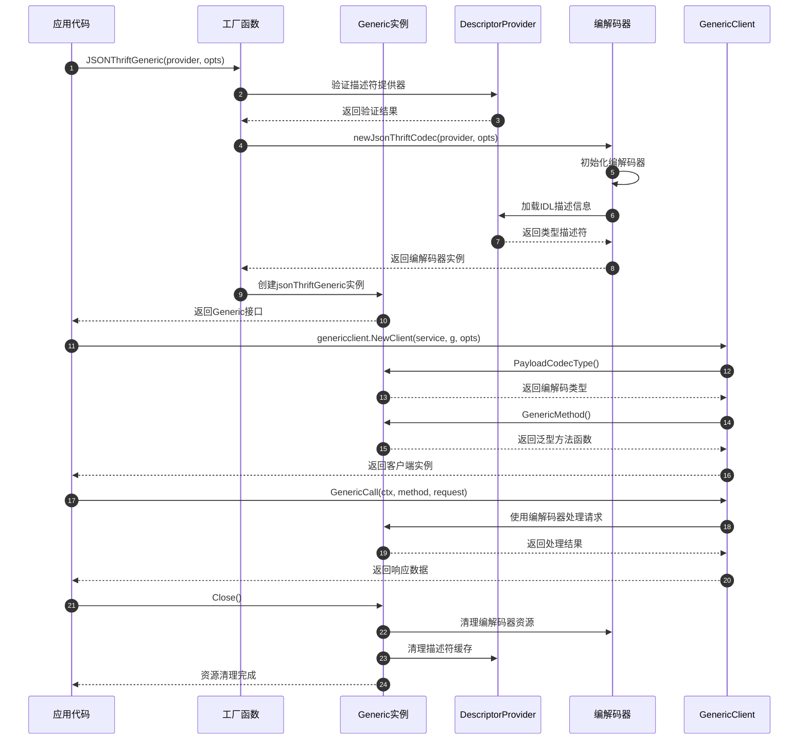

### 异常/回退与性能要点
- **IDL加载失败**：提供清晰的错误信息，支持重试机制
- **编解码错误**：区分协议错误和数据错误，提供详细错误上下文
- **资源管理**：确保Close方法正确清理所有资源，防止内存泄漏
- **性能优化**：缓存IDL解析结果，复用编解码器实例
- **并发安全**：Generic实例支持并发使用，内部状态不可变

## 2. Service服务接口

### 基本信息
- 名称：`Service`和`ServiceV2`
- 协议/方法：接口定义和结构体
- 幂等性：否（业务逻辑相关）

### 接口定义

```go
// Service是v1版本的泛型服务接口
type Service interface {
    GenericCall(ctx context.Context, method string, request interface{}) (response interface{}, err error)
}

// ServiceV2是v2版本的泛型服务接口，支持流式调用和多服务
type ServiceV2 struct {
    // GenericCall处理一元请求
    GenericCall func(ctx context.Context, service, method string, request interface{}) (response interface{}, err error)
    
    // ClientStreaming处理客户端流式调用
    ClientStreaming func(ctx context.Context, service, method string, stream ClientStreamingServer) (err error)
    
    // ServerStreaming处理服务端流式调用
    ServerStreaming func(ctx context.Context, service, method string, request interface{}, stream ServerStreamingServer) (err error)
    
    // BidiStreaming处理双向流式调用
    BidiStreaming func(ctx context.Context, service, method string, stream BidiStreamingServer) (err error)
}
```

| 方法 | 参数类型 | 必填 | 约束 | 说明 |
|------|----------|------|------|------|
| GenericCall | (context.Context, string, interface{}) | 是 | method非空 | 处理一元泛型调用 |
| GenericCall(V2) | (context.Context, string, string, interface{}) | 否 | service和method非空 | V2版本支持多服务 |
| ClientStreaming | (context.Context, string, string, ClientStreamingServer) | 否 | - | 处理客户端流式调用 |
| ServerStreaming | (context.Context, string, string, interface{}, ServerStreamingServer) | 否 | - | 处理服务端流式调用 |
| BidiStreaming | (context.Context, string, string, BidiStreamingServer) | 否 | - | 处理双向流式调用 |

### 入口函数与关键代码

```go
// 服务处理器调用入口
func callHandler(ctx context.Context, handler, arg, result interface{}) error {
    realArg := arg.(*Args)
    realResult := result.(*Result)
    
    switch svc := handler.(type) {
    case *ServiceV2:
        // 1. 获取RPC调用信息
        ri := rpcinfo.GetRPCInfo(ctx)
        methodName := ri.Invocation().MethodName()
        serviceName := ri.Invocation().ServiceName()
        
        // 2. 检查处理器是否实现
        if svc.GenericCall == nil {
            return errGenericCallNotImplemented
        }
        
        // 3. 调用业务处理器
        success, err := svc.GenericCall(ctx, serviceName, methodName, realArg.Request)
        if err != nil {
            return err
        }
        
        // 4. 设置响应结果
        realResult.Success = success
        return nil
        
    case Service:
        // 兼容v1版本的Service接口
        success, err := handler.(Service).GenericCall(ctx, realArg.Method, realArg.Request)
        if err != nil {
            return err
        }
        realResult.Success = success
        return nil
        
    default:
        return fmt.Errorf("CallHandler: unknown handler type %T", handler)
    }
}
```

### 服务实现示例

```go
// 实现Service接口
type GenericServiceImpl struct{}

func (g *GenericServiceImpl) GenericCall(ctx context.Context, method string, request interface{}) (response interface{}, err error) {
    switch method {
    case "Echo":
        // 处理Echo方法
        return request, nil
    case "Add":
        // 处理Add方法
        req := request.(map[string]interface{})
        a := req["a"].(float64)
        b := req["b"].(float64)
        return map[string]interface{}{"result": a + b}, nil
    default:
        return nil, fmt.Errorf("unknown method: %s", method)
    }
}

// 实现ServiceV2接口
serviceV2 := &generic.ServiceV2{
    GenericCall: func(ctx context.Context, service, method string, request interface{}) (response interface{}, err error) {
        // 支持多服务的泛型调用处理
        switch service {
        case "EchoService":
            return handleEchoService(method, request)
        case "CalcService":
            return handleCalcService(method, request)
        default:
            return nil, fmt.Errorf("unknown service: %s", service)
        }
    },
}
```

### 时序图（服务请求处理）

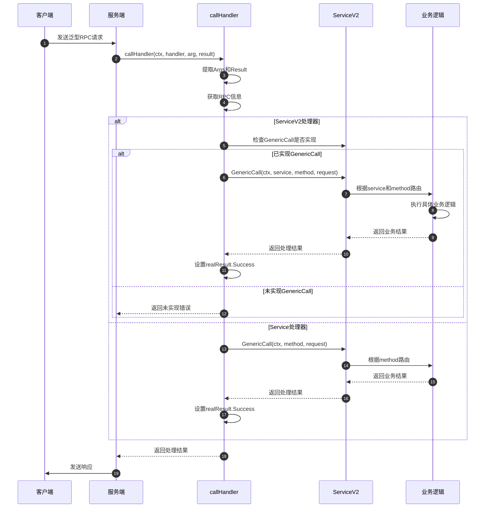

### 异常/回退与性能要点
- **方法路由**：支持高效的方法名到处理函数的路由
- **错误处理**：提供清晰的错误信息和错误码
- **流式处理**：正确管理流式调用的生命周期
- **并发处理**：支持并发处理多个请求
- **资源管理**：及时清理请求相关的资源

## 3. Client客户端接口

### 基本信息
- 名称：`Client`
- 协议/方法：接口定义
- 幂等性：否（网络调用）

### 接口定义

```go
// Client泛型客户端接口
type Client interface {
    generic.Closer
    
    // GenericCall泛型调用
    GenericCall(ctx context.Context, method string, request interface{}, callOptions ...callopt.Option) (response interface{}, err error)
    
    // ClientStreaming创建客户端流式调用
    ClientStreaming(ctx context.Context, method string, callOptions ...streamcall.Option) (ClientStreamingClient, error)
    
    // ServerStreaming创建服务端流式调用
    ServerStreaming(ctx context.Context, method string, req interface{}, callOptions ...streamcall.Option) (ServerStreamingClient, error)
    
    // BidirectionalStreaming创建双向流式调用
    BidirectionalStreaming(ctx context.Context, method string, callOptions ...streamcall.Option) (BidiStreamingClient, error)
}
```

| 方法 | 参数类型 | 必填 | 约束 | 说明 |
|------|----------|------|------|------|
| GenericCall | (context.Context, string, interface{}, ...callopt.Option) | 是 | method非空 | 执行一元泛型调用 |
| ClientStreaming | (context.Context, string, ...streamcall.Option) | 否 | method非空 | 创建客户端流式调用 |
| ServerStreaming | (context.Context, string, interface{}, ...streamcall.Option) | 否 | method非空 | 创建服务端流式调用 |
| BidirectionalStreaming | (context.Context, string, ...streamcall.Option) | 否 | method非空 | 创建双向流式调用 |

### 入口函数与关键代码

```go
// 创建泛型客户端
func NewClient(destService string, g generic.Generic, opts ...client.Option) (Client, error) {
    // 1. 从Generic创建ServiceInfo
    svcInfo := generic.ServiceInfoWithGeneric(g)
    return NewClientWithServiceInfo(destService, g, svcInfo, opts...)
}

func NewClientWithServiceInfo(destService string, g generic.Generic, svcInfo *serviceinfo.ServiceInfo, opts ...client.Option) (Client, error) {
    // 1. 准备客户端选项
    var options []client.Option
    options = append(options, client.WithGeneric(g))
    options = append(options, client.WithDestService(destService))
    options = append(options, client.WithTransportProtocol(transport.TTHeaderStreaming))
    options = append(options, opts...)
    
    // 2. 创建底层客户端
    kc, err := client.NewClient(svcInfo, options...)
    if err != nil {
        return nil, err
    }
    
    // 3. 创建泛型客户端包装器
    cli := &genericServiceClient{
        svcInfo: svcInfo,
        kClient: kc,
        sClient: kc.(client.Streaming),
        g:       g,
    }
    
    // 4. 设置泛型特定配置
    cli.isBinaryGeneric, _ = g.GetExtra(igeneric.IsBinaryGeneric).(bool)
    cli.getMethodFunc, _ = g.GetExtra(igeneric.GetMethodNameByRequestFuncKey).(generic.GetMethodNameByRequestFunc)
    
    // 5. 设置资源清理
    runtime.SetFinalizer(cli, (*genericServiceClient).Close)
    return cli, nil
}
```

### 泛型调用实现

```go
func (gc *genericServiceClient) GenericCall(ctx context.Context, method string, request interface{}, callOptions ...callopt.Option) (response interface{}, err error) {
    // 1. 设置调用选项
    ctx = client.NewCtxWithCallOptions(ctx, callOptions)
    
    // 2. 处理二进制泛型特殊逻辑
    if gc.isBinaryGeneric {
        ctx = igeneric.WithGenericStreamingMode(ctx, serviceinfo.StreamingNone)
    }
    
    // 3. 动态获取方法名（HTTP泛型）
    if gc.getMethodFunc != nil {
        method, _ = gc.getMethodFunc(request)
    }
    
    // 4. 构建泛型参数和结果
    var _args *generic.Args
    var _result *generic.Result
    mtInfo := gc.svcInfo.MethodInfo(ctx, method)
    if mtInfo != nil {
        _args = mtInfo.NewArgs().(*generic.Args)
        _args.Method = method
        _args.Request = request
        _result = mtInfo.NewResult().(*generic.Result)
    } else {
        _args = &generic.Args{}
        _result = &generic.Result{}
    }
    
    // 5. 执行RPC调用
    if err = gc.kClient.Call(ctx, method, _args, _result); err != nil {
        return
    }
    
    // 6. 返回结果
    return _result.GetSuccess(), nil
}
```

### 时序图（客户端调用）

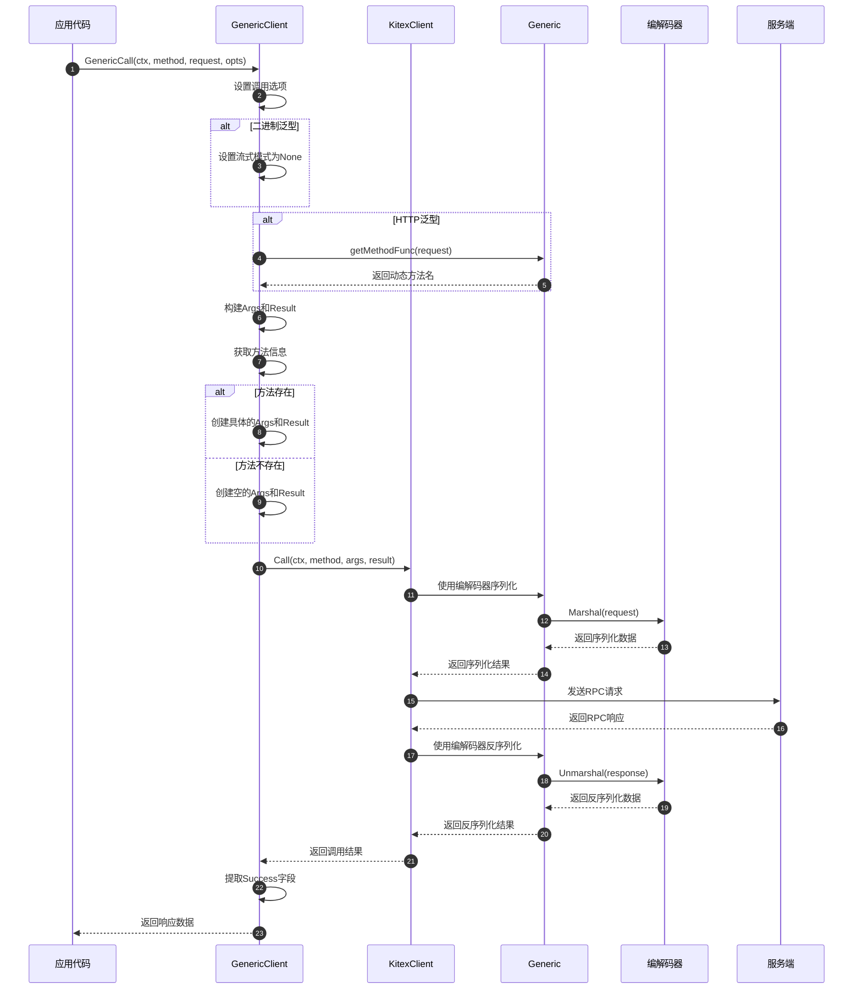

### 异常/回退与性能要点
- **连接管理**：复用底层客户端的连接池
- **超时控制**：支持调用级别的超时设置
- **重试机制**：支持调用失败的重试
- **负载均衡**：支持多种负载均衡策略
- **监控统计**：集成调用统计和监控

## 4. 工厂函数API

### 基本信息
- 名称：各种Generic创建函数
- 协议/方法：函数调用
- 幂等性：是（相同参数产生相同结果）

### 主要工厂函数

#### BinaryThriftGenericV2

```go
func BinaryThriftGenericV2(serviceName string) Generic
```

- **用途**：创建原始Thrift二进制泛型实例
- **参数**：serviceName - 服务名称
- **返回**：Generic接口实例
- **适用场景**：需要处理原始Thrift二进制数据

#### JSONThriftGeneric

```go
func JSONThriftGeneric(p DescriptorProvider, opts ...Option) (Generic, error)
```

- **用途**：创建JSON到Thrift的泛型实例
- **参数**：p - IDL描述符提供器，opts - 可选配置
- **返回**：Generic接口实例和错误
- **适用场景**：JSON格式的RPC调用

#### HTTPThriftGeneric

```go
func HTTPThriftGeneric(p DescriptorProvider, opts ...Option) (Generic, error)
```

- **用途**：创建HTTP到Thrift的泛型实例
- **参数**：p - IDL描述符提供器，opts - 可选配置
- **返回**：Generic接口实例和错误
- **适用场景**：HTTP请求到RPC调用的转换

#### MapThriftGeneric

```go
func MapThriftGeneric(p DescriptorProvider) (Generic, error)
```

- **用途**：创建Map到Thrift的泛型实例
- **参数**：p - IDL描述符提供器
- **返回**：Generic接口实例和错误
- **适用场景**：使用map[string]interface{}格式的调用

#### JSONPbGeneric

```go
func JSONPbGeneric(p PbDescriptorProviderDynamicGo, opts ...Option) (Generic, error)
```

- **用途**：创建JSON到Protobuf的泛型实例
- **参数**：p - Protobuf描述符提供器，opts - 可选配置
- **返回**：Generic接口实例和错误
- **适用场景**：JSON格式的Protobuf RPC调用

### 参数映射表

| 函数 | 参数 | 类型 | 必填 | 约束 | 说明 |
|------|------|------|------|------|------|
| BinaryThriftGenericV2 | serviceName | string | 是 | 非空 | 目标服务名称 |
| JSONThriftGeneric | p | DescriptorProvider | 是 | 非空 | IDL描述符提供器 |
| JSONThriftGeneric | opts | ...Option | 否 | - | 可选配置项 |
| HTTPThriftGeneric | p | DescriptorProvider | 是 | 非空 | IDL描述符提供器 |
| HTTPThriftGeneric | opts | ...Option | 否 | - | 可选配置项 |
| MapThriftGeneric | p | DescriptorProvider | 是 | 非空 | IDL描述符提供器 |
| JSONPbGeneric | p | PbDescriptorProviderDynamicGo | 是 | 非空 | Protobuf描述符提供器 |
| JSONPbGeneric | opts | ...Option | 否 | - | 可选配置项 |

## 5. 配置函数API

### 基本信息
- 名称：Generic配置函数
- 协议/方法：函数调用
- 幂等性：否（修改Generic状态）

### 主要配置函数

#### SetBinaryWithBase64

```go
func SetBinaryWithBase64(g Generic, enable bool) error
```

- **用途**：启用/禁用二进制字段的Base64编码
- **参数**：g - Generic实例，enable - 是否启用
- **返回**：错误信息
- **适用类型**：HTTPThriftGeneric、JSONThriftGeneric、MapThriftGeneric

#### SetBinaryWithByteSlice

```go
func SetBinaryWithByteSlice(g Generic, enable bool) error
```

- **用途**：启用/禁用二进制字段返回[]byte类型
- **参数**：g - Generic实例，enable - 是否启用
- **返回**：错误信息
- **适用类型**：MapThriftGeneric

#### EnableSetFieldsForEmptyStruct

```go
func EnableSetFieldsForEmptyStruct(g Generic, mode SetFieldsForEmptyStructMode) error
```

- **用途**：设置空结构体的字段填充模式
- **参数**：g - Generic实例，mode - 填充模式
- **返回**：错误信息
- **模式**：NotSetFields、SetNonOptionalFields、SetAllFields

### 配置示例

```go
// 创建JSON Thrift泛型实例
p, err := generic.NewThriftFileProvider("path/to/idl.thrift")
g, err := generic.JSONThriftGeneric(p)

// 禁用Base64编码
err = generic.SetBinaryWithBase64(g, false)

// 创建Map Thrift泛型实例
g2, err := generic.MapThriftGeneric(p)

// 启用[]byte返回类型
err = generic.SetBinaryWithByteSlice(g2, true)

// 设置空结构体字段填充
err = generic.EnableSetFieldsForEmptyStruct(g2, generic.SetAllFields)
```

## API使用最佳实践

### 1. Generic选择实践

```go
// 根据使用场景选择合适的Generic类型

// API网关场景：HTTP到RPC转换
p, _ := generic.NewThriftFileProvider("api.thrift")
g, _ := generic.HTTPThriftGeneric(p)

// JSON API场景：JSON格式调用
g, _ := generic.JSONThriftGeneric(p)

// 原始二进制场景：高性能调用
g := generic.BinaryThriftGenericV2("EchoService")

// 灵活数据格式场景：Map格式
g, _ := generic.MapThriftGeneric(p)
```

### 2. 客户端使用实践

```go
// 创建泛型客户端
cli, err := genericclient.NewClient("destService", g,
    client.WithHostPorts("127.0.0.1:8888"),
    client.WithRPCTimeout(time.Second*3),
)
defer cli.Close()

// 执行泛型调用
resp, err := cli.GenericCall(ctx, "Echo", map[string]interface{}{
    "message": "hello world",
}, callopt.WithRPCTimeout(time.Second*5))
```

### 3. 服务端使用实践

```go
// 实现泛型服务
serviceV2 := &generic.ServiceV2{
    GenericCall: func(ctx context.Context, service, method string, request interface{}) (interface{}, error) {
        // 根据服务名和方法名路由到具体处理逻辑
        return handleRequest(service, method, request)
    },
}

// 创建泛型服务器
svr := genericserver.NewServerV2(serviceV2, g,
    server.WithServiceAddr(&net.TCPAddr{Port: 8888}),
)
```

### 4. 错误处理实践

```go
// 泛型调用错误处理
resp, err := cli.GenericCall(ctx, method, request)
if err != nil {
    // 区分不同类型的错误
    if kerrors.IsTimeoutError(err) {
        // 处理超时错误
    } else if kerrors.IsRemoteOrNetworkError(err) {
        // 处理网络错误
    } else {
        // 处理业务错误
    }
}
```

这个API文档详细介绍了Generic模块的核心接口、使用方法和最佳实践，为开发者提供了完整的API参考和使用指南。

---

## 数据结构

## 核心数据结构UML图

```mermaid
classDiagram
    class Generic {
        <<interface>>
        +PayloadCodecType() serviceinfo.PayloadCodec
        +GenericMethod() serviceinfo.GenericMethodFunc
        +IDLServiceName() string
        +GetExtra(key string) interface{}
        +Close() error
    }
    
    class Service {
        <<interface>>
        +GenericCall(ctx context.Context, method string, request interface{}) (response interface{}, error)
    }
    
    class ServiceV2 {
        +GenericCall func(ctx context.Context, service, method string, request interface{}) (response interface{}, error)
        +ClientStreaming func(ctx context.Context, service, method string, stream ClientStreamingServer) error
        +ServerStreaming func(ctx context.Context, service, method string, request interface{}, stream ServerStreamingServer) error
        +BidiStreaming func(ctx context.Context, service, method string, stream BidiStreamingServer) error
    }
    
    class Args {
        +Method string
        +Request interface{}
        +GetFirstArgument() interface{}
    }
    
    class Result {
        +Success interface{}
        +GetResult() interface{}
        +GetSuccess() interface{}
        +SetSuccess(x interface{})
    }
    
    class binaryThriftGenericV2 {
        -codec *binaryThriftCodecV2
        +PayloadCodecType() serviceinfo.PayloadCodec
        +GenericMethod() serviceinfo.GenericMethodFunc
        +IDLServiceName() string
        +GetExtra(key string) interface{}
        +Close() error
    }
    
    class jsonThriftGeneric {
        -codec *jsonThriftCodec
        +PayloadCodecType() serviceinfo.PayloadCodec
        +GenericMethod() serviceinfo.GenericMethodFunc
        +IDLServiceName() string
        +GetExtra(key string) interface{}
        +Close() error
    }
    
    class httpThriftGeneric {
        -codec *httpThriftCodec
        +PayloadCodecType() serviceinfo.PayloadCodec
        +GenericMethod() serviceinfo.GenericMethodFunc
        +IDLServiceName() string
        +GetExtra(key string) interface{}
        +Close() error
    }
    
    class DescriptorProvider {
        <<interface>>
        +Provide(serviceName, methodName string) (*descriptor.ServiceDescriptor, error)
    }
    
    class Method {
        +Oneway bool
        +StreamingMode serviceinfo.StreamingMode
    }
    
    class Options {
        +dynamicgoConvOpts conv.Options
        +apply(opts []Option)
    }
    
    Generic <|-- binaryThriftGenericV2
    Generic <|-- jsonThriftGeneric
    Generic <|-- httpThriftGeneric
    
    binaryThriftGenericV2 --> binaryThriftCodecV2
    jsonThriftGeneric --> jsonThriftCodec
    httpThriftGeneric --> httpThriftCodec
    
    jsonThriftGeneric --> DescriptorProvider
    httpThriftGeneric --> DescriptorProvider
    
    Args --> Method
    Result --> Method
    
    Options --> conv.Options
```

## 主要数据结构详解

### 1. Generic接口核心结构

```go
// Generic泛型调用的核心抽象接口
type Generic interface {
    Closer                                              // 资源清理接口
    PayloadCodecType() serviceinfo.PayloadCodec        // 编解码类型
    GenericMethod() serviceinfo.GenericMethodFunc      // 泛型方法函数
    IDLServiceName() string                            // IDL服务名
    GetExtra(key string) interface{}                   // 扩展信息
}

// Closer资源清理接口
type Closer interface {
    Close() error
}
```

**接口设计说明**：

- **PayloadCodecType**：返回支持的编解码类型，用于协议适配
- **GenericMethod**：返回泛型方法处理函数，用于处理具体的RPC调用
- **IDLServiceName**：返回IDL定义的服务名，用于服务路由
- **GetExtra**：获取扩展配置信息，支持灵活的配置扩展
- **Close**：清理资源，防止内存泄漏

### 2. Args请求参数结构

```go
// Args泛型调用的请求参数结构
type Args struct {
    Method  string      // 方法名
    Request interface{} // 请求数据
}

// GetFirstArgument获取第一个参数
func (p *Args) GetFirstArgument() interface{} {
    return p.Request
}
```

**字段映射与说明**：

| 字段 | 类型 | 必填 | 默认值 | 约束 | 说明 |
|------|------|------|--------|------|------|
| Method | string | 是 | "" | 非空 | RPC方法名，用于方法路由 |
| Request | interface{} | 否 | nil | - | 请求数据，可以是任意类型 |

**使用场景**：

- 封装泛型调用的请求参数
- 在编解码过程中传递方法信息
- 支持不同格式的请求数据

### 3. Result响应结果结构

```go
// Result泛型调用的响应结果结构
type Result struct {
    Success interface{} // 成功响应数据
}

// GetResult获取结果
func (p *Result) GetResult() interface{} {
    return p.Success
}

// GetSuccess获取成功结果
func (p *Result) GetSuccess() interface{} {
    return p.Success
}

// SetSuccess设置成功结果
func (p *Result) SetSuccess(x interface{}) {
    p.Success = x
}
```

**字段映射与说明**：

| 字段 | 类型 | 必填 | 默认值 | 约束 | 说明 |
|------|------|------|--------|------|------|
| Success | interface{} | 否 | nil | - | 成功响应数据，可以是任意类型 |

**核心方法**：

- **GetResult/GetSuccess**：获取响应结果
- **SetSuccess**：设置响应结果，用于服务端处理

### 4. 具体Generic实现结构

#### binaryThriftGenericV2结构

```go
type binaryThriftGenericV2 struct {
    codec *binaryThriftCodecV2 // 二进制Thrift编解码器
}

func (g *binaryThriftGenericV2) PayloadCodecType() serviceinfo.PayloadCodec {
    return serviceinfo.Thrift
}

func (g *binaryThriftGenericV2) GenericMethod() serviceinfo.GenericMethodFunc {
    return genericMethod
}

func (g *binaryThriftGenericV2) IDLServiceName() string {
    return g.codec.svcName
}

func (g *binaryThriftGenericV2) GetExtra(key string) interface{} {
    switch key {
    case igeneric.IsBinaryGeneric:
        return true
    default:
        return nil
    }
}
```

#### jsonThriftGeneric结构

```go
type jsonThriftGeneric struct {
    codec *jsonThriftCodec // JSON Thrift编解码器
}

func (g *jsonThriftGeneric) PayloadCodecType() serviceinfo.PayloadCodec {
    return serviceinfo.Thrift
}

func (g *jsonThriftGeneric) GenericMethod() serviceinfo.GenericMethodFunc {
    return genericMethod
}

func (g *jsonThriftGeneric) IDLServiceName() string {
    return g.codec.svcName
}
```

#### httpThriftGeneric结构

```go
type httpThriftGeneric struct {
    codec *httpThriftCodec // HTTP Thrift编解码器
}

func (g *httpThriftGeneric) PayloadCodecType() serviceinfo.PayloadCodec {
    return serviceinfo.Thrift
}

func (g *httpThriftGeneric) GetExtra(key string) interface{} {
    switch key {
    case igeneric.GetMethodNameByRequestFuncKey:
        return g.codec.getMethodName
    default:
        return nil
    }
}
```

### 5. Service服务接口结构

#### Service v1接口

```go
// Service v1版本的泛型服务接口
type Service interface {
    GenericCall(ctx context.Context, method string, request interface{}) (response interface{}, error)
}
```

#### ServiceV2结构

```go
// ServiceV2 v2版本的泛型服务接口，支持流式调用和多服务
type ServiceV2 struct {
    // GenericCall处理一元请求
    GenericCall func(ctx context.Context, service, method string, request interface{}) (response interface{}, error)
    
    // ClientStreaming处理客户端流式调用
    ClientStreaming func(ctx context.Context, service, method string, stream ClientStreamingServer) error
    
    // ServerStreaming处理服务端流式调用
    ServerStreaming func(ctx context.Context, service, method string, request interface{}, stream ServerStreamingServer) error
    
    // BidiStreaming处理双向流式调用
    BidiStreaming func(ctx context.Context, service, method string, stream BidiStreamingServer) error
}
```

**版本对比**：

| 特性 | Service v1 | ServiceV2 |
|------|------------|-----------|
| 一元调用 | ✓ | ✓ |
| 多服务支持 | ✗ | ✓ |
| 客户端流式 | ✗ | ✓ |
| 服务端流式 | ✗ | ✓ |
| 双向流式 | ✗ | ✓ |
| 函数字段 | ✗ | ✓ |

### 6. DescriptorProvider描述符提供器

```go
// DescriptorProvider IDL描述符提供器接口
type DescriptorProvider interface {
    Provide(serviceName, methodName string) (*descriptor.ServiceDescriptor, error)
}

// ThriftFileProvider基于Thrift文件的描述符提供器
type ThriftFileProvider struct {
    svcs map[string]*descriptor.ServiceDescriptor // 服务描述符缓存
}

// PbDescriptorProvider Protobuf描述符提供器
type PbDescriptorProvider interface {
    Provide(serviceName, methodName string) (*descriptorpb.ServiceDescriptorProto, *descriptorpb.MethodDescriptorProto, error)
}
```

**提供器类型**：

- **ThriftFileProvider**：基于Thrift IDL文件
- **ThriftContentProvider**：基于Thrift IDL内容
- **PbFileProvider**：基于Protobuf IDL文件
- **PbContentProvider**：基于Protobuf IDL内容

### 7. Method方法信息结构

```go
// Method方法信息结构
type Method struct {
    Oneway        bool                        // 是否为单向调用
    StreamingMode serviceinfo.StreamingMode  // 流式模式
}
```

**流式模式枚举**：

```go
const (
    StreamingNone   StreamingMode = iota // 非流式
    StreamingUnary                       // 一元流式
    StreamingClient                      // 客户端流式
    StreamingServer                      // 服务端流式
    StreamingBidi                        // 双向流式
)
```

### 8. Options配置选项结构

```go
// Options泛型配置选项
type Options struct {
    dynamicgoConvOpts conv.Options // DynamicGo转换选项
}

// Option配置选项函数类型
type Option func(*Options)

// apply应用配置选项
func (o *Options) apply(opts []Option) {
    for _, opt := range opts {
        opt(o)
    }
}
```

**常用配置选项**：

```go
// WithDynamicGoConvOpts设置DynamicGo转换选项
func WithDynamicGoConvOpts(opts conv.Options) Option {
    return func(o *Options) {
        o.dynamicgoConvOpts = opts
    }
}

// 默认配置
var (
    DefaultJSONDynamicGoConvOpts = conv.Options{
        WriteRequiredField: true,
        WriteDefaultField:  true,
    }
    
    DefaultHTTPDynamicGoConvOpts = conv.Options{
        WriteRequiredField: true,
        WriteDefaultField:  false,
    }
)
```

## 数据结构关系图

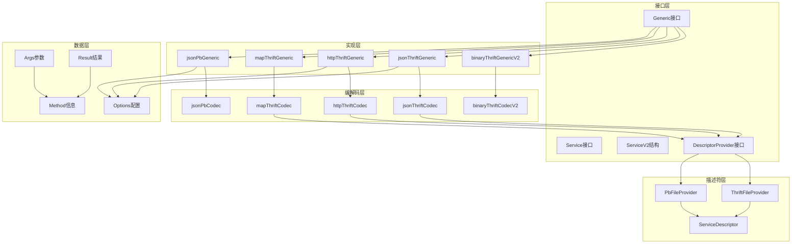

## 内存管理与性能优化

### 1. 描述符缓存优化

```go
// ThriftFileProvider中的缓存机制
type ThriftFileProvider struct {
    svcs map[string]*descriptor.ServiceDescriptor
    mu   sync.RWMutex
}

func (p *ThriftFileProvider) Provide(serviceName, methodName string) (*descriptor.ServiceDescriptor, error) {
    p.mu.RLock()
    svc, exists := p.svcs[serviceName]
    p.mu.RUnlock()
    
    if exists {
        return svc, nil // 缓存命中
    }
    
    // 缓存未命中，加载并缓存
    p.mu.Lock()
    defer p.mu.Unlock()
    
    // 双重检查
    if svc, exists := p.svcs[serviceName]; exists {
        return svc, nil
    }
    
    // 加载描述符
    svc, err := p.loadServiceDescriptor(serviceName)
    if err != nil {
        return nil, err
    }
    
    p.svcs[serviceName] = svc
    return svc, nil
}
```

### 2. 编解码器复用

```go
// 编解码器实例复用
type codecPool struct {
    pool sync.Pool
}

func (p *codecPool) Get() *jsonThriftCodec {
    codec := p.pool.Get()
    if codec == nil {
        return newJsonThriftCodec()
    }
    return codec.(*jsonThriftCodec)
}

func (p *codecPool) Put(codec *jsonThriftCodec) {
    codec.reset() // 重置状态
    p.pool.Put(codec)
}
```

### 3. 参数对象池化

```go
// Args和Result对象池化
var (
    argsPool = sync.Pool{
        New: func() interface{} {
            return &Args{}
        },
    }
    
    resultPool = sync.Pool{
        New: func() interface{} {
            return &Result{}
        },
    }
)

func GetArgs() *Args {
    return argsPool.Get().(*Args)
}

func PutArgs(args *Args) {
    args.Method = ""
    args.Request = nil
    argsPool.Put(args)
}
```

### 4. 动态编解码优化

```go
// 使用DynamicGo进行高性能动态编解码
type jsonThriftCodec struct {
    provider         DescriptorProvider
    dynamicgoEnabled bool
    convOpts         conv.Options
}

func (c *jsonThriftCodec) Marshal(ctx context.Context, msg remote.Message, out remote.ByteBuffer) error {
    if c.dynamicgoEnabled {
        // 使用DynamicGo高性能转换
        return c.dynamicgoMarshal(ctx, msg, out)
    }
    // 使用传统方式
    return c.traditionalMarshal(ctx, msg, out)
}
```

这个数据结构文档详细介绍了Generic模块的核心数据结构、设计模式和性能优化策略，为开发者理解和扩展Generic功能提供了完整的参考。

---

## 时序图

## 1. Generic创建与初始化时序图

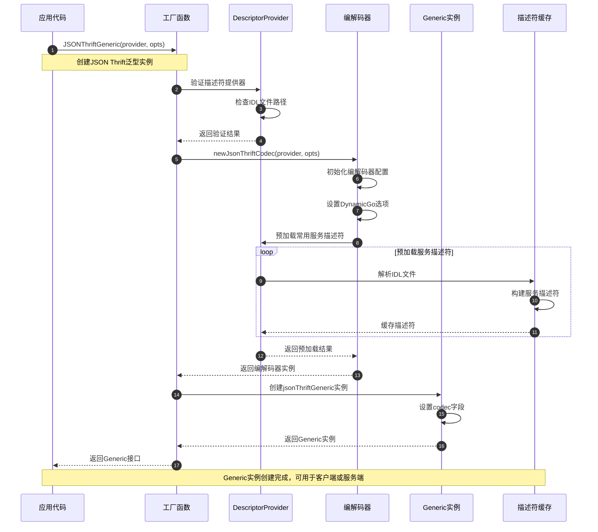

### 创建时序说明

**1. 工厂函数调用阶段（步骤1-4）**

- 应用代码调用具体的Generic工厂函数
- 验证描述符提供器的有效性
- 检查IDL文件路径和内容的正确性

**2. 编解码器初始化阶段（步骤5-12）**

- 创建对应的编解码器实例
- 设置DynamicGo等性能优化选项
- 预加载常用的服务描述符到缓存

**3. Generic实例创建阶段（步骤13-16）**

- 创建具体的Generic实现实例
- 设置编解码器引用
- 返回Generic接口供后续使用

## 2. 泛型客户端调用时序图

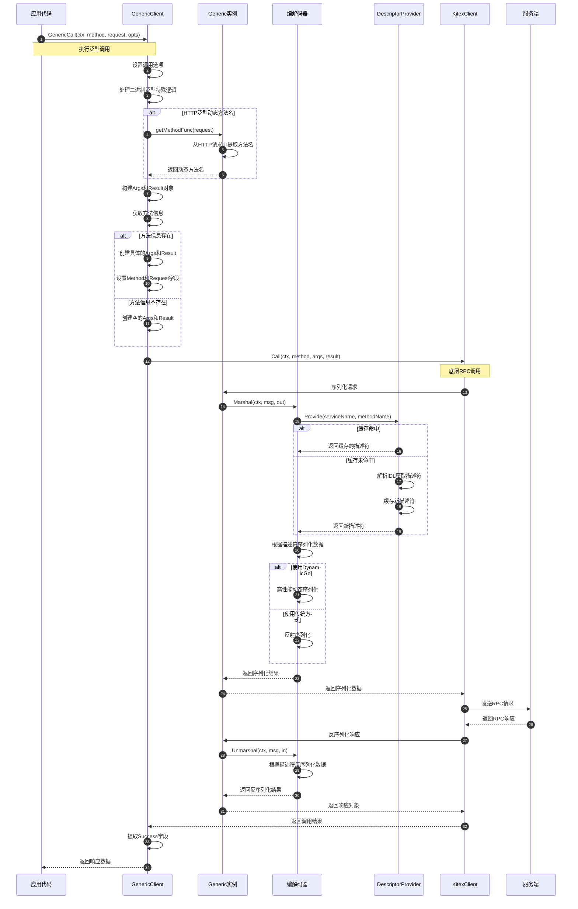

### 客户端调用时序说明

**1. 调用准备阶段（步骤1-12）**

- 设置调用级别的配置选项
- 处理不同泛型类型的特殊逻辑
- 动态获取方法名（HTTP泛型）
- 构建泛型参数和结果容器

**2. 序列化阶段（步骤13-24）**

- 获取服务和方法的描述符信息
- 优先使用缓存的描述符，提高性能
- 根据配置选择高性能或传统序列化方式
- 将请求数据序列化为网络传输格式

**3. 网络传输阶段（步骤25-26）**

- 通过底层RPC客户端发送请求
- 接收服务端返回的响应数据

**4. 反序列化阶段（步骤27-32）**

- 使用相同的描述符反序列化响应
- 将网络数据转换为业务对象
- 提取业务结果返回给应用代码

## 3. 泛型服务端处理时序图

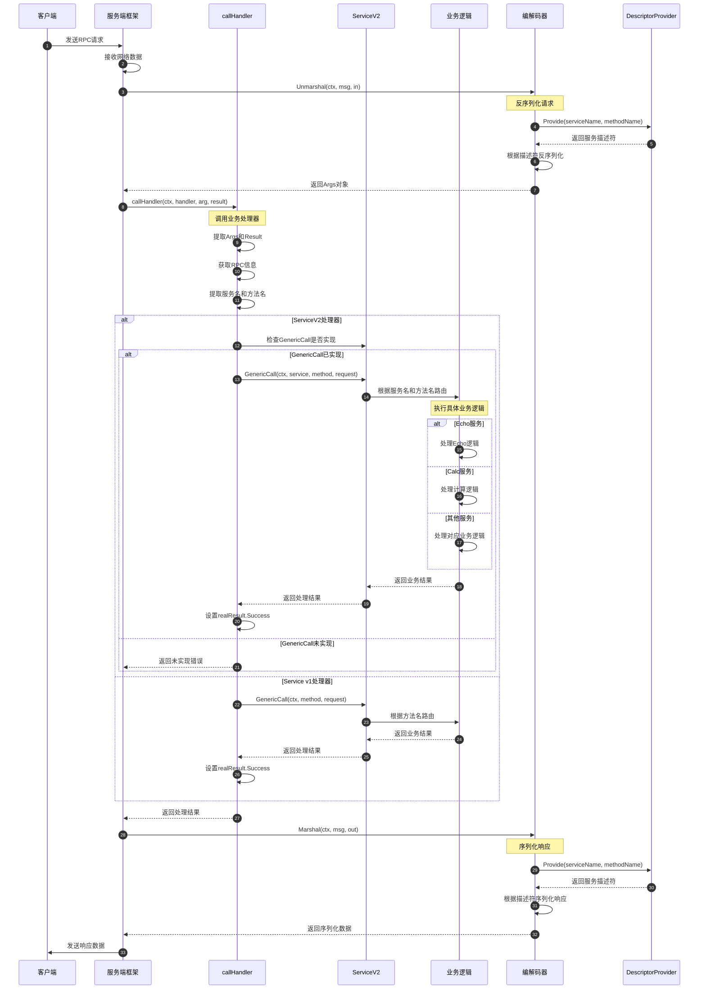

### 服务端处理时序说明

**1. 请求接收阶段（步骤1-6）**

- 服务端接收客户端的RPC请求
- 使用编解码器反序列化请求数据
- 获取服务描述符进行数据解析
- 构建Args参数对象

**2. 业务路由阶段（步骤7-12）**

- 调用callHandler进行请求分发
- 提取RPC调用的元信息
- 获取服务名和方法名用于路由

**3. 业务处理阶段（步骤13-26）**

- 根据处理器类型选择调用方式
- ServiceV2支持多服务路由
- 根据服务名和方法名路由到具体业务逻辑
- 执行业务处理并返回结果

**4. 响应发送阶段（步骤27-33）**

- 使用编解码器序列化响应数据
- 获取相同的服务描述符保证一致性
- 将响应数据发送回客户端

## 4. HTTP泛型映射时序图

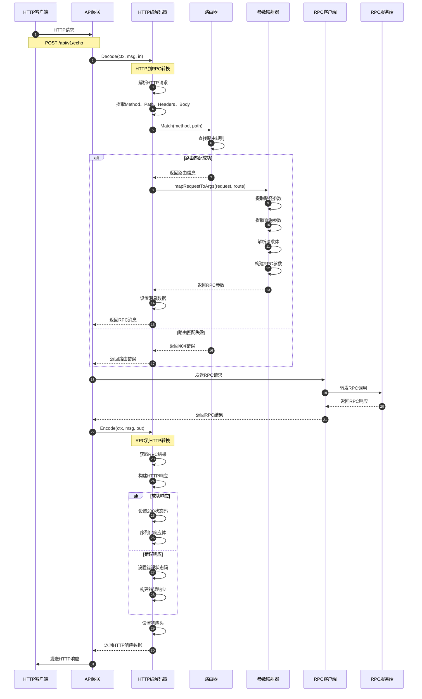

### HTTP映射时序说明

**1. HTTP请求解析阶段（步骤1-6）**

- HTTP客户端发送RESTful API请求
- API网关接收HTTP请求
- HTTP编解码器解析请求的各个组成部分

**2. 路由匹配阶段（步骤7-16）**

- 根据HTTP方法和路径进行路由匹配
- 成功匹配时提取路由参数和查询参数
- 解析请求体并构建RPC调用参数
- 失败时返回404错误

**3. RPC调用阶段（步骤17-20）**

- 将HTTP请求转换为RPC调用
- 通过RPC客户端发送到目标服务
- 接收RPC服务的处理结果

**4. HTTP响应构建阶段（步骤21-30）**

- 将RPC结果转换为HTTP响应
- 根据结果类型设置相应的状态码
- 序列化响应体并设置响应头
- 发送HTTP响应给客户端

## 5. 描述符缓存管理时序图

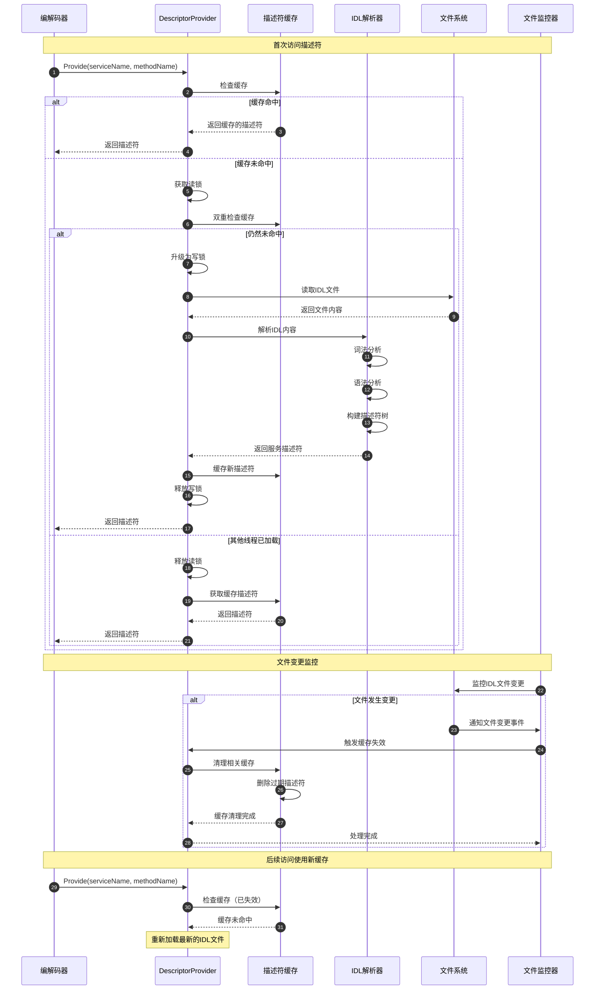

### 描述符缓存管理说明

**1. 缓存查找阶段（步骤1-6）**

- 编解码器请求服务描述符
- 优先检查内存缓存
- 缓存命中时直接返回，提高性能

**2. 缓存加载阶段（步骤7-20）**

- 使用读写锁保证并发安全
- 双重检查避免重复加载
- 解析IDL文件构建描述符
- 将新描述符缓存供后续使用

**3. 文件监控阶段（步骤21-30）**

- 监控IDL文件的变更事件
- 文件变更时主动失效相关缓存
- 确保使用最新的IDL定义

**4. 缓存更新阶段（步骤31-35）**

- 后续访问时重新加载最新文件
- 更新缓存内容
- 保证服务定义的一致性

## 6. 流式调用处理时序图

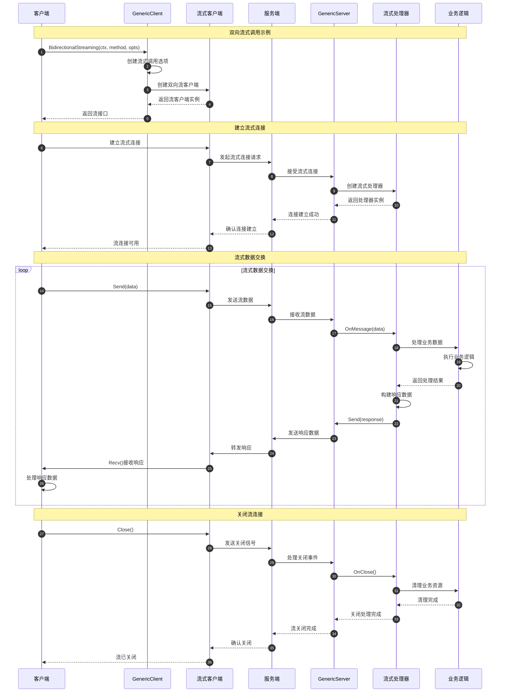

### 流式调用处理说明

**1. 流连接建立阶段（步骤1-12）**

- 客户端创建流式调用客户端
- 建立到服务端的流式连接
- 服务端创建对应的流处理器
- 确认流连接建立成功

**2. 数据交换阶段（步骤13-25）**

- 客户端和服务端进行双向数据交换
- 支持并发的发送和接收操作
- 业务逻辑处理流式数据
- 实时响应和数据传输

**3. 流关闭阶段（步骤26-35）**

- 客户端主动关闭流连接
- 服务端处理关闭事件
- 清理流相关的业务资源
- 确认流连接完全关闭

## 时序图总结

这些时序图展示了Generic模块的完整工作流程：

1. **Generic创建**：从工厂函数到实例化的完整过程，包含描述符预加载
2. **客户端调用**：泛型客户端的完整调用链路，包含动态编解码
3. **服务端处理**：泛型服务的请求处理流程，支持多服务路由
4. **HTTP映射**：HTTP请求到RPC调用的完整转换过程
5. **描述符缓存**：IDL描述符的缓存管理和文件监控机制
6. **流式调用**：流式泛型调用的建立、数据交换和关闭过程

每个时序图都包含了详细的步骤说明和关键节点分析，帮助开发者理解Generic模块的内部工作机制、性能优化点和扩展方式。

---
