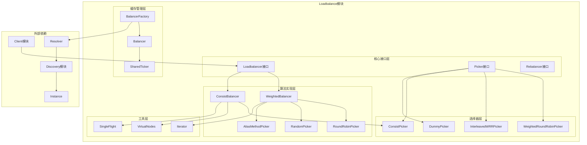

# Kitex-05-Loadbalance-概览

## 模块职责与边界

### 核心职责
Loadbalance模块是Kitex框架的负载均衡核心，负责在多个服务实例间分发请求。主要职责包括：

- **实例选择**：根据负载均衡算法选择最优服务实例
- **权重管理**：支持基于权重的负载分配
- **缓存优化**：缓存Picker实例，提高选择性能
- **动态更新**：支持服务实例的动态增减
- **一致性哈希**：支持有状态服务的一致性路由
- **故障转移**：自动剔除不健康的服务实例

### 输入输出
- **输入**：服务发现结果、请求上下文、负载均衡配置
- **输出**：选中的服务实例、负载统计信息
- **上游依赖**：Discovery模块提供的服务实例列表
- **下游依赖**：Client模块的连接建立和请求发送

### 生命周期
1. **初始化阶段**：创建负载均衡器，设置算法参数
2. **实例发现**：接收服务发现的实例列表
3. **Picker创建**：根据实例列表创建选择器
4. **实例选择**：为每个请求选择合适的服务实例
5. **动态更新**：响应服务实例的变更事件
6. **资源清理**：清理缓存和统计信息

## 模块架构图



### 架构说明

**1. 分层设计**

- **核心接口层**：定义负载均衡的核心抽象接口
- **算法实现层**：实现具体的负载均衡算法
- **缓存管理层**：管理负载均衡器和选择器的缓存
- **选择器层**：实现具体的实例选择逻辑
- **工具层**：提供辅助功能和优化工具

**2. 组件交互**

- Loadbalancer根据服务发现结果创建Picker
- Picker负责具体的实例选择逻辑
- BalancerFactory管理负载均衡器的缓存和生命周期
- Rebalancer处理服务实例的动态变更

**3. 扩展机制**

- 支持自定义负载均衡算法
- 可插拔的选择器实现
- 灵活的权重和配置管理
- 支持新算法的扩展

## 核心算法与流程

### 加权轮询算法核心流程

```go
// 加权轮询选择器
type weightedRoundRobinPicker struct {
    items  []wrr
    length int
}

type wrr struct {
    item            discovery.Instance
    weight          int
    currentWeight   int
    effectiveWeight int
}

func (p *weightedRoundRobinPicker) Next(ctx context.Context, request interface{}) discovery.Instance {
    if p.length == 0 {
        return nil
    }
    if p.length == 1 {
        return p.items[0].item
    }

    // 1. 更新当前权重
    total := 0
    var selected *wrr
    for i := 0; i < p.length; i++ {
        item := &p.items[i]
        item.currentWeight += item.effectiveWeight
        total += item.effectiveWeight
        
        // 2. 选择权重最大的实例
        if selected == nil || item.currentWeight > selected.currentWeight {
            selected = item
        }
    }
    
    // 3. 减少选中实例的当前权重
    if selected != nil {
        selected.currentWeight -= total
        return selected.item
    }
    
    return p.items[0].item
}
```

**算法流程说明**：

1. **权重累加**：为每个实例的当前权重加上有效权重
2. **最大选择**：选择当前权重最大的实例
3. **权重调整**：将选中实例的当前权重减去总权重
4. **循环平衡**：确保长期来看权重分配符合预期

### 一致性哈希算法核心流程

```go
// 一致性哈希选择器
type consistPicker struct {
    cb   *consistBalancer
    info *consistInfo
}

func (p *consistPicker) Next(ctx context.Context, request interface{}) discovery.Instance {
    // 1. 获取请求的哈希键
    key := p.cb.opt.GetKey(ctx, request)
    if key == "" {
        return p.info.realNodes[0].Ins
    }
    
    // 2. 计算哈希值
    hash := p.cb.opt.Hasher(key)
    
    // 3. 在虚拟节点环上查找
    idx := p.searchVirtualNode(hash)
    virtualNode := p.info.virtualNodes[idx]
    
    return virtualNode.realNode.Ins
}

func (p *consistPicker) searchVirtualNode(hash uint64) int {
    // 二分查找最近的虚拟节点
    virtualNodes := p.info.virtualNodes
    left, right := 0, len(virtualNodes)
    
    for left < right {
        mid := (left + right) / 2
        if virtualNodes[mid].hash < hash {
            left = mid + 1
        } else {
            right = mid
        }
    }
    
    if left == len(virtualNodes) {
        return 0 // 环形结构，回到开头
    }
    return left
}
```

**算法流程说明**：

1. **键提取**：从请求中提取一致性哈希的键
2. **哈希计算**：使用哈希函数计算键的哈希值
3. **节点查找**：在虚拟节点环上查找最近的节点
4. **实例返回**：返回虚拟节点对应的真实服务实例

### 别名方法算法核心流程

```go
// 别名方法选择器（高性能加权随机）
type aliasMethodPicker struct {
    length int
    alias  []int
    prob   []float64
    items  []discovery.Instance
}

func (p *aliasMethodPicker) Next(ctx context.Context, request interface{}) discovery.Instance {
    if p.length == 0 {
        return nil
    }
    if p.length == 1 {
        return p.items[0]
    }
    
    // 1. 生成随机数
    r := fastrand.Uint32n(uint32(p.length))
    idx := int(r)
    
    // 2. 生成概率随机数
    prob := fastrand.Float64()
    
    // 3. 根据别名表选择
    if prob < p.prob[idx] {
        return p.items[idx]
    }
    return p.items[p.alias[idx]]
}
```

**算法流程说明**：

1. **随机选择**：随机选择一个桶
2. **概率判断**：根据桶的概率决定是否选择该桶
3. **别名选择**：概率不满足时选择别名桶
4. **O(1)复杂度**：预处理后选择操作为常数时间

### 负载均衡器缓存管理流程

```go
// 负载均衡器工厂
type BalancerFactory struct {
    cache       sync.Map
    resolver    discovery.Resolver
    loadbalancer Loadbalancer
    rebalancer  Rebalancer
    sfg         singleflight.Group
    opts        Options
}

func (b *BalancerFactory) Get(ctx context.Context, target rpcinfo.EndpointInfo) (*Balancer, error) {
    // 1. 生成缓存键
    desc := b.resolver.Target(ctx, target)
    
    // 2. 查找缓存
    if val, ok := b.cache.Load(desc); ok {
        return val.(*Balancer), nil
    }
    
    // 3. 使用SingleFlight避免重复创建
    val, err, _ := b.sfg.Do(desc, func() (interface{}, error) {
        // 双重检查
        if v, ok := b.cache.Load(desc); ok {
            return v.(*Balancer), nil
        }
        
        // 4. 解析服务实例
        res, err := b.resolver.Resolve(ctx, desc)
        if err != nil {
            return nil, err
        }
        
        // 5. 创建负载均衡器
        bl := &Balancer{
            b:      b,
            target: desc,
        }
        bl.res.Store(res)
        bl.sharedTicker = getSharedTicker(bl, b.opts.RefreshInterval)
        
        // 6. 缓存负载均衡器
        b.cache.Store(desc, bl)
        return bl, nil
    })
    
    if err != nil {
        return nil, err
    }
    return val.(*Balancer), nil
}
```

**缓存管理说明**：

1. **缓存查找**：优先使用缓存的负载均衡器实例
2. **并发控制**：使用SingleFlight避免重复创建
3. **服务解析**：解析目标服务的实例列表
4. **定时刷新**：使用SharedTicker定时刷新服务实例
5. **缓存存储**：将创建的负载均衡器缓存供后续使用

## 性能优化要点

### 1. 选择器缓存优化
- **Picker缓存**：缓存创建的选择器实例，避免重复创建
- **SingleFlight**：防止并发创建相同的选择器
- **对象池**：复用选择器对象，减少GC压力
- **延迟创建**：按需创建选择器，节省内存

### 2. 算法性能优化
- **预计算**：别名方法算法预计算概率表
- **快速随机数**：使用高性能的随机数生成器
- **内存局部性**：优化数据结构的内存布局
- **分支预测**：减少条件分支，提高CPU效率

### 3. 并发安全优化
- **无锁设计**：选择器使用无锁数据结构
- **原子操作**：使用原子操作更新权重
- **读写分离**：分离读写操作，提高并发性能
- **局部状态**：避免全局状态的竞争

### 4. 内存管理优化
- **结构体对齐**：优化结构体字段对齐，减少内存占用
- **切片预分配**：预分配切片容量，避免扩容
- **字符串优化**：复用字符串，避免重复分配
- **缓存失效**：及时清理过期的缓存项

### 5. 动态更新优化
- **增量更新**：支持服务实例的增量更新
- **平滑切换**：新旧选择器的平滑切换
- **版本控制**：使用版本号管理选择器更新
- **批量更新**：批量处理服务实例变更

## 扩展点设计

### 1. 自定义负载均衡算法

```go
// 实现自定义的负载均衡器
type CustomLoadbalancer struct {
    // 自定义字段
}

func (lb *CustomLoadbalancer) GetPicker(result discovery.Result) Picker {
    // 自定义选择器创建逻辑
    return &CustomPicker{
        instances: result.Instances,
    }
}

func (lb *CustomLoadbalancer) Name() string {
    return "custom"
}
```

### 2. 自定义选择器

```go
// 实现自定义的选择器
type CustomPicker struct {
    instances []discovery.Instance
}

func (p *CustomPicker) Next(ctx context.Context, request interface{}) discovery.Instance {
    // 自定义选择逻辑
    return p.selectBestInstance(ctx, request)
}
```

### 3. 自定义一致性哈希

```go
// 自定义一致性哈希选项
func NewCustomConsistBalancer() Loadbalancer {
    return NewConsistBalancer(ConsistentHashOption{
        GetKey: func(ctx context.Context, request interface{}) string {
            // 自定义键提取逻辑
            return extractCustomKey(request)
        },
        Hasher: func(key string) uint64 {
            // 自定义哈希函数
            return customHash(key)
        },
        VirtualFactor: 150, // 自定义虚拟节点倍数
    })
}
```

### 4. 自定义重平衡器

```go
// 实现自定义的重平衡器
type CustomRebalancer struct {
    // 自定义字段
}

func (r *CustomRebalancer) Rebalance(change discovery.Change) {
    // 自定义重平衡逻辑
    r.handleInstanceChange(change)
}

func (r *CustomRebalancer) Delete(change discovery.Change) {
    // 自定义删除逻辑
    r.handleInstanceDelete(change)
}
```

## 典型使用场景

### 1. 微服务负载均衡
- **服务间调用**：在多个服务实例间分发请求
- **权重调整**：根据实例性能动态调整权重
- **故障转移**：自动剔除故障实例
- **容量规划**：根据负载情况进行容量规划

### 2. 有状态服务路由
- **一致性哈希**：确保相同键的请求路由到同一实例
- **会话保持**：维持用户会话的一致性
- **数据分片**：根据数据键进行分片路由
- **缓存命中**：提高缓存命中率

### 3. 灰度发布支持
- **版本路由**：根据版本标签路由请求
- **流量控制**：控制新版本的流量比例
- **A/B测试**：支持A/B测试的流量分配
- **回滚支持**：快速回滚到稳定版本

### 4. 多机房部署
- **就近路由**：优先选择同机房的实例
- **跨机房容灾**：机房故障时自动切换
- **延迟优化**：根据网络延迟选择实例
- **成本优化**：优化跨机房流量成本

这个概览文档详细介绍了Loadbalance模块的架构设计、核心算法和典型应用场景。Loadbalance模块作为Kitex的负载均衡核心，提供了多种高性能的负载均衡算法，是构建高可用分布式系统的重要组件。
