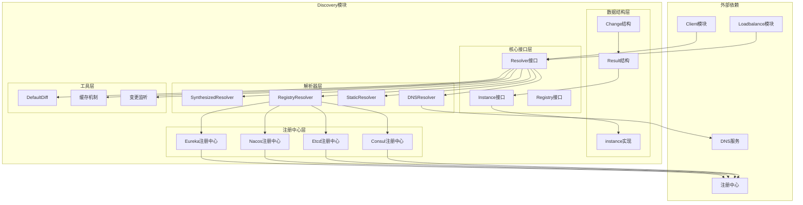

# Kitex-06-Discovery-概览

## 模块职责与边界

### 核心职责
Discovery模块是Kitex框架的服务发现核心，负责服务实例的发现和管理。主要职责包括：

- **服务解析**：将服务名解析为具体的服务实例列表
- **实例管理**：管理服务实例的地址、权重和标签信息
- **变更检测**：检测服务实例的增加、更新和删除
- **缓存支持**：支持服务发现结果的缓存机制
- **事件通知**：通知负载均衡器服务实例的变更
- **多协议支持**：支持不同的服务发现协议和注册中心

### 输入输出
- **输入**：服务名、目标端点信息、上下文
- **输出**：服务实例列表、变更事件、缓存键
- **上游依赖**：注册中心（Consul、Etcd、Nacos等）
- **下游依赖**：Loadbalance模块使用发现结果

### 生命周期
1. **初始化阶段**：创建Resolver，配置注册中心连接
2. **目标解析**：将目标端点转换为查询键
3. **实例发现**：从注册中心获取服务实例列表
4. **结果缓存**：缓存发现结果，提高查询性能
5. **变更监听**：监听服务实例的变更事件
6. **通知更新**：通知负载均衡器更新实例列表

## 模块架构图



### 架构说明

**1. 分层设计**

- **核心接口层**：定义服务发现的核心抽象接口
- **数据结构层**：定义服务发现的数据模型
- **解析器层**：实现具体的服务发现解析器
- **注册中心层**：适配不同的服务注册中心
- **工具层**：提供辅助功能和优化工具

**2. 组件交互**

- Resolver负责服务发现的核心逻辑
- Instance封装服务实例的基本信息
- Result包含服务发现的完整结果
- Change描述服务实例的变更情况

**3. 扩展机制**

- 支持自定义Resolver实现
- 可插拔的注册中心适配器
- 灵活的实例标签和权重管理
- 支持新注册中心的扩展

## 核心算法与流程

### 服务发现核心流程

```go
// Resolver服务发现接口
type Resolver interface {
    Target(ctx context.Context, target rpcinfo.EndpointInfo) (description string)
    Resolve(ctx context.Context, desc string) (Result, error)
    Diff(cacheKey string, prev, next Result) (Change, bool)
    Name() string
}

// 服务发现流程
func (r *registryResolver) Resolve(ctx context.Context, desc string) (Result, error) {
    // 1. 解析服务描述
    serviceName, tags := r.parseDescription(desc)
    
    // 2. 从注册中心获取实例
    instances, err := r.registry.Discover(ctx, serviceName, tags)
    if err != nil {
        return Result{}, err
    }
    
    // 3. 转换为Discovery实例
    discoveryInstances := make([]Instance, 0, len(instances))
    for _, inst := range instances {
        discoveryInstances = append(discoveryInstances, &instance{
            addr:   inst.Address,
            weight: inst.Weight,
            tags:   inst.Tags,
        })
    }
    
    // 4. 构建发现结果
    result := Result{
        Cacheable: true,
        CacheKey:  r.buildCacheKey(serviceName, tags),
        Instances: discoveryInstances,
    }
    
    return result, nil
}
```

**发现流程说明**：

1. **目标解析**：将目标端点信息转换为查询描述
2. **实例获取**：从注册中心获取服务实例列表
3. **格式转换**：将注册中心格式转换为Discovery格式
4. **结果构建**：构建包含缓存信息的发现结果

### 变更检测算法

```go
// DefaultDiff提供默认的变更检测实现
func DefaultDiff(cacheKey string, prev, next Result) (Change, bool) {
    ch := Change{
        Result: Result{
            Cacheable: next.Cacheable,
            CacheKey:  cacheKey,
            Instances: next.Instances,
        },
    }
    
    // 1. 构建前一次结果的地址映射
    prevMap := make(map[string]Instance, len(prev.Instances))
    for _, ins := range prev.Instances {
        prevMap[ins.Address().String()] = ins
    }
    
    // 2. 构建当前结果的地址映射
    nextMap := make(map[string]Instance, len(next.Instances))
    for _, ins := range next.Instances {
        addr := ins.Address().String()
        nextMap[addr] = ins
        
        // 3. 检测新增和更新的实例
        if prevIns, found := prevMap[addr]; !found {
            ch.Added = append(ch.Added, ins)
        } else if prevIns.Weight() != ins.Weight() {
            ch.Updated = append(ch.Updated, ins)
        }
    }
    
    // 4. 检测删除的实例
    for _, ins := range prev.Instances {
        if _, found := nextMap[ins.Address().String()]; !found {
            ch.Removed = append(ch.Removed, ins)
        }
    }
    
    // 5. 判断是否有变更
    hasChange := len(ch.Added)+len(ch.Updated)+len(ch.Removed) != 0
    return ch, hasChange
}
```

**变更检测说明**：

1. **映射构建**：构建地址到实例的映射表，提高查找效率
2. **新增检测**：检测在新结果中出现但在旧结果中不存在的实例
3. **更新检测**：检测权重或其他属性发生变化的实例
4. **删除检测**：检测在旧结果中存在但在新结果中消失的实例
5. **变更判断**：根据变更实例的数量判断是否有实际变更

### DNS解析器实现

```go
// DNS解析器实现
type dnsResolver struct {
    resolver *net.Resolver
}

func (r *dnsResolver) Resolve(ctx context.Context, desc string) (Result, error) {
    // 1. 解析DNS记录
    host, port, err := net.SplitHostPort(desc)
    if err != nil {
        return Result{}, err
    }
    
    // 2. 查询IP地址
    ips, err := r.resolver.LookupIPAddr(ctx, host)
    if err != nil {
        return Result{}, err
    }
    
    // 3. 构建实例列表
    instances := make([]Instance, 0, len(ips))
    for _, ip := range ips {
        addr := net.JoinHostPort(ip.IP.String(), port)
        instances = append(instances, NewInstance("tcp", addr, DefaultWeight, nil))
    }
    
    // 4. 返回结果
    return Result{
        Cacheable: false, // DNS结果通常不缓存
        Instances: instances,
    }, nil
}
```

**DNS解析说明**：

1. **地址解析**：分离主机名和端口号
2. **DNS查询**：查询主机名对应的IP地址列表
3. **实例构建**：为每个IP地址创建服务实例
4. **结果返回**：返回不可缓存的发现结果

### 静态解析器实现

```go
// 静态解析器实现
type staticResolver struct {
    instances []Instance
}

func NewStaticResolver(addresses []string) Resolver {
    instances := make([]Instance, 0, len(addresses))
    for _, addr := range addresses {
        instances = append(instances, NewInstance("tcp", addr, DefaultWeight, nil))
    }
    
    return &staticResolver{
        instances: instances,
    }
}

func (r *staticResolver) Resolve(ctx context.Context, desc string) (Result, error) {
    return Result{
        Cacheable: true,
        CacheKey:  desc,
        Instances: r.instances,
    }, nil
}
```

**静态解析说明**：

1. **实例预定义**：在创建时预定义服务实例列表
2. **固定返回**：每次解析返回相同的实例列表
3. **缓存支持**：支持结果缓存，提高性能
4. **简单可靠**：适用于实例列表固定的场景

## 性能优化要点

### 1. 缓存机制优化
- **结果缓存**：缓存服务发现结果，避免重复查询
- **缓存键设计**：设计合理的缓存键，支持精确匹配
- **TTL管理**：设置合理的缓存过期时间
- **缓存失效**：及时清理过期和无效的缓存

### 2. 网络请求优化
- **连接复用**：复用到注册中心的连接
- **批量查询**：支持批量查询多个服务
- **异步处理**：异步处理服务发现请求
- **超时控制**：设置合理的查询超时时间

### 3. 数据结构优化
- **内存布局**：优化数据结构的内存布局
- **对象池**：使用对象池减少内存分配
- **切片预分配**：预分配切片容量，避免扩容
- **字符串优化**：避免重复的字符串分配

### 4. 并发处理优化
- **读写锁**：使用读写锁保护共享数据
- **原子操作**：使用原子操作更新计数器
- **无锁设计**：在可能的情况下使用无锁数据结构
- **协程池**：使用协程池处理并发请求

### 5. 变更监听优化
- **增量更新**：支持增量更新，减少数据传输
- **事件聚合**：聚合连续的变更事件
- **批量通知**：批量通知变更事件
- **去重处理**：去除重复的变更事件

## 扩展点设计

### 1. 自定义Resolver实现

```go
// 实现自定义的服务发现解析器
type CustomResolver struct {
    // 自定义字段
}

func (r *CustomResolver) Target(ctx context.Context, target rpcinfo.EndpointInfo) string {
    // 自定义目标解析逻辑
    return r.buildTarget(target)
}

func (r *CustomResolver) Resolve(ctx context.Context, desc string) (Result, error) {
    // 自定义服务发现逻辑
    instances, err := r.discoverInstances(desc)
    if err != nil {
        return Result{}, err
    }
    
    return Result{
        Cacheable: true,
        CacheKey:  desc,
        Instances: instances,
    }, nil
}

func (r *CustomResolver) Name() string {
    return "custom"
}
```

### 2. 自定义Instance实现

```go
// 实现自定义的服务实例
type CustomInstance struct {
    address net.Addr
    weight  int
    tags    map[string]string
    // 自定义字段
    metadata map[string]interface{}
}

func (i *CustomInstance) Address() net.Addr {
    return i.address
}

func (i *CustomInstance) Weight() int {
    return i.weight
}

func (i *CustomInstance) Tag(key string) (string, bool) {
    value, exists := i.tags[key]
    return value, exists
}

func (i *CustomInstance) GetMetadata(key string) interface{} {
    return i.metadata[key]
}
```

### 3. SynthesizedResolver使用

```go
// 使用SynthesizedResolver创建自定义解析器
resolver := &SynthesizedResolver{
    TargetFunc: func(ctx context.Context, target rpcinfo.EndpointInfo) string {
        return target.ServiceName()
    },
    ResolveFunc: func(ctx context.Context, key string) (Result, error) {
        // 自定义解析逻辑
        return customResolve(key)
    },
    DiffFunc: func(key string, prev, next Result) (Change, bool) {
        // 自定义变更检测逻辑
        return customDiff(prev, next)
    },
    NameFunc: func() string {
        return "synthesized"
    },
}
```

### 4. 注册中心适配器

```go
// 实现新注册中心的适配器
type NewRegistryAdapter struct {
    client NewRegistryClient
}

func (a *NewRegistryAdapter) Discover(ctx context.Context, serviceName string, tags map[string]string) ([]RegistryInstance, error) {
    // 适配新注册中心的发现接口
    return a.client.GetInstances(serviceName, tags)
}

func (a *NewRegistryAdapter) Watch(serviceName string, callback func([]RegistryInstance)) error {
    // 适配新注册中心的监听接口
    return a.client.WatchService(serviceName, callback)
}
```

## 典型使用场景

### 1. 微服务架构
- **服务注册**：服务启动时注册到注册中心
- **服务发现**：客户端发现可用的服务实例
- **健康检查**：监控服务实例的健康状态
- **负载均衡**：配合负载均衡器分发请求

### 2. 多环境部署
- **环境隔离**：不同环境使用不同的服务实例
- **标签路由**：基于标签进行环境路由
- **灰度发布**：支持灰度发布的实例管理
- **A/B测试**：支持A/B测试的流量分配

### 3. 容器化部署
- **动态发现**：自动发现容器化的服务实例
- **弹性扩缩容**：支持服务实例的动态扩缩容
- **故障恢复**：自动检测和恢复故障实例
- **资源优化**：根据负载情况优化资源分配

### 4. 多数据中心
- **跨地域发现**：发现不同地域的服务实例
- **就近路由**：优先选择就近的服务实例
- **容灾切换**：数据中心故障时自动切换
- **延迟优化**：根据网络延迟选择实例

这个概览文档详细介绍了Discovery模块的架构设计、核心算法和典型应用场景。Discovery模块作为Kitex的服务发现核心，提供了灵活可扩展的服务发现能力，是构建微服务架构的重要基础设施。
