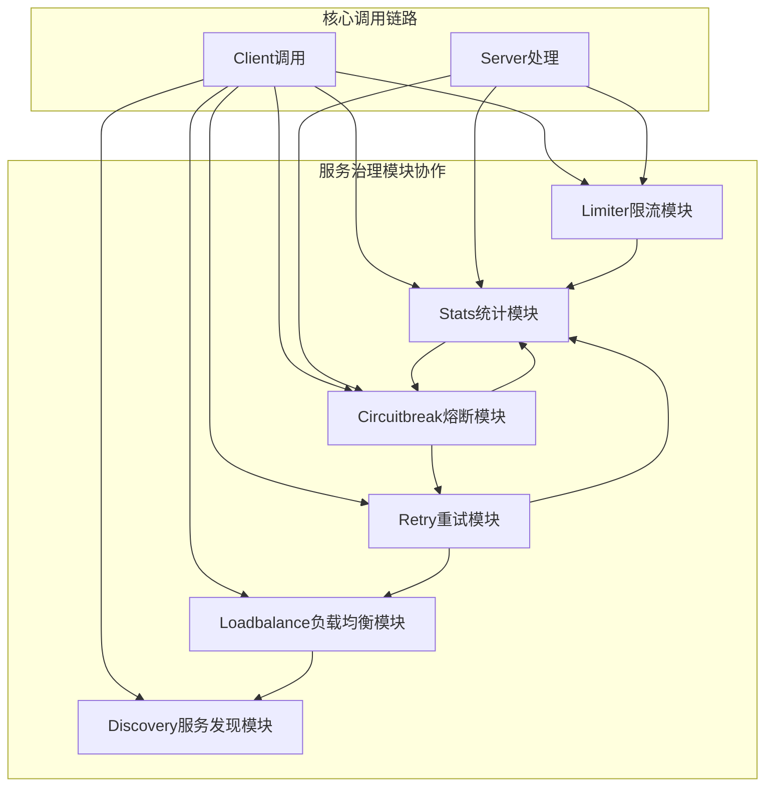

# Kitex-08-其他核心模块-概览

## Stats统计模块

### 核心职责
Stats模块负责RPC调用的统计和监控，主要职责包括：

- **调用统计**：统计RPC调用的次数、耗时、成功率等指标
- **性能监控**：监控系统性能指标，如QPS、延迟分布等
- **错误统计**：统计各种错误类型和错误率
- **资源监控**：监控内存、CPU等资源使用情况
- **指标导出**：支持将统计数据导出到外部监控系统

### 关键组件
- **Tracer**：链路追踪器，记录调用链路信息
- **StatsLevel**：统计级别控制，支持不同粒度的统计
- **Reporter**：统计数据报告器，负责数据上报
- **Metrics**：指标收集器，收集各种性能指标

```go
// Stats核心接口
type Tracer interface {
    Start(ctx context.Context) context.Context
    Finish(ctx context.Context)
    Tag(ctx context.Context, key, val string)
}

// 统计级别
type Level int
const (
    LevelDisabled Level = iota
    LevelBase
    LevelDetailed
)
```

### 典型使用场景
- **性能监控**：监控服务性能指标和趋势
- **故障诊断**：通过统计数据定位性能瓶颈
- **容量规划**：基于统计数据进行容量规划
- **SLA监控**：监控服务级别协议的达成情况

## Limiter限流模块

### 核心职责
Limiter模块负责RPC调用的限流控制，主要职责包括：

- **QPS限流**：控制每秒请求数量
- **并发限流**：控制同时处理的请求数量
- **令牌桶算法**：实现令牌桶限流算法
- **滑动窗口**：实现滑动窗口限流算法
- **动态调整**：支持限流参数的动态调整

### 关键组件
- **RateLimiter**：速率限制器接口
- **ConcurrencyLimiter**：并发限制器接口
- **LimitReporter**：限流统计报告器
- **Limiter**：限流器实现

```go
// 限流器核心接口
type RateLimiter interface {
    Acquire(ctx context.Context) bool
    Status() LimitStatus
}

type ConcurrencyLimiter interface {
    Acquire(ctx context.Context) bool
    Release(ctx context.Context)
    Status() LimitStatus
}

// 限流状态
type LimitStatus struct {
    Remaining int
    Total     int
    Rejected  int64
}
```

### 典型使用场景
- **过载保护**：防止服务因请求过多而过载
- **资源保护**：保护关键资源不被过度使用
- **公平调度**：确保不同客户端的公平访问
- **降级策略**：在限流触发时执行降级逻辑

## Circuitbreak熔断模块

### 核心职责
Circuitbreak模块负责RPC调用的熔断保护，主要职责包括：

- **故障检测**：检测服务调用的失败率和响应时间
- **熔断决策**：根据策略决定是否熔断服务
- **状态管理**：管理熔断器的开启、半开、关闭状态
- **自动恢复**：在服务恢复后自动关闭熔断器
- **降级处理**：熔断时提供降级处理逻辑

### 关键组件
- **CircuitBreaker**：熔断器核心接口
- **CBSuite**：熔断器套件，管理多个熔断器
- **CBConfig**：熔断器配置
- **CBPanel**：熔断器面板，统一管理

```go
// 熔断器核心接口
type CircuitBreaker interface {
    Allow() bool
    OnSuccess()
    OnFailure()
    Status() Status
}

// 熔断器状态
type Status int
const (
    StatusClosed Status = iota
    StatusHalfOpen
    StatusOpen
)

// 熔断器配置
type CBConfig struct {
    Enable       bool
    ErrRate      float64
    MinSample    int64
    MaxRequests  uint32
    Timeout      time.Duration
}
```

### 典型使用场景
- **故障隔离**：隔离故障服务，防止故障扩散
- **快速失败**：在服务不可用时快速返回错误
- **系统保护**：保护系统不被持续的失败请求拖垮
- **自动恢复**：在服务恢复后自动恢复调用

## 模块间协作关系



### 协作流程说明

1. **请求入口**：
   - 客户端请求首先经过限流模块检查
   - 通过限流检查后进入熔断模块判断
   - 熔断器允许通过后执行实际调用

2. **调用执行**：
   - 负载均衡模块选择目标实例
   - 服务发现模块提供实例列表
   - 重试模块处理调用失败的重试逻辑

3. **结果处理**：
   - 统计模块记录调用结果和性能指标
   - 熔断模块根据结果更新熔断状态
   - 限流模块更新限流统计信息

4. **反馈循环**：
   - 统计数据用于熔断决策
   - 熔断状态影响重试策略
   - 性能指标指导负载均衡算法

## 配置管理

### 统一配置结构

```go
// 服务治理配置
type GovernanceConfig struct {
    // 统计配置
    Stats StatsConfig `json:"stats"`
    
    // 限流配置
    Limiter LimiterConfig `json:"limiter"`
    
    // 熔断配置
    CircuitBreaker CBConfig `json:"circuit_breaker"`
    
    // 重试配置
    Retry RetryConfig `json:"retry"`
    
    // 负载均衡配置
    LoadBalance LBConfig `json:"load_balance"`
}

// 统计配置
type StatsConfig struct {
    Level    string `json:"level"`
    Reporter string `json:"reporter"`
    Tags     map[string]string `json:"tags"`
}

// 限流配置
type LimiterConfig struct {
    QPSLimit         int    `json:"qps_limit"`
    ConcurrencyLimit int    `json:"concurrency_limit"`
    Algorithm        string `json:"algorithm"`
}
```

### 动态配置更新

```go
// 配置更新接口
type ConfigUpdater interface {
    UpdateStats(config StatsConfig) error
    UpdateLimiter(config LimiterConfig) error
    UpdateCircuitBreaker(config CBConfig) error
}

// 配置监听器
type ConfigWatcher interface {
    Watch(key string, callback func(config interface{})) error
    Stop() error
}
```

## 性能优化要点

### 1. 统计模块优化
- **异步统计**：异步收集和上报统计数据
- **采样统计**：对高频调用进行采样统计
- **内存优化**：优化统计数据的内存使用
- **批量上报**：批量上报统计数据，减少网络开销

### 2. 限流模块优化
- **无锁实现**：使用无锁数据结构实现限流器
- **本地缓存**：缓存限流配置，减少配置查询
- **快速路径**：为未限流的情况提供快速路径
- **精确控制**：提供精确的限流控制算法

### 3. 熔断模块优化
- **状态缓存**：缓存熔断器状态，避免重复计算
- **快速判断**：提供快速的熔断状态判断
- **内存对齐**：优化数据结构的内存对齐
- **原子操作**：使用原子操作更新统计计数

### 4. 模块协作优化
- **事件驱动**：使用事件驱动的模块间通信
- **异步处理**：异步处理模块间的数据传递
- **缓存共享**：共享模块间的缓存数据
- **批量处理**：批量处理模块间的事件

## 扩展点设计

### 1. 自定义统计器

```go
// 实现自定义的统计器
type CustomTracer struct {
    // 自定义字段
}

func (t *CustomTracer) Start(ctx context.Context) context.Context {
    // 自定义开始逻辑
    return ctx
}

func (t *CustomTracer) Finish(ctx context.Context) {
    // 自定义结束逻辑
}
```

### 2. 自定义限流器

```go
// 实现自定义的限流器
type CustomLimiter struct {
    // 自定义字段
}

func (l *CustomLimiter) Acquire(ctx context.Context) bool {
    // 自定义限流逻辑
    return true
}
```

### 3. 自定义熔断器

```go
// 实现自定义的熔断器
type CustomCircuitBreaker struct {
    // 自定义字段
}

func (cb *CustomCircuitBreaker) Allow() bool {
    // 自定义熔断逻辑
    return true
}
```

## 监控与告警

### 关键指标监控
- **QPS指标**：每秒请求数量
- **延迟指标**：P99、P95、P50延迟
- **错误率指标**：各种错误类型的比率
- **资源指标**：CPU、内存使用率
- **熔断指标**：熔断器状态和触发次数
- **限流指标**：限流触发次数和拒绝率

### 告警策略
- **阈值告警**：基于指标阈值的告警
- **趋势告警**：基于指标趋势的告警
- **异常检测**：基于机器学习的异常检测
- **关联告警**：基于多指标关联的告警

这个概览文档介绍了Kitex框架中其他核心模块的功能和协作关系。这些模块共同构成了完整的服务治理体系，为构建高可用、高性能的微服务系统提供了全面的支撑。
