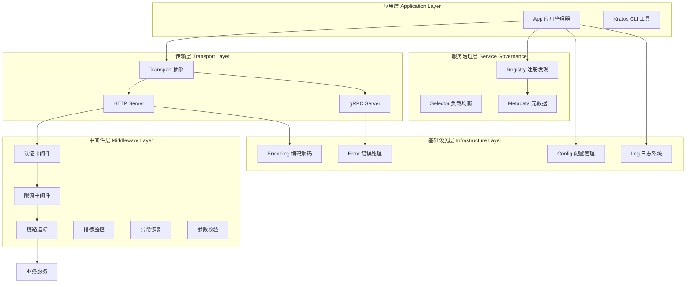
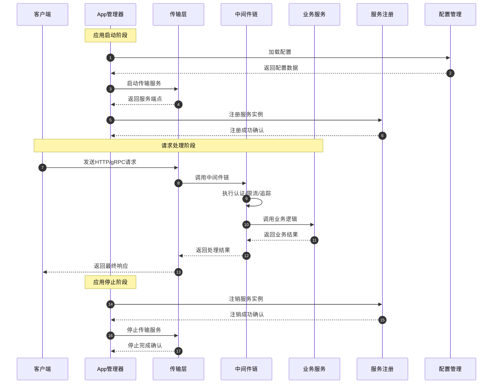

# Kratos 框架源码剖析 - 总览与架构

## 项目摘要

Kratos 是一个面向微服务治理的 Go 语言框架，版本 v2.9.0。该框架提供从零开始快速构建防弹级应用的能力，专注于微服务框架层面，通过分层架构和接口抽象实现松耦合设计。

### 核心目标
- 基于 HTTP/gRPC 的微服务通信协议
- 抽象传输层支持多协议切换  
- 强大的中间件生态系统
- 服务注册发现机制
- 统一日志接口和配置管理
- 自动内容编码选择和元数据传递

### 技术边界
- 专注微服务框架，不包含业务逻辑
- 不提供数据库 ORM 或缓存实现
- 通过插件方式扩展注册中心支持

## 整体架构图

### 架构设计说明

**分层职责划分：**
- **应用层**: 负责应用生命周期管理和CLI工具支持
- **传输层**: 提供HTTP/gRPC协议抽象，处理网络通信
- **中间件层**: 实现横切关注点，如认证、限流、监控等
- **服务治理层**: 处理服务发现、负载均衡、元数据管理
- **基础设施层**: 提供配置、日志、编码、错误处理等基础能力

**接口抽象设计：**
- 每层都定义清晰的接口边界，支持依赖注入
- 传输层通过 Transport 接口抽象不同协议实现
- 中间件通过链式调用模式实现可插拔架构
- 服务治理通过 Registry 和 Selector 接口支持多种实现

**并发安全保障：**
- 应用启动/停止采用优雅关闭机制
- 中间件链支持并发安全的请求处理
- 服务注册/注销操作具备幂等性
- 配置管理使用读写锁保证一致性

## 全局时序图

### 时序图详细说明

**启动阶段流程：**
1. 应用管理器首先加载配置，初始化必要参数
2. 启动传输层服务（HTTP/gRPC），获取监听端点
3. 向注册中心注册服务实例，包含端点和元数据信息
4. 应用进入就绪状态，开始接受请求

**请求处理流程：**
1. 客户端发送请求到传输层
2. 传输层将请求传递给中间件链处理
3. 中间件按顺序执行认证、限流、链路追踪等逻辑
4. 通过中间件验证后，调用具体的业务服务
5. 业务服务处理完成后，沿中间件链返回响应
6. 传输层将最终响应返回给客户端

**停止阶段流程：**
1. 接收到停止信号后，先从注册中心注销服务
2. 停止接受新请求，等待现有请求处理完成
3. 关闭传输层服务，释放资源
4. 应用完全停止

## 模块交互矩阵

| 模块 | App | Transport | Middleware | Config | Log | Registry | Selector | Encoding | Errors |
|------|-----|-----------|------------|--------|-----|----------|----------|----------|--------|
| **App** | - | 启动/停止 | 配置 | 读取 | 设置 | 注册/注销 | - | - | 处理 |
| **Transport** | 回调 | - | 调用链 | 读取 | 记录 | - | - | 编解码 | 包装 |
| **Middleware** | - | 处理 | 链式 | 读取 | 记录 | - | 调用 | - | 包装 |
| **Config** | - | - | - | - | 记录 | - | - | 解析 | 生成 |
| **Registry** | 通知 | - | - | 读取 | 记录 | - | 提供 | 编解码 | 生成 |

### 交互说明

**同步交互：**
- App 与 Transport 之间的启动/停止操作
- Transport 与 Middleware 的请求处理链路
- 所有模块与 Config 的配置读取操作

**异步交互：**
- 所有模块与 Log 的日志记录操作
- App 与 Registry 的服务注册/注销操作

**错误传播：**
- 采用链式错误包装，保留完整调用栈信息
- 支持错误分类和自定义错误码
- 提供统一的错误处理和恢复机制

## 核心设计原则

### 简单性原则
- 接口设计简洁明确，降低使用门槛
- 默认配置合理，支持零配置启动
- 代码结构清晰，易于理解和维护

### 可扩展性原则  
- 基于接口编程，支持插件化扩展
- 中间件可插拔，支持自定义中间件
- 传输层协议可扩展，支持自定义协议

### 高性能原则
- 中间件链优化，减少函数调用开销
- 对象池复用，减少内存分配
- 异步日志，避免I/O阻塞主流程

### 容错性原则
- 优雅关闭，保证数据完整性
- 熔断机制，防止故障扩散
- 超时控制，避免资源耗尽
- 重试机制，提高系统稳定性

该架构充分体现了 Kratos 框架"简单、通用、高效、稳定、健壮、高性能、可扩展、容错"的设计理念，为构建企业级微服务应用提供了坚实的架构基础。
