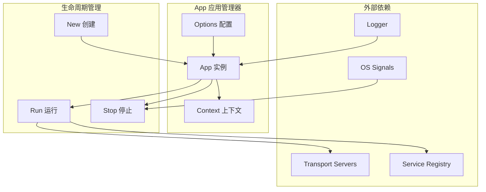
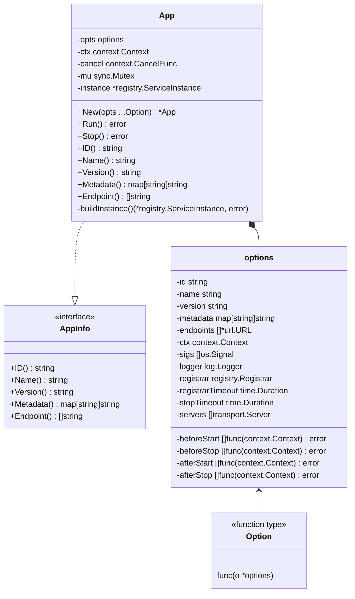
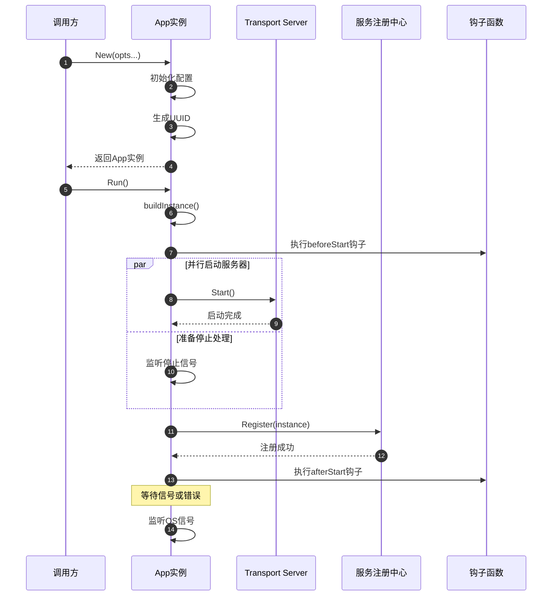
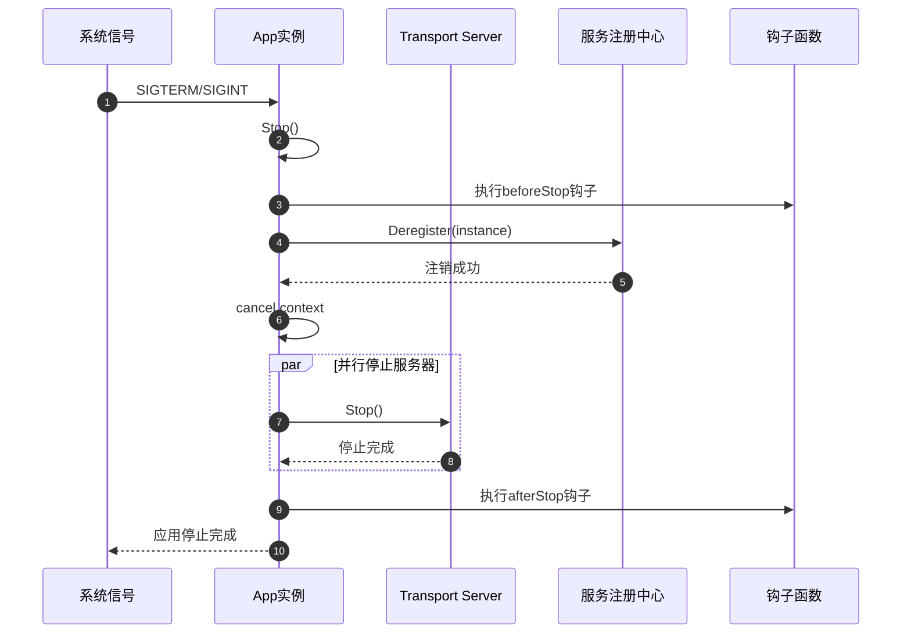

# Kratos-01-App应用管理器

## 模块概览

App 模块是 Kratos 框架的核心组件，负责应用程序的整个生命周期管理。它作为应用程序的入口点，协调各个组件的启动、运行和停止过程，提供统一的应用上下文管理。

### 模块职责
- 应用程序生命周期管理（启动、运行、停止）
- 服务器实例的统一管理和协调
- 服务注册与发现的集成管理
- 应用信息和元数据的维护
- 优雅关闭和信号处理
- 钩子函数的执行管理

### 核心特性
- 支持多协议服务器同时运行
- 内置优雅关闭机制
- 可配置的超时控制
- 生命周期钩子支持
- 服务实例自动构建
- 上下文传递和管理

## 架构图



### 架构设计说明

**核心组件关系：**
- App 实例通过 Options 模式接收配置参数
- 管理多个 Transport Server 的生命周期
- 集成 Service Registry 进行服务注册
- 通过 Context 传递应用信息

**生命周期管理：**
- New: 创建应用实例，初始化基础配置
- Run: 启动所有服务器，注册服务，等待信号
- Stop: 优雅关闭，注销服务，释放资源

## 数据结构UML图



### 数据结构说明

**AppInfo 接口：**
- 定义应用信息的标准访问接口
- 提供应用身份识别和元数据查询能力
- 支持端点信息的动态获取

**App 结构体：**
- opts: 应用配置选项，包含所有可配置参数
- ctx/cancel: 上下文管理，支持取消操作
- mu: 互斥锁，保护并发访问的状态
- instance: 服务实例信息，用于注册发现

**options 结构体：**
- 应用基础信息：id、name、version、metadata
- 网络配置：endpoints、servers
- 生命周期管理：各种钩子函数
- 外部依赖：logger、registrar

## API 文档

### 核心API

#### New 函数

**函数签名：**
```go
func New(opts ...Option) *App
```

**功能说明：**
创建新的应用实例，初始化默认配置并应用用户选项。

**参数说明：**
| 参数 | 类型 | 必填 | 说明 |
|------|------|------|------|
| opts | ...Option | 否 | 可变参数，用于配置应用选项 |

**返回值：**
| 类型 | 说明 |
|------|------|
| *App | 初始化完成的应用实例 |

**核心代码：**
```go
func New(opts ...Option) *App {
    o := options{
        ctx:              context.Background(),
        sigs:             []os.Signal{syscall.SIGTERM, syscall.SIGQUIT, syscall.SIGINT},
        registrarTimeout: 10 * time.Second,
    }
    // 生成唯一ID
    if id, err := uuid.NewUUID(); err == nil {
        o.id = id.String()
    }
    // 应用用户配置
    for _, opt := range opts {
        opt(&o)
    }
    // 设置全局日志器
    if o.logger != nil {
        log.SetLogger(o.logger)
    }
    ctx, cancel := context.WithCancel(o.ctx)
    return &App{
        ctx:    ctx,
        cancel: cancel,
        opts:   o,
    }
}
```

#### Run 方法

**函数签名：**
```go
func (a *App) Run() error
```

**功能说明：**
启动应用程序，执行完整的启动流程，包括服务器启动、服务注册、信号监听等。

**返回值：**
| 类型 | 说明 |
|------|------|
| error | 启动过程中的错误信息 |

**核心代码：**
```go
func (a *App) Run() error {
    // 构建服务实例
    instance, err := a.buildInstance()
    if err != nil {
        return err
    }
    
    a.mu.Lock()
    a.instance = instance
    a.mu.Unlock()
    
    sctx := NewContext(a.ctx, a)
    eg, ctx := errgroup.WithContext(sctx)
    wg := sync.WaitGroup{}

    // 执行启动前钩子
    for _, fn := range a.opts.beforeStart {
        if err = fn(sctx); err != nil {
            return err
        }
    }
    
    // 启动所有服务器
    for _, srv := range a.opts.servers {
        server := srv
        // 异步启动服务器
        eg.Go(func() error {
            wg.Done() 
            return server.Start(octx)
        })
        // 异步等待停止信号
        eg.Go(func() error {
            <-ctx.Done()
            stopCtx := context.WithoutCancel(octx)
            if a.opts.stopTimeout > 0 {
                var cancel context.CancelFunc
                stopCtx, cancel = context.WithTimeout(stopCtx, a.opts.stopTimeout)
                defer cancel()
            }
            return server.Stop(stopCtx)
        })
        wg.Add(1)
    }
    wg.Wait()
    
    // 注册服务到注册中心
    if a.opts.registrar != nil {
        rctx, rcancel := context.WithTimeout(ctx, a.opts.registrarTimeout)
        defer rcancel()
        if err = a.opts.registrar.Register(rctx, instance); err != nil {
            return err
        }
    }
    
    // 执行启动后钩子
    for _, fn := range a.opts.afterStart {
        if err = fn(sctx); err != nil {
            return err
        }
    }

    // 监听系统信号
    c := make(chan os.Signal, 1)
    signal.Notify(c, a.opts.sigs...)
    eg.Go(func() error {
        select {
        case <-ctx.Done():
            return nil
        case <-c:
            return a.Stop()
        }
    })
    
    // 等待所有协程结束
    if err = eg.Wait(); err != nil && !errors.Is(err, context.Canceled) {
        return err
    }
    
    // 执行停止后钩子
    err = nil
    for _, fn := range a.opts.afterStop {
        err = fn(sctx)
    }
    return err
}
```

#### Stop 方法

**函数签名：**
```go
func (a *App) Stop() error
```

**功能说明：**
优雅停止应用程序，执行服务注销、资源清理等操作。

**返回值：**
| 类型 | 说明 |
|------|------|
| error | 停止过程中的错误信息 |

**核心代码：**
```go
func (a *App) Stop() (err error) {
    sctx := NewContext(a.ctx, a)
    
    // 执行停止前钩子
    for _, fn := range a.opts.beforeStop {
        err = fn(sctx)
    }

    // 从注册中心注销服务
    a.mu.Lock()
    instance := a.instance
    a.mu.Unlock()
    if a.opts.registrar != nil && instance != nil {
        ctx, cancel := context.WithTimeout(NewContext(a.ctx, a), a.opts.registrarTimeout)
        defer cancel()
        if err = a.opts.registrar.Deregister(ctx, instance); err != nil {
            return err
        }
    }
    
    // 取消上下文，触发关闭流程
    if a.cancel != nil {
        a.cancel()
    }
    return err
}
```

### 配置选项API

#### ID 选项

**函数签名：**
```go
func ID(id string) Option
```

**功能说明：**
设置应用实例的唯一标识符。

**参数说明：**
| 参数 | 类型 | 必填 | 说明 |
|------|------|------|------|
| id | string | 是 | 应用实例唯一标识 |

#### Name 选项

**函数签名：**
```go
func Name(name string) Option
```

**功能说明：**
设置应用服务名称，用于服务注册和识别。

#### Server 选项

**函数签名：**
```go
func Server(srv ...transport.Server) Option
```

**功能说明：**
添加传输层服务器实例，支持多协议服务器同时运行。

#### Registrar 选项

**函数签名：**
```go
func Registrar(r registry.Registrar) Option
```

**功能说明：**
设置服务注册器，用于服务注册和发现。

## 时序图

### 应用启动时序图



### 应用停止时序图



## 调用链路分析

### New 函数调用链

1. **New(opts ...Option)**
   - 初始化默认 options 结构体
   - 生成 UUID 作为应用实例ID
   - 遍历应用用户提供的选项函数
   - 设置全局日志器（如果提供）
   - 创建可取消的上下文
   - 返回 App 实例

### Run 方法调用链

1. **Run()**
   - **buildInstance()**: 构建服务实例信息
     - 收集所有服务器端点
     - 创建 registry.ServiceInstance
   - **执行beforeStart钩子**: 用户自定义启动前逻辑
   - **启动服务器**: 
     - 使用 errgroup 并发启动多个服务器
     - 每个服务器在独立协程中运行
   - **服务注册**:
     - 向注册中心注册服务实例
     - 设置注册超时控制
   - **执行afterStart钩子**: 用户自定义启动后逻辑
   - **信号监听**:
     - 监听系统信号（SIGTERM、SIGINT等）
     - 信号到达时调用 Stop() 方法
   - **等待结束**: 使用 errgroup.Wait() 等待所有协程结束

### Stop 方法调用链

1. **Stop()**
   - **执行beforeStop钩子**: 用户自定义停止前逻辑
   - **服务注销**:
     - 从注册中心注销服务实例
     - 设置注销超时控制
   - **上下文取消**: 调用 cancel() 触发所有服务器停止
   - **资源清理**: 等待所有协程正常退出

## 关键功能详细描述

### 优雅关闭机制

**实现原理：**
- 使用 errgroup 管理多个协程的生命周期
- 通过 context 传递取消信号
- 为停止操作设置超时保护
- 支持自定义停止钩子函数

**关键代码：**
```go
// 停止处理协程
eg.Go(func() error {
    <-ctx.Done() // 等待取消信号
    stopCtx := context.WithoutCancel(octx)
    if a.opts.stopTimeout > 0 {
        var cancel context.CancelFunc
        stopCtx, cancel = context.WithTimeout(stopCtx, a.opts.stopTimeout)
        defer cancel()
    }
    return server.Stop(stopCtx)
})
```

### 服务实例构建

**实现原理：**
- 自动收集所有服务器的端点信息
- 支持手动指定端点覆盖
- 构建标准的服务实例对象用于注册

**关键代码：**
```go
func (a *App) buildInstance() (*registry.ServiceInstance, error) {
    endpoints := make([]string, 0, len(a.opts.endpoints))
    // 优先使用手动指定的端点
    for _, e := range a.opts.endpoints {
        endpoints = append(endpoints, e.String())
    }
    // 自动收集服务器端点
    if len(endpoints) == 0 {
        for _, srv := range a.opts.servers {
            if r, ok := srv.(transport.Endpointer); ok {
                e, err := r.Endpoint()
                if err != nil {
                    return nil, err
                }
                endpoints = append(endpoints, e.String())
            }
        }
    }
    return &registry.ServiceInstance{
        ID:        a.opts.id,
        Name:      a.opts.name,
        Version:   a.opts.version,
        Metadata:  a.opts.metadata,
        Endpoints: endpoints,
    }, nil
}
```

### 上下文管理

**实现原理：**
- 提供应用信息的上下文传递机制
- 支持从上下文中提取应用信息
- 确保应用信息在整个调用链中可访问

**关键代码：**
```go
type appKey struct{}

func NewContext(ctx context.Context, s AppInfo) context.Context {
    return context.WithValue(ctx, appKey{}, s)
}

func FromContext(ctx context.Context) (s AppInfo, ok bool) {
    s, ok = ctx.Value(appKey{}).(AppInfo)
    return
}
```

### 钩子函数机制

**功能说明：**
App 模块提供四个关键时机的钩子函数支持：
- beforeStart: 服务器启动前执行
- afterStart: 服务器启动后、服务注册后执行
- beforeStop: 服务停止前执行  
- afterStop: 服务完全停止后执行

**使用场景：**
- 数据库连接初始化和清理
- 缓存预热和刷新
- 外部资源的获取和释放
- 自定义健康检查逻辑

该 App 模块通过精心设计的生命周期管理、优雅关闭机制、钩子函数支持等特性，为 Kratos 应用提供了稳定可靠的应用程序基础框架。
