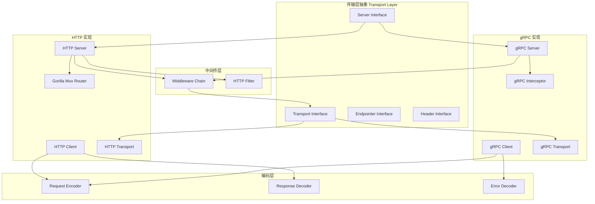
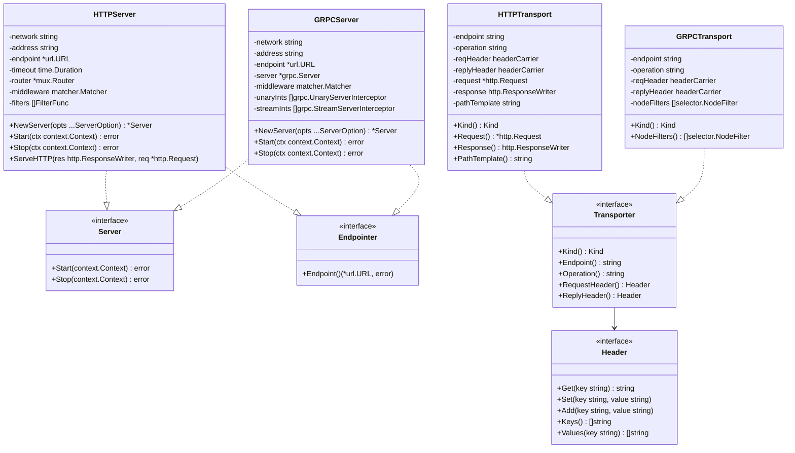
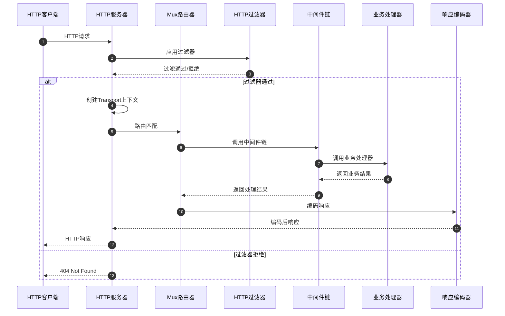
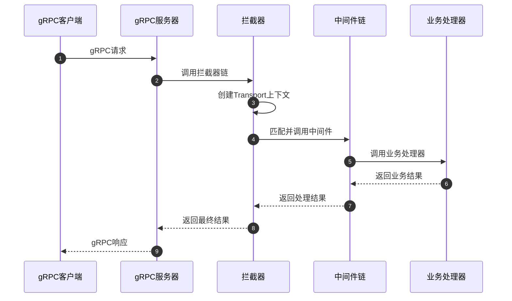
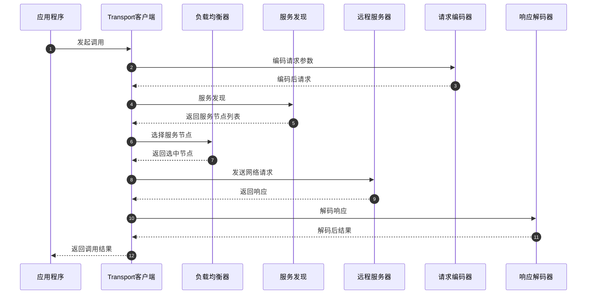

# Kratos-02-Transport传输层

## 模块概览

Transport 传输层是 Kratos 框架的核心通信模块，负责处理客户端和服务器之间的网络通信。该模块通过统一的接口抽象，支持多种传输协议（HTTP、gRPC），为上层应用提供透明的网络通信能力。

### 模块职责
- 提供统一的传输层抽象接口
- 支持 HTTP/gRPC 多协议通信
- 处理请求路由和响应编码
- 提供客户端和服务器实现
- 集成中间件链和过滤器
- 支持负载均衡和服务发现

### 核心特性
- 协议无关的传输层抽象
- 自动内容协商和编码选择
- 内置超时控制和错误处理
- 支持流式传输（gRPC）
- 可插拔的编码器和解码器
- 完整的上下文传递机制

## 架构图



### 架构设计说明

**分层设计：**
- **抽象层**: 定义传输层统一接口，实现协议无关性
- **实现层**: 提供 HTTP 和 gRPC 的具体实现
- **编码层**: 处理请求响应的序列化和反序列化
- **中间件层**: 提供横切关注点的处理能力

**协议支持：**
- **HTTP**: 基于 Gorilla Mux 提供 RESTful API 支持
- **gRPC**: 基于官方 gRPC-Go 提供高性能 RPC 通信
- **扩展性**: 通过接口抽象支持自定义协议实现

## 数据结构UML图



### 数据结构说明

**核心接口：**
- **Server**: 定义服务器启动/停止的标准接口
- **Endpointer**: 提供端点信息查询能力
- **Transporter**: 传输上下文信息访问接口
- **Header**: 统一的头部信息操作接口

**HTTP 实现：**
- **HTTPServer**: HTTP 服务器实现，集成 Gorilla Mux 路由
- **HTTPTransport**: HTTP 传输上下文，包含请求响应信息

**gRPC 实现：**
- **GRPCServer**: gRPC 服务器实现，支持拦截器
- **GRPCTransport**: gRPC 传输上下文，支持节点过滤

## API 文档

### 传输层核心接口

#### Server 接口

**接口定义：**
```go
type Server interface {
    Start(context.Context) error
    Stop(context.Context) error
}
```

**功能说明：**
定义传输层服务器的生命周期管理接口。

**方法说明：**
| 方法 | 参数 | 返回值 | 说明 |
|------|------|--------|------|
| Start | context.Context | error | 启动服务器，开始监听请求 |
| Stop | context.Context | error | 停止服务器，释放资源 |

#### Transporter 接口

**接口定义：**
```go
type Transporter interface {
    Kind() Kind
    Endpoint() string
    Operation() string
    RequestHeader() Header
    ReplyHeader() Header
}
```

**功能说明：**
提供传输上下文信息的访问接口，支持协议无关的信息获取。

**方法说明：**
| 方法 | 返回值 | 说明 |
|------|--------|------|
| Kind | Kind | 传输协议类型（HTTP/gRPC） |
| Endpoint | string | 传输端点地址 |
| Operation | string | 服务方法全名（如 /helloworld.Greeter/SayHello） |
| RequestHeader | Header | 请求头信息 |
| ReplyHeader | Header | 响应头信息 |

### HTTP 服务器 API

#### NewServer 函数

**函数签名：**
```go
func NewServer(opts ...ServerOption) *Server
```

**功能说明：**
创建新的 HTTP 服务器实例，支持通过选项模式进行配置。

**配置选项：**
| 选项 | 类型 | 说明 |
|------|------|------|
| Network | string | 网络协议（tcp、tcp4、tcp6） |
| Address | string | 监听地址（如 :8080） |
| Timeout | time.Duration | 请求超时时间 |
| Middleware | []middleware.Middleware | 中间件链 |
| Filter | []FilterFunc | HTTP 过滤器 |

**核心代码：**
```go
func NewServer(opts ...ServerOption) *Server {
    srv := &Server{
        network:     "tcp",
        address:     ":0",
        timeout:     1 * time.Second,
        middleware:  matcher.New(),
    }
    for _, o := range opts {
        o(srv)
    }
    
    srv.router = mux.NewRouter()
    srv.Server = &http.Server{
        Handler: srv,
    }
    return srv
}
```

#### Start 方法

**函数签名：**
```go
func (s *Server) Start(ctx context.Context) error
```

**功能说明：**
启动 HTTP 服务器，开始监听和处理请求。

**核心代码：**
```go
func (s *Server) Start(ctx context.Context) error {
    lis, err := net.Listen(s.network, s.address)
    if err != nil {
        return err
    }
    s.lis = lis
    
    // 构建服务器端点
    if s.endpoint == nil {
        addr, err := host.Extract(s.address, lis)
        if err != nil {
            s.lis.Close()
            return err
        }
        s.endpoint = endpoint.NewEndpoint(endpoint.Scheme("http", s.tlsConf != nil), addr)
    }
    
    // 启动服务器
    return s.Serve(lis)
}
```

#### ServeHTTP 方法

**函数签名：**
```go
func (s *Server) ServeHTTP(res http.ResponseWriter, req *http.Request)
```

**功能说明：**
实现 http.Handler 接口，处理 HTTP 请求。

**核心代码：**
```go
func (s *Server) ServeHTTP(res http.ResponseWriter, req *http.Request) {
    // 应用 HTTP 过滤器
    for _, f := range s.filters {
        if !f(req) {
            res.WriteHeader(http.StatusNotFound)
            return
        }
    }
    
    // 创建传输上下文
    tr := &Transport{
        endpoint:     s.endpoint.String(),
        reqHeader:    headerCarrier(req.Header),
        replyHeader:  headerCarrier(res.Header()),
        request:      req,
        response:     res,
    }
    
    // 设置传输上下文
    ctx := transport.NewServerContext(req.Context(), tr)
    req = req.WithContext(ctx)
    
    // 调用路由处理器
    s.router.ServeHTTP(res, req)
}
```

### gRPC 服务器 API

#### NewServer 函数

**函数签名：**
```go
func NewServer(opts ...ServerOption) *Server
```

**功能说明：**
创建新的 gRPC 服务器实例。

**核心代码：**
```go
func NewServer(opts ...ServerOption) *Server {
    srv := &Server{
        network:     "tcp",
        address:     ":0",
        middleware:  matcher.New(),
    }
    for _, o := range opts {
        o(srv)
    }
    
    // 添加统一拦截器
    unaryInts := []grpc.UnaryServerInterceptor{
        srv.unaryServerInterceptor(),
    }
    streamInts := []grpc.StreamServerInterceptor{
        srv.streamServerInterceptor(),
    }
    
    srv.Server = grpc.NewServer(
        grpc.ChainUnaryInterceptor(unaryInts...),
        grpc.ChainStreamInterceptor(streamInts...),
    )
    return srv
}
```

#### unaryServerInterceptor 方法

**核心代码：**
```go
func (s *Server) unaryServerInterceptor() grpc.UnaryServerInterceptor {
    return func(ctx context.Context, req any, info *grpc.UnaryServerInfo, handler grpc.UnaryHandler) (any, error) {
        // 构建传输上下文
        tr := &Transport{
            operation: info.FullMethod,
            reqHeader: headerCarrier(md),
            replyHeader: headerCarrier{},
        }
        
        // 应用中间件
        if s.middleware.Match(tr.Operation()) {
            // 执行中间件链
            handler = middleware.Chain(s.middleware.Middleware(tr.Operation())...)(
                func(ctx context.Context, req any) (any, error) {
                    return handler(ctx, req)
                },
            )
        }
        
        return handler(transport.NewServerContext(ctx, tr), req)
    }
}
```

## 时序图

### HTTP 请求处理时序图



### gRPC 请求处理时序图



### 客户端调用时序图



## 调用链路分析

### HTTP 服务器调用链

1. **ServeHTTP()**
   - **过滤器处理**: 遍历执行所有 HTTP 过滤器
   - **上下文创建**: 构建 HTTP Transport 上下文
   - **路由匹配**: 使用 Gorilla Mux 进行路由匹配
   - **中间件执行**: 根据路由匹配结果执行对应中间件链
   - **业务处理**: 调用最终的业务处理函数
   - **响应编码**: 将结果编码为 HTTP 响应

2. **路由注册流程**:
   - **Route()**: 注册路由和处理函数
   - **WalkRoute()**: 遍历已注册的路由
   - **中间件绑定**: 为特定路由绑定中间件

### gRPC 服务器调用链

1. **unaryServerInterceptor()**
   - **元数据提取**: 从 gRPC 上下文提取 metadata
   - **上下文构建**: 创建 gRPC Transport 上下文
   - **中间件匹配**: 根据方法名匹配对应中间件
   - **拦截器链**: 执行用户自定义拦截器
   - **业务调用**: 执行实际的 gRPC 方法

2. **流式处理流程**:
   - **streamServerInterceptor()**: 处理流式 RPC
   - **双向流支持**: 支持客户端流、服务器流和双向流
   - **流控制**: 提供流量控制和背压机制

### 客户端调用链

1. **Invoke()**
   - **参数编码**: 使用配置的编码器编码请求参数
   - **请求构建**: 构建 HTTP/gRPC 请求对象
   - **上下文设置**: 创建客户端传输上下文
   - **中间件执行**: 执行客户端中间件链
   - **网络发送**: 发送实际的网络请求
   - **响应处理**: 处理服务器响应
   - **结果解码**: 解码响应到目标对象

2. **负载均衡流程**:
   - **服务发现**: 从注册中心获取服务节点
   - **节点选择**: 使用负载均衡算法选择节点
   - **健康检查**: 过滤不健康的节点
   - **故障转移**: 节点故障时自动切换

## 关键功能详细描述

### 内容协商机制

**实现原理：**
Transport 层支持自动内容协商，根据 HTTP Accept 头和 Content-Type 头自动选择合适的编码器。

**关键代码：**
```go
func CodecForRequest(r *http.Request, name string) encoding.Codec {
    for _, accept := range r.Header[HeaderAccept] {
        codec := encoding.GetCodec(httputil.ContentSubtype(accept))
        if codec != nil {
            return codec
        }
    }
    return encoding.GetCodec(name)
}

func CodecForResponse(r *http.Response) encoding.Codec {
    contentType := r.Header.Get(HeaderContentType)
    return encoding.GetCodec(httputil.ContentSubtype(contentType))
}
```

### 错误处理机制

**HTTP 错误处理：**
```go
func DefaultErrorDecoder(_ context.Context, res *http.Response) error {
    if res.StatusCode >= 200 && res.StatusCode <= 299 {
        return nil
    }
    defer res.Body.Close()
    data, err := io.ReadAll(res.Body)
    if err == nil {
        e := new(errors.Error)
        if err = CodecForResponse(res).Unmarshal(data, e); err == nil {
            e.Code = int32(res.StatusCode)
            return e
        }
    }
    return errors.Errorf(res.StatusCode, errors.UnknownReason, err.Error())
}
```

**gRPC 错误处理：**
- 自动将 gRPC status.Error 转换为 Kratos errors.Error
- 支持错误详情的传递和解析
- 提供统一的错误码映射机制

### 中间件集成机制

**HTTP 中间件：**
```go
func (s *Server) route(prefix string, filters ...FilterFunc) *RouteGroup {
    return &RouteGroup{
        server:  s,
        prefix:  prefix,
        filters: filters,
    }
}

func (r *RouteGroup) Use(ms ...middleware.Middleware) {
    r.server.middleware.Add(r.prefix, ms...)
}
```

**gRPC 拦截器：**
- 支持一元 RPC 和流式 RPC 拦截器
- 自动注入传输上下文信息
- 提供中间件和拦截器的无缝集成

### 连接池管理

**HTTP 连接池：**
- 基于 Go 标准库 http.Client 的连接池
- 支持连接复用和keep-alive
- 可配置最大连接数和超时时间

**gRPC 连接管理：**
- 支持连接池和负载均衡器集成
- 提供连接健康检查机制
- 支持 gRPC 连接状态监控

该 Transport 传输层通过统一的接口抽象和多协议支持，为 Kratos 框架提供了强大而灵活的网络通信能力，是整个框架的通信基石。
