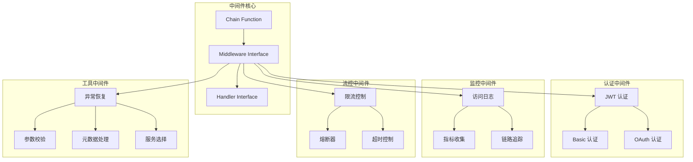
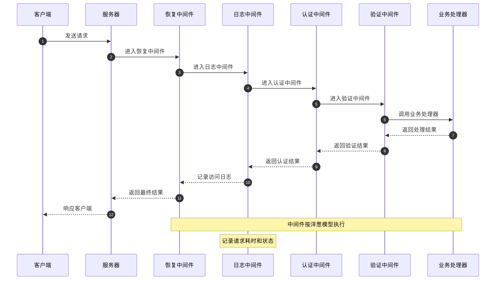
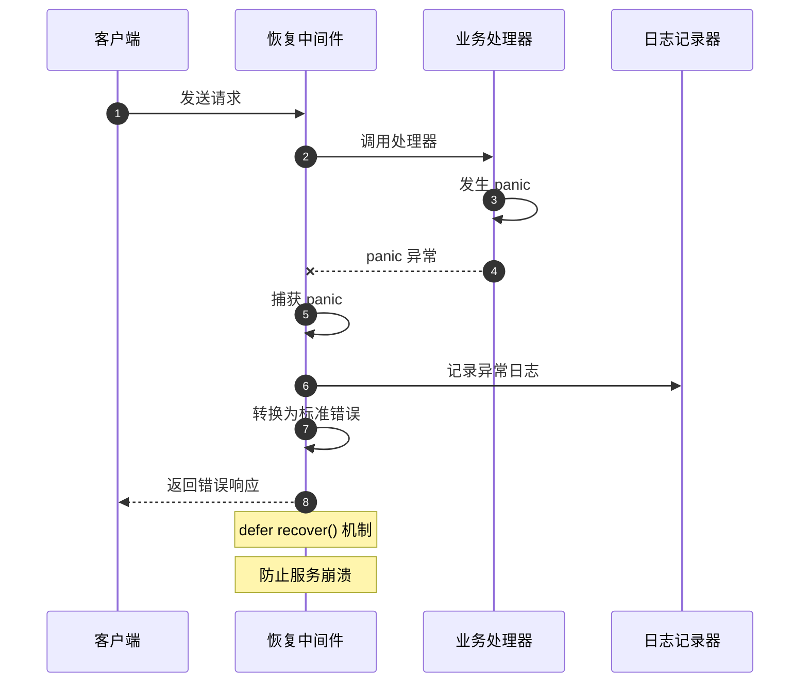

# Kratos-03-Middleware中间件系统

## 模块概览

Middleware 中间件系统是 Kratos 框架的核心横切关注点处理模块，提供了可插拔的中间件架构。通过中间件链模式，支持在请求处理的不同阶段插入自定义逻辑，实现诸如认证、日志、监控、限流等功能。

### 模块职责
- 提供统一的中间件抽象接口
- 实现中间件链式调用机制
- 提供核心中间件实现（认证、日志、监控等）
- 支持自定义中间件开发
- 提供中间件组合和排序能力
- 集成传输层上下文传递

### 核心特性
- 函数式中间件设计
- 支持异步和同步中间件
- 内置丰富的中间件组件
- 零依赖的核心设计
- 支持条件中间件执行
- 完整的错误处理机制

## 架构图



### 架构设计说明

**核心设计模式：**
- **装饰器模式**: 中间件通过装饰器模式包装 Handler
- **责任链模式**: 多个中间件组成处理链条
- **函数式设计**: 使用高阶函数实现中间件组合

**中间件分类：**
- **认证中间件**: 处理用户身份验证和授权
- **监控中间件**: 提供可观测性支持
- **流控中间件**: 实现流量控制和保护
- **工具中间件**: 提供辅助功能支持

## 数据结构UML图

```mermaid
classDiagram
    class Handler {
        <<interface>>
        func(ctx context.Context, req interface{}) (interface{}, error)
    }
    
    class Middleware {
        <<interface>>
        func(Handler) Handler
    }
    
    class Chain {
        <<function>>
        +Chain(ms ...Middleware) Middleware
    }
    
    class LoggingMiddleware {
        -logger log.Logger
        +Server(logger log.Logger) Middleware
        +Client(logger log.Logger) Middleware
    }
    
    class MetricsMiddleware {
        -counter *prometheus.CounterVec
        -histogram *prometheus.HistogramVec
        +Server(...Option) Middleware
        +Client(...Option) Middleware
    }
    
    class RecoveryMiddleware {
        -handler RecoveryHandlerFunc
        +Recovery(opts ...Option) Middleware
    }
    
    class TracingMiddleware {
        -tracer trace.Tracer
        +Server(opts ...Option) Middleware
        +Client(opts ...Option) Middleware
    }
    
    class ValidateMiddleware {
        -validator Validator
        +Validator() Middleware
    }
    
    class RateLimitMiddleware {
        -limiter ratelimit.Limiter
        +Server(limiter ratelimit.Limiter) Middleware
    }
    
    LoggingMiddleware ..|> Middleware
    MetricsMiddleware ..|> Middleware
    RecoveryMiddleware ..|> Middleware
    TracingMiddleware ..|> Middleware
    ValidateMiddleware ..|> Middleware
    RateLimitMiddleware ..|> Middleware
    
    Chain --> Middleware
    Middleware --> Handler
```

## API 文档

### 核心接口

#### Handler 接口

**类型定义：**
```go
type Handler func(ctx context.Context, req interface{}) (interface{}, error)
```

**功能说明：**
定义请求处理函数的标准接口，是中间件链的最终处理节点。

#### Middleware 接口

**类型定义：**
```go
type Middleware func(Handler) Handler
```

**功能说明：**
中间件接口，接收一个 Handler 并返回包装后的 Handler。

#### Chain 函数

**函数签名：**
```go
func Chain(ms ...Middleware) Middleware
```

**功能说明：**
将多个中间件组合成一个中间件链。

**核心代码：**
```go
func Chain(ms ...Middleware) Middleware {
    return func(handler Handler) Handler {
        for i := len(ms) - 1; i >= 0; i-- {
            handler = ms[i](handler)
        }
        return handler
    }
}
```

### 日志中间件

#### Server 函数

**函数签名：**
```go
func Server(logger log.Logger) Middleware
```

**功能说明：**
创建服务器端访问日志中间件。

**核心代码：**
```go
func Server(logger log.Logger) Middleware {
    return func(handler Handler) Handler {
        return func(ctx context.Context, req interface{}) (interface{}, error) {
            var (
                code      int32
                reason    string
                kind      string
                operation string
            )
            startTime := time.Now()
            
            if info, ok := transport.FromServerContext(ctx); ok {
                kind = info.Kind().String()
                operation = info.Operation()
            }
            
            reply, err := handler(ctx, req)
            if se := errors.FromError(err); se != nil {
                code = se.Code
                reason = se.Reason
            }
            
            level, stack := extractError(err)
            _ = log.WithContext(ctx, logger).Log(level,
                "kind", "server",
                "component", kind,
                "operation", operation,
                "args", extractArgs(req),
                "code", code,
                "reason", reason,
                "stack", stack,
                "latency", time.Since(startTime).Seconds(),
            )
            return reply, err
        }
    }
}
```

### 指标中间件

#### Server 函数

**函数签名：**
```go
func Server(opts ...Option) Middleware
```

**功能说明：**
创建服务器端指标收集中间件。

**核心代码：**
```go
func Server(opts ...Option) Middleware {
    options := &config{}
    for _, o := range opts {
        o(options)
    }
    
    return func(handler Handler) Handler {
        return func(ctx context.Context, req interface{}) (interface{}, error) {
            var (
                kind      string
                operation string
            )
            
            if info, ok := transport.FromServerContext(ctx); ok {
                kind = info.Kind().String()
                operation = info.Operation()
            }
            
            startTime := time.Now()
            reply, err := handler(ctx, req)
            
            // 记录请求计数
            options.requests.WithLabelValues(kind, operation, extractCode(err)).Inc()
            
            // 记录请求耗时
            options.seconds.WithLabelValues(kind, operation).Observe(time.Since(startTime).Seconds())
            
            return reply, err
        }
    }
}
```

### 恢复中间件

#### Recovery 函数

**函数签名：**
```go
func Recovery(opts ...Option) Middleware
```

**功能说明：**
创建异常恢复中间件，捕获 panic 并转换为错误。

**核心代码：**
```go
func Recovery(opts ...Option) Middleware {
    options := &config{
        handler: func(ctx context.Context, req, err interface{}) error {
            return errors.Internal("RECOVERY", fmt.Sprintf("panic triggered: %v", err))
        },
    }
    for _, o := range opts {
        o(options)
    }
    
    return func(handler Handler) Handler {
        return func(ctx context.Context, req interface{}) (reply interface{}, err error) {
            defer func() {
                if rerr := recover(); rerr != nil {
                    err = options.handler(ctx, req, rerr)
                }
            }()
            return handler(ctx, req)
        }
    }
}
```

### 验证中间件

#### Validator 函数

**函数签名：**
```go
func Validator() Middleware
```

**功能说明：**
创建参数验证中间件。

**核心代码：**
```go
func Validator() Middleware {
    return func(handler Handler) Handler {
        return func(ctx context.Context, req interface{}) (interface{}, error) {
            if v, ok := req.(interface {
                Validate() error
            }); ok {
                if err := v.Validate(); err != nil {
                    return nil, errors.BadRequest("VALIDATOR", err.Error())
                }
            }
            return handler(ctx, req)
        }
    }
}
```

### 限流中间件

#### Server 函数

**函数签名：**
```go
func Server(limiter ratelimit.Limiter) Middleware 
```

**功能说明：**
创建服务器端限流中间件。

**核心代码：**
```go
func Server(limiter ratelimit.Limiter) Middleware {
    return func(handler Handler) Handler {
        return func(ctx context.Context, req interface{}) (interface{}, error) {
            if limiter == nil {
                return handler(ctx, req)
            }
            if err := limiter.Allow(); err != nil {
                return nil, errors.TooManyRequests("RATE_LIMIT", "请求过于频繁")
            }
            return handler(ctx, req)
        }
    }
}
```

## 时序图

### 中间件链执行时序图



### 异常恢复时序图



## 调用链路分析

### 中间件链构建过程

1. **Chain() 函数调用**
   - 接收中间件列表：`[Recovery, Logging, Auth, Validate]`
   - 从右到左包装：`Recovery(Logging(Auth(Validate(Handler))))`
   - 返回最终的组合中间件

2. **请求处理流程**
   - **Recovery**: 最外层，捕获所有 panic
   - **Logging**: 记录请求开始时间，准备日志上下文
   - **Auth**: 验证用户身份，注入用户信息
   - **Validate**: 校验请求参数格式
   - **Handler**: 执行业务逻辑

3. **响应返回流程**
   - **Handler**: 返回业务结果或错误
   - **Validate**: 透传结果，可选响应验证
   - **Auth**: 透传结果，可选权限检查
   - **Logging**: 记录响应状态和耗时
   - **Recovery**: 确保没有 panic 泄露

### 错误传播机制

1. **业务错误处理**
   - 业务 Handler 返回标准错误
   - 中间件透传错误，添加上下文信息
   - 错误信息在日志中间件中记录
   - 最终转换为 HTTP/gRPC 响应

2. **panic 恢复处理**
   - Recovery 中间件捕获 panic
   - 转换为标准的 Internal 错误
   - 记录完整的调用栈信息
   - 返回通用错误响应给客户端

## 关键功能详细描述

### 中间件组合机制

**洋葱模型设计：**
中间件采用洋葱模型设计，每个中间件可以在请求前后执行逻辑：

```go
func ExampleMiddleware() Middleware {
    return func(handler Handler) Handler {
        return func(ctx context.Context, req interface{}) (interface{}, error) {
            // 请求前处理
            log.Info("before request")
            
            // 调用下层处理器
            reply, err := handler(ctx, req)
            
            // 请求后处理
            log.Info("after request")
            
            return reply, err
        }
    }
}
```

### 条件中间件执行

**基于路径的中间件匹配：**
```go
func PathMiddleware(path string, middleware Middleware) Middleware {
    return func(handler Handler) Handler {
        return func(ctx context.Context, req interface{}) (interface{}, error) {
            if tr, ok := transport.FromServerContext(ctx); ok {
                if strings.HasPrefix(tr.Operation(), path) {
                    return middleware(handler)(ctx, req)
                }
            }
            return handler(ctx, req)
        }
    }
}
```

### 异步中间件支持

**异步日志记录：**
```go
func AsyncLogging(logger log.Logger) Middleware {
    logChan := make(chan logEntry, 1000)
    
    // 异步日志处理协程
    go func() {
        for entry := range logChan {
            logger.Log(entry.level, entry.keyvals...)
        }
    }()
    
    return func(handler Handler) Handler {
        return func(ctx context.Context, req interface{}) (interface{}, error) {
            startTime := time.Now()
            reply, err := handler(ctx, req)
            
            // 异步发送日志
            select {
            case logChan <- logEntry{
                level: log.LevelInfo,
                keyvals: []interface{}{
                    "latency", time.Since(startTime),
                    "error", err,
                },
            }:
            default:
                // 缓冲区满时丢弃
            }
            
            return reply, err
        }
    }
}
```

### 中间件配置和选项

**选项模式配置：**
```go
type config struct {
    logger    log.Logger
    extractor func(context.Context) string
}

type Option func(*config)

func WithLogger(logger log.Logger) Option {
    return func(c *config) {
        c.logger = logger
    }
}

func WithExtractor(extractor func(context.Context) string) Option {
    return func(c *config) {
        c.extractor = extractor
    }
}
```

### 中间件性能优化

**零分配设计：**
- 避免在热路径上进行内存分配
- 使用对象池复用临时对象
- 延迟计算和惰性求值
- 条件执行减少不必要的处理

**缓存优化：**
- 中间件配置缓存
- 路径匹配结果缓存
- 认证结果缓存（带过期时间）

该中间件系统通过精心设计的架构和丰富的内置中间件，为 Kratos 应用提供了强大的横切关注点处理能力，是构建企业级应用的重要基础设施。
