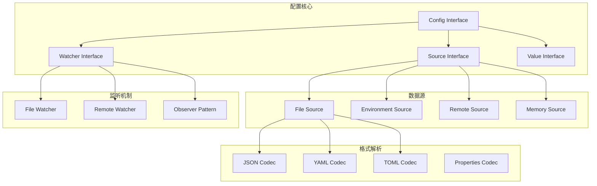
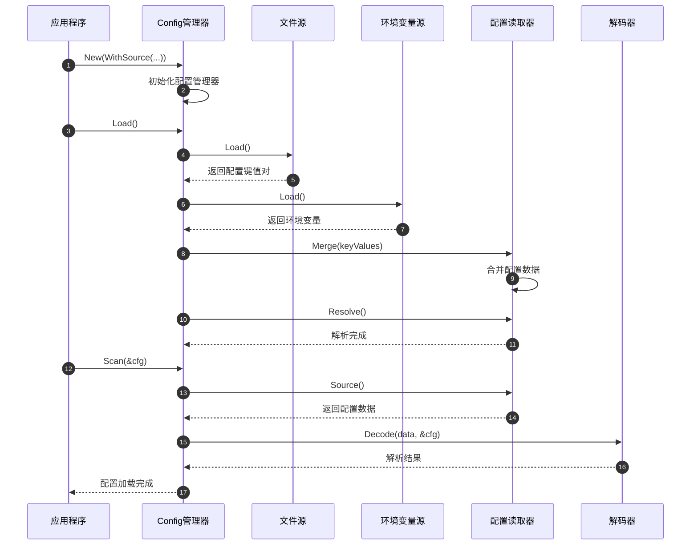
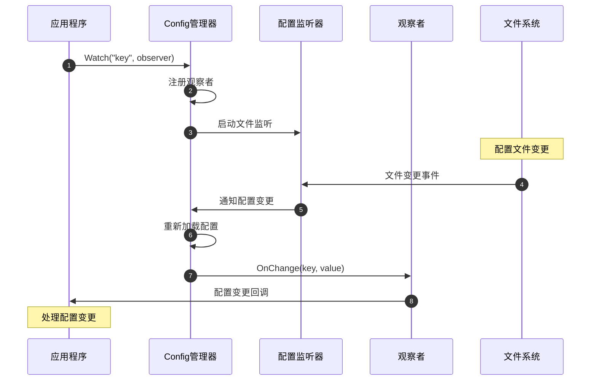

# Kratos-04-Config配置管理

## 模块概览

Config 配置管理模块是 Kratos 框架的核心基础设施之一，提供了多数据源、热重载、类型安全的配置管理能力。该模块支持从文件、环境变量、远程配置中心等多种数据源加载配置，并提供统一的访问接口。

### 模块职责
- 多数据源配置加载（文件、环境变量、远程等）
- 配置热重载和变更通知机制
- 类型安全的配置解析和验证
- 配置值的缓存和优化访问
- 支持配置的分层和覆盖
- 提供配置监听和回调机制

### 核心特性
- 多格式支持（JSON、YAML、TOML等）
- 原子配置更新操作
- 配置变更监听机制
- 默认值和验证支持
- 环境变量覆盖
- 配置源优先级管理

## 架构图



### 架构设计说明

**分层设计：**
- **接口层**: 定义配置管理的统一接口
- **数据源层**: 支持多种配置数据来源
- **解析层**: 支持多种配置文件格式
- **监听层**: 提供配置变更监听能力

**设计模式：**
- **策略模式**: 不同数据源使用不同的加载策略
- **观察者模式**: 配置变更通知机制
- **装饰器模式**: 配置源的组合和装饰

## 数据结构UML图

```mermaid
classDiagram
    class Config {
        <<interface>>
        +Load() error
        +Scan(v interface{}) error
        +Value(key string) Value
        +Watch(key string, o Observer) error
        +Close() error
    }
    
    class Source {
        <<interface>>
        +Load() ([]*KeyValue, error)
        +Watch() (Watcher, error)
    }
    
    class Watcher {
        <<interface>>
        +Next() ([]*KeyValue, error)
        +Stop() error
    }
    
    class Value {
        <<interface>>
        +Bool() (bool, error)
        +Int() (int64, error)
        +Float() (float64, error)
        +String() (string, error)
        +Duration() (time.Duration, error)
        +Slice() ([]Value, error)
        +Map() (map[string]Value, error)
        +Scan(val interface{}) error
    }
    
    class KeyValue {
        +Key string
        +Value []byte
        +Format string
    }
    
    class FileSource {
        -path string
        -watcher *fsnotify.Watcher
        +Load() ([]*KeyValue, error)
        +Watch() (Watcher, error)
    }
    
    class EnvSource {
        -prefix string
        +Load() ([]*KeyValue, error)
        +Watch() (Watcher, error)
    }
    
    class configImpl {
        -sources []Source
        -cached atomic.Value
        -watchers []Watcher
        -observers map[string][]Observer
        +Load() error
        +Scan(v interface{}) error
        +Value(key string) Value
        +Watch(key string, o Observer) error
    }
    
    Config <|.. configImpl
    Source <|.. FileSource
    Source <|.. EnvSource
    configImpl --> Source
    configImpl --> KeyValue
    Source --> KeyValue
    Source --> Watcher
```

## API 文档

### 核心接口

#### Config 接口

**接口定义：**
```go
type Config interface {
    Load() error
    Scan(v interface{}) error
    Value(key string) Value
    Watch(key string, o Observer) error
    Close() error
}
```

**功能说明：**
配置管理的核心接口，提供配置加载、解析、监听等功能。

#### New 函数

**函数签名：**
```go
func New(opts ...Option) Config
```

**功能说明：**
创建新的配置管理实例。

**核心代码：**
```go
func New(opts ...Option) Config {
    o := &options{
        decoder: defaultDecoder,
        logger:  log.DefaultLogger,
    }
    for _, opt := range opts {
        opt(o)
    }
    
    return &config{
        opts:      o,
        reader:    newReader(o),
        observers: make(map[string][]Observer),
    }
}
```

#### Load 方法

**函数签名：**
```go
func (c *config) Load() error
```

**功能说明：**
从所有配置源加载配置数据。

**核心代码：**
```go
func (c *config) Load() error {
    for _, src := range c.opts.sources {
        kvs, err := src.Load()
        if err != nil {
            return err
        }
        for _, kv := range kvs {
            c.reader.Merge(kv)
        }
    }
    return c.reader.Resolve()
}
```

#### Scan 方法

**函数签名：**
```go
func (c *config) Scan(v interface{}) error
```

**功能说明：**
将配置解析到指定的结构体中。

**核心代码：**
```go
func (c *config) Scan(v interface{}) error {
    data, err := c.reader.Source()
    if err != nil {
        return err
    }
    return c.opts.decoder(data, v)
}
```

#### Value 方法

**函数签名：**
```go
func (c *config) Value(key string) Value
```

**功能说明：**
获取指定键的配置值。

**核心代码：**
```go
func (c *config) Value(key string) Value {
    return c.reader.Value(key)
}
```

#### Watch 方法

**函数签名：**
```go
func (c *config) Watch(key string, o Observer) error
```

**功能说明：**
监听指定键的配置变更。

**核心代码：**
```go
func (c *config) Watch(key string, o Observer) error {
    c.lock.Lock()
    defer c.lock.Unlock()
    
    if _, ok := c.observers[key]; !ok {
        c.observers[key] = make([]Observer, 0, 1)
    }
    c.observers[key] = append(c.observers[key], o)
    return nil
}
```

### 配置源 API

#### WithSource 选项

**函数签名：**
```go
func WithSource(sources ...Source) Option
```

**功能说明：**
添加配置数据源。

#### File 函数

**函数签名：**
```go
func NewSource(path string) Source
```

**功能说明：**
创建文件配置源。

**核心代码：**
```go
func NewSource(path string) Source {
    return &file{
        path: path,
    }
}

func (f *file) Load() ([]*KeyValue, error) {
    data, err := ioutil.ReadFile(f.path)
    if err != nil {
        return nil, err
    }
    
    info, err := os.Stat(f.path)
    if err != nil {
        return nil, err
    }
    
    return []*KeyValue{
        {
            Key:    f.path,
            Value:  data,
            Format: format(info.Name()),
        },
    }, nil
}
```

#### Environment 函数

**函数签名：**
```go
func NewSource(prefix string) Source
```

**功能说明：**
创建环境变量配置源。

**核心代码：**
```go
func NewSource(prefix string) Source {
    return &env{
        prefix: prefix,
    }
}

func (e *env) Load() ([]*KeyValue, error) {
    envs := os.Environ()
    kvs := make([]*KeyValue, 0, len(envs))
    
    for _, env := range envs {
        if strings.HasPrefix(env, e.prefix) {
            kv := strings.SplitN(env, "=", 2)
            if len(kv) == 2 {
                key := strings.TrimPrefix(kv[0], e.prefix)
                kvs = append(kvs, &KeyValue{
                    Key:   key,
                    Value: []byte(kv[1]),
                })
            }
        }
    }
    return kvs, nil
}
```

## 时序图

### 配置加载时序图



### 配置监听时序图



## 调用链路分析

### 配置加载调用链

1. **New() 创建配置实例**
   - 初始化配置选项
   - 创建配置读取器
   - 初始化观察者映射

2. **Load() 加载配置**
   - 遍历所有配置源
   - 调用每个源的 Load() 方法
   - 将键值对合并到读取器中
   - 解析配置引用和变量

3. **Scan() 解析配置**
   - 从读取器获取原始配置数据
   - 使用解码器解析到目标结构体
   - 执行类型转换和验证

### 配置监听调用链

1. **Watch() 注册监听器**
   - 将观察者添加到对应键的列表中
   - 启动配置源的监听器（如果需要）

2. **配置变更处理**
   - 监听器检测到文件变更
   - 重新加载配置数据
   - 比较配置差异
   - 通知相关观察者

## 关键功能详细描述

### 多数据源支持

**配置源优先级：**
```go
// 配置源按顺序加载，后加载的会覆盖先加载的
config := config.New(
    config.WithSource(
        file.NewSource("default.yaml"),    // 默认配置
        file.NewSource("config.yaml"),     // 主配置文件  
        env.NewSource("APP_"),             // 环境变量覆盖
    ),
)
```

**配置合并策略：**
- 基础类型：后加载的值覆盖先加载的值
- 映射类型：递归合并，键级别覆盖
- 数组类型：完全替换

### 配置热重载机制

**文件监听实现：**
```go
func (f *file) Watch() (Watcher, error) {
    watcher, err := fsnotify.NewWatcher()
    if err != nil {
        return nil, err
    }
    
    if err := watcher.Add(f.path); err != nil {
        return nil, err
    }
    
    return &fileWatcher{
        watcher: watcher,
        file:    f,
    }, nil
}

func (w *fileWatcher) Next() ([]*KeyValue, error) {
    select {
    case event := <-w.watcher.Events:
        if event.Op&fsnotify.Write == fsnotify.Write {
            return w.file.Load()
        }
    case err := <-w.watcher.Errors:
        return nil, err
    }
    return nil, nil
}
```

### 类型安全的配置访问

**Value 接口实现：**
```go
type atomicValue struct {
    v atomic.Value
}

func (v *atomicValue) Bool() (bool, error) {
    val := v.v.Load()
    if val == nil {
        return false, ErrNotFound
    }
    return strconv.ParseBool(toString(val))
}

func (v *atomicValue) Duration() (time.Duration, error) {
    val := v.v.Load()
    if val == nil {
        return 0, ErrNotFound
    }
    return time.ParseDuration(toString(val))
}

func (v *atomicValue) Scan(obj interface{}) error {
    val := v.v.Load()
    if val == nil {
        return ErrNotFound
    }
    return json.Unmarshal(toBytes(val), obj)
}
```

### 配置验证机制

**结构体标签验证：**
```go
type ServerConfig struct {
    Host    string        `json:"host" validate:"required"`
    Port    int           `json:"port" validate:"min=1,max=65535"`
    Timeout time.Duration `json:"timeout" validate:"min=1s"`
}

func (c *config) Scan(v interface{}) error {
    if err := c.decoder(c.data, v); err != nil {
        return err
    }
    
    // 执行验证
    if validator, ok := v.(interface{ Validate() error }); ok {
        return validator.Validate()
    }
    
    return nil
}
```

### 配置缓存优化

**原子缓存实现：**
```go
type config struct {
    cached atomic.Value  // 缓存解析后的配置
    lock   sync.RWMutex
}

func (c *config) Value(key string) Value {
    data := c.cached.Load()
    if data == nil {
        return &errValue{err: ErrNotFound}
    }
    
    if val, ok := data.(map[string]interface{})[key]; ok {
        return &atomicValue{val}
    }
    return &errValue{err: ErrNotFound}
}
```

### 配置变更通知

**观察者模式实现：**
```go
func (c *config) notifyObservers(key string, value Value) {
    c.lock.RLock()
    observers := c.observers[key]
    c.lock.RUnlock()
    
    for _, observer := range observers {
        go func(o Observer) {
            defer func() {
                if r := recover(); r != nil {
                    log.Errorf("Observer panic: %v", r)
                }
            }()
            o.OnChange(key, value)
        }(observer)
    }
}
```

该配置管理模块通过灵活的架构设计和丰富的功能特性，为 Kratos 应用提供了强大的配置管理能力，支持复杂的企业级配置需求。
