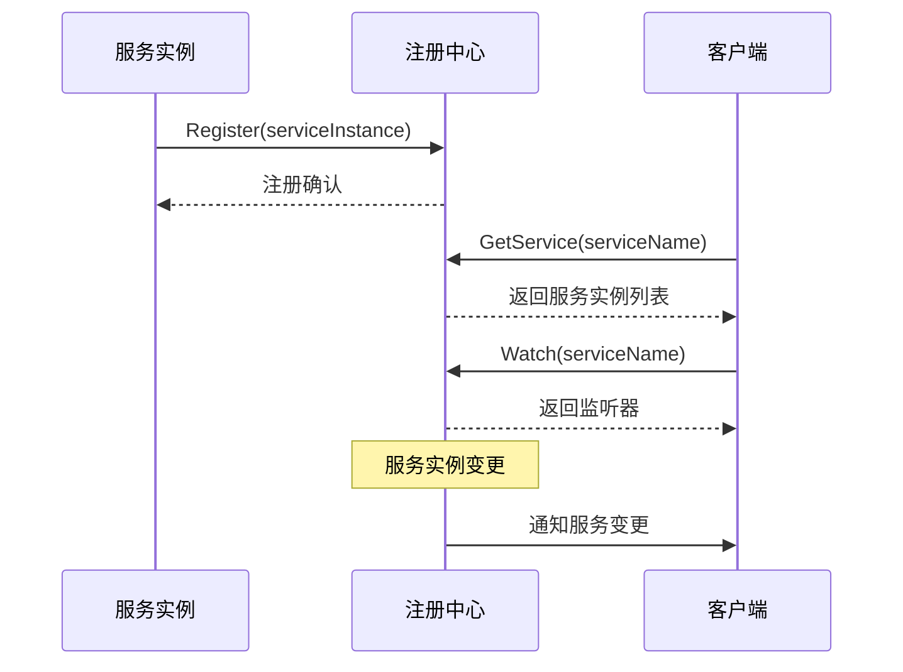
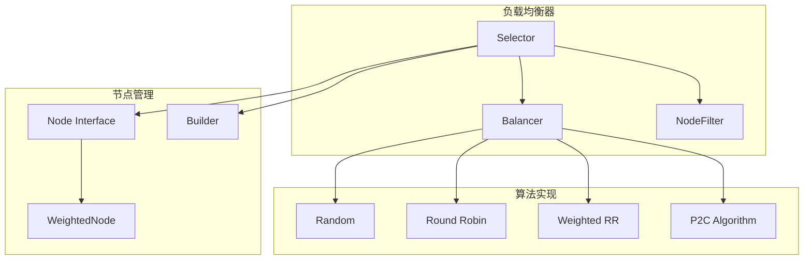
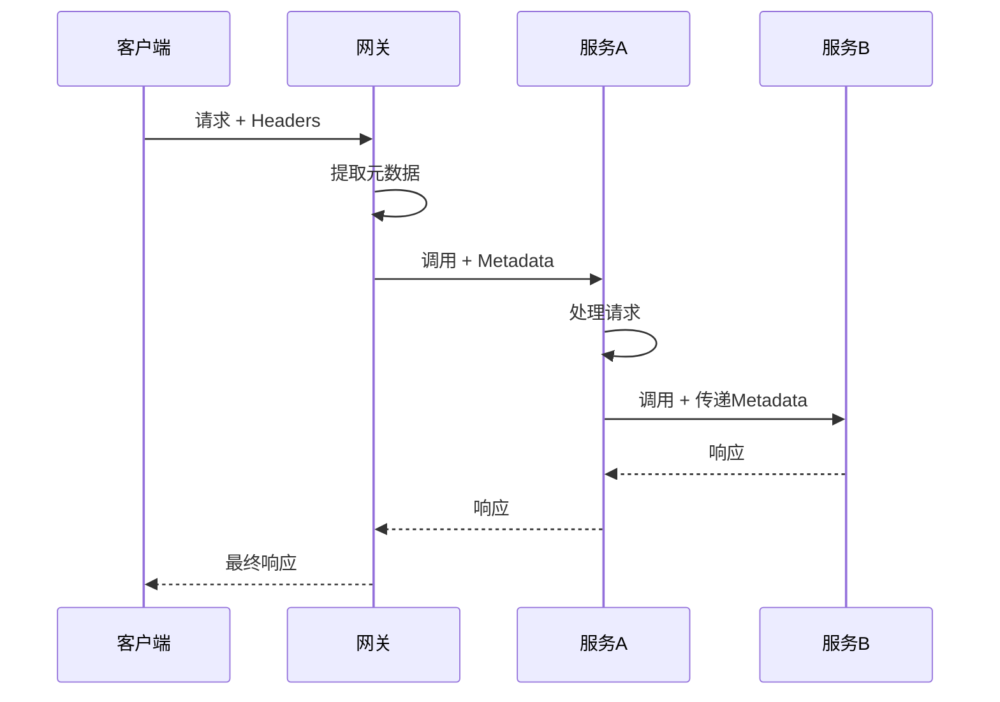
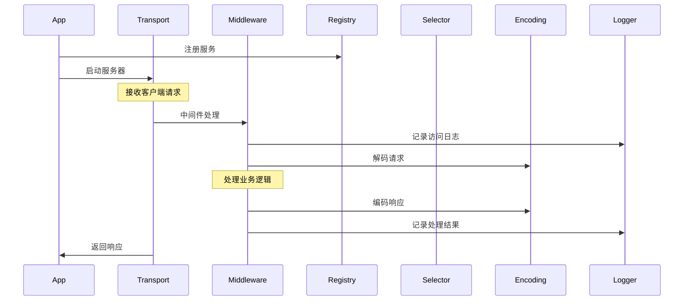

# Kratos-05-综合模块汇总

## Registry 服务注册发现模块

### 模块概览
Registry 模块提供服务注册与发现的抽象接口，支持多种注册中心实现（Consul、Etcd、Nacos等）。

### 核心接口
```go
type Registrar interface {
    Register(ctx context.Context, service *ServiceInstance) error
    Deregister(ctx context.Context, service *ServiceInstance) error
}

type Discovery interface {
    GetService(ctx context.Context, serviceName string) ([]*ServiceInstance, error)
    Watch(ctx context.Context, serviceName string) (Watcher, error)
}

type ServiceInstance struct {
    ID        string            
    Name      string            
    Version   string            
    Metadata  map[string]string 
    Endpoints []string          
}
```

### 关键功能
- **服务注册**: 将服务实例注册到注册中心
- **服务发现**: 从注册中心查询服务实例列表
- **健康检查**: 监控服务实例的健康状态
- **变更通知**: 监听服务实例的变更事件

### 时序图


## Selector 负载均衡模块

### 模块概览
Selector 模块实现客户端负载均衡，提供多种负载均衡算法和节点选择策略。

### 核心接口
```go
type Selector interface {
    Rebalancer
    
    Select(ctx context.Context, opts ...SelectOption) (selected Node, done DoneFunc, err error)
}

type Node interface {
    Scheme() string
    Address() string
    ServiceName() string
    InitialWeight() *int64
    Version() string
    Metadata() map[string]string
}

type Balancer interface {
    Pick(ctx context.Context, nodes []WeightedNode) (selected WeightedNode, err error)
}
```

### 负载均衡算法
- **随机算法**: 随机选择节点
- **轮询算法**: 按顺序轮询节点
- **加权轮询**: 根据权重进行轮询
- **P2C算法**: Power of Two Choices，选择负载最低的节点

### 架构图


## Encoding 编码解码模块

### 模块概览
Encoding 模块提供多种数据格式的编码解码能力，支持JSON、XML、YAML、Protobuf等格式。

### 核心接口
```go
type Codec interface {
    Marshal(v interface{}) ([]byte, error)
    Unmarshal(data []byte, v interface{}) error
    Name() string
}

// 注册编码器
func RegisterCodec(codec Codec)

// 获取编码器
func GetCodec(contentType string) Codec
```

### 支持格式
- **JSON**: 默认的JSON编码器
- **XML**: XML格式支持
- **YAML**: YAML格式支持
- **Protobuf**: Protocol Buffers支持
- **Form**: HTTP表单编码

### 自动协商机制
```go
func CodecForRequest(r *http.Request, name string) Codec {
    for _, accept := range r.Header["Accept"] {
        codec := GetCodec(httputil.ContentSubtype(accept))
        if codec != nil {
            return codec
        }
    }
    return GetCodec(name)
}
```

## Metadata 元数据管理模块

### 模块概览
Metadata 模块提供请求级别的元数据传递机制，支持跨服务的上下文传递。

### 核心接口
```go
type Metadata map[string][]string

func (m Metadata) Get(key string) string
func (m Metadata) Set(key string, value string)
func (m Metadata) Add(key string, value string)
func (m Metadata) Values(key string) []string
func (m Metadata) Clone() Metadata

// 上下文操作
func NewServerContext(ctx context.Context, md Metadata) context.Context
func FromServerContext(ctx context.Context) (Metadata, bool)
func NewClientContext(ctx context.Context, md Metadata) context.Context
func FromClientContext(ctx context.Context) (Metadata, bool)
```

### 使用场景
- **请求追踪**: 传递 trace ID 和 span ID
- **用户上下文**: 传递用户身份和权限信息
- **业务标识**: 传递业务相关的标识符
- **调试信息**: 传递调试和监控相关数据

### 时序图


## Errors 错误处理模块

### 模块概览
Errors 模块提供标准化的错误处理机制，支持错误码、错误原因、错误详情等信息。

### 核心结构
```go
type Error struct {
    Code     int32             
    Reason   string            
    Message  string            
    Metadata map[string]string 
    cause    error             
}

// 错误创建函数
func New(code int, reason, message string) *Error
func Newf(code int, reason, format string, args ...interface{}) *Error

// 预定义错误
func BadRequest(reason, message string) *Error
func Unauthorized(reason, message string) *Error
func Forbidden(reason, message string) *Error
func NotFound(reason, message string) *Error
func InternalServer(reason, message string) *Error
```

### 错误处理链
```go
func (e *Error) WithCause(cause error) *Error {
    err := Clone(e)
    err.cause = cause
    return err
}

func (e *Error) Is(err error) bool {
    if se := new(Error); errors.As(err, &se) {
        return se.Code == e.Code && se.Reason == e.Reason
    }
    return false
}
```

## Log 日志系统模块

### 模块概览
Log 模块提供结构化日志记录能力，支持多种日志级别和输出格式。

### 核心接口
```go
type Logger interface {
    Log(level Level, keyvals ...interface{}) error
}

type Level int8

const (
    LevelDebug Level = iota - 1
    LevelInfo
    LevelWarn
    LevelError
    LevelFatal
)

// 全局日志器
func SetLogger(logger Logger)
func GetLogger() Logger

// 便捷函数
func Debug(a ...interface{})
func Info(a ...interface{})
func Warn(a ...interface{})
func Error(a ...interface{})
```

### 功能特性
- **结构化日志**: 支持键值对格式的结构化输出
- **多级别支持**: Debug、Info、Warn、Error、Fatal
- **上下文日志**: 支持从上下文提取日志信息
- **日志过滤**: 支持基于级别和关键字的过滤
- **多输出支持**: 支持同时输出到多个目标

## 模块间协作关系

### 典型调用链路


### 核心设计模式总结

1. **接口抽象**: 所有模块都定义清晰的接口边界
2. **依赖注入**: 通过构造函数注入依赖组件
3. **中间件模式**: 使用装饰器模式实现横切关注点
4. **观察者模式**: 配置变更和服务发现使用观察者模式
5. **策略模式**: 负载均衡算法使用策略模式
6. **工厂模式**: 编码器注册和获取使用工厂模式

### 性能优化要点

1. **内存优化**: 使用对象池减少内存分配
2. **并发优化**: 读写锁和原子操作保证并发安全
3. **网络优化**: 连接池和多路复用提高网络效率
4. **缓存优化**: 配置缓存和服务发现缓存减少延迟

通过这些模块的有机组合，Kratos 框架构建了一个完整、高效、可扩展的微服务开发平台。
