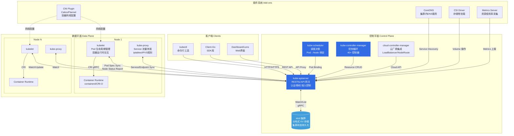
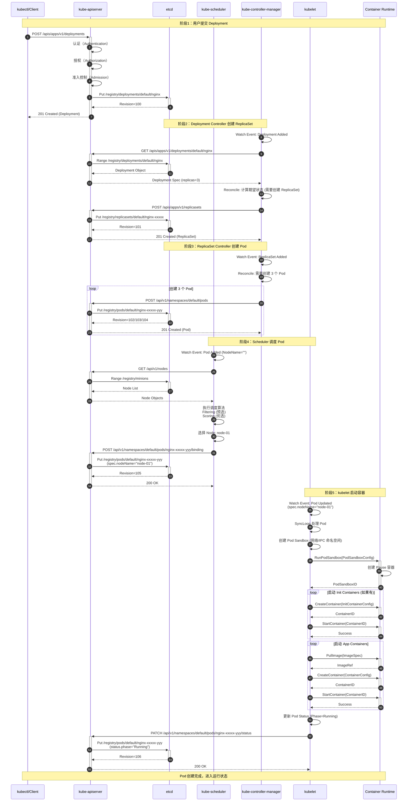
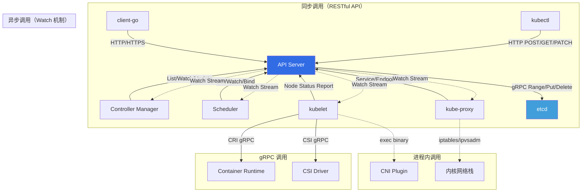

# Kubernetes-00-总览

## 0. 摘要

### 0.1 项目目标

Kubernetes 是一个用于自动化部署、扩展和管理容器化应用的开源平台。作为云原生生态的核心，Kubernetes 通过声明式API 和自动化控制循环，将容器编排的复杂性隐藏在简洁的抽象层之后,为用户提供了统一的容器集群管理能力。

**核心能力边界：**
- **资源编排**：Pod、Deployment、StatefulSet、DaemonSet 等工作负载的生命周期管理
- **服务发现与负载均衡**：Service、Endpoint、Ingress 的动态路由与流量分发
- **存储编排**：PersistentVolume、StorageClass 的自动化存储管理
- **配置管理**：ConfigMap、Secret 的集中配置与密钥管理
- **自动伸缩**：HPA、VPA、CA 等多维度扩缩容能力
- **自愈能力**：容器崩溃重启、节点故障转移、健康检查与自动修复

**非目标：**
- 不提供应用构建工具链（CI/CD 由外部集成）
- 不内置应用监控系统（依赖 Prometheus 等外部方案）
- 不限定底层容器运行时（通过 CRI 接口解耦）
- 不强制特定网络方案（通过 CNI 接口扩展）

### 0.2 运行环境与部署形态

**语言与运行时：**
- Go 1.22+（编译型语言，静态链接，无运行时依赖）
- 关键依赖：etcd 3.5+（集群状态持久化）、containerd/CRI-O（容器运行时）

**部署形态：**
- **控制平面（Control Plane）**：通常部署为 StaticPod 或系统服务，包含 kube-apiserver、kube-controller-manager、kube-scheduler、etcd
- **数据平面（Data Plane）**：每个节点运行 kubelet（节点代理）和 kube-proxy（网络代理）
- **插件系统（Add-ons）**：CoreDNS、CNI 插件、CSI 驱动、Metrics Server 等以 Pod 形式运行

**高可用架构：**
- API Server：无状态，可水平扩展（通过负载均衡器对外提供统一入口）
- etcd：多节点 Raft 集群（奇数节点，建议 3/5/7）
- Controller Manager 和 Scheduler：主备模式（通过 Leader Election 选主）

---

## 1. 整体架构图



### 1.1 架构要点说明

#### 1.1.1 组件职责与耦合关系

**控制平面组件：**

1. **kube-apiserver**（API 网关）
   - **职责**：集群唯一的数据入口，负责 RESTful API 服务、认证授权、数据校验、准入控制、版本转换
   - **耦合关系**：与 etcd 强耦合（唯一存储客户端），与其他组件通过 HTTP/gRPC 松耦合
   - **通信模式**：同步 RESTful API（客户端 CRUD）+ 异步 Watch 机制（事件推送）

2. **etcd**（分布式存储）
   - **职责**：集群状态的唯一真实来源（Single Source of Truth），通过 Raft 协议保证强一致性
   - **耦合关系**：仅与 API Server 通信，其他组件通过 API Server 间接访问
   - **通信模式**：gRPC（Range/Put/Delete/Watch 操作）

3. **kube-scheduler**（调度器）
   - **职责**：监听未调度 Pod，通过预选（Filtering）和优选（Scoring）算法选择最佳 Node，执行绑定操作
   - **耦合关系**：通过 API Server 读取 Pod/Node 信息，通过 Binding 子资源更新调度结果
   - **通信模式**：异步事件驱动（Watch PodQueue）+ 同步 API 调用（Binding）

4. **kube-controller-manager**（控制器管理器）
   - **职责**：运行 40+ 内置控制器（如 Deployment、ReplicaSet、StatefulSet、Service、Endpoint 等），实现声明式状态协调
   - **耦合关系**：所有控制器通过 SharedInformerFactory 复用 API Watch 连接，降低 API Server 压力
   - **通信模式**：List-Watch 机制（本地缓存 + 增量更新）+ 控制循环（Reconcile Loop）

**数据平面组件：**

5. **kubelet**（节点代理）
   - **职责**：Pod 生命周期管理、容器启停、健康检查、资源监控、Volume 挂载、镜像拉取
   - **耦合关系**：通过 CRI 与容器运行时解耦，通过 CNI/CSI 与网络/存储插件解耦
   - **通信模式**：定期同步循环（SyncLoop）+ gRPC 调用 CRI

6. **kube-proxy**（网络代理）
   - **职责**：维护 Service 到 Endpoint 的网络规则（iptables/IPVS/nftables），实现集群内负载均衡
   - **耦合关系**：独立于 kubelet 运行，通过 Watch Service/Endpoint 动态更新规则
   - **通信模式**：事件驱动（ServiceChangeTracker/EndpointsChangeTracker）

#### 1.1.2 数据流与控制流分界

**数据流（Data Plane）：**
- 业务流量在 Pod 之间直接传输，经过 CNI 配置的虚拟网络（Overlay 或 Underlay）
- kube-proxy 负责 Service ClusterIP 的流量拦截与转发，但不处理 Pod-to-Pod 直连流量
- Volume 数据通过 CSI Driver 直接挂载到 Pod，不经过控制平面

**控制流（Control Plane）：**
- 所有集群状态变更必须通过 API Server 提交到 etcd
- 控制器通过 Watch 机制监听资源变化，触发 Reconcile 逻辑
- 调度器的绑定决策、控制器的资源更新均为控制流操作

**跨进程/跨线程/跨协程路径：**
- **跨进程**：API Server ↔ etcd（gRPC）、kubelet ↔ CRI Runtime（gRPC）
- **跨 Goroutine**：Informer 的事件分发（SharedInformerFactory 的 EventHandler 并发调用）
- **跨节点**：Pod 跨节点迁移（控制器删除旧 Pod + 调度器绑定新 Node + kubelet 启动容器）

#### 1.1.3 高可用与状态管理

**高可用策略：**
- **API Server**：无状态，可水平扩展（通过 LB 做健康检查与故障转移）
- **etcd**：Raft 集群（Leader 处理写请求，Follower 处理读请求），允许少数节点故障（N/2 + 1 存活即可）
- **Controller Manager / Scheduler**：主备模式，通过 Lease 对象实现 Leader Election，仅主节点工作，备节点 Standby

**状态管理位置：**
- **持久化状态**：etcd 存储所有资源对象（序列化为 Protobuf）
- **内存缓存**：Informer 的 Indexer 缓存（减少 API Server 压力），kubelet 的 Pod Status Cache
- **临时状态**：容器运行时的容器状态（通过 CRI 查询）、kube-proxy 的规则同步状态（内核 iptables/IPVS 表）

**扩展性设计：**
- **水平扩展**：增加 API Server 实例（etcd 成为瓶颈时需扩容 etcd 集群）
- **垂直扩展**：增加 etcd 节点的 CPU/Memory（Watch 连接数多时）
- **分片策略**：大集群可按 Namespace 或 Node 分片（通过多集群联邦管理）

---

## 2. 全局时序图（主要业务闭环）

### 2.1 Pod 创建的完整生命周期



### 2.2 时序图要点说明

#### 2.2.1 入口与鉴权

1. **认证（Authentication）**
   - 支持多种认证方式：X.509 客户端证书、Bearer Token（ServiceAccount）、OpenID Connect、Webhook Token
   - 认证器链式调用，任一认证器通过即可（短路逻辑）
   - 认证通过后提取用户身份信息（User/Group）

2. **授权（Authorization）**
   - 默认采用 RBAC 模式（Role-Based Access Control）
   - 授权器链式调用：Node Authorizer（kubelet 专用）→ RBAC Authorizer → Webhook Authorizer
   - 检查用户是否有权限执行操作（如 `create pods`）

3. **准入控制（Admission Control）**
   - 变更准入（Mutating Admission）：自动注入 Sidecar、设置默认值、资源配额检查
   - 验证准入（Validating Admission）：策略检查（如 PodSecurityPolicy）、合规性校验
   - 准入 Webhook：动态策略扩展（如 OPA Gatekeeper）

#### 2.2.2 幂等性保证

- **Deployment/ReplicaSet/Pod 创建**：通过 `metadata.generateName` + Server-Side Generation 保证唯一性
- **Pod 调度绑定**：Binding 操作幂等（重复绑定同一 Node 不会报错）
- **Pod 状态更新**：使用 Optimistic Concurrency Control（通过 `resourceVersion` 检测冲突）

#### 2.2.3 失败重试与回退策略

- **API 请求失败**：Client 端指数退避重试（初始 1s，最大 32s）
- **Controller Reconcile 失败**：重新入队（RateLimiter 控制频率，最多 5min 间隔）
- **Scheduler 调度失败**：Pod 放入 UnschedulableQueue，定期重试（默认 60s）
- **kubelet Pod 同步失败**：下个 SyncLoop 周期重试（默认 1s）

#### 2.2.4 锁与版本控制

- **乐观并发控制（OCC）**：所有资源对象带 `resourceVersion`（etcd Revision），更新时检测冲突
- **悲观锁（Leader Election）**：Controller Manager 和 Scheduler 通过 Lease 对象实现主备切换
- **无锁设计**：Informer 的本地缓存为只读副本，多 Goroutine 并发访问无需加锁

#### 2.2.5 超时设定

- **API 请求超时**：kubectl 默认 30s，client-go 可配置
- **etcd 操作超时**：默认 5s（Range）/ 10s（Put/Delete）
- **Watch 超时**：API Server 每隔 5-10min 关闭长连接（客户端自动重连）
- **kubelet CRI 调用超时**：镜像拉取 5min、容器启动 2min、容器停止 30s

---

## 3. 模块边界与交互图

### 3.1 核心模块清单

| 模块名称 | 源码路径 | 对外 API | 调用方 | 被调方 |
|---------|---------|---------|--------|--------|
| **API Server** | `cmd/kube-apiserver`<br/>`pkg/controlplane` | RESTful API<br/>(所有 K8s 资源的 CRUD) | kubectl、client-go、所有组件 | etcd、Webhook |
| **Controller Manager** | `cmd/kube-controller-manager`<br/>`pkg/controller` | 无对外 API<br/>(消费 API Server 的 Watch) | - | API Server |
| **Scheduler** | `cmd/kube-scheduler`<br/>`pkg/scheduler` | 无对外 API<br/>(消费 API Server 的 Watch) | - | API Server |
| **kubelet** | `cmd/kubelet`<br/>`pkg/kubelet` | HTTP API<br/>(/pods, /stats, /logs, /exec) | API Server、kubectl (exec/logs) | CRI、CNI、CSI、API Server |
| **kube-proxy** | `cmd/kube-proxy`<br/>`pkg/proxy` | 无对外 API<br/>(消费 API Server 的 Watch) | - | API Server、iptables/IPVS |
| **Client-Go** | `staging/src/k8s.io/client-go` | Go SDK<br/>(Clientset、Informer、Workqueue) | 所有 Go 客户端 | API Server |
| **kubectl** | `cmd/kubectl`<br/>`staging/src/k8s.io/kubectl` | CLI 命令<br/>(apply、get、delete 等) | 用户 | API Server |

### 3.2 模块交互矩阵



### 3.3 交互说明

#### 3.3.1 同步调用

| 调用方 | 被调方 | 接口类型 | 错误语义 | 一致性要求 |
|-------|--------|---------|---------|-----------|
| kubectl | API Server | RESTful HTTP | 4xx（客户端错误）/ 5xx（服务端错误） | 强一致（直接读 etcd） |
| Controller | API Server | RESTful HTTP | 409 Conflict（版本冲突） | 最终一致（通过 Informer Cache） |
| Scheduler | API Server | RESTful HTTP + Binding API | 409 Conflict（Pod 已绑定） | 最终一致 |
| kubelet | API Server | RESTful HTTP | 网络重试（ExponentialBackoff） | 最终一致 |
| API Server | etcd | gRPC | CompactRevision、LeaseNotFound | 强一致（Raft） |
| kubelet | CRI | gRPC | 容器运行时错误（ImagePullBackOff） | 最终一致 |

#### 3.3.2 异步消息

| 发布方 | 订阅方 | 消息类型 | 传输方式 | 错误处理 |
|-------|--------|---------|---------|---------|
| API Server | Controller | ResourceVersion + Event Type | HTTP Chunked (Watch Stream) | 断线重连（Reflector） |
| API Server | Scheduler | Pod Add/Update/Delete | Watch Stream | 丢失事件触发 Full List |
| API Server | kubelet | Pod Spec 变更 | Watch Stream | kubelet 定期 Full List 兜底 |
| API Server | kube-proxy | Service/Endpoint 变更 | Watch Stream | ServiceChangeTracker 去重 |

#### 3.3.3 共享存储

- **etcd**：唯一的共享存储，所有集群状态均持久化于此
- **kubelet 本地磁盘**：容器镜像缓存、Pod 日志、Volume 挂载点（非共享）
- **分布式存储（如 Ceph）**：通过 CSI 插件挂载，多 Pod 共享（ReadWriteMany 模式）

#### 3.3.4 发布/订阅

- **EventRecorder**：组件通过 EventRecorder 发布事件到 API Server，用户通过 `kubectl get events` 查看
- **Informer 机制**：Controller 订阅感兴趣的资源变化（通过 SharedInformerFactory 复用 Watch 连接）
- **Webhook**：准入控制器订阅资源创建/更新事件（通过 MutatingWebhookConfiguration/ValidatingWebhookConfiguration）

---

## 4. 关键设计与权衡

### 4.1 数据一致性与事务边界

#### 4.1.1 一致性模型

**etcd 层（强一致）：**
- 所有写操作通过 Raft Leader 串行化，保证线性一致性（Linearizability）
- 读操作默认走 Leader（强一致读），可配置 Follower 读（牺牲一致性换取性能）

**API Server 层（最终一致）：**
- Watch 机制存在延迟（事件传播耗时 100ms-1s）
- Informer 本地缓存为快照（可能滞后于 etcd）
- List 操作默认从 etcd 读取（可配置从 API Server 缓存读取）

**Controller 层（最终一致）：**
- 基于 Reconcile Loop 不断纠正偏差，容忍短期不一致
- 通过 `resourceVersion` 检测冲突，失败重试保证最终收敛

#### 4.1.2 事务边界

**单资源原子性：**
- etcd 单个 Key 的 Put 操作原子（利用 Raft Log Entry）
- API Server 的 Create/Update/Delete 操作单资源原子

**跨资源事务（无原生支持）：**
- Kubernetes 不支持跨资源的 ACID 事务（etcd 支持有限的 Transaction，但 K8s 未使用）
- 多资源变更通过控制器 Reconcile Loop 最终一致（例如 Deployment → ReplicaSet → Pod 的级联创建）
- Finalizer 机制保证删除顺序（资源删除前执行清理逻辑）

**补偿机制：**
- OwnerReference：级联删除（删除父对象自动删除子对象）
- Finalizer：阻塞删除直到清理完成（如 PV 的数据卷解挂）
- Admission Webhook：拒绝不符合约束的变更（如配额超限）

### 4.2 并发控制与锁策略

#### 4.2.1 乐观并发控制（OCC）

- 所有资源对象包含 `metadata.resourceVersion`（对应 etcd Revision）
- 更新时携带旧版本号，etcd 通过 Compare-And-Swap（CAS）检测冲突
- 冲突时返回 409 Conflict，客户端重新 Get → Modify → Update

#### 4.2.2 Leader Election（主备切换）

- Controller Manager 和 Scheduler 通过 Lease 对象实现分布式锁
- 租约周期：15s（Leader 每 10s 续约，2.5s 后未续约则被抢占）
- 故障转移时间：~15s（旧 Leader 失联 + 新 Leader 选举）

#### 4.2.3 无锁设计

- **Informer 缓存**：只读数据结构（Delta FIFO + Indexer），多 Goroutine 并发访问无需加锁
- **API Server 请求处理**：无状态，每个请求独立处理，无共享变量
- **kubelet Pod Worker**：每个 Pod 独立 Goroutine，互不干扰

### 4.3 性能关键路径与可观测性

#### 4.3.1 性能热点

1. **API Server → etcd 延迟**
   - P50: 1-2ms，P99: 10-50ms（取决于网络和 etcd 集群负载）
   - 优化手段：etcd SSD 磁盘、减少 Watch 连接数、API Server 缓存（List 请求）

2. **Informer 缓存构建**
   - 启动时 Full List 耗时（大集群 10k+ Pod 需要 5-10s）
   - 优化手段：Informer Pagination（分页 List）、增量启动（先启动部分控制器）

3. **调度器延迟**
   - P50: 10-20ms，P99: 100-500ms（取决于 Node 数量和 Pod 约束复杂度）
   - 优化手段：调度器缓存预热、减少预选/优选插件、并行调度（多 Profile）

4. **kubelet Pod 启动时间**
   - 镜像拉取：1-5min（取决于镜像大小和网络带宽）
   - 容器启动：1-10s（取决于应用启动逻辑）
   - 优化手段：镜像预拉取、镜像分层缓存、Init Container 并行启动

#### 4.3.2 可观测性指标

**API Server 指标：**
```go
// 请求延迟（P50/P95/P99）
apiserver_request_duration_seconds{verb="GET|POST|PATCH|DELETE", resource="pods|nodes|services"}

// 请求 QPS
apiserver_request_total{code="200|400|500"}

// etcd 延迟
etcd_request_duration_seconds{operation="range|put|delete"}
```

**Controller Manager 指标：**
```go
// 控制循环延迟
workqueue_queue_duration_seconds{name="deployment|replicaset|pod"}

// 控制循环执行速率
controller_workqueue_adds_total

// 资源协调失败次数
controller_reconcile_errors_total
```

**Scheduler 指标：**
```go
// 调度延迟
scheduler_scheduling_duration_seconds

// 调度成功率
scheduler_schedule_attempts_total{result="scheduled|unschedulable|error"}

// 队列深度
scheduler_pending_pods
```

**kubelet 指标：**
```go
// Pod 启动时间
kubelet_pod_start_duration_seconds

// 容器重启次数
kubelet_containers_restarts_total

// CRI 调用延迟
kubelet_runtime_operations_duration_seconds{operation_type="create_container|start_container"}
```

### 4.4 配置项影响

| 配置项 | 组件 | 影响行为 | 默认值 | 建议值 |
|-------|------|---------|--------|--------|
| `--max-requests-inflight` | API Server | 并发请求数上限 | 400 | 大集群 1000+ |
| `--target-ram-mb` | API Server | Watch 缓存大小 | 100MB | 大集群 500MB+ |
| `--etcd-servers` | API Server | etcd 集群地址 | - | 高可用 3/5/7 节点 |
| `--kube-api-qps` | Controller Manager | API 请求 QPS 限制 | 20 | 大集群 50+ |
| `--kube-api-burst` | Controller Manager | API 请求突发限制 | 30 | 大集群 100+ |
| `--leader-elect-lease-duration` | Controller Manager / Scheduler | Leader 租约周期 | 15s | 网络不稳定 30s |
| `--percentageOfNodesToScore` | Scheduler | 预选节点百分比 | 50% | 小集群 100% |
| `--pod-max-in-unschedulable-pods-duration` | Scheduler | 不可调度 Pod 最大等待时间 | 5min | - |
| `--max-pods` | kubelet | 单节点 Pod 数上限 | 110 | 高密度 250+ |
| `--image-pull-progress-deadline` | kubelet | 镜像拉取超时 | 1min | 大镜像 5min |
| `--sync-frequency` | kubelet | Pod 同步周期 | 1min | - |
| `--iptables-min-sync-period` | kube-proxy | iptables 规则最小同步周期 | 0s（立即同步） | 高 QPS 1s |

---

## 5. 典型使用示例与最佳实践

### 5.1 最小可运行入口（单节点集群）

#### 5.1.1 使用 kubeadm 快速部署

```bash
# 1. 安装 kubeadm、kubelet、kubectl
sudo apt-get update
sudo apt-get install -y kubelet kubeadm kubectl
sudo systemctl enable kubelet

# 2. 初始化控制平面
sudo kubeadm init \
  --pod-network-cidr=10.244.0.0/16 \
  --service-cidr=10.96.0.0/12 \
  --apiserver-advertise-address=<NODE_IP>

# 3. 配置 kubectl
mkdir -p $HOME/.kube
sudo cp -i /etc/kubernetes/admin.conf $HOME/.kube/config
sudo chown $(id -u):$(id -g) $HOME/.kube/config

# 4. 安装 CNI 插件（以 Flannel 为例）
kubectl apply -f https://github.com/flannel-io/flannel/releases/latest/download/kube-flannel.yml

# 5. 验证集群状态
kubectl get nodes
kubectl get pods -A
```

#### 5.1.2 核心业务链路：创建 Nginx Deployment

```yaml
# nginx-deployment.yaml
apiVersion: apps/v1
kind: Deployment
metadata:
  name: nginx
  labels:
    app: nginx
spec:
  replicas: 3
  selector:
    matchLabels:
      app: nginx
  template:
    metadata:
      labels:
        app: nginx
    spec:
      containers:
      - name: nginx
        image: nginx:1.21
        ports:
        - containerPort: 80
        resources:
          requests:
            cpu: "100m"
            memory: "128Mi"
          limits:
            cpu: "200m"
            memory: "256Mi"
---
apiVersion: v1
kind: Service
metadata:
  name: nginx
spec:
  type: ClusterIP
  selector:
    app: nginx
  ports:
  - port: 80
    targetPort: 80
```

**执行流程：**
```bash
# 1. 创建资源
kubectl apply -f nginx-deployment.yaml

# 2. 观察创建过程
kubectl get deployments -w  # 查看 Deployment 状态
kubectl get replicasets -w  # 查看 ReplicaSet 状态
kubectl get pods -o wide -w  # 查看 Pod 调度与启动

# 3. 验证服务可用性
kubectl get svc nginx
kubectl run test-pod --image=busybox --rm -it --restart=Never -- wget -O- nginx
```

**端到端调用链路：**
1. kubectl 发送 POST 请求到 API Server（创建 Deployment）
2. Deployment Controller 监听到事件，创建 ReplicaSet
3. ReplicaSet Controller 创建 3 个 Pod（未调度状态）
4. Scheduler 为每个 Pod 选择 Node，更新 `spec.nodeName`
5. 目标节点的 kubelet 监听到 Pod，调用 CRI 启动容器
6. Endpoint Controller 发现 Pod Running，更新 Service 的 Endpoints
7. kube-proxy 监听到 Endpoints 变化，更新 iptables/IPVS 规则
8. 集群内任意 Pod 访问 `nginx:80` 即可负载均衡到 3 个 Pod

### 5.2 扩展点/插件接入的标准流程

#### 5.2.1 自定义调度器插件

**场景：**根据自定义标签（如 GPU 型号）过滤节点

```go
// 实现 FilterPlugin 接口
package custom

import (
    "context"
    "k8s.io/kubernetes/pkg/scheduler/framework"
)

type GPUFilter struct{}

func (g *GPUFilter) Name() string {
    return "GPUFilter"
}

// Filter 预选阶段过滤不符合条件的节点
func (g *GPUFilter) Filter(ctx context.Context, state *framework.CycleState, pod *v1.Pod, nodeInfo *framework.NodeInfo) *framework.Status {
    // 检查 Pod 是否需要 GPU
    requiredGPU, ok := pod.Labels["gpu-type"]
    if !ok {
        return nil // 不需要 GPU，跳过检查
    }
    
    // 检查 Node 是否有匹配的 GPU
    nodeGPU, ok := nodeInfo.Node().Labels["gpu-type"]
    if !ok || nodeGPU != requiredGPU {
        return framework.NewStatus(framework.Unschedulable, "GPU type mismatch")
    }
    
    return nil // 通过预选
}

// 注册插件
func New(ctx context.Context, obj runtime.Object, handle framework.Handle) (framework.Plugin, error) {
    return &GPUFilter{}, nil
}
```

**配置文件：**
```yaml
# scheduler-config.yaml
apiVersion: kubescheduler.config.k8s.io/v1
kind: KubeSchedulerConfiguration
profiles:
- schedulerName: custom-scheduler
  plugins:
    filter:
      enabled:
      - name: GPUFilter
    score:
      disabled:
      - name: NodeResourcesBalancedAllocation  # 禁用默认插件
```

**部署：**
```bash
# 1. 编译自定义调度器
go build -o custom-scheduler main.go

# 2. 以 Deployment 运行
kubectl create deployment custom-scheduler --image=my-repo/custom-scheduler:v1
kubectl set env deployment/custom-scheduler KUBECONFIG=/etc/kubernetes/scheduler.conf

# 3. Pod 指定调度器
kubectl run gpu-pod --image=gpu-app --overrides='{"spec":{"schedulerName":"custom-scheduler"}}'
```

#### 5.2.2 自定义 Admission Webhook

**场景：**自动注入 Sidecar 容器

```go
// 实现 MutatingWebhook
package webhook

import (
    admissionv1 "k8s.io/api/admission/v1"
    corev1 "k8s.io/api/core/v1"
    "encoding/json"
)

func MutatePod(ar *admissionv1.AdmissionReview) *admissionv1.AdmissionResponse {
    pod := corev1.Pod{}
    json.Unmarshal(ar.Request.Object.Raw, &pod)
    
    // 检查是否需要注入 Sidecar
    if pod.Annotations["inject-sidecar"] != "true" {
        return &admissionv1.AdmissionResponse{Allowed: true}
    }
    
    // 构造 Patch（JSON Patch 格式）
    patch := []map[string]interface{}{
        {
            "op": "add",
            "path": "/spec/containers/-",
            "value": map[string]interface{}{
                "name":  "sidecar",
                "image": "my-sidecar:v1",
                "ports": []map[string]interface{}{
                    {"containerPort": 8080},
                },
            },
        },
    }
    patchBytes, _ := json.Marshal(patch)
    
    return &admissionv1.AdmissionResponse{
        Allowed: true,
        Patch:   patchBytes,
        PatchType: func() *admissionv1.PatchType {
            pt := admissionv1.PatchTypeJSONPatch
            return &pt
        }(),
    }
}
```

**注册 Webhook：**
```yaml
# mutating-webhook.yaml
apiVersion: admissionregistration.k8s.io/v1
kind: MutatingWebhookConfiguration
metadata:
  name: sidecar-injector
webhooks:
- name: sidecar.example.com
  clientConfig:
    service:
      name: sidecar-injector
      namespace: default
      path: /mutate
    caBundle: <BASE64_ENCODED_CA_CERT>
  rules:
  - operations: ["CREATE"]
    apiGroups: [""]
    apiVersions: ["v1"]
    resources: ["pods"]
  admissionReviewVersions: ["v1"]
  sideEffects: None
```

### 5.3 规模化/上线注意事项清单

#### 5.3.1 集群容量规划

| 资源类型 | 小集群（< 100 Nodes） | 中型集群（100-500 Nodes） | 大型集群（500-5000 Nodes） |
|---------|---------------------|-------------------------|--------------------------|
| **API Server** | 2C4G × 2 实例 | 4C8G × 3 实例 | 8C16G × 5 实例 |
| **etcd** | 2C8G × 3 实例（SSD） | 4C16G × 5 实例（NVMe SSD） | 8C32G × 5 实例（高性能 NVMe） |
| **Controller Manager** | 2C4G × 2 实例 | 4C8G × 2 实例 | 8C16G × 2 实例 |
| **Scheduler** | 2C4G × 2 实例 | 4C8G × 2 实例 | 8C16G × 2 实例 |
| **Worker Node** | 4C16G（max-pods=110） | 8C32G（max-pods=150） | 16C64G（max-pods=250） |

#### 5.3.2 性能优化 Checklist

- [ ] **etcd 调优**
  - [ ] 使用 SSD 磁盘（I/O 延迟 < 1ms）
  - [ ] 独立部署 etcd（不与 API Server 共享节点）
  - [ ] 启用 etcd Defragmentation（定期清理空间碎片）
  - [ ] 监控 etcd 延迟（P99 < 50ms）

- [ ] **API Server 调优**
  - [ ] 增加并发限制（`--max-requests-inflight=1000`）
  - [ ] 启用 API Priority and Fairness（APF，限流保护）
  - [ ] 配置 Watch 缓存（`--target-ram-mb=500`）
  - [ ] 启用审计日志异步写入（避免阻塞请求）

- [ ] **Controller Manager 调优**
  - [ ] 增加 API QPS 限制（`--kube-api-qps=50 --kube-api-burst=100`）
  - [ ] 调整控制器并发度（如 `--concurrent-deployment-syncs=10`）
  - [ ] 启用控制器指标监控（Prometheus Scrape）

- [ ] **Scheduler 调优**
  - [ ] 减少预选节点比例（`--percentageOfNodesToScore=30`）
  - [ ] 启用调度缓存预热（减少 API 调用）
  - [ ] 多 Profile 并行调度（不同优先级 Pod 使用不同 Profile）

- [ ] **kubelet 调优**
  - [ ] 增加 Pod 数量限制（`--max-pods=250`）
  - [ ] 启用镜像垃圾回收（`--image-gc-high-threshold=85`）
  - [ ] 调整 Pod 并发同步数（`--max-parallel-image-pulls=5`）

- [ ] **kube-proxy 调优**
  - [ ] 使用 IPVS 模式（性能优于 iptables）
  - [ ] 增加最小同步周期（`--ipvs-min-sync-period=1s`）
  - [ ] 启用连接跟踪优化（`--conntrack-max-per-core=131072`）

#### 5.3.3 高可用部署 Checklist

- [ ] **控制平面高可用**
  - [ ] etcd 多节点集群（奇数节点，建议 5 节点）
  - [ ] API Server 多实例（通过 Load Balancer 统一入口）
  - [ ] Controller Manager 和 Scheduler 主备模式（自动故障转移）

- [ ] **数据备份**
  - [ ] etcd 定期快照备份（每小时 Snapshot）
  - [ ] API 对象定期导出（`kubectl get all --all-namespaces -o yaml`）
  - [ ] PV 数据备份（使用 Velero 等备份工具）

- [ ] **灾难恢复**
  - [ ] 演练 etcd 恢复流程（从快照恢复集群）
  - [ ] 演练控制平面故障转移（模拟 API Server 宕机）
  - [ ] 演练节点故障转移（模拟 Worker Node 宕机）

#### 5.3.4 安全加固 Checklist

- [ ] **认证与授权**
  - [ ] 禁用匿名访问（`--anonymous-auth=false`）
  - [ ] 启用 RBAC（默认启用）
  - [ ] 使用 ServiceAccount Token 自动轮转
  - [ ] 启用 Audit Logging（记录所有 API 操作）

- [ ] **网络安全**
  - [ ] 启用 NetworkPolicy（限制 Pod 间通信）
  - [ ] 使用 Ingress TLS 加密（HTTPS）
  - [ ] 启用 API Server TLS（etcd 和 kubelet 通信加密）

- [ ] **Pod 安全**
  - [ ] 启用 PodSecurityPolicy 或 Pod Security Admission（限制特权容器）
  - [ ] 强制使用非 root 用户运行容器
  - [ ] 启用 Seccomp/AppArmor（限制系统调用）

---

**文档维护：**
- 版本：v1.0
- 最后更新：2025-10-04
- 适用 Kubernetes 版本：v1.29+

