# Kubernetes-01-API Server-概览

## 模块职责

kube-apiserver 是 Kubernetes 集群的**API 网关**和**控制中心**，作为集群的唯一入口，承担以下核心职责：

### 核心职责

1. **RESTful API 服务**
   - 提供所有 Kubernetes 资源对象的 CRUD 操作接口（Pod、Service、Deployment 等）
   - 支持标准 HTTP 方法（GET/POST/PUT/PATCH/DELETE）和 Kubernetes 扩展动词（Watch/Proxy/Exec等）
   - 支持多版本 API（v1/v1beta1/v1alpha1）的并存与自动转换

2. **认证、授权与准入控制**
   - **认证（Authentication）**：验证请求者身份（X.509证书、Bearer Token、OpenID Connect等）
   - **授权（Authorization）**：检查用户权限（RBAC、Node Authorizer、Webhook等）
   - **准入控制（Admission Control）**：拦截并修改/验证请求（MutatingAdmissionWebhook/ValidatingAdmissionWebhook）

3. **数据持久化与一致性保证**
   - 作为 etcd 的唯一客户端，管理集群状态的读写
   - 提供乐观并发控制（通过 resourceVersion 实现 CAS）
   - 支持 Watch 机制实现增量数据同步（List-Watch 模式）

4. **API 聚合与扩展**
   - 支持 API Aggregation（通过 APIService 注册第三方 API Server）
   - 支持 CRD（CustomResourceDefinition）扩展资源类型
   - 支持 API 版本转换与兼容性保证

5. **集群协调与服务发现**
   - 提供集群内服务发现（通过 Kubernetes Service DNS）
   - 维护 API 资源的 OpenAPI/Swagger 文档
   - 提供 API 发现接口（/apis、/api、/openapi/v2）

### 输入/输出

**输入：**
- **HTTP/HTTPS 请求**：来自 kubectl、client-go、其他组件的 REST API 请求
- **Watch 连接**：长连接请求，用于实时订阅资源变化事件
- **Webhook 回调**：来自外部准入控制器的验证/变更响应

**输出：**
- **HTTP 响应**：JSON/YAML/Protobuf 格式的资源对象
- **Watch 事件流**：资源的 ADDED/MODIFIED/DELETED 事件（HTTP Chunked 或 WebSocket）
- **etcd 操作**：通过 gRPC 执行 Range/Put/Delete/Watch 操作
- **Audit 日志**：记录所有 API 操作的审计事件

### 上下游依赖

**上游（被调用方）：**
- etcd：持久化存储集群状态（gRPC 接口）
- Webhook Server：外部准入控制器、认证/授权 Webhook

**下游（调用方）：**
- kubectl：命令行工具
- client-go：Go SDK 客户端
- kube-controller-manager：所有控制器通过 Informer 订阅资源变化
- kube-scheduler：监听未调度 Pod，执行调度决策
- kubelet：上报节点状态、监听 Pod 变更
- kube-proxy：同步 Service/Endpoint 规则

### 生命周期

```go
// 启动流程（简化版）
func main() {
    // 1. 解析命令行参数和配置文件
    command := app.NewAPIServerCommand()
    
    // 2. 构建配置对象（CompletedOptions）
    opts := options.NewServerRunOptions()
    completedOptions := opts.Complete()
    
    // 3. 验证配置
    completedOptions.Validate()
    
    // 4. 创建三层 API Server（Aggregator → Core → API Extensions）
    config := app.NewConfig(completedOptions)
    serverChain := app.CreateServerChain(config)
    
    // 5. 启动 HTTP Server（监听 6443 端口）
    prepared := serverChain.PrepareRun()
    prepared.Run(context.Background())
}
```

**启动阶段：**
1. 初始化配置（解析参数、加载证书、连接 etcd）
2. 构建 API 路由表（注册所有资源的 REST Handler）
3. 启动 Informer（预热本地缓存）
4. 启动 HTTP Server（开始接受请求）

**运行阶段：**
- 持续处理 API 请求（并发处理多个 Goroutine）
- Watch 连接维持长连接（定期发送心跳）
- 定期执行后台任务（如 etcd 压缩、缓存清理）

**停止阶段：**
1. 收到 SIGTERM 信号
2. 停止接受新请求（关闭监听端口）
3. 等待现有请求处理完成（Graceful Shutdown，默认 60s）
4. 关闭 etcd 连接

---

## 模块级架构图

### 整体分层架构

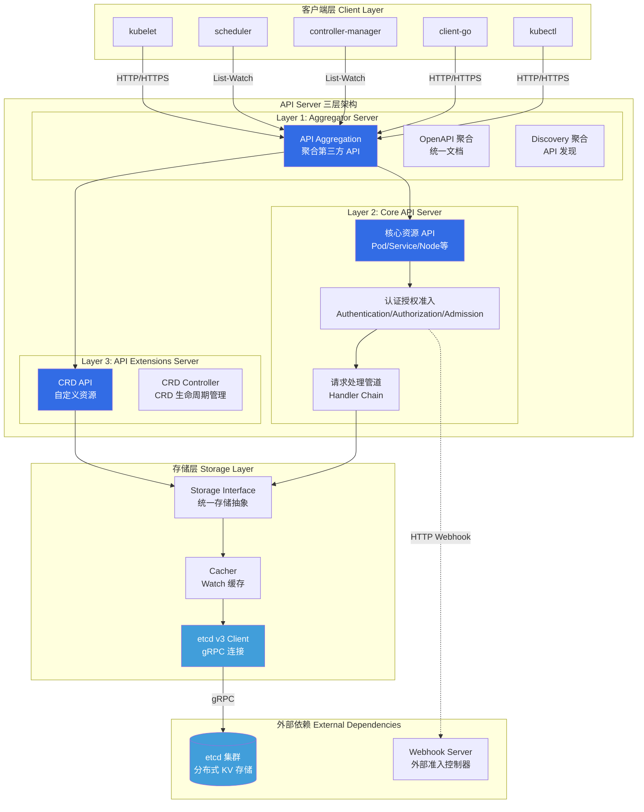

### 架构说明

#### 三层委托架构（Delegation Chain）

API Server 采用**三层委托模式**，按优先级依次处理请求：

**Layer 1: Aggregator Server（最外层）**
- **职责**：聚合多个 API Server（核心 API + 第三方 API + CRD API）
- **处理逻辑**：
  1. 检查请求路径（如 `/apis/metrics.k8s.io/v1beta1`）
  2. 根据 APIService 对象找到对应的后端 API Server
  3. 代理请求到目标 API Server（通过 HTTP Proxy）
  4. 聚合 OpenAPI 文档和 Discovery 信息
- **关键组件**：
  - `APIServiceRegistrationController`：监听 APIService 变化，动态更新路由表
  - `AvailableConditionController`：探测第三方 API Server 健康状态

**Layer 2: Core API Server（中间层）**
- **职责**：处理 Kubernetes 内置资源（Pod、Service、Deployment 等）
- **处理逻辑**：
  1. 执行认证（Authentication）：验证请求者身份
  2. 执行授权（Authorization）：检查操作权限
  3. 执行准入控制（Admission）：拦截并修改/验证请求
  4. 调用存储层（Storage Layer）：读写 etcd
  5. 返回响应（支持多种格式：JSON/YAML/Protobuf）
- **关键组件**：
  - `GenericAPIServer`：通用 HTTP Server，处理请求路由
  - `RESTStorage`：资源的增删改查接口实现
  - `AdmissionChain`：准入控制器链

**Layer 3: API Extensions Server（最内层）**
- **职责**：处理 CustomResourceDefinition（CRD）
- **处理逻辑**：
  1. 管理 CRD 的生命周期（创建、更新、删除）
  2. 动态注册 CR（Custom Resource）的 REST Handler
  3. 将 CRD 请求代理到 Core API Server 的存储层
- **关键组件**：
  - `CustomResourceDefinitionHandler`：CRD 资源的 CRUD 处理
  - `EstablishingController`：确保 CRD 的 Established 状态

#### 请求处理管道（Handler Chain）

API Server 的 HTTP 请求经过多层过滤器（Filter Chain）处理：

```mermaid
flowchart LR
    REQ[客户端请求] --> F1[WithRequestInfo<br/>解析请求元数据]
    F1 --> F2[WithAuthentication<br/>身份认证]
    F2 --> F3[WithAudit<br/>审计日志]
    F3 --> F4[WithImpersonation<br/>用户伪装]
    F4 --> F5[WithAuthorization<br/>权限检查]
    F5 --> F6[WithMaxInFlightLimit<br/>并发限制]
    F6 --> F7[WithRequestDeadline<br/>超时控制]
    F7 --> F8[WithPanicRecovery<br/>异常捕获]
    F8 --> H[Resource Handler<br/>资源处理器]
    H --> ADM[Admission Chain<br/>准入控制链]
    ADM --> ST[Storage Layer<br/>存储层]
    ST --> RES[返回响应]
    
    style F2 fill:#FF6B6B,color:#fff
    style F5 fill:#FF6B6B,color:#fff
    style ADM fill:#4ECDC4,color:#fff
    style ST fill:#45B7D1,color:#fff
```

**关键过滤器说明：**

1. **WithRequestInfo**：解析请求元数据
   - 提取 Namespace、Resource、Verb、Subresource 等信息
   - 存储到 Context 中供后续过滤器使用

2. **WithAuthentication**：身份认证
   - 调用认证器链（X.509、Bearer Token、OpenID Connect、Webhook）
   - 提取用户信息（User/Group/UID）

3. **WithAuthorization**：权限检查
   - 调用授权器链（RBAC、Node Authorizer、Webhook）
   - 检查用户是否有权限执行操作（如 `create pods`）

4. **WithAdmission**：准入控制
   - **Mutating Admission**：修改请求对象（如自动注入 Sidecar）
   - **Validating Admission**：验证请求对象（如策略检查）

5. **WithMaxInFlightLimit**：并发限制
   - 限制并发请求数（默认 400）
   - 防止 API Server 过载（优先保证 READ 请求）

#### 存储层架构

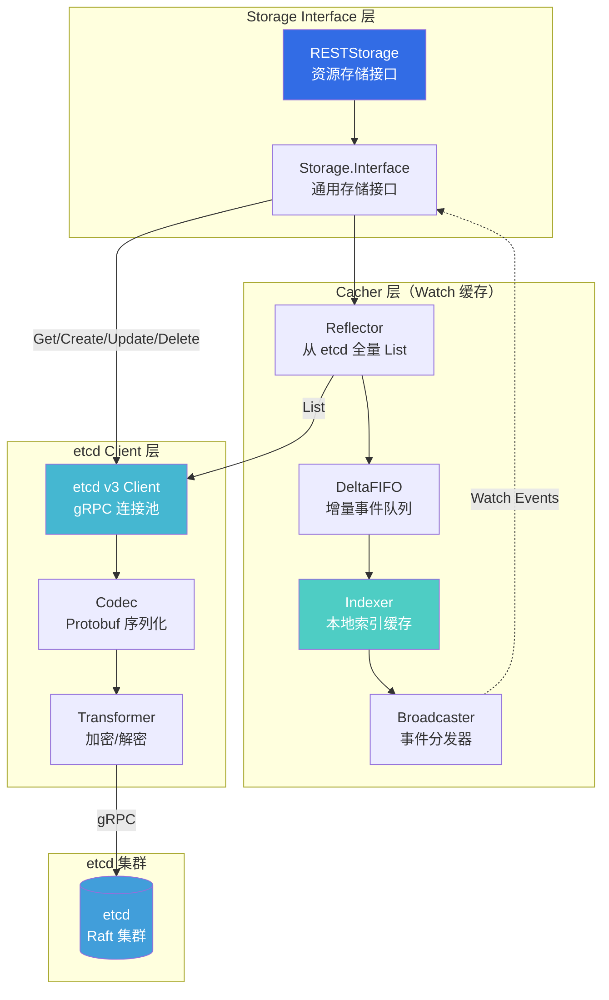

**Cacher（Watch 缓存）工作原理：**

1. **Reflector**：从 etcd 全量 List 资源，并持续 Watch 增量变化
2. **DeltaFIFO**：将事件转换为增量（Added/Updated/Deleted/Sync）
3. **Indexer**：维护本地内存缓存，支持多维度索引（如按 Namespace 查询）
4. **Broadcaster**：将事件分发给多个 Watch 客户端（避免重复 Watch etcd）

**存储层优化：**
- List 请求优先从 Cacher 读取（降低 etcd 压力）
- Watch 请求直接从 Cacher 订阅（无需每个客户端都 Watch etcd）
- etcd 数据加密（通过 Transformer 插件，如 AES-GCM）

---

## 边界条件与约束

### 并发与超时

**并发限制：**
- `--max-requests-inflight`：最大并发只读请求数（默认 400）
- `--max-mutating-requests-inflight`：最大并发变更请求数（默认 200）
- 超过限制时返回 429 Too Many Requests（客户端需指数退避重试）

**API Priority and Fairness（APF）：**
- 根据请求来源和类型分配优先级（如 system 组件高优先级）
- 使用令牌桶限流算法（避免突发流量压垮 API Server）

**超时控制：**
- 请求超时：默认 60s（可通过 `--request-timeout` 配置）
- Watch 超时：5-10min（API Server 定期关闭长连接，客户端自动重连）
- etcd 操作超时：
  - Range（Get/List）：5s
  - Put/Delete：10s
  - Watch：无超时（持续监听）

### 扩展点与插件

**认证插件：**
- X.509 客户端证书（`--client-ca-file`）
- Bearer Token（ServiceAccount Token、Bootstrap Token）
- OpenID Connect（`--oidc-issuer-url`）
- Webhook Token（`--authentication-token-webhook-config-file`）

**授权插件：**
- RBAC（Role-Based Access Control，默认启用）
- Node Authorizer（kubelet 专用授权器）
- Webhook Authorizer（`--authorization-webhook-config-file`）
- ABAC（Attribute-Based Access Control，已废弃）

**准入控制插件：**
- MutatingAdmissionWebhook（变更准入）
- ValidatingAdmissionWebhook（验证准入）
- PodSecurityPolicy / Pod Security Admission（Pod 安全策略）
- ResourceQuota（资源配额）
- LimitRanger（资源默认值与限制）
- ServiceAccount（自动注入 ServiceAccount Token）

### 状态持有位置

**API Server 无状态（Stateless）：**
- API Server 本身不存储业务数据，所有状态均在 etcd
- 多实例部署时无需数据同步（可随意扩缩容）

**本地缓存（Cacher）：**
- Watch 缓存（Reflector + Indexer）：提高 List 性能
- OpenAPI 文档缓存：避免每次请求重新生成
- 认证/授权缓存：短期缓存 Token 验证结果（TTL 10s）

**etcd 持久化：**
- 所有资源对象的当前状态（如 Pod Spec、Service Endpoints）
- 资源对象的历史版本（通过 resourceVersion 标识）
- 集群全局配置（如 ClusterRole、ClusterRoleBinding）

### 资源占用要点

**CPU：**
- 请求处理：并发请求数 × 单请求 CPU 耗时（平均 1-5ms）
- Watch 维持：每个 Watch 连接占用约 0.1-1m CPU（取决于事件频率）
- 准入控制：Webhook 调用延迟高时 CPU 占用显著增加

**内存：**
- Watch 缓存：每个资源类型约 10-100MB（取决于对象数量）
- 活跃 Watch 连接：每个连接约 1-10KB（缓冲区）
- HTTP 请求缓冲：默认最大 3MB（`--max-request-body-bytes`）

**网络：**
- etcd 连接：gRPC 双向流（持续 Watch + 间歇性 Range/Put）
- 客户端连接：HTTP/1.1 或 HTTP/2（支持连接复用）
- Webhook 调用：同步 HTTP 请求（阻塞主流程）

**磁盘：**
- 审计日志：高流量集群每天产生数 GB 日志（建议异步写入）
- 无持久化存储需求（状态全在 etcd）

---

## 扩展与边界

### 模块边界

**不负责的功能：**
- 业务逻辑实现（由控制器负责）
- Pod 调度决策（由 kube-scheduler 负责）
- 容器启停（由 kubelet 负责）
- 网络规则配置（由 kube-proxy 负责）

**对外接口边界：**
- 仅提供 RESTful API（不提供 gRPC 接口给外部客户端）
- 仅支持 Kubernetes 资源模型（不支持任意 JSON 数据存储）

### 扩展点

**API 扩展：**
- **CRD（CustomResourceDefinition）**：扩展资源类型（声明式）
- **API Aggregation（APIService）**：集成第三方 API Server（代理式）

**Webhook 扩展：**
- **Admission Webhook**：拦截资源创建/更新请求（同步调用）
- **Authentication Webhook**：自定义身份认证逻辑
- **Authorization Webhook**：自定义权限检查逻辑

**存储扩展：**
- **Storage Class**：动态存储卷供应
- **CSI（Container Storage Interface）**：存储驱动插件化

---

## 关键代码片段

### 启动流程核心代码

```go
// cmd/kube-apiserver/app/server.go

// Run 运行 API Server（主循环，永不退出）
func Run(ctx context.Context, opts options.CompletedOptions) error {
    // 1. 创建配置对象（包含 etcd 连接、认证/授权配置等）
    config, err := NewConfig(opts)
    if err != nil {
        return err
    }
    
    // 2. 完成配置（应用默认值、校验）
    completed, err := config.Complete()
    if err != nil {
        return err
    }
    
    // 3. 创建三层 API Server 链（Aggregator → Core → API Extensions）
    server, err := CreateServerChain(completed)
    if err != nil {
        return err
    }
    
    // 4. 准备运行（启动后台任务、预热缓存）
    prepared, err := server.PrepareRun()
    if err != nil {
        return err
    }
    
    // 5. 启动 HTTP Server（阻塞直到收到停止信号）
    return prepared.Run(ctx)
}
```

**关键步骤解释：**

1. **NewConfig**：构建配置对象
   - 解析命令行参数（如 `--etcd-servers`、`--secure-port`）
   - 加载证书文件（TLS 证书、CA 证书）
   - 创建 etcd 客户端连接池
   - 初始化认证/授权/准入控制插件

2. **CreateServerChain**：构建三层委托链
   - Layer 1: Aggregator Server（聚合第三方 API）
   - Layer 2: Core API Server（处理内置资源）
   - Layer 3: API Extensions Server（处理 CRD）

3. **PrepareRun**：启动前准备
   - 启动 Informer（预热本地缓存）
   - 注册 PostStartHook（如启动 Bootstrap Controller）
   - 注册健康检查端点（/healthz、/livez、/readyz）

4. **Run**：启动 HTTP Server
   - 监听端口（默认 6443）
   - 处理客户端请求（每个请求一个 Goroutine）
   - 等待停止信号（SIGTERM / SIGINT）

### 三层 API Server 构建

```go
// cmd/kube-apiserver/app/server.go

// CreateServerChain 创建 API Server 委托链
func CreateServerChain(config CompletedConfig) (*aggregatorapiserver.APIAggregator, error) {
    // 1. 创建 API Extensions Server（最内层，处理 CRD）
    notFoundHandler := notfoundhandler.New(config.KubeAPIs.ControlPlane.Generic.Serializer, 
                                          genericapifilters.NoMuxAndDiscoveryIncompleteKey)
    apiExtensionsServer, err := config.ApiExtensions.New(
        genericapiserver.NewEmptyDelegateWithCustomHandler(notFoundHandler))
    if err != nil {
        return nil, err
    }
    
    // 2. 创建 Core API Server（中间层，处理内置资源）
    kubeAPIServer, err := config.KubeAPIs.New("kube-apiserver", apiExtensionsServer.GenericAPIServer)
    if err != nil {
        return nil, err
    }
    
    // 3. 安装内置 API（Pod、Service、Deployment 等）
    if err := kubeAPIServer.InstallAPIs(config.KubeAPIs.ServiceResolver, 
                                        config.KubeAPIs.PluginInitializer, 
                                        config.KubeAPIs.Informers); err != nil {
        return nil, err
    }
    
    // 4. 创建 Aggregator Server（最外层，聚合多个 API Server）
    aggregatorServer, err := config.Aggregator.New("kube-aggregator", 
                                                   kubeAPIServer.GenericAPIServer)
    if err != nil {
        return nil, err
    }
    
    return aggregatorServer, nil
}
```

**委托链工作原理：**
- 请求先到达 Aggregator Server
- Aggregator 检查请求路径，判断是否为第三方 API（通过 APIService 注册）
- 如果不是第三方 API，委托给 Core API Server 处理
- Core API Server 检查是否为 CRD 资源，如是则委托给 API Extensions Server
- 最终由对应的 RESTStorage 处理资源操作

### 请求处理管道核心代码

```go
// pkg/controlplane/apiserver/server.go

// BuildHandlerChain 构建请求处理过滤器链
func BuildHandlerChain(apiHandler http.Handler, c *genericapiserver.Config) http.Handler {
    // 最内层：资源处理器（实际的 CRUD 逻辑）
    handler := apiHandler
    
    // 8. 异常捕获（防止 panic 导致进程崩溃）
    handler = genericfilters.WithPanicRecovery(handler, c.RequestInfoResolver)
    
    // 7. 请求超时控制（默认 60s）
    handler = genericfilters.WithTimeoutForNonLongRunningRequests(handler, c.LongRunningFunc)
    
    // 6. 并发限制（防止过载）
    handler = genericfilters.WithMaxInFlightLimit(handler, 
                                                  c.MaxRequestsInFlight, 
                                                  c.MaxMutatingRequestsInFlight)
    
    // 5. 授权检查（RBAC/Node/Webhook）
    handler = genericfilters.WithAuthorization(handler, c.Authorization.Authorizer)
    
    // 4. 用户伪装（Impersonation，允许管理员模拟其他用户）
    handler = genericfilters.WithImpersonation(handler, c.Authorization.Authorizer, c.Serializer)
    
    // 3. 审计日志（记录所有 API 操作）
    handler = genericfilters.WithAudit(handler, c.AuditBackend, c.AuditPolicyRuleEvaluator)
    
    // 2. 身份认证（X.509/Bearer Token/OIDC/Webhook）
    handler = genericfilters.WithAuthentication(handler, c.Authentication.Authenticator, 
                                                c.Authentication.Failed, 
                                                c.Authentication.APIAudiences)
    
    // 1. 解析请求元数据（Namespace/Resource/Verb/Subresource）
    handler = genericfilters.WithRequestInfo(handler, c.RequestInfoResolver)
    
    // 0. CORS/压缩/日志等通用过滤器
    handler = genericapifilters.WithCORS(handler, c.CorsAllowedOriginList)
    handler = genericfilters.WithCompression(handler)
    handler = genericfilters.WithHTTPLogging(handler)
    
    return handler
}
```

**过滤器执行顺序：**
- 请求从最外层过滤器（HTTP Logging）开始
- 依次经过认证、授权、准入控制
- 最终到达资源处理器（RESTStorage）
- 响应按相反顺序返回

### 存储层核心代码

```go
// pkg/registry/core/pod/storage/storage.go

// PodStorage 实现 Pod 资源的存储接口
type PodStorage struct {
    Pod         *REST                // Pod 主资源
    Binding     *BindingREST         // Pod 绑定子资源
    Eviction    *EvictionREST        // Pod 驱逐子资源
    Status      *StatusREST          // Pod 状态子资源
    Log         *rest.LogREST        // Pod 日志子资源
    Exec        *rest.ExecREST       // Pod Exec 子资源
    Attach      *rest.AttachREST     // Pod Attach 子资源
    PortForward *rest.PortForwardREST // Pod PortForward 子资源
}

// REST 实现 Pod 主资源的 CRUD 操作
type REST struct {
    *genericregistry.Store  // 继承通用存储实现
    proxyTransport http.RoundTripper
}

// Create 创建 Pod（实现 rest.Creater 接口）
func (r *REST) Create(ctx context.Context, obj runtime.Object, 
                      createValidation rest.ValidateObjectFunc, 
                      options *metav1.CreateOptions) (runtime.Object, error) {
    // 1. 类型断言（确保是 Pod 对象）
    pod := obj.(*api.Pod)
    
    // 2. 业务逻辑校验（如 Pod 名称合法性）
    if errs := validation.ValidatePodCreate(pod, r.validationOptions); len(errs) != 0 {
        return nil, errors.NewInvalid(api.Kind("Pod"), pod.Name, errs)
    }
    
    // 3. 调用通用存储层（写入 etcd）
    return r.Store.Create(ctx, pod, createValidation, options)
}

// Get 获取 Pod（实现 rest.Getter 接口）
func (r *REST) Get(ctx context.Context, name string, 
                   options *metav1.GetOptions) (runtime.Object, error) {
    // 直接调用通用存储层（从 etcd 或缓存读取）
    return r.Store.Get(ctx, name, options)
}
```

**RESTStorage 接口实现：**
- `rest.Creater`：Create 方法
- `rest.Getter`：Get 方法
- `rest.Updater`：Update 方法
- `rest.GracefulDeleter`：Delete 方法（支持 gracePeriod）
- `rest.Lister`：List 方法
- `rest.Watcher`：Watch 方法

### etcd 操作核心代码

```go
// vendor/k8s.io/apiserver/pkg/storage/etcd3/store.go

// store 实现 storage.Interface 接口
type store struct {
    client      *clientv3.Client     // etcd v3 客户端
    codec       runtime.Codec        // Protobuf 编解码器
    versioner   storage.Versioner    // resourceVersion 管理器
    transformer value.Transformer    // 加密/解密插件
    pathPrefix  string               // etcd key 前缀（如 /registry/pods/）
}

// Create 创建对象（写入 etcd）
func (s *store) Create(ctx context.Context, key string, obj runtime.Object, 
                      out runtime.Object, ttl uint64) error {
    // 1. 序列化对象（转换为 Protobuf）
    data, err := runtime.Encode(s.codec, obj)
    if err != nil {
        return err
    }
    
    // 2. 加密数据（如果配置了 Encryption Provider）
    transformedData, err := s.transformer.TransformToStorage(ctx, data, key)
    if err != nil {
        return err
    }
    
    // 3. 构造 etcd key（添加前缀，如 /registry/pods/default/nginx）
    fullKey := path.Join(s.pathPrefix, key)
    
    // 4. 执行 etcd Create 操作（Txn 事务，确保 key 不存在时才创建）
    txnResp, err := s.client.Txn(ctx).
        If(clientv3.Compare(clientv3.Version(fullKey), "=", 0)). // key 不存在
        Then(clientv3.OpPut(fullKey, string(transformedData))).   // 创建
        Commit()
    if err != nil {
        return err
    }
    if !txnResp.Succeeded {
        return storage.NewKeyExistsError(fullKey, 0)  // key 已存在
    }
    
    // 5. 更新 resourceVersion（从 etcd Revision 提取）
    if out != nil {
        return decode(s.codec, s.versioner, transformedData, out, txnResp.Header.Revision)
    }
    return nil
}

// Get 获取对象（从 etcd 读取）
func (s *store) Get(ctx context.Context, key string, opts storage.GetOptions, 
                   out runtime.Object) error {
    // 1. 构造 etcd key
    fullKey := path.Join(s.pathPrefix, key)
    
    // 2. 执行 etcd Get 操作
    getResp, err := s.client.Get(ctx, fullKey)
    if err != nil {
        return err
    }
    if len(getResp.Kvs) == 0 {
        return storage.NewKeyNotFoundError(fullKey, 0)
    }
    kv := getResp.Kvs[0]
    
    // 3. 解密数据
    data, err := s.transformer.TransformFromStorage(ctx, kv.Value, fullKey)
    if err != nil {
        return err
    }
    
    // 4. 反序列化对象（Protobuf 转换为 Go 对象）
    return decode(s.codec, s.versioner, data, out, kv.ModRevision)
}
```

**etcd key 路径规则：**
- `/registry/{resource}/{namespace}/{name}`：命名空间级资源（如 Pod）
- `/registry/{resource}/{name}`：集群级资源（如 Node）
- 示例：`/registry/pods/default/nginx-6d4cf56db6-abcde`

---

**文档维护：**
- 版本：v1.0
- 最后更新：2025-10-04
- 适用 Kubernetes 版本：v1.29+

---

# Kubernetes-01-API Server-时序图

## 典型场景时序图

本文档展示 API Server 在不同场景下的完整时序图，帮助理解 API 请求的端到端流程。

---

## 场景 1：Pod 创建的完整生命周期

### 1.1 时序图

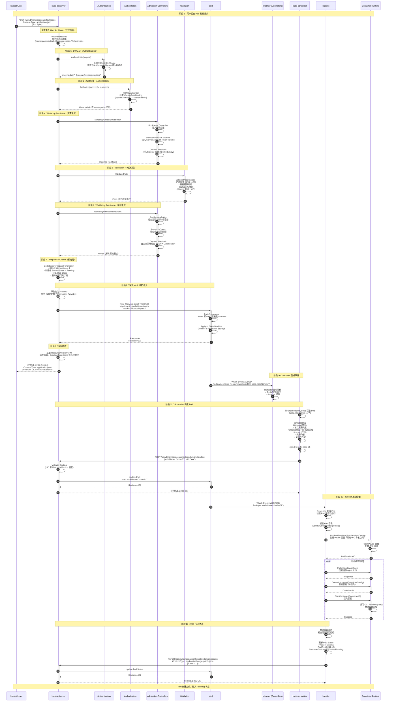

### 1.2 关键路径说明

#### 阶段 1-2：用户请求与身份认证

**请求格式：**
```http
POST /api/v1/namespaces/default/pods HTTP/1.1
Host: kube-apiserver:6443
Content-Type: application/json
Authorization: Bearer <token>
User-Agent: kubectl/v1.29.0

{
  "apiVersion": "v1",
  "kind": "Pod",
  "metadata": {"name": "nginx"},
  "spec": {"containers": [...]}
}
```

**认证方式：**
1. **X.509 客户端证书**：从 TLS 握手中提取证书，CN 字段作为用户名
2. **Bearer Token**：ServiceAccount Token（JWT），验证签名和有效期
3. **OpenID Connect**：从 ID Token 中提取用户信息
4. **Webhook Token**：调用外部 Webhook 验证 Token

#### 阶段 3：权限检查（RBAC）

**RBAC 检查逻辑：**
```go
// 检查用户是否有 create pods 权限
subject := &rbacv1.Subject{
    Kind:      "User",
    Name:      "admin",
    Namespace: "default",
}
resource := &rbacv1.ResourceAttributes{
    Namespace: "default",
    Verb:      "create",
    Group:     "",
    Resource:  "pods",
}

// 遍历所有 ClusterRoleBinding 和 RoleBinding
for _, binding := range bindings {
    if binding.Subjects.Contains(subject) {
        role := getRoleByRef(binding.RoleRef)
        if role.Rules.Allows(resource) {
            return ALLOW
        }
    }
}
return DENY
```

#### 阶段 4-6：准入控制（Admission）

**Mutating Admission（变更准入）：**
- **PodPreset**：注入环境变量、Volume、VolumeMount
- **ServiceAccount**：自动注入 ServiceAccount Token Volume
- **Sidecar Injector**：注入 Sidecar 容器（如 Istio Envoy）

**Validating Admission（验证准入）：**
- **PodSecurityPolicy**：检查是否允许特权容器、hostNetwork 等
- **ResourceQuota**：检查命名空间的资源配额（Pod 数量、CPU、内存）
- **LimitRanger**：检查资源请求与限制是否在允许范围内

#### 阶段 7-9：持久化到 etcd

**etcd 事务（Txn）：**
```go
// 确保 key 不存在时才创建（防止重复创建）
txn := etcdClient.Txn(ctx).
    If(clientv3.Compare(clientv3.Version(key), "=", 0)).  // key 不存在
    Then(clientv3.OpPut(key, value)).                     // 创建
    Else(clientv3.OpGet(key))                             // 返回已存在的对象

resp, err := txn.Commit()
if !resp.Succeeded {
    return errors.NewAlreadyExists("Pod", "nginx")
}
```

**Raft Consensus（Raft 共识）：**
1. Leader 接收写请求
2. Leader 写 Log Entry（未提交）
3. Leader 复制 Log 到 Follower
4. 大多数节点确认后（N/2 + 1），Leader 提交 Log
5. Leader 应用 Log 到状态机（持久化到磁盘）

#### 阶段 10-11：调度器选择节点

**调度算法：**
1. **Filtering（预选）**：过滤不符合条件的节点
   - `PodFitsResources`：节点资源充足（CPU、内存）
   - `PodFitsHostPorts`：节点端口不冲突
   - `PodMatchNodeSelector`：节点标签匹配 Pod 的 nodeSelector
   - `PodToleratesNodeTaints`：Pod 容忍节点的污点

2. **Scoring（优选）**：对通过预选的节点打分
   - `NodeResourcesBalancedAllocation`：资源均衡分配（CPU 和内存使用率接近）
   - `NodeAffinity`：节点亲和性匹配度
   - `InterPodAffinity`：Pod 间亲和性匹配度

3. **Binding（绑定）**：更新 Pod 的 `spec.nodeName` 字段

#### 阶段 12-13：kubelet 启动容器

**CRI（Container Runtime Interface）调用：**
```go
// 1. 创建 Pod Sandbox（Pause 容器，提供网络和 IPC 命名空间）
sandboxID, err := runtimeClient.RunPodSandbox(ctx, &runtimeapi.RunPodSandboxRequest{
    Config: &runtimeapi.PodSandboxConfig{
        Metadata: &runtimeapi.PodSandboxMetadata{
            Name:      "nginx",
            Namespace: "default",
            Uid:       "a8f9c3e5-4d2b-4e3f-9a1c-8d7e6f5a4b3c",
        },
        Hostname: "nginx",
        LogDirectory: "/var/log/pods/default_nginx_xxx/",
    },
})

// 2. 拉取镜像
imageRef, err := imageClient.PullImage(ctx, &runtimeapi.PullImageRequest{
    Image: &runtimeapi.ImageSpec{
        Image: "nginx:1.21",
    },
})

// 3. 创建容器
containerID, err := runtimeClient.CreateContainer(ctx, &runtimeapi.CreateContainerRequest{
    PodSandboxId: sandboxID,
    Config: &runtimeapi.ContainerConfig{
        Metadata: &runtimeapi.ContainerMetadata{
            Name: "nginx",
        },
        Image: &runtimeapi.ImageSpec{
            Image: "nginx:1.21",
        },
        Command: []string{"/usr/sbin/nginx"},
        Mounts: [...],
    },
    SandboxConfig: {...},
})

// 4. 启动容器
err = runtimeClient.StartContainer(ctx, &runtimeapi.StartContainerRequest{
    ContainerId: containerID,
})
```

---

## 场景 2：Pod 更新（Patch 操作）

### 2.1 时序图

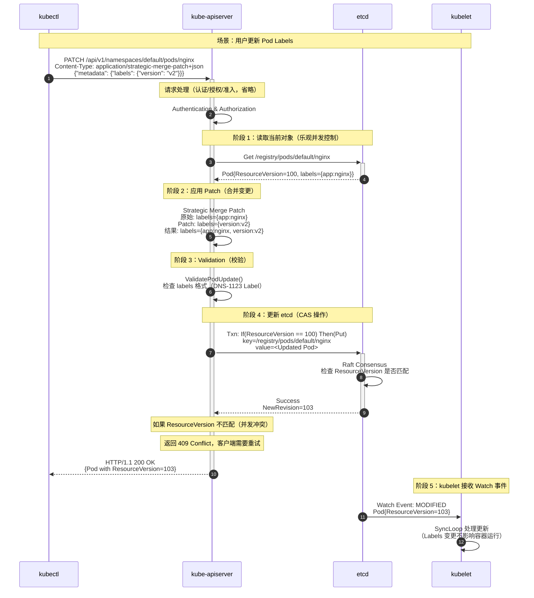

### 2.2 Patch 类型对比

| Patch 类型 | Content-Type | 合并策略 | 使用场景 |
|-----------|--------------|---------|---------|
| **JSON Patch** | `application/json-patch+json` | 按操作序列应用（add/remove/replace） | 精确控制单个字段变更 |
| **Merge Patch** | `application/merge-patch+json` | 递归合并（null 表示删除） | 简单字段更新 |
| **Strategic Merge Patch** | `application/strategic-merge-patch+json` | 根据字段标签智能合并（如数组按 name 合并） | Kubernetes 推荐（支持数组合并） |

**示例：**

**JSON Patch:**
```json
[
  {"op": "add", "path": "/metadata/labels/version", "value": "v2"},
  {"op": "remove", "path": "/metadata/labels/old-label"}
]
```

**Merge Patch:**
```json
{
  "metadata": {
    "labels": {
      "version": "v2",
      "old-label": null
    }
  }
}
```

**Strategic Merge Patch:**
```json
{
  "metadata": {
    "labels": {
      "version": "v2"
    }
  }
}
```

---

## 场景 3：Watch 机制（长连接）

### 3.1 时序图

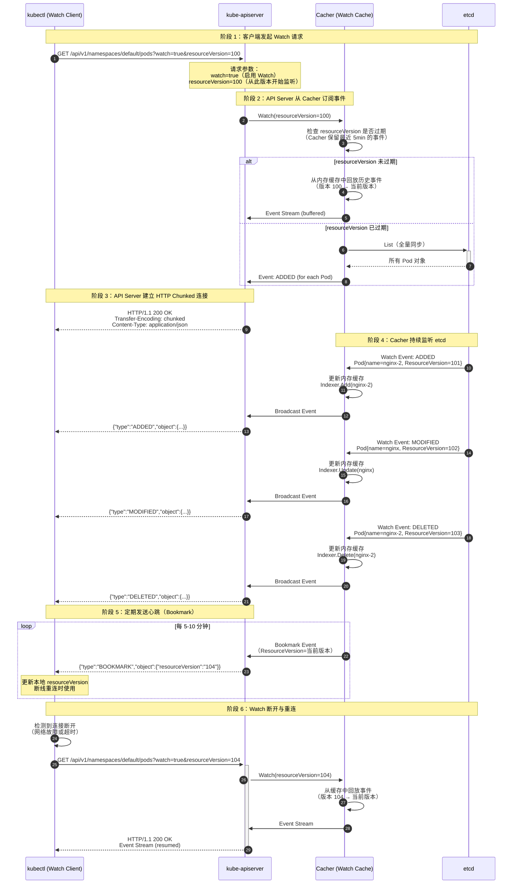

### 3.2 Watch 关键机制说明

#### Bookmark 事件

**作用：**
- 定期更新客户端的 `resourceVersion`（即使没有资源变化）
- 客户端断线重连时，从最新的 `resourceVersion` 开始 Watch（避免回放大量历史事件）

**示例：**
```json
{
  "type": "BOOKMARK",
  "object": {
    "apiVersion": "v1",
    "kind": "Pod",
    "metadata": {
      "resourceVersion": "12345"
    }
  }
}
```

#### resourceVersion 过期处理

- **Cacher 保留时间**：默认 5 分钟（可通过 `--watch-cache-sizes` 配置）
- **过期后行为**：返回 `410 Gone` 错误，客户端需要全量 List 后重新 Watch

```http
HTTP/1.1 410 Gone
Content-Type: application/json

{
  "kind": "Status",
  "apiVersion": "v1",
  "status": "Failure",
  "message": "too old resource version: 100 (current: 12345)",
  "reason": "Expired",
  "code": 410
}
```

#### Watch 性能优化

- **Cacher（Watch 缓存）**：避免每个客户端都直接 Watch etcd（降低 etcd 压力）
- **Broadcaster（事件分发器）**：单个 etcd Watch 事件分发给多个客户端（减少内存复制）
- **Indexer（索引缓存）**：支持按 Namespace、Label Selector 过滤（避免发送无关事件）

---

## 场景 4：Service 创建与 ClusterIP 分配

### 4.1 时序图

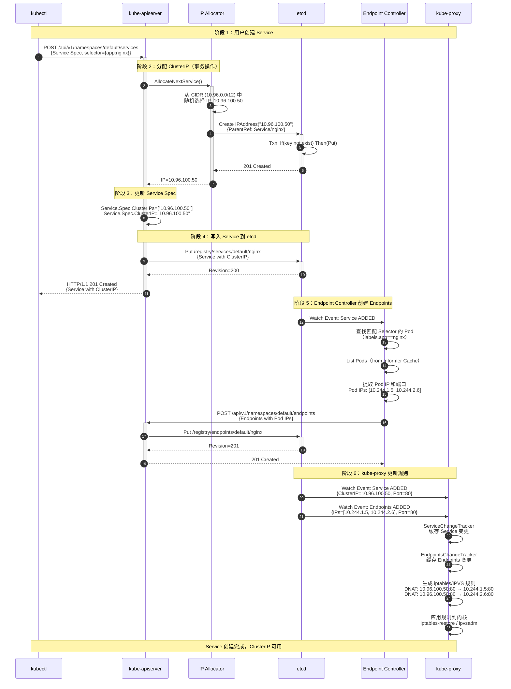

### 4.2 关键机制说明

#### ClusterIP 分配算法

1. **随机选择 IP**：从 CIDR 中随机选择一个 IP（避免顺序分配导致冲突）
2. **CAS 操作**：通过创建 IPAddress 资源实现原子性（etcd Txn）
3. **最多尝试 N 次**：N = CIDR 大小，如果所有 IP 都已分配则返回 `ErrFull`

#### 事务回滚

- 如果 Service 创建失败（如 etcd 写入超时），会自动释放已分配的 ClusterIP
- 释放操作：删除 IPAddress 资源

---

## 场景 5：API Server 启动流程

### 5.1 时序图

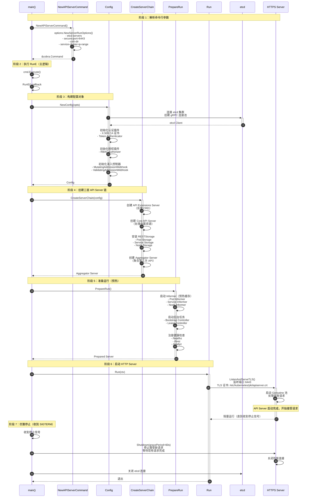

### 5.2 启动关键路径

#### 1. etcd 连接初始化

```go
// 创建 etcd 客户端
etcdClient, err := clientv3.New(clientv3.Config{
    Endpoints:   []string{"etcd-0:2379", "etcd-1:2379", "etcd-2:2379"},
    DialTimeout: 5 * time.Second,
    TLS:         &tls.Config{...},  // 双向 TLS 认证
})

// 健康检查
ctx, cancel := context.WithTimeout(context.Background(), 2*time.Second)
defer cancel()
_, err = etcdClient.Get(ctx, "/healthz")
```

#### 2. Informer 预热

```go
// 启动 Pod Informer（全量 List + Watch）
podInformer := informerFactory.Core().V1().Pods().Informer()
go podInformer.Run(stopCh)

// 等待缓存同步完成
if !cache.WaitForCacheSync(stopCh, podInformer.HasSynced) {
    return fmt.Errorf("failed to sync pod informer")
}
```

#### 3. 健康检查端点

| 端点 | 说明 | 检查内容 |
|-----|------|---------|
| `/healthz` | 健康检查（传统） | etcd 连接、Informer 同步状态 |
| `/livez` | 存活探针（Liveness） | API Server 进程是否存活 |
| `/readyz` | 就绪探针（Readiness） | API Server 是否可接受请求（Informer 是否同步完成） |

---

**文档维护：**
- 版本：v1.0
- 最后更新：2025-10-04
- 适用 Kubernetes 版本：v1.29+

---

# Kubernetes-01-API Server-数据结构

## 关键数据结构概览

API Server 涉及的核心数据结构可分为以下几类：

### 1. API 资源对象（API Objects）

所有 Kubernetes 资源对象遵循统一的结构模式：

```
- TypeMeta（类型元数据）：apiVersion + kind
- ObjectMeta（对象元数据）：name, namespace, labels, annotations, uid, resourceVersion 等
- Spec（期望状态）：用户声明的期望配置
- Status（实际状态）：系统观测到的当前状态
```

### 2. 存储层数据结构（Storage Layer）

- **Storage.Interface**：统一存储接口（封装 etcd 操作）
- **Cacher**：Watch 缓存（Reflector + DeltaFIFO + Indexer）
- **etcd Key-Value**：资源对象的持久化存储格式

### 3. 请求处理数据结构（Request Processing）

- **RequestInfo**：HTTP 请求元数据（Resource、Verb、Namespace 等）
- **AdmissionChain**：准入控制器链
- **Transformer**：序列化/反序列化与加密/解密

---

## 核心资源对象数据结构

### 1. Pod 数据结构

#### 1.1 UML 类图

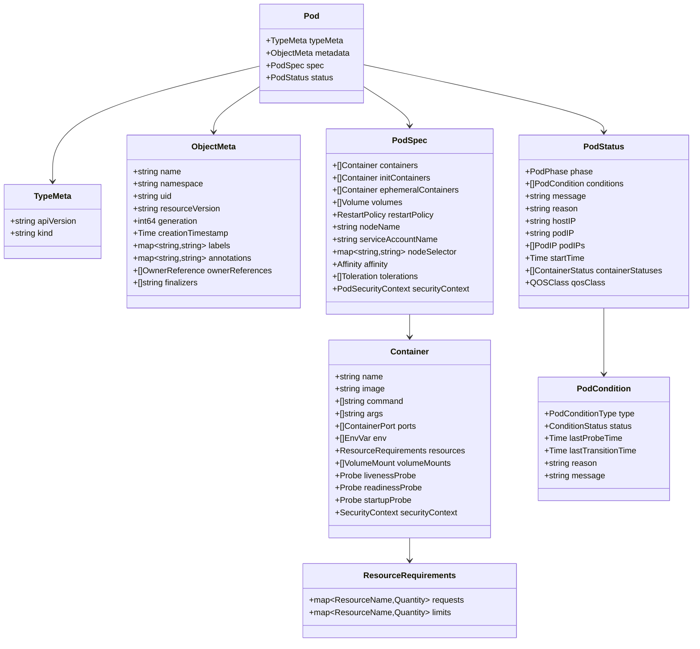

#### 1.2 字段语义详解

**ObjectMeta（对象元数据）**

| 字段 | 类型 | 说明 | 示例 |
|-----|------|------|------|
| `name` | string | 资源名称（同命名空间内唯一，不可变） | `"nginx-6d4cf56db6-abcde"` |
| `namespace` | string | 命名空间（不可变） | `"default"` |
| `uid` | string | 全局唯一标识（系统生成，不可变） | `"a8f9c3e5-4d2b-4e3f-9a1c-8d7e6f5a4b3c"` |
| `resourceVersion` | string | 资源版本（对应 etcd Revision，用于乐观并发控制） | `"123456"` |
| `generation` | int64 | 规格版本（`spec` 字段变更时递增） | `1` |
| `creationTimestamp` | Time | 创建时间（RFC3339 格式） | `"2025-10-04T08:00:00Z"` |
| `deletionTimestamp` | *Time | 删除时间（非空表示资源正在删除） | `"2025-10-04T09:00:00Z"` |
| `labels` | map[string]string | 标签（用于选择器） | `{"app":"nginx", "version":"v1"}` |
| `annotations` | map[string]string | 注解（元数据，不用于选择） | `{"description":"Nginx server"}` |
| `ownerReferences` | []OwnerReference | 所有者引用（级联删除） | `[{kind:"ReplicaSet", name:"nginx-6d4cf56db6"}]` |
| `finalizers` | []string | 终结器（阻止删除直到清理完成） | `["kubernetes.io/pv-protection"]` |

**PodSpec（期望状态）**

| 字段 | 类型 | 说明 | 约束 |
|-----|------|------|------|
| `containers` | []Container | 应用容器列表 | 至少一个 |
| `initContainers` | []Container | 初始化容器（按顺序执行，完成后才启动应用容器） | 可选 |
| `ephemeralContainers` | []Container | 临时容器（用于调试，需启用 Feature Gate） | 可选 |
| `volumes` | []Volume | 卷列表（可被容器挂载） | 可选 |
| `restartPolicy` | RestartPolicy | 重启策略（Always/OnFailure/Never） | 默认 Always |
| `nodeName` | string | 绑定的节点名（由 Scheduler 设置，不可变） | 可选 |
| `nodeSelector` | map[string]string | 节点选择器（简单标签匹配） | 可选 |
| `affinity` | *Affinity | 亲和性与反亲和性（高级调度约束） | 可选 |
| `tolerations` | []Toleration | 容忍度（允许调度到有污点的节点） | 可选 |
| `serviceAccountName` | string | ServiceAccount 名称（Pod 身份） | 默认 default |
| `securityContext` | *PodSecurityContext | 安全上下文（UID/GID/Capabilities 等） | 可选 |

**PodStatus（实际状态）**

| 字段 | 类型 | 说明 | 可能值 |
|-----|------|------|-------|
| `phase` | PodPhase | Pod 生命周期阶段 | Pending/Running/Succeeded/Failed/Unknown |
| `conditions` | []PodCondition | 状态条件（详细状态） | PodScheduled/Initialized/ContainersReady/Ready |
| `hostIP` | string | Pod 所在节点的 IP | `"192.168.1.10"` |
| `podIP` | string | Pod 的 IP（主 IP） | `"10.244.1.5"` |
| `podIPs` | []PodIP | Pod 的所有 IP（双栈支持） | `[{ip:"10.244.1.5"}, {ip:"fd00::1"}]` |
| `startTime` | *Time | Pod 启动时间 | `"2025-10-04T08:01:00Z"` |
| `containerStatuses` | []ContainerStatus | 容器状态列表 | 包含镜像、重启次数、就绪状态等 |
| `qosClass` | QOSClass | QoS 等级（影响驱逐优先级） | Guaranteed/Burstable/BestEffort |

**PodCondition（状态条件）**

| 类型 | 说明 | Status=True 表示 |
|-----|------|----------------|
| `PodScheduled` | Pod 已调度 | 已绑定到节点 |
| `Initialized` | 初始化完成 | 所有 Init Containers 已成功执行 |
| `ContainersReady` | 容器就绪 | 所有容器已启动且就绪探针通过 |
| `Ready` | Pod 就绪 | Pod 可接收流量（加入 Service Endpoints） |

#### 1.3 映射规则

**DTO → API 对象 → etcd 存储**

1. **用户提交的 YAML/JSON（DTO）**
   ```yaml
   apiVersion: v1
   kind: Pod
   metadata:
     name: nginx
   spec:
     containers:
     - name: nginx
       image: nginx:1.21
   ```

2. **API Server 解析为 Go 对象（API Object）**
   ```go
   &api.Pod{
       TypeMeta: metav1.TypeMeta{
           APIVersion: "v1",
           Kind: "Pod",
       },
       ObjectMeta: metav1.ObjectMeta{
           Name: "nginx",
           Namespace: "default",
       },
       Spec: api.PodSpec{
           Containers: []api.Container{
               {
                   Name:  "nginx",
                   Image: "nginx:1.21",
               },
           },
       },
   }
   ```

3. **序列化为 Protobuf 存储到 etcd**
   ```
   etcd key: /registry/pods/default/nginx
   etcd value: <Protobuf bytes>
   ```

**版本转换（Internal Version ↔ Versioned API）**

- **Internal Version**：API Server 内部使用的版本（如 `k8s.io/kubernetes/pkg/apis/core.Pod`）
- **Versioned API**：对外暴露的 API 版本（如 `v1.Pod`）
- **转换器（Converter）**：自动在不同版本之间转换（如 v1 ↔ v1beta1）

```go
// v1.Pod → internal.Pod
v1Pod := &corev1.Pod{...}
internalPod := &core.Pod{}
scheme.Convert(v1Pod, internalPod, nil)

// internal.Pod → v1.Pod
v1Pod := &corev1.Pod{}
scheme.Convert(internalPod, v1Pod, nil)
```

---

### 2. Service 数据结构

#### 2.1 UML 类图

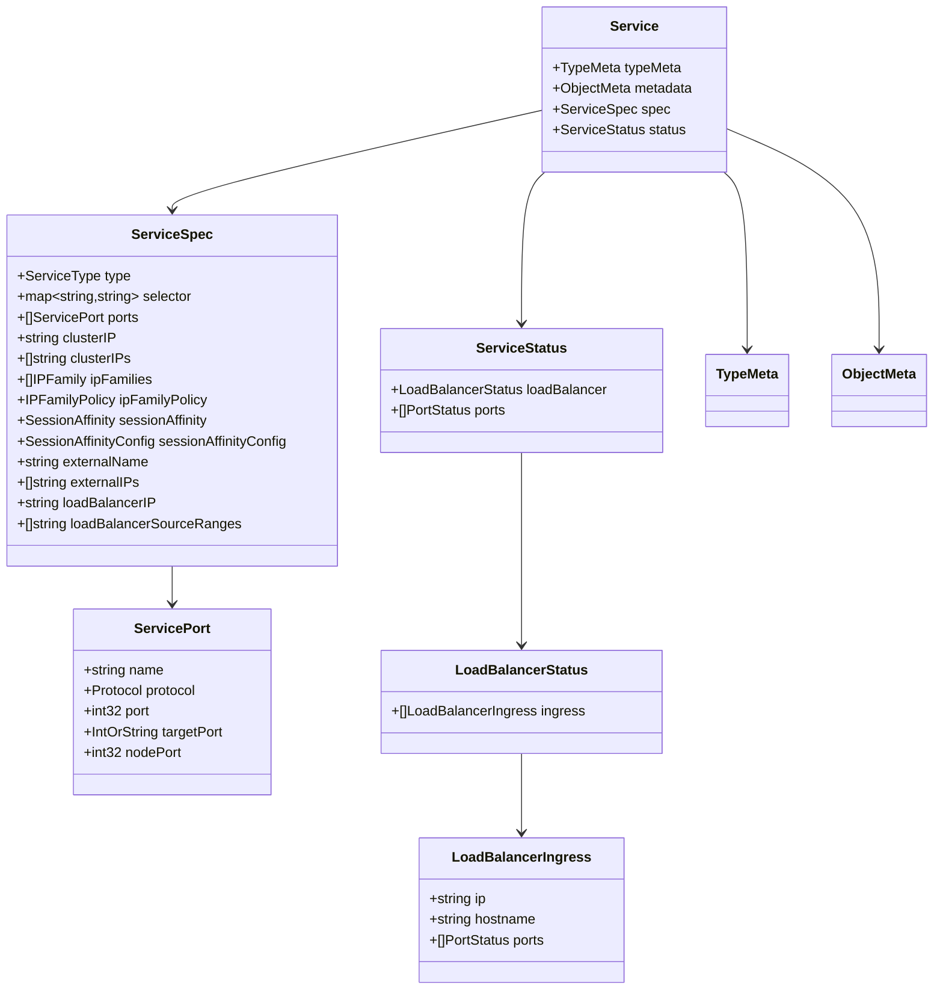

#### 2.2 字段语义详解

**ServiceSpec（期望状态）**

| 字段 | 类型 | 说明 | 约束 |
|-----|------|------|------|
| `type` | ServiceType | Service 类型 | ClusterIP（默认）/NodePort/LoadBalancer/ExternalName |
| `selector` | map[string]string | Pod 选择器（匹配 Pod Labels） | 可选（Headless Service 可无 Selector） |
| `ports` | []ServicePort | 端口映射列表 | 至少一个（ExternalName 类型除外） |
| `clusterIP` | string | 集群内虚拟 IP | 自动分配 或 "None"（Headless） |
| `clusterIPs` | []string | 多 IP 支持（双栈） | 自动分配 |
| `ipFamilies` | []IPFamily | IP 族 | IPv4（默认）/IPv6 |
| `ipFamilyPolicy` | IPFamilyPolicy | IP 族策略 | SingleStack（默认）/PreferDualStack/RequireDualStack |
| `sessionAffinity` | SessionAffinity | 会话亲和性 | None（默认）/ClientIP |
| `externalName` | string | 外部 DNS 名称（ExternalName 类型） | 有效 DNS 名称 |
| `loadBalancerIP` | string | LoadBalancer 类型的外部 IP（deprecated） | 云厂商特定 |

**ServicePort（端口映射）**

| 字段 | 类型 | 说明 | 约束 |
|-----|------|------|------|
| `name` | string | 端口名称（多端口时建议命名） | DNS-1123 Label |
| `protocol` | Protocol | 协议 | TCP（默认）/UDP/SCTP |
| `port` | int32 | Service 暴露的端口 | 1-65535 |
| `targetPort` | IntOrString | Pod 容器的端口（端口号或名称） | 1-65535 或 DNS-1123 Label |
| `nodePort` | int32 | NodePort 类型的节点端口 | 30000-32767（默认范围） |

#### 2.3 序列化策略

**Protobuf vs JSON**

- **API Server → etcd**：默认使用 Protobuf（性能更好，体积更小）
- **客户端 ↔ API Server**：支持 JSON、YAML、Protobuf（通过 Content-Type 和 Accept 协商）

```go
// Protobuf 序列化（存储到 etcd）
data, err := runtime.Encode(protobufCodec, service)
// data = <Protobuf bytes>

// JSON 序列化（返回给客户端）
data, err := runtime.Encode(jsonCodec, service)
// data = {"apiVersion":"v1","kind":"Service",...}
```

**加密（Encryption at Rest）**

- API Server 支持静态数据加密（通过 Encryption Provider 插件）
- 配置文件：`--encryption-provider-config`

```yaml
# encryption-config.yaml
apiVersion: apiserver.config.k8s.io/v1
kind: EncryptionConfiguration
resources:
- resources:
  - secrets
  providers:
  - aescbc:
      keys:
      - name: key1
        secret: <base64-encoded-key>
  - identity: {}  # 回退到不加密
```

---

### 3. Node 数据结构

#### 3.1 UML 类图

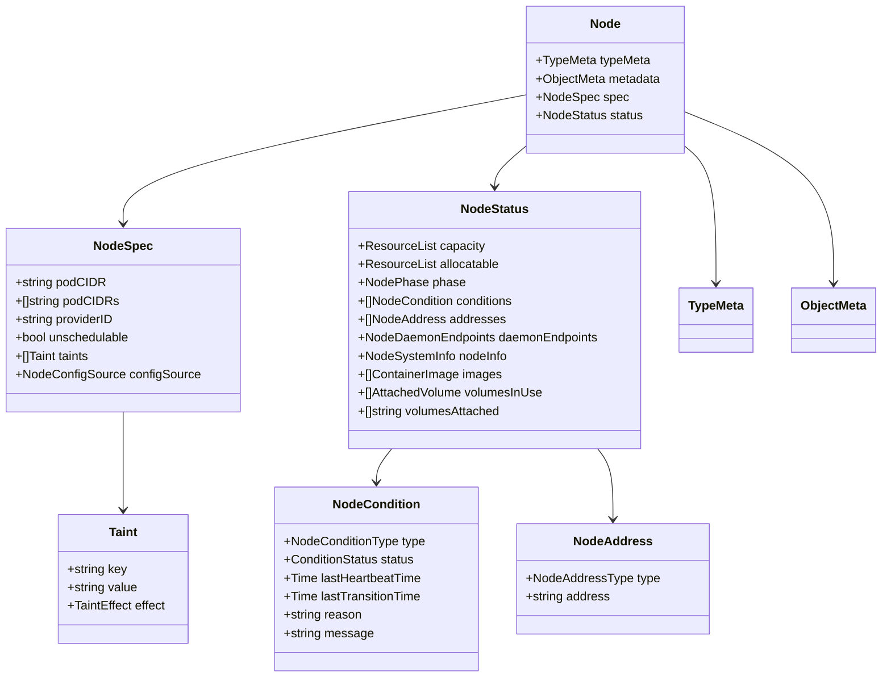

#### 3.2 字段语义详解

**NodeSpec（期望状态）**

| 字段 | 类型 | 说明 |
|-----|------|------|
| `podCIDR` | string | Pod CIDR 范围（kubelet 分配 Pod IP 的范围） |
| `podCIDRs` | []string | 多 CIDR 支持（双栈） |
| `providerID` | string | 云厂商的节点 ID（如 AWS 实例 ID） |
| `unschedulable` | bool | 是否禁止调度新 Pod（cordon 操作） |
| `taints` | []Taint | 污点（阻止 Pod 调度到此节点，除非 Pod 有对应的 Toleration） |

**Taint（污点）**

| 字段 | 类型 | 说明 | 可能值 |
|-----|------|------|-------|
| `key` | string | 污点键 | 如 `node-role.kubernetes.io/master` |
| `value` | string | 污点值 | 可选 |
| `effect` | TaintEffect | 影响 | NoSchedule（禁止调度）/PreferNoSchedule（尽量不调度）/NoExecute（驱逐已调度的 Pod） |

**NodeStatus（实际状态）**

| 字段 | 类型 | 说明 |
|-----|------|------|
| `capacity` | ResourceList | 节点总容量（CPU、内存、Pod 数量等） |
| `allocatable` | ResourceList | 可分配容量（扣除系统预留） |
| `conditions` | []NodeCondition | 节点状态条件（Ready、MemoryPressure、DiskPressure 等） |
| `addresses` | []NodeAddress | 节点地址（InternalIP、ExternalIP、Hostname） |
| `daemonEndpoints` | NodeDaemonEndpoints | kubelet 和 kube-proxy 的监听端点 |
| `nodeInfo` | NodeSystemInfo | 节点系统信息（OS、Kernel、容器运行时版本等） |
| `images` | []ContainerImage | 节点上已缓存的镜像列表 |
| `volumesInUse` | []AttachedVolume | 正在使用的卷列表 |

**NodeCondition（状态条件）**

| 类型 | 说明 | Status=True 表示 |
|-----|------|----------------|
| `Ready` | 节点就绪 | kubelet 健康，可接受新 Pod |
| `MemoryPressure` | 内存压力 | 节点内存不足（可能驱逐 Pod） |
| `DiskPressure` | 磁盘压力 | 节点磁盘不足 |
| `PIDPressure` | PID 压力 | 节点进程数过多 |
| `NetworkUnavailable` | 网络不可用 | 节点网络未正确配置 |

---

## 存储层数据结构

### 1. Storage.Interface（统一存储接口）

```go
// vendor/k8s.io/apiserver/pkg/storage/interfaces.go

// Interface 定义了资源存储的统一接口（封装 etcd 操作）
type Interface interface {
    // Versioner 返回资源版本管理器
    Versioner() Versioner
    
    // Create 创建资源（etcd Put，要求 key 不存在）
    Create(ctx context.Context, key string, obj runtime.Object, 
           out runtime.Object, ttl uint64) error
    
    // Delete 删除资源（etcd Delete）
    Delete(ctx context.Context, key string, out runtime.Object, 
           preconditions *Preconditions, validateDeletion ValidateObjectFunc, 
           cachedExistingObject runtime.Object) error
    
    // Watch 监听资源变化（etcd Watch）
    Watch(ctx context.Context, key string, opts ListOptions) (watch.Interface, error)
    
    // Get 获取资源（etcd Get）
    Get(ctx context.Context, key string, opts GetOptions, 
        objPtr runtime.Object) error
    
    // GetList 获取资源列表（etcd Range）
    GetList(ctx context.Context, key string, opts ListOptions, 
            listObj runtime.Object) error
    
    // GuaranteedUpdate 保证更新（乐观并发控制）
    GuaranteedUpdate(ctx context.Context, key string, destination runtime.Object, 
                     ignoreNotFound bool, preconditions *Preconditions, 
                     tryUpdate UpdateFunc, cachedExistingObject runtime.Object) error
    
    // Count 统计资源数量（etcd Count）
    Count(key string) (int64, error)
}
```

### 2. Cacher（Watch 缓存）

#### 2.1 架构图

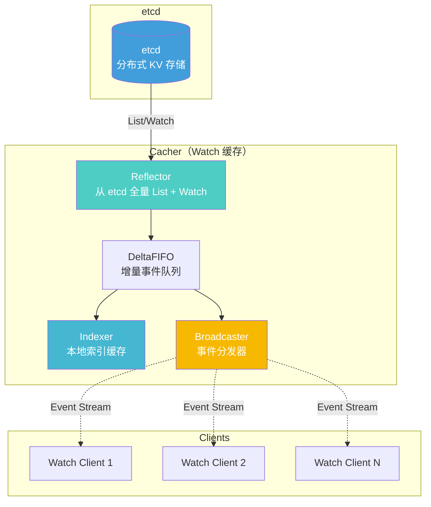

#### 2.2 核心组件数据结构

**Reflector（反射器）**

```go
// vendor/k8s.io/client-go/tools/cache/reflector.go

// Reflector 从 API Server Watch 资源变化，写入 DeltaFIFO
type Reflector struct {
    name            string
    expectedTypeName string
    expectedType     reflect.Type
    store            Store                    // DeltaFIFO
    listerWatcher    ListerWatcher            // List 和 Watch 接口
    lastSyncResourceVersion string             // 上次同步的 ResourceVersion
    resyncPeriod    time.Duration             // 定期全量 List 的周期
}

// Run 启动 Reflector（List-Watch 循环）
func (r *Reflector) Run(stopCh <-chan struct{}) {
    wait.BackoffUntil(func() {
        if err := r.ListAndWatch(stopCh); err != nil {
            r.watchErrorHandler(r, err)
        }
    }, r.backoffManager, true, stopCh)
}

// ListAndWatch 执行 List-Watch 循环
func (r *Reflector) ListAndWatch(stopCh <-chan struct{}) error {
    // 1. 全量 List（启动时或 Watch 断开时）
    list, err := r.listerWatcher.List(options)
    items, err := meta.ExtractList(list)
    if err := r.syncWith(items, resourceVersion); err != nil {
        return err
    }
    
    // 2. Watch 增量变化
    for {
        w, err := r.listerWatcher.Watch(options)
        if err := r.watchHandler(start, w, &resourceVersion, resyncerrc, stopCh); err != nil {
            return err
        }
    }
}
```

**DeltaFIFO（增量队列）**

```go
// vendor/k8s.io/client-go/tools/cache/delta_fifo.go

// DeltaFIFO 存储资源的增量变化（Added/Updated/Deleted/Sync）
type DeltaFIFO struct {
    lock         sync.RWMutex
    items        map[string]Deltas          // key -> []Delta
    queue        []string                   // key 队列（FIFO 顺序）
    populated    bool                       // 是否已初始化
    initialPopulationCount int              // 初始化时的对象数量
}

// Delta 表示一个增量变化
type Delta struct {
    Type   DeltaType                         // Added/Updated/Deleted/Replaced/Sync
    Object interface{}                       // 变化后的对象
}

// Add 添加一个 Added 事件
func (f *DeltaFIFO) Add(obj interface{}) error {
    f.lock.Lock()
    defer f.lock.Unlock()
    f.queueActionLocked(Added, obj)
    return nil
}

// Update 添加一个 Updated 事件
func (f *DeltaFIFO) Update(obj interface{}) error {
    f.lock.Lock()
    defer f.lock.Unlock()
    f.queueActionLocked(Updated, obj)
    return nil
}

// Delete 添加一个 Deleted 事件
func (f *DeltaFIFO) Delete(obj interface{}) error {
    f.lock.Lock()
    defer f.lock.Unlock()
    f.queueActionLocked(Deleted, obj)
    return nil
}
```

**Indexer（索引缓存）**

```go
// vendor/k8s.io/client-go/tools/cache/index.go

// Indexer 提供多维度索引查询（如按 Namespace 查询 Pod）
type Indexer interface {
    Store                                    // 继承 Store 接口（CRUD）
    
    // Index 按索引查询（如按 "namespace" 索引查询）
    Index(indexName string, obj interface{}) ([]interface{}, error)
    
    // IndexKeys 获取索引的所有 Key
    IndexKeys(indexName, indexedValue string) ([]string, error)
    
    // ListIndexFuncValues 获取索引函数的所有值
    ListIndexFuncValues(indexName string) []string
    
    // ByIndex 按索引值查询
    ByIndex(indexName, indexedValue string) ([]interface{}, error)
    
    // AddIndexers 添加索引器
    AddIndexers(newIndexers Indexers) error
}

// 示例：按 Namespace 索引 Pod
indexer := cache.NewIndexer(cache.MetaNamespaceKeyFunc, cache.Indexers{
    "namespace": func(obj interface{}) ([]string, error) {
        pod := obj.(*corev1.Pod)
        return []string{pod.Namespace}, nil
    },
})

// 查询 default 命名空间的所有 Pod
pods, err := indexer.ByIndex("namespace", "default")
```

---

## etcd 存储格式

### Key 路径规则

Kubernetes 资源在 etcd 中的 Key 遵循固定的路径规则：

**命名空间级资源（Namespaced）**
```
/registry/{resource}/{namespace}/{name}
```

示例：
- Pod：`/registry/pods/default/nginx-6d4cf56db6-abcde`
- Service：`/registry/services/default/nginx`
- ConfigMap：`/registry/configmaps/kube-system/kube-proxy`

**集群级资源（Cluster-scoped）**
```
/registry/{resource}/{name}
```

示例：
- Node：`/registry/minions/node-01`
- Namespace：`/registry/namespaces/default`
- ClusterRole：`/registry/clusterroles/cluster-admin`

**子资源（Subresources）**

子资源共享主资源的 Key（通过不同的 etcd Prefix 区分）：
- Pod Status：`/registry/pods/default/nginx-6d4cf56db6-abcde`（与 Pod Spec 共享 Key）
- Service Status：`/registry/services/default/nginx`

### Value 格式（Protobuf）

etcd 存储的 Value 为 Protobuf 序列化后的字节流：

```go
// 序列化（Pod → Protobuf bytes）
pod := &corev1.Pod{...}
codec := serializer.NewCodecFactory(scheme.Scheme).CodecForVersions(
    serializer.NewSerializer(...),
    versioner,
    schema.GroupVersion{Group: "", Version: "v1"},
    nil,
)
data, err := runtime.Encode(codec, pod)
// data = <Protobuf bytes>

// 反序列化（Protobuf bytes → Pod）
obj, err := runtime.Decode(codec, data)
pod := obj.(*corev1.Pod)
```

**加密后的 Value（Encryption at Rest）**

如果配置了 Encryption Provider，etcd 存储的 Value 会先加密：

```
原始 Protobuf bytes → AES-GCM 加密 → 存储到 etcd
```

解密时自动执行反向操作：

```
从 etcd 读取 → AES-GCM 解密 → Protobuf 反序列化 → Go 对象
```

---

## 版本演进与兼容性

### 1. API 版本转换

Kubernetes 支持多版本 API 并存（如 v1、v1beta1、v1alpha1）：

**转换器（Converter）**

```go
// vendor/k8s.io/apimachinery/pkg/conversion/converter.go

// Converter 负责在不同版本之间转换对象
type Converter struct {
    conversionFuncs ConversionFuncs
    defaultingFuncs map[reflect.Type]reflect.Value
}

// Convert 执行类型转换
func (c *Converter) Convert(src, dest interface{}, flags FieldMatchingFlags, 
                            meta *Meta) error {
    // 1. 查找转换函数（如 v1.Pod → internal.Pod）
    // 2. 执行转换（复制字段）
    // 3. 应用默认值（Defaulting）
}
```

**版本转换示例**

```go
// v1.Pod → internal.Pod
v1Pod := &corev1.Pod{...}
internalPod := &core.Pod{}
err := scheme.Convert(v1Pod, internalPod, nil)

// internal.Pod → v1beta1.Pod
v1beta1Pod := &corev1beta1.Pod{}
err := scheme.Convert(internalPod, v1beta1Pod, nil)
```

### 2. 字段废弃与迁移

**Deprecated 字段**

使用注解标记废弃字段：

```go
// +k8s:deprecated=<version>,<reason>
// 示例：
type ServiceSpec struct {
    // LoadBalancerIP 已废弃，推荐使用云厂商的 LoadBalancer Controller
    // +k8s:deprecated=v1.24,"use cloud provider LoadBalancer controller"
    LoadBalancerIP string `json:"loadBalancerIP,omitempty"`
}
```

**字段迁移策略**

1. **添加新字段**：保留旧字段，添加新字段（同时支持）
2. **废弃旧字段**：标记旧字段为 deprecated，文档提示迁移
3. **删除旧字段**：至少经过 2 个大版本（如 v1.24 废弃，v1.26 删除）

---

**文档维护：**
- 版本：v1.0
- 最后更新：2025-10-04
- 适用 Kubernetes 版本：v1.29+

---

# Kubernetes-01-API Server-API

## API 列表概览

API Server 提供 Kubernetes 所有资源对象的 RESTful API，资源按 API Group 组织：

### 核心 API 组（Core API Group / Legacy API Group）

| API 资源 | 版本 | 作用域 | 描述 |
|---------|-----|--------|-----|
| **Pod** | v1 | Namespaced | 最小调度单元，包含一个或多个容器 |
| **Service** | v1 | Namespaced | 为 Pod 提供稳定的网络访问入口 |
| **Node** | v1 | Cluster | 集群工作节点，运行 Pod |
| **Namespace** | v1 | Cluster | 资源隔离和配额管理的逻辑边界 |
| **ConfigMap** | v1 | Namespaced | 存储配置数据（键值对） |
| **Secret** | v1 | Namespaced | 存储敏感数据（密钥、证书） |
| **PersistentVolume (PV)** | v1 | Cluster | 集群级存储资源 |
| **PersistentVolumeClaim (PVC)** | v1 | Namespaced | 用户对存储的请求 |
| **ServiceAccount** | v1 | Namespaced | Pod 的身份标识 |
| **Endpoint** | v1 | Namespaced | Service 后端 Pod 的 IP 和端口集合 |

### Apps API 组

| API 资源 | 版本 | 作用域 | 描述 |
|---------|-----|--------|-----|
| **Deployment** | apps/v1 | Namespaced | 无状态应用的声明式更新 |
| **StatefulSet** | apps/v1 | Namespaced | 有状态应用，提供稳定的网络标识和持久化存储 |
| **DaemonSet** | apps/v1 | Namespaced | 在每个节点上运行一个 Pod 副本 |
| **ReplicaSet** | apps/v1 | Namespaced | 维护指定数量的 Pod 副本（通常由 Deployment 管理） |

### Batch API 组

| API 资源 | 版本 | 作用域 | 描述 |
|---------|-----|--------|-----|
| **Job** | batch/v1 | Namespaced | 一次性任务，运行完成后退出 |
| **CronJob** | batch/v1 | Namespaced | 定时任务，按 Cron 表达式调度 |

---

## API 规格详解（逐 API）

### 1. Pod API

#### 1.1 基本信息

- **资源名称**：Pod
- **API 路径**：`/api/v1/namespaces/{namespace}/pods`
- **API 组**：Core（无组名前缀，legacy API）
- **作用域**：Namespaced
- **支持的操作**：CREATE、GET、LIST、WATCH、UPDATE、PATCH、DELETE
- **子资源**：
  - `/status`：Pod 状态（只读，由 kubelet 更新）
  - `/binding`：Pod 绑定到 Node（由 Scheduler 调用）
  - `/eviction`：Pod 驱逐（触发优雅删除）
  - `/log`：Pod 容器日志
  - `/exec`：在容器中执行命令
  - `/attach`：附加到容器的 stdin/stdout/stderr
  - `/portforward`：端口转发

#### 1.2 请求结构体（Create Pod）

```go
// POST /api/v1/namespaces/{namespace}/pods
// Content-Type: application/json

{
  "apiVersion": "v1",
  "kind": "Pod",
  "metadata": {
    "name": "nginx",                  // Pod 名称（同命名空间内唯一，符合 DNS-1123 标准）
    "namespace": "default",           // 命名空间（默认 default）
    "labels": {                       // 标签（用于选择器）
      "app": "nginx",
      "version": "v1"
    },
    "annotations": {                  // 注解（元数据，不用于选择）
      "description": "Nginx web server"
    }
  },
  "spec": {
    "containers": [                   // 容器列表（至少一个）
      {
        "name": "nginx",              // 容器名称（Pod 内唯一）
        "image": "nginx:1.21",        // 镜像地址
        "ports": [                    // 容器端口（声明式，不强制）
          {
            "containerPort": 80,
            "protocol": "TCP"
          }
        ],
        "resources": {                // 资源请求与限制
          "requests": {               // 调度时的资源需求
            "cpu": "100m",            // 100毫核（0.1核）
            "memory": "128Mi"
          },
          "limits": {                 // 运行时的资源上限
            "cpu": "200m",
            "memory": "256Mi"
          }
        },
        "env": [                      // 环境变量
          {
            "name": "ENV",
            "value": "production"
          }
        ],
        "volumeMounts": [             // 挂载卷
          {
            "name": "config",
            "mountPath": "/etc/nginx"
          }
        ],
        "livenessProbe": {            // 存活探针（失败则重启容器）
          "httpGet": {
            "path": "/healthz",
            "port": 80
          },
          "initialDelaySeconds": 10,
          "periodSeconds": 10
        },
        "readinessProbe": {           // 就绪探针（失败则从 Service 摘除）
          "httpGet": {
            "path": "/ready",
            "port": 80
          },
          "initialDelaySeconds": 5,
          "periodSeconds": 5
        }
      }
    ],
    "volumes": [                      // 卷列表
      {
        "name": "config",
        "configMap": {
          "name": "nginx-config"
        }
      }
    ],
    "restartPolicy": "Always",        // 重启策略：Always/OnFailure/Never
    "nodeSelector": {                 // 节点选择器（简单标签匹配）
      "disktype": "ssd"
    },
    "affinity": {                     // 亲和性与反亲和性（高级调度约束）
      "nodeAffinity": {
        "requiredDuringSchedulingIgnoredDuringExecution": {
          "nodeSelectorTerms": [
            {
              "matchExpressions": [
                {
                  "key": "kubernetes.io/hostname",
                  "operator": "In",
                  "values": ["node-01", "node-02"]
                }
              ]
            }
          ]
        }
      }
    },
    "tolerations": [                  // 容忍度（允许调度到有污点的节点）
      {
        "key": "node-role.kubernetes.io/master",
        "operator": "Exists",
        "effect": "NoSchedule"
      }
    ],
    "serviceAccountName": "default",  // ServiceAccount（Pod 身份）
    "securityContext": {              // 安全上下文
      "runAsUser": 1000,              // 运行用户 UID
      "runAsNonRoot": true,           // 禁止以 root 运行
      "fsGroup": 2000                 // 文件系统组
    }
  }
}
```

#### 1.3 字段表（核心字段）

| 字段路径 | 类型 | 必填 | 默认值 | 约束 | 说明 |
|---------|------|------|--------|------|------|
| `metadata.name` | string | 是 | - | DNS-1123 Label（长度 1-253） | Pod 名称，同命名空间内唯一 |
| `metadata.namespace` | string | 否 | default | DNS-1123 Label | 命名空间 |
| `spec.containers` | []Container | 是 | - | 至少一个 | 容器列表 |
| `spec.containers[].name` | string | 是 | - | DNS-1123 Label | 容器名称，Pod 内唯一 |
| `spec.containers[].image` | string | 是 | - | 镜像地址（host/repo:tag） | 容器镜像 |
| `spec.containers[].resources.requests.cpu` | string | 否 | 0 | 数量格式（如 100m、0.1） | CPU 请求 |
| `spec.containers[].resources.requests.memory` | string | 否 | 0 | 数量格式（如 128Mi、0.125Gi） | 内存请求 |
| `spec.containers[].resources.limits.cpu` | string | 否 | - | 数量格式 | CPU 限制 |
| `spec.containers[].resources.limits.memory` | string | 否 | - | 数量格式 | 内存限制 |
| `spec.restartPolicy` | string | 否 | Always | Always / OnFailure / Never | 容器重启策略 |
| `spec.nodeName` | string | 否 | "" | - | 绑定的节点名（由 Scheduler 设置） |
| `spec.serviceAccountName` | string | 否 | default | - | ServiceAccount 名称 |

#### 1.4 响应结构体（Create Pod 成功）

```go
// HTTP/1.1 201 Created
// Content-Type: application/json

{
  "apiVersion": "v1",
  "kind": "Pod",
  "metadata": {
    "name": "nginx",
    "namespace": "default",
    "uid": "a8f9c3e5-4d2b-4e3f-9a1c-8d7e6f5a4b3c",       // 系统生成的全局唯一标识
    "resourceVersion": "123456",                         // 资源版本（etcd Revision）
    "generation": 1,                                     // 规格版本（spec 变更时递增）
    "creationTimestamp": "2025-10-04T08:00:00Z",         // 创建时间
    "labels": { "app": "nginx", "version": "v1" },
    "annotations": { "description": "Nginx web server" },
    "managedFields": [...]                               // Server-Side Apply 字段归属
  },
  "spec": {
    // 与请求相同（可能被准入控制器修改）
  },
  "status": {                                            // 状态（由 kubelet 维护）
    "phase": "Pending",                                  // Pod 生命周期阶段
    "conditions": [                                      // 状态条件
      {
        "type": "PodScheduled",
        "status": "False",
        "reason": "Unschedulable",
        "message": "0/3 nodes available"
      }
    ],
    "qosClass": "Burstable"                              // QoS 等级（Guaranteed/Burstable/BestEffort）
  }
}
```

#### 1.5 入口函数与核心代码

```go
// pkg/registry/core/pod/storage/storage.go

// REST 实现 Pod 资源的 RESTful 接口
type REST struct {
    *genericregistry.Store  // 继承通用存储实现
    proxyTransport http.RoundTripper
}

// Create 创建 Pod（处理 POST /api/v1/namespaces/{ns}/pods 请求）
func (r *REST) Create(ctx context.Context, obj runtime.Object, 
                      createValidation rest.ValidateObjectFunc, 
                      options *metav1.CreateOptions) (runtime.Object, error) {
    // 1. 类型断言（确保是 Pod 对象）
    pod := obj.(*api.Pod)
    
    // 2. 调用 Strategy 进行预处理（PrepareForCreate）
    //    - 初始化 Generation = 1
    //    - 初始化 Status.Phase = Pending
    //    - 计算 QoS Class（根据 resources 字段）
    //    - 删除被禁用的字段（DropDisabledPodFields）
    r.Store.CreateStrategy.PrepareForCreate(ctx, pod)
    
    // 3. 调用 Strategy 进行校验（Validate）
    //    - 名称合法性检查（DNS-1123 Label）
    //    - 容器镜像地址格式检查
    //    - 资源请求与限制的合法性
    //    - Volume 引用的有效性
    if errs := r.Store.CreateStrategy.Validate(ctx, pod); len(errs) != 0 {
        return nil, errors.NewInvalid(api.Kind("Pod"), pod.Name, errs)
    }
    
    // 4. 执行准入控制器（Admission Webhook）
    //    - MutatingAdmissionWebhook：可能修改 Pod 对象（如注入 Sidecar）
    //    - ValidatingAdmissionWebhook：验证 Pod 对象（如安全策略检查）
    if createValidation != nil {
        if err := createValidation(ctx, pod.DeepCopyObject()); err != nil {
            return nil, err
        }
    }
    
    // 5. 写入 etcd（通过 Store.Storage.Create）
    //    - 序列化为 Protobuf
    //    - 加密（如果配置了 Encryption Provider）
    //    - etcd Txn 操作（确保 key 不存在时才创建）
    out, err := r.Store.Create(ctx, pod, createValidation, options)
    if err != nil {
        return nil, err
    }
    
    // 6. 返回创建后的 Pod 对象（包含 UID、ResourceVersion 等系统字段）
    return out, nil
}
```

**关键步骤说明：**

1. **PrepareForCreate（预处理）**
   - 初始化系统字段（Generation、Status.Phase）
   - 计算 QoS Class（根据 resources.requests 和 resources.limits 的比例）
     - `Guaranteed`：所有容器的 requests == limits
     - `Burstable`：至少一个容器有 requests 或 limits
     - `BestEffort`：所有容器都没有 requests 和 limits
   - 删除被 Feature Gate 禁用的字段（如 EphemeralContainers）

2. **Validate（校验）**
   - 调用 `corevalidation.ValidatePodCreate`，包含数百个校验规则：
     - 名称格式（DNS-1123 Label，长度 1-253 字符）
     - 容器名称唯一性（同一 Pod 内不重复）
     - 镜像地址格式（host/repo:tag 或 SHA256）
     - Volume 引用一致性（VolumeMount 引用的 Volume 必须存在）
     - 资源请求与限制的合法性（requests <= limits）
     - 端口冲突检查（同一 Pod 内容器端口不重复）

3. **Admission Webhook（准入控制）**
   - **Mutating Admission**（变更准入）：
     - 自动注入 Sidecar 容器（如 Istio Envoy）
     - 设置默认值（如未指定 ImagePullPolicy 时设置为 IfNotPresent）
     - 注入环境变量（如 Pod IP、ServiceAccount Token）
   - **Validating Admission**（验证准入）：
     - PodSecurityPolicy 检查（禁止特权容器、hostNetwork 等）
     - 资源配额检查（ResourceQuota，确保不超过命名空间配额）
     - 自定义策略检查（如 OPA Gatekeeper）

4. **Storage.Create（存储层）**
   - 构造 etcd key：`/registry/pods/{namespace}/{name}`
   - 序列化为 Protobuf（比 JSON 更紧凑，性能更好）
   - 加密（可选，通过 Encryption Provider 插件）
   - etcd Txn 操作：
     ```go
     Txn().
       If(Compare(Version(key), "=", 0)). // key 不存在
       Then(OpPut(key, value)).            // 创建
       Else(OpGet(key))                    // 返回已存在的对象
     ```
   - 提取 resourceVersion（从 etcd Revision）

#### 1.6 上层调用链核心代码

```go
// pkg/controlplane/instance.go

// InstallAPIs 注册所有资源的 REST Handler
func (s *Server) InstallAPIs(restStorageProviders ...RESTStorageProvider) error {
    for _, provider := range restStorageProviders {
        // 获取资源的 RESTStorage 实现
        groupInfo := provider.NewRESTStorage(...)
        
        // 为每个资源注册 HTTP 路由
        for resource, storage := range groupInfo.VersionedResourcesStorageMap {
            // 注册资源的主路由（如 /api/v1/namespaces/{ns}/pods）
            installer.Install(resource, storage)
            
            // 注册子资源路由（如 /api/v1/namespaces/{ns}/pods/{name}/status）
            for subresource, subStorage := range storage.Subresources {
                installer.Install(resource + "/" + subresource, subStorage)
            }
        }
    }
    return nil
}

// vendor/k8s.io/apiserver/pkg/endpoints/installer.go

// Install 注册资源的 HTTP Handler
func (a *APIInstaller) Install(resource string, storage rest.Storage) error {
    // 1. 注册 POST（Create）
    if creater, ok := storage.(rest.Creater); ok {
        route := a.mux.Post(resource).
            To(handlers.CreateResource(creater, a.group)).
            Doc("create " + resource)
        a.addRoute(route)
    }
    
    // 2. 注册 GET（Get）
    if getter, ok := storage.(rest.Getter); ok {
        route := a.mux.Get(resource + "/{name}").
            To(handlers.GetResource(getter, a.group)).
            Doc("get " + resource)
        a.addRoute(route)
    }
    
    // 3. 注册 GET（List）
    if lister, ok := storage.(rest.Lister); ok {
        route := a.mux.Get(resource).
            To(handlers.ListResource(lister, a.group)).
            Doc("list " + resource)
        a.addRoute(route)
    }
    
    // 4. 注册 PUT（Update）
    if updater, ok := storage.(rest.Updater); ok {
        route := a.mux.Put(resource + "/{name}").
            To(handlers.UpdateResource(updater, a.group)).
            Doc("update " + resource)
        a.addRoute(route)
    }
    
    // 5. 注册 PATCH
    if patcher, ok := storage.(rest.Patcher); ok {
        route := a.mux.Patch(resource + "/{name}").
            To(handlers.PatchResource(patcher, a.group)).
            Doc("patch " + resource)
        a.addRoute(route)
    }
    
    // 6. 注册 DELETE
    if deleter, ok := storage.(rest.GracefulDeleter); ok {
        route := a.mux.Delete(resource + "/{name}").
            To(handlers.DeleteResource(deleter, a.group)).
            Doc("delete " + resource)
        a.addRoute(route)
    }
    
    // 7. 注册 WATCH（长连接）
    if watcher, ok := storage.(rest.Watcher); ok {
        route := a.mux.Get(resource).
            Param("watch", "true").
            To(handlers.ListResourceWithWatch(watcher, a.group)).
            Doc("watch " + resource)
        a.addRoute(route)
    }
    
    return nil
}
```

#### 1.7 时序图（Pod 创建流程）

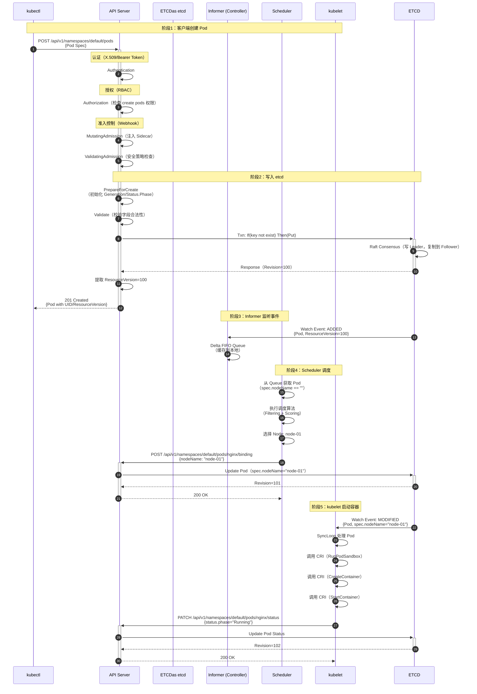

#### 1.8 异常与回退说明

**创建失败场景：**

| 错误场景 | HTTP 状态码 | 错误信息示例 | 客户端处理 |
|---------|------------|------------|-----------|
| **认证失败** | 401 Unauthorized | `Unauthorized` | 检查证书/Token 是否有效 |
| **授权失败** | 403 Forbidden | `User "bob" cannot create pods in namespace "default"` | 检查 RBAC 权限配置 |
| **准入控制拒绝** | 400 Bad Request | `admission webhook "validate-pod" denied the request: privileged container not allowed` | 修改 Pod Spec 以符合策略 |
| **字段校验失败** | 422 Unprocessable Entity | `Invalid value: "invalid-name-": name must be DNS-1123 label` | 修正字段值 |
| **资源配额超限** | 403 Forbidden | `exceeded quota: pods="5", used: pods="5", limited: pods="5"` | 删除旧 Pod 或增加配额 |
| **Pod 已存在** | 409 Conflict | `Pod "nginx" already exists` | 使用不同的名称或删除旧 Pod |
| **etcd 超时** | 500 Internal Server Error | `context deadline exceeded` | 客户端指数退避重试 |

**幂等性保证：**
- Pod Create 操作**非幂等**：重复创建同名 Pod 返回 409 Conflict
- 幂等性通过 `metadata.generateName` 实现：每次生成唯一名称（如 `nginx-xxxxx-yyyyy`）

**补偿机制：**
- Pod 创建失败时，etcd 中不会留下残留数据（Txn 事务保证原子性）
- 如果准入控制器失败，API Server 会自动回滚（不写入 etcd）

#### 1.9 性能要点与最佳实践

**性能关键路径：**
1. **Admission Webhook 延迟**：外部 Webhook 调用延迟较高（P99 可达 100-500ms）
   - 优化：使用 Fail-Open 模式（Webhook 失败时允许请求通过）
   - 优化：减少 Webhook 数量，合并多个校验到一个 Webhook

2. **etcd 写入延迟**：默认 P99 为 10-50ms
   - 优化：使用 SSD 磁盘，降低 I/O 延迟
   - 优化：增加 etcd 集群节点数（分摊负载）

3. **Validation 开销**：Pod 校验规则复杂（数百个规则），CPU 耗时 1-5ms
   - 优化：减少不必要的字段校验（如自定义 Admission Webhook 中重复校验）

**最佳实践：**

1. **使用 Deployment 而非直接创建 Pod**
   - Deployment 提供声明式更新、滚动发布、回滚等能力
   - 直接创建的 Pod 失败后不会自动重建（需要手动删除重建）

2. **设置资源请求与限制（Resources）**
   - `requests`：调度器根据此值选择节点，确保节点有足够资源
   - `limits`：防止容器占用过多资源，导致节点 OOM
   - QoS 等级影响驱逐优先级：Guaranteed > Burstable > BestEffort

3. **配置健康检查（Probes）**
   - `livenessProbe`：存活探针，失败时重启容器
   - `readinessProbe`：就绪探针，失败时从 Service 摘除（不接收流量）
   - `startupProbe`：启动探针，适用于慢启动应用（避免被 livenessProbe 误杀）

4. **使用 Labels 而非名称进行选择**
   - Labels 支持灵活的选择器（Selector），便于批量操作
   - 例如：`kubectl delete pods -l app=nginx`（删除所有 app=nginx 的 Pod）

5. **避免在 Pod 中存储状态**
   - Pod 是短暂的（Ephemeral），随时可能被驱逐或重建
   - 状态数据应存储在外部存储（PersistentVolume、数据库等）

---

### 2. Service API

#### 2.1 基本信息

- **资源名称**：Service
- **API 路径**：`/api/v1/namespaces/{namespace}/services`
- **API 组**：Core（无组名前缀）
- **作用域**：Namespaced
- **支持的操作**：CREATE、GET、LIST、WATCH、UPDATE、PATCH、DELETE
- **子资源**：
  - `/status`：Service 状态（通常为空，保留字段）
  - `/proxy`：代理到 Service 后端 Pod

#### 2.2 请求结构体（Create Service）

```go
// POST /api/v1/namespaces/{namespace}/services
// Content-Type: application/json

{
  "apiVersion": "v1",
  "kind": "Service",
  "metadata": {
    "name": "nginx",
    "namespace": "default",
    "labels": {
      "app": "nginx"
    }
  },
  "spec": {
    "type": "ClusterIP",                  // Service 类型（ClusterIP/NodePort/LoadBalancer/ExternalName）
    "selector": {                         // Pod 选择器（匹配 Pod 的 Labels）
      "app": "nginx"
    },
    "ports": [                            // 端口映射列表
      {
        "name": "http",                   // 端口名称（可选，多端口时建议命名）
        "protocol": "TCP",                // 协议（TCP/UDP/SCTP）
        "port": 80,                       // Service 暴露的端口
        "targetPort": 80                  // Pod 容器的端口（可以是端口号或端口名）
      }
    ],
    "clusterIP": "10.96.100.50",          // 集群内虚拟 IP（可选，默认自动分配）
    "clusterIPs": ["10.96.100.50"],       // 多 IP 支持（IPv4/IPv6 双栈）
    "ipFamilies": ["IPv4"],               // IP 族（IPv4/IPv6/IPv4,IPv6）
    "ipFamilyPolicy": "SingleStack",      // IP 族策略（SingleStack/PreferDualStack/RequireDualStack）
    "sessionAffinity": "None",            // 会话亲和性（None/ClientIP）
    "sessionAffinityConfig": {            // 会话亲和性配置
      "clientIP": {
        "timeoutSeconds": 10800           // 会话超时时间（默认 3 小时）
      }
    }
  }
}
```

#### 2.3 字段表（核心字段）

| 字段路径 | 类型 | 必填 | 默认值 | 约束 | 说明 |
|---------|------|------|--------|------|------|
| `spec.type` | string | 否 | ClusterIP | ClusterIP/NodePort/LoadBalancer/ExternalName | Service 类型 |
| `spec.selector` | map[string]string | 否 | - | - | Pod 选择器（匹配 Pod Labels） |
| `spec.ports` | []ServicePort | 是 | - | 至少一个 | 端口映射列表 |
| `spec.ports[].port` | int32 | 是 | - | 1-65535 | Service 暴露的端口 |
| `spec.ports[].targetPort` | intOrString | 否 | spec.ports[].port | 端口号或名称 | Pod 容器的端口 |
| `spec.ports[].nodePort` | int32 | 否 | 自动分配 | 30000-32767 | NodePort 类型的节点端口 |
| `spec.clusterIP` | string | 否 | 自动分配 | 有效 IP 或 "None" | 集群内虚拟 IP |
| `spec.sessionAffinity` | string | 否 | None | None/ClientIP | 会话亲和性 |

#### 2.4 响应结构体（Create Service 成功）

```go
// HTTP/1.1 201 Created

{
  "apiVersion": "v1",
  "kind": "Service",
  "metadata": {
    "name": "nginx",
    "namespace": "default",
    "uid": "b9e8d4f6-5c3a-4d1e-8b2f-9c7d6e5f4a3b",
    "resourceVersion": "123457",
    "creationTimestamp": "2025-10-04T08:05:00Z"
  },
  "spec": {
    "type": "ClusterIP",
    "selector": { "app": "nginx" },
    "ports": [
      {
        "name": "http",
        "protocol": "TCP",
        "port": 80,
        "targetPort": 80
      }
    ],
    "clusterIP": "10.96.100.50",                  // 已分配的 ClusterIP
    "clusterIPs": ["10.96.100.50"],
    "ipFamilies": ["IPv4"],
    "ipFamilyPolicy": "SingleStack",
    "sessionAffinity": "None"
  },
  "status": {
    "loadBalancer": {}                            // LoadBalancer 类型的外部 IP（由云厂商分配）
  }
}
```

#### 2.5 入口函数与核心代码

```go
// pkg/registry/core/service/storage/storage.go

// REST 实现 Service 资源的 RESTful 接口
type REST struct {
    *genericregistry.Store
    primaryIPFamily   api.IPFamily
    secondaryIPFamily api.IPFamily
    alloc             Allocators           // IP 和 NodePort 分配器
    endpoints         EndpointsStorage
    pods              PodStorage
    proxyTransport    http.RoundTripper
}

// Create 创建 Service（处理 POST /api/v1/namespaces/{ns}/services 请求）
func (r *REST) Create(ctx context.Context, obj runtime.Object, 
                      createValidation rest.ValidateObjectFunc, 
                      options *metav1.CreateOptions) (runtime.Object, error) {
    svc := obj.(*api.Service)
    
    // 1. 分配 ClusterIP 和 NodePort（如果需要）
    //    - 这是一个事务操作（Transactional Allocation）
    //    - 如果后续 etcd 写入失败，会自动回滚（释放已分配的 IP/端口）
    finish, err := r.beginCreate(ctx, svc, options)
    if err != nil {
        return nil, err
    }
    
    // 2. 调用通用存储层（写入 etcd）
    out, err := r.Store.Create(ctx, svc, createValidation, options)
    
    // 3. 根据创建结果决定是否提交事务
    //    - 成功：提交事务（IP/端口分配生效）
    //    - 失败：回滚事务（释放 IP/端口）
    success := err == nil
    finish(ctx, success)
    
    if !success {
        return nil, err
    }
    
    return out, nil
}

// beginCreate 分配 ClusterIP 和 NodePort
func (r *REST) beginCreate(ctx context.Context, obj runtime.Object, 
                           options *metav1.CreateOptions) (genericregistry.FinishFunc, error) {
    svc := obj.(*api.Service)
    
    // 1. 同步 ClusterIP 和 ClusterIPs 字段（兼容性处理）
    normalizeClusterIPs(svc, nil)
    
    // 2. 分配资源（IP 和 Port）
    //    - 返回一个事务对象（transaction）
    //    - 事务支持 Commit（提交）和 Revert（回滚）
    txn, err := r.alloc.allocateCreate(svc, dryrun.IsDryRun(options.DryRun))
    if err != nil {
        return nil, err
    }
    
    // 3. 返回清理回调函数
    //    - 成功时提交事务（Commit）
    //    - 失败时回滚事务（Revert）
    finish := func(_ context.Context, success bool) {
        if success {
            txn.Commit()  // 事务提交（IP/端口分配生效）
        } else {
            txn.Revert()  // 事务回滚（释放已分配的 IP/端口）
        }
    }
    
    return finish, nil
}
```

#### 2.6 ClusterIP 分配核心代码

```go
// pkg/registry/core/service/storage/alloc.go

// Allocators 负责分配 ClusterIP 和 NodePort
type Allocators struct {
    defaultServiceIPFamily      api.IPFamily                        // 默认 IP 族（IPv4/IPv6）
    serviceIPAllocatorsByFamily map[api.IPFamily]ipallocator.Interface  // IP 分配器（按 IP 族）
    serviceNodePorts            portallocator.Interface             // NodePort 分配器
}

// allocateCreate 为新 Service 分配资源
func (al *Allocators) allocateCreate(service *api.Service, dryRun bool) (transaction, error) {
    result := metaTransaction{}  // 事务列表（支持多步操作）
    success := false
    
    defer func() {
        if !success {
            result.Revert()  // 失败时回滚所有已分配的资源
        }
    }()
    
    // 1. 初始化 IP Family 字段（兼容性处理）
    if err := al.initIPFamilyFields(service, nil); err != nil {
        return nil, err
    }
    
    // 2. 分配 ClusterIP（单栈或双栈）
    if txn, err := al.txnAllocClusterIPs(service, dryRun); err != nil {
        return nil, err
    } else {
        result = append(result, txn)
    }
    
    // 3. 分配 NodePort（如果 Service 类型为 NodePort 或 LoadBalancer）
    if txn, err := al.txnAllocNodePorts(service, dryRun); err != nil {
        return nil, err
    } else {
        result = append(result, txn)
    }
    
    success = true
    return result, nil
}

// txnAllocClusterIPs 分配 ClusterIP（事务操作）
func (al *Allocators) txnAllocClusterIPs(service *api.Service, dryRun bool) (transaction, error) {
    // 1. 检查是否需要分配 ClusterIP
    //    - ClusterIP == "None"：Headless Service（不分配 IP）
    //    - ClusterIP != ""：用户指定 IP（需验证 IP 是否在 CIDR 范围内）
    //    - ClusterIP == ""：自动分配 IP
    if service.Spec.ClusterIP == api.ClusterIPNone {
        return nil, nil  // Headless Service，不分配 IP
    }
    
    // 2. 确定需要分配的 IP 族（单栈或双栈）
    toAlloc := make(map[api.IPFamily]string)
    for i, family := range service.Spec.IPFamilies {
        if i < len(service.Spec.ClusterIPs) && service.Spec.ClusterIPs[i] != "" {
            // 用户指定了 IP，需要验证并分配
            toAlloc[family] = service.Spec.ClusterIPs[i]
        } else {
            // 自动分配 IP
            toAlloc[family] = ""
        }
    }
    
    // 3. 调用 IP 分配器分配 IP
    allocated, err := al.allocIPs(service, toAlloc, dryRun)
    if err != nil {
        return nil, err
    }
    
    // 4. 更新 Service 的 ClusterIPs 字段
    service.Spec.ClusterIPs = make([]string, len(service.Spec.IPFamilies))
    for i, family := range service.Spec.IPFamilies {
        service.Spec.ClusterIPs[i] = allocated[family]
    }
    
    // 5. 返回事务对象（支持回滚）
    return &ipTransaction{
        family: service.Spec.IPFamilies[0],
        ip:     allocated[service.Spec.IPFamilies[0]],
        alloc:  al.serviceIPAllocatorsByFamily[service.Spec.IPFamilies[0]],
    }, nil
}

// pkg/registry/core/service/ipallocator/ipallocator.go

// Allocator 实现 IP 分配器（基于 IPAddress 资源）
type Allocator struct {
    client       networkingclient.IPAddressInterface
    prefix       netip.Prefix   // IP CIDR（如 10.96.0.0/12）
    firstAddress netip.Addr     // 第一个可分配 IP
    lastAddress  netip.Addr     // 最后一个可分配 IP
    ready        atomic.Bool    // 是否已就绪
    ipAddressInformer cache.SharedIndexInformer  // IPAddress 资源的 Informer
}

// AllocateNextService 自动分配下一个可用 IP
func (a *Allocator) AllocateNextService(svc *api.Service) (net.IP, error) {
    if !a.ready.Load() || !a.ipAddressSynced() {
        return nil, ErrNotReady
    }
    
    // 1. 从 CIDR 中随机选择一个 IP
    //    - 使用随机算法（避免顺序分配导致 IP 冲突）
    //    - 最多尝试 N 次（N = CIDR 大小）
    start := time.Now()
    for i := 0; i < a.size(); i++ {
        // 生成随机 IP
        offset := rand.Intn(a.size())
        ip := a.ipAt(offset)
        
        // 2. 尝试创建 IPAddress 资源（CAS 操作）
        //    - 如果 IPAddress 已存在，返回 ErrAllocated
        //    - 如果创建成功，IP 分配成功
        err := a.createIPAddress(ip.String(), svc, "dynamic")
        if err == nil {
            a.metrics.setLatency(a.metricLabel, time.Since(start))
            return net.ParseIP(ip.String()), nil
        }
        if err != ErrAllocated {
            return nil, err
        }
    }
    
    // 3. 所有 IP 都已分配（CIDR 已满）
    return nil, ErrFull
}

// createIPAddress 创建 IPAddress 资源（CAS 操作）
func (a *Allocator) createIPAddress(name string, svc *api.Service, scope string) error {
    ipAddress := networkingv1.IPAddress{
        ObjectMeta: metav1.ObjectMeta{
            Name: name,  // IP 地址（如 "10.96.100.50"）
            Labels: map[string]string{
                networkingv1.LabelIPAddressFamily: string(a.IPFamily()),
                networkingv1.LabelManagedBy:       ControllerName,
            },
        },
        Spec: networkingv1.IPAddressSpec{
            ParentRef: serviceToRef(svc),  // 引用 Service 资源
        },
    }
    
    // 调用 API Server 创建 IPAddress 资源
    //    - 如果资源已存在，返回 ErrAllocated
    //    - 如果创建成功，IP 分配成功
    _, err := a.client.IPAddresses().Create(context.Background(), &ipAddress, metav1.CreateOptions{})
    if err != nil {
        if apierrors.IsAlreadyExists(err) {
            return ErrAllocated
        }
        return err
    }
    
    // 更新 Metrics
    a.metrics.incrementAllocations(a.metricLabel, scope)
    a.metrics.setAllocated(a.metricLabel, a.Used())
    a.metrics.setAvailable(a.metricLabel, a.Free())
    
    return nil
}
```

**ClusterIP 分配机制说明：**

1. **基于 IPAddress 资源的分配**
   - Kubernetes 1.27+ 引入 `networking.k8s.io/v1alpha1/IPAddress` 资源
   - 每个分配的 IP 对应一个 IPAddress 对象（存储在 etcd）
   - 通过 CAS（Compare-And-Swap）保证分配的原子性（避免多个 Service 分配到同一 IP）

2. **随机分配算法**
   - 从 CIDR 中随机选择 IP（避免顺序分配导致冲突）
   - 最多尝试 N 次（N = CIDR 大小），如果所有 IP 都已分配则返回 `ErrFull`

3. **双栈支持**
   - Service 可同时分配 IPv4 和 IPv6 地址
   - `spec.ipFamilies` 指定 IP 族（如 `["IPv4", "IPv6"]`）
   - `spec.clusterIPs` 存储多个 IP（按 IP 族顺序）

4. **事务回滚**
   - 如果 Service 创建失败（如 etcd 写入失败），会自动回滚已分配的 IP
   - 回滚操作：删除 IPAddress 资源（释放 IP）

#### 2.7 时序图（Service 创建流程）

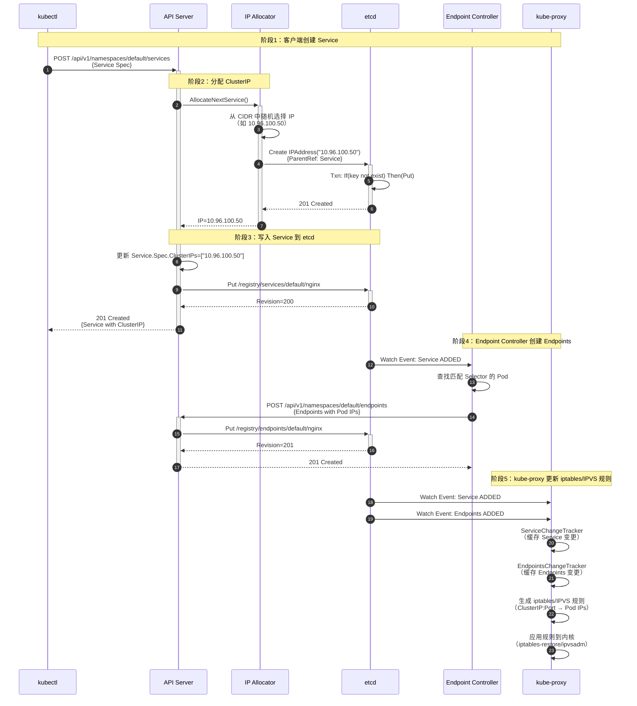

#### 2.8 异常与回退说明

**创建失败场景：**

| 错误场景 | HTTP 状态码 | 错误信息示例 | 回滚操作 |
|---------|------------|------------|---------|
| **ClusterIP 已分配** | 422 Unprocessable Entity | `spec.clusterIPs: Invalid value: "10.96.100.50": failed to allocate IP 10.96.100.50: already allocated` | 无需回滚（IP 未分配） |
| **CIDR 已满** | 500 Internal Server Error | `failed to allocate a serviceIP: range is full` | 无需回滚 |
| **etcd 写入失败** | 500 Internal Server Error | `context deadline exceeded` | 自动回滚（释放 IPAddress） |
| **NodePort 冲突** | 422 Unprocessable Entity | `spec.ports[0].nodePort: Invalid value: 30080: provided port is already allocated` | 自动回滚（释放 ClusterIP） |

**幂等性保证：**
- Service Create 操作**非幂等**：重复创建同名 Service 返回 409 Conflict
- ClusterIP 分配幂等：如果 Service 指定了 `spec.clusterIP`，重复创建会尝试分配相同 IP（如果 IP 已被占用则失败）

**补偿机制：**
- Service 创建失败时，会自动释放已分配的 ClusterIP 和 NodePort（通过事务回滚）
- IPAddress 资源通过 OwnerReference 关联 Service，Service 删除时自动级联删除 IPAddress

#### 2.9 性能要点与最佳实践

**性能关键路径：**
1. **ClusterIP 分配延迟**：随机算法平均 1-5 次尝试（P99 < 10ms）
   - CIDR 利用率高时（> 80%）分配延迟显著增加
   - 建议：CIDR 大小至少为 Service 数量的 2 倍

2. **Endpoint Controller 延迟**：Pod 创建到 Endpoints 更新（P99 1-5s）
   - 依赖 Informer 缓存同步延迟
   - 优化：增加 Endpoint Controller 的 API QPS 限制

3. **kube-proxy 规则同步延迟**：Endpoints 更新到 iptables/IPVS 规则生效（P99 1-10s）
   - 依赖 kube-proxy 的 SyncPeriod（默认 30s，可通过 `--min-sync-period` 缩短）
   - 优化：使用 IPVS 模式（性能优于 iptables）

**最佳实践：**

1. **使用 Headless Service 进行 Pod 间直连**
   - `spec.clusterIP: None`：不分配 ClusterIP，DNS 返回 Pod IP 列表
   - 适用场景：StatefulSet、数据库集群（需要稳定的网络标识）

2. **合理配置 SessionAffinity**
   - `spec.sessionAffinity: ClientIP`：相同客户端 IP 的请求路由到同一 Pod
   - 适用场景：有状态应用（如会话缓存）
   - 注意：可能导致负载不均衡

3. **避免频繁更新 Service**
   - Service 更新会触发 kube-proxy 全量规则同步（开销较大）
   - 建议：使用 Ingress 或 Gateway API 进行流量管理（更灵活）

4. **使用 EndpointSlice 替代 Endpoints**
   - Endpoints 资源大小有上限（1MB，约 1000 个 Pod）
   - EndpointSlice 支持更大规模（每个 Slice 最多 1000 个 Endpoint，支持多个 Slice）

---

## 其他核心 API 简述

由于篇幅限制，以下API 仅提供简要说明，详细规格可参考 Kubernetes API 文档：

### 3. Deployment API（apps/v1）

- **核心功能**：声明式更新、滚动发布、回滚
- **关键字段**：`spec.replicas`（副本数）、`spec.strategy`（更新策略）、`spec.template`（Pod 模板）
- **Controller**：Deployment Controller 监听 Deployment 变化，创建/更新 ReplicaSet

### 4. Node API（v1）

- **核心功能**：集群节点管理、资源容量报告、节点状态维护
- **关键字段**：`spec.taints`（污点）、`spec.unschedulable`（禁止调度）、`status.conditions`（节点状态）
- **kubelet**：定期上报 Node 状态（NodeStatus）

### 5. ConfigMap & Secret API（v1）

- **核心功能**：配置数据和敏感数据的存储与注入
- **关键字段**：`data`（键值对）、`binaryData`（二进制数据）
- **注入方式**：环境变量、Volume 挂载、SubPath

### 6. PersistentVolume & PersistentVolumeClaim API（v1）

- **核心功能**：持久化存储的声明式管理
- **关键字段**：`spec.capacity`（容量）、`spec.accessModes`（访问模式）、`spec.storageClassName`（存储类）
- **Controller**：PV Controller 负责 PV 与 PVC 的绑定（Binding）

---

**文档维护：**
- 版本：v1.0
- 最后更新：2025-10-04
- 适用 Kubernetes 版本：v1.29+