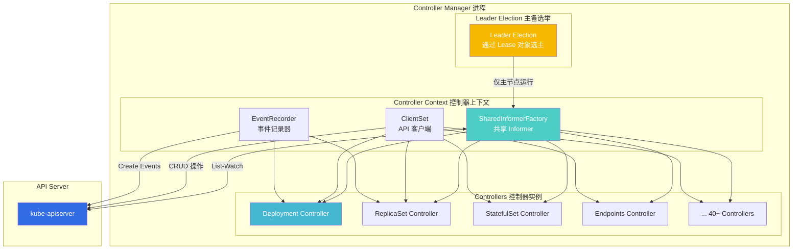
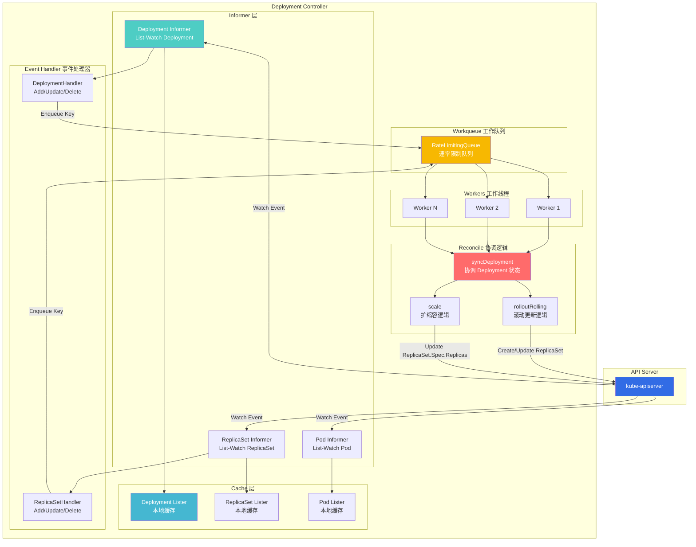
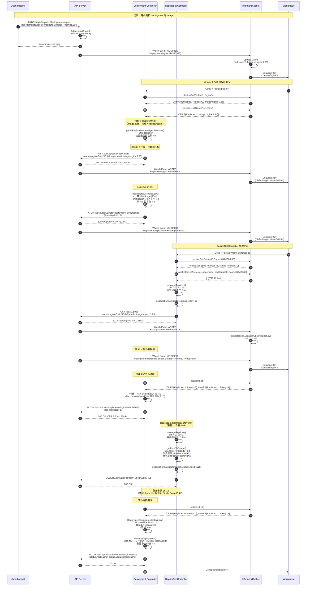
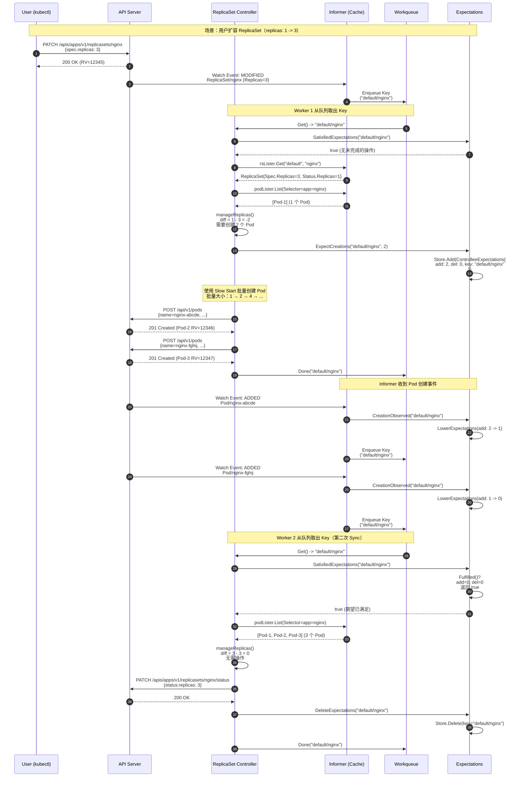
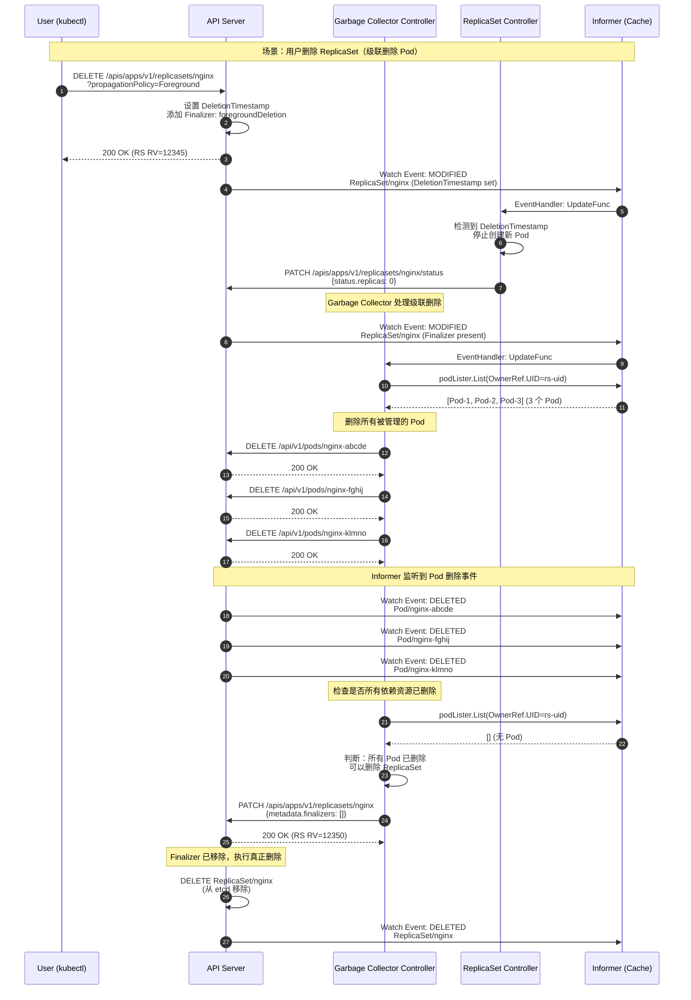
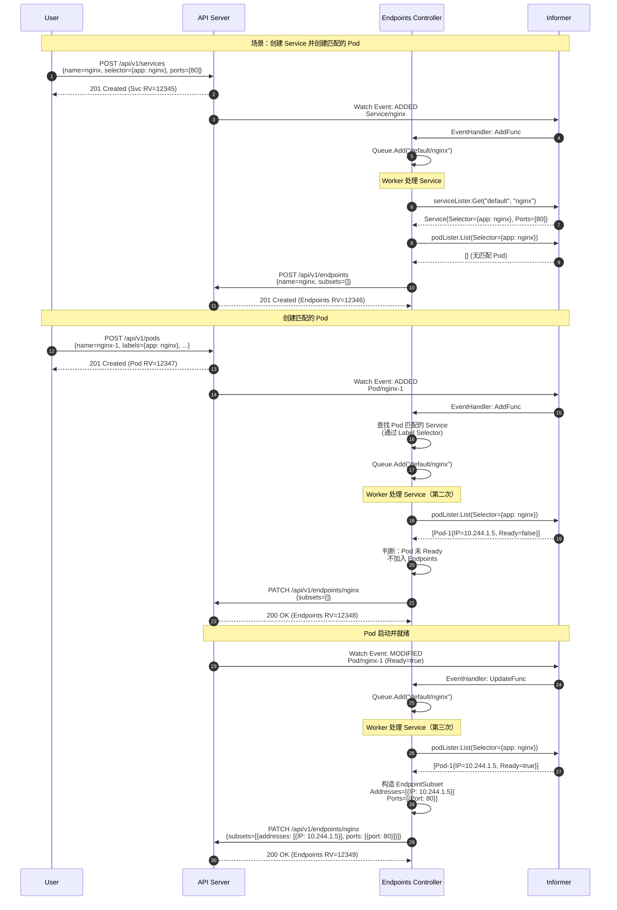
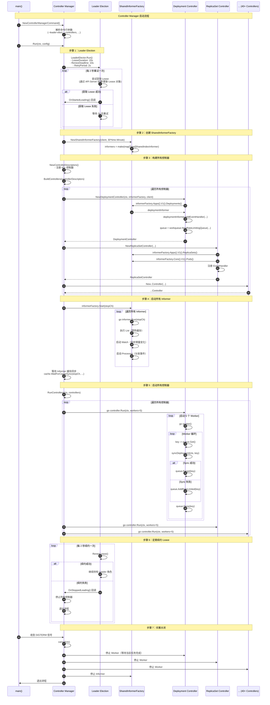
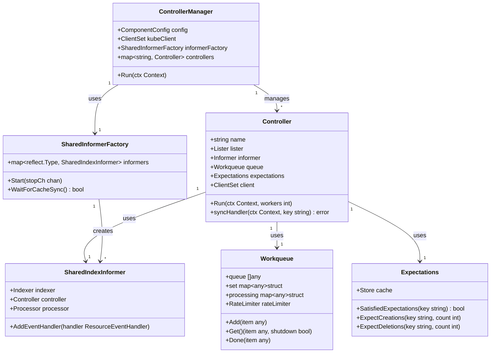
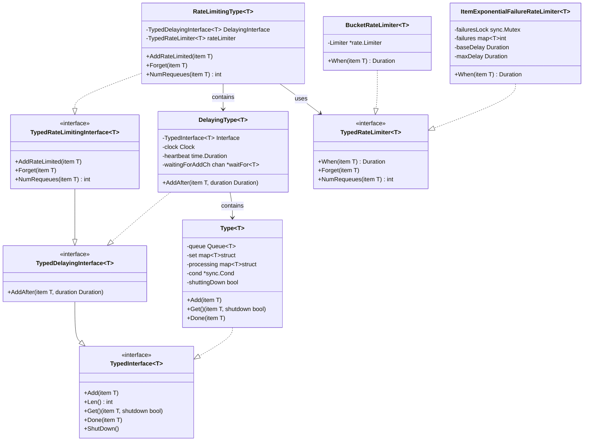

# Kubernetes-02-Controller Manager-概览

## 模块职责

kube-controller-manager 是 Kubernetes 控制平面的**控制循环管理器**，负责运行集群的核心控制器（Controllers）。它通过持续监听集群状态变化，自动将**实际状态（Actual State）**协调为**期望状态（Desired State）**，实现 Kubernetes 的**声明式 API** 特性。

### 核心职责

1. **运行内置控制器**
   - 管理 40+ 内置控制器（Deployment、ReplicaSet、StatefulSet、DaemonSet 等）
   - 每个控制器独立运行，负责特定资源类型的生命周期管理
   - 控制器间通过资源对象的 OwnerReference 协同工作

2. **状态协调（Reconciliation）**
   - 持续监听资源对象的变化（通过 List-Watch 机制）
   - 比较期望状态（Spec）与实际状态（Status）
   - 执行必要的操作使实际状态趋向期望状态（创建/更新/删除资源）

3. **级联操作**
   - 通过 OwnerReference 实现资源的级联删除（如删除 Deployment 自动删除 ReplicaSet 和 Pod）
   - 通过 Finalizer 机制保证资源删除前执行清理操作

4. **事件记录**
   - 记录控制器执行的重要操作（如 Pod 创建失败、扩缩容事件）
   - 事件可通过 `kubectl get events` 查看

### 输入/输出

**输入：**
- **Watch 事件**：来自 API Server 的资源变化事件（ADDED/MODIFIED/DELETED）
- **定期 Resync**：定期全量同步（默认 30 分钟），确保状态一致性

**输出：**
- **API 请求**：向 API Server 发送资源的 CRUD 请求（创建/更新/删除子资源）
- **Status 更新**：更新资源的 Status 字段（如 Deployment.Status.Replicas）
- **Event 记录**：记录操作日志到 Event 资源

### 上下游依赖

**上游（被调用方）：**
- API Server：获取资源对象、提交变更、监听事件

**下游（调用方）：**
- 无（Controller Manager 不对外提供 API，仅消费 API Server 的 Watch）

### 生命周期

```go
// 启动流程（简化版）
func main() {
    // 1. 创建控制器上下文（包含 SharedInformerFactory、ClientSet 等）
    controllerContext := CreateControllerContext(config)
    
    // 2. 构建所有控制器实例
    controllers := BuildControllers(controllerContext)
    
    // 3. 启动所有 Informer（开始 List-Watch）
    controllerContext.InformerFactory.Start(stopCh)
    
    // 4. 启动所有控制器（每个控制器一个 Goroutine）
    RunControllers(controllerContext, controllers)
}
```

**启动阶段：**
1. Leader Election（主备选举，确保只有一个实例工作）
2. 创建 SharedInformerFactory（共享 Informer，减少 API Server 压力）
3. 初始化所有控制器（构造函数）
4. 启动 Informer（List-Watch，预热缓存）
5. 启动控制器 Worker（处理 Workqueue 中的事件）

**运行阶段：**
- Informer 持续监听资源变化，将事件写入 Workqueue
- Worker 从 Workqueue 取出事件，调用 Reconcile 函数
- Reconcile 函数执行状态协调逻辑（创建/更新/删除资源）
- 失败的事件重新入队（带速率限制）

**停止阶段：**
1. 收到 SIGTERM 信号
2. 停止接受新事件（停止 Informer）
3. 等待所有 Worker 处理完当前事件（优雅关闭，默认 60s）
4. 退出进程

---

## 内置控制器清单

Controller Manager 运行 40+ 内置控制器，按功能分类如下：

### 1. 工作负载控制器（Workload Controllers）

| 控制器名称 | 管理的资源 | 职责 |
|-----------|-----------|------|
| **Deployment Controller** | Deployment → ReplicaSet | 管理 Deployment 的滚动更新、回滚、扩缩容 |
| **ReplicaSet Controller** | ReplicaSet → Pod | 维持 Pod 副本数量，创建/删除 Pod |
| **StatefulSet Controller** | StatefulSet → Pod | 有状态应用，提供稳定的网络标识和持久化存储 |
| **DaemonSet Controller** | DaemonSet → Pod | 在每个节点上运行一个 Pod 副本 |
| **Job Controller** | Job → Pod | 一次性任务，运行完成后退出 |
| **CronJob Controller** | CronJob → Job | 定时任务，按 Cron 表达式调度 |
| **Replication Controller** | ReplicationController → Pod | 早期的副本控制器（已被 ReplicaSet 取代） |

### 2. 服务与网络控制器（Service & Networking Controllers）

| 控制器名称 | 管理的资源 | 职责 |
|-----------|-----------|------|
| **Endpoints Controller** | Service → Endpoints | 根据 Service Selector 创建/更新 Endpoints |
| **EndpointSlice Controller** | Service → EndpointSlice | Endpoints 的可扩展替代方案（支持更大规模） |
| **EndpointSlice Mirroring Controller** | Endpoints → EndpointSlice | 将 Endpoints 镜像为 EndpointSlice（兼容性） |
| **Service Controller** (Cloud) | Service (LoadBalancer) → Cloud LB | 云厂商 LoadBalancer 集成（创建/删除 LB） |

### 3. 节点管理控制器（Node Management Controllers）

| 控制器名称 | 管理的资源 | 职责 |
|-----------|-----------|------|
| **Node Lifecycle Controller** | Node → Pod | 节点状态监控、Pod 驱逐（节点不健康时） |
| **Node IPAM Controller** | Node → PodCIDR | 为节点分配 Pod CIDR 范围 |
| **Node Route Controller** (Cloud) | Node → Cloud Routes | 云厂商路由表管理 |

### 4. 资源管理控制器（Resource Management Controllers）

| 控制器名称 | 管理的资源 | 职责 |
|-----------|-----------|------|
| **ResourceQuota Controller** | ResourceQuota | 强制命名空间的资源配额限制 |
| **Namespace Controller** | Namespace → 所有资源 | 命名空间删除时级联删除所有资源 |
| **ServiceAccount Controller** | ServiceAccount → Secret | 为 ServiceAccount 创建 Token Secret |
| **Garbage Collector Controller** | 所有资源 | 垃圾回收（级联删除、孤儿对象清理） |
| **Pod Garbage Collector Controller** | Pod | 清理已完成/失败的 Pod（根据 TTL） |

### 5. 存储控制器（Storage Controllers）

| 控制器名称 | 管理的资源 | 职责 |
|-----------|-----------|------|
| **PersistentVolume Binder Controller** | PVC → PV | 绑定 PVC 到可用的 PV |
| **Attach/Detach Controller** | VolumeAttachment | 卷的挂载/卸载（调用 CSI Driver） |
| **PV Protection Controller** | PV | 防止正在使用的 PV 被删除 |
| **PVC Protection Controller** | PVC | 防止正在使用的 PVC 被删除 |
| **Expand Controller** | PVC | 扩展 PVC 容量（调用 CSI Driver） |
| **Ephemeral Volume Controller** | Pod → PVC | 管理临时卷的生命周期 |

### 6. 证书与权限控制器（Certificate & Authorization Controllers）

| 控制器名称 | 管理的资源 | 职责 |
|-----------|-----------|------|
| **CSR Signing Controller** | CertificateSigningRequest | 自动签发证书 |
| **CSR Approving Controller** | CSR | 自动批准证书签发请求 |
| **CSR Cleaner Controller** | CSR | 清理过期的 CSR |
| **ClusterRole Aggregation Controller** | ClusterRole | 聚合 ClusterRole（根据 Label 合并） |
| **Root CA Publisher Controller** | ConfigMap | 发布集群根 CA 证书到 kube-root-ca.crt ConfigMap |

### 7. 其他控制器（Other Controllers）

| 控制器名称 | 管理的资源 | 职责 |
|-----------|-----------|------|
| **HPA Controller** | HorizontalPodAutoscaler | 水平自动扩缩容（根据 CPU/内存/自定义指标） |
| **Disruption Controller** | PodDisruptionBudget | 控制主动驱逐时的最小可用副本数 |
| **TTL Controller** | Node | 删除过期的 Node 对象（节点长期失联） |
| **TTL After Finished Controller** | Job/Pod | 自动删除已完成的 Job/Pod（根据 TTL） |
| **Bootstrap Signer Controller** | ConfigMap | 签名 Bootstrap Token |
| **Token Cleaner Controller** | Secret | 清理过期的 ServiceAccount Token |

---

## 模块级架构图

### 控制器管理器整体架构



### 单个控制器内部架构（以 Deployment Controller 为例）



### 架构说明

#### SharedInformerFactory（共享 Informer 工厂）

**作用：**
- 多个控制器共享同一个资源类型的 Informer（减少 API Server 压力）
- 每个资源类型只建立一个 Watch 连接
- 事件通过 Broadcaster 分发给多个控制器

**示例：**
```go
// 多个控制器共享 Pod Informer
podInformer := sharedInformerFactory.Core().V1().Pods()

// Deployment Controller 使用
deploymentController.podLister = podInformer.Lister()

// ReplicaSet Controller 使用
replicaSetController.podLister = podInformer.Lister()

// DaemonSet Controller 使用
daemonSetController.podLister = podInformer.Lister()
```

#### Workqueue（工作队列）

**核心功能：**
1. **去重**：相同 Key 的多个事件合并为一个（避免重复处理）
2. **速率限制**：指数退避（初始 1s，最大 1000s），防止失败事件频繁重试
3. **延迟重试**：失败的事件重新入队，等待一段时间后重试
4. **优先级**：支持优先级队列（高优先级事件优先处理）

**Workqueue 类型：**
- **Interface**：基础队列（FIFO）
- **DelayingInterface**：延迟队列（支持延迟入队）
- **RateLimitingInterface**：速率限制队列（指数退避）

#### Reconcile Loop（协调循环）

**工作原理：**
```go
// 1. Worker 从队列取出 Key
key := queue.Get()

// 2. 调用 Reconcile 函数
err := controller.syncDeployment(ctx, key)

// 3. 根据结果决定是否重新入队
if err != nil {
    queue.AddRateLimited(key)  // 失败重试
} else {
    queue.Forget(key)           // 成功，从速率限制器中移除
}
queue.Done(key)                 // 标记处理完成
```

**Reconcile 函数特点：**
- **幂等性**：多次调用结果相同（状态已达到期望时，不执行任何操作）
- **边界条件处理**：资源已删除、资源不存在、资源被其他控制器管理
- **错误处理**：失败时返回错误，触发重试

---

## 边界条件与约束

### 并发与线程

**Worker 并发数：**
- 默认每个控制器 5 个 Worker（可通过 `--concurrent-xxx-syncs` 配置）
- Worker 数量过多会增加 API Server 压力
- Worker 数量过少会降低处理速度

**Informer 缓存同步：**
- 启动时执行全量 List（预热缓存）
- 缓存未同步完成前，控制器不处理事件（避免基于不完整数据做决策）

**并发安全：**
- Informer 缓存为只读副本，多 Goroutine 并发访问无需加锁
- Workqueue 内部有锁保护（线程安全）

### 扩展点

**自定义控制器：**
- 使用 client-go 的 Informer 和 Workqueue 框架
- 实现 Reconcile 函数（核心业务逻辑）
- 注册 EventHandler（监听资源变化）

**Operator 模式：**
- 自定义资源（CRD）+ 自定义控制器
- 扩展 Kubernetes API（如 Prometheus Operator、Istio Operator）

### 状态持有位置

**内存缓存（Informer）：**
- Informer 的 Indexer 缓存所有资源对象（减少 API 调用）
- 缓存定期 Resync（默认 30 分钟），确保与 etcd 一致

**API Server / etcd：**
- 资源对象的当前状态（Spec + Status）
- 控制器通过 API Server 读写状态

**Workqueue：**
- 待处理的事件 Key（不存储完整对象，仅存储 namespace/name）

### 资源占用要点

**CPU：**
- Worker 并发处理事件（CPU 占用与事件频率成正比）
- Reconcile 函数的计算复杂度（如 Deployment 滚动更新需要计算 Pod 数量）

**内存：**
- Informer 缓存所有资源对象（内存占用与集群规模成正比）
- 大集群建议增加内存（单个 Informer 可能占用数百 MB）

**网络：**
- Informer 的 List-Watch 连接（每个资源类型一个长连接）
- API 请求（创建/更新/删除资源）

---

## 关键代码片段

### 控制器管理器启动流程

```go
// cmd/kube-controller-manager/app/controllermanager.go

// Run 启动 Controller Manager（主循环）
func Run(ctx context.Context, c *config.CompletedConfig) error {
    // 1. 创建控制器上下文（SharedInformerFactory、ClientSet、EventRecorder）
    controllerContext, err := CreateControllerContext(ctx, c, rootClientBuilder, clientBuilder)
    if err != nil {
        return err
    }
    
    // 2. 构建所有控制器实例
    //    - 注册所有内置控制器（Deployment、ReplicaSet、StatefulSet 等）
    //    - 调用每个控制器的构造函数
    controllerDescriptors := NewControllerDescriptors()
    controllers, err := BuildControllers(ctx, controllerContext, controllerDescriptors, unsecuredMux, healthzHandler)
    if err != nil {
        return err
    }
    
    // 3. 启动所有 Informer（开始 List-Watch）
    //    - 执行全量 List（预热缓存）
    //    - 启动 Watch 连接（监听增量变化）
    controllerContext.InformerFactory.Start(stopCh)
    close(controllerContext.InformersStarted)  // 通知所有控制器 Informer 已启动
    
    // 4. 等待 Informer 缓存同步完成
    //    - 确保本地缓存与 etcd 一致
    //    - 同步完成前，控制器不处理事件
    if !cache.WaitForCacheSync(stopCh, controllerContext.InformerFactory.WaitForCacheSync()) {
        return fmt.Errorf("failed to sync informer caches")
    }
    
    // 5. 启动所有控制器（每个控制器一个 Goroutine）
    //    - 启动 Worker（从 Workqueue 取事件）
    //    - 调用 Reconcile 函数（协调状态）
    if !RunControllers(ctx, controllerContext, controllers, ControllerStartJitter, c.ControllerShutdownTimeout) {
        return fmt.Errorf("failed to run controllers")
    }
    
    return nil
}

// BuildControllers 构建所有控制器实例
func BuildControllers(ctx context.Context, controllerCtx ControllerContext, 
                      controllerDescriptors map[string]*ControllerDescriptor,
                      unsecuredMux *mux.PathRecorderMux, 
                      healthzHandler HealthCheckAdder) ([]Controller, error) {
    var controllers []Controller
    
    // 遍历所有控制器描述符
    for _, controllerDesc := range controllerDescriptors {
        // 检查控制器是否被禁用
        if !controllerCtx.IsControllerEnabled(controllerDesc) {
            continue
        }
        
        // 调用控制器的构造函数
        //    - 传入 InformerFactory、ClientSet、EventRecorder
        //    - 注册 EventHandler（监听资源变化）
        //    - 初始化 Workqueue
        ctrl, err := controllerDesc.BuildController(ctx, controllerCtx)
        if err != nil {
            return nil, err
        }
        
        controllers = append(controllers, ctrl)
    }
    
    return controllers, nil
}

// RunControllers 启动所有控制器（并发运行）
func RunControllers(ctx context.Context, controllerCtx ControllerContext,
                    controllers []Controller, controllerStartJitter float64, 
                    shutdownTimeout time.Duration) bool {
    var wg sync.WaitGroup
    wg.Add(len(controllers))
    
    // 为每个控制器启动一个 Goroutine
    for _, controller := range controllers {
        go func() {
            defer wg.Done()
            
            // 添加随机延迟（避免所有控制器同时启动）
            time.Sleep(wait.Jitter(controllerStartInterval, controllerStartJitter))
            
            // 启动控制器（阻塞运行，直到收到停止信号）
            //    - 启动 Worker
            //    - Worker 从 Workqueue 取事件
            //    - 调用 Reconcile 函数
            controller.Run(ctx)
        }()
    }
    
    // 等待所有控制器停止
    wg.Wait()
    return true
}
```

### Deployment Controller 核心逻辑

```go
// pkg/controller/deployment/deployment_controller.go

// syncDeployment 协调 Deployment 状态（Reconcile 函数）
func (dc *DeploymentController) syncDeployment(ctx context.Context, key string) error {
    // 1. 从缓存中获取 Deployment 对象
    namespace, name, err := cache.SplitMetaNamespaceKey(key)
    deployment, err := dc.dLister.Deployments(namespace).Get(name)
    if errors.IsNotFound(err) {
        // Deployment 已被删除，无需处理
        return nil
    }
    
    // 2. 深拷贝（避免修改缓存中的对象）
    d := deployment.DeepCopy()
    
    // 3. 列出所有被 Deployment 管理的 ReplicaSet
    //    - 通过 OwnerReference 查找
    //    - 处理孤儿 ReplicaSet（Adoption/Orphaning）
    rsList, err := dc.getReplicaSetsForDeployment(ctx, d)
    if err != nil {
        return err
    }
    
    // 4. 列出所有被 ReplicaSet 管理的 Pod
    //    - 用于检查 Pod 是否正确标记了 pod-template-hash
    //    - 用于 Recreate 策略时检查旧 Pod 是否已删除
    podMap, err := dc.getPodMapForDeployment(d, rsList)
    if err != nil {
        return err
    }
    
    // 5. 处理 Deployment 删除
    if d.DeletionTimestamp != nil {
        return dc.syncStatusOnly(ctx, d, rsList)
    }
    
    // 6. 处理 Deployment Paused（暂停）
    if d.Spec.Paused {
        return dc.sync(ctx, d, rsList)
    }
    
    // 7. 处理 Rollback（回滚）
    if getRollbackTo(d) != nil {
        return dc.rollback(ctx, d, rsList)
    }
    
    // 8. 处理 Scaling（扩缩容）
    scalingEvent, err := dc.isScalingEvent(ctx, d, rsList)
    if err != nil {
        return err
    }
    if scalingEvent {
        return dc.sync(ctx, d, rsList)
    }
    
    // 9. 根据更新策略执行滚动更新
    switch d.Spec.Strategy.Type {
    case apps.RecreateDeploymentStrategyType:
        // Recreate 策略：先删除所有旧 Pod，再创建新 Pod
        return dc.rolloutRecreate(ctx, d, rsList, podMap)
    case apps.RollingUpdateDeploymentStrategyType:
        // RollingUpdate 策略：逐步替换旧 Pod
        return dc.rolloutRolling(ctx, d, rsList)
    }
    
    return fmt.Errorf("unexpected deployment strategy type: %s", d.Spec.Strategy.Type)
}

// rolloutRolling 执行滚动更新
func (dc *DeploymentController) rolloutRolling(ctx context.Context, d *apps.Deployment, rsList []*apps.ReplicaSet) error {
    // 1. 获取新 ReplicaSet 和所有旧 ReplicaSet
    //    - 新 ReplicaSet：Pod Template 与 Deployment 当前 Spec 一致
    //    - 旧 ReplicaSet：Pod Template 与 Deployment 历史 Spec 一致
    newRS, oldRSs, err := dc.getAllReplicaSetsAndSyncRevision(ctx, d, rsList, true)
    if err != nil {
        return err
    }
    allRSs := append(oldRSs, newRS)
    
    // 2. Scale Up 新 ReplicaSet（如果可以）
    //    - 根据 MaxSurge 计算最大可创建的 Pod 数量
    //    - 调用 API Server 更新 ReplicaSet.Spec.Replicas
    scaledUp, err := dc.reconcileNewReplicaSet(ctx, allRSs, newRS, d)
    if err != nil {
        return err
    }
    if scaledUp {
        // 更新 Deployment Status（Ready Replicas、Updated Replicas 等）
        return dc.syncRolloutStatus(ctx, allRSs, newRS, d)
    }
    
    // 3. Scale Down 旧 ReplicaSet（如果可以）
    //    - 根据 MaxUnavailable 计算最多可删除的 Pod 数量
    //    - 优先删除最旧的 ReplicaSet 的 Pod
    scaledDown, err := dc.reconcileOldReplicaSets(ctx, allRSs, 
                                                   controller.FilterActiveReplicaSets(oldRSs), 
                                                   newRS, d)
    if err != nil {
        return err
    }
    if scaledDown {
        return dc.syncRolloutStatus(ctx, allRSs, newRS, d)
    }
    
    // 4. 检查 Deployment 是否完成（所有 Pod 已更新且就绪）
    if deploymentutil.DeploymentComplete(d, &d.Status) {
        // 清理旧 ReplicaSet（根据 RevisionHistoryLimit 保留历史版本）
        if err := dc.cleanupDeployment(ctx, oldRSs, d); err != nil {
            return err
        }
    }
    
    // 5. 同步 Deployment Status
    return dc.syncRolloutStatus(ctx, allRSs, newRS, d)
}
```

### ReplicaSet Controller 核心逻辑

```go
// pkg/controller/replicaset/replica_set.go

// syncReplicaSet 协调 ReplicaSet 状态
func (rsc *ReplicaSetController) syncReplicaSet(ctx context.Context, key string) error {
    // 1. 从缓存中获取 ReplicaSet 对象
    namespace, name, err := cache.SplitMetaNamespaceKey(key)
    rs, err := rsc.rsLister.ReplicaSets(namespace).Get(name)
    if apierrors.IsNotFound(err) {
        // ReplicaSet 已被删除
        return nil
    }
    
    // 2. 检查 Expectations（期望状态）
    //    - Expectations 记录了正在进行的 Pod 创建/删除操作
    //    - 如果有未完成的操作，跳过本次 Sync（避免重复操作）
    rsNeedsSync := rsc.expectations.SatisfiedExpectations(key)
    if !rsNeedsSync {
        return nil
    }
    
    // 3. 列出所有被 ReplicaSet 管理的 Pod
    //    - 通过 OwnerReference 查找
    //    - 处理孤儿 Pod（Adoption/Orphaning）
    selector, err := metav1.LabelSelectorAsSelector(rs.Spec.Selector)
    allPods, err := rsc.podLister.Pods(rs.Namespace).List(selector)
    activePods := controller.FilterActivePods(allPods)
    activePods, err := rsc.claimPods(ctx, rs, selector, activePods)
    if err != nil {
        return err
    }
    
    // 4. 计算需要创建/删除的 Pod 数量
    //    - diff = len(activePods) - rs.Spec.Replicas
    //    - diff < 0：需要创建 Pod
    //    - diff > 0：需要删除 Pod
    manageReplicasErr := rsc.manageReplicas(ctx, activePods, rs)
    
    // 5. 更新 ReplicaSet Status
    rs = rs.DeepCopy()
    newStatus := calculateStatus(rs, activePods, manageReplicasErr)
    _, err = updateReplicaSetStatus(ctx, rsc.kubeClient.AppsV1().ReplicaSets(rs.Namespace), rs, newStatus)
    
    return manageReplicasErr
}

// manageReplicas 创建或删除 Pod
func (rsc *ReplicaSetController) manageReplicas(ctx context.Context, activePods []*v1.Pod, rs *apps.ReplicaSet) error {
    // 计算差值
    diff := len(activePods) - int(*(rs.Spec.Replicas))
    rsKey, _ := controller.KeyFunc(rs)
    
    if diff < 0 {
        // 需要创建 Pod
        diff *= -1
        if diff > rsc.burstReplicas {
            diff = rsc.burstReplicas  // 限制单次创建数量
        }
        
        // 记录 Expectations（防止重复创建）
        rsc.expectations.ExpectCreations(rsKey, diff)
        
        // 批量创建 Pod（使用 Slow Start 算法）
        //    - 初始批量大小：1
        //    - 每次成功后加倍：1 → 2 → 4 → 8 → ...
        //    - 避免大量 Pod 同时失败
        successfulCreations, err := slowStartBatch(diff, controller.SlowStartInitialBatchSize, func() error {
            return rsc.podControl.CreatePods(ctx, rs.Namespace, &rs.Spec.Template, rs, 
                                             metav1.NewControllerRef(rs, rsc.GroupVersionKind))
        })
        
        // 更新 Expectations（减去未创建的 Pod）
        if skippedPods := diff - successfulCreations; skippedPods > 0 {
            rsc.expectations.CreationObserved(rsKey)
        }
        
        return err
    } else if diff > 0 {
        // 需要删除 Pod
        if diff > rsc.burstReplicas {
            diff = rsc.burstReplicas  // 限制单次删除数量
        }
        
        // 记录 Expectations（防止重复删除）
        rsc.expectations.ExpectDeletions(rsKey, getPodKeys(podsToDelete))
        
        // 批量删除 Pod
        //    - 优先删除 NotReady 的 Pod
        //    - 优先删除 Unscheduled 的 Pod
        //    - 优先删除运行时间短的 Pod
        podsToDelete := getPodsToDelete(activePods, diff)
        errCh := make(chan error, diff)
        var wg sync.WaitGroup
        wg.Add(diff)
        for _, pod := range podsToDelete {
            go func(targetPod *v1.Pod) {
                defer wg.Done()
                if err := rsc.podControl.DeletePod(ctx, rs.Namespace, targetPod.Name, rs); err != nil {
                    rsc.expectations.DeletionObserved(rsKey, getPodKey(targetPod))
                    errCh <- err
                }
            }(pod)
        }
        wg.Wait()
        
        select {
        case err := <-errCh:
            return err
        default:
        }
    }
    
    return nil
}
```

---

## 扩展与边界

### 模块边界

**不负责的功能：**
- Pod 调度决策（由 kube-scheduler 负责）
- 容器启停（由 kubelet 负责）
- 网络规则配置（由 kube-proxy 负责）

**对外接口边界：**
- 无对外 HTTP API（仅消费 API Server 的 Watch）
- 通过 API Server 间接影响集群状态

### 扩展点

**自定义控制器开发：**
```go
// 使用 client-go 框架开发自定义控制器
type Controller struct {
    informerFactory informers.SharedInformerFactory
    fooLister       listers.FooLister
    queue           workqueue.RateLimitingInterface
    client          clientset.Interface
}

func (c *Controller) Run(ctx context.Context, workers int) {
    // 1. 启动 Informer
    c.informerFactory.Start(ctx.Done())
    
    // 2. 等待缓存同步
    if !cache.WaitForCacheSync(ctx.Done(), c.informerFactory.WaitForCacheSync()) {
        return
    }
    
    // 3. 启动 Worker
    for i := 0; i < workers; i++ {
        go wait.UntilWithContext(ctx, c.worker, time.Second)
    }
    
    <-ctx.Done()
}

func (c *Controller) worker(ctx context.Context) {
    for c.processNextWorkItem(ctx) {
    }
}

func (c *Controller) processNextWorkItem(ctx context.Context) bool {
    key, quit := c.queue.Get()
    if quit {
        return false
    }
    defer c.queue.Done(key)
    
    err := c.syncFoo(ctx, key)
    if err == nil {
        c.queue.Forget(key)
    } else {
        c.queue.AddRateLimited(key)
    }
    
    return true
}

func (c *Controller) syncFoo(ctx context.Context, key string) error {
    // Reconcile 逻辑
    namespace, name, _ := cache.SplitMetaNamespaceKey(key)
    foo, err := c.fooLister.Foos(namespace).Get(name)
    if err != nil {
        return err
    }
    
    // 协调状态
    // ...
    
    return nil
}
```

---

**文档维护：**
- 版本：v1.0
- 最后更新：2025-10-04
- 适用 Kubernetes 版本：v1.29+

---

# Kubernetes-02-Controller Manager-时序图

## 时序图概述

本文档提供 Controller Manager 核心控制器的典型场景时序图，包括：
1. **Deployment 滚动更新流程**：完整的滚动更新生命周期
2. **ReplicaSet 扩容流程**：Pod 创建与 Expectations 机制
3. **Pod 删除与垃圾回收**：级联删除与 OwnerReference
4. **Endpoints 同步流程**：Service 到 Endpoints 的映射
5. **Controller Manager 启动流程**：Leader Election 与控制器初始化

---

## 场景 1：Deployment 滚动更新流程

### 时序图



### 要点说明

#### 1. 图意概述
- **触发条件**：用户更新 Deployment 的 Pod Template（如 Image、Env、Resources）
- **核心流程**：创建新 ReplicaSet → 逐步扩容新 RS → 逐步缩容旧 RS → 清理旧 RS
- **参与组件**：Deployment Controller、ReplicaSet Controller、API Server、Informer、Workqueue

#### 2. 关键字段与接口
- **MaxSurge**：滚动更新期间最多可超出期望副本数的数量（默认 25%）
- **MaxUnavailable**：滚动更新期间最多不可用的副本数量（默认 25%）
- **Revision**：ReplicaSet 的版本号（通过 Annotation `deployment.kubernetes.io/revision` 记录）

#### 3. 边界条件
- **并发更新**：多次更新 Deployment 时，只保留最新的 ReplicaSet，旧 RS 自动缩容到 0
- **回滚**：设置 `spec.rollbackTo` 时，Deployment Controller 会扩容旧 RS，缩容新 RS
- **暂停**：设置 `spec.paused=true` 时，Deployment Controller 跳过滚动更新逻辑

#### 4. 异常与回退
- **Pod 创建失败**：ReplicaSet Controller 会重试（通过 Workqueue 的指数退避）
- **滚动更新超时**：超过 `spec.progressDeadlineSeconds` 时，Deployment Status 标记为 `Progressing=False`
- **ReplicaSet 冲突**：通过 ResourceVersion 乐观并发控制，冲突时重试

#### 5. 性能与容量假设
- **扩缩容速度**：受 MaxSurge 和 MaxUnavailable 限制（默认每次最多创建/删除 25% 的副本）
- **Pod 启动时间**：滚动更新总时间 = Pod 启动时间 × (Replicas / MaxSurge)
- **API 调用频率**：每次扩缩容至少 2 次 API 调用（Update RS + Update Deployment Status）

#### 6. 版本兼容/演进
- **Revision 计算**：v1.6+ 使用 `pod-template-hash` 作为 ReplicaSet 名称后缀
- **RevisionHistoryLimit**：v1.6+ 支持保留历史 ReplicaSet 数量（默认 10）

---

## 场景 2：ReplicaSet 扩容流程（Expectations 机制）

### 时序图



### 要点说明

#### 1. Expectations 机制作用
- **问题**：Informer 监听到 ReplicaSet 更新事件时，Pod 可能尚未创建完成
- **解决**：记录期望创建的 Pod 数量（`add=2`），Informer 监听到 Pod 创建事件时递减（`add: 2 -> 1 -> 0`）
- **效果**：避免重复创建 Pod（第一次 Sync 创建 2 个 Pod，第二次 Sync 检测到期望未满足，跳过）

#### 2. Slow Start 批量创建
- **算法**：批量大小从 1 开始，每次成功后加倍（1 → 2 → 4 → 8 → ...）
- **目的**：避免大量 Pod 同时创建失败（如资源不足、镜像拉取失败）
- **示例**：创建 100 个 Pod 时，批量大小为 1, 2, 4, 8, 16, 32, 37（总共 7 轮）

#### 3. Expectations 超时
- **超时时间**：5 分钟（`ExpectationsTimeout = 5 * time.Minute`）
- **超时后**：强制执行 Reconcile（即使期望未满足）
- **场景**：Pod 创建失败（API Server 错误、ResourceQuota 限制），期望永远不会满足

---

## 场景 3：Pod 删除与垃圾回收（级联删除）

### 时序图



### 要点说明

#### 1. 级联删除策略
- **Foreground**：先删除依赖资源（Pod），再删除拥有者资源（ReplicaSet）
- **Background**：先删除拥有者资源，Garbage Collector 异步删除依赖资源
- **Orphan**：删除拥有者资源，保留依赖资源（移除 OwnerReference）

#### 2. Finalizer 机制
- **作用**：阻止资源被立即删除，等待清理操作完成
- **添加**：DELETE 请求时，API Server 自动添加 Finalizer（如 `foregroundDeletion`）
- **移除**：Garbage Collector 清理完依赖资源后，移除 Finalizer
- **删除**：Finalizer 为空时，API Server 从 etcd 删除资源

#### 3. OwnerReference
- **作用**：记录资源的拥有者（如 Pod 的 OwnerReference 指向 ReplicaSet）
- **字段**：`apiVersion`, `kind`, `name`, `uid`, `controller`, `blockOwnerDeletion`
- **查询**：Garbage Collector 通过 OwnerReference 查找依赖资源

---

## 场景 4：Endpoints 同步流程

### 时序图



### 要点说明

#### 1. Endpoints 同步时机
- **Service 创建/更新**：立即同步 Endpoints
- **Pod 创建/更新/删除**：查找匹配的 Service，同步 Endpoints
- **定期 Resync**：每 30 分钟全量同步（确保一致性）

#### 2. Pod Ready 条件
- **Readiness Probe**：Pod 的 Readiness Probe 成功
- **Pod Phase**：Phase = Running
- **Container Ready**：所有 Container Ready = true

#### 3. Endpoints 限制
- **最大 Pod 数**：单个 Endpoints 资源最多 1000 个 Pod（超出后截断）
- **替代方案**：使用 EndpointSlice（支持更大规模，单个 Slice 最多 100 个 Endpoints）

---

## 场景 5：Controller Manager 启动流程

### 时序图



### 要点说明

#### 1. Leader Election 参数
- **LeaseDuration**：Lease 的有效期（默认 15s）
- **RenewDeadline**：续约的最后期限（默认 10s，超过则放弃 Leader 角色）
- **RetryPeriod**：重试间隔（默认 2s）

#### 2. Informer 启动顺序
1. 执行 List（全量同步，预热缓存）
2. 启动 Watch（增量同步）
3. 等待缓存同步完成（`HasSynced() == true`）
4. 启动控制器 Worker

#### 3. Worker 并发数
- **默认**：每个控制器 5 个 Worker
- **配置**：通过命令行参数 `--concurrent-xxx-syncs` 配置（如 `--concurrent-deployment-syncs=10`）
- **影响**：Worker 数量过多会增加 API Server 压力，过少会降低处理速度

---

## 性能与可观测性

### 1. 关键指标

| 指标 | 类型 | 说明 |
|-----|------|------|
| `workqueue_depth` | Gauge | Workqueue 队列长度（反映待处理事件数量） |
| `workqueue_adds_total` | Counter | Workqueue 累计添加事件数量 |
| `workqueue_retries_total` | Counter | Workqueue 累计重试次数 |
| `workqueue_work_duration_seconds` | Histogram | Reconcile 函数执行时间 |
| `controller_reconcile_total` | Counter | 控制器累计 Reconcile 次数 |
| `controller_reconcile_errors_total` | Counter | 控制器累计 Reconcile 失败次数 |

### 2. 性能调优建议

**Workqueue 调优：**
- **增加 Worker 数量**：提高并发处理能力（适用于 Reconcile 函数耗时短的场景）
- **减少 Resync 周期**：降低 API Server 压力（适用于集群规模大的场景）

**Informer 调优：**
- **禁用不必要的 Informer**：减少内存占用和 Watch 连接数
- **使用 Field Selector**：减少 Informer 缓存的对象数量（如只监听特定命名空间）

**Expectations 调优：**
- **减少超时时间**：加快失败重试（默认 5 分钟）
- **禁用 Expectations**：适用于不需要去重的场景（如 StatefulSet Controller）

---

**文档维护：**
- 版本：v1.0
- 最后更新：2025-10-04
- 适用 Kubernetes 版本：v1.29+

---

# Kubernetes-02-Controller Manager-数据结构

## 数据结构概述

Controller Manager 的核心数据结构围绕**事件驱动架构**设计，主要包括：
1. **Workqueue（工作队列）**：存储待处理的资源 Key
2. **Expectations（期望状态）**：跟踪正在进行的操作，避免重复处理
3. **Informer & Lister（缓存层）**：本地缓存资源对象，减少 API 调用
4. **Controller 结构体**：控制器的状态和依赖

---

## 核心数据结构 UML 图

### 1. Controller Manager 整体数据结构



### 2. Workqueue 数据结构



---

## 数据结构详解

### 1. Workqueue（工作队列）

#### 1.1 TypedInterface（基础队列接口）

```go
// staging/src/k8s.io/client-go/util/workqueue/queue.go

// TypedInterface 基础队列接口
type TypedInterface[T comparable] interface {
    // Add 添加项目到队列（去重：相同项目只添加一次）
    Add(item T)
    
    // Len 返回队列长度
    Len() int
    
    // Get 获取队列中的下一个项目（阻塞直到有项目或队列关闭）
    Get() (item T, shutdown bool)
    
    // Done 标记项目处理完成（必须在 Get 后调用）
    Done(item T)
    
    // ShutDown 关闭队列
    ShutDown()
    
    // ShuttingDown 返回队列是否正在关闭
    ShuttingDown() bool
}
```

**字段说明：**

| 字段 | 类型 | 说明 |
|-----|------|------|
| `queue` | `Queue[T]` | 底层队列（默认为 FIFO 切片） |
| `set` | `map[T]struct{}` | 去重集合（已在队列中的项目） |
| `processing` | `map[T]struct{}` | 正在处理中的项目集合 |
| `cond` | `*sync.Cond` | 条件变量（用于 Get 阻塞） |
| `shuttingDown` | `bool` | 是否正在关闭 |

**核心机制：**

```go
// Type 实现了 TypedInterface
type Type[T comparable] struct {
    queue       Queue[T]
    set         map[T]struct{}
    processing  map[T]struct{}
    cond        *sync.Cond
    shuttingDown bool
}

// Add 添加项目（去重）
func (q *Type[T]) Add(item T) {
    q.cond.L.Lock()
    defer q.cond.L.Unlock()
    
    if q.shuttingDown {
        return
    }
    
    // 如果项目已在队列中或正在处理中，跳过
    if _, exists := q.set[item]; exists {
        return
    }
    if _, exists := q.processing[item]; exists {
        return
    }
    
    // 添加到队列和去重集合
    q.set[item] = struct{}{}
    q.queue.Push(item)
    q.cond.Signal()  // 唤醒等待的 Get
}

// Get 获取项目（阻塞）
func (q *Type[T]) Get() (item T, shutdown bool) {
    q.cond.L.Lock()
    defer q.cond.L.Unlock()
    
    // 等待队列非空或关闭
    for q.queue.Len() == 0 && !q.shuttingDown {
        q.cond.Wait()
    }
    
    if q.queue.Len() == 0 {
        return item, true  // 队列已关闭
    }
    
    // 从队列取出项目
    item = q.queue.Pop()
    
    // 移动到 processing 集合
    q.processing[item] = struct{}{}
    delete(q.set, item)
    
    return item, false
}

// Done 标记项目处理完成
func (q *Type[T]) Done(item T) {
    q.cond.L.Lock()
    defer q.cond.L.Unlock()
    
    // 从 processing 集合移除
    delete(q.processing, item)
}
```

#### 1.2 TypedRateLimitingInterface（速率限制队列接口）

```go
// staging/src/k8s.io/client-go/util/workqueue/rate_limiting_queue.go

// TypedRateLimitingInterface 速率限制队列接口
type TypedRateLimitingInterface[T comparable] interface {
    TypedDelayingInterface[T]  // 继承延迟队列接口
    
    // AddRateLimited 添加项目（带速率限制）
    //    - 根据失败次数计算延迟时间（指数退避）
    AddRateLimited(item T)
    
    // Forget 清除项目的失败记录
    //    - 调用后，下次 AddRateLimited 不会延迟
    Forget(item T)
    
    // NumRequeues 返回项目的失败次数
    NumRequeues(item T) int
}
```

**实现类：**

```go
// rateLimitingType 实现了 TypedRateLimitingInterface
type rateLimitingType[T comparable] struct {
    TypedDelayingInterface[T]  // 组合延迟队列
    rateLimiter TypedRateLimiter[T]  // 速率限制器
}

// AddRateLimited 添加项目（带速率限制）
func (q *rateLimitingType[T]) AddRateLimited(item T) {
    // 计算延迟时间
    delay := q.rateLimiter.When(item)
    
    // 延迟添加到队列
    q.AddAfter(item, delay)
}

// Forget 清除失败记录
func (q *rateLimitingType[T]) Forget(item T) {
    q.rateLimiter.Forget(item)
}

// NumRequeues 返回失败次数
func (q *rateLimitingType[T]) NumRequeues(item T) int {
    return q.rateLimiter.NumRequeues(item)
}
```

#### 1.3 TypedRateLimiter（速率限制器接口）

```go
// TypedRateLimiter 速率限制器接口
type TypedRateLimiter[T comparable] interface {
    // When 返回项目应该延迟的时间
    When(item T) time.Duration
    
    // Forget 清除项目的失败记录
    Forget(item T)
    
    // NumRequeues 返回项目的失败次数
    NumRequeues(item T) int
}
```

**常用实现类：**

**ItemExponentialFailureRateLimiter（指数退避）：**

```go
// ItemExponentialFailureRateLimiter 指数退避速率限制器
type ItemExponentialFailureRateLimiter[T comparable] struct {
    failuresLock sync.Mutex
    failures     map[T]int  // 记录每个项目的失败次数
    
    baseDelay time.Duration  // 初始延迟（默认 1ms）
    maxDelay  time.Duration  // 最大延迟（默认 1000s）
}

// When 计算延迟时间（指数增长）
func (r *ItemExponentialFailureRateLimiter[T]) When(item T) time.Duration {
    r.failuresLock.Lock()
    defer r.failuresLock.Unlock()
    
    // 获取失败次数
    exp := r.failures[item]
    r.failures[item]++  // 失败次数 +1
    
    // 计算延迟：baseDelay * 2^exp
    //    - 失败 0 次：1ms
    //    - 失败 1 次：2ms
    //    - 失败 2 次：4ms
    //    - 失败 10 次：1024ms (1s)
    //    - 失败 20 次：1048576ms (17 分钟)
    backoff := float64(r.baseDelay.Nanoseconds()) * math.Pow(2, float64(exp))
    if backoff > math.MaxInt64 {
        return r.maxDelay
    }
    
    calculated := time.Duration(backoff)
    if calculated > r.maxDelay {
        return r.maxDelay
    }
    
    return calculated
}

// Forget 清除失败记录
func (r *ItemExponentialFailureRateLimiter[T]) Forget(item T) {
    r.failuresLock.Lock()
    defer r.failuresLock.Unlock()
    
    delete(r.failures, item)
}
```

**BucketRateLimiter（令牌桶）：**

```go
// BucketRateLimiter 令牌桶速率限制器
type BucketRateLimiter[T comparable] struct {
    *rate.Limiter  // golang.org/x/time/rate
}

// When 计算延迟时间（基于令牌桶算法）
func (r *BucketRateLimiter[T]) When(item T) time.Duration {
    return r.Limiter.Reserve().Delay()
}
```

**MaxOfRateLimiter（取最大延迟）：**

```go
// MaxOfRateLimiter 组合多个速率限制器，取最大延迟
type MaxOfRateLimiter[T comparable] struct {
    limiters []TypedRateLimiter[T]
}

// When 返回所有限制器中的最大延迟
func (r *MaxOfRateLimiter[T]) When(item T) time.Duration {
    var maxDelay time.Duration
    for _, limiter := range r.limiters {
        delay := limiter.When(item)
        if delay > maxDelay {
            maxDelay = delay
        }
    }
    return maxDelay
}
```

**默认速率限制器配置：**

```go
// DefaultControllerRateLimiter 默认控制器速率限制器
//    - 组合了令牌桶（整体限流）和指数退避（单项目限流）
func DefaultControllerRateLimiter() RateLimiter {
    return NewMaxOfRateLimiter(
        // 令牌桶：每秒最多处理 10 个项目，突发 100 个
        NewItemFastSlowRateLimiter(time.Second*10, time.Minute*1, 5),
        
        // 指数退避：初始 5ms，最大 1000s
        &BucketRateLimiter{Limiter: rate.NewLimiter(rate.Limit(10), 100)},
    )
}
```

---

### 2. Expectations（期望状态）

#### 2.1 ControllerExpectations（期望状态缓存）

```go
// pkg/controller/controller_utils.go

// ControllerExpectations 期望状态缓存
//    - 记录控制器期望创建/删除的资源数量
//    - 避免在操作完成前重复处理
type ControllerExpectations struct {
    cache.Store  // 底层使用 TTL Store（5 分钟过期）
}

// ControlleeExpectations 单个控制器的期望状态
type ControlleeExpectations struct {
    add       int64      // 期望创建的数量（原子操作）
    del       int64      // 期望删除的数量（原子操作）
    key       string     // 控制器的 Key（namespace/name）
    timestamp time.Time  // 记录时间（用于 TTL）
}
```

**字段说明：**

| 字段 | 类型 | 说明 |
|-----|------|------|
| `add` | `int64` | 期望创建的资源数量（> 0 表示有未完成的创建操作） |
| `del` | `int64` | 期望删除的资源数量（> 0 表示有未完成的删除操作） |
| `key` | `string` | 控制器的 Key（格式：`namespace/name`） |
| `timestamp` | `time.Time` | 记录时间（超过 5 分钟自动过期） |

**核心方法：**

```go
// ExpectCreations 记录期望创建的数量
func (r *ControllerExpectations) ExpectCreations(key string, adds int) error {
    exp := &ControlleeExpectations{
        add:       int64(adds),
        del:       0,
        key:       key,
        timestamp: time.Now(),
    }
    return r.Add(exp)
}

// ExpectDeletions 记录期望删除的数量
func (r *ControllerExpectations) ExpectDeletions(key string, dels int) error {
    exp := &ControlleeExpectations{
        add:       0,
        del:       int64(dels),
        key:       key,
        timestamp: time.Now(),
    }
    return r.Add(exp)
}

// SatisfiedExpectations 检查期望是否满足
//    - 返回 true：可以执行 Reconcile
//    - 返回 false：有未完成的操作，跳过本次 Reconcile
func (r *ControllerExpectations) SatisfiedExpectations(key string) bool {
    exp, exists, _ := r.GetExpectations(key)
    if !exists {
        return true  // 没有期望，可以执行
    }
    
    // 检查是否超时（5 分钟）
    if exp.timestamp.Add(ExpectationsTimeout).Before(time.Now()) {
        return true  // 超时，强制执行
    }
    
    // 检查是否完成（add <= 0 && del <= 0）
    return exp.Fulfilled()
}

// Fulfilled 检查期望是否完成
func (e *ControlleeExpectations) Fulfilled() bool {
    return atomic.LoadInt64(&e.add) <= 0 && atomic.LoadInt64(&e.del) <= 0
}

// CreationObserved 观察到创建事件（add -1）
func (r *ControllerExpectations) CreationObserved(key string) {
    r.LowerExpectations(key, 1, 0)
}

// DeletionObserved 观察到删除事件（del -1）
func (r *ControllerExpectations) DeletionObserved(key string) {
    r.LowerExpectations(key, 0, 1)
}

// LowerExpectations 减少期望数量
func (r *ControllerExpectations) LowerExpectations(key string, add, del int) {
    if exp, exists, _ := r.GetExpectations(key); exists {
        exp.Add(int64(-add), int64(-del))  // 原子操作
    }
}
```

**使用示例（ReplicaSet Controller）：**

```go
// 步骤 1：检查期望是否满足
rsNeedsSync := rsc.expectations.SatisfiedExpectations(rsKey)
if !rsNeedsSync {
    return nil  // 有未完成的操作，跳过
}

// 步骤 2：计算需要创建的 Pod 数量
diff := 5  // 需要创建 5 个 Pod

// 步骤 3：记录期望
rsc.expectations.ExpectCreations(rsKey, diff)

// 步骤 4：创建 Pod
for i := 0; i < diff; i++ {
    err := rsc.podControl.CreatePods(...)
    if err != nil {
        // 创建失败，减少期望数量
        rsc.expectations.CreationObserved(rsKey)
    }
}

// 步骤 5：Informer 监听到 Pod 创建事件
//    - EventHandler 调用 CreationObserved（add -1）
//    - 当 add 减到 0 时，SatisfiedExpectations 返回 true
```

#### 2.2 UIDTrackingControllerExpectations（UID 跟踪期望）

```go
// UIDTrackingControllerExpectations 跟踪 UID 的期望状态
//    - 用于优雅删除场景（DeletionTimestamp 更新 vs 真正删除）
//    - 记录期望删除的 Pod UID，避免重复计数
type UIDTrackingControllerExpectations struct {
    ControllerExpectationsInterface
    uidStoreLock sync.Mutex
    uidStore     cache.Store  // 存储期望删除的 UID 集合
}

// UIDSet UID 集合
type UIDSet struct {
    sets.String  // UID 的 Set
    key string   // 控制器的 Key
}

// ExpectDeletions 记录期望删除的 UID
func (u *UIDTrackingControllerExpectations) ExpectDeletions(key string, deletedKeys []string) error {
    // 调用父类记录数量
    u.ControllerExpectationsInterface.ExpectDeletions(key, len(deletedKeys))
    
    // 记录 UID
    u.uidStoreLock.Lock()
    defer u.uidStoreLock.Unlock()
    
    uids := u.GetUIDs(key)
    if uids == nil {
        uids = sets.NewString()
        u.uidStore.Add(&UIDSet{String: uids, key: key})
    }
    uids.Insert(deletedKeys...)
    
    return nil
}

// DeletionObserved 观察到删除事件
//    - 只有 UID 匹配时才减少期望数量
func (u *UIDTrackingControllerExpectations) DeletionObserved(key, deleteKey string) {
    u.uidStoreLock.Lock()
    defer u.uidStoreLock.Unlock()
    
    uids := u.GetUIDs(key)
    if uids != nil && uids.Has(deleteKey) {
        u.ControllerExpectationsInterface.DeletionObserved(key)
        uids.Delete(deleteKey)
    }
}
```

---

### 3. Informer & Lister（缓存层）

#### 3.1 SharedIndexInformer（共享索引 Informer）

```go
// staging/src/k8s.io/client-go/tools/cache/shared_informer.go

// SharedIndexInformer 共享索引 Informer
type SharedIndexInformer interface {
    // AddEventHandler 注册事件处理器
    AddEventHandler(handler ResourceEventHandler) (ResourceEventHandlerRegistration, error)
    
    // AddEventHandlerWithResyncPeriod 注册事件处理器（自定义 Resync 周期）
    AddEventHandlerWithResyncPeriod(handler ResourceEventHandler, resyncPeriod time.Duration) (ResourceEventHandlerRegistration, error)
    
    // GetStore 返回底层存储
    GetStore() Store
    
    // GetIndexer 返回底层索引器
    GetIndexer() Indexer
    
    // Run 启动 Informer（阻塞运行）
    Run(stopCh <-chan struct{})
    
    // HasSynced 返回是否完成初始 List
    HasSynced() bool
    
    // LastSyncResourceVersion 返回最后同步的 ResourceVersion
    LastSyncResourceVersion() string
}
```

**内部结构：**

```go
// sharedIndexInformer 实现了 SharedIndexInformer
type sharedIndexInformer struct {
    indexer    Indexer    // 本地缓存（支持索引查询）
    controller Controller // List-Watch 控制器
    processor  *sharedProcessor  // 事件分发器
    
    listerWatcher ListerWatcher  // List 和 Watch 的实现
    objectType    runtime.Object  // 资源类型
    objectDescription string      // 资源描述
    
    resyncCheckPeriod time.Duration  // Resync 检查周期
    defaultEventHandlerResyncPeriod time.Duration  // 默认 Resync 周期（30 分钟）
    
    clock clock.Clock
    started bool
    stopped bool
    startedLock sync.Mutex
    blockDeltas sync.Mutex
}
```

#### 3.2 Indexer（索引器）

```go
// Indexer 索引器接口（支持按索引查询）
type Indexer interface {
    Store  // 继承 Store 接口
    
    // Index 根据索引名和索引键查询对象
    Index(indexName string, obj interface{}) ([]interface{}, error)
    
    // IndexKeys 返回索引名下的所有索引键
    IndexKeys(indexName, indexedValue string) ([]string, error)
    
    // ListIndexFuncValues 返回索引名下的所有索引值
    ListIndexFuncValues(indexName string) []string
    
    // ByIndex 根据索引名和索引值查询对象
    ByIndex(indexName, indexedValue string) ([]interface{}, error)
    
    // GetIndexers 返回所有索引器
    GetIndexers() Indexers
    
    // AddIndexers 添加索引器（必须在启动前调用）
    AddIndexers(newIndexers Indexers) error
}
```

**常用索引：**

```go
// NamespaceIndex 命名空间索引
//    - 索引键：Namespace
//    - 用于快速查询某个命名空间下的所有资源
const NamespaceIndex = "namespace"

func MetaNamespaceIndexFunc(obj interface{}) ([]string, error) {
    meta, err := meta.Accessor(obj)
    if err != nil {
        return []string{""}, fmt.Errorf("object has no meta: %v", err)
    }
    return []string{meta.GetNamespace()}, nil
}

// 使用示例：
indexer.ByIndex(NamespaceIndex, "default")  // 查询 default 命名空间下的所有资源
```

#### 3.3 Lister（查询接口）

```go
// staging/src/k8s.io/client-go/listers/apps/v1/deployment.go

// DeploymentLister Deployment 查询接口
type DeploymentLister interface {
    // List 列出所有 Deployment
    List(selector labels.Selector) ([]*v1.Deployment, error)
    
    // Deployments 返回命名空间级别的查询接口
    Deployments(namespace string) DeploymentNamespaceLister
}

// DeploymentNamespaceLister 命名空间级别的 Deployment 查询接口
type DeploymentNamespaceLister interface {
    // List 列出命名空间下所有 Deployment
    List(selector labels.Selector) ([]*v1.Deployment, error)
    
    // Get 获取指定 Deployment
    Get(name string) (*v1.Deployment, error)
}
```

**实现类：**

```go
// deploymentLister 实现了 DeploymentLister
type deploymentLister struct {
    indexer cache.Indexer  // 底层使用 Indexer
}

// List 列出所有 Deployment
func (s *deploymentLister) List(selector labels.Selector) ([]*v1.Deployment, error) {
    var ret []*v1.Deployment
    err := cache.ListAll(s.indexer, selector, func(m interface{}) {
        ret = append(ret, m.(*v1.Deployment))
    })
    return ret, err
}

// Deployments 返回命名空间级别的查询接口
func (s *deploymentLister) Deployments(namespace string) DeploymentNamespaceLister {
    return &deploymentNamespaceLister{indexer: s.indexer, namespace: namespace}
}

// deploymentNamespaceLister 实现了 DeploymentNamespaceLister
type deploymentNamespaceLister struct {
    indexer   cache.Indexer
    namespace string
}

// Get 获取指定 Deployment
func (s *deploymentNamespaceLister) Get(name string) (*v1.Deployment, error) {
    obj, exists, err := s.indexer.GetByKey(s.namespace + "/" + name)
    if err != nil {
        return nil, err
    }
    if !exists {
        return nil, errors.NewNotFound(v1.Resource("deployment"), name)
    }
    return obj.(*v1.Deployment), nil
}
```

---

### 4. Controller 结构体

#### 4.1 DeploymentController

```go
// pkg/controller/deployment/deployment_controller.go

// DeploymentController Deployment 控制器
type DeploymentController struct {
    // Lister（从缓存查询）
    dLister appslisters.DeploymentLister  // Deployment Lister
    rsLister appslisters.ReplicaSetLister  // ReplicaSet Lister
    podLister corelisters.PodLister        // Pod Lister
    
    // Informer Synced（检查缓存是否同步完成）
    dListerSynced cache.InformerSynced
    rsListerSynced cache.InformerSynced
    podListerSynced cache.InformerSynced
    
    // Workqueue
    queue workqueue.RateLimitingInterface
    
    // ClientSet（调用 API Server）
    client clientset.Interface
    
    // EventRecorder（记录事件）
    eventRecorder record.EventRecorder
    
    // syncHandler（Reconcile 函数）
    syncHandler func(ctx context.Context, dKey string) error
}
```

#### 4.2 ReplicaSetController

```go
// pkg/controller/replicaset/replica_set.go

// ReplicaSetController ReplicaSet 控制器
type ReplicaSetController struct {
    // Lister
    rsLister appslisters.ReplicaSetLister
    podLister corelisters.PodLister
    
    // Informer Synced
    rsListerSynced cache.InformerSynced
    podListerSynced cache.InformerSynced
    
    // Workqueue
    queue workqueue.RateLimitingInterface
    
    // Expectations（期望状态）
    expectations controller.ControllerExpectationsInterface
    
    // ClientSet
    kubeClient clientset.Interface
    
    // PodControl（Pod 创建/删除接口）
    podControl controller.PodControlInterface
    
    // EventRecorder
    eventRecorder record.EventRecorder
    
    // 配置
    burstReplicas int  // 单次最多创建/删除的 Pod 数量（默认 500）
    
    // syncHandler
    syncHandler func(ctx context.Context, key string) error
}
```

---

## 数据结构关系与约束

### 1. Workqueue 的去重机制

**问题：**
- 多个事件（Add/Update/Delete）可能触发相同的 Reconcile
- 如何避免重复处理？

**解决方案：**
- Workqueue 使用 `set` 和 `processing` 两个 map 去重
- 相同 Key 的多个事件合并为一个

**示例：**
```go
// 多次添加相同 Key
queue.Add("default/nginx")
queue.Add("default/nginx")
queue.Add("default/nginx")

// 只会处理一次
key, _ := queue.Get()  // "default/nginx"
queue.Done(key)
```

### 2. Expectations 的超时机制

**问题：**
- 如果 Pod 创建失败（API Server 错误），期望永远不会满足
- 控制器会一直跳过 Reconcile

**解决方案：**
- Expectations 使用 TTL Store（5 分钟过期）
- 超时后强制执行 Reconcile

**示例：**
```go
// t=0: 记录期望创建 5 个 Pod
rsc.expectations.ExpectCreations(rsKey, 5)

// t=1: 创建 3 个 Pod 成功，2 个失败
// add = 2（5 - 3）

// t=2~300: SatisfiedExpectations 返回 false（跳过 Reconcile）

// t=300: 超时，SatisfiedExpectations 返回 true（强制 Reconcile）
```

### 3. Informer 的 Resync 机制

**问题：**
- Watch 可能丢失事件（网络断开、API Server 重启）
- 如何保证状态最终一致？

**解决方案：**
- Informer 定期全量 Resync（默认 30 分钟）
- Resync 时触发所有资源的 Update 事件

**示例：**
```go
// 创建 Informer（Resync 周期 30 分钟）
informer := factory.Core().V1().Pods().Informer()

// 每 30 分钟触发一次 UpdateFunc
informer.AddEventHandler(cache.ResourceEventHandlerFuncs{
    UpdateFunc: func(oldObj, newObj interface{}) {
        // Resync 时，oldObj == newObj
        // ResourceVersion 相同，可跳过处理
    },
})
```

---

## 性能与容量考虑

### 1. Workqueue 性能

**CPU：**
- 去重操作：O(1)（map 查询）
- 入队/出队：O(1)（切片操作）

**内存：**
- 每个项目占用：Key 字符串 + map 条目（约 100 字节）
- 1000 个项目 ≈ 100 KB

### 2. Expectations 性能

**内存：**
- 每个控制器占用：24 字节（add + del + key + timestamp）
- 1000 个控制器 ≈ 24 KB

**TTL 清理：**
- 每 5 分钟清理一次过期项
- 清理时间：O(n)（遍历所有项）

### 3. Informer 缓存性能

**内存：**
- 每个资源对象：1-10 KB（取决于资源类型）
- 10000 个 Pod ≈ 100 MB
- 大集群建议增加内存（单个 Informer 可能占用数 GB）

**查询性能：**
- Get：O(1)（map 查询）
- List：O(n)（遍历所有对象）
- ByIndex：O(k)（k 为索引匹配的对象数量）

---

**文档维护：**
- 版本：v1.0
- 最后更新：2025-10-04
- 适用 Kubernetes 版本：v1.29+

---

# Kubernetes-02-Controller Manager-API

## API 概述

Controller Manager 本身**不对外提供 HTTP API**，它是 API Server 的消费者，通过 **List-Watch 机制**监听资源变化，并通过 API Server 的 RESTful API 执行资源的 CRUD 操作。

本文档重点介绍：
1. **控制器的 Reconcile 接口**：每个控制器的核心协调逻辑
2. **Informer 的 Watch 接口**：如何监听资源变化
3. **Controller 与 API Server 的交互模式**：List-Watch、Create/Update/Delete

---

## 控制器通用接口模式

### 1. Controller 接口定义

所有控制器遵循统一的接口规范：

```go
// vendor/k8s.io/kubernetes/pkg/controller/controller_ref_manager.go

// Controller 接口定义
type Controller interface {
    // Name 返回控制器名称（用于日志和监控）
    Name() string
    
    // Run 启动控制器（阻塞运行，直到收到停止信号）
    //   - workers: Worker 并发数（默认 5）
    Run(ctx context.Context, workers int)
}

// HealthCheckable 可选接口：提供健康检查
type HealthCheckable interface {
    HealthChecker() healthz.HealthChecker
}

// Debuggable 可选接口：提供调试接口
type Debuggable interface {
    DebuggingHandler() http.Handler
}
```

### 2. Reconcile 函数签名

每个控制器的核心是 **Reconcile 函数**（也称为 syncHandler）：

```go
// Reconcile 函数签名（以 Deployment Controller 为例）
func (dc *DeploymentController) syncDeployment(ctx context.Context, key string) error {
    // 1. 从缓存中获取资源对象
    namespace, name, _ := cache.SplitMetaNamespaceKey(key)
    deployment, err := dc.dLister.Deployments(namespace).Get(name)
    
    // 2. 处理资源不存在的情况（已被删除）
    if errors.IsNotFound(err) {
        return nil
    }
    
    // 3. 执行协调逻辑（比较期望状态与实际状态）
    // ...
    
    // 4. 调用 API Server 更新资源
    // ...
    
    return nil
}
```

**Reconcile 函数特点：**
- **输入**：资源对象的 Key（格式：`namespace/name`）
- **输出**：error（nil 表示成功，非 nil 会触发重试）
- **幂等性**：多次调用结果相同（状态已达到期望时，不执行任何操作）
- **无状态**：不依赖上次调用的结果

---

## 核心控制器的 Reconcile 接口详解

### 1. Deployment Controller

#### 1.1 Reconcile 接口

```go
// pkg/controller/deployment/deployment_controller.go

// syncDeployment 是 Deployment Controller 的 Reconcile 函数
// 职责：协调 Deployment 的期望状态（Spec）与实际状态（Status）
func (dc *DeploymentController) syncDeployment(ctx context.Context, key string) error
```

#### 1.2 输入参数

| 参数 | 类型 | 说明 |
|-----|------|------|
| `ctx` | context.Context | 上下文（用于取消、超时控制） |
| `key` | string | Deployment 的 Key（格式：`namespace/name`） |

#### 1.3 Reconcile 逻辑

```go
func (dc *DeploymentController) syncDeployment(ctx context.Context, key string) error {
    // 步骤 1：从缓存中获取 Deployment
    namespace, name, _ := cache.SplitMetaNamespaceKey(key)
    deployment, err := dc.dLister.Deployments(namespace).Get(name)
    if errors.IsNotFound(err) {
        return nil  // Deployment 已删除，无需处理
    }
    
    // 步骤 2：深拷贝（避免修改缓存）
    d := deployment.DeepCopy()
    
    // 步骤 3：列出所有 ReplicaSet（通过 OwnerReference）
    rsList, err := dc.getReplicaSetsForDeployment(ctx, d)
    
    // 步骤 4：列出所有 Pod
    podMap, err := dc.getPodMapForDeployment(d, rsList)
    
    // 步骤 5：根据 Deployment 状态执行不同操作
    if d.DeletionTimestamp != nil {
        // Deployment 正在删除
        return dc.syncStatusOnly(ctx, d, rsList)
    }
    
    if d.Spec.Paused {
        // Deployment 已暂停
        return dc.sync(ctx, d, rsList)
    }
    
    if getRollbackTo(d) != nil {
        // Deployment 正在回滚
        return dc.rollback(ctx, d, rsList)
    }
    
    // 步骤 6：检查是否为扩缩容事件
    scalingEvent, _ := dc.isScalingEvent(ctx, d, rsList)
    if scalingEvent {
        return dc.sync(ctx, d, rsList)
    }
    
    // 步骤 7：执行滚动更新
    switch d.Spec.Strategy.Type {
    case apps.RecreateDeploymentStrategyType:
        return dc.rolloutRecreate(ctx, d, rsList, podMap)
    case apps.RollingUpdateDeploymentStrategyType:
        return dc.rolloutRolling(ctx, d, rsList)
    }
    
    return nil
}
```

#### 1.4 关键子函数

**rolloutRolling（滚动更新）：**

```go
// rolloutRolling 执行滚动更新
// 输入：Deployment、所有 ReplicaSet 列表
// 输出：error
func (dc *DeploymentController) rolloutRolling(ctx context.Context, 
                                                d *apps.Deployment, 
                                                rsList []*apps.ReplicaSet) error {
    // 1. 获取新 ReplicaSet 和旧 ReplicaSet
    newRS, oldRSs, _ := dc.getAllReplicaSetsAndSyncRevision(ctx, d, rsList, true)
    
    // 2. Scale Up 新 ReplicaSet
    //    - 根据 MaxSurge 计算最大可创建的 Pod 数量
    //    - 调用 API Server 更新 ReplicaSet.Spec.Replicas
    scaledUp, err := dc.reconcileNewReplicaSet(ctx, allRSs, newRS, d)
    if err != nil {
        return err
    }
    if scaledUp {
        return dc.syncRolloutStatus(ctx, allRSs, newRS, d)
    }
    
    // 3. Scale Down 旧 ReplicaSet
    //    - 根据 MaxUnavailable 计算最多可删除的 Pod 数量
    scaledDown, err := dc.reconcileOldReplicaSets(ctx, allRSs, oldRSs, newRS, d)
    if err != nil {
        return err
    }
    if scaledDown {
        return dc.syncRolloutStatus(ctx, allRSs, newRS, d)
    }
    
    // 4. 检查是否完成
    if deploymentutil.DeploymentComplete(d, &d.Status) {
        dc.cleanupDeployment(ctx, oldRSs, d)
    }
    
    return dc.syncRolloutStatus(ctx, allRSs, newRS, d)
}
```

**reconcileNewReplicaSet（扩容新 ReplicaSet）：**

```go
// reconcileNewReplicaSet 扩容新 ReplicaSet
// 返回：是否执行了扩容操作
func (dc *DeploymentController) reconcileNewReplicaSet(ctx context.Context, 
                                                        allRSs []*apps.ReplicaSet, 
                                                        newRS *apps.ReplicaSet, 
                                                        deployment *apps.Deployment) (bool, error) {
    // 1. 计算新 ReplicaSet 的期望副本数
    //    - 考虑 MaxSurge（最多可超出期望副本数的数量）
    newReplicasCount := deploymentutil.NewRSNewReplicas(deployment, allRSs, newRS)
    
    // 2. 如果当前副本数已达到期望，无需扩容
    if *(newRS.Spec.Replicas) == newReplicasCount {
        return false, nil
    }
    
    // 3. 调用 API Server 更新 ReplicaSet.Spec.Replicas
    newRS = newRS.DeepCopy()
    *(newRS.Spec.Replicas) = newReplicasCount
    newRS, err := dc.client.AppsV1().ReplicaSets(newRS.Namespace).Update(ctx, newRS, metav1.UpdateOptions{})
    if err != nil {
        return false, err
    }
    
    return true, nil
}
```

#### 1.5 API 调用示例

**创建 ReplicaSet：**

```go
// POST /apis/apps/v1/namespaces/{namespace}/replicasets
rs, err := dc.client.AppsV1().ReplicaSets(namespace).Create(ctx, &apps.ReplicaSet{
    ObjectMeta: metav1.ObjectMeta{
        Name:      "nginx-6d4cf56db6",
        Namespace: "default",
        OwnerReferences: []metav1.OwnerReference{
            *metav1.NewControllerRef(deployment, deploymentKind),
        },
    },
    Spec: apps.ReplicaSetSpec{
        Replicas: ptr.To(int32(3)),
        Selector: deployment.Spec.Selector,
        Template: deployment.Spec.Template,
    },
}, metav1.CreateOptions{})
```

**更新 ReplicaSet 副本数：**

```go
// PUT /apis/apps/v1/namespaces/{namespace}/replicasets/{name}
rs.Spec.Replicas = ptr.To(int32(5))
rs, err := dc.client.AppsV1().ReplicaSets(namespace).Update(ctx, rs, metav1.UpdateOptions{})
```

**更新 Deployment Status：**

```go
// PATCH /apis/apps/v1/namespaces/{namespace}/deployments/{name}/status
deployment.Status.Replicas = 5
deployment.Status.UpdatedReplicas = 3
deployment.Status.ReadyReplicas = 2
deployment, err := dc.client.AppsV1().Deployments(namespace).UpdateStatus(ctx, deployment, metav1.UpdateOptions{})
```

---

### 2. ReplicaSet Controller

#### 2.1 Reconcile 接口

```go
// pkg/controller/replicaset/replica_set.go

// syncReplicaSet 是 ReplicaSet Controller 的 Reconcile 函数
// 职责：维持 Pod 副本数量，创建/删除 Pod
func (rsc *ReplicaSetController) syncReplicaSet(ctx context.Context, key string) error
```

#### 2.2 Reconcile 逻辑

```go
func (rsc *ReplicaSetController) syncReplicaSet(ctx context.Context, key string) error {
    // 步骤 1：从缓存中获取 ReplicaSet
    namespace, name, _ := cache.SplitMetaNamespaceKey(key)
    rs, err := rsc.rsLister.ReplicaSets(namespace).Get(name)
    if apierrors.IsNotFound(err) {
        return nil  // ReplicaSet 已删除
    }
    
    // 步骤 2：检查 Expectations（期望状态）
    //    - 如果有未完成的 Pod 创建/删除操作，跳过本次 Sync
    rsNeedsSync := rsc.expectations.SatisfiedExpectations(key)
    if !rsNeedsSync {
        return nil
    }
    
    // 步骤 3：列出所有匹配的 Pod
    selector, _ := metav1.LabelSelectorAsSelector(rs.Spec.Selector)
    allPods, _ := rsc.podLister.Pods(rs.Namespace).List(selector)
    activePods := controller.FilterActivePods(allPods)
    
    // 步骤 4：处理 Pod 的 Adoption（收养）和 Orphaning（遗弃）
    activePods, _ = rsc.claimPods(ctx, rs, selector, activePods)
    
    // 步骤 5：创建或删除 Pod
    manageReplicasErr := rsc.manageReplicas(ctx, activePods, rs)
    
    // 步骤 6：更新 ReplicaSet Status
    rs = rs.DeepCopy()
    newStatus := calculateStatus(rs, activePods, manageReplicasErr)
    _, err = rsc.kubeClient.AppsV1().ReplicaSets(rs.Namespace).UpdateStatus(ctx, rs, metav1.UpdateOptions{})
    
    return manageReplicasErr
}
```

#### 2.3 关键子函数

**manageReplicas（管理副本）：**

```go
// manageReplicas 创建或删除 Pod
// 输入：当前活跃的 Pod 列表、ReplicaSet
// 输出：error
func (rsc *ReplicaSetController) manageReplicas(ctx context.Context, 
                                                 activePods []*v1.Pod, 
                                                 rs *apps.ReplicaSet) error {
    // 计算差值：当前副本数 - 期望副本数
    diff := len(activePods) - int(*(rs.Spec.Replicas))
    rsKey, _ := controller.KeyFunc(rs)
    
    if diff < 0 {
        // 需要创建 Pod
        diff *= -1
        if diff > rsc.burstReplicas {
            diff = rsc.burstReplicas  // 限制单次创建数量（默认 500）
        }
        
        // 记录 Expectations（防止重复创建）
        rsc.expectations.ExpectCreations(rsKey, diff)
        
        // 批量创建 Pod（使用 Slow Start 算法）
        successfulCreations, err := slowStartBatch(diff, controller.SlowStartInitialBatchSize, func() error {
            return rsc.podControl.CreatePods(ctx, rs.Namespace, &rs.Spec.Template, rs, 
                                             metav1.NewControllerRef(rs, rsc.GroupVersionKind))
        })
        
        return err
    } else if diff > 0 {
        // 需要删除 Pod
        if diff > rsc.burstReplicas {
            diff = rsc.burstReplicas
        }
        
        // 选择要删除的 Pod（优先删除 NotReady、Unscheduled、运行时间短的 Pod）
        podsToDelete := getPodsToDelete(activePods, diff)
        
        // 记录 Expectations（防止重复删除）
        rsc.expectations.ExpectDeletions(rsKey, getPodKeys(podsToDelete))
        
        // 并发删除 Pod
        errCh := make(chan error, diff)
        var wg sync.WaitGroup
        wg.Add(diff)
        for _, pod := range podsToDelete {
            go func(targetPod *v1.Pod) {
                defer wg.Done()
                if err := rsc.podControl.DeletePod(ctx, rs.Namespace, targetPod.Name, rs); err != nil {
                    rsc.expectations.DeletionObserved(rsKey, getPodKey(targetPod))
                    errCh <- err
                }
            }(pod)
        }
        wg.Wait()
        
        select {
        case err := <-errCh:
            return err
        default:
        }
    }
    
    return nil
}
```

#### 2.4 API 调用示例

**创建 Pod：**

```go
// POST /api/v1/namespaces/{namespace}/pods
pod, err := rsc.kubeClient.CoreV1().Pods(namespace).Create(ctx, &v1.Pod{
    ObjectMeta: metav1.ObjectMeta{
        GenerateName: rs.Name + "-",
        Namespace:    namespace,
        Labels:       rs.Spec.Template.Labels,
        OwnerReferences: []metav1.OwnerReference{
            *metav1.NewControllerRef(rs, replicaSetKind),
        },
    },
    Spec: rs.Spec.Template.Spec,
}, metav1.CreateOptions{})
```

**删除 Pod：**

```go
// DELETE /api/v1/namespaces/{namespace}/pods/{name}
err := rsc.kubeClient.CoreV1().Pods(namespace).Delete(ctx, pod.Name, metav1.DeleteOptions{
    Preconditions: &metav1.Preconditions{
        UID: &pod.UID,  // 防止删除错误的 Pod（UID 不匹配时返回错误）
    },
})
```

---

### 3. Endpoints Controller

#### 3.1 Reconcile 接口

```go
// pkg/controller/endpoint/endpoints_controller.go

// syncService 是 Endpoints Controller 的 Reconcile 函数
// 职责：根据 Service Selector 创建/更新 Endpoints
func (e *Controller) syncService(ctx context.Context, key string) error
```

#### 3.2 Reconcile 逻辑

```go
func (e *Controller) syncService(ctx context.Context, key string) error {
    // 步骤 1：从缓存中获取 Service
    namespace, name, _ := cache.SplitMetaNamespaceKey(key)
    service, err := e.serviceLister.Services(namespace).Get(name)
    if errors.IsNotFound(err) {
        // Service 已删除，删除对应的 Endpoints
        e.client.CoreV1().Endpoints(namespace).Delete(ctx, name, metav1.DeleteOptions{})
        return nil
    }
    
    // 步骤 2：检查 Service 是否需要 Endpoints
    if service.Spec.Selector == nil {
        // Headless Service 或 ExternalName Service 不需要 Endpoints
        return nil
    }
    
    // 步骤 3：列出所有匹配 Selector 的 Pod
    pods, err := e.podLister.Pods(namespace).List(labels.Set(service.Spec.Selector).AsSelector())
    
    // 步骤 4：过滤出 Ready 的 Pod
    subsets := []v1.EndpointSubset{}
    for _, pod := range pods {
        if !podutil.IsPodReady(pod) {
            continue  // Pod 未就绪，不加入 Endpoints
        }
        
        // 提取 Pod IP 和端口
        epa := v1.EndpointAddress{
            IP:       pod.Status.PodIP,
            NodeName: &pod.Spec.NodeName,
            TargetRef: &v1.ObjectReference{
                Kind:      "Pod",
                Name:      pod.Name,
                Namespace: pod.Namespace,
                UID:       pod.UID,
            },
        }
        
        // 构造 EndpointSubset
        subsets = append(subsets, v1.EndpointSubset{
            Addresses: []v1.EndpointAddress{epa},
            Ports:     []v1.EndpointPort{...},  // 从 Service.Spec.Ports 提取
        })
    }
    
    // 步骤 5：创建或更新 Endpoints
    endpoints := &v1.Endpoints{
        ObjectMeta: metav1.ObjectMeta{
            Name:      service.Name,
            Namespace: service.Namespace,
        },
        Subsets: subsets,
    }
    
    // 尝试 GET 现有 Endpoints
    existingEndpoints, err := e.client.CoreV1().Endpoints(namespace).Get(ctx, name, metav1.GetOptions{})
    if errors.IsNotFound(err) {
        // Endpoints 不存在，创建
        _, err = e.client.CoreV1().Endpoints(namespace).Create(ctx, endpoints, metav1.CreateOptions{})
    } else {
        // Endpoints 存在，更新
        endpoints.ResourceVersion = existingEndpoints.ResourceVersion
        _, err = e.client.CoreV1().Endpoints(namespace).Update(ctx, endpoints, metav1.UpdateOptions{})
    }
    
    return err
}
```

#### 3.3 API 调用示例

**创建 Endpoints：**

```go
// POST /api/v1/namespaces/{namespace}/endpoints
endpoints, err := e.client.CoreV1().Endpoints(namespace).Create(ctx, &v1.Endpoints{
    ObjectMeta: metav1.ObjectMeta{
        Name:      service.Name,
        Namespace: namespace,
    },
    Subsets: []v1.EndpointSubset{
        {
            Addresses: []v1.EndpointAddress{
                {IP: "10.244.1.5", NodeName: ptr.To("node-01")},
                {IP: "10.244.2.6", NodeName: ptr.To("node-02")},
            },
            Ports: []v1.EndpointPort{
                {Name: "http", Port: 80, Protocol: v1.ProtocolTCP},
            },
        },
    },
}, metav1.CreateOptions{})
```

---

## Informer 的 Watch 接口

### 1. List-Watch 机制

控制器通过 **Informer** 监听资源变化，Informer 内部使用 **List-Watch** 机制：

**List（全量同步）：**
```go
// GET /apis/apps/v1/deployments?limit=500&resourceVersion=0
deploymentList, err := client.AppsV1().Deployments("").List(ctx, metav1.ListOptions{
    Limit: 500,
    ResourceVersionMatch: metav1.ResourceVersionMatchNotOlderThan,
})
```

**Watch（增量同步）：**
```go
// GET /apis/apps/v1/deployments?watch=true&resourceVersion=12345
watcher, err := client.AppsV1().Deployments("").Watch(ctx, metav1.ListOptions{
    Watch:           true,
    ResourceVersion: "12345",  // 从此版本开始监听
})

for event := range watcher.ResultChan() {
    switch event.Type {
    case watch.Added:
        // 资源被创建
    case watch.Modified:
        // 资源被更新
    case watch.Deleted:
        // 资源被删除
    }
}
```

### 2. EventHandler 注册

控制器通过 **EventHandler** 注册事件回调：

```go
// 注册 Deployment Informer 的 EventHandler
deploymentInformer.Informer().AddEventHandler(cache.ResourceEventHandlerFuncs{
    AddFunc: func(obj interface{}) {
        deployment := obj.(*apps.Deployment)
        key, _ := cache.MetaNamespaceKeyFunc(deployment)
        dc.queue.Add(key)  // 将 Key 加入工作队列
    },
    UpdateFunc: func(oldObj, newObj interface{}) {
        oldDep := oldObj.(*apps.Deployment)
        newDep := newObj.(*apps.Deployment)
        
        // 跳过 ResourceVersion 相同的更新（无实际变化）
        if oldDep.ResourceVersion == newDep.ResourceVersion {
            return
        }
        
        key, _ := cache.MetaNamespaceKeyFunc(newDep)
        dc.queue.Add(key)
    },
    DeleteFunc: func(obj interface{}) {
        deployment := obj.(*apps.Deployment)
        key, _ := cache.MetaNamespaceKeyFunc(deployment)
        dc.queue.Add(key)
    },
})
```

### 3. Workqueue 接口

控制器使用 **RateLimitingQueue** 存储待处理的事件：

```go
// 创建速率限制队列
queue := workqueue.NewRateLimitingQueue(workqueue.DefaultControllerRateLimiter())

// 添加事件
queue.Add("default/nginx")

// 获取事件（阻塞直到有事件）
key, shutdown := queue.Get()
if shutdown {
    return
}
defer queue.Done(key)

// 处理事件
err := controller.syncDeployment(ctx, key.(string))
if err != nil {
    // 失败重试（指数退避：1s → 2s → 4s → ... → 1000s）
    queue.AddRateLimited(key)
} else {
    // 成功，从速率限制器中移除
    queue.Forget(key)
}
```

---

## 控制器与 API Server 的交互模式

### 1. 读操作（从缓存读取）

控制器优先从 **Informer 缓存**读取数据（避免频繁调用 API Server）：

```go
// 从 Lister 读取（缓存）
deployment, err := dc.dLister.Deployments(namespace).Get(name)

// 等价于（但不推荐）：
// deployment, err := dc.client.AppsV1().Deployments(namespace).Get(ctx, name, metav1.GetOptions{})
```

### 2. 写操作（调用 API Server）

控制器通过 **ClientSet** 调用 API Server 执行写操作：

**创建资源：**
```go
rs, err := dc.client.AppsV1().ReplicaSets(namespace).Create(ctx, replicaSet, metav1.CreateOptions{})
```

**更新资源：**
```go
rs, err := dc.client.AppsV1().ReplicaSets(namespace).Update(ctx, replicaSet, metav1.UpdateOptions{})
```

**更新 Status：**
```go
deployment, err := dc.client.AppsV1().Deployments(namespace).UpdateStatus(ctx, deployment, metav1.UpdateOptions{})
```

**删除资源：**
```go
err := dc.client.CoreV1().Pods(namespace).Delete(ctx, pod.Name, metav1.DeleteOptions{})
```

### 3. 乐观并发控制

控制器使用 **ResourceVersion** 实现乐观并发控制：

```go
// 1. 从缓存读取资源
deployment, err := dc.dLister.Deployments(namespace).Get(name)

// 2. 深拷贝（避免修改缓存）
deployment = deployment.DeepCopy()

// 3. 修改资源
deployment.Spec.Replicas = ptr.To(int32(5))

// 4. 更新资源（携带 ResourceVersion）
deployment, err = dc.client.AppsV1().Deployments(namespace).Update(ctx, deployment, metav1.UpdateOptions{})
if errors.IsConflict(err) {
    // ResourceVersion 冲突，重新读取并重试
    return err
}
```

---

## 性能优化要点

### 1. SharedInformerFactory

多个控制器共享同一个 Informer，减少 API Server 压力：

```go
// 创建 SharedInformerFactory
sharedInformerFactory := informers.NewSharedInformerFactory(client, 30*time.Minute)

// 多个控制器共享 Pod Informer
podInformer := sharedInformerFactory.Core().V1().Pods()
deploymentController.podLister = podInformer.Lister()
replicaSetController.podLister = podInformer.Lister()
daemonSetController.podLister = podInformer.Lister()

// 启动 Informer（只建立一个 Watch 连接）
sharedInformerFactory.Start(stopCh)
```

### 2. Workqueue 去重

Workqueue 自动合并相同 Key 的事件（避免重复处理）：

```go
// 多次添加相同 Key，只会处理一次
queue.Add("default/nginx")
queue.Add("default/nginx")
queue.Add("default/nginx")

// 只会从队列中取出一次
key, _ := queue.Get()  // "default/nginx"
```

### 3. Expectations 机制

ReplicaSet Controller 使用 **Expectations** 避免重复创建/删除 Pod：

```go
// 记录期望创建 3 个 Pod
rsc.expectations.ExpectCreations(rsKey, 3)

// 创建 Pod
for i := 0; i < 3; i++ {
    rsc.podControl.CreatePods(...)
}

// 后续 Sync 会检查 Expectations 是否满足
if !rsc.expectations.SatisfiedExpectations(rsKey) {
    // 期望未满足（有未完成的创建操作），跳过本次 Sync
    return nil
}
```

---

**文档维护：**
- 版本：v1.0
- 最后更新：2025-10-04
- 适用 Kubernetes 版本：v1.29+