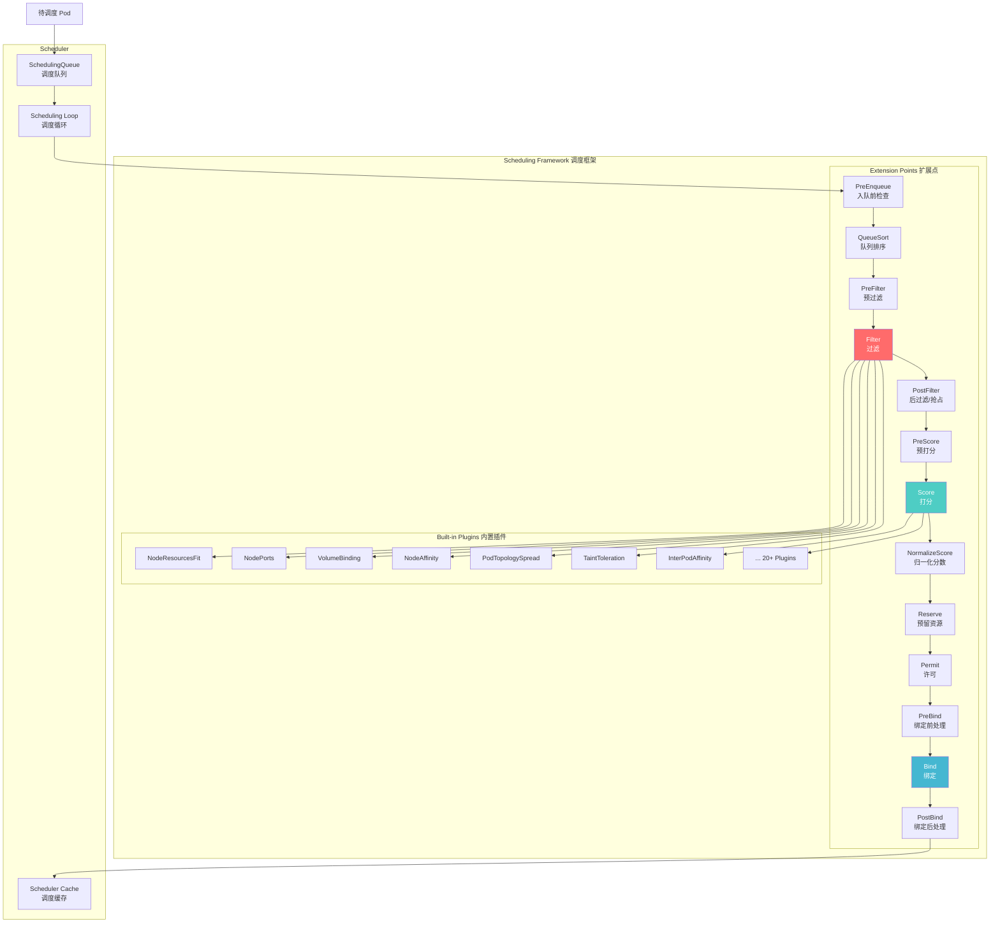
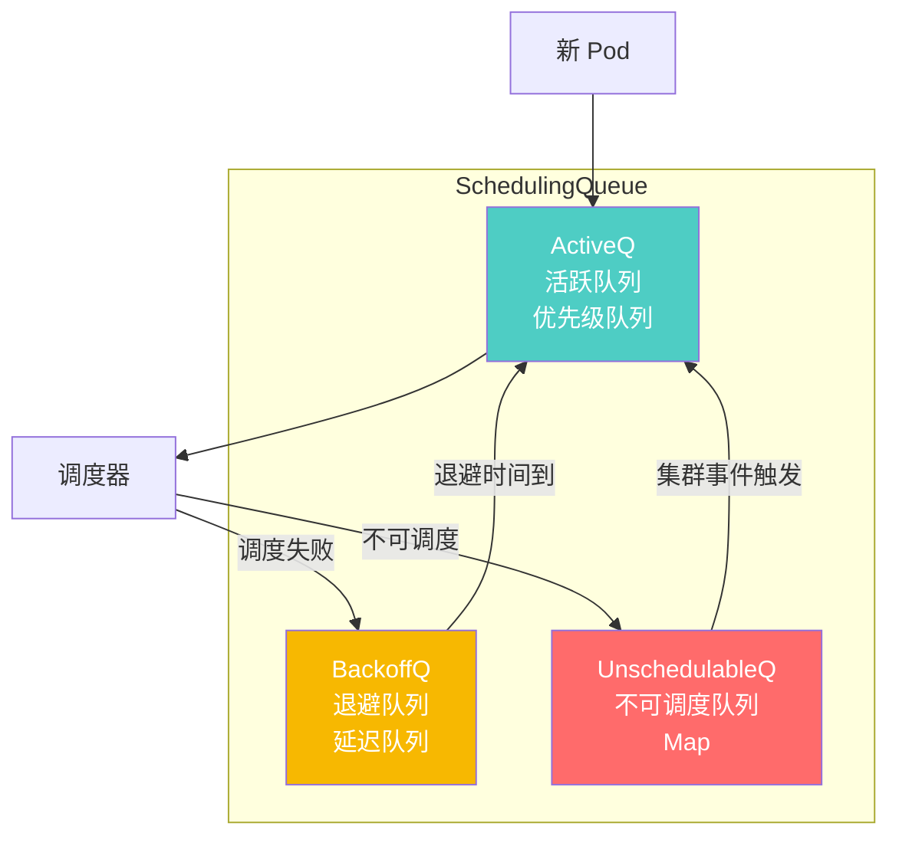
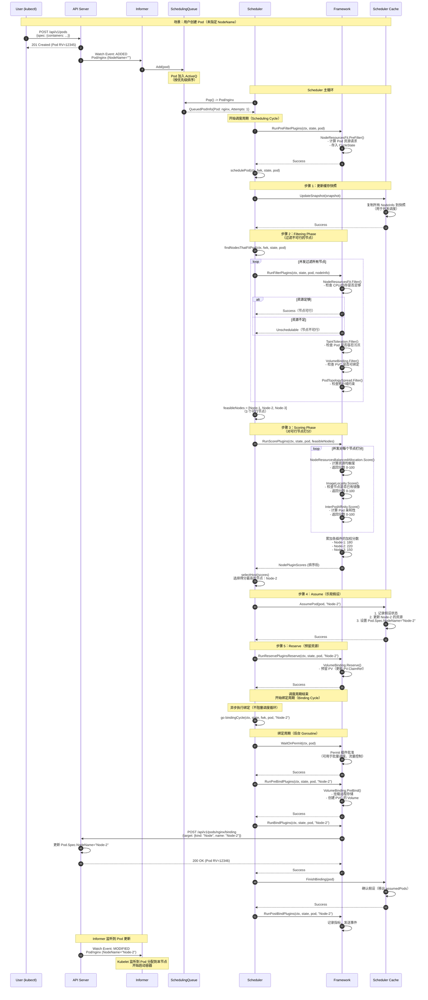
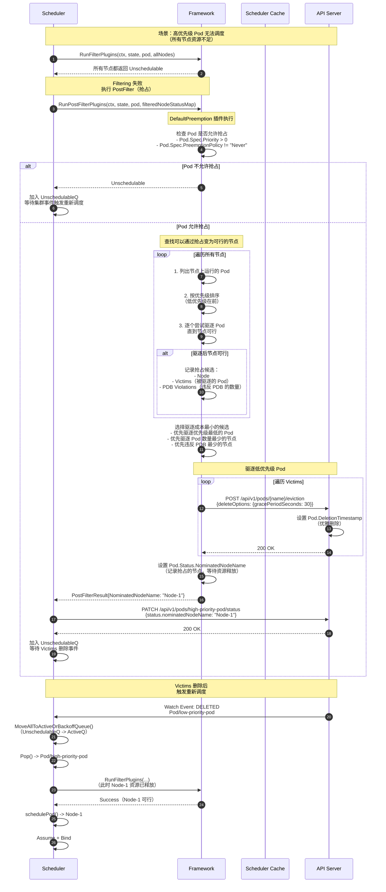
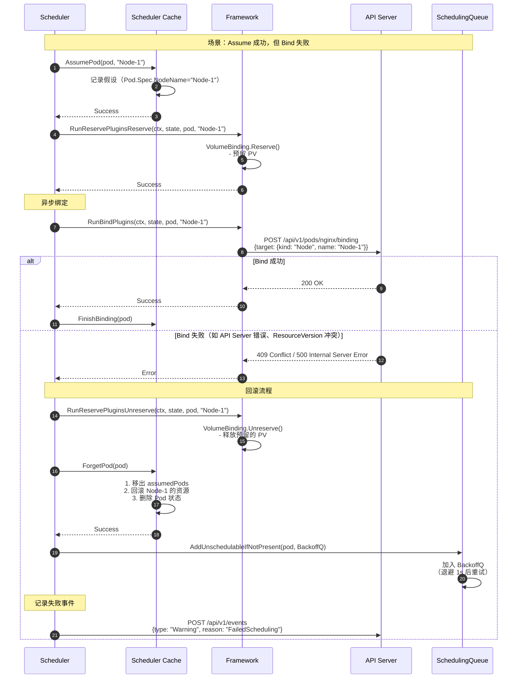
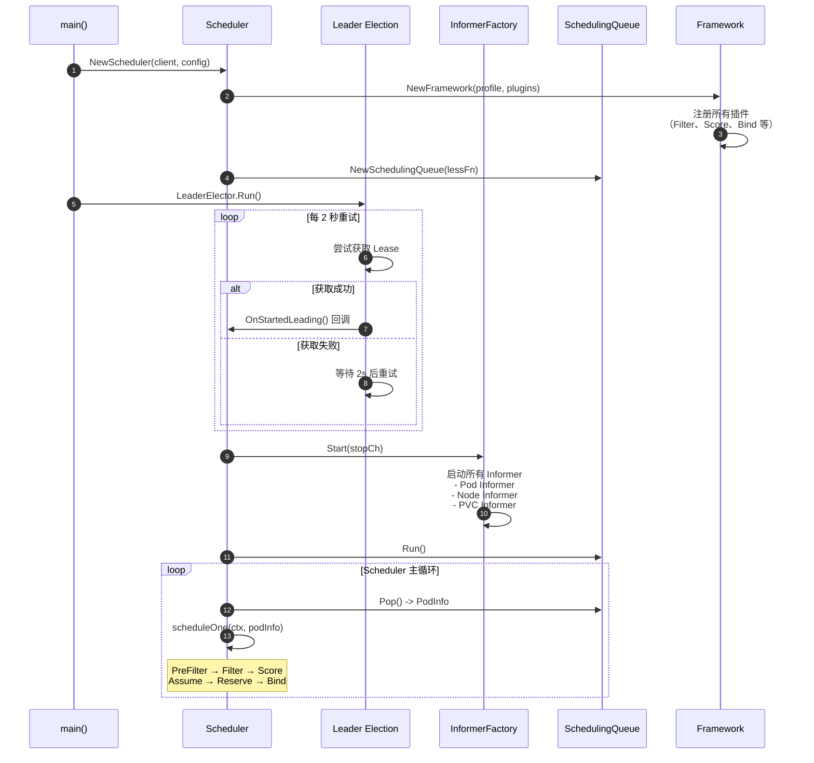
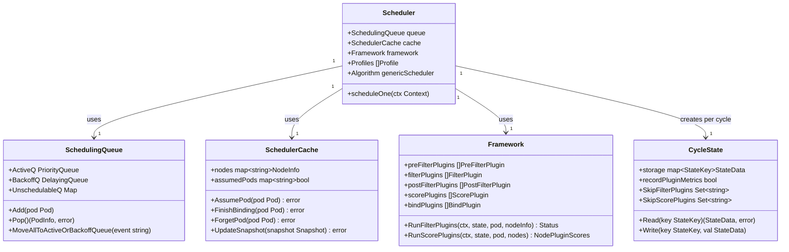

# Kubernetes-03-Scheduler-概览

## 模块职责

kube-scheduler 是 Kubernetes 控制平面的**调度器**，负责将待调度的 Pod 分配到最合适的 Node 上运行。它通过**调度算法**评估所有可用节点，选择最优节点，并将 Pod 绑定到该节点。

### 核心职责

1. **Pod 调度决策**
   - 监听待调度的 Pod（`Pod.Spec.NodeName` 为空）
   - 执行两阶段调度算法：Filtering（过滤）+ Scoring（打分）
   - 选择得分最高的节点作为调度目标

2. **插件化调度框架**
   - 提供 10+ 个扩展点（PreFilter、Filter、PostFilter、Score、Bind 等）
   - 支持自定义插件（实现 Plugin 接口）
   - 内置 20+ 插件（资源检查、亲和性、反亲和性、拓扑域等）

3. **抢占调度（Preemption）**
   - 当集群资源不足时，驱逐低优先级 Pod 为高优先级 Pod 腾出空间
   - 选择最小驱逐成本的节点和 Pod 组合

4. **绑定 Pod 到节点**
   - 乐观假设（Assume）：先在缓存中记录 Pod 的调度结果
   - 异步绑定（Bind）：调用 API Server 更新 Pod.Spec.NodeName
   - 失败回滚：绑定失败时从缓存中移除假设

### 输入/输出

**输入：**
- **待调度的 Pod**：`Pod.Spec.NodeName` 为空的 Pod
- **节点状态**：Node 的资源容量、可分配资源、污点（Taints）
- **调度约束**：亲和性、反亲和性、节点选择器、拓扑域约束

**输出：**
- **绑定结果**：将 Pod.Spec.NodeName 设置为选中的节点名称
- **调度事件**：记录调度成功/失败的事件（如 `Scheduled`、`FailedScheduling`）

### 上下游依赖

**上游（被调用方）：**
- API Server：获取 Pod、Node、PVC 等资源对象，绑定 Pod 到节点

**下游（调用方）：**
- Kubelet：监听 Pod.Spec.NodeName 变化，启动 Pod 容器

### 生命周期

```go
// 启动流程（简化版）
func main() {
    // 1. 创建 Scheduler
    sched := scheduler.New(client, informerFactory, profile)
    
    // 2. 启动 Informer（监听 Pod、Node、PVC 等资源）
    informerFactory.Start(stopCh)
    
    // 3. 启动 Scheduler（主循环）
    sched.Run(ctx)
}
```

**启动阶段：**
1. Leader Election（主备选举，确保只有一个实例工作）
2. 创建调度框架（Framework）：初始化插件
3. 创建调度队列（SchedulingQueue）：存储待调度的 Pod
4. 启动 Informer：监听 Pod、Node、PVC 等资源变化
5. 启动调度循环（Scheduling Loop）：从队列取 Pod 并调度

**运行阶段：**
- SchedulingQueue 接收待调度的 Pod
- 调度循环不断从队列取 Pod
- 执行调度算法：Filtering → Scoring → Binding
- 绑定成功后，Kubelet 启动 Pod

**停止阶段：**
1. 收到 SIGTERM 信号
2. 停止调度循环（不再接受新 Pod）
3. 等待当前调度任务完成（优雅关闭）
4. 退出进程

---

## 调度算法概览

### 两阶段调度算法


#### 1. Filtering Phase（过滤阶段）

**目的**：过滤出**可以运行 Pod** 的节点。

**执行逻辑：**
- 遍历所有节点，对每个节点执行所有 Filter 插件
- 如果任何一个插件返回失败，该节点被标记为不可行
- 返回所有可行节点列表

**常用 Filter 插件：**

| 插件名称 | 检查内容 |
|---------|---------|
| **NodeResourcesFit** | 节点资源（CPU、内存）是否满足 Pod 请求 |
| **NodePorts** | 节点端口是否被占用 |
| **VolumeBinding** | PVC 是否可以绑定到节点的 PV |
| **NodeAffinity** | Pod 的节点亲和性规则是否匹配 |
| **PodTopologySpread** | Pod 拓扑域约束是否满足 |
| **TaintToleration** | Pod 是否容忍节点的污点 |
| **NodeUnschedulable** | 节点是否标记为不可调度（`spec.unschedulable=true`） |

**示例：**
```text
集群有 10 个节点
- 执行 NodeResourcesFit：过滤掉 3 个资源不足的节点（剩余 7 个）
- 执行 NodePorts：过滤掉 1 个端口冲突的节点（剩余 6 个）
- 执行 TaintToleration：过滤掉 2 个有污点的节点（剩余 4 个）
→ 可行节点列表：Node-1, Node-2, Node-3, Node-4
```

#### 2. Scoring Phase（打分阶段）

**目的**：对可行节点**打分排序**，选择最佳节点。

**执行逻辑：**
- 对每个可行节点，执行所有 Score 插件
- 每个插件返回 0-100 的分数
- 分数乘以插件权重（Weight），累加得到总分
- 选择总分最高的节点

**常用 Score 插件：**

| 插件名称 | 打分逻辑 | 权重 |
|---------|---------|------|
| **NodeResourcesBalancedAllocation** | 资源使用率越均衡，分数越高 | 1 |
| **NodeResourcesLeastAllocated** | 可用资源越多，分数越高 | 1 |
| **ImageLocality** | 节点已有镜像，分数越高 | 1 |
| **InterPodAffinity** | Pod 亲和性匹配度越高，分数越高 | 2 |
| **NodeAffinity** | 节点亲和性匹配度越高，分数越高 | 1 |
| **PodTopologySpread** | 拓扑域分布越均匀，分数越高 | 2 |

**示例：**
```text
可行节点：Node-1, Node-2, Node-3, Node-4

打分结果（假设所有插件权重为 1）：
- Node-1：NodeResourcesBalancedAllocation=80 + ImageLocality=50 = 130
- Node-2：NodeResourcesBalancedAllocation=70 + ImageLocality=100 = 170
- Node-3：NodeResourcesBalancedAllocation=60 + ImageLocality=60 = 120
- Node-4：NodeResourcesBalancedAllocation=90 + ImageLocality=40 = 130

→ 选择 Node-2（总分最高）
```

#### 3. Binding Phase（绑定阶段）

**目的**：将 Pod 绑定到选定的节点。

**执行流程：**
1. **Assume（乐观假设）**：在缓存中记录 Pod 的调度结果（设置 `Pod.Spec.NodeName`）
2. **WaitOnPermit（等待许可）**：等待 Permit 插件的批准（可用于流量控制）
3. **PreBind（绑定前处理）**：执行绑定前的准备工作（如预留 PV）
4. **Bind（绑定）**：调用 API Server 更新 Pod.Spec.NodeName
5. **PostBind（绑定后处理）**：执行绑定后的清理工作

**乐观假设（Assume）的作用：**
- 绑定操作是异步的（避免阻塞调度循环）
- 先在缓存中记录调度结果，后续调度决策基于该假设
- 如果绑定失败，从缓存中移除假设，重新调度

---

## 调度框架（Scheduling Framework）

### 调度框架架构



### 扩展点详解

#### 1. PreEnqueue（入队前检查）

**触发时机**：Pod 创建/更新时，在加入调度队列前
**作用**：检查 Pod 是否可以被调度（如检查 PVC 是否已绑定）
**返回值**：Success（加入队列）或 Unschedulable（拒绝调度）

#### 2. QueueSort（队列排序）

**触发时机**：Pod 加入调度队列时
**作用**：定义队列中 Pod 的排序规则
**默认实现**：按优先级排序（PrioritySort 插件）

#### 3. PreFilter（预过滤）

**触发时机**：Filter 阶段之前
**作用**：预计算共享状态（如 Pod 的亲和性匹配结果），避免重复计算
**返回值**：Success 或 Unschedulable

#### 4. Filter（过滤）

**触发时机**：对每个节点执行
**作用**：判断节点是否可以运行 Pod
**返回值**：Success（可行）或 Unschedulable（不可行）

#### 5. PostFilter（后过滤/抢占）

**触发时机**：所有节点都不可行时
**作用**：尝试抢占调度（驱逐低优先级 Pod）
**返回值**：Success（找到抢占方案）或 Unschedulable（无法抢占）

#### 6. PreScore（预打分）

**触发时机**：Score 阶段之前
**作用**：预计算共享状态（如节点的资源使用率）

#### 7. Score（打分）

**触发时机**：对每个可行节点执行
**作用**：给节点打分（0-100）
**返回值**：分数

#### 8. NormalizeScore（归一化分数）

**触发时机**：Score 阶段之后
**作用**：将分数归一化到 0-100 范围（如将百分比转换为分数）

#### 9. Reserve（预留资源）

**触发时机**：选定节点后，绑定前
**作用**：预留资源（如预留 PV、预分配 IP）
**返回值**：Success 或 Error

#### 10. Permit（许可）

**触发时机**：Reserve 之后，Bind 之前
**作用**：控制 Pod 何时可以绑定（可用于批量调度、Gang Scheduling）
**返回值**：Success（立即绑定）、Wait（等待）或 Reject（拒绝）

#### 11. PreBind（绑定前处理）

**触发时机**：Bind 之前
**作用**：执行绑定前的准备工作（如挂载远程存储）
**返回值**：Success 或 Error

#### 12. Bind（绑定）

**触发时机**：PreBind 成功后
**作用**：调用 API Server 更新 Pod.Spec.NodeName
**返回值**：Success 或 Error

#### 13. PostBind（绑定后处理）

**触发时机**：Bind 成功后
**作用**：执行绑定后的清理工作（如记录指标）
**返回值**：无返回值（仅通知）

---

## 核心数据结构

### 1. SchedulingQueue（调度队列）

调度队列存储待调度的 Pod，分为 3 个子队列：



**ActiveQ（活跃队列）：**
- 存储待调度的 Pod（按优先级排序）
- 调度器不断从队列头部取 Pod

**BackoffQ（退避队列）：**
- 存储调度失败的 Pod（等待重试）
- 退避时间：初始 1s，最大 10s（指数退避）

**UnschedulableQ（不可调度队列）：**
- 存储所有节点都不可行的 Pod
- 等待集群事件（如新节点加入、Pod 删除）触发重新调度

### 2. Scheduler Cache（调度缓存）

调度缓存存储节点和 Pod 的状态，用于快速查询：

**NodeInfo：**
- Node 的资源容量、可分配资源、已使用资源
- Node 上运行的 Pod 列表
- Node 的污点（Taints）、标签（Labels）

**PodInfo：**
- Pod 的资源请求（CPU、内存）
- Pod 的调度约束（亲和性、反亲和性、节点选择器）

**Assume 机制：**
- 调度器选定节点后，先在缓存中记录 Pod 的调度结果
- 后续调度决策基于该假设（避免多个 Pod 调度到同一节点导致资源冲突）
- 绑定成功后，确认假设；绑定失败后，移除假设

---

## 关键代码片段

### Scheduler 主循环

```go
// pkg/scheduler/schedule_one.go

// scheduleOne 调度一个 Pod
func (sched *Scheduler) scheduleOne(ctx context.Context) {
    // 1. 从队列获取待调度的 Pod
    podInfo, _ := sched.SchedulingQueue.Pop(ctx)
    pod := podInfo.Pod
    
    // 2. 执行调度周期（Scheduling Cycle）
    //    - PreFilter → Filter → PostFilter → PreScore → Score → NormalizeScore
    scheduleResult, assumedPod, status := sched.schedulingCycle(ctx, state, fwk, podInfo, start)
    if !status.IsSuccess() {
        // 调度失败，处理失败逻辑（加入 BackoffQ 或 UnschedulableQ）
        sched.FailureHandler(ctx, fwk, podInfo, status, scheduleResult)
        return
    }
    
    // 3. 异步执行绑定周期（Binding Cycle）
    //    - Reserve → Permit → PreBind → Bind → PostBind
    go func() {
        status := sched.bindingCycle(ctx, state, fwk, scheduleResult, assumedPod, start)
        if !status.IsSuccess() {
            // 绑定失败，回滚假设并重新调度
            sched.handleBindingCycleError(ctx, state, fwk, assumedPod, start, scheduleResult, status)
        }
    }()
}
```

### 调度周期（Scheduling Cycle）

```go
// schedulingCycle 执行调度周期
func (sched *Scheduler) schedulingCycle(ctx context.Context, state *fwk.CycleState, fwk framework.Framework, podInfo *fwk.QueuedPodInfo, start time.Time) (ScheduleResult, *v1.Pod, *fwk.Status) {
    pod := podInfo.Pod
    
    // 1. 执行 PreFilter 插件
    preFilterResult, status := fwk.RunPreFilterPlugins(ctx, state, pod)
    if !status.IsSuccess() {
        return ScheduleResult{}, nil, status
    }
    
    // 2. 执行调度算法：Filtering + Scoring
    scheduleResult, err := sched.schedulePod(ctx, fwk, state, pod)
    if err != nil {
        // 所有节点都不可行，执行 PostFilter（抢占）
        postFilterResult, status := fwk.RunPostFilterPlugins(ctx, state, pod, filteredNodeStatusMap)
        if !status.IsSuccess() {
            return ScheduleResult{}, nil, status
        }
        
        // 抢占成功，返回抢占的节点
        scheduleResult.SuggestedHost = postFilterResult.NominatedNodeName
    }
    
    // 3. 乐观假设（Assume）
    assumedPod := pod.DeepCopy()
    err = sched.assume(assumedPod, scheduleResult.SuggestedHost)
    if err != nil {
        return ScheduleResult{}, nil, fwk.AsStatus(err)
    }
    
    // 4. 执行 Reserve 插件（预留资源）
    if status := fwk.RunReservePluginsReserve(ctx, state, assumedPod, scheduleResult.SuggestedHost); !status.IsSuccess() {
        // Reserve 失败，回滚假设
        sched.Cache.ForgetPod(assumedPod)
        return ScheduleResult{}, nil, status
    }
    
    return scheduleResult, assumedPod, nil
}
```

### 调度算法（schedulePod）

```go
// schedulePod 执行调度算法（Filtering + Scoring）
func (sched *Scheduler) schedulePod(ctx context.Context, fwk framework.Framework, state *fwk.CycleState, pod *v1.Pod) (ScheduleResult, error) {
    // 1. 更新缓存快照（Node 和 Pod 的状态）
    if err := sched.Cache.UpdateSnapshot(sched.nodeInfoSnapshot); err != nil {
        return ScheduleResult{}, err
    }
    
    // 2. 执行 Filtering（过滤阶段）
    feasibleNodes, diagnosis, err := sched.findNodesThatFitPod(ctx, fwk, state, pod)
    if err != nil {
        return ScheduleResult{}, err
    }
    
    // 3. 如果没有可行节点，返回错误
    if len(feasibleNodes) == 0 {
        return ScheduleResult{}, &framework.FitError{
            Pod:         pod,
            NumAllNodes: sched.nodeInfoSnapshot.NumNodes(),
            Diagnosis:   diagnosis,
        }
    }
    
    // 4. 如果只有一个可行节点，直接返回
    if len(feasibleNodes) == 1 {
        return ScheduleResult{
            SuggestedHost:  feasibleNodes[0].Node().Name,
            EvaluatedNodes: 1,
            FeasibleNodes:  1,
        }, nil
    }
    
    // 5. 执行 Scoring（打分阶段）
    priorityList, err := prioritizeNodes(ctx, sched.Extenders, fwk, state, pod, feasibleNodes)
    if err != nil {
        return ScheduleResult{}, err
    }
    
    // 6. 选择得分最高的节点
    host, _, err := selectHost(priorityList, numberOfHighestScoredNodesToReport)
    
    return ScheduleResult{
        SuggestedHost:  host,
        EvaluatedNodes: len(feasibleNodes),
        FeasibleNodes:  len(feasibleNodes),
    }, err
}
```

### Filtering 阶段

```go
// findNodesThatFitPod 执行 Filtering 阶段
func (sched *Scheduler) findNodesThatFitPod(ctx context.Context, fwk framework.Framework, state *fwk.CycleState, pod *v1.Pod) ([]fwk.NodeInfo, framework.Diagnosis, error) {
    var feasibleNodes []fwk.NodeInfo
    diagnosis := framework.Diagnosis{NodeToStatus: framework.NewDefaultNodeToStatus()}
    
    // 并发执行 Filter 插件（每个节点一个 Goroutine）
    errCh := parallelize.NewErrorChannel()
    feasibleNodesLen := atomic.NewInt32(0)
    feasibleNodes = make([]fwk.NodeInfo, sched.nodeInfoSnapshot.NumNodes())
    
    sched.Parallelizer().Until(ctx, len(allNodes), func(index int) {
        nodeInfo := allNodes[index]
        
        // 执行所有 Filter 插件
        status := fwk.RunFilterPlugins(ctx, state, pod, nodeInfo)
        if status.IsSuccess() {
            // 节点可行，加入结果列表
            length := feasibleNodesLen.Inc()
            feasibleNodes[length-1] = nodeInfo
        } else {
            // 节点不可行，记录原因
            diagnosis.NodeToStatus.Set(nodeInfo.Node().Name, status)
        }
    })
    
    // 截取有效的可行节点
    feasibleNodes = feasibleNodes[:feasibleNodesLen.Load()]
    
    return feasibleNodes, diagnosis, nil
}
```

### Scoring 阶段

```go
// prioritizeNodes 执行 Scoring 阶段
func prioritizeNodes(ctx context.Context, extenders []framework.Extender, fwk framework.Framework, state *fwk.CycleState, pod *v1.Pod, nodes []fwk.NodeInfo) ([]fwk.NodePluginScores, error) {
    // 1. 执行所有 Score 插件
    scoresMap, status := fwk.RunScorePlugins(ctx, state, pod, nodes)
    if !status.IsSuccess() {
        return nil, status.AsError()
    }
    
    // 2. 累加各插件的加权分数
    //    - 每个插件的分数 * 权重
    //    - 累加得到总分
    for i := range scoresMap {
        for j := range scoresMap[i].Scores {
            scoresMap[i].TotalScore += scoresMap[i].Scores[j].Score
        }
    }
    
    // 3. 返回排序后的节点列表（按总分降序）
    return scoresMap, nil
}
```

### Bind 阶段

```go
// bind 执行绑定操作
func (sched *Scheduler) bind(ctx context.Context, fwk framework.Framework, assumed *v1.Pod, targetNode string, state *fwk.CycleState) *fwk.Status {
    // 1. 执行 PreBind 插件
    if status := fwk.RunPreBindPlugins(ctx, state, assumed, targetNode); !status.IsSuccess() {
        return status
    }
    
    // 2. 执行 Bind 插件（调用 API Server）
    status := fwk.RunBindPlugins(ctx, state, assumed, targetNode)
    if !status.IsSuccess() {
        return status
    }
    
    // 3. 执行 PostBind 插件
    fwk.RunPostBindPlugins(ctx, state, assumed, targetNode)
    
    return nil
}

// DefaultBinder 默认绑定插件
func (b DefaultBinder) Bind(ctx context.Context, state *fwk.CycleState, p *v1.Pod, nodeName string) *fwk.Status {
    binding := &v1.Binding{
        ObjectMeta: metav1.ObjectMeta{Namespace: p.Namespace, Name: p.Name, UID: p.UID},
        Target:     v1.ObjectReference{Kind: "Node", Name: nodeName},
    }
    
    // 调用 API Server 绑定 Pod
    err := b.handle.ClientSet().CoreV1().Pods(binding.Namespace).Bind(ctx, binding, metav1.CreateOptions{})
    if err != nil {
        return fwk.AsStatus(err)
    }
    
    return nil
}
```

---

## 边界条件与约束

### 并发与性能

**并发调度：**
- 默认单线程调度（一次只调度一个 Pod）
- 可通过 `--kube-scheduler-qps` 和 `--kube-scheduler-burst` 调整 API 调用速率

**Filter 并发：**
- Filter 插件并发执行（每个节点一个 Goroutine）
- 适用于大集群（1000+ 节点）

**Score 并发：**
- Score 插件并发执行（每个节点一个 Goroutine）

### 资源限制

**节点数量：**
- 推荐 5000 节点以下
- 超过 5000 节点时，需要调整调度器参数（如 `--kube-api-qps`、`--kube-api-burst`）

**Pod 调度速率：**
- 默认约 100 Pods/s（取决于节点数量和插件复杂度）
- 可通过减少插件数量或禁用某些插件提高速率

### 扩展点

**自定义插件：**
- 实现 Plugin 接口（Filter、Score、Bind 等）
- 注册插件到调度框架
- 配置插件的权重和参数

**Scheduler Extenders：**
- HTTP 回调方式扩展调度器
- 适用于不方便修改调度器代码的场景

---

## 最佳实践

### 1. 合理设置 Pod 资源请求

**问题：**
- Pod 未设置资源请求（requests）时，调度器无法准确评估节点资源
- 可能导致节点资源超卖，影响 Pod 稳定性

**建议：**
- 为所有 Pod 设置 `resources.requests`（CPU、内存）
- 使用 LimitRange 强制要求 Pod 设置资源请求

### 2. 使用节点亲和性和反亲和性

**场景：**
- 将同一应用的 Pod 分散到不同节点（高可用）
- 将数据密集型 Pod 调度到 SSD 节点

**示例：**
```yaml
affinity:
  podAntiAffinity:
    requiredDuringSchedulingIgnoredDuringExecution:
    - labelSelector:
        matchLabels:
          app: nginx
      topologyKey: kubernetes.io/hostname
```

### 3. 使用拓扑域约束

**场景：**
- 将 Pod 均匀分布到多个可用区（Zone）
- 避免所有 Pod 集中在一个区域

**示例：**
```yaml
topologySpreadConstraints:
- maxSkew: 1
  topologyKey: topology.kubernetes.io/zone
  whenUnsatisfiable: DoNotSchedule
  labelSelector:
    matchLabels:
      app: nginx
```

### 4. 使用优先级和抢占

**场景：**
- 保证关键业务 Pod 优先调度
- 资源不足时，驱逐低优先级 Pod

**示例：**
```yaml
apiVersion: scheduling.k8s.io/v1
kind: PriorityClass
metadata:
  name: high-priority
value: 1000000
globalDefault: false
description: "High priority for critical workloads"
```

---

**文档维护：**
- 版本：v1.0
- 最后更新：2025-10-04
- 适用 Kubernetes 版本：v1.29+

---

# Kubernetes-03-Scheduler-时序图

## 时序图概述

本文档提供 Scheduler 核心场景的时序图，包括：
1. **Pod 调度完整流程**：从队列取出 Pod 到绑定成功
2. **Filtering 和 Scoring 流程**：插件执行的详细步骤
3. **抢占调度流程**：资源不足时驱逐低优先级 Pod
4. **Assume 和 Binding 流程**：乐观假设与异步绑定

---

## 场景 1：Pod 调度完整流程

### 时序图



### 要点说明

#### 1. 图意概述
- **触发条件**：用户创建 Pod 且未指定 `NodeName`
- **核心流程**：Pop → PreFilter → Filtering → Scoring → Assume → Reserve → Bind
- **异步绑定**：绑定操作在后台 Goroutine 执行，不阻塞调度循环

#### 2. 关键步骤
- **PreFilter**：预计算共享状态（如 Pod 资源请求），避免重复计算
- **Filtering**：并发过滤所有节点（每个节点一个 Goroutine）
- **Scoring**：并发对可行节点打分（每个节点一个 Goroutine）
- **Assume**：乐观假设（先在缓存中记录调度结果，后续调度基于该假设）
- **Reserve**：预留资源（如预留 PV、预分配 IP）
- **Bind**：异步绑定（调用 API Server 更新 Pod.Spec.NodeName）

#### 3. 边界条件
- **所有节点都不可行**：执行 PostFilter（抢占调度）
- **绑定失败**：ForgetPod（回滚假设），重新加入队列
- **Permit 拒绝**：回滚 Reserve，重新加入队列

#### 4. 性能优化
- **并发过滤**：Filter 插件并发执行（提高大集群性能）
- **并发打分**：Score 插件并发执行
- **异步绑定**：绑定操作不阻塞调度循环（提高吞吐量）

---

## 场景 2：抢占调度流程

### 时序图



### 要点说明

#### 1. 抢占条件
- Pod 优先级 > 0（`Pod.Spec.Priority`）
- 抢占策略不是 Never（`Pod.Spec.PreemptionPolicy`）

#### 2. 驱逐成本计算
1. **优先级**：优先驱逐优先级最低的 Pod
2. **数量**：优先驱逐 Pod 数量最少的节点
3. **PDB 违反**：优先违反 PodDisruptionBudget 最少的节点
4. **节点优先级**：优先驱逐低优先级节点上的 Pod

#### 3. PodDisruptionBudget（PDB）
- 限制同时驱逐的 Pod 数量（保证最小可用副本数）
- 抢占时可能违反 PDB（但会优先选择违反最少的方案）

---

## 场景 3：绑定失败回滚流程

### 时序图



### 要点说明

#### 1. 回滚步骤
1. **Unreserve**：释放预留的资源（如 PV、IP）
2. **ForgetPod**：从缓存中移除假设（回滚节点资源）
3. **Requeue**：重新加入队列（BackoffQ，退避后重试）

#### 2. 常见绑定失败原因
- **API Server 错误**：网络故障、etcd 不可用
- **ResourceVersion 冲突**：Pod 被其他组件更新（如 Kubelet 更新 Status）
- **节点不可用**：节点在绑定前被删除或标记为不可调度

---

## 场景 4：Scheduler 启动流程

### 时序图（精简版）



---

## 性能指标与可观测性

### 关键指标

| 指标 | 类型 | 说明 |
|-----|------|------|
| `scheduler_scheduling_duration_seconds` | Histogram | 调度延迟（从 Pop 到 Bind） |
| `scheduler_scheduling_attempt_duration_seconds` | Histogram | 单次调度尝试延迟 |
| `scheduler_pod_scheduling_attempts` | Histogram | Pod 调度尝试次数 |
| `scheduler_queue_incoming_pods_total` | Counter | 入队 Pod 总数 |
| `scheduler_pending_pods` | Gauge | 待调度 Pod 数量 |
| `scheduler_preemption_attempts_total` | Counter | 抢占尝试次数 |
| `scheduler_preemption_victims` | Histogram | 每次抢占驱逐的 Pod 数量 |
| `scheduler_framework_extension_point_duration_seconds` | Histogram | 各扩展点执行时间 |
| `scheduler_plugin_execution_duration_seconds` | Histogram | 各插件执行时间 |

### 性能调优建议

1. **减少插件数量**：禁用不必要的插件
2. **调整插件权重**：降低不重要插件的权重
3. **增加调度器副本**：多 Scheduler 实例（注意配置不同的 schedulerName）
4. **优化节点数量**：单个 Scheduler 推荐 5000 节点以下

---

**文档维护：**
- 版本：v1.0
- 最后更新：2025-10-04
- 适用 Kubernetes 版本：v1.29+

---

# Kubernetes-03-Scheduler-数据结构

## 数据结构概述

Scheduler 的核心数据结构围绕**调度框架（Scheduling Framework）**设计，主要包括：
1. **SchedulingQueue（调度队列）**：管理待调度的 Pod
2. **Scheduler Cache（调度缓存）**：存储节点和 Pod 的状态
3. **Framework（调度框架）**：管理插件和扩展点
4. **CycleState（调度周期状态）**：插件间共享数据

---

## 核心数据结构 UML 图

### 1. Scheduler 整体数据结构



---

## 数据结构详解

### 1. SchedulingQueue（调度队列）

#### 1.1 接口定义

```go
// pkg/scheduler/internal/queue/scheduling_queue.go

// SchedulingQueue 调度队列接口
type SchedulingQueue interface {
    // Add 添加 Pod 到队列
    Add(logger klog.Logger, pod *v1.Pod) error
    
    // Pop 从队列取出下一个待调度的 Pod（阻塞）
    Pop(logger klog.Logger) (*framework.QueuedPodInfo, error)
    
    // Update 更新队列中的 Pod
    Update(logger klog.Logger, oldPod, newPod *v1.Pod) error
    
    // Delete 从队列删除 Pod
    Delete(pod *v1.Pod) error
    
    // MoveAllToActiveOrBackoffQueue 移动所有 Pod 到 ActiveQ 或 BackoffQ
    //    - 触发时机：集群事件（如 Node 新增、Pod 删除）
    MoveAllToActiveOrBackoffQueue(logger klog.Logger, event framework.ClusterEvent, preCheck PreEnqueueCheck) error
    
    // Run 启动队列（后台 Goroutine）
    Run(logger klog.Logger)
    
    // Close 关闭队列
    Close()
}
```

#### 1.2 数据结构

```go
// PriorityQueue 优先级队列实现
type PriorityQueue struct {
    // 三个子队列
    activeQ      *heap.Heap         // 活跃队列（优先级堆）
    backoffQ     *heap.Heap         // 退避队列（延迟队列）
    unschedulableQ *UnschedulablePodsMap  // 不可调度队列（Map）
    
    // 索引
    podInfoMap   map[types.UID]*framework.QueuedPodInfo  // UID -> PodInfo
    
    // 锁
    lock sync.RWMutex
    
    // 条件变量（Pop 阻塞时等待）
    cond sync.Cond
    
    // 队列已关闭标志
    closed bool
}
```

**字段说明：**

| 字段 | 类型 | 说明 |
|-----|------|------|
| `activeQ` | `*heap.Heap` | 活跃队列（按优先级和时间戳排序） |
| `backoffQ` | `*heap.Heap` | 退避队列（存储调度失败的 Pod，等待重试） |
| `unschedulableQ` | `*UnschedulablePodsMap` | 不可调度队列（存储所有节点都不可行的 Pod） |
| `podInfoMap` | `map[types.UID]*QueuedPodInfo` | UID 到 PodInfo 的映射（快速查找） |

#### 1.3 QueuedPodInfo（队列中的 Pod 信息）

```go
// QueuedPodInfo 队列中的 Pod 信息
type QueuedPodInfo struct {
    *PodInfo
    
    // Timestamp Pod 加入队列的时间
    Timestamp time.Time
    
    // Attempts 调度尝试次数
    Attempts int
    
    // InitialAttemptTimestamp 第一次调度尝试的时间
    InitialAttemptTimestamp *time.Time
    
    // Gated Pod 是否被门控（等待 Permit 插件批准）
    Gated bool
    
    // PendingPlugins 等待批准的插件集合
    PendingPlugins map[string]*time.Time
}
```

#### 1.4 优先级排序规则

```go
// Less 比较两个 Pod 的优先级
func (pq *PriorityQueue) Less(pInfo1, pInfo2 interface{}) bool {
    p1 := pInfo1.(*framework.QueuedPodInfo)
    p2 := pInfo2.(*framework.QueuedPodInfo)
    
    // 1. 优先级（Priority）：高优先级优先
    if p1.Pod.Spec.Priority != nil && p2.Pod.Spec.Priority != nil {
        if *p1.Pod.Spec.Priority > *p2.Pod.Spec.Priority {
            return true
        }
        if *p1.Pod.Spec.Priority < *p2.Pod.Spec.Priority {
            return false
        }
    }
    
    // 2. 时间戳（Timestamp）：早加入的优先
    return p1.Timestamp.Before(p2.Timestamp)
}
```

#### 1.5 核心方法

**Add（添加 Pod）：**

```go
func (pq *PriorityQueue) Add(logger klog.Logger, pod *v1.Pod) error {
    pq.lock.Lock()
    defer pq.lock.Unlock()
    
    // 1. 检查 Pod 是否已在队列中
    pInfo := pq.newQueuedPodInfo(pod)
    if oldPInfo, exists := pq.podInfoMap[pod.UID]; exists {
        // 更新已存在的 Pod
        pInfo.Attempts = oldPInfo.Attempts
        pInfo.InitialAttemptTimestamp = oldPInfo.InitialAttemptTimestamp
    }
    
    // 2. 检查 Pod 是否可以入队（PreEnqueue 插件）
    if !pq.isPodBackingoff(pInfo) {
        // 加入 activeQ
        if err := pq.activeQ.Add(pInfo); err != nil {
            return err
        }
        pq.podInfoMap[pod.UID] = pInfo
    } else {
        // 加入 backoffQ（等待退避时间）
        if err := pq.backoffQ.Add(pInfo); err != nil {
            return err
        }
        pq.podInfoMap[pod.UID] = pInfo
    }
    
    // 3. 唤醒等待的 Pop
    pq.cond.Broadcast()
    
    return nil
}
```

**Pop（取出 Pod）：**

```go
func (pq *PriorityQueue) Pop(logger klog.Logger) (*framework.QueuedPodInfo, error) {
    pq.lock.Lock()
    defer pq.lock.Unlock()
    
    // 1. 等待队列非空或关闭
    for pq.activeQ.Len() == 0 {
        if pq.closed {
            return nil, fmt.Errorf("scheduling queue is closed")
        }
        pq.cond.Wait()
    }
    
    // 2. 从 activeQ 取出优先级最高的 Pod
    obj, err := pq.activeQ.Pop()
    if err != nil {
        return nil, err
    }
    pInfo := obj.(*framework.QueuedPodInfo)
    pInfo.Attempts++
    
    // 3. 保留在 podInfoMap 中（用于 Update/Delete）
    return pInfo, nil
}
```

**MoveAllToActiveOrBackoffQueue（移动 Pod）：**

```go
func (pq *PriorityQueue) MoveAllToActiveOrBackoffQueue(logger klog.Logger, event framework.ClusterEvent, preCheck PreEnqueueCheck) error {
    pq.lock.Lock()
    defer pq.lock.Unlock()
    
    // 1. 遍历 unschedulableQ 中的所有 Pod
    unschedulablePods := pq.unschedulableQ.GetAllPods()
    for _, pInfo := range unschedulablePods {
        // 2. 检查 Pod 是否因该事件可重新调度
        if !preCheck(pInfo.Pod, event) {
            continue
        }
        
        // 3. 移动到 activeQ 或 backoffQ
        pq.unschedulableQ.Delete(pInfo.Pod.UID)
        
        if pq.isPodBackingoff(pInfo) {
            pq.backoffQ.Add(pInfo)
        } else {
            pq.activeQ.Add(pInfo)
        }
    }
    
    // 4. 唤醒等待的 Pop
    pq.cond.Broadcast()
    
    return nil
}
```

---

### 2. Scheduler Cache（调度缓存）

#### 2.1 接口定义

```go
// pkg/scheduler/backend/cache/interface.go

// Cache 调度缓存接口
type Cache interface {
    // AssumePod 乐观假设（在缓存中记录 Pod 的调度结果）
    AssumePod(logger klog.Logger, pod *v1.Pod) error
    
    // FinishBinding 确认绑定成功
    FinishBinding(logger klog.Logger, pod *v1.Pod) error
    
    // ForgetPod 忘记假设（绑定失败时调用）
    ForgetPod(logger klog.Logger, pod *v1.Pod) error
    
    // AddPod 添加 Pod 到缓存
    AddPod(logger klog.Logger, pod *v1.Pod) error
    
    // UpdatePod 更新缓存中的 Pod
    UpdatePod(logger klog.Logger, oldPod, newPod *v1.Pod) error
    
    // RemovePod 从缓存移除 Pod
    RemovePod(logger klog.Logger, pod *v1.Pod) error
    
    // AddNode 添加节点到缓存
    AddNode(logger klog.Logger, node *v1.Node) *framework.NodeInfo
    
    // UpdateNode 更新缓存中的节点
    UpdateNode(logger klog.Logger, oldNode, newNode *v1.Node) *framework.NodeInfo
    
    // RemoveNode 从缓存移除节点
    RemoveNode(logger klog.Logger, node *v1.Node) error
    
    // UpdateSnapshot 更新快照（供调度算法使用）
    UpdateSnapshot(logger klog.Logger, snapshot *Snapshot) error
}
```

#### 2.2 数据结构

```go
// cacheImpl 实现了 Cache 接口
type cacheImpl struct {
    // 节点缓存
    nodes map[string]*nodeInfoListItem  // nodeName -> NodeInfo
    
    // 已假设的 Pod
    assumedPods sets.Set[string]  // podKey 集合
    
    // Pod 状态
    podStates map[string]*podState  // podKey -> podState
    
    // 锁
    mu sync.RWMutex
    
    // 镜像状态
    imageStates map[string]*imageState  // imageName -> imageState
}
```

**字段说明：**

| 字段 | 类型 | 说明 |
|-----|------|------|
| `nodes` | `map[string]*nodeInfoListItem` | 节点名称到 NodeInfo 的映射 |
| `assumedPods` | `sets.Set[string]` | 已假设的 Pod 集合（等待绑定确认） |
| `podStates` | `map[string]*podState` | Pod 的状态（假设中、已绑定） |
| `imageStates` | `map[string]*imageState` | 镜像的状态（大小、存在于哪些节点） |

#### 2.3 NodeInfo（节点信息）

```go
// NodeInfo 节点信息
type NodeInfo struct {
    // Node 对象
    node *v1.Node
    
    // 资源信息
    Requested        *Resource  // 已请求的资源
    NonZeroRequested *Resource  // 非零请求的资源（用于防止超卖）
    Allocatable      *Resource  // 可分配的资源
    
    // Pod 列表
    Pods []*PodInfo  // 节点上运行的 Pod
    
    // 镜像状态
    ImageStates map[string]*ImageStateSummary  // 节点上的镜像
    
    // 拓扑域
    TopologyZone string  // 可用区
    TopologyRegion string  // 地域
    
    // 代次（用于检测并发更新）
    Generation int64
}

// Resource 资源
type Resource struct {
    MilliCPU         int64
    Memory           int64
    EphemeralStorage int64
    AllowedPodNumber int
    ScalarResources  map[v1.ResourceName]int64  // GPU、HugePages 等
}
```

#### 2.4 核心方法

**AssumePod（乐观假设）：**

```go
func (cache *cacheImpl) AssumePod(logger klog.Logger, pod *v1.Pod) error {
    cache.mu.Lock()
    defer cache.mu.Unlock()
    
    key := framework.GetPodKey(pod)
    
    // 1. 检查 Pod 是否已假设
    if cache.assumedPods.Has(key) {
        return fmt.Errorf("pod %v is assumed", key)
    }
    
    // 2. 记录假设状态
    cache.assumedPods.Insert(key)
    cache.podStates[key] = &podState{
        pod: pod,
        deadline: time.Now().Add(assumedPodTTL),  // 假设 TTL（默认 30s）
    }
    
    // 3. 更新节点资源
    nodeName := pod.Spec.NodeName
    if n, ok := cache.nodes[nodeName]; ok {
        n.info.AddPod(pod)
    }
    
    return nil
}
```

**FinishBinding（确认绑定）：**

```go
func (cache *cacheImpl) FinishBinding(logger klog.Logger, pod *v1.Pod) error {
    cache.mu.Lock()
    defer cache.mu.Unlock()
    
    key := framework.GetPodKey(pod)
    
    // 从假设集合中移除
    cache.assumedPods.Delete(key)
    
    // 更新 Pod 状态为已绑定
    if ps, ok := cache.podStates[key]; ok {
        ps.bindingFinished = true
    }
    
    return nil
}
```

**ForgetPod（忘记假设）：**

```go
func (cache *cacheImpl) ForgetPod(logger klog.Logger, pod *v1.Pod) error {
    cache.mu.Lock()
    defer cache.mu.Unlock()
    
    key := framework.GetPodKey(pod)
    
    // 1. 从假设集合中移除
    cache.assumedPods.Delete(key)
    
    // 2. 回滚节点资源
    nodeName := pod.Spec.NodeName
    if n, ok := cache.nodes[nodeName]; ok {
        n.info.RemovePod(pod)
    }
    
    // 3. 删除 Pod 状态
    delete(cache.podStates, key)
    
    return nil
}
```

---

### 3. Framework（调度框架）

#### 3.1 数据结构

```go
// pkg/scheduler/framework/runtime/framework.go

// frameworkImpl 实现了 Framework 接口
type frameworkImpl struct {
    // 插件集合（按扩展点分类）
    preEnqueuePlugins    []framework.PreEnqueuePlugin
    queueSortPlugins     []framework.QueueSortPlugin
    preFilterPlugins     []framework.PreFilterPlugin
    filterPlugins        []framework.FilterPlugin
    postFilterPlugins    []framework.PostFilterPlugin
    preScorePlugins      []framework.PreScorePlugin
    scorePlugins         []framework.ScorePlugin
    reservePlugins       []framework.ReservePlugin
    permitPlugins        []framework.PermitPlugin
    preBindPlugins       []framework.PreBindPlugin
    bindPlugins          []framework.BindPlugin
    postBindPlugins      []framework.PostBindPlugin
    
    // 插件权重
    scorePluginWeight map[string]int  // 插件名称 -> 权重
    
    // Handle（供插件使用的辅助接口）
    handle framework.Handle
    
    // 并行器
    parallelizer parallelize.Parallelizer
}
```

#### 3.2 Handle（插件辅助接口）

```go
// Handle 供插件使用的辅助接口
type Handle interface {
    // SnapshotSharedLister 获取共享的 Lister（节点、Pod 等资源的缓存）
    SnapshotSharedLister() SharedLister
    
    // ClientSet 获取 Kubernetes ClientSet
    ClientSet() clientset.Interface
    
    // EventRecorder 获取事件记录器
    EventRecorder() events.EventRecorder
    
    // SharedInformerFactory 获取共享 InformerFactory
    SharedInformerFactory() informers.SharedInformerFactory
    
    // Parallelizer 获取并行器
    Parallelizer() parallelize.Parallelizer
}
```

---

### 4. CycleState（调度周期状态）

#### 4.1 数据结构

```go
// CycleState 调度周期状态（插件间共享数据）
type CycleState struct {
    // 存储（Key-Value）
    storage sync.Map  // StateKey -> StateData
    
    // 是否记录插件指标
    recordPluginMetrics bool
    
    // 跳过的插件集合
    SkipFilterPlugins sets.Set[string]
    SkipScorePlugins  sets.Set[string]
}

// StateKey 状态键
type StateKey string

// StateData 状态数据接口
type StateData interface {
    Clone() StateData
}
```

#### 4.2 核心方法

**Write（写入数据）：**

```go
func (c *CycleState) Write(key StateKey, val StateData) {
    c.storage.Store(key, val)
}
```

**Read（读取数据）：**

```go
func (c *CycleState) Read(key StateKey) (StateData, error) {
    if v, ok := c.storage.Load(key); ok {
        return v.(StateData), nil
    }
    return nil, fmt.Errorf("key %v not found", key)
}
```

**Clone（克隆）：**

```go
func (c *CycleState) Clone() *CycleState {
    clone := &CycleState{
        recordPluginMetrics: c.recordPluginMetrics,
        SkipFilterPlugins:   c.SkipFilterPlugins.Clone(),
        SkipScorePlugins:    c.SkipScorePlugins.Clone(),
    }
    
    c.storage.Range(func(key, value interface{}) bool {
        clone.storage.Store(key, value.(StateData).Clone())
        return true
    })
    
    return clone
}
```

---

## 数据结构关系与约束

### 1. Assume 机制的作用

**问题：**
- 调度器选定节点后，需要调用 API Server 绑定 Pod（异步操作）
- 在绑定完成前，后续调度决策可能基于过时的节点资源（导致资源超卖）

**解决方案：**
- 调度器选定节点后，先在缓存中记录 Pod 的调度结果（Assume）
- 后续调度决策基于该假设（避免多个 Pod 调度到同一节点）
- 绑定成功后，确认假设（FinishBinding）
- 绑定失败后，移除假设（ForgetPod）

**示例：**
```text
t=0: 节点 Node-1 可用资源：4 CPU
t=1: 调度器选定 Node-1 运行 Pod-A（请求 2 CPU）
     - AssumePod(Pod-A)
     - 缓存中 Node-1 可用资源：2 CPU
t=2: 调度器选定 Node-1 运行 Pod-B（请求 2 CPU）
     - 基于缓存判断：Node-1 可用资源 = 2 CPU（满足）
     - AssumePod(Pod-B)
     - 缓存中 Node-1 可用资源：0 CPU
t=3: 绑定 Pod-A 成功
     - FinishBinding(Pod-A)
t=4: 绑定 Pod-B 失败（实际资源不足）
     - ForgetPod(Pod-B)
     - 缓存中 Node-1 可用资源：2 CPU
```

### 2. 调度队列的退避机制

**问题：**
- Pod 调度失败后，立即重试可能再次失败（集群状态未变化）

**解决方案：**
- 调度失败的 Pod 进入 BackoffQ（退避队列）
- 退避时间：初始 1s，最大 10s（指数退避）
- 退避时间到后，移动到 ActiveQ 重试

**示例：**
```text
t=0: Pod-A 调度失败（所有节点资源不足）
     - 加入 BackoffQ（退避时间 1s）
t=1: 退避时间到，移动到 ActiveQ
     - 再次调度失败（集群状态未变化）
     - 加入 BackoffQ（退避时间 2s）
t=3: 退避时间到，移动到 ActiveQ
     - 再次调度失败
     - 加入 BackoffQ（退避时间 4s）
t=7: 退避时间到，移动到 ActiveQ
     - 调度成功（新节点加入）
```

### 3. UnschedulableQ 的触发机制

**问题：**
- Pod 因集群资源不足而无法调度时，频繁重试浪费 CPU

**解决方案：**
- 将 Pod 移动到 UnschedulableQ（不可调度队列）
- 等待集群事件触发重新调度（如新节点加入、Pod 删除）

**触发事件：**

| 事件 | 触发原因 |
|-----|---------|
| **Node Added** | 新节点加入，可能有资源 |
| **Pod Deleted** | Pod 删除，释放资源 |
| **PV Created** | PV 创建，可能满足 PVC |
| **Service Updated** | Service 更新，可能影响亲和性 |

---

## 性能与容量考虑

### 1. SchedulingQueue 性能

**内存：**
- 每个 PodInfo：约 1-2 KB
- 1000 个待调度 Pod ≈ 1-2 MB

**查询性能：**
- Pop：O(log n)（堆操作）
- Add：O(log n)
- MoveAllToActiveOrBackoffQueue：O(n)（遍历 unschedulableQ）

### 2. Scheduler Cache 性能

**内存：**
- 每个 NodeInfo：约 10-50 KB（取决于 Pod 数量）
- 1000 个节点 ≈ 10-50 MB

**查询性能：**
- AssumePod：O(1)（map 查询）
- UpdateSnapshot：O(n)（遍历所有节点）

### 3. CycleState 性能

**内存：**
- 每个 CycleState：约 1-10 KB（取决于插件数据）
- 并发调度 100 个 Pod ≈ 100 KB - 1 MB

---

**文档维护：**
- 版本：v1.0
- 最后更新：2025-10-04
- 适用 Kubernetes 版本：v1.29+

---

# Kubernetes-03-Scheduler-API

## API 概述

kube-scheduler 与 Controller Manager 类似，**不对外提供 HTTP API**，仅通过 **调度框架（Scheduling Framework）** 暴露插件接口。本文档介绍：
1. **调度框架的插件接口**：Filter、Score、Bind 等扩展点
2. **内置插件的实现**：NodeResourcesFit、PodTopologySpread 等
3. **自定义插件开发指南**

---

## 调度框架插件接口

### 1. Filter 插件接口

#### 1.1 接口定义

```go
// pkg/scheduler/framework/interface.go

// FilterPlugin 接口
type FilterPlugin interface {
    Plugin
    
    // Filter 判断节点是否可以运行 Pod
    //   - 返回 Success：节点可行
    //   - 返回 Unschedulable：节点不可行
    Filter(ctx context.Context, state CycleState, pod *v1.Pod, nodeInfo NodeInfo) *Status
}
```

**参数说明：**

| 参数 | 类型 | 说明 |
|-----|------|------|
| `ctx` | context.Context | 上下文（用于取消、超时控制） |
| `state` | CycleState | 调度周期状态（插件间共享数据） |
| `pod` | *v1.Pod | 待调度的 Pod |
| `nodeInfo` | NodeInfo | 节点信息（资源、Pod 列表、污点等） |

**返回值：**

| 状态码 | 说明 |
|-------|------|
| `Success` | 节点可行 |
| `Unschedulable` | 节点不可行（不会重试） |
| `UnschedulableAndUnresolvable` | 节点不可行且无法通过抢占解决 |
| `Error` | 插件内部错误 |

#### 1.2 示例：NodeResourcesFit 插件

```go
// pkg/scheduler/framework/plugins/noderesources/fit.go

// Filter 检查节点资源是否满足 Pod 请求
func (f *Fit) Filter(ctx context.Context, cycleState fwk.CycleState, pod *v1.Pod, nodeInfo fwk.NodeInfo) *fwk.Status {
    // 1. 从 CycleState 获取预计算的资源请求
    s, err := getPreFilterState(cycleState)
    if err != nil {
        return fwk.AsStatus(err)
    }
    
    // 2. 计算节点可分配资源
    allocatable := nodeInfo.Allocatable
    
    // 3. 检查 CPU 资源
    if allocatable.MilliCPU < s.MilliCPU {
        return fwk.NewStatus(fwk.Unschedulable, fmt.Sprintf("Insufficient cpu (requested: %d, available: %d)", s.MilliCPU, allocatable.MilliCPU))
    }
    
    // 4. 检查内存资源
    if allocatable.Memory < s.Memory {
        return fwk.NewStatus(fwk.Unschedulable, fmt.Sprintf("Insufficient memory (requested: %d, available: %d)", s.Memory, allocatable.Memory))
    }
    
    // 5. 检查 GPU、HugePages 等扩展资源
    for rName, rQuant := range s.ScalarResources {
        if allocatable.ScalarResources[rName] < rQuant {
            return fwk.NewStatus(fwk.Unschedulable, fmt.Sprintf("Insufficient %s", rName))
        }
    }
    
    return nil  // Success
}
```

#### 1.3 示例：TaintToleration 插件

```go
// pkg/scheduler/framework/plugins/tainttoleration/taint_toleration.go

// Filter 检查 Pod 是否容忍节点的污点
func (pl *TaintToleration) Filter(ctx context.Context, state fwk.CycleState, pod *v1.Pod, nodeInfo fwk.NodeInfo) *fwk.Status {
    node := nodeInfo.Node()
    if node == nil {
        return fwk.AsStatus(fmt.Errorf("node not found"))
    }
    
    // 获取节点的污点
    taints := node.Spec.Taints
    
    // 检查 Pod 是否容忍所有污点
    _, isUntolerated := v1helper.FindMatchingUntoleratedTaint(taints, pod.Spec.Tolerations, func(t *v1.Taint) bool {
        return t.Effect == v1.TaintEffectNoSchedule || t.Effect == v1.TaintEffectNoExecute
    })
    
    if isUntolerated {
        return fwk.NewStatus(fwk.UnschedulableAndUnresolvable, "Node has taints that the pod doesn't tolerate")
    }
    
    return nil
}
```

---

### 2. Score 插件接口

#### 2.1 接口定义

```go
// ScorePlugin 接口
type ScorePlugin interface {
    Plugin
    
    // Score 给节点打分（0-100）
    Score(ctx context.Context, state CycleState, p *v1.Pod, nodeName string) (int64, *Status)
    
    // ScoreExtensions 返回扩展接口（用于归一化分数）
    ScoreExtensions() ScoreExtensions
}

// ScoreExtensions 扩展接口
type ScoreExtensions interface {
    // NormalizeScore 归一化分数（将分数映射到 0-100）
    NormalizeScore(ctx context.Context, state CycleState, p *v1.Pod, scores NodeScoreList) *Status
}
```

#### 2.2 示例：NodeResourcesBalancedAllocation 插件

```go
// pkg/scheduler/framework/plugins/noderesources/balanced_allocation.go

// Score 计算资源使用率的均衡度
func (ba *BalancedAllocation) Score(ctx context.Context, state fwk.CycleState, pod *v1.Pod, nodeName string) (int64, *fwk.Status) {
    nodeInfo, err := ba.handle.SnapshotSharedLister().NodeInfos().Get(nodeName)
    if err != nil {
        return 0, fwk.AsStatus(fmt.Errorf("getting node %q: %w", nodeName, err))
    }
    
    // 1. 获取 Pod 的资源请求
    s, err := getPreFilterState(state)
    if err != nil {
        return 0, fwk.AsStatus(err)
    }
    
    // 2. 计算调度 Pod 后的资源使用率
    allocatable := nodeInfo.Allocatable
    requested := nodeInfo.Requested
    
    cpuFraction := float64(requested.MilliCPU+s.MilliCPU) / float64(allocatable.MilliCPU)
    memoryFraction := float64(requested.Memory+s.Memory) / float64(allocatable.Memory)
    
    // 3. 计算均衡度（方差越小，分数越高）
    //    - 理想情况：CPU 和内存使用率相同
    //    - 差异越大，分数越低
    mean := (cpuFraction + memoryFraction) / 2
    variance := math.Pow(cpuFraction-mean, 2) + math.Pow(memoryFraction-mean, 2)
    
    // 4. 将方差转换为分数（0-100）
    //    - 方差越小，分数越高
    score := int64((1 - variance) * fwk.MaxNodeScore)
    
    return score, nil
}
```

#### 2.3 示例：ImageLocality 插件

```go
// pkg/scheduler/framework/plugins/imagelocality/image_locality.go

// Score 根据镜像本地性打分
func (pl *ImageLocality) Score(ctx context.Context, state fwk.CycleState, pod *v1.Pod, nodeName string) (int64, *fwk.Status) {
    nodeInfo, err := pl.handle.SnapshotSharedLister().NodeInfos().Get(nodeName)
    if err != nil {
        return 0, fwk.AsStatus(fmt.Errorf("getting node %q: %w", nodeName, err))
    }
    
    // 1. 统计节点已有的镜像大小
    nodeImageStates := nodeInfo.ImageStates
    totalImageSize := int64(0)
    
    for _, container := range pod.Spec.Containers {
        if state, ok := nodeImageStates[container.Image]; ok {
            // 镜像已存在于节点
            totalImageSize += state.Size
        }
    }
    
    // 2. 将镜像大小转换为分数（0-100）
    //    - 镜像越大（已缓存），分数越高
    //    - 避免重复拉取镜像，加快启动速度
    score := calculateScoreFromSize(totalImageSize)
    
    return score, nil
}

// NormalizeScore 归一化分数
func (pl *ImageLocality) NormalizeScore(ctx context.Context, state fwk.CycleState, pod *v1.Pod, scores fwk.NodeScoreList) *fwk.Status {
    // 找出最大分数
    var maxScore int64 = 0
    for i := range scores {
        if scores[i].Score > maxScore {
            maxScore = scores[i].Score
        }
    }
    
    // 归一化到 0-100
    if maxScore == 0 {
        return nil
    }
    
    for i := range scores {
        scores[i].Score = scores[i].Score * fwk.MaxNodeScore / maxScore
    }
    
    return nil
}
```

---

### 3. PreFilter 插件接口

#### 3.1 接口定义

```go
// PreFilterPlugin 接口
type PreFilterPlugin interface {
    Plugin
    
    // PreFilter 预计算共享状态（在 Filter 之前执行一次）
    //   - 避免重复计算（如 Pod 的资源请求）
    PreFilter(ctx context.Context, state CycleState, p *v1.Pod) (*PreFilterResult, *Status)
    
    // PreFilterExtensions 返回扩展接口
    PreFilterExtensions() PreFilterExtensions
}

// PreFilterExtensions 扩展接口
type PreFilterExtensions interface {
    // AddPod 当新 Pod 加入节点时调用
    AddPod(ctx context.Context, state CycleState, podToSchedule *v1.Pod, podInfoToAdd PodInfo, nodeInfo NodeInfo) *Status
    
    // RemovePod 当 Pod 从节点移除时调用
    RemovePod(ctx context.Context, state CycleState, podToSchedule *v1.Pod, podInfoToRemove PodInfo, nodeInfo NodeInfo) *Status
}
```

#### 3.2 示例：NodeResourcesFit 插件的 PreFilter

```go
// PreFilter 预计算 Pod 的资源请求
func (f *Fit) PreFilter(ctx context.Context, cycleState fwk.CycleState, pod *v1.Pod) (*fwk.PreFilterResult, *fwk.Status) {
    // 1. 计算 Pod 的资源请求（所有容器的总和）
    requests := computePodResourceRequest(pod)
    
    // 2. 将结果存入 CycleState（供 Filter 阶段使用）
    cycleState.Write(preFilterStateKey, &preFilterState{
        MilliCPU:        requests.MilliCPU,
        Memory:          requests.Memory,
        ScalarResources: requests.ScalarResources,
    })
    
    return nil, nil
}
```

---

### 4. PostFilter 插件接口（抢占）

#### 4.1 接口定义

```go
// PostFilterPlugin 接口（所有节点都不可行时调用）
type PostFilterPlugin interface {
    Plugin
    
    // PostFilter 尝试抢占调度
    //   - 选择驱逐成本最小的节点和 Pod 组合
    PostFilter(ctx context.Context, state CycleState, pod *v1.Pod, filteredNodeStatusMap NodeToStatusReader) (*PostFilterResult, *Status)
}

// PostFilterResult 抢占结果
type PostFilterResult struct {
    NominatedNodeName string  // 抢占的节点名称
}
```

#### 4.2 示例：DefaultPreemption 插件

```go
// pkg/scheduler/framework/plugins/defaultpreemption/default_preemption.go

// PostFilter 执行抢占调度
func (pl *DefaultPreemption) PostFilter(ctx context.Context, state fwk.CycleState, pod *v1.Pod, m fwk.NodeToStatusReader) (*fwk.PostFilterResult, *fwk.Status) {
    // 1. 检查 Pod 是否允许抢占（优先级必须 > 0）
    if pod.Spec.Priority == nil || *pod.Spec.Priority <= 0 {
        return nil, fwk.NewStatus(fwk.Unschedulable, "Pod priority is 0 or negative")
    }
    
    // 2. 查找可以通过抢占变为可行的节点
    //    - 遍历所有节点
    //    - 尝试驱逐低优先级 Pod
    //    - 检查驱逐后节点是否可行
    candidates, status := pl.FindCandidates(ctx, state, pod, m)
    if !status.IsSuccess() {
        return nil, status
    }
    
    if len(candidates) == 0 {
        return nil, fwk.NewStatus(fwk.Unschedulable, "No preemption candidates found")
    }
    
    // 3. 选择驱逐成本最小的节点
    //    - 优先驱逐优先级最低的 Pod
    //    - 优先驱逐 Pod 数量最少的节点
    bestCandidate := selectBestCandidate(candidates)
    
    // 4. 驱逐低优先级 Pod
    for _, victim := range bestCandidate.Victims().Pods {
        if err := pl.PodNominator.DeletePod(victim); err != nil {
            return nil, fwk.AsStatus(err)
        }
        pl.handle.ClientSet().CoreV1().Pods(victim.Namespace).Evict(ctx, &policy.Eviction{
            ObjectMeta: metav1.ObjectMeta{Name: victim.Name, Namespace: victim.Namespace},
        })
    }
    
    // 5. 返回抢占的节点
    return &fwk.PostFilterResult{NominatedNodeName: bestCandidate.Name()}, nil
}
```

---

### 5. Bind 插件接口

#### 5.1 接口定义

```go
// BindPlugin 接口
type BindPlugin interface {
    Plugin
    
    // Bind 将 Pod 绑定到节点
    //   - 调用 API Server 更新 Pod.Spec.NodeName
    Bind(ctx context.Context, state CycleState, p *v1.Pod, nodeName string) *Status
}
```

#### 5.2 示例：DefaultBinder 插件

```go
// pkg/scheduler/framework/plugins/defaultbinder/default_binder.go

// Bind 绑定 Pod 到节点
func (b DefaultBinder) Bind(ctx context.Context, state fwk.CycleState, p *v1.Pod, nodeName string) *fwk.Status {
    // 1. 构造 Binding 对象
    binding := &v1.Binding{
        ObjectMeta: metav1.ObjectMeta{Namespace: p.Namespace, Name: p.Name, UID: p.UID},
        Target:     v1.ObjectReference{Kind: "Node", Name: nodeName},
    }
    
    // 2. 调用 API Server 绑定 Pod
    //    - POST /api/v1/namespaces/{namespace}/pods/{name}/binding
    err := b.handle.ClientSet().CoreV1().Pods(binding.Namespace).Bind(ctx, binding, metav1.CreateOptions{})
    if err != nil {
        return fwk.AsStatus(err)
    }
    
    return nil
}
```

---

### 6. Reserve 插件接口

#### 6.1 接口定义

```go
// ReservePlugin 接口
type ReservePlugin interface {
    Plugin
    
    // Reserve 预留资源（在 Bind 之前）
    Reserve(ctx context.Context, state CycleState, p *v1.Pod, nodeName string) *Status
    
    // Unreserve 释放预留的资源（Bind 失败时调用）
    Unreserve(ctx context.Context, state CycleState, p *v1.Pod, nodeName string)
}
```

#### 6.2 示例：VolumeBinding 插件

```go
// pkg/scheduler/framework/plugins/volumebinding/volume_binding.go

// Reserve 预留 PV
func (pl *VolumeBinding) Reserve(ctx context.Context, state fwk.CycleState, pod *v1.Pod, nodeName string) *fwk.Status {
    // 1. 从 CycleState 获取预计算的绑定结果
    podVolumeClaims, err := getPodVolumeClaims(state)
    if err != nil {
        return fwk.AsStatus(err)
    }
    
    // 2. 预留 PV（更新 PV 的 ClaimRef）
    for _, binding := range podVolumeClaims.StaticBindings {
        if err := pl.Binder.BindPVToPVC(ctx, binding.pv, binding.pvc); err != nil {
            return fwk.AsStatus(err)
        }
    }
    
    // 3. 动态创建 PV（触发 StorageClass 的 Provisioner）
    for _, provisioning := range podVolumeClaims.DynamicProvisionings {
        if err := pl.Binder.CreateProvisionedPVForPVC(ctx, provisioning); err != nil {
            return fwk.AsStatus(err)
        }
    }
    
    return nil
}

// Unreserve 释放预留的 PV（Bind 失败时调用）
func (pl *VolumeBinding) Unreserve(ctx context.Context, state fwk.CycleState, pod *v1.Pod, nodeName string) {
    // 回滚预留操作（清除 PV 的 ClaimRef）
    podVolumeClaims, _ := getPodVolumeClaims(state)
    for _, binding := range podVolumeClaims.StaticBindings {
        pl.Binder.UnbindPVFromPVC(ctx, binding.pv, binding.pvc)
    }
}
```

---

## 自定义插件开发指南

### 1. 实现插件接口

```go
// 自定义 Filter 插件示例
package myplugin

import (
    "context"
    "fmt"
    v1 "k8s.io/api/core/v1"
    fwk "k8s.io/kubernetes/pkg/scheduler/framework"
)

type MyPlugin struct {
    handle fwk.Handle
}

// Name 返回插件名称
func (pl *MyPlugin) Name() string {
    return "MyPlugin"
}

// Filter 实现过滤逻辑
func (pl *MyPlugin) Filter(ctx context.Context, state fwk.CycleState, pod *v1.Pod, nodeInfo fwk.NodeInfo) *fwk.Status {
    // 自定义过滤逻辑
    //    - 检查节点的自定义标签
    //    - 检查节点的自定义资源
    node := nodeInfo.Node()
    
    if node.Labels["custom-label"] != "allowed" {
        return fwk.NewStatus(fwk.Unschedulable, "Node does not have custom-label=allowed")
    }
    
    return nil  // Success
}

// New 创建插件实例
func New(ctx context.Context, obj runtime.Object, handle fwk.Handle) (fwk.Plugin, error) {
    return &MyPlugin{handle: handle}, nil
}
```

### 2. 注册插件

```go
// 在 main 函数中注册插件
func main() {
    command := app.NewSchedulerCommand(
        app.WithPlugin("MyPlugin", myplugin.New),
    )
    command.Execute()
}
```

### 3. 配置插件

```yaml
apiVersion: kubescheduler.config.k8s.io/v1
kind: KubeSchedulerConfiguration
profiles:
- schedulerName: default-scheduler
  plugins:
    filter:
      enabled:
      - name: MyPlugin
        weight: 1
    score:
      enabled:
      - name: MyPlugin
        weight: 10
  pluginConfig:
  - name: MyPlugin
    args:
      customArg: value
```

---

## 插件执行顺序

### 1. 调度周期插件执行顺序

```text
1. PreEnqueue  ──> 检查 Pod 是否可以入队
2. QueueSort   ──> 对队列中的 Pod 排序
3. PreFilter   ──> 预计算共享状态
4. Filter      ──> 过滤不可行的节点（并发执行）
5. PostFilter  ──> 所有节点都不可行时，尝试抢占
6. PreScore    ──> 预计算打分所需的共享状态
7. Score       ──> 对可行节点打分（并发执行）
8. NormalizeScore ──> 归一化分数
9. Reserve     ──> 预留资源
10. Permit     ──> 等待许可（可用于批量调度）
```

### 2. 绑定周期插件执行顺序

```text
11. PreBind    ──> 绑定前准备工作（如挂载远程存储）
12. Bind       ──> 调用 API Server 绑定 Pod
13. PostBind   ──> 绑定后清理工作（如记录指标）
```

---

## 性能优化建议

### 1. 减少插件数量

**问题**：插件越多，调度延迟越高
**建议**：禁用不必要的插件

```yaml
profiles:
- plugins:
    filter:
      disabled:
      - name: ImageLocality  # 禁用镜像本地性检查
```

### 2. 调整插件权重

**问题**：某些插件的影响力过大或过小
**建议**：调整插件权重

```yaml
profiles:
- plugins:
    score:
      enabled:
      - name: NodeResourcesBalancedAllocation
        weight: 5  # 提高权重
      - name: ImageLocality
        weight: 1  # 降低权重
```

### 3. 使用 PreFilter 缓存

**问题**：Filter 插件重复计算相同的数据
**建议**：在 PreFilter 中预计算，存入 CycleState

---

**文档维护：**
- 版本：v1.0
- 最后更新：2025-10-04
- 适用 Kubernetes 版本：v1.29+