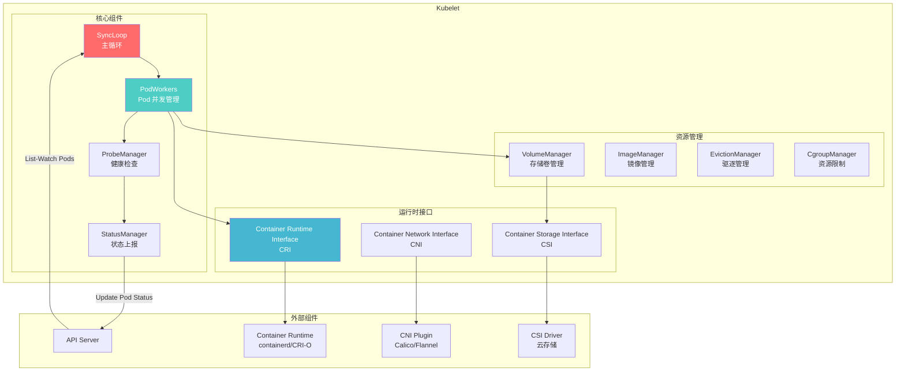
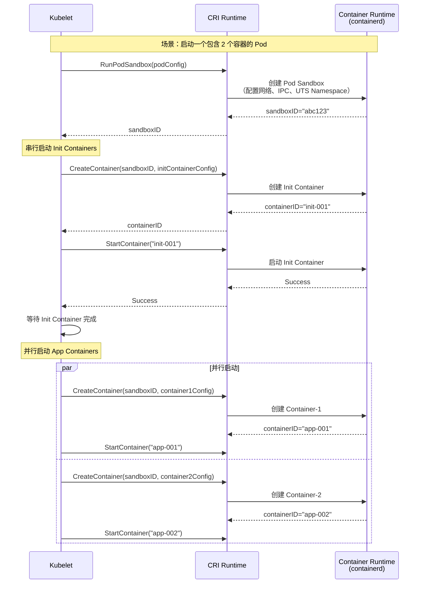
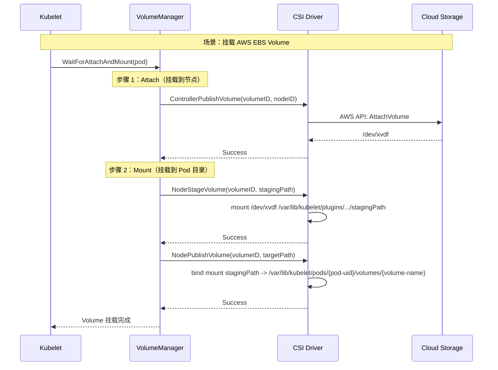
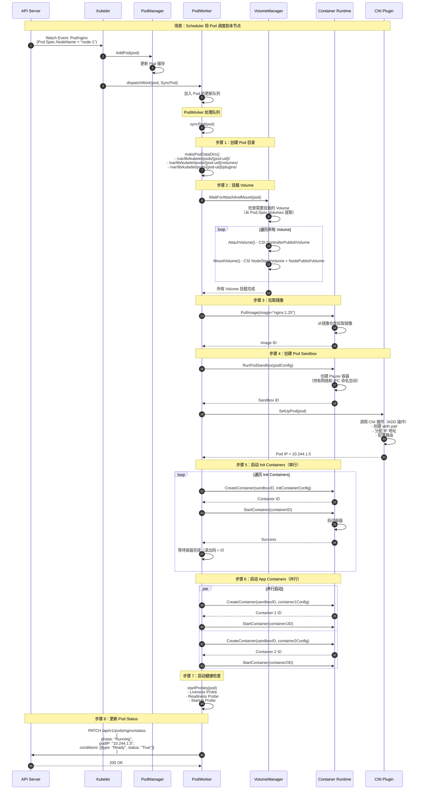
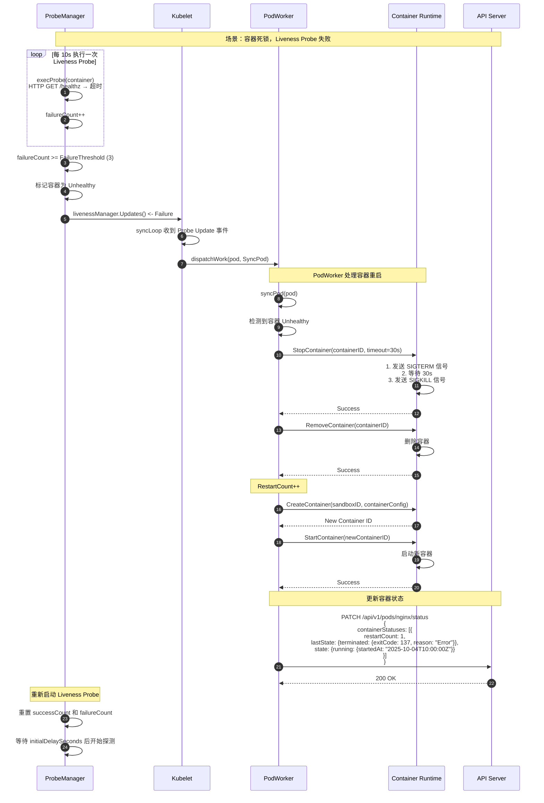
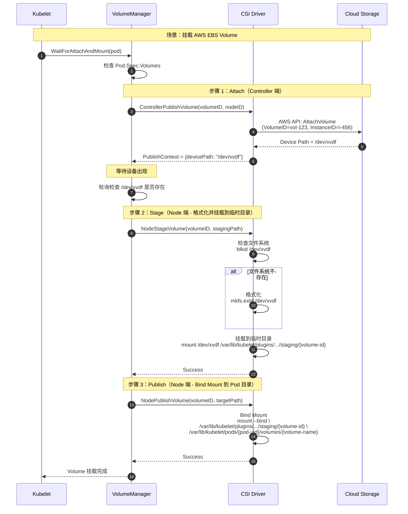
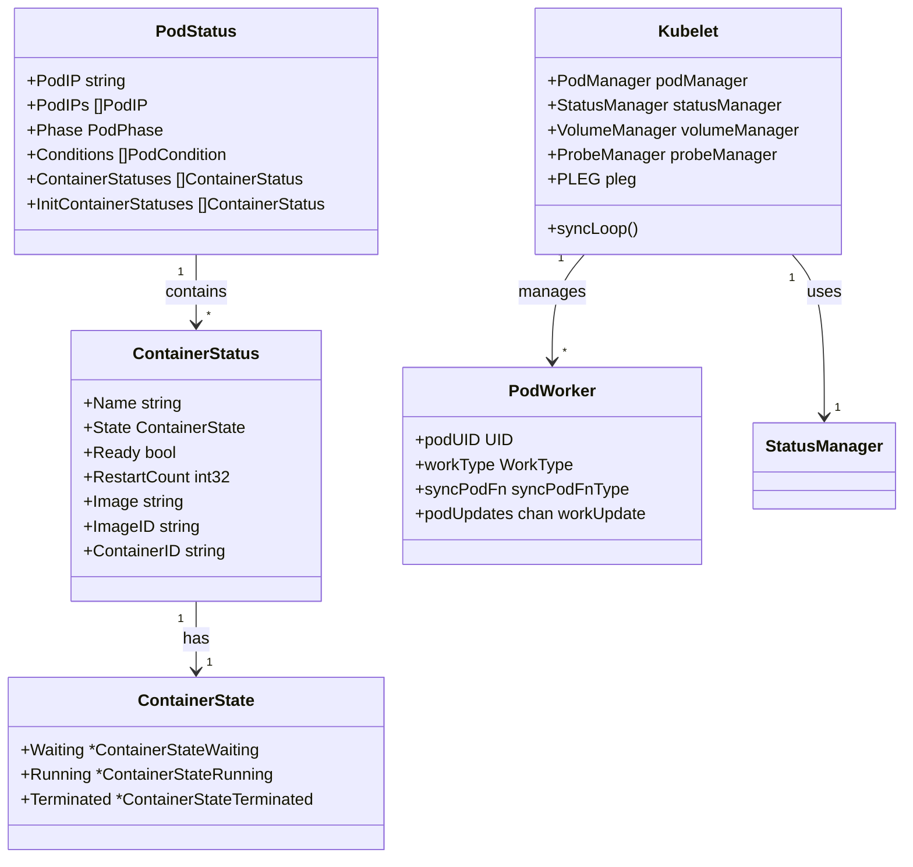

# Kubernetes-04-Kubelet-概览

## 模块职责

kubelet 是运行在每个节点上的**节点代理（Node Agent）**，负责管理节点上的 Pod 和容器生命周期。它是 Kubernetes **数据平面**的核心组件，直接与容器运行时交互，确保 Pod 按照期望状态运行。

### 核心职责

1. **Pod 生命周期管理**
   - 监听 API Server 分配到本节点的 Pod
   - 通过容器运行时（CRI）启动、停止、重启容器
   - 管理 Pod 的各个阶段：Pending → Running → Succeeded/Failed

2. **容器健康检查**
   - 执行 Liveness Probe（存活探针）：失败时重启容器
   - 执行 Readiness Probe（就绪探针）：失败时从 Service Endpoints 移除
   - 执行 Startup Probe（启动探针）：容器启动时的健康检查

3. **资源管理**
   - 通过 cgroups 限制容器的 CPU、内存、磁盘 I/O
   - 节点资源监控（CPU、内存、磁盘使用率）
   - 驱逐低优先级 Pod（节点资源不足时）

4. **存储卷管理**
   - 挂载/卸载 Volume（EmptyDir、HostPath、PV 等）
   - 与 CSI Driver 交互，管理云存储卷
   - 管理 ConfigMap、Secret 挂载

5. **镜像管理**
   - 拉取容器镜像（从镜像仓库）
   - 镜像垃圾回收（删除未使用的镜像）
   - 镜像拉取策略（Always、IfNotPresent、Never）

6. **节点状态上报**
   - 定期向 API Server 上报节点状态（Ready、NotReady）
   - 上报节点资源容量和可分配资源
   - 上报节点信息（OS、Kernel、Container Runtime 版本）

### 输入/输出

**输入：**
- **Pod Spec**：来自 API Server 的 Pod 定义（通过 List-Watch）
- **配置文件**：Kubelet 配置（`--config`）
- **静态 Pod**：本地 YAML 文件（`--pod-manifest-path`）

**输出：**
- **容器操作**：通过 CRI 创建/停止/删除容器
- **节点状态更新**：向 API Server 上报节点和 Pod 状态
- **Event 记录**：记录 Pod 相关事件（如 Pulled、Created、Started、Failed）

---

## Kubelet 架构图



---

## SyncLoop（主循环）

### SyncLoop 工作原理

SyncLoop 是 Kubelet 的**核心事件循环**，持续监听多个事件源，驱动 Pod 状态同步：

```go
// pkg/kubelet/kubelet.go

func (kl *Kubelet) syncLoop(ctx context.Context, updates <-chan kubetypes.PodUpdate, handler SyncHandler) {
    for {
        select {
        // 1. 来自 API Server 的 Pod 更新
        case u := <-updates:
            handler.HandlePodAdditions(u.Pods)
            handler.HandlePodUpdates(u.Pods)
            handler.HandlePodRemoves(u.Pods)
            
        // 2. 定时同步（每秒一次）
        case <-syncTicker.C:
            handler.HandlePodSyncs(kl.getPodsToSync())
            
        // 3. Liveness/Readiness Probe 结果
        case update := <-kl.livenessManager.Updates():
            handler.HandlePodLivenessUpdates(update)
            
        // 4. PLEG（Pod Lifecycle Event Generator）事件
        case e := <-plegCh:
            handler.HandlePLEGEvent(e)
            
        // 5. 清理已终止的 Pod
        case <-housekeepingTicker.C:
            handler.HandlePodCleanups()
        }
    }
}
```

### 事件源详解

| 事件源 | 触发时机 | 处理逻辑 |
|-------|---------|---------|
| **API Server Updates** | Pod 被调度到本节点、Pod 被删除 | 启动/停止容器 |
| **Sync Ticker** | 每秒触发一次 | 检查 Pod 实际状态与期望状态是否一致 |
| **Probe Updates** | Liveness/Readiness Probe 失败 | 重启容器 / 更新 Pod.Status.Conditions |
| **PLEG Events** | 容器状态变化（启动、退出） | 更新 Pod Status，触发重启 |
| **Housekeeping** | 每 2 分钟触发一次 | 清理已终止的 Pod、垃圾回收镜像 |

---

## PodWorkers（Pod 并发管理）

### 架构设计

每个 Pod 有一个独立的 Worker Goroutine，串行处理该 Pod 的所有操作（避免并发冲突）：

```go
// pkg/kubelet/pod_workers.go

type podWorkers struct {
    // 每个 Pod 一个 Worker
    podUpdates map[types.UID]chan workUpdate
    
    // Worker 状态
    podSyncStatuses map[types.UID]*podSyncStatus
}

// 启动 Pod Worker
func (p *podWorkers) managePodLoop(podUID types.UID) {
    for update := range p.podUpdates[podUID] {
        // 串行处理 Pod 的所有操作
        p.syncPodFn(update.Pod, update.UpdateType)
    }
}
```

### syncPod（同步 Pod 状态）

```go
// syncPod 同步 Pod 状态（Kubelet 最核心的函数）
func (kl *Kubelet) syncPod(ctx context.Context, pod *v1.Pod, podStatus *kubecontainer.PodStatus) error {
    // 1. 检查 Pod 是否应该运行
    if !kl.podWorkers.IsPodTerminationRequested(pod.UID) {
        // Pod 未被删除，确保运行
        
        // 2. 创建 Pod 的数据目录
        if err := kl.makePodDataDirs(pod); err != nil {
            return err
        }
        
        // 3. 挂载 Volume
        if err := kl.volumeManager.WaitForAttachAndMount(pod); err != nil {
            return err
        }
        
        // 4. 拉取镜像
        if err := kl.imagePuller.EnsureImagesExist(pod); err != nil {
            return err
        }
        
        // 5. 创建/启动容器
        result := kl.containerRuntime.SyncPod(pod, podStatus)
        if result.Error() != nil {
            return result.Error()
        }
        
        // 6. 更新 Pod Status
        kl.statusManager.SetPodStatus(pod, result.PodStatus)
    } else {
        // Pod 被删除，确保清理
        
        // 1. 停止容器
        if err := kl.containerRuntime.KillPod(pod, podStatus); err != nil {
            return err
        }
        
        // 2. 卸载 Volume
        if err := kl.volumeManager.WaitForUnmount(pod); err != nil {
            return err
        }
        
        // 3. 清理 Pod 目录
        if err := kl.cleanupPodDir(pod); err != nil {
            return err
        }
    }
    
    return nil
}
```

---

## CRI（Container Runtime Interface）

### 接口定义

CRI 是 Kubelet 与容器运行时的标准接口（gRPC）：

```go
// pkg/kubelet/cri/runtime/runtime.go

// RuntimeService CRI 运行时接口
type RuntimeService interface {
    // Pod 操作
    RunPodSandbox(config *PodSandboxConfig) (string, error)
    StopPodSandbox(podSandboxID string) error
    RemovePodSandbox(podSandboxID string) error
    PodSandboxStatus(podSandboxID string) (*PodSandboxStatus, error)
    ListPodSandbox(filter *PodSandboxFilter) ([]*PodSandbox, error)
    
    // Container 操作
    CreateContainer(podSandboxID string, config *ContainerConfig, sandboxConfig *PodSandboxConfig) (string, error)
    StartContainer(containerID string) error
    StopContainer(containerID string, timeout int64) error
    RemoveContainer(containerID string) error
    ListContainers(filter *ContainerFilter) ([]*Container, error)
    ContainerStatus(containerID string) (*ContainerStatus, error)
    
    // 镜像操作
    PullImage(image *ImageSpec, auth *AuthConfig) (string, error)
    RemoveImage(image *ImageSpec) error
    ListImages(filter *ImageFilter) ([]*Image, error)
}
```

### SyncPod 调用 CRI 的流程



---

## ProbeManager（健康检查管理器）

### 三种探针类型

```go
// pkg/kubelet/prober/prober.go

type Probe struct {
    // 探针类型
    Type ProbeType  // Liveness / Readiness / Startup
    
    // 探针配置
    Handler v1.ProbeHandler  // Exec / HTTPGet / TCPSocket / gRPC
    
    // 探针参数
    InitialDelaySeconds int32  // 初始延迟
    TimeoutSeconds      int32  // 超时时间
    PeriodSeconds       int32  // 探测周期
    SuccessThreshold    int32  // 成功阈值
    FailureThreshold    int32  // 失败阈值
}
```

**探针类型对比：**

| 探针类型 | 失败时的行为 | 适用场景 |
|---------|-------------|---------|
| **Liveness Probe** | 重启容器 | 检测容器死锁（进程存在但无法响应） |
| **Readiness Probe** | 从 Service Endpoints 移除 | 检测容器未就绪（如加载配置、预热缓存） |
| **Startup Probe** | 重启容器（仅启动阶段） | 慢启动容器（如 Java 应用） |

### 探针执行流程

```go
// 探针执行器
func (pb *prober) probe(probeType ProbeType, pod *v1.Pod, container *v1.Container) (Result, error) {
    // 1. 根据 Handler 类型执行探测
    switch container.LivenessProbe.Handler {
    case ExecAction:
        // 在容器内执行命令
        result = pb.exec.Probe(pod, container, cmd)
        
    case HTTPGetAction:
        // 发送 HTTP GET 请求
        result = pb.http.Probe(url, headers, timeout)
        
    case TCPSocketAction:
        // 尝试 TCP 连接
        result = pb.tcp.Probe(host, port, timeout)
        
    case GRPCAction:
        // 调用 gRPC Health Check
        result = pb.grpc.Probe(service, timeout)
    }
    
    // 2. 更新探测结果
    if result == Success {
        pb.successCount++
        if pb.successCount >= SuccessThreshold {
            return Success, nil
        }
    } else {
        pb.failureCount++
        if pb.failureCount >= FailureThreshold {
            return Failure, nil
        }
    }
    
    return Unknown, nil
}
```

---

## VolumeManager（存储卷管理器）

### Volume 类型

| Volume 类型 | 说明 | 使用场景 |
|-----------|------|---------|
| **EmptyDir** | 临时目录（Pod 删除时清空） | 缓存、临时文件 |
| **HostPath** | 挂载节点目录 | 访问节点文件系统 |
| **PersistentVolumeClaim** | 持久化存储（PVC → PV） | 数据库、文件存储 |
| **ConfigMap** | 配置文件挂载 | 应用配置 |
| **Secret** | 敏感信息挂载 | 密码、证书 |
| **CSI Volume** | 云存储（通过 CSI Driver） | AWS EBS、Azure Disk、GCE PD |

### Volume 挂载流程



---

## EvictionManager（驱逐管理器）

### 驱逐信号

当节点资源不足时，Kubelet 会驱逐低优先级 Pod：

| 驱逐信号 | 阈值示例 | 说明 |
|---------|---------|------|
| **memory.available** | < 100Mi | 可用内存不足 |
| **nodefs.available** | < 10% | 根文件系统可用空间不足 |
| **nodefs.inodesFree** | < 5% | 根文件系统 inode 不足 |
| **imagefs.available** | < 15% | 镜像文件系统可用空间不足 |

### 驱逐策略

```go
// pkg/kubelet/eviction/eviction_manager.go

// 驱逐 Pod 的优先级顺序
func (m *managerImpl) rankPodsByPriority(pods []*v1.Pod) []*v1.Pod {
    // 1. BestEffort Pod（无资源请求和限制）
    // 2. Burstable Pod（资源使用超过请求值）
    // 3. Burstable Pod（资源使用未超过请求值）
    // 4. Guaranteed Pod（资源请求等于限制）
    
    return sortedPods
}
```

---

## 关键代码片段

### Kubelet 启动流程

```go
// cmd/kubelet/app/server.go

func RunKubelet(kubeServer *options.KubeletServer) error {
    // 1. 创建 Kubelet 实例
    kubelet, err := createAndInitKubelet(kubeServer)
    if err != nil {
        return err
    }
    
    // 2. 启动 Kubelet
    kubelet.Run()
    
    return nil
}

// pkg/kubelet/kubelet.go

func (kl *Kubelet) Run() {
    // 1. 启动 VolumeManager
    go kl.volumeManager.Run(kl.sourcesReady, wait.NeverStop)
    
    // 2. 启动 StatusManager
    kl.statusManager.Start()
    
    // 3. 启动 ProbeManager
    kl.probeManager.Start()
    
    // 4. 启动 PLEG
    kl.pleg.Start()
    
    // 5. 启动 SyncLoop（主循环）
    kl.syncLoop(updates, kl)
}
```

---

## 最佳实践

### 1. 合理设置资源请求和限制

```yaml
resources:
  requests:
    cpu: "100m"
    memory: "128Mi"
  limits:
    cpu: "200m"
    memory: "256Mi"
```

### 2. 配置健康检查

```yaml
livenessProbe:
  httpGet:
    path: /healthz
    port: 8080
  initialDelaySeconds: 30
  periodSeconds: 10

readinessProbe:
  httpGet:
    path: /ready
    port: 8080
  initialDelaySeconds: 5
  periodSeconds: 5
```

### 3. 使用 Init Containers

```yaml
initContainers:
- name: init-db
  image: busybox
  command: ['sh', '-c', 'until nc -z db 5432; do sleep 1; done']
```

---

**文档维护：**
- 版本：v1.0
- 最后更新：2025-10-04
- 适用 Kubernetes 版本：v1.29+

---

# Kubernetes-04-Kubelet-时序图

## 时序图概述

本文档提供 Kubelet 核心场景的时序图：
1. **Pod 启动完整流程**：从接收到 Pod 到容器运行
2. **容器重启流程**：Liveness Probe 失败触发重启
3. **Volume 挂载流程**：CSI Volume 的完整挂载过程

---

## 场景 1：Pod 启动完整流程



### 要点说明

#### 1. Pod 目录结构
```text
/var/lib/kubelet/pods/{pod-uid}/
├── volumes/              # Volume 挂载点
│   ├── kubernetes.io~empty-dir/
│   ├── kubernetes.io~configmap/
│   └── kubernetes.io~csi/
├── plugins/              # 插件目录
└── containers/           # 容器日志
```

#### 2. Init Containers 特点
- **串行执行**：必须按顺序成功
- **共享 Volume**：与 App Containers 共享 Volume
- **常见用途**：等待依赖服务、初始化数据库

#### 3. 网络配置时机
- Pod Sandbox 创建后立即配置网络
- 所有容器共享 Sandbox 的网络命名空间

---

## 场景 2：容器重启流程（Liveness Probe 失败）



### 要点说明

#### 1. 容器终止流程
```text
SIGTERM（优雅关闭）
   ↓ 等待 terminationGracePeriodSeconds（默认 30s）
SIGKILL（强制终止）
```

#### 2. RestartPolicy 策略
- **Always**：总是重启（默认）
- **OnFailure**：退出码非 0 时重启
- **Never**：不重启

#### 3. CrashLoopBackOff
- 容器启动后 10s 内退出 → 判定为 Crash
- 退避时间：10s → 20s → 40s → ... → 5min（最大）

---

## 场景 3：Volume 挂载流程（CSI）



### 要点说明

#### 1. Volume 生命周期
```text
Provision（创建 PV）
   ↓
Attach（挂载到节点）
   ↓
Stage（格式化并挂载到临时目录）
   ↓
Publish（Bind Mount 到 Pod 目录）
   ↓
Unpublish（卸载 Bind Mount）
   ↓
Unstage（卸载临时目录）
   ↓
Detach（从节点卸载）
   ↓
Delete（删除 PV）
```

#### 2. Stage 和 Publish 的区别
- **Stage**：挂载到节点级别的临时目录（一次性，多个 Pod 共享）
- **Publish**：Bind Mount 到每个 Pod 的目录（每个 Pod 一次）

#### 3. 为什么需要 Stage？
- 避免重复格式化（多个 Pod 使用同一 Volume）
- 提高挂载效率（仅一次 mkfs 和 mount）

---

## 性能指标

### 关键指标

| 指标 | 类型 | 说明 |
|-----|------|------|
| `kubelet_pod_start_duration_seconds` | Histogram | Pod 启动延迟（从接收到容器运行） |
| `kubelet_pod_worker_duration_seconds` | Histogram | PodWorker 处理时间 |
| `kubelet_pleg_relist_duration_seconds` | Histogram | PLEG 轮询耗时 |
| `kubelet_cri_operations_duration_seconds` | Histogram | CRI 操作延迟 |
| `kubelet_volume_mount_duration_seconds` | Histogram | Volume 挂载延迟 |
| `kubelet_container_restart_total` | Counter | 容器重启次数 |

---

**文档维护：**
- 版本：v1.0
- 最后更新：2025-10-04
- 适用 Kubernetes 版本：v1.29+

---

# Kubernetes-04-Kubelet-数据结构

## 数据结构概述

Kubelet 的核心数据结构围绕 **Pod 和容器状态管理** 设计：
1. **PodStatus**：Pod 的状态信息
2. **ContainerStatus**：容器的状态信息
3. **PodWorker**：Pod 管理的工作单元
4. **VolumeManager**：存储卷管理器

---

## 核心数据结构 UML 图



---

## 数据结构详解

### 1. PodStatus（Pod 状态）

```go
// staging/src/k8s.io/api/core/v1/types.go

type PodStatus struct {
    // Phase Pod 生命周期阶段
    Phase PodPhase  // Pending / Running / Succeeded / Failed / Unknown
    
    // Conditions Pod 状态条件
    Conditions []PodCondition
    
    // Message 人类可读的状态信息
    Message string
    
    // Reason 状态原因（机器可读）
    Reason string
    
    // NominatedNodeName 抢占调度的节点名称
    NominatedNodeName string
    
    // HostIP 节点 IP
    HostIP string
    
    // PodIP Pod IP（IPv4）
    PodIP string
    
    // PodIPs Pod IP 列表（支持 IPv4 + IPv6）
    PodIPs []PodIP
    
    // StartTime Pod 启动时间
    StartTime *metav1.Time
    
    // InitContainerStatuses Init 容器状态列表
    InitContainerStatuses []ContainerStatus
    
    // ContainerStatuses 应用容器状态列表
    ContainerStatuses []ContainerStatus
    
    // QOSClass QoS 等级（Guaranteed / Burstable / BestEffort）
    QOSClass PodQOSClass
    
    // EphemeralContainerStatuses 临时容器状态列表
    EphemeralContainerStatuses []ContainerStatus
}
```

**字段说明：**

| 字段 | 类型 | 说明 |
|-----|------|------|
| `Phase` | `PodPhase` | Pod 生命周期阶段（Pending/Running/Succeeded/Failed） |
| `Conditions` | `[]PodCondition` | Pod 状态条件（PodScheduled、Initialized、Ready） |
| `ContainerStatuses` | `[]ContainerStatus` | 容器状态列表 |
| `PodIP` | `string` | Pod 的 IP 地址 |
| `StartTime` | `*Time` | Pod 启动时间 |

### 2. PodCondition（Pod 状态条件）

```go
type PodCondition struct {
    // Type 条件类型
    Type PodConditionType  // PodScheduled / Initialized / Ready / ContainersReady
    
    // Status 条件状态
    Status ConditionStatus  // True / False / Unknown
    
    // LastProbeTime 最后探测时间
    LastProbeTime metav1.Time
    
    // LastTransitionTime 最后状态变化时间
    LastTransitionTime metav1.Time
    
    // Reason 状态原因
    Reason string
    
    // Message 详细信息
    Message string
}
```

**常见 Condition 类型：**

| Type | 说明 | True 表示 |
|------|------|-----------|
| `PodScheduled` | Pod 是否已调度 | 已分配到节点 |
| `Initialized` | Init 容器是否完成 | 所有 Init 容器成功 |
| `ContainersReady` | 容器是否就绪 | 所有容器 Ready=true |
| `Ready` | Pod 是否就绪 | ContainersReady=true 且 Readiness Gates 通过 |

### 3. ContainerStatus（容器状态）

```go
type ContainerStatus struct {
    // Name 容器名称
    Name string
    
    // State 容器状态（Waiting / Running / Terminated）
    State ContainerState
    
    // LastTerminationState 上次终止状态
    LastTerminationState ContainerState
    
    // Ready 容器是否就绪
    Ready bool
    
    // RestartCount 重启次数
    RestartCount int32
    
    // Image 镜像名称
    Image string
    
    // ImageID 镜像 ID（sha256:...）
    ImageID string
    
    // ContainerID 容器 ID（runtime://container-id）
    ContainerID string
    
    // Started 容器是否已启动
    Started *bool
}
```

### 4. ContainerState（容器状态）

```go
type ContainerState struct {
    // Waiting 等待状态（容器尚未启动）
    Waiting *ContainerStateWaiting
    
    // Running 运行状态
    Running *ContainerStateRunning
    
    // Terminated 终止状态
    Terminated *ContainerStateTerminated
}

// ContainerStateWaiting 等待状态
type ContainerStateWaiting struct {
    Reason  string  // 等待原因（ContainerCreating / CrashLoopBackOff / ImagePullBackOff）
    Message string  // 详细信息
}

// ContainerStateRunning 运行状态
type ContainerStateRunning struct {
    StartedAt metav1.Time  // 启动时间
}

// ContainerStateTerminated 终止状态
type ContainerStateTerminated struct {
    ExitCode    int32        // 退出码
    Signal      int32        // 信号（如 SIGKILL=9）
    Reason      string       // 终止原因（Completed / Error / OOMKilled）
    Message     string       // 详细信息
    StartedAt   metav1.Time  // 启动时间
    FinishedAt  metav1.Time  // 终止时间
    ContainerID string       // 容器 ID
}
```

**状态转换：**

```text
Waiting → Running → Terminated
   ↑                    ↓
   └────────────────────┘
       （容器重启）
```

### 5. PodWorker（Pod 工作单元）

```go
// pkg/kubelet/pod_workers.go

type podWorkers struct {
    // podUpdates 每个 Pod 一个更新通道
    podUpdates map[types.UID]chan workUpdate
    
    // podSyncStatuses Pod 同步状态
    podSyncStatuses map[types.UID]*podSyncStatus
    
    // 工作函数
    syncPodFn       syncPodFnType
    syncTerminatingPodFn syncTerminatingPodFnType
}

type workUpdate struct {
    WorkType   WorkType      // SyncPod / TerminatingPod / TerminatedPod
    Options    UpdateOptions // Pod 信息、更新类型
}

type podSyncStatus struct {
    syncedAt    time.Time   // 最后同步时间
    working     bool        // 是否正在处理
    terminating bool        // 是否正在终止
    terminated  bool        // 是否已终止
}
```

### 6. VolumeManager（存储卷管理器）

```go
// pkg/kubelet/volumemanager/volume_manager.go

type volumeManager struct {
    // desiredStateOfWorld 期望状态（应该挂载的 Volume）
    desiredStateOfWorld cache.DesiredStateOfWorld
    
    // actualStateOfWorld 实际状态（已挂载的 Volume）
    actualStateOfWorld cache.ActualStateOfWorld
    
    // operationExecutor Volume 操作执行器
    operationExecutor operationexecutor.OperationExecutor
    
    // reconciler 协调器（将实际状态协调为期望状态）
    reconciler reconciler.Reconciler
}

type AttachedVolume struct {
    VolumeName          v1.UniqueVolumeName  // Volume 名称
    VolumeSpec          *volume.Spec         // Volume 规格
    NodeName            types.NodeName       // 节点名称
    MountedByNode       bool                 // 是否已挂载到节点
    DevicePath          string               // 设备路径（如 /dev/xvdf）
    DeviceMountPath     string               // 挂载路径
}
```

---

## 关键算法与机制

### 1. PLEG（Pod Lifecycle Event Generator）

**作用：** 定期轮询容器运行时，检测容器状态变化

```go
// pkg/kubelet/pleg/generic.go

type GenericPLEG struct {
    runtime       kubecontainer.Runtime
    eventChannel  chan *PodLifecycleEvent
    relistPeriod  time.Duration  // 轮询周期（默认 1s）
}

type PodLifecycleEvent struct {
    ID   types.UID                  // Pod UID
    Type PodLifeCycleEventType      // ContainerStarted / ContainerDied / ContainerRemoved
    Data interface{}                // 事件数据（如容器 ID）
}

// relist 轮询容器运行时
func (g *GenericPLEG) relist() {
    // 1. 调用 CRI ListPodSandbox + ListContainers
    podList, err := g.runtime.GetPods(true)
    
    // 2. 比较当前状态与上次状态
    events := computeEvents(g.podRecords, podList)
    
    // 3. 发送事件到 eventChannel
    for _, e := range events {
        g.eventChannel <- e
    }
    
    // 4. 更新缓存
    g.podRecords = podList
}
```

### 2. Probe 探针状态机

```go
// pkg/kubelet/prober/prober.go

type probeResultManager struct {
    // 探针结果缓存
    cache map[kubecontainer.ContainerID]proberesults.Result
    
    // 更新通道
    updates chan proberesults.Update
}

type Result int

const (
    Unknown Result = iota  // 未知
    Success                // 成功
    Failure                // 失败
)

// 状态转换逻辑
func (prober *prober) runProbe(probeType, pod, container) {
    result := prober.exec(probe)
    
    if result == Success {
        prober.successCount++
        if prober.successCount >= probe.SuccessThreshold {
            prober.resultManager.Set(containerID, Success)
        }
    } else {
        prober.failureCount++
        if prober.failureCount >= probe.FailureThreshold {
            prober.resultManager.Set(containerID, Failure)
        }
    }
}
```

---

## 性能与容量考虑

### 1. PodWorker 并发

**并发模型：**
- 每个 Pod 一个 Worker Goroutine（串行处理）
- 不同 Pod 间并行处理

**内存占用：**
- 每个 PodWorker：约 10 KB（Goroutine + channel）
- 100 个 Pod ≈ 1 MB

### 2. PLEG 轮询开销

**CPU 占用：**
- 轮询周期：默认 1s
- 每次轮询：调用 CRI ListPodSandbox + ListContainers（约 10-50ms）

**优化建议：**
- 使用 Evented PLEG（基于 CRI Event 流，无需轮询）
- 适用于 containerd 1.7+

### 3. StatusManager 上报频率

**默认配置：**
- 每 10s 上报一次节点状态
- Pod 状态变化时立即上报

**优化建议：**
- 减少上报频率（适用于大规模集群）
- 批量上报 Pod 状态

---

**文档维护：**
- 版本：v1.0
- 最后更新：2025-10-04
- 适用 Kubernetes 版本：v1.29+

---

# Kubernetes-04-Kubelet-API

## API 概述

Kubelet 通过三大标准接口与外部系统交互：
1. **CRI（Container Runtime Interface）**：容器运行时接口
2. **CNI（Container Network Interface）**：容器网络接口  
3. **CSI（Container Storage Interface）**：容器存储接口

本文档详细介绍这三大接口的规格和实现。

---

## 1. CRI（Container Runtime Interface）

### 1.1 接口定义

CRI 是 Kubelet 与容器运行时（如 containerd、CRI-O）之间的 gRPC 接口。

```protobuf
// api/services.proto

service RuntimeService {
    // Sandbox 操作
    rpc RunPodSandbox(RunPodSandboxRequest) returns (RunPodSandboxResponse) {}
    rpc StopPodSandbox(StopPodSandboxRequest) returns (StopPodSandboxResponse) {}
    rpc RemovePodSandbox(RemovePodSandboxRequest) returns (RemovePodSandboxResponse) {}
    rpc PodSandboxStatus(PodSandboxStatusRequest) returns (PodSandboxStatusResponse) {}
    rpc ListPodSandbox(ListPodSandboxRequest) returns (ListPodSandboxResponse) {}
    
    // Container 操作
    rpc CreateContainer(CreateContainerRequest) returns (CreateContainerResponse) {}
    rpc StartContainer(StartContainerRequest) returns (StartContainerResponse) {}
    rpc StopContainer(StopContainerRequest) returns (StopContainerResponse) {}
    rpc RemoveContainer(RemoveContainerRequest) returns (RemoveContainerResponse) {}
    rpc ListContainers(ListContainersRequest) returns (ListContainersResponse) {}
    
    // 镜像操作
    rpc PullImage(PullImageRequest) returns (PullImageResponse) {}
    rpc ListImages(ListImagesRequest) returns (ListImagesResponse) {}
    rpc RemoveImage(RemoveImageRequest) returns (RemoveImageResponse) {}
}
```

### 1.2 RunPodSandbox（创建 Pod 沙箱）

**作用：** 创建 Pod 的网络和 IPC 命名空间（Sandbox）

**请求结构：**
```go
type RunPodSandboxRequest struct {
    Config *PodSandboxConfig  // Pod 配置
}

type PodSandboxConfig struct {
    Metadata   *PodSandboxMetadata  // 元数据
    Hostname   string                // 主机名
    LogDir     string                // 日志目录
    DnsConfig  *DNSConfig            // DNS 配置
    PortMappings []*PortMapping      // 端口映射
    Labels     map[string]string     // 标签
    Annotations map[string]string    // 注解
}
```

**响应结构：**
```go
type RunPodSandboxResponse struct {
    PodSandboxId string  // Sandbox ID
}
```

**核心代码：**
```go
// pkg/kubelet/kuberuntime/kuberuntime_sandbox.go

func (m *kubeGenericRuntimeManager) RunPodSandbox(pod *v1.Pod) (string, error) {
    // 1. 生成 PodSandboxConfig
    podSandboxConfig := m.generatePodSandboxConfig(pod)
    
    // 2. 调用 CRI RunPodSandbox
    resp, err := m.runtimeService.RunPodSandbox(podSandboxConfig)
    if err != nil {
        return "", err
    }
    
    return resp.PodSandboxId, nil
}
```

### 1.3 CreateContainer（创建容器）

**请求结构：**
```go
type CreateContainerRequest struct {
    PodSandboxId  string              // Sandbox ID
    Config        *ContainerConfig    // 容器配置
    SandboxConfig *PodSandboxConfig   // Sandbox 配置
}

type ContainerConfig struct {
    Metadata    *ContainerMetadata   // 元数据
    Image       *ImageSpec           // 镜像
    Command     []string             // 命令
    Args        []string             // 参数
    WorkingDir  string               // 工作目录
    Envs        []*KeyValue          // 环境变量
    Mounts      []*Mount             // 挂载点
    Devices     []*Device            // 设备
    Linux       *LinuxContainerConfig // Linux 配置（cgroups）
}
```

**响应结构：**
```go
type CreateContainerResponse struct {
    ContainerId string  // 容器 ID
}
```

---

## 2. CNI（Container Network Interface）

### 2.1 接口定义

CNI 通过**可执行文件**实现（存放在 `/opt/cni/bin/`）：

```bash
# CNI 插件调用示例
echo '{
  "cniVersion": "1.0.0",
  "name": "pod-network",
  "type": "bridge",
  "bridge": "cni0",
  "ipam": {
    "type": "host-local",
    "subnet": "10.244.0.0/24"
  }
}' | /opt/cni/bin/bridge ADD <container-id> <netns-path>
```

### 2.2 ADD 操作（为容器配置网络）

**输入（stdin）：**
```json
{
  "cniVersion": "1.0.0",
  "name": "pod-network",
  "type": "bridge",
  "bridge": "cni0",
  "ipam": {
    "type": "host-local",
    "subnet": "10.244.1.0/24",
    "gateway": "10.244.1.1"
  }
}
```

**环境变量：**
- `CNI_COMMAND=ADD`
- `CNI_CONTAINERID=abc123`
- `CNI_NETNS=/var/run/netns/abc123`
- `CNI_IFNAME=eth0`

**输出（stdout）：**
```json
{
  "cniVersion": "1.0.0",
  "interfaces": [
    {
      "name": "eth0",
      "mac": "02:42:ac:11:00:02"
    }
  ],
  "ips": [
    {
      "version": "4",
      "address": "10.244.1.5/24",
      "gateway": "10.244.1.1",
      "interface": 0
    }
  ],
  "routes": [
    {
      "dst": "0.0.0.0/0",
      "gw": "10.244.1.1"
    }
  ]
}
```

### 2.3 核心代码

```go
// pkg/kubelet/dockershim/network/cni/cni.go

func (plugin *cniNetworkPlugin) SetUpPod(namespace, name string, id kubecontainer.ContainerID) error {
    // 1. 构造 CNI 配置
    netConf := plugin.getNetConfig()
    
    // 2. 创建网络命名空间
    netns, err := plugin.host.GetNetNS(id.ID)
    if err != nil {
        return err
    }
    
    // 3. 调用 CNI 插件（ADD 操作）
    result, err := plugin.addToNetwork(netConf, id.ID, netns)
    if err != nil {
        return err
    }
    
    // 4. 记录网络配置结果
    plugin.podNetworks[id.ID] = result
    
    return nil
}
```

---

## 3. CSI（Container Storage Interface）

### 3.1 接口定义

CSI 是 gRPC 接口，包含三个服务：

```protobuf
// csi.proto

// Identity Service（身份服务）
service Identity {
    rpc GetPluginInfo(GetPluginInfoRequest) returns (GetPluginInfoResponse) {}
    rpc GetPluginCapabilities(GetPluginCapabilitiesRequest) returns (GetPluginCapabilitiesResponse) {}
    rpc Probe(ProbeRequest) returns (ProbeResponse) {}
}

// Controller Service（控制器服务）
service Controller {
    rpc CreateVolume(CreateVolumeRequest) returns (CreateVolumeResponse) {}
    rpc DeleteVolume(DeleteVolumeRequest) returns (DeleteVolumeResponse) {}
    rpc ControllerPublishVolume(ControllerPublishVolumeRequest) returns (ControllerPublishVolumeResponse) {}
    rpc ControllerUnpublishVolume(ControllerUnpublishVolumeRequest) returns (ControllerUnpublishVolumeResponse) {}
}

// Node Service（节点服务）
service Node {
    rpc NodeStageVolume(NodeStageVolumeRequest) returns (NodeStageVolumeResponse) {}
    rpc NodeUnstageVolume(NodeUnstageVolumeRequest) returns (NodeUnstageVolumeResponse) {}
    rpc NodePublishVolume(NodePublishVolumeRequest) returns (NodePublishVolumeResponse) {}
    rpc NodeUnpublishVolume(NodeUnpublishVolumeRequest) returns (NodeUnpublishVolumeResponse) {}
}
```

### 3.2 Volume 挂载流程

**步骤 1：ControllerPublishVolume（Attach）**

**作用：** 将云盘挂载到节点（如 AWS EBS Attach）

**请求：**
```go
type ControllerPublishVolumeRequest struct {
    VolumeId         string              // Volume ID
    NodeId           string              // Node ID
    VolumeCapability *VolumeCapability   // Volume 能力
}
```

**响应：**
```go
type ControllerPublishVolumeResponse struct {
    PublishContext map[string]string  // 挂载上下文（如设备路径 /dev/xvdf）
}
```

**步骤 2：NodeStageVolume（Stage）**

**作用：** 将设备格式化并挂载到临时目录

**请求：**
```go
type NodeStageVolumeRequest struct {
    VolumeId          string              // Volume ID
    PublishContext    map[string]string   // 挂载上下文
    StagingTargetPath string              // 临时挂载路径
    VolumeCapability  *VolumeCapability   // Volume 能力
}
```

**步骤 3：NodePublishVolume（Publish）**

**作用：** Bind Mount 到 Pod 目录

**请求：**
```go
type NodePublishVolumeRequest struct {
    VolumeId          string    // Volume ID
    PublishContext    map[string]string
    StagingTargetPath string    // 临时挂载路径
    TargetPath        string    // Pod 挂载路径（/var/lib/kubelet/pods/{uid}/volumes/{name}）
    Readonly          bool
}
```

### 3.3 核心代码

```go
// pkg/volume/csi/csi_attacher.go

func (c *csiAttacher) Attach(spec *volume.Spec, nodeName types.NodeName) (string, error) {
    // 1. 调用 CSI ControllerPublishVolume
    ctx := context.Background()
    req := &csi.ControllerPublishVolumeRequest{
        VolumeId: volumeHandle,
        NodeId:   string(nodeName),
        VolumeCapability: &csi.VolumeCapability{
            AccessMode: &csi.VolumeCapability_AccessMode{
                Mode: csi.VolumeCapability_AccessMode_SINGLE_NODE_WRITER,
            },
        },
    }
    
    resp, err := c.client.ControllerPublishVolume(ctx, req)
    if err != nil {
        return "", err
    }
    
    // 2. 返回 PublishContext
    return resp.PublishContext["devicePath"], nil
}
```

---

## 性能优化与最佳实践

### 1. CRI 优化

**使用 containerd 而非 Docker**
- containerd 更轻量（无 Docker Daemon）
- 减少一层调用链（kubelet → containerd CRI 插件 → containerd）

### 2. CNI 优化

**选择高性能 CNI 插件**
- Calico（eBPF 模式）：最高性能
- Cilium（eBPF）：L7 策略支持
- Flannel（VXLAN）：简单易用

### 3. CSI 优化

**使用本地存储**
- Local PV：直接使用节点磁盘（无网络开销）
- 适用场景：数据库、缓存

---

**文档维护：**
- 版本：v1.0
- 最后更新：2025-10-04
- 适用 Kubernetes 版本：v1.29+