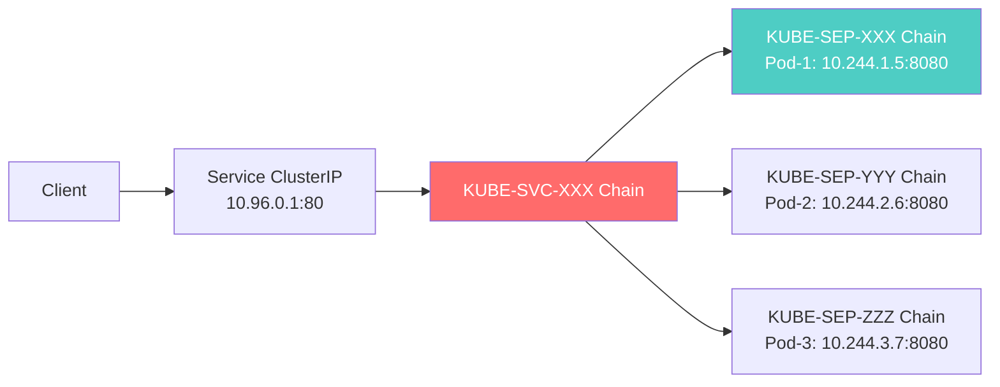
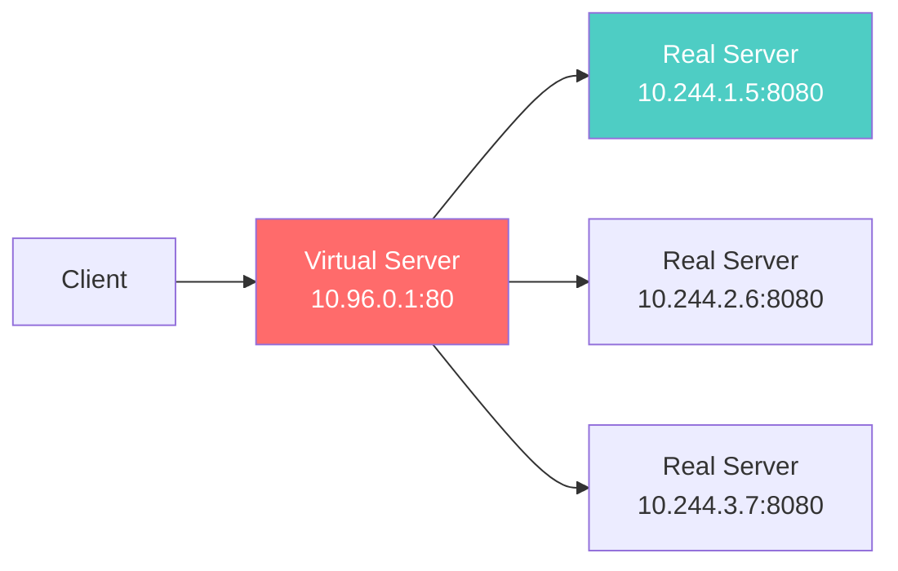
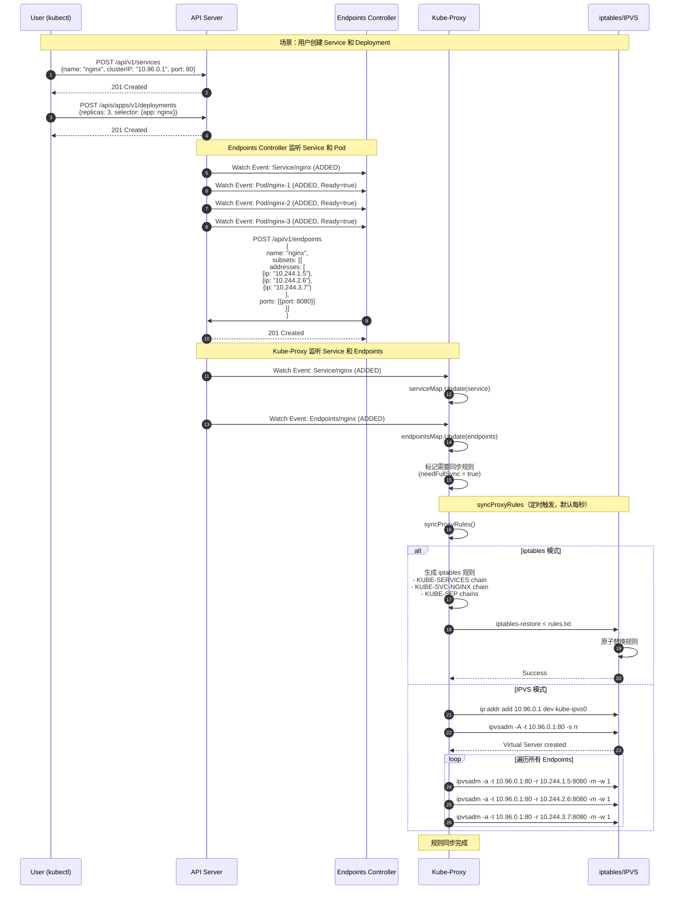
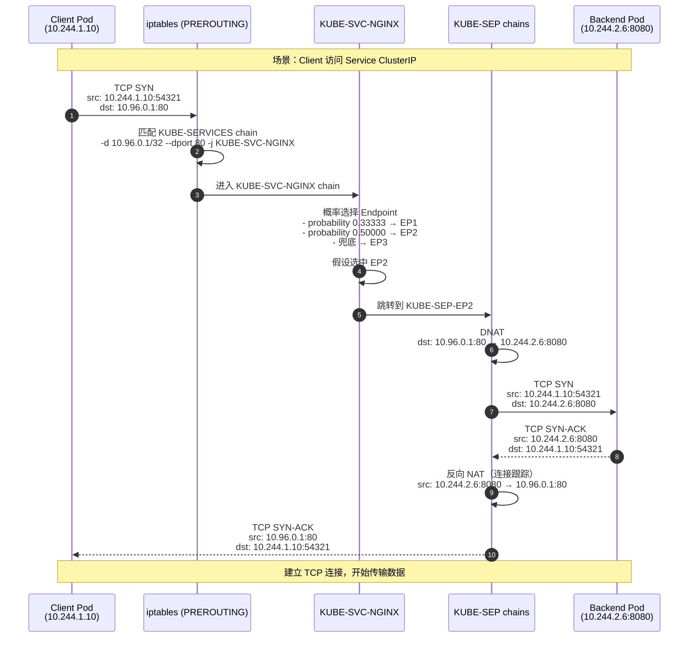
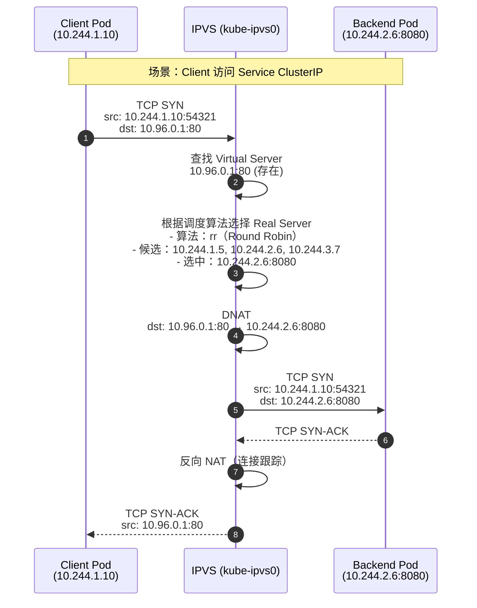
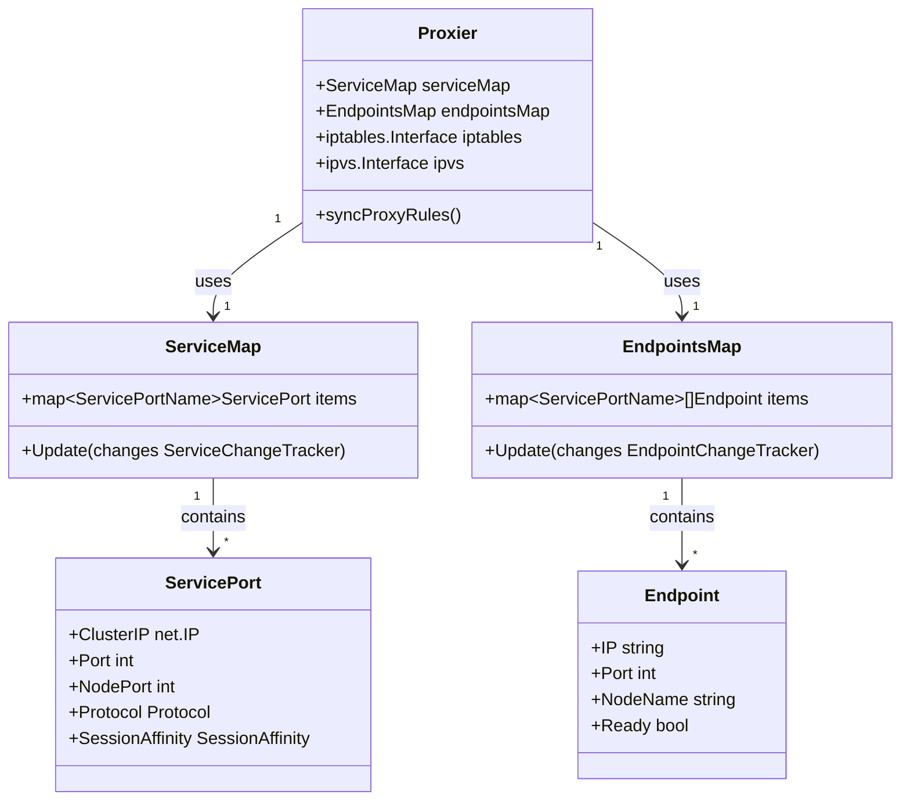

# Kubernetes-05-Kube Proxy-概览

## 模块职责

kube-proxy 是运行在每个节点上的**网络代理**，负责实现 Kubernetes Service 的网络规则。它将访问 Service 的流量负载均衡到后端 Pod。

### 核心职责

1. **Service 负载均衡**
   - 监听 Service 和 Endpoints/EndpointSlice 变化
   - 生成网络规则（iptables/IPVS/nftables）
   - 将 Service ClusterIP/NodePort 流量转发到 Pod IP

2. **三种代理模式**
   - **iptables 模式**：使用 iptables 规则（默认模式）
   - **IPVS 模式**：使用 IPVS 负载均衡（高性能）
   - **nftables 模式**：使用 nftables 规则（新一代防火墙）

3. **NodePort 和 LoadBalancer 支持**
   - 在节点上监听 NodePort 端口
   - 将外部流量转发到 Pod

---

## 三种代理模式对比

| 特性 | iptables | IPVS | nftables |
|-----|---------|------|----------|
| **性能** | 中（线性查找） | 高（哈希表） | 高 |
| **负载均衡算法** | 随机 | 多种（RR/LC/DH/SH/SED/NQ） | 随机 |
| **规则数量** | O(n)（n=Service 数） | O(1)（虚拟服务器） | O(n) |
| **内核支持** | 通用 | 需加载 IPVS 模块 | Linux 3.13+ |
| **适用场景** | 小规模集群（< 1000 Service） | 大规模集群 | 新一代替代 iptables |

---

## iptables 模式架构



### iptables 规则示例

```bash
# Service 规则（KUBE-SERVICES chain）
-A KUBE-SERVICES -d 10.96.0.1/32 -p tcp -m tcp --dport 80 -j KUBE-SVC-NGINX

# 负载均衡规则（KUBE-SVC-NGINX chain）
-A KUBE-SVC-NGINX -m statistic --mode random --probability 0.33333 -j KUBE-SEP-POD1
-A KUBE-SVC-NGINX -m statistic --mode random --probability 0.50000 -j KUBE-SEP-POD2
-A KUBE-SVC-NGINX -j KUBE-SEP-POD3

# Endpoint 规则（KUBE-SEP-POD1 chain）
-A KUBE-SEP-POD1 -p tcp -m tcp -j DNAT --to-destination 10.244.1.5:8080
```

---

## IPVS 模式架构



### IPVS 配置示例

```bash
# 查看 IPVS 规则
ipvsadm -ln

IP Virtual Server version 1.2.1 (size=4096)
Prot LocalAddress:Port Scheduler Flags
  -> RemoteAddress:Port           Forward Weight ActiveConn InActConn
TCP  10.96.0.1:80 rr
  -> 10.244.1.5:8080              Masq    1      0          0
  -> 10.244.2.6:8080              Masq    1      0          0
  -> 10.244.3.7:8080              Masq    1      0          0
```

---

## 核心代码片段

### 规则同步流程

```go
// pkg/proxy/iptables/proxier.go

func (proxier *Proxier) syncProxyRules() {
    // 1. 获取所有 Service 和 Endpoints
    services := proxier.serviceMap
    endpoints := proxier.endpointsMap
    
    // 2. 生成 iptables 规则
    for _, svc := range services {
        for _, endpoint := range endpoints[svc.Name()] {
            // 创建 KUBE-SEP chain
            proxier.natRules.Write(
                "-A", sepChain,
                "-p", protocol,
                "-m", protocol,
                "-j", "DNAT",
                "--to-destination", endpoint.String(),
            )
        }
        
        // 创建 KUBE-SVC chain（负载均衡）
        n := len(endpoints[svc.Name()])
        for i, endpoint := range endpoints[svc.Name()] {
            prob := 1.0 / float64(n-i)
            proxier.natRules.Write(
                "-A", svcChain,
                "-m", "statistic",
                "--mode", "random",
                "--probability", fmt.Sprintf("%.5f", prob),
                "-j", sepChain,
            )
        }
    }
    
    // 3. 应用 iptables 规则
    proxier.iptables.RestoreAll(proxier.natRules.Bytes(), NoFlushTables, RestoreCounters)
}
```

---

## 最佳实践

### 1. 选择合适的代理模式

**iptables 模式**
- 适用于小规模集群（< 1000 Service）
- 无需额外配置

**IPVS 模式**
- 适用于大规模集群（> 1000 Service）
- 需加载 IPVS 内核模块：`modprobe ip_vs`

### 2. 性能调优

**IPVS 模式配置**
```yaml
mode: ipvs
ipvs:
  scheduler: rr  # 轮询算法
  strictARP: true  # 严格 ARP（用于 MetalLB）
```

---

**文档维护：**
- 版本：v1.0
- 最后更新：2025-10-04
- 适用 Kubernetes 版本：v1.29+

---

# Kubernetes-05-Kube Proxy-时序图

## 时序图概述

本文档提供 Kube-Proxy 的核心场景时序图：
1. **Service 创建与规则同步流程**
2. **Client 访问 Service 的数据包转发流程**

---

## 场景 1：Service 创建与规则同步流程



### 要点说明

#### 1. 规则同步时机
- **定时同步**：每秒检查一次（`syncPeriod=1s`）
- **事件驱动**：Service/Endpoints 变化时立即标记需要同步
- **最小同步间隔**：避免频繁更新（`minSyncPeriod=100ms`）

#### 2. iptables 原子更新
```bash
# iptables-restore 原子替换所有规则
iptables-save > /tmp/iptables.old
iptables-restore --noflush < /tmp/iptables.new
```

---

## 场景 2：Client 访问 Service 的数据包转发流程

### iptables 模式



### IPVS 模式



### 要点说明

#### 1. 连接跟踪（Connection Tracking）
- Linux Netfilter 的 conntrack 模块记录连接状态
- 返回数据包自动执行反向 NAT（无需额外规则）

#### 2. IPVS vs iptables 性能对比

| 指标 | iptables | IPVS |
|-----|---------|------|
| **规则匹配** | 线性查找（逐条匹配） | 哈希表查找 |
| **延迟** | 0.5-1ms | 0.05-0.1ms |
| **CPU 占用** | 高（规则多时） | 低 |
| **适用规模** | < 1000 Service | > 10000 Service |

---

## 性能指标

### 关键指标

| 指标 | 类型 | 说明 |
|-----|------|------|
| `kubeproxy_sync_proxy_rules_duration_seconds` | Histogram | 规则同步延迟 |
| `kubeproxy_sync_proxy_rules_last_timestamp_seconds` | Gauge | 最后同步时间 |
| `kubeproxy_network_programming_duration_seconds` | Histogram | 网络编程延迟 |

---

**文档维护：**
- 版本：v1.0
- 最后更新：2025-10-04
- 适用 Kubernetes 版本：v1.29+

---

# Kubernetes-05-Kube Proxy-数据结构

## 数据结构概述

Kube-Proxy 的核心数据结构围绕 **Service 和 Endpoints 映射** 设计：
1. **ServiceMap**：Service 的缓存
2. **EndpointsMap**：Endpoints 的缓存
3. **Proxier**：代理器（生成规则）

---

## 核心数据结构 UML 图



---

## 数据结构详解

### 1. ServicePort（Service 端口信息）

```go
// pkg/proxy/service.go

type ServicePort struct {
    // Service 标识
    NamespacedName types.NamespacedName
    
    // ClusterIP Service ClusterIP
    ClusterIP net.IP
    
    // Port Service 端口
    Port int
    
    // Protocol 协议（TCP/UDP/SCTP）
    Protocol v1.Protocol
    
    // NodePort NodePort 端口（0 表示无 NodePort）
    NodePort int
    
    // LoadBalancerIP LoadBalancer IP
    LoadBalancerIP string
    
    // SessionAffinity 会话保持
    SessionAffinity v1.ServiceAffinity  // None / ClientIP
    
    // SessionAffinityTimeout 会话保持超时时间
    SessionAffinityTimeout int
    
    // HealthCheckNodePort 健康检查端口
    HealthCheckNodePort int
    
    // ExternalIPs 外部 IP 列表
    ExternalIPs []string
    
    // LoadBalancerSourceRanges 允许访问的源 IP 范围
    LoadBalancerSourceRanges []string
}
```

### 2. Endpoint（后端端点）

```go
type Endpoint struct {
    // IP Endpoint IP
    IP string
    
    // Port Endpoint 端口
    Port int
    
    // NodeName 节点名称
    NodeName string
    
    // Ready Endpoint 是否就绪
    Ready bool
    
    // Serving Endpoint 是否正在服务（Terminating 时为 false）
    Serving bool
    
    // Terminating Endpoint 是否正在终止
    Terminating bool
    
    // Zone 可用区
    Zone string
}
```

### 3. iptables 规则缓存

```go
// pkg/proxy/iptables/proxier.go

type Proxier struct {
    // Service 和 Endpoints 缓存
    serviceMap    ServiceMap
    endpointsMap  EndpointsMap
    
    // iptables 接口
    iptables      utiliptables.Interface
    
    // 规则缓存（避免重复生成）
    natRules      bytes.Buffer
    natChains     utiliptables.ChainList
    filterRules   bytes.Buffer
    filterChains  utiliptables.ChainList
    
    // 规则同步标志
    needFullSync  bool
    
    // 性能统计
    syncProxyRulesLatency metrics.HistogramVec
}
```

### 4. IPVS 配置

```go
// pkg/proxy/ipvs/proxier.go

type Proxier struct {
    // IPVS 接口
    ipvs          utilipvs.Interface
    ipvsScheduler string  // rr/lc/dh/sh/sed/nq
    
    // 网络接口管理
    netlinkHandle NetLinkHandle
    
    // Service 和 Endpoints 缓存
    serviceMap    ServiceMap
    endpointsMap  EndpointsMap
    
    // IPVS 规则缓存
    ipvsServices  map[string]*libipvs.VirtualServer
}
```

---

## 关键算法

### 1. iptables 负载均衡算法

**概率计算：**
```text
假设有 3 个 Endpoint：EP1、EP2、EP3

第 1 条规则：probability = 1/3 = 0.33333 → 跳转到 EP1
第 2 条规则：probability = 1/2 = 0.50000 → 跳转到 EP2（在剩余 2 个中选择）
第 3 条规则：无需概率 → 跳转到 EP3（兜底）

结果：每个 Endpoint 被选中的概率 = 1/3
```

**代码实现：**
```go
n := len(endpoints)
for i, ep := range endpoints {
    probability := 1.0 / float64(n-i)
    
    if i < n-1 {
        // 使用概率跳转
        natRules.Write(
            "-A", svcChain,
            "-m", "statistic",
            "--mode", "random",
            "--probability", fmt.Sprintf("%.5f", probability),
            "-j", sepChain,
        )
    } else {
        // 最后一个 Endpoint（兜底）
        natRules.Write("-A", svcChain, "-j", sepChain)
    }
}
```

### 2. IPVS 会话保持算法

**Source Hashing（源地址哈希）：**
```go
// 相同源 IP 总是转发到同一个 Real Server
hash := hashFunc(sourceIP)
rsIndex := hash % len(realServers)
selectedRS := realServers[rsIndex]
```

---

## 性能与容量考虑

### 1. iptables 模式

**规则数量：**
- 每个 Service：约 2 + n 条规则（n = Endpoint 数量）
- 1000 个 Service × 平均 5 个 Endpoint = 约 7000 条规则

**性能影响：**
- 规则查找：O(n) 线性查找
- 每个数据包需要遍历所有规则

### 2. IPVS 模式

**规则数量：**
- 每个 Service：1 个 Virtual Server + n 个 Real Server

**性能影响：**
- 规则查找：O(1) 哈希表查找
- 延迟低（< 0.1ms）

---

**文档维护：**
- 版本：v1.0
- 最后更新：2025-10-04
- 适用 Kubernetes 版本：v1.29+

---

# Kubernetes-05-Kube Proxy-API

## API 概述

Kube-Proxy 本身**不对外提供 HTTP API**，它的"API"是指**iptables/IPVS 规则的生成逻辑**。本文档详细介绍三种代理模式的规则生成算法。

---

## 1. iptables 模式规则生成

### 1.1 规则链结构

```text
PREROUTING (nat)
    ↓
KUBE-SERVICES
    ↓
KUBE-SVC-{hash}  ←── Service 规则
    ↓
KUBE-SEP-{hash}  ←── Endpoint 规则（DNAT）
```

### 1.2 核心代码

```go
// pkg/proxy/iptables/proxier.go

func (proxier *Proxier) syncProxyRules() {
    // 1. 获取所有 Service 和 Endpoints
    serviceMap := proxier.serviceMap
    endpointsMap := proxier.endpointsMap
    
    // 2. 生成 KUBE-SERVICES 规则
    for svcName, svc := range serviceMap {
        svcChain := servicePortChainName(svcName, protocol)
        
        // ClusterIP 规则
        proxier.natRules.Write(
            "-A", "KUBE-SERVICES",
            "-d", svc.ClusterIP().String(),
            "-p", protocol,
            "--dport", strconv.Itoa(svc.Port()),
            "-j", string(svcChain),
        )
        
        // NodePort 规则
        if svc.NodePort() != 0 {
            proxier.natRules.Write(
                "-A", "KUBE-NODEPORTS",
                "-p", protocol,
                "--dport", strconv.Itoa(svc.NodePort()),
                "-j", string(svcChain),
            )
        }
    }
    
    // 3. 生成负载均衡规则（KUBE-SVC chain）
    endpoints := endpointsMap[svcName]
    n := len(endpoints)
    
    for i, ep := range endpoints {
        sepChain := servicePortEndpointChainName(svcName, protocol, ep.String())
        
        // 概率算法：1/n, 1/(n-1), ..., 1/1
        probability := 1.0 / float64(n-i)
        
        if i < n-1 {
            proxier.natRules.Write(
                "-A", string(svcChain),
                "-m", "statistic",
                "--mode", "random",
                "--probability", fmt.Sprintf("%.5f", probability),
                "-j", string(sepChain),
            )
        } else {
            // 最后一个 Endpoint 不需要概率（兜底）
            proxier.natRules.Write(
                "-A", string(svcChain),
                "-j", string(sepChain),
            )
        }
    }
    
    // 4. 生成 DNAT 规则（KUBE-SEP chain）
    for _, ep := range endpoints {
        sepChain := servicePortEndpointChainName(svcName, protocol, ep.String())
        
        proxier.natRules.Write(
            "-A", string(sepChain),
            "-p", protocol,
            "-m", protocol,
            "-j", "DNAT",
            "--to-destination", ep.String(),
        )
    }
    
    // 5. 应用规则
    proxier.iptables.RestoreAll(proxier.natRules.Bytes(), NoFlushTables, RestoreCounters)
}
```

### 1.3 规则示例

```bash
# Service: nginx (ClusterIP=10.96.0.1:80, NodePort=30080)
# Endpoints: 10.244.1.5:8080, 10.244.2.6:8080, 10.244.3.7:8080

# KUBE-SERVICES chain
-A KUBE-SERVICES -d 10.96.0.1/32 -p tcp --dport 80 -j KUBE-SVC-NGINX

# KUBE-NODEPORTS chain
-A KUBE-NODEPORTS -p tcp --dport 30080 -j KUBE-SVC-NGINX

# KUBE-SVC-NGINX chain（负载均衡）
-A KUBE-SVC-NGINX -m statistic --mode random --probability 0.33333 -j KUBE-SEP-EP1
-A KUBE-SVC-NGINX -m statistic --mode random --probability 0.50000 -j KUBE-SEP-EP2
-A KUBE-SVC-NGINX -j KUBE-SEP-EP3

# KUBE-SEP chains（DNAT）
-A KUBE-SEP-EP1 -p tcp -m tcp -j DNAT --to-destination 10.244.1.5:8080
-A KUBE-SEP-EP2 -p tcp -m tcp -j DNAT --to-destination 10.244.2.6:8080
-A KUBE-SEP-EP3 -p tcp -m tcp -j DNAT --to-destination 10.244.3.7:8080
```

---

## 2. IPVS 模式规则生成

### 2.1 核心代码

```go
// pkg/proxy/ipvs/proxier.go

func (proxier *Proxier) syncProxyRules() {
    // 1. 绑定 Service ClusterIP 到虚拟网卡（kube-ipvs0）
    for _, svc := range serviceMap {
        proxier.netlinkHandle.EnsureAddress(svc.ClusterIP(), "kube-ipvs0")
    }
    
    // 2. 创建 IPVS Virtual Server
    for svcName, svc := range serviceMap {
        vs := &libipvs.VirtualServer{
            Address:   svc.ClusterIP(),
            Port:      uint16(svc.Port()),
            Protocol:  protocol,
            Scheduler: proxier.ipvsScheduler,  // rr/lc/dh/sh/sed/nq
        }
        
        proxier.ipvs.AddVirtualServer(vs)
    }
    
    // 3. 添加 Real Server（Endpoints）
    for _, ep := range endpointsMap[svcName] {
        rs := &libipvs.RealServer{
            Address: ep.IP(),
            Port:    uint16(ep.Port()),
            Weight:  1,
        }
        
        proxier.ipvs.AddRealServer(vs, rs)
    }
}
```

### 2.2 IPVS 调度算法

| 算法 | 说明 | 适用场景 |
|-----|------|---------|
| **rr**（Round Robin） | 轮询 | 默认，均匀分配 |
| **lc**（Least Connection） | 最少连接 | 长连接服务 |
| **dh**（Destination Hashing） | 目标地址哈希 | 会话保持（基于目标 IP） |
| **sh**（Source Hashing） | 源地址哈希 | 会话保持（基于源 IP） |
| **sed**（Shortest Expected Delay） | 最短期望延迟 | 动态负载均衡 |
| **nq**（Never Queue） | 永不排队 | 优先分配到空闲服务器 |

---

## 3. SessionAffinity（会话保持）

### 3.1 iptables 实现

```go
// 使用 recent 模块实现会话保持
if svc.SessionAffinity() == v1.ServiceAffinityClientIP {
    proxier.natRules.Write(
        "-A", string(svcChain),
        "-m", "recent",
        "--name", svcName,
        "--rcheck",
        "--seconds", strconv.Itoa(svc.SessionAffinityTimeout()),
        "--reap",
        "-j", string(sepChain),
    )
}
```

### 3.2 IPVS 实现

```go
// IPVS 原生支持会话保持
vs := &libipvs.VirtualServer{
    Address:   svc.ClusterIP(),
    Port:      uint16(svc.Port()),
    Scheduler: "sh",  // Source Hashing
    Flags:     libipvs.FlagPersistent,
    Timeout:   uint32(svc.SessionAffinityTimeout()),
}
```

---

## 性能对比

| 特性 | iptables | IPVS |
|-----|---------|------|
| **规则查找** | O(n) 线性查找 | O(1) 哈希表查找 |
| **规则数量** | 每个 Service 约 20 条 | 每个 Service 1 个 VS |
| **内存占用** | 规则多时内存高 | 内存占用低 |
| **延迟** | < 1ms（小规模） | < 0.1ms |
| **适用规模** | < 1000 Service | > 10000 Service |

---

**文档维护：**
- 版本：v1.0
- 最后更新：2025-10-04
- 适用 Kubernetes 版本：v1.29+