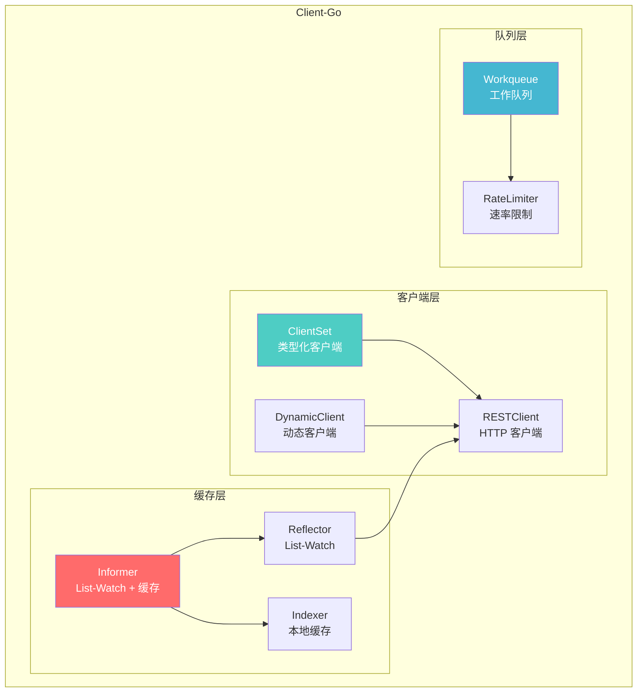
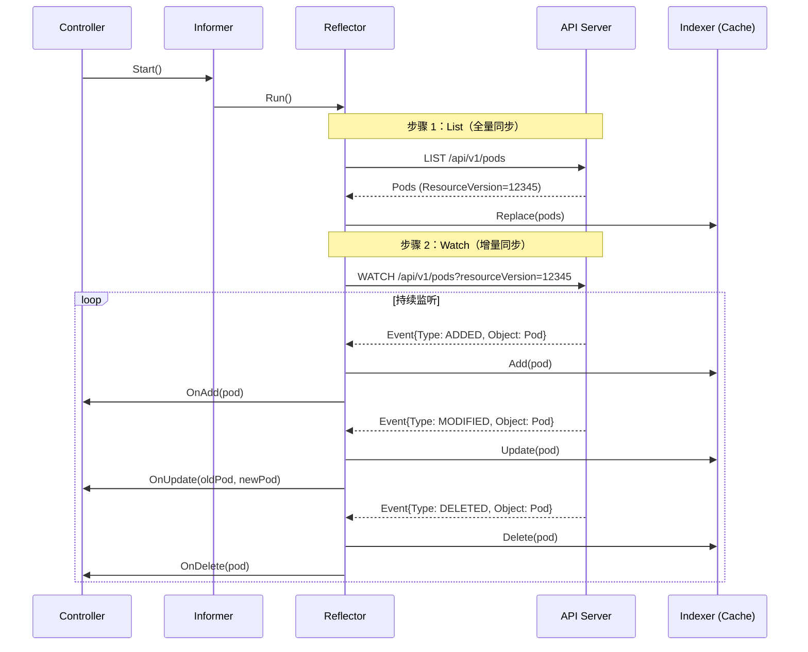
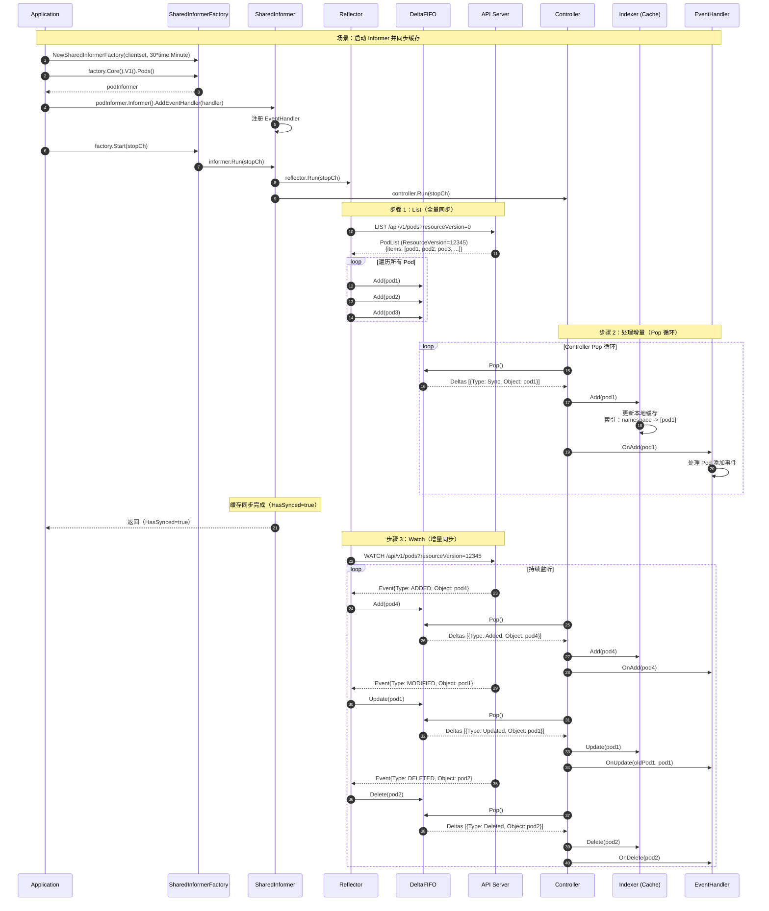
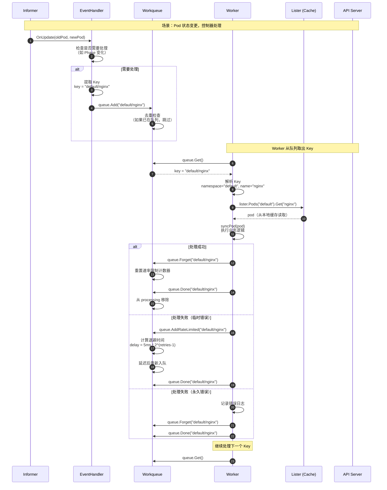
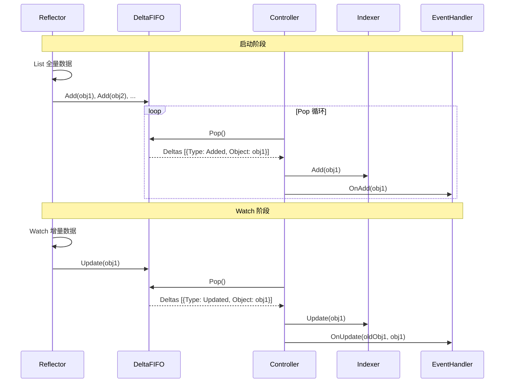

# Kubernetes-06-Client Go-概览

## 模块职责

client-go 是 Kubernetes 的**官方 Go 客户端库**，提供与 Kubernetes API Server 交互的功能。它是开发 Kubernetes 控制器、Operator 和工具的基础库。

### 核心组件

1. **RESTClient**：低级 HTTP 客户端
2. **ClientSet**：类型化客户端（每种资源一个客户端）
3. **DynamicClient**：动态客户端（支持 CRD）
4. **Informer**：缓存和 Watch 机制
5. **Workqueue**：工作队列（速率限制、去重）

---

## 核心组件架构



---

## 核心代码示例

### 1. 使用 ClientSet

```go
import (
    "k8s.io/client-go/kubernetes"
    "k8s.io/client-go/rest"
)

// 创建 ClientSet
config, _ := rest.InClusterConfig()
clientset, _ := kubernetes.NewForConfig(config)

// 获取 Pod 列表
pods, _ := clientset.CoreV1().Pods("default").List(ctx, metav1.ListOptions{})
```

### 2. 使用 Informer

```go
import (
    "k8s.io/client-go/informers"
    "k8s.io/client-go/tools/cache"
)

// 创建 SharedInformerFactory
factory := informers.NewSharedInformerFactory(clientset, 30*time.Minute)

// 获取 Pod Informer
podInformer := factory.Core().V1().Pods()

// 注册事件处理器
podInformer.Informer().AddEventHandler(cache.ResourceEventHandlerFuncs{
    AddFunc: func(obj interface{}) {
        pod := obj.(*v1.Pod)
        fmt.Printf("Pod added: %s\n", pod.Name)
    },
})

// 启动 Informer
factory.Start(stopCh)
```

### 3. 使用 Workqueue

```go
import "k8s.io/client-go/util/workqueue"

// 创建速率限制队列
queue := workqueue.NewRateLimitingQueue(workqueue.DefaultControllerRateLimiter())

// 添加项目
queue.Add("default/nginx")

// 处理项目
for {
    key, shutdown := queue.Get()
    if shutdown {
        break
    }
    
    err := processItem(key)
    if err != nil {
        queue.AddRateLimited(key)  // 失败重试
    } else {
        queue.Forget(key)  // 成功
    }
    queue.Done(key)
}
```

---

## Informer 机制详解

### List-Watch 流程



---

## 最佳实践

### 1. 使用 SharedInformerFactory

**避免重复 List-Watch**（多个控制器共享 Informer）

```go
factory := informers.NewSharedInformerFactory(clientset, 30*time.Minute)
podInformer := factory.Core().V1().Pods()
deploymentInformer := factory.Apps().V1().Deployments()

// 多个控制器使用相同的 Informer
controller1.podLister = podInformer.Lister()
controller2.podLister = podInformer.Lister()
```

### 2. 使用 Lister 而非直接调用 API

```go
// ✅ 推荐：从缓存读取（无 API 调用）
pod, _ := podLister.Pods("default").Get("nginx")

// ❌ 不推荐：直接调用 API（每次请求都打 API Server）
pod, _ := clientset.CoreV1().Pods("default").Get(ctx, "nginx", metav1.GetOptions{})
```

### 3. 使用 Workqueue 去重

```go
// 多次添加相同 Key，只处理一次
queue.Add("default/nginx")
queue.Add("default/nginx")
queue.Add("default/nginx")

// 只会取出一次
key, _ := queue.Get()  // "default/nginx"
```

---

**文档维护：**
- 版本：v1.0
- 最后更新：2025-10-04
- 适用 Kubernetes 版本：v1.29+

---

# Kubernetes-06-Client Go-时序图

## 时序图概述

本文档提供 Client-Go 的核心场景时序图：
1. **Informer 启动与缓存同步流程**
2. **控制器处理对象变更流程**

---

## 场景 1：Informer 启动与缓存同步流程



### 要点说明

#### 1. List-Watch 机制
- **List**：全量同步（获取当前所有对象）
- **Watch**：增量同步（监听后续变化）
- **ResourceVersion**：Watch 从 List 返回的 ResourceVersion 开始

#### 2. DeltaFIFO 的作用
- **解耦**：Reflector 生产增量，Controller 消费增量
- **去重**：相同对象的多次变更合并
- **顺序**：保证同一对象的变更按顺序处理

#### 3. 缓存同步标志（HasSynced）
```go
// 等待缓存同步
cache.WaitForCacheSync(stopCh, informer.HasSynced)

// 同步后才能使用 Lister（避免读取到不完整数据）
if !informer.HasSynced() {
    return fmt.Errorf("cache not synced")
}
```

---

## 场景 2：控制器处理对象变更流程



### 要点说明

#### 1. 为什么需要 Workqueue？

**问题：直接在 EventHandler 中处理**
```go
// ❌ 不推荐：EventHandler 阻塞会影响 Informer
AddFunc: func(obj interface{}) {
    // 如果处理失败，无法重试
    processObject(obj)  // 阻塞 5 秒
}
```

**解决：通过 Workqueue 异步处理**
```go
// ✅ 推荐：EventHandler 只添加到队列（非阻塞）
AddFunc: func(obj interface{}) {
    key, _ := cache.MetaNamespaceKeyFunc(obj)
    queue.Add(key)  // 立即返回
}

// Worker 异步处理
func worker() {
    for {
        key, _ := queue.Get()
        err := processKey(key)
        if err != nil {
            queue.AddRateLimited(key)  // 失败重试
        } else {
            queue.Forget(key)
        }
        queue.Done(key)
    }
}
```

#### 2. 速率限制（Rate Limiting）

**指数退避示例：**
```text
重试 1：延迟 5ms
重试 2：延迟 10ms
重试 3：延迟 20ms
重试 4：延迟 40ms
重试 5：延迟 80ms
...
重试 N：延迟 min(5ms * 2^(N-1), 1000s)
```

#### 3. 使用 Lister 而非 ClientSet

```go
// ✅ 推荐：从缓存读取（无 API 调用）
pod, err := lister.Pods("default").Get("nginx")

// ❌ 不推荐：直接调用 API（每次请求都打 API Server）
pod, err := clientset.CoreV1().Pods("default").Get(ctx, "nginx", metav1.GetOptions{})
```

**原因：**
- **性能**：缓存读取 < 1μs，API 调用 > 1ms
- **负载**：避免对 API Server 造成压力
- **一致性**：Lister 保证读取到的是 Informer 同步的数据

---

## 完整控制器示例

```mermaid
flowchart TB
    START([开始]) --> INIT[初始化 ClientSet 和 Informer]
    INIT --> HANDLER[注册 EventHandler]
    HANDLER --> START_INF[启动 Informer]
    START_INF --> WAIT[等待缓存同步]
    WAIT --> WORKERS[启动多个 Worker]
    
    WORKERS --> GET[Worker: Get() 从队列取出 Key]
    GET --> LISTER[Lister 从缓存获取对象]
    LISTER --> PROCESS{处理对象}
    
    PROCESS -->|成功| FORGET[queue.Forget()]
    PROCESS -->|失败| RETRY[queue.AddRateLimited()]
    
    FORGET --> DONE[queue.Done()]
    RETRY --> DONE
    DONE --> GET
    
    style PROCESS fill:#FF6B6B,color:#fff
    style LISTER fill:#4ECDC4,color:#fff
```

---

## 性能指标

### 关键指标

| 指标 | 类型 | 说明 |
|-----|------|------|
| `workqueue_depth` | Gauge | 队列当前深度 |
| `workqueue_adds_total` | Counter | 累计添加次数 |
| `workqueue_retries_total` | Counter | 累计重试次数 |
| `workqueue_work_duration_seconds` | Histogram | 处理延迟 |

---

**文档维护：**
- 版本：v1.0
- 最后更新：2025-10-04
- 适用 Kubernetes 版本：v1.29+

---

# Kubernetes-06-Client Go-数据结构

## 数据结构概述

Client-Go 的核心数据结构围绕 **缓存和 Watch 机制** 设计：
1. **Reflector**：List-Watch 执行器
2. **DeltaFIFO**：增量队列
3. **Indexer**：索引缓存
4. **Workqueue**：工作队列

---

## 核心数据结构 UML 图

```mermaid
classDiagram
    class SharedInformer {
        +Reflector reflector
        +Controller controller
        +Indexer indexer
        +AddEventHandler(handler) error
        +Run(stopCh) 
    }
    
    class Reflector {
        +ListerWatcher listerWatcher
        +Store store
        +ListAndWatch()
    }
    
    class DeltaFIFO {
        +map~string~[]Delta items
        +Add(obj) error
        +Update(obj) error
        +Delete(obj) error
        +Pop() (Delta, error)
    }
    
    class Indexer {
        +ThreadSafeStore store
        +Add(obj) error
        +Update(obj) error
        +Delete(obj) error
        +Get(obj) (interface{}, bool)
        +List() []interface{}
    }
    
    class Workqueue {
        +queue []interface{}
        +dirty set
        +processing set
        +Add(item)
        +Get() (item, shutdown)
        +Done(item)
    }
    
    SharedInformer "1" --> "1" Reflector : uses
    SharedInformer "1" --> "1" Indexer : uses
    Reflector "1" --> "1" DeltaFIFO : writes to
    DeltaFIFO "1" --> "1" Indexer : updates
```

---

## 数据结构详解

### 1. Reflector（List-Watch 执行器）

```go
// staging/src/k8s.io/client-go/tools/cache/reflector.go

type Reflector struct {
    // ListerWatcher 用于 List 和 Watch
    listerWatcher ListerWatcher
    
    // Store 存储对象（通常是 DeltaFIFO）
    store Store
    
    // expectedType 期望的对象类型
    expectedType reflect.Type
    
    // resyncPeriod 重新同步周期
    resyncPeriod time.Duration
    
    // lastSyncResourceVersion 最后同步的 ResourceVersion
    lastSyncResourceVersion string
}
```

**核心方法：**
```go
// ListAndWatch 执行 List 和 Watch
func (r *Reflector) ListAndWatch(stopCh <-chan struct{}) error {
    // 1. List 全量数据
    list, resourceVersion, err := r.listerWatcher.List(options)
    items, _ := meta.ExtractList(list)
    
    // 2. 将数据同步到 Store
    r.syncWith(items, resourceVersion)
    
    // 3. Watch 增量数据
    for {
        w, err := r.listerWatcher.Watch(options)
        
        for event := range w.ResultChan() {
            switch event.Type {
            case watch.Added:
                r.store.Add(event.Object)
            case watch.Modified:
                r.store.Update(event.Object)
            case watch.Deleted:
                r.store.Delete(event.Object)
            }
        }
    }
}
```

### 2. DeltaFIFO（增量队列）

```go
// staging/src/k8s.io/client-go/tools/cache/delta_fifo.go

type DeltaFIFO struct {
    // items 存储对象的增量变化
    items map[string][]Delta
    
    // queue 对象 Key 的队列
    queue []string
    
    // keyFunc 从对象提取 Key
    keyFunc KeyFunc
}

type Delta struct {
    Type   DeltaType    // Added / Updated / Deleted / Sync
    Object interface{}  // 对象本身
}

type DeltaType string

const (
    Added   DeltaType = "Added"
    Updated DeltaType = "Updated"
    Deleted DeltaType = "Deleted"
    Sync    DeltaType = "Sync"  // 重新同步
)
```

**工作原理：**
```go
// Add 添加增量
func (f *DeltaFIFO) Add(obj interface{}) error {
    key, _ := f.keyFunc(obj)
    
    // 追加到增量列表
    f.items[key] = append(f.items[key], Delta{Type: Added, Object: obj})
    
    // 如果 Key 不在队列中，加入队列
    if !f.inQueue(key) {
        f.queue = append(f.queue, key)
    }
    
    return nil
}

// Pop 弹出增量
func (f *DeltaFIFO) Pop(process PopProcessFunc) (interface{}, error) {
    // 1. 从队列头部取出 Key
    key := f.queue[0]
    f.queue = f.queue[1:]
    
    // 2. 获取该 Key 的所有增量
    deltas := f.items[key]
    delete(f.items, key)
    
    // 3. 处理增量
    return process(deltas)
}
```

### 3. Indexer（索引缓存）

```go
// staging/src/k8s.io/client-go/tools/cache/index.go

type Indexer interface {
    Store
    
    // Index 根据索引名称和对象返回匹配的对象列表
    Index(indexName string, obj interface{}) ([]interface{}, error)
    
    // IndexKeys 根据索引名称和索引键返回对象 Key 列表
    IndexKeys(indexName, indexKey string) ([]string, error)
    
    // ListIndexFuncValues 列出索引的所有值
    ListIndexFuncValues(indexName string) []string
    
    // ByIndex 根据索引名称和索引键返回对象列表
    ByIndex(indexName, indexKey string) ([]interface{}, error)
}

type Indexers map[string]IndexFunc

type IndexFunc func(obj interface{}) ([]string, error)
```

**默认索引（Namespace）：**
```go
// MetaNamespaceIndexFunc 默认索引函数（按 Namespace 索引）
func MetaNamespaceIndexFunc(obj interface{}) ([]string, error) {
    meta, _ := meta.Accessor(obj)
    return []string{meta.GetNamespace()}, nil
}

// 使用示例
indexer.ByIndex("namespace", "default")  // 返回所有 default namespace 的对象
```

### 4. Workqueue（工作队列）

```go
// staging/src/k8s.io/client-go/util/workqueue/queue.go

type Type struct {
    // queue 有序队列
    queue []t
    
    // dirty 脏集合（等待加入队列的元素）
    dirty set
    
    // processing 正在处理的元素
    processing set
}
```

**状态机：**
```text
[空闲] --Add()--> [dirty] --Get()--> [processing] --Done()--> [空闲]
                     ↓                      ↓
                  [queue]              (如果 dirty 中存在，重新入队)
```

**去重机制：**
```go
// Add 添加元素
func (q *Type) Add(item interface{}) {
    // 1. 如果正在处理，只标记为 dirty（处理完后会重新入队）
    if q.processing.has(item) {
        q.dirty.insert(item)
        return
    }
    
    // 2. 如果已在 dirty，跳过（避免重复）
    if q.dirty.has(item) {
        return
    }
    
    // 3. 标记为 dirty 并入队
    q.dirty.insert(item)
    q.queue = append(q.queue, item)
}

// Get 取出元素
func (q *Type) Get() (item interface{}, shutdown bool) {
    item = q.queue[0]
    q.queue = q.queue[1:]
    
    // 从 dirty 移除，加入 processing
    q.dirty.delete(item)
    q.processing.insert(item)
    
    return item, false
}

// Done 完成处理
func (q *Type) Done(item interface{}) {
    q.processing.delete(item)
    
    // 如果在 dirty 中（处理期间又被添加），重新入队
    if q.dirty.has(item) {
        q.queue = append(q.queue, item)
    }
}
```

### 5. RateLimiter（速率限制器）

```go
// staging/src/k8s.io/client-go/util/workqueue/default_rate_limiters.go

type RateLimiter interface {
    When(item interface{}) time.Duration
    Forget(item interface{})
    NumRequeues(item interface{}) int
}

// DefaultControllerRateLimiter 默认速率限制器（组合多种策略）
func DefaultControllerRateLimiter() RateLimiter {
    return NewMaxOfRateLimiter(
        // 1. 指数退避（初始 5ms，最大 1000s）
        NewItemExponentialFailureRateLimiter(5*time.Millisecond, 1000*time.Second),
        
        // 2. 令牌桶（每秒 10 个，桶容量 100）
        &BucketRateLimiter{Limiter: rate.NewLimiter(rate.Limit(10), 100)},
    )
}
```

**指数退避算法：**
```text
重试次数 | 延迟时间
--------|----------
1       | 5ms
2       | 10ms
3       | 20ms
4       | 40ms
5       | 80ms
...     | ...
N       | min(5ms * 2^(N-1), 1000s)
```

---

## Informer 工作流程



---

## 性能与容量考虑

### 1. Informer 缓存大小

**内存占用：**
- 每个对象：约 1-5 KB（取决于对象大小）
- 10000 个 Pod ≈ 10-50 MB

### 2. Workqueue 容量

**默认配置：**
- 无容量限制（内存允许范围内）
- 建议监控队列长度（`workqueue_depth`）

---

**文档维护：**
- 版本：v1.0
- 最后更新：2025-10-04
- 适用 Kubernetes 版本：v1.29+

---

# Kubernetes-06-Client Go-API

## API 概述

Client-Go 提供多层客户端 API：
1. **RESTClient**：低级 HTTP 客户端
2. **ClientSet**：类型化客户端（每种资源一个客户端）
3. **DynamicClient**：动态客户端（支持 CRD）
4. **DiscoveryClient**：API 发现客户端

---

## 1. RESTClient（低级 HTTP 客户端）

### 1.1 接口定义

```go
// staging/src/k8s.io/client-go/rest/client.go

type Interface interface {
    Get() *Request
    Post() *Request
    Put() *Request
    Patch(types.PatchType) *Request
    Delete() *Request
}

type Request struct {
    c *RESTClient
    
    // 请求路径
    resource     string
    resourceName string
    subresource  string
    namespace    string
    
    // 请求参数
    params  url.Values
    headers http.Header
    body    io.Reader
}
```

### 1.2 使用示例

```go
import "k8s.io/client-go/rest"

// 创建 RESTClient
config, _ := rest.InClusterConfig()
restClient, _ := rest.RESTClientFor(config)

// GET /api/v1/namespaces/default/pods/nginx
var pod v1.Pod
err := restClient.Get().
    Namespace("default").
    Resource("pods").
    Name("nginx").
    Do(ctx).
    Into(&pod)
```

---

## 2. ClientSet（类型化客户端）

### 2.1 接口定义

```go
// staging/src/k8s.io/client-go/kubernetes/clientset.go

type Interface interface {
    CoreV1() corev1.CoreV1Interface
    AppsV1() appsv1.AppsV1Interface
    BatchV1() batchv1.BatchV1Interface
    // ... 其他 API Group
}

type CoreV1Interface interface {
    Pods(namespace string) PodInterface
    Services(namespace string) ServiceInterface
    ConfigMaps(namespace string) ConfigMapInterface
    // ... 其他资源
}

type PodInterface interface {
    Create(ctx context.Context, pod *v1.Pod, opts metav1.CreateOptions) (*v1.Pod, error)
    Update(ctx context.Context, pod *v1.Pod, opts metav1.UpdateOptions) (*v1.Pod, error)
    Delete(ctx context.Context, name string, opts metav1.DeleteOptions) error
    Get(ctx context.Context, name string, opts metav1.GetOptions) (*v1.Pod, error)
    List(ctx context.Context, opts metav1.ListOptions) (*v1.PodList, error)
    Watch(ctx context.Context, opts metav1.ListOptions) (watch.Interface, error)
}
```

### 2.2 使用示例

```go
import (
    "k8s.io/client-go/kubernetes"
    "k8s.io/client-go/rest"
)

// 创建 ClientSet
config, _ := rest.InClusterConfig()
clientset, _ := kubernetes.NewForConfig(config)

// 创建 Pod
pod := &v1.Pod{
    ObjectMeta: metav1.ObjectMeta{
        Name: "nginx",
    },
    Spec: v1.PodSpec{
        Containers: []v1.Container{{
            Name:  "nginx",
            Image: "nginx:1.25",
        }},
    },
}

createdPod, err := clientset.CoreV1().Pods("default").Create(ctx, pod, metav1.CreateOptions{})

// 获取 Pod
pod, err := clientset.CoreV1().Pods("default").Get(ctx, "nginx", metav1.GetOptions{})

// 列出所有 Pod
podList, err := clientset.CoreV1().Pods("default").List(ctx, metav1.ListOptions{})

// 更新 Pod
pod.Labels["version"] = "v2"
updatedPod, err := clientset.CoreV1().Pods("default").Update(ctx, pod, metav1.UpdateOptions{})

// 删除 Pod
err = clientset.CoreV1().Pods("default").Delete(ctx, "nginx", metav1.DeleteOptions{})
```

---

## 3. DynamicClient（动态客户端）

### 3.1 接口定义

```go
// staging/src/k8s.io/client-go/dynamic/interface.go

type Interface interface {
    Resource(resource schema.GroupVersionResource) NamespaceableResourceInterface
}

type ResourceInterface interface {
    Create(ctx context.Context, obj *unstructured.Unstructured, opts metav1.CreateOptions) (*unstructured.Unstructured, error)
    Update(ctx context.Context, obj *unstructured.Unstructured, opts metav1.UpdateOptions) (*unstructured.Unstructured, error)
    Delete(ctx context.Context, name string, opts metav1.DeleteOptions) error
    Get(ctx context.Context, name string, opts metav1.GetOptions) (*unstructured.Unstructured, error)
    List(ctx context.Context, opts metav1.ListOptions) (*unstructured.UnstructuredList, error)
    Watch(ctx context.Context, opts metav1.ListOptions) (watch.Interface, error)
}
```

### 3.2 使用示例（访问 CRD）

```go
import (
    "k8s.io/client-go/dynamic"
    "k8s.io/apimachinery/pkg/apis/meta/v1/unstructured"
    "k8s.io/apimachinery/pkg/runtime/schema"
)

// 创建 DynamicClient
config, _ := rest.InClusterConfig()
dynamicClient, _ := dynamic.NewForConfig(config)

// 定义 CRD 的 GVR（GroupVersionResource）
gvr := schema.GroupVersionResource{
    Group:    "example.com",
    Version:  "v1",
    Resource: "myresources",
}

// 创建 CRD 对象
obj := &unstructured.Unstructured{
    Object: map[string]interface{}{
        "apiVersion": "example.com/v1",
        "kind":       "MyResource",
        "metadata": map[string]interface{}{
            "name": "my-resource-1",
        },
        "spec": map[string]interface{}{
            "field1": "value1",
            "field2": 42,
        },
    },
}

createdObj, err := dynamicClient.Resource(gvr).Namespace("default").Create(ctx, obj, metav1.CreateOptions{})
```

---

## 4. Informer（缓存和 Watch 机制）

### 4.1 接口定义

```go
// staging/src/k8s.io/client-go/tools/cache/shared_informer.go

type SharedInformer interface {
    AddEventHandler(handler ResourceEventHandler) (ResourceEventHandlerRegistration, error)
    Run(stopCh <-chan struct{})
    HasSynced() bool
    LastSyncResourceVersion() string
}

type ResourceEventHandler interface {
    OnAdd(obj interface{})
    OnUpdate(oldObj, newObj interface{})
    OnDelete(obj interface{})
}
```

### 4.2 使用示例

```go
import (
    "k8s.io/client-go/informers"
    "k8s.io/client-go/tools/cache"
)

// 创建 SharedInformerFactory
factory := informers.NewSharedInformerFactory(clientset, 30*time.Minute)

// 获取 Pod Informer
podInformer := factory.Core().V1().Pods()

// 注册事件处理器
podInformer.Informer().AddEventHandler(cache.ResourceEventHandlerFuncs{
    AddFunc: func(obj interface{}) {
        pod := obj.(*v1.Pod)
        fmt.Printf("Pod added: %s/%s\n", pod.Namespace, pod.Name)
    },
    UpdateFunc: func(oldObj, newObj interface{}) {
        oldPod := oldObj.(*v1.Pod)
        newPod := newObj.(*v1.Pod)
        fmt.Printf("Pod updated: %s/%s (ResourceVersion: %s -> %s)\n",
            newPod.Namespace, newPod.Name,
            oldPod.ResourceVersion, newPod.ResourceVersion)
    },
    DeleteFunc: func(obj interface{}) {
        pod := obj.(*v1.Pod)
        fmt.Printf("Pod deleted: %s/%s\n", pod.Namespace, pod.Name)
    },
})

// 启动 Informer
stopCh := make(chan struct{})
factory.Start(stopCh)

// 等待缓存同步
factory.WaitForCacheSync(stopCh)

// 从缓存读取数据（无 API 调用）
pod, err := podInformer.Lister().Pods("default").Get("nginx")
```

---

## 5. Workqueue（工作队列）

### 5.1 接口定义

```go
// staging/src/k8s.io/client-go/util/workqueue/queue.go

type Interface interface {
    Add(item interface{})
    Len() int
    Get() (item interface{}, shutdown bool)
    Done(item interface{})
    ShutDown()
    ShuttingDown() bool
}

type RateLimitingInterface interface {
    Interface
    AddRateLimited(item interface{})
    Forget(item interface{})
    NumRequeues(item interface{}) int
}
```

### 5.2 使用示例

```go
import "k8s.io/client-go/util/workqueue"

// 创建速率限制队列
queue := workqueue.NewRateLimitingQueue(workqueue.DefaultControllerRateLimiter())

// 在 Informer 事件处理器中添加到队列
podInformer.Informer().AddEventHandler(cache.ResourceEventHandlerFuncs{
    AddFunc: func(obj interface{}) {
        key, _ := cache.MetaNamespaceKeyFunc(obj)
        queue.Add(key)
    },
    UpdateFunc: func(oldObj, newObj interface{}) {
        key, _ := cache.MetaNamespaceKeyFunc(newObj)
        queue.Add(key)
    },
    DeleteFunc: func(obj interface{}) {
        key, _ := cache.DeletionHandlingMetaNamespaceKeyFunc(obj)
        queue.Add(key)
    },
})

// Worker 处理队列
func worker() {
    for {
        key, shutdown := queue.Get()
        if shutdown {
            return
        }
        
        err := processItem(key.(string))
        if err != nil {
            // 失败重试（指数退避）
            queue.AddRateLimited(key)
        } else {
            // 成功，重置速率限制
            queue.Forget(key)
        }
        
        queue.Done(key)
    }
}

// 启动多个 Worker
for i := 0; i < 5; i++ {
    go worker()
}
```

---

## 最佳实践

### 1. 优先使用 Lister 而非 Get

```go
// ✅ 推荐：从缓存读取（无 API 调用）
pod, err := podLister.Pods("default").Get("nginx")

// ❌ 不推荐：直接调用 API（每次请求都打 API Server）
pod, err := clientset.CoreV1().Pods("default").Get(ctx, "nginx", metav1.GetOptions{})
```

### 2. 使用 SharedInformerFactory 共享缓存

```go
// 多个控制器共享同一个 Informer（避免重复 List-Watch）
factory := informers.NewSharedInformerFactory(clientset, 30*time.Minute)

// Controller 1
podInformer := factory.Core().V1().Pods()
controller1.podLister = podInformer.Lister()

// Controller 2
controller2.podLister = podInformer.Lister()

// 只启动一次 Informer
factory.Start(stopCh)
```

### 3. 使用 Workqueue 去重

```go
// 多次添加相同 Key，只处理一次
queue.Add("default/nginx")
queue.Add("default/nginx")
queue.Add("default/nginx")

// 只会取出一次
key, _ := queue.Get()  // "default/nginx"
```

---

**文档维护：**
- 版本：v1.0
- 最后更新：2025-10-04
- 适用 Kubernetes 版本：v1.29+