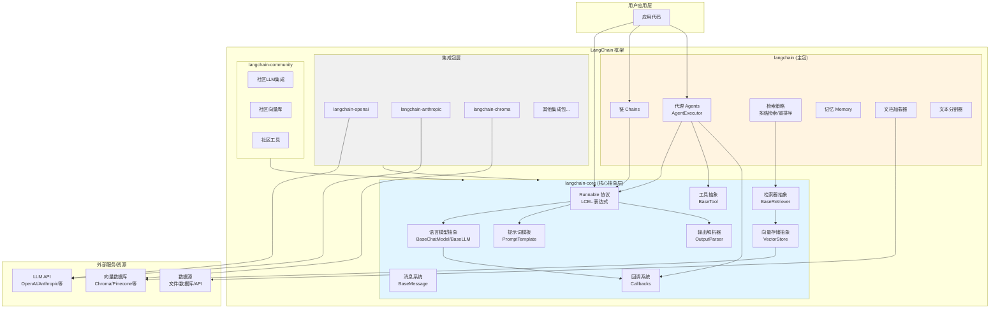
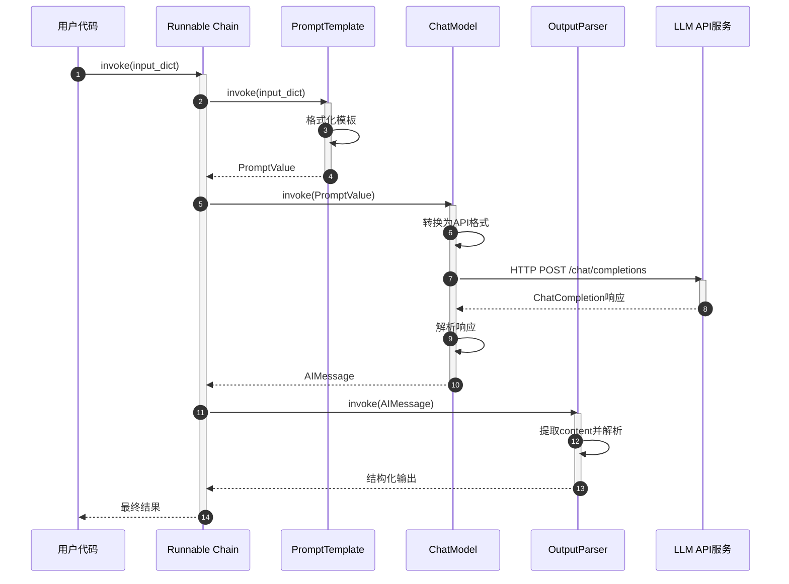
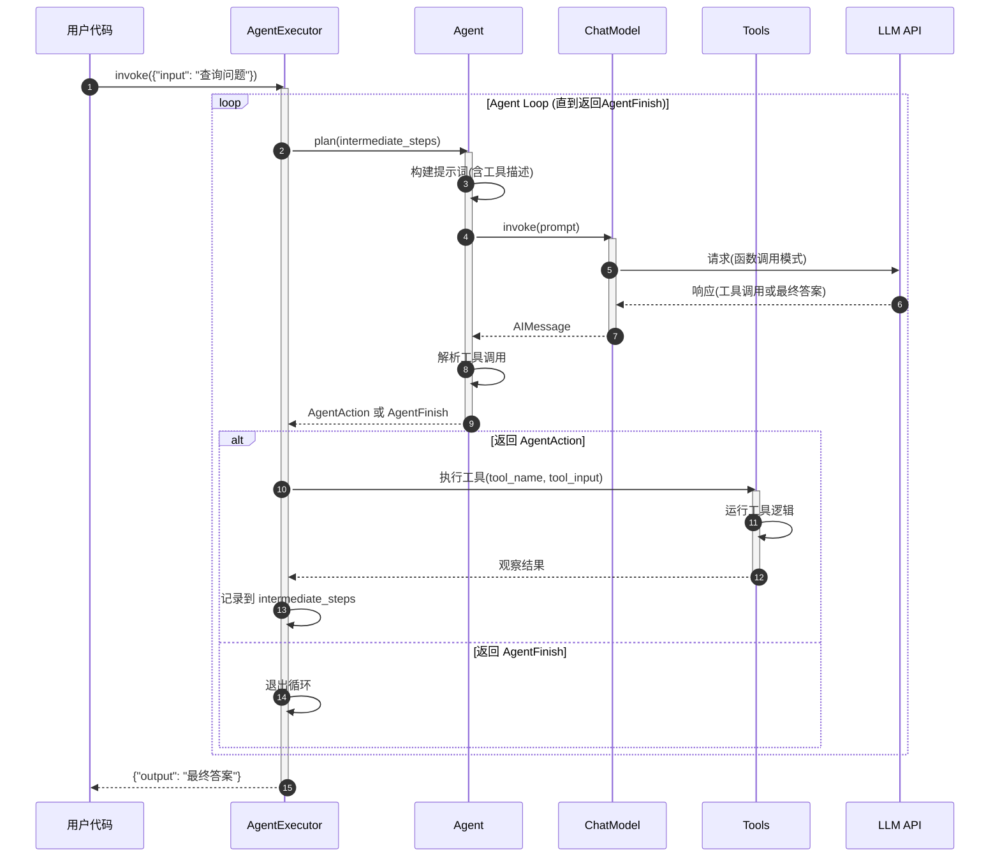

# LangChain-00-总览

## 0. 摘要

### 0.1 项目目标

LangChain 是一个用于构建基于大语言模型（LLM）应用的框架。该项目的核心目标是通过标准化接口、可组合的组件和表达式语言（LCEL），帮助开发者链接和组合多个可互操作的组件及第三方集成，从而简化 AI 应用程序开发。

**核心能力边界**:

- 提供统一的语言模型抽象（聊天模型、LLM、嵌入模型）
- 实现 Runnable 协议和 LangChain Expression Language (LCEL)，支持同步/异步/批处理/流式操作
- 提供提示词模板、输出解析器、向量存储、检索器等核心组件
- 支持代理（Agent）框架,允许 LLM 自主选择工具和操作序列
- 提供丰富的第三方集成（OpenAI、Anthropic、向量数据库等）
- 支持回调机制、追踪和可观测性（LangSmith 集成）

**非目标**:

- 不是一个端到端的 LLM 服务（如 OpenAI API）
- 不负责模型训练和微调
- 不提供向量数据库或搜索引擎的底层实现
- 不是前端 UI 框架（LangServe 用于部署,LangGraph Studio 提供可视化）

### 0.2 运行环境与部署形态

**运行环境**:

- 语言: Python 3.9+
- 核心依赖: Pydantic 2.x (数据验证), typing-extensions (类型支持)
- 运行时: 同步/异步(asyncio)均支持,利用线程池和协程实现并发

**部署形态**:

- **库/框架模式**: 作为 Python 包集成到应用中
- **多包架构**:
  - `langchain-core`: 核心抽象层,轻量级依赖
  - `langchain`: 主包,包含链、检索策略、代理等高级功能
  - `langchain-{provider}`: 独立的第三方集成包（如 langchain-openai、langchain-anthropic）
  - `langchain-community`: 社区维护的集成
  - 工具包: `langchain-cli`（命令行工具）、`langchain-text-splitters`（文本分割）

- **扩展生态**:
  - LangGraph: 构建多步骤有状态代理应用
  - LangSmith: 追踪、评估和监控
  - LangServe: FastAPI 服务部署

## 1. 整体架构图



### 架构图详细说明

**1. 组件职责与耦合关系**

- **核心抽象层 (langchain-core)**:
  - **Runnable 协议**: 所有可执行组件的统一接口,支持 `invoke`、`batch`、`stream` 等方法
  - **语言模型抽象**: `BaseChatModel`（聊天模型）和 `BaseLLM`（文本补全模型）提供统一的模型调用接口
  - **提示词模板**: `PromptTemplate`、`ChatPromptTemplate` 用于动态生成提示词
  - **输出解析器**: 将 LLM 输出解析为结构化数据（JSON、Pydantic 对象等）
  - **消息系统**: `BaseMessage` 及其子类（`HumanMessage`、`AIMessage`、`SystemMessage`）标准化聊天消息
  - **工具抽象**: `BaseTool` 定义代理可以调用的工具接口
  - **向量存储抽象**: `VectorStore` 提供向量数据库的统一接口
  - **检索器抽象**: `BaseRetriever` 定义文档检索接口
  - **回调系统**: 提供执行过程中的钩子,支持日志、追踪、流式输出等

- **主包层 (langchain)**:
  - **链 (Chains)**: 预定义的组件组合模式（如 QA链、摘要链）
  - **代理 (Agents)**: `AgentExecutor` 执行代理循环,`Agent` 类决策工具调用
  - **检索策略**: 多路检索、重排序、上下文压缩等高级检索功能
  - **记忆 (Memory)**: 对话历史管理和上下文窗口控制
  - **文档处理**: 文档加载器和文本分割器

- **集成包层**: 每个第三方服务有独立的包,便于版本管理和依赖隔离

**2. 数据流与控制流**

- **数据流**:
  - 输入 → 提示词模板 → 语言模型 → 输出解析器 → 结构化输出
  - 查询 → 嵌入模型 → 向量搜索 → 检索器 → 相关文档
  - 代理输入 → 推理 → 工具调用 → 观察结果 → 下一步推理 → 最终答案

- **控制流**:
  - 同步流: 使用标准 Python 函数调用
  - 异步流: 使用 `asyncio` 协程（方法前缀 `a`）
  - 流式处理: 使用生成器和异步生成器,逐块产生输出
  - 批处理: 使用线程池并发处理多个输入

**3. 跨进程/跨线程路径**

- **线程池并发**: `batch` 方法默认使用 `ThreadPoolExecutor` 并发执行多个 `invoke`
- **异步协程**: `abatch` 使用 `asyncio.gather` 并发执行多个 `ainvoke`
- **跨进程**: 框架本身不直接管理跨进程,但支持通过 HTTP API（LangServe）或消息队列集成

**4. 高可用与扩展性**

- **模型切换**: 通过统一接口,可在不同 LLM 提供商间无缝切换
- **重试与回退**: `with_retry`、`with_fallbacks` 提供容错能力
- **缓存**: 支持 LLM 响应缓存以减少 API 调用
- **流式输出**: 支持流式生成,提升用户体验
- **可观测性**: 回调系统和 LangSmith 集成提供追踪和调试能力

**5. 状态管理位置**

- **无状态组件**: Runnable、PromptTemplate、OutputParser 本身无状态
- **有状态组件**:
  - Memory: 存储对话历史
  - AgentExecutor: 维护中间步骤
  - VectorStore: 持久化向量数据
- **配置**: 通过 `RunnableConfig` 传递元数据、回调、标签等

## 2. 全局时序图（主要业务闭环）

### 2.1 简单 LLM 调用流程



### 2.2 代理执行流程（Agent 循环）



### 时序图详细说明

**图2.1: 简单 LLM 调用流程说明**

1. **入口与路由**: 用户通过 LCEL 管道 `prompt | model | parser` 或手动组装链来调用
2. **提示词格式化**: `PromptTemplate` 将输入字典中的变量插入模板,生成 `PromptValue`
3. **模型调用**:
   - `ChatModel` 将 `PromptValue` 转换为 API 特定格式（如 OpenAI 的 messages 数组）
   - 发起 HTTP 请求到 LLM API
   - 接收响应并封装为 `AIMessage`
4. **输出解析**: `OutputParser` 从消息内容中提取并解析数据（如 JSON、Pydantic 对象）
5. **回调触发**: 在各阶段触发回调（on_chain_start、on_llm_start、on_llm_end、on_chain_end）

**幂等性与重试**:

- LLM 调用本身非幂等（可能返回不同结果）
- 可通过 `with_retry` 添加重试策略（指数退避）
- 缓存机制可实现相同输入的幂等响应

**超时与资源上界**:

- 模型调用支持 `request_timeout` 参数
- 批处理的 `max_concurrency` 限制并发数
- 流式输出避免长时间阻塞

**图2.2: 代理执行流程说明**

1. **代理循环初始化**: `AgentExecutor` 管理执行上下文,包含工具列表、最大迭代次数、超时等配置
2. **规划阶段**:
   - `Agent.plan` 构建包含历史步骤和工具描述的提示词
   - LLM 根据当前状态决定下一步动作（调用工具或返回最终答案）
3. **工具执行**:
   - 解析 LLM 返回的工具调用指令（函数名和参数）
   - 执行对应工具并获取观察结果
   - 将结果添加到 `intermediate_steps`
4. **迭代终止条件**:
   - LLM 返回 `AgentFinish`（包含最终答案）
   - 达到最大迭代次数（默认 15）
   - 超时
5. **错误处理**:
   - 工具执行失败时,错误信息作为观察结果返回给 LLM
   - 支持 `early_stopping_method`（返回预定义响应或继续）

**并发与状态**:

- 单次代理执行是顺序的（推理 → 工具调用 → 推理）
- 可通过批处理并发运行多个代理实例
- 状态（intermediate_steps）仅在单次执行内维护

## 3. 模块边界与交互图

### 3.1 模块清单

| 序号 | 模块名 | 目录路径 | 对外API提供 | 主要职责 |
|------|--------|----------|------------|---------|
| 01 | langchain-core-runnables | libs/core/langchain_core/runnables | Runnable, RunnableSequence, RunnableParallel, RunnableLambda 等 | LCEL核心,提供统一执行协议和组合原语 |
| 02 | langchain-core-language-models | libs/core/langchain_core/language_models | BaseChatModel, BaseLLM, BaseLanguageModel | 语言模型抽象层,定义模型接口 |
| 03 | langchain-core-prompts | libs/core/langchain_core/prompts | PromptTemplate, ChatPromptTemplate, FewShotPromptTemplate | 提示词模板系统,支持变量插值和少样本学习 |
| 04 | langchain-core-messages | libs/core/langchain_core/messages | BaseMessage, HumanMessage, AIMessage, SystemMessage, ToolMessage | 消息系统,标准化聊天交互格式 |
| 05 | langchain-core-output-parsers | libs/core/langchain_core/output_parsers | BaseOutputParser, StrOutputParser, JsonOutputParser, PydanticOutputParser | 输出解析器,将LLM输出转换为结构化数据 |
| 06 | langchain-core-tools | libs/core/langchain_core/tools | BaseTool, StructuredTool, tool装饰器 | 工具抽象,定义代理可调用的函数接口 |
| 07 | langchain-core-vectorstores | libs/core/langchain_core/vectorstores | VectorStore, VectorStoreRetriever | 向量存储抽象,提供向量搜索接口 |
| 08 | langchain-core-retrievers | libs/core/langchain_core/retrievers.py | BaseRetriever | 检索器抽象,定义文档检索接口 |
| 09 | langchain-core-embeddings | libs/core/langchain_core/embeddings | Embeddings, FakeEmbeddings | 嵌入模型抽象,文本向量化接口 |
| 10 | langchain-core-documents | libs/core/langchain_core/documents | Document, BaseDocumentCompressor, BaseDocumentTransformer | 文档对象和转换器 |
| 11 | langchain-core-callbacks | libs/core/langchain_core/callbacks | BaseCallbackHandler, CallbackManager, AsyncCallbackManager | 回调系统,执行过程中的事件钩子 |
| 12 | langchain-agents | libs/langchain/langchain/agents | AgentExecutor, Agent, BaseSingleActionAgent, create_*_agent工厂函数 | 代理框架,执行推理-行动循环 |
| 13 | langchain-chains | libs/langchain/langchain/chains | LLMChain, SequentialChain等(已弃用,推荐LCEL) | 预定义的组件组合模式 |
| 14 | langchain-retrievers | libs/langchain/langchain/retrievers | MultiQueryRetriever, ContextualCompressionRetriever, EnsembleRetriever | 高级检索策略 |
| 15 | langchain-memory | libs/langchain/langchain/memory | ConversationBufferMemory, ConversationSummaryMemory | 对话记忆管理 |
| 16 | langchain-document-loaders | libs/langchain/langchain/document_loaders | TextLoader, PDFLoader, WebBaseLoader等 | 从各种数据源加载文档 |
| 17 | langchain-text-splitters | libs/text-splitters/langchain_text_splitters | RecursiveCharacterTextSplitter, TokenTextSplitter | 文本分割策略 |
| 18 | langchain-cli | libs/cli/langchain_cli | CLI命令行工具 | 项目脚手架和包管理 |
| 19 | langchain-openai | libs/partners/openai/langchain_openai | ChatOpenAI, OpenAIEmbeddings | OpenAI集成 |
| 20 | langchain-anthropic | libs/partners/anthropic/langchain_anthropic | ChatAnthropic | Anthropic集成 |
| 21 | langchain-chroma | libs/partners/chroma/langchain_chroma | Chroma向量存储 | Chroma向量数据库集成 |

### 3.2 模块交互矩阵

| 调用方 → 被调方 | Runnables | Language Models | Prompts | Output Parsers | Tools | VectorStores | Agents | Callbacks |
|----------------|-----------|----------------|---------|----------------|-------|--------------|--------|-----------|
| **用户代码** | ✅ 直接 | ✅ 直接 | ✅ 直接 | ✅ 直接 | ✅ 直接 | ✅ 直接 | ✅ 直接 | ✅ 直接 |
| **Runnables** | ✅ 组合 | - | - | - | - | - | - | ✅ 触发 |
| **Language Models** | - | - | ✅ 接收输入 | - | - | - | - | ✅ 触发 |
| **Prompts** | - | - | ✅ 组合 | - | - | - | - | - |
| **Agents** | ✅ 继承 | ✅ 调用 | ✅ 构建 | ✅ 解析 | ✅ 执行 | - | - | ✅ 触发 |
| **Retrievers** | ✅ 继承 | - | - | - | - | ✅ 查询 | - | ✅ 触发 |
| **Chains (弃用)** | ✅ 继承 | ✅ 调用 | ✅ 使用 | ✅ 使用 | - | - | - | ✅ 触发 |

**交互说明**:

- ✅ **直接**: 用户代码直接实例化和调用
- ✅ **组合**: 通过 `|` 操作符或构造函数组合
- ✅ **调用**: 同步/异步调用接口方法
- ✅ **触发**: 通过回调系统通知事件
- ✅ **继承**: 实现基类接口

### 3.3 同步/异步与错误语义

| 模块 | 同步方法 | 异步方法 | 错误语义 | 一致性要求 |
|------|---------|---------|---------|-----------|
| Runnables | invoke, batch, stream | ainvoke, abatch, astream | 抛出异常,可通过 with_fallbacks 回退 | 无状态,无一致性问题 |
| Language Models | generate, generate_prompt | agenerate, agenerate_prompt | API错误抛出,支持重试 | 无状态,缓存可实现幂等 |
| Agents | _call (通过invoke) | _acall (通过ainvoke) | 工具失败时继续,max_iterations防止死循环 | 单次执行内有状态 |
| VectorStores | similarity_search, add_documents | asimilarity_search, aadd_documents | 连接失败抛出异常 | 最终一致性(取决于后端) |
| Callbacks | on_* 方法 | 同名 async 方法 | 回调失败不影响主流程 | 无状态,仅观察 |

## 4. 关键设计与权衡

### 4.1 数据一致性与事务边界

**强一致性区域**:

- **单次模型调用**: 请求-响应是原子的
- **工具执行**: 单个工具调用是原子的

**最终一致性区域**:

- **向量存储**: 添加文档后,可能需要短暂延迟才能被检索到（取决于后端）
- **缓存**: 分布式缓存可能存在不一致窗口

**无事务保证**:

- **代理执行**: 中间工具调用不支持回滚,失败后已执行的操作无法撤销
- **批处理**: 部分成功/部分失败,各输入独立处理

**权衡决策**:

- 简化实现,避免分布式事务的复杂性
- 工具设计应考虑幂等性（同一操作多次执行结果一致）
- 用户可通过自定义工具实现补偿逻辑

### 4.2 并发策略

**同步并发 (batch)**:

- 使用 `ThreadPoolExecutor`
- 适合 I/O 密集型任务（API 调用）
- 默认最大并发数: `max_concurrency` 参数控制
- GIL 影响有限（大部分时间在等待 I/O）

**异步并发 (abatch)**:

- 使用 `asyncio.gather`
- 单线程事件循环,开销更小
- 适合高并发场景
- 需要底层 API 支持原生异步

**流式处理**:

- 使用生成器（`stream`）和异步生成器（`astream`）
- 逐块产生结果,减少内存占用和首字节延迟
- 所有组件支持 `transform` 方法以启用流式

**锁与竞态**:

- 框架本身无锁（无状态设计）
- 回调系统使用线程安全的 `CallbackManager`
- 用户工具需自行处理并发安全（如数据库连接池）

### 4.3 性能关键路径

**P95 延迟主要来源**:

1. **LLM API 调用**: 通常 500ms - 5s（取决于模型和负载）
2. **向量搜索**: 10ms - 500ms（取决于索引大小和向量维度）
3. **文档加载与分割**: 100ms - 10s（取决于文档大小和格式）
4. **嵌入计算**: 100ms - 2s（取决于文本量和模型）

**优化策略**:

- **缓存**: LLM 响应缓存（`cache=True`）
- **批处理**: 嵌入模型批量调用（`embeddings.embed_documents`）
- **流式输出**: 减少感知延迟
- **并发**: 批处理并发执行多个请求
- **异步**: 使用异步方法提升吞吐量

**内存峰值**:

- **文档加载**: 完整文档在内存中
- **嵌入缓存**: 向量数据占用内存（float32 数组）
- **对话历史**: Memory 组件存储完整历史

**I/O 热点**:

- LLM API 请求（网络 I/O）
- 向量数据库查询（网络或磁盘 I/O）
- 文档加载（磁盘或网络 I/O）

### 4.4 可观测性

**追踪机制**:

- **回调系统**:
  - `on_chain_start`, `on_chain_end`: 链执行生命周期
  - `on_llm_start`, `on_llm_end`: LLM 调用追踪
  - `on_tool_start`, `on_tool_end`: 工具执行追踪
  - `on_retriever_start`, `on_retriever_end`: 检索追踪

- **LangSmith 集成**:
  - 自动记录所有 Runnable 执行
  - 捕获输入/输出、延迟、错误
  - 提供 UI 查看执行轨迹和调试

- **流式追踪**:
  - `astream_events`: 事件流 API,提供细粒度的执行事件
  - `astream_log`: 日志流 API,包含中间结果

**关键指标**:

- **QPS**: 每秒查询数
- **延迟**: P50/P95/P99 响应时间
- **错误率**: API 调用失败比例
- **Token 消耗**: LLM API 成本追踪
- **缓存命中率**: 缓存效果评估

### 4.5 配置与行为影响

**关键配置项**:

| 配置项 | 位置 | 默认值 | 影响 |
|--------|------|--------|------|
| `max_iterations` | AgentExecutor | 15 | 代理最大循环次数,防止死循环 |
| `max_execution_time` | AgentExecutor | None | 代理执行超时,防止长时间阻塞 |
| `max_concurrency` | batch方法 | None | 批处理最大并发数,控制资源消耗 |
| `temperature` | ChatModel | 模型特定 | LLM 输出随机性,影响结果多样性 |
| `max_tokens` | ChatModel | 模型特定 | 最大生成 Token 数,影响成本和截断 |
| `request_timeout` | ChatModel | 60s | API 请求超时,影响可用性 |
| `cache` | BaseLanguageModel | None | 响应缓存,启用后提升性能并降低成本 |
| `verbose` | 多处 | False | 详细日志输出,用于调试 |
| `streaming` | ChatModel | False | 流式输出,启用后逐块返回 |
| `k` | VectorStoreRetriever | 4 | 检索文档数量,影响准确率和延迟 |

**环境变量**:

- `LANGCHAIN_API_KEY`: LangSmith API 密钥
- `LANGCHAIN_TRACING_V2`: 启用 LangSmith 追踪
- `LANGCHAIN_PROJECT`: LangSmith 项目名称
- `OPENAI_API_KEY`: OpenAI API 密钥（集成包使用）

## 5. 典型使用示例与最佳实践

### 5.1 示例 1: 最小可运行 - 简单 LLM 调用

```python
from langchain_core.prompts import ChatPromptTemplate
from langchain_core.output_parsers import StrOutputParser
from langchain_openai import ChatOpenAI

# 1. 定义提示词模板
prompt = ChatPromptTemplate.from_messages([
    ("system", "你是一个有帮助的助手。"),
    ("user", "{question}")
])

# 2. 初始化模型
model = ChatOpenAI(model="gpt-4", temperature=0.7)

# 3. 定义输出解析器
output_parser = StrOutputParser()

# 4. 使用 LCEL 组合链 (使用 | 操作符)
chain = prompt | model | output_parser

# 5. 执行调用
result = chain.invoke({"question": "什么是 LangChain?"})
print(result)

# 6. 流式输出
for chunk in chain.stream({"question": "解释量子计算"}):
    print(chunk, end="", flush=True)

# 7. 批处理
results = chain.batch([
    {"question": "Python 是什么?"},
    {"question": "JavaScript 是什么?"},
    {"question": "Go 是什么?"}
])
```

**要点说明**:

- **LCEL 语法**: `|` 操作符创建 `RunnableSequence`,自动支持同步/异步/批处理/流式
- **类型安全**: 组件输入输出类型自动推断和校验
- **可组合**: 可随时插入新组件（如添加缓存、重试策略）

### 5.2 示例 2: RAG（检索增强生成）

```python
from langchain_community.document_loaders import WebBaseLoader
from langchain_text_splitters import RecursiveCharacterTextSplitter
from langchain_openai import OpenAIEmbeddings
from langchain_chroma import Chroma
from langchain_core.prompts import ChatPromptTemplate
from langchain_core.runnables import RunnablePassthrough
from langchain_core.output_parsers import StrOutputParser
from langchain_openai import ChatOpenAI

# 1. 加载文档
loader = WebBaseLoader("https://docs.langchain.com/docs/introduction/")
docs = loader.load()

# 2. 分割文档
text_splitter = RecursiveCharacterTextSplitter(
    chunk_size=1000,
    chunk_overlap=200
)
splits = text_splitter.split_documents(docs)

# 3. 创建向量存储
vectorstore = Chroma.from_documents(
    documents=splits,
    embedding=OpenAIEmbeddings()
)

# 4. 创建检索器
retriever = vectorstore.as_retriever(search_kwargs={"k": 3})

# 5. 定义 RAG 提示词
prompt = ChatPromptTemplate.from_template("""
根据以下上下文回答问题:

{context}

问题: {question}

回答:""")

# 6. 格式化文档的辅助函数
def format_docs(docs):
    return "\n\n".join(doc.page_content for doc in docs)

# 7. 构建 RAG 链
rag_chain = (
    {"context": retriever | format_docs, "question": RunnablePassthrough()}
    | prompt
    | ChatOpenAI(model="gpt-3.5-turbo", temperature=0)
    | StrOutputParser()
)

# 8. 执行查询
answer = rag_chain.invoke("LangChain 的核心概念是什么?")
print(answer)
```

**要点说明**:

- **RunnableParallel**: `{"context": ..., "question": ...}` 并发执行检索和传递问题
- **RunnablePassthrough**: 直接传递输入,无需转换
- **链式检索**: `retriever | format_docs` 先检索文档再格式化
- **模块化**: 各组件可独立测试和替换

### 5.3 示例 3: 代理（Agent）- 工具调用

```python
from langchain_core.tools import tool
from langchain_openai import ChatOpenAI
from langchain.agents import AgentExecutor, create_openai_functions_agent
from langchain_core.prompts import ChatPromptTemplate, MessagesPlaceholder

# 1. 定义工具
@tool
def get_word_length(word: str) -> int:
    """返回单词的长度"""
    return len(word)

@tool
def multiply(a: int, b: int) -> int:
    """计算两个数的乘积"""
    return a * b

tools = [get_word_length, multiply]

# 2. 定义代理提示词
prompt = ChatPromptTemplate.from_messages([
    ("system", "你是一个有帮助的助手。"),
    ("user", "{input}"),
    MessagesPlaceholder(variable_name="agent_scratchpad"),  # 中间步骤占位符
])

# 3. 初始化模型（支持函数调用）
llm = ChatOpenAI(model="gpt-4", temperature=0)

# 4. 创建代理
agent = create_openai_functions_agent(llm, tools, prompt)

# 5. 创建执行器
agent_executor = AgentExecutor(
    agent=agent,
    tools=tools,
    verbose=True,  # 打印执行过程
    max_iterations=5,
    handle_parsing_errors=True
)

# 6. 执行任务
result = agent_executor.invoke({
    "input": "单词'LangChain'的长度乘以3是多少?"
})
print(result["output"])
```

**要点说明**:

- **@tool 装饰器**: 将普通函数转换为工具,自动生成 schema
- **MessagesPlaceholder**: 动态插入代理推理历史
- **函数调用模式**: OpenAI 的 function calling 确保结构化工具调用
- **verbose 模式**: 输出完整推理过程,便于调试
- **错误处理**: `handle_parsing_errors` 自动处理解析失败

### 5.4 最佳实践总结

**1. 优先使用 LCEL 而非 LLMChain**:

- LLMChain 已弃用,LCEL 提供更好的类型安全和组合性
- LCEL 自动支持流式、批处理、重试等特性

**2. 合理配置并发与超时**:

- 生产环境设置 `request_timeout` 避免长时间阻塞
- 使用 `max_concurrency` 防止资源耗尽
- 代理设置 `max_iterations` 和 `max_execution_time`

**3. 启用缓存与追踪**:

- 开发阶段启用 LangSmith 追踪 (`LANGCHAIN_TRACING_V2=true`)
- 生产环境启用 LLM 缓存降低成本

**4. 错误处理与回退**:

- 使用 `with_retry` 处理临时网络错误
- 使用 `with_fallbacks` 提供备用模型
- 工具设计考虑幂等性和异常处理

**5. 流式输出提升体验**:

- 聊天应用启用 `streaming=True`
- 使用 `astream` 方法逐块产生输出

**6. 文档处理优化**:

- 选择合适的 `chunk_size` 和 `chunk_overlap`（经验值: 1000/200）
- 使用 `RecursiveCharacterTextSplitter` 保持语义完整性
- 检索后考虑使用重排序（reranking）提升准确率

**7. 向量存储选择**:

- 原型阶段: `InMemoryVectorStore` 或 `Chroma`
- 生产环境: `Pinecone`、`Weaviate`、`Qdrant` 等云服务

**8. 测试策略**:

- 单元测试: 使用 `FakeChatModel` 和 `FakeEmbeddings` 模拟
- 集成测试: 使用真实 API 但启用缓存避免重复调用
- 评估: 使用 LangSmith 评估器评估输出质量

**9. 性能监控**:

- 监控 LLM API 延迟和错误率
- 追踪 Token 消耗和成本
- 记录向量搜索延迟

**10. 安全考虑**:

- API 密钥通过环境变量管理,不要硬编码
- 用户输入需要验证,防止注入攻击
- 工具权限控制,避免执行危险操作（如 `os.system`）

---

**文档版本**: v1.0
**最后更新**: 2025-10-03
**适用 LangChain 版本**: 0.3.x+
