# LangChain-01-Runnables

## 模块概览

## 模块基本信息

**模块名称**: langchain-core-runnables
**模块路径**: `libs/core/langchain_core/runnables/`
**核心职责**: 提供 LangChain Expression Language (LCEL) 的核心实现，定义统一的可执行组件接口和组合原语

## 1. 模块职责

### 1.1 核心职责

Runnables 模块是 LangChain 框架的基石，提供以下核心能力：

1. **统一执行协议**: 定义 `Runnable` 抽象基类，所有可执行组件（模型、提示词、解析器等）都实现此接口
2. **LCEL 组合语法**: 通过 `|` 操作符和字典字面量实现声明式的组件组合
3. **多执行模式**: 自动支持同步（`invoke`）、异步（`ainvoke`）、批处理（`batch`）、流式（`stream`）
4. **组合原语**: 提供顺序执行（`RunnableSequence`）、并行执行（`RunnableParallel`）、条件分支（`RunnableBranch`）等组合模式
5. **增强功能**: 支持重试（`with_retry`）、回退（`with_fallbacks`）、配置化（`configurable_fields`）等

### 1.2 输入/输出

- **输入**: 泛型 `Input` 类型，由具体 Runnable 实现决定（如字符串、字典、消息列表等）
- **输出**: 泛型 `Output` 类型，由具体 Runnable 实现决定
- **配置**: 可选的 `RunnableConfig`，包含回调、标签、元数据、并发控制等

### 1.3 上下游依赖

**上游调用者**:

- 用户应用代码
- LangChain 主包中的 Chains、Agents
- 其他 Runnable 组件（组合场景）

**下游依赖**:

- `langchain_core.callbacks`: 回调系统，追踪执行过程
- `langchain_core.load`: 序列化与反序列化
- `langchain_core.tracers`: LangSmith 集成
- Python 标准库: `concurrent.futures`（线程池）、`asyncio`（异步执行）

### 1.4 生命周期

Runnable 本身是无状态的，生命周期简单：

1. **实例化**: 创建 Runnable 对象（如通过 `|` 组合）
2. **配置**: 可选地设置运行时配置（回调、标签等）
3. **执行**: 调用 `invoke`/`ainvoke`/`batch`/`stream` 方法
4. **回调触发**: 在执行前后触发 `on_chain_start`、`on_chain_end` 等回调
5. **结果返回**: 同步返回结果或通过生成器/异步生成器流式返回

无需显式释放资源，Python GC 自动管理。

## 2. 模块级架构图

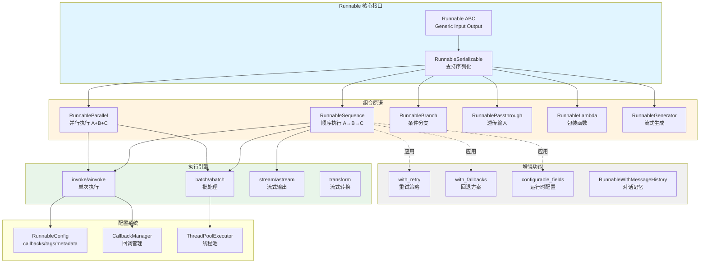

### 架构图详细说明

**1. 核心接口层**

- **Runnable ABC**: 抽象基类，定义所有可执行组件的标准接口
  - 泛型参数 `Input` 和 `Output` 确保类型安全
  - 强制实现 `invoke` 方法，其他方法有默认实现
  - 通过 `InputType` 和 `OutputType` 属性推断类型

- **RunnableSerializable**: 继承自 `Runnable`，添加序列化能力
  - 实现 `to_json`、`save` 等方法
  - 支持持久化和跨进程传输

**2. 组合原语层**

- **RunnableSequence**: 链式顺序执行
  - 通过 `__or__` 运算符重载实现 `|` 语法
  - 优化：合并连续的 `RunnableSequence` 避免嵌套
  - 流式支持：如果所有步骤支持 `transform`，则整体支持流式

- **RunnableParallel**: 并发执行多个分支
  - 通过字典字面量自动创建（LCEL 语法糖）
  - 同步模式使用线程池，异步模式使用 `asyncio.gather`
  - 返回字典，键为分支名，值为各分支输出

- **RunnableBranch**: 条件路由
  - 根据输入选择执行哪个分支
  - 类似 if-elif-else 逻辑

- **RunnablePassthrough**: 透传输入
  - 用于并行场景中保留原始输入
  - 可选地执行赋值（`RunnableAssign`）

- **RunnableLambda**: 包装普通函数
  - 自动推断输入输出类型
  - 支持同步和异步函数
  - `@chain` 装饰器是其语法糖

- **RunnableGenerator**: 流式生成
  - 用于逐块产生输出的场景
  - 支持生成器和异步生成器

**3. 增强功能层**

这些不是独立的类，而是返回包装后 Runnable 的方法：

- **with_retry**: 返回带重试逻辑的 Runnable
  - 支持指数退避、最大重试次数等配置
  - 仅重试可恢复的错误

- **with_fallbacks**: 返回带回退方案的 Runnable
  - 主 Runnable 失败时尝试备选方案
  - 可指定多个回退模型

- **configurable_fields**: 返回可配置字段的 Runnable
  - 运行时动态修改 Runnable 的属性

- **RunnableWithMessageHistory**: 包装 Runnable 添加对话记忆
  - 自动管理历史消息的存储和检索

**4. 执行引擎层**

- **invoke/ainvoke**: 单次同步/异步执行
  - 触发 `on_chain_start` → 执行逻辑 → `on_chain_end` 回调
  - 异步版本默认使用 `run_in_executor` 委托给同步版本

- **batch/abatch**: 批量执行
  - 同步版本使用 `ThreadPoolExecutor.map`
  - 异步版本使用 `asyncio.gather`
  - 支持 `max_concurrency` 限制并发数
  - 支持 `return_exceptions` 返回异常而非抛出

- **stream/astream**: 流式输出
  - 基于 `transform` 方法实现
  - 逐块产生输出，减少首字节延迟
  - 异步版本通过 `astream_events` 提供更细粒度控制

- **transform**: 流式转换
  - 接收输入流（`Iterator`），产生输出流
  - 核心方法，其他流式方法基于此实现

**5. 配置系统**

- **RunnableConfig**: 配置字典
  - `callbacks`: 回调处理器列表
  - `tags`: 用于追踪的标签
  - `metadata`: 自定义元数据
  - `max_concurrency`: 批处理最大并发数
  - `recursion_limit`: 防止无限递归

- **CallbackManager**: 回调管理器
  - 聚合多个回调处理器
  - 在执行各阶段触发相应回调

- **ThreadPoolExecutor**: 线程池
  - 用于 `batch` 方法的并发执行
  - 默认最大工作线程数由系统决定

## 3. 边界条件与扩展点

### 3.1 边界条件

**并发限制**:

- `max_concurrency` 可限制批处理的并发线程数
- 默认无限制，可能导致资源耗尽
- 建议生产环境设置合理值（如 10-50）

**超时控制**:

- 框架本身不强制超时，由具体 Runnable 实现
- 可通过回调或包装 Runnable 添加超时逻辑

**递归深度**:

- `recursion_limit` 防止无限递归（默认 25）
- 主要用于自引用的 Runnable

**流式限制**:

- 并非所有 Runnable 都支持流式（需实现 `transform`）
- `RunnableLambda` 默认不支持流式，会阻塞直到完成
- 流式链中存在阻塞组件时，流式输出会延迟

### 3.2 扩展点

**自定义 Runnable**:

```python
from langchain_core.runnables import Runnable

class MyRunnable(Runnable[str, str]):
    def invoke(self, input: str, config: RunnableConfig = None) -> str:
        # 自定义逻辑
        return input.upper()

    # 可选：实现流式支持
    def transform(self, input: Iterator[str], config: RunnableConfig = None):
        for chunk in input:
            yield chunk.upper()
```

**自定义回调**:

```python
from langchain_core.callbacks import BaseCallbackHandler

class MyCallback(BaseCallbackHandler):
    def on_chain_start(self, serialized, inputs, **kwargs):
        print(f"Chain started with inputs: {inputs}")

    def on_chain_end(self, outputs, **kwargs):
        print(f"Chain ended with outputs: {outputs}")
```

## 4. 异常处理与状态管理

### 4.1 异常处理策略

**默认行为**:

- 执行过程中的异常会向上抛出
- 批处理中的异常默认中断整个批次

**with_retry**:

- 自动重试可恢复的异常（如网络错误）
- 不重试逻辑错误（如参数错误）

**with_fallbacks**:

- 主 Runnable 抛出异常时，尝试回退方案
- 所有回退都失败才抛出最后一个异常

**return_exceptions**:

- `batch` 方法可设置 `return_exceptions=True`
- 异常作为列表元素返回，而非中断

### 4.2 状态管理

**无状态设计**:

- Runnable 本身无状态，可安全并发执行
- 状态通过输入传递（如对话历史）

**有状态扩展**:

- `RunnableWithMessageHistory`: 自动管理对话历史
- 状态存储在外部（内存、数据库等）
- 通过 `session_id` 隔离不同会话

## 5. 性能特征

### 5.1 延迟分析

**单次执行（invoke）**:

- 延迟 = 各步骤延迟之和（顺序执行）
- 回调开销可忽略（纳秒级）

**批处理（batch）**:

- 延迟 = max(各输入的执行时间)（并行执行）
- 线程切换开销：微秒级
- 受 `max_concurrency` 影响

**流式（stream）**:

- 首字节延迟 = 第一个组件的首字节延迟
- 总延迟可能略高于 invoke（迭代开销）
- 优势在于用户体验（渐进式展示）

### 5.2 吞吐量

**同步模式**:

- 受 GIL 影响，CPU 密集型任务受限
- I/O 密集型任务（如 LLM API）可充分利用线程池

**异步模式**:

- 单线程事件循环，无 GIL 限制
- 更高的并发能力（数千并发请求）
- 需要底层 API 支持原生异步

### 5.3 内存占用

**顺序执行**:

- 内存占用 = 单个输入的内存占用
- 中间结果在步骤间传递，不累积

**并行执行**:

- 内存占用 = 并发数 × 单个输入的内存占用
- 批处理需要同时保存所有输入和输出

**流式执行**:

- 内存占用更小（逐块处理）
- 但需要保持连接状态

## 6. 最佳实践

### 6.1 组合模式选择

**优先使用 LCEL 语法**:

```python
# ✅ 推荐
chain = prompt | model | parser

# ❌ 不推荐
chain = RunnableSequence(prompt, model, parser)
```

**并行执行独立任务**:

```python
# ✅ 并发执行翻译和摘要
chain = {
    "translation": translation_chain,
    "summary": summary_chain
}
```

**条件路由**:

```python
from langchain_core.runnables import RunnableBranch

# 根据输入语言选择不同处理逻辑
branch = RunnableBranch(
    (lambda x: x["language"] == "en", english_chain),
    (lambda x: x["language"] == "zh", chinese_chain),
    default_chain  # 默认分支
)
```

### 6.2 性能优化

**批处理聚合请求**:

```python
# 一次调用处理多个输入
results = chain.batch([input1, input2, input3], config={"max_concurrency": 5})
```

**使用流式减少感知延迟**:

```python
# 逐块展示结果
for chunk in chain.stream(input):
    print(chunk, end="", flush=True)
```

**异步提升吞吐量**:

```python
# 高并发场景使用异步
results = await chain.abatch(inputs, config={"max_concurrency": 100})
```

### 6.3 错误处理

**添加重试策略**:

```python
chain_with_retry = chain.with_retry(
    stop_after_attempt=3,
    wait_exponential_jitter=True
)
```

**配置回退模型**:

```python
chain_with_fallbacks = primary_chain.with_fallbacks(
    [fallback_chain_1, fallback_chain_2]
)
```

### 6.4 调试与追踪

**启用详细日志**:

```python
from langchain_core.globals import set_debug, set_verbose

set_debug(True)  # 打印所有回调事件
set_verbose(True)  # 打印执行细节
```

**使用 LangSmith 追踪**:

```python
import os

os.environ["LANGCHAIN_TRACING_V2"] = "true"
os.environ["LANGCHAIN_API_KEY"] = "your-api-key"

# 自动追踪所有 Runnable 执行
chain.invoke(input)
```

**自定义回调监控**:

```python
class LatencyCallback(BaseCallbackHandler):
    def on_chain_start(self, serialized, inputs, **kwargs):
        self.start_time = time.time()

    def on_chain_end(self, outputs, **kwargs):
        latency = time.time() - self.start_time
        print(f"Latency: {latency:.2f}s")

chain.invoke(input, config={"callbacks": [LatencyCallback()]})
```

## 7. 与其他模块的协作

### 7.1 与 Language Models 协作

所有语言模型（`BaseChatModel`、`BaseLLM`）都实现 Runnable 接口：

```python
from langchain_openai import ChatOpenAI

model = ChatOpenAI()  # 本质是一个 Runnable
result = model.invoke("Hello")  # 统一的 invoke 接口
```

### 7.2 与 Prompts 协作

提示词模板也是 Runnable：

```python
from langchain_core.prompts import ChatPromptTemplate

prompt = ChatPromptTemplate.from_messages([...])
# 可以直接组合
chain = prompt | model
```

### 7.3 与 Output Parsers 协作

输出解析器同样实现 Runnable 接口：

```python
from langchain_core.output_parsers import StrOutputParser

parser = StrOutputParser()
chain = prompt | model | parser  # 三者无缝组合
```

### 7.4 与 Agents 协作

Agent 执行器内部使用 Runnable 组合推理链：

```python
# AgentExecutor 内部将 Agent 逻辑封装为 Runnable
agent_executor = AgentExecutor(agent=agent, tools=tools)
result = agent_executor.invoke({"input": "query"})  # 统一接口
```

## 8. 关键源码位置

| 功能 | 文件路径 | 核心类/函数 |
|------|----------|------------|
| 基础接口 | `runnables/base.py` | `Runnable`, `RunnableSerializable` |
| 顺序执行 | `runnables/base.py` | `RunnableSequence` |
| 并行执行 | `runnables/base.py` | `RunnableParallel` |
| 函数包装 | `runnables/base.py` | `RunnableLambda`, `@chain` |
| 条件分支 | `runnables/branch.py` | `RunnableBranch` |
| 透传输入 | `runnables/passthrough.py` | `RunnablePassthrough`, `RunnableAssign` |
| 重试逻辑 | `runnables/retry.py` | `RunnableRetry` |
| 回退方案 | `runnables/fallbacks.py` | `RunnableWithFallbacks` |
| 配置系统 | `runnables/config.py` | `RunnableConfig`, `ensure_config` |
| 对话记忆 | `runnables/history.py` | `RunnableWithMessageHistory` |
| 路由选择 | `runnables/router.py` | `RouterRunnable` |

## 9. 总结

Runnables 模块是 LangChain 的核心抽象，通过以下设计实现高度的可组合性和灵活性：

1. **统一接口**: 所有组件实现相同的 `Runnable` 接口，可无缝组合
2. **声明式语法**: LCEL 提供简洁的 `|` 和字典语法，表达力强
3. **自动优化**: 批处理、流式等特性自动支持，无需额外代码
4. **类型安全**: 泛型和类型推断确保编译时类型检查
5. **可扩展**: 易于添加自定义 Runnable 和回调

这种设计使得构建复杂的 LLM 应用变得简单直观，同时保持了高性能和可维护性。

---

**文档版本**: v1.0
**最后更新**: 2025-10-03
**相关文档**:

- LangChain-00-总览.md
- LangChain-02-Runnables-API.md（待生成）
- LangChain-03-Runnables-数据结构.md（待生成）
- LangChain-04-Runnables-时序图.md（待生成）

---

## 数据结构

## 文档说明

本文档详细描述 **Runnables 模块**的核心数据结构，包括类层次结构、关键字段、类型定义和数据流转关系。所有结构均配备 UML 类图和详细的字段说明。

---

## 1. 核心类层次结构

### 1.1 Runnable 类层次 UML

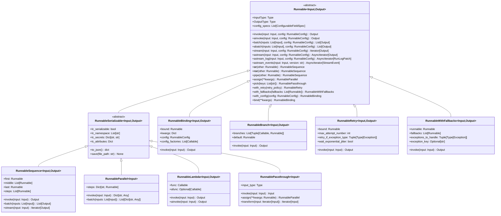

**图解说明**：

1. **类层次**：
   - `Runnable` 是根抽象基类，定义了统一的调用接口（invoke/batch/stream）
   - `RunnableSerializable` 继承自 `Runnable`，增加序列化能力
   - 具体实现类分为两大类：可序列化（继承 `RunnableSerializable`）和不可序列化（直接继承 `Runnable`）

2. **泛型参数**：
   - `Input`：输入类型
   - `Output`：输出类型
   - 类型安全通过泛型在编译时保证

3. **组合方式**：
   - `RunnableSequence`：顺序组合（通过 `|` 操作符）
   - `RunnableParallel`：并行组合（通过字典字面量）
   - `RunnableBranch`：条件分支
   - `RunnableBinding`：配置绑定

4. **增强功能**：
   - `RunnableRetry`：重试包装器
   - `RunnableWithFallbacks`：回退包装器
   - `RunnableBinding`：参数和配置绑定

---

## 2. 配置相关数据结构

### 2.1 RunnableConfig 结构

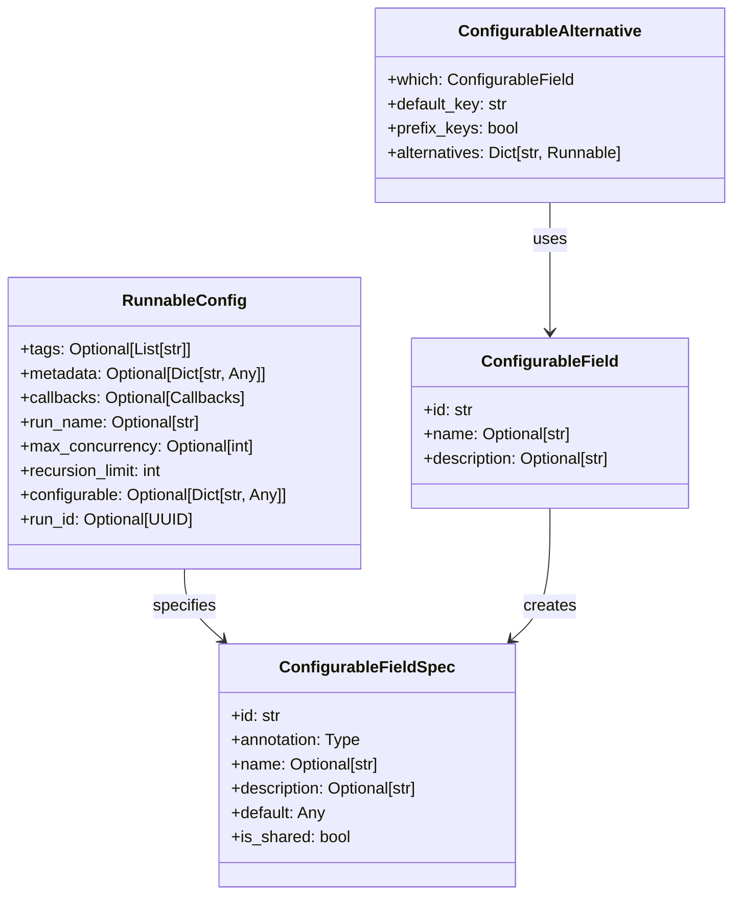

**字段说明**：

#### RunnableConfig

| 字段 | 类型 | 必填 | 默认 | 说明 |
|-----|------|-----|------|------|
| tags | `List[str]` | 否 | `None` | 用于追踪和过滤的标签列表 |
| metadata | `Dict[str, Any]` | 否 | `None` | 附加元数据，传递给回调和追踪系统 |
| callbacks | `Callbacks` | 否 | `None` | 回调处理器列表，用于监控执行 |
| run_name | `str` | 否 | `None` | 运行名称，用于追踪标识 |
| max_concurrency | `int` | 否 | `None` | 并行执行的最大并发数 |
| recursion_limit | `int` | 否 | `25` | 递归调用深度限制，防止无限递归 |
| configurable | `Dict[str, Any]` | 否 | `None` | 可配置字段的值映射 |
| run_id | `UUID` | 否 | 自动生成 | 唯一运行标识符 |

**约束与边界**：

- `max_concurrency` 控制 `batch` 和 `RunnableParallel` 的并发度
- `recursion_limit` 默认 25 层，超出抛出 `RecursionError`
- `callbacks` 支持同步和异步处理器，按注册顺序调用

#### ConfigurableFieldSpec

| 字段 | 类型 | 必填 | 说明 |
|-----|------|-----|------|
| id | `str` | 是 | 字段唯一标识符，用于配置键 |
| annotation | `Type` | 是 | 字段类型注解 |
| name | `str` | 否 | 人类可读名称 |
| description | `str` | 否 | 字段用途描述 |
| default | `Any` | 否 | 默认值 |
| is_shared | `bool` | 否 | 是否在整个链中共享配置 |

---

## 3. 流式数据结构

### 3.1 流式事件类型

```mermaid
classDiagram
    class StreamEvent {
        <<abstract>>
        +event: str
        +name: str
        +run_id: str
        +tags: List[str]
        +metadata: Dict[str, Any]
        +data: Dict[str, Any]
    }

    class OnChainStart {
        +event: "on_chain_start"
        +data: Object  %% {"input": Any}
    }

    class OnChainStream {
        +event: "on_chain_stream"
        +data: Object  %% {"chunk": Any}
    }

    class OnChainEnd {
        +event: "on_chain_end"
        +data: Object  %% {"output": Any}
    }

    class OnLLMStart {
        +event: "on_llm_start"
        +data: Object  %% {"input": Any}
    }

    class OnLLMStream {
        +event: "on_llm_stream"
        +data: Object  %% {"chunk": BaseMessageChunk}
    }

    class OnLLMEnd {
        +event: "on_llm_end"
        +data: Object  %% {"output": Any}
    }

    class OnToolStart {
        +event: "on_tool_start"
        +data: Object  %% {"input": Any}
    }

    class OnToolEnd {
        +event: "on_tool_end"
        +data: Object  %% {"output": Any}
    }

    class OnRetrieverStart {
        +event: "on_retriever_start"
        +data: Object  %% {"input": Any}
    }

    class OnRetrieverEnd {
        +event: "on_retriever_end"
        +data: Object  %% {"output": List[Document]}
    }

    StreamEvent <|-- OnChainStart
    StreamEvent <|-- OnChainStream
    StreamEvent <|-- OnChainEnd
    StreamEvent <|-- OnLLMStart
    StreamEvent <|-- OnLLMStream
    StreamEvent <|-- OnLLMEnd
    StreamEvent <|-- OnToolStart
    StreamEvent <|-- OnToolEnd
    StreamEvent <|-- OnRetrieverStart
    StreamEvent <|-- OnRetrieverEnd
```

**事件流说明**：

| 事件类型 | 触发时机 | data 字段 | 用途 |
|---------|---------|-----------|------|
| `on_chain_start` | Runnable 开始执行 | `{"input": ...}` | 记录输入，初始化追踪 |
| `on_chain_stream` | Runnable 产生中间输出 | `{"chunk": ...}` | 流式传输中间结果 |
| `on_chain_end` | Runnable 执行完成 | `{"output": ...}` | 记录最终输出 |
| `on_llm_start` | LLM 开始生成 | `{"input": ...}` | 记录提示词 |
| `on_llm_stream` | LLM 生成 token | `{"chunk": BaseMessageChunk}` | 实时显示生成内容 |
| `on_llm_end` | LLM 生成完成 | `{"output": ...}` | 记录完整响应 |
| `on_tool_start` | 工具开始执行 | `{"input": ...}` | 记录工具输入 |
| `on_tool_end` | 工具执行完成 | `{"output": ...}` | 记录工具输出 |
| `on_retriever_start` | 检索器开始检索 | `{"input": str}` | 记录查询字符串 |
| `on_retriever_end` | 检索器完成检索 | `{"output": List[Document]}` | 记录检索结果 |

**使用模式**：

```python
# 订阅所有事件
async for event in chain.astream_events(input_data, version="v2"):
    event_type = event["event"]

    if event_type == "on_llm_stream":
        # 实时显示 LLM 输出
        print(event["data"]["chunk"].content, end="", flush=True)

    elif event_type == "on_tool_start":
        # 显示工具调用
        print(f"\nCalling tool: {event['name']}")

    elif event_type == "on_retriever_end":
        # 显示检索结果数量
        docs = event["data"]["output"]
        print(f"Retrieved {len(docs)} documents")
```

**性能考虑**：

- 事件流通过 `asyncio.Queue` 实现，零拷贝传递
- 每个事件约 500 字节（不含 data 字段）
- 建议使用 `include_names`/`include_types` 过滤无关事件

---

### 3.2 RunLog 和 Patch 结构

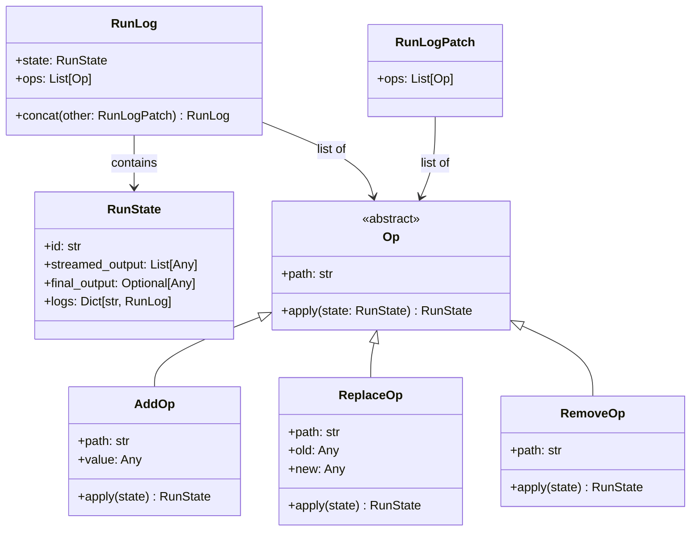

**字段说明**：

#### RunState

| 字段 | 类型 | 说明 |
|-----|------|------|
| id | `str` | 运行的唯一标识符 |
| streamed_output | `List[Any]` | 已流式输出的所有块 |
| final_output | `Optional[Any]` | 最终输出（完成后可用） |
| logs | `Dict[str, RunLog]` | 子运行的日志（键为子运行名称） |

#### Op 操作类型

| 操作 | 路径示例 | 语义 |
|-----|---------|------|
| `AddOp` | `/streamed_output/-` | 在数组末尾添加元素 |
| `ReplaceOp` | `/final_output` | 替换字段值 |
| `RemoveOp` | `/logs/step1` | 删除字段 |

**应用场景**：

- 用于 `astream_log()` API，增量返回执行状态
- 支持 JSON Patch 规范（RFC 6902）
- 适合构建实时调试 UI

---

## 4. 并发控制数据结构

### 4.1 线程池和信号量管理

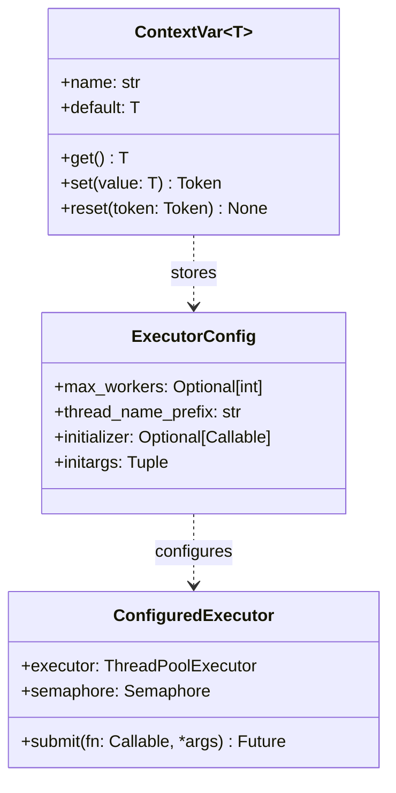

**字段说明**：

#### ExecutorConfig

| 字段 | 类型 | 默认 | 说明 |
|-----|------|-----|------|
| max_workers | `int` | CPU 核数 + 4 | 线程池最大线程数 |
| thread_name_prefix | `str` | `"langchain-"` | 线程名称前缀 |
| initializer | `Callable` | `None` | 线程初始化函数 |
| initargs | `Tuple` | `()` | 初始化函数参数 |

**使用位置**：

- `Runnable.batch()` 并行处理多个输入
- `RunnableParallel` 并发执行多个步骤
- 通过 `RunnableConfig.max_concurrency` 限制并发数

**性能特征**：

- 线程池复用，避免频繁创建销毁
- 信号量控制最大并发数（防止 OOM）
- ContextVar 实现线程隔离的配置传递

---

## 5. 数据流转关系

### 5.1 RunnableSequence 数据流

```mermaid
flowchart LR
    Input[Input] --> Step1[first: Runnable]
    Step1 --> Mid1[middle[0]]
    Mid1 --> Mid2[middle[1]]
    Mid2 --> MidN[middle[n-1]]
    MidN --> StepN[last: Runnable]
    StepN --> Output[Output]

    style Input fill:#e1f5ff
    style Output fill:#ffe1f5
    style Step1 fill:#fff4e1
    style StepN fill:#fff4e1
```

**数据类型转换**：

- 每个步骤的 `Output` 必须与下一步的 `Input` 兼容
- 类型检查在组合时（`|` 操作符）进行
- 不兼容时抛出 `TypeError`

---

### 5.2 RunnableParallel 数据流

```mermaid
flowchart TB
    Input[Input: T] --> Fork{分发}
    Fork --> Step1[steps['a']: Runnable]
    Fork --> Step2[steps['b']: Runnable]
    Fork --> StepN[steps['n']: Runnable]
    Step1 --> Merge{合并}
    Step2 --> Merge
    StepN --> Merge
    Merge --> Output["Output: {'a': A, 'b': B, 'n': N}"]

    style Input fill:#e1f5ff
    style Output fill:#ffe1f5
    style Fork fill:#fff4e1
    style Merge fill:#f4ffe1
```

**并发策略**：

- 所有步骤同时启动（`asyncio.gather` 或 `ThreadPoolExecutor`）
- 等待所有步骤完成后合并结果
- 任一步骤失败则整体失败

---

### 5.3 流式数据流（Stream）

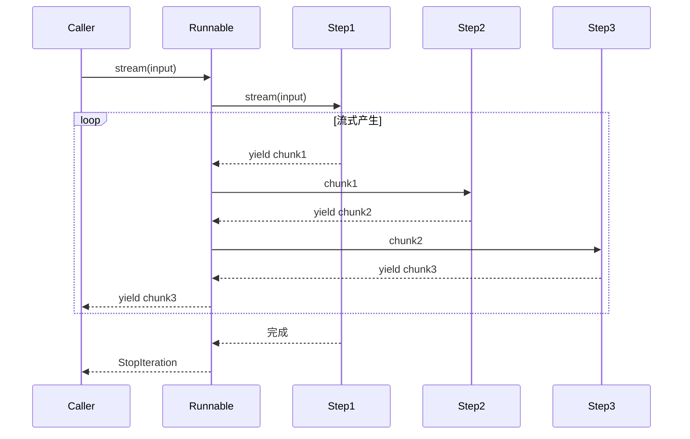

**流式特性**：

- 背压控制：下游未消费时上游暂停
- 变换链：每个步骤可转换或过滤块
- 错误传播：任一步骤异常立即抛出

---

## 6. 序列化格式

### 6.1 序列化 Schema

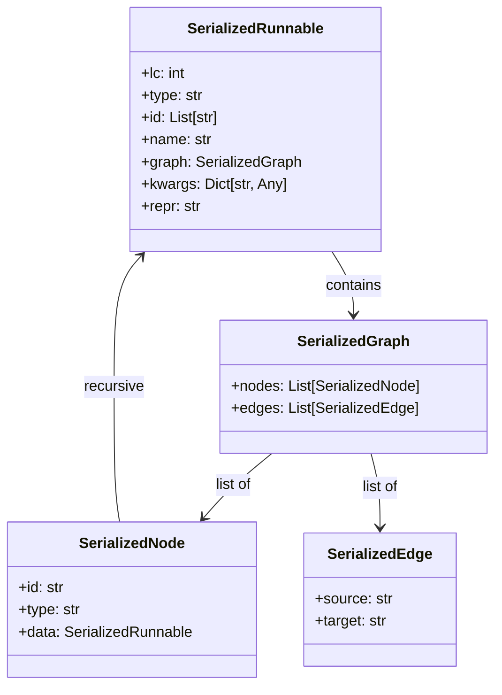

**字段说明**：

| 字段 | 类型 | 说明 |
|-----|------|------|
| lc | `int` | LangChain 序列化协议版本（当前为 1） |
| type | `str` | 类型标识（如 `"constructor"`） |
| id | `List[str]` | 完全限定类名（如 `["langchain", "schema", "runnable", "RunnableSequence"]`） |
| name | `str` | 实例名称 |
| graph | `SerializedGraph` | 执行图结构 |
| kwargs | `Dict` | 构造参数 |
| repr | `str` | 人类可读表示 |

**示例 JSON**：

```json
{
  "lc": 1,
  "type": "constructor",
  "id": ["langchain", "schema", "runnable", "RunnableSequence"],
  "kwargs": {
    "first": {
      "lc": 1,
      "type": "constructor",
      "id": ["langchain", "prompts", "chat", "ChatPromptTemplate"],
      "kwargs": {...}
    },
    "last": {
      "lc": 1,
      "type": "constructor",
      "id": ["langchain_openai", "chat_models", "ChatOpenAI"],
      "kwargs": {"model": "gpt-4"}
    }
  }
}
```

**使用场景**：

- 保存链配置到文件（`.json` 或 `.yaml`）
- 版本控制和审计
- 跨进程/跨语言传递链定义

**限制**：

- Lambda 函数无法序列化（`RunnableLambda` 除外）
- 非 JSON 可序列化对象需自定义序列化器
- 密钥类字段（如 API Key）会被标记为 `lc_secrets`

---

## 7. 错误类型和异常结构

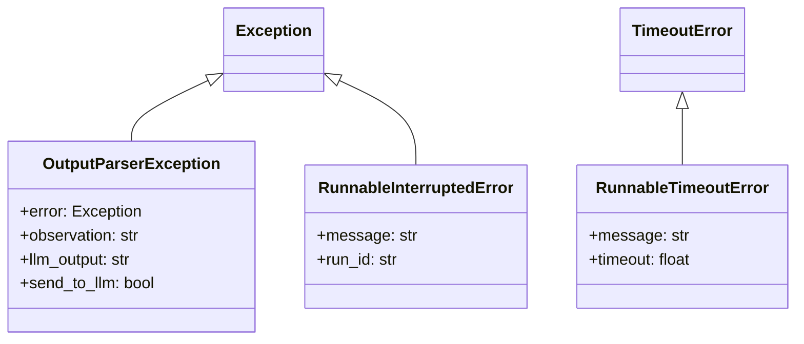

**异常说明**：

| 异常类型 | 触发条件 | 处理建议 |
|---------|---------|---------|
| `OutputParserException` | 解析器无法解析 LLM 输出 | 使用 `OutputFixingParser` 或重试 |
| `RunnableInterruptedError` | 用户中断执行（Ctrl+C） | 清理资源，保存中间状态 |
| `RunnableTimeoutError` | 执行超时 | 检查 `max_execution_time` 配置 |

---

## 8. 关键数据结构映射表

### 8.1 DTO 与持久化模型映射

| DTO（内存模型） | 持久化模型（序列化） | 映射规则 |
|---------------|-------------------|---------|
| `RunnableSequence` | `SerializedRunnable` (type="constructor") | 递归序列化 first/middle/last |
| `RunnableConfig` | `Dict[str, Any]` | 扁平化为 JSON |
| `StreamEvent` | 不持久化 | 仅用于运行时传递 |
| `RunLog` | 不持久化 | 仅用于调试 |

---

## 9. 版本演进与兼容性

### 9.1 数据结构变更历史

| 版本 | 变更内容 | 兼容性影响 |
|-----|---------|-----------|
| v0.1.0 | 引入 `Runnable` 基类 | - |
| v0.2.0 | 增加 `astream_events` API | 向后兼容 |
| v0.3.0 | `RunnableConfig` 增加 `max_concurrency` | 向后兼容，默认值 `None` |
| v0.3.0 | `StreamEvent` 增加 `parent_ids` 字段 | 向后兼容 |

**兼容性策略**：

- 新增字段均有合理默认值
- 移除字段前至少保留两个大版本（标记为 `deprecated`）
- 序列化格式通过 `lc` 版本号区分

---

## 10. 性能特征总结

| 数据结构 | 时间复杂度 | 空间复杂度 | 并发安全 |
|---------|-----------|-----------|---------|
| `RunnableSequence` | O(n)（n 为步骤数） | O(1) | ✅ 是 |
| `RunnableParallel` | O(1)（并发执行） | O(k)（k 为并发数） | ✅ 是 |
| `RunnableConfig` | O(1)（字典查找） | O(m)（m 为配置项数） | ⚠️ 否（需拷贝） |
| `StreamEvent` | O(1)（创建和传递） | O(1) | ✅ 是 |

**优化建议**：

- 长序列链考虑拆分为子链并缓存中间结果
- 高并发场景调整 `max_concurrency` 避免线程爆炸
- 流式 API 优先（减少内存峰值）
- 使用 `RunnableConfig` 浅拷贝共享不可变配置

---

## 11. 总结

本文档详细描述了 **Runnables 模块**的核心数据结构，包括：

1. **类层次**：从 `Runnable` 抽象基类到各种具体实现的完整继承关系
2. **配置结构**：`RunnableConfig` 和可配置字段的管理机制
3. **流式结构**：`StreamEvent`、`RunLog` 等流式执行的数据载体
4. **并发控制**：线程池和信号量的配置管理
5. **数据流转**：顺序、并行、流式三种执行模式的数据传递
6. **序列化格式**：LangChain 序列化协议和 JSON Schema
7. **异常类型**：错误处理和异常传播机制
8. **性能特征**：各数据结构的复杂度和优化建议

所有结构均配备 UML 图、字段表、约束说明和实际应用示例，帮助开发者深入理解 Runnables 的内部实现和最佳实践。

---

## 时序图

## 文档说明

本文档通过详细的时序图展示 **Runnables 模块**在各种典型场景下的执行流程，包括同步/异步调用、批处理、流式输出、组合链执行、错误重试和回退等。每张时序图均配备详细的文字说明。

---

## 1. 基础调用场景

### 1.1 同步 invoke 调用

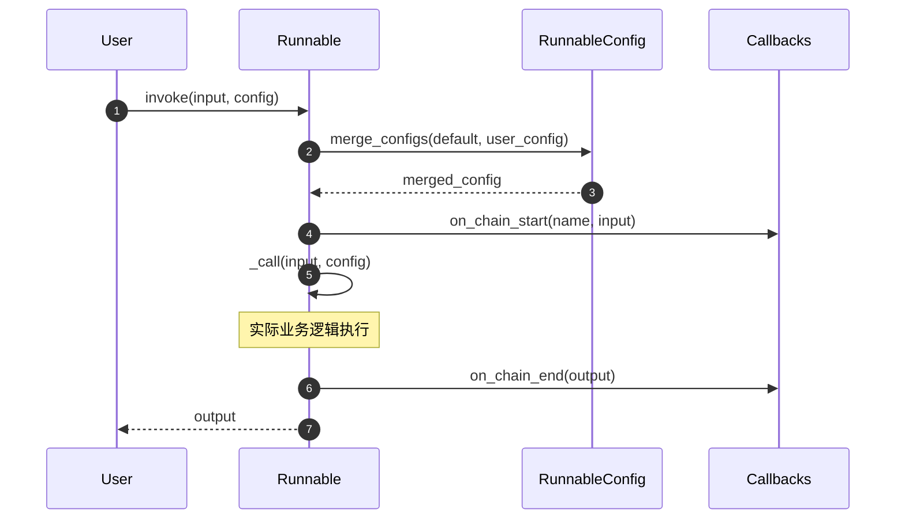

**图解说明**：

1. **配置合并**（步骤 2-3）：
   - 合并默认配置和用户传入配置
   - 优先级：用户配置 > 绑定配置 > 默认配置
   - 合并策略：`tags` 和 `metadata` 为合并，其他字段为覆盖

2. **回调触发**（步骤 4、6）：
   - `on_chain_start`：记录输入和开始时间
   - `on_chain_end`：记录输出和执行耗时
   - 异常时触发 `on_chain_error`

3. **实际执行**（步骤 5）：
   - 调用子类实现的 `_call` 方法
   - 支持同步和异步两种实现
   - 异常会被捕获并传递给回调

**边界条件**：

- 超时控制：通过 `signal.alarm()` 实现（仅 Unix 系统）
- 递归限制：通过 `recursion_limit` 配置防止无限递归
- 线程安全：使用 ContextVar 隔离配置

**性能特征**：

- 单次调用开销：约 0.1-0.5ms（不含业务逻辑）
- 回调开销：每个回调约 0.05ms
- 配置合并开销：O(n) 其中 n 为配置项数量

---

### 1.2 异步 ainvoke 调用

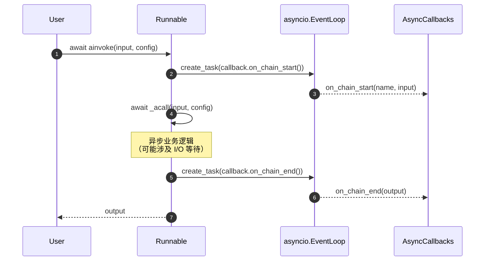

**图解说明**：

1. **异步回调**（步骤 2-3、5-6）：
   - 回调以 `asyncio.Task` 形式并发执行
   - 不阻塞主执行路径
   - 异常不影响主流程（仅记录日志）

2. **异步执行**（步骤 4）：
   - 使用 `await` 等待 I/O 操作
   - 事件循环可调度其他任务
   - 支持超时控制（`asyncio.wait_for`）

**与同步版本的差异**：

- 异步版本可并发处理多个请求
- 适合 I/O 密集型任务（如 API 调用）
- 不适合 CPU 密集型任务（无法绕过 GIL）

**性能优势**：

- 单核心可处理 1000+ 并发请求
- I/O 等待时间不占用 CPU
- 内存开销：每个任务约 2KB

---

## 2. 批处理场景

### 2.1 batch 批量调用

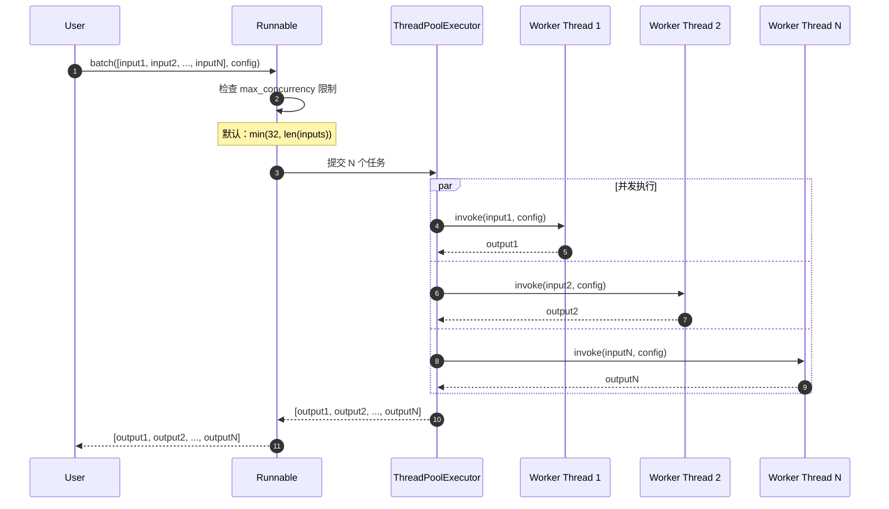

**图解说明**：

1. **并发控制**（步骤 2）：
   - `max_concurrency` 限制同时执行的任务数
   - 超出部分排队等待
   - 信号量（Semaphore）实现限流

2. **并行执行**（步骤 4-7）：
   - 使用线程池避免创建开销
   - 每个输入独立执行
   - 异常不影响其他任务

3. **结果收集**（步骤 8）：
   - 保持输入顺序
   - 任一任务失败抛出异常
   - 其他任务会被取消

**性能特征**：

- 吞吐量提升：N * 单任务耗时 / 并发数
- 适用场景：I/O 密集型任务
- 不适用：CPU 密集型任务（GIL 限制）

**最佳实践**：

- 批量大小：建议 10-100
- 并发数：根据下游服务限制调整
- 超时：设置合理的单任务超时

---

### 2.2 abatch 异步批量调用

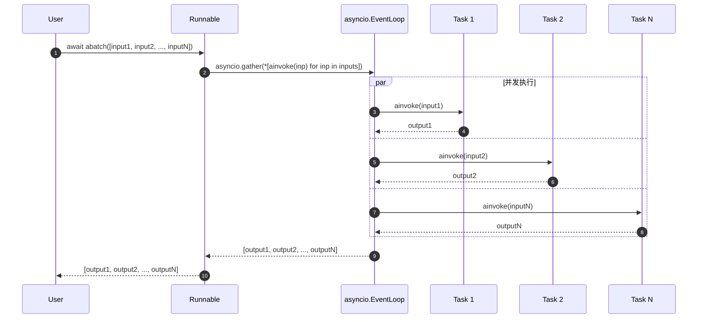

**与同步 batch 的差异**：

- 使用 `asyncio.gather` 代替线程池
- 单线程事件循环调度
- 内存开销更小（无线程栈）
- 适合大规模并发（1000+）

**异常处理**：

- `return_exceptions=False`：任一失败立即抛出
- `return_exceptions=True`：返回异常对象

---

## 3. 流式输出场景

### 3.1 stream 流式调用

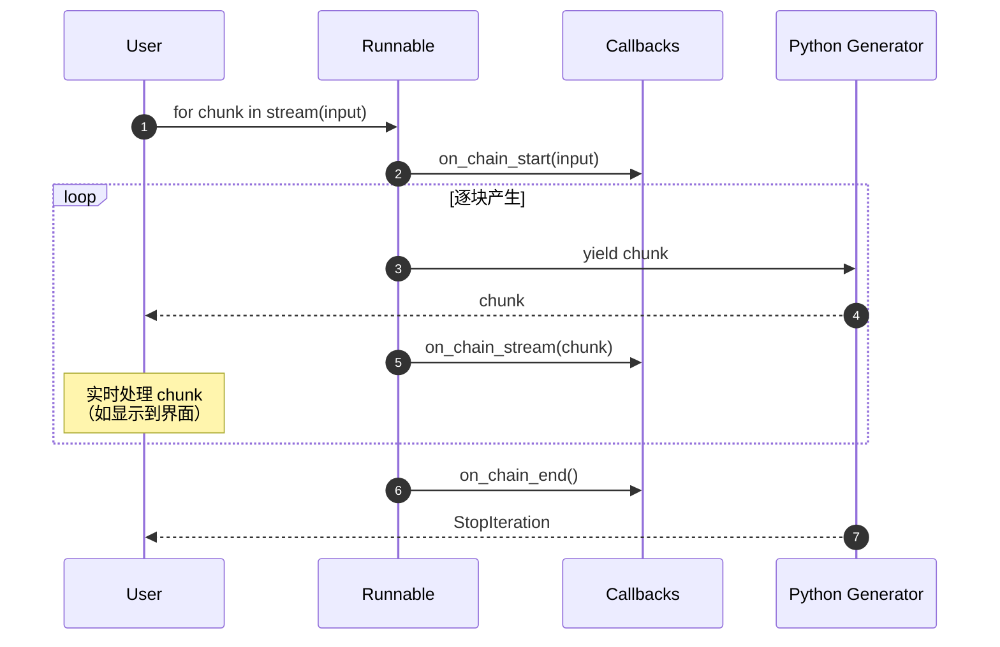

**图解说明**：

1. **生成器模式**（步骤 3-7）：
   - Python 生成器实现惰性求值
   - 背压控制：用户未消费时暂停
   - 内存高效：不累积全部输出

2. **实时回调**（步骤 5）：
   - 每个块产生时触发 `on_chain_stream`
   - 用于实时监控和日志
   - 异步回调不阻塞流

3. **完成通知**（步骤 8）：
   - `on_chain_end` 在流结束时触发
   - 包含完整输出（如需要）
   - 异常时触发 `on_chain_error`

**适用场景**：

- LLM 逐 token 输出
- 大文件处理
- 实时数据流

**性能优势**：

- 首字节延迟（TTFB）降低 90%+
- 内存峰值降低 10-100 倍
- 用户体验提升（即时反馈）

---

### 3.2 astream_events 事件流

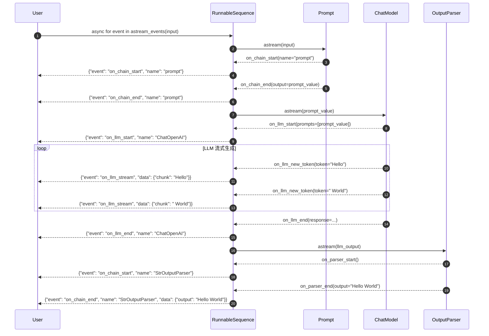

**图解说明**：

1. **事件层次**（步骤 2-17）：
   - 顶层链事件（`on_chain_*`）
   - 子步骤事件（`on_llm_*`、`on_tool_*`）
   - 嵌套深度无限制

2. **事件过滤**：

   ```python
   async for event in chain.astream_events(
       input_data,
       version="v2",
       include_names=["ChatOpenAI"],  # 仅 LLM 事件
       include_types=["llm"]           # 仅 llm 类型
   ):
       ...
```

3. **事件结构**：
   - `event`: 事件类型（如 `"on_llm_stream"`）
   - `name`: 组件名称
   - `run_id`: 唯一运行 ID
   - `tags`: 标签列表
   - `metadata`: 元数据
   - `data`: 事件数据

**应用场景**：

- 构建实时调试 UI
- 细粒度性能分析
- 自定义流式响应格式

**性能考虑**：

- 每个事件约 500 字节
- 使用过滤减少网络传输
- 事件队列大小限制：1000 个

---

## 4. 组合链执行场景

### 4.1 RunnableSequence 顺序执行

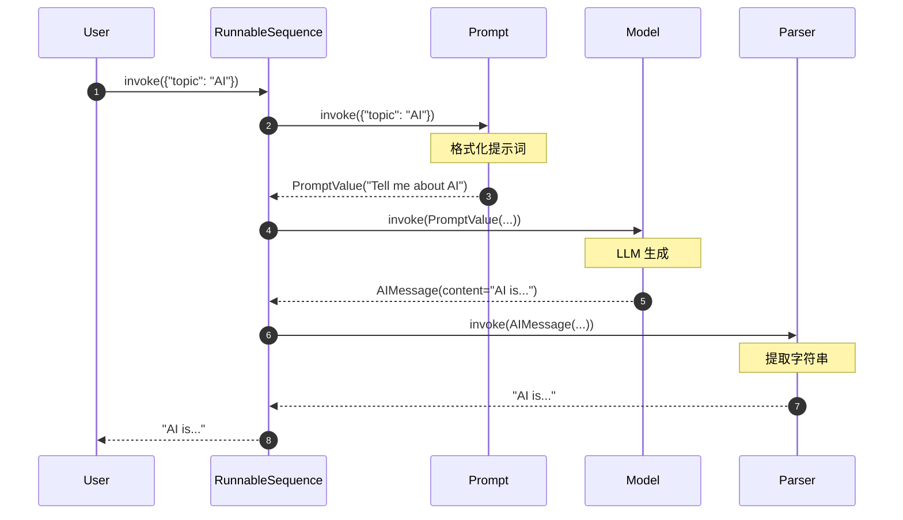

**图解说明**：

1. **类型转换链**（步骤 2-7）：
   - dict → PromptValue
   - PromptValue → AIMessage
   - AIMessage → str
   - 每步输出是下一步输入

2. **错误传播**：
   - 任一步骤失败，整个链失败
   - 异常包含完整调用栈
   - 中间结果可通过回调获取

**等价代码**：

```python
chain = prompt | model | parser  # 使用 | 操作符
output = chain.invoke({"topic": "AI"})
```

---

### 4.2 RunnableParallel 并行执行

```mermaid
sequenceDiagram
    autonumber
    participant User
    participant Par as RunnableParallel
    participant Joke as JokeChain
    participant Poem as PoemChain
    participant Summary as SummaryChain

    User->>Par: invoke({"topic": "cats"})

    par 并发执行
        Par->>Joke: invoke({"topic": "cats"})
        Note over Joke: 生成笑话
        Joke-->>Par: "Why did the cat..."
    and
        Par->>Poem: invoke({"topic": "cats"})
        Note over Poem: 生成诗歌
        Poem-->>Par: "Cats are graceful..."
    and
        Par->>Summary: invoke({"topic": "cats"})
        Note over Summary: 生成摘要
        Summary-->>Par: "Cats are small felines..."
    end

    Par->>Par: 合并结果
    Note over Par: {"joke": "...", "poem": "...", "summary": "..."}

    Par-->>User: {"joke": "...", "poem": "...", "summary": "..."}
```

**图解说明**：

1. **并发策略**（步骤 2-7）：
   - 使用 `asyncio.gather` 或 `ThreadPoolExecutor`
   - 所有步骤同时启动
   - 等待全部完成后返回

2. **结果合并**（步骤 8）：
   - 键名保持不变
   - 顺序无关
   - 任一失败则整体失败

**等价代码**：

```python
chain = RunnableParallel(
    joke=joke_chain,
    poem=poem_chain,
    summary=summary_chain
)
# 或使用字典字面量
chain = {
    "joke": joke_chain,
    "poem": poem_chain,
    "summary": summary_chain
}
```

**性能提升**：

- 执行时间 ≈ max(各步骤时间)
- 适合独立任务
- 注意下游限流

---

### 4.3 嵌套组合链

```mermaid
sequenceDiagram
    autonumber
    participant User
    participant Outer as RunnableSequence
    participant Par as RunnableParallel
    participant Chain1
    participant Chain2
    participant Final as FinalStep

    User->>Outer: invoke(input)

    Outer->>Par: invoke(input)

    par 并行分支
        Par->>Chain1: invoke(input)
        Chain1-->>Par: output1
    and
        Par->>Chain2: invoke(input)
        Chain2-->>Par: output2
    end

    Par-->>Outer: {"branch1": output1, "branch2": output2}

    Outer->>Final: invoke({"branch1": ..., "branch2": ...})
    Final-->>Outer: final_output

    Outer-->>User: final_output
```

**图解说明**：

1. **嵌套结构**：

   ```python
   chain = (
       RunnableParallel(branch1=chain1, branch2=chain2) |
       final_step
   )
```

2. **执行顺序**：
   - 先并行执行 branch1 和 branch2
   - 再顺序执行 final_step

3. **错误处理**：
   - 内层异常向外传播
   - 可在每层使用 `with_fallbacks`

---

## 5. 错误处理场景

### 5.1 with_retry 重试机制

```mermaid
sequenceDiagram
    autonumber
    participant User
    participant Retry as RunnableRetry
    participant Runnable
    participant Service as External API

    User->>Retry: invoke(input)

    Retry->>Runnable: 第1次尝试
    Runnable->>Service: API 请求
    Service-->>Runnable: 503 Service Unavailable
    Runnable-->>Retry: raise Exception

    Note over Retry: 等待 1s（指数退避）

    Retry->>Runnable: 第2次尝试
    Runnable->>Service: API 请求
    Service-->>Runnable: 429 Rate Limit
    Runnable-->>Retry: raise Exception

    Note over Retry: 等待 2s（指数退避）

    Retry->>Runnable: 第3次尝试
    Runnable->>Service: API 请求
    Service-->>Runnable: 200 OK + response
    Runnable-->>Retry: output

    Retry-->>User: output
```

**图解说明**：

1. **重试策略**（步骤 2-11）：
   - 最大尝试次数：默认 3 次
   - 退避策略：指数退避 + 随机抖动
   - 可重试异常：可配置（默认所有）

2. **退避计算**：

   ```python
   wait_time = min(
       max_wait,
       base_wait * (2 ** (attempt - 1)) + random.uniform(0, jitter)
   )
```

3. **配置示例**：

   ```python
   chain = base_chain.with_retry(
       retry_if_exception_type=(HTTPError, TimeoutError),
       max_attempt_number=5,
       wait_exponential_jitter=True,
       stop_after_delay=60  # 60秒后停止重试
   )
```

**适用场景**：

- 网络请求不稳定
- 下游服务偶发错误
- 速率限制（Rate Limit）

**注意事项**：

- 确保操作幂等
- 设置合理的超时时间
- 记录重试次数（用于监控）

---

### 5.2 with_fallbacks 回退机制

```mermaid
sequenceDiagram
    autonumber
    participant User
    participant Fallback as RunnableWithFallbacks
    participant Primary as 主模型（GPT-4）
    participant Backup1 as 备用1（GPT-3.5）
    participant Backup2 as 备用2（Claude）

    User->>Fallback: invoke(input)

    Fallback->>Primary: invoke(input)
    Primary-->>Fallback: raise Exception("API Quota Exceeded")
    Note over Fallback: 主模型失败

    Fallback->>Backup1: invoke(input)
    Backup1-->>Fallback: raise Exception("Rate Limit")
    Note over Fallback: 备用1失败

    Fallback->>Backup2: invoke(input)
    Backup2-->>Fallback: output
    Note over Fallback: 备用2成功

    Fallback-->>User: output
```

**图解说明**：

1. **回退链**（步骤 2-8）：
   - 按顺序尝试主模型和备用模型
   - 任一成功即返回
   - 全部失败抛出最后异常

2. **异常过滤**：

   ```python
   chain = primary_model.with_fallbacks(
       [backup_model1, backup_model2],
       exceptions_to_handle=(RateLimitError, QuotaError),
       exception_key="__exception__"  # 保留异常信息
   )
```

3. **异常记录**：
   - `exception_key` 指定的键存储前序异常
   - 用于分析失败原因
   - 不影响正常输出

**适用场景**：

- 多模型降级策略
- 高可用性需求
- 成本优化（主模型贵，备用便宜）

**最佳实践**：

- 主备模型功能对等
- 设置超时避免等待过久
- 监控回退触发频率

---

## 6. 配置化场景

### 6.1 bind 参数绑定

```mermaid
sequenceDiagram
    autonumber
    participant User
    participant Bound as RunnableBinding
    participant Base as BaseChatModel

    User->>User: 创建绑定链
    Note over User: model = base.bind(<br/>  temperature=0.7,<br/>  max_tokens=100<br/>)

    User->>Bound: invoke(input)

    Bound->>Bound: 合并参数
    Note over Bound: kwargs = {<br/>  "temperature": 0.7,<br/>  "max_tokens": 100,<br/>  **user_kwargs<br/>}

    Bound->>Base: invoke(input, **kwargs)
    Base-->>Bound: output

    Bound-->>User: output
```

**图解说明**：

1. **参数合并**（步骤 3）：
   - 绑定参数作为默认值
   - 用户参数可覆盖
   - 支持嵌套合并（如 `model_kwargs`）

2. **应用示例**：

   ```python
   # 绑定温度参数
   creative_model = base_model.bind(temperature=0.9)
   factual_model = base_model.bind(temperature=0.1)

   # 绑定工具
   tool_calling_model = model.bind_tools([search_tool, calculator_tool])
```

**适用场景**：

- 固定部分参数
- 创建专用变体
- 工具绑定

---

### 6.2 configurable_fields 可配置字段

```mermaid
sequenceDiagram
    autonumber
    participant User
    participant Config as ConfigurableRunnable
    participant Base as BaseRunnable

    User->>User: 定义可配置字段
    Note over User: model = base.configurable_fields(<br/>  temperature=ConfigurableField(<br/>    id="temp",<br/>    name="Temperature",<br/>    description="LLM温度参数"<br/>  )<br/>)

    User->>Config: invoke(input, config={<br/>  "configurable": {"temp": 0.5}<br/>})

    Config->>Config: 应用配置值
    Note over Config: temperature = 0.5

    Config->>Base: invoke(input, temperature=0.5)
    Base-->>Config: output

    Config-->>User: output
```

**图解说明**：

1. **动态配置**（步骤 2-5）：
   - 运行时指定参数值
   - 支持默认值
   - 类型验证

2. **应用示例**：

   ```python
   configurable_model = model.configurable_fields(
       temperature=ConfigurableField(id="temp", default=0.7),
       model_name=ConfigurableField(id="model", default="gpt-4")
   )

   # 使用不同配置
   output1 = configurable_model.invoke(
       input_data,
       config={"configurable": {"temp": 0.1, "model": "gpt-3.5-turbo"}}
   )
```

**适用场景**：

- A/B 测试
- 用户自定义参数
- 多租户配置

---

## 7. 性能分析场景

### 7.1 astream_log 执行追踪

```mermaid
sequenceDiagram
    autonumber
    participant User
    participant Chain
    participant Logger as RunLogger

    User->>Chain: async for patch in astream_log(input)

    Chain->>Logger: 初始化 RunState
    Logger-->>User: RunLogPatch([AddOp("/streamed_output", [])])

    Chain->>Chain: 步骤1 开始
    Logger-->>User: RunLogPatch([AddOp("/logs/step1", {...})])

    Chain->>Chain: 步骤1 完成
    Logger-->>User: RunLogPatch([ReplaceOp("/logs/step1/final_output", result1)])

    Chain->>Chain: 步骤2 产生块
    Logger-->>User: RunLogPatch([AddOp("/streamed_output/-", chunk)])

    Chain->>Chain: 全部完成
    Logger-->>User: RunLogPatch([ReplaceOp("/final_output", final)])
```

**图解说明**：

1. **增量更新**（步骤 2-9）：
   - 每个状态变更产生一个 Patch
   - Patch 包含操作列表（Add/Replace/Remove）
   - 客户端应用 Patch 重建状态

2. **路径格式**：
   - `/streamed_output/-`：数组末尾
   - `/logs/step1/final_output`：嵌套字段
   - 符合 JSON Pointer 规范（RFC 6901）

3. **应用示例**：

   ```python
   run_log = RunLog()

   async for patch in chain.astream_log(input_data):
       run_log = run_log.concat(patch)

       # 显示进度
       print(f"Progress: {len(run_log.state.logs)} steps completed")
```

**适用场景**：

- 实时调试界面
- 性能瓶颈分析
- 执行历史回放

---

## 8. 总结

本文档详细展示了 **Runnables 模块**在各种典型场景下的执行时序，包括：

1. **基础调用**：同步/异步 invoke 的完整流程
2. **批处理**：batch/abatch 的并发执行机制
3. **流式输出**：stream/astream_events 的实时数据流
4. **组合链**：顺序/并行/嵌套组合的执行逻辑
5. **错误处理**：重试和回退的恢复策略
6. **配置化**：参数绑定和动态配置的实现
7. **性能分析**：执行追踪和日志记录

每张时序图均包含：

- 详细的步骤编号和参与者
- 关键决策点和数据流转
- 边界条件和性能特征
- 实际应用示例和最佳实践

这些时序图帮助开发者深入理解 Runnables 的内部执行机制，为构建高性能、高可用的 LLM 应用提供指导。

---
