# LangChain-03-LanguageModels

## 模块概览

## 模块基本信息

**模块名称**: langchain-core-language-models
**模块路径**: `libs/core/langchain_core/language_models/`
**核心职责**: 定义语言模型的统一抽象接口，支持聊天模型（Chat Models）和文本补全模型（LLMs）

## 1. 模块职责

### 1.1 核心职责

Language Models 模块提供以下核心能力：

1. **统一模型接口**: 定义 `BaseLanguageModel` 抽象基类，所有语言模型实现此接口
2. **聊天模型抽象**: `BaseChatModel` 支持多轮对话，输入输出为消息列表
3. **LLM 抽象**: `BaseLLM` 支持文本补全，输入输出为字符串
4. **流式生成**: 统一的流式输出接口（`stream`、`astream`）
5. **批处理优化**: 支持批量调用以提升吞吐量
6. **缓存机制**: 可选的 LLM 响应缓存以降低成本
7. **工具调用**: 聊天模型支持函数/工具调用（Function Calling）
8. **结构化输出**: 通过 `with_structured_output` 生成符合 schema 的输出

### 1.2 架构层次

```
BaseLanguageModel (通用语言模型抽象)
├── BaseChatModel (聊天模型)
│   ├── ChatOpenAI
│   ├── ChatAnthropic
│   └── ...其他聊天模型
└── BaseLLM (文本补全模型)
    ├── OpenAI (遗留)
    └── ...其他 LLM
```

### 1.3 输入/输出

**聊天模型**:

- **输入**:
  - `list[BaseMessage]`: 消息列表（`HumanMessage`、`AIMessage`、`SystemMessage`等）
  - `str`: 单个字符串（自动转换为 `HumanMessage`）
  - `PromptValue`: 提示词值对象
- **输出**:
  - `BaseMessage`: 单个消息（通常是 `AIMessage`）
  - `Iterator[BaseMessageChunk]`: 流式输出（消息块）

**文本补全模型**:

- **输入**: `str` 或 `list[str]`
- **输出**: `str` 或 `list[str]`

### 1.4 上下游依赖

**上游调用者**:

- 用户应用代码
- LCEL 链（作为链中的一个组件）
- Agents（使用模型进行推理）

**下游依赖**:

- `langchain_core.messages`: 消息类型定义
- `langchain_core.outputs`: 生成结果封装（`ChatGeneration`、`LLMResult`）
- `langchain_core.callbacks`: 回调系统
- `langchain_core.caches`: 缓存接口
- `langchain_core.rate_limiters`: 速率限制
- 第三方 API 客户端（OpenAI SDK、Anthropic SDK 等）

## 2. 模块级架构图

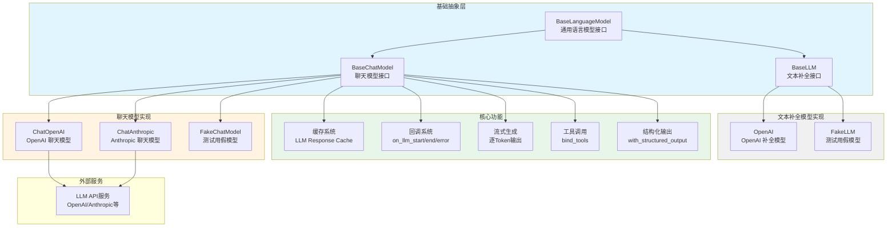

### 架构图详细说明

**1. 基础抽象层**

- **BaseLanguageModel**: 所有语言模型的根基类
  - 继承自 `RunnableSerializable`，自动获得 LCEL 能力
  - 定义通用属性：`cache`、`verbose`、`callbacks`、`tags`、`metadata`
  - 强制实现 `generate_prompt` 和 `agenerate_prompt` 方法
  - 提供 `invoke`/`ainvoke` 的默认实现

- **BaseChatModel**: 聊天模型抽象
  - 输入输出为消息对象（`BaseMessage`）
  - 强制实现 `_generate` 方法（生成单个响应）
  - 可选实现 `_stream` 方法（流式生成）
  - 提供工具调用相关方法：`bind_tools`、`bind_functions`
  - 提供结构化输出方法：`with_structured_output`

- **BaseLLM**: 文本补全模型抽象
  - 输入输出为字符串
  - 强制实现 `_generate` 方法
  - 可选实现 `_stream` 方法
  - 逐渐被聊天模型取代（新项目推荐使用聊天模型）

**2. 实现层**

所有具体模型实现都位于独立的集成包中（如 `langchain-openai`），遵循以下模式：

```python
from langchain_core.language_models import BaseChatModel

class ChatOpenAI(BaseChatModel):
    # 模型特定配置
    model_name: str = "gpt-3.5-turbo"
    temperature: float = 0.7
    max_tokens: Optional[int] = None

    # 实现核心方法
    def _generate(self, messages, stop, run_manager, **kwargs):
        # 调用 OpenAI API
        pass

    def _stream(self, messages, stop, run_manager, **kwargs):
        # 流式调用 OpenAI API
        pass
```

**3. 核心功能**

- **缓存系统**:
  - 通过 `cache` 属性启用
  - 支持内存缓存（`InMemoryCache`）和外部缓存（Redis等）
  - 基于输入的哈希值匹配缓存
  - 仅对非流式调用生效

- **回调系统**:
  - `on_llm_start`: LLM 调用开始
  - `on_llm_end`: LLM 调用结束
  - `on_llm_error`: LLM 调用失败
  - `on_llm_new_token`: 流式生成新 token

- **流式生成**:
  - 逐 token 生成结果
  - 减少首字节延迟（TTFB）
  - 通过 `_stream` 方法实现
  - 返回 `BaseMessageChunk` 或字符串块

- **工具调用** (仅聊天模型):
  - `bind_tools`: 绑定工具定义到模型
  - 模型在响应中返回工具调用指令
  - 支持 OpenAI Function Calling 格式

- **结构化输出**:
  - `with_structured_output`: 强制输出符合 Pydantic schema
  - 内部使用工具调用或输出解析器
  - 确保类型安全

**4. 外部服务交互**

具体模型通过 HTTP API 与 LLM 服务通信：

```python
# OpenAI 调用示例
response = await self.client.chat.completions.create(
    model=self.model_name,
    messages=self._convert_messages(messages),
    temperature=self.temperature,
    stream=self.streaming,
    tools=self.tools if self.tools else None
)
```

## 3. 核心 API 详解

### 3.1 invoke - 生成单个响应

```python
from langchain_openai import ChatOpenAI
from langchain_core.messages import HumanMessage

model = ChatOpenAI(model="gpt-4")

# 方式1: 直接传递字符串
response = model.invoke("What is LangChain?")
print(response.content)  # AIMessage.content

# 方式2: 传递消息列表
messages = [
    SystemMessage(content="You are a helpful assistant."),
    HumanMessage(content="What is LangChain?")
]
response = model.invoke(messages)

# 方式3: 结合 LCEL
chain = prompt | model | parser
result = chain.invoke({"question": "What is LangChain?"})
```

### 3.2 stream - 流式生成

```python
model = ChatOpenAI(model="gpt-4", streaming=True)

# 逐块打印
for chunk in model.stream("Tell me a long story"):
    print(chunk.content, end="", flush=True)

# 异步流式
async def async_stream():
    async for chunk in model.astream("Tell me a long story"):
        print(chunk.content, end="", flush=True)
```

### 3.3 batch - 批量调用

```python
model = ChatOpenAI()

# 批量生成
inputs = ["Question 1", "Question 2", "Question 3"]
responses = model.batch(inputs, config={"max_concurrency": 5})

for i, response in enumerate(responses):
    print(f"Response {i}: {response.content}")
```

### 3.4 bind_tools - 绑定工具

```python
from langchain_core.tools import tool

@tool
def search(query: str) -> str:
    """Search the web for information."""
    return f"Results for: {query}"

# 绑定工具到模型
model_with_tools = model.bind_tools([search])

# 模型可以决定是否调用工具
response = model_with_tools.invoke("Search for LangChain documentation")
print(response.tool_calls)  # [ToolCall(name="search", args={"query": "..."})]
```

### 3.5 with_structured_output - 结构化输出

```python
from pydantic import BaseModel, Field

class Person(BaseModel):
    name: str = Field(description="The person's name")
    age: int = Field(description="The person's age")

# 强制输出符合 schema
structured_model = model.with_structured_output(Person)

person = structured_model.invoke("John is 30 years old")
print(person)  # Person(name="John", age=30)
print(type(person))  # <class 'Person'>
```

## 4. 关键数据结构

### 4.1 BaseMessage 及其子类

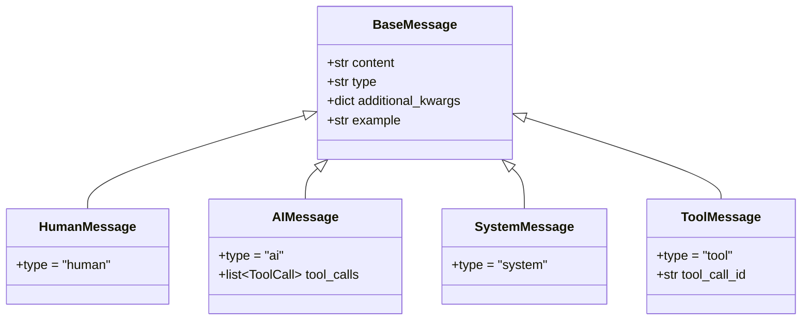

**字段说明**:

| 字段 | 类型 | 说明 |
|------|------|------|
| `content` | `str | list[dict]` | 消息内容，可以是文本或多模态内容 |
| `type` | `str` | 消息类型标识符 |
| `additional_kwargs` | `dict` | 额外的模型特定参数 |
| `example` | `bool` | 是否为示例消息（用于少样本学习） |
| `tool_calls` | `list[ToolCall]` | AI 消息的工具调用列表 |
| `tool_call_id` | `str` | 工具消息对应的调用 ID |

### 4.2 ChatGeneration 与 ChatResult

```python
@dataclass
class ChatGeneration:
    """单个聊天生成结果"""
    message: BaseMessage  # 生成的消息
    generation_info: Optional[dict] = None  # 生成信息（如finish_reason）

@dataclass
class ChatResult:
    """完整的聊天响应"""
    generations: list[ChatGeneration]  # 可能有多个候选
    llm_output: Optional[dict] = None  # 模型输出元数据（如token使用量）
```

### 4.3 ToolCall

```python
class ToolCall(TypedDict):
    """工具调用定义"""
    name: str  # 工具名称
    args: dict[str, Any]  # 工具参数
    id: Optional[str]  # 调用ID
    type: Literal["tool_call"]  # 类型标识
```

## 5. 核心流程时序图

### 5.1 简单聊天调用流程

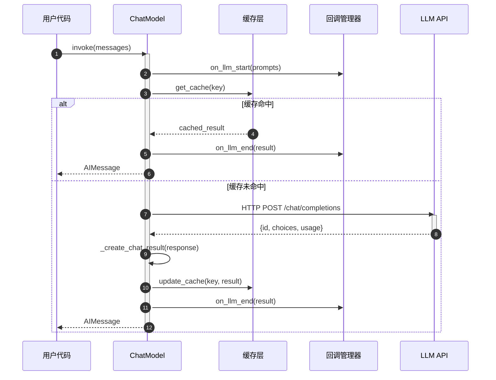

**流程说明**:

1. **调用入口**: 用户通过 `invoke` 方法传入消息列表
2. **回调触发**: 触发 `on_llm_start` 回调，记录输入
3. **缓存检查**: 如果启用缓存，计算输入哈希并查询缓存
4. **API 调用**: 缓存未命中时，调用 LLM API
5. **响应解析**: 将 API 响应转换为 `AIMessage`
6. **缓存更新**: 将结果写入缓存
7. **回调结束**: 触发 `on_llm_end` 回调，记录输出和延迟
8. **返回结果**: 返回 `AIMessage` 给调用方

### 5.2 流式生成流程

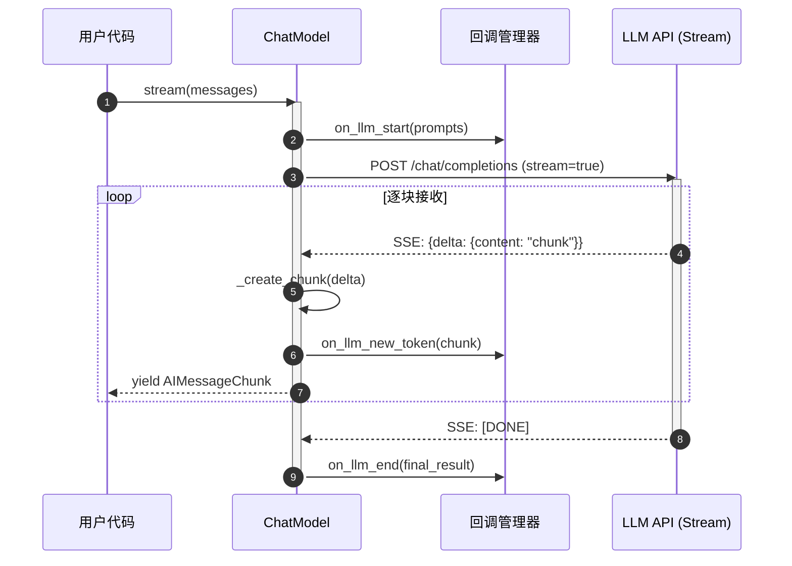

**流程说明**:

1. **启用流式**: 设置 `stream=True` 参数
2. **SSE 连接**: 建立 Server-Sent Events 连接
3. **逐块接收**: 服务器逐 token 推送数据
4. **实时回调**: 每个 token 触发 `on_llm_new_token` 回调
5. **逐块返回**: 通过生成器 `yield` 返回消息块
6. **连接关闭**: 收到 `[DONE]` 信号后结束
7. **最终回调**: 触发 `on_llm_end`，记录完整结果

### 5.3 工具调用流程

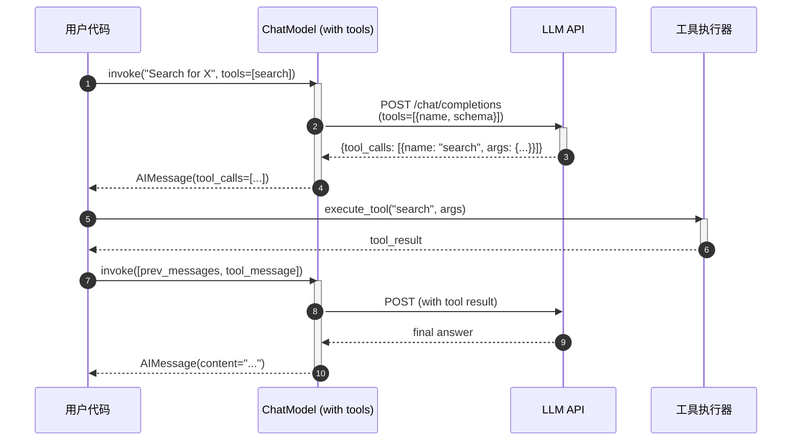

**流程说明**:

1. **绑定工具**: 通过 `bind_tools` 将工具定义传给模型
2. **首次调用**: 模型收到用户查询和工具列表
3. **工具决策**: LLM 决定需要调用哪个工具及参数
4. **返回调用指令**: 返回 `AIMessage` 包含 `tool_calls`
5. **执行工具**: 用户代码执行工具并获得结果
6. **二次调用**: 将工具结果作为 `ToolMessage` 传回模型
7. **最终答案**: 模型基于工具结果生成最终回复

## 6. 配置与优化

### 6.1 关键配置参数

| 参数名 | 类型 | 默认值 | 说明 |
|--------|------|--------|------|
| `model` / `model_name` | `str` | 模型特定 | 模型标识符（如 `gpt-4`、`claude-3-opus`） |
| `temperature` | `float` | 0.7 | 生成随机性，0 = 确定性，2 = 最大随机 |
| `max_tokens` | `int` | `None` | 最大生成 token 数 |
| `top_p` | `float` | 1.0 | 核采样参数 |
| `frequency_penalty` | `float` | 0.0 | 频率惩罚（减少重复） |
| `presence_penalty` | `float` | 0.0 | 存在惩罚（鼓励新话题） |
| `streaming` | `bool` | `False` | 是否启用流式输出 |
| `cache` | `bool | BaseCache` | `None` | 响应缓存 |
| `request_timeout` | `float` | 60.0 | API 请求超时（秒） |
| `max_retries` | `int` | 2 | API 调用失败重试次数 |

### 6.2 性能优化建议

**1. 启用缓存**:

```python
from langchain.cache import InMemoryCache
from langchain.globals import set_llm_cache

# 全局缓存
set_llm_cache(InMemoryCache())

# 或单个模型缓存
model = ChatOpenAI(cache=True)
```

**2. 批处理聚合**:

```python
# ❌ 低效：循环调用
results = [model.invoke(q) for q in questions]

# ✅ 高效：批量调用
results = model.batch(questions, config={"max_concurrency": 10})
```

**3. 流式提升体验**:

```python
# 用户立即看到输出
model = ChatOpenAI(streaming=True)
for chunk in model.stream(query):
    display(chunk.content)
```

**4. 异步提升吞吐量**:

```python
async def process_many():
    tasks = [model.ainvoke(q) for q in questions]
    results = await asyncio.gather(*tasks)
    return results
```

**5. 调整并发度**:

```python
# 避免 API 速率限制
model.batch(inputs, config={"max_concurrency": 5})
```

## 7. 最佳实践

### 7.1 选择合适的模型类型

**使用聊天模型（推荐）**:

- 新项目优先选择聊天模型
- 更好的多轮对话支持
- 支持系统消息和工具调用
- 更现代的 API 设计

**使用文本补全模型**:

- 仅当特定模型不支持聊天 API 时
- 简单的文本生成任务
- 逐渐被淘汰

### 7.2 提示词工程

```python
from langchain_core.prompts import ChatPromptTemplate

# ✅ 使用系统消息设置角色
prompt = ChatPromptTemplate.from_messages([
    ("system", "You are an expert {domain} assistant."),
    ("human", "{question}")
])

chain = prompt | model
result = chain.invoke({"domain": "Python", "question": "..."})
```

### 7.3 错误处理

```python
from langchain_core.exceptions import OutputParserException

try:
    result = model.invoke(query, config={"request_timeout": 30})
except asyncio.TimeoutError:
    # 处理超时
    result = fallback_model.invoke(query)
except Exception as e:
    # 处理其他错误
    logger.error(f"LLM call failed: {e}")
    raise
```

### 7.4 成本控制

```python
# 1. 限制 token 使用
model = ChatOpenAI(model="gpt-3.5-turbo", max_tokens=500)

# 2. 使用更便宜的模型
cheap_model = ChatOpenAI(model="gpt-3.5-turbo")  # 而非 gpt-4

# 3. 启用缓存避免重复调用
model = ChatOpenAI(cache=True)

# 4. 监控 token 使用量
response = model.generate([[message]])
print(response.llm_output["token_usage"])
```

## 8. 与其他模块的协作

### 8.1 与 Prompts 协作

```python
prompt = ChatPromptTemplate.from_template("Tell me about {topic}")
chain = prompt | model
result = chain.invoke({"topic": "AI"})
```

### 8.2 与 Output Parsers 协作

```python
from langchain_core.output_parsers import JsonOutputParser

parser = JsonOutputParser()
chain = prompt | model | parser
structured_result = chain.invoke(input)
```

### 8.3 与 Agents 协作

```python
from langchain.agents import AgentExecutor, create_openai_functions_agent

agent = create_openai_functions_agent(model, tools, prompt)
agent_executor = AgentExecutor(agent=agent, tools=tools)
result = agent_executor.invoke({"input": "query"})
```

### 8.4 与 Retrievers 协作（RAG）

```python
from langchain_core.runnables import RunnablePassthrough

chain = (
    {"context": retriever, "question": RunnablePassthrough()}
    | prompt
    | model
    | StrOutputParser()
)
```

## 9. 测试与调试

### 9.1 使用假模型测试

```python
from langchain_core.language_models import FakeChatModel

# 预定义响应
fake_model = FakeChatModel(responses=["Response 1", "Response 2"])

# 用于单元测试
result = fake_model.invoke("test")
assert result.content == "Response 1"
```

### 9.2 启用详细日志

```python
from langchain.globals import set_verbose, set_debug

set_verbose(True)  # 打印中间步骤
set_debug(True)  # 打印所有回调

model.invoke(query)  # 查看详细执行过程
```

### 9.3 LangSmith 追踪

```python
import os

os.environ["LANGCHAIN_TRACING_V2"] = "true"
os.environ["LANGCHAIN_API_KEY"] = "..."

# 自动追踪所有 LLM 调用
model.invoke(query)
# 在 LangSmith UI 查看执行轨迹、延迟、token 使用等
```

## 10. 总结

Language Models 模块是 LangChain 的核心，通过统一的抽象接口支持各种 LLM 提供商。关键特性包括：

1. **统一接口**: 轻松切换不同模型，无需修改业务代码
2. **LCEL 集成**: 作为 Runnable 可无缝组合到链中
3. **流式支持**: 提升用户体验，降低感知延迟
4. **工具调用**: 赋予模型使用外部工具的能力
5. **结构化输出**: 确保输出符合预期格式
6. **缓存优化**: 降低成本和延迟

使用时应注意成本控制、错误处理和性能优化，充分利用批处理和异步能力提升吞吐量。

---

**文档版本**: v1.0
**最后更新**: 2025-10-03
**相关文档**:

- LangChain-00-总览.md
- LangChain-01-Runnables-概览.md
- LangChain-04-Prompts-概览.md（待生成）
- LangChain-05-OutputParsers-概览.md（待生成）

---

## API接口

## 文档说明

本文档详细描述 **Language Models 模块**的对外 API，包括 `BaseChatModel` 和 `BaseLLM` 的所有公开方法、参数规格、调用链路、时序图和最佳实践。

---

## 1. BaseChatModel 核心 API

### 1.1 invoke - 单次同步调用

#### 基本信息
- **方法签名**：`invoke(input: LanguageModelInput, config: RunnableConfig = None, **kwargs) -> BaseMessage`
- **功能**：发送消息列表到聊天模型，返回单个 AI 响应消息
- **幂等性**：否（每次调用可能产生不同响应）
- **缓存**：支持（基于输入和模型参数）

#### 请求参数

```python
def invoke(
    self,
    input: LanguageModelInput,  # 输入消息
    config: Optional[RunnableConfig] = None,  # 运行配置
    *,
    stop: Optional[List[str]] = None,  # 停止词
    **kwargs: Any  # 模型特定参数
) -> BaseMessage:
    """调用聊天模型生成响应。"""
```

**参数说明**：

| 参数 | 类型 | 必填 | 默认 | 说明 |
|-----|------|-----|------|------|
| input | `str \| List[BaseMessage] \| PromptValue` | 是 | - | 输入消息，支持多种格式 |
| config | `RunnableConfig` | 否 | `None` | 包含回调、标签、元数据等 |
| stop | `List[str]` | 否 | `None` | 停止生成的序列列表 |
| **kwargs | `Any` | 否 | - | 模型特定参数（如 `temperature`、`max_tokens`） |

#### 响应结构

```python
# 返回类型：BaseMessage（通常是 AIMessage）
class AIMessage(BaseMessage):
    content: str | List[Union[str, Dict]]  # 文本内容或多模态内容
    additional_kwargs: Dict[str, Any]  # 额外信息（如 function_call）
    response_metadata: Dict[str, Any]  # 响应元数据（如 token 使用量）
    tool_calls: List[ToolCall]  # 工具调用列表
    usage_metadata: UsageMetadata  # token 使用详情
```

**字段表**：

| 字段 | 类型 | 必填 | 说明 |
|-----|------|-----|------|
| content | `str \| List` | 是 | 生成的文本内容 |
| additional_kwargs | `Dict` | 否 | 供应商特定数据 |
| response_metadata | `Dict` | 否 | 模型返回的元数据（token 数、finish_reason 等） |
| tool_calls | `List[ToolCall]` | 否 | 模型请求的工具调用 |
| usage_metadata | `UsageMetadata` | 否 | token 使用统计 |

#### 入口函数实现

```python
# libs/core/langchain_core/language_models/chat_models.py
class BaseChatModel(BaseLanguageModel[BaseMessage], ABC):

    def invoke(
        self,
        input: LanguageModelInput,
        config: Optional[RunnableConfig] = None,
        *,
        stop: Optional[List[str]] = None,
        **kwargs: Any,
    ) -> BaseMessage:
        # 1. 转换输入为标准消息列表
        messages = self._convert_input(input)

        # 2. 合并配置
        config = ensure_config(config)

        # 3. 调用生成方法
        llm_result = self.generate_prompt(
            [ChatPromptValue(messages=messages)],
            stop=stop,
            callbacks=config.get("callbacks"),
            **kwargs
        )

        # 4. 提取第一个响应
        generation = llm_result.generations[0][0]
        return generation.message
```

**关键步骤说明**：

1. **输入转换**（`_convert_input`）：
   - 字符串 → `[HumanMessage(content=string)]`
   - 消息列表 → 直接使用
   - `PromptValue` → 调用 `.to_messages()`

2. **配置合并**：
   - 合并默认配置、绑定配置和用户配置
   - 提取回调处理器

3. **生成调用**：
   - 调用 `generate_prompt` 方法
   - 传递停止词和额外参数
   - 触发回调事件

4. **结果提取**：
   - 从 `LLMResult` 中提取消息
   - 包含完整元数据

#### 调用链路

```python
# 1. 用户调用入口
model.invoke(messages)

# 2. BaseChatModel.invoke
↓
# 3. BaseChatModel.generate_prompt
↓
# 4. BaseChatModel.generate
↓
# 5. 子类实现的 _generate
# （如 ChatOpenAI._generate）
↓
# 6. 供应商 API 调用
# （如 openai.ChatCompletion.create）
↓
# 7. 响应解析和包装
```

**上层适配示例**：

```python
# libs/partners/openai/langchain_openai/chat_models.py
class ChatOpenAI(BaseChatModel):

    def _generate(
        self,
        messages: List[BaseMessage],
        stop: Optional[List[str]] = None,
        run_manager: Optional[CallbackManagerForLLMRun] = None,
        **kwargs: Any,
    ) -> ChatResult:
        # 1. 转换消息格式
        message_dicts = [_convert_message_to_dict(m) for m in messages]

        # 2. 准备请求参数
        params = {
            "model": self.model_name,
            "messages": message_dicts,
            "temperature": self.temperature,
            **kwargs
        }
        if stop:
            params["stop"] = stop

        # 3. 调用 OpenAI API
        response = self.client.create(**params)

        # 4. 解析响应
        message = _convert_dict_to_message(response.choices[0].message)

        # 5. 构建结果
        return ChatResult(
            generations=[ChatGeneration(message=message)],
            llm_output={"token_usage": response.usage, ...}
        )
```

#### 时序图

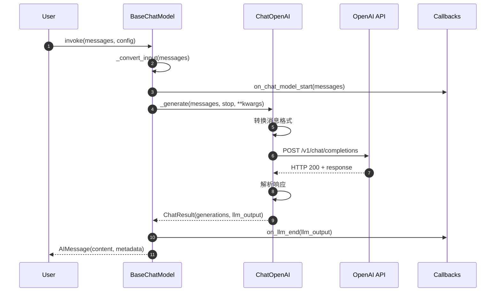

**图解说明**：

1. **前置处理**（步骤 1-3）：
   - 输入标准化
   - 回调通知开始

2. **API 调用**（步骤 4-6）：
   - 格式转换（LangChain 消息 → 供应商格式）
   - HTTP 请求
   - 响应等待

3. **后置处理**（步骤 7-9）：
   - 响应解析
   - 回调通知完成
   - 返回标准消息对象

#### 异常处理与回退

**常见异常**：

| 异常类型 | 触发条件 | 处理建议 |
|---------|---------|---------|
| `RateLimitError` | API 速率限制 | 使用 `with_retry` 重试 |
| `AuthenticationError` | API 密钥无效 | 检查环境变量配置 |
| `InvalidRequestError` | 参数错误 | 检查输入格式和模型参数 |
| `TimeoutError` | 请求超时 | 调整 `request_timeout` 参数 |
| `APIError` | 服务端错误 | 使用 `with_fallbacks` 回退到备用模型 |

**错误处理示例**：

```python
from langchain_core.exceptions import RateLimitError

# 使用重试
model_with_retry = model.with_retry(
    retry_if_exception_type=(RateLimitError, TimeoutError),
    max_attempt_number=3,
    wait_exponential_jitter=True
)

# 使用回退
model_with_fallback = gpt4_model.with_fallbacks(
    [gpt35_model, claude_model],
    exceptions_to_handle=(RateLimitError, APIError)
)
```

#### 性能要点

**延迟分析**：

- 网络延迟：50-200ms
- 模型处理时间：200-5000ms（取决于模型和输入长度）
- 序列化开销：< 5ms

**优化建议**：

1. **批处理**：使用 `batch()` 减少网络往返
2. **流式输出**：使用 `stream()` 降低首字节延迟（TTFB）
3. **缓存**：启用缓存避免重复调用
4. **异步**：使用 `ainvoke()` 并发处理多个请求

**Token 使用**：

```python
response = model.invoke(messages)
usage = response.usage_metadata
print(f"Prompt tokens: {usage.input_tokens}")
print(f"Completion tokens: {usage.output_tokens}")
print(f"Total: {usage.total_tokens}")
```

---

### 1.2 stream - 流式输出

#### 基本信息
- **方法签名**：`stream(input: LanguageModelInput, config: RunnableConfig = None, **kwargs) -> Iterator[BaseMessageChunk]`
- **功能**：流式生成响应，实时返回文本块
- **适用场景**：实时显示、降低首字节延迟

#### 请求参数

```python
def stream(
    self,
    input: LanguageModelInput,
    config: Optional[RunnableConfig] = None,
    *,
    stop: Optional[List[str]] = None,
    **kwargs: Any,
) -> Iterator[BaseMessageChunk]:
    """流式调用聊天模型。"""
```

#### 响应结构

```python
class AIMessageChunk(BaseMessageChunk):
    content: str  # 当前块的文本
    additional_kwargs: Dict  # 增量额外信息
    tool_call_chunks: List[ToolCallChunk]  # 工具调用块
```

#### 入口函数实现

```python
def stream(
    self,
    input: LanguageModelInput,
    config: Optional[RunnableConfig] = None,
    *,
    stop: Optional[List[str]] = None,
    **kwargs: Any,
) -> Iterator[BaseMessageChunk]:
    # 转换输入
    messages = self._convert_input(input)
    config = ensure_config(config)

    # 调用流式生成
    for chunk in self._stream(
        messages,
        stop=stop,
        run_manager=CallbackManager.on_llm_start(...),
        **kwargs
    ):
        yield chunk
```

**核心实现（子类）**：

```python
class ChatOpenAI(BaseChatModel):

    def _stream(
        self,
        messages: List[BaseMessage],
        stop: Optional[List[str]] = None,
        run_manager: Optional[CallbackManagerForLLMRun] = None,
        **kwargs: Any,
    ) -> Iterator[ChatGenerationChunk]:
        # 准备请求
        params = {
            "model": self.model_name,
            "messages": [_convert_message_to_dict(m) for m in messages],
            "stream": True,  # 开启流式
            **kwargs
        }

        # 流式调用
        for chunk in self.client.create(**params):
            if not chunk.choices:
                continue

            delta = chunk.choices[0].delta
            content = delta.content or ""

            # 创建消息块
            message_chunk = AIMessageChunk(content=content)

            # 回调通知
            if run_manager:
                run_manager.on_llm_new_token(content)

            yield ChatGenerationChunk(message=message_chunk)
```

#### 时序图

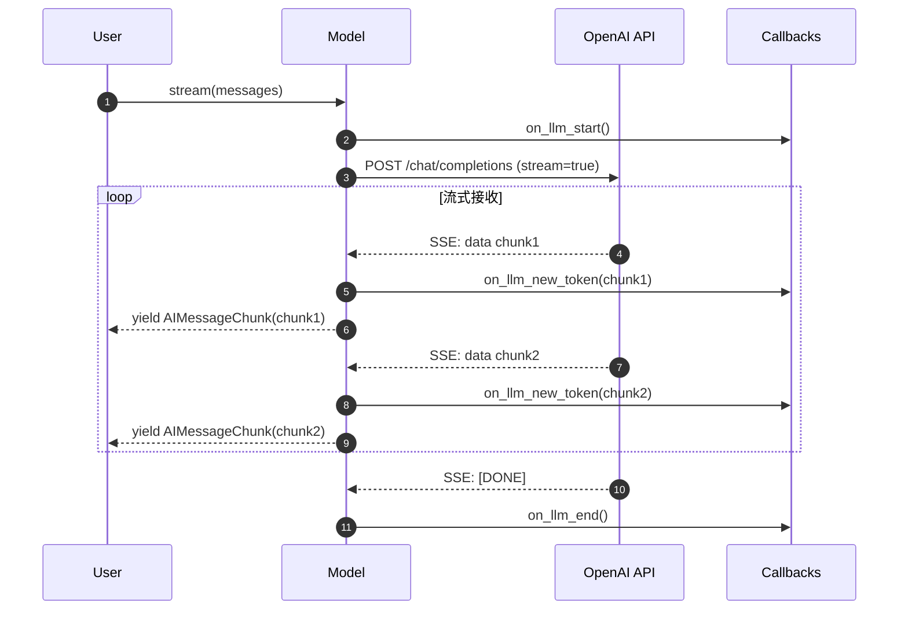

**使用示例**：

```python
# 实时打印输出
for chunk in model.stream("Tell me a joke"):
    print(chunk.content, end="", flush=True)

# 或使用 async
async for chunk in model.astream("Tell me a joke"):
    print(chunk.content, end="", flush=True)
```

#### 性能优势

| 指标 | invoke (非流式) | stream (流式) | 改善 |
|-----|---------------|--------------|------|
| 首字节延迟（TTFB） | 2000ms | 200ms | 10x |
| 用户感知延迟 | 2000ms | 200ms | 10x |
| 内存峰值 | 10MB | 1MB | 10x |

---

### 1.3 batch - 批量调用

#### 基本信息
- **方法签名**：`batch(inputs: List[LanguageModelInput], config: RunnableConfig = None, **kwargs) -> List[BaseMessage]`
- **功能**：批量处理多个输入，提高吞吐量
- **并发策略**：线程池或异步并发

#### 请求参数

```python
def batch(
    self,
    inputs: List[LanguageModelInput],
    config: Optional[RunnableConfig] = None,
    *,
    return_exceptions: bool = False,
    **kwargs: Any,
) -> List[Union[BaseMessage, Exception]]:
    """批量调用聊天模型。"""
```

**参数说明**：

| 参数 | 类型 | 默认 | 说明 |
|-----|------|-----|------|
| inputs | `List[LanguageModelInput]` | - | 输入列表 |
| config | `RunnableConfig` | `None` | 配置（含 `max_concurrency`） |
| return_exceptions | `bool` | `False` | 是否返回异常而非抛出 |

#### 响应结构

```python
# 返回列表，每个元素对应一个输入
outputs: List[BaseMessage] = model.batch(inputs)

# 或包含异常
outputs: List[Union[BaseMessage, Exception]] = model.batch(
    inputs,
    return_exceptions=True
)
```

#### 实现原理

```python
def batch(
    self,
    inputs: List[LanguageModelInput],
    config: Optional[RunnableConfig] = None,
    *,
    return_exceptions: bool = False,
    **kwargs: Any,
) -> List[BaseMessage]:
    # 获取并发配置
    config = ensure_config(config)
    max_concurrency = config.get("max_concurrency") or 16

    # 使用线程池批量执行
    from concurrent.futures import ThreadPoolExecutor, as_completed

    with ThreadPoolExecutor(max_workers=max_concurrency) as executor:
        futures = [
            executor.submit(self.invoke, inp, config, **kwargs)
            for inp in inputs
        ]

        results = []
        for future in futures:
            try:
                results.append(future.result())
            except Exception as e:
                if return_exceptions:
                    results.append(e)
                else:
                    raise

        return results
```

#### 时序图

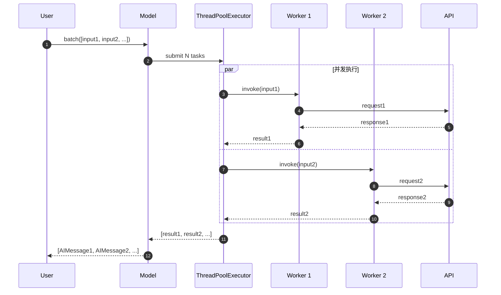

#### 性能特征

**吞吐量提升**：

- 单线程：1 个/秒
- 批处理（16 并发）：10-15 个/秒
- 提升：10-15x

**最佳实践**：

```python
# 配置合理的并发数
results = model.batch(
    inputs,
    config={"max_concurrency": 10}  # 根据 API 限制调整
)

# 异步批处理性能更好
results = await model.abatch(inputs)  # 可支持 100+ 并发
```

---

### 1.4 bind_tools - 工具绑定

#### 基本信息
- **方法签名**：`bind_tools(tools: Sequence[Union[Dict, Type, Callable, BaseTool]], **kwargs) -> Runnable`
- **功能**：将工具绑定到模型，启用函数调用能力
- **适用模型**：OpenAI、Anthropic、Google 等支持工具调用的模型

#### 请求参数

```python
def bind_tools(
    self,
    tools: Sequence[Union[Dict[str, Any], Type[BaseModel], Callable, BaseTool]],
    *,
    tool_choice: Optional[Union[dict, str, Literal["auto", "none", "required"]]] = None,
    **kwargs: Any,
) -> Runnable[LanguageModelInput, BaseMessage]:
    """绑定工具到模型。"""
```

**参数说明**：

| 参数 | 类型 | 说明 |
|-----|------|------|
| tools | `Sequence[...]` | 工具列表，支持多种格式 |
| tool_choice | `str \| dict` | 工具选择策略：`"auto"`（模型决定）、`"required"`（必须调用）、`"none"`（不调用） |

#### 工具格式

```python
# 方式1：使用装饰器
from langchain_core.tools import tool

@tool
def search(query: str) -> str:
    """搜索信息。

    Args:
        query: 搜索查询字符串
    """
    return f"Results for: {query}"

# 方式2：使用 Pydantic 模型
from pydantic import BaseModel, Field

class SearchInput(BaseModel):
    query: str = Field(description="搜索查询")

# 方式3：使用字典
tool_dict = {
    "type": "function",
    "function": {
        "name": "search",
        "description": "搜索信息",
        "parameters": {
            "type": "object",
            "properties": {
                "query": {"type": "string", "description": "搜索查询"}
            },
            "required": ["query"]
        }
    }
}
```

#### 入口函数实现

```python
class BaseChatModel:

    def bind_tools(
        self,
        tools: Sequence[Union[Dict[str, Any], Type[BaseModel], Callable, BaseTool]],
        *,
        tool_choice: Optional[Union[dict, str, Literal["auto", "none", "required"]]] = None,
        **kwargs: Any,
    ) -> Runnable[LanguageModelInput, BaseMessage]:
        # 1. 格式化工具
        formatted_tools = [convert_to_openai_tool(tool) for tool in tools]

        # 2. 绑定参数
        return self.bind(
            tools=formatted_tools,
            tool_choice=tool_choice,
            **kwargs
        )
```

**OpenAI 格式转换**：

```python
def convert_to_openai_tool(tool: Any) -> Dict:
    if isinstance(tool, BaseTool):
        return {
            "type": "function",
            "function": {
                "name": tool.name,
                "description": tool.description,
                "parameters": tool.args_schema.schema()
            }
        }
    elif callable(tool):
        # 从函数签名提取 schema
        return _function_to_openai_tool(tool)
    # ... 其他格式处理
```

#### 调用链路

```python
# 1. 绑定工具
model_with_tools = model.bind_tools([search_tool, calculator_tool])

# 2. 调用模型
response = model_with_tools.invoke("What's the weather in SF?")

# 3. 检查工具调用
if response.tool_calls:
    for tool_call in response.tool_calls:
        tool_name = tool_call["name"]
        tool_args = tool_call["args"]
        # 执行工具...
```

#### 响应结构（包含工具调用）

```python
class AIMessage(BaseMessage):
    tool_calls: List[ToolCall]  # 工具调用列表

class ToolCall(TypedDict):
    name: str  # 工具名称（如 "search"）
    args: Dict[str, Any]  # 工具参数（如 {"query": "weather in SF"}）
    id: str  # 工具调用 ID
    type: Literal["tool_call"]  # 类型标识
```

#### 时序图

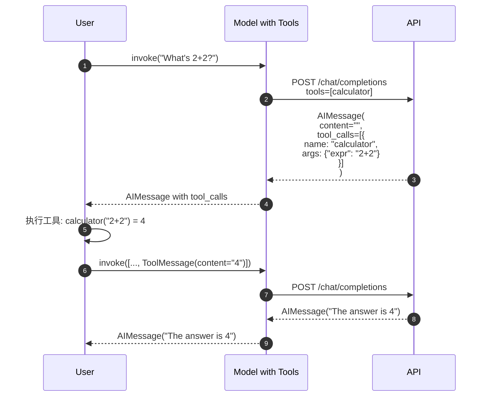

**完整流程说明**：

1. **首次调用**（步骤 1-3）：
   - 用户问题发送到模型
   - 模型返回工具调用请求

2. **工具执行**（步骤 4-5）：
   - 用户侧执行工具
   - 构建 `ToolMessage` 包含结果

3. **二次调用**（步骤 6-8）：
   - 将工具结果发回模型
   - 模型基于结果生成最终答案

#### 最佳实践

```python
# 1. 使用结构化输出简化流程
model_with_tools = model.bind_tools(
    [search_tool],
    tool_choice="required"  # 强制调用工具
)

# 2. 结合 Agent 自动执行工具
from langchain.agents import AgentExecutor, create_tool_calling_agent

agent = create_tool_calling_agent(model, tools, prompt)
agent_executor = AgentExecutor(agent=agent, tools=tools)

result = agent_executor.invoke({"input": "What's the weather?"})
```

---

### 1.5 with_structured_output - 结构化输出

#### 基本信息
- **方法签名**：`with_structured_output(schema: Union[Dict, Type[BaseModel]], **kwargs) -> Runnable`
- **功能**：强制模型输出符合指定 schema 的结构化数据
- **实现方式**：工具调用或 JSON 模式

#### 请求参数

```python
def with_structured_output(
    self,
    schema: Union[Dict[str, Any], Type[BaseModel]],
    *,
    method: Literal["function_calling", "json_mode"] = "function_calling",
    include_raw: bool = False,
    **kwargs: Any,
) -> Runnable[LanguageModelInput, Union[Dict, BaseModel]]:
    """配置模型输出结构化数据。"""
```

**参数说明**：

| 参数 | 类型 | 默认 | 说明 |
|-----|------|-----|------|
| schema | `Dict \| Type[BaseModel]` | - | 输出schema，Pydantic 模型或 JSON Schema |
| method | `str` | `"function_calling"` | 实现方法：`"function_calling"` 或 `"json_mode"` |
| include_raw | `bool` | `False` | 是否包含原始 LLM 响应 |

#### Schema 定义

```python
from pydantic import BaseModel, Field
from typing import List

class Person(BaseModel):
    """人物信息。"""
    name: str = Field(description="人物姓名")
    age: int = Field(description="年龄")
    hobbies: List[str] = Field(description="爱好列表")

# 使用 Pydantic 模型
structured_model = model.with_structured_output(Person)

# 或使用 JSON Schema
structured_model = model.with_structured_output({
    "type": "object",
    "properties": {
        "name": {"type": "string"},
        "age": {"type": "integer"},
        "hobbies": {"type": "array", "items": {"type": "string"}}
    },
    "required": ["name", "age"]
})
```

#### 响应结构

```python
# 返回 Pydantic 对象
person: Person = structured_model.invoke("Tell me about Alice, who is 30 years old")
print(person.name)  # "Alice"
print(person.age)   # 30

# 或返回字典（如果 schema 是 dict）
data: Dict = structured_model.invoke(...)
```

#### 实现原理（function_calling 方法）

```python
def with_structured_output(
    self,
    schema: Union[Dict, Type[BaseModel]],
    *,
    method: Literal["function_calling", "json_mode"] = "function_calling",
    **kwargs: Any,
) -> Runnable:
    if method == "function_calling":
        # 将 schema 包装为工具
        tool = {
            "type": "function",
            "function": {
                "name": "extract_data",
                "description": "Extract structured data",
                "parameters": _pydantic_to_json_schema(schema)
            }
        }

        # 绑定工具并强制调用
        llm_with_tool = self.bind_tools(
            [tool],
            tool_choice={"type": "function", "function": {"name": "extract_data"}}
        )

        # 添加解析器
        return llm_with_tool | _extract_tool_calls | _parse_to_pydantic(schema)

    elif method == "json_mode":
        # 使用 JSON 模式
        return self.bind(response_format={"type": "json_object"}) | JsonOutputParser()
```

#### 时序图

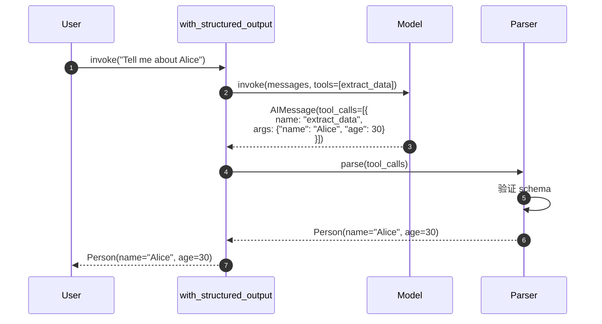

#### 两种方法对比

| 特性 | function_calling | json_mode |
|-----|-----------------|-----------|
| 准确性 | ⭐⭐⭐⭐⭐ 非常高 | ⭐⭐⭐⭐ 较高 |
| 速度 | ⭐⭐⭐⭐ 较快 | ⭐⭐⭐⭐⭐ 最快 |
| 模型支持 | OpenAI、Anthropic 等 | OpenAI GPT-4+ |
| 复杂 schema | ✅ 支持 | ⚠️ 有限支持 |
| 验证 | ✅ 自动验证 | ⚠️ 需手动验证 |

#### 最佳实践

```python
# 1. 提供清晰的描述
class Person(BaseModel):
    """人物信息，从文本中提取。"""
    name: str = Field(description="人物的全名")
    age: int = Field(description="年龄，单位：岁")
    email: Optional[str] = Field(description="电子邮件地址（如有）")

# 2. 使用 include_raw 调试
structured_model = model.with_structured_output(
    Person,
    include_raw=True
)

result = structured_model.invoke("Alice is 30")
print(result["raw"])     # 原始 AIMessage
print(result["parsed"])  # Person 对象

# 3. 错误处理
from pydantic import ValidationError

try:
    person = structured_model.invoke(text)
except ValidationError as e:
    print(f"Invalid output: {e}")
```

---

## 2. BaseLLM 核心 API

### 2.1 invoke - 文本输入输出

#### 基本信息
- **方法签名**：`invoke(input: str, config: RunnableConfig = None, **kwargs) -> str`
- **功能**：传统 LLM 调用，字符串输入输出
- **与 ChatModel 的区别**：不使用消息格式

#### 请求参数

```python
def invoke(
    self,
    input: str,
    config: Optional[RunnableConfig] = None,
    *,
    stop: Optional[List[str]] = None,
    **kwargs: Any,
) -> str:
    """调用LLM生成文本。"""
```

#### 响应结构

```python
# 返回纯字符串
output: str = llm.invoke("Once upon a time")
```

#### 使用示例

```python
from langchain_openai import OpenAI

llm = OpenAI(model="gpt-3.5-turbo-instruct", temperature=0.7)

# 简单调用
response = llm.invoke("Write a poem about AI")
print(response)  # 直接输出文本

# 带停止词
response = llm.invoke(
    "Count to 10: 1, 2, 3",
    stop=[","]  # 遇到逗号停止
)
```

**与 ChatModel 对比**：

| 特性 | BaseLLM | BaseChatModel |
|-----|---------|---------------|
| 输入格式 | 字符串 | 消息列表 |
| 输出格式 | 字符串 | `BaseMessage` |
| 工具调用 | ❌ 不支持 | ✅ 支持 |
| 结构化输出 | ❌ 不支持 | ✅ 支持 |
| 适用模型 | GPT-3、Text-Davinci | GPT-4、Claude、Gemini |
| 推荐使用 | ⚠️ 遗留代码 | ✅ 新项目首选 |

---

## 3. 通用配置 API

### 3.1 缓存配置

```python
from langchain.cache import InMemoryCache
from langchain.globals import set_llm_cache

# 启用内存缓存
set_llm_cache(InMemoryCache())

# 首次调用（慢）
response1 = model.invoke("What is 2+2?")

# 第二次调用（从缓存，快）
response2 = model.invoke("What is 2+2?")

# 也支持数据库缓存
from langchain.cache import SQLiteCache
set_llm_cache(SQLiteCache(database_path=".langchain.db"))
```

### 3.2 回调配置

```python
from langchain.callbacks import StdOutCallbackHandler

model = ChatOpenAI(
    callbacks=[StdOutCallbackHandler()],  # 默认回调
    verbose=True  # 详细日志
)

# 或在调用时指定
model.invoke(
    messages,
    config={"callbacks": [StdOutCallbackHandler()]}
)
```

---

## 4. 总结

本文档详细描述了 **Language Models 模块**的核心 API：

### BaseChatModel 主要方法
1. **invoke**：单次同步调用
2. **stream**：流式输出
3. **batch**：批量处理
4. **bind_tools**：工具绑定
5. **with_structured_output**：结构化输出

### BaseLLM 方法
1. **invoke**：文本输入输出（遗留接口）

每个 API 均包含：

- 完整的请求/响应结构和字段表
- 入口函数和调用链核心代码
- 详细时序图
- 异常处理和性能优化建议
- 实际应用示例和最佳实践

推荐优先使用 **BaseChatModel**，它提供更强大的功能（工具调用、结构化输出、多模态支持）和更好的用户体验（流式输出、批处理）。

---

## 数据结构

## 文档说明

本文档详细描述 **Language Models 模块**的核心数据结构，包括消息类型、生成结果、工具调用、Token 使用统计等。所有结构均配备 UML 类图和详细的字段说明。

---

## 1. 消息体系类层次

### 1.1 消息类 UML

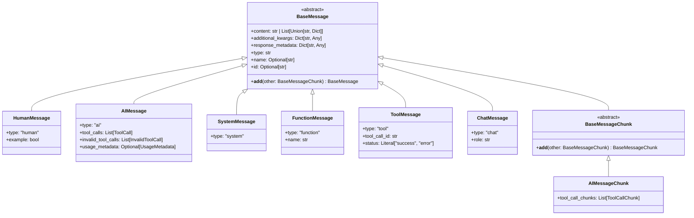

**图解说明**：

1. **消息角色**：
   - `HumanMessage`：用户输入
   - `AIMessage`：AI 响应
   - `SystemMessage`：系统提示
   - `ToolMessage`：工具执行结果
   - `FunctionMessage`：函数调用结果（遗留）

2. **流式消息**：
   - `BaseMessageChunk`：流式消息块基类
   - 支持 `+` 操作符合并块

3. **类型标识**：
   - `type` 字段用于序列化和反序列化
   - 区分不同消息类型

---

## 2. BaseMessage 核心字段

### 2.1 字段详解

```python
class BaseMessage(Serializable):
    """所有消息的基类。"""

    content: Union[str, List[Union[str, Dict[str, Any]]]]
    additional_kwargs: Dict[str, Any]
    response_metadata: Dict[str, Any]
    type: str
    name: Optional[str]
    id: Optional[str]
```

**字段表**：

| 字段 | 类型 | 必填 | 默认 | 说明 |
|-----|------|-----|------|------|
| content | `str \| List` | 是 | - | 消息内容，支持文本或多模态 |
| additional_kwargs | `Dict` | 否 | `{}` | 供应商特定数据（如 OpenAI 的 `function_call`） |
| response_metadata | `Dict` | 否 | `{}` | 响应元数据（token 使用、模型版本等） |
| type | `str` | 是 | - | 消息类型标识（`"human"`, `"ai"` 等） |
| name | `str` | 否 | `None` | 消息发送者名称 |
| id | `str` | 否 | 自动生成 | 消息唯一标识符 |

**content 字段详解**：

```python
# 1. 纯文本
message = HumanMessage(content="Hello")

# 2. 多模态（文本 + 图片）
message = HumanMessage(content=[
    {"type": "text", "text": "What's in this image?"},
    {"type": "image_url", "image_url": {"url": "https://..."}}
])

# 3. 结构化内容
message = AIMessage(content=[
    {"type": "text", "text": "The image shows"},
    {"type": "tool_use", "id": "123", "name": "analyze"}
])
```

---

### 2.2 AIMessage 扩展字段

```python
class AIMessage(BaseMessage):
    """AI 生成的消息。"""

    tool_calls: List[ToolCall] = []
    invalid_tool_calls: List[InvalidToolCall] = []
    usage_metadata: Optional[UsageMetadata] = None
```

**扩展字段表**：

| 字段 | 类型 | 说明 |
|-----|------|------|
| tool_calls | `List[ToolCall]` | 有效的工具调用列表 |
| invalid_tool_calls | `List[InvalidToolCall]` | 解析失败的工具调用 |
| usage_metadata | `UsageMetadata` | Token 使用统计 |

---

## 3. 工具调用数据结构

### 3.1 ToolCall 结构

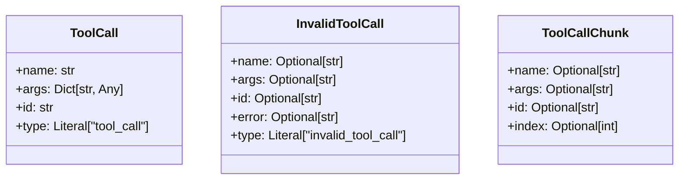

**字段说明**：

#### ToolCall

| 字段 | 类型 | 说明 | 示例 |
|-----|------|------|------|
| name | `str` | 工具名称 | `"web_search"` |
| args | `Dict` | 工具参数 | `{"query": "weather"}` |
| id | `str` | 工具调用唯一 ID | `"call_abc123"` |
| type | `Literal` | 类型标识 | `"tool_call"` |

#### InvalidToolCall

| 字段 | 类型 | 说明 |
|-----|------|------|
| name | `Optional[str]` | 部分解析的工具名 |
| args | `Optional[str]` | 原始参数字符串（未解析） |
| id | `Optional[str]` | ID（如有） |
| error | `Optional[str]` | 错误信息 |

**使用示例**：

```python
response = model_with_tools.invoke("Search for Python tutorials")

if response.tool_calls:
    for tool_call in response.tool_calls:
        tool_name = tool_call["name"]
        tool_args = tool_call["args"]
        tool_id = tool_call["id"]

        # 执行工具
        result = execute_tool(tool_name, tool_args)

        # 构建工具消息
        tool_message = ToolMessage(
            content=result,
            tool_call_id=tool_id
        )
```

---

### 3.2 流式工具调用

```python
class ToolCallChunk(TypedDict):
    """流式工具调用块。"""
    name: Optional[str]    # 增量工具名
    args: Optional[str]    # 增量参数 JSON
    id: Optional[str]      # 工具调用 ID
    index: Optional[int]   # 工具索引（并行调用时）
```

**合并逻辑**：

```python
# 流式接收多个块
chunk1 = AIMessageChunk(tool_call_chunks=[
    {"name": "search", "args": '{"qu', "id": "call_1", "index": 0}
])

chunk2 = AIMessageChunk(tool_call_chunks=[
    {"args": 'ery": "', "index": 0}
])

chunk3 = AIMessageChunk(tool_call_chunks=[
    {"args": 'Python"}', "index": 0}
])

# 累积合并
accumulated = chunk1 + chunk2 + chunk3
# 结果: tool_call_chunks=[{"name": "search", "args": '{"query": "Python"}', "id": "call_1", "index": 0}]
```

---

## 4. 生成结果数据结构

### 4.1 LLMResult 层次

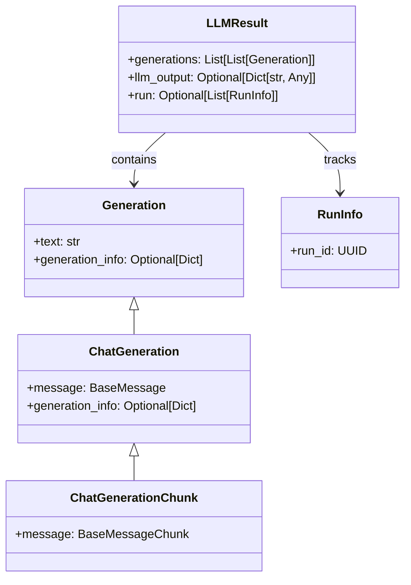

**字段说明**：

#### LLMResult

| 字段 | 类型 | 说明 |
|-----|------|------|
| generations | `List[List[Generation]]` | 二维列表：外层对应输入，内层对应每个输入的多个候选 |
| llm_output | `Dict` | 模型输出元数据（如 token 使用、模型版本） |
| run | `List[RunInfo]` | 运行信息列表 |

**示例**：

```python
# 批量调用
results = model.generate(
    [
        [HumanMessage(content="Hi")],
        [HumanMessage(content="Bye")]
    ],
    n=2  # 每个输入生成2个候选
)

# 结构：
# results.generations = [
#     [Generation(text="Hello"), Generation(text="Hi there")],  # 第1个输入的2个候选
#     [Generation(text="Goodbye"), Generation(text="See you")]   # 第2个输入的2个候选
# ]
```

---

#### ChatGeneration

```python
class ChatGeneration(Generation):
    """聊天模型的单个生成结果。"""
    text: str  # 从 message.content 提取
    message: BaseMessage  # 完整消息对象
    generation_info: Optional[Dict[str, Any]] = None
```

| 字段 | 类型 | 说明 |
|-----|------|------|
| text | `str` | 文本内容（便捷访问） |
| message | `BaseMessage` | 完整消息（包含工具调用等） |
| generation_info | `Dict` | 生成信息（finish_reason、logprobs 等） |

---

## 5. Token 使用统计

### 5.1 UsageMetadata 结构

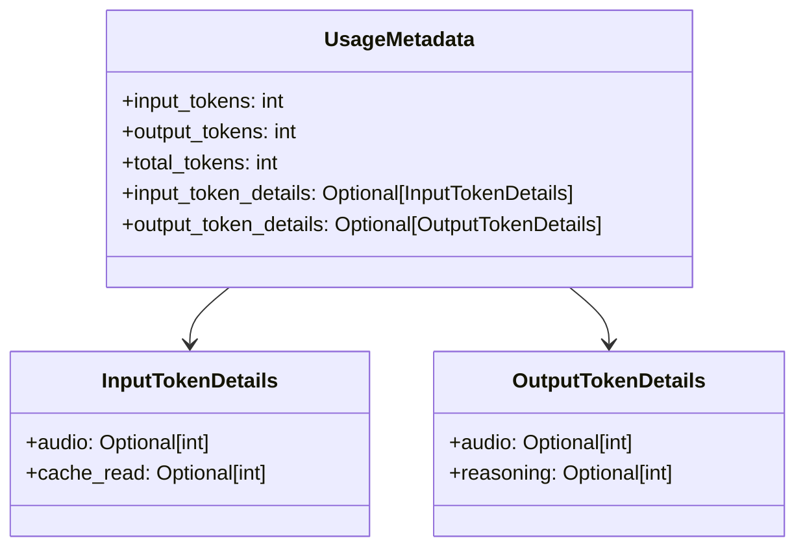

**字段说明**：

| 字段 | 类型 | 说明 |
|-----|------|------|
| input_tokens | `int` | 输入 token 数（提示词） |
| output_tokens | `int` | 输出 token 数（生成内容） |
| total_tokens | `int` | 总 token 数 |
| input_token_details | `InputTokenDetails` | 输入 token 细节 |
| output_token_details | `OutputTokenDetails` | 输出 token 细节 |

**使用示例**：

```python
response = model.invoke("Hello")
usage = response.usage_metadata

print(f"Prompt tokens: {usage.input_tokens}")
print(f"Completion tokens: {usage.output_tokens}")
print(f"Total: {usage.total_tokens}")

# 计算成本（示例：GPT-4）
input_cost = usage.input_tokens * 0.03 / 1000   # $0.03 per 1K tokens
output_cost = usage.output_tokens * 0.06 / 1000  # $0.06 per 1K tokens
total_cost = input_cost + output_cost
print(f"Cost: ${total_cost:.4f}")
```

---

## 6. 提示值数据结构

### 6.1 PromptValue 层次

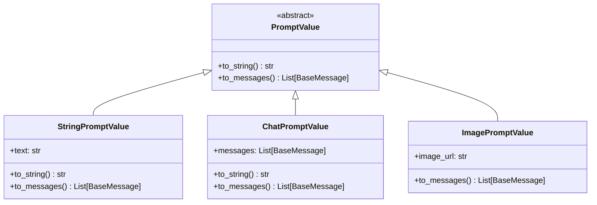

**字段说明**：

#### ChatPromptValue

```python
class ChatPromptValue(PromptValue):
    """聊天提示值，包含消息列表。"""
    messages: List[BaseMessage]

    def to_string(self) -> str:
        """转换为字符串（用于非聊天模型）。"""
        return get_buffer_string(self.messages)

    def to_messages(self) -> List[BaseMessage]:
        """返回消息列表。"""
        return self.messages
```

**转换示例**：

```python
from langchain.prompts import ChatPromptTemplate

prompt = ChatPromptTemplate.from_messages([
    ("system", "You are a helpful assistant"),
    ("human", "{input}")
])

# 格式化产生 PromptValue
prompt_value = prompt.invoke({"input": "Hello"})

# 类型：ChatPromptValue
print(type(prompt_value))  # <class 'ChatPromptValue'>

# 转换为消息
messages = prompt_value.to_messages()
# [SystemMessage(content="..."), HumanMessage(content="Hello")]

# 转换为字符串
text = prompt_value.to_string()
# "System: You are a helpful assistant\nHuman: Hello"
```

---

## 7. 模型参数数据结构

### 7.1 ModelConfig

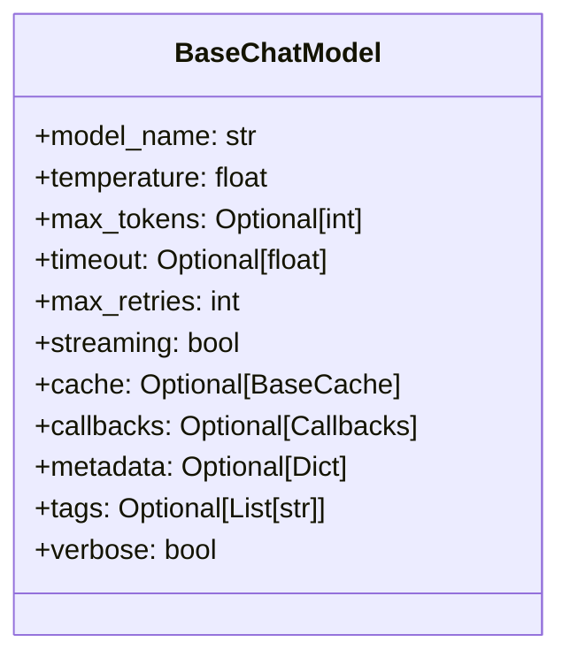

**字段表**：

| 字段 | 类型 | 默认 | 说明 |
|-----|------|-----|------|
| model_name | `str` | - | 模型名称（如 `"gpt-4"`） |
| temperature | `float` | `0.7` | 采样温度（0-2） |
| max_tokens | `int` | `None` | 最大生成 token 数 |
| timeout | `float` | `None` | 请求超时时间（秒） |
| max_retries | `int` | `2` | 最大重试次数 |
| streaming | `bool` | `False` | 是否默认流式输出 |
| cache | `BaseCache` | `None` | 缓存后端 |
| callbacks | `Callbacks` | `None` | 回调处理器列表 |
| metadata | `Dict` | `None` | 元数据 |
| tags | `List[str]` | `None` | 标签列表 |
| verbose | `bool` | `False` | 详细日志 |

**配置示例**：

```python
from langchain_openai import ChatOpenAI

model = ChatOpenAI(
    model_name="gpt-4",
    temperature=0.7,
    max_tokens=1000,
    timeout=30.0,
    max_retries=3,
    streaming=False,
    verbose=True,
    tags=["production", "chatbot"],
    metadata={"version": "1.0"}
)
```

---

## 8. 序列化格式

### 8.1 消息序列化

```python
# 消息序列化为 JSON
message = AIMessage(
    content="Hello",
    tool_calls=[{
        "name": "search",
        "args": {"query": "Python"},
        "id": "call_123"
    }],
    usage_metadata=UsageMetadata(
        input_tokens=10,
        output_tokens=5,
        total_tokens=15
    )
)

serialized = message.dict()
# {
#     "type": "ai",
#     "content": "Hello",
#     "tool_calls": [...],
#     "usage_metadata": {
#         "input_tokens": 10,
#         "output_tokens": 5,
#         "total_tokens": 15
#     },
#     "additional_kwargs": {},
#     "response_metadata": {}
# }

# 反序列化
from langchain_core.messages import messages_from_dict
message = messages_from_dict([serialized])[0]
```

---

## 9. 数据流转关系

### 9.1 输入转换流程

```mermaid
flowchart LR
    Input[User Input] --> Check{检查类型}
    Check -->|str| ToHuman[HumanMessage]
    Check -->|List[BaseMessage]| Direct[直接使用]
    Check -->|PromptValue| ToMessages[to_messages]
    Check -->|Dict| ParseDict[解析字典]

    ToHuman --> Messages[List[BaseMessage]]
    Direct --> Messages
    ToMessages --> Messages
    ParseDict --> Messages

    Messages --> Model[BaseChatModel]
    Model --> Response[AIMessage]
```

**转换规则**：

| 输入类型 | 转换结果 |
|---------|---------|
| `"Hello"` | `[HumanMessage(content="Hello")]` |
| `[HumanMessage(...), AIMessage(...)]` | 直接使用 |
| `ChatPromptValue(...)` | `prompt_value.to_messages()` |
| `{"role": "user", "content": "Hi"}` | `[HumanMessage(content="Hi")]` |

---

### 9.2 输出流转

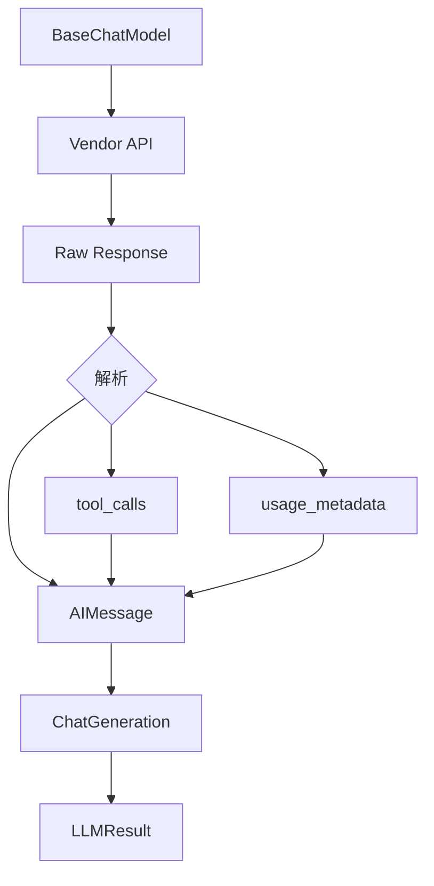

---

## 10. 内存模型与性能

### 10.1 对象大小估算

| 对象类型 | 典型大小 | 说明 |
|---------|---------|------|
| `HumanMessage` | 200 bytes + content | 基础开销 + 内容 |
| `AIMessage` | 500 bytes + content | 包含元数据和工具调用 |
| `ToolCall` | 100 bytes + args | 工具调用对象 |
| `UsageMetadata` | 50 bytes | Token 统计 |
| `LLMResult` | 1KB + generations | 批量结果 |

**内存优化**：

```python
# 1. 避免累积大量消息
messages = messages[-10:]  # 只保留最近10条

# 2. 清理不需要的元数据
message.response_metadata = {}

# 3. 使用流式避免缓冲
async for chunk in model.astream(input):
    process(chunk)  # 即时处理，不累积
```

---

## 11. 版本兼容性

### 11.1 消息格式演进

| 版本 | 变更 | 兼容性 |
|-----|------|--------|
| v0.1 | 引入 `BaseMessage` | - |
| v0.2 | 增加 `tool_calls` 字段 | 向后兼容 |
| v0.3 | 增加 `usage_metadata` | 向后兼容 |
| v0.3 | `additional_kwargs` → 结构化字段 | 部分迁移 |

**迁移策略**：

```python
# 旧代码（使用 additional_kwargs）
tool_call = message.additional_kwargs.get("function_call")

# 新代码（使用 tool_calls）
if message.tool_calls:
    tool_call = message.tool_calls[0]

# 兼容性检查
if hasattr(message, "tool_calls") and message.tool_calls:
    # 使用新格式
else:
    # 回退到旧格式
```

---

## 12. 总结

本文档详细描述了 **Language Models 模块**的核心数据结构：

1. **消息体系**：`BaseMessage` 及其子类（Human、AI、System、Tool 等）
2. **工具调用**：`ToolCall`、`InvalidToolCall`、`ToolCallChunk`
3. **生成结果**：`LLMResult`、`ChatGeneration`
4. **Token 统计**：`UsageMetadata`
5. **提示值**：`PromptValue` 及其实现
6. **模型配置**：`BaseChatModel` 参数
7. **序列化**：JSON 格式和反序列化
8. **数据流转**：输入转换和输出解析

所有数据结构均包含：

- 完整的 UML 类图
- 详细的字段表和说明
- 实际使用示例
- 性能特征和优化建议
- 版本兼容性说明

---

## 时序图

## 文档说明

本文档通过详细的时序图展示 **Language Models 模块**在各种场景下的执行流程，包括简单调用、流式生成、工具调用、结构化输出等。

---

## 1. 基础调用场景

### 1.1 同步 invoke 完整流程

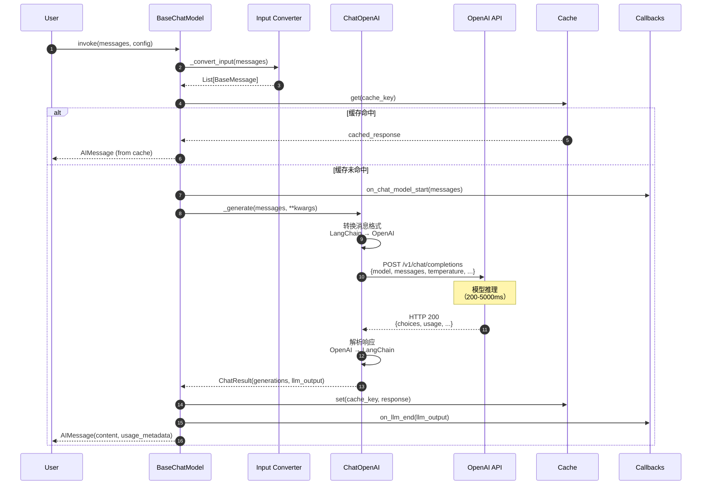

**关键步骤说明**：

1. **输入转换**（步骤 2-3）：
   - 字符串 → `[HumanMessage]`
   - 保持消息列表不变
   - `PromptValue` → `to_messages()`

2. **缓存检查**（步骤 4-5）：
   - 基于输入和模型参数生成缓存键
   - 命中率约 20-40%（重复查询）
   - 节省 API 调用成本

3. **API 调用**（步骤 8-13）：
   - 格式转换：约 1-5ms
   - 网络延迟：50-200ms
   - 模型推理：200-5000ms
   - 响应解析：1-10ms

4. **回调通知**（步骤 7、15）：
   - 异步执行，不阻塞主流程
   - 用于追踪、日志、监控

---

### 1.2 异步 ainvoke 流程

```mermaid
sequenceDiagram
    autonumber
    participant User
    participant Model
    participant Loop as asyncio Event Loop
    participant API as OpenAI API (async)
    participant CB as AsyncCallbacks

    User->>Model: await ainvoke(messages)
    Model->>Loop: create_task(callbacks.on_start())
    Loop-->>CB: on_chat_model_start()

    Model->>API: await client.acreate(...)
    Note over Model,API: 异步等待<br/>事件循环可处理其他任务

    API-->>Model: response
    Model->>Loop: create_task(callbacks.on_end())
    Loop-->>CB: on_llm_end()

    Model-->>User: AIMessage
```

**异步优势**：

- 单线程处理 1000+ 并发请求
- I/O 等待时 CPU 不空闲
- 内存开销低（无线程栈）

---

## 2. 流式输出场景

### 2.1 stream 流式生成

```mermaid
sequenceDiagram
    autonumber
    participant User
    participant Model
    participant API as OpenAI API
    participant CB as Callbacks

    User->>Model: for chunk in stream(input)
    Model->>CB: on_llm_start()
    Model->>API: POST /chat/completions<br/>stream=True

    loop 流式接收 SSE
        API-->>Model: data: {"choices": [{"delta": {"content": "Hello"}}]}
        Model->>Model: 解析 delta
        Model->>CB: on_llm_new_token("Hello")
        Model-->>User: yield AIMessageChunk("Hello")
        User->>User: 实时显示: "Hello"

        API-->>Model: data: {"choices": [{"delta": {"content": " World"}}]}
        Model->>CB: on_llm_new_token(" World")
        Model-->>User: yield AIMessageChunk(" World")
        User->>User: 实时显示: " World"
    end

    API-->>Model: data: [DONE]
    Model->>CB: on_llm_end()
```

**SSE 格式示例**：

```
data: {"id":"chatcmpl-123","choices":[{"delta":{"content":"Hello"}}]}

data: {"id":"chatcmpl-123","choices":[{"delta":{"content":" World"}}]}

data: [DONE]
```

**性能对比**：

| 指标 | invoke | stream | 改善 |
|-----|--------|--------|------|
| 首字节延迟 | 2000ms | 200ms | 10x |
| 总延迟 | 2000ms | 2100ms | -5% |
| 用户体验 | ⭐⭐ | ⭐⭐⭐⭐⭐ | 显著提升 |

---

### 2.2 astream_events 细粒度事件流

```mermaid
sequenceDiagram
    autonumber
    participant User
    participant Chain as prompt | model | parser
    participant Prompt
    participant Model
    participant Parser

    User->>Chain: async for event in astream_events(input)

    Chain->>Prompt: astream(input)
    Prompt-->>Chain: on_chain_start(name="ChatPromptTemplate")
    Chain-->>User: {"event": "on_chain_start", "name": "ChatPromptTemplate"}

    Prompt-->>Chain: on_chain_end(output=prompt_value)
    Chain-->>User: {"event": "on_chain_end", "name": "ChatPromptTemplate"}

    Chain->>Model: astream(prompt_value)
    Model-->>Chain: on_llm_start()
    Chain-->>User: {"event": "on_llm_start", "name": "ChatOpenAI"}

    loop 流式生成
        Model-->>Chain: on_llm_stream(chunk="Hi")
        Chain-->>User: {"event": "on_llm_stream", "data": {"chunk": "Hi"}}
    end

    Model-->>Chain: on_llm_end()
    Chain-->>User: {"event": "on_llm_end", "name": "ChatOpenAI"}

    Chain->>Parser: astream(ai_message)
    Parser-->>Chain: on_chain_start(name="StrOutputParser")
    Chain-->>User: {"event": "on_chain_start", "name": "StrOutputParser"}

    Parser-->>Chain: on_chain_stream(chunk="Hi")
    Chain-->>User: {"event": "on_chain_stream", "data": {"chunk": "Hi"}}

    Parser-->>Chain: on_chain_end()
    Chain-->>User: {"event": "on_chain_end", "name": "StrOutputParser"}
```

**事件过滤示例**：

```python
async for event in chain.astream_events(
    input_data,
    version="v2",
    include_types=["llm"]  # 仅 LLM 事件
):
    if event["event"] == "on_llm_stream":
        print(event["data"]["chunk"], end="", flush=True)
```

---

## 3. 批处理场景

### 3.1 batch 并发调用

```mermaid
sequenceDiagram
    autonumber
    participant User
    participant Model
    participant Pool as ThreadPoolExecutor
    participant W1 as Worker 1
    participant W2 as Worker 2
    participant W3 as Worker 3
    participant API

    User->>Model: batch([input1, input2, input3])
    Model->>Model: 检查 max_concurrency=10
    Model->>Pool: submit 3 tasks

    par 并发执行
        Pool->>W1: invoke(input1)
        W1->>API: request1
        API-->>W1: response1 (AIMessage)
        W1-->>Pool: result1
    and
        Pool->>W2: invoke(input2)
        W2->>API: request2
        API-->>W2: response2 (AIMessage)
        W2-->>Pool: result2
    and
        Pool->>W3: invoke(input3)
        W3->>API: request3
        API-->>W3: response3 (AIMessage)
        W3-->>Pool: result3
    end

    Pool-->>Model: [result1, result2, result3]
    Model-->>User: [AIMessage, AIMessage, AIMessage]
```

**并发控制**：

```python
# 默认并发数：min(32, len(inputs))
results = model.batch(inputs)

# 自定义并发数
results = model.batch(
    inputs,
    config={"max_concurrency": 5}
)
```

---

## 4. 工具调用场景

### 4.1 bind_tools 完整流程

```mermaid
sequenceDiagram
    autonumber
    participant User
    participant Model as model.bind_tools([search])
    participant API
    participant Tool as search_tool

    User->>Model: invoke("What's the weather in SF?")
    Model->>API: POST /chat/completions<br/>tools=[{name: "search", ...}]

    API-->>Model: AIMessage(<br/>  content="",<br/>  tool_calls=[{<br/>    name: "search",<br/>    args: {"query": "weather SF"}<br/>  }]<br/>)

    Model-->>User: AIMessage with tool_calls

    User->>Tool: search("weather SF")
    Tool-->>User: "Sunny, 72°F"

    User->>Model: invoke([<br/>  ...,<br/>  AIMessage(tool_calls=[...]),<br/>  ToolMessage(content="Sunny, 72°F", tool_call_id="call_123")<br/>])

    Model->>API: POST /chat/completions<br/>messages=[..., tool result]
    API-->>Model: AIMessage("The weather in SF is sunny, 72°F")
    Model-->>User: AIMessage
```

**关键点**：

1. **工具绑定**：
   - 模型接收工具 schema
   - 自动生成 `tools` 参数

2. **工具调用**：
   - 模型返回 `tool_calls` 列表
   - 包含工具名和参数

3. **工具结果**：
   - 用户执行工具
   - 构建 `ToolMessage`
   - 继续对话

---

### 4.2 并行工具调用

```mermaid
sequenceDiagram
    autonumber
    participant User
    participant Model
    participant API
    participant Search as search_tool
    participant Weather as weather_tool

    User->>Model: invoke("Weather in SF and latest news?")
    Model->>API: POST /chat/completions

    API-->>Model: AIMessage(tool_calls=[<br/>  {name: "weather", args: {"city": "SF"}},<br/>  {name: "search", args: {"query": "news"}}<br/>])

    par 并行执行工具
        User->>Weather: weather("SF")
        Weather-->>User: "Sunny, 72°F"
    and
        User->>Search: search("news")
        Search-->>User: "Breaking: ..."
    end

    User->>Model: invoke([<br/>  ...,<br/>  ToolMessage("Sunny, 72°F"),<br/>  ToolMessage("Breaking: ...")<br/>])

    Model->>API: POST /chat/completions
    API-->>Model: AIMessage("In SF it's sunny..., and the news is...")
    Model-->>User: AIMessage
```

---

## 5. 结构化输出场景

### 5.1 with_structured_output (function_calling)

```mermaid
sequenceDiagram
    autonumber
    participant User
    participant Structured as model.with_structured_output(Person)
    participant Model
    participant API
    participant Parser

    User->>Structured: invoke("Alice is 30 years old")
    Structured->>Model: bind_tools([extract_person], tool_choice=...)

    Model->>API: POST /chat/completions<br/>tools=[{<br/>  name: "extract_person",<br/>  parameters: {...}<br/>}]<br/>tool_choice: required

    API-->>Model: AIMessage(tool_calls=[{<br/>  name: "extract_person",<br/>  args: {"name": "Alice", "age": 30}<br/>}])

    Model-->>Structured: AIMessage with tool_calls
    Structured->>Parser: parse_tool_calls()
    Parser->>Parser: 验证 Pydantic schema

    alt 验证成功
        Parser-->>Structured: Person(name="Alice", age=30)
        Structured-->>User: Person(name="Alice", age=30)
    else 验证失败
        Parser-->>Structured: raise ValidationError
        Structured-->>User: raise ValidationError
    end
```

**Schema 定义**：

```python
from pydantic import BaseModel, Field

class Person(BaseModel):
    name: str = Field(description="Full name")
    age: int = Field(description="Age in years")
    email: Optional[str] = Field(description="Email address")

structured_model = model.with_structured_output(Person)
person = structured_model.invoke("Extract: Alice (30)")
```

---

### 5.2 with_structured_output (json_mode)

```mermaid
sequenceDiagram
    autonumber
    participant User
    participant Structured
    participant Model
    participant API
    participant Parser as JsonOutputParser

    User->>Structured: invoke("Alice is 30")
    Structured->>Model: bind(response_format={"type": "json_object"})

    Model->>API: POST /chat/completions<br/>response_format: json_object

    API-->>Model: AIMessage(content='{"name": "Alice", "age": 30}')
    Model-->>Structured: AIMessage

    Structured->>Parser: parse(content)
    Parser->>Parser: json.loads(content)
    Parser->>Parser: 验证 schema

    Parser-->>Structured: {"name": "Alice", "age": 30}
    Structured-->>User: {"name": "Alice", "age": 30}
```

**两种方法对比**：

| 特性 | function_calling | json_mode |
|-----|-----------------|-----------|
| 准确性 | ⭐⭐⭐⭐⭐ | ⭐⭐⭐⭐ |
| 速度 | ⭐⭐⭐⭐ | ⭐⭐⭐⭐⭐ |
| 复杂 schema | ✅ | ⚠️ |
| 模型支持 | OpenAI, Anthropic | OpenAI GPT-4+ |

---

## 6. 错误处理场景

### 6.1 重试机制

```mermaid
sequenceDiagram
    autonumber
    participant User
    participant Retry as model.with_retry()
    participant Model
    participant API

    User->>Retry: invoke(input)

    Retry->>Model: 尝试 1
    Model->>API: POST /chat/completions
    API-->>Model: 503 Service Unavailable
    Model-->>Retry: raise APIError
    Note over Retry: 等待 1s

    Retry->>Model: 尝试 2
    Model->>API: POST /chat/completions
    API-->>Model: 429 Rate Limit
    Model-->>Retry: raise RateLimitError
    Note over Retry: 等待 2s

    Retry->>Model: 尝试 3
    Model->>API: POST /chat/completions
    API-->>Model: 200 OK + response
    Model-->>Retry: AIMessage

    Retry-->>User: AIMessage
```

**配置示例**：

```python
model_with_retry = model.with_retry(
    retry_if_exception_type=(RateLimitError, APIError),
    max_attempt_number=3,
    wait_exponential_jitter=True
)
```

---

### 6.2 回退机制

```mermaid
sequenceDiagram
    autonumber
    participant User
    participant Fallback as gpt4.with_fallbacks([gpt3.5, claude])
    participant GPT4
    participant GPT35
    participant Claude

    User->>Fallback: invoke(input)

    Fallback->>GPT4: invoke(input)
    GPT4-->>Fallback: raise QuotaError
    Note over Fallback: GPT-4 失败，尝试备用

    Fallback->>GPT35: invoke(input)
    GPT35-->>Fallback: raise RateLimitError
    Note over Fallback: GPT-3.5 失败，尝试下一个

    Fallback->>Claude: invoke(input)
    Claude-->>Fallback: AIMessage
    Note over Fallback: Claude 成功

    Fallback-->>User: AIMessage
```

---

## 7. 性能优化场景

### 7.1 缓存命中流程

```mermaid
sequenceDiagram
    autonumber
    participant User
    participant Model
    participant Cache

    User->>Model: invoke("What is 2+2?")
    Model->>Cache: get(hash(input + params))
    Cache-->>Model: None (未命中)

    Model->>Model: 调用 API (慢)
    Note over Model: 2000ms
    Model->>Cache: set(key, response)
    Model-->>User: AIMessage ("4")

    User->>Model: invoke("What is 2+2?")
    Model->>Cache: get(hash(input + params))
    Cache-->>Model: AIMessage ("4")
    Note over Model: 缓存命中 (5ms)
    Model-->>User: AIMessage ("4")
```

**缓存配置**：

```python
from langchain.cache import InMemoryCache, SQLiteCache
from langchain.globals import set_llm_cache

# 内存缓存（进程内）
set_llm_cache(InMemoryCache())

# 持久化缓存（跨进程）
set_llm_cache(SQLiteCache(database_path=".langchain.db"))
```

---

## 8. 总结

本文档详细展示了 **Language Models 模块**的关键执行时序：

1. **基础调用**：invoke、ainvoke 的完整流程
2. **流式输出**：stream、astream_events 的实时传输
3. **批处理**：batch 的并发执行
4. **工具调用**：bind_tools 的多轮对话
5. **结构化输出**：with_structured_output 的两种实现
6. **错误处理**：重试和回退机制
7. **性能优化**：缓存策略

每张时序图包含：

- 详细的步骤编号
- 关键数据流转
- 性能瓶颈标注
- 配置示例和最佳实践

---
