# LangChain-05-Agents

## 模块概览

## 模块基本信息

**模块名称**: langchain-agents
**模块路径**: `libs/langchain/langchain/agents/`
**核心职责**: 实现代理（Agent）框架，通过推理-行动-观察循环让 LLM 自主选择工具和执行步骤

## 1. 模块职责

### 1.1 核心职责

Agents 模块是 LangChain 最强大的功能之一，提供以下核心能力：

1. **自主决策**: LLM 根据任务动态选择使用哪些工具
2. **推理-行动循环**: 迭代执行"思考 → 行动 → 观察 → 再思考"直到完成任务
3. **多步推理**: 将复杂任务分解为多个步骤逐步完成
4. **工具调用**: 执行外部工具并将结果反馈给 LLM
5. **错误恢复**: 处理工具执行失败，让 LLM 重新规划
6. **多种代理类型**: 支持 OpenAI Functions、ReAct、Structured Chat 等模式

### 1.2 核心概念

```
任务输入
  ↓
代理推理（LLM 决策）
  ↓
工具调用（执行操作）
  ↓
观察结果（获取反馈）
  ↓
继续推理 或 返回最终答案
```

**关键术语**:

- **Agent**: 代理核心逻辑，负责根据历史步骤决定下一步动作
- **AgentExecutor**: 代理执行器，管理推理-行动循环
- **AgentAction**: 代理决定的行动（工具名称 + 参数）
- **AgentFinish**: 代理决定的最终答案
- **AgentStep**: 单个步骤（行动 + 观察结果）
- **intermediate_steps**: 中间步骤列表，记录所有历史行动和观察

### 1.3 代理类型

| 代理类型 | 适用场景 | 工具输入格式 | 推荐度 |
|---------|---------|------------|--------|
| **OpenAI Functions Agent** | 使用 OpenAI 模型，结构化工具调用 | JSON | ⭐⭐⭐⭐⭐ |
| **OpenAI Tools Agent** | OpenAI 新版工具调用 API | JSON | ⭐⭐⭐⭐⭐ |
| **Structured Chat Agent** | 多参数工具，需要复杂输入 | JSON | ⭐⭐⭐⭐ |
| **ReAct Agent** | 通用，基于思考-行动模式 | 文本 | ⭐⭐⭐ |
| **Self-ask with Search** | 问答任务，需要搜索 | 文本 | ⭐⭐⭐ |
| **Conversational Agent** | 对话场景，带记忆 | 文本 | ⭐⭐ |

### 1.4 输入/输出

**输入**:

- **input**: 用户任务描述（字符串或字典）
- **intermediate_steps**: 历史步骤（可选，用于恢复）
- **tools**: 可用工具列表

**输出**:

- **output**: 最终答案（字符串或字典）
- **intermediate_steps**: 完整的执行步骤记录

### 1.5 上下游依赖

**上游调用者**:

- 用户应用代码
- 更高层的代理编排系统（如 LangGraph）

**下游依赖**:

- `langchain_core.tools`: 工具抽象
- `langchain_core.language_models`: LLM 调用
- `langchain_core.prompts`: 提示词构建
- `langchain_core.output_parsers`: 解析 LLM 输出
- `langchain_core.callbacks`: 回调系统

## 2. 模块级架构图

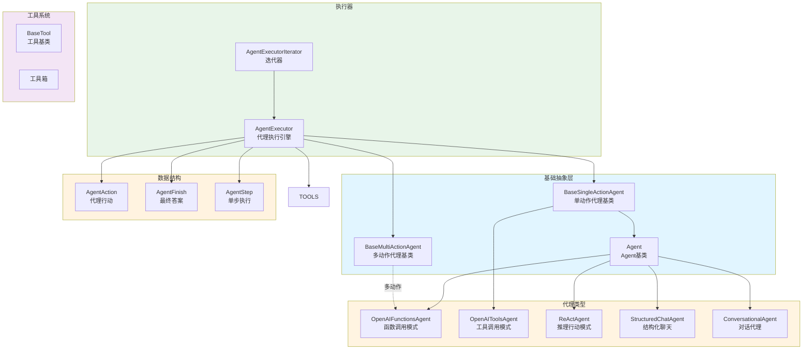
```mermaid
flowchart TB
    subgraph Base["基础抽象层"]
        BSA[BaseSingleActionAgent<br/>单动作代理基类]
        BMA[BaseMultiActionAgent<br/>多动作代理基类]
        AGENT[Agent<br/>Agent基类]
    end

    subgraph AgentTypes["代理类型"]
        OAI_FUNC[OpenAIFunctionsAgent<br/>函数调用模式]
        OAI_TOOLS[OpenAIToolsAgent<br/>工具调用模式]
        REACT[ReActAgent<br/>推理行动模式]
        STRUCT[StructuredChatAgent<br/>结构化聊天]
        CONV[ConversationalAgent<br/>对话代理]
    end

    subgraph Executor["执行器"]
        EXEC[AgentExecutor<br/>代理执行引擎]
        ITER[AgentExecutorIterator<br/>迭代器]
    end

    subgraph DataStructures["数据结构"]
        ACT[AgentAction<br/>代理行动]
        FINISH[AgentFinish<br/>最终答案]
        STEP[AgentStep<br/>单步执行]
    end

    subgraph Tools["工具系统"]
        BT[BaseTool<br/>工具基类]
        TOOLBOX[工具箱]
    end

    BSA --> AGENT
    AGENT --> OAI_FUNC
    AGENT --> REACT
    AGENT --> STRUCT
    AGENT --> CONV
    BSA --> OAI_TOOLS

    BMA -.多动作.-> OAI_FUNC

    EXEC --> BSA
    EXEC --> BMA
    EXEC --> TOOLS
    EXEC --> ACT
    EXEC --> FINISH
    EXEC --> STEP

    ITER --> EXEC

    style Base fill:#e1f5ff
    style AgentTypes fill:#fff4e1
    style Executor fill:#e8f5e9
    style DataStructures fill:#fff3e0
    style Tools fill:#f3e5f5
```

### 架构图详细说明

**1. 基础抽象层**

- **BaseSingleActionAgent**: 单动作代理基类
  - 每次推理返回单个动作或最终答案
  - 核心方法: `plan()` - 决定下一步动作
  - 大部分代理使用此模式

- **BaseMultiActionAgent**: 多动作代理基类
  - 一次推理可返回多个动作（并发执行）
  - 核心方法: `plan()` - 返回动作列表
  - 适合需要并发执行多个工具的场景

- **Agent**: 标准代理基类（继承自 `BaseSingleActionAgent`）
  - 提供提示词构建辅助方法
  - 实现输出解析逻辑
  - 是大多数代理实现的基类

**2. 代理类型实现**

- **OpenAIFunctionsAgent**:
  - 使用 OpenAI Function Calling API
  - LLM 输出结构化的工具调用指令
  - 最可靠和推荐的方式

  ```python
  # LLM 输出格式
  {
      "name": "search",
      "arguments": {"query": "LangChain"}
  }
```

- **OpenAIToolsAgent**:
  - 使用 OpenAI 新版 Tools API
  - 支持并行工具调用
  - 性能更好

- **ReActAgent**:
  - 推理（Reasoning）+ 行动（Acting）模式
  - 基于文本的思考和工具调用
  - LLM 输出格式:

```
  Thought: I need to search for information
  Action: search
  Action Input: LangChain documentation
```

- **StructuredChatAgent**:
  - 支持复杂的结构化输入
  - 工具参数可以是嵌套的 JSON
  - 适合需要多个参数的工具

- **ConversationalAgent**:
  - 为对话场景优化
  - 内置对话记忆
  - 适合聊天机器人

**3. 执行器**

- **AgentExecutor**: 核心执行引擎
  - 管理推理-行动循环
  - 控制最大迭代次数和超时
  - 处理工具执行和错误
  - 收集中间步骤

  ```python
  class AgentExecutor:
      agent: Agent  # 代理逻辑
      tools: list[BaseTool]  # 可用工具
      max_iterations: int = 15  # 最大循环次数
      max_execution_time: Optional[float] = None  # 超时
      early_stopping_method: str = "force"  # 停止策略
      return_intermediate_steps: bool = False  # 是否返回中间步骤
```

- **AgentExecutorIterator**:
  - 提供迭代器接口
  - 逐步返回每个步骤
  - 适合需要实时反馈的场景

**4. 数据结构**

- **AgentAction**: 代理决定的行动

  ```python
  @dataclass
  class AgentAction:
      tool: str  # 工具名称
      tool_input: Union[str, dict]  # 工具输入
      log: str  # LLM 原始输出日志
```

- **AgentFinish**: 代理决定的最终答案

  ```python
  @dataclass
  class AgentFinish:
      return_values: dict  # 返回值（包含 output 键）
      log: str  # LLM 原始输出日志
```

- **AgentStep**: 单个执行步骤

  ```python
  @dataclass
  class AgentStep:
      action: AgentAction  # 执行的行动
      observation: str  # 观察到的结果
```

**5. 工具系统**

代理通过工具与外部世界交互：

- 搜索引擎（Google Search、Wikipedia）
- 数据库查询（SQL、NoSQL）
- API 调用（REST、GraphQL）
- 计算工具（Calculator、Python REPL）
- 文件操作（Read、Write）

## 3. 核心 API 详解

### 3.1 AgentExecutor.invoke - 执行代理任务

**基本信息**:

- **方法**: `invoke`
- **签名**: `def invoke(self, inputs: dict[str, Any], config: Optional[RunnableConfig] = None) -> dict[str, Any]`

**功能**: 执行代理任务，进行推理-行动循环直到完成或达到限制。

**参数**:

| 参数名 | 类型 | 必填 | 说明 |
|--------|------|------|------|
| `inputs` | `dict[str, Any]` | 是 | 输入字典，通常包含 `"input"` 键 |
| `config` | `Optional[RunnableConfig]` | 否 | 运行时配置 |

**返回值**:

| 类型 | 说明 |
|------|------|
| `dict[str, Any]` | 输出字典，包含 `"output"` 键和可选的 `"intermediate_steps"` |

**核心代码**:

```python
class AgentExecutor(Chain):
    agent: BaseSingleActionAgent
    tools: list[BaseTool]
    max_iterations: int = 15
    max_execution_time: Optional[float] = None
    early_stopping_method: str = "force"
    return_intermediate_steps: bool = False

    def _call(
        self,
        inputs: dict[str, str],
        run_manager: Optional[CallbackManagerForChainRun] = None
    ) -> dict[str, Any]:
        """
        运行代理循环
        """
        # 构建工具名称到工具的映射
        name_to_tool_map = {tool.name: tool for tool in self.tools}

        # 初始化中间步骤列表
        intermediate_steps: list[tuple[AgentAction, str]] = []

        # 迭代计数器和计时器
        iterations = 0
        time_elapsed = 0.0
        start_time = time.time()

        # 代理循环
        while self._should_continue(iterations, time_elapsed):
            # 1. 代理推理：决定下一步动作
            next_step_output = self._take_next_step(
                name_to_tool_map,
                inputs,
                intermediate_steps,
                run_manager=run_manager
            )

            # 2. 检查是否完成
            if isinstance(next_step_output, AgentFinish):
                # 返回最终答案
                return self._return(
                    next_step_output,
                    intermediate_steps,
                    run_manager=run_manager
                )

            # 3. 记录中间步骤
            intermediate_steps.extend(next_step_output)

            # 4. 检查工具是否直接返回
            if len(next_step_output) == 1:
                next_step_action = next_step_output[0]
                tool_return = self._get_tool_return(next_step_action)
                if tool_return is not None:
                    return self._return(
                        tool_return,
                        intermediate_steps,
                        run_manager=run_manager
                    )

            # 更新迭代计数
            iterations += 1
            time_elapsed = time.time() - start_time

        # 达到最大迭代次数或超时
        output = self._return_stopped_response(
            self.early_stopping_method,
            intermediate_steps,
            **inputs
        )
        return self._return(output, intermediate_steps, run_manager=run_manager)

    def _take_next_step(
        self,
        name_to_tool_map: dict[str, BaseTool],
        inputs: dict[str, str],
        intermediate_steps: list[tuple[AgentAction, str]],
        run_manager: Optional[CallbackManagerForChainRun] = None
    ) -> Union[AgentFinish, list[tuple[AgentAction, str]]]:
        """
        执行单步：推理 + 工具调用
        """
        # 1. 代理推理
        output = self.agent.plan(
            intermediate_steps=intermediate_steps,
            callbacks=run_manager.get_child() if run_manager else None,
            **inputs
        )

        # 2. 如果是最终答案，直接返回
        if isinstance(output, AgentFinish):
            return output

        # 3. 执行工具
        actions = [output] if isinstance(output, AgentAction) else output
        result = []
        for agent_action in actions:
            # 获取工具
            tool = name_to_tool_map[agent_action.tool]

            # 执行工具
            observation = tool.run(
                agent_action.tool_input,
                verbose=self.verbose,
                callbacks=run_manager.get_child() if run_manager else None
            )

            # 记录步骤
            result.append((agent_action, observation))

        return result
```

**使用示例**:

```python
from langchain.agents import AgentExecutor, create_openai_functions_agent
from langchain_openai import ChatOpenAI
from langchain_core.tools import tool
from langchain_core.prompts import ChatPromptTemplate, MessagesPlaceholder

# 1. 定义工具
@tool
def search(query: str) -> str:
    """Search the web for information."""
    return f"Search results for: {query}"

@tool
def calculator(expression: str) -> str:
    """Calculate a mathematical expression."""
    try:
        return str(eval(expression))
    except:
        return "Invalid expression"

tools = [search, calculator]

# 2. 定义提示词
prompt = ChatPromptTemplate.from_messages([
    ("system", "You are a helpful assistant with access to tools."),
    ("human", "{input}"),
    MessagesPlaceholder(variable_name="agent_scratchpad")
])

# 3. 创建代理
llm = ChatOpenAI(model="gpt-4", temperature=0)
agent = create_openai_functions_agent(llm, tools, prompt)

# 4. 创建执行器
agent_executor = AgentExecutor(
    agent=agent,
    tools=tools,
    verbose=True,
    max_iterations=5,
    return_intermediate_steps=True
)

# 5. 执行任务
result = agent_executor.invoke({
    "input": "Search for LangChain and calculate 25 * 4"
})

print(result["output"])
print("\nIntermediate steps:")
for action, observation in result["intermediate_steps"]:
    print(f"Tool: {action.tool}")
    print(f"Input: {action.tool_input}")
    print(f"Output: {observation}\n")
```

### 3.2 create_openai_functions_agent - 创建函数调用代理

**基本信息**:

- **函数**: `create_openai_functions_agent`
- **签名**: `def create_openai_functions_agent(llm: BaseLanguageModel, tools: Sequence[BaseTool], prompt: ChatPromptTemplate) -> Runnable`

**功能**: 创建使用 OpenAI Function Calling 的代理。

**返回**: 一个 Runnable 代理（实际是 RunnableSequence）

**核心代码**:

```python
def create_openai_functions_agent(
    llm: BaseLanguageModel,
    tools: Sequence[BaseTool],
    prompt: ChatPromptTemplate
) -> Runnable:
    """
    创建 OpenAI Functions 代理

    要求:

    - prompt 必须包含 'agent_scratchpad' 占位符
    - llm 必须支持 bind_tools 方法
    """
    # 验证提示词
    if "agent_scratchpad" not in prompt.input_variables:
        raise ValueError("Prompt must have 'agent_scratchpad' placeholder")

    # 绑定工具到模型
    llm_with_tools = llm.bind_tools(tools)

    # 构建代理链
    agent = (
        RunnablePassthrough.assign(
            agent_scratchpad=lambda x: format_to_openai_function_messages(
                x["intermediate_steps"]
            )
        )
        | prompt
        | llm_with_tools
        | OpenAIFunctionsAgentOutputParser()
    )

    return agent

```

### 3.3 Agent.plan - 代理推理

**基本信息**:

- **方法**: `plan`（抽象方法，由子类实现）
- **签名**: `def plan(self, intermediate_steps: list[tuple[AgentAction, str]], callbacks: Callbacks = None, **kwargs: Any) -> Union[AgentAction, AgentFinish]`

**功能**: 根据历史步骤决定下一步动作或返回最终答案。

**参数**:

| 参数名 | 类型 | 说明 |
|--------|------|------|
| `intermediate_steps` | `list[tuple[AgentAction, str]]` | 历史步骤（行动-观察对） |
| `callbacks` | `Callbacks` | 回调处理器 |
| `**kwargs` | `Any` | 用户输入和其他参数 |

**返回值**:

- `AgentAction`: 下一步要执行的工具调用
- `AgentFinish`: 最终答案

**实现示例（ReActAgent）**:

```python
class ReActAgent(Agent):
    def plan(
        self,
        intermediate_steps: list[tuple[AgentAction, str]],
        callbacks: Callbacks = None,
        **kwargs: Any
    ) -> Union[AgentAction, AgentFinish]:
        """
        ReAct 代理的推理逻辑
        """
        # 1. 构建完整提示词（包含历史步骤）
        full_inputs = self.get_full_inputs(intermediate_steps, **kwargs)
        prompt = self.llm_chain.prompt.format(**full_inputs)

        # 2. 调用 LLM
        llm_output = self.llm_chain.predict(callbacks=callbacks, **full_inputs)

        # 3. 解析输出
        return self.output_parser.parse(llm_output)
```

**输出解析器**:

```python
class ReActOutputParser:
    def parse(self, text: str) -> Union[AgentAction, AgentFinish]:
        """
        解析 ReAct 格式的输出

        格式:
        Thought: <reasoning>
        Action: <tool_name>
        Action Input: <tool_input>

        或:
        Thought: <reasoning>
        Final Answer: <answer>
        """
        # 检查是否包含 Final Answer
        if "Final Answer:" in text:
            return AgentFinish(
                return_values={"output": text.split("Final Answer:")[-1].strip()},
                log=text
            )

        # 解析工具调用
        action_match = re.search(r"Action: (.*?)[\n]", text)
        action_input_match = re.search(r"Action Input: (.*)", text, re.DOTALL)

        if not action_match or not action_input_match:
            raise ValueError(f"Could not parse output: {text}")

        return AgentAction(
            tool=action_match.group(1).strip(),
            tool_input=action_input_match.group(1).strip(),
            log=text
        )
```

## 4. 核心流程时序图

### 4.1 完整代理执行流程

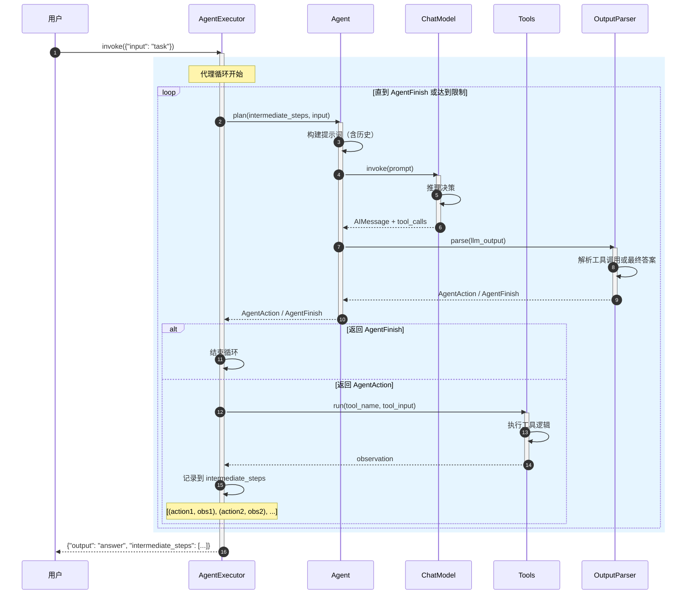
```mermaid
sequenceDiagram
    autonumber
    participant User as 用户
    participant Executor as AgentExecutor
    participant Agent as Agent
    participant LLM as ChatModel
    participant Tools as Tools
    participant Parser as OutputParser

    User->>Executor: invoke({"input": "task"})
    activate Executor

    rect rgb(230, 245, 255)
    Note over Executor: 代理循环开始

    loop 直到 AgentFinish 或达到限制
        Executor->>Agent: plan(intermediate_steps, input)
        activate Agent

        Agent->>Agent: 构建提示词（含历史）
        Agent->>LLM: invoke(prompt)
        activate LLM
        LLM->>LLM: 推理决策
        LLM-->>Agent: AIMessage + tool_calls
        deactivate LLM

        Agent->>Parser: parse(llm_output)
        activate Parser
        Parser->>Parser: 解析工具调用或最终答案
        Parser-->>Agent: AgentAction / AgentFinish
        deactivate Parser

        Agent-->>Executor: AgentAction / AgentFinish
        deactivate Agent

        alt 返回 AgentFinish
            Executor->>Executor: 结束循环
        else 返回 AgentAction
            Executor->>Tools: run(tool_name, tool_input)
            activate Tools
            Tools->>Tools: 执行工具逻辑
            Tools-->>Executor: observation
            deactivate Tools

            Executor->>Executor: 记录到 intermediate_steps
            Note over Executor: [(action1, obs1), (action2, obs2), ...]
        end
    end
    end

    Executor-->>User: {"output": "answer", "intermediate_steps": [...]}
    deactivate Executor
```

**流程详细说明**:

1. **初始化**:
   - 用户提交任务
   - 初始化 `intermediate_steps = []`
   - 设置迭代计数器和计时器

2. **代理循环**:
   - **检查终止条件**:
     - 迭代次数 < `max_iterations`（默认 15）
     - 执行时间 < `max_execution_time`（如果设置）

3. **代理推理**:
   - 构建提示词，包含:
     - 系统提示（角色、任务描述）
     - 工具描述（工具列表及用法）
     - 历史步骤（`intermediate_steps` 格式化）
     - 用户输入
   - 调用 LLM 生成决策

4. **输出解析**:
   - **OpenAI Functions**: 解析 `tool_calls` 字段
   - **ReAct**: 解析 "Action:" 和 "Action Input:"
   - **Structured Chat**: 解析 JSON 格式的动作

5. **执行分支**:
   - **AgentFinish**: 包含最终答案，结束循环
   - **AgentAction**: 包含工具调用指令，继续执行

6. **工具执行**:
   - 根据工具名称查找工具
   - 传入参数执行工具
   - 捕获执行结果（observation）
   - 处理异常（返回错误信息作为 observation）

7. **记录步骤**:
   - 将 `(AgentAction, observation)` 添加到 `intermediate_steps`
   - 下一轮推理时，LLM 可以看到所有历史

8. **终止处理**:
   - **正常终止**: LLM 返回 AgentFinish
   - **达到限制**: 返回截断响应或强制结束
   - **错误终止**: 抛出异常或返回错误

### 4.2 OpenAI Functions Agent 详细流程

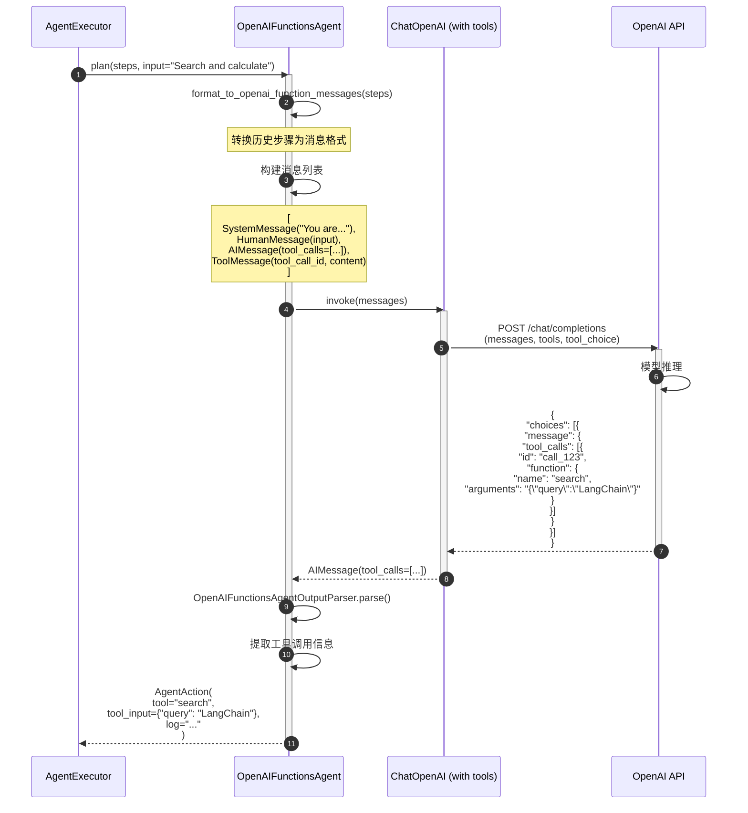
```mermaid
sequenceDiagram
    autonumber
    participant Executor as AgentExecutor
    participant Agent as OpenAIFunctionsAgent
    participant LLM as ChatOpenAI (with tools)
    participant API as OpenAI API

    Executor->>Agent: plan(steps, input="Search and calculate")
    activate Agent

    Agent->>Agent: format_to_openai_function_messages(steps)
    Note over Agent: 转换历史步骤为消息格式

    Agent->>Agent: 构建消息列表
    Note over Agent: [<br/>  SystemMessage("You are..."),<br/>  HumanMessage(input),<br/>  AIMessage(tool_calls=[...]),<br/>  ToolMessage(tool_call_id, content)<br/>]

    Agent->>LLM: invoke(messages)
    activate LLM
    LLM->>API: POST /chat/completions<br/>(messages, tools, tool_choice)
    activate API

    API->>API: 模型推理
    API-->>LLM: {<br/>  "choices": [{<br/>    "message": {<br/>      "tool_calls": [{<br/>        "id": "call_123",<br/>        "function": {<br/>          "name": "search",<br/>          "arguments": "{\"query\":\"LangChain\"}"<br/>        }<br/>      }]<br/>    }<br/>  }]<br/>}
    deactivate API

    LLM-->>Agent: AIMessage(tool_calls=[...])
    deactivate LLM

    Agent->>Agent: OpenAIFunctionsAgentOutputParser.parse()
    Agent->>Agent: 提取工具调用信息

    Agent-->>Executor: AgentAction(<br/>  tool="search",<br/>  tool_input={"query": "LangChain"},<br/>  log="..."<br/>)
    deactivate Agent
```

**OpenAI Functions 格式说明**:

**工具定义（发送给 API）**:

```json
{
  "tools": [
    {
      "type": "function",
      "function": {
        "name": "search",
        "description": "Search the web",
        "parameters": {
          "type": "object",
          "properties": {
            "query": {
              "type": "string",
              "description": "Search query"
            }
          },
          "required": ["query"]
        }
      }
    }
  ]
}
```

**API 响应（工具调用）**:

```json
{
  "choices": [{
    "message": {
      "role": "assistant",
      "content": null,
      "tool_calls": [{
        "id": "call_abc123",
        "type": "function",
        "function": {
          "name": "search",
          "arguments": "{\"query\": \"LangChain\"}"
        }
      }]
    }
  }]
}
```

**工具结果（反馈给 LLM）**:

```json
{
  "role": "tool",
  "tool_call_id": "call_abc123",
  "content": "LangChain is a framework for building LLM applications..."
}
```

### 4.3 错误处理流程

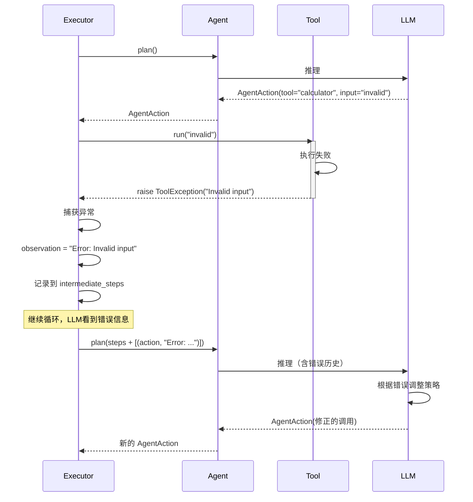
```mermaid
sequenceDiagram
    participant Executor
    participant Agent
    participant Tool
    participant LLM

    Executor->>Agent: plan()
    Agent->>LLM: 推理
    LLM-->>Agent: AgentAction(tool="calculator", input="invalid")
    Agent-->>Executor: AgentAction

    Executor->>Tool: run("invalid")
    activate Tool
    Tool->>Tool: 执行失败
    Tool-->>Executor: raise ToolException("Invalid input")
    deactivate Tool

    Executor->>Executor: 捕获异常
    Executor->>Executor: observation = "Error: Invalid input"
    Executor->>Executor: 记录到 intermediate_steps

    Note over Executor: 继续循环，LLM看到错误信息

    Executor->>Agent: plan(steps + [(action, "Error: ...")])
    Agent->>LLM: 推理（含错误历史）
    LLM->>LLM: 根据错误调整策略
    LLM-->>Agent: AgentAction(修正的调用)
    Agent-->>Executor: 新的 AgentAction
```

**错误恢复策略**:

1. **工具异常**: 捕获并将错误信息作为 observation
2. **解析失败**: 重试或返回解析错误
3. **超时**: 强制停止或返回部分结果
4. **最大迭代**: 根据 `early_stopping_method` 处理:
   - `"force"`: 返回默认响应
   - `"generate"`: 让 LLM 生成基于当前信息的答案

## 5. 配置与优化

### 5.1 关键配置参数

| 参数名 | 类型 | 默认值 | 说明 |
|--------|------|--------|------|
| `max_iterations` | `int` | `15` | 最大推理-行动循环次数 |
| `max_execution_time` | `Optional[float]` | `None` | 最大执行时间（秒） |
| `early_stopping_method` | `str` | `"force"` | 达到限制时的策略: `"force"` 或 `"generate"` |
| `return_intermediate_steps` | `bool` | `False` | 是否返回中间步骤 |
| `handle_parsing_errors` | `Union[bool, Callable]` | `False` | 如何处理解析错误 |
| `verbose` | `bool` | `False` | 是否打印详细日志 |

### 5.2 性能优化

**1. 减少迭代次数**:

```python
agent_executor = AgentExecutor(
    agent=agent,
    tools=tools,
    max_iterations=5,  # 降低上限
    verbose=True
)
```

**2. 设置超时**:

```python
agent_executor = AgentExecutor(
    agent=agent,
    tools=tools,
    max_execution_time=60.0  # 60 秒超时
)
```

**3. 优化提示词**:

```python
# ✅ 明确的指令
prompt = ChatPromptTemplate.from_messages([
    ("system", """You are a helpful assistant.
    Use tools efficiently:

    - Search for factual information
    - Calculate for math problems
    - Combine tools when needed

    Provide final answer as soon as you have enough information."""),
    ("human", "{input}"),
    MessagesPlaceholder("agent_scratchpad")

])
```

**4. 工具优化**:

```python
@tool
def search(query: str) -> str:
    """
    Search for information.

    Args:
        query: Specific search query (not too broad)

    Returns:
        Relevant information (concise)
    """
    # 返回简洁结果，避免大量文本
    results = search_api(query)
    return results[:500]  # 截断过长结果
```

## 6. 最佳实践

### 6.1 选择合适的代理类型

**使用 OpenAI Functions/Tools Agent（推荐）**:

- ✅ 最可靠和结构化
- ✅ 支持复杂工具调用
- ✅ 错误率最低
- ❌ 仅限 OpenAI 模型

**使用 ReAct Agent**:

- ✅ 通用，支持任何 LLM
- ✅ 可解释性强（显式思考过程）
- ❌ 解析可能不稳定
- ❌ 性能略低

### 6.2 工具设计原则

**1. 单一职责**:

```python
# ❌ 工具过于复杂
@tool
def do_everything(action: str, params: dict) -> str:
    if action == "search": ...
    elif action == "calculate": ...
    elif action == "translate": ...

# ✅ 每个工具专注一个功能
@tool
def search(query: str) -> str: ...

@tool
def calculate(expression: str) -> str: ...
```

**2. 清晰的描述**:

```python
@tool
def search(query: str) -> str:
    """
    Search the web for current information.

    Use this tool when you need:

    - Up-to-date facts
    - Recent news
    - Real-world data

    Args:
        query: Specific search query. Be precise.
               Example: "LangChain latest features 2024"

    Returns:
        Search results as concise text
    """

```

**3. 错误处理**:

```python
@tool
def api_call(endpoint: str) -> str:
    """Call an external API."""
    try:
        response = requests.get(endpoint, timeout=10)
        response.raise_for_status()
        return response.text
    except requests.Timeout:
        return "Error: Request timed out"
    except requests.HTTPError as e:
        return f"Error: HTTP {e.response.status_code}"
    except Exception as e:
        return f"Error: {str(e)}"
```

### 6.3 提示词工程

**包含明确指令**:

```python
system_message = """You are an assistant with access to tools.

Guidelines:

1. Use search for factual questions
2. Use calculator for math
3. Combine tools when needed
4. Provide final answer when you have enough info
5. If tools fail, explain and try alternative approach

Always explain your reasoning briefly."""
```

### 6.4 调试技巧

**启用详细日志**:

```python
agent_executor = AgentExecutor(
    agent=agent,
    tools=tools,
    verbose=True,  # 打印每步
    return_intermediate_steps=True  # 返回历史
)
```

**使用回调追踪**:

```python
from langchain.callbacks import StdOutCallbackHandler

result = agent_executor.invoke(
    {"input": "task"},
    config={"callbacks": [StdOutCallbackHandler()]}
)
```

**分析中间步骤**:

```python
result = agent_executor.invoke({"input": "task"})

print("Steps taken:")
for i, (action, observation) in enumerate(result["intermediate_steps"]):
    print(f"\nStep {i+1}:")
    print(f"  Tool: {action.tool}")
    print(f"  Input: {action.tool_input}")
    print(f"  Output: {observation[:100]}...")
```

## 7. 与其他模块的协作

- **Prompts**: 构建代理提示词
- **Language Models**: LLM 推理引擎
- **Tools**: 执行外部操作
- **Output Parsers**: 解析 LLM 输出
- **Memory**: 维护对话历史（ConversationalAgent）

## 8. 总结

Agents 是 LangChain 最强大的功能，实现了 LLM 的自主决策和多步推理能力。关键特性：

1. **推理-行动循环**: 迭代决策和执行
2. **工具编排**: 动态选择和组合工具
3. **错误恢复**: 处理失败并调整策略
4. **多种模式**: OpenAI Functions、ReAct、Structured Chat

**成功使用代理的关键**:

- 选择合适的代理类型
- 设计清晰的工具接口
- 编写明确的提示词
- 合理配置限制（迭代次数、超时）
- 充分测试和调试

---

**文档版本**: v1.0
**最后更新**: 2025-10-03
**相关文档**:

- LangChain-00-总览.md
- LangChain-03-LanguageModels-概览.md
- LangChain-04-Prompts-概览.md
- LangChain-06-Tools-概览.md（待生成）

---

## API接口

## 文档说明

本文档详细描述 **Agents 模块**的对外 API，包括 `AgentExecutor`、各种Agent类型、工具调用、推理循环等核心接口的所有公开方法、参数规格和最佳实践。

---

## 1. AgentExecutor 核心 API

### 1.1 创建 AgentExecutor

#### 基本信息
- **类名**：`AgentExecutor`
- **功能**：代理执行器，管理Agent的推理-行动循环
- **核心职责**：工具调用、步骤管理、错误处理、结果收集

#### 构造参数

```python
class AgentExecutor(Chain):
    def __init__(
        self,
        agent: Union[BaseSingleActionAgent, BaseMultiActionAgent, Runnable],
        tools: Sequence[BaseTool],
        return_intermediate_steps: bool = False,
        max_iterations: Optional[int] = 15,
        max_execution_time: Optional[float] = None,
        early_stopping_method: str = "force",
        handle_parsing_errors: Union[bool, str, Callable[[OutputParserException], str]] = False,
        trim_intermediate_steps: Union[int, Callable[[List[Tuple[AgentAction, str]]], List[Tuple[AgentAction, str]]]] = -1,
        **kwargs: Any,
    ):
        """代理执行器构造函数。"""
```

**参数说明**：

| 参数 | 类型 | 必填 | 默认 | 说明 |
|-----|------|-----|------|------|
| agent | `BaseSingleActionAgent \| BaseMultiActionAgent \| Runnable` | 是 | - | 代理实例 |
| tools | `Sequence[BaseTool]` | 是 | - | 可用工具列表 |
| return_intermediate_steps | `bool` | 否 | `False` | 是否返回中间步骤 |
| max_iterations | `int` | 否 | `15` | 最大迭代次数 |
| max_execution_time | `float` | 否 | `None` | 最大执行时间（秒） |
| early_stopping_method | `str` | 否 | `"force"` | 早停策略：`"force"` 或 `"generate"` |
| handle_parsing_errors | `Union[bool, str, Callable]` | 否 | `False` | 解析错误处理策略 |
| trim_intermediate_steps | `Union[int, Callable]` | 否 | `-1` | 中间步骤修剪策略 |

#### 使用示例

```python
from langchain.agents import AgentExecutor, create_openai_tools_agent
from langchain_openai import ChatOpenAI
from langchain_core.prompts import ChatPromptTemplate
from langchain_core.tools import tool

# 创建工具
@tool
def get_weather(city: str) -> str:
    """获取城市天气信息。"""
    return f"{city}的天气是晴天，温度25°C"

@tool
def search_web(query: str) -> str:
    """搜索网页信息。"""
    return f"关于'{query}'的搜索结果..."

tools = [get_weather, search_web]

# 创建模型
model = ChatOpenAI(model="gpt-4", temperature=0)

# 创建提示模板
prompt = ChatPromptTemplate.from_messages([
    ("system", "You are a helpful assistant"),
    ("human", "{input}"),
    ("placeholder", "{agent_scratchpad}")
])

# 创建Agent
agent = create_openai_tools_agent(model, tools, prompt)

# 创建AgentExecutor
agent_executor = AgentExecutor(
    agent=agent,
    tools=tools,
    verbose=True,
    return_intermediate_steps=True,
    max_iterations=10,
    max_execution_time=60.0
)
```

---

### 1.2 invoke - 同步执行

#### 基本信息
- **方法签名**：`invoke(inputs: Dict[str, Any], config: RunnableConfig = None) -> Dict[str, Any]`
- **功能**：执行代理推理-行动循环，返回最终结果
- **执行模式**：同步阻塞

#### 请求参数

```python
def invoke(
    self,
    inputs: Dict[str, Any],
    config: Optional[RunnableConfig] = None,
    **kwargs: Any,
) -> Dict[str, Any]:
    """同步执行代理。"""
```

**输入格式**：

| 字段 | 类型 | 必填 | 说明 |
|-----|------|-----|------|
| input | `str` | 是 | 用户问题或任务描述 |
| chat_history | `List[BaseMessage]` | 否 | 聊天历史（可选） |
| intermediate_steps | `List[Tuple[AgentAction, str]]` | 否 | 之前的中间步骤 |

#### 响应结构

```python
# 返回字典结构
{
    "input": str,                    # 原始输入
    "output": str,                   # 最终输出
    "intermediate_steps": List[      # 中间步骤（如果启用）
        Tuple[AgentAction, str]      # (动作, 观察结果)
    ]
}
```

#### 核心执行流程

```python
def invoke(self, inputs: Dict[str, Any], config: Optional[RunnableConfig] = None) -> Dict[str, Any]:
    """执行代理推理循环。"""
    # 1. 初始化
    inputs = self.prep_inputs(inputs)
    intermediate_steps: List[Tuple[AgentAction, str]] = []
    iterations = 0
    time_elapsed = 0.0
    start_time = time.time()
    
    # 2. 推理-行动循环
    while self._should_continue(iterations, time_elapsed):
        # 构建Agent输入
        agent_inputs = self._construct_scratchpad(intermediate_steps)
        agent_inputs.update(inputs)
        
        # Agent推理
        output = self.agent.plan(
            intermediate_steps=intermediate_steps,
            **agent_inputs
        )
        
        # 检查是否完成
        if isinstance(output, AgentFinish):
            return self._return(
                output,
                intermediate_steps if self.return_intermediate_steps else []
            )
        
        # 执行动作
        if isinstance(output, AgentAction):
            tool_run_kwargs = self.agent.tool_run_logging_kwargs()
            observation = self._take_action(output, **tool_run_kwargs)
            intermediate_steps.append((output, observation))
        
        iterations += 1
        time_elapsed = time.time() - start_time
    
    # 3. 达到限制时的处理
    return self._early_stopping_handler(iterations, time_elapsed, intermediate_steps)
```

#### 使用示例

```python
# 执行代理任务
result = agent_executor.invoke({
    "input": "北京的天气怎么样？如果天气好的话，推荐一些户外活动"
})

print("输入:", result["input"])
print("输出:", result["output"])

# 查看中间步骤
if "intermediate_steps" in result:
    for i, (action, observation) in enumerate(result["intermediate_steps"]):
        print(f"\n步骤 {i+1}:")
        print(f"  动作: {action.tool} - {action.tool_input}")
        print(f"  观察: {observation}")
```

---

### 1.3 stream - 流式执行

#### 基本信息
- **方法签名**：`stream(inputs: Dict[str, Any]) -> Iterator[Dict[str, Any]]`
- **功能**：流式执行代理，实时返回中间步骤
- **适用场景**：需要实时显示推理过程的应用

#### 使用示例

```python
# 流式执行
for chunk in agent_executor.stream({"input": "帮我查询天气并推荐活动"}):
    if "actions" in chunk:
        for action in chunk["actions"]:
            print(f"🤖 思考: 使用工具 {action.tool}")
            print(f"   参数: {action.tool_input}")
    
    if "steps" in chunk:
        for step in chunk["steps"]:
            print(f"📋 观察: {step.observation}")
    
    if "output" in chunk:
        print(f"✅ 最终答案: {chunk['output']}")
```

#### 流式输出格式

```python
# 流式输出的chunk格式
{
    "actions": [AgentAction],     # 当前步骤的动作
    "steps": [AgentStep],         # 完成的步骤
    "messages": [BaseMessage],    # 消息更新
    "output": str                 # 最终输出（最后一个chunk）
}
```

---

## 2. Agent创建函数 API

### 2.1 create_openai_tools_agent

#### 基本信息
- **功能**：创建使用OpenAI工具调用的Agent
- **适用场景**：GPT-4等支持工具调用的模型
- **优势**：结构化工具调用，准确性高

#### 方法签名

```python
def create_openai_tools_agent(
    llm: BaseChatModel,
    tools: Sequence[BaseTool],
    prompt: ChatPromptTemplate,
    *,
    tools_renderer: ToolsRenderer = render_text_description,
    **kwargs: Any,
) -> Runnable[Union[Dict, BaseMessage], Union[AgentAction, AgentFinish]]:
    """创建OpenAI工具Agent。"""
```

#### 参数说明

| 参数 | 类型 | 必填 | 说明 |
|-----|------|-----|------|
| llm | `BaseChatModel` | 是 | 支持工具调用的聊天模型 |
| tools | `Sequence[BaseTool]` | 是 | 可用工具列表 |
| prompt | `ChatPromptTemplate` | 是 | 提示模板 |
| tools_renderer | `ToolsRenderer` | 否 | 工具描述渲染器 |

#### 提示模板要求

```python
# 必须包含的占位符
prompt = ChatPromptTemplate.from_messages([
    ("system", "You are a helpful assistant"),
    ("human", "{input}"),
    ("placeholder", "{agent_scratchpad}")  # 必需：中间步骤占位符
])
```

#### 使用示例

```python
from langchain.agents import create_openai_tools_agent, AgentExecutor
from langchain_openai import ChatOpenAI
from langchain_core.prompts import ChatPromptTemplate

# 模型（必须支持工具调用）
llm = ChatOpenAI(model="gpt-4", temperature=0)

# 工具
tools = [get_weather, search_web]

# 提示模板
prompt = ChatPromptTemplate.from_messages([
    ("system", "You are a helpful assistant that can use tools to answer questions."),
    ("human", "{input}"),
    ("placeholder", "{agent_scratchpad}")
])

# 创建Agent
agent = create_openai_tools_agent(llm, tools, prompt)

# 创建执行器
agent_executor = AgentExecutor(agent=agent, tools=tools, verbose=True)

# 使用
result = agent_executor.invoke({"input": "北京天气如何？"})
```

---

### 2.2 create_react_agent

#### 基本信息
- **功能**：创建ReAct（推理+行动）风格的Agent
- **适用场景**：不支持工具调用的模型，通过文本生成控制
- **特点**：使用思考-行动-观察的循环模式

#### 方法签名

```python
def create_react_agent(
    llm: BaseLanguageModel,
    tools: Sequence[BaseTool],
    prompt: BasePromptTemplate,
    *,
    tools_renderer: ToolsRenderer = render_text_description,
    stop_sequence: Optional[List[str]] = None,
    **kwargs: Any,
) -> AgentExecutor:
    """创建ReAct Agent。"""
```

#### ReAct提示模板示例

```python
from langchain import hub

# 使用Hub中的ReAct提示模板
prompt = hub.pull("hwchase17/react")

# 自定义ReAct提示模板
custom_prompt = PromptTemplate.from_template("""
Answer the following questions as best you can. You have access to the following tools:

{tools}

Use the following format:

Question: the input question you must answer
Thought: you should always think about what to do
Action: the action to take, should be one of [{tool_names}]
Action Input: the input to the action
Observation: the result of the action
... (this Thought/Action/Action Input/Observation can repeat N times)
Thought: I now know the final answer
Final Answer: the final answer to the original input question

Begin!

Question: {input}
Thought: {agent_scratchpad}
""")
```

#### 使用示例

```python
from langchain.agents import create_react_agent, AgentExecutor
from langchain_openai import OpenAI  # 注意：使用传统LLM

# 传统LLM模型
llm = OpenAI(temperature=0)

# 创建ReAct Agent
agent = create_react_agent(llm, tools, prompt)
agent_executor = AgentExecutor(agent=agent, tools=tools, verbose=True)

# 使用
result = agent_executor.invoke({"input": "What's the weather in Beijing?"})
```

---

### 2.3 create_structured_chat_agent

#### 基本信息
- **功能**：创建结构化聊天Agent，支持复杂输入格式
- **适用场景**：需要结构化工具输入的复杂任务
- **特点**：JSON格式的工具调用

#### 使用示例

```python
from langchain.agents import create_structured_chat_agent

# 结构化工具示例
@tool
def complex_search(query: str, filters: dict, max_results: int = 10) -> str:
    """复杂搜索工具，支持结构化参数。"""
    return f"搜索'{query}'，过滤器：{filters}，结果数：{max_results}"

# 创建结构化Agent
agent = create_structured_chat_agent(llm, tools, prompt)
```

---

## 3. Agent动作数据结构 API

### 3.1 AgentAction

#### 基本信息
- **功能**：表示Agent决定执行的动作
- **用途**：工具调用的标准化表示

#### 数据结构

```python
class AgentAction(NamedTuple):
    """Agent动作。"""
    tool: str                    # 工具名称
    tool_input: Union[str, Dict] # 工具输入
    log: str                     # 推理日志
    
    # 可选字段
    message_log: List[BaseMessage] = []  # 消息日志
    tool_call_id: Optional[str] = None   # 工具调用ID
```

#### 创建示例

```python
# 创建Agent动作
action = AgentAction(
    tool="get_weather",
    tool_input={"city": "Beijing"},
    log="我需要查询北京的天气信息"
)

# 访问字段
print(f"工具: {action.tool}")
print(f"输入: {action.tool_input}")
print(f"推理: {action.log}")
```

---

### 3.2 AgentFinish

#### 基本信息
- **功能**：表示Agent完成任务的最终结果
- **用途**：推理循环的终止条件

#### 数据结构

```python
class AgentFinish(NamedTuple):
    """Agent完成。"""
    return_values: Dict[str, Any]  # 返回值
    log: str                       # 推理日志
    
    # 可选字段
    message_log: List[BaseMessage] = []  # 消息日志
```

#### 使用示例

```python
# Agent完成
finish = AgentFinish(
    return_values={"output": "北京今天天气晴朗，温度25°C，适合户外活动"},
    log="我已经获取了天气信息并给出了建议"
)
```

---

### 3.3 AgentStep

#### 基本信息
- **功能**：表示Agent执行的完整步骤（动作+观察）
- **用途**：记录推理过程的历史

#### 数据结构

```python
class AgentStep(NamedTuple):
    """Agent步骤。"""
    action: AgentAction  # 执行的动作
    observation: str     # 观察结果
```

---

## 4. 错误处理 API

### 4.1 解析错误处理

#### 配置选项

```python
# 1. 忽略解析错误
agent_executor = AgentExecutor(
    agent=agent,
    tools=tools,
    handle_parsing_errors=False  # 抛出异常
)

# 2. 返回默认错误消息
agent_executor = AgentExecutor(
    agent=agent,
    tools=tools,
    handle_parsing_errors=True  # 返回 "Invalid Format"
)

# 3. 自定义错误消息
agent_executor = AgentExecutor(
    agent=agent,
    tools=tools,
    handle_parsing_errors="解析失败，请重新格式化输出"
)

# 4. 自定义错误处理函数
def custom_error_handler(error: OutputParserException) -> str:
    return f"解析错误: {error}，请使用正确的格式"

agent_executor = AgentExecutor(
    agent=agent,
    tools=tools,
    handle_parsing_errors=custom_error_handler
)
```

---

### 4.2 工具调用错误处理

#### 工具错误处理策略

```python
# 在工具中使用ToolException
from langchain_core.tools import ToolException

@tool
def risky_tool(input_data: str) -> str:
    """可能出错的工具。"""
    if not input_data:
        raise ToolException("输入不能为空")
    
    try:
        result = process_data(input_data)
        return result
    except Exception as e:
        raise ToolException(f"处理失败: {e}")

# Agent会捕获ToolException并继续执行
```

---

## 5. 性能优化 API

### 5.1 中间步骤修剪

#### 配置选项

```python
# 1. 保留最后N个步骤
agent_executor = AgentExecutor(
    agent=agent,
    tools=tools,
    trim_intermediate_steps=5  # 只保留最后5个步骤
)

# 2. 自定义修剪函数
def custom_trim(steps: List[Tuple[AgentAction, str]]) -> List[Tuple[AgentAction, str]]:
    """保留重要步骤，移除冗余信息。"""
    important_steps = []
    for action, observation in steps:
        # 保留工具调用步骤
        if action.tool in ["search", "calculate"]:
            important_steps.append((action, observation[:200]))  # 截断观察
    return important_steps[-3:]  # 最多保留3个重要步骤

agent_executor = AgentExecutor(
    agent=agent,
    tools=tools,
    trim_intermediate_steps=custom_trim
)
```

---

### 5.2 早停策略

#### 配置选项

```python
# 强制停止（默认）
agent_executor = AgentExecutor(
    agent=agent,
    tools=tools,
    early_stopping_method="force",  # 达到限制时强制返回
    max_iterations=10
)

# 生成式停止
agent_executor = AgentExecutor(
    agent=agent,
    tools=tools,
    early_stopping_method="generate",  # 让Agent生成最终答案
    max_iterations=10
)
```

---

## 6. 高级用法 API

### 6.1 自定义Agent

#### 继承BaseSingleActionAgent

```python
from langchain.agents import BaseSingleActionAgent

class CustomAgent(BaseSingleActionAgent):
    """自定义Agent实现。"""
    
    def __init__(self, llm: BaseLanguageModel, tools: List[BaseTool]):
        self.llm = llm
        self.tools = tools
        self.tool_names = [tool.name for tool in tools]
    
    def plan(
        self,
        intermediate_steps: List[Tuple[AgentAction, str]],
        **kwargs: Any,
    ) -> Union[AgentAction, AgentFinish]:
        """规划下一步动作。"""
        # 构建提示
        prompt = self._construct_prompt(intermediate_steps, **kwargs)
        
        # LLM推理
        response = self.llm.predict(prompt)
        
        # 解析响应
        return self._parse_response(response)
    
    def _construct_prompt(self, steps: List[Tuple[AgentAction, str]], **kwargs) -> str:
        """构建提示。"""
        # 自定义提示构建逻辑
        pass
    
    def _parse_response(self, response: str) -> Union[AgentAction, AgentFinish]:
        """解析LLM响应。"""
        # 自定义解析逻辑
        pass
    
    @property
    def input_keys(self) -> List[str]:
        return ["input"]
    
    @property
    def return_values(self) -> List[str]:
        return ["output"]
```

---

## 7. 总结

本文档详细描述了 **Agents 模块**的核心 API：

### 主要组件
1. **AgentExecutor**：代理执行器，管理推理循环
2. **Agent创建函数**：create_openai_tools_agent、create_react_agent等
3. **数据结构**：AgentAction、AgentFinish、AgentStep
4. **错误处理**：解析错误、工具错误的处理策略
5. **性能优化**：中间步骤修剪、早停策略

### 核心方法
1. **invoke/stream**：同步/流式执行代理
2. **工具调用**：结构化工具调用和错误处理
3. **推理循环**：思考-行动-观察的完整流程

每个 API 均包含：

- 完整的请求/响应结构
- 详细的参数说明和配置选项
- 实际使用示例和最佳实践
- 错误处理和性能优化建议

Agent系统是LangChain最复杂的模块之一，正确理解和使用这些API对构建智能代理应用至关重要。

---

## 数据结构

## 文档说明

本文档详细描述 **Agents 模块**的核心数据结构，包括Agent类层次、执行状态、动作表示、工具管理、推理循环等。所有结构均配备 UML 类图和详细的字段说明。

---

## 1. Agent 类层次结构

### 1.1 Agent 基类层次

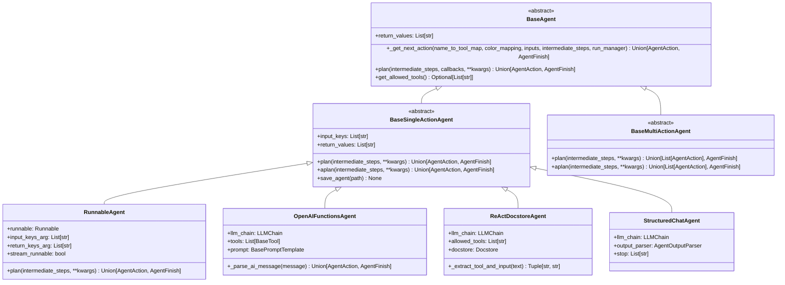
```mermaid
classDiagram
    class BaseAgent {
        <<abstract>>
        +return_values: List[str]
        +_get_next_action(name_to_tool_map, color_mapping, inputs, intermediate_steps, run_manager) Union[AgentAction, AgentFinish]
        +plan(intermediate_steps, callbacks, **kwargs) Union[AgentAction, AgentFinish]
        +get_allowed_tools() Optional[List[str]]
    }

    class BaseSingleActionAgent {
        <<abstract>>
        +plan(intermediate_steps, **kwargs) Union[AgentAction, AgentFinish]
        +aplan(intermediate_steps, **kwargs) Union[AgentAction, AgentFinish]
        +input_keys: List[str]
        +return_values: List[str]
        +save_agent(path) None
    }

    class BaseMultiActionAgent {
        <<abstract>>
        +plan(intermediate_steps, **kwargs) Union[List[AgentAction], AgentFinish]
        +aplan(intermediate_steps, **kwargs) Union[List[AgentAction], AgentFinish]
    }

    class RunnableAgent {
        +runnable: Runnable
        +input_keys_arg: List[str]
        +return_keys_arg: List[str]
        +stream_runnable: bool
        +plan(intermediate_steps, **kwargs) Union[AgentAction, AgentFinish]
    }

    class OpenAIFunctionsAgent {
        +llm_chain: LLMChain
        +tools: List[BaseTool]
        +prompt: BasePromptTemplate
        +_parse_ai_message(message) Union[AgentAction, AgentFinish]
    }

    class ReActDocstoreAgent {
        +llm_chain: LLMChain
        +allowed_tools: List[str]
        +docstore: Docstore
        +_extract_tool_and_input(text) Tuple[str, str]
    }

    class StructuredChatAgent {
        +llm_chain: LLMChain
        +output_parser: AgentOutputParser
        +stop: List[str]
    }

    BaseAgent <|-- BaseSingleActionAgent
    BaseAgent <|-- BaseMultiActionAgent
    BaseSingleActionAgent <|-- RunnableAgent
    BaseSingleActionAgent <|-- OpenAIFunctionsAgent
    BaseSingleActionAgent <|-- ReActDocstoreAgent
    BaseSingleActionAgent <|-- StructuredChatAgent
```

**图解说明**：

1. **抽象基类**：
   - `BaseAgent`：所有Agent的根基类
   - `BaseSingleActionAgent`：单动作Agent（每次返回一个动作）
   - `BaseMultiActionAgent`：多动作Agent（每次返回多个动作）

2. **具体实现**：
   - `RunnableAgent`：基于Runnable的现代Agent
   - `OpenAIFunctionsAgent`：使用OpenAI函数调用
   - `ReActDocstoreAgent`：ReAct模式的文档存储Agent
   - `StructuredChatAgent`：结构化聊天Agent

3. **核心方法**：
   - `plan()`：规划下一步动作的核心方法
   - `_parse_ai_message()`：解析AI消息为动作

---

## 2. AgentExecutor 数据结构

### 2.1 核心字段

```python
class AgentExecutor(Chain):
    """Agent执行器，管理推理-行动循环。"""
    
    agent: Union[BaseSingleActionAgent, BaseMultiActionAgent, Runnable]
    tools: Sequence[BaseTool]
    return_intermediate_steps: bool = False
    max_iterations: Optional[int] = 15
    max_execution_time: Optional[float] = None
    early_stopping_method: str = "force"
    handle_parsing_errors: Union[bool, str, Callable[[OutputParserException], str]] = False
    trim_intermediate_steps: Union[int, Callable[[List[Tuple[AgentAction, str]]], List[Tuple[AgentAction, str]]]] = -1
    
    # 内部状态
    _intermediate_steps: List[Tuple[AgentAction, str]]
    _iterations: int = 0
    _time_elapsed: float = 0.0
```

**字段表**：

| 字段 | 类型 | 必填 | 默认 | 说明 |
|-----|------|-----|------|------|
| agent | `Union[BaseSingleActionAgent, BaseMultiActionAgent, Runnable]` | 是 | - | Agent实例 |
| tools | `Sequence[BaseTool]` | 是 | - | 可用工具列表 |
| return_intermediate_steps | `bool` | 否 | `False` | 是否返回中间步骤 |
| max_iterations | `int` | 否 | `15` | 最大迭代次数 |
| max_execution_time | `float` | 否 | `None` | 最大执行时间（秒） |
| early_stopping_method | `str` | 否 | `"force"` | 早停方法：`"force"` 或 `"generate"` |
| handle_parsing_errors | `Union[bool, str, Callable]` | 否 | `False` | 解析错误处理策略 |
| trim_intermediate_steps | `Union[int, Callable]` | 否 | `-1` | 中间步骤修剪策略 |

### 2.2 执行状态管理

```python
class AgentExecutionState:
    """Agent执行状态。"""
    
    def __init__(self):
        self.intermediate_steps: List[Tuple[AgentAction, str]] = []
        self.iterations: int = 0
        self.time_elapsed: float = 0.0
        self.start_time: float = time.time()
        self.is_finished: bool = False
        self.final_output: Optional[AgentFinish] = None
        self.error: Optional[Exception] = None
    
    def add_step(self, action: AgentAction, observation: str) -> None:
        """添加执行步骤。"""
        self.intermediate_steps.append((action, observation))
        self.iterations += 1
        self.time_elapsed = time.time() - self.start_time
    
    def should_continue(self, max_iterations: int, max_time: float) -> bool:
        """检查是否应该继续执行。"""
        if self.is_finished:
            return False
        
        if max_iterations and self.iterations >= max_iterations:
            return False
        
        if max_time and self.time_elapsed >= max_time:
            return False
        
        return True
    
    def get_execution_info(self) -> Dict[str, Any]:
        """获取执行信息。"""
        return {
            "iterations": self.iterations,
            "time_elapsed": self.time_elapsed,
            "steps_count": len(self.intermediate_steps),
            "is_finished": self.is_finished,
            "has_error": self.error is not None
        }
```

---

## 3. Agent 动作数据结构

### 3.1 动作类型层次

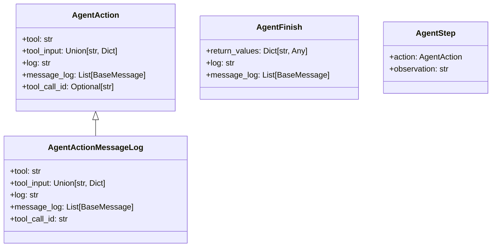
```mermaid
classDiagram
    class AgentAction {
        +tool: str
        +tool_input: Union[str, Dict]
        +log: str
        +message_log: List[BaseMessage]
        +tool_call_id: Optional[str]
    }

    class AgentActionMessageLog {
        +tool: str
        +tool_input: Union[str, Dict]
        +log: str
        +message_log: List[BaseMessage]
        +tool_call_id: str
    }

    class AgentFinish {
        +return_values: Dict[str, Any]
        +log: str
        +message_log: List[BaseMessage]
    }

    class AgentStep {
        +action: AgentAction
        +observation: str
    }

    AgentAction <|-- AgentActionMessageLog
```

**字段详解**：

#### AgentAction

```python
class AgentAction(NamedTuple):
    """Agent决定执行的动作。"""
    tool: str                           # 工具名称
    tool_input: Union[str, Dict]        # 工具输入参数
    log: str                           # 推理过程日志
    message_log: List[BaseMessage] = [] # 消息历史
    tool_call_id: Optional[str] = None  # 工具调用ID（用于追踪）
```

**字段说明**：

| 字段 | 类型 | 说明 |
|-----|------|------|
| tool | `str` | 要调用的工具名称，必须在可用工具列表中 |
| tool_input | `Union[str, Dict]` | 工具输入，可以是字符串或结构化字典 |
| log | `str` | Agent的推理过程记录 |
| message_log | `List[BaseMessage]` | 完整的消息交互历史 |
| tool_call_id | `str` | 工具调用的唯一标识符 |

#### AgentFinish

```python
class AgentFinish(NamedTuple):
    """Agent完成任务的最终结果。"""
    return_values: Dict[str, Any]       # 返回值字典
    log: str                           # 推理过程日志
    message_log: List[BaseMessage] = [] # 消息历史
```

**使用示例**：

```python
# 创建Agent动作
action = AgentAction(
    tool="web_search",
    tool_input={"query": "LangChain tutorials", "max_results": 5},
    log="I need to search for LangChain tutorials to help the user",
    tool_call_id="call_abc123"
)

# 创建Agent完成
finish = AgentFinish(
    return_values={
        "output": "Based on my search, here are the best LangChain tutorials..."
    },
    log="I have found the information requested and can provide a comprehensive answer"
)

# 创建Agent步骤
step = AgentStep(
    action=action,
    observation="Found 5 tutorials about LangChain on various websites..."
)
```

---

## 4. 工具管理数据结构

### 4.1 工具名称映射

```python
class ToolNameMapping:
    """工具名称映射管理。"""
    
    def __init__(self, tools: Sequence[BaseTool]):
        self.tools = tools
        self.name_to_tool_map = {tool.name: tool for tool in tools}
        self.tool_names = list(self.name_to_tool_map.keys())
    
    def get_tool(self, name: str) -> Optional[BaseTool]:
        """根据名称获取工具。"""
        return self.name_to_tool_map.get(name)
    
    def validate_tool_name(self, name: str) -> bool:
        """验证工具名称是否有效。"""
        return name in self.name_to_tool_map
    
    def get_tool_description(self, name: str) -> str:
        """获取工具描述。"""
        tool = self.get_tool(name)
        return tool.description if tool else f"Unknown tool: {name}"
    
    def to_dict(self) -> Dict[str, str]:
        """转换为字典格式。"""
        return {
            name: tool.description
            for name, tool in self.name_to_tool_map.items()
        }
```

### 4.2 工具调用结果

```python
class ToolCallResult:
    """工具调用结果。"""
    
    def __init__(
        self,
        tool_name: str,
        tool_input: Union[str, Dict],
        result: Any,
        execution_time: float,
        success: bool = True,
        error: Optional[Exception] = None
    ):
        self.tool_name = tool_name
        self.tool_input = tool_input
        self.result = result
        self.execution_time = execution_time
        self.success = success
        self.error = error
        self.timestamp = time.time()
    
    def to_observation(self) -> str:
        """转换为观察字符串。"""
        if self.success:
            return str(self.result)
        else:
            return f"Error: {self.error}"
    
    def to_dict(self) -> Dict[str, Any]:
        """转换为字典。"""
        return {
            "tool_name": self.tool_name,
            "tool_input": self.tool_input,
            "result": self.result,
            "execution_time": self.execution_time,
            "success": self.success,
            "error": str(self.error) if self.error else None,
            "timestamp": self.timestamp
        }
```

---

## 5. 推理循环数据结构

### 5.1 循环状态机

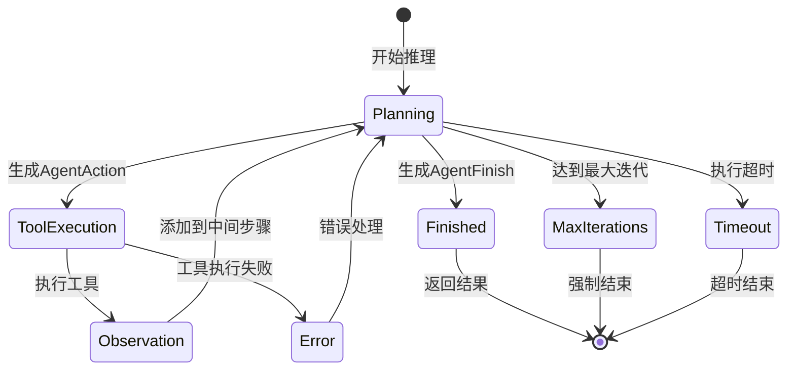
```mermaid
stateDiagram-v2
    [*] --> Planning: 开始推理
    Planning --> ToolExecution: 生成AgentAction
    Planning --> Finished: 生成AgentFinish
    ToolExecution --> Observation: 执行工具
    Observation --> Planning: 添加到中间步骤
    ToolExecution --> Error: 工具执行失败
    Error --> Planning: 错误处理
    Finished --> [*]: 返回结果
    Planning --> MaxIterations: 达到最大迭代
    Planning --> Timeout: 执行超时
    MaxIterations --> [*]: 强制结束
    Timeout --> [*]: 超时结束
```

### 5.2 推理循环控制器

```python
class ReasoningLoopController:
    """推理循环控制器。"""
    
    def __init__(
        self,
        agent: Union[BaseSingleActionAgent, BaseMultiActionAgent],
        tools: Sequence[BaseTool],
        max_iterations: int = 15,
        max_execution_time: Optional[float] = None
    ):
        self.agent = agent
        self.tools = tools
        self.max_iterations = max_iterations
        self.max_execution_time = max_execution_time
        self.tool_mapping = ToolNameMapping(tools)
        
    def execute_loop(self, inputs: Dict[str, Any]) -> Dict[str, Any]:
        """执行推理循环。"""
        state = AgentExecutionState()
        
        while state.should_continue(self.max_iterations, self.max_execution_time or float('inf')):
            try:
                # Agent推理
                next_step = self.agent.plan(
                    intermediate_steps=state.intermediate_steps,
                    **inputs
                )
                
                # 检查是否完成
                if isinstance(next_step, AgentFinish):
                    state.final_output = next_step
                    state.is_finished = True
                    break
                
                # 执行动作
                if isinstance(next_step, AgentAction):
                    observation = self._execute_action(next_step)
                    state.add_step(next_step, observation)
                
            except Exception as e:
                state.error = e
                if not self._handle_error(e, state):
                    break
        
        return self._build_result(state, inputs)
    
    def _execute_action(self, action: AgentAction) -> str:
        """执行Agent动作。"""
        tool = self.tool_mapping.get_tool(action.tool)
        if not tool:
            return f"Error: Tool '{action.tool}' not found"
        
        try:
            start_time = time.time()
            result = tool.invoke(action.tool_input)
            execution_time = time.time() - start_time
            
            # 记录工具调用结果
            call_result = ToolCallResult(
                tool_name=action.tool,
                tool_input=action.tool_input,
                result=result,
                execution_time=execution_time,
                success=True
            )
            
            return call_result.to_observation()
            
        except Exception as e:
            call_result = ToolCallResult(
                tool_name=action.tool,
                tool_input=action.tool_input,
                result=None,
                execution_time=0.0,
                success=False,
                error=e
            )
            return call_result.to_observation()
```

---

## 6. 提示构建数据结构

### 6.1 Scratchpad 管理器

```python
class AgentScratchpadManager:
    """Agent草稿纸管理器，构建中间步骤的文本表示。"""
    
    def __init__(self, format_type: str = "default"):
        self.format_type = format_type
        self.formatters = {
            "default": self._format_default,
            "react": self._format_react,
            "openai_tools": self._format_openai_tools,
            "structured": self._format_structured
        }
    
    def format_steps(self, intermediate_steps: List[Tuple[AgentAction, str]]) -> str:
        """格式化中间步骤为文本。"""
        formatter = self.formatters.get(self.format_type, self._format_default)
        return formatter(intermediate_steps)
    
    def _format_default(self, steps: List[Tuple[AgentAction, str]]) -> str:
        """默认格式化。"""
        if not steps:
            return ""
        
        formatted_steps = []
        for action, observation in steps:
            formatted_steps.append(f"Action: {action.tool}")
            formatted_steps.append(f"Action Input: {action.tool_input}")
            formatted_steps.append(f"Observation: {observation}")
        
        return "\n".join(formatted_steps)
    
    def _format_react(self, steps: List[Tuple[AgentAction, str]]) -> str:
        """ReAct格式化。"""
        if not steps:
            return ""
        
        formatted_steps = []
        for i, (action, observation) in enumerate(steps):
            formatted_steps.append(f"Thought {i+1}: {action.log}")
            formatted_steps.append(f"Action {i+1}: {action.tool}")
            formatted_steps.append(f"Action Input {i+1}: {action.tool_input}")
            formatted_steps.append(f"Observation {i+1}: {observation}")
        
        return "\n".join(formatted_steps)
    
    def _format_openai_tools(self, steps: List[Tuple[AgentAction, str]]) -> List[BaseMessage]:
        """OpenAI工具格式化（返回消息列表）。"""
        messages = []
        
        for action, observation in steps:
            # 工具调用消息
            if hasattr(action, 'message_log') and action.message_log:
                messages.extend(action.message_log)
            else:
                messages.append(AIMessage(
                    content="",
                    tool_calls=[{
                        "id": action.tool_call_id or f"call_{hash(action.tool)}",
                        "function": {
                            "name": action.tool,
                            "arguments": json.dumps(action.tool_input)
                        },
                        "type": "function"
                    }]
                ))
            
            # 工具响应消息
            messages.append(ToolMessage(
                content=observation,
                tool_call_id=action.tool_call_id or f"call_{hash(action.tool)}"
            ))
        
        return messages
```

---

## 7. 配置与策略数据结构

### 7.1 Agent配置

```python
class AgentConfig:
    """Agent配置。"""
    
    def __init__(
        self,
        max_iterations: int = 15,
        max_execution_time: Optional[float] = None,
        early_stopping_method: str = "force",
        return_intermediate_steps: bool = False,
        trim_intermediate_steps: int = -1,
        handle_parsing_errors: bool = False,
        verbose: bool = False
    ):
        self.max_iterations = max_iterations
        self.max_execution_time = max_execution_time
        self.early_stopping_method = early_stopping_method
        self.return_intermediate_steps = return_intermediate_steps
        self.trim_intermediate_steps = trim_intermediate_steps
        self.handle_parsing_errors = handle_parsing_errors
        self.verbose = verbose
    
    def validate(self) -> None:
        """验证配置。"""
        if self.max_iterations <= 0:
            raise ValueError("max_iterations must be positive")
        
        if self.max_execution_time is not None and self.max_execution_time <= 0:
            raise ValueError("max_execution_time must be positive")
        
        if self.early_stopping_method not in ["force", "generate"]:
            raise ValueError("early_stopping_method must be 'force' or 'generate'")
    
    def to_dict(self) -> Dict[str, Any]:
        """转换为字典。"""
        return {
            "max_iterations": self.max_iterations,
            "max_execution_time": self.max_execution_time,
            "early_stopping_method": self.early_stopping_method,
            "return_intermediate_steps": self.return_intermediate_steps,
            "trim_intermediate_steps": self.trim_intermediate_steps,
            "handle_parsing_errors": self.handle_parsing_errors,
            "verbose": self.verbose
        }
```

### 7.2 早停策略

```python
class EarlyStoppingStrategy:
    """早停策略。"""
    
    @staticmethod
    def force_stop(
        agent: BaseSingleActionAgent,
        intermediate_steps: List[Tuple[AgentAction, str]],
        **kwargs
    ) -> AgentFinish:
        """强制停止策略。"""
        return AgentFinish(
            return_values={"output": "Agent达到最大迭代次数，强制停止"},
            log="达到最大迭代次数或执行时间限制"
        )
    
    @staticmethod  
    def generate_stop(
        agent: BaseSingleActionAgent,
        intermediate_steps: List[Tuple[AgentAction, str]],
        **kwargs
    ) -> AgentFinish:
        """生成式停止策略。"""
        # 让Agent基于当前信息生成最终答案
        try:
            # 构建特殊提示要求Agent总结
            summary_input = {
                **kwargs,
                "instruction": "请基于已有信息给出最终答案"
            }
            
            result = agent.plan(intermediate_steps, **summary_input)
            
            if isinstance(result, AgentFinish):
                return result
            else:
                # 如果仍然返回动作，则强制转换为完成
                return AgentFinish(
                    return_values={"output": "基于当前信息，我无法提供更多帮助"},
                    log="Agent无法在限制条件下完成任务"
                )
        except Exception:
            return EarlyStoppingStrategy.force_stop(agent, intermediate_steps, **kwargs)
```

---

## 8. 序列化与持久化

### 8.1 Agent状态序列化

```python
class AgentStateSerializer:
    """Agent状态序列化器。"""
    
    @staticmethod
    def serialize_action(action: AgentAction) -> Dict[str, Any]:
        """序列化Agent动作。"""
        return {
            "tool": action.tool,
            "tool_input": action.tool_input,
            "log": action.log,
            "tool_call_id": action.tool_call_id,
            "message_log": [msg.dict() for msg in action.message_log] if action.message_log else []
        }
    
    @staticmethod
    def deserialize_action(data: Dict[str, Any]) -> AgentAction:
        """反序列化Agent动作。"""
        return AgentAction(
            tool=data["tool"],
            tool_input=data["tool_input"],
            log=data["log"],
            tool_call_id=data.get("tool_call_id"),
            message_log=[BaseMessage.parse_obj(msg) for msg in data.get("message_log", [])]
        )
    
    @staticmethod
    def serialize_finish(finish: AgentFinish) -> Dict[str, Any]:
        """序列化Agent完成。"""
        return {
            "return_values": finish.return_values,
            "log": finish.log,
            "message_log": [msg.dict() for msg in finish.message_log] if finish.message_log else []
        }
    
    @staticmethod
    def serialize_intermediate_steps(steps: List[Tuple[AgentAction, str]]) -> List[Dict[str, Any]]:
        """序列化中间步骤。"""
        return [
            {
                "action": AgentStateSerializer.serialize_action(action),
                "observation": observation
            }
            for action, observation in steps
        ]
```

---

## 9. 性能监控数据结构

### 9.1 Agent性能指标

```python
class AgentPerformanceMetrics:
    """Agent性能指标。"""
    
    def __init__(self):
        self.execution_count = 0
        self.total_iterations = 0
        self.total_execution_time = 0.0
        self.success_count = 0
        self.tool_usage_stats = defaultdict(int)
        self.error_stats = defaultdict(int)
        self.execution_history = []
    
    def record_execution(
        self,
        iterations: int,
        execution_time: float,
        success: bool,
        tools_used: List[str],
        error_type: Optional[str] = None
    ) -> None:
        """记录执行结果。"""
        self.execution_count += 1
        self.total_iterations += iterations
        self.total_execution_time += execution_time
        
        if success:
            self.success_count += 1
        
        for tool in tools_used:
            self.tool_usage_stats[tool] += 1
        
        if error_type:
            self.error_stats[error_type] += 1
        
        self.execution_history.append({
            "timestamp": time.time(),
            "iterations": iterations,
            "execution_time": execution_time,
            "success": success,
            "tools_used": tools_used,
            "error_type": error_type
        })
    
    def get_statistics(self) -> Dict[str, Any]:
        """获取统计信息。"""
        return {
            "execution_count": self.execution_count,
            "success_rate": self.success_count / self.execution_count if self.execution_count > 0 else 0,
            "average_iterations": self.total_iterations / self.execution_count if self.execution_count > 0 else 0,
            "average_execution_time": self.total_execution_time / self.execution_count if self.execution_count > 0 else 0,
            "most_used_tools": dict(sorted(self.tool_usage_stats.items(), key=lambda x: x[1], reverse=True)[:5]),
            "common_errors": dict(sorted(self.error_stats.items(), key=lambda x: x[1], reverse=True)[:5])
        }
```

---

## 10. 内存管理与优化

### 10.1 中间步骤修剪器

```python
class IntermediateStepsTrimmer:
    """中间步骤修剪器。"""
    
    @staticmethod
    def trim_by_count(steps: List[Tuple[AgentAction, str]], max_count: int) -> List[Tuple[AgentAction, str]]:
        """按数量修剪。"""
        if max_count <= 0:
            return steps
        return steps[-max_count:]
    
    @staticmethod
    def trim_by_relevance(steps: List[Tuple[AgentAction, str]], max_count: int = 5) -> List[Tuple[AgentAction, str]]:
        """按相关性修剪。"""
        if len(steps) <= max_count:
            return steps
        
        # 保留最近的步骤和包含重要工具的步骤
        important_tools = {"search", "calculator", "database_query"}
        important_steps = []
        recent_steps = steps[-max_count//2:]
        
        for action, observation in steps[:-max_count//2]:
            if action.tool in important_tools:
                important_steps.append((action, observation))
        
        # 合并并去重
        all_steps = important_steps + recent_steps
        seen_actions = set()
        unique_steps = []
        
        for action, observation in all_steps:
            action_key = (action.tool, str(action.tool_input))
            if action_key not in seen_actions:
                seen_actions.add(action_key)
                unique_steps.append((action, observation))
        
        return unique_steps[-max_count:]
    
    @staticmethod
    def trim_by_token_count(steps: List[Tuple[AgentAction, str]], max_tokens: int = 4000) -> List[Tuple[AgentAction, str]]:
        """按token数量修剪。"""
        def estimate_tokens(text: str) -> int:
            return len(text.split()) * 1.3  # 粗略估算
        
        trimmed_steps = []
        current_tokens = 0
        
        for action, observation in reversed(steps):
            step_text = f"{action.log} {action.tool_input} {observation}"
            step_tokens = estimate_tokens(step_text)
            
            if current_tokens + step_tokens <= max_tokens:
                trimmed_steps.insert(0, (action, observation))
                current_tokens += step_tokens
            else:
                break
        
        return trimmed_steps
```

---

## 11. 总结

本文档详细描述了 **Agents 模块**的核心数据结构：

1. **Agent类层次**：从基类到具体实现的完整继承关系
2. **执行器结构**：AgentExecutor的字段配置和状态管理
3. **动作表示**：AgentAction、AgentFinish、AgentStep的数据结构
4. **工具管理**：工具映射和调用结果的管理机制
5. **推理循环**：状态机和循环控制器的实现
6. **提示构建**：Scratchpad管理和格式化策略
7. **配置策略**：Agent配置和早停策略
8. **序列化**：状态持久化和恢复机制
9. **性能监控**：执行指标收集和分析
10. **内存优化**：中间步骤修剪和资源管理

所有数据结构均包含：

- 完整的UML类图和字段说明
- 详细的使用示例和配置方法
- 性能考虑和优化建议
- 序列化格式和持久化方案

这些结构为构建复杂的智能代理系统提供了完整的数据模型基础。

---

## 时序图

## 文档说明

本文档通过详细的时序图展示 **Agents 模块**在各种场景下的执行流程，包括Agent创建、推理-行动循环、工具调用、错误处理、早停机制等复杂交互过程。

---

## 1. Agent 创建场景

### 1.1 create_openai_tools_agent 创建流程

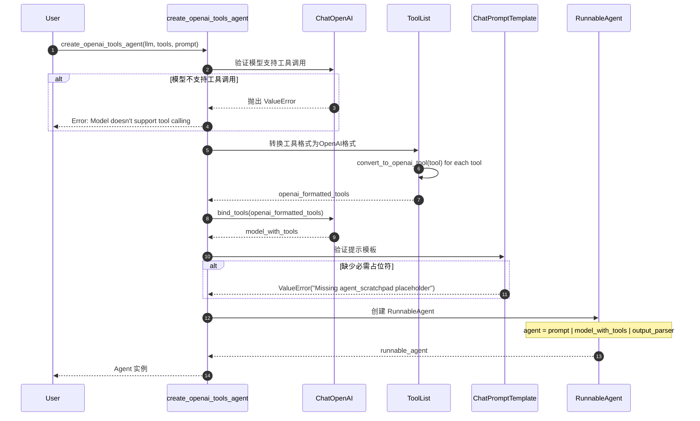
```mermaid
sequenceDiagram
    autonumber
    participant User
    participant Creator as create_openai_tools_agent
    participant Model as ChatOpenAI
    participant Tools as ToolList
    participant Prompt as ChatPromptTemplate
    participant Agent as RunnableAgent
    
    User->>Creator: create_openai_tools_agent(llm, tools, prompt)
    
    Creator->>Model: 验证模型支持工具调用
    alt 模型不支持工具调用
        Model-->>Creator: 抛出 ValueError
        Creator-->>User: Error: Model doesn't support tool calling
    end
    
    Creator->>Tools: 转换工具格式为OpenAI格式
    Tools->>Tools: convert_to_openai_tool(tool) for each tool
    Tools-->>Creator: openai_formatted_tools
    
    Creator->>Model: bind_tools(openai_formatted_tools)
    Model-->>Creator: model_with_tools
    
    Creator->>Prompt: 验证提示模板
    alt 缺少必需占位符
        Prompt-->>Creator: ValueError("Missing agent_scratchpad placeholder")
    end
    
    Creator->>Agent: 创建 RunnableAgent
    Note over Agent: agent = prompt | model_with_tools | output_parser
    
    Agent-->>Creator: runnable_agent
    Creator-->>User: Agent 实例
```

**关键验证步骤**：

1. **模型验证**（步骤 3-5）：
   - 检查模型是否支持 `bind_tools` 方法
   - 验证模型类型（必须是 `BaseChatModel`）
   - 确认工具调用能力

2. **工具格式转换**（步骤 6-8）：
   - 将 LangChain 工具转换为 OpenAI 格式
   - 生成工具的 JSON Schema
   - 处理工具描述和参数验证

3. **提示模板验证**（步骤 11-13）：
   - 检查 `{agent_scratchpad}` 占位符
   - 验证输入变量完整性
   - 确保模板格式正确

---

### 1.2 create_react_agent 创建流程

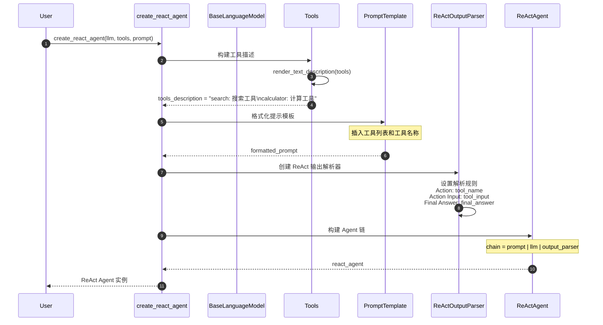
```mermaid
sequenceDiagram
    autonumber
    participant User
    participant Creator as create_react_agent
    participant LLM as BaseLanguageModel
    participant Tools
    participant Prompt as PromptTemplate
    participant Parser as ReActOutputParser
    participant Agent as ReActAgent
    
    User->>Creator: create_react_agent(llm, tools, prompt)
    
    Creator->>Tools: 构建工具描述
    Tools->>Tools: render_text_description(tools)
    Tools-->>Creator: tools_description = "search: 搜索工具\ncalculator: 计算工具"
    
    Creator->>Prompt: 格式化提示模板
    Note over Prompt: 插入工具列表和工具名称
    Prompt-->>Creator: formatted_prompt
    
    Creator->>Parser: 创建 ReAct 输出解析器
    Parser->>Parser: 设置解析规则<br/>Action: tool_name<br/>Action Input: tool_input<br/>Final Answer: final_answer
    
    Creator->>Agent: 构建 Agent 链
    Note over Agent: chain = prompt | llm | output_parser
    
    Agent-->>Creator: react_agent
    Creator-->>User: ReAct Agent 实例
```

**ReAct 格式说明**：

```
Question: 用户问题
Thought: 我需要思考如何解决这个问题
Action: search
Action Input: "Python tutorial"
Observation: 找到了相关教程...
Thought: 现在我有了足够信息
Final Answer: 基于搜索结果，这里是Python教程推荐...
```

---

## 2. AgentExecutor 执行场景

### 2.1 完整推理-行动循环

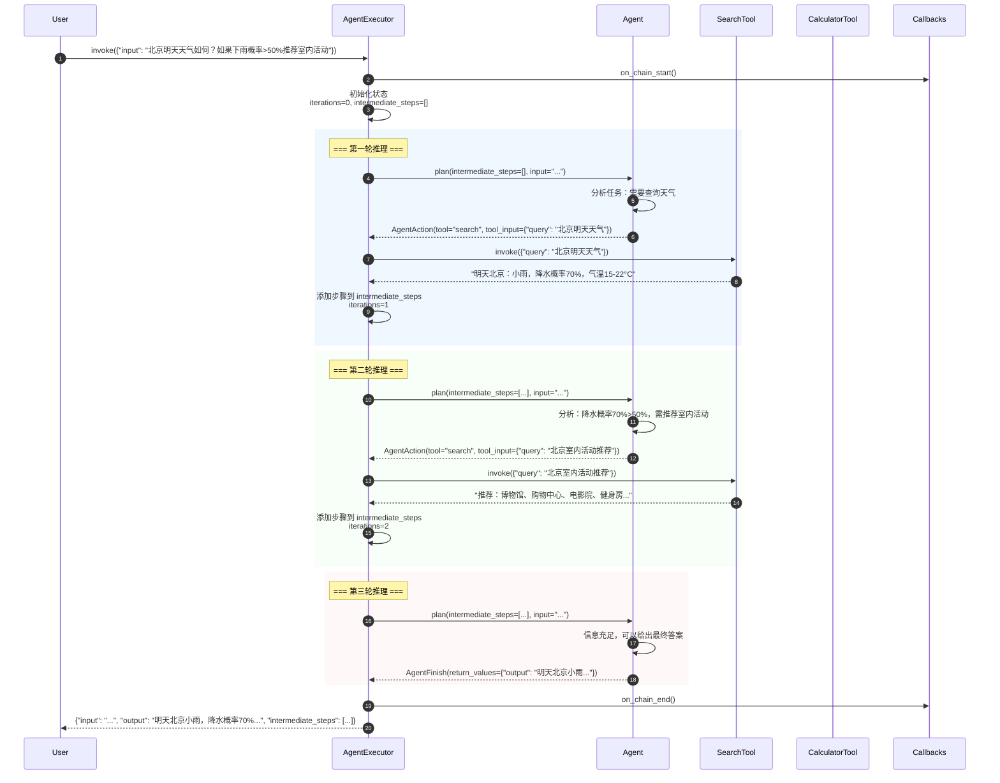
```mermaid
sequenceDiagram
    autonumber
    participant User
    participant Executor as AgentExecutor
    participant Agent
    participant Tool1 as SearchTool
    participant Tool2 as CalculatorTool
    participant CB as Callbacks
    
    User->>Executor: invoke({"input": "北京明天天气如何？如果下雨概率>50%推荐室内活动"})
    
    Executor->>CB: on_chain_start()
    Executor->>Executor: 初始化状态<br/>iterations=0, intermediate_steps=[]
    
    rect rgb(240, 248, 255)
        Note over Executor: === 第一轮推理 ===
        Executor->>Agent: plan(intermediate_steps=[], input="...")
        Agent->>Agent: 分析任务：需要查询天气
        Agent-->>Executor: AgentAction(tool="search", tool_input={"query": "北京明天天气"})
        
        Executor->>Tool1: invoke({"query": "北京明天天气"})
        Tool1-->>Executor: "明天北京：小雨，降水概率70%，气温15-22°C"
        
        Executor->>Executor: 添加步骤到 intermediate_steps<br/>iterations=1
    end
    
    rect rgb(248, 255, 248)
        Note over Executor: === 第二轮推理 ===
        Executor->>Agent: plan(intermediate_steps=[...], input="...")
        Agent->>Agent: 分析：降水概率70%>50%，需推荐室内活动
        Agent-->>Executor: AgentAction(tool="search", tool_input={"query": "北京室内活动推荐"})
        
        Executor->>Tool1: invoke({"query": "北京室内活动推荐"})
        Tool1-->>Executor: "推荐：博物馆、购物中心、电影院、健身房..."
        
        Executor->>Executor: 添加步骤到 intermediate_steps<br/>iterations=2
    end
    
    rect rgb(255, 248, 248)
        Note over Executor: === 第三轮推理 ===
        Executor->>Agent: plan(intermediate_steps=[...], input="...")
        Agent->>Agent: 信息充足，可以给出最终答案
        Agent-->>Executor: AgentFinish(return_values={"output": "明天北京小雨..."})
    end
    
    Executor->>CB: on_chain_end()
    Executor-->>User: {"input": "...", "output": "明天北京小雨，降水概率70%...", "intermediate_steps": [...]}
```

**执行步骤详解**：

1. **状态初始化**（步骤 3）：
   - 重置迭代计数器
   - 清空中间步骤列表
   - 记录开始时间

2. **推理循环**（步骤 4-18）：
   - 每轮调用 `agent.plan()` 方法
   - 根据当前状态决定下一步动作
   - 执行动作并收集观察结果

3. **循环终止条件**：
   - Agent 返回 `AgentFinish`
   - 达到最大迭代次数
   - 超过最大执行时间

---

### 2.2 工具调用错误处理

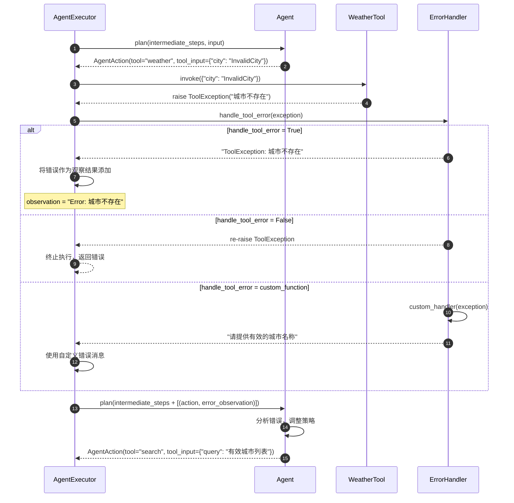
```mermaid
sequenceDiagram
    autonumber
    participant Executor as AgentExecutor
    participant Agent
    participant Tool as WeatherTool
    participant ErrorHandler
    
    Executor->>Agent: plan(intermediate_steps, input)
    Agent-->>Executor: AgentAction(tool="weather", tool_input={"city": "InvalidCity"})
    
    Executor->>Tool: invoke({"city": "InvalidCity"})
    Tool-->>Executor: raise ToolException("城市不存在")
    
    Executor->>ErrorHandler: handle_tool_error(exception)
    
    alt handle_tool_error = True
        ErrorHandler-->>Executor: "ToolException: 城市不存在"
        Executor->>Executor: 将错误作为观察结果添加
        Note over Executor: observation = "Error: 城市不存在"
    else handle_tool_error = False
        ErrorHandler-->>Executor: re-raise ToolException
        Executor-->>Executor: 终止执行，返回错误
    else handle_tool_error = custom_function
        ErrorHandler->>ErrorHandler: custom_handler(exception)
        ErrorHandler-->>Executor: "请提供有效的城市名称"
        Executor->>Executor: 使用自定义错误消息
    end
    
    Executor->>Agent: plan(intermediate_steps + [(action, error_observation)])
    Agent->>Agent: 分析错误，调整策略
    Agent-->>Executor: AgentAction(tool="search", tool_input={"query": "有效城市列表"})
```

**错误处理策略**：

| 策略 | 行为 | 适用场景 |
|-----|------|---------|
| `False` | 抛出异常，终止执行 | 严格模式，不容忍错误 |
| `True` | 返回错误字符串 | 让Agent学习错误信息 |
| 自定义函数 | 智能错误处理 | 复杂错误恢复逻辑 |

---

### 2.3 早停机制触发

```mermaid
sequenceDiagram
    autonumber
    participant Executor as AgentExecutor
    participant Agent
    participant StopHandler as EarlyStoppingHandler
    participant Timer
    
    loop 推理循环 (最多15次)
        Executor->>Timer: 检查执行时间
        Timer-->>Executor: time_elapsed = 45秒
        
        alt 达到时间限制 (max_execution_time=60s)
            Note over Executor: 45s < 60s，继续执行
        else 达到迭代限制 (max_iterations=15)
            Executor->>Executor: iterations = 15，触发早停
            break
        end
        
        Executor->>Agent: plan(intermediate_steps, input)
        Agent-->>Executor: AgentAction(...)
        Note over Executor: 继续执行...
    end
    
    Executor->>StopHandler: 处理早停 (early_stopping_method)
    
    alt method = "force"
        StopHandler-->>Executor: AgentFinish(<br/>  return_values={"output": "达到最大迭代次数"},<br/>  log="强制停止"<br/>)
    else method = "generate"  
        StopHandler->>Agent: plan(..., force_final_answer=True)
        Agent->>Agent: 基于现有信息生成最终答案
        Agent-->>StopHandler: AgentFinish(...)
        StopHandler-->>Executor: 生成的最终答案
    end
    
    Executor-->>Executor: 返回结果 (可能不完整)
```

**早停方法对比**：

| 方法 | 优点 | 缺点 | 适用场景 |
|-----|------|------|---------|
| `"force"` | 确定性，快速 | 可能丢失信息 | 严格时间控制 |  
| `"generate"` | 尽力给出答案 | 可能不准确 | 用户体验优先 |

---

## 3. 不同Agent类型的执行流程

### 3.1 OpenAI Tools Agent 执行

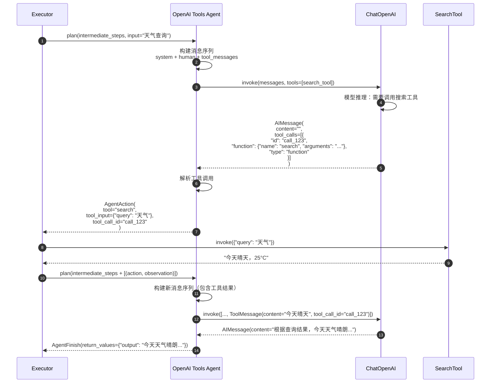
```mermaid
sequenceDiagram
    autonumber
    participant Executor
    participant Agent as OpenAI Tools Agent
    participant Model as ChatOpenAI
    participant Tool as SearchTool
    
    Executor->>Agent: plan(intermediate_steps, input="天气查询")
    
    Agent->>Agent: 构建消息序列<br/>system + human + tool_messages
    
    Agent->>Model: invoke(messages, tools=[search_tool])
    Model->>Model: 模型推理：需要调用搜索工具
    Model-->>Agent: AIMessage(<br/>  content="",<br/>  tool_calls=[{<br/>    "id": "call_123",<br/>    "function": {"name": "search", "arguments": "..."},<br/>    "type": "function"<br/>  }]<br/>)
    
    Agent->>Agent: 解析工具调用
    Agent-->>Executor: AgentAction(<br/>  tool="search",<br/>  tool_input={"query": "天气"},<br/>  tool_call_id="call_123"<br/>)
    
    Executor->>Tool: invoke({"query": "天气"})
    Tool-->>Executor: "今天晴天，25°C"
    
    Executor->>Agent: plan(intermediate_steps + [(action, observation)])
    Agent->>Agent: 构建新消息序列（包含工具结果）
    Agent->>Model: invoke([..., ToolMessage(content="今天晴天", tool_call_id="call_123")])
    Model-->>Agent: AIMessage(content="根据查询结果，今天天气晴朗...")
    
    Agent-->>Executor: AgentFinish(return_values={"output": "今天天气晴朗..."})
```

**工具调用格式**：

```json
{
  "tool_calls": [{
    "id": "call_abc123",
    "type": "function",
    "function": {
      "name": "search",
      "arguments": "{\"query\": \"weather Beijing\"}"
    }
  }]
}
```

---

### 3.2 ReAct Agent 执行

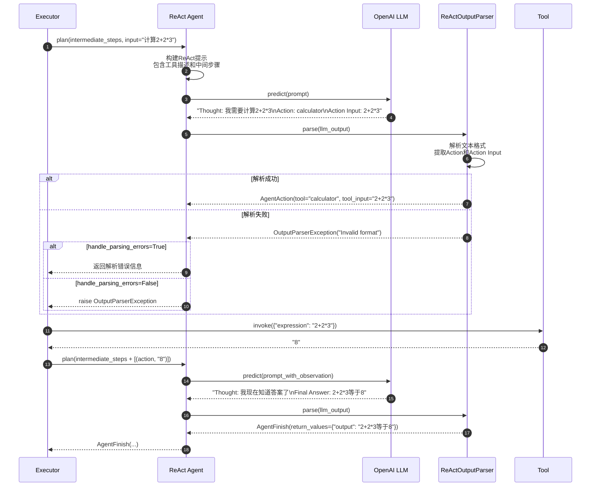
```mermaid
sequenceDiagram
    autonumber
    participant Executor
    participant Agent as ReAct Agent
    participant LLM as OpenAI LLM
    participant Parser as ReActOutputParser
    participant Tool
    
    Executor->>Agent: plan(intermediate_steps, input="计算2+2*3")
    
    Agent->>Agent: 构建ReAct提示<br/>包含工具描述和中间步骤
    
    Agent->>LLM: predict(prompt)
    LLM-->>Agent: "Thought: 我需要计算2+2*3\nAction: calculator\nAction Input: 2+2*3"
    
    Agent->>Parser: parse(llm_output)
    Parser->>Parser: 解析文本格式<br/>提取Action和Action Input
    
    alt 解析成功
        Parser-->>Agent: AgentAction(tool="calculator", tool_input="2+2*3")
    else 解析失败
        Parser-->>Agent: OutputParserException("Invalid format")
        
        alt handle_parsing_errors=True
            Agent-->>Executor: 返回解析错误信息
        else handle_parsing_errors=False
            Agent-->>Executor: raise OutputParserException
        end
    end
    
    Executor->>Tool: invoke({"expression": "2+2*3"})
    Tool-->>Executor: "8"
    
    Executor->>Agent: plan(intermediate_steps + [(action, "8")])
    Agent->>LLM: predict(prompt_with_observation)
    LLM-->>Agent: "Thought: 我现在知道答案了\nFinal Answer: 2+2*3等于8"
    
    Agent->>Parser: parse(llm_output)
    Parser-->>Agent: AgentFinish(return_values={"output": "2+2*3等于8"})
    
    Agent-->>Executor: AgentFinish(...)
```

**ReAct解析规则**：

```python
# 解析器查找的模式
patterns = {
    "action": r"Action: (.+)",
    "action_input": r"Action Input: (.+)",
    "final_answer": r"Final Answer: (.+)",
    "thought": r"Thought: (.+)"
}
```

---

## 4. 流式执行场景

### 4.1 Agent 流式输出

```mermaid
sequenceDiagram
    autonumber
    participant User
    participant Executor
    participant Agent
    participant Tool
    
    User->>Executor: stream({"input": "查询天气并推荐活动"})
    
    loop 推理循环
        Executor->>Agent: plan(...)
        
        alt Agent返回动作
            Agent-->>Executor: AgentAction(tool="search", ...)
            Executor-->>User: yield {"actions": [AgentAction(...)]}
            
            Executor->>Tool: invoke(...)
            Tool-->>Executor: observation
            Executor-->>User: yield {"steps": [AgentStep(action, observation)]}
            
        else Agent返回完成
            Agent-->>Executor: AgentFinish(...)
            Executor-->>User: yield {"output": "最终答案..."}
            break
        end
    end
```

**流式输出示例**：

```python
for chunk in agent_executor.stream({"input": "天气查询"}):
    if "actions" in chunk:
        print(f"🤖 准备执行: {chunk['actions'][0].tool}")
    elif "steps" in chunk:
        print(f"📋 工具返回: {chunk['steps'][0].observation}")
    elif "output" in chunk:
        print(f"✅ 最终答案: {chunk['output']}")
```

---

## 5. 错误恢复场景

### 5.1 解析错误恢复

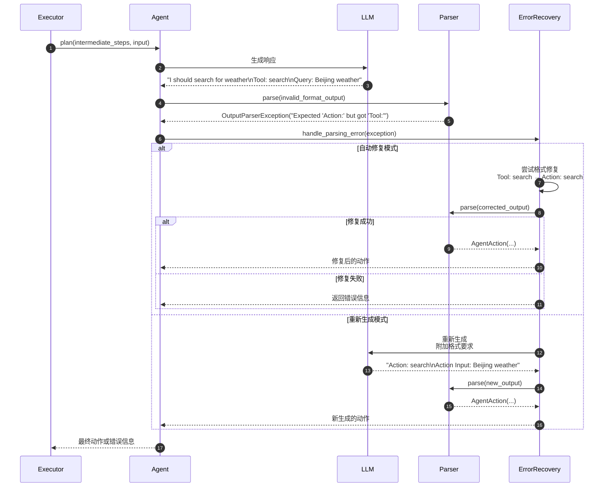
```mermaid
sequenceDiagram
    autonumber
    participant Executor
    participant Agent
    participant LLM
    participant Parser
    participant ErrorRecovery
    
    Executor->>Agent: plan(intermediate_steps, input)
    Agent->>LLM: 生成响应
    LLM-->>Agent: "I should search for weather\nTool: search\nQuery: Beijing weather"
    
    Agent->>Parser: parse(invalid_format_output)
    Parser-->>Agent: OutputParserException("Expected 'Action:' but got 'Tool:'")
    
    Agent->>ErrorRecovery: handle_parsing_error(exception)
    
    alt 自动修复模式
        ErrorRecovery->>ErrorRecovery: 尝试格式修复<br/>Tool: search → Action: search
        ErrorRecovery->>Parser: parse(corrected_output)
        
        alt 修复成功
            Parser-->>ErrorRecovery: AgentAction(...)
            ErrorRecovery-->>Agent: 修复后的动作
        else 修复失败
            ErrorRecovery-->>Agent: 返回错误信息
        end
        
    else 重新生成模式
        ErrorRecovery->>LLM: 重新生成<br/>附加格式要求
        LLM-->>ErrorRecovery: "Action: search\nAction Input: Beijing weather"
        ErrorRecovery->>Parser: parse(new_output)
        Parser-->>ErrorRecovery: AgentAction(...)
        ErrorRecovery-->>Agent: 新生成的动作
    end
    
    Agent-->>Executor: 最终动作或错误信息
```

**错误恢复策略**：

1. **格式修复**：识别常见格式错误并自动修复
2. **重新生成**：提供更详细的格式说明重新请求
3. **降级处理**：使用简化的解析规则
4. **人工干预**：记录错误等待人工处理

---

### 5.2 工具超时恢复

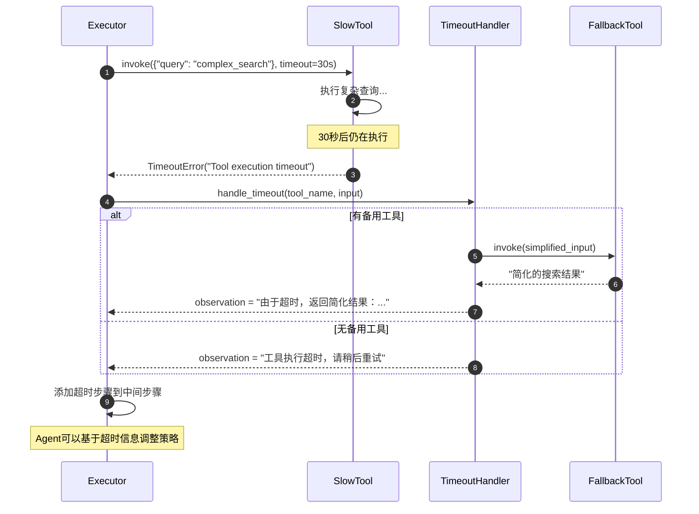
```mermaid
sequenceDiagram
    autonumber
    participant Executor
    participant Tool as SlowTool
    participant Timeout as TimeoutHandler
    participant Fallback as FallbackTool
    
    Executor->>Tool: invoke({"query": "complex_search"}, timeout=30s)
    
    Tool->>Tool: 执行复杂查询...
    Note over Tool: 30秒后仍在执行
    
    Tool-->>Executor: TimeoutError("Tool execution timeout")
    
    Executor->>Timeout: handle_timeout(tool_name, input)
    
    alt 有备用工具
        Timeout->>Fallback: invoke(simplified_input)
        Fallback-->>Timeout: "简化的搜索结果"
        Timeout-->>Executor: observation = "由于超时，返回简化结果：..."
        
    else 无备用工具
        Timeout-->>Executor: observation = "工具执行超时，请稍后重试"
    end
    
    Executor->>Executor: 添加超时步骤到中间步骤
    Note over Executor: Agent可以基于超时信息调整策略
```

---

## 6. 性能优化场景

### 6.1 中间步骤修剪

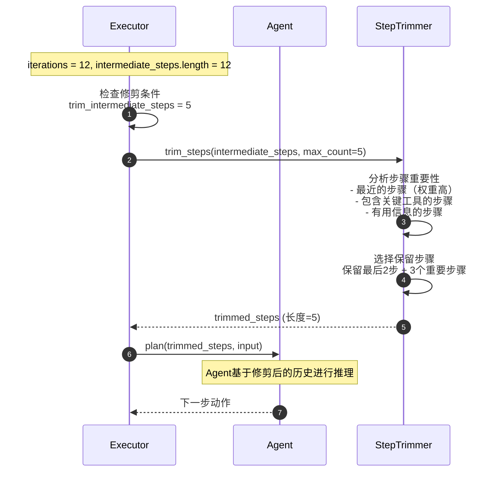
```mermaid
sequenceDiagram
    autonumber
    participant Executor
    participant Agent
    participant Trimmer as StepTrimmer
    
    Note over Executor: iterations = 12, intermediate_steps.length = 12
    
    Executor->>Executor: 检查修剪条件<br/>trim_intermediate_steps = 5
    
    Executor->>Trimmer: trim_steps(intermediate_steps, max_count=5)
    
    Trimmer->>Trimmer: 分析步骤重要性<br/>- 最近的步骤（权重高）<br/>- 包含关键工具的步骤<br/>- 有用信息的步骤
    
    Trimmer->>Trimmer: 选择保留步骤<br/>保留最后2步 + 3个重要步骤
    
    Trimmer-->>Executor: trimmed_steps (长度=5)
    
    Executor->>Agent: plan(trimmed_steps, input)
    Note over Agent: Agent基于修剪后的历史进行推理
    
    Agent-->>Executor: 下一步动作
```

**修剪策略**：

```python
def intelligent_trim(steps, max_count):
    if len(steps) <= max_count:
        return steps
    
    # 按重要性评分
    scored_steps = []
    for i, (action, obs) in enumerate(steps):
        score = 0
        
        # 最近的步骤权重更高
        score += (i / len(steps)) * 10
        
        # 关键工具权重更高
        if action.tool in ["search", "calculator"]:
            score += 5
            
        # 有用观察权重更高
        if "error" not in obs.lower() and len(obs) > 10:
            score += 3
            
        scored_steps.append((score, (action, obs)))
    
    # 选择得分最高的步骤
    scored_steps.sort(key=lambda x: x[0], reverse=True)
    return [step for score, step in scored_steps[:max_count]]
```

---

### 6.2 并行工具调用优化

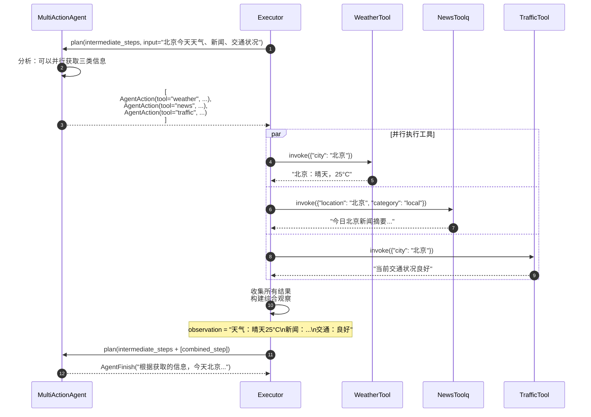
```mermaid
sequenceDiagram
    autonumber
    participant Agent as MultiActionAgent
    participant Executor
    participant Tool1 as WeatherTool
    participant Tool2 as NewsToolq
    participant Tool3 as TrafficTool
    
    Executor->>Agent: plan(intermediate_steps, input="北京今天天气、新闻、交通状况")
    
    Agent->>Agent: 分析：可以并行获取三类信息
    Agent-->>Executor: [<br/>  AgentAction(tool="weather", ...),<br/>  AgentAction(tool="news", ...),<br/>  AgentAction(tool="traffic", ...)<br/>]
    
    par 并行执行工具
        Executor->>Tool1: invoke({"city": "北京"})
        Tool1-->>Executor: "北京：晴天，25°C"
    and
        Executor->>Tool2: invoke({"location": "北京", "category": "local"})
        Tool2-->>Executor: "今日北京新闻摘要..."
    and  
        Executor->>Tool3: invoke({"city": "北京"})
        Tool3-->>Executor: "当前交通状况良好"
    end
    
    Executor->>Executor: 收集所有结果<br/>构建综合观察
    Note over Executor: observation = "天气：晴天25°C\n新闻：...\n交通：良好"
    
    Executor->>Agent: plan(intermediate_steps + [combined_step])
    Agent-->>Executor: AgentFinish("根据获取的信息，今天北京...")
```

**并行执行优势**：

- 减少总执行时间
- 提高信息获取效率
- 更好的用户体验

---

## 7. 总结

本文档详细展示了 **Agents 模块**的关键执行时序：

1. **Agent创建**：不同类型Agent的创建和验证流程
2. **推理循环**：完整的思考-行动-观察循环
3. **工具调用**：同步和异步工具执行机制
4. **错误处理**：解析错误、工具错误的恢复策略
5. **早停机制**：达到限制时的处理方法
6. **流式执行**：实时输出中间步骤和结果
7. **性能优化**：步骤修剪和并行执行

每张时序图包含：

- 详细的参与者交互过程
- 关键决策点和分支逻辑
- 错误处理和恢复机制
- 性能优化点和最佳实践

这些时序图帮助开发者深入理解Agent系统的复杂执行机制，为构建高效、可靠的智能代理应用提供指导。Agent系统是LangChain中最复杂但也最强大的组件，正确理解其执行流程对成功构建AI应用至关重要。

---
