# LangChain-06-OutputParsers

## 模块概览

## 模块基本信息

**模块名称**: langchain-core-output-parsers
**模块路径**: `libs/core/langchain_core/output_parsers/`
**核心职责**: 将 LLM 的文本输出解析为结构化数据（JSON、Pydantic 对象、列表等）

## 1. 模块职责

### 1.1 核心职责

Output Parsers 模块负责将 LLM 的非结构化输出转换为应用可用的结构化数据，提供以下能力：

1. **格式化解析**: 将文本解析为 JSON、XML、CSV 等格式
2. **类型安全**: 使用 Pydantic 模型验证输出结构
3. **流式解析**: 支持流式输出的增量解析
4. **错误处理**: 提供格式错误修复机制
5. **指令生成**: 自动生成格式化指令注入提示词
6. **多种解析器**: 支持字符串、列表、JSON、Pydantic、枚举等

### 1.2 核心概念

```
LLM 文本输出
  ↓
输出解析器（解析规则 + 验证逻辑）
  ↓
结构化数据（dict、list、Pydantic 对象）
```

**解析器分类**:

- **基础解析器**: 直接返回文本或简单转换
- **结构化解析器**: 解析为 JSON、XML、CSV
- **模式验证解析器**: 使用 Pydantic 进行类型验证
- **流式解析器**: 支持增量解析（streaming）
- **重试解析器**: 解析失败时调用 LLM 修复

### 1.3 输入/输出

**输入**:

- **parse 方法**: `str` - LLM 输出文本
- **parse_result 方法**: `list[Generation]` - LLM 生成对象

**输出**:

- 结构化数据：`str`、`list`、`dict`、`Pydantic Model`、`Any`

### 1.4 解析器类型对比

| 解析器 | 输出类型 | 流式支持 | 使用场景 |
|--------|---------|---------|---------|
| `StrOutputParser` | `str` | ✅ | 直接返回文本 |
| `ListOutputParser` | `list[str]` | ✅ | 解析列表 |
| `JsonOutputParser` | `dict` | ✅ | JSON 格式输出 |
| `PydanticOutputParser` | `BaseModel` | ❌ | 类型安全的结构化输出 |
| `XMLOutputParser` | `dict` | ❌ | XML 格式输出 |
| `CommaSeparatedListOutputParser` | `list[str]` | ❌ | 逗号分隔列表 |
| `EnumOutputParser` | `Enum` | ❌ | 枚举类型输出 |
| `DatetimeOutputParser` | `datetime` | ❌ | 日期时间解析 |

### 1.5 上下游依赖

**上游调用者**:

- LCEL 链（作为最后一个组件）
- 用户应用代码

**下游依赖**:

- `pydantic`: 模型验证
- `json`, `xml.etree`, `csv`: 标准库解析器

## 2. 模块级架构图

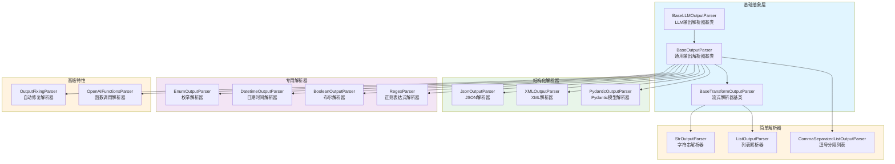
```mermaid
flowchart TB
    subgraph Base["基础抽象层"]
        BLLM[BaseLLMOutputParser<br/>LLM输出解析器基类]
        BOP[BaseOutputParser<br/>通用输出解析器基类]
        BTOP[BaseTransformOutputParser<br/>流式解析器基类]
    end

    subgraph Simple["简单解析器"]
        STR[StrOutputParser<br/>字符串解析器]
        LIST[ListOutputParser<br/>列表解析器]
        CSV[CommaSeparatedListOutputParser<br/>逗号分隔列表]
    end

    subgraph Structured["结构化解析器"]
        JSON[JsonOutputParser<br/>JSON解析器]
        XML[XMLOutputParser<br/>XML解析器]
        PYDANTIC[PydanticOutputParser<br/>Pydantic模型解析器]
    end

    subgraph Specialized["专用解析器"]
        ENUM[EnumOutputParser<br/>枚举解析器]
        DATETIME[DatetimeOutputParser<br/>日期时间解析器]
        BOOL[BooleanOutputParser<br/>布尔解析器]
        REGEX[RegexParser<br/>正则表达式解析器]
    end

    subgraph Advanced["高级特性"]
        RETRY[OutputFixingParser<br/>自动修复解析器]
        OPENAI[OpenAIFunctionsParser<br/>函数调用解析器]
    end

    BLLM --> BOP
    BOP --> BTOP

    BTOP --> STR
    BTOP --> LIST
    BOP --> CSV

    BOP --> JSON
    BOP --> XML
    BOP --> PYDANTIC

    BOP --> ENUM
    BOP --> DATETIME
    BOP --> BOOL
    BOP --> REGEX

    BOP --> RETRY
    BOP --> OPENAI

    style Base fill:#e1f5ff
    style Simple fill:#fff4e1
    style Structured fill:#e8f5e9
    style Specialized fill:#f3e5f5
    style Advanced fill:#fff3e0
```

### 架构图详细说明

**1. 基础抽象层**

- **BaseLLMOutputParser**: 所有 LLM 输出解析器的基类
  - 定义 `parse_result` 方法：接收 `list[Generation]`
  - 子类可直接访问 LLM 生成对象的元数据

- **BaseOutputParser**: 通用输出解析器基类
  - 继承自 `BaseLLMOutputParser` 和 `Runnable`
  - 定义 `parse` 方法：接收 `str` 文本
  - 提供 `get_format_instructions` 方法：生成格式化指令
  - 支持 LCEL 链式调用

- **BaseTransformOutputParser**: 流式解析器基类
  - 支持 `transform` 方法：增量处理输入块
  - 适用于流式输出场景
  - 子类：`StrOutputParser`、`ListOutputParser`

**2. 简单解析器**

- **StrOutputParser**:
  - 最简单的解析器
  - 直接返回输入文本
  - 支持流式输出

  ```python
  parser = StrOutputParser()
  result = parser.parse("Hello World")  # "Hello World"
```

- **ListOutputParser**:
  - 解析换行分隔或编号列表
  - 支持流式输出（逐行返回）

  ```python
  text = "1. Apple\n2. Banana\n3. Cherry"
  parser = ListOutputParser()
  result = parser.parse(text)  # ["Apple", "Banana", "Cherry"]
```

- **CommaSeparatedListOutputParser**:
  - 解析逗号分隔的列表
  - 去除空白字符

  ```python
  text = "apple, banana, cherry"
  parser = CommaSeparatedListOutputParser()
  result = parser.parse(text)  # ["apple", "banana", "cherry"]
```

**3. 结构化解析器**

- **JsonOutputParser**:
  - 解析 JSON 格式输出
  - 支持流式输出（增量解析 JSON）
  - 自动提取 markdown 代码块中的 JSON

  ```python
  text = '{"name": "Alice", "age": 30}'
  parser = JsonOutputParser()
  result = parser.parse(text)  # {"name": "Alice", "age": 30}
```

- **PydanticOutputParser**:
  - 使用 Pydantic 模型验证输出
  - 提供类型安全和自动验证
  - 生成详细的格式化指令

  ```python
  class Person(BaseModel):
      name: str = Field(description="Person's name")
      age: int = Field(description="Person's age")

  parser = PydanticOutputParser(pydantic_object=Person)
  result = parser.parse('{"name": "Alice", "age": 30}')
  # Person(name="Alice", age=30)
```

- **XMLOutputParser**:
  - 解析 XML 格式输出
  - 转换为字典结构

  ```python
  text = "<person><name>Alice</name><age>30</age></person>"
  parser = XMLOutputParser()
  result = parser.parse(text)
  # {"person": {"name": "Alice", "age": "30"}}
```

**4. 专用解析器**

- **EnumOutputParser**:
  - 解析枚举类型
  - 自动映射字符串到枚举值

  ```python
  class Color(Enum):
      RED = "red"
      GREEN = "green"
      BLUE = "blue"

  parser = EnumOutputParser(enum=Color)
  result = parser.parse("red")  # Color.RED
```

- **DatetimeOutputParser**:
  - 解析日期时间字符串
  - 支持自定义格式

  ```python
  parser = DatetimeOutputParser()
  result = parser.parse("2024-10-03")  # datetime(2024, 10, 3)
```

- **BooleanOutputParser**:
  - 解析布尔值
  - 识别 "yes/no", "true/false", "1/0"

  ```python
  parser = BooleanOutputParser()
  result = parser.parse("yes")  # True
```

**5. 高级特性**

- **OutputFixingParser**:
  - 包装其他解析器
  - 解析失败时调用 LLM 修复输出

  ```python
  base_parser = PydanticOutputParser(pydantic_object=Person)
  fixing_parser = OutputFixingParser.from_llm(
      parser=base_parser,
      llm=ChatOpenAI()
  )
  # 即使输出格式错误，也会尝试修复
```

- **OpenAIFunctionsParser**:
  - 解析 OpenAI Function Calling 输出
  - 提取函数名和参数

## 3. 核心 API 详解

### 3.1 parse - 解析文本输出

**基本信息**:

- **方法**: `parse`
- **签名**: `def parse(self, text: str) -> T`

**功能**: 将 LLM 文本输出解析为目标类型。

**参数**:

| 参数名 | 类型 | 说明 |
|--------|------|------|
| `text` | `str` | LLM 输出文本 |

**返回值**: 解析后的结构化数据（类型由解析器决定）

**核心代码**:

```python
class BaseOutputParser(BaseLLMOutputParser, Runnable[str, T], ABC):
    @abstractmethod
    def parse(self, text: str) -> T:
        """
        解析文本为目标类型

        参数:
            text: LLM 输出文本

        返回:
            解析后的结构化数据

        抛出:
            OutputParserException: 解析失败时
        """
```

**使用示例（JsonOutputParser）**:

```python
from langchain_core.output_parsers import JsonOutputParser

parser = JsonOutputParser()

# 标准 JSON
text = '{"name": "Alice", "age": 30}'
result = parser.parse(text)
print(result)  # {"name": "Alice", "age": 30}

# 包含 Markdown 代码块的 JSON
text = '''
Here is the data:
```json

{"name": "Bob", "age": 25}

```
'''
result = parser.parse(text)
print(result)  # {"name": "Bob", "age": 25}

# 在 LCEL 链中使用
chain = prompt | model | JsonOutputParser()
result = chain.invoke({"query": "Get user info"})
```

### 3.2 PydanticOutputParser - 类型安全解析

**功能**: 使用 Pydantic 模型进行类型验证和解析。

**核心代码**:

```python
class PydanticOutputParser(BaseOutputParser[TBaseModel]):
    pydantic_object: Type[TBaseModel]

    def parse(self, text: str) -> TBaseModel:
        """
        解析文本为 Pydantic 对象

        参数:
            text: JSON 格式文本

        返回:
            Pydantic 模型实例

        抛出:
            OutputParserException: JSON 无效或验证失败
        """
        # 1. 提取 JSON（支持 Markdown 代码块）
        json_str = self._extract_json(text)

        # 2. 解析 JSON
        json_obj = json.loads(json_str)

        # 3. 验证并构造 Pydantic 对象
        return self.pydantic_object.parse_obj(json_obj)

    def get_format_instructions(self) -> str:
        """
        生成格式化指令

        返回:
            包含字段描述和 JSON 示例的指令
        """
        # 根据 Pydantic 模型生成格式说明
        schema = self.pydantic_object.schema()

        reduced_schema = {
            prop: {
                "type": schema["properties"][prop].get("type"),
                "description": schema["properties"][prop].get("description")
            }
            for prop in schema["properties"]
        }

        return f"""The output should be formatted as a JSON instance that conforms to the JSON schema below.

Here is the schema:
```json

{json.dumps(reduced_schema, indent=2)}

```"""
```

**使用示例**:

```python
from langchain_core.output_parsers import PydanticOutputParser
from langchain_core.prompts import ChatPromptTemplate
from langchain_openai import ChatOpenAI
from pydantic import BaseModel, Field

# 1. 定义数据模型
class Person(BaseModel):
    name: str = Field(description="The person's name")
    age: int = Field(description="The person's age")
    email: str = Field(description="The person's email address")
    hobbies: list[str] = Field(description="List of hobbies")

# 2. 创建解析器
parser = PydanticOutputParser(pydantic_object=Person)

# 3. 构建提示词（包含格式指令）
prompt = ChatPromptTemplate.from_messages([
    ("system", "Extract person information from the text."),
    ("human", "{text}"),
    ("human", "{format_instructions}")
])

# 4. 创建链
chain = (
    prompt.partial(format_instructions=parser.get_format_instructions())
    | ChatOpenAI(model="gpt-4", temperature=0)
    | parser
)

# 5. 执行
result = chain.invoke({
    "text": "John Doe is 30 years old. His email is john@example.com. He enjoys reading and hiking."
})

print(result)
# Person(
#     name="John Doe",
#     age=30,
#     email="john@example.com",
#     hobbies=["reading", "hiking"]
# )

# 类型安全
print(result.name)  # "John Doe" (str)
print(result.age)  # 30 (int)
```

### 3.3 流式解析（ListOutputParser）

**功能**: 支持增量解析流式输出。

**核心代码**:

```python
class ListOutputParser(BaseTransformOutputParser[list[str]]):
    def parse(self, text: str) -> list[str]:
        """
        解析完整文本为列表
        """
        lines = text.strip().split("\n")
        return [self._clean_line(line) for line in lines if line.strip()]

    def _transform(self, input: Iterator[Union[str, BaseMessage]]) -> Iterator[list[str]]:
        """
        流式解析：逐行返回
        """
        buffer = ""
        for chunk in input:
            if isinstance(chunk, BaseMessage):
                chunk = chunk.content

            buffer += chunk

            # 检查是否有完整行
            while "\n" in buffer:
                line, buffer = buffer.split("\n", 1)
                line = self._clean_line(line)
                if line:
                    yield [line]  # 逐行返回

        # 处理最后一行
        if buffer.strip():
            yield [self._clean_line(buffer)]
```

**使用示例**:

```python
from langchain_core.output_parsers import ListOutputParser

parser = ListOutputParser()

# 流式输出
prompt = ChatPromptTemplate.from_template("List 5 {topic}")
chain = prompt | model | parser

for chunk in chain.stream({"topic": "fruits"}):
    print(chunk)  # 逐行输出
    # ["Apple"]
    # ["Banana"]
    # ["Cherry"]
    # ...
```

### 3.4 OutputFixingParser - 自动修复

**功能**: 解析失败时，调用 LLM 修复格式错误的输出。

**核心代码**:

```python
class OutputFixingParser(BaseOutputParser[T]):
    parser: BaseOutputParser[T]  # 基础解析器
    retry_chain: Runnable  # LLM 修复链

    def parse(self, completion: str) -> T:
        """
        解析输出，失败时尝试修复
        """
        try:
            # 尝试正常解析
            return self.parser.parse(completion)
        except OutputParserException as e:
            # 解析失败，调用 LLM 修复
            new_completion = self.retry_chain.invoke({
                "completion": completion,
                "error": repr(e),
                "instructions": self.parser.get_format_instructions()
            })

            # 尝试解析修复后的输出
            return self.parser.parse(new_completion)

    @classmethod
    def from_llm(
        cls,
        parser: BaseOutputParser[T],
        llm: BaseLanguageModel,
        max_retries: int = 1
    ) -> OutputFixingParser[T]:
        """
        从 LLM 创建修复解析器
        """
        retry_prompt = ChatPromptTemplate.from_template(
            """The following output failed to parse:
{completion}

Error: {error}

Format instructions:
{instructions}

Please fix the output to match the format."""
        )

        retry_chain = retry_prompt | llm | StrOutputParser()

        return cls(parser=parser, retry_chain=retry_chain)
```

**使用示例**:

```python
from langchain_core.output_parsers import PydanticOutputParser, OutputFixingParser

# 基础解析器
base_parser = PydanticOutputParser(pydantic_object=Person)

# 带修复功能的解析器
fixing_parser = OutputFixingParser.from_llm(
    parser=base_parser,
    llm=ChatOpenAI(model="gpt-4")
)

# 即使格式错误，也能修复
bad_output = '{"name": "Alice", age: 30}'  # 缺少引号
result = fixing_parser.parse(bad_output)  # 自动修复并解析
print(result)  # Person(name="Alice", age=30)
```

## 4. 核心流程时序图

### 4.1 标准解析流程

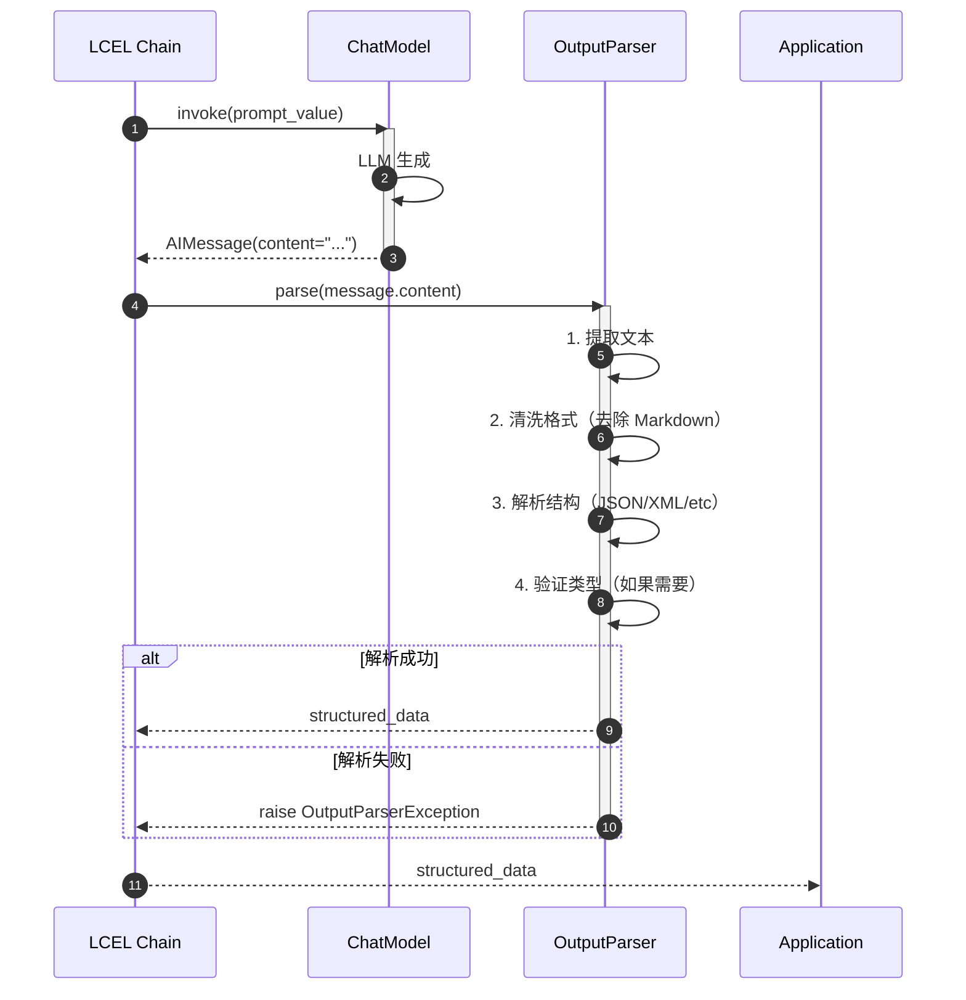
```mermaid
sequenceDiagram
    autonumber
    participant Chain as LCEL Chain
    participant Model as ChatModel
    participant Parser as OutputParser
    participant App as Application

    Chain->>Model: invoke(prompt_value)
    activate Model
    Model->>Model: LLM 生成
    Model-->>Chain: AIMessage(content="...")
    deactivate Model

    Chain->>Parser: parse(message.content)
    activate Parser

    Parser->>Parser: 1. 提取文本
    Parser->>Parser: 2. 清洗格式（去除 Markdown）
    Parser->>Parser: 3. 解析结构（JSON/XML/etc）
    Parser->>Parser: 4. 验证类型（如果需要）

    alt 解析成功
        Parser-->>Chain: structured_data
    else 解析失败
        Parser-->>Chain: raise OutputParserException
    end
    deactivate Parser

    Chain-->>App: structured_data
```

### 4.2 Pydantic 解析详细流程

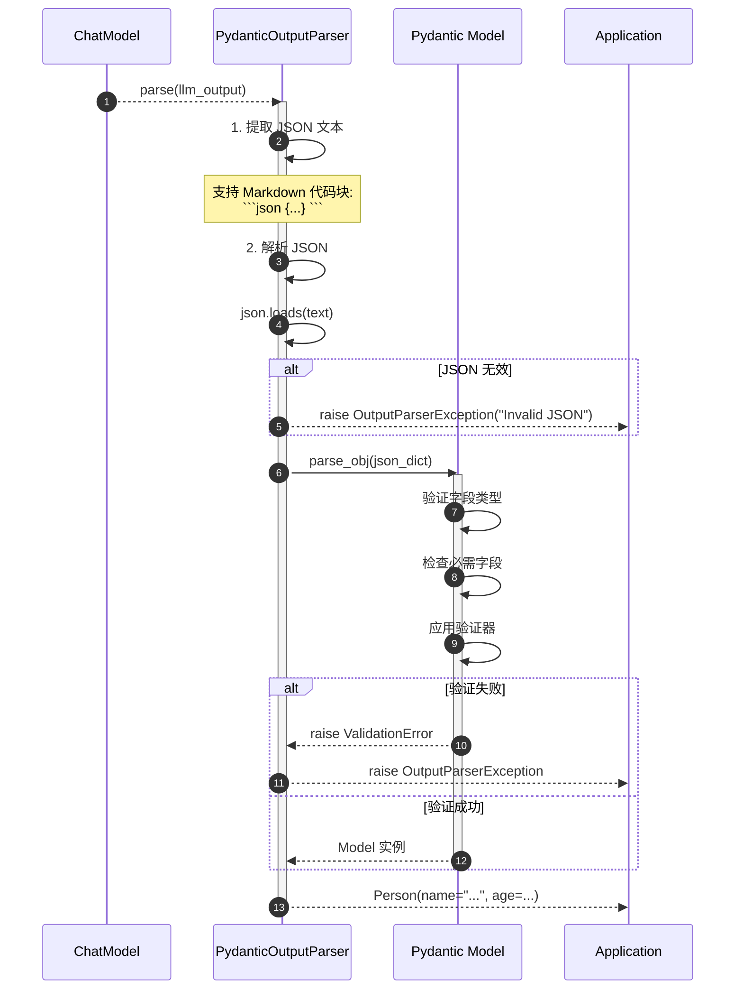
```mermaid
sequenceDiagram
    autonumber
    participant Model as ChatModel
    participant Parser as PydanticOutputParser
    participant Pydantic as Pydantic Model
    participant App as Application

    Model-->>Parser: parse(llm_output)
    activate Parser

    Parser->>Parser: 1. 提取 JSON 文本
    Note over Parser: 支持 Markdown 代码块:<br/>```json {...} ```

    Parser->>Parser: 2. 解析 JSON
    Parser->>Parser: json.loads(text)

    alt JSON 无效
        Parser-->>App: raise OutputParserException("Invalid JSON")
    end

    Parser->>Pydantic: parse_obj(json_dict)
    activate Pydantic

    Pydantic->>Pydantic: 验证字段类型
    Pydantic->>Pydantic: 检查必需字段
    Pydantic->>Pydantic: 应用验证器

    alt 验证失败
        Pydantic-->>Parser: raise ValidationError
        Parser-->>App: raise OutputParserException
    else 验证成功
        Pydantic-->>Parser: Model 实例
    end
    deactivate Pydantic

    Parser-->>App: Person(name="...", age=...)
    deactivate Parser
```

### 4.3 自动修复解析流程

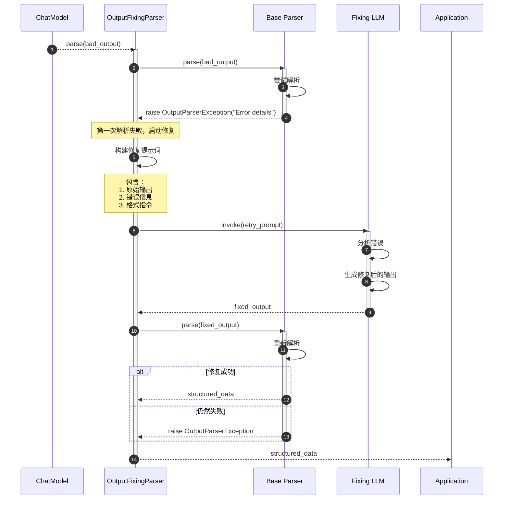
```mermaid
sequenceDiagram
    autonumber
    participant Model as ChatModel
    participant FixParser as OutputFixingParser
    participant BaseParser as Base Parser
    participant LLM as Fixing LLM
    participant App as Application

    Model-->>FixParser: parse(bad_output)
    activate FixParser

    FixParser->>BaseParser: parse(bad_output)
    activate BaseParser
    BaseParser->>BaseParser: 尝试解析
    BaseParser-->>FixParser: raise OutputParserException("Error details")
    deactivate BaseParser

    Note over FixParser: 第一次解析失败，启动修复

    FixParser->>FixParser: 构建修复提示词
    Note over FixParser: 包含：<br/>1. 原始输出<br/>2. 错误信息<br/>3. 格式指令

    FixParser->>LLM: invoke(retry_prompt)
    activate LLM
    LLM->>LLM: 分析错误
    LLM->>LLM: 生成修复后的输出
    LLM-->>FixParser: fixed_output
    deactivate LLM

    FixParser->>BaseParser: parse(fixed_output)
    activate BaseParser
    BaseParser->>BaseParser: 重新解析

    alt 修复成功
        BaseParser-->>FixParser: structured_data
    else 仍然失败
        BaseParser-->>FixParser: raise OutputParserException
    end
    deactivate BaseParser

    FixParser-->>App: structured_data
    deactivate FixParser
```

## 5. 最佳实践

### 5.1 选择合适的解析器

**简单场景 - StrOutputParser**:

```python
# 直接返回文本，无需解析
chain = prompt | model | StrOutputParser()
```

**列表场景 - ListOutputParser**:

```python
# LLM 输出列表
prompt = ChatPromptTemplate.from_template("List 5 {topic}")
chain = prompt | model | ListOutputParser()
```

**结构化输出 - JsonOutputParser**:

```python
# 需要字典格式
prompt = ChatPromptTemplate.from_template(
    "Extract key information from: {text}\nReturn as JSON with keys: name, age, city"
)
chain = prompt | model | JsonOutputParser()
```

**类型安全 - PydanticOutputParser**:

```python
# 需要类型验证和复杂结构
class UserProfile(BaseModel):
    name: str
    age: int = Field(gt=0, lt=150)
    email: EmailStr
    tags: list[str] = []

parser = PydanticOutputParser(pydantic_object=UserProfile)
```

### 5.2 提示词中包含格式指令

```python
# ✅ 推荐：明确告诉 LLM 输出格式
parser = PydanticOutputParser(pydantic_object=Person)

prompt = ChatPromptTemplate.from_messages([
    ("system", "Extract information accurately."),
    ("human", "{text}"),
    ("human", "Output format:\n{format_instructions}")
])

chain = (
    prompt.partial(format_instructions=parser.get_format_instructions())
    | model
    | parser
)
```

### 5.3 处理解析错误

**方法1: 使用 OutputFixingParser**:

```python
base_parser = PydanticOutputParser(pydantic_object=Person)
fixing_parser = OutputFixingParser.from_llm(
    parser=base_parser,
    llm=ChatOpenAI(model="gpt-4")
)
```

**方法2: 使用 RetryWithErrorOutputParser**:

```python
from langchain.output_parsers import RetryWithErrorOutputParser

retry_parser = RetryWithErrorOutputParser.from_llm(
    parser=base_parser,
    llm=model,
    max_retries=3
)
```

**方法3: 手动处理**:

```python
try:
    result = parser.parse(llm_output)
except OutputParserException as e:
    # 记录错误，返回默认值
    logger.error(f"Parse failed: {e}")
    result = default_value
```

### 5.4 优化 LLM 输出质量

**1. 使用低温度**:

```python
model = ChatOpenAI(model="gpt-4", temperature=0)
# 更确定性的输出，减少解析错误
```

**2. 提供示例**:

```python
prompt = ChatPromptTemplate.from_template("""
Extract person info from the text.

Example:
Text: "Alice is 30 years old"
Output: {{"name": "Alice", "age": 30}}

Text: {input}
Output:
""")
```

**3. 使用函数调用（OpenAI）**:

```python
# 最可靠的结构化输出方式
model_with_structure = model.with_structured_output(Person)
result = model_with_structure.invoke(prompt)
# 直接返回 Person 对象，无需解析器
```

### 5.5 流式解析优化

```python
# 对于支持流式的解析器（Str、List、Json）
chain = prompt | model | parser

# 逐块处理
for chunk in chain.stream(input):
    print(chunk, end="", flush=True)  # 实时显示
```

## 6. 与其他模块的协作

- **Prompts**: 使用 `get_format_instructions()` 生成格式指令
- **Language Models**: 解析模型输出
- **Agents**: 解析代理决策输出
- **Chains**: 作为链的最后一个组件

## 7. 总结

Output Parsers 是 LangChain 中将非结构化 LLM 输出转换为结构化数据的关键模块。核心特性：

1. **多种解析器**: 支持字符串、列表、JSON、Pydantic 等
2. **类型安全**: 使用 Pydantic 进行验证
3. **流式支持**: 增量解析流式输出
4. **自动修复**: 解析失败时调用 LLM 修复
5. **格式指令**: 自动生成提示词指令

**关键原则**:

- 优先使用 `with_structured_output`（OpenAI）
- 复杂结构使用 `PydanticOutputParser`
- 启用自动修复（`OutputFixingParser`）
- 提示词中包含格式指令
- 使用低温度提高确定性

---

**文档版本**: v1.0
**最后更新**: 2025-10-03
**相关文档**:

- LangChain-00-总览.md
- LangChain-03-LanguageModels-概览.md
- LangChain-04-Prompts-概览.md

---

## API接口

## 文档说明

本文档详细描述 **Output Parsers 模块**的对外 API，包括各种解析器类型、结构化输出、流式解析、错误处理等核心接口的所有公开方法和参数规格。

---

## 1. BaseOutputParser 核心 API

### 1.1 基础接口

#### 基本信息
- **类名**：`BaseOutputParser[T]`
- **功能**：所有输出解析器的抽象基类
- **泛型参数**：`T` 表示解析后的目标类型

#### 核心方法

```python
class BaseOutputParser(Generic[T], Runnable[Union[str, BaseMessage], T]):
    """输出解析器基类。"""

    def parse(self, text: str) -> T:
        """解析文本为目标类型。"""
        raise NotImplementedError

    def parse_result(self, result: List[Generation], *, partial: bool = False) -> T:
        """解析生成结果。"""
        return self.parse(result[0].text)

    def get_format_instructions(self) -> str:
        """获取格式说明。"""
        raise NotImplementedError

    @property
    def _type(self) -> str:
        """解析器类型标识。"""
        raise NotImplementedError
```

**字段表**：

| 方法 | 参数 | 返回类型 | 说明 |
|-----|------|---------|------|
| parse | `text: str` | `T` | 解析文本为目标类型 |
| parse_result | `result: List[Generation]` | `T` | 解析LLM生成结果 |
| get_format_instructions | 无 | `str` | 获取格式说明给LLM |
| _type | 属性 | `str` | 解析器类型标识 |

#### 使用示例

```python
from langchain_core.output_parsers import BaseOutputParser
from typing import List

class ListOutputParser(BaseOutputParser[List[str]]):
    """列表输出解析器示例。"""

    def parse(self, text: str) -> List[str]:
        """解析文本为字符串列表。"""
        lines = text.strip().split('\n')
        return [line.strip('- ').strip() for line in lines if line.strip()]

    def get_format_instructions(self) -> str:
        """格式说明。"""
        return "请以列表格式输出，每行一个项目，前面加破折号，例如：\n- 项目1\n- 项目2\n- 项目3"

    @property
    def _type(self) -> str:
        return "list"

# 使用
parser = ListOutputParser()
result = parser.parse("- 苹果\n- 香蕉\n- 橙子")
print(result)  # ['苹果', '香蕉', '橙子']
```

---

## 2. 核心解析器 API

### 2.1 StrOutputParser - 字符串解析器

#### 基本信息
- **功能**：返回原始字符串，最简单的解析器
- **适用场景**：不需要特殊处理的文本输出

#### 方法签名

```python
class StrOutputParser(BaseOutputParser[str]):
    """字符串输出解析器。"""

    def parse(self, text: str) -> str:
        """直接返回文本。"""
        return text
```

#### 使用示例

```python
from langchain_core.output_parsers import StrOutputParser
from langchain_openai import ChatOpenAI
from langchain_core.prompts import ChatPromptTemplate

# 创建链
prompt = ChatPromptTemplate.from_template("写一首关于{topic}的诗")
model = ChatOpenAI()
parser = StrOutputParser()

chain = prompt | model | parser

# 使用
result = chain.invoke({"topic": "春天"})
print(type(result))  # <class 'str'>
print(result)        # "春风拂面暖人心..."
```

---

### 2.2 JsonOutputParser - JSON解析器

#### 基本信息
- **功能**：解析JSON格式的输出
- **支持特性**：部分解析、错误恢复、Schema验证

#### 方法签名

```python
class JsonOutputParser(BaseOutputParser[Any]):
    """JSON输出解析器。"""

    def __init__(self, pydantic_object: Optional[Type[BaseModel]] = None):
        self.pydantic_object = pydantic_object

    def parse(self, text: str) -> Any:
        """解析JSON文本。"""
        try:
            return json.loads(text.strip())
        except json.JSONDecodeError as e:
            return self._handle_json_error(text, e)

    def get_format_instructions(self) -> str:
        """JSON格式说明。"""
        if self.pydantic_object:
            schema = self.pydantic_object.schema()
            return f"请以JSON格式回答，遵循以下schema：\n```json\n{json.dumps(schema, indent=2, ensure_ascii=False)}\n```"
        return "请以有效的JSON格式回答"
```

#### 使用示例

```python
from langchain_core.output_parsers import JsonOutputParser
from pydantic import BaseModel, Field

# 定义数据模型
class Person(BaseModel):
    name: str = Field(description="人物姓名")
    age: int = Field(description="年龄")
    occupation: str = Field(description="职业")

# 创建解析器
parser = JsonOutputParser(pydantic_object=Person)

# 使用
text = '{"name": "张三", "age": 30, "occupation": "程序员"}'
result = parser.parse(text)
print(result)  # {'name': '张三', 'age': 30, 'occupation': '程序员'}

# 获取格式说明
instructions = parser.get_format_instructions()
print(instructions)
```

---

### 2.3 PydanticOutputParser - Pydantic解析器

#### 基本信息
- **功能**：解析为Pydantic模型对象，提供类型验证
- **优势**：强类型检查、自动验证、IDE支持

#### 方法签名

```python
class PydanticOutputParser(BaseOutputParser[T]):
    """Pydantic输出解析器。"""

    def __init__(self, pydantic_object: Type[T]):
        self.pydantic_object = pydantic_object

    def parse(self, text: str) -> T:
        """解析为Pydantic对象。"""
        try:
            json_data = json.loads(text.strip())
            return self.pydantic_object.parse_obj(json_data)
        except Exception as e:
            raise OutputParserException(f"Failed to parse: {e}")

    def get_format_instructions(self) -> str:
        """获取格式说明。"""
        schema = self.pydantic_object.schema()
        return self._format_schema_instructions(schema)
```

#### 使用示例

```python
from langchain_core.output_parsers import PydanticOutputParser
from pydantic import BaseModel, Field, validator
from typing import List

class BookReview(BaseModel):
    """书评模型。"""
    title: str = Field(description="书名")
    author: str = Field(description="作者")
    rating: int = Field(description="评分(1-5)", ge=1, le=5)
    summary: str = Field(description="评论摘要")
    tags: List[str] = Field(description="标签列表")

    @validator('rating')
    def validate_rating(cls, v):
        if not 1 <= v <= 5:
            raise ValueError('评分必须在1-5之间')
        return v

# 创建解析器
parser = PydanticOutputParser(pydantic_object=BookReview)

# 使用
text = '''
{
    "title": "Python编程",
    "author": "张三",
    "rating": 5,
    "summary": "很棒的Python入门书籍",
    "tags": ["编程", "Python", "入门"]
}
'''

result = parser.parse(text)
print(type(result))     # <class '__main__.BookReview'>
print(result.title)     # "Python编程"
print(result.tags)      # ["编程", "Python", "入门"]

# 验证会自动进行
invalid_text = '{"title": "Test", "rating": 10}'  # 评分超出范围
try:
    parser.parse(invalid_text)
except OutputParserException as e:
    print(f"解析失败: {e}")
```

---

### 2.4 ListOutputParser - 列表解析器

#### 基本信息
- **功能**：解析文本为字符串列表
- **支持格式**：多种列表格式（逗号分隔、换行分隔、数字编号等）

#### 方法签名

```python
class ListOutputParser(BaseOutputParser[List[str]]):
    """列表输出解析器。"""

    def __init__(self, delimiter: str = "\n"):
        self.delimiter = delimiter

    def parse(self, text: str) -> List[str]:
        """解析文本为列表。"""
        if not text.strip():
            return []

        # 处理多种列表格式
        lines = text.strip().split(self.delimiter)
        result = []

        for line in lines:
            line = line.strip()
            if not line:
                continue

            # 移除列表标记
            line = re.sub(r'^[\d\w]*[.)]\s*', '', line)  # 移除 "1. " 或 "a) "
            line = re.sub(r'^[-*+]\s*', '', line)        # 移除 "- " 或 "* "

            if line:
                result.append(line)

        return result
```

#### 使用示例

```python
from langchain_core.output_parsers import ListOutputParser

# 默认换行分隔
parser = ListOutputParser()

# 解析不同格式的列表
text1 = """

1. 学习Python基础
2. 练习算法题
3. 做项目实践

"""

text2 = """

- 买菜
- 做饭
- 洗碗

"""

text3 = "苹果, 香蕉, 橙子"

result1 = parser.parse(text1)
print(result1)  # ['学习Python基础', '练习算法题', '做项目实践']

result2 = parser.parse(text2)
print(result2)  # ['买菜', '做饭', '洗碗']

# 逗号分隔
comma_parser = ListOutputParser(delimiter=",")
result3 = comma_parser.parse(text3)
print(result3)  # ['苹果', '香蕉', '橙子']
```

---

## 3. 高级解析器 API

### 3.1 XMLOutputParser - XML解析器

#### 基本信息
- **功能**：解析XML格式的结构化输出
- **优势**：支持嵌套结构、属性解析

#### 方法签名

```python
class XMLOutputParser(BaseOutputParser[Dict[str, Any]]):
    """XML输出解析器。"""

    def __init__(self, tags: Optional[List[str]] = None):
        self.tags = tags or []

    def parse(self, text: str) -> Dict[str, Any]:
        """解析XML文本。"""
        try:
            root = ET.fromstring(f"<root>{text}</root>")
            return self._parse_element(root)
        except ET.ParseError as e:
            raise OutputParserException(f"XML解析失败: {e}")
```

#### 使用示例

```python
from langchain_core.output_parsers import XMLOutputParser

parser = XMLOutputParser()

xml_text = """
<person>
    <name>张三</name>
    <age>30</age>
    <address>
        <city>北京</city>
        <district>海淀区</district>
    </address>
</person>
"""

result = parser.parse(xml_text)
print(result)
# {
#   'person': {
#     'name': '张三',
#     'age': '30',
#     'address': {
#       'city': '北京',
#       'district': '海淀区'
#     }
#   }
# }
```

---

### 3.2 EnumOutputParser - 枚举解析器

#### 基本信息
- **功能**：解析为预定义的枚举值
- **优势**：限制输出范围，提高准确性

#### 方法签名

```python
class EnumOutputParser(BaseOutputParser[str]):
    """枚举输出解析器。"""

    def __init__(self, enum: Enum):
        self.enum = enum
        self.enum_values = [e.value for e in enum]

    def parse(self, text: str) -> str:
        """解析为枚举值。"""
        text = text.strip().lower()

        # 精确匹配
        for value in self.enum_values:
            if text == value.lower():
                return value

        # 模糊匹配
        for value in self.enum_values:
            if value.lower() in text or text in value.lower():
                return value

        raise OutputParserException(f"无法匹配枚举值: {text}, 可选值: {self.enum_values}")
```

#### 使用示例

```python
from enum import Enum
from langchain_core.output_parsers import EnumOutputParser

class Sentiment(Enum):
    POSITIVE = "积极"
    NEGATIVE = "消极"
    NEUTRAL = "中性"

parser = EnumOutputParser(enum=Sentiment)

# 测试解析
result1 = parser.parse("积极")           # "积极"
result2 = parser.parse("这是积极的情感")    # "积极" (模糊匹配)
result3 = parser.parse("neutral")      # 抛出异常，不在枚举中

print(parser.get_format_instructions())
# 输出: "请从以下选项中选择: 积极, 消极, 中性"
```

---

## 4. 流式解析器 API

### 4.1 BaseTransformOutputParser

#### 基本信息
- **功能**：支持流式输入的转换解析器
- **适用场景**：实时处理流式LLM输出

#### 方法签名

```python
class BaseTransformOutputParser(BaseOutputParser[T]):
    """流式转换解析器基类。"""

    def transform(self, input: Iterator[Union[str, BaseMessage]]) -> Iterator[T]:
        """转换流式输入。"""
        for chunk in input:
            if isinstance(chunk, BaseMessage):
                yield from self._transform_chunk(self._extract_content(chunk))
            else:
                yield from self._transform_chunk(chunk)

    def _transform_chunk(self, chunk: str) -> Iterator[T]:
        """转换单个chunk。"""
        raise NotImplementedError
```

---

### 4.2 JsonStreamOutputParser

#### 基本信息
- **功能**：流式解析JSON输出
- **特性**：增量解析、部分对象支持

#### 使用示例

```python
from langchain_core.output_parsers import JsonStreamOutputParser

parser = JsonStreamOutputParser()

# 模拟流式输入
json_chunks = [
    '{"name":',
    ' "张三",',
    ' "age": 30,',
    ' "skills": ["Python"',
    ', "JavaScript"]}'
]

# 流式解析
for chunk in json_chunks:
    try:
        partial_result = parser.parse_partial(chunk)
        if partial_result:
            print(f"部分结果: {partial_result}")
    except:
        continue

# 最终解析
final_result = parser.parse(''.join(json_chunks))
print(f"完整结果: {final_result}")
```

---

## 5. 错误处理与恢复 API

### 5.1 OutputParserException

#### 基本信息
- **功能**：输出解析异常的标准类型
- **包含信息**：错误消息、原始文本、恢复建议

#### 数据结构

```python
class OutputParserException(ValueError):
    """输出解析异常。"""

    def __init__(
        self,
        error: str,
        observation: str = "",
        llm_output: str = "",
        send_to_llm: bool = False
    ):
        super().__init__(error)
        self.error = error
        self.observation = observation
        self.llm_output = llm_output
        self.send_to_llm = send_to_llm
```

#### 使用示例

```python
def safe_parse_with_retry(parser, text, max_retries=3):
    """安全解析，支持重试。"""
    for attempt in range(max_retries):
        try:
            return parser.parse(text)
        except OutputParserException as e:
            if attempt == max_retries - 1:
                raise

            # 记录错误并尝试修复
            print(f"解析失败 (第{attempt+1}次): {e.error}")

            # 简单的文本清理
            text = text.strip()
            if not text.startswith('{') and '{' in text:
                text = text[text.find('{'):]
            if not text.endswith('}') and '}' in text:
                text = text[:text.rfind('}')+1]

    return None
```

---

### 5.2 解析修复策略

#### 自动修复机制

```python
class RobustJsonParser(JsonOutputParser):
    """健壮的JSON解析器，支持自动修复。"""

    def parse(self, text: str) -> Any:
        """解析JSON，支持自动修复。"""
        original_text = text

        # 尝试直接解析
        try:
            return super().parse(text)
        except json.JSONDecodeError:
            pass

        # 修复常见问题
        fixes = [
            self._fix_trailing_comma,
            self._fix_unquoted_keys,
            self._fix_incomplete_json,
            self._extract_json_block
        ]

        for fix_func in fixes:
            try:
                fixed_text = fix_func(text)
                return json.loads(fixed_text)
            except:
                continue

        # 所有修复都失败
        raise OutputParserException(
            f"无法解析JSON: {original_text}",
            observation="请确保输出是有效的JSON格式"
        )

    def _fix_trailing_comma(self, text: str) -> str:
        """修复尾随逗号。"""
        return re.sub(r',(\s*[}\]])', r'\1', text)

    def _fix_unquoted_keys(self, text: str) -> str:
        """修复未加引号的键。"""
        return re.sub(r'(\w+):', r'"\1":', text)

    def _extract_json_block(self, text: str) -> str:
        """提取JSON代码块。"""
        match = re.search(r'```json\s*(.*?)\s*```', text, re.DOTALL)
        if match:
            return match.group(1)

        # 寻找第一个完整的JSON对象
        brace_count = 0
        start_idx = text.find('{')
        if start_idx == -1:
            return text

        for i, char in enumerate(text[start_idx:], start_idx):
            if char == '{':
                brace_count += 1
            elif char == '}':
                brace_count -= 1
                if brace_count == 0:
                    return text[start_idx:i+1]

        return text
```

---

## 6. 链式组合 API

### 6.1 多解析器组合

#### 使用示例

```python
from langchain_core.output_parsers import BaseOutputParser
from typing import Union, Dict, List

class FlexibleOutputParser(BaseOutputParser[Union[Dict, List, str]]):
    """灵活输出解析器，自动识别格式。"""

    def __init__(self):
        self.json_parser = JsonOutputParser()
        self.list_parser = ListOutputParser()
        self.str_parser = StrOutputParser()

    def parse(self, text: str) -> Union[Dict, List, str]:
        """自动识别格式并解析。"""
        text = text.strip()

        # 尝试JSON解析
        if text.startswith(('{', '[')):
            try:
                return self.json_parser.parse(text)
            except:
                pass

        # 尝试列表解析
        if any(text.startswith(marker) for marker in ['1.', '-', '*', '•']):
            try:
                result = self.list_parser.parse(text)
                if len(result) > 1:  # 确实是列表
                    return result
            except:
                pass

        # 回退到字符串
        return self.str_parser.parse(text)

    def get_format_instructions(self) -> str:
        return """请根据内容选择合适的格式：

- JSON对象或数组：使用标准JSON格式
- 列表：使用编号或破折号格式
- 普通文本：直接输出文本内容"""

# 使用示例
parser = FlexibleOutputParser()

# 自动识别不同格式
result1 = parser.parse('{"name": "张三", "age": 30}')        # Dict
result2 = parser.parse('1. 苹果\n2. 香蕉\n3. 橙子')           # List
result3 = parser.parse('这是一段普通文本')                     # str

print(f"类型1: {type(result1)}, 值: {result1}")
print(f"类型2: {type(result2)}, 值: {result2}")
print(f"类型3: {type(result3)}, 值: {result3}")
```

---

### 6.2 解析器链组合

```python
class ParsedOutputChain:
    """解析器链组合。"""

    def __init__(self, parsers: List[BaseOutputParser]):
        self.parsers = parsers

    def parse(self, text: str) -> List[Any]:
        """使用多个解析器解析同一文本。"""
        results = []
        for parser in self.parsers:
            try:
                result = parser.parse(text)
                results.append({
                    'parser_type': parser._type,
                    'result': result,
                    'success': True
                })
            except Exception as e:
                results.append({
                    'parser_type': parser._type,
                    'result': None,
                    'success': False,
                    'error': str(e)
                })
        return results

# 使用
parsers = [JsonOutputParser(), ListOutputParser(), StrOutputParser()]
chain = ParsedOutputChain(parsers)

text = '["苹果", "香蕉", "橙子"]'
results = chain.parse(text)

for result in results:
    print(f"{result['parser_type']}: {result['success']} - {result['result']}")
```

---

## 7. 最佳实践与配置

### 7.1 解析器选择指南

| 输出类型 | 推荐解析器 | 场景 |
|---------|-----------|------|
| 简单文本 | `StrOutputParser` | 直接文本输出 |
| JSON数据 | `JsonOutputParser` | 结构化数据 |
| 强类型对象 | `PydanticOutputParser` | 需要验证的结构化数据 |
| 字符串列表 | `ListOutputParser` | 清单、选项等 |
| 枚举值 | `EnumOutputParser` | 分类、选择题 |
| XML数据 | `XMLOutputParser` | 层次化数据 |
| 流式数据 | `BaseTransformOutputParser` | 实时处理 |

### 7.2 错误处理配置

```python
class ParserConfig:
    """解析器配置。"""

    def __init__(
        self,
        enable_auto_fix: bool = True,
        max_retries: int = 3,
        fallback_to_string: bool = True,
        log_errors: bool = True
    ):
        self.enable_auto_fix = enable_auto_fix
        self.max_retries = max_retries
        self.fallback_to_string = fallback_to_string
        self.log_errors = log_errors

def create_robust_parser(parser_class, config: ParserConfig = None):
    """创建健壮的解析器。"""
    config = config or ParserConfig()

    class RobustParser(parser_class):
        def parse(self, text: str):
            for attempt in range(config.max_retries):
                try:
                    return super().parse(text)
                except Exception as e:
                    if config.log_errors:
                        print(f"解析失败 (第{attempt+1}次): {e}")

                    if attempt == config.max_retries - 1:
                        if config.fallback_to_string:
                            return text  # 回退到原始字符串
                        raise e

    return RobustParser()
```

---

## 8. 总结

本文档详细描述了 **Output Parsers 模块**的核心 API：

### 主要解析器类型
1. **基础解析器**：StrOutputParser、JsonOutputParser、PydanticOutputParser
2. **高级解析器**：XMLOutputParser、EnumOutputParser、ListOutputParser
3. **流式解析器**：BaseTransformOutputParser及其实现
4. **组合解析器**：多解析器链式组合

### 核心功能
1. **格式转换**：文本到结构化数据的转换
2. **类型验证**：基于Pydantic的强类型检查
3. **错误处理**：自动修复和降级策略
4. **流式处理**：实时解析流式输出
5. **格式说明**：为LLM提供输出格式指导

每个 API 均包含：

- 完整的方法签名和参数说明
- 详细的使用示例和最佳实践
- 错误处理和恢复机制
- 性能考虑和优化建议

Output Parsers 是连接LLM原始输出和应用程序结构化数据的重要桥梁，正确选择和使用解析器对提高应用程序的可靠性和用户体验至关重要。

---

## 数据结构

## 文档说明

本文档详细描述 **Output Parsers 模块**的核心数据结构，包括解析器类层次、输出格式、错误处理、流式解析等。所有结构均配备 UML 类图和详细的字段说明。

---

## 1. 解析器类层次结构

### 1.1 核心解析器继承体系

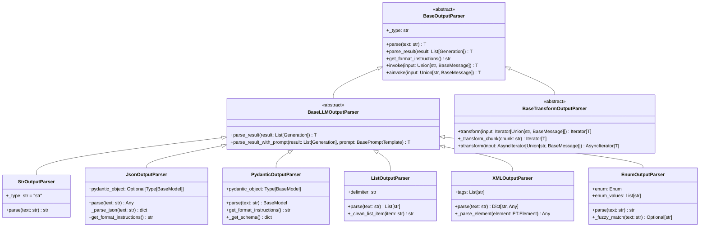
```mermaid
classDiagram
    class BaseOutputParser {
        <<abstract>>
        +parse(text: str) T
        +parse_result(result: List[Generation]) T
        +get_format_instructions() str
        +_type: str
        +invoke(input: Union[str, BaseMessage]) T
        +ainvoke(input: Union[str, BaseMessage]) T
    }

    class BaseLLMOutputParser {
        <<abstract>>
        +parse_result(result: List[Generation]) T
        +parse_result_with_prompt(result: List[Generation], prompt: BasePromptTemplate) T
    }

    class BaseTransformOutputParser {
        <<abstract>>
        +transform(input: Iterator[Union[str, BaseMessage]]) Iterator[T]
        +_transform_chunk(chunk: str) Iterator[T]
        +atransform(input: AsyncIterator[Union[str, BaseMessage]]) AsyncIterator[T]
    }

    class StrOutputParser {
        +parse(text: str) str
        +_type: str = "str"
    }

    class JsonOutputParser {
        +pydantic_object: Optional[Type[BaseModel]]
        +parse(text: str) Any
        +_parse_json(text: str) dict
        +get_format_instructions() str
    }

    class PydanticOutputParser {
        +pydantic_object: Type[BaseModel]
        +parse(text: str) BaseModel
        +get_format_instructions() str
        +_get_schema() dict
    }

    class ListOutputParser {
        +delimiter: str
        +parse(text: str) List[str]
        +_clean_list_item(item: str) str
    }

    class XMLOutputParser {
        +tags: List[str]
        +parse(text: str) Dict[str, Any]
        +_parse_element(element: ET.Element) Any
    }

    class EnumOutputParser {
        +enum: Enum
        +enum_values: List[str]
        +parse(text: str) str
        +_fuzzy_match(text: str) Optional[str]
    }

    BaseOutputParser <|-- BaseLLMOutputParser
    BaseOutputParser <|-- BaseTransformOutputParser
    BaseLLMOutputParser <|-- StrOutputParser
    BaseLLMOutputParser <|-- JsonOutputParser
    BaseLLMOutputParser <|-- PydanticOutputParser
    BaseLLMOutputParser <|-- ListOutputParser
    BaseLLMOutputParser <|-- XMLOutputParser
    BaseLLMOutputParser <|-- EnumOutputParser
```

**图解说明**：

1. **抽象基类**：
   - `BaseOutputParser`：所有解析器的根基类，定义核心接口
   - `BaseLLMOutputParser`：专门处理LLM输出的解析器基类
   - `BaseTransformOutputParser`：支持流式转换的解析器基类

2. **具体实现**：
   - `StrOutputParser`：最简单的字符串解析器
   - `JsonOutputParser`：JSON格式解析器
   - `PydanticOutputParser`：强类型Pydantic对象解析器
   - `ListOutputParser`：列表格式解析器
   - `XMLOutputParser`：XML格式解析器
   - `EnumOutputParser`：枚举值解析器

3. **核心能力**：
   - 类型安全的解析转换
   - 格式说明生成
   - 错误处理和恢复
   - 流式处理支持

---

## 2. BaseOutputParser 核心字段

### 2.1 基础字段结构

```python
class BaseOutputParser(Generic[T], Runnable[Union[str, BaseMessage], T]):
    """输出解析器基类。"""

    # 抽象属性
    _type: str                              # 解析器类型标识

    # 可选配置
    return_values_key: str = "output"       # 返回值键名
    format_instructions: Optional[str] = None  # 格式说明缓存

    # 内部状态
    _parsed_count: int = 0                  # 解析次数计数
    _error_count: int = 0                   # 错误次数计数
    _last_error: Optional[Exception] = None # 最后一个错误
```

**字段详解**：

| 字段 | 类型 | 必填 | 说明 |
|-----|------|-----|------|
| _type | `str` | 是 | 解析器类型标识，用于序列化和调试 |
| return_values_key | `str` | 否 | 在Chain中使用时的返回值键名 |
| format_instructions | `str` | 否 | 缓存的格式说明，避免重复生成 |
| _parsed_count | `int` | 否 | 成功解析的次数，用于统计 |
| _error_count | `int` | 否 | 解析错误的次数，用于监控 |
| _last_error | `Exception` | 否 | 最后一次解析错误，用于调试 |

---

## 3. 具体解析器数据结构

### 3.1 JsonOutputParser 结构

```python
class JsonOutputParser(BaseLLMOutputParser[Any]):
    """JSON输出解析器。"""

    def __init__(self, pydantic_object: Optional[Type[BaseModel]] = None):
        self.pydantic_object = pydantic_object
        self._schema_cache: Optional[dict] = None
        self._format_instructions_cache: Optional[str] = None

    # 核心字段
    pydantic_object: Optional[Type[BaseModel]]  # 可选的Pydantic模型
    _schema_cache: Optional[dict]               # 缓存的JSON Schema
    _format_instructions_cache: Optional[str]   # 缓存的格式说明

    # 解析配置
    parse_json_markdown: bool = True            # 是否解析markdown中的JSON
    return_dict: bool = True                    # 是否返回字典而非Pydantic对象
```

**字段使用示例**：

```python
from pydantic import BaseModel, Field

class UserProfile(BaseModel):
    name: str = Field(description="用户姓名")
    age: int = Field(description="年龄", ge=0, le=150)
    email: str = Field(description="邮箱地址")

# 创建解析器
parser = JsonOutputParser(pydantic_object=UserProfile)

# 字段访问
print(f"解析器类型: {parser._type}")                    # "json"
print(f"关联模型: {parser.pydantic_object.__name__}")    # "UserProfile"
print(f"Schema缓存: {parser._schema_cache is None}")    # True (未生成)

# 生成格式说明时会缓存schema
instructions = parser.get_format_instructions()
print(f"Schema已缓存: {parser._schema_cache is not None}")  # True
```

---

### 3.2 PydanticOutputParser 结构

```python
class PydanticOutputParser(BaseLLMOutputParser[T]):
    """Pydantic输出解析器。"""

    def __init__(self, pydantic_object: Type[T]):
        if not issubclass(pydantic_object, BaseModel):
            raise ValueError("pydantic_object must be a Pydantic BaseModel")

        self.pydantic_object = pydantic_object
        self._schema: dict = pydantic_object.schema()
        self._field_info: Dict[str, Any] = self._extract_field_info()

    # 核心字段
    pydantic_object: Type[BaseModel]           # Pydantic模型类
    _schema: dict                              # 模型的JSON Schema
    _field_info: Dict[str, Any]                # 字段信息摘要

    # 验证配置
    strict_validation: bool = True             # 是否严格验证
    allow_extra_fields: bool = False           # 是否允许额外字段
```

**字段信息提取**：

```python
def _extract_field_info(self) -> Dict[str, Any]:
    """提取字段信息。"""
    field_info = {}

    for field_name, field in self.pydantic_object.__fields__.items():
        field_info[field_name] = {
            "type": field.type_,
            "required": field.required,
            "default": field.default if field.default is not ... else None,
            "description": field.field_info.description,
            "constraints": {
                "min_length": getattr(field.field_info, "min_length", None),
                "max_length": getattr(field.field_info, "max_length", None),
                "ge": getattr(field.field_info, "ge", None),
                "le": getattr(field.field_info, "le", None),
                "regex": getattr(field.field_info, "regex", None),
            }
        }

    return field_info
```

---

### 3.3 ListOutputParser 结构

```python
class ListOutputParser(BaseLLMOutputParser[List[str]]):
    """列表输出解析器。"""

    def __init__(self, delimiter: str = "\n"):
        self.delimiter = delimiter
        self._list_patterns = self._compile_patterns()
        self._clean_patterns = self._compile_clean_patterns()

    # 核心字段
    delimiter: str                             # 列表项分隔符
    _list_patterns: List[Pattern]              # 编译的列表格式正则
    _clean_patterns: List[Pattern]             # 编译的清理正则

    # 解析配置
    strip_whitespace: bool = True              # 是否去除空白
    remove_empty_items: bool = True            # 是否移除空项
    max_items: Optional[int] = None            # 最大项目数限制
```

**模式编译**：

```python
def _compile_patterns(self) -> List[Pattern]:
    """编译列表识别模式。"""
    patterns = [
        re.compile(r'^\d+\.\s*(.+)$'),          # "1. 项目"
        re.compile(r'^[a-zA-Z]\)\s*(.+)$'),     # "a) 项目"
        re.compile(r'^[-*+•]\s*(.+)$'),         # "- 项目"
        re.compile(r'^>\s*(.+)$'),              # "> 项目"
        re.compile(r'^\(\d+\)\s*(.+)$'),        # "(1) 项目"
    ]
    return patterns

def _compile_clean_patterns(self) -> List[Pattern]:
    """编译清理模式。"""
    return [
        re.compile(r'^\s*[-*+•]\s*'),           # 移除列表符号
        re.compile(r'^\s*\d+[.)]\s*'),          # 移除数字编号
        re.compile(r'^\s*[a-zA-Z][.)]\s*'),     # 移除字母编号
        re.compile(r'^\s*[>\s]+'),              # 移除引用符号
    ]
```

---

## 4. 错误处理数据结构

### 4.1 OutputParserException 结构

```python
class OutputParserException(ValueError):
    """输出解析异常。"""

    def __init__(
        self,
        error: str,
        observation: str = "",
        llm_output: str = "",
        send_to_llm: bool = False
    ):
        super().__init__(error)
        self.error = error                      # 错误描述
        self.observation = observation          # 观察信息（给Agent）
        self.llm_output = llm_output           # 原始LLM输出
        self.send_to_llm = send_to_llm         # 是否发送给LLM重试

        # 扩展信息
        self.parser_type: Optional[str] = None  # 解析器类型
        self.expected_format: Optional[str] = None  # 期望格式
        self.actual_format: Optional[str] = None    # 实际格式
        self.suggestions: List[str] = []        # 修复建议
        self.timestamp: float = time.time()     # 错误时间戳
```

**异常使用示例**：

```python
def parse_with_detailed_error(parser, text: str):
    """带详细错误信息的解析。"""
    try:
        return parser.parse(text)
    except json.JSONDecodeError as e:
        raise OutputParserException(
            error=f"JSON解析失败: {e.msg}",
            observation="输出不是有效的JSON格式",
            llm_output=text,
            send_to_llm=True
        )
    except ValidationError as e:
        suggestions = []
        for error in e.errors():
            field = error['loc'][0] if error['loc'] else 'unknown'
            suggestions.append(f"字段 '{field}': {error['msg']}")

        raise OutputParserException(
            error=f"数据验证失败: {len(e.errors())}个错误",
            observation="输出数据不符合要求的格式",
            llm_output=text,
            send_to_llm=True,
            suggestions=suggestions
        )
```

---

### 4.2 解析结果包装器

```python
class ParseResult(Generic[T]):
    """解析结果包装器。"""

    def __init__(
        self,
        value: Optional[T] = None,
        success: bool = True,
        error: Optional[Exception] = None,
        metadata: Optional[Dict[str, Any]] = None
    ):
        self.value = value                      # 解析结果值
        self.success = success                  # 是否成功
        self.error = error                      # 错误信息
        self.metadata = metadata or {}          # 元数据

        # 统计信息
        self.parse_time: Optional[float] = None # 解析耗时
        self.retry_count: int = 0               # 重试次数
        self.parser_type: Optional[str] = None  # 解析器类型

    def is_success(self) -> bool:
        """检查是否成功。"""
        return self.success and self.value is not None

    def get_value_or_default(self, default: T) -> T:
        """获取值或默认值。"""
        return self.value if self.is_success() else default

    def to_dict(self) -> Dict[str, Any]:
        """转换为字典。"""
        return {
            "value": self.value,
            "success": self.success,
            "error": str(self.error) if self.error else None,
            "metadata": self.metadata,
            "parse_time": self.parse_time,
            "retry_count": self.retry_count,
            "parser_type": self.parser_type
        }

# 使用示例
def safe_parse(parser: BaseOutputParser, text: str) -> ParseResult:
    """安全解析，返回包装结果。"""
    start_time = time.time()

    try:
        value = parser.parse(text)
        parse_time = time.time() - start_time

        return ParseResult(
            value=value,
            success=True,
            metadata={"original_text_length": len(text)},
            parse_time=parse_time,
            parser_type=parser._type
        )
    except Exception as e:
        parse_time = time.time() - start_time

        return ParseResult(
            success=False,
            error=e,
            metadata={"original_text_length": len(text)},
            parse_time=parse_time,
            parser_type=parser._type
        )
```

---

## 5. 流式解析数据结构

### 5.1 流式解析状态

```python
class StreamParseState:
    """流式解析状态。"""

    def __init__(self):
        self.buffer: str = ""                   # 累积缓冲区
        self.partial_results: List[Any] = []    # 部分结果
        self.complete_objects: List[Any] = []   # 完整对象
        self.parse_errors: List[Exception] = [] # 解析错误

        # 状态标记
        self.is_parsing: bool = False           # 是否正在解析
        self.last_update: float = time.time()   # 最后更新时间
        self.chunk_count: int = 0               # 块计数

        # JSON特定状态
        self.brace_depth: int = 0               # 大括号深度
        self.bracket_depth: int = 0             # 中括号深度
        self.in_string: bool = False            # 是否在字符串中
        self.escape_next: bool = False          # 下一个字符是否转义

    def add_chunk(self, chunk: str) -> None:
        """添加新的文本块。"""
        self.buffer += chunk
        self.chunk_count += 1
        self.last_update = time.time()

    def get_statistics(self) -> Dict[str, Any]:
        """获取解析统计。"""
        return {
            "buffer_length": len(self.buffer),
            "partial_results_count": len(self.partial_results),
            "complete_objects_count": len(self.complete_objects),
            "error_count": len(self.parse_errors),
            "chunk_count": self.chunk_count,
            "parsing_duration": time.time() - self.last_update
        }
```

---

### 5.2 JSON流式解析器状态

```python
class JsonStreamState(StreamParseState):
    """JSON流式解析状态。"""

    def __init__(self):
        super().__init__()
        self.json_stack: List[Union[dict, list]] = []  # JSON对象栈
        self.current_key: Optional[str] = None         # 当前键
        self.key_buffer: str = ""                      # 键缓冲区
        self.value_buffer: str = ""                    # 值缓冲区

    def update_json_state(self, char: str) -> None:
        """更新JSON解析状态。"""
        if self.escape_next:
            self.escape_next = False
            return

        if char == '\\' and self.in_string:
            self.escape_next = True
            return

        if char == '"' and not self.escape_next:
            self.in_string = not self.in_string
            return

        if not self.in_string:
            if char == '{':
                self.brace_depth += 1
                self.json_stack.append({})
            elif char == '}':
                self.brace_depth -= 1
                if self.json_stack:
                    obj = self.json_stack.pop()
                    if self.brace_depth == 0:
                        self.complete_objects.append(obj)
            elif char == '[':
                self.bracket_depth += 1
                self.json_stack.append([])
            elif char == ']':
                self.bracket_depth -= 1
                if self.json_stack:
                    arr = self.json_stack.pop()
                    if self.bracket_depth == 0:
                        self.complete_objects.append(arr)

    def is_complete_json(self) -> bool:
        """检查是否有完整的JSON对象。"""
        return (self.brace_depth == 0 and
                self.bracket_depth == 0 and
                not self.in_string and
                len(self.complete_objects) > 0)
```

---

## 6. 解析器配置数据结构

### 6.1 解析器配置类

```python
class ParserConfig:
    """解析器配置。"""

    def __init__(
        self,
        # 基础配置
        strict_mode: bool = False,              # 严格模式
        max_retries: int = 3,                   # 最大重试次数
        timeout: Optional[float] = None,        # 解析超时

        # 错误处理
        handle_errors: bool = True,             # 是否处理错误
        fallback_to_string: bool = False,       # 是否回退到字符串
        log_errors: bool = True,                # 是否记录错误

        # 性能配置
        enable_caching: bool = True,            # 是否启用缓存
        cache_size: int = 100,                  # 缓存大小
        enable_streaming: bool = False,         # 是否启用流式处理

        # 格式配置
        auto_fix_format: bool = True,           # 是否自动修复格式
        preserve_order: bool = False,           # 是否保持顺序
        allow_partial: bool = False,            # 是否允许部分解析
    ):
        self.strict_mode = strict_mode
        self.max_retries = max_retries
        self.timeout = timeout
        self.handle_errors = handle_errors
        self.fallback_to_string = fallback_to_string
        self.log_errors = log_errors
        self.enable_caching = enable_caching
        self.cache_size = cache_size
        self.enable_streaming = enable_streaming
        self.auto_fix_format = auto_fix_format
        self.preserve_order = preserve_order
        self.allow_partial = allow_partial

    def validate(self) -> None:
        """验证配置。"""
        if self.max_retries < 0:
            raise ValueError("max_retries must be non-negative")

        if self.timeout is not None and self.timeout <= 0:
            raise ValueError("timeout must be positive")

        if self.cache_size <= 0:
            raise ValueError("cache_size must be positive")

    def to_dict(self) -> Dict[str, Any]:
        """转换为字典。"""
        return {
            "strict_mode": self.strict_mode,
            "max_retries": self.max_retries,
            "timeout": self.timeout,
            "handle_errors": self.handle_errors,
            "fallback_to_string": self.fallback_to_string,
            "log_errors": self.log_errors,
            "enable_caching": self.enable_caching,
            "cache_size": self.cache_size,
            "enable_streaming": self.enable_streaming,
            "auto_fix_format": self.auto_fix_format,
            "preserve_order": self.preserve_order,
            "allow_partial": self.allow_partial
        }
```

---

## 7. 缓存和性能数据结构

### 7.1 解析缓存

```python
class ParseCache:
    """解析结果缓存。"""

    def __init__(self, max_size: int = 100):
        self.max_size = max_size
        self._cache: Dict[str, CacheEntry] = {}
        self._access_order: List[str] = []      # LRU跟踪
        self._hit_count: int = 0                # 命中次数
        self._miss_count: int = 0               # 未命中次数

    def get(self, key: str) -> Optional[Any]:
        """获取缓存值。"""
        if key in self._cache:
            entry = self._cache[key]
            if not entry.is_expired():
                # 更新访问顺序
                if key in self._access_order:
                    self._access_order.remove(key)
                self._access_order.append(key)

                self._hit_count += 1
                return entry.value
            else:
                # 已过期，删除
                del self._cache[key]
                if key in self._access_order:
                    self._access_order.remove(key)

        self._miss_count += 1
        return None

    def put(self, key: str, value: Any, ttl: int = 3600) -> None:
        """存储缓存值。"""
        # 检查容量限制
        if len(self._cache) >= self.max_size and key not in self._cache:
            # 删除最久未使用的项
            if self._access_order:
                oldest_key = self._access_order.pop(0)
                self._cache.pop(oldest_key, None)

        # 存储新值
        self._cache[key] = CacheEntry(value, ttl)

        # 更新访问顺序
        if key in self._access_order:
            self._access_order.remove(key)
        self._access_order.append(key)

    def get_stats(self) -> Dict[str, Any]:
        """获取缓存统计。"""
        total_requests = self._hit_count + self._miss_count
        hit_rate = self._hit_count / total_requests if total_requests > 0 else 0

        return {
            "size": len(self._cache),
            "max_size": self.max_size,
            "hit_count": self._hit_count,
            "miss_count": self._miss_count,
            "hit_rate": hit_rate,
            "usage_ratio": len(self._cache) / self.max_size
        }

class CacheEntry:
    """缓存条目。"""

    def __init__(self, value: Any, ttl: int = 3600):
        self.value = value
        self.created_at = time.time()
        self.ttl = ttl
        self.access_count = 0

    def is_expired(self) -> bool:
        """检查是否过期。"""
        return time.time() - self.created_at > self.ttl

    def touch(self) -> None:
        """更新访问时间。"""
        self.access_count += 1
```

---

## 8. 解析器注册表

### 8.1 解析器工厂

```python
class ParserRegistry:
    """解析器注册表。"""

    def __init__(self):
        self._parsers: Dict[str, Type[BaseOutputParser]] = {}
        self._instances: Dict[str, BaseOutputParser] = {}
        self._configs: Dict[str, ParserConfig] = {}

        # 注册默认解析器
        self._register_defaults()

    def register(
        self,
        name: str,
        parser_class: Type[BaseOutputParser],
        config: Optional[ParserConfig] = None
    ) -> None:
        """注册解析器。"""
        self._parsers[name] = parser_class
        if config:
            self._configs[name] = config

    def create(self, name: str, **kwargs) -> BaseOutputParser:
        """创建解析器实例。"""
        if name not in self._parsers:
            raise ValueError(f"Unknown parser: {name}")

        parser_class = self._parsers[name]
        config = self._configs.get(name)

        # 合并配置
        if config:
            kwargs = {**config.to_dict(), **kwargs}

        return parser_class(**kwargs)

    def get_or_create(self, name: str, **kwargs) -> BaseOutputParser:
        """获取或创建单例解析器。"""
        cache_key = f"{name}_{hash(str(sorted(kwargs.items())))}"

        if cache_key not in self._instances:
            self._instances[cache_key] = self.create(name, **kwargs)

        return self._instances[cache_key]

    def list_parsers(self) -> List[str]:
        """列出所有注册的解析器。"""
        return list(self._parsers.keys())

    def _register_defaults(self) -> None:
        """注册默认解析器。"""
        self.register("str", StrOutputParser)
        self.register("json", JsonOutputParser)
        self.register("pydantic", PydanticOutputParser)
        self.register("list", ListOutputParser)
        self.register("xml", XMLOutputParser)
        self.register("enum", EnumOutputParser)

# 全局注册表
parser_registry = ParserRegistry()

# 使用示例
def create_parser(parser_type: str, **config):
    """创建解析器的便捷函数。"""
    return parser_registry.create(parser_type, **config)

# 创建不同类型的解析器
str_parser = create_parser("str")
json_parser = create_parser("json", pydantic_object=UserProfile)
list_parser = create_parser("list", delimiter=",")
```

---

## 9. 性能监控数据结构

### 9.1 解析器性能指标

```python
class ParserMetrics:
    """解析器性能指标。"""

    def __init__(self, parser_type: str):
        self.parser_type = parser_type
        self.parse_count = 0                    # 解析次数
        self.success_count = 0                  # 成功次数
        self.error_count = 0                    # 错误次数
        self.total_parse_time = 0.0             # 总解析时间
        self.parse_times: List[float] = []      # 解析时间列表
        self.error_types: Dict[str, int] = defaultdict(int)  # 错误类型统计

        # 输入统计
        self.total_input_length = 0             # 总输入长度
        self.input_lengths: List[int] = []      # 输入长度列表

        # 输出统计
        self.output_type_counts: Dict[str, int] = defaultdict(int)  # 输出类型统计

    def record_parse(
        self,
        success: bool,
        parse_time: float,
        input_length: int,
        output_type: Optional[str] = None,
        error_type: Optional[str] = None
    ) -> None:
        """记录解析结果。"""
        self.parse_count += 1
        self.total_parse_time += parse_time
        self.parse_times.append(parse_time)
        self.total_input_length += input_length
        self.input_lengths.append(input_length)

        if success:
            self.success_count += 1
            if output_type:
                self.output_type_counts[output_type] += 1
        else:
            self.error_count += 1
            if error_type:
                self.error_types[error_type] += 1

    def get_statistics(self) -> Dict[str, Any]:
        """获取统计信息。"""
        if self.parse_count == 0:
            return {"parser_type": self.parser_type, "no_data": True}

        return {
            "parser_type": self.parser_type,
            "parse_count": self.parse_count,
            "success_rate": self.success_count / self.parse_count,
            "error_rate": self.error_count / self.parse_count,
            "average_parse_time": self.total_parse_time / self.parse_count,
            "median_parse_time": self._calculate_median(self.parse_times),
            "p95_parse_time": self._calculate_percentile(self.parse_times, 0.95),
            "average_input_length": self.total_input_length / self.parse_count,
            "max_input_length": max(self.input_lengths) if self.input_lengths else 0,
            "min_input_length": min(self.input_lengths) if self.input_lengths else 0,
            "common_errors": dict(sorted(self.error_types.items(), key=lambda x: x[1], reverse=True)[:5]),
            "output_types": dict(self.output_type_counts)
        }

    def _calculate_median(self, values: List[float]) -> float:
        """计算中位数。"""
        if not values:
            return 0.0
        sorted_values = sorted(values)
        n = len(sorted_values)
        if n % 2 == 0:
            return (sorted_values[n//2 - 1] + sorted_values[n//2]) / 2
        else:
            return sorted_values[n//2]

    def _calculate_percentile(self, values: List[float], percentile: float) -> float:
        """计算百分位数。"""
        if not values:
            return 0.0
        sorted_values = sorted(values)
        index = int(percentile * len(sorted_values))
        return sorted_values[min(index, len(sorted_values) - 1)]
```

---

## 10. 总结

本文档详细描述了 **Output Parsers 模块**的核心数据结构：

1. **类层次结构**：从基类到具体实现的完整继承关系
2. **解析器字段**：各种解析器的核心字段和配置选项
3. **错误处理**：异常类型和错误恢复机制
4. **流式解析**：流式处理的状态管理和缓冲机制
5. **配置管理**：解析器配置和注册表系统
6. **缓存系统**：性能优化的缓存机制
7. **性能监控**：解析器执行的指标收集

所有数据结构均包含：

- 完整的字段定义和类型说明
- 详细的使用示例和配置方法
- 性能特征和优化策略
- 错误处理和恢复机制

这些结构为构建高效、可靠的输出解析系统提供了完整的数据模型基础，支持从简单文本解析到复杂结构化数据转换的各种需求。

---

## 时序图

## 文档说明

本文档通过详细的时序图展示 **Output Parsers 模块**在各种场景下的执行流程，包括不同解析器的工作机制、错误处理、流式解析、缓存优化等复杂交互过程。

---

## 1. 基础解析场景

### 1.1 StrOutputParser 简单解析流程

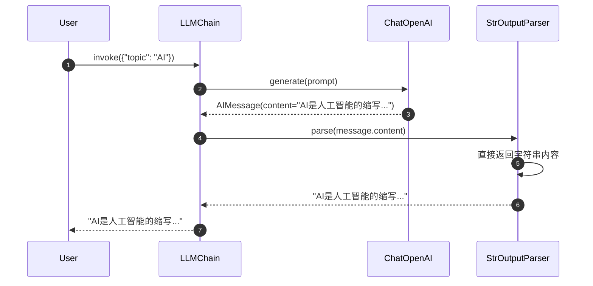
```mermaid
sequenceDiagram
    autonumber
    participant User
    participant Chain as LLMChain
    participant Model as ChatOpenAI
    participant Parser as StrOutputParser

    User->>Chain: invoke({"topic": "AI"})
    Chain->>Model: generate(prompt)
    Model-->>Chain: AIMessage(content="AI是人工智能的缩写...")

    Chain->>Parser: parse(message.content)
    Parser->>Parser: 直接返回字符串内容
    Parser-->>Chain: "AI是人工智能的缩写..."

    Chain-->>User: "AI是人工智能的缩写..."
```

**关键特点**：

- 最简单的解析器，无需任何转换
- 直接返回LLM输出的文本内容
- 解析时间 < 1ms，几乎无性能开销
- 适用于不需要结构化的文本输出场景

---

### 1.2 JsonOutputParser 标准解析流程

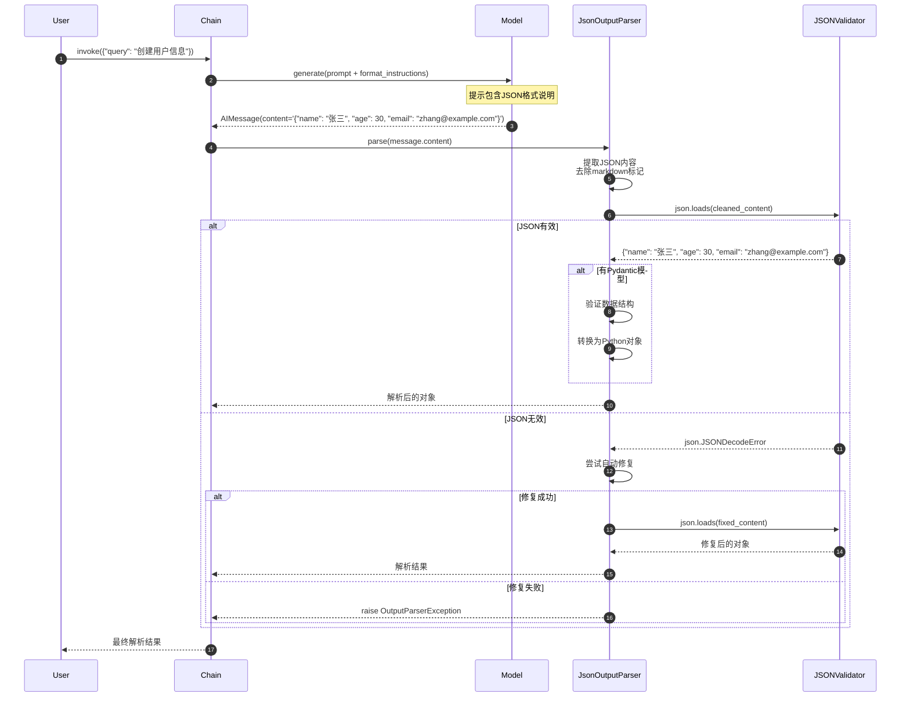
```mermaid
sequenceDiagram
    autonumber
    participant User
    participant Chain
    participant Model
    participant Parser as JsonOutputParser
    participant Validator as JSONValidator

    User->>Chain: invoke({"query": "创建用户信息"})

    Chain->>Model: generate(prompt + format_instructions)
    Note over Model: 提示包含JSON格式说明
    Model-->>Chain: AIMessage(content='{"name": "张三", "age": 30, "email": "zhang@example.com"}')

    Chain->>Parser: parse(message.content)

    Parser->>Parser: 提取JSON内容<br/>去除markdown标记

    Parser->>Validator: json.loads(cleaned_content)

    alt JSON有效
        Validator-->>Parser: {"name": "张三", "age": 30, "email": "zhang@example.com"}

        alt 有Pydantic模型
            Parser->>Parser: 验证数据结构
            Parser->>Parser: 转换为Python对象
        end

        Parser-->>Chain: 解析后的对象
    else JSON无效
        Validator-->>Parser: json.JSONDecodeError
        Parser->>Parser: 尝试自动修复

        alt 修复成功
            Parser->>Validator: json.loads(fixed_content)
            Validator-->>Parser: 修复后的对象
            Parser-->>Chain: 解析结果
        else 修复失败
            Parser-->>Chain: raise OutputParserException
        end
    end

    Chain-->>User: 最终解析结果
```

**解析步骤详解**：

1. **内容清理**（步骤 5）：
   - 移除markdown代码块标记（```json）
   - 去除前后空白字符
   - 处理转义字符

2. **JSON验证**（步骤 6-7）：
   - 使用标准`json.loads()`解析
   - 检查语法正确性
   - 验证数据类型

3. **错误修复**（步骤 12-17）：
   - 修复尾随逗号
   - 补全缺失的引号
   - 修复常见格式错误

---

## 2. Pydantic解析场景

### 2.1 PydanticOutputParser 强类型解析

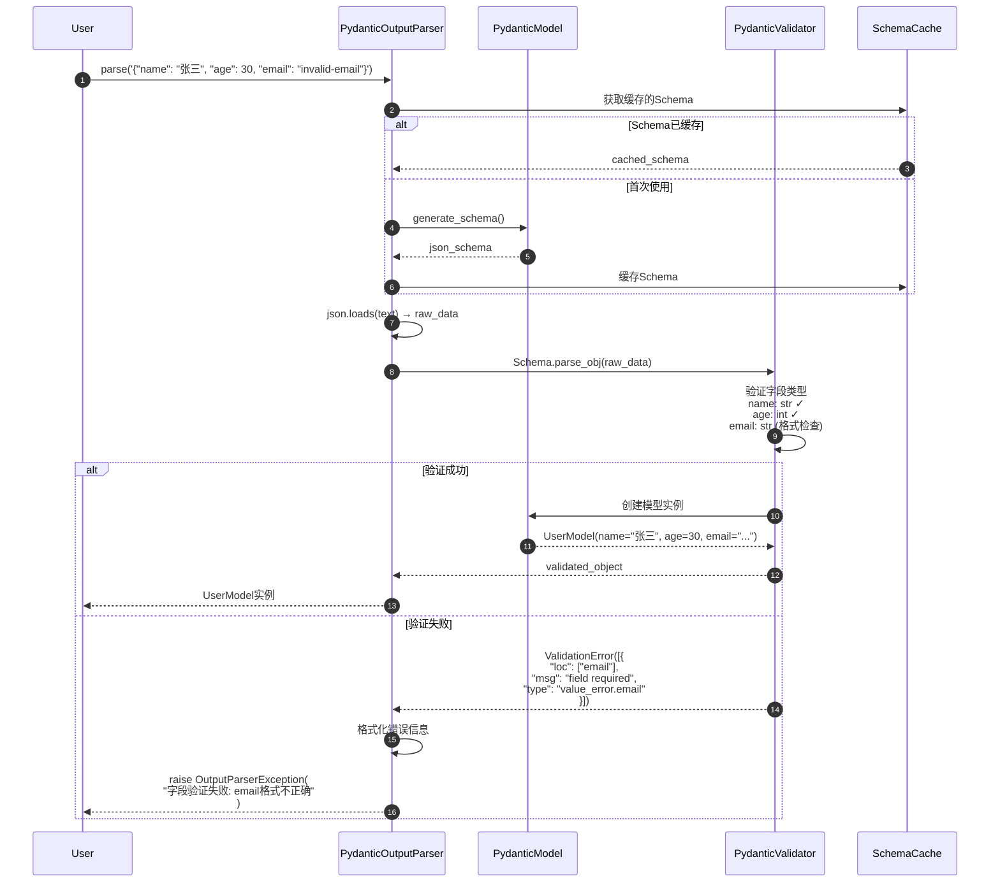
```mermaid
sequenceDiagram
    autonumber
    participant User
    participant Parser as PydanticOutputParser
    participant Schema as PydanticModel
    participant Validator as PydanticValidator
    participant Cache as SchemaCache

    User->>Parser: parse('{"name": "张三", "age": 30, "email": "invalid-email"}')

    Parser->>Cache: 获取缓存的Schema
    alt Schema已缓存
        Cache-->>Parser: cached_schema
    else 首次使用
        Parser->>Schema: generate_schema()
        Schema-->>Parser: json_schema
        Parser->>Cache: 缓存Schema
    end

    Parser->>Parser: json.loads(text) → raw_data

    Parser->>Validator: Schema.parse_obj(raw_data)

    Validator->>Validator: 验证字段类型<br/>name: str ✓<br/>age: int ✓<br/>email: str (格式检查)

    alt 验证成功
        Validator->>Schema: 创建模型实例
        Schema-->>Validator: UserModel(name="张三", age=30, email="...")
        Validator-->>Parser: validated_object
        Parser-->>User: UserModel实例
    else 验证失败
        Validator-->>Parser: ValidationError([{<br/>  "loc": ["email"],<br/>  "msg": "field required",<br/>  "type": "value_error.email"<br/>}])

        Parser->>Parser: 格式化错误信息
        Parser-->>User: raise OutputParserException(<br/>  "字段验证失败: email格式不正确"<br/>)
    end
```

**验证过程详解**：

```python
# 示例Pydantic模型
class UserProfile(BaseModel):
    name: str = Field(min_length=1, max_length=50)
    age: int = Field(ge=0, le=150)
    email: str = Field(regex=r'^[^@]+@[^@]+\.[^@]+$')

    @validator('name')
    def validate_name(cls, v):
        if not v.strip():
            raise ValueError('姓名不能为空')
        return v.strip()

# 验证流程
# 1. 类型检查：确保字段类型正确
# 2. 约束验证：检查Field中定义的约束
# 3. 自定义验证：执行@validator装饰的方法
# 4. 对象构造：创建最终的Pydantic实例
```

---

## 3. 列表解析场景

### 3.1 ListOutputParser 多格式识别

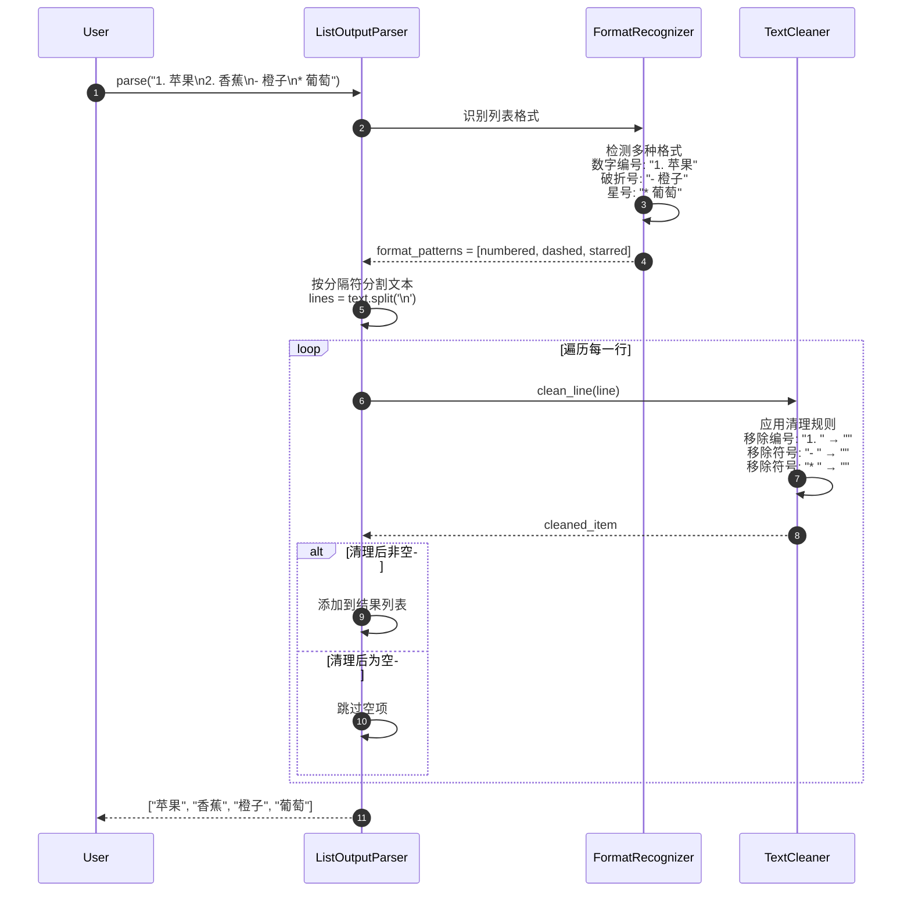
```mermaid
sequenceDiagram
    autonumber
    participant User
    participant Parser as ListOutputParser
    participant Recognizer as FormatRecognizer
    participant Cleaner as TextCleaner

    User->>Parser: parse("1. 苹果\n2. 香蕉\n- 橙子\n* 葡萄")

    Parser->>Recognizer: 识别列表格式
    Recognizer->>Recognizer: 检测多种格式<br/>数字编号: "1. 苹果"<br/>破折号: "- 橙子"<br/>星号: "* 葡萄"

    Recognizer-->>Parser: format_patterns = [numbered, dashed, starred]

    Parser->>Parser: 按分隔符分割文本<br/>lines = text.split('\n')

    loop 遍历每一行
        Parser->>Cleaner: clean_line(line)

        Cleaner->>Cleaner: 应用清理规则<br/>移除编号: "1. " → ""<br/>移除符号: "- " → ""<br/>移除符号: "* " → ""

        Cleaner-->>Parser: cleaned_item

        alt 清理后非空
            Parser->>Parser: 添加到结果列表
        else 清理后为空
            Parser->>Parser: 跳过空项
        end
    end

    Parser-->>User: ["苹果", "香蕉", "橙子", "葡萄"]
```

**格式识别规则**：

```python
# 支持的列表格式
PATTERNS = [
    r'^\s*\d+[.)]\s*(.+)$',      # "1. 项目" 或 "1) 项目"
    r'^\s*[a-zA-Z][.)]\s*(.+)$', # "a. 项目" 或 "a) 项目"
    r'^\s*[-*+•]\s*(.+)$',       # "- 项目", "* 项目", "+ 项目", "• 项目"
    r'^\s*>\s*(.+)$',            # "> 项目" (引用格式)
    r'^\s*\(\d+\)\s*(.+)$',      # "(1) 项目"
]

# 清理步骤
# 1. 去除前后空白
# 2. 移除列表标记符号
# 3. 再次去除空白
# 4. 检查是否为空项
```

---

## 4. 错误处理与恢复场景

### 4.1 JSON解析错误自动修复

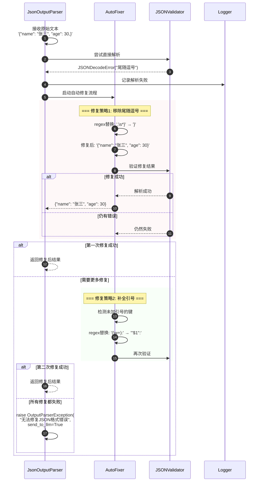
```mermaid
sequenceDiagram
    autonumber
    participant Parser as JsonOutputParser
    participant Fixer as AutoFixer
    participant Validator as JSONValidator
    participant Logger

    Parser->>Parser: 接收原始文本<br/>'{"name": "张三", "age": 30,}'

    Parser->>Validator: 尝试直接解析
    Validator-->>Parser: JSONDecodeError("尾随逗号")

    Parser->>Logger: 记录解析失败
    Parser->>Fixer: 启动自动修复流程

    rect rgb(255, 248, 248)
        Note over Fixer: === 修复策略1: 移除尾随逗号 ===
        Fixer->>Fixer: regex替换: ',\s*}' → '}'
        Fixer->>Fixer: 修复后: '{"name": "张三", "age": 30}'

        Fixer->>Validator: 验证修复结果
        alt 修复成功
            Validator-->>Fixer: 解析成功
            Fixer-->>Parser: {"name": "张三", "age": 30}
        else 仍有错误
            Validator-->>Fixer: 仍然失败
        end
    end

    alt 第一次修复成功
        Parser-->>Parser: 返回修复后结果
    else 需要更多修复
        rect rgb(248, 255, 248)
            Note over Fixer: === 修复策略2: 补全引号 ===
            Fixer->>Fixer: 检测未加引号的键
            Fixer->>Fixer: regex替换: '(\w+):' → '"$1":'
            Fixer->>Validator: 再次验证
        end

        alt 第二次修复成功
            Parser-->>Parser: 返回修复后结果
        else 所有修复都失败
            Parser->>Parser: raise OutputParserException(<br/>  "无法修复JSON格式错误",<br/>  send_to_llm=True<br/>)
        end
    end
```

**自动修复策略**：

```python
class JsonAutoFixer:
    """JSON自动修复器。"""

    FIXES = [
        # 1. 移除尾随逗号
        (r',(\s*[}\]])', r'\1'),

        # 2. 为键添加引号
        (r'(\w+):', r'"\1":'),

        # 3. 修复单引号为双引号
        (r"'([^']*)'", r'"\1"'),

        # 4. 移除注释
        (r'//.*', ''),
        (r'/\*.*?\*/', ''),

        # 5. 修复布尔值
        (r'\bTrue\b', 'true'),
        (r'\bFalse\b', 'false'),
        (r'\bNone\b', 'null'),
    ]

    def fix(self, text: str) -> str:
        """应用所有修复策略。"""
        for pattern, replacement in self.FIXES:
            text = re.sub(pattern, replacement, text, flags=re.DOTALL)
        return text
```

---

### 4.2 解析异常处理流程

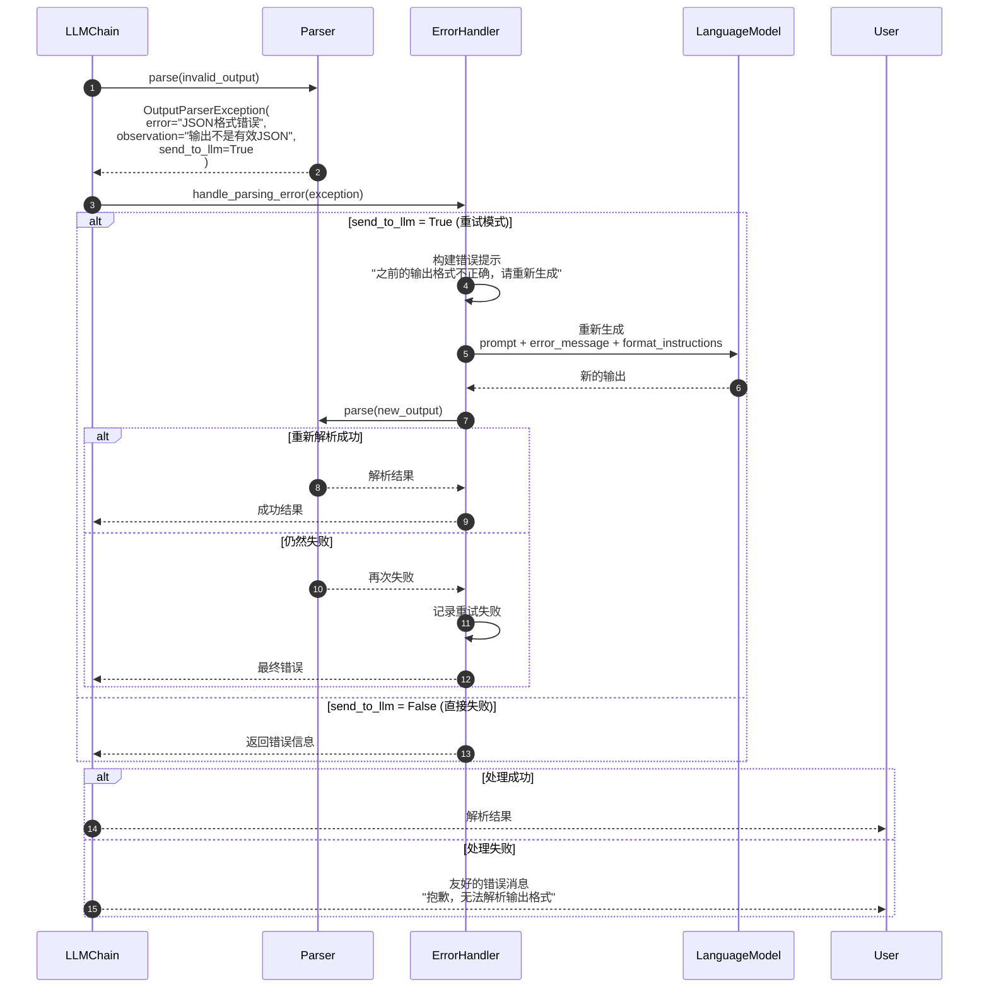
```mermaid
sequenceDiagram
    autonumber
    participant Chain as LLMChain
    participant Parser
    participant ErrorHandler
    participant LLM as LanguageModel
    participant User

    Chain->>Parser: parse(invalid_output)
    Parser-->>Chain: OutputParserException(<br/>  error="JSON格式错误",<br/>  observation="输出不是有效JSON",<br/>  send_to_llm=True<br/>)

    Chain->>ErrorHandler: handle_parsing_error(exception)

    alt send_to_llm = True (重试模式)
        ErrorHandler->>ErrorHandler: 构建错误提示<br/>"之前的输出格式不正确，请重新生成"

        ErrorHandler->>LLM: 重新生成<br/>prompt + error_message + format_instructions
        LLM-->>ErrorHandler: 新的输出

        ErrorHandler->>Parser: parse(new_output)

        alt 重新解析成功
            Parser-->>ErrorHandler: 解析结果
            ErrorHandler-->>Chain: 成功结果
        else 仍然失败
            Parser-->>ErrorHandler: 再次失败
            ErrorHandler->>ErrorHandler: 记录重试失败
            ErrorHandler-->>Chain: 最终错误
        end

    else send_to_llm = False (直接失败)
        ErrorHandler-->>Chain: 返回错误信息
    end

    alt 处理成功
        Chain-->>User: 解析结果
    else 处理失败
        Chain-->>User: 友好的错误消息<br/>"抱歉，无法解析输出格式"
    end
```

**错误处理配置**：

```python
# 不同的错误处理策略
class ErrorHandlingStrategy:
    STRICT = "strict"        # 严格模式，直接抛出异常
    RETRY = "retry"          # 重试模式，重新请求LLM
    FALLBACK = "fallback"    # 回退模式，返回原始文本
    IGNORE = "ignore"        # 忽略模式，返回None

# 配置示例
parser = JsonOutputParser(
    error_handling=ErrorHandlingStrategy.RETRY,
    max_retries=3,
    fallback_to_string=True
)
```

---

## 5. 流式解析场景

### 5.1 JsonStreamOutputParser 实时解析

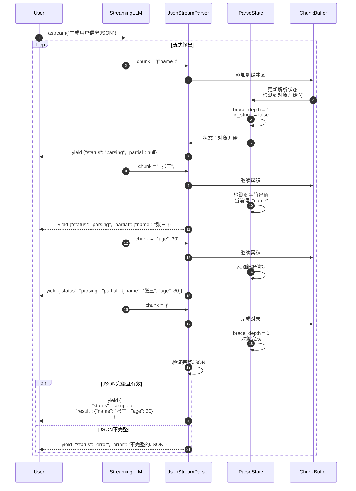
```mermaid
sequenceDiagram
    autonumber
    participant User
    participant Stream as StreamingLLM
    participant Parser as JsonStreamParser
    participant State as ParseState
    participant Buffer as ChunkBuffer

    User->>Stream: astream("生成用户信息JSON")

    loop 流式输出
        Stream->>Parser: chunk = '{"name":'
        Parser->>Buffer: 添加到缓冲区
        Buffer->>State: 更新解析状态<br/>检测到对象开始 '{'

        State->>State: brace_depth = 1<br/>in_string = false
        State-->>Parser: 状态：对象开始
        Parser-->>User: yield {"status": "parsing", "partial": null}

        Stream->>Parser: chunk = ' "张三",'
        Parser->>Buffer: 继续累积
        State->>State: 检测到字符串值<br/>当前键: "name"
        Parser-->>User: yield {"status": "parsing", "partial": {"name": "张三"}}

        Stream->>Parser: chunk = ' "age": 30'
        Parser->>Buffer: 继续累积
        State->>State: 添加新键值对
        Parser-->>User: yield {"status": "parsing", "partial": {"name": "张三", "age": 30}}

        Stream->>Parser: chunk = '}'
        Parser->>Buffer: 完成对象
        State->>State: brace_depth = 0<br/>对象完成

        Parser->>Parser: 验证完整JSON
        alt JSON完整且有效
            Parser-->>User: yield {<br/>  "status": "complete",<br/>  "result": {"name": "张三", "age": 30}<br/>}
        else JSON不完整
            Parser-->>User: yield {"status": "error", "error": "不完整的JSON"}
        end
    end
```

**流式解析状态管理**：

```python
class StreamParseState:
    def __init__(self):
        self.buffer = ""
        self.brace_depth = 0      # 大括号深度
        self.bracket_depth = 0    # 中括号深度
        self.in_string = False    # 是否在字符串中
        self.escape_next = False  # 下一个字符是否转义
        self.current_objects = [] # 当前解析的对象栈

    def process_char(self, char: str) -> Optional[dict]:
        """处理单个字符，返回完成的对象（如果有）。"""
        self.buffer += char

        if self.escape_next:
            self.escape_next = False
            return None

        if char == '\\' and self.in_string:
            self.escape_next = True
            return None

        if char == '"':
            self.in_string = not self.in_string
            return None

        if not self.in_string:
            if char == '{':
                self.brace_depth += 1
            elif char == '}':
                self.brace_depth -= 1
                if self.brace_depth == 0:
                    # 尝试解析完整对象
                    try:
                        obj = json.loads(self.buffer)
                        self.buffer = ""  # 清空缓冲区
                        return obj
                    except json.JSONDecodeError:
                        pass  # 继续累积

        return None
```

---

## 6. 缓存优化场景

### 6.1 解析结果缓存机制

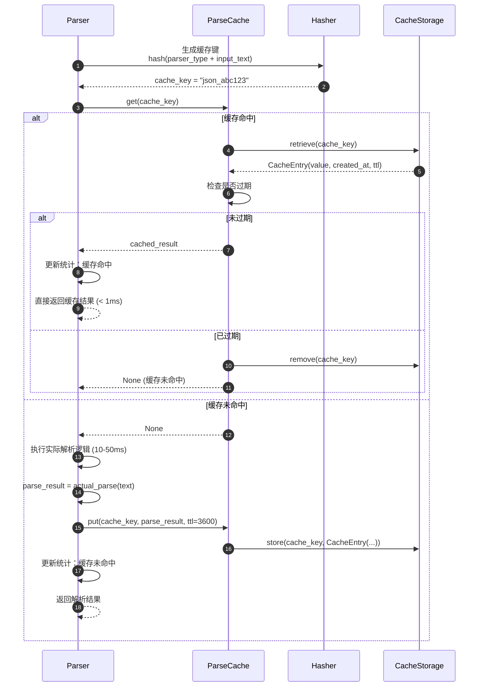
```mermaid
sequenceDiagram
    autonumber
    participant Parser
    participant Cache as ParseCache
    participant Hasher
    participant Storage as CacheStorage

    Parser->>Hasher: 生成缓存键<br/>hash(parser_type + input_text)
    Hasher-->>Parser: cache_key = "json_abc123"

    Parser->>Cache: get(cache_key)

    alt 缓存命中
        Cache->>Storage: retrieve(cache_key)
        Storage-->>Cache: CacheEntry(value, created_at, ttl)

        Cache->>Cache: 检查是否过期
        alt 未过期
            Cache-->>Parser: cached_result
            Parser->>Parser: 更新统计：缓存命中
            Parser-->>Parser: 直接返回缓存结果 (< 1ms)
        else 已过期
            Cache->>Storage: remove(cache_key)
            Cache-->>Parser: None (缓存未命中)
        end

    else 缓存未命中
        Cache-->>Parser: None

        Parser->>Parser: 执行实际解析逻辑 (10-50ms)
        Parser->>Parser: parse_result = actual_parse(text)

        Parser->>Cache: put(cache_key, parse_result, ttl=3600)
        Cache->>Storage: store(cache_key, CacheEntry(...))

        Parser->>Parser: 更新统计：缓存未命中
        Parser-->>Parser: 返回解析结果
    end
```

**缓存性能优化**：

```python
class ParseCache:
    def __init__(self, max_size: int = 1000):
        self.max_size = max_size
        self._cache = {}
        self._access_order = []  # LRU跟踪
        self._stats = {
            "hits": 0,
            "misses": 0,
            "evictions": 0
        }

    def _generate_key(self, parser_type: str, text: str) -> str:
        """生成缓存键。"""
        # 对长文本进行哈希以节省内存
        if len(text) > 1000:
            text_hash = hashlib.md5(text.encode()).hexdigest()
            return f"{parser_type}:{text_hash}"
        else:
            return f"{parser_type}:{text}"

    def _evict_lru(self) -> None:
        """淘汰最久未使用的缓存项。"""
        if self._access_order:
            lru_key = self._access_order.pop(0)
            self._cache.pop(lru_key, None)
            self._stats["evictions"] += 1
```

---

## 7. 性能监控场景

### 7.1 解析器性能追踪

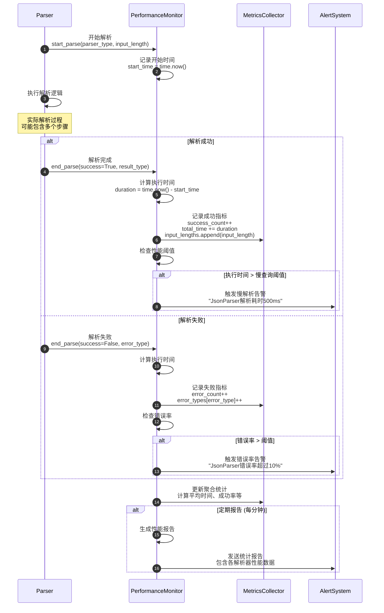
```mermaid
sequenceDiagram
    autonumber
    participant Parser
    participant Monitor as PerformanceMonitor
    participant Metrics as MetricsCollector
    participant Alert as AlertSystem

    Parser->>Monitor: 开始解析<br/>start_parse(parser_type, input_length)
    Monitor->>Monitor: 记录开始时间<br/>start_time = time.now()

    Parser->>Parser: 执行解析逻辑
    Note over Parser: 实际解析过程<br/>可能包含多个步骤

    alt 解析成功
        Parser->>Monitor: 解析完成<br/>end_parse(success=True, result_type)
        Monitor->>Monitor: 计算执行时间<br/>duration = time.now() - start_time

        Monitor->>Metrics: 记录成功指标<br/>success_count++<br/>total_time += duration<br/>input_lengths.append(input_length)

        Monitor->>Monitor: 检查性能阈值
        alt 执行时间 > 慢查询阈值
            Monitor->>Alert: 触发慢解析告警<br/>"JsonParser解析耗时500ms"
        end

    else 解析失败
        Parser->>Monitor: 解析失败<br/>end_parse(success=False, error_type)
        Monitor->>Monitor: 计算执行时间

        Monitor->>Metrics: 记录失败指标<br/>error_count++<br/>error_types[error_type]++

        Monitor->>Monitor: 检查错误率
        alt 错误率 > 阈值
            Monitor->>Alert: 触发错误率告警<br/>"JsonParser错误率超过10%"
        end
    end

    Monitor->>Metrics: 更新聚合统计<br/>计算平均时间、成功率等

    alt 定期报告 (每分钟)
        Monitor->>Monitor: 生成性能报告
        Monitor->>Alert: 发送统计报告<br/>包含各解析器性能数据
    end
```

**性能指标收集**：

```python
class ParserPerformanceMonitor:
    def __init__(self):
        self.metrics = defaultdict(ParserMetrics)
        self.alert_thresholds = {
            "slow_parse_ms": 1000,      # 慢解析阈值
            "error_rate": 0.1,          # 错误率阈值
            "memory_usage_mb": 100      # 内存使用阈值
        }

    def record_parse(self, parser_type: str, duration: float,
                    success: bool, input_length: int, **kwargs):
        """记录解析性能。"""
        metrics = self.metrics[parser_type]
        metrics.record_parse(duration, success, input_length, **kwargs)

        # 检查告警条件
        self._check_alerts(parser_type, metrics)

    def _check_alerts(self, parser_type: str, metrics: ParserMetrics):
        """检查告警条件。"""
        # 慢解析告警
        if metrics.last_parse_time > self.alert_thresholds["slow_parse_ms"]:
            self._send_alert(f"慢解析: {parser_type} 耗时 {metrics.last_parse_time}ms")

        # 错误率告警
        if metrics.error_rate > self.alert_thresholds["error_rate"]:
            self._send_alert(f"高错误率: {parser_type} 错误率 {metrics.error_rate:.2%}")
```

---

## 8. 解析器组合场景

### 8.1 多解析器链式处理

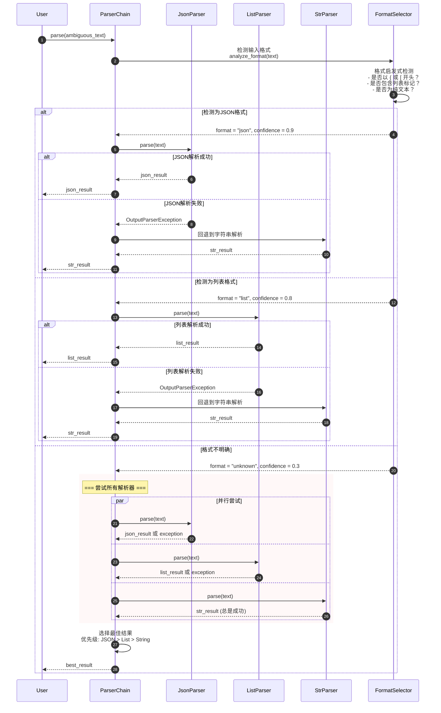
```mermaid
sequenceDiagram
    autonumber
    participant User
    participant Chain as ParserChain
    participant Parser1 as JsonParser
    participant Parser2 as ListParser
    participant Parser3 as StrParser
    participant Selector as FormatSelector

    User->>Chain: parse(ambiguous_text)
    Chain->>Selector: 检测输入格式<br/>analyze_format(text)

    Selector->>Selector: 格式启发式检测<br/>- 是否以 { 或 [ 开头？<br/>- 是否包含列表标记？<br/>- 是否为纯文本？

    alt 检测为JSON格式
        Selector-->>Chain: format = "json", confidence = 0.9
        Chain->>Parser1: parse(text)

        alt JSON解析成功
            Parser1-->>Chain: json_result
            Chain-->>User: json_result
        else JSON解析失败
            Parser1-->>Chain: OutputParserException
            Chain->>Parser3: 回退到字符串解析
            Parser3-->>Chain: str_result
            Chain-->>User: str_result
        end

    else 检测为列表格式
        Selector-->>Chain: format = "list", confidence = 0.8
        Chain->>Parser2: parse(text)

        alt 列表解析成功
            Parser2-->>Chain: list_result
            Chain-->>User: list_result
        else 列表解析失败
            Parser2-->>Chain: OutputParserException
            Chain->>Parser3: 回退到字符串解析
            Parser3-->>Chain: str_result
            Chain-->>User: str_result
        end

    else 格式不明确
        Selector-->>Chain: format = "unknown", confidence = 0.3

        rect rgb(255, 248, 248)
            Note over Chain: === 尝试所有解析器 ===
            par 并行尝试
                Chain->>Parser1: parse(text)
                Parser1-->>Chain: json_result 或 exception
            and
                Chain->>Parser2: parse(text)
                Parser2-->>Chain: list_result 或 exception
            and
                Chain->>Parser3: parse(text)
                Parser3-->>Chain: str_result (总是成功)
            end
        end

        Chain->>Chain: 选择最佳结果<br/>优先级: JSON > List > String
        Chain-->>User: best_result
    end
```

---

## 9. 总结

本文档详细展示了 **Output Parsers 模块**的关键执行时序：

1. **基础解析**：StrOutputParser、JsonOutputParser的标准解析流程
2. **强类型解析**：PydanticOutputParser的验证和类型转换机制
3. **列表解析**：ListOutputParser的多格式识别和清理过程
4. **错误处理**：自动修复、重试机制、降级策略
5. **流式解析**：实时处理流式输出的状态管理
6. **缓存优化**：解析结果缓存的命中和淘汰机制
7. **性能监控**：解析器执行的指标收集和告警
8. **解析器组合**：多解析器的智能选择和回退策略

每张时序图包含：

- 详细的执行步骤和参与者交互
- 关键决策点和分支处理逻辑
- 错误处理和恢复机制
- 性能优化点和监控策略

这些时序图帮助开发者深入理解输出解析系统的内部工作机制，为构建高效、可靠的LLM输出处理管道提供指导。Output Parsers是连接原始LLM输出和结构化应用数据的关键桥梁，正确理解其执行流程对提高应用程序的稳定性和用户体验至关重要。

---
