# LangChain-07-Tools

## 模块概览

## 模块基本信息

**模块名称**: langchain-core-tools
**模块路径**: `libs/core/langchain_core/tools/`
**核心职责**: 提供工具抽象，让代理能够与外部世界交互（搜索、计算、API 调用等）

## 1. 模块职责

### 1.1 核心职责

Tools 模块是代理与外部世界交互的桥梁，提供以下核心能力：

1. **工具定义**: 声明式定义工具接口（名称、描述、参数）
2. **参数验证**: 使用 Pydantic 自动验证输入参数
3. **同步/异步**: 支持同步和异步执行
4. **错误处理**: 统一的异常处理机制
5. **回调集成**: 支持工具执行的观测和日志
6. **类型安全**: 强类型参数和返回值
7. **装饰器语法**: 使用 `@tool` 快速创建工具

### 1.2 核心概念

```
工具定义（名称 + 描述 + 参数schema）
  ↓
代理选择工具
  ↓
工具执行（验证参数 → 执行逻辑 → 返回结果）
  ↓
结果返回给代理
```

**关键术语**:

- **BaseTool**: 所有工具的基类
- **StructuredTool**: 使用 Pydantic 模型定义参数的工具
- **Tool**: 简单函数包装工具
- **args_schema**: Pydantic 模型，定义工具参数
- **ToolException**: 工具执行异常

### 1.3 工具类型

| 工具类型 | 适用场景 | 参数定义方式 | 推荐度 |
|---------|---------|------------|--------|
| **@tool 装饰器** | 快速创建工具 | 函数类型注解 | ⭐⭐⭐⭐⭐ |
| **StructuredTool** | 复杂参数验证 | Pydantic 模型 | ⭐⭐⭐⭐⭐ |
| **Tool** | 简单字符串输入 | 字符串 | ⭐⭐⭐ |
| **自定义 BaseTool** | 完全自定义行为 | 继承实现 | ⭐⭐⭐⭐ |

### 1.4 输入/输出

**输入**:

- **tool_input**: `str` 或 `dict` - 工具参数
- **config**: `RunnableConfig` - 运行时配置（可选）

**输出**:

- `Any` - 工具执行结果（通常是字符串）

### 1.5 上下游依赖

**上游调用者**:

- `AgentExecutor`: 代理执行器
- 用户应用代码

**下游依赖**:

- `pydantic`: 参数验证
- `langchain_core.callbacks`: 回调系统
- `langchain_core.runnables`: Runnable 协议

## 2. 模块级架构图

```mermaid
flowchart TB
    subgraph Base["基础抽象层"]
        BT[BaseTool<br/>工具基类]
        RS[RunnableSerializable<br/>可运行+可序列化]
    end

    subgraph Implementations["工具实现"]
        TOOL[Tool<br/>简单函数工具]
        ST[StructuredTool<br/>结构化工具]
        CUSTOM[CustomTool<br/>自定义工具]
    end

    subgraph Decorators["装饰器"]
        TOOL_DEC[@tool<br/>函数装饰器]
    end

    subgraph Utilities["工具辅助"]
        CONVERT[convert_runnable_to_tool<br/>Runnable转工具]
        RETRIEVER[create_retriever_tool<br/>检索器工具]
        RENDER[render_text_description<br/>工具描述渲染]
    end

    subgraph Exception["异常处理"]
        TE[ToolException<br/>工具异常]
        HTE[handle_tool_error<br/>错误处理器]
    end

    subgraph Schema["Schema生成"]
        SCHEMA[create_schema_from_function<br/>从函数生成schema]
        ARGS[args_schema<br/>Pydantic模型]
    end

    RS --> BT
    BT --> TOOL
    BT --> ST
    BT --> CUSTOM

    TOOL_DEC --> ST
    CONVERT --> BT
    RETRIEVER --> ST

    BT --> TE
    BT --> HTE
    BT --> SCHEMA
    BT --> ARGS

    style Base fill:#e1f5ff
    style Implementations fill:#fff4e1
    style Decorators fill:#e8f5e9
    style Utilities fill:#f3e5f5
    style Exception fill:#ffebee
    style Schema fill:#fff3e0
```

### 架构图详细说明

**1. 基础抽象层**

- **BaseTool**: 所有工具的基类
  - 继承自 `RunnableSerializable`，自动支持 LCEL
  - 定义工具的核心属性：`name`、`description`、`args_schema`
  - 提供同步 `_run` 和异步 `_arun` 抽象方法
  - 实现 `invoke`、`run`、`ainvoke`、`arun` 等执行方法
  - 集成回调系统

**核心属性**:

```python
class BaseTool:
    name: str  # 工具名称（唯一标识）
    description: str  # 工具描述（LLM 选择工具的依据）
    args_schema: Optional[Type[BaseModel]] = None  # 参数 schema
    return_direct: bool = False  # 是否直接返回结果
    verbose: bool = False  # 是否打印详细日志
    callbacks: Callbacks = None  # 回调处理器
    handle_tool_error: Union[bool, str, Callable] = False  # 错误处理
```

**2. 工具实现**

- **Tool**: 简单工具实现
  - 包装单个函数或协程
  - 参数为字符串或简单字典
  - 适合简单场景

  ```python
  def search_function(query: str) -> str:
      return f"Results for {query}"

  tool = Tool(
      name="search",
      description="Search the web",
      func=search_function
  )
```

- **StructuredTool**: 结构化工具
  - 使用 Pydantic 模型定义参数
  - 自动参数验证
  - 支持复杂嵌套参数
  - 推荐使用方式

  ```python
  class SearchInput(BaseModel):
      query: str = Field(description="Search query")
      max_results: int = Field(default=5, description="Max results")

  tool = StructuredTool(
      name="search",
      description="Search the web",
      func=search_function,
      args_schema=SearchInput
  )
```

- **自定义 BaseTool**: 完全自定义
  - 继承 `BaseTool`
  - 实现 `_run` 和 `_arun` 方法
  - 适合复杂逻辑和状态管理

  ```python
  class CustomSearchTool(BaseTool):
      name: str = "search"
      description: str = "Search the web"

      def _run(self, query: str) -> str:
          # 自定义逻辑
          return results

      async def _arun(self, query: str) -> str:
          # 异步逻辑
          return results
```

**3. 装饰器语法**

- **@tool 装饰器**: 最推荐的创建方式
  - 自动推断参数 schema（从类型注解）
  - 自动生成描述（从 docstring）
  - 支持同步和异步函数
  - 代码简洁

  ```python
  from langchain_core.tools import tool

  @tool
  def search(query: str, max_results: int = 5) -> str:
      """Search the web for information.

      Args:
          query: The search query
          max_results: Maximum number of results
      """
      return f"Results for {query}"

  # 自动生成：
  # name = "search"
  # description = "Search the web for information..."
  # args_schema = 自动推断
```

**4. 工具辅助**

- **convert_runnable_to_tool**: 将任何 Runnable 转换为工具

  ```python
  chain = prompt | model | parser
  tool = convert_runnable_to_tool(
      chain,
      name="qa_chain",
      description="Answer questions"
  )
```

- **create_retriever_tool**: 创建检索器工具（RAG）

  ```python
  retriever_tool = create_retriever_tool(
      retriever=vectorstore.as_retriever(),
      name="knowledge_base",
      description="Search internal knowledge base"
  )
```

- **render_text_description**: 渲染工具列表描述

  ```python
  tools_desc = render_text_description(tools)
  # 生成：
  # search: Search the web for information
  # calculator: Perform mathematical calculations
```

**5. 异常处理**

- **ToolException**: 工具执行异常
  - 不会停止代理执行
  - 错误信息作为观察返回给代理
  - 代理可以根据错误调整策略

- **handle_tool_error**: 错误处理配置
  - `False`（默认）: 抛出异常
  - `True`: 返回错误信息字符串
  - `str`: 返回自定义错误消息
  - `Callable`: 调用函数处理错误

**6. Schema 生成**

- **create_schema_from_function**: 从函数生成 Pydantic schema
  - 解析函数签名
  - 提取类型注解
  - 解析 docstring（Google 风格）
  - 生成 `args_schema`

## 3. 核心 API 详解

### 3.1 @tool 装饰器 - 快速创建工具

**基本信息**:

- **装饰器**: `@tool`
- **签名**: `def tool(func: Optional[Callable] = None, *, name: Optional[str] = None, description: Optional[str] = None, return_direct: bool = False, args_schema: Optional[Type[BaseModel]] = None, infer_schema: bool = True) -> Callable`

**功能**: 将函数转换为 LangChain 工具。

**参数**:

| 参数名 | 类型 | 默认值 | 说明 |
|--------|------|--------|------|
| `func` | `Callable` | 必填 | 要包装的函数 |
| `name` | `Optional[str]` | 函数名 | 工具名称 |
| `description` | `Optional[str]` | docstring | 工具描述 |
| `return_direct` | `bool` | `False` | 是否直接返回结果 |
| `args_schema` | `Optional[Type[BaseModel]]` | 自动推断 | 参数 schema |
| `infer_schema` | `bool` | `True` | 是否自动推断 schema |

**核心代码**:

```python
def tool(
    func: Optional[Callable] = None,
    *,
    name: Optional[str] = None,
    description: Optional[str] = None,
    return_direct: bool = False,
    args_schema: Optional[Type[BaseModel]] = None,
    infer_schema: bool = True
) -> Callable:
    """
    将函数转换为工具

    自动处理:

    1. 从函数名推断工具名称
    2. 从 docstring 提取描述
    3. 从类型注解生成 args_schema
    4. 同时支持同步和异步函数
    """
    def decorator(func: Callable) -> BaseTool:
        # 1. 确定工具名称
        tool_name = name or func.__name__

        # 2. 提取描述
        tool_description = description or func.__doc__ or ""

        # 3. 生成 args_schema
        if args_schema is None and infer_schema:
            # 从函数签名和 docstring 自动生成
            schema = create_schema_from_function(
                func.__name__,
                func,
                filter_args=FILTERED_ARGS
            )
        else:
            schema = args_schema

        # 4. 创建 StructuredTool
        if asyncio.iscoroutinefunction(func):
            # 异步函数
            return StructuredTool(
                name=tool_name,
                description=tool_description,
                coroutine=func,
                args_schema=schema,
                return_direct=return_direct
            )
        else:
            # 同步函数
            return StructuredTool(
                name=tool_name,
                description=tool_description,
                func=func,
                args_schema=schema,
                return_direct=return_direct
            )

    if func is None:
        # @tool(...) 带参数调用
        return decorator
    else:
        # @tool 无参数调用
        return decorator(func)

```

**使用示例**:

```python
from langchain_core.tools import tool

# 1. 基础用法
@tool
def search(query: str) -> str:
    """Search the web for information."""
    return f"Results for: {query}"

# 2. 多参数
@tool
def calculator(expression: str, precision: int = 2) -> str:
    """
    Calculate a mathematical expression.

    Args:
        expression: Math expression to evaluate
        precision: Decimal places for result
    """
    result = eval(expression)
    return f"{result:.{precision}f}"

# 3. 复杂类型
from typing import List
from pydantic import Field

@tool
def batch_search(queries: List[str], max_per_query: int = 5) -> str:
    """
    Search multiple queries.

    Args:
        queries: List of search queries
        max_per_query: Max results per query
    """
    results = []
    for q in queries:
        results.append(f"Results for {q}")
    return "\n".join(results)

# 4. 异步工具
@tool
async def async_api_call(endpoint: str) -> str:
    """Call an external API asynchronously."""
    async with httpx.AsyncClient() as client:
        response = await client.get(endpoint)
        return response.text

# 5. 自定义配置
@tool(
    name="web_search",
    description="Search the internet",
    return_direct=True  # 直接返回结果，不继续推理
)
def search_custom(query: str) -> str:
    return f"Results: {query}"

# 在代理中使用
tools = [search, calculator, batch_search]
agent = create_openai_functions_agent(llm, tools, prompt)
```

### 3.2 BaseTool.invoke - 执行工具

**基本信息**:

- **方法**: `invoke`
- **签名**: `def invoke(self, input: Union[str, dict, ToolCall], config: Optional[RunnableConfig] = None) -> Any`

**功能**: 执行工具，包含参数验证、回调、错误处理。

**参数**:

| 参数名 | 类型 | 说明 |
|--------|------|------|
| `input` | `Union[str, dict, ToolCall]` | 工具输入（字符串或字典） |
| `config` | `Optional[RunnableConfig]` | 运行时配置 |

**返回值**: 工具执行结果（通常是字符串）

**核心代码**:

```python
class BaseTool(RunnableSerializable):
    def invoke(
        self,
        input: Union[str, dict, ToolCall],
        config: Optional[RunnableConfig] = None,
        **kwargs: Any
    ) -> Any:
        """
        执行工具

        流程:

        1. 解析输入
        2. 验证参数（如果有 args_schema）
        3. 触发回调（on_tool_start）
        4. 执行 _run 方法
        5. 处理异常
        6. 触发回调（on_tool_end/on_tool_error）
        7. 返回结果
        """
        config = ensure_config(config)
        callback_manager = get_callback_manager_for_config(config)

        # 1. 解析输入
        tool_input = self._parse_input(input)

        # 2. 验证参数
        if self.args_schema is not None:
            validated_input = self.args_schema.parse_obj(tool_input)
            tool_input = validated_input.dict()

        # 3. 触发开始回调
        run_manager = callback_manager.on_tool_start(
            {"name": self.name, "description": self.description},
            tool_input if isinstance(tool_input, str) else str(tool_input)
        )

        try:
            # 4. 执行工具
            observation = self._run(
                **tool_input,
                run_manager=run_manager
            )

            # 5. 触发结束回调
            run_manager.on_tool_end(observation)

            return observation

        except Exception as e:
            # 6. 错误处理
            run_manager.on_tool_error(e)

            if self.handle_tool_error is False:
                raise
            elif self.handle_tool_error is True:
                return f"Error: {str(e)}"
            elif isinstance(self.handle_tool_error, str):
                return self.handle_tool_error
            elif callable(self.handle_tool_error):
                return self.handle_tool_error(e)

    @abstractmethod
    def _run(
        self,
        *args: Any,
        run_manager: Optional[CallbackManagerForToolRun] = None,
        **kwargs: Any
    ) -> Any:
        """
        子类必须实现的执行逻辑
        """

```

**使用示例**:

```python
# 1. 直接调用
result = search.invoke("LangChain")
print(result)  # "Results for: LangChain"

# 2. 字典输入
result = calculator.invoke({
    "expression": "2 + 2",
    "precision": 3
})
print(result)  # "4.000"

# 3. 在 LCEL 链中
chain = RunnableLambda(lambda x: x["query"]) | search
result = chain.invoke({"query": "AI"})

# 4. 异步调用
result = await async_api_call.ainvoke("https://api.example.com/data")

# 5. 带配置
result = search.invoke(
    "query",
    config={
        "callbacks": [MyCallback()],
        "tags": ["production"],
        "metadata": {"user_id": "123"}
    }
)
```

### 3.3 创建自定义工具（继承 BaseTool）

**使用场景**: 需要状态管理、复杂初始化、资源管理的工具。

**核心代码**:

```python
from langchain_core.tools import BaseTool
from langchain_core.callbacks import CallbackManagerForToolRun
from typing import Optional, Type
from pydantic import BaseModel, Field

class SearchInput(BaseModel):
    """搜索工具的输入参数"""
    query: str = Field(description="搜索查询")
    max_results: int = Field(default=5, description="最大结果数")

class CustomSearchTool(BaseTool):
    """自定义搜索工具"""

    name: str = "custom_search"
    description: str = "Search the web with custom settings"
    args_schema: Type[BaseModel] = SearchInput

    # 自定义属性（状态）
    api_key: str = Field(description="API key for search service")
    rate_limit: int = Field(default=10, description="Max requests per minute")

    def __init__(self, api_key: str, **kwargs):
        """初始化工具"""
        super().__init__(api_key=api_key, **kwargs)
        self._request_count = 0

    def _run(
        self,
        query: str,
        max_results: int = 5,
        run_manager: Optional[CallbackManagerForToolRun] = None
    ) -> str:
        """
        同步执行逻辑

        Args:
            query: 搜索查询
            max_results: 最大结果数
            run_manager: 回调管理器

        Returns:
            搜索结果字符串
        """
        # 速率限制检查
        if self._request_count >= self.rate_limit:
            raise ToolException("Rate limit exceeded")

        self._request_count += 1

        # 执行搜索
        results = self._perform_search(query, max_results)

        # 使用回调管理器记录日志
        if run_manager:
            run_manager.on_text(f"Found {len(results)} results\n")

        return "\n".join(results)

    async def _arun(
        self,
        query: str,
        max_results: int = 5,
        run_manager: Optional[AsyncCallbackManagerForToolRun] = None
    ) -> str:
        """
        异步执行逻辑
        """
        if self._request_count >= self.rate_limit:
            raise ToolException("Rate limit exceeded")

        self._request_count += 1

        results = await self._perform_search_async(query, max_results)

        if run_manager:
            await run_manager.on_text(f"Found {len(results)} results\n")

        return "\n".join(results)

    def _perform_search(self, query: str, max_results: int) -> list[str]:
        """实际搜索逻辑"""
        # 调用搜索 API
        return [f"Result {i}: {query}" for i in range(max_results)]

    async def _perform_search_async(self, query: str, max_results: int) -> list[str]:
        """异步搜索逻辑"""
        # 异步调用搜索 API
        return [f"Result {i}: {query}" for i in range(max_results)]

# 使用
tool = CustomSearchTool(api_key="sk-...")
result = tool.invoke({"query": "LangChain", "max_results": 3})
```

### 3.4 错误处理配置

**功能**: 配置工具错误的处理方式。

**使用示例**:

```python
# 1. 默认行为：抛出异常
@tool
def risky_tool(input: str) -> str:
    """A tool that might fail."""
    if input == "fail":
        raise ValueError("Tool failed!")
    return f"Success: {input}"

# 2. 返回错误信息
@tool(handle_tool_error=True)
def safe_tool_1(input: str) -> str:
    """Errors returned as string."""
    if input == "fail":
        raise ValueError("Tool failed!")
    return f"Success: {input}"

result = safe_tool_1.invoke("fail")
# "Error: Tool failed!"

# 3. 自定义错误消息
@tool(handle_tool_error="An error occurred. Please try again.")
def safe_tool_2(input: str) -> str:
    """Custom error message."""
    if input == "fail":
        raise ValueError("Tool failed!")
    return f"Success: {input}"

# 4. 错误处理函数
def handle_error(error: Exception) -> str:
    # 记录日志、发送告警等
    logger.error(f"Tool error: {error}")
    return f"Tool encountered an error: {type(error).__name__}"

@tool(handle_tool_error=handle_error)
def safe_tool_3(input: str) -> str:
    """Custom error handler."""
    if input == "fail":
        raise ValueError("Tool failed!")
    return f"Success: {input}"

# 5. 在工具类中配置
class SafeTool(BaseTool):
    name = "safe"
    description = "A safe tool"
    handle_tool_error = True

    def _run(self, input: str) -> str:
        if input == "fail":
            raise ValueError("Failed!")
        return "Success"
```

## 4. 核心流程时序图

### 4.1 工具执行完整流程

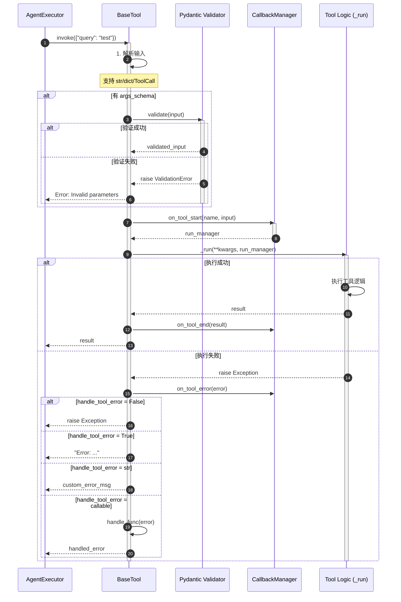
```mermaid
sequenceDiagram
    autonumber
    participant Agent as AgentExecutor
    participant Tool as BaseTool
    participant Validator as Pydantic Validator
    participant Callback as CallbackManager
    participant Logic as Tool Logic (_run)

    Agent->>Tool: invoke({"query": "test"})
    activate Tool

    Tool->>Tool: 1. 解析输入
    Note over Tool: 支持 str/dict/ToolCall

    alt 有 args_schema
        Tool->>Validator: validate(input)
        activate Validator

        alt 验证成功
            Validator-->>Tool: validated_input
        else 验证失败
            Validator-->>Tool: raise ValidationError
            Tool-->>Agent: Error: Invalid parameters
        end
        deactivate Validator
    end

    Tool->>Callback: on_tool_start(name, input)
    activate Callback
    Callback-->>Tool: run_manager
    deactivate Callback

    Tool->>Logic: _run(**kwargs, run_manager)
    activate Logic

    alt 执行成功
        Logic->>Logic: 执行工具逻辑
        Logic-->>Tool: result

        Tool->>Callback: on_tool_end(result)
        Tool-->>Agent: result

    else 执行失败
        Logic-->>Tool: raise Exception

        Tool->>Callback: on_tool_error(error)

        alt handle_tool_error = False
            Tool-->>Agent: raise Exception
        else handle_tool_error = True
            Tool-->>Agent: "Error: ..."
        else handle_tool_error = str
            Tool-->>Agent: custom_error_msg
        else handle_tool_error = callable
            Tool->>Tool: handle_func(error)
            Tool-->>Agent: handled_error
        end
    end
    deactivate Logic
    deactivate Tool
```

### 4.2 @tool 装饰器工作流程

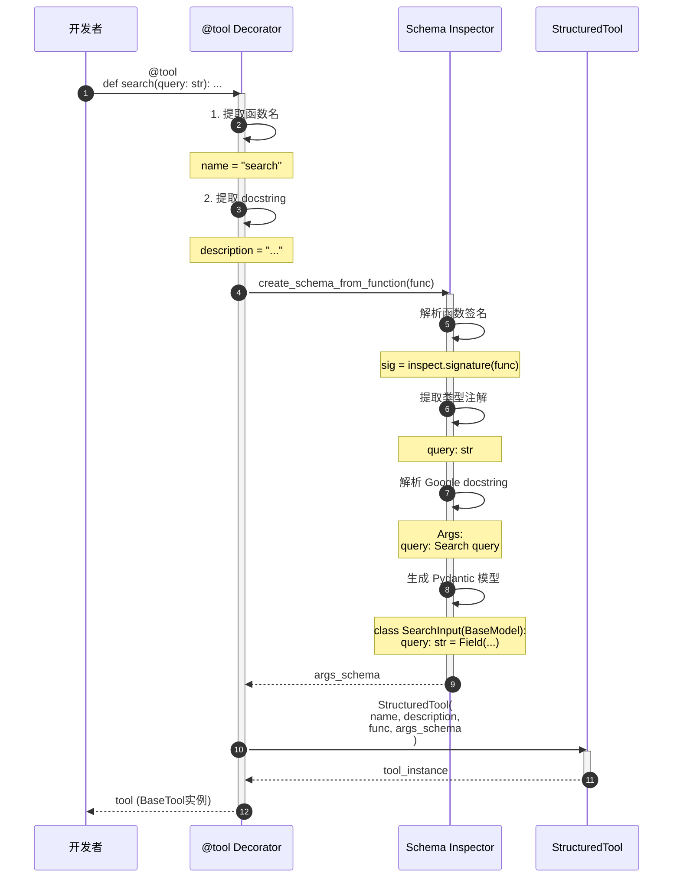
```mermaid
sequenceDiagram
    autonumber
    participant Dev as 开发者
    participant Decorator as @tool Decorator
    participant Inspector as Schema Inspector
    participant ST as StructuredTool

    Dev->>Decorator: @tool<br/>def search(query: str): ...
    activate Decorator

    Decorator->>Decorator: 1. 提取函数名
    Note over Decorator: name = "search"

    Decorator->>Decorator: 2. 提取 docstring
    Note over Decorator: description = "..."

    Decorator->>Inspector: create_schema_from_function(func)
    activate Inspector

    Inspector->>Inspector: 解析函数签名
    Note over Inspector: sig = inspect.signature(func)

    Inspector->>Inspector: 提取类型注解
    Note over Inspector: query: str

    Inspector->>Inspector: 解析 Google docstring
    Note over Inspector: Args:<br/>  query: Search query

    Inspector->>Inspector: 生成 Pydantic 模型
    Note over Inspector: class SearchInput(BaseModel):<br/>  query: str = Field(...)

    Inspector-->>Decorator: args_schema
    deactivate Inspector

    Decorator->>ST: StructuredTool(<br/>  name, description,<br/>  func, args_schema<br/>)
    activate ST
    ST-->>Decorator: tool_instance
    deactivate ST

    Decorator-->>Dev: tool (BaseTool实例)
    deactivate Decorator
```

### 4.3 代理调用工具流程

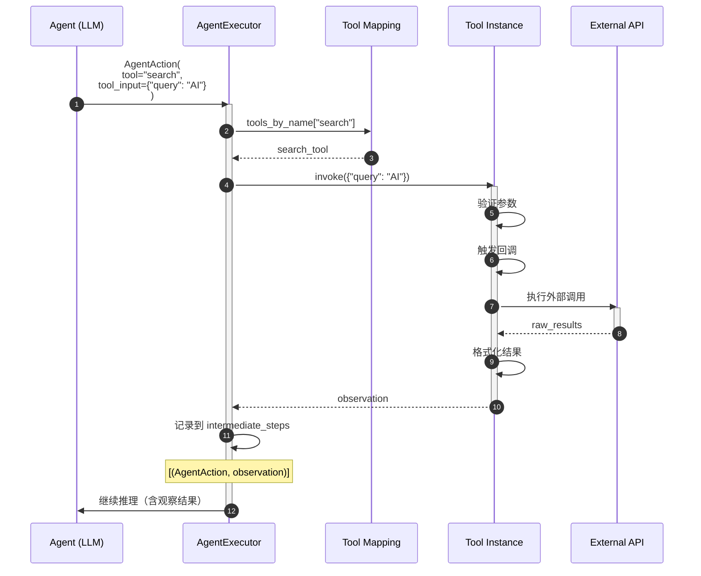
```mermaid
sequenceDiagram
    autonumber
    participant Agent as Agent (LLM)
    participant Executor as AgentExecutor
    participant ToolMap as Tool Mapping
    participant Tool as Tool Instance
    participant API as External API

    Agent->>Executor: AgentAction(<br/>  tool="search",<br/>  tool_input={"query": "AI"}<br/>)
    activate Executor

    Executor->>ToolMap: tools_by_name["search"]
    ToolMap-->>Executor: search_tool

    Executor->>Tool: invoke({"query": "AI"})
    activate Tool

    Tool->>Tool: 验证参数
    Tool->>Tool: 触发回调

    Tool->>API: 执行外部调用
    activate API
    API-->>Tool: raw_results
    deactivate API

    Tool->>Tool: 格式化结果
    Tool-->>Executor: observation
    deactivate Tool

    Executor->>Executor: 记录到 intermediate_steps
    Note over Executor: [(AgentAction, observation)]

    Executor->>Agent: 继续推理（含观察结果）
    deactivate Executor
```

## 5. 最佳实践

### 5.1 工具设计原则

**1. 单一职责**:

```python
# ❌ 不推荐：工具功能过多
@tool
def do_everything(action: str, data: str) -> str:
    """Do multiple things."""
    if action == "search": ...
    elif action == "calculate": ...
    elif action == "translate": ...

# ✅ 推荐：每个工具专注一件事
@tool
def search(query: str) -> str:
    """Search the web."""
    ...

@tool
def calculate(expression: str) -> str:
    """Calculate math expression."""
    ...
```

**2. 清晰的描述**:

```python
@tool
def search(query: str) -> str:
    """
    Search the web for current information.

    Use this tool when you need:

    - Up-to-date facts about recent events
    - Real-time data like weather or stock prices
    - Information not in your training data

    Args:
        query: Specific search query. Be precise and include key terms.
               Example: "LangChain latest features 2024"

    Returns:
        Search results as formatted text with sources
    """
    ...

```

**3. 合理的返回值**:

```python
# ✅ 返回简洁但信息完整的结果
@tool
def search(query: str) -> str:
    """Search tool."""
    results = api_search(query)

    # 格式化为易于LLM理解的文本
    formatted = []
    for i, result in enumerate(results[:5], 1):
        formatted.append(f"{i}. {result['title']}\n   {result['snippet']}\n   URL: {result['url']}")

    return "\n\n".join(formatted)

# ❌ 避免返回过长或过短的结果
# 过长：整个网页HTML
# 过短："success" 没有实际信息
```

### 5.2 参数验证

**使用 Pydantic 验证**:

```python
from pydantic import BaseModel, Field, validator
from typing import Literal

class EmailInput(BaseModel):
    to: str = Field(description="Recipient email")
    subject: str = Field(description="Email subject")
    body: str = Field(description="Email body")
    priority: Literal["low", "normal", "high"] = Field(default="normal")

    @validator("to")
    def validate_email(cls, v):
        if "@" not in v:
            raise ValueError("Invalid email address")
        return v

    @validator("subject")
    def validate_subject(cls, v):
        if len(v) > 100:
            raise ValueError("Subject too long (max 100 chars)")
        return v

@tool(args_schema=EmailInput)
def send_email(to: str, subject: str, body: str, priority: str = "normal") -> str:
    """Send an email."""
    # 参数已自动验证
    ...
```

### 5.3 异步工具

**适用场景**: I/O 密集型操作（API 调用、数据库查询、文件操作）

```python
import httpx
import asyncio

@tool
async def fetch_url(url: str) -> str:
    """Fetch content from a URL asynchronously."""
    async with httpx.AsyncClient() as client:
        try:
            response = await client.get(url, timeout=10.0)
            response.raise_for_status()
            return response.text[:1000]  # 截取前1000字符
        except httpx.HTTPError as e:
            return f"Error fetching {url}: {str(e)}"

@tool
async def batch_api_calls(endpoints: list[str]) -> str:
    """Call multiple APIs concurrently."""
    async def fetch_one(url: str) -> str:
        async with httpx.AsyncClient() as client:
            response = await client.get(url)
            return response.json()

    results = await asyncio.gather(*[fetch_one(ep) for ep in endpoints])
    return str(results)
```

### 5.4 错误处理策略

```python
from langchain_core.tools import ToolException

@tool
def database_query(query: str) -> str:
    """Query the database."""
    try:
        # 验证查询安全性
        if any(keyword in query.upper() for keyword in ["DROP", "DELETE", "UPDATE"]):
            raise ToolException("Dangerous query detected")

        # 执行查询
        results = db.execute(query)
        return format_results(results)

    except DatabaseError as e:
        # 数据库错误转换为友好消息
        raise ToolException(f"Database error: {str(e)}")

    except Exception as e:
        # 未预期的错误
        logger.error(f"Unexpected error in database_query: {e}")
        raise ToolException("An unexpected error occurred")

# 配置全局错误处理
tool_with_handler = database_query.copy(
    handle_tool_error=lambda e: f"Query failed: {str(e)}"
)
```

### 5.5 工具组合与复用

```python
# 1. 基础工具
@tool
def http_get(url: str) -> str:
    """Make HTTP GET request."""
    response = requests.get(url)
    return response.text

# 2. 组合工具
@tool
def search_and_fetch(query: str) -> str:
    """Search and fetch full content."""
    # 使用其他工具
    search_results = search.invoke(query)
    urls = extract_urls(search_results)

    contents = []
    for url in urls[:3]:  # 只获取前3个
        content = http_get.invoke(url)
        contents.append(content[:500])

    return "\n\n---\n\n".join(contents)

# 3. 将 Runnable 转换为工具
retrieval_chain = retriever | format_docs
retrieval_tool = convert_runnable_to_tool(
    retrieval_chain,
    name="knowledge_base",
    description="Search internal documentation"
)
```

### 5.6 工具测试

```python
import pytest

def test_search_tool():
    """测试搜索工具"""
    # 基础测试
    result = search.invoke("test query")
    assert isinstance(result, str)
    assert len(result) > 0

    # 参数验证测试
    with pytest.raises(ValidationError):
        search.invoke({"invalid_param": "value"})

    # 错误处理测试
    result = search.invoke("trigger_error")
    assert "Error" in result

@pytest.mark.asyncio
async def test_async_tool():
    """测试异步工具"""
    result = await async_api_call.ainvoke("https://example.com")
    assert isinstance(result, str)

def test_tool_with_mock():
    """使用 Mock 测试工具"""
    from unittest.mock import patch

    with patch('requests.get') as mock_get:
        mock_get.return_value.text = "mocked response"

        result = http_get.invoke("https://example.com")
        assert result == "mocked response"
        mock_get.assert_called_once()
```

## 6. 常用工具示例

### 6.1 搜索工具

```python
from langchain_community.tools import DuckDuckGoSearchRun

# 内置搜索工具
search = DuckDuckGoSearchRun()

# 自定义搜索工具
@tool
def web_search(query: str, num_results: int = 5) -> str:
    """
    Search the web using Google Custom Search API.

    Args:
        query: Search query
        num_results: Number of results (1-10)
    """
    results = google_search_api(query, num=num_results)
    return format_search_results(results)
```

### 6.2 计算工具

```python
from langchain.tools import PythonREPLTool

# Python REPL
python_repl = PythonREPLTool()

# 简单计算器
@tool
def calculator(expression: str) -> str:
    """
    Calculate a mathematical expression.

    Args:
        expression: Math expression (e.g., "2 + 2", "sqrt(16)")
    """
    try:
        # 安全的数学计算
        result = sympyevaluate(expression)
        return str(result)
    except Exception as e:
        return f"Calculation error: {str(e)}"
```

### 6.3 文件操作工具

```python
@tool
def read_file(filepath: str) -> str:
    """
    Read content from a file.

    Args:
        filepath: Path to file
    """
    try:
        with open(filepath, 'r', encoding='utf-8') as f:
            content = f.read()
        return content[:5000]  # 限制长度
    except FileNotFoundError:
        return f"File not found: {filepath}"
    except Exception as e:
        return f"Error reading file: {str(e)}"

@tool
def write_file(filepath: str, content: str) -> str:
    """
    Write content to a file.

    Args:
        filepath: Path to file
        content: Content to write
    """
    try:
        with open(filepath, 'w', encoding='utf-8') as f:
            f.write(content)
        return f"Successfully wrote to {filepath}"
    except Exception as e:
        return f"Error writing file: {str(e)}"
```

### 6.4 RAG 检索工具

```python
from langchain.tools import create_retriever_tool

# 创建检索器工具
retriever_tool = create_retriever_tool(
    retriever=vectorstore.as_retriever(search_kwargs={"k": 3}),
    name="knowledge_base_search",
    description="""
    Search the internal knowledge base for information.
    Use this when you need to find:

    - Company policies
    - Product documentation
    - Technical specifications
    Query should be specific and focused.
    """

)
```

## 7. 与其他模块的协作

- **Agents**: 工具是代理的"手和脚"
- **Language Models**: 通过函数调用规范调用工具
- **Callbacks**: 工具执行的可观测性
- **Runnables**: 工具作为 Runnable 可组合

## 8. 总结

Tools 模块是 LangChain 代理系统的核心，实现了 LLM 与外部世界的交互。关键特性：

1. **多种创建方式**: `@tool`、`StructuredTool`、继承 `BaseTool`
2. **自动参数验证**: 使用 Pydantic
3. **同步/异步支持**: 灵活的执行模式
4. **错误处理**: 统一的异常机制
5. **回调集成**: 完整的可观测性

**关键原则**:

- 优先使用 `@tool` 装饰器
- 保持工具单一职责
- 提供清晰的描述和示例
- 返回简洁但完整的结果
- 合理处理错误
- 充分测试工具逻辑

---

**文档版本**: v1.0
**最后更新**: 2025-10-03
**相关文档**:

- LangChain-00-总览.md
- LangChain-05-Agents-概览.md
- LangChain-08-VectorStores-概览.md（待生成）

---

## API接口

## 文档说明

本文档详细描述 **Tools 模块**的对外 API，包括 `BaseTool`、`@tool` 装饰器、`StructuredTool` 等核心接口的所有公开方法、参数规格、调用链路和最佳实践。

---

## 1. @tool 装饰器 API

### 1.1 基础用法

#### 基本信息
- **方法签名**：`tool(func: Callable, *, name: str = None, description: str = None, return_direct: bool = False) -> BaseTool`
- **功能**：将普通Python函数转换为LangChain工具
- **优势**：最简单的工具创建方式

#### 请求参数

```python
def tool(
    func: Optional[Callable] = None,
    *,
    name: Optional[str] = None,
    description: Optional[str] = None,
    return_direct: bool = False,
    args_schema: Optional[Type[BaseModel]] = None,
    infer_schema: bool = True,
    **kwargs: Any,
) -> Union[BaseTool, Callable[[Callable], BaseTool]]:
    """工具装饰器。"""
```

**参数说明**：

| 参数 | 类型 | 必填 | 默认 | 说明 |
|-----|------|-----|------|------|
| func | `Callable` | 否 | `None` | 被装饰的函数 |
| name | `str` | 否 | 函数名 | 工具名称（用于Agent调用） |
| description | `str` | 否 | 函数docstring | 工具描述（用于Agent选择） |
| return_direct | `bool` | 否 | `False` | 是否直接返回结果给用户 |
| args_schema | `Type[BaseModel]` | 否 | 自动推断 | 参数schema（Pydantic模型） |
| infer_schema | `bool` | 否 | `True` | 是否自动推断参数schema |

#### 基础使用示例

```python
from langchain_core.tools import tool
from typing import Optional

@tool
def search_wikipedia(query: str, max_results: int = 3) -> str:
    """搜索Wikipedia获取信息。
    
    Args:
        query: 搜索查询字符串
        max_results: 最大结果数量，默认3个
    
    Returns:
        搜索结果的摘要文本
    """
    # 实际搜索逻辑（此处省略）
    return f"搜索'{query}'的结果：..."

# 使用工具
result = search_wikipedia.invoke({"query": "Python", "max_results": 5})
print(result)  # "搜索'Python'的结果：..."
```

#### 入口函数实现

```python
# libs/core/langchain_core/tools/__init__.py
def tool(
    func: Optional[Callable] = None,
    *,
    name: Optional[str] = None,
    description: Optional[str] = None,
    return_direct: bool = False,
    args_schema: Optional[Type[BaseModel]] = None,
    infer_schema: bool = True,
    **kwargs: Any,
) -> Union[BaseTool, Callable[[Callable], BaseTool]]:
    """将函数转换为工具。"""
    
    def _create_tool(func: Callable) -> BaseTool:
        # 1. 提取工具名称
        tool_name = name or func.__name__
        
        # 2. 提取描述
        tool_description = description or func.__doc__ or f"Tool {tool_name}"
        
        # 3. 推断参数schema
        if infer_schema and args_schema is None:
            schema = _infer_args_schema_from_function(func)
        else:
            schema = args_schema
        
        # 4. 创建工具实例
        return StructuredTool(
            name=tool_name,
            description=tool_description,
            func=func,
            args_schema=schema,
            return_direct=return_direct,
            **kwargs
        )
    
    # 装饰器模式支持
    if func is None:
        return _create_tool
    else:
        return _create_tool(func)
```

#### 参数Schema自动推断

```python
def _infer_args_schema_from_function(func: Callable) -> Type[BaseModel]:
    """从函数签名推断参数schema。"""
    import inspect
    from pydantic import create_model
    
    # 获取函数签名
    signature = inspect.signature(func)
    
    # 构建字段定义
    fields = {}
    for param_name, param in signature.parameters.items():
        if param_name == 'self':
            continue
            
        # 提取类型注解
        param_type = param.annotation if param.annotation != inspect.Parameter.empty else str
        
        # 处理默认值
        if param.default != inspect.Parameter.empty:
            fields[param_name] = (param_type, param.default)
        else:
            fields[param_name] = (param_type, ...)
    
    # 创建Pydantic模型
    return create_model(f"{func.__name__}Schema", **fields)
```

#### 时序图

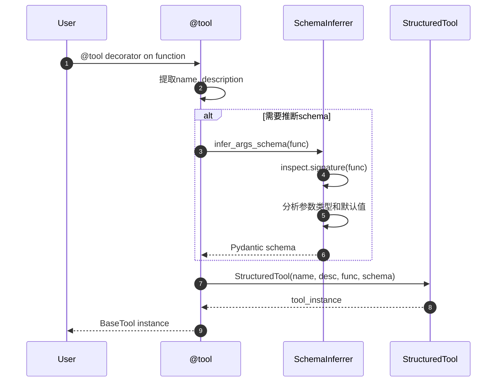
```mermaid
sequenceDiagram
    autonumber
    participant User
    participant Decorator as @tool
    participant Inferrer as SchemaInferrer
    participant ST as StructuredTool
    
    User->>Decorator: @tool decorator on function
    Decorator->>Decorator: 提取name, description
    
    alt 需要推断schema
        Decorator->>Inferrer: infer_args_schema(func)
        Inferrer->>Inferrer: inspect.signature(func)
        Inferrer->>Inferrer: 分析参数类型和默认值
        Inferrer-->>Decorator: Pydantic schema
    end
    
    Decorator->>ST: StructuredTool(name, desc, func, schema)
    ST-->>Decorator: tool_instance
    Decorator-->>User: BaseTool instance
```

---

### 1.2 高级用法

#### 自定义参数Schema

```python
from pydantic import BaseModel, Field

class SearchParams(BaseModel):
    """搜索参数模型。"""
    query: str = Field(description="搜索查询字符串")
    max_results: int = Field(default=3, ge=1, le=10, description="结果数量(1-10)")
    language: str = Field(default="en", description="语言代码")

@tool(args_schema=SearchParams)
def advanced_search(query: str, max_results: int = 3, language: str = "en") -> str:
    """高级搜索工具。"""
    return f"搜索'{query}'，语言:{language}，结果数:{max_results}"
```

#### 返回直接结果

```python
@tool(return_direct=True)
def get_current_time() -> str:
    """获取当前时间（直接返回给用户）。"""
    from datetime import datetime
    return datetime.now().strftime("%Y-%m-%d %H:%M:%S")

# Agent使用此工具时，会直接将结果返回给用户，不会继续推理
```

---

## 2. StructuredTool 核心 API

### 2.1 from_function 类方法

#### 基本信息
- **方法签名**：`from_function(func: Callable, name: str = None, description: str = None, **kwargs) -> StructuredTool`
- **功能**：从函数创建结构化工具
- **与@tool的区别**：更灵活的配置选项

#### 使用示例

```python
from langchain_core.tools import StructuredTool

def calculate(expression: str) -> str:
    """计算数学表达式。
    
    Args:
        expression: 数学表达式字符串
    """
    try:
        result = eval(expression)  # 生产环境需要安全处理
        return str(result)
    except Exception as e:
        return f"计算错误: {e}"

# 创建工具
calculator = StructuredTool.from_function(
    func=calculate,
    name="calculator",
    description="执行数学计算",
    return_direct=False
)
```

#### 入口函数实现

```python
class StructuredTool(BaseTool):
    
    @classmethod
    def from_function(
        cls,
        func: Callable,
        name: Optional[str] = None,
        description: Optional[str] = None,
        return_direct: bool = False,
        args_schema: Optional[Type[BaseModel]] = None,
        infer_schema: bool = True,
        **kwargs: Any,
    ) -> StructuredTool:
        """从函数创建结构化工具。"""
        
        # 推断或使用提供的schema
        if args_schema is None and infer_schema:
            args_schema = _create_schema_from_function(func)
        
        return cls(
            name=name or func.__name__,
            description=description or func.__doc__ or "",
            func=func,
            args_schema=args_schema,
            return_direct=return_direct,
            **kwargs
        )
```

---

### 2.2 invoke - 同步调用

#### 基本信息
- **方法签名**：`invoke(input: Union[str, Dict], config: RunnableConfig = None) -> Any`
- **功能**：同步调用工具
- **输入格式**：字符串或字典

#### 请求参数

```python
def invoke(
    self,
    input: Union[str, Dict[str, Any]],
    config: Optional[RunnableConfig] = None,
    **kwargs: Any,
) -> Any:
    """同步调用工具。"""
```

#### 响应结构

工具的返回值类型取决于具体实现，常见类型：

- `str`：文本结果
- `Dict[str, Any]`：结构化数据
- `List[Any]`：列表数据
- 自定义对象

#### 入口函数实现

```python
def invoke(
    self,
    input: Union[str, Dict[str, Any]],
    config: Optional[RunnableConfig] = None,
    **kwargs: Any,
) -> Any:
    # 1. 解析输入参数
    if isinstance(input, str):
        # 字符串输入，尝试解析为JSON
        parsed_input = self._parse_string_input(input)
    else:
        parsed_input = input
    
    # 2. 验证参数
    if self.args_schema:
        validated_input = self.args_schema(**parsed_input)
        tool_args = validated_input.dict()
    else:
        tool_args = parsed_input
    
    # 3. 执行工具函数
    return self._run(**tool_args)

def _run(self, **kwargs: Any) -> Any:
    """执行工具的核心逻辑。"""
    try:
        # 调用用户定义的函数
        return self.func(**kwargs)
    except Exception as e:
        if self.handle_tool_error:
            return self._handle_tool_error(e)
        else:
            raise
```

#### 时序图

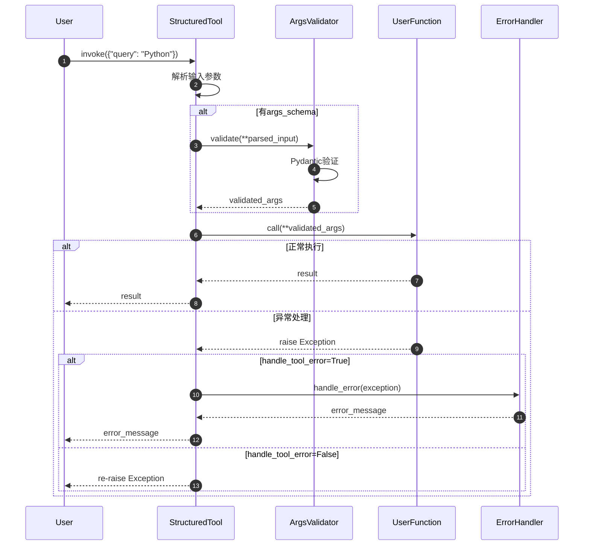
```mermaid
sequenceDiagram
    autonumber
    participant User
    participant Tool as StructuredTool
    participant Validator as ArgsValidator
    participant Func as UserFunction
    participant Handler as ErrorHandler
    
    User->>Tool: invoke({"query": "Python"})
    Tool->>Tool: 解析输入参数
    
    alt 有args_schema
        Tool->>Validator: validate(**parsed_input)
        Validator->>Validator: Pydantic验证
        Validator-->>Tool: validated_args
    end
    
    Tool->>Func: call(**validated_args)
    
    alt 正常执行
        Func-->>Tool: result
        Tool-->>User: result
    else 异常处理
        Func-->>Tool: raise Exception
        alt handle_tool_error=True
            Tool->>Handler: handle_error(exception)
            Handler-->>Tool: error_message
            Tool-->>User: error_message
        else handle_tool_error=False
            Tool-->>User: re-raise Exception
        end
    end
```

---

### 2.3 ainvoke - 异步调用

#### 基本信息
- **方法签名**：`ainvoke(input: Union[str, Dict], config: RunnableConfig = None) -> Any`
- **功能**：异步调用工具
- **适用场景**：I/O密集型工具（API调用、文件操作等）

#### 使用示例

```python
import asyncio
import aiohttp

@tool
async def fetch_url(url: str) -> str:
    """异步获取URL内容。"""
    async with aiohttp.ClientSession() as session:
        async with session.get(url) as response:
            return await response.text()

# 异步调用
async def main():
    result = await fetch_url.ainvoke({"url": "https://httpbin.org/json"})
    print(result)

asyncio.run(main())
```

#### 实现原理

```python
async def ainvoke(
    self,
    input: Union[str, Dict[str, Any]],
    config: Optional[RunnableConfig] = None,
    **kwargs: Any,
) -> Any:
    # 解析和验证参数（同invoke）
    parsed_input = self._parse_input(input)
    
    # 异步执行
    return await self._arun(**parsed_input)

async def _arun(self, **kwargs: Any) -> Any:
    """异步执行工具。"""
    if asyncio.iscoroutinefunction(self.func):
        # 函数本身是异步的
        return await self.func(**kwargs)
    else:
        # 同步函数，使用线程池执行
        loop = asyncio.get_event_loop()
        return await loop.run_in_executor(None, self.func, **kwargs)
```

---

## 3. BaseTool 核心 API

### 3.1 直接继承BaseTool

#### 基本信息
- **适用场景**：需要完全控制工具行为的复杂工具
- **优势**：最大的灵活性和定制性

#### 实现示例

```python
from langchain_core.tools import BaseTool
from pydantic import BaseModel, Field

class DatabaseQueryInput(BaseModel):
    """数据库查询输入。"""
    query: str = Field(description="SQL查询语句")
    database: str = Field(default="default", description="数据库名称")

class DatabaseTool(BaseTool):
    """数据库查询工具。"""
    
    name: str = "database_query"
    description: str = "执行SQL查询并返回结果"
    args_schema: Type[BaseModel] = DatabaseQueryInput
    return_direct: bool = False
    
    def _run(
        self,
        query: str,
        database: str = "default",
        run_manager: Optional[CallbackManagerForToolRun] = None,
    ) -> str:
        """同步执行查询。"""
        try:
            # 数据库连接和查询逻辑
            result = self._execute_query(query, database)
            return f"查询结果：{result}"
        except Exception as e:
            return f"查询失败：{e}"
    
    async def _arun(
        self,
        query: str,
        database: str = "default",
        run_manager: Optional[AsyncCallbackManagerForToolRun] = None,
    ) -> str:
        """异步执行查询。"""
        # 异步数据库操作
        result = await self._async_execute_query(query, database)
        return f"查询结果：{result}"
```

### 3.2 必需实现的方法

#### _run 方法

```python
def _run(
    self,
    *args: Any,
    run_manager: Optional[CallbackManagerForToolRun] = None,
    **kwargs: Any,
) -> Any:
    """同步执行工具的核心方法。
    
    Args:
        *args: 位置参数
        run_manager: 回调管理器
        **kwargs: 关键字参数（来自args_schema验证）
    
    Returns:
        工具执行结果
    """
    raise NotImplementedError("子类必须实现_run方法")
```

#### _arun 方法（可选）

```python
async def _arun(
    self,
    *args: Any,
    run_manager: Optional[AsyncCallbackManagerForToolRun] = None,
    **kwargs: Any,
) -> Any:
    """异步执行工具。
    
    如果不实现，会回退到在线程池中执行_run方法。
    """
    # 默认实现：在线程池中执行同步方法
    return await asyncio.get_event_loop().run_in_executor(
        None, self._run, *args, **kwargs
    )
```

---

## 4. 工具辅助函数

### 4.1 convert_runnable_to_tool

#### 基本信息
- **功能**：将任意Runnable转换为Tool
- **适用场景**：复用现有的Chain或其他Runnable

#### 使用示例

```python
from langchain_core.tools import convert_runnable_to_tool
from langchain_core.prompts import PromptTemplate
from langchain_openai import ChatOpenAI

# 创建一个简单的翻译链
translate_prompt = PromptTemplate.from_template(
    "Translate the following text to {language}: {text}"
)
model = ChatOpenAI()
translate_chain = translate_prompt | model

# 转换为工具
translate_tool = convert_runnable_to_tool(
    translate_chain,
    name="translator",
    description="翻译文本到指定语言"
)

# 使用
result = translate_tool.invoke({
    "text": "Hello world",
    "language": "Chinese"
})
```

#### 实现原理

```python
def convert_runnable_to_tool(
    runnable: Runnable,
    *,
    name: str,
    description: str,
    args_schema: Optional[Type[BaseModel]] = None,
    **kwargs: Any,
) -> BaseTool:
    """将Runnable转换为Tool。"""
    
    class RunnableTool(BaseTool):
        runnable: Runnable
        
        def _run(self, **kwargs: Any) -> Any:
            return self.runnable.invoke(kwargs)
        
        async def _arun(self, **kwargs: Any) -> Any:
            return await self.runnable.ainvoke(kwargs)
    
    return RunnableTool(
        runnable=runnable,
        name=name,
        description=description,
        args_schema=args_schema,
        **kwargs
    )
```

---

### 4.2 create_retriever_tool

#### 基本信息
- **功能**：从检索器创建工具
- **适用场景**：RAG系统中的文档检索

#### 使用示例

```python
from langchain_core.tools import create_retriever_tool
from langchain_chroma import Chroma
from langchain_openai import OpenAIEmbeddings

# 创建向量存储和检索器
vectorstore = Chroma.from_texts(
    ["Python是一种编程语言", "机器学习很有趣"],
    OpenAIEmbeddings()
)
retriever = vectorstore.as_retriever()

# 创建检索工具
retriever_tool = create_retriever_tool(
    retriever,
    name="knowledge_search",
    description="搜索知识库获取相关信息"
)

# 使用
result = retriever_tool.invoke({"query": "Python"})
```

#### 实现原理

```python
def create_retriever_tool(
    retriever: BaseRetriever,
    name: str,
    description: str,
    *,
    document_prompt: Optional[BasePromptTemplate] = None,
    document_separator: str = "\n\n",
) -> BaseTool:
    """从检索器创建工具。"""
    
    @tool
    def retriever_tool(query: str) -> str:
        """检索相关文档。"""
        docs = retriever.get_relevant_documents(query)
        
        if document_prompt is None:
            # 默认格式：内容
            formatted_docs = [doc.page_content for doc in docs]
        else:
            # 自定义格式
            formatted_docs = [
                document_prompt.format(**doc.metadata, page_content=doc.page_content)
                for doc in docs
            ]
        
        return document_separator.join(formatted_docs)
    
    retriever_tool.name = name
    retriever_tool.description = description
    return retriever_tool
```

---

## 5. 错误处理与调试

### 5.1 工具异常处理

#### ToolException

```python
from langchain_core.tools import ToolException

@tool
def risky_operation(data: str) -> str:
    """可能失败的操作。"""
    if not data:
        raise ToolException("数据不能为空")
    
    try:
        # 执行可能失败的操作
        result = process_data(data)
        return result
    except ValueError as e:
        raise ToolException(f"数据处理失败: {e}")
```

#### handle_tool_error 配置

```python
# 方式1：返回错误消息而不抛出异常
@tool(handle_tool_error=True)
def error_prone_tool(input: str) -> str:
    """容易出错的工具。"""
    if input == "error":
        raise ValueError("故意触发错误")
    return f"处理: {input}"

# 使用
result = error_prone_tool.invoke({"input": "error"})
print(result)  # "ValueError: 故意触发错误"

# 方式2：自定义错误处理
def custom_error_handler(error: Exception) -> str:
    return f"工具执行失败: {type(error).__name__}: {error}"

safe_tool = StructuredTool.from_function(
    func=error_prone_function,
    name="safe_tool",
    handle_tool_error=custom_error_handler
)
```

### 5.2 工具调试

#### 回调管理器

```python
from langchain.callbacks import StdOutCallbackHandler

# 添加调试回调
debug_tool = StructuredTool.from_function(
    func=my_function,
    name="debug_tool",
    callbacks=[StdOutCallbackHandler()],
    verbose=True
)

# 调用时会输出详细信息
result = debug_tool.invoke({"param": "value"})
```

#### 工具执行追踪

```python
import time

class TimedTool(BaseTool):
    """带执行时间追踪的工具。"""
    
    def _run(self, **kwargs: Any) -> Any:
        start_time = time.time()
        try:
            result = self._execute(**kwargs)
            execution_time = time.time() - start_time
            print(f"工具 {self.name} 执行时间: {execution_time:.2f}秒")
            return result
        except Exception as e:
            execution_time = time.time() - start_time
            print(f"工具 {self.name} 执行失败，耗时: {execution_time:.2f}秒")
            raise
```

---

## 6. 最佳实践

### 6.1 工具设计原则

```python
# ✅ 好的工具设计
@tool
def search_documents(
    query: str,
    max_results: int = 5,
    document_type: str = "all"
) -> str:
    """搜索文档库获取相关信息。
    
    Args:
        query: 搜索查询字符串，应该是具体的问题或关键词
        max_results: 返回的最大结果数量，范围1-20
        document_type: 文档类型过滤，可选: 'all', 'pdf', 'doc', 'txt'
    
    Returns:
        搜索结果的摘要，包含标题和相关内容片段
    
    Examples:
        search_documents("Python装饰器", max_results=3, document_type="pdf")
    """
    # 清晰的实现逻辑
    pass

# ❌ 避免的工具设计
@tool
def do_stuff(data: str) -> str:
    """做一些事情。"""  # 描述太模糊
    # 功能不明确的实现
    pass
```

### 6.2 参数验证

```python
from pydantic import BaseModel, Field, validator

class SearchInput(BaseModel):
    """搜索输入验证。"""
    query: str = Field(..., min_length=1, max_length=200, description="搜索查询")
    max_results: int = Field(5, ge=1, le=20, description="结果数量")
    language: str = Field("en", regex="^[a-z]{2}$", description="语言代码")
    
    @validator('query')
    def validate_query(cls, v):
        if v.strip() != v:
            raise ValueError("查询不能包含前后空格")
        return v

@tool(args_schema=SearchInput)
def validated_search(query: str, max_results: int = 5, language: str = "en") -> str:
    """经过严格验证的搜索工具。"""
    return f"搜索'{query}'，语言:{language}，结果数:{max_results}"
```

### 6.3 性能优化

```python
import functools
import asyncio
from typing import Dict, Any

class CachedTool(BaseTool):
    """带缓存的工具。"""
    
    def __init__(self, **kwargs):
        super().__init__(**kwargs)
        self._cache: Dict[str, Any] = {}
        self._cache_size = 100
    
    def _cache_key(self, **kwargs) -> str:
        """生成缓存键。"""
        return str(sorted(kwargs.items()))
    
    def _run(self, **kwargs: Any) -> Any:
        cache_key = self._cache_key(**kwargs)
        
        # 检查缓存
        if cache_key in self._cache:
            return self._cache[cache_key]
        
        # 执行并缓存
        result = self._execute(**kwargs)
        
        # 限制缓存大小
        if len(self._cache) >= self._cache_size:
            # 删除最旧的项
            oldest_key = next(iter(self._cache))
            del self._cache[oldest_key]
        
        self._cache[cache_key] = result
        return result
```

---

## 7. 总结

本文档详细描述了 **Tools 模块**的核心 API：

### 主要工具创建方式
1. **@tool 装饰器**：最简单的工具创建方式
2. **StructuredTool.from_function**：更灵活的配置选项
3. **继承 BaseTool**：完全控制工具行为

### 核心方法
1. **invoke/ainvoke**：同步/异步工具调用
2. **参数验证**：基于 Pydantic 的自动验证
3. **错误处理**：ToolException 和 handle_tool_error

### 辅助功能
1. **convert_runnable_to_tool**：Runnable 到 Tool 的转换
2. **create_retriever_tool**：从检索器创建工具
3. **回调和调试**：工具执行追踪

每个 API 均包含：

- 完整的请求/响应结构
- 入口函数核心代码
- 详细时序图
- 实际使用示例
- 最佳实践建议

工具系统是 LangChain Agent 的基础，正确设计和使用工具对构建智能代理系统至关重要。

---

## 数据结构

## 文档说明

本文档详细描述 **Tools 模块**的核心数据结构，包括工具类层次、参数验证、回调管理、错误处理等。所有结构均配备 UML 类图和详细的字段说明。

---

## 1. 工具类层次结构

### 1.1 BaseTool 继承体系

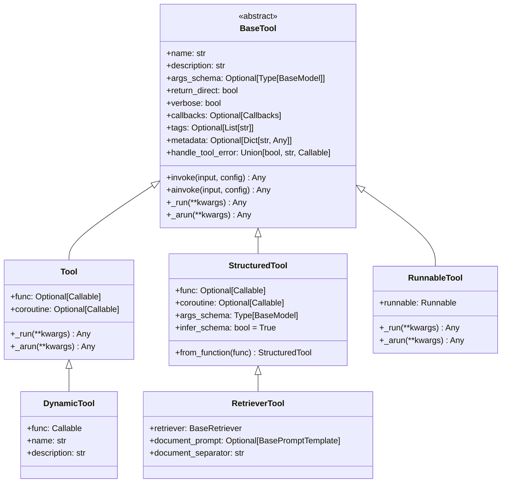
```mermaid
classDiagram
    class BaseTool {
        <<abstract>>
        +name: str
        +description: str
        +args_schema: Optional[Type[BaseModel]]
        +return_direct: bool
        +verbose: bool
        +callbacks: Optional[Callbacks]
        +tags: Optional[List[str]]
        +metadata: Optional[Dict[str, Any]]
        +handle_tool_error: Union[bool, str, Callable]
        +invoke(input, config) Any
        +ainvoke(input, config) Any
        +_run(**kwargs) Any
        +_arun(**kwargs) Any
    }

    class Tool {
        +func: Optional[Callable]
        +coroutine: Optional[Callable]
        +_run(**kwargs) Any
        +_arun(**kwargs) Any
    }

    class StructuredTool {
        +func: Optional[Callable]
        +coroutine: Optional[Callable]
        +args_schema: Type[BaseModel]
        +infer_schema: bool = True
        +from_function(func) StructuredTool
    }

    class DynamicTool {
        +func: Callable
        +name: str
        +description: str
    }

    class RunnableTool {
        +runnable: Runnable
        +_run(**kwargs) Any
        +_arun(**kwargs) Any
    }

    class RetrieverTool {
        +retriever: BaseRetriever
        +document_prompt: Optional[BasePromptTemplate]
        +document_separator: str
    }

    BaseTool <|-- Tool
    BaseTool <|-- StructuredTool
    Tool <|-- DynamicTool
    BaseTool <|-- RunnableTool
    StructuredTool <|-- RetrieverTool
```

**图解说明**：

1. **抽象基类**：
   - `BaseTool`：所有工具的基类，定义统一接口
   - 包含元数据、执行方法、错误处理等核心功能

2. **具体实现**：
   - `Tool`：基础工具，封装单个函数
   - `StructuredTool`：结构化工具，支持参数验证
   - `DynamicTool`：动态工具，运行时创建

3. **专用工具**：
   - `RunnableTool`：将Runnable包装为工具
   - `RetrieverTool`：检索器工具

---

## 2. BaseTool 核心字段

### 2.1 字段详解

```python
class BaseTool(RunnableSerializable[Union[str, Dict], Any]):
    """工具基类。"""

    name: str  # 工具名称
    description: str = ""  # 工具描述
    args_schema: Optional[Type[BaseModel]] = None  # 参数Schema
    return_direct: bool = False  # 是否直接返回结果
    verbose: bool = False  # 详细输出
    callbacks: Optional[Callbacks] = None  # 回调处理器
    tags: Optional[List[str]] = None  # 标签
    metadata: Optional[Dict[str, Any]] = None  # 元数据
    handle_tool_error: Union[bool, str, Callable[[Exception], str], None] = False
```

**字段表**：

| 字段 | 类型 | 必填 | 默认 | 说明 |
|-----|------|-----|------|------|
| name | `str` | 是 | - | 工具唯一标识符，用于Agent调用 |
| description | `str` | 否 | `""` | 工具功能描述，用于Agent选择 |
| args_schema | `Type[BaseModel]` | 否 | `None` | 参数验证Schema |
| return_direct | `bool` | 否 | `False` | True时直接返回结果给用户 |
| verbose | `bool` | 否 | `False` | 是否输出详细执行信息 |
| callbacks | `Callbacks` | 否 | `None` | 回调处理器列表 |
| tags | `List[str]` | 否 | `None` | 分类标签 |
| metadata | `Dict[str, Any]` | 否 | `None` | 附加元数据 |
| handle_tool_error | `Union[bool, str, Callable]` | 否 | `False` | 错误处理策略 |

**字段使用示例**：

```python
from pydantic import BaseModel, Field

class CalculatorInput(BaseModel):
    """计算器输入参数。"""
    expression: str = Field(description="数学表达式")

class CalculatorTool(BaseTool):
    name: str = "calculator"
    description: str = "执行数学计算，支持基本运算符"
    args_schema: Type[BaseModel] = CalculatorInput
    return_direct: bool = False
    verbose: bool = True
    tags: List[str] = ["math", "calculation"]
    metadata: Dict[str, Any] = {"version": "1.0", "author": "system"}
    handle_tool_error: bool = True  # 捕获异常并返回错误消息
```

---

### 2.2 错误处理策略

```python
# handle_tool_error 支持多种类型
class ErrorHandlingTool(BaseTool):

    # 1. 布尔值：True时返回异常字符串
    handle_tool_error: bool = True

    # 2. 字符串：返回固定错误消息
    handle_tool_error: str = "工具执行失败，请重试"

    # 3. 函数：自定义错误处理逻辑
    def custom_error_handler(self, error: Exception) -> str:
        if isinstance(error, ValueError):
            return f"参数错误: {error}"
        elif isinstance(error, TimeoutError):
            return "执行超时，请稍后重试"
        else:
            return f"未知错误: {type(error).__name__}"

    handle_tool_error: Callable[[Exception], str] = custom_error_handler
```

**错误处理流程**：

```mermaid
flowchart TD
    Start[工具执行] --> Execute[调用_run方法]
    Execute --> Success{执行成功?}

    Success -->|是| Return[返回结果]
    Success -->|否| HandleError{handle_tool_error类型}

    HandleError -->|False| Raise[抛出异常]
    HandleError -->|True| StringError[返回str(exception)]
    HandleError -->|str| FixedMsg[返回固定消息]
    HandleError -->|Callable| CustomHandler[调用自定义处理器]

    StringError --> Return
    FixedMsg --> Return
    CustomHandler --> Return
```

---

## 3. 参数验证数据结构

### 3.1 Args Schema 系统

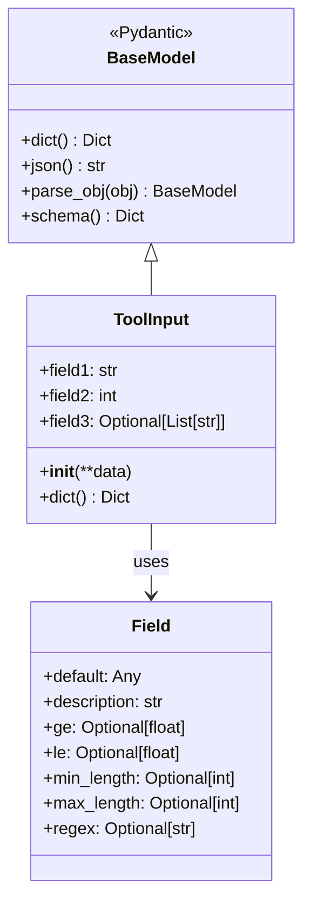
```mermaid
classDiagram
    class BaseModel {
        <<Pydantic>>
        +dict() Dict
        +json() str
        +parse_obj(obj) BaseModel
        +schema() Dict
    }

    class ToolInput {
        +field1: str
        +field2: int
        +field3: Optional[List[str]]
        +__init__(**data)
        +dict() Dict
    }

    class Field {
        +default: Any
        +description: str
        +ge: Optional[float]
        +le: Optional[float]
        +min_length: Optional[int]
        +max_length: Optional[int]
        +regex: Optional[str]
    }

    BaseModel <|-- ToolInput
    ToolInput --> Field : uses
```

**参数Schema示例**：

```python
from pydantic import BaseModel, Field, validator
from typing import Optional, List, Literal

class WebSearchInput(BaseModel):
    """网络搜索工具输入参数。"""

    query: str = Field(
        ...,  # 必填
        description="搜索查询字符串",
        min_length=1,
        max_length=200,
        example="Python 异步编程"
    )

    max_results: int = Field(
        default=5,
        description="最大结果数量",
        ge=1,  # 大于等于1
        le=20,  # 小于等于20
        example=10
    )

    language: Optional[str] = Field(
        default="zh",
        description="搜索语言",
        regex="^[a-z]{2}$",  # 两位语言代码
        example="zh"
    )

    search_type: Literal["web", "news", "images"] = Field(
        default="web",
        description="搜索类型"
    )

    filters: Optional[List[str]] = Field(
        default=None,
        description="搜索过滤器",
        example=["recent", "authoritative"]
    )

    @validator('query')
    def validate_query(cls, v):
        """查询验证器。"""
        v = v.strip()
        if not v:
            raise ValueError("搜索查询不能为空")

        # 检查敏感词
        forbidden_words = ["hack", "crack"]
        if any(word in v.lower() for word in forbidden_words):
            raise ValueError("查询包含禁用词汇")

        return v

    @validator('filters')
    def validate_filters(cls, v):
        """过滤器验证器。"""
        if v is None:
            return v

        allowed_filters = ["recent", "authoritative", "academic"]
        invalid_filters = [f for f in v if f not in allowed_filters]

        if invalid_filters:
            raise ValueError(f"无效的过滤器: {invalid_filters}")

        return v

    class Config:
        """Pydantic配置。"""
        schema_extra = {
            "example": {
                "query": "机器学习算法",
                "max_results": 8,
                "language": "zh",
                "search_type": "web",
                "filters": ["recent", "authoritative"]
            }
        }
```

**Schema JSON输出**：

```json
{
  "title": "WebSearchInput",
  "description": "网络搜索工具输入参数。",
  "type": "object",
  "properties": {
    "query": {
      "title": "Query",
      "description": "搜索查询字符串",
      "minLength": 1,
      "maxLength": 200,
      "example": "Python 异步编程",
      "type": "string"
    },
    "max_results": {
      "title": "Max Results",
      "description": "最大结果数量",
      "default": 5,
      "minimum": 1,
      "maximum": 20,
      "example": 10,
      "type": "integer"
    }
  },
  "required": ["query"]
}
```

---

### 3.2 参数类型推断

```python
class SchemaInferrer:
    """参数Schema推断器。"""

    @staticmethod
    def infer_from_function(func: Callable) -> Type[BaseModel]:
        """从函数签名推断Schema。"""
        import inspect
        from pydantic import create_model
        from typing import get_type_hints

        # 获取函数签名
        sig = inspect.signature(func)
        type_hints = get_type_hints(func)

        # 构建字段定义
        fields = {}
        for param_name, param in sig.parameters.items():
            if param_name in ('self', 'cls', 'run_manager'):
                continue

            # 获取类型
            param_type = type_hints.get(param_name, str)

            # 处理默认值
            if param.default != inspect.Parameter.empty:
                if param.default is None:
                    # Optional字段
                    fields[param_name] = (param_type, None)
                else:
                    fields[param_name] = (param_type, param.default)
            else:
                # 必填字段
                fields[param_name] = (param_type, ...)

        # 创建动态Schema
        schema_name = f"{func.__name__}Schema"
        return create_model(schema_name, **fields)
```

**推断示例**：

```python
def search_tool(
    query: str,
    max_results: int = 5,
    include_snippets: bool = True,
    tags: Optional[List[str]] = None
) -> str:
    """搜索工具函数。"""
    pass

# 自动推断的Schema等价于：
class SearchToolSchema(BaseModel):
    query: str  # 必填，无默认值
    max_results: int = 5  # 可选，默认5
    include_snippets: bool = True  # 可选，默认True
    tags: Optional[List[str]] = None  # 可选，默认None
```

---

## 4. 回调数据结构

### 4.1 回调管理器层次

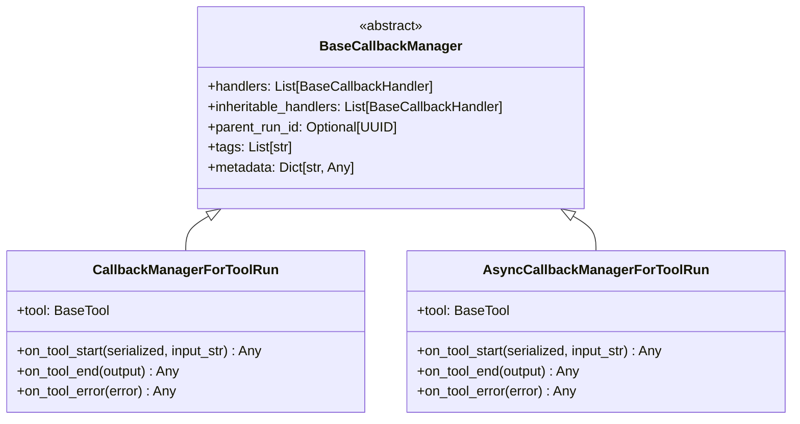
```mermaid
classDiagram
    class BaseCallbackManager {
        <<abstract>>
        +handlers: List[BaseCallbackHandler]
        +inheritable_handlers: List[BaseCallbackHandler]
        +parent_run_id: Optional[UUID]
        +tags: List[str]
        +metadata: Dict[str, Any]
    }

    class CallbackManagerForToolRun {
        +tool: BaseTool
        +on_tool_start(serialized, input_str) Any
        +on_tool_end(output) Any
        +on_tool_error(error) Any
    }

    class AsyncCallbackManagerForToolRun {
        +tool: BaseTool
        +on_tool_start(serialized, input_str) Any
        +on_tool_end(output) Any
        +on_tool_error(error) Any
    }

    BaseCallbackManager <|-- CallbackManagerForToolRun
    BaseCallbackManager <|-- AsyncCallbackManagerForToolRun
```

**回调事件类型**：

```python
from enum import Enum

class ToolEvent(str, Enum):
    """工具回调事件类型。"""
    START = "on_tool_start"
    END = "on_tool_end"
    ERROR = "on_tool_error"
    STREAM = "on_tool_stream"  # 流式工具

class ToolCallbackData(TypedDict):
    """工具回调数据。"""
    tool_name: str
    input_data: Dict[str, Any]
    output_data: Optional[Any]
    error: Optional[Exception]
    start_time: float
    end_time: Optional[float]
    execution_time: Optional[float]
```

**回调使用示例**：

```python
from langchain.callbacks import BaseCallbackHandler

class ToolMetricsCallback(BaseCallbackHandler):
    """工具性能监控回调。"""

    def __init__(self):
        self.tool_metrics = {}

    def on_tool_start(
        self,
        serialized: Dict[str, Any],
        input_str: str,
        **kwargs: Any,
    ) -> Any:
        """工具开始执行。"""
        tool_name = serialized.get("name", "unknown")
        self.tool_metrics[tool_name] = {
            "start_time": time.time(),
            "input_size": len(input_str),
            "call_count": self.tool_metrics.get(tool_name, {}).get("call_count", 0) + 1
        }

    def on_tool_end(
        self,
        output: str,
        **kwargs: Any,
    ) -> Any:
        """工具执行结束。"""
        # 更新执行时间和输出统计
        pass

    def on_tool_error(
        self,
        error: Exception,
        **kwargs: Any,
    ) -> Any:
        """工具执行错误。"""
        # 记录错误统计
        pass

# 使用回调
metrics_callback = ToolMetricsCallback()
tool = StructuredTool.from_function(
    func=my_function,
    callbacks=[metrics_callback]
)
```

---

## 5. 工具执行上下文

### 5.1 RunManager 数据结构

```python
class ToolRunManager:
    """工具执行管理器。"""

    run_id: UUID  # 运行ID
    parent_run_id: Optional[UUID]  # 父运行ID
    tool_name: str  # 工具名称
    start_time: datetime  # 开始时间
    end_time: Optional[datetime]  # 结束时间
    input_data: Dict[str, Any]  # 输入参数
    output_data: Optional[Any]  # 输出结果
    error: Optional[Exception]  # 错误信息
    tags: List[str]  # 标签
    metadata: Dict[str, Any]  # 元数据

    def elapsed_time(self) -> Optional[timedelta]:
        """计算执行时间。"""
        if self.start_time and self.end_time:
            return self.end_time - self.start_time
        return None

    def is_successful(self) -> bool:
        """检查是否执行成功。"""
        return self.error is None

    def to_dict(self) -> Dict[str, Any]:
        """转换为字典。"""
        return {
            "run_id": str(self.run_id),
            "parent_run_id": str(self.parent_run_id) if self.parent_run_id else None,
            "tool_name": self.tool_name,
            "start_time": self.start_time.isoformat(),
            "end_time": self.end_time.isoformat() if self.end_time else None,
            "execution_time": self.elapsed_time().total_seconds() if self.elapsed_time() else None,
            "input_data": self.input_data,
            "output_data": self.output_data,
            "error": str(self.error) if self.error else None,
            "success": self.is_successful(),
            "tags": self.tags,
            "metadata": self.metadata
        }
```

---

## 6. 工具注册与发现

### 6.1 工具注册表

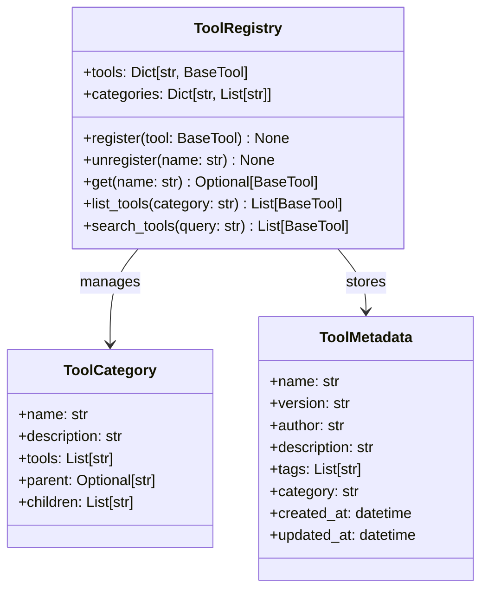
```mermaid
classDiagram
    class ToolRegistry {
        +tools: Dict[str, BaseTool]
        +categories: Dict[str, List[str]]
        +register(tool: BaseTool) None
        +unregister(name: str) None
        +get(name: str) Optional[BaseTool]
        +list_tools(category: str) List[BaseTool]
        +search_tools(query: str) List[BaseTool]
    }

    class ToolCategory {
        +name: str
        +description: str
        +tools: List[str]
        +parent: Optional[str]
        +children: List[str]
    }

    class ToolMetadata {
        +name: str
        +version: str
        +author: str
        +description: str
        +tags: List[str]
        +category: str
        +created_at: datetime
        +updated_at: datetime
    }

    ToolRegistry --> ToolCategory : manages
    ToolRegistry --> ToolMetadata : stores
```

**工具注册表实现**：

```python
class ToolRegistry:
    """工具注册表。"""

    def __init__(self):
        self._tools: Dict[str, BaseTool] = {}
        self._categories: Dict[str, List[str]] = {
            "web": [],
            "database": [],
            "file": [],
            "calculation": [],
            "ai": [],
            "utility": []
        }

    def register(self, tool: BaseTool, category: str = "utility") -> None:
        """注册工具。"""
        if tool.name in self._tools:
            raise ValueError(f"工具 '{tool.name}' 已存在")

        self._tools[tool.name] = tool

        if category not in self._categories:
            self._categories[category] = []
        self._categories[category].append(tool.name)

    def get(self, name: str) -> Optional[BaseTool]:
        """获取工具。"""
        return self._tools.get(name)

    def list_tools(self, category: Optional[str] = None) -> List[BaseTool]:
        """列出工具。"""
        if category is None:
            return list(self._tools.values())

        tool_names = self._categories.get(category, [])
        return [self._tools[name] for name in tool_names]

    def search_tools(self, query: str) -> List[BaseTool]:
        """搜索工具。"""
        query_lower = query.lower()
        matches = []

        for tool in self._tools.values():
            # 搜索名称和描述
            if (query_lower in tool.name.lower() or
                query_lower in tool.description.lower()):
                matches.append(tool)

            # 搜索标签
            if tool.tags:
                for tag in tool.tags:
                    if query_lower in tag.lower():
                        matches.append(tool)
                        break

        return matches

# 全局注册表
tool_registry = ToolRegistry()

# 装饰器注册
def register_tool(category: str = "utility", name: str = None):
    """工具注册装饰器。"""
    def decorator(tool_func):
        tool = StructuredTool.from_function(
            tool_func,
            name=name or tool_func.__name__
        )
        tool_registry.register(tool, category)
        return tool
    return decorator

# 使用示例
@register_tool(category="web", name="web_search")
def search_web(query: str, max_results: int = 5) -> str:
    """搜索网页。"""
    return f"搜索结果: {query}"
```

---

## 7. 工具链和组合

### 7.1 工具链数据结构

```python
class ToolChain:
    """工具链，按顺序执行多个工具。"""

    def __init__(self, tools: List[BaseTool], name: str = "tool_chain"):
        self.tools = tools
        self.name = name
        self.intermediate_results: List[Any] = []

    def execute(self, initial_input: Any) -> Any:
        """执行工具链。"""
        current_input = initial_input

        for i, tool in enumerate(self.tools):
            result = tool.invoke(current_input)
            self.intermediate_results.append(result)

            # 下一个工具的输入是当前工具的输出
            current_input = result

        return current_input

    def to_dict(self) -> Dict[str, Any]:
        """转换为字典。"""
        return {
            "name": self.name,
            "tools": [tool.name for tool in self.tools],
            "intermediate_results": self.intermediate_results
        }

class ToolGraph:
    """工具图，支持复杂的工具组合。"""

    def __init__(self):
        self.nodes: Dict[str, BaseTool] = {}
        self.edges: List[Tuple[str, str, Callable]] = []  # (from, to, condition)

    def add_tool(self, tool: BaseTool) -> None:
        """添加工具节点。"""
        self.nodes[tool.name] = tool

    def add_edge(self, from_tool: str, to_tool: str, condition: Callable = None) -> None:
        """添加工具连接。"""
        self.edges.append((from_tool, to_tool, condition or (lambda x: True)))

    def execute(self, start_tool: str, input_data: Any) -> Dict[str, Any]:
        """执行工具图。"""
        results = {}
        current_tools = [start_tool]

        while current_tools:
            next_tools = []

            for tool_name in current_tools:
                tool = self.nodes[tool_name]
                result = tool.invoke(input_data)
                results[tool_name] = result

                # 检查下游工具
                for from_tool, to_tool, condition in self.edges:
                    if from_tool == tool_name and condition(result):
                        next_tools.append(to_tool)

            current_tools = list(set(next_tools))
            input_data = results  # 下游工具可以访问所有结果

        return results
```

---

## 8. 序列化与持久化

### 8.1 工具序列化格式

```python
# 工具序列化示例
tool = StructuredTool.from_function(
    func=search_function,
    name="web_search",
    description="搜索网页内容"
)

serialized = tool.dict()
# {
#     "name": "web_search",
#     "description": "搜索网页内容",
#     "args_schema": {
#         "title": "SearchFunctionSchema",
#         "type": "object",
#         "properties": {
#             "query": {"type": "string", "description": "搜索查询"}
#         },
#         "required": ["query"]
#     },
#     "return_direct": false,
#     "verbose": false,
#     "tags": null,
#     "metadata": null,
#     "_type": "structured_tool"
# }
```

### 8.2 工具配置存储

```yaml
# tools.yaml - 工具配置文件
tools:

  - name: web_search
    type: structured_tool
    description: 搜索网页获取信息
    module: my_tools.web
    function: search_web
    args_schema:
      query:
        type: string
        description: 搜索查询字符串
        required: true
      max_results:
        type: integer
        description: 最大结果数
        default: 5
        minimum: 1
        maximum: 20
    tags: [web, search]
    category: web

  - name: calculator
    type: structured_tool
    description: 执行数学计算
    module: my_tools.math
    function: calculate
    return_direct: false
    handle_tool_error: true
    tags: [math, calculation]
    category: calculation

```

---

## 9. 性能与监控数据

### 9.1 工具性能指标

```python
class ToolPerformanceMetrics:
    """工具性能指标。"""

    def __init__(self, tool_name: str):
        self.tool_name = tool_name
        self.call_count = 0
        self.total_execution_time = 0.0
        self.error_count = 0
        self.success_count = 0
        self.execution_times: List[float] = []
        self.last_called: Optional[datetime] = None

    def record_execution(self, execution_time: float, success: bool) -> None:
        """记录执行结果。"""
        self.call_count += 1
        self.total_execution_time += execution_time
        self.execution_times.append(execution_time)
        self.last_called = datetime.now()

        if success:
            self.success_count += 1
        else:
            self.error_count += 1

    @property
    def average_execution_time(self) -> float:
        """平均执行时间。"""
        return self.total_execution_time / self.call_count if self.call_count > 0 else 0.0

    @property
    def success_rate(self) -> float:
        """成功率。"""
        return self.success_count / self.call_count if self.call_count > 0 else 0.0

    @property
    def p95_execution_time(self) -> float:
        """95分位执行时间。"""
        if not self.execution_times:
            return 0.0

        sorted_times = sorted(self.execution_times)
        index = int(0.95 * len(sorted_times))
        return sorted_times[index]

    def to_dict(self) -> Dict[str, Any]:
        """转换为字典。"""
        return {
            "tool_name": self.tool_name,
            "call_count": self.call_count,
            "success_count": self.success_count,
            "error_count": self.error_count,
            "success_rate": self.success_rate,
            "total_execution_time": self.total_execution_time,
            "average_execution_time": self.average_execution_time,
            "p95_execution_time": self.p95_execution_time,
            "last_called": self.last_called.isoformat() if self.last_called else None
        }
```

---

## 10. 内存管理与优化

### 10.1 工具对象大小分析

| 对象类型 | 基础大小 | 内容开销 | 说明 |
|---------|---------|---------|------|
| `BaseTool` | 800 bytes | 名称+描述长度 | 基础工具对象 |
| `StructuredTool` | 1.2KB | + args_schema | 结构化工具 |
| `args_schema` | 500 bytes | 字段数量 × 100 bytes | Pydantic模型 |
| `CallbackManager` | 300 bytes | 处理器数量 × 200 bytes | 回调管理器 |
| `ToolMetrics` | 400 bytes | 执行历史数据 | 性能指标 |

### 10.2 内存优化策略

```python
class OptimizedToolRegistry:
    """优化的工具注册表。"""

    def __init__(self, max_cache_size: int = 100):
        self._tools: Dict[str, BaseTool] = {}
        self._tool_cache: Dict[str, Any] = {}  # 结果缓存
        self._cache_size = max_cache_size
        self._access_order: List[str] = []  # LRU跟踪

    def _evict_cache(self) -> None:
        """淘汰缓存。"""
        while len(self._tool_cache) >= self._cache_size:
            oldest_key = self._access_order.pop(0)
            self._tool_cache.pop(oldest_key, None)

    def execute_with_cache(self, tool_name: str, input_data: Dict[str, Any]) -> Any:
        """带缓存的工具执行。"""
        # 生成缓存键
        cache_key = f"{tool_name}:{hash(str(sorted(input_data.items())))}"

        # 检查缓存
        if cache_key in self._tool_cache:
            # 更新访问顺序
            self._access_order.remove(cache_key)
            self._access_order.append(cache_key)
            return self._tool_cache[cache_key]

        # 执行工具
        tool = self._tools[tool_name]
        result = tool.invoke(input_data)

        # 缓存结果
        self._evict_cache()
        self._tool_cache[cache_key] = result
        self._access_order.append(cache_key)

        return result
```

---

## 11. 总结

本文档详细描述了 **Tools 模块**的核心数据结构：

1. **类层次**：从 `BaseTool` 到各种具体实现的完整继承关系
2. **参数验证**：基于 Pydantic 的 args_schema 系统
3. **回调管理**：工具执行的监控和追踪机制
4. **错误处理**：多种错误处理策略和异常管理
5. **工具注册**：工具的发现、注册和管理系统
6. **工具组合**：工具链和工具图的复杂组合模式
7. **序列化**：工具配置的持久化和版本管理
8. **性能监控**：工具执行的指标收集和分析
9. **内存优化**：工具系统的性能优化策略

所有数据结构均包含：

- 完整的 UML 类图和关系图
- 详细的字段表和约束说明
- 实际使用示例和配置方法
- 性能特征和优化建议
- 序列化格式和存储方案

这些结构为构建灵活、高效的工具系统提供了坚实的基础，支持从简单函数到复杂工具链的各种使用场景。

---

## 时序图

## 文档说明

本文档通过详细的时序图展示 **Tools 模块**在各种场景下的执行流程，包括工具创建、参数验证、同步/异步调用、错误处理、回调机制等。

---

## 1. 工具创建场景

### 1.1 @tool 装饰器创建流程

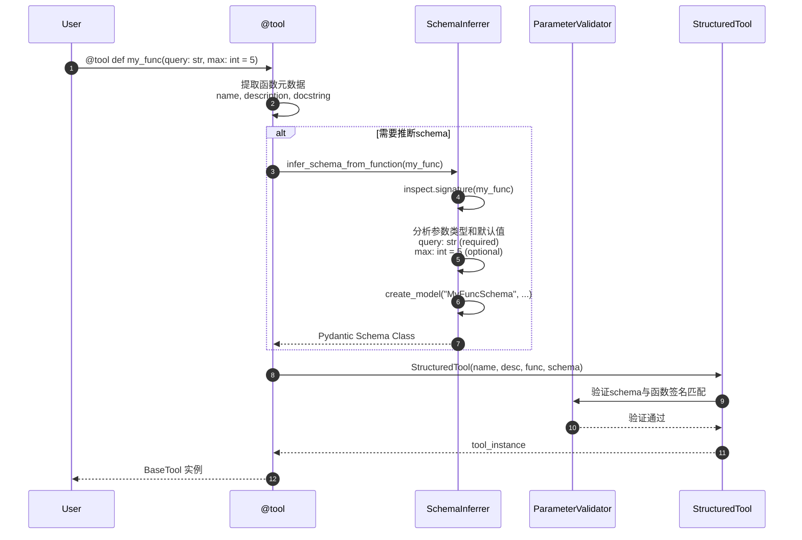
```mermaid
sequenceDiagram
    autonumber
    participant User
    participant Decorator as @tool
    participant Inferrer as SchemaInferrer
    participant Validator as ParameterValidator
    participant ST as StructuredTool

    User->>Decorator: @tool def my_func(query: str, max: int = 5)

    Decorator->>Decorator: 提取函数元数据<br/>name, description, docstring

    alt 需要推断schema
        Decorator->>Inferrer: infer_schema_from_function(my_func)
        Inferrer->>Inferrer: inspect.signature(my_func)
        Inferrer->>Inferrer: 分析参数类型和默认值<br/>query: str (required)<br/>max: int = 5 (optional)
        Inferrer->>Inferrer: create_model("MyFuncSchema", ...)
        Inferrer-->>Decorator: Pydantic Schema Class
    end

    Decorator->>ST: StructuredTool(name, desc, func, schema)
    ST->>Validator: 验证schema与函数签名匹配
    Validator-->>ST: 验证通过
    ST-->>Decorator: tool_instance

    Decorator-->>User: BaseTool 实例
```

**关键步骤说明**：

1. **元数据提取**（步骤 2）：
   - 工具名称：默认使用函数名
   - 描述：优先使用 description 参数，否则使用 docstring
   - 返回直接：return_direct 参数设置

2. **Schema推断**（步骤 4-7）：
   - 使用 `inspect.signature()` 分析函数签名
   - 提取参数类型注解（Type Hints）
   - 处理默认值和可选参数
   - 生成 Pydantic 模型类

3. **工具实例化**（步骤 8-11）：
   - 创建 StructuredTool 实例
   - 验证 schema 与函数签名的一致性
   - 绑定函数到工具对象

**性能特征**：

- Schema推断：1-5ms（取决于参数复杂度）
- 工具创建：< 1ms
- 内存开销：1-2KB 每个工具

---

### 1.2 StructuredTool.from_function 创建流程

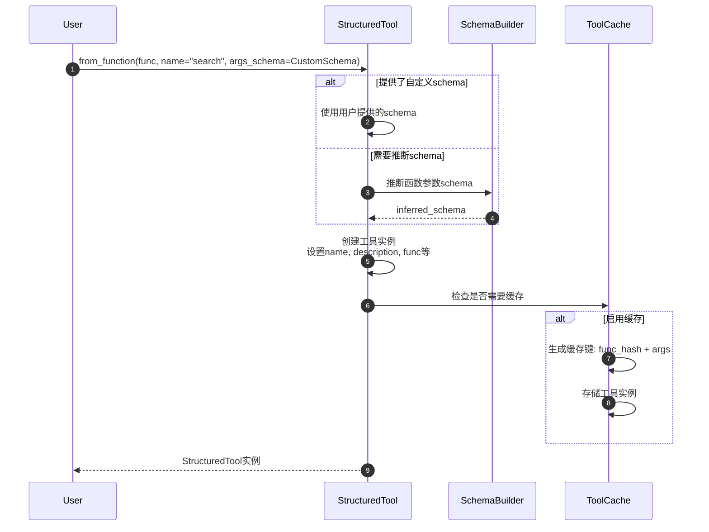
```mermaid
sequenceDiagram
    autonumber
    participant User
    participant ST as StructuredTool
    participant Schema as SchemaBuilder
    participant Cache as ToolCache

    User->>ST: from_function(func, name="search", args_schema=CustomSchema)

    alt 提供了自定义schema
        ST->>ST: 使用用户提供的schema
    else 需要推断schema
        ST->>Schema: 推断函数参数schema
        Schema-->>ST: inferred_schema
    end

    ST->>ST: 创建工具实例<br/>设置name, description, func等

    ST->>Cache: 检查是否需要缓存
    alt 启用缓存
        Cache->>Cache: 生成缓存键: func_hash + args
        Cache->>Cache: 存储工具实例
    end

    ST-->>User: StructuredTool实例
```

**与 @tool 装饰器的区别**：

| 特性 | @tool装饰器 | StructuredTool.from_function |
|-----|------------|---------------------------|
| 使用方式 | 装饰器语法 | 显式调用 |
| 灵活性 | 中等 | 高 |
| 配置选项 | 基础 | 完整 |
| 适用场景 | 简单工具 | 复杂工具 |

---

## 2. 工具调用场景

### 2.1 同步 invoke 调用流程

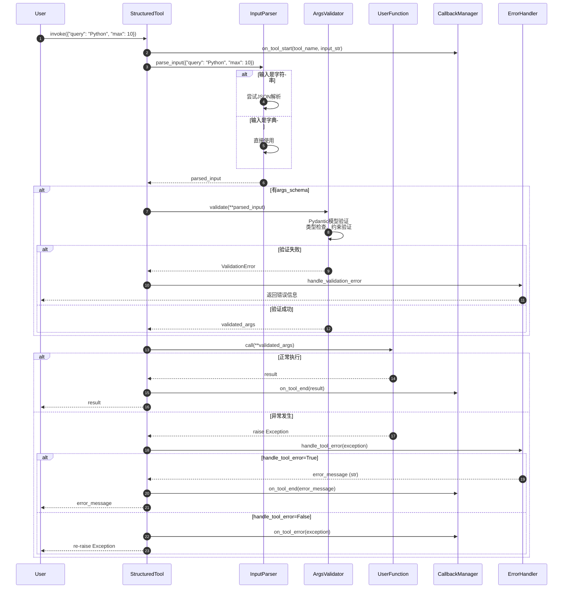
```mermaid
sequenceDiagram
    autonumber
    participant User
    participant Tool as StructuredTool
    participant Parser as InputParser
    participant Validator as ArgsValidator
    participant Func as UserFunction
    participant CB as CallbackManager
    participant EH as ErrorHandler

    User->>Tool: invoke({"query": "Python", "max": 10})

    Tool->>CB: on_tool_start(tool_name, input_str)

    Tool->>Parser: parse_input({"query": "Python", "max": 10})

    alt 输入是字符串
        Parser->>Parser: 尝试JSON解析
    else 输入是字典
        Parser->>Parser: 直接使用
    end

    Parser-->>Tool: parsed_input

    alt 有args_schema
        Tool->>Validator: validate(**parsed_input)
        Validator->>Validator: Pydantic模型验证<br/>类型检查、约束验证

        alt 验证失败
            Validator-->>Tool: ValidationError
            Tool->>EH: handle_validation_error
            EH-->>User: 返回错误信息
        else 验证成功
            Validator-->>Tool: validated_args
        end
    end

    Tool->>Func: call(**validated_args)

    alt 正常执行
        Func-->>Tool: result
        Tool->>CB: on_tool_end(result)
        Tool-->>User: result
    else 异常发生
        Func-->>Tool: raise Exception
        Tool->>EH: handle_tool_error(exception)

        alt handle_tool_error=True
            EH-->>Tool: error_message (str)
            Tool->>CB: on_tool_end(error_message)
            Tool-->>User: error_message
        else handle_tool_error=False
            Tool->>CB: on_tool_error(exception)
            Tool-->>User: re-raise Exception
        end
    end
```

**关键执行步骤**：

1. **回调通知开始**（步骤 2）：
   - 记录工具开始执行时间
   - 输出详细信息（如果 verbose=True）
   - 触发监控和日志记录

2. **输入解析**（步骤 3-6）：
   - 字符串输入：尝试 JSON 解析
   - 字典输入：直接使用
   - 处理特殊格式和编码

3. **参数验证**（步骤 8-13）：
   - Pydantic 模型验证
   - 类型检查：确保参数类型正确
   - 约束验证：检查值范围、长度等
   - 必填字段检查

4. **函数执行**（步骤 14-25）：
   - 调用用户定义的函数
   - 捕获和处理异常
   - 应用错误处理策略

**性能数据**：

- 输入解析：< 1ms
- 参数验证：1-5ms（取决于schema复杂度）
- 函数执行：用户函数决定
- 总开销：2-10ms（不含用户函数）

---

### 2.2 异步 ainvoke 调用流程

```mermaid
sequenceDiagram
    autonumber
    participant User
    participant Tool
    participant Loop as AsyncIOLoop
    participant Executor as ThreadPoolExecutor
    participant Func as UserFunction

    User->>Tool: await ainvoke(input_data)

    Tool->>Tool: 解析和验证输入<br/>（同同步流程）

    alt 函数是异步的
        Tool->>Func: await user_async_func(**args)
        Func-->>Tool: result
    else 函数是同步的
        Tool->>Loop: 检查当前事件循环
        Tool->>Executor: run_in_executor(None, sync_func, **args)

        Note over Executor: 在线程池中执行同步函数<br/>避免阻塞事件循环

        Executor->>Func: sync_func(**args)
        Func-->>Executor: result
        Executor-->>Tool: result
    end

    Tool-->>User: result
```

**异步执行策略**：

| 情况 | 执行方式 | 性能特点 |
|-----|---------|---------|
| 用户函数是 `async def` | 直接 `await` | 最优，无额外开销 |
| 用户函数是同步函数 | 线程池执行 | 避免阻塞事件循环 |
| I/O密集型同步函数 | 线程池 | 适合文件、网络操作 |
| CPU密集型同步函数 | 进程池（可选） | 绕过GIL限制 |

**使用示例**：

```python
# 异步I/O工具
@tool
async def fetch_url(url: str) -> str:
    """异步获取URL内容。"""
    async with aiohttp.ClientSession() as session:
        async with session.get(url) as response:
            return await response.text()

# 同步工具（自动在线程池执行）
@tool
def heavy_computation(data: str) -> str:
    """CPU密集型计算。"""
    import time
    time.sleep(2)  # 模拟重计算
    return f"处理完成: {data}"

# 使用
async def main():
    # 异步工具：直接await执行
    result1 = await fetch_url.ainvoke({"url": "https://example.com"})

    # 同步工具：在线程池中执行
    result2 = await heavy_computation.ainvoke({"data": "test"})
```

---

## 3. 参数验证场景

### 3.1 Pydantic 验证流程

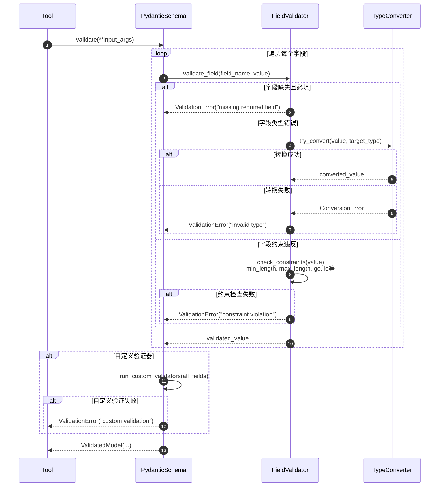
```mermaid
sequenceDiagram
    autonumber
    participant Tool
    participant Schema as PydanticSchema
    participant Validator as FieldValidator
    participant Converter as TypeConverter

    Tool->>Schema: validate(**input_args)

    loop 遍历每个字段
        Schema->>Validator: validate_field(field_name, value)

        alt 字段缺失且必填
            Validator-->>Schema: ValidationError("missing required field")
        else 字段类型错误
            Validator->>Converter: try_convert(value, target_type)
            alt 转换成功
                Converter-->>Validator: converted_value
            else 转换失败
                Converter-->>Validator: ConversionError
                Validator-->>Schema: ValidationError("invalid type")
            end
        else 字段约束违反
            Validator->>Validator: check_constraints(value)<br/>min_length, max_length, ge, le等
            alt 约束检查失败
                Validator-->>Schema: ValidationError("constraint violation")
            end
        end

        Validator-->>Schema: validated_value
    end

    alt 自定义验证器
        Schema->>Schema: run_custom_validators(all_fields)
        alt 自定义验证失败
            Schema-->>Tool: ValidationError("custom validation")
        end
    end

    Schema-->>Tool: ValidatedModel(...)
```

**验证示例**：

```python
from pydantic import BaseModel, Field, validator

class SearchInput(BaseModel):
    query: str = Field(..., min_length=1, max_length=200)
    max_results: int = Field(5, ge=1, le=50)
    language: str = Field("en", regex="^[a-z]{2}$")

    @validator('query')
    def validate_query(cls, v):
        # 自定义验证逻辑
        if 'spam' in v.lower():
            raise ValueError('查询包含禁用词')
        return v.strip()

    @validator('max_results')
    def validate_max_results(cls, v, values):
        # 依赖其他字段的验证
        if values.get('language') == 'zh' and v > 20:
            raise ValueError('中文搜索最多20个结果')
        return v

# 验证过程
try:
    validated = SearchInput(
        query="  python tutorial  ",  # 会被strip()
        max_results=15,
        language="zh"
    )
    print(validated.query)  # "python tutorial"
except ValidationError as e:
    print(f"验证失败: {e}")
```

---

### 3.2 错误处理验证

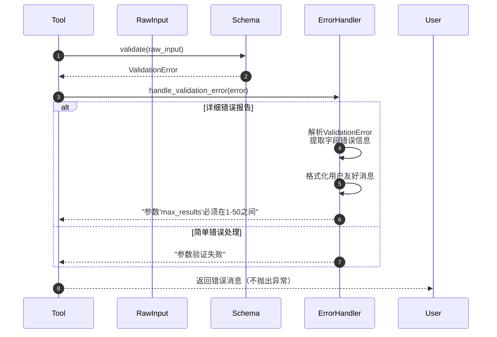
```mermaid
sequenceDiagram
    autonumber
    participant Tool
    participant Input as RawInput
    participant Schema
    participant Handler as ErrorHandler
    participant User

    Tool->>Schema: validate(raw_input)
    Schema-->>Tool: ValidationError

    Tool->>Handler: handle_validation_error(error)

    alt 详细错误报告
        Handler->>Handler: 解析ValidationError<br/>提取字段错误信息
        Handler->>Handler: 格式化用户友好消息
        Handler-->>Tool: "参数'max_results'必须在1-50之间"
    else 简单错误处理
        Handler-->>Tool: "参数验证失败"
    end

    Tool-->>User: 返回错误消息（不抛出异常）
```

**错误消息格式化**：

```python
def format_validation_error(error: ValidationError) -> str:
    """格式化验证错误消息。"""
    messages = []

    for error_dict in error.errors():
        field = error_dict['loc'][0] if error_dict['loc'] else 'unknown'
        msg = error_dict['msg']

        if error_dict['type'] == 'missing':
            messages.append(f"缺少必填参数: {field}")
        elif error_dict['type'] == 'type_error':
            messages.append(f"参数 {field} 类型错误: {msg}")
        elif error_dict['type'] == 'value_error':
            messages.append(f"参数 {field} 值错误: {msg}")
        else:
            messages.append(f"参数 {field}: {msg}")

    return "; ".join(messages)

# 使用示例
@tool(handle_tool_error=True)
def search_tool(query: str, max_results: int = 5) -> str:
    """搜索工具。"""
    return f"搜索: {query}, 结果数: {max_results}"

# 调用时参数错误
result = search_tool.invoke({"max_results": "not_a_number"})
# 返回: "参数 max_results 类型错误: value is not a valid integer"
```

---

## 4. 错误处理场景

### 4.1 工具异常处理流程

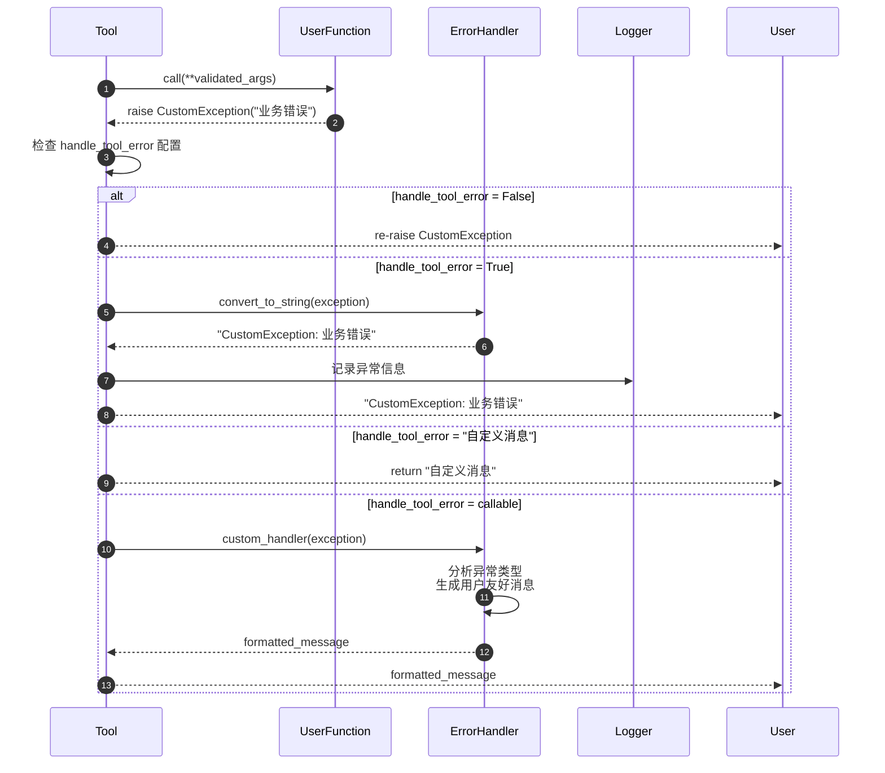
```mermaid
sequenceDiagram
    autonumber
    participant Tool
    participant Func as UserFunction
    participant Handler as ErrorHandler
    participant Logger
    participant User

    Tool->>Func: call(**validated_args)
    Func-->>Tool: raise CustomException("业务错误")

    Tool->>Tool: 检查 handle_tool_error 配置

    alt handle_tool_error = False
        Tool-->>User: re-raise CustomException
    else handle_tool_error = True
        Tool->>Handler: convert_to_string(exception)
        Handler-->>Tool: "CustomException: 业务错误"
        Tool->>Logger: 记录异常信息
        Tool-->>User: "CustomException: 业务错误"
    else handle_tool_error = "自定义消息"
        Tool-->>User: return "自定义消息"
    else handle_tool_error = callable
        Tool->>Handler: custom_handler(exception)
        Handler->>Handler: 分析异常类型<br/>生成用户友好消息
        Handler-->>Tool: formatted_message
        Tool-->>User: formatted_message
    end
```

**自定义错误处理器示例**：

```python
def smart_error_handler(error: Exception) -> str:
    """智能错误处理器。"""
    if isinstance(error, requests.RequestException):
        return "网络请求失败，请检查网络连接"
    elif isinstance(error, json.JSONDecodeError):
        return "数据格式错误，无法解析JSON"
    elif isinstance(error, FileNotFoundError):
        return f"文件未找到: {error.filename}"
    elif isinstance(error, PermissionError):
        return "权限不足，无法执行操作"
    elif isinstance(error, TimeoutError):
        return "操作超时，请稍后重试"
    else:
        return f"执行失败: {type(error).__name__}: {error}"

@tool(handle_tool_error=smart_error_handler)
def risky_tool(url: str) -> str:
    """可能失败的网络工具。"""
    response = requests.get(url, timeout=5)
    return response.json()
```

---

### 4.2 ToolException 专用异常

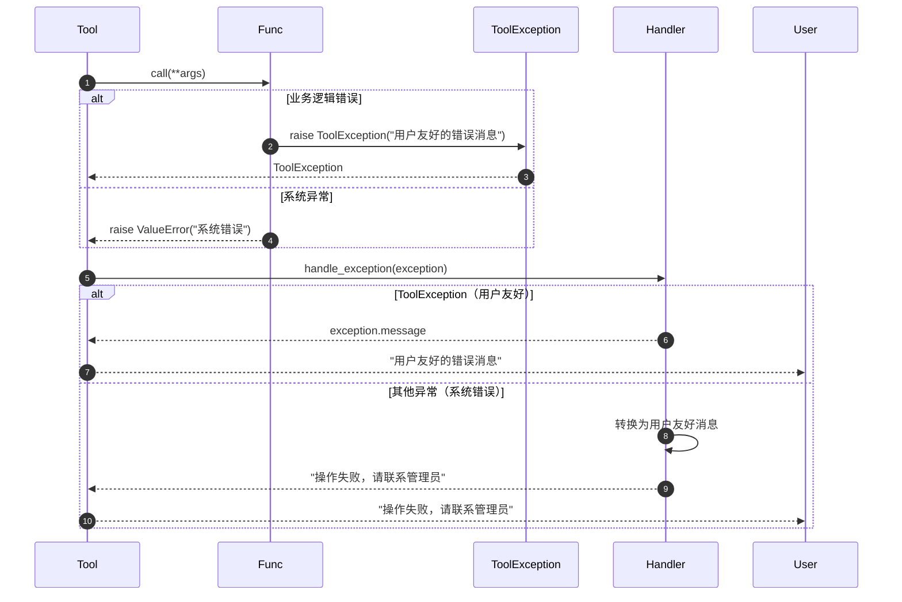
```mermaid
sequenceDiagram
    autonumber
    participant Tool
    participant Func
    participant TE as ToolException
    participant Handler
    participant User

    Tool->>Func: call(**args)

    alt 业务逻辑错误
        Func->>TE: raise ToolException("用户友好的错误消息")
        TE-->>Tool: ToolException
    else 系统异常
        Func-->>Tool: raise ValueError("系统错误")
    end

    Tool->>Handler: handle_exception(exception)

    alt ToolException（用户友好）
        Handler-->>Tool: exception.message
        Tool-->>User: "用户友好的错误消息"
    else 其他异常（系统错误）
        Handler->>Handler: 转换为用户友好消息
        Handler-->>Tool: "操作失败，请联系管理员"
        Tool-->>User: "操作失败，请联系管理员"
    end
```

**ToolException 使用示例**：

```python
from langchain_core.tools import ToolException

@tool
def divide_numbers(a: float, b: float) -> float:
    """数字除法工具。"""
    if b == 0:
        raise ToolException("除数不能为零")

    if not isinstance(a, (int, float)) or not isinstance(b, (int, float)):
        raise ToolException("输入必须是数字")

    try:
        result = a / b
        if abs(result) > 1e10:
            raise ToolException("结果数值过大")
        return result
    except Exception as e:
        # 系统异常转换为用户友好消息
        raise ToolException(f"计算失败: {e}")

# 使用
result1 = divide_numbers.invoke({"a": 10, "b": 0})
# 返回: "除数不能为零"

result2 = divide_numbers.invoke({"a": "abc", "b": 2})
# 返回: "输入必须是数字"
```

---

## 5. 回调机制场景

### 5.1 工具回调执行流程

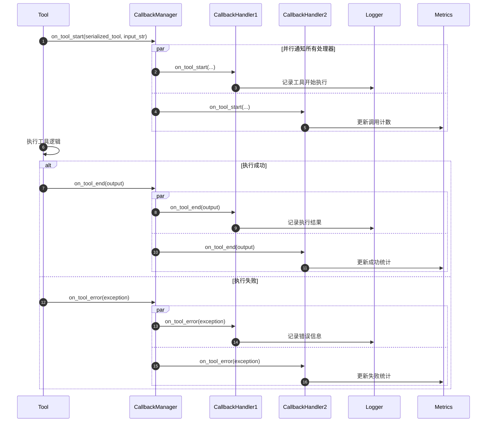
```mermaid
sequenceDiagram
    autonumber
    participant Tool
    participant CM as CallbackManager
    participant CH1 as CallbackHandler1
    participant CH2 as CallbackHandler2
    participant Logger
    participant Metrics

    Tool->>CM: on_tool_start(serialized_tool, input_str)

    par 并行通知所有处理器
        CM->>CH1: on_tool_start(...)
        CH1->>Logger: 记录工具开始执行
    and
        CM->>CH2: on_tool_start(...)
        CH2->>Metrics: 更新调用计数
    end

    Tool->>Tool: 执行工具逻辑

    alt 执行成功
        Tool->>CM: on_tool_end(output)
        par
            CM->>CH1: on_tool_end(output)
            CH1->>Logger: 记录执行结果
        and
            CM->>CH2: on_tool_end(output)
            CH2->>Metrics: 更新成功统计
        end
    else 执行失败
        Tool->>CM: on_tool_error(exception)
        par
            CM->>CH1: on_tool_error(exception)
            CH1->>Logger: 记录错误信息
        and
            CM->>CH2: on_tool_error(exception)
            CH2->>Metrics: 更新失败统计
        end
    end
```

**回调处理器示例**：

```python
from langchain.callbacks import BaseCallbackHandler
import time
import json

class DetailedToolCallback(BaseCallbackHandler):
    """详细的工具执行回调。"""

    def __init__(self):
        self.tool_executions = []
        self.current_execution = None

    def on_tool_start(
        self,
        serialized: Dict[str, Any],
        input_str: str,
        **kwargs: Any,
    ) -> Any:
        """工具开始执行。"""
        self.current_execution = {
            "tool_name": serialized.get("name", "unknown"),
            "input": input_str,
            "start_time": time.time(),
            "run_id": kwargs.get("run_id"),
            "parent_run_id": kwargs.get("parent_run_id")
        }
        print(f"🔧 开始执行工具: {self.current_execution['tool_name']}")
        print(f"   输入: {input_str}")

    def on_tool_end(
        self,
        output: str,
        **kwargs: Any,
    ) -> Any:
        """工具执行完成。"""
        if self.current_execution:
            execution_time = time.time() - self.current_execution["start_time"]
            self.current_execution.update({
                "output": output,
                "end_time": time.time(),
                "execution_time": execution_time,
                "success": True
            })

            print(f"✅ 工具执行成功，耗时: {execution_time:.2f}秒")
            print(f"   输出: {output[:100]}...")

            self.tool_executions.append(self.current_execution)
            self.current_execution = None

    def on_tool_error(
        self,
        error: Exception,
        **kwargs: Any,
    ) -> Any:
        """工具执行错误。"""
        if self.current_execution:
            execution_time = time.time() - self.current_execution["start_time"]
            self.current_execution.update({
                "error": str(error),
                "end_time": time.time(),
                "execution_time": execution_time,
                "success": False
            })

            print(f"❌ 工具执行失败，耗时: {execution_time:.2f}秒")
            print(f"   错误: {error}")

            self.tool_executions.append(self.current_execution)
            self.current_execution = None

    def get_stats(self) -> Dict[str, Any]:
        """获取执行统计。"""
        if not self.tool_executions:
            return {}

        total_calls = len(self.tool_executions)
        successful_calls = sum(1 for ex in self.tool_executions if ex["success"])
        total_time = sum(ex["execution_time"] for ex in self.tool_executions)

        return {
            "total_calls": total_calls,
            "successful_calls": successful_calls,
            "failed_calls": total_calls - successful_calls,
            "success_rate": successful_calls / total_calls,
            "total_execution_time": total_time,
            "average_execution_time": total_time / total_calls
        }

# 使用回调
callback = DetailedToolCallback()
tool = StructuredTool.from_function(
    func=my_function,
    callbacks=[callback],
    verbose=True
)
```

---

### 5.2 性能监控回调

```mermaid
sequenceDiagram
    autonumber
    participant Tool
    participant Monitor as PerformanceMonitor
    participant Metrics as MetricsStore
    participant Alert as AlertSystem

    Tool->>Monitor: on_tool_start(...)
    Monitor->>Metrics: 记录开始时间

    Tool->>Tool: 执行工具（可能很慢）

    Tool->>Monitor: on_tool_end(output)
    Monitor->>Monitor: 计算执行时间
    Monitor->>Metrics: 更新性能指标

    Monitor->>Monitor: 检查性能阈值

    alt 执行时间 > 阈值
        Monitor->>Alert: 触发慢查询告警
        Alert->>Alert: 发送通知给管理员
    end

    alt 错误率 > 阈值
        Monitor->>Alert: 触发错误率告警
    end
```

**性能监控实现**：

```python
class PerformanceMonitorCallback(BaseCallbackHandler):
    """工具性能监控回调。"""

    def __init__(self,
                 slow_threshold: float = 5.0,
                 error_rate_threshold: float = 0.1):
        self.slow_threshold = slow_threshold
        self.error_rate_threshold = error_rate_threshold
        self.metrics = defaultdict(list)
        self.start_times = {}

    def on_tool_start(self, serialized: Dict, input_str: str, **kwargs) -> None:
        tool_name = serialized.get("name", "unknown")
        run_id = kwargs.get("run_id")
        self.start_times[run_id] = time.time()

    def on_tool_end(self, output: str, **kwargs) -> None:
        run_id = kwargs.get("run_id")
        if run_id in self.start_times:
            execution_time = time.time() - self.start_times[run_id]
            tool_name = kwargs.get("name", "unknown")

            # 记录指标
            self.metrics[tool_name].append({
                "execution_time": execution_time,
                "success": True,
                "timestamp": time.time()
            })

            # 检查慢查询
            if execution_time > self.slow_threshold:
                self._alert_slow_execution(tool_name, execution_time)

            del self.start_times[run_id]

    def on_tool_error(self, error: Exception, **kwargs) -> None:
        # 类似处理，记录错误指标
        pass

    def _alert_slow_execution(self, tool_name: str, execution_time: float):
        """慢执行告警。"""
        print(f"⚠️ 慢工具告警: {tool_name} 执行时间 {execution_time:.2f}s 超过阈值 {self.slow_threshold}s")

    def get_performance_report(self) -> Dict[str, Any]:
        """生成性能报告。"""
        report = {}

        for tool_name, executions in self.metrics.items():
            execution_times = [ex["execution_time"] for ex in executions]
            successes = [ex["success"] for ex in executions]

            report[tool_name] = {
                "call_count": len(executions),
                "success_rate": sum(successes) / len(successes),
                "avg_execution_time": sum(execution_times) / len(execution_times),
                "max_execution_time": max(execution_times),
                "min_execution_time": min(execution_times),
                "slow_calls": sum(1 for t in execution_times if t > self.slow_threshold)
            }

        return report
```

---

## 6. 工具组合场景

### 6.1 工具链执行流程

```mermaid
sequenceDiagram
    autonumber
    participant User
    participant Chain as ToolChain
    participant Tool1 as SearchTool
    participant Tool2 as SummaryTool
    participant Tool3 as TranslateTool

    User->>Chain: execute("Python机器学习")

    Chain->>Tool1: invoke("Python机器学习")
    Tool1-->>Chain: "Python是一种编程语言..."
    Chain->>Chain: 保存中间结果[0]

    Chain->>Tool2: invoke("Python是一种编程语言...")
    Tool2-->>Chain: "Python是ML的流行语言。主要特点..."
    Chain->>Chain: 保存中间结果[1]

    Chain->>Tool3: invoke("Python是ML的流行语言。主要特点...")
    Tool3-->>Chain: "Python is a popular language for ML..."
    Chain->>Chain: 保存中间结果[2]

    Chain-->>User: "Python is a popular language for ML..."
```

**工具链实现**：

```python
class ToolChain:
    """工具链，顺序执行多个工具。"""

    def __init__(self, tools: List[BaseTool], name: str = "tool_chain"):
        self.tools = tools
        self.name = name
        self.execution_log = []

    def execute(self, initial_input: Any) -> Any:
        """执行工具链。"""
        current_input = initial_input

        for i, tool in enumerate(self.tools):
            step_start = time.time()

            try:
                result = tool.invoke(current_input)
                execution_time = time.time() - step_start

                # 记录执行步骤
                self.execution_log.append({
                    "step": i + 1,
                    "tool_name": tool.name,
                    "input": current_input,
                    "output": result,
                    "execution_time": execution_time,
                    "success": True
                })

                # 下一步的输入是当前步的输出
                current_input = result

            except Exception as e:
                execution_time = time.time() - step_start

                self.execution_log.append({
                    "step": i + 1,
                    "tool_name": tool.name,
                    "input": current_input,
                    "error": str(e),
                    "execution_time": execution_time,
                    "success": False
                })

                raise ToolChainException(f"工具链在步骤 {i+1} 失败: {e}")

        return current_input

    def get_execution_summary(self) -> Dict[str, Any]:
        """获取执行摘要。"""
        return {
            "chain_name": self.name,
            "total_steps": len(self.execution_log),
            "successful_steps": sum(1 for log in self.execution_log if log["success"]),
            "total_execution_time": sum(log["execution_time"] for log in self.execution_log),
            "steps": self.execution_log
        }

# 使用示例
search_tool = StructuredTool.from_function(web_search, name="search")
summary_tool = StructuredTool.from_function(summarize_text, name="summarize")
translate_tool = StructuredTool.from_function(translate_text, name="translate")

chain = ToolChain([search_tool, summary_tool, translate_tool], "research_chain")
result = chain.execute("Python机器学习教程")
```

---

### 6.2 条件工具图执行

```mermaid
sequenceDiagram
    autonumber
    participant User
    participant Graph as ToolGraph
    participant SearchTool
    participant FilterTool
    participant SummaryTool
    participant DetailTool

    User->>Graph: execute("start", {"query": "AI", "detail_level": "high"})

    Graph->>SearchTool: invoke({"query": "AI"})
    SearchTool-->>Graph: search_results

    Graph->>Graph: 检查执行条件<br/>evaluate_conditions(search_results)

    alt 结果需要过滤
        Graph->>FilterTool: invoke(search_results)
        FilterTool-->>Graph: filtered_results
    end

    Graph->>Graph: 检查detail_level条件

    alt detail_level == "high"
        Graph->>DetailTool: invoke(filtered_results)
        DetailTool-->>Graph: detailed_analysis
    else detail_level == "low"
        Graph->>SummaryTool: invoke(filtered_results)
        SummaryTool-->>Graph: summary
    end

    Graph-->>User: final_result
```

**条件工具图实现**：

```python
class ConditionalToolGraph:
    """条件工具图。"""

    def __init__(self):
        self.nodes = {}  # tool_name -> BaseTool
        self.edges = []  # (from, to, condition_func)
        self.execution_history = []

    def add_tool(self, tool: BaseTool) -> None:
        """添加工具节点。"""
        self.nodes[tool.name] = tool

    def add_conditional_edge(self,
                           from_tool: str,
                           to_tool: str,
                           condition: Callable[[Any], bool]) -> None:
        """添加条件边。"""
        self.edges.append((from_tool, to_tool, condition))

    def execute(self, start_tool: str, initial_input: Any) -> Dict[str, Any]:
        """执行工具图。"""
        results = {}
        executed_tools = set()
        current_tools = [(start_tool, initial_input)]

        while current_tools:
            next_tools = []

            for tool_name, input_data in current_tools:
                if tool_name in executed_tools:
                    continue

                # 执行工具
                tool = self.nodes[tool_name]
                result = tool.invoke(input_data)
                results[tool_name] = result
                executed_tools.add(tool_name)

                # 记录执行历史
                self.execution_history.append({
                    "tool": tool_name,
                    "input": input_data,
                    "output": result,
                    "timestamp": time.time()
                })

                # 检查下游工具
                for from_tool, to_tool, condition in self.edges:
                    if from_tool == tool_name:
                        try:
                            if condition(result):
                                # 传递当前结果和全局上下文
                                next_input = {
                                    "current_result": result,
                                    "all_results": results,
                                    "original_input": initial_input
                                }
                                next_tools.append((to_tool, next_input))
                        except Exception as e:
                            print(f"条件评估失败: {e}")

            current_tools = next_tools

        return results

# 使用示例
def needs_filtering(search_results) -> bool:
    return len(search_results) > 10

def needs_detail(context) -> bool:
    return context.get("original_input", {}).get("detail_level") == "high"

graph = ConditionalToolGraph()
graph.add_tool(search_tool)
graph.add_tool(filter_tool)
graph.add_tool(summary_tool)
graph.add_tool(detail_tool)

graph.add_conditional_edge("search", "filter", needs_filtering)
graph.add_conditional_edge("filter", "detail", needs_detail)
graph.add_conditional_edge("filter", "summary", lambda x: not needs_detail(x))

results = graph.execute("search", {"query": "AI", "detail_level": "high"})
```

---

## 7. 性能优化场景

### 7.1 工具结果缓存

```mermaid
sequenceDiagram
    autonumber
    participant User
    participant Tool
    participant Cache as ToolCache
    participant Hasher
    participant Storage

    User->>Tool: invoke({"query": "Python"})

    Tool->>Hasher: generate_cache_key(tool_name, input_args)
    Hasher->>Hasher: hash(tool_name + sorted(args.items()))
    Hasher-->>Tool: cache_key = "search_tool:abc123"

    Tool->>Cache: get(cache_key)

    alt 缓存命中
        Cache->>Storage: retrieve(cache_key)
        Storage-->>Cache: cached_result
        Cache-->>Tool: cached_result
        Tool-->>User: cached_result (快速返回)
    else 缓存未命中
        Cache-->>Tool: None

        Tool->>Tool: 执行实际工具逻辑
        Tool->>Tool: actual_result

        Tool->>Cache: set(cache_key, actual_result, ttl=3600)
        Cache->>Storage: store(cache_key, actual_result)

        Tool-->>User: actual_result
    end
```

**缓存实现**：

```python
import hashlib
import json
import time
from typing import Any, Optional

class ToolCache:
    """工具结果缓存。"""

    def __init__(self, max_size: int = 1000, default_ttl: int = 3600):
        self.max_size = max_size
        self.default_ttl = default_ttl
        self._cache = {}  # key -> (value, expiry_time)
        self._access_order = []  # LRU tracking

    def _generate_key(self, tool_name: str, args: Dict[str, Any]) -> str:
        """生成缓存键。"""
        # 创建稳定的键（参数顺序无关）
        sorted_args = json.dumps(args, sort_keys=True, ensure_ascii=False)
        content = f"{tool_name}:{sorted_args}"
        return hashlib.md5(content.encode()).hexdigest()

    def get(self, tool_name: str, args: Dict[str, Any]) -> Optional[Any]:
        """获取缓存结果。"""
        key = self._generate_key(tool_name, args)

        if key in self._cache:
            value, expiry_time = self._cache[key]

            # 检查是否过期
            if time.time() < expiry_time:
                # 更新LRU顺序
                if key in self._access_order:
                    self._access_order.remove(key)
                self._access_order.append(key)
                return value
            else:
                # 已过期，删除
                del self._cache[key]
                if key in self._access_order:
                    self._access_order.remove(key)

        return None

    def set(self, tool_name: str, args: Dict[str, Any], value: Any, ttl: Optional[int] = None) -> None:
        """设置缓存。"""
        key = self._generate_key(tool_name, args)
        expiry_time = time.time() + (ttl or self.default_ttl)

        # 检查容量限制
        if len(self._cache) >= self.max_size and key not in self._cache:
            # 删除最久未使用的项
            if self._access_order:
                oldest_key = self._access_order.pop(0)
                self._cache.pop(oldest_key, None)

        self._cache[key] = (value, expiry_time)

        # 更新访问顺序
        if key in self._access_order:
            self._access_order.remove(key)
        self._access_order.append(key)

    def clear(self) -> None:
        """清空缓存。"""
        self._cache.clear()
        self._access_order.clear()

    def stats(self) -> Dict[str, Any]:
        """缓存统计。"""
        current_time = time.time()
        valid_entries = sum(1 for _, expiry in self._cache.values()
                          if current_time < expiry)

        return {
            "total_entries": len(self._cache),
            "valid_entries": valid_entries,
            "expired_entries": len(self._cache) - valid_entries,
            "max_size": self.max_size,
            "usage_ratio": len(self._cache) / self.max_size
        }

# 带缓存的工具装饰器
def cached_tool(cache: ToolCache, ttl: int = 3600):
    """缓存工具装饰器。"""
    def decorator(tool_func):
        original_func = tool_func.func if hasattr(tool_func, 'func') else tool_func

        def cached_func(**kwargs):
            # 尝试从缓存获取
            cached_result = cache.get(tool_func.name, kwargs)
            if cached_result is not None:
                return cached_result

            # 执行原函数
            result = original_func(**kwargs)

            # 缓存结果
            cache.set(tool_func.name, kwargs, result, ttl)

            return result

        # 保持工具属性
        if hasattr(tool_func, 'name'):
            cached_func.name = tool_func.name
        if hasattr(tool_func, 'description'):
            cached_func.description = tool_func.description

        return cached_func

    return decorator

# 使用示例
tool_cache = ToolCache(max_size=500, default_ttl=1800)

@tool
@cached_tool(tool_cache, ttl=3600)
def expensive_search(query: str, depth: int = 5) -> str:
    """昂贵的搜索操作。"""
    time.sleep(2)  # 模拟耗时操作
    return f"搜索'{query}'的深度{depth}结果"

# 第一次调用：慢（2秒）
result1 = expensive_search.invoke({"query": "Python", "depth": 5})

# 第二次调用：快（< 1ms，来自缓存）
result2 = expensive_search.invoke({"query": "Python", "depth": 5})
```

---

## 8. 总结

本文档详细展示了 **Tools 模块**的关键执行时序：

1. **工具创建**：@tool装饰器和StructuredTool.from_function的完整流程
2. **工具调用**：invoke/ainvoke的同步异步执行机制
3. **参数验证**：Pydantic模型验证和错误处理
4. **错误处理**：多种错误处理策略和ToolException机制
5. **回调系统**：工具执行的监控、日志和性能追踪
6. **工具组合**：工具链和条件工具图的复杂执行模式
7. **性能优化**：结果缓存和执行优化策略

每张时序图包含：

- 详细的执行步骤和参与者交互
- 条件分支和错误处理路径
- 性能关键点和优化建议
- 实际代码示例和最佳实践

这些时序图帮助开发者深入理解工具系统的内部机制，为构建高效、可靠的工具集合提供指导。工具系统是Agent智能代理的核心基础设施，正确的设计和使用对整个LLM应用的成功至关重要。

---
