# LangChain-08-VectorStores-Retrievers

## 模块概览

## 模块基本信息

**模块名称**: langchain-core-vectorstores / langchain-core-retrievers
**模块路径**:

- `libs/core/langchain_core/vectorstores/`
- `libs/core/langchain_core/retrievers.py`

**核心职责**: 提供向量存储和文档检索能力，是 RAG（检索增强生成）系统的核心组件

## 1. 模块职责

### 1.1 核心职责

VectorStores & Retrievers 是 RAG 系统的关键模块，提供以下能力：

1. **向量存储**: 存储文档的嵌入向量
2. **相似度搜索**: 基于向量相似度检索文档
3. **文档管理**: 添加、更新、删除文档
4. **多种检索策略**: 相似度、MMR、阈值过滤等
5. **检索器抽象**: 统一的文档检索接口
6. **过滤能力**: 基于元数据过滤文档
7. **异步支持**: 高效的异步检索

### 1.2 核心概念

```
文档（Document）
  ↓
嵌入（Embeddings）→ 向量（Vector）
  ↓
存储（VectorStore）
  ↓
检索（Retriever）
  ↓
相关文档（Relevant Documents）
```

**关键术语**:

- **Document**: 包含 `page_content`（文本）和 `metadata`（元数据）
- **Embeddings**: 将文本转换为向量的模型
- **VectorStore**: 存储和搜索向量的数据库
- **Retriever**: 文档检索接口
- **Similarity Search**: 基于余弦相似度的搜索
- **MMR**: 最大边际相关性（平衡相关性和多样性）

### 1.3 检索策略对比

| 检索策略 | 适用场景 | 优势 | 劣势 |
|---------|---------|------|------|
| **Similarity** | 基础相似度搜索 | 简单高效 | 可能返回冗余结果 |
| **MMR** | 需要多样性的结果 | 平衡相关性和多样性 | 计算开销较大 |
| **Similarity Score Threshold** | 需要高质量结果 | 过滤低相关度文档 | 可能返回较少结果 |

### 1.4 输入/输出

**VectorStore 输入**:

- **add_texts**: `list[str]` - 文本列表
- **add_documents**: `list[Document]` - 文档列表

**VectorStore 输出**:

- **similarity_search**: `list[Document]` - 相似文档
- **similarity_search_with_score**: `list[(Document, float)]` - 文档+分数

**Retriever 输入**:

- **query**: `str` - 搜索查询

**Retriever 输出**:

- `list[Document]` - 相关文档列表

### 1.5 向量存储实现

LangChain 支持多种向量存储后端：

| 向量存储 | 类型 | 适用场景 | 推荐度 |
|---------|------|---------|--------|
| **FAISS** | 本地 | 开发测试、小规模数据 | ⭐⭐⭐⭐⭐ |
| **Chroma** | 本地/云 | 中小规模应用 | ⭐⭐⭐⭐⭐ |
| **Pinecone** | 云服务 | 生产环境、大规模 | ⭐⭐⭐⭐⭐ |
| **Weaviate** | 云/自托管 | 复杂查询、图谱 | ⭐⭐⭐⭐ |
| **Qdrant** | 云/自托管 | 高性能搜索 | ⭐⭐⭐⭐ |
| **InMemoryVectorStore** | 内存 | 测试、原型 | ⭐⭐⭐ |

### 1.6 上下游依赖

**上游调用者**:

- RAG 应用
- 代理（通过检索器工具）
- 问答系统

**下游依赖**:

- `langchain_core.embeddings`: 向量嵌入
- `langchain_core.documents`: 文档结构
- 向量数据库客户端（FAISS、Chroma 等）

## 2. 模块级架构图


### 架构图详细说明

**1. 文档层**

- **Document**: 核心数据结构

  ```python
  class Document:
      page_content: str  # 文本内容
      metadata: dict  # 元数据（来源、页码、标题等）
      id: Optional[str] = None  # 文档ID
```

- **DocumentLoader**: 加载各种格式文档
  - `TextLoader`: 文本文件
  - `PyPDFLoader`: PDF 文件
  - `WebBaseLoader`: 网页
  - `DirectoryLoader`: 目录批量加载

- **TextSplitter**: 分割长文档
  - `RecursiveCharacterTextSplitter`: 递归分割
  - `CharacterTextSplitter`: 字符分割
  - `TokenTextSplitter`: 按 Token 分割

**2. 嵌入层**

- **Embeddings**: 嵌入模型接口
  - 定义 `embed_documents` 和 `embed_query` 方法
  - 将文本转换为高维向量

- **常用实现**:

  ```python
  # OpenAI
  from langchain_openai import OpenAIEmbeddings
  embeddings = OpenAIEmbeddings(model="text-embedding-3-small")

  # HuggingFace
  from langchain_huggingface import HuggingFaceEmbeddings
  embeddings = HuggingFaceEmbeddings(model_name="all-MiniLM-L6-v2")
```

**3. 向量存储层**

- **VectorStore**: 抽象基类
  - 定义向量存储的通用接口
  - 支持添加、搜索、删除文档

  **核心方法**:

  ```python
  class VectorStore:
      # 添加文档
      def add_documents(self, documents: list[Document]) -> list[str]: ...

      # 相似度搜索
      def similarity_search(self, query: str, k: int = 4) -> list[Document]: ...

      # 带分数的搜索
      def similarity_search_with_score(
          self, query: str, k: int = 4
      ) -> list[tuple[Document, float]]: ...

      # MMR 搜索
      def max_marginal_relevance_search(
          self, query: str, k: int = 4, fetch_k: int = 20
      ) -> list[Document]: ...

      # 转换为检索器
      def as_retriever(self, **kwargs) -> VectorStoreRetriever: ...
```

- **FAISS**: Facebook AI Similarity Search
  - 高效的本地向量检索库
  - 支持多种索引算法
  - 适合开发和中小规模部署

- **Chroma**: 轻量级向量数据库
  - 支持持久化
  - 易于使用
  - 开源免费

- **Pinecone**: 托管向量数据库
  - 云服务，无需维护
  - 高可用、可扩展
  - 适合生产环境

- **InMemoryVectorStore**: 内存向量存储
  - 最简单的实现
  - 适合测试和原型

**4. 检索器层**

- **BaseRetriever**: 检索器基类
  - 继承自 `RunnableSerializable`
  - 定义 `_get_relevant_documents` 抽象方法
  - 支持 LCEL 组合

- **VectorStoreRetriever**: 向量存储检索器
  - 包装 `VectorStore` 为 `Retriever`
  - 配置检索策略和参数
  - 最常用的检索器

- **MultiQueryRetriever**: 多查询检索器
  - 生成多个查询变体
  - 检索并合并结果
  - 提高召回率

- **ContextualCompressionRetriever**: 压缩检索器
  - 检索后压缩文档
  - 只保留相关部分
  - 节省 Token

**5. 检索方法**

- **similarity_search**: 基础相似度搜索
  - 基于余弦相似度
  - 返回 top-k 最相似文档

  ```python
  docs = vectorstore.similarity_search("query", k=4)
```

- **max_marginal_relevance_search (MMR)**:
  - 平衡相关性和多样性
  - 避免返回冗余文档
  - 参数: `k`（返回数量）、`fetch_k`（候选数量）、`lambda_mult`（多样性权重）

  ```python
  docs = vectorstore.max_marginal_relevance_search(
      "query",
      k=4,
      fetch_k=20,
      lambda_mult=0.5  # 0=最大多样性, 1=最大相关性
  )
```

- **similarity_score_threshold**: 阈值过滤
  - 只返回分数高于阈值的文档
  - 保证检索质量

  ```python
  docs = vectorstore.similarity_search_with_relevance_scores(
      "query",
      k=4,
      score_threshold=0.8
  )
```

## 3. 核心 API 详解

### 3.1 创建向量存储

**方法 1: 从文档创建**

```python
from langchain_community.vectorstores import FAISS
from langchain_openai import OpenAIEmbeddings
from langchain_core.documents import Document

# 准备文档
documents = [
    Document(
        page_content="LangChain is a framework for building LLM applications.",
        metadata={"source": "docs", "page": 1}
    ),
    Document(
        page_content="LCEL is the LangChain Expression Language.",
        metadata={"source": "docs", "page": 2}
    )
]

# 创建嵌入模型
embeddings = OpenAIEmbeddings(model="text-embedding-3-small")

# 从文档创建向量存储
vectorstore = FAISS.from_documents(
    documents=documents,
    embedding=embeddings
)
```

**方法 2: 从文本创建**

```python
texts = [
    "LangChain is a framework for building LLM applications.",
    "LCEL is the LangChain Expression Language."
]

metadatas = [
    {"source": "docs", "page": 1},
    {"source": "docs", "page": 2}
]

vectorstore = FAISS.from_texts(
    texts=texts,
    embedding=embeddings,
    metadatas=metadatas
)
```

**方法 3: 增量添加**

```python
# 创建空向量存储
vectorstore = FAISS(
    embedding_function=embeddings,
    index=faiss.IndexFlatL2(1536)  # OpenAI 嵌入维度
)

# 添加文档
ids = vectorstore.add_documents(documents)

# 添加文本
ids = vectorstore.add_texts(
    texts=["New document content"],
    metadatas=[{"source": "new"}]
)
```

### 3.2 相似度搜索

**基础搜索**:

```python
# 搜索最相似的 k 个文档
query = "What is LangChain?"
docs = vectorstore.similarity_search(query, k=4)

for doc in docs:
    print(f"Content: {doc.page_content}")
    print(f"Metadata: {doc.metadata}\n")
```

**带分数的搜索**:

```python
# 返回文档和相似度分数
docs_with_scores = vectorstore.similarity_search_with_score(query, k=4)

for doc, score in docs_with_scores:
    print(f"Score: {score:.4f}")
    print(f"Content: {doc.page_content}\n")
```

**带元数据过滤**:

```python
# 只搜索特定来源的文档
docs = vectorstore.similarity_search(
    query,
    k=4,
    filter={"source": "docs"}  # 过滤条件（取决于向量存储实现）
)
```

**基于向量搜索**:

```python
# 直接使用嵌入向量搜索
query_vector = embeddings.embed_query(query)
docs = vectorstore.similarity_search_by_vector(query_vector, k=4)
```

### 3.3 MMR 搜索（多样性）

```python
# MMR: 最大边际相关性搜索
docs = vectorstore.max_marginal_relevance_search(
    query="LangChain features",
    k=4,  # 返回4个文档
    fetch_k=20,  # 先获取20个候选
    lambda_mult=0.5  # 平衡因子: 0=最大多样性, 1=最大相关性
)

# lambda_mult 示例:
# lambda_mult=1.0 → 纯相似度（可能重复）
# lambda_mult=0.5 → 平衡相关性和多样性
# lambda_mult=0.0 → 最大多样性（可能不太相关）
```

### 3.4 阈值过滤搜索

```python
# 只返回相似度分数高于阈值的文档
docs_and_scores = vectorstore.similarity_search_with_relevance_scores(
    query="LangChain",
    k=10,  # 最多返回10个
    score_threshold=0.8  # 只要分数 >= 0.8 的文档
)

# 如果没有文档满足阈值,返回空列表
print(f"Found {len(docs_and_scores)} documents above threshold")

for doc, score in docs_and_scores:
    print(f"Score: {score:.4f} | Content: {doc.page_content[:100]}")
```

### 3.5 创建检索器

**基础检索器**:

```python
# 将向量存储转换为检索器
retriever = vectorstore.as_retriever()

# 使用检索器
docs = retriever.invoke("What is LangChain?")
```

**配置检索器**:

```python
# 配置检索策略和参数
retriever = vectorstore.as_retriever(
    search_type="similarity",  # "similarity", "mmr", "similarity_score_threshold"
    search_kwargs={
        "k": 4,  # 返回文档数量
        # "filter": {"source": "docs"},  # 元数据过滤
    }
)

# MMR 检索器
mmr_retriever = vectorstore.as_retriever(
    search_type="mmr",
    search_kwargs={
        "k": 4,
        "fetch_k": 20,
        "lambda_mult": 0.5
    }
)

# 阈值过滤检索器
threshold_retriever = vectorstore.as_retriever(
    search_type="similarity_score_threshold",
    search_kwargs={
        "k": 10,
        "score_threshold": 0.8
    }
)
```

**在 LCEL 链中使用**:

```python
from langchain_core.runnables import RunnablePassthrough
from langchain_core.prompts import ChatPromptTemplate
from langchain_openai import ChatOpenAI
from langchain_core.output_parsers import StrOutputParser

# 构建 RAG 链
template = """Answer the question based on the following context:

Context: {context}

Question: {question}

Answer:"""

prompt = ChatPromptTemplate.from_template(template)
model = ChatOpenAI(model="gpt-4")

# 完整的 RAG 链
rag_chain = (
    {
        "context": retriever | (lambda docs: "\n\n".join(doc.page_content for doc in docs)),
        "question": RunnablePassthrough()
    }
    | prompt
    | model
    | StrOutputParser()
)

# 执行
answer = rag_chain.invoke("What is LangChain?")
print(answer)
```

### 3.6 自定义检索器

**实现自定义检索器**:

```python
from langchain_core.retrievers import BaseRetriever
from langchain_core.callbacks import CallbackManagerForRetrieverRun
from langchain_core.documents import Document

class CustomRetriever(BaseRetriever):
    """自定义检索器示例"""

    vectorstore: VectorStore
    keyword_index: dict[str, list[Document]]  # 关键词索引

    def _get_relevant_documents(
        self,
        query: str,
        *,
        run_manager: CallbackManagerForRetrieverRun
    ) -> list[Document]:
        """
        混合检索：向量搜索 + 关键词搜索
        """
        # 1. 向量搜索
        vector_docs = self.vectorstore.similarity_search(query, k=5)

        # 2. 关键词搜索
        keywords = self._extract_keywords(query)
        keyword_docs = []
        for keyword in keywords:
            if keyword in self.keyword_index:
                keyword_docs.extend(self.keyword_index[keyword])

        # 3. 合并和去重
        all_docs = vector_docs + keyword_docs
        unique_docs = self._deduplicate(all_docs)

        # 4. 重新排序
        reranked_docs = self._rerank(unique_docs, query)

        return reranked_docs[:5]

    async def _aget_relevant_documents(
        self,
        query: str,
        *,
        run_manager: AsyncCallbackManagerForRetrieverRun
    ) -> list[Document]:
        """异步实现"""
        # 类似的逻辑，使用 async 方法
        vector_docs = await self.vectorstore.asimilarity_search(query, k=5)
        # ...
        return reranked_docs[:5]

    def _extract_keywords(self, query: str) -> list[str]:
        """提取关键词"""
        # 简单实现：分词并过滤停用词
        stopwords = {"a", "the", "is", "in", "on", "at"}
        words = query.lower().split()
        return [w for w in words if w not in stopwords]

    def _deduplicate(self, docs: list[Document]) -> list[Document]:
        """去重"""
        seen = set()
        unique = []
        for doc in docs:
            content_hash = hash(doc.page_content)
            if content_hash not in seen:
                seen.add(content_hash)
                unique.append(doc)
        return unique

    def _rerank(self, docs: list[Document], query: str) -> list[Document]:
        """重新排序（可接入重排序模型）"""
        # 简单实现：按内容长度排序
        return sorted(docs, key=lambda d: len(d.page_content), reverse=True)

# 使用
custom_retriever = CustomRetriever(
    vectorstore=vectorstore,
    keyword_index=build_keyword_index(documents)
)

docs = custom_retriever.invoke("query")
```

## 4. 核心流程时序图

### 4.1 文档入库流程


### 4.2 相似度搜索流程


### 4.3 MMR 搜索流程


**MMR 算法详解**:

```python
def max_marginal_relevance(
    query_vector: list[float],
    candidate_vectors: list[list[float]],
    k: int,
    lambda_mult: float = 0.5
) -> list[int]:
    """
    MMR 算法实现

    Args:
        query_vector: 查询向量
        candidate_vectors: 候选文档向量
        k: 返回数量
        lambda_mult: 平衡因子 (0-1)

    Returns:
        选中的文档索引
    """
    selected_indices = []
    candidate_indices = list(range(len(candidate_vectors)))

    for _ in range(k):
        best_idx = None
        best_score = float('-inf')

        for idx in candidate_indices:
            # 相关性分数：与查询的相似度
            relevance = cosine_similarity(
                query_vector,
                candidate_vectors[idx]
            )

            # 多样性惩罚：与已选文档的最大相似度
            if selected_indices:
                redundancy = max(
                    cosine_similarity(
                        candidate_vectors[idx],
                        candidate_vectors[selected_idx]
                    )
                    for selected_idx in selected_indices
                )
            else:
                redundancy = 0

            # MMR 分数
            mmr_score = lambda_mult * relevance - (1 - lambda_mult) * redundancy

            if mmr_score > best_score:
                best_score = mmr_score
                best_idx = idx

        selected_indices.append(best_idx)
        candidate_indices.remove(best_idx)

    return selected_indices
```

### 4.4 RAG 完整流程


## 5. 最佳实践

### 5.1 文档准备

**1. 合理分割文档**:

```python
from langchain.text_splitter import RecursiveCharacterTextSplitter

# 推荐配置
splitter = RecursiveCharacterTextSplitter(
    chunk_size=1000,  # 每块大小（字符数）
    chunk_overlap=200,  # 重叠部分（保留上下文）
    length_function=len,
    is_separator_regex=False
)

chunks = splitter.split_documents(documents)

# chunk_size 选择建议:
# - 太小 (< 500): 缺乏上下文，检索不准确
# - 适中 (500-1500): 平衡上下文和精度
# - 太大 (> 2000): Token 浪费，噪音增加
```

**2. 丰富元数据**:

```python
documents = [
    Document(
        page_content="...",
        metadata={
            "source": "user_manual.pdf",  # 来源
            "page": 5,  # 页码
            "chapter": "Installation",  # 章节
            "date": "2024-01-15",  # 日期
            "category": "technical",  # 分类
            "language": "en"  # 语言
        }
    )
]

# 利用元数据过滤
docs = vectorstore.similarity_search(
    "installation steps",
    k=5,
    filter={"category": "technical", "language": "en"}
)
```

### 5.2 选择合适的嵌入模型

```python
# 1. OpenAI (推荐：性能好，维护简单)
from langchain_openai import OpenAIEmbeddings
embeddings = OpenAIEmbeddings(
    model="text-embedding-3-small"  # 或 text-embedding-3-large
)

# 2. 本地模型 (推荐：成本低，隐私好)
from langchain_huggingface import HuggingFaceEmbeddings
embeddings = HuggingFaceEmbeddings(
    model_name="BAAI/bge-small-en-v1.5",  # 英文
    # model_name="BAAI/bge-small-zh-v1.5",  # 中文
    model_kwargs={"device": "cpu"},
    encode_kwargs={"normalize_embeddings": True}
)

# 3. 多语言模型
embeddings = HuggingFaceEmbeddings(
    model_name="sentence-transformers/paraphrase-multilingual-MiniLM-L12-v2"
)
```

### 5.3 选择检索策略

```python
# 1. 默认相似度搜索（大多数场景）
retriever = vectorstore.as_retriever(
    search_type="similarity",
    search_kwargs={"k": 4}
)

# 2. MMR（需要多样性）
retriever = vectorstore.as_retriever(
    search_type="mmr",
    search_kwargs={
        "k": 4,
        "fetch_k": 20,  # 候选数量
        "lambda_mult": 0.5  # 平衡因子
    }
)

# 3. 阈值过滤（保证质量）
retriever = vectorstore.as_retriever(
    search_type="similarity_score_threshold",
    search_kwargs={
        "k": 10,
        "score_threshold": 0.8  # 只要高质量结果
    }
)

# 4. 混合检索（最佳效果，但更复杂）
from langchain.retrievers import EnsembleRetriever
from langchain_community.retrievers import BM25Retriever

bm25_retriever = BM25Retriever.from_documents(documents)
vector_retriever = vectorstore.as_retriever()

ensemble_retriever = EnsembleRetriever(
    retrievers=[bm25_retriever, vector_retriever],
    weights=[0.5, 0.5]  # 调整权重
)
```

### 5.4 优化检索质量

**1. 重排序（Reranking）**:

```python
from langchain.retrievers import ContextualCompressionRetriever
from langchain.retrievers.document_compressors import CrossEncoderReranker
from langchain_community.cross_encoders import HuggingFaceCrossEncoder

# 创建重排序模型
model = HuggingFaceCrossEncoder(model_name="cross-encoder/ms-marco-MiniLM-L-6-v2")
compressor = CrossEncoderReranker(model=model, top_n=3)

# 包装检索器
compression_retriever = ContextualCompressionRetriever(
    base_compressor=compressor,
    base_retriever=vector_retriever
)

# 使用：先检索候选，再精排
docs = compression_retriever.invoke("query")
```

**2. 多查询检索**:

```python
from langchain.retrievers import MultiQueryRetriever
from langchain_openai import ChatOpenAI

# 生成多个查询变体
retriever = MultiQueryRetriever.from_llm(
    retriever=vector_retriever,
    llm=ChatOpenAI(temperature=0)
)

# 自动生成3-5个查询变体，分别检索，合并结果
docs = retriever.invoke("What is LangChain?")
# 生成的查询可能包括:
# - "What is LangChain?"
# - "LangChain definition"
# - "Purpose of LangChain framework"
```

**3. 分层检索**:

```python
# 先粗检索，再细检索
def hierarchical_retrieval(query: str, k: int = 4) -> list[Document]:
    # 1. 粗检索：获取更多候选
    coarse_docs = vectorstore.similarity_search(query, k=k*5)

    # 2. 细检索：使用更精确的模型重新排序
    refined_docs = rerank_with_cross_encoder(coarse_docs, query)

    return refined_docs[:k]
```

### 5.5 性能优化

**1. 批量操作**:

```python
# ❌ 低效：逐个添加
for doc in documents:
    vectorstore.add_documents([doc])

# ✅ 高效：批量添加
vectorstore.add_documents(documents)

# 超大批次：分批处理
batch_size = 100
for i in range(0, len(documents), batch_size):
    batch = documents[i:i+batch_size]
    vectorstore.add_documents(batch)
```

**2. 持久化向量存储**:

```python
# FAISS 持久化
vectorstore.save_local("faiss_index")

# 加载
vectorstore = FAISS.load_local(
    "faiss_index",
    embeddings,
    allow_dangerous_deserialization=True  # 注意安全风险
)

# Chroma 持久化（自动）
vectorstore = Chroma(
    persist_directory="./chroma_db",
    embedding_function=embeddings
)
```

**3. 异步操作**:

```python
# 异步添加文档
ids = await vectorstore.aadd_documents(documents)

# 异步搜索
docs = await vectorstore.asimilarity_search("query", k=4)

# 异步检索器
docs = await retriever.ainvoke("query")
```

### 5.6 监控和调试

```python
# 1. 检查检索质量
docs_with_scores = vectorstore.similarity_search_with_score("query", k=10)

print("Top 10 results:")
for i, (doc, score) in enumerate(docs_with_scores, 1):
    print(f"{i}. Score: {score:.4f}")
    print(f"   Content: {doc.page_content[:100]}...")
    print(f"   Metadata: {doc.metadata}\n")

# 2. 评估召回率
def evaluate_retrieval(queries: list[str], ground_truth: dict):
    """评估检索性能"""
    for query in queries:
        retrieved_docs = retriever.invoke(query)
        relevant_docs = ground_truth[query]

        # 计算召回率
        retrieved_ids = {doc.metadata.get("id") for doc in retrieved_docs}
        relevant_ids = set(relevant_docs)
        recall = len(retrieved_ids & relevant_ids) / len(relevant_ids)

        print(f"Query: {query}")
        print(f"Recall: {recall:.2%}\n")

# 3. 使用回调追踪
from langchain.callbacks import StdOutCallbackHandler

docs = retriever.invoke(
    "query",
    config={"callbacks": [StdOutCallbackHandler()]}
)
```

## 6. 与其他模块的协作

- **Document Loaders**: 加载文档到向量存储
- **Text Splitters**: 分割文档
- **Embeddings**: 生成向量
- **Language Models**: RAG 中的生成部分
- **Chains**: 构建完整的 RAG 流程
- **Agents**: 通过检索器工具访问知识库

## 7. 总结

VectorStores & Retrievers 是 RAG 系统的核心，提供了强大的文档检索能力。关键特性：

1. **多种向量存储**: FAISS、Chroma、Pinecone 等
2. **灵活的检索策略**: 相似度、MMR、阈值过滤
3. **统一的检索器接口**: 作为 Runnable 可组合
4. **元数据过滤**: 精确控制检索范围
5. **异步支持**: 高效的并发操作

**关键原则**:

- 合理分割文档（chunk_size: 500-1500）
- 选择合适的嵌入模型
- 丰富元数据用于过滤
- 使用 MMR 增加多样性
- 考虑重排序提升精度
- 批量操作提高效率
- 持久化向量存储

---

**文档版本**: v1.0
**最后更新**: 2025-10-03
**相关文档**:

- LangChain-00-总览.md
- LangChain-03-LanguageModels-概览.md
- LangChain-04-Prompts-概览.md
- LangChain-05-Agents-概览.md
- LangChain-07-Tools-概览.md

---

## API接口

## 文档说明

本文档详细描述 **VectorStores 和 Retrievers 模块**的对外 API，包括向量存储、相似性搜索、检索策略、文档管理等核心接口的所有公开方法和参数规格。

---

## 1. VectorStore 核心 API

### 1.1 基础接口

#### 基本信息
- **类名**：`VectorStore`
- **功能**：向量存储的抽象基类，提供文档存储和相似性搜索能力
- **核心职责**：向量化存储、相似性计算、文档检索

#### 核心方法

```python
class VectorStore(ABC):
    """向量存储抽象基类。"""

    @abstractmethod
    def add_texts(
        self,
        texts: Iterable[str],
        metadatas: Optional[List[dict]] = None,
        **kwargs: Any,
    ) -> List[str]:
        """添加文本到向量存储。"""

    @abstractmethod
    def similarity_search(
        self,
        query: str,
        k: int = 4,
        **kwargs: Any,
    ) -> List[Document]:
        """相似性搜索。"""

    def similarity_search_with_score(
        self,
        query: str,
        k: int = 4,
        **kwargs: Any,
    ) -> List[Tuple[Document, float]]:
        """带分数的相似性搜索。"""

    def max_marginal_relevance_search(
        self,
        query: str,
        k: int = 4,
        fetch_k: int = 20,
        lambda_mult: float = 0.5,
        **kwargs: Any,
    ) -> List[Document]:
        """最大边际相关性搜索。"""
```

**方法详解**：

| 方法 | 参数 | 返回类型 | 说明 |
|-----|------|---------|------|
| add_texts | `texts`, `metadatas` | `List[str]` | 添加文本并返回文档ID |
| similarity_search | `query`, `k` | `List[Document]` | 返回最相似的k个文档 |
| similarity_search_with_score | `query`, `k` | `List[Tuple[Document, float]]` | 返回文档和相似度分数 |
| max_marginal_relevance_search | `query`, `k`, `fetch_k`, `lambda_mult` | `List[Document]` | MMR搜索，平衡相关性和多样性 |

---

### 1.2 add_texts - 文档添加

#### 基本信息
- **功能**：向向量存储添加文本文档
- **处理流程**：文本向量化 → 存储向量 → 返回文档ID

#### 方法签名

```python
def add_texts(
    self,
    texts: Iterable[str],
    metadatas: Optional[List[dict]] = None,
    ids: Optional[List[str]] = None,
    **kwargs: Any,
) -> List[str]:
    """添加文本到向量存储。

    Args:
        texts: 要添加的文本列表
        metadatas: 每个文本的元数据（可选）
        ids: 自定义文档ID（可选）
        **kwargs: 额外参数

    Returns:
        添加文档的ID列表
    """
```

#### 使用示例

```python
from langchain_chroma import Chroma
from langchain_openai import OpenAIEmbeddings

# 创建向量存储
embeddings = OpenAIEmbeddings()
vectorstore = Chroma(embedding_function=embeddings)

# 添加文档
texts = [
    "LangChain是一个用于构建LLM应用的框架",
    "向量数据库用于存储和检索高维向量",
    "RAG结合了检索和生成技术"
]

metadatas = [
    {"source": "doc1", "category": "framework"},
    {"source": "doc2", "category": "database"},
    {"source": "doc3", "category": "technique"}
]

# 执行添加
doc_ids = vectorstore.add_texts(
    texts=texts,
    metadatas=metadatas
)

print(f"添加了 {len(doc_ids)} 个文档")
print(f"文档ID: {doc_ids}")
```

#### 入口函数实现

```python
def add_texts(
    self,
    texts: Iterable[str],
    metadatas: Optional[List[dict]] = None,
    ids: Optional[List[str]] = None,
    **kwargs: Any,
) -> List[str]:
    """添加文本的核心实现。"""

    # 1. 参数验证
    texts_list = list(texts)
    if not texts_list:
        return []

    if metadatas is not None and len(metadatas) != len(texts_list):
        raise ValueError("metadatas长度必须与texts相同")

    # 2. 生成文档ID
    if ids is None:
        ids = [str(uuid.uuid4()) for _ in texts_list]
    elif len(ids) != len(texts_list):
        raise ValueError("ids长度必须与texts相同")

    # 3. 向量化文本
    embeddings = self._embedding_function.embed_documents(texts_list)

    # 4. 构建文档对象
    documents = []
    for i, text in enumerate(texts_list):
        doc = Document(
            page_content=text,
            metadata=metadatas[i] if metadatas else {}
        )
        documents.append(doc)

    # 5. 存储到向量数据库
    self._add_vectors(
        vectors=embeddings,
        documents=documents,
        ids=ids,
        **kwargs
    )

    return ids
```

---

### 1.3 similarity_search - 相似性搜索

#### 基本信息
- **功能**：基于查询文本找到最相似的文档
- **算法**：余弦相似度、欧几里得距离等

#### 方法签名

```python
def similarity_search(
    self,
    query: str,
    k: int = 4,
    filter: Optional[Dict[str, Any]] = None,
    **kwargs: Any,
) -> List[Document]:
    """相似性搜索。

    Args:
        query: 查询文本
        k: 返回文档数量
        filter: 元数据过滤条件
        **kwargs: 额外参数

    Returns:
        最相似的k个文档
    """
```

#### 使用示例

```python
# 执行相似性搜索
query = "什么是向量数据库？"
results = vectorstore.similarity_search(
    query=query,
    k=3,
    filter={"category": "database"}  # 只搜索数据库相关文档
)

for i, doc in enumerate(results):
    print(f"结果 {i+1}:")
    print(f"  内容: {doc.page_content}")
    print(f"  元数据: {doc.metadata}")
    print()
```

#### 核心实现

```python
def similarity_search(
    self,
    query: str,
    k: int = 4,
    filter: Optional[Dict[str, Any]] = None,
    **kwargs: Any,
) -> List[Document]:
    """相似性搜索实现。"""

    # 1. 向量化查询
    query_embedding = self._embedding_function.embed_query(query)

    # 2. 执行向量搜索
    results = self._similarity_search_by_vector(
        embedding=query_embedding,
        k=k,
        filter=filter,
        **kwargs
    )

    return results

def _similarity_search_by_vector(
    self,
    embedding: List[float],
    k: int = 4,
    filter: Optional[Dict[str, Any]] = None,
    **kwargs: Any,
) -> List[Document]:
    """基于向量的相似性搜索。"""

    # 1. 应用过滤条件
    candidate_docs = self._apply_filter(filter) if filter else self._get_all_docs()

    # 2. 计算相似度
    similarities = []
    for doc_id, doc_vector, document in candidate_docs:
        similarity = self._compute_similarity(embedding, doc_vector)
        similarities.append((similarity, document))

    # 3. 排序并返回Top-K
    similarities.sort(key=lambda x: x[0], reverse=True)
    return [doc for _, doc in similarities[:k]]
```

---

### 1.4 similarity_search_with_score - 带分数搜索

#### 基本信息
- **功能**：返回文档及其相似度分数
- **用途**：需要了解匹配置信度的场景

#### 使用示例

```python
# 带分数的搜索
results_with_scores = vectorstore.similarity_search_with_score(
    query="LangChain框架",
    k=3
)

for doc, score in results_with_scores:
    print(f"相似度: {score:.4f}")
    print(f"内容: {doc.page_content}")
    print(f"元数据: {doc.metadata}")
    print("-" * 50)
```

#### 分数解释

| 相似度范围 | 解释 | 建议使用 |
|-----------|------|---------|
| 0.9 - 1.0 | 极高相似度 | 直接使用 |
| 0.7 - 0.9 | 高相似度 | 推荐使用 |
| 0.5 - 0.7 | 中等相似度 | 谨慎使用 |
| 0.3 - 0.5 | 低相似度 | 可能不相关 |
| 0.0 - 0.3 | 极低相似度 | 通常不使用 |

---

### 1.5 max_marginal_relevance_search - MMR搜索

#### 基本信息
- **功能**：最大边际相关性搜索，平衡相关性和多样性
- **算法**：MMR = λ × Sim(q,d) - (1-λ) × max Sim(d,d')

#### 方法签名

```python
def max_marginal_relevance_search(
    self,
    query: str,
    k: int = 4,
    fetch_k: int = 20,
    lambda_mult: float = 0.5,
    filter: Optional[Dict[str, Any]] = None,
    **kwargs: Any,
) -> List[Document]:
    """MMR搜索。

    Args:
        query: 查询文本
        k: 最终返回文档数
        fetch_k: 初始候选文档数
        lambda_mult: 相关性vs多样性权重 (0-1)
        filter: 过滤条件

    Returns:
        平衡相关性和多样性的文档列表
    """
```

#### 参数说明

| 参数 | 范围 | 说明 | 推荐值 |
|-----|------|------|--------|
| lambda_mult | 0.0 - 1.0 | 相关性权重，越大越关注相关性 | 0.5 |
| fetch_k | k - 100 | 初始候选数，越大多样性越好 | 20 |

#### 使用示例

```python
# MMR搜索 - 平衡相关性和多样性
mmr_results = vectorstore.max_marginal_relevance_search(
    query="机器学习算法",
    k=5,           # 最终返回5个文档
    fetch_k=20,    # 从20个候选中选择
    lambda_mult=0.7  # 更关注相关性
)

print("MMR搜索结果（平衡相关性和多样性）:")
for i, doc in enumerate(mmr_results):
    print(f"{i+1}. {doc.page_content[:100]}...")
```

#### MMR算法实现

```python
def max_marginal_relevance_search(
    self,
    query: str,
    k: int = 4,
    fetch_k: int = 20,
    lambda_mult: float = 0.5,
    **kwargs: Any,
) -> List[Document]:
    """MMR搜索实现。"""

    # 1. 获取初始候选文档
    candidates = self.similarity_search_with_score(
        query=query,
        k=fetch_k,
        **kwargs
    )

    if not candidates:
        return []

    # 2. 向量化查询
    query_embedding = self._embedding_function.embed_query(query)

    # 3. MMR选择算法
    selected_docs = []
    selected_embeddings = []
    remaining_candidates = candidates.copy()

    # 选择第一个文档（最相似的）
    first_doc, first_score = remaining_candidates.pop(0)
    selected_docs.append(first_doc)
    first_embedding = self._get_document_embedding(first_doc)
    selected_embeddings.append(first_embedding)

    # 迭代选择剩余文档
    for _ in range(min(k - 1, len(remaining_candidates))):
        best_score = float('-inf')
        best_idx = -1

        for i, (candidate_doc, relevance_score) in enumerate(remaining_candidates):
            candidate_embedding = self._get_document_embedding(candidate_doc)

            # 计算与已选文档的最大相似度
            max_similarity = max([
                self._compute_similarity(candidate_embedding, selected_emb)
                for selected_emb in selected_embeddings
            ])

            # MMR分数计算
            mmr_score = (
                lambda_mult * relevance_score -
                (1 - lambda_mult) * max_similarity
            )

            if mmr_score > best_score:
                best_score = mmr_score
                best_idx = i

        # 选择最佳候选
        if best_idx >= 0:
            selected_doc, _ = remaining_candidates.pop(best_idx)
            selected_docs.append(selected_doc)
            selected_embeddings.append(
                self._get_document_embedding(selected_doc)
            )

    return selected_docs
```

---

## 2. BaseRetriever 核心 API

### 2.1 基础接口

#### 基本信息
- **类名**：`BaseRetriever`
- **功能**：文档检索器的抽象基类
- **与VectorStore关系**：更高层的检索抽象

#### 核心方法

```python
class BaseRetriever(RunnableSerializable[RetrieverInput, RetrieverOutput]):
    """检索器基类。"""

    def get_relevant_documents(
        self,
        query: str,
        *,
        callbacks: Callbacks = None,
        tags: Optional[List[str]] = None,
        metadata: Optional[Dict[str, Any]] = None,
        run_name: Optional[str] = None,
        **kwargs: Any,
    ) -> List[Document]:
        """获取相关文档。"""

    async def aget_relevant_documents(
        self,
        query: str,
        *,
        callbacks: Callbacks = None,
        tags: Optional[List[str]] = None,
        metadata: Optional[Dict[str, Any]] = None,
        run_name: Optional[str] = None,
        **kwargs: Any,
    ) -> List[Document]:
        """异步获取相关文档。"""

    @abstractmethod
    def _get_relevant_documents(
        self,
        query: str,
        *,
        run_manager: CallbackManagerForRetrieverRun,
    ) -> List[Document]:
        """子类需实现的核心检索方法。"""
```

---

### 2.2 VectorStoreRetriever

#### 基本信息
- **功能**：基于VectorStore的检索器实现
- **特性**：支持多种搜索类型和参数配置

#### 创建方式

```python
# 方式1: 从VectorStore创建
retriever = vectorstore.as_retriever(
    search_type="similarity",
    search_kwargs={"k": 6}
)

# 方式2: 直接创建
from langchain_core.vectorstores import VectorStoreRetriever

retriever = VectorStoreRetriever(
    vectorstore=vectorstore,
    search_type="similarity_score_threshold",
    search_kwargs={
        "k": 6,
        "score_threshold": 0.5
    }
)
```

#### 搜索类型配置

| 搜索类型 | 说明 | 主要参数 |
|---------|------|---------|
| `"similarity"` | 标准相似性搜索 | `k`: 返回文档数 |
| `"similarity_score_threshold"` | 带分数阈值的搜索 | `k`, `score_threshold` |
| `"mmr"` | 最大边际相关性搜索 | `k`, `fetch_k`, `lambda_mult` |

#### 使用示例

```python
# 不同搜索类型的检索器
similarity_retriever = vectorstore.as_retriever(
    search_type="similarity",
    search_kwargs={"k": 4}
)

threshold_retriever = vectorstore.as_retriever(
    search_type="similarity_score_threshold",
    search_kwargs={
        "k": 10,
        "score_threshold": 0.8  # 只返回相似度>0.8的文档
    }
)

mmr_retriever = vectorstore.as_retriever(
    search_type="mmr",
    search_kwargs={
        "k": 5,
        "fetch_k": 20,
        "lambda_mult": 0.7
    }
)

# 使用检索器
query = "LangChain的主要特性"

# 相似性检索
docs1 = similarity_retriever.get_relevant_documents(query)
print(f"相似性检索: {len(docs1)} 个文档")

# 阈值检索
docs2 = threshold_retriever.get_relevant_documents(query)
print(f"阈值检索: {len(docs2)} 个文档")

# MMR检索
docs3 = mmr_retriever.get_relevant_documents(query)
print(f"MMR检索: {len(docs3)} 个文档")
```

---

## 3. 具体向量存储实现 API

### 3.1 Chroma向量存储

#### 基本信息
- **特点**：开源、轻量级、支持本地和云端
- **适用场景**：开发测试、中小规模应用

#### 创建和配置

```python
from langchain_chroma import Chroma
from langchain_openai import OpenAIEmbeddings

# 基础创建
embeddings = OpenAIEmbeddings()
vectorstore = Chroma(
    collection_name="my_collection",
    embedding_function=embeddings,
    persist_directory="./chroma_db"  # 持久化目录
)

# 高级配置
vectorstore = Chroma(
    collection_name="advanced_collection",
    embedding_function=embeddings,
    persist_directory="./chroma_db",
    collection_metadata={"description": "高级配置示例"},
    client_settings={
        "chroma_db_impl": "duckdb+parquet",
        "persist_directory": "./chroma_db"
    }
)
```

#### Chroma特有方法

```python
# 获取集合信息
collection_info = vectorstore._collection.count()
print(f"文档数量: {collection_info}")

# 删除文档
vectorstore.delete(ids=["doc1", "doc2"])

# 更新文档
vectorstore.update_document(
    document_id="doc1",
    document=Document(
        page_content="更新后的内容",
        metadata={"updated": True}
    )
)

# 持久化数据
vectorstore.persist()
```

---

### 3.2 FAISS向量存储

#### 基本信息
- **特点**：Facebook开源，高性能，支持大规模数据
- **适用场景**：生产环境、大规模向量搜索

#### 创建和配置

```python
from langchain_community.vectorstores import FAISS
from langchain_openai import OpenAIEmbeddings

# 从文档创建
embeddings = OpenAIEmbeddings()
texts = ["文档1", "文档2", "文档3"]

vectorstore = FAISS.from_texts(
    texts=texts,
    embedding=embeddings,
    metadatas=[{"id": i} for i in range(len(texts))]
)

# 保存和加载
vectorstore.save_local("faiss_index")
new_vectorstore = FAISS.load_local("faiss_index", embeddings)
```

#### FAISS特有功能

```python
# 合并索引
other_vectorstore = FAISS.from_texts(["新文档"], embeddings)
vectorstore.merge_from(other_vectorstore)

# 获取索引统计
print(f"向量维度: {vectorstore.index.d}")
print(f"文档数量: {vectorstore.index.ntotal}")

# 自定义距离计算
import faiss

# 创建不同类型的索引
flat_index = faiss.IndexFlatL2(768)  # L2距离
ip_index = faiss.IndexFlatIP(768)    # 内积
```

---

## 4. 文档管理 API

### 4.1 文档添加和更新

#### 批量添加文档

```python
from langchain_core.documents import Document

# 创建文档对象
documents = [
    Document(
        page_content="LangChain是一个强大的框架",
        metadata={
            "source": "doc1.txt",
            "category": "framework",
            "author": "LangChain Team",
            "created_at": "2024-01-01"
        }
    ),
    Document(
        page_content="向量数据库存储高维向量",
        metadata={
            "source": "doc2.txt",
            "category": "database",
            "author": "Vector Team",
            "created_at": "2024-01-02"
        }
    )
]

# 添加文档
doc_ids = vectorstore.add_documents(documents)
print(f"添加了 {len(doc_ids)} 个文档")
```

#### 更新文档

```python
# 更新文档内容
updated_doc = Document(
    page_content="LangChain是一个用于构建LLM应用的强大框架",
    metadata={
        "source": "doc1.txt",
        "category": "framework",
        "author": "LangChain Team",
        "updated_at": "2024-01-15"
    }
)

vectorstore.update_document(
    document_id=doc_ids[0],
    document=updated_doc
)
```

---

### 4.2 文档删除和清理

#### 删除特定文档

```python
# 按ID删除
vectorstore.delete(ids=["doc1", "doc2"])

# 按过滤条件删除
vectorstore.delete(filter={"category": "outdated"})

# 删除所有文档
vectorstore.delete()  # 清空整个集合
```

#### 清理和维护

```python
# 压缩索引（FAISS）
vectorstore.index.train(training_vectors)

# 重建索引
vectorstore.rebuild_index()

# 获取存储统计
stats = vectorstore.get_stats()
print(f"文档数量: {stats['doc_count']}")
print(f"索引大小: {stats['index_size_mb']} MB")
print(f"平均向量维度: {stats['avg_vector_dim']}")
```

---

## 5. 高级搜索功能 API

### 5.1 混合搜索

#### 基本信息
- **功能**：结合向量搜索和关键词搜索
- **优势**：提高搜索准确性和召回率

#### 实现示例

```python
class HybridRetriever(BaseRetriever):
    """混合检索器：向量搜索 + 关键词搜索。"""

    def __init__(
        self,
        vectorstore: VectorStore,
        keyword_retriever: BaseRetriever,
        alpha: float = 0.5
    ):
        self.vectorstore = vectorstore
        self.keyword_retriever = keyword_retriever
        self.alpha = alpha  # 向量搜索权重

    def _get_relevant_documents(
        self,
        query: str,
        *,
        run_manager: CallbackManagerForRetrieverRun,
    ) -> List[Document]:
        # 向量搜索
        vector_docs = self.vectorstore.similarity_search_with_score(
            query, k=10
        )

        # 关键词搜索
        keyword_docs = self.keyword_retriever.get_relevant_documents(query)

        # 合并和重排序
        return self._merge_results(vector_docs, keyword_docs)

    def _merge_results(
        self,
        vector_results: List[Tuple[Document, float]],
        keyword_results: List[Document]
    ) -> List[Document]:
        """合并向量和关键词搜索结果。"""
        # 实现RRF（Reciprocal Rank Fusion）算法
        doc_scores = {}

        # 处理向量搜索结果
        for rank, (doc, score) in enumerate(vector_results):
            doc_key = doc.page_content
            rrf_score = self.alpha / (60 + rank + 1)
            doc_scores[doc_key] = doc_scores.get(doc_key, 0) + rrf_score

        # 处理关键词搜索结果
        for rank, doc in enumerate(keyword_results):
            doc_key = doc.page_content
            rrf_score = (1 - self.alpha) / (60 + rank + 1)
            doc_scores[doc_key] = doc_scores.get(doc_key, 0) + rrf_score

        # 排序并返回
        sorted_docs = sorted(doc_scores.items(), key=lambda x: x[1], reverse=True)
        return [doc for doc_content, _ in sorted_docs[:5]]
```

---

### 5.2 多向量搜索

#### 基本信息
- **功能**：使用多个向量表示进行搜索
- **应用**：多模态搜索、多角度匹配

#### 实现示例

```python
class MultiVectorRetriever(BaseRetriever):
    """多向量检索器。"""

    def __init__(
        self,
        vectorstores: List[VectorStore],
        weights: Optional[List[float]] = None
    ):
        self.vectorstores = vectorstores
        self.weights = weights or [1.0] * len(vectorstores)

    def _get_relevant_documents(
        self,
        query: str,
        *,
        run_manager: CallbackManagerForRetrieverRun,
    ) -> List[Document]:
        all_results = []

        # 从每个向量存储搜索
        for i, vectorstore in enumerate(self.vectorstores):
            results = vectorstore.similarity_search_with_score(query, k=10)

            # 应用权重
            weighted_results = [
                (doc, score * self.weights[i])
                for doc, score in results
            ]
            all_results.extend(weighted_results)

        # 合并相同文档的分数
        doc_scores = {}
        for doc, score in all_results:
            doc_key = doc.page_content
            if doc_key in doc_scores:
                doc_scores[doc_key] = (doc_scores[doc_key][0], doc_scores[doc_key][1] + score)
            else:
                doc_scores[doc_key] = (doc, score)

        # 排序返回
        sorted_results = sorted(doc_scores.values(), key=lambda x: x[1], reverse=True)
        return [doc for doc, _ in sorted_results[:5]]
```

---

## 6. 性能优化 API

### 6.1 批量操作

#### 批量添加优化

```python
def add_documents_batch(
    vectorstore: VectorStore,
    documents: List[Document],
    batch_size: int = 100
) -> List[str]:
    """批量添加文档，优化性能。"""
    all_ids = []

    for i in range(0, len(documents), batch_size):
        batch = documents[i:i + batch_size]
        texts = [doc.page_content for doc in batch]
        metadatas = [doc.metadata for doc in batch]

        batch_ids = vectorstore.add_texts(
            texts=texts,
            metadatas=metadatas
        )
        all_ids.extend(batch_ids)

        print(f"已处理 {min(i + batch_size, len(documents))}/{len(documents)} 个文档")

    return all_ids
```

#### 异步批量操作

```python
import asyncio
from typing import AsyncIterator

async def add_documents_async(
    vectorstore: VectorStore,
    documents: AsyncIterator[Document],
    batch_size: int = 100
) -> None:
    """异步批量添加文档。"""
    batch = []

    async for doc in documents:
        batch.append(doc)

        if len(batch) >= batch_size:
            # 处理当前批次
            await asyncio.create_task(
                _process_batch_async(vectorstore, batch)
            )
            batch = []

    # 处理剩余文档
    if batch:
        await _process_batch_async(vectorstore, batch)

async def _process_batch_async(
    vectorstore: VectorStore,
    batch: List[Document]
) -> None:
    """异步处理单个批次。"""
    texts = [doc.page_content for doc in batch]
    metadatas = [doc.metadata for doc in batch]

    # 如果向量存储支持异步操作
    if hasattr(vectorstore, 'aadd_texts'):
        await vectorstore.aadd_texts(texts, metadatas)
    else:
        # 在线程池中执行同步操作
        loop = asyncio.get_event_loop()
        await loop.run_in_executor(
            None,
            vectorstore.add_texts,
            texts,
            metadatas
        )
```

---

### 6.2 缓存和预计算

#### 查询缓存

```python
import hashlib
from functools import lru_cache

class CachedVectorStore:
    """带缓存的向量存储包装器。"""

    def __init__(self, vectorstore: VectorStore, cache_size: int = 128):
        self.vectorstore = vectorstore
        self.cache_size = cache_size
        self._similarity_search = lru_cache(maxsize=cache_size)(
            self._similarity_search_impl
        )

    def similarity_search(
        self,
        query: str,
        k: int = 4,
        **kwargs: Any
    ) -> List[Document]:
        """带缓存的相似性搜索。"""
        # 创建缓存键
        cache_key = self._create_cache_key(query, k, kwargs)
        return self._similarity_search(cache_key, query, k, **kwargs)

    def _create_cache_key(
        self,
        query: str,
        k: int,
        kwargs: Dict[str, Any]
    ) -> str:
        """创建缓存键。"""
        content = f"{query}:{k}:{sorted(kwargs.items())}"
        return hashlib.md5(content.encode()).hexdigest()

    def _similarity_search_impl(
        self,
        cache_key: str,  # 用于缓存
        query: str,
        k: int,
        **kwargs: Any
    ) -> List[Document]:
        """实际的搜索实现。"""
        return self.vectorstore.similarity_search(query, k, **kwargs)

    def clear_cache(self) -> None:
        """清空缓存。"""
        self._similarity_search.cache_clear()

    def get_cache_info(self) -> dict:
        """获取缓存统计。"""
        info = self._similarity_search.cache_info()
        return {
            "hits": info.hits,
            "misses": info.misses,
            "maxsize": info.maxsize,
            "currsize": info.currsize,
            "hit_rate": info.hits / (info.hits + info.misses) if (info.hits + info.misses) > 0 else 0
        }
```

---

## 7. 总结

本文档详细描述了 **VectorStores 和 Retrievers 模块**的核心 API：

### 主要组件
1. **VectorStore**：向量存储基类，提供文档存储和搜索能力
2. **BaseRetriever**：检索器基类，更高层的检索抽象
3. **具体实现**：Chroma、FAISS等向量存储的具体实现
4. **高级功能**：混合搜索、多向量搜索、MMR等

### 核心方法
1. **add_texts/add_documents**：文档添加和向量化存储
2. **similarity_search**：基于向量相似度的文档检索
3. **max_marginal_relevance_search**：平衡相关性和多样性的MMR搜索
4. **get_relevant_documents**：检索器的统一检索接口

### 性能优化
1. **批量操作**：提高大规模文档处理效率
2. **异步处理**：支持非阻塞的文档操作
3. **缓存机制**：减少重复计算，提高查询速度
4. **索引优化**：针对不同场景的索引策略

每个 API 均包含：

- 完整的方法签名和参数说明
- 详细的使用示例和最佳实践
- 性能优化建议和配置选项
- 错误处理和异常情况说明

VectorStores 和 Retrievers 是RAG（检索增强生成）系统的核心基础设施，正确理解和使用这些API对构建高效的知识检索系统至关重要。

---

## 数据结构

## 文档说明

本文档详细描述 **VectorStores 和 Retrievers 模块**的核心数据结构，包括向量存储架构、检索器层次、文档表示、索引管理、搜索算法等。所有结构均配备 UML 类图和详细的字段说明。

---

## 1. VectorStore 类层次结构

### 1.1 核心向量存储继承体系

```mermaid
classDiagram
    class VectorStore {
        <<abstract>>
        +embedding_function: Embeddings
        +add_texts(texts: List[str], metadatas: List[dict]) List[str]
        +similarity_search(query: str, k: int) List[Document]
        +similarity_search_with_score(query: str, k: int) List[Tuple[Document, float]]
        +max_marginal_relevance_search(query: str, k: int, fetch_k: int, lambda_mult: float) List[Document]
        +delete(ids: List[str]) bool
        +from_texts(texts: List[str], embedding: Embeddings) VectorStore
        +as_retriever(**kwargs) VectorStoreRetriever
    }

    class Chroma {
        +_client: chromadb.Client
        +_collection: chromadb.Collection
        +collection_name: str
        +persist_directory: Optional[str]
        +client_settings: dict
        +collection_metadata: Optional[dict]
        +_embedding_function: Embeddings
        +persist() None
        +get() dict
        +update_document(document_id: str, document: Document) None
        +_collection_count() int
    }

    class FAISS {
        +index: faiss.Index
        +docstore: Docstore
        +index_to_docstore_id: Dict[int, str]
        +_normalize_L2: bool
        +distance_strategy: DistanceStrategy
        +save_local(folder_path: str) None
        +load_local(folder_path: str, embeddings: Embeddings) FAISS
        +merge_from(other: FAISS) None
        +add_texts_with_embeddings(texts: List[str], embeddings: List[List[float]]) List[str]
    }

    class Pinecone {
        +_index: pinecone.Index
        +_embedding_dimension: int
        +_text_key: str
        +_namespace: Optional[str]
        +index_name: str
        +environment: str
        +upsert(vectors: List[dict]) dict
        +query(vector: List[float], top_k: int, namespace: str) dict
        +describe_index_stats() dict
    }

    class Qdrant {
        +client: qdrant_client.QdrantClient
        +collection_name: str
        +content_payload_key: str
        +metadata_payload_key: str
        +vector_name: Optional[str]
        +distance_func: str
        +_create_collection(vectors_config: dict) None
        +_build_condition(filter: dict) models.Filter
    }

    class InMemoryVectorStore {
        +store: Dict[str, Any]
        +_vectors: List[List[float]]
        +_documents: Dict[str, Document]
        +_compute_similarity(query_vector: List[float], doc_vector: List[float]) float
    }

    VectorStore <|-- Chroma
    VectorStore <|-- FAISS
    VectorStore <|-- Pinecone
    VectorStore <|-- Qdrant
    VectorStore <|-- InMemoryVectorStore
```



**图解说明**：

1. **抽象基类**：
   - `VectorStore`：定义所有向量存储的统一接口
   - 包含文档添加、相似性搜索、MMR搜索等核心功能

2. **本地实现**：
   - `Chroma`：基于ChromaDB的本地向量存储
   - `FAISS`：Facebook AI的高性能向量索引
   - `InMemoryVectorStore`：内存中的简单实现

3. **云端实现**：
   - `Pinecone`：托管向量数据库服务
   - `Qdrant`：开源向量搜索引擎

4. **核心能力**：
   - 向量化存储和索引
   - 多种相似度计算方法
   - 元数据过滤和搜索
   - 持久化和分布式支持

---

## 2. 文档和向量表示

### 2.1 Document 数据结构

```python
class Document:
    """文档数据结构。"""

    def __init__(
        self,
        page_content: str,
        metadata: Optional[Dict[str, Any]] = None
    ):
        self.page_content = page_content      # 文档内容
        self.metadata = metadata or {}        # 元数据

    # 核心字段
    page_content: str                         # 文档文本内容
    metadata: Dict[str, Any]                  # 文档元数据

    # 可选扩展字段
    id: Optional[str] = None                  # 文档唯一标识
    embedding: Optional[List[float]] = None   # 文档向量（缓存）
    score: Optional[float] = None             # 搜索相关性分数
```

**字段详解**：

| 字段 | 类型 | 必填 | 说明 |
|-----|------|-----|------|
| page_content | `str` | 是 | 文档的主要文本内容 |
| metadata | `Dict[str, Any]` | 否 | 文档元数据，如来源、作者、时间等 |
| id | `str` | 否 | 文档唯一标识符 |
| embedding | `List[float]` | 否 | 文档的向量表示（通常由系统计算） |
| score | `float` | 否 | 搜索时的相关性分数 |

**使用示例**：

```python
# 创建文档
doc = Document(
    page_content="LangChain是一个用于构建LLM应用的框架",
    metadata={
        "source": "langchain_docs.md",
        "section": "introduction",
        "author": "LangChain Team",
        "created_at": "2024-01-01",
        "tags": ["framework", "llm", "ai"],
        "language": "zh",
        "length": 25
    }
)

# 访问字段
print(f"内容: {doc.page_content}")
print(f"来源: {doc.metadata.get('source')}")
print(f"标签: {doc.metadata.get('tags', [])}")
```

---

### 2.2 向量表示结构

```python
class VectorData:
    """向量数据结构。"""

    def __init__(
        self,
        vector: List[float],
        document_id: str,
        metadata: Optional[Dict[str, Any]] = None
    ):
        self.vector = vector                  # 向量值
        self.document_id = document_id        # 关联文档ID
        self.metadata = metadata or {}        # 向量元数据
        self.dimension = len(vector)          # 向量维度
        self.norm = self._compute_norm()      # 向量范数

    def _compute_norm(self) -> float:
        """计算向量L2范数。"""
        return sum(x * x for x in self.vector) ** 0.5

    def normalize(self) -> 'VectorData':
        """归一化向量。"""
        if self.norm == 0:
            return self

        normalized_vector = [x / self.norm for x in self.vector]
        return VectorData(
            vector=normalized_vector,
            document_id=self.document_id,
            metadata=self.metadata
        )

    def cosine_similarity(self, other: 'VectorData') -> float:
        """计算余弦相似度。"""
        if self.dimension != other.dimension:
            raise ValueError("向量维度不匹配")

        dot_product = sum(a * b for a, b in zip(self.vector, other.vector))
        return dot_product / (self.norm * other.norm)
```

---

## 3. Retriever 类层次结构

### 3.1 检索器继承体系


**检索器类型说明**：

1. **VectorStoreRetriever**：基于向量存储的标准检索器
2. **MultiVectorRetriever**：支持多向量表示的检索器
3. **ParentDocumentRetriever**：父子文档检索器
4. **EnsembleRetriever**：集成多个检索器
5. **ContextualCompressionRetriever**：上下文压缩检索器

---

### 3.2 VectorStoreRetriever 详细结构

```python
class VectorStoreRetriever(BaseRetriever):
    """向量存储检索器。"""

    def __init__(
        self,
        vectorstore: VectorStore,
        search_type: str = "similarity",
        search_kwargs: Optional[Dict[str, Any]] = None,
        **kwargs: Any
    ):
        super().__init__(**kwargs)
        self.vectorstore = vectorstore
        self.search_type = search_type
        self.search_kwargs = search_kwargs or {}

        # 验证搜索类型
        if search_type not in self.allowed_search_types:
            raise ValueError(f"不支持的搜索类型: {search_type}")

    # 核心字段
    vectorstore: VectorStore                  # 底层向量存储
    search_type: str                         # 搜索类型
    search_kwargs: Dict[str, Any]            # 搜索参数

    # 支持的搜索类型
    allowed_search_types: List[str] = [
        "similarity",                        # 相似性搜索
        "similarity_score_threshold",        # 带分数阈值的搜索
        "mmr"                               # 最大边际相关性搜索
    ]
```

**搜索类型配置**：

| 搜索类型 | 主要参数 | 说明 |
|---------|---------|------|
| `similarity` | `k`: 返回文档数 | 标准余弦相似度搜索 |
| `similarity_score_threshold` | `k`, `score_threshold` | 只返回分数高于阈值的文档 |
| `mmr` | `k`, `fetch_k`, `lambda_mult` | 平衡相关性和多样性 |

---

## 4. 索引和存储结构

### 4.1 FAISS 索引结构

```python
class FAISSIndex:
    """FAISS索引数据结构。"""

    def __init__(
        self,
        embedding_dimension: int,
        index_type: str = "IndexFlatL2"
    ):
        self.embedding_dimension = embedding_dimension
        self.index_type = index_type
        self.index = self._create_index()
        self.docstore = InMemoryDocstore({})
        self.index_to_docstore_id: Dict[int, str] = {}

        # 统计信息
        self._total_vectors = 0
        self._last_added_time = None

    def _create_index(self) -> faiss.Index:
        """创建FAISS索引。"""
        if self.index_type == "IndexFlatL2":
            return faiss.IndexFlatL2(self.embedding_dimension)
        elif self.index_type == "IndexFlatIP":
            return faiss.IndexFlatIP(self.embedding_dimension)
        elif self.index_type == "IndexIVFFlat":
            quantizer = faiss.IndexFlatL2(self.embedding_dimension)
            return faiss.IndexIVFFlat(quantizer, self.embedding_dimension, 100)
        else:
            raise ValueError(f"不支持的索引类型: {self.index_type}")

    def add_vectors(
        self,
        vectors: List[List[float]],
        documents: List[Document],
        ids: List[str]
    ) -> None:
        """添加向量到索引。"""
        import numpy as np

        # 转换为numpy数组
        vector_array = np.array(vectors, dtype=np.float32)

        # 添加到FAISS索引
        start_idx = self.index.ntotal
        self.index.add(vector_array)

        # 更新文档存储
        for i, (doc, doc_id) in enumerate(zip(documents, ids)):
            idx = start_idx + i
            self.index_to_docstore_id[idx] = doc_id
            self.docstore.add({doc_id: doc})

        self._total_vectors += len(vectors)
        self._last_added_time = time.time()

    def search(
        self,
        query_vector: List[float],
        k: int = 4
    ) -> List[Tuple[Document, float]]:
        """搜索相似向量。"""
        import numpy as np

        query_array = np.array([query_vector], dtype=np.float32)
        distances, indices = self.index.search(query_array, k)

        results = []
        for distance, idx in zip(distances[0], indices[0]):
            if idx != -1:  # 有效索引
                doc_id = self.index_to_docstore_id[idx]
                doc = self.docstore.search(doc_id)
                # FAISS返回距离，需要转换为相似度分数
                score = 1.0 / (1.0 + distance)
                results.append((doc, score))

        return results
```

---

### 4.2 Chroma 集合结构

```python
class ChromaCollection:
    """Chroma集合数据结构。"""

    def __init__(
        self,
        client: chromadb.Client,
        collection_name: str,
        embedding_function: Embeddings,
        metadata: Optional[Dict[str, Any]] = None
    ):
        self.client = client
        self.collection_name = collection_name
        self.embedding_function = embedding_function
        self.metadata = metadata or {}

        # 获取或创建集合
        self.collection = self._get_or_create_collection()

    def _get_or_create_collection(self) -> chromadb.Collection:
        """获取或创建Chroma集合。"""
        try:
            return self.client.get_collection(
                name=self.collection_name,
                embedding_function=self.embedding_function.embed_documents
            )
        except Exception:
            return self.client.create_collection(
                name=self.collection_name,
                metadata=self.metadata,
                embedding_function=self.embedding_function.embed_documents
            )

    def add_documents(
        self,
        documents: List[Document],
        ids: Optional[List[str]] = None
    ) -> List[str]:
        """添加文档到集合。"""
        if ids is None:
            ids = [str(uuid.uuid4()) for _ in documents]

        # 提取文本和元数据
        texts = [doc.page_content for doc in documents]
        metadatas = [doc.metadata for doc in documents]

        # 添加到Chroma
        self.collection.add(
            documents=texts,
            metadatas=metadatas,
            ids=ids
        )

        return ids

    def query(
        self,
        query_texts: List[str],
        n_results: int = 4,
        where: Optional[Dict[str, Any]] = None,
        where_document: Optional[Dict[str, Any]] = None
    ) -> Dict[str, Any]:
        """查询集合。"""
        return self.collection.query(
            query_texts=query_texts,
            n_results=n_results,
            where=where,
            where_document=where_document
        )

    def get_stats(self) -> Dict[str, Any]:
        """获取集合统计信息。"""
        return {
            "name": self.collection_name,
            "count": self.collection.count(),
            "metadata": self.metadata
        }
```

---

## 5. 搜索算法数据结构

### 5.1 相似度计算

```python
class SimilarityCalculator:
    """相似度计算器。"""

    @staticmethod
    def cosine_similarity(vec1: List[float], vec2: List[float]) -> float:
        """余弦相似度。"""
        dot_product = sum(a * b for a, b in zip(vec1, vec2))
        norm1 = sum(a * a for a in vec1) ** 0.5
        norm2 = sum(b * b for b in vec2) ** 0.5

        if norm1 == 0 or norm2 == 0:
            return 0.0

        return dot_product / (norm1 * norm2)

    @staticmethod
    def euclidean_distance(vec1: List[float], vec2: List[float]) -> float:
        """欧几里得距离。"""
        return sum((a - b) ** 2 for a, b in zip(vec1, vec2)) ** 0.5

    @staticmethod
    def manhattan_distance(vec1: List[float], vec2: List[float]) -> float:
        """曼哈顿距离。"""
        return sum(abs(a - b) for a, b in zip(vec1, vec2))

    @staticmethod
    def dot_product(vec1: List[float], vec2: List[float]) -> float:
        """点积。"""
        return sum(a * b for a, b in zip(vec1, vec2))

class DistanceStrategy(Enum):
    """距离策略枚举。"""
    COSINE = "cosine"
    EUCLIDEAN_DISTANCE = "euclidean"
    DOT_PRODUCT = "dot_product"
    MAX_INNER_PRODUCT = "max_inner_product"
```

---

### 5.2 MMR 算法结构

```python
class MMRSelector:
    """最大边际相关性选择器。"""

    def __init__(self, lambda_mult: float = 0.5):
        self.lambda_mult = lambda_mult  # 相关性vs多样性权重

    def select_documents(
        self,
        query_vector: List[float],
        candidate_docs: List[Tuple[Document, List[float], float]],
        k: int = 4
    ) -> List[Document]:
        """使用MMR算法选择文档。

        Args:
            query_vector: 查询向量
            candidate_docs: 候选文档列表 (文档, 向量, 相关性分数)
            k: 选择的文档数量

        Returns:
            选中的文档列表
        """
        if not candidate_docs or k <= 0:
            return []

        selected_docs = []
        selected_vectors = []
        remaining_candidates = candidate_docs.copy()

        # 选择第一个文档（最相关的）
        first_doc, first_vector, first_score = remaining_candidates.pop(0)
        selected_docs.append(first_doc)
        selected_vectors.append(first_vector)

        # 迭代选择剩余文档
        for _ in range(min(k - 1, len(remaining_candidates))):
            best_score = float('-inf')
            best_idx = -1

            for i, (candidate_doc, candidate_vector, relevance_score) in enumerate(remaining_candidates):
                # 计算与已选文档的最大相似度
                max_similarity = max([
                    SimilarityCalculator.cosine_similarity(candidate_vector, selected_vec)
                    for selected_vec in selected_vectors
                ])

                # MMR分数
                mmr_score = (
                    self.lambda_mult * relevance_score -
                    (1 - self.lambda_mult) * max_similarity
                )

                if mmr_score > best_score:
                    best_score = mmr_score
                    best_idx = i

            # 选择最佳候选
            if best_idx >= 0:
                selected_doc, selected_vector, _ = remaining_candidates.pop(best_idx)
                selected_docs.append(selected_doc)
                selected_vectors.append(selected_vector)

        return selected_docs
```

---

## 6. 过滤和查询结构

### 6.1 元数据过滤器

```python
class MetadataFilter:
    """元数据过滤器。"""

    def __init__(self, conditions: Dict[str, Any]):
        self.conditions = conditions
        self.compiled_conditions = self._compile_conditions()

    def _compile_conditions(self) -> List[Callable[[Dict[str, Any]], bool]]:
        """编译过滤条件。"""
        compiled = []

        for key, value in self.conditions.items():
            if isinstance(value, dict):
                # 操作符条件
                compiled.extend(self._compile_operator_condition(key, value))
            else:
                # 等值条件
                compiled.append(lambda metadata, k=key, v=value: metadata.get(k) == v)

        return compiled

    def _compile_operator_condition(
        self,
        key: str,
        operators: Dict[str, Any]
    ) -> List[Callable[[Dict[str, Any]], bool]]:
        """编译操作符条件。"""
        conditions = []

        for op, value in operators.items():
            if op == "$eq":
                conditions.append(lambda metadata, k=key, v=value: metadata.get(k) == v)
            elif op == "$ne":
                conditions.append(lambda metadata, k=key, v=value: metadata.get(k) != v)
            elif op == "$gt":
                conditions.append(lambda metadata, k=key, v=value: metadata.get(k, 0) > v)
            elif op == "$gte":
                conditions.append(lambda metadata, k=key, v=value: metadata.get(k, 0) >= v)
            elif op == "$lt":
                conditions.append(lambda metadata, k=key, v=value: metadata.get(k, 0) < v)
            elif op == "$lte":
                conditions.append(lambda metadata, k=key, v=value: metadata.get(k, 0) <= v)
            elif op == "$in":
                conditions.append(lambda metadata, k=key, v=value: metadata.get(k) in v)
            elif op == "$nin":
                conditions.append(lambda metadata, k=key, v=value: metadata.get(k) not in v)
            elif op == "$exists":
                if value:
                    conditions.append(lambda metadata, k=key: k in metadata)
                else:
                    conditions.append(lambda metadata, k=key: k not in metadata)

        return conditions

    def match(self, metadata: Dict[str, Any]) -> bool:
        """检查元数据是否匹配过滤条件。"""
        return all(condition(metadata) for condition in self.compiled_conditions)

# 使用示例
filter_example = MetadataFilter({
    "category": "tech",
    "score": {"$gte": 0.8},
    "tags": {"$in": ["ai", "ml"]},
    "deprecated": {"$exists": False}
})

# 测试过滤
metadata1 = {"category": "tech", "score": 0.9, "tags": ["ai"]}
metadata2 = {"category": "news", "score": 0.7, "tags": ["politics"]}

print(filter_example.match(metadata1))  # True
print(filter_example.match(metadata2))  # False
```

---

### 6.2 查询构建器

```python
class QueryBuilder:
    """查询构建器。"""

    def __init__(self):
        self.query_vector: Optional[List[float]] = None
        self.k: int = 4
        self.filter: Optional[MetadataFilter] = None
        self.search_type: str = "similarity"
        self.search_params: Dict[str, Any] = {}

    def with_vector(self, vector: List[float]) -> 'QueryBuilder':
        """设置查询向量。"""
        self.query_vector = vector
        return self

    def with_k(self, k: int) -> 'QueryBuilder':
        """设置返回文档数量。"""
        self.k = k
        return self

    def with_filter(self, filter_conditions: Dict[str, Any]) -> 'QueryBuilder':
        """设置过滤条件。"""
        self.filter = MetadataFilter(filter_conditions)
        return self

    def with_search_type(self, search_type: str) -> 'QueryBuilder':
        """设置搜索类型。"""
        self.search_type = search_type
        return self

    def with_params(self, **params) -> 'QueryBuilder':
        """设置搜索参数。"""
        self.search_params.update(params)
        return self

    def build(self) -> 'VectorQuery':
        """构建查询对象。"""
        if self.query_vector is None:
            raise ValueError("查询向量不能为空")

        return VectorQuery(
            vector=self.query_vector,
            k=self.k,
            filter=self.filter,
            search_type=self.search_type,
            search_params=self.search_params
        )

class VectorQuery:
    """向量查询对象。"""

    def __init__(
        self,
        vector: List[float],
        k: int = 4,
        filter: Optional[MetadataFilter] = None,
        search_type: str = "similarity",
        search_params: Optional[Dict[str, Any]] = None
    ):
        self.vector = vector
        self.k = k
        self.filter = filter
        self.search_type = search_type
        self.search_params = search_params or {}

        # 查询统计
        self.created_at = time.time()
        self.execution_count = 0
        self.total_execution_time = 0.0

    def execute(self, vectorstore: VectorStore) -> List[Document]:
        """执行查询。"""
        start_time = time.time()

        try:
            if self.search_type == "similarity":
                results = vectorstore.similarity_search_by_vector(
                    self.vector,
                    k=self.k,
                    filter=self.filter.conditions if self.filter else None,
                    **self.search_params
                )
            elif self.search_type == "mmr":
                results = vectorstore.max_marginal_relevance_search_by_vector(
                    self.vector,
                    k=self.k,
                    filter=self.filter.conditions if self.filter else None,
                    **self.search_params
                )
            else:
                raise ValueError(f"不支持的搜索类型: {self.search_type}")

            # 应用后置过滤
            if self.filter:
                results = [doc for doc in results if self.filter.match(doc.metadata)]

            return results

        finally:
            execution_time = time.time() - start_time
            self.execution_count += 1
            self.total_execution_time += execution_time

    def get_stats(self) -> Dict[str, Any]:
        """获取查询统计。"""
        return {
            "execution_count": self.execution_count,
            "total_execution_time": self.total_execution_time,
            "average_execution_time": (
                self.total_execution_time / self.execution_count
                if self.execution_count > 0 else 0
            ),
            "search_type": self.search_type,
            "k": self.k,
            "has_filter": self.filter is not None
        }
```

---

## 7. 缓存和性能优化结构

### 7.1 向量缓存

```python
class VectorCache:
    """向量缓存系统。"""

    def __init__(self, max_size: int = 1000, ttl: int = 3600):
        self.max_size = max_size
        self.ttl = ttl
        self._cache: Dict[str, CachedVector] = {}
        self._access_order: List[str] = []  # LRU跟踪

        # 统计信息
        self.hit_count = 0
        self.miss_count = 0
        self.eviction_count = 0

    def get(self, text: str) -> Optional[List[float]]:
        """获取缓存的向量。"""
        cache_key = self._generate_key(text)

        if cache_key in self._cache:
            cached_vector = self._cache[cache_key]

            if not cached_vector.is_expired():
                # 更新访问顺序
                if cache_key in self._access_order:
                    self._access_order.remove(cache_key)
                self._access_order.append(cache_key)

                self.hit_count += 1
                return cached_vector.vector
            else:
                # 已过期，删除
                del self._cache[cache_key]
                if cache_key in self._access_order:
                    self._access_order.remove(cache_key)

        self.miss_count += 1
        return None

    def put(self, text: str, vector: List[float]) -> None:
        """缓存向量。"""
        cache_key = self._generate_key(text)

        # 检查容量限制
        if len(self._cache) >= self.max_size and cache_key not in self._cache:
            self._evict_lru()

        # 存储向量
        self._cache[cache_key] = CachedVector(vector, self.ttl)

        # 更新访问顺序
        if cache_key in self._access_order:
            self._access_order.remove(cache_key)
        self._access_order.append(cache_key)

    def _generate_key(self, text: str) -> str:
        """生成缓存键。"""
        import hashlib
        return hashlib.md5(text.encode()).hexdigest()

    def _evict_lru(self) -> None:
        """淘汰最久未使用的向量。"""
        if self._access_order:
            lru_key = self._access_order.pop(0)
            self._cache.pop(lru_key, None)
            self.eviction_count += 1

    def get_stats(self) -> Dict[str, Any]:
        """获取缓存统计。"""
        total_requests = self.hit_count + self.miss_count
        hit_rate = self.hit_count / total_requests if total_requests > 0 else 0

        return {
            "size": len(self._cache),
            "max_size": self.max_size,
            "hit_count": self.hit_count,
            "miss_count": self.miss_count,
            "eviction_count": self.eviction_count,
            "hit_rate": hit_rate,
            "usage_ratio": len(self._cache) / self.max_size
        }

class CachedVector:
    """缓存的向量。"""

    def __init__(self, vector: List[float], ttl: int):
        self.vector = vector
        self.created_at = time.time()
        self.ttl = ttl
        self.access_count = 0

    def is_expired(self) -> bool:
        """检查是否过期。"""
        return time.time() - self.created_at > self.ttl

    def touch(self) -> None:
        """更新访问计数。"""
        self.access_count += 1
```

---

## 8. 总结

本文档详细描述了 **VectorStores 和 Retrievers 模块**的核心数据结构：

1. **类层次结构**：VectorStore和BaseRetriever的完整继承关系
2. **文档表示**：Document和VectorData的数据结构
3. **索引结构**：FAISS、Chroma等具体实现的内部结构
4. **搜索算法**：相似度计算、MMR算法的数据结构
5. **过滤查询**：元数据过滤和查询构建器
6. **缓存优化**：向量缓存和性能优化结构

所有数据结构均包含：

- 完整的字段定义和类型说明
- 详细的使用示例和配置方法
- 性能特征和优化策略
- 算法实现和计算逻辑

这些结构为构建高效的向量搜索和文档检索系统提供了完整的数据模型基础，支持从简单相似性搜索到复杂多模态检索的各种需求。

---

## 时序图

## 文档说明

本文档通过详细的时序图展示 **VectorStores 和 Retrievers 模块**在各种场景下的执行流程，包括文档添加、向量化、相似性搜索、MMR算法、检索器使用等复杂交互过程。

---

## 1. 文档添加场景

### 1.1 VectorStore 文档添加流程


**关键步骤详解**：

1. **参数验证**（步骤 2）：
   - 检查texts列表不为空
   - 验证metadatas长度与texts匹配
   - 处理可选的自定义IDs

2. **向量化处理**（步骤 4-6）：
   - 批量调用embedding函数
   - 处理API限制和重试逻辑
   - 缓存向量化结果

3. **并行存储**（步骤 8-13）：
   - 向量索引和文档存储并行进行
   - 提高整体处理性能
   - 确保数据一致性

**性能特征**：

- 批量向量化：减少API调用次数
- 并行存储：提高I/O效率
- 索引优化：支持增量更新

---

### 1.2 FAISS 向量添加流程


**FAISS特有处理**：

```python
# 向量数据预处理
def prepare_vectors_for_faiss(vectors: List[List[float]]) -> np.ndarray:
    """为FAISS准备向量数据。"""
    import numpy as np

    # 转换为numpy数组
    vector_array = np.array(vectors, dtype=np.float32)

    # L2归一化（如果需要）
    if self._normalize_L2:
        faiss.normalize_L2(vector_array)

    return vector_array

# 索引类型对应的处理
def handle_index_type(index_type: str, vectors: np.ndarray):
    if index_type == "IndexIVFFlat":
        # 需要训练聚类中心
        if not index.is_trained:
            index.train(vectors)
    elif index_type == "IndexHNSW":
        # 层次化导航小世界图
        # 无需特殊训练
        pass
```

---

## 2. 相似性搜索场景

### 2.1 标准相似性搜索流程


**相似度计算详解**：

```python
def compute_similarity_scores(
    query_vector: List[float],
    candidate_vectors: List[List[float]],
    distance_strategy: str = "cosine"
) -> List[float]:
    """计算相似度分数。"""

    if distance_strategy == "cosine":
        scores = []
        query_norm = np.linalg.norm(query_vector)

        for candidate_vector in candidate_vectors:
            candidate_norm = np.linalg.norm(candidate_vector)

            if query_norm == 0 or candidate_norm == 0:
                scores.append(0.0)
            else:
                dot_product = np.dot(query_vector, candidate_vector)
                cosine_sim = dot_product / (query_norm * candidate_norm)
                scores.append(cosine_sim)

        return scores

    elif distance_strategy == "euclidean":
        scores = []
        for candidate_vector in candidate_vectors:
            distance = np.linalg.norm(
                np.array(query_vector) - np.array(candidate_vector)
            )
            # 转换距离为相似度分数
            similarity = 1.0 / (1.0 + distance)
            scores.append(similarity)

        return scores
```

---

### 2.2 带分数阈值的搜索流程


**阈值过滤优势**：

- 保证结果质量：只返回高相关性文档
- 动态结果数：实际返回数可能少于k
- 避免噪声：过滤掉低质量匹配

---

## 3. MMR搜索场景

### 3.1 最大边际相关性搜索流程


**MMR算法核心**：

```python
def calculate_mmr_score(
    relevance_score: float,
    max_similarity_to_selected: float,
    lambda_mult: float
) -> float:
    """计算MMR分数。

    Args:
        relevance_score: 与查询的相关性分数 (0-1)
        max_similarity_to_selected: 与已选文档的最大相似度 (0-1)
        lambda_mult: 相关性权重 (0-1)

    Returns:
        MMR分数，越高越好
    """
    return (
        lambda_mult * relevance_score -
        (1.0 - lambda_mult) * max_similarity_to_selected
    )

# lambda_mult参数影响：
# - lambda_mult = 1.0: 完全基于相关性（忽略多样性）
# - lambda_mult = 0.0: 完全基于多样性（忽略相关性）
# - lambda_mult = 0.5: 平衡相关性和多样性
# - lambda_mult = 0.7: 更重视相关性
```

---

## 4. Retriever使用场景

### 4.1 VectorStoreRetriever 检索流程


**检索器配置示例**：

```python
# 不同搜索类型的配置
configs = {
    "similarity": {
        "search_type": "similarity",
        "search_kwargs": {"k": 6}
    },
    "threshold": {
        "search_type": "similarity_score_threshold",
        "search_kwargs": {
            "k": 10,
            "score_threshold": 0.8
        }
    },
    "mmr": {
        "search_type": "mmr",
        "search_kwargs": {
            "k": 6,
            "fetch_k": 20,
            "lambda_mult": 0.7
        }
    }
}

# 创建不同类型的检索器
for name, config in configs.items():
    retriever = vectorstore.as_retriever(**config)
    print(f"{name} retriever created")
```

---

### 4.2 EnsembleRetriever 集成检索流程


**RRF算法实现**：

```python
def reciprocal_rank_fusion(
    doc_lists: List[List[Document]],
    weights: List[float],
    c: int = 60
) -> List[Document]:
    """倒数排名融合算法。

    Args:
        doc_lists: 多个检索器的结果列表
        weights: 各检索器的权重
        c: RRF常数，通常为60

    Returns:
        融合后的文档列表
    """
    doc_scores = {}

    for doc_list, weight in zip(doc_lists, weights):
        for rank, doc in enumerate(doc_list, 1):
            doc_key = doc.page_content  # 使用内容作为唯一标识
            rrf_score = weight / (c + rank)

            if doc_key in doc_scores:
                doc_scores[doc_key][1] += rrf_score
            else:
                doc_scores[doc_key] = [doc, rrf_score]

    # 按分数排序
    sorted_docs = sorted(doc_scores.values(), key=lambda x: x[1], reverse=True)
    return [doc for doc, score in sorted_docs]
```

---

## 5. 缓存优化场景

### 5.1 向量缓存命中流程


**缓存性能对比**：

| 场景 | 响应时间 | 说明 |
|-----|---------|------|
| 缓存命中 | ~10ms | 直接使用缓存向量 |
| 缓存未命中 | ~200ms | 需要调用embedding API |
| 首次查询 | ~200ms | 必须生成向量 |
| 重复查询 | ~10ms | 从缓存获取向量 |

---

### 5.2 批量操作优化流程


**批量优化效果**：

```python
# 性能对比示例
import time

def add_documents_individually(vectorstore, documents):
    """逐个添加文档。"""
    start_time = time.time()
    ids = []

    for doc in documents:
        doc_ids = vectorstore.add_texts([doc.page_content], [doc.metadata])
        ids.extend(doc_ids)

    return ids, time.time() - start_time

def add_documents_batch(vectorstore, documents, batch_size=100):
    """批量添加文档。"""
    start_time = time.time()
    all_ids = []

    for i in range(0, len(documents), batch_size):
        batch = documents[i:i + batch_size]
        texts = [doc.page_content for doc in batch]
        metadatas = [doc.metadata for doc in batch]

        batch_ids = vectorstore.add_texts(texts, metadatas)
        all_ids.extend(batch_ids)

    return all_ids, time.time() - start_time

# 1000个文档的性能对比：
# 逐个添加：~120秒
# 批量添加：~15秒
# 性能提升：8倍
```

---

## 6. 异步操作场景

### 6.1 异步文档添加流程


**异步处理优势**：

- 并发向量化：同时处理多个批次
- 非阻塞I/O：不阻塞主线程
- 资源利用：充分利用网络和计算资源
- 实时反馈：流式处理进度更新

---

## 7. 错误处理和恢复场景

### 7.1 搜索失败恢复流程


**错误恢复策略**：

```python
class VectorStoreErrorHandler:
    """向量存储错误处理器。"""

    def __init__(self, fallback_store=None, max_retries=3):
        self.fallback_store = fallback_store
        self.max_retries = max_retries
        self.error_stats = defaultdict(int)

    async def handle_search_error(
        self,
        error: Exception,
        query: str,
        search_func: Callable,
        **kwargs
    ) -> List[Document]:
        """处理搜索错误。"""
        error_type = type(error).__name__
        self.error_stats[error_type] += 1

        if isinstance(error, (ConnectionError, TimeoutError)):
            # 网络错误 - 重试
            return await self._retry_with_backoff(search_func, query, **kwargs)

        elif isinstance(error, IndexError):
            # 索引错误 - 使用备份
            if self.fallback_store:
                return await self.fallback_store.asimilarity_search(query, **kwargs)
            else:
                raise VectorStoreException("索引损坏且无备份存储")

        elif isinstance(error, MemoryError):
            # 内存错误 - 降级处理
            kwargs['k'] = min(kwargs.get('k', 4), 2)  # 减少返回数量
            return await self._retry_with_backoff(search_func, query, **kwargs)

        else:
            # 未知错误 - 直接抛出
            raise error

    async def _retry_with_backoff(
        self,
        func: Callable,
        *args,
        **kwargs
    ) -> Any:
        """带退避的重试。"""
        for attempt in range(self.max_retries):
            try:
                await asyncio.sleep(2 ** attempt)  # 指数退避
                return await func(*args, **kwargs)
            except Exception as e:
                if attempt == self.max_retries - 1:
                    raise e
                continue
```

---

## 8. 总结

本文档详细展示了 **VectorStores 和 Retrievers 模块**的关键执行时序：

1. **文档管理**：文档添加、向量化、存储的完整流程
2. **相似性搜索**：标准搜索、阈值过滤、分数计算机制
3. **MMR算法**：平衡相关性和多样性的智能选择过程
4. **检索器使用**：不同类型检索器的调用和配置流程
5. **性能优化**：缓存命中、批量处理、异步操作
6. **错误处理**：搜索失败的恢复和降级策略

每张时序图包含：

- 详细的参与者交互过程
- 关键算法和计算步骤
- 性能优化点和最佳实践
- 错误处理和恢复机制
- 实际代码示例和配置方法

这些时序图帮助开发者深入理解向量存储和检索系统的内部工作机制，为构建高效、可靠的RAG（检索增强生成）应用提供指导。VectorStores和Retrievers是现代AI应用的核心基础设施，正确理解其执行流程对构建智能知识检索系统至关重要。

---
