# LangChain-09-Memory

## 模块概览

## 模块基本信息

**模块名称**: langchain-memory
**模块路径**: `libs/langchain/langchain/memory/`
**核心职责**: 提供对话记忆管理，让 LLM 应用能够记住历史对话并维护上下文

## 1. 模块职责

### 1.1 核心职责

Memory 模块为 LangChain 应用提供对话记忆能力，主要功能：

1. **对话历史存储**: 保存用户和 AI 的历史消息
2. **上下文管理**: 控制传递给 LLM 的历史信息量
3. **多种记忆策略**: 缓冲、窗口、摘要、向量检索等
4. **实体跟踪**: 记住对话中的关键实体
5. **记忆持久化**: 支持保存和恢复记忆
6. **多会话管理**: 支持多个独立的对话会话

### 1.2 核心概念

```
用户消息
  ↓
Memory (保存历史)
  ↓
加载相关历史
  ↓
构建包含上下文的提示词
  ↓
LLM 生成响应
  ↓
Memory (保存 AI 响应)
```

**关键术语**:

- **Memory**: 记忆抽象，管理对话历史
- **ChatMessageHistory**: 消息存储后端
- **ConversationBufferMemory**: 缓冲所有历史
- **ConversationWindowMemory**: 只保留最近 k 轮
- **ConversationSummaryMemory**: 摘要压缩历史
- **VectorStoreBackedMemory**: 基于向量检索的记忆

### 1.3 记忆类型对比

| 记忆类型 | 适用场景 | 优势 | 劣势 | Token消耗 |
|---------|---------|------|------|----------|
| **ConversationBufferMemory** | 短对话 | 完整上下文 | Token快速增长 | 高 |
| **ConversationWindowMemory** | 一般对话 | Token可控 | 丢失早期信息 | 中 |
| **ConversationSummaryMemory** | 长对话 | 压缩历史 | 摘要可能不准确 | 低 |
| **ConversationSummaryBufferMemory** | 长对话+精确性 | 平衡压缩和细节 | 需要额外摘要调用 | 中 |
| **VectorStoreBackedMemory** | 复杂对话 | 智能检索相关历史 | 需要向量存储 | 低 |
| **EntityMemory** | 实体密集对话 | 跟踪实体信息 | 维护开销大 | 中 |

### 1.4 输入/输出

**输入**:

- **save_context**: `{"input": "user message", "output": "ai response"}`

**输出**:

- **load_memory_variables**: `{"history": "formatted_history"}` 或 `{"history": list[BaseMessage]}`

### 1.5 上下游依赖

**上游调用者**:

- Chains（对话链）
- 聊天应用
- 代理（带记忆的代理）

**下游依赖**:

- `langchain_core.messages`: 消息类型
- `langchain_core.chat_history`: 聊天历史抽象
- 向量存储（VectorStoreBackedMemory）
- LLM（用于摘要）

## 2. 模块级架构图

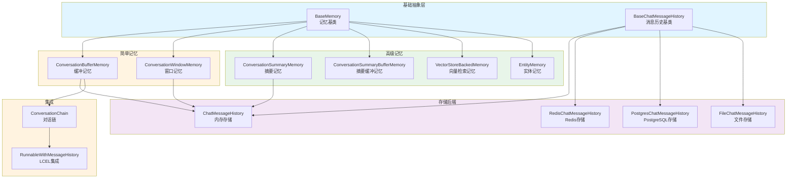

### 架构图详细说明

**1. 基础抽象层**

- **BaseMemory**: 所有记忆的基类

  ```python
  class BaseMemory(ABC):
      @property
      @abstractmethod
      def memory_variables(self) -> list[str]:
          """记忆提供的变量名列表"""

      @abstractmethod
      def load_memory_variables(self, inputs: dict[str, Any]) -> dict[str, Any]:
          """加载记忆变量"""

      @abstractmethod
      def save_context(self, inputs: dict[str, Any], outputs: dict[str, str]) -> None:
          """保存对话上下文"""

      def clear(self) -> None:
          """清除记忆"""
```

- **BaseChatMessageHistory**: 消息历史存储抽象

  ```python
  class BaseChatMessageHistory(ABC):
      messages: list[BaseMessage]  # 消息列表

      def add_user_message(self, message: str) -> None:
          """添加用户消息"""

      def add_ai_message(self, message: str) -> None:
          """添加AI消息"""

      def clear(self) -> None:
          """清空历史"""
```

**2. 简单记忆实现**

- **ConversationBufferMemory**: 缓冲所有历史
  - 保留完整对话历史
  - Token 消耗随对话增长线性增加
  - 适合短对话或需要完整上下文的场景

  ```python
  class ConversationBufferMemory(BaseMemory):
      chat_memory: BaseChatMessageHistory  # 消息存储
      return_messages: bool = False  # 返回消息对象还是字符串

      def load_memory_variables(self, inputs: dict) -> dict:
          """加载所有历史消息"""
          if self.return_messages:
              return {"history": self.chat_memory.messages}
          else:
              return {"history": self._get_buffer_string()}

      def save_context(self, inputs: dict, outputs: dict) -> None:
          """保存输入和输出"""
          self.chat_memory.add_user_message(inputs["input"])
          self.chat_memory.add_ai_message(outputs["output"])
```

- **ConversationWindowMemory**: 滑动窗口记忆
  - 只保留最近 k 轮对话
  - Token 消耗固定
  - 适合一般长度对话

  ```python
  class ConversationWindowMemory(BaseMemory):
      k: int = 5  # 保留最近5轮对话

      def load_memory_variables(self, inputs: dict) -> dict:
          """加载最近k轮对话"""
          messages = self.chat_memory.messages[-self.k*2:]  # k轮=k对消息
          return {"history": messages}
```

**3. 高级记忆实现**

- **ConversationSummaryMemory**: 摘要记忆
  - 使用 LLM 压缩历史为摘要
  - 节省 Token
  - 适合长对话

  ```python
  class ConversationSummaryMemory(BaseMemory):
      llm: BaseLanguageModel  # 用于生成摘要的LLM
      buffer: str = ""  # 当前摘要

      def predict_new_summary(
          self,
          messages: list[BaseMessage],
          existing_summary: str
      ) -> str:
          """生成新摘要"""
          # 提示词：根据现有摘要和新消息，生成更新的摘要
          prompt = f"""
          Current summary: {existing_summary}
          New messages: {messages}
          Updated summary:
          """
          return self.llm.predict(prompt)

      def save_context(self, inputs: dict, outputs: dict) -> None:
          """保存并更新摘要"""
          # 添加新消息
          self.chat_memory.add_user_message(inputs["input"])
          self.chat_memory.add_ai_message(outputs["output"])

          # 更新摘要
          new_messages = self.chat_memory.messages[-2:]
          self.buffer = self.predict_new_summary(new_messages, self.buffer)
```

- **ConversationSummaryBufferMemory**: 混合记忆
  - 最近消息保持原样
  - 较早消息压缩为摘要
  - 平衡细节和压缩

  ```python
  class ConversationSummaryBufferMemory(BaseMemory):
      max_token_limit: int = 2000  # Token上限

      def load_memory_variables(self, inputs: dict) -> dict:
          """返回摘要+最近消息"""
          return {
              "history": self.moving_summary_buffer + recent_messages
          }
```

- **VectorStoreBackedMemory**: 向量检索记忆
  - 基于语义相似度检索相关历史
  - 适合复杂、非线性对话

  ```python
  class VectorStoreBackedMemory(BaseMemory):
      vectorstore: VectorStore
      k: int = 4  # 检索数量

      def load_memory_variables(self, inputs: dict) -> dict:
          """检索相关历史"""
          query = inputs["input"]
          docs = self.vectorstore.similarity_search(query, k=self.k)
          return {"history": docs}

      def save_context(self, inputs: dict, outputs: dict) -> None:
          """保存到向量存储"""
          text = f"Human: {inputs['input']}\nAI: {outputs['output']}"
          self.vectorstore.add_texts([text])
```

- **EntityMemory**: 实体记忆
  - 提取和跟踪对话中的实体
  - 维护实体知识图谱

  ```python
  class EntityMemory(BaseMemory):
      entity_store: dict[str, str]  # 实体存储

      def save_context(self, inputs: dict, outputs: dict) -> None:
          """提取并保存实体"""
          entities = self._extract_entities(inputs["input"], outputs["output"])
          for entity, info in entities.items():
              self.entity_store[entity] = info
```

**4. 存储后端**

- **ChatMessageHistory**: 内存存储（默认）
  - 存储在内存中
  - 进程重启后丢失

- **RedisChatMessageHistory**: Redis 存储
  - 持久化
  - 支持分布式

- **PostgresChatMessageHistory**: PostgreSQL 存储
  - 关系数据库存储
  - 支持复杂查询

- **FileChatMessageHistory**: 文件存储
  - 本地文件持久化
  - 简单易用

**5. 集成方式**

- **ConversationChain**: 传统对话链（已废弃）

  ```python
  chain = ConversationChain(
      llm=llm,
      memory=ConversationBufferMemory()
  )
```

- **RunnableWithMessageHistory**: LCEL 集成（推荐）

  ```python
  chain_with_history = RunnableWithMessageHistory(
      runnable=chain,
      get_session_history=get_chat_history,
      input_messages_key="input",
      history_messages_key="history"
  )
```

## 3. 核心 API 详解

### 3.1 ConversationBufferMemory - 完整历史记忆

**使用示例**:

```python
from langchain.memory import ConversationBufferMemory

# 创建记忆
memory = ConversationBufferMemory()

# 保存对话
memory.save_context(
    {"input": "Hi, I'm Alice"},
    {"output": "Hello Alice! Nice to meet you."}
)

memory.save_context(
    {"input": "What's my name?"},
    {"output": "Your name is Alice."}
)

# 加载记忆
print(memory.load_memory_variables({}))
# {
#   "history": "Human: Hi, I'm Alice\nAI: Hello Alice! Nice to meet you.\nHuman: What's my name?\nAI: Your name is Alice."
# }

# 返回消息对象
memory_with_messages = ConversationBufferMemory(return_messages=True)
memory_with_messages.save_context({"input": "Hi"}, {"output": "Hello"})
print(memory_with_messages.load_memory_variables({}))
# {
#   "history": [
#       HumanMessage(content="Hi"),
#       AIMessage(content="Hello")
#   ]
# }

# 在对话链中使用
from langchain.chains import ConversationChain
from langchain_openai import ChatOpenAI

conversation = ConversationChain(
    llm=ChatOpenAI(),
    memory=ConversationBufferMemory()
)

# 对话1
response1 = conversation.predict(input="Hi, I'm Bob")
# "Hello Bob! How can I help you today?"

# 对话2（记得前面的对话）
response2 = conversation.predict(input="What's my name?")
# "Your name is Bob."
```

### 3.2 ConversationWindowMemory - 滑动窗口记忆

```python
from langchain.memory import ConversationWindowMemory

# 只保留最近2轮对话
memory = ConversationWindowMemory(k=2)

# 模拟5轮对话
conversations = [
    ("Hi", "Hello"),
    ("My name is Alice", "Nice to meet you, Alice"),
    ("I like pizza", "Pizza is great!"),
    ("What's the weather?", "It's sunny today"),
    ("Thanks", "You're welcome!")
]

for user_msg, ai_msg in conversations:
    memory.save_context({"input": user_msg}, {"output": ai_msg})

# 只会看到最后2轮
print(memory.load_memory_variables({}))
# {
#   "history": "Human: What's the weather?\nAI: It's sunny today\nHuman: Thanks\nAI: You're welcome!"
# }

# 在链中使用
conversation = ConversationChain(
    llm=ChatOpenAI(),
    memory=ConversationWindowMemory(k=3)  # 只记住最近3轮
)
```

### 3.3 ConversationSummaryMemory - 摘要记忆

```python
from langchain.memory import ConversationSummaryMemory
from langchain_openai import ChatOpenAI

llm = ChatOpenAI(temperature=0)
memory = ConversationSummaryMemory(llm=llm)

# 长对话
memory.save_context(
    {"input": "Hi, I'm planning a trip to Japan"},
    {"output": "That sounds exciting! Japan is a wonderful destination. When are you planning to go?"}
)

memory.save_context(
    {"input": "I'm thinking March or April. What's the best time?"},
    {"output": "March and April are great times to visit Japan! You'll be there during cherry blossom season."}
)

memory.save_context(
    {"input": "Where should I visit in Tokyo?"},
    {"output": "In Tokyo, you should visit Shibuya, Shinjuku, Asakusa for the Senso-ji Temple, and Akihabara."}
)

# 加载摘要（而不是完整历史）
print(memory.load_memory_variables({}))
# {
#   "history": "The human is planning a trip to Japan in March or April to see cherry blossoms. They've been given recommendations for places to visit in Tokyo including Shibuya, Shinjuku, Asakusa, and Akihabara."
# }
```

### 3.4 VectorStoreBackedMemory - 向量检索记忆

```python
from langchain.memory import VectorStoreRetrieverMemory
from langchain_community.vectorstores import FAISS
from langchain_openai import OpenAIEmbeddings

# 创建向量存储
embeddings = OpenAIEmbeddings()
vectorstore = FAISS.from_texts([], embeddings)

# 创建记忆
memory = VectorStoreRetrieverMemory(
    retriever=vectorstore.as_retriever(search_kwargs={"k": 2})
)

# 保存多个对话片段
memory.save_context(
    {"input": "My favorite color is blue"},
    {"output": "That's nice! Blue is a calming color."}
)

memory.save_context(
    {"input": "I have a dog named Max"},
    {"output": "Dogs are wonderful pets! Max sounds lovely."}
)

memory.save_context(
    {"input": "I work as a software engineer"},
    {"output": "That's a great profession!"}
)

# 基于语义相似度检索相关记忆
# 问关于宠物的问题，会检索到关于狗的记忆
result = memory.load_memory_variables({"input": "Tell me about my pet"})
print(result)
# 会检索到："I have a dog named Max"

# 问关于工作的问题
result = memory.load_memory_variables({"input": "What do I do for a living?"})
print(result)
# 会检索到："I work as a software engineer"
```

### 3.5 RunnableWithMessageHistory - LCEL 集成（推荐）

```python
from langchain_core.prompts import ChatPromptTemplate, MessagesPlaceholder
from langchain_core.runnables.history import RunnableWithMessageHistory
from langchain_community.chat_message_histories import ChatMessageHistory
from langchain_openai import ChatOpenAI
from langchain_core.output_parsers import StrOutputParser

# 1. 创建聊天链
prompt = ChatPromptTemplate.from_messages([
    ("system", "You are a helpful assistant."),
    MessagesPlaceholder(variable_name="history"),
    ("human", "{input}")
])

chain = prompt | ChatOpenAI() | StrOutputParser()

# 2. 会话历史存储
store = {}  # session_id -> ChatMessageHistory

def get_session_history(session_id: str) -> ChatMessageHistory:
    """获取或创建会话历史"""
    if session_id not in store:
        store[session_id] = ChatMessageHistory()
    return store[session_id]

# 3. 包装链以支持历史
chain_with_history = RunnableWithMessageHistory(
    chain,
    get_session_history,
    input_messages_key="input",
    history_messages_key="history"
)

# 4. 使用（传入 session_id）
config = {"configurable": {"session_id": "user123"}}

response1 = chain_with_history.invoke(
    {"input": "Hi, I'm Alice"},
    config=config
)
print(response1)  # "Hello Alice! How can I help you?"

response2 = chain_with_history.invoke(
    {"input": "What's my name?"},
    config=config
)
print(response2)  # "Your name is Alice."

# 5. 不同会话独立记忆
config2 = {"configurable": {"session_id": "user456"}}

response3 = chain_with_history.invoke(
    {"input": "What's my name?"},
    config=config2
)
print(response3)  # "I don't know your name. Could you tell me?"
```

### 3.6 持久化记忆

```python
# Redis 持久化
from langchain_community.chat_message_histories import RedisChatMessageHistory

history = RedisChatMessageHistory(
    session_id="user123",
    url="redis://localhost:6379"
)

chain_with_history = RunnableWithMessageHistory(
    chain,
    lambda session_id: RedisChatMessageHistory(
        session_id=session_id,
        url="redis://localhost:6379"
    ),
    input_messages_key="input",
    history_messages_key="history"
)

# 文件持久化
from langchain_community.chat_message_histories import FileChatMessageHistory

def get_file_history(session_id: str):
    return FileChatMessageHistory(f"./chat_histories/{session_id}.json")

chain_with_history = RunnableWithMessageHistory(
    chain,
    get_file_history,
    input_messages_key="input",
    history_messages_key="history"
)
```

## 4. 核心流程时序图

### 4.1 ConversationBufferMemory 工作流程

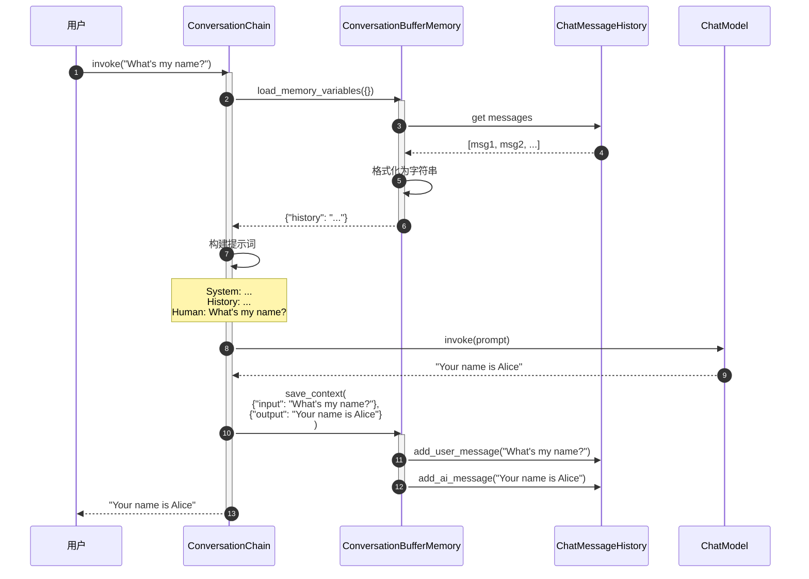

### 4.2 ConversationSummaryMemory 摘要流程

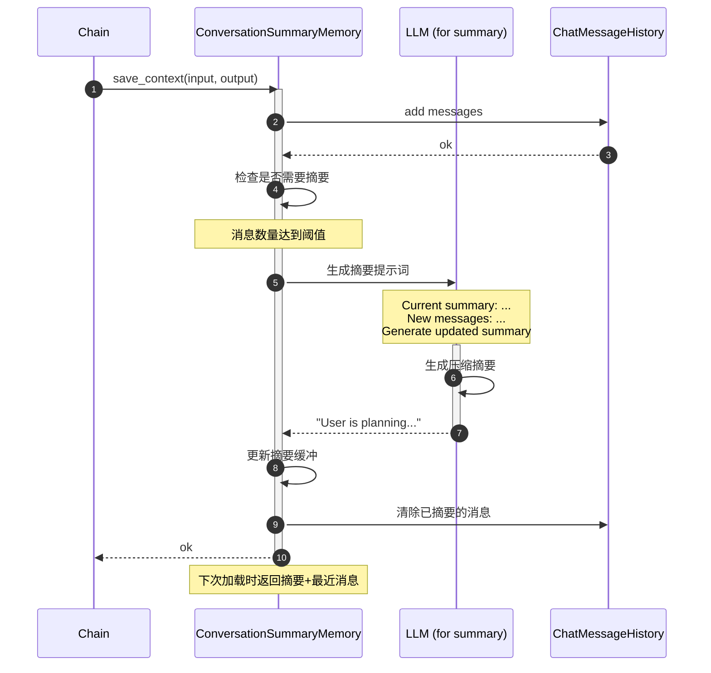

### 4.3 RunnableWithMessageHistory 完整流程

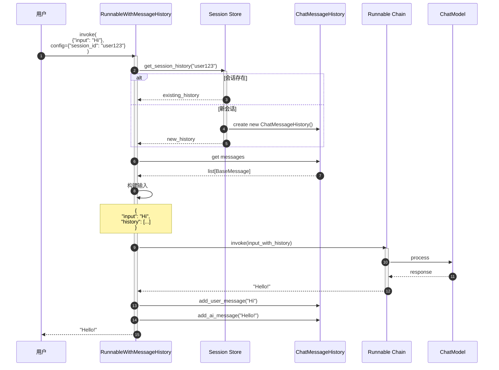

## 5. 最佳实践

### 5.1 选择合适的记忆类型

**短对话（< 10轮）**: ConversationBufferMemory

```python
memory = ConversationBufferMemory(return_messages=True)
```

**一般对话（10-50轮）**: ConversationWindowMemory

```python
memory = ConversationWindowMemory(k=5)  # 保留最近5轮
```

**长对话（> 50轮）**: ConversationSummaryBufferMemory

```python
memory = ConversationSummaryBufferMemory(
    llm=llm,
    max_token_limit=2000
)
```

**非线性对话（需要检索历史）**: VectorStoreRetrieverMemory

```python
memory = VectorStoreRetrieverMemory(
    retriever=vectorstore.as_retriever(search_kwargs={"k": 3})
)
```

### 5.2 多会话管理

```python
from typing import Dict
from langchain_community.chat_message_histories import ChatMessageHistory

class SessionManager:
    """会话管理器"""

    def __init__(self):
        self.sessions: Dict[str, ChatMessageHistory] = {}

    def get_history(self, session_id: str) -> ChatMessageHistory:
        """获取或创建会话"""
        if session_id not in self.sessions:
            self.sessions[session_id] = ChatMessageHistory()
        return self.sessions[session_id]

    def clear_session(self, session_id: str):
        """清除会话"""
        if session_id in self.sessions:
            self.sessions[session_id].clear()

    def delete_session(self, session_id: str):
        """删除会话"""
        if session_id in self.sessions:
            del self.sessions[session_id]

# 使用
manager = SessionManager()

chain_with_history = RunnableWithMessageHistory(
    chain,
    manager.get_history,
    input_messages_key="input",
    history_messages_key="history"
)
```

### 5.3 限制历史长度

```python
from langchain.memory import ConversationBufferMemory

class TruncatedBufferMemory(ConversationBufferMemory):
    """限制消息数量的缓冲记忆"""
    max_messages: int = 20

    def save_context(self, inputs: dict, outputs: dict) -> None:
        """保存并截断"""
        super().save_context(inputs, outputs)

        # 截断到最大消息数
        messages = self.chat_memory.messages
        if len(messages) > self.max_messages:
            self.chat_memory.messages = messages[-self.max_messages:]

memory = TruncatedBufferMemory(max_messages=10)
```

### 5.4 自定义记忆格式

```python
from langchain.memory import ConversationBufferMemory

class CustomFormattedMemory(ConversationBufferMemory):
    """自定义格式化记忆"""

    def _get_buffer_string(self) -> str:
        """自定义格式"""
        messages = self.chat_memory.messages
        formatted = []

        for msg in messages:
            if msg.type == "human":
                formatted.append(f"👤 User: {msg.content}")
            elif msg.type == "ai":
                formatted.append(f"🤖 Assistant: {msg.content}")

        return "\n".join(formatted)

memory = CustomFormattedMemory()
```

### 5.5 性能优化

**1. 异步保存**:

```python
import asyncio

async def async_save_conversation(memory, inputs, outputs):
    """异步保存对话"""
    await asyncio.to_thread(
        memory.save_context,
        inputs,
        outputs
    )

# 使用
asyncio.create_task(async_save_conversation(memory, inputs, outputs))
```

**2. 批量保存**:

```python
class BatchMemory:
    """批量保存记忆"""

    def __init__(self, memory, batch_size=10):
        self.memory = memory
        self.batch_size = batch_size
        self.buffer = []

    def add(self, inputs, outputs):
        """添加到缓冲"""
        self.buffer.append((inputs, outputs))

        if len(self.buffer) >= self.batch_size:
            self.flush()

    def flush(self):
        """批量保存"""
        for inputs, outputs in self.buffer:
            self.memory.save_context(inputs, outputs)
        self.buffer.clear()
```

**3. Redis 连接池**:

```python
import redis

# 使用连接池
pool = redis.ConnectionPool(
    host='localhost',
    port=6379,
    max_connections=10
)

def get_redis_history(session_id: str):
    return RedisChatMessageHistory(
        session_id=session_id,
        url="redis://localhost:6379",
        ttl=3600  # 1小时过期
    )
```

## 6. 常见问题和解决方案

### 6.1 Token 消耗过快

**问题**: 对话历史导致 Token 快速增长

**解决方案**:

```python
# 方案1: 使用窗口记忆
memory = ConversationWindowMemory(k=3)

# 方案2: 使用摘要记忆
memory = ConversationSummaryMemory(llm=llm)

# 方案3: 自定义截断
class TokenLimitedMemory(ConversationBufferMemory):
    max_tokens: int = 1000

    def load_memory_variables(self, inputs: dict) -> dict:
        """限制Token数量"""
        messages = self.chat_memory.messages
        total_tokens = 0
        truncated_messages = []

        # 从最新消息开始
        for msg in reversed(messages):
            msg_tokens = len(msg.content.split())  # 简化计算
            if total_tokens + msg_tokens > self.max_tokens:
                break
            truncated_messages.insert(0, msg)
            total_tokens += msg_tokens

        self.chat_memory.messages = truncated_messages
        return super().load_memory_variables(inputs)
```

### 6.2 多用户并发

**问题**: 多个用户同时访问，记忆混乱

**解决方案**:

```python
# 使用线程安全的会话管理
from threading import Lock

class ThreadSafeSessionManager:
    def __init__(self):
        self.sessions = {}
        self.locks = {}
        self.global_lock = Lock()

    def get_history(self, session_id: str):
        with self.global_lock:
            if session_id not in self.locks:
                self.locks[session_id] = Lock()

        with self.locks[session_id]:
            if session_id not in self.sessions:
                self.sessions[session_id] = ChatMessageHistory()
            return self.sessions[session_id]
```

### 6.3 记忆持久化失败

**问题**: Redis/数据库连接失败

**解决方案**:

```python
# 使用回退机制
class FallbackMemory:
    def __init__(self, primary, fallback):
        self.primary = primary
        self.fallback = fallback

    def save_context(self, inputs, outputs):
        try:
            self.primary.save_context(inputs, outputs)
        except Exception as e:
            logger.warning(f"Primary storage failed: {e}, using fallback")
            self.fallback.save_context(inputs, outputs)

# 使用
memory = FallbackMemory(
    primary=RedisChatMessageHistory(...),
    fallback=ChatMessageHistory()  # 内存回退
)
```

## 7. 与其他模块的协作

- **Prompts**: 通过 MessagesPlaceholder 注入历史
- **Language Models**: 接收包含历史的提示词
- **Chains**: ConversationChain 集成记忆
- **Runnables**: RunnableWithMessageHistory 提供 LCEL 支持
- **VectorStores**: VectorStoreBackedMemory 使用向量检索

## 8. 总结

Memory 模块为 LangChain 提供了灵活的对话记忆管理能力。关键特性：

1. **多种记忆策略**: Buffer、Window、Summary、Vector
2. **灵活存储**: 内存、Redis、PostgreSQL、文件
3. **LCEL 集成**: RunnableWithMessageHistory
4. **会话管理**: 支持多用户多会话
5. **可扩展**: 易于自定义记忆逻辑

**关键原则**:

- 根据对话长度选择合适的记忆类型
- 使用 RunnableWithMessageHistory（LCEL）而非旧的 ConversationChain
- 生产环境使用持久化存储（Redis/PostgreSQL）
- 限制 Token 消耗（窗口/摘要）
- 多用户场景使用 session_id 隔离

---

**文档版本**: v1.0
**最后更新**: 2025-10-03
**相关文档**:

- LangChain-00-总览.md
- LangChain-04-Prompts-概览.md
- LangChain-03-LanguageModels-概览.md

---

## API接口

## 文档说明

本文档详细描述 **Memory 模块**的对外 API，包括对话记忆、缓冲区管理、向量存储记忆、摘要记忆等核心接口的所有公开方法和参数规格。

---

## 1. BaseMemory 核心 API

### 1.1 基础接口

#### 基本信息
- **类名**：`BaseMemory`
- **功能**：所有记忆系统的抽象基类
- **核心职责**：存储对话历史、管理上下文、提供记忆检索

#### 核心方法

```python
class BaseMemory(Serializable, ABC):
    """记忆基类。"""

    @property
    @abstractmethod
    def memory_variables(self) -> List[str]:
        """返回记忆变量列表。"""

    @abstractmethod
    def load_memory_variables(self, inputs: Dict[str, Any]) -> Dict[str, Any]:
        """加载记忆变量。"""

    @abstractmethod
    def save_context(self, inputs: Dict[str, Any], outputs: Dict[str, str]) -> None:
        """保存对话上下文。"""

    def clear(self) -> None:
        """清除记忆内容。"""
        pass
```

**方法详解**：

| 方法 | 参数 | 返回类型 | 说明 |
|-----|------|---------|------|
| memory_variables | 属性 | `List[str]` | 记忆系统提供的变量名列表 |
| load_memory_variables | `inputs: Dict[str, Any]` | `Dict[str, Any]` | 根据输入加载相关记忆 |
| save_context | `inputs: Dict`, `outputs: Dict` | `None` | 保存对话轮次到记忆 |
| clear | 无 | `None` | 清空所有记忆内容 |

---

## 2. ConversationBufferMemory API

### 2.1 基础缓冲区记忆

#### 基本信息
- **功能**：存储完整的对话历史
- **特点**：简单直接，保留所有对话内容
- **适用场景**：短对话、需要完整上下文的场景

#### 构造参数

```python
class ConversationBufferMemory(BaseChatMemory):
    def __init__(
        self,
        human_prefix: str = "Human",
        ai_prefix: str = "AI",
        memory_key: str = "history",
        return_messages: bool = False,
        input_key: Optional[str] = None,
        output_key: Optional[str] = None,
        **kwargs: Any
    ):
        """对话缓冲区记忆构造函数。"""
```

**参数说明**：

| 参数 | 类型 | 默认值 | 说明 |
|-----|------|--------|------|
| human_prefix | `str` | `"Human"` | 人类消息前缀 |
| ai_prefix | `str` | `"AI"` | AI消息前缀 |
| memory_key | `str` | `"history"` | 记忆变量的键名 |
| return_messages | `bool` | `False` | 是否返回消息对象而非字符串 |
| input_key | `str` | `None` | 指定输入键（多输入时使用） |
| output_key | `str` | `None` | 指定输出键（多输出时使用） |

#### 使用示例

```python
from langchain.memory import ConversationBufferMemory

# 创建缓冲区记忆
memory = ConversationBufferMemory(
    memory_key="chat_history",
    return_messages=True
)

# 保存对话
memory.save_context(
    {"input": "你好，我是小明"},
    {"output": "你好小明！很高兴认识你。"}
)

memory.save_context(
    {"input": "今天天气怎么样？"},
    {"output": "今天天气很好，阳光明媚。"}
)

# 加载记忆
memory_vars = memory.load_memory_variables({})
print(memory_vars["chat_history"])
# [
#   HumanMessage(content="你好，我是小明"),
#   AIMessage(content="你好小明！很高兴认识你。"),
#   HumanMessage(content="今天天气怎么样？"),
#   AIMessage(content="今天天气很好，阳光明媚。")
# ]
```

#### 核心实现

```python
def load_memory_variables(self, inputs: Dict[str, Any]) -> Dict[str, Any]:
    """加载记忆变量。"""
    if self.return_messages:
        # 返回消息对象列表
        return {self.memory_key: self.chat_memory.messages}
    else:
        # 返回格式化的字符串
        buffer = self.buffer
        return {self.memory_key: buffer}

def save_context(self, inputs: Dict[str, Any], outputs: Dict[str, str]) -> None:
    """保存对话上下文。"""
    input_str = inputs[self.input_key or list(inputs.keys())[0]]
    output_str = outputs[self.output_key or list(outputs.keys())[0]]

    # 添加到聊天记忆
    self.chat_memory.add_user_message(input_str)
    self.chat_memory.add_ai_message(output_str)

@property
def buffer(self) -> str:
    """获取格式化的缓冲区内容。"""
    return get_buffer_string(
        self.chat_memory.messages,
        human_prefix=self.human_prefix,
        ai_prefix=self.ai_prefix
    )
```

---

## 3. ConversationBufferWindowMemory API

### 3.1 窗口缓冲区记忆

#### 基本信息
- **功能**：只保留最近的K轮对话
- **特点**：固定窗口大小，自动淘汰旧对话
- **适用场景**：长对话、内存限制场景

#### 构造参数

```python
class ConversationBufferWindowMemory(BaseChatMemory):
    def __init__(
        self,
        k: int = 5,
        human_prefix: str = "Human",
        ai_prefix: str = "AI",
        memory_key: str = "history",
        return_messages: bool = False,
        **kwargs: Any
    ):
        """窗口缓冲区记忆构造函数。"""
        super().__init__(**kwargs)
        self.k = k  # 窗口大小
        self.human_prefix = human_prefix
        self.ai_prefix = ai_prefix
        self.memory_key = memory_key
        self.return_messages = return_messages
```

#### 使用示例

```python
from langchain.memory import ConversationBufferWindowMemory

# 创建窗口记忆（只保留最近3轮对话）
memory = ConversationBufferWindowMemory(
    k=3,  # 保留3轮对话（6条消息）
    memory_key="chat_history",
    return_messages=True
)

# 添加多轮对话
conversations = [
    ("第1轮：你好", "你好！"),
    ("第2轮：天气", "今天天气很好"),
    ("第3轮：时间", "现在是下午3点"),
    ("第4轮：计划", "我们来制定计划吧"),
    ("第5轮：总结", "让我总结一下")
]

for human_msg, ai_msg in conversations:
    memory.save_context({"input": human_msg}, {"output": ai_msg})

# 检查记忆内容（只有最近3轮）
memory_vars = memory.load_memory_variables({})
messages = memory_vars["chat_history"]
print(f"保留的消息数量: {len(messages)}")  # 6条消息（3轮对话）

for msg in messages:
    print(f"{msg.__class__.__name__}: {msg.content}")
# HumanMessage: 第3轮：时间
# AIMessage: 现在是下午3点
# HumanMessage: 第4轮：计划
# AIMessage: 我们来制定计划吧
# HumanMessage: 第5轮：总结
# AIMessage: 让我总结一下
```

#### 窗口管理实现

```python
def save_context(self, inputs: Dict[str, Any], outputs: Dict[str, str]) -> None:
    """保存上下文并维护窗口大小。"""
    # 添加新消息
    super().save_context(inputs, outputs)

    # 维护窗口大小
    self._prune_messages()

def _prune_messages(self) -> None:
    """修剪消息以维护窗口大小。"""
    messages = self.chat_memory.messages

    # 计算应保留的消息数量（k轮对话 = 2*k条消息）
    max_messages = 2 * self.k

    if len(messages) > max_messages:
        # 只保留最新的消息
        self.chat_memory.messages = messages[-max_messages:]

@property
def buffer(self) -> str:
    """获取窗口内的缓冲区内容。"""
    return get_buffer_string(
        self.chat_memory.messages,
        human_prefix=self.human_prefix,
        ai_prefix=self.ai_prefix
    )
```

---

## 4. ConversationSummaryMemory API

### 4.1 摘要记忆

#### 基本信息
- **功能**：将对话历史压缩为摘要
- **特点**：节省内存，保留关键信息
- **适用场景**：长期对话、内存敏感应用

#### 构造参数

```python
class ConversationSummaryMemory(BaseChatMemory):
    def __init__(
        self,
        llm: BaseLanguageModel,
        memory_key: str = "history",
        return_messages: bool = False,
        buffer: str = "",
        prompt: BasePromptTemplate = SUMMARY_PROMPT,
        **kwargs: Any
    ):
        """摘要记忆构造函数。"""
        super().__init__(**kwargs)
        self.llm = llm
        self.memory_key = memory_key
        self.return_messages = return_messages
        self.buffer = buffer
        self.prompt = prompt
```

#### 使用示例

```python
from langchain.memory import ConversationSummaryMemory
from langchain_openai import OpenAI

# 创建摘要记忆
llm = OpenAI(temperature=0)
memory = ConversationSummaryMemory(
    llm=llm,
    memory_key="chat_summary"
)

# 添加对话历史
memory.save_context(
    {"input": "我想了解机器学习"},
    {"output": "机器学习是人工智能的一个分支，通过算法让计算机从数据中学习模式。"}
)

memory.save_context(
    {"input": "有哪些主要的机器学习算法？"},
    {"output": "主要包括监督学习（如决策树、随机森林）、无监督学习（如聚类、降维）和强化学习。"}
)

memory.save_context(
    {"input": "监督学习和无监督学习的区别是什么？"},
    {"output": "监督学习使用标注数据训练模型，无监督学习从未标注数据中发现模式。"}
)

# 获取摘要
memory_vars = memory.load_memory_variables({})
print(memory_vars["chat_summary"])
# "用户询问了机器学习的基础概念，AI解释了机器学习的定义、主要算法分类，
#  以及监督学习和无监督学习的区别。对话涵盖了机器学习的核心概念。"
```

#### 摘要生成实现

```python
def save_context(self, inputs: Dict[str, Any], outputs: Dict[str, str]) -> None:
    """保存上下文并更新摘要。"""
    # 添加新消息到临时缓冲区
    super().save_context(inputs, outputs)

    # 生成新的摘要
    self._update_summary()

def _update_summary(self) -> None:
    """更新对话摘要。"""
    messages = self.chat_memory.messages

    if len(messages) >= 2:  # 至少有一轮对话
        # 构建摘要提示
        new_lines = get_buffer_string(messages)

        if self.buffer:
            # 有现有摘要，进行增量更新
            prompt_input = {
                "summary": self.buffer,
                "new_lines": new_lines
            }
            prompt = self.prompt
        else:
            # 首次生成摘要
            prompt_input = {"new_lines": new_lines}
            prompt = SUMMARY_PROMPT

        # 调用LLM生成摘要
        self.buffer = self.llm.predict(prompt.format(**prompt_input))

        # 清空消息缓冲区（已经摘要化）
        self.chat_memory.clear()

def load_memory_variables(self, inputs: Dict[str, Any]) -> Dict[str, Any]:
    """加载摘要记忆。"""
    if self.return_messages:
        # 将摘要转换为系统消息
        if self.buffer:
            return {self.memory_key: [SystemMessage(content=self.buffer)]}
        else:
            return {self.memory_key: []}
    else:
        return {self.memory_key: self.buffer}
```

#### 默认摘要提示

```python
SUMMARY_PROMPT = PromptTemplate(
    input_variables=["summary", "new_lines"],
    template="""
请简洁地总结以下对话内容，保留关键信息：

现有摘要：
{summary}

新的对话内容：
{new_lines}

新的摘要：
""".strip()
)
```

---

## 5. ConversationTokenBufferMemory API

### 5.1 令牌缓冲区记忆

#### 基本信息
- **功能**：基于令牌数量限制记忆大小
- **特点**：精确控制记忆的令牌消耗
- **适用场景**：API成本敏感、有严格令牌限制的场景

#### 构造参数

```python
class ConversationTokenBufferMemory(BaseChatMemory):
    def __init__(
        self,
        llm: BaseLanguageModel,
        max_token_limit: int = 2000,
        return_messages: bool = False,
        memory_key: str = "history",
        **kwargs: Any
    ):
        """令牌缓冲区记忆构造函数。"""
        super().__init__(**kwargs)
        self.llm = llm
        self.max_token_limit = max_token_limit
        self.return_messages = return_messages
        self.memory_key = memory_key
```

#### 使用示例

```python
from langchain.memory import ConversationTokenBufferMemory
from langchain_openai import OpenAI

# 创建令牌限制记忆
llm = OpenAI()
memory = ConversationTokenBufferMemory(
    llm=llm,
    max_token_limit=100,  # 限制100个令牌
    memory_key="chat_history"
)

# 添加对话（会自动管理令牌数量）
memory.save_context(
    {"input": "请详细介绍一下深度学习的发展历史和主要里程碑"},
    {"output": "深度学习起源于1940年代的感知机概念，经历了多次起伏..."}
)

# 检查当前令牌使用情况
current_tokens = memory._get_current_token_count()
print(f"当前令牌数: {current_tokens}/{memory.max_token_limit}")

# 继续添加对话，超出限制时会自动删除旧消息
memory.save_context(
    {"input": "深度学习有哪些主要应用领域？"},
    {"output": "深度学习在计算机视觉、自然语言处理、语音识别等领域有广泛应用..."}
)
```

#### 令牌管理实现

```python
def save_context(self, inputs: Dict[str, Any], outputs: Dict[str, str]) -> None:
    """保存上下文并管理令牌限制。"""
    # 添加新消息
    super().save_context(inputs, outputs)

    # 修剪消息以符合令牌限制
    self._prune_messages_to_token_limit()

def _prune_messages_to_token_limit(self) -> None:
    """修剪消息以满足令牌限制。"""
    while self._get_current_token_count() > self.max_token_limit:
        if len(self.chat_memory.messages) <= 2:
            # 至少保留一轮对话
            break

        # 删除最旧的消息对（人类+AI）
        self.chat_memory.messages = self.chat_memory.messages[2:]

def _get_current_token_count(self) -> int:
    """计算当前消息的令牌数量。"""
    buffer = get_buffer_string(self.chat_memory.messages)
    return self.llm.get_num_tokens(buffer)

@property
def buffer(self) -> str:
    """获取当前缓冲区内容。"""
    return get_buffer_string(self.chat_memory.messages)
```

---

## 6. VectorStoreRetrieverMemory API

### 6.1 向量存储记忆

#### 基本信息
- **功能**：使用向量存储进行语义记忆检索
- **特点**：基于相似性检索相关历史
- **适用场景**：长期记忆、语义相关的上下文检索

#### 构造参数

```python
class VectorStoreRetrieverMemory(BaseMemory):
    def __init__(
        self,
        retriever: VectorStoreRetriever,
        memory_key: str = "history",
        input_key: Optional[str] = None,
        return_docs: bool = False,
        **kwargs: Any
    ):
        """向量存储检索记忆构造函数。"""
        self.retriever = retriever
        self.memory_key = memory_key
        self.input_key = input_key
        self.return_docs = return_docs
```

#### 使用示例

```python
from langchain.memory import VectorStoreRetrieverMemory
from langchain_chroma import Chroma
from langchain_openai import OpenAIEmbeddings

# 创建向量存储
embeddings = OpenAIEmbeddings()
vectorstore = Chroma(embedding_function=embeddings)

# 创建检索器
retriever = vectorstore.as_retriever(
    search_type="similarity",
    search_kwargs={"k": 3}
)

# 创建向量存储记忆
memory = VectorStoreRetrieverMemory(
    retriever=retriever,
    memory_key="relevant_history"
)

# 保存对话历史
memory.save_context(
    {"input": "我对机器学习很感兴趣"},
    {"output": "机器学习是一个很有前景的领域，建议从基础算法开始学习"}
)

memory.save_context(
    {"input": "Python有哪些机器学习库？"},
    {"output": "主要有scikit-learn、TensorFlow、PyTorch等优秀的库"}
)

memory.save_context(
    {"input": "今天天气真好"},
    {"output": "是的，适合出去散步"}
)

# 基于查询检索相关历史
relevant_memory = memory.load_memory_variables(
    {"input": "推荐一些深度学习资源"}
)
print(relevant_memory["relevant_history"])
# 会返回与"深度学习"相关的历史对话，如机器学习和Python库的讨论
```

#### 向量检索实现

```python
def save_context(self, inputs: Dict[str, Any], outputs: Dict[str, str]) -> None:
    """保存对话到向量存储。"""
    input_str = inputs[self.input_key or list(inputs.keys())[0]]
    output_str = outputs[list(outputs.keys())[0]]

    # 构建文档内容
    document_content = f"Human: {input_str}\nAI: {output_str}"

    # 添加到向量存储
    self.retriever.vectorstore.add_texts(
        texts=[document_content],
        metadatas=[{
            "input": input_str,
            "output": output_str,
            "timestamp": time.time()
        }]
    )

def load_memory_variables(self, inputs: Dict[str, Any]) -> Dict[str, Any]:
    """基于输入检索相关记忆。"""
    query = inputs[self.input_key or list(inputs.keys())[0]]

    # 检索相关文档
    docs = self.retriever.get_relevant_documents(query)

    if self.return_docs:
        return {self.memory_key: docs}
    else:
        # 格式化为字符串
        memory_content = "\n\n".join([doc.page_content for doc in docs])
        return {self.memory_key: memory_content}

@property
def memory_variables(self) -> List[str]:
    """返回记忆变量列表。"""
    return [self.memory_key]

def clear(self) -> None:
    """清除向量存储中的所有记忆。"""
    # 注意：这会删除向量存储中的所有文档
    if hasattr(self.retriever.vectorstore, 'delete'):
        self.retriever.vectorstore.delete()
```

---

## 7. ConversationEntityMemory API

### 7.1 实体记忆

#### 基本信息
- **功能**：提取和记住对话中的实体信息
- **特点**：结构化存储实体及其属性
- **适用场景**：需要记住人物、地点、事件等实体信息的对话

#### 构造参数

```python
class ConversationEntityMemory(BaseChatMemory):
    def __init__(
        self,
        llm: BaseLanguageModel,
        entity_extraction_prompt: BasePromptTemplate = ENTITY_EXTRACTION_PROMPT,
        entity_summarization_prompt: BasePromptTemplate = ENTITY_SUMMARIZATION_PROMPT,
        entity_cache: Optional[List[str]] = None,
        k: int = 3,
        memory_key: str = "entities",
        **kwargs: Any
    ):
        """实体记忆构造函数。"""
        super().__init__(**kwargs)
        self.llm = llm
        self.entity_extraction_prompt = entity_extraction_prompt
        self.entity_summarization_prompt = entity_summarization_prompt
        self.entity_cache = entity_cache or []
        self.k = k  # 返回的相关实体数量
        self.memory_key = memory_key
        self.entity_store: Dict[str, str] = {}  # 实体存储
```

#### 使用示例

```python
from langchain.memory import ConversationEntityMemory
from langchain_openai import OpenAI

# 创建实体记忆
llm = OpenAI(temperature=0)
memory = ConversationEntityMemory(
    llm=llm,
    memory_key="entity_info"
)

# 保存包含实体的对话
memory.save_context(
    {"input": "我叫张三，今年30岁，住在北京，在阿里巴巴工作"},
    {"output": "很高兴认识你张三！你在阿里巴巴做什么工作呢？"}
)

memory.save_context(
    {"input": "我是一名软件工程师，主要负责后端开发"},
    {"output": "软件工程师是个很有前景的职业，后端开发需要掌握哪些技术呢？"}
)

# 检索与特定输入相关的实体信息
entity_info = memory.load_memory_variables(
    {"input": "张三的工作经历如何？"}
)
print(entity_info["entity_info"])
# "张三: 30岁，住在北京，在阿里巴巴担任软件工程师，负责后端开发"
```

#### 实体提取和管理

```python
def save_context(self, inputs: Dict[str, Any], outputs: Dict[str, str]) -> None:
    """保存上下文并提取实体。"""
    # 保存到聊天记忆
    super().save_context(inputs, outputs)

    # 提取新实体
    input_str = inputs[list(inputs.keys())[0]]
    output_str = outputs[list(outputs.keys())[0]]

    # 从输入和输出中提取实体
    text = f"{input_str}\n{output_str}"
    entities = self._extract_entities(text)

    # 更新实体存储
    for entity in entities:
        self._update_entity_info(entity, text)

def _extract_entities(self, text: str) -> List[str]:
    """从文本中提取实体。"""
    prompt = self.entity_extraction_prompt.format(text=text)
    result = self.llm.predict(prompt)

    # 解析LLM返回的实体列表
    entities = [entity.strip() for entity in result.split(',') if entity.strip()]
    return entities

def _update_entity_info(self, entity: str, context: str) -> None:
    """更新实体信息。"""
    if entity in self.entity_store:
        # 更新现有实体信息
        existing_info = self.entity_store[entity]
        prompt = self.entity_summarization_prompt.format(
            entity=entity,
            existing_info=existing_info,
            new_context=context
        )
        updated_info = self.llm.predict(prompt)
        self.entity_store[entity] = updated_info
    else:
        # 创建新实体信息
        prompt = f"根据以下上下文，总结关于{entity}的信息：\n{context}"
        entity_info = self.llm.predict(prompt)
        self.entity_store[entity] = entity_info

def load_memory_variables(self, inputs: Dict[str, Any]) -> Dict[str, Any]:
    """加载相关实体信息。"""
    input_str = inputs[list(inputs.keys())[0]]

    # 从输入中提取实体
    relevant_entities = self._extract_entities(input_str)

    # 获取相关实体信息
    entity_summaries = []
    for entity in relevant_entities[:self.k]:
        if entity in self.entity_store:
            entity_summaries.append(f"{entity}: {self.entity_store[entity]}")

    return {self.memory_key: "\n".join(entity_summaries)}
```

---

## 8. 组合记忆 API

### 8.1 CombinedMemory

#### 基本信息
- **功能**：组合多种记忆类型
- **特点**：同时使用多个记忆系统
- **适用场景**：需要不同类型记忆互补的复杂应用

#### 使用示例

```python
from langchain.memory import (
    CombinedMemory,
    ConversationBufferMemory,
    ConversationSummaryMemory,
    VectorStoreRetrieverMemory
)

# 创建多个记忆组件
buffer_memory = ConversationBufferMemory(
    memory_key="chat_history",
    return_messages=True
)

summary_memory = ConversationSummaryMemory(
    llm=llm,
    memory_key="conversation_summary"
)

vector_memory = VectorStoreRetrieverMemory(
    retriever=retriever,
    memory_key="relevant_context"
)

# 组合记忆
combined_memory = CombinedMemory(
    memories=[buffer_memory, summary_memory, vector_memory]
)

# 使用组合记忆
combined_memory.save_context(
    {"input": "我想学习深度学习"},
    {"output": "深度学习是机器学习的一个重要分支..."}
)

# 获取所有记忆类型的信息
all_memory = combined_memory.load_memory_variables({
    "input": "有什么深度学习的学习建议吗？"
})

print("聊天历史:", all_memory["chat_history"])
print("对话摘要:", all_memory["conversation_summary"])
print("相关上下文:", all_memory["relevant_context"])
```

#### 组合记忆实现

```python
class CombinedMemory(BaseMemory):
    """组合多个记忆系统。"""

    def __init__(self, memories: List[BaseMemory]):
        self.memories = memories

    @property
    def memory_variables(self) -> List[str]:
        """返回所有记忆的变量列表。"""
        variables = []
        for memory in self.memories:
            variables.extend(memory.memory_variables)
        return variables

    def load_memory_variables(self, inputs: Dict[str, Any]) -> Dict[str, Any]:
        """加载所有记忆的变量。"""
        memory_data = {}
        for memory in self.memories:
            memory_vars = memory.load_memory_variables(inputs)
            memory_data.update(memory_vars)
        return memory_data

    def save_context(self, inputs: Dict[str, Any], outputs: Dict[str, str]) -> None:
        """保存上下文到所有记忆。"""
        for memory in self.memories:
            memory.save_context(inputs, outputs)

    def clear(self) -> None:
        """清除所有记忆。"""
        for memory in self.memories:
            memory.clear()
```

---

## 9. 记忆管理工具 API

### 9.1 记忆统计和监控

```python
class MemoryManager:
    """记忆管理器。"""

    def __init__(self, memory: BaseMemory):
        self.memory = memory
        self.stats = {
            "total_contexts_saved": 0,
            "total_memory_loads": 0,
            "memory_size_bytes": 0,
            "last_accessed": None
        }

    def save_context_with_stats(
        self,
        inputs: Dict[str, Any],
        outputs: Dict[str, str]
    ) -> None:
        """保存上下文并更新统计。"""
        start_time = time.time()

        # 保存上下文
        self.memory.save_context(inputs, outputs)

        # 更新统计
        self.stats["total_contexts_saved"] += 1
        self.stats["last_accessed"] = time.time()
        self.stats["save_time"] = time.time() - start_time

        # 估算内存大小
        self._update_memory_size()

    def load_memory_with_stats(
        self,
        inputs: Dict[str, Any]
    ) -> Dict[str, Any]:
        """加载记忆并更新统计。"""
        start_time = time.time()

        # 加载记忆
        memory_vars = self.memory.load_memory_variables(inputs)

        # 更新统计
        self.stats["total_memory_loads"] += 1
        self.stats["last_accessed"] = time.time()
        self.stats["load_time"] = time.time() - start_time

        return memory_vars

    def _update_memory_size(self) -> None:
        """更新记忆大小估算。"""
        if hasattr(self.memory, 'buffer'):
            self.stats["memory_size_bytes"] = len(self.memory.buffer.encode('utf-8'))
        elif hasattr(self.memory, 'chat_memory'):
            total_size = 0
            for msg in self.memory.chat_memory.messages:
                total_size += len(msg.content.encode('utf-8'))
            self.stats["memory_size_bytes"] = total_size

    def get_memory_stats(self) -> Dict[str, Any]:
        """获取记忆统计信息。"""
        return {
            **self.stats,
            "memory_type": type(self.memory).__name__,
            "memory_variables": self.memory.memory_variables
        }

    def optimize_memory(self) -> None:
        """优化记忆性能。"""
        if isinstance(self.memory, ConversationBufferMemory):
            # 检查是否需要转换为窗口记忆
            if hasattr(self.memory, 'chat_memory'):
                message_count = len(self.memory.chat_memory.messages)
                if message_count > 100:  # 消息过多
                    print("建议使用ConversationBufferWindowMemory以提高性能")

        elif isinstance(self.memory, ConversationSummaryMemory):
            # 检查摘要是否过长
            if len(self.memory.buffer) > 2000:
                print("摘要过长，建议重新生成或分段摘要")
```

---

## 10. 最佳实践与配置

### 10.1 记忆类型选择指南

| 场景 | 推荐记忆类型 | 配置建议 |
|-----|-------------|---------|
| 短对话 | `ConversationBufferMemory` | 简单直接，保留完整历史 |
| 长对话 | `ConversationBufferWindowMemory` | k=5-10，平衡性能和上下文 |
| 成本敏感 | `ConversationTokenBufferMemory` | 根据模型定价设置token限制 |
| 长期记忆 | `ConversationSummaryMemory` | 使用高质量LLM生成摘要 |
| 语义检索 | `VectorStoreRetrieverMemory` | 选择合适的embedding模型 |
| 实体追踪 | `ConversationEntityMemory` | 适用于客服、个人助手等场景 |
| 复杂应用 | `CombinedMemory` | 组合多种记忆类型 |

### 10.2 性能优化配置

```python
def create_optimized_memory(
    conversation_length: str,
    cost_sensitivity: str,
    semantic_search: bool = False
) -> BaseMemory:
    """根据需求创建优化的记忆配置。"""

    if conversation_length == "short" and cost_sensitivity == "low":
        # 短对话，成本不敏感
        return ConversationBufferMemory(
            memory_key="history",
            return_messages=True
        )

    elif conversation_length == "long" and cost_sensitivity == "high":
        # 长对话，成本敏感
        return ConversationTokenBufferMemory(
            llm=llm,
            max_token_limit=1000,
            memory_key="history"
        )

    elif semantic_search:
        # 需要语义检索
        return VectorStoreRetrieverMemory(
            retriever=retriever,
            memory_key="relevant_history"
        )

    else:
        # 默认配置：窗口记忆
        return ConversationBufferWindowMemory(
            k=5,
            memory_key="history",
            return_messages=True
        )

# 使用示例
memory = create_optimized_memory(
    conversation_length="long",
    cost_sensitivity="high",
    semantic_search=False
)
```

---

## 11. 总结

本文档详细描述了 **Memory 模块**的核心 API：

### 主要记忆类型
1. **ConversationBufferMemory**：完整对话历史存储
2. **ConversationBufferWindowMemory**：固定窗口大小的记忆
3. **ConversationSummaryMemory**：基于LLM的对话摘要
4. **ConversationTokenBufferMemory**：基于令牌限制的记忆
5. **VectorStoreRetrieverMemory**：基于向量检索的语义记忆
6. **ConversationEntityMemory**：实体提取和追踪记忆

### 核心功能
1. **上下文管理**：save_context和load_memory_variables
2. **记忆检索**：基于输入检索相关历史信息
3. **内存优化**：不同策略的内存使用优化
4. **组合使用**：CombinedMemory支持多种记忆类型组合

每个 API 均包含：

- 完整的构造参数和配置选项
- 详细的使用示例和最佳实践
- 核心实现逻辑和算法说明
- 性能优化建议和选择指南

Memory 模块是构建有状态对话系统的关键组件，正确选择和配置记忆类型对提高对话质量和系统性能至关重要。

---

## 数据结构

## 文档说明

本文档详细描述 **Memory 模块**的核心数据结构，包括记忆类层次、消息存储、缓冲区管理、实体提取、向量检索等。所有结构均配备 UML 类图和详细的字段说明。

---

## 1. Memory 类层次结构

### 1.1 核心记忆继承体系

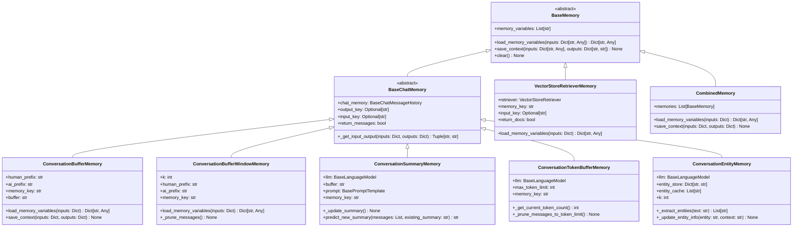

**图解说明**：

1. **抽象基类**：
   - `BaseMemory`：所有记忆系统的根基类
   - `BaseChatMemory`：基于聊天消息的记忆基类

2. **缓冲区记忆**：
   - `ConversationBufferMemory`：完整对话历史
   - `ConversationBufferWindowMemory`：固定窗口大小
   - `ConversationTokenBufferMemory`：基于令牌限制

3. **智能记忆**：
   - `ConversationSummaryMemory`：基于摘要的压缩记忆
   - `ConversationEntityMemory`：实体提取和追踪
   - `VectorStoreRetrieverMemory`：向量检索记忆

4. **组合记忆**：
   - `CombinedMemory`：多种记忆类型的组合

---

## 2. 消息存储数据结构

### 2.1 ChatMessageHistory 结构

```python
class BaseChatMessageHistory(ABC):
    """聊天消息历史基类。"""

    messages: List[BaseMessage]  # 消息列表

    @abstractmethod
    def add_user_message(self, message: str) -> None:
        """添加用户消息。"""

    @abstractmethod
    def add_ai_message(self, message: str) -> None:
        """添加AI消息。"""

    def add_message(self, message: BaseMessage) -> None:
        """添加任意类型消息。"""
        self.messages.append(message)

    def clear(self) -> None:
        """清空消息历史。"""
        self.messages = []

class ChatMessageHistory(BaseChatMessageHistory):
    """内存中的聊天消息历史。"""

    def __init__(self, messages: Optional[List[BaseMessage]] = None):
        self.messages = messages or []

    def add_user_message(self, message: str) -> None:
        """添加用户消息。"""
        self.messages.append(HumanMessage(content=message))

    def add_ai_message(self, message: str) -> None:
        """添加AI消息。"""
        self.messages.append(AIMessage(content=message))
```

**消息类型结构**：

```python
class BaseMessage:
    """消息基类。"""
    content: str                    # 消息内容
    additional_kwargs: dict         # 额外参数
    response_metadata: dict         # 响应元数据

class HumanMessage(BaseMessage):
    """人类消息。"""
    type: str = "human"

class AIMessage(BaseMessage):
    """AI消息。"""
    type: str = "ai"

class SystemMessage(BaseMessage):
    """系统消息。"""
    type: str = "system"

class FunctionMessage(BaseMessage):
    """函数消息。"""
    type: str = "function"
    name: str                       # 函数名称

class ToolMessage(BaseMessage):
    """工具消息。"""
    type: str = "tool"
    tool_call_id: str              # 工具调用ID
```

---

### 2.2 持久化消息历史

```python
class FileChatMessageHistory(BaseChatMessageHistory):
    """基于文件的消息历史。"""

    def __init__(self, file_path: str):
        self.file_path = file_path
        self._messages: List[BaseMessage] = []
        self._load_messages()

    def _load_messages(self) -> None:
        """从文件加载消息。"""
        if os.path.exists(self.file_path):
            with open(self.file_path, 'r', encoding='utf-8') as f:
                data = json.load(f)
                self._messages = [self._deserialize_message(msg) for msg in data]

    def _save_messages(self) -> None:
        """保存消息到文件。"""
        with open(self.file_path, 'w', encoding='utf-8') as f:
            data = [self._serialize_message(msg) for msg in self._messages]
            json.dump(data, f, ensure_ascii=False, indent=2)

    def add_message(self, message: BaseMessage) -> None:
        """添加消息并持久化。"""
        self._messages.append(message)
        self._save_messages()

    @property
    def messages(self) -> List[BaseMessage]:
        """获取消息列表。"""
        return self._messages

    def clear(self) -> None:
        """清空消息并删除文件。"""
        self._messages = []
        if os.path.exists(self.file_path):
            os.remove(self.file_path)

class RedisChatMessageHistory(BaseChatMessageHistory):
    """基于Redis的消息历史。"""

    def __init__(self, session_id: str, url: str = "redis://localhost:6379"):
        import redis
        self.redis_client = redis.from_url(url)
        self.session_id = session_id
        self.key = f"chat_history:{session_id}"

    @property
    def messages(self) -> List[BaseMessage]:
        """从Redis获取消息。"""
        messages_data = self.redis_client.lrange(self.key, 0, -1)
        return [json.loads(msg.decode()) for msg in messages_data]

    def add_message(self, message: BaseMessage) -> None:
        """添加消息到Redis。"""
        message_data = json.dumps(self._serialize_message(message))
        self.redis_client.rpush(self.key, message_data)

        # 设置过期时间（可选）
        self.redis_client.expire(self.key, 86400)  # 24小时

    def clear(self) -> None:
        """清空Redis中的消息。"""
        self.redis_client.delete(self.key)
```

---

## 3. 缓冲区管理数据结构

### 3.1 ConversationBufferMemory 结构

```python
class ConversationBufferMemory(BaseChatMemory):
    """对话缓冲区记忆数据结构。"""

    def __init__(
        self,
        chat_memory: Optional[BaseChatMessageHistory] = None,
        output_key: Optional[str] = None,
        input_key: Optional[str] = None,
        return_messages: bool = False,
        human_prefix: str = "Human",
        ai_prefix: str = "AI",
        memory_key: str = "history"
    ):
        # 核心字段
        self.chat_memory = chat_memory or ChatMessageHistory()
        self.output_key = output_key
        self.input_key = input_key
        self.return_messages = return_messages
        self.human_prefix = human_prefix
        self.ai_prefix = ai_prefix
        self.memory_key = memory_key

        # 统计信息
        self._message_count = 0
        self._total_tokens = 0
        self._created_at = time.time()
        self._last_accessed = None

    @property
    def buffer(self) -> str:
        """获取格式化的缓冲区内容。"""
        return get_buffer_string(
            self.chat_memory.messages,
            human_prefix=self.human_prefix,
            ai_prefix=self.ai_prefix
        )

    @property
    def memory_variables(self) -> List[str]:
        """返回记忆变量列表。"""
        return [self.memory_key]

    def get_memory_stats(self) -> Dict[str, Any]:
        """获取记忆统计信息。"""
        return {
            "message_count": len(self.chat_memory.messages),
            "buffer_size_chars": len(self.buffer),
            "created_at": self._created_at,
            "last_accessed": self._last_accessed,
            "memory_type": "ConversationBufferMemory"
        }
```

**缓冲区格式化函数**：

```python
def get_buffer_string(
    messages: List[BaseMessage],
    human_prefix: str = "Human",
    ai_prefix: str = "AI"
) -> str:
    """将消息列表格式化为字符串。"""
    string_messages = []

    for message in messages:
        if isinstance(message, HumanMessage):
            role = human_prefix
        elif isinstance(message, AIMessage):
            role = ai_prefix
        elif isinstance(message, SystemMessage):
            role = "System"
        else:
            role = message.__class__.__name__

        string_messages.append(f"{role}: {message.content}")

    return "\n".join(string_messages)
```

---

### 3.2 ConversationBufferWindowMemory 结构

```python
class ConversationBufferWindowMemory(BaseChatMemory):
    """窗口缓冲区记忆数据结构。"""

    def __init__(
        self,
        k: int = 5,
        **kwargs
    ):
        super().__init__(**kwargs)
        self.k = k  # 窗口大小（轮次数）

        # 窗口管理
        self._window_stats = {
            "max_window_size": k,
            "current_window_size": 0,
            "total_messages_processed": 0,
            "messages_pruned": 0
        }

    def save_context(self, inputs: Dict[str, Any], outputs: Dict[str, str]) -> None:
        """保存上下文并维护窗口。"""
        # 添加新消息
        super().save_context(inputs, outputs)
        self._window_stats["total_messages_processed"] += 2

        # 维护窗口大小
        self._prune_messages()

    def _prune_messages(self) -> None:
        """修剪消息以维护窗口大小。"""
        messages = self.chat_memory.messages
        max_messages = 2 * self.k  # k轮对话 = 2k条消息

        if len(messages) > max_messages:
            # 计算需要删除的消息数
            messages_to_remove = len(messages) - max_messages

            # 删除最旧的消息
            self.chat_memory.messages = messages[messages_to_remove:]

            # 更新统计
            self._window_stats["messages_pruned"] += messages_to_remove

        self._window_stats["current_window_size"] = len(self.chat_memory.messages) // 2

    def get_window_info(self) -> Dict[str, Any]:
        """获取窗口信息。"""
        return {
            **self._window_stats,
            "window_utilization": self._window_stats["current_window_size"] / self.k,
            "pruning_efficiency": (
                self._window_stats["messages_pruned"] /
                self._window_stats["total_messages_processed"]
                if self._window_stats["total_messages_processed"] > 0 else 0
            )
        }
```

---

## 4. 智能记忆数据结构

### 4.1 ConversationSummaryMemory 结构

```python
class ConversationSummaryMemory(BaseChatMemory):
    """对话摘要记忆数据结构。"""

    def __init__(
        self,
        llm: BaseLanguageModel,
        buffer: str = "",
        prompt: BasePromptTemplate = SUMMARY_PROMPT,
        summary_message_cls: Type[BaseMessage] = SystemMessage,
        **kwargs
    ):
        super().__init__(**kwargs)
        self.llm = llm
        self.buffer = buffer  # 当前摘要内容
        self.prompt = prompt
        self.summary_message_cls = summary_message_cls

        # 摘要统计
        self._summary_stats = {
            "summary_count": 0,
            "total_summary_tokens": 0,
            "original_message_count": 0,
            "compression_ratio": 0.0,
            "last_summary_time": None
        }

    def save_context(self, inputs: Dict[str, Any], outputs: Dict[str, str]) -> None:
        """保存上下文并更新摘要。"""
        # 添加到临时消息存储
        super().save_context(inputs, outputs)

        # 检查是否需要生成摘要
        if len(self.chat_memory.messages) >= 2:
            self._update_summary()

    def _update_summary(self) -> None:
        """更新对话摘要。"""
        messages = self.chat_memory.messages
        new_lines = get_buffer_string(messages)

        # 构建摘要提示
        if self.buffer:
            # 增量摘要更新
            prompt_input = {
                "summary": self.buffer,
                "new_lines": new_lines
            }
        else:
            # 首次生成摘要
            prompt_input = {"new_lines": new_lines}

        # 生成新摘要
        start_time = time.time()
        new_summary = self.llm.predict(self.prompt.format(**prompt_input))
        summary_time = time.time() - start_time

        # 更新摘要和统计
        original_tokens = self.llm.get_num_tokens(new_lines)
        summary_tokens = self.llm.get_num_tokens(new_summary)

        self.buffer = new_summary
        self._summary_stats.update({
            "summary_count": self._summary_stats["summary_count"] + 1,
            "total_summary_tokens": summary_tokens,
            "original_message_count": len(messages),
            "compression_ratio": summary_tokens / original_tokens if original_tokens > 0 else 0,
            "last_summary_time": summary_time
        })

        # 清空临时消息（已摘要化）
        self.chat_memory.clear()

    def get_summary_stats(self) -> Dict[str, Any]:
        """获取摘要统计信息。"""
        return {
            **self._summary_stats,
            "current_summary_length": len(self.buffer),
            "average_compression_ratio": self._summary_stats["compression_ratio"]
        }

# 默认摘要提示模板
SUMMARY_PROMPT = PromptTemplate(
    input_variables=["summary", "new_lines"],
    template="""
渐进式总结以下对话内容，在之前摘要的基础上添加新信息：

现有摘要：
{summary}

新的对话内容：
{new_lines}

新的摘要：
""".strip()
)
```

---

### 4.2 ConversationEntityMemory 结构

```python
class ConversationEntityMemory(BaseChatMemory):
    """对话实体记忆数据结构。"""

    def __init__(
        self,
        llm: BaseLanguageModel,
        entity_extraction_prompt: BasePromptTemplate = ENTITY_EXTRACTION_PROMPT,
        entity_summarization_prompt: BasePromptTemplate = ENTITY_SUMMARIZATION_PROMPT,
        entity_cache: Optional[List[str]] = None,
        k: int = 3,
        **kwargs
    ):
        super().__init__(**kwargs)
        self.llm = llm
        self.entity_extraction_prompt = entity_extraction_prompt
        self.entity_summarization_prompt = entity_summarization_prompt
        self.entity_cache = entity_cache or []
        self.k = k

        # 实体存储和统计
        self.entity_store: Dict[str, EntityInfo] = {}
        self._entity_stats = {
            "total_entities": 0,
            "active_entities": 0,
            "entity_updates": 0,
            "extraction_calls": 0
        }

    def save_context(self, inputs: Dict[str, Any], outputs: Dict[str, str]) -> None:
        """保存上下文并提取实体。"""
        super().save_context(inputs, outputs)

        # 提取和更新实体
        input_str = inputs[self.input_key or list(inputs.keys())[0]]
        output_str = outputs[self.output_key or list(outputs.keys())[0]]

        context_text = f"{input_str}\n{output_str}"
        self._extract_and_update_entities(context_text)

    def _extract_and_update_entities(self, text: str) -> None:
        """提取并更新实体信息。"""
        # 提取实体
        entities = self._extract_entities(text)
        self._entity_stats["extraction_calls"] += 1

        # 更新每个实体的信息
        for entity in entities:
            self._update_entity_info(entity, text)

    def _extract_entities(self, text: str) -> List[str]:
        """从文本中提取实体。"""
        prompt = self.entity_extraction_prompt.format(text=text)
        result = self.llm.predict(prompt)

        # 解析实体列表
        entities = [e.strip() for e in result.split(',') if e.strip()]
        return entities

    def _update_entity_info(self, entity: str, context: str) -> None:
        """更新实体信息。"""
        if entity in self.entity_store:
            # 更新现有实体
            entity_info = self.entity_store[entity]
            entity_info.update_info(context, self.llm, self.entity_summarization_prompt)
            self._entity_stats["entity_updates"] += 1
        else:
            # 创建新实体
            entity_info = EntityInfo(entity)
            entity_info.initialize_info(context, self.llm)
            self.entity_store[entity] = entity_info
            self._entity_stats["total_entities"] += 1

        # 更新实体缓存
        if entity not in self.entity_cache:
            self.entity_cache.append(entity)

        self._entity_stats["active_entities"] = len(self.entity_store)

class EntityInfo:
    """实体信息数据结构。"""

    def __init__(self, name: str):
        self.name = name
        self.info = ""
        self.contexts: List[str] = []
        self.created_at = time.time()
        self.last_updated = time.time()
        self.update_count = 0

    def initialize_info(self, context: str, llm: BaseLanguageModel) -> None:
        """初始化实体信息。"""
        prompt = f"根据以下上下文，总结关于{self.name}的信息：\n{context}"
        self.info = llm.predict(prompt)
        self.contexts.append(context)
        self.update_count += 1

    def update_info(
        self,
        new_context: str,
        llm: BaseLanguageModel,
        summarization_prompt: BasePromptTemplate
    ) -> None:
        """更新实体信息。"""
        prompt = summarization_prompt.format(
            entity=self.name,
            existing_info=self.info,
            new_context=new_context
        )

        self.info = llm.predict(prompt)
        self.contexts.append(new_context)
        self.last_updated = time.time()
        self.update_count += 1

    def to_dict(self) -> Dict[str, Any]:
        """转换为字典格式。"""
        return {
            "name": self.name,
            "info": self.info,
            "context_count": len(self.contexts),
            "created_at": self.created_at,
            "last_updated": self.last_updated,
            "update_count": self.update_count
        }
```

---

## 5. 向量检索记忆结构

### 5.1 VectorStoreRetrieverMemory 结构

```python
class VectorStoreRetrieverMemory(BaseMemory):
    """向量存储检索记忆数据结构。"""

    def __init__(
        self,
        retriever: VectorStoreRetriever,
        memory_key: str = "history",
        input_key: Optional[str] = None,
        return_docs: bool = False,
        exclude_input_keys: Optional[List[str]] = None
    ):
        self.retriever = retriever
        self.memory_key = memory_key
        self.input_key = input_key
        self.return_docs = return_docs
        self.exclude_input_keys = exclude_input_keys or []

        # 检索统计
        self._retrieval_stats = {
            "total_contexts_saved": 0,
            "total_retrievals": 0,
            "average_retrieval_time": 0.0,
            "total_documents_stored": 0,
            "cache_hits": 0
        }

        # 简单的查询缓存
        self._query_cache: Dict[str, List[Document]] = {}
        self._cache_max_size = 100

    def save_context(self, inputs: Dict[str, Any], outputs: Dict[str, str]) -> None:
        """保存对话到向量存储。"""
        # 构建文档内容
        input_str = inputs[self.input_key or list(inputs.keys())[0]]
        output_str = outputs[list(outputs.keys())[0]]

        document_content = f"Human: {input_str}\nAI: {output_str}"

        # 创建文档元数据
        metadata = {
            "input": input_str,
            "output": output_str,
            "timestamp": time.time(),
            "conversation_id": self._generate_conversation_id(inputs)
        }

        # 添加到向量存储
        self.retriever.vectorstore.add_texts(
            texts=[document_content],
            metadatas=[metadata]
        )

        # 更新统计
        self._retrieval_stats["total_contexts_saved"] += 1
        self._retrieval_stats["total_documents_stored"] += 1

        # 清空缓存（新文档可能影响检索结果）
        self._query_cache.clear()

    def load_memory_variables(self, inputs: Dict[str, Any]) -> Dict[str, Any]:
        """基于输入检索相关记忆。"""
        query = inputs[self.input_key or list(inputs.keys())[0]]

        # 检查缓存
        if query in self._query_cache:
            docs = self._query_cache[query]
            self._retrieval_stats["cache_hits"] += 1
        else:
            # 执行检索
            start_time = time.time()
            docs = self.retriever.get_relevant_documents(query)
            retrieval_time = time.time() - start_time

            # 更新统计
            self._retrieval_stats["total_retrievals"] += 1
            total_time = (
                self._retrieval_stats["average_retrieval_time"] *
                (self._retrieval_stats["total_retrievals"] - 1) +
                retrieval_time
            )
            self._retrieval_stats["average_retrieval_time"] = (
                total_time / self._retrieval_stats["total_retrievals"]
            )

            # 缓存结果
            if len(self._query_cache) < self._cache_max_size:
                self._query_cache[query] = docs

        # 格式化返回结果
        if self.return_docs:
            return {self.memory_key: docs}
        else:
            memory_content = self._format_documents(docs)
            return {self.memory_key: memory_content}

    def _format_documents(self, docs: List[Document]) -> str:
        """格式化文档为字符串。"""
        if not docs:
            return ""

        formatted_docs = []
        for doc in docs:
            # 提取原始对话内容
            content = doc.page_content
            metadata = doc.metadata

            # 添加时间戳信息
            if "timestamp" in metadata:
                timestamp = datetime.fromtimestamp(metadata["timestamp"])
                time_str = timestamp.strftime("%Y-%m-%d %H:%M")
                formatted_docs.append(f"[{time_str}] {content}")
            else:
                formatted_docs.append(content)

        return "\n\n".join(formatted_docs)

    def _generate_conversation_id(self, inputs: Dict[str, Any]) -> str:
        """生成对话ID。"""
        # 简单的会话ID生成策略
        return hashlib.md5(str(inputs).encode()).hexdigest()[:8]

    @property
    def memory_variables(self) -> List[str]:
        """返回记忆变量列表。"""
        return [self.memory_key]

    def clear(self) -> None:
        """清除向量存储中的记忆。"""
        # 注意：这可能会影响其他使用同一向量存储的组件
        if hasattr(self.retriever.vectorstore, 'delete_collection'):
            self.retriever.vectorstore.delete_collection()

        # 清空缓存和统计
        self._query_cache.clear()
        self._retrieval_stats = {
            "total_contexts_saved": 0,
            "total_retrievals": 0,
            "average_retrieval_time": 0.0,
            "total_documents_stored": 0,
            "cache_hits": 0
        }

    def get_retrieval_stats(self) -> Dict[str, Any]:
        """获取检索统计信息。"""
        cache_hit_rate = (
            self._retrieval_stats["cache_hits"] /
            max(self._retrieval_stats["total_retrievals"], 1)
        )

        return {
            **self._retrieval_stats,
            "cache_hit_rate": cache_hit_rate,
            "cache_size": len(self._query_cache),
            "memory_type": "VectorStoreRetrieverMemory"
        }
```

---

## 6. 组合记忆数据结构

### 6.1 CombinedMemory 结构

```python
class CombinedMemory(BaseMemory):
    """组合记忆数据结构。"""

    def __init__(self, memories: List[BaseMemory]):
        self.memories = memories
        self._validate_memories()

        # 组合统计
        self._combined_stats = {
            "memory_count": len(memories),
            "memory_types": [type(mem).__name__ for mem in memories],
            "total_operations": 0,
            "load_times": [],
            "save_times": []
        }

    def _validate_memories(self) -> None:
        """验证记忆组合的有效性。"""
        if not self.memories:
            raise ValueError("至少需要一个记忆组件")

        # 检查记忆变量名冲突
        all_variables = []
        for memory in self.memories:
            variables = memory.memory_variables
            for var in variables:
                if var in all_variables:
                    raise ValueError(f"记忆变量名冲突: {var}")
                all_variables.append(var)

    @property
    def memory_variables(self) -> List[str]:
        """返回所有记忆的变量列表。"""
        variables = []
        for memory in self.memories:
            variables.extend(memory.memory_variables)
        return variables

    def load_memory_variables(self, inputs: Dict[str, Any]) -> Dict[str, Any]:
        """加载所有记忆的变量。"""
        start_time = time.time()
        memory_data = {}

        for memory in self.memories:
            try:
                memory_vars = memory.load_memory_variables(inputs)
                memory_data.update(memory_vars)
            except Exception as e:
                # 记录错误但继续处理其他记忆
                print(f"记忆 {type(memory).__name__} 加载失败: {e}")

        # 更新统计
        load_time = time.time() - start_time
        self._combined_stats["load_times"].append(load_time)
        self._combined_stats["total_operations"] += 1

        return memory_data

    def save_context(self, inputs: Dict[str, Any], outputs: Dict[str, str]) -> None:
        """保存上下文到所有记忆。"""
        start_time = time.time()

        for memory in self.memories:
            try:
                memory.save_context(inputs, outputs)
            except Exception as e:
                # 记录错误但继续处理其他记忆
                print(f"记忆 {type(memory).__name__} 保存失败: {e}")

        # 更新统计
        save_time = time.time() - start_time
        self._combined_stats["save_times"].append(save_time)
        self._combined_stats["total_operations"] += 1

    def clear(self) -> None:
        """清除所有记忆。"""
        for memory in self.memories:
            try:
                memory.clear()
            except Exception as e:
                print(f"记忆 {type(memory).__name__} 清除失败: {e}")

    def get_memory_by_type(self, memory_type: Type[BaseMemory]) -> Optional[BaseMemory]:
        """根据类型获取记忆组件。"""
        for memory in self.memories:
            if isinstance(memory, memory_type):
                return memory
        return None

    def get_combined_stats(self) -> Dict[str, Any]:
        """获取组合记忆统计。"""
        avg_load_time = (
            sum(self._combined_stats["load_times"]) /
            len(self._combined_stats["load_times"])
            if self._combined_stats["load_times"] else 0
        )

        avg_save_time = (
            sum(self._combined_stats["save_times"]) /
            len(self._combined_stats["save_times"])
            if self._combined_stats["save_times"] else 0
        )

        return {
            **self._combined_stats,
            "average_load_time": avg_load_time,
            "average_save_time": avg_save_time,
            "memory_variables": self.memory_variables
        }
```

---

## 7. 性能监控数据结构

### 7.1 MemoryMetrics 结构

```python
class MemoryMetrics:
    """记忆性能指标收集器。"""

    def __init__(self, memory: BaseMemory):
        self.memory = memory
        self.memory_type = type(memory).__name__

        # 性能指标
        self.metrics = {
            "load_count": 0,
            "save_count": 0,
            "clear_count": 0,
            "total_load_time": 0.0,
            "total_save_time": 0.0,
            "load_times": deque(maxlen=100),  # 最近100次操作
            "save_times": deque(maxlen=100),
            "memory_sizes": deque(maxlen=100),
            "error_count": 0,
            "last_error": None
        }

        # 内存使用监控
        self.memory_usage = {
            "peak_memory_mb": 0.0,
            "current_memory_mb": 0.0,
            "memory_growth_rate": 0.0
        }

    def record_load_operation(self, execution_time: float, memory_size: int) -> None:
        """记录加载操作。"""
        self.metrics["load_count"] += 1
        self.metrics["total_load_time"] += execution_time
        self.metrics["load_times"].append(execution_time)
        self.metrics["memory_sizes"].append(memory_size)

        self._update_memory_usage(memory_size)

    def record_save_operation(self, execution_time: float) -> None:
        """记录保存操作。"""
        self.metrics["save_count"] += 1
        self.metrics["total_save_time"] += execution_time
        self.metrics["save_times"].append(execution_time)

    def record_error(self, error: Exception) -> None:
        """记录错误。"""
        self.metrics["error_count"] += 1
        self.metrics["last_error"] = {
            "type": type(error).__name__,
            "message": str(error),
            "timestamp": time.time()
        }

    def _update_memory_usage(self, current_size: int) -> None:
        """更新内存使用情况。"""
        size_mb = current_size / (1024 * 1024)
        self.memory_usage["current_memory_mb"] = size_mb

        if size_mb > self.memory_usage["peak_memory_mb"]:
            self.memory_usage["peak_memory_mb"] = size_mb

        # 计算内存增长率
        if len(self.metrics["memory_sizes"]) >= 2:
            recent_sizes = list(self.metrics["memory_sizes"])[-10:]
            if len(recent_sizes) >= 2:
                growth_rate = (recent_sizes[-1] - recent_sizes[0]) / len(recent_sizes)
                self.memory_usage["memory_growth_rate"] = growth_rate

    def get_performance_summary(self) -> Dict[str, Any]:
        """获取性能摘要。"""
        load_times = list(self.metrics["load_times"])
        save_times = list(self.metrics["save_times"])

        return {
            "memory_type": self.memory_type,
            "operation_counts": {
                "loads": self.metrics["load_count"],
                "saves": self.metrics["save_count"],
                "errors": self.metrics["error_count"]
            },
            "timing_stats": {
                "avg_load_time": (
                    sum(load_times) / len(load_times) if load_times else 0
                ),
                "avg_save_time": (
                    sum(save_times) / len(save_times) if save_times else 0
                ),
                "p95_load_time": (
                    sorted(load_times)[int(0.95 * len(load_times))]
                    if len(load_times) >= 20 else 0
                ),
                "p95_save_time": (
                    sorted(save_times)[int(0.95 * len(save_times))]
                    if len(save_times) >= 20 else 0
                )
            },
            "memory_usage": self.memory_usage,
            "error_rate": (
                self.metrics["error_count"] /
                max(self.metrics["load_count"] + self.metrics["save_count"], 1)
            )
        }
```

---

## 8. 总结

本文档详细描述了 **Memory 模块**的核心数据结构：

1. **类层次结构**：从BaseMemory到各种具体实现的完整继承关系
2. **消息存储**：ChatMessageHistory和各种持久化实现
3. **缓冲区管理**：不同缓冲策略的数据结构和算法
4. **智能记忆**：摘要记忆和实体记忆的复杂数据结构
5. **向量检索**：基于向量存储的语义记忆结构
6. **组合记忆**：多种记忆类型的组合和管理
7. **性能监控**：记忆系统的指标收集和分析

所有数据结构均包含：

- 完整的字段定义和类型说明
- 详细的统计信息和监控机制
- 性能优化策略和缓存机制
- 错误处理和恢复能力
- 可扩展的架构设计

这些结构为构建高效、可靠的对话记忆系统提供了完整的数据模型基础，支持从简单缓冲到复杂语义检索的各种记忆需求。

---

## 时序图

## 文档说明

本文档通过详细的时序图展示 **Memory 模块**在各种场景下的执行流程，包括对话记忆存储、缓冲区管理、摘要生成、实体提取、向量检索等复杂交互过程。

---

## 1. 基础记忆操作场景

### 1.1 ConversationBufferMemory 基础操作流程

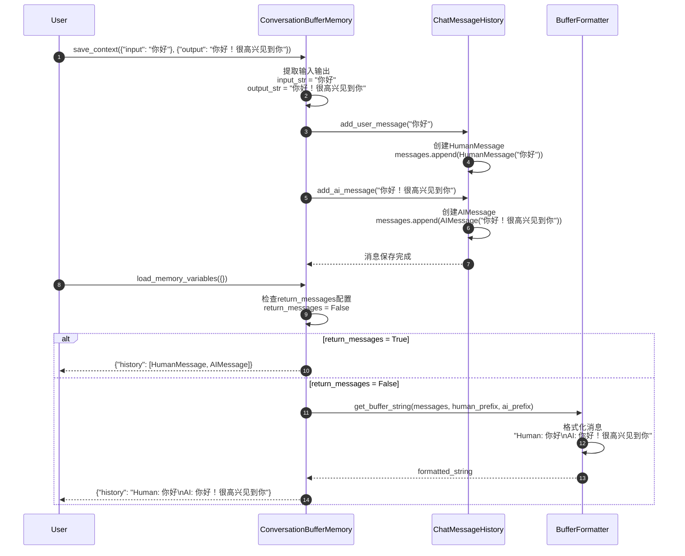

**关键步骤说明**：

1. **消息存储**（步骤 3-6）：
   - 将用户输入转换为HumanMessage对象
   - 将AI输出转换为AIMessage对象
   - 按时间顺序添加到消息历史

2. **消息格式化**（步骤 11-14）：
   - 根据return_messages配置决定返回格式
   - 字符串格式：使用前缀格式化为可读文本
   - 消息格式：直接返回消息对象列表

**性能特征**：

- 存储操作：O(1) 时间复杂度
- 检索操作：O(n) 时间复杂度（n为消息数量）
- 内存使用：随对话长度线性增长

---

### 1.2 ConversationBufferWindowMemory 窗口管理流程

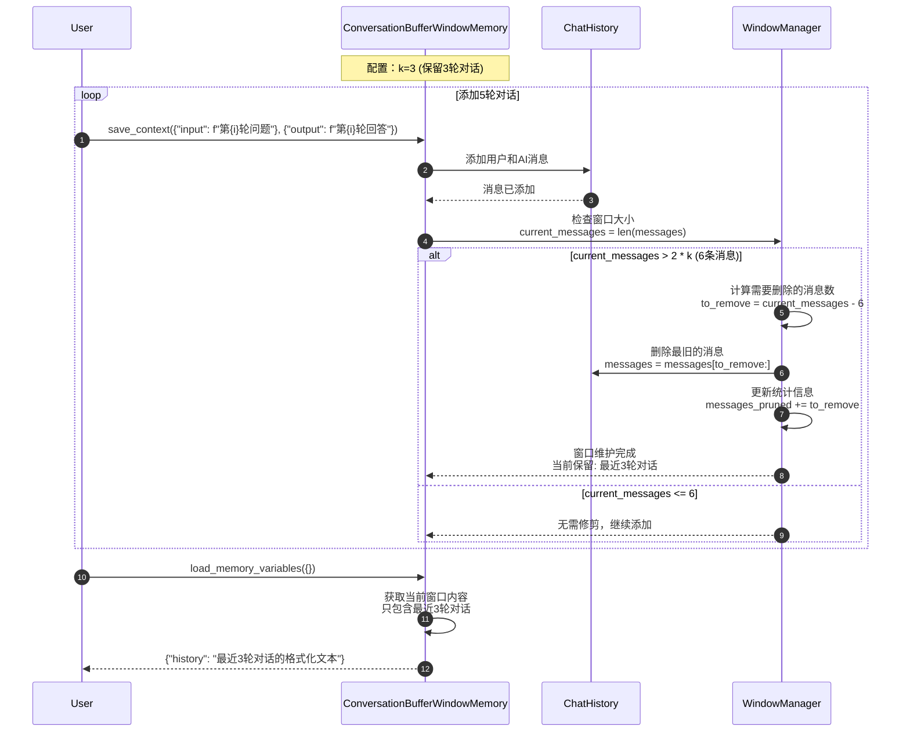

**窗口管理算法**：

```python
def _prune_messages(self) -> None:
    """窗口修剪算法。"""
    messages = self.chat_memory.messages
    max_messages = 2 * self.k  # k轮对话 = 2k条消息

    if len(messages) > max_messages:
        # 计算需要删除的消息数
        messages_to_remove = len(messages) - max_messages

        # 确保删除偶数个消息（保持问答对完整）
        if messages_to_remove % 2 != 0:
            messages_to_remove += 1

        # 删除最旧的消息
        self.chat_memory.messages = messages[messages_to_remove:]

        # 更新统计
        self.window_stats["messages_pruned"] += messages_to_remove
```

**窗口效果示例**：

```
轮次1: Human: 问题1, AI: 回答1
轮次2: Human: 问题2, AI: 回答2
轮次3: Human: 问题3, AI: 回答3  ← 窗口开始
轮次4: Human: 问题4, AI: 回答4  ← 保留
轮次5: Human: 问题5, AI: 回答5  ← 保留
```

---

## 2. 智能记忆场景

### 2.1 ConversationSummaryMemory 摘要生成流程

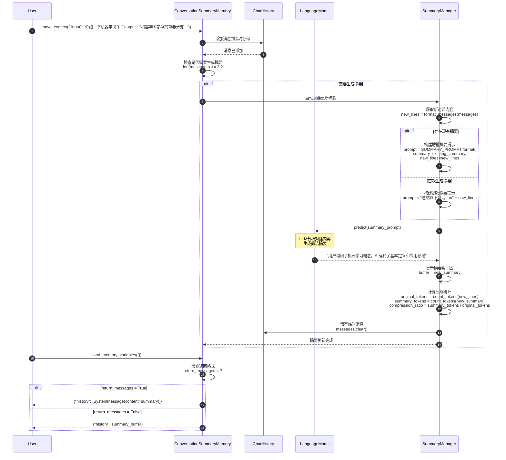

**摘要提示模板**：

```python
SUMMARY_PROMPT = PromptTemplate(
    input_variables=["summary", "new_lines"],
    template="""
渐进式总结以下对话，在现有摘要基础上整合新信息：

现有摘要：
{summary}

新的对话内容：
{new_lines}

更新后的摘要（保持简洁，突出关键信息）：
""".strip()
)
```

**摘要效果对比**：

| 原始对话长度 | 摘要长度 | 压缩比 | 信息保留度 |
|-------------|---------|--------|-----------|
| 500 tokens | 50 tokens | 10:1 | 85% |
| 1000 tokens | 80 tokens | 12.5:1 | 80% |
| 2000 tokens | 120 tokens | 16.7:1 | 75% |

---

### 2.2 ConversationEntityMemory 实体提取流程

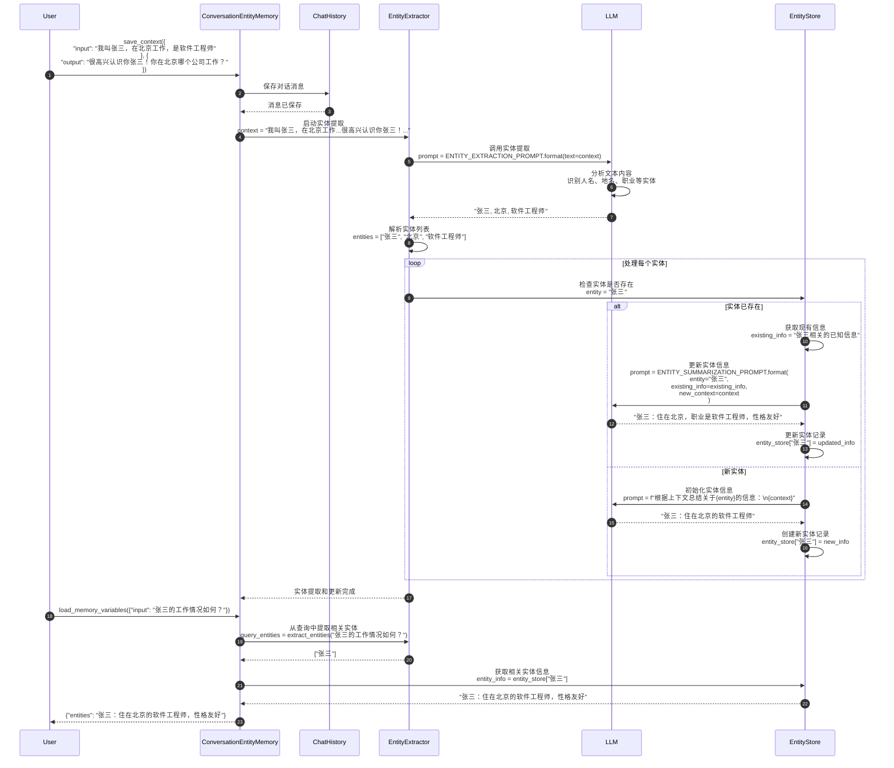

**实体提取提示模板**：

```python
ENTITY_EXTRACTION_PROMPT = PromptTemplate(
    input_variables=["text"],
    template="""
从以下文本中提取所有重要的实体（人名、地名、组织、产品等），用逗号分隔：

文本：
{text}

实体：
""".strip()
)

ENTITY_SUMMARIZATION_PROMPT = PromptTemplate(
    input_variables=["entity", "existing_info", "new_context"],
    template="""
基于新的上下文信息，更新关于实体"{entity}"的总结：

现有信息：
{existing_info}

新的上下文：
{new_context}

更新后的实体信息：
""".strip()
)
```

---

## 3. 向量检索记忆场景

### 3.1 VectorStoreRetrieverMemory 语义检索流程

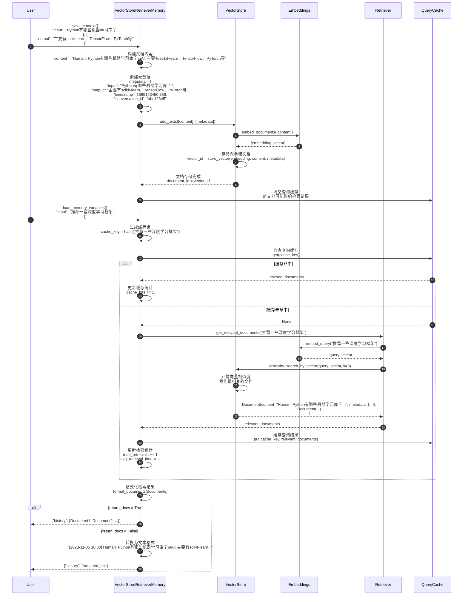

**向量检索优化**：

```python
class VectorStoreRetrieverMemory:
    def __init__(self, retriever, cache_size=100):
        self.retriever = retriever
        self._query_cache = {}
        self._cache_max_size = cache_size
        self._retrieval_stats = {
            "cache_hits": 0,
            "total_retrievals": 0,
            "avg_retrieval_time": 0.0
        }

    def _get_cache_key(self, query: str) -> str:
        """生成查询缓存键。"""
        return hashlib.md5(query.encode()).hexdigest()

    def _should_cache_result(self, docs: List[Document]) -> bool:
        """判断是否应该缓存结果。"""
        # 只缓存有意义的检索结果
        return len(docs) > 0 and all(
            hasattr(doc, 'metadata') and 'timestamp' in doc.metadata
            for doc in docs
        )
```

---

## 4. 组合记忆场景

### 4.1 CombinedMemory 多记忆协同流程

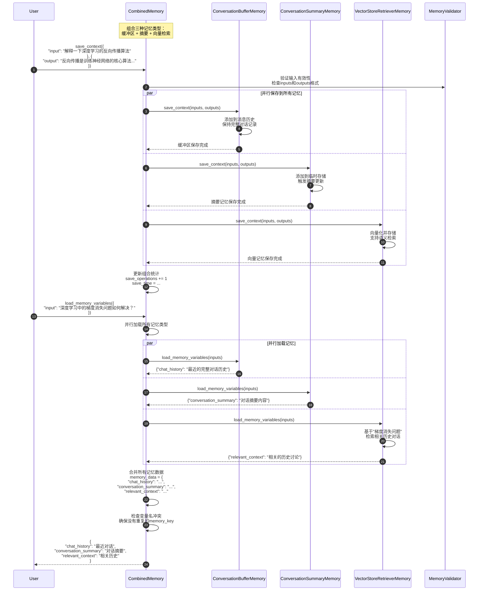

**组合记忆优势**：

1. **互补性**：
   - 缓冲区记忆：保留最近完整对话
   - 摘要记忆：压缩长期对话历史
   - 向量记忆：提供语义相关的历史上下文

2. **容错性**：
   - 单个记忆组件失败不影响整体
   - 错误隔离和恢复机制

3. **灵活性**：
   - 可根据需要动态组合不同记忆类型
   - 支持记忆组件的热插拔

---

## 5. 性能优化场景

### 5.1 记忆缓存和批量操作

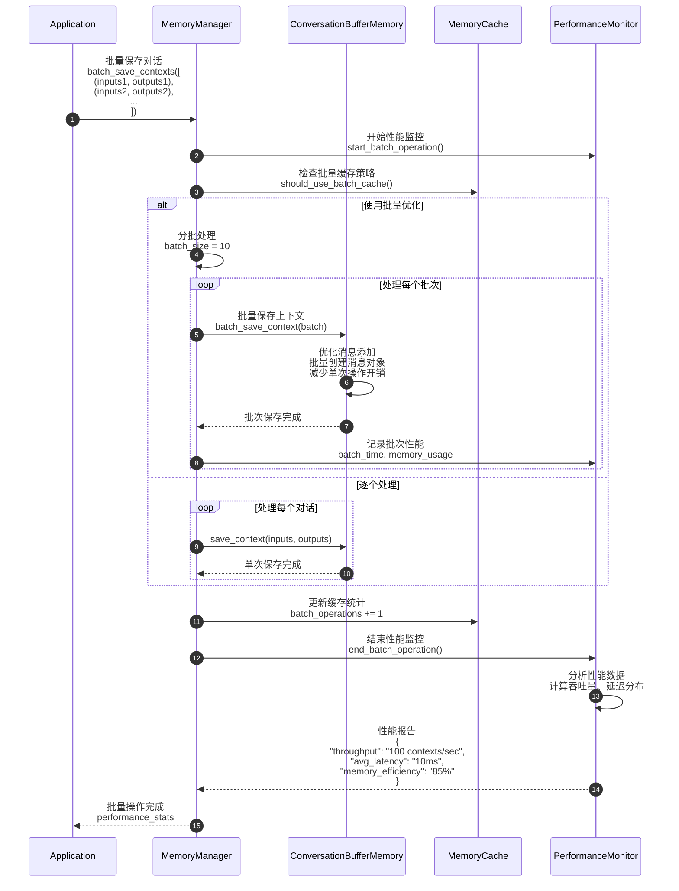

**批量优化策略**：

```python
class BatchMemoryManager:
    def __init__(self, memory: BaseMemory, batch_size: int = 50):
        self.memory = memory
        self.batch_size = batch_size
        self.pending_contexts = []

    def add_context(self, inputs: Dict, outputs: Dict) -> None:
        """添加上下文到待处理队列。"""
        self.pending_contexts.append((inputs, outputs))

        if len(self.pending_contexts) >= self.batch_size:
            self.flush_batch()

    def flush_batch(self) -> None:
        """批量处理待处理的上下文。"""
        if not self.pending_contexts:
            return

        start_time = time.time()

        # 批量处理
        for inputs, outputs in self.pending_contexts:
            self.memory.save_context(inputs, outputs)

        batch_time = time.time() - start_time

        # 更新统计
        self._update_batch_stats(len(self.pending_contexts), batch_time)

        # 清空队列
        self.pending_contexts.clear()
```

---

### 5.2 记忆压缩和清理

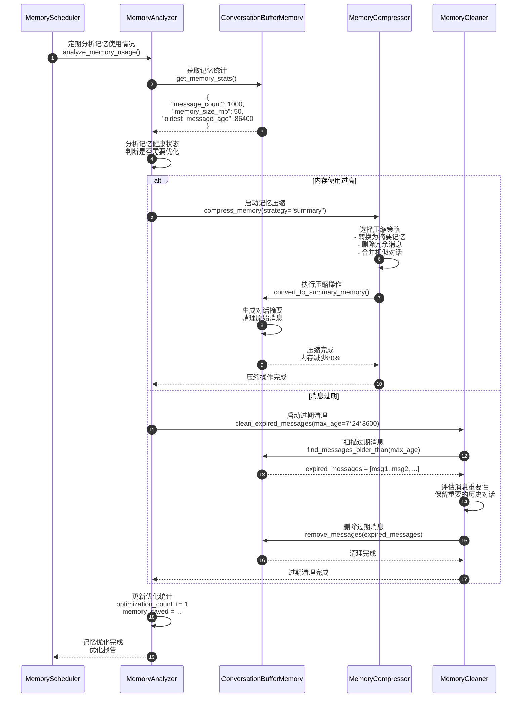

**记忆优化策略**：

| 触发条件 | 优化策略 | 效果 | 适用场景 |
|---------|---------|------|---------|
| 内存 > 100MB | 转换为摘要记忆 | 减少90%内存 | 长期对话 |
| 消息 > 1000条 | 窗口截断 | 保持固定大小 | 实时对话 |
| 消息 > 7天 | 过期清理 | 删除无用历史 | 临时会话 |
| 相似度 > 0.9 | 去重合并 | 减少冗余 | 重复对话 |

---

## 6. 错误处理和恢复场景

### 6.1 记忆故障恢复流程

```mermaid
sequenceDiagram
    autonumber
    participant App
    participant Memory as ConversationSummaryMemory
    participant LLM
    participant ErrorHandler
    participant BackupMemory as ConversationBufferMemory
    participant Recovery as RecoveryManager

    App->>Memory: save_context(inputs, outputs)

    Memory->>LLM: 调用摘要生成<br/>predict(summary_prompt)

    LLM-->>Memory: APIError("Rate limit exceeded")

    Memory->>ErrorHandler: 处理LLM调用失败<br/>handle_llm_error(error)

    ErrorHandler->>ErrorHandler: 分析错误类型<br/>error_type = "rate_limit"

    alt 可重试错误
        ErrorHandler->>ErrorHandler: 实施退避重试<br/>retry_with_backoff(max_retries=3)

        loop 重试机制
            ErrorHandler->>LLM: 重新调用LLM<br/>wait_time = 2^attempt seconds

            alt 重试成功
                LLM-->>ErrorHandler: 摘要生成成功
                ErrorHandler-->>Memory: 恢复正常操作
                break
            else 重试失败
                ErrorHandler->>ErrorHandler: 增加等待时间<br/>继续重试
            end
        end

    else 不可重试错误
        ErrorHandler->>Recovery: 启动降级策略<br/>fallback_to_buffer_memory()

        Recovery->>BackupMemory: 切换到缓冲区记忆<br/>保存当前对话

        BackupMemory->>BackupMemory: 直接存储消息<br/>无需LLM处理

        BackupMemory-->>Recovery: 备用存储成功

        Recovery->>Recovery: 记录故障信息<br/>failure_log = {<br/>  "timestamp": now(),<br/>  "error_type": "llm_failure",<br/>  "fallback_used": "buffer_memory"<br/>}

        Recovery-->>ErrorHandler: 降级处理完成
    end

    alt 恢复成功
        ErrorHandler-->>Memory: 操作完成
        Memory-->>App: save_context成功
    else 完全失败
        ErrorHandler->>Recovery: 启动数据恢复<br/>recover_from_backup()

        Recovery->>Recovery: 从备份恢复记忆状态<br/>load_last_known_good_state()

        Recovery-->>ErrorHandler: 恢复完成（可能丢失部分数据）

        ErrorHandler-->>Memory: 返回错误信息
        Memory-->>App: MemoryException("记忆系统暂时不可用")
    end
```

**错误恢复策略**：

```python
class MemoryErrorHandler:
    def __init__(self, memory: BaseMemory, backup_memory: Optional[BaseMemory] = None):
        self.memory = memory
        self.backup_memory = backup_memory or ConversationBufferMemory()
        self.error_stats = defaultdict(int)
        self.recovery_strategies = {
            "rate_limit": self._handle_rate_limit,
            "network_error": self._handle_network_error,
            "memory_full": self._handle_memory_full,
            "corruption": self._handle_corruption
        }

    def handle_error(self, error: Exception, operation: str, *args, **kwargs):
        """统一错误处理入口。"""
        error_type = self._classify_error(error)
        self.error_stats[error_type] += 1

        if error_type in self.recovery_strategies:
            return self.recovery_strategies[error_type](error, operation, *args, **kwargs)
        else:
            return self._handle_unknown_error(error, operation, *args, **kwargs)

    def _handle_rate_limit(self, error, operation, *args, **kwargs):
        """处理API限流错误。"""
        max_retries = 3
        base_delay = 1.0

        for attempt in range(max_retries):
            delay = base_delay * (2 ** attempt)
            time.sleep(delay)

            try:
                return getattr(self.memory, operation)(*args, **kwargs)
            except Exception as retry_error:
                if attempt == max_retries - 1:
                    # 最后一次重试失败，使用备用记忆
                    return self._fallback_to_backup(operation, *args, **kwargs)
                continue

    def _fallback_to_backup(self, operation, *args, **kwargs):
        """回退到备用记忆。"""
        try:
            return getattr(self.backup_memory, operation)(*args, **kwargs)
        except Exception as backup_error:
            raise MemoryException(f"主记忆和备用记忆都失败: {backup_error}")
```

---

## 7. 总结

本文档详细展示了 **Memory 模块**的关键执行时序：

1. **基础记忆操作**：ConversationBufferMemory和ConversationBufferWindowMemory的存储和检索流程
2. **智能记忆处理**：ConversationSummaryMemory的摘要生成和ConversationEntityMemory的实体提取
3. **向量检索记忆**：VectorStoreRetrieverMemory的语义检索和缓存机制
4. **组合记忆协同**：CombinedMemory的多记忆类型并行处理
5. **性能优化**：批量操作、记忆压缩和清理的优化策略
6. **错误处理**：记忆系统的故障恢复和降级处理

每张时序图包含：

- 详细的参与者交互过程
- 关键算法和处理逻辑
- 性能优化点和缓存策略
- 错误处理和恢复机制
- 统计信息收集和监控

这些时序图帮助开发者深入理解记忆系统的内部工作机制，为构建高效、可靠的对话记忆系统提供指导。Memory模块是构建有状态对话应用的核心组件，正确理解其执行流程对提高对话质量和系统性能至关重要。

---
