# LangChain-10-TextSplitters

## 模块概览

## 模块基本信息

**模块名称**: langchain-text-splitters
**模块路径**: `libs/text-splitters/langchain_text_splitters/`
**核心职责**: 将长文档分割成适合 LLM 处理的小块（chunks），是 RAG 系统的关键预处理步骤

## 1. 模块职责

### 1.1 核心职责

Text Splitters 模块负责智能分割文档，提供以下能力：

1. **文档分块**: 将长文档切分为小块
2. **上下文保留**: 通过重叠保留块间上下文
3. **语义完整性**: 尽量保持句子/段落完整
4. **多种策略**: 字符、Token、递归、语义等分割方式
5. **元数据管理**: 保留并传递文档元数据
6. **格式感知**: 针对特定格式（代码、Markdown）优化分割

### 1.2 核心概念

```
长文档 (10,000+ 字符)
  ↓
Text Splitter (分割策略)
  ↓
文档块列表 (每块 500-1500 字符)
  ↓
嵌入 → 向量存储 → 检索
```

**关键参数**:

- **chunk_size**: 每个块的目标大小（字符数或 Token 数）
- **chunk_overlap**: 块之间的重叠部分（保留上下文）
- **separators**: 分隔符列表（按优先级尝试）
- **length_function**: 计算长度的函数（字符数或 Token 数）

### 1.3 Text Splitter 类型对比

| Splitter 类型 | 分割单位 | 适用场景 | 保持完整性 | 性能 |
|--------------|---------|---------|----------|------|
| **CharacterTextSplitter** | 字符 | 简单文本 | 低 | ⚡ 最快 |
| **RecursiveCharacterTextSplitter** | 字符（递归） | 通用场景 | 高 | ⚡ 快 |
| **TokenTextSplitter** | Token | Token限制场景 | 中 | 🐢 较慢 |
| **SentenceTextSplitter** | 句子 | 保持句子完整 | 高 | 🐌 慢 |
| **MarkdownHeaderTextSplitter** | Markdown标题 | Markdown文档 | 高 | ⚡ 快 |
| **CodeTextSplitter** | 代码语法 | 源代码 | 高 | 🐢 较慢 |
| **SemanticChunker** | 语义相似度 | 高质量块 | 最高 | 🐌 最慢 |

### 1.4 输入/输出

**输入**:

- **texts**: `list[str]` - 文本列表
- **documents**: `list[Document]` - 文档列表

**输出**:

- `list[Document]` - 分割后的文档块列表（包含 `page_content` 和 `metadata`）

### 1.5 上下游依赖

**上游调用者**:

- Document Loaders（加载后分割）
- RAG 应用（文档入库前）

**下游依赖**:

- `langchain_core.documents`: Document 类
- `tiktoken` 或 `transformers`: Token 计数

## 2. 模块级架构图

```mermaid
flowchart TB
    subgraph Base["基础抽象层"]
        BTS[TextSplitter<br/>文本分割器基类]
    end

    subgraph Character["字符级分割"]
        CTS[CharacterTextSplitter<br/>简单字符分割]
        RCTS[RecursiveCharacterTextSplitter<br/>递归字符分割]
    end

    subgraph Token["Token级分割"]
        TTS[TokenTextSplitter<br/>Token分割]
        SPACY[SpacyTextSplitter<br/>Spacy分割]
    end

    subgraph Semantic["语义分割"]
        SENT[SentenceTextSplitter<br/>句子分割]
        SEM[SemanticChunker<br/>语义块分割]
    end

    subgraph Format["格式感知分割"]
        MD[MarkdownHeaderTextSplitter<br/>Markdown分割]
        CODE[CodeTextSplitter<br/>代码分割]
        HTML[HTMLHeaderTextSplitter<br/>HTML分割]
        LATEX[LatexTextSplitter<br/>LaTeX分割]
    end

    subgraph Process["分割流程"]
        SPLIT[split_text<br/>分割文本]
        CREATE[create_documents<br/>创建文档]
        MERGE[merge_splits<br/>合并块]
    end

    BTS --> CTS
    BTS --> RCTS
    BTS --> TTS
    BTS --> SPACY
    BTS --> SENT
    BTS --> SEM
    BTS --> MD
    BTS --> CODE
    BTS --> HTML
    BTS --> LATEX

    BTS --> SPLIT
    BTS --> CREATE
    BTS --> MERGE

    style Base fill:#e1f5ff
    style Character fill:#fff4e1
    style Token fill:#e8f5e9
    style Semantic fill:#f3e5f5
    style Format fill:#fff3e0
    style Process fill:#ffe4e1
```

### 架构图详细说明

**1. 基础抽象层**

- **TextSplitter**: 所有分割器的基类

  ```python
  class TextSplitter(ABC):
      chunk_size: int = 4000  # 块大小
      chunk_overlap: int = 200  # 重叠大小
      length_function: Callable[[str], int] = len  # 长度函数
      keep_separator: bool = False  # 是否保留分隔符
      add_start_index: bool = False  # 是否添加起始索引

      @abstractmethod
      def split_text(self, text: str) -> list[str]:
          """分割文本为字符串列表"""

      def create_documents(
          self,
          texts: list[str],
          metadatas: Optional[list[dict]] = None
      ) -> list[Document]:
          """创建文档对象"""

      def split_documents(self, documents: list[Document]) -> list[Document]:
          """分割文档列表"""
```

**2. 字符级分割**

- **CharacterTextSplitter**: 简单字符分割
  - 按单个分隔符分割
  - 最简单但可能破坏语义

  ```python
  splitter = CharacterTextSplitter(
      separator="\n\n",  # 按段落分割
      chunk_size=1000,
      chunk_overlap=200
  )
```

- **RecursiveCharacterTextSplitter**: 递归分割（推荐）
  - 按优先级尝试多个分隔符
  - 默认顺序：`\n\n` → `\n` → ` ` → ``
  - 最大化保持段落和句子完整

  ```python
  splitter = RecursiveCharacterTextSplitter(
      chunk_size=1000,
      chunk_overlap=200,
      separators=["\n\n", "\n", " ", ""]
  )
```

**3. Token 级分割**

- **TokenTextSplitter**: 基于 Token 分割
  - 使用 `tiktoken` 计算 Token
  - 精确控制 LLM Token 限制

  ```python
  from langchain.text_splitter import TokenTextSplitter

  splitter = TokenTextSplitter(
      chunk_size=512,  # Token 数量
      chunk_overlap=50,
      encoding_name="cl100k_base"  # GPT-4 编码
  )
```

- **SpacyTextSplitter**: 使用 Spacy NLP
  - 基于 Spacy 的句子分割
  - 保持句子完整性

**4. 语义分割**

- **SentenceTextSplitter**: 句子级分割
  - 不会在句子中间切断
  - 保持语义完整

- **SemanticChunker**: 语义相似度分割
  - 使用嵌入模型计算相似度
  - 根据语义边界分割
  - 最高质量但最慢

**5. 格式感知分割**

- **MarkdownHeaderTextSplitter**: Markdown 分割
  - 按标题层级分割
  - 保留标题层级信息

  ```python
  from langchain.text_splitter import MarkdownHeaderTextSplitter

  headers_to_split_on = [
      ("#", "Header 1"),
      ("##", "Header 2"),
      ("###", "Header 3"),
  ]

  splitter = MarkdownHeaderTextSplitter(
      headers_to_split_on=headers_to_split_on
  )
```

- **CodeTextSplitter**: 代码分割
  - 按编程语言语法分割
  - 支持 Python、JavaScript、Java 等
  - 保持函数/类完整性

  ```python
  from langchain.text_splitter import RecursiveCharacterTextSplitter

  python_splitter = RecursiveCharacterTextSplitter.from_language(
      language=Language.PYTHON,
      chunk_size=500,
      chunk_overlap=50
  )
```

- **HTMLHeaderTextSplitter**: HTML 分割
  - 按 HTML 标签分割
  - 保留结构信息

- **LatexTextSplitter**: LaTeX 分割
  - 识别 LaTeX 结构
  - 保持公式完整

**6. 分割流程**

- **split_text**: 核心分割逻辑
  - 递归尝试分隔符
  - 合并小块
  - 控制块大小

- **create_documents**: 创建 Document 对象
  - 添加元数据
  - 添加起始索引（可选）

- **merge_splits**: 合并块
  - 合并过小的块
  - 保持重叠

## 3. 核心 API 详解

### 3.1 RecursiveCharacterTextSplitter - 推荐使用

**核心代码**:

```python
from langchain.text_splitter import RecursiveCharacterTextSplitter

class RecursiveCharacterTextSplitter(TextSplitter):
    separators: list[str] = ["\n\n", "\n", " ", ""]

    def split_text(self, text: str) -> list[str]:
        """
        递归分割文本

        1. 尝试第一个分隔符分割
        2. 检查每个块大小
        3. 如果块太大，递归使用下一个分隔符
        4. 合并小块
        """
        final_chunks = []
        separator = self.separators[-1]
        new_separators = []

        # 找到有效的分隔符
        for i, _s in enumerate(self.separators):
            if _s == "":
                separator = _s
                break
            if _s in text:
                separator = _s
                new_separators = self.separators[i + 1:]
                break

        # 按分隔符分割
        splits = text.split(separator)

        # 处理每个分割
        good_splits = []
        for s in splits:
            if self._length_function(s) < self.chunk_size:
                good_splits.append(s)
            else:
                # 递归分割大块
                if good_splits:
                    merged = self._merge_splits(good_splits, separator)
                    final_chunks.extend(merged)
                    good_splits = []

                # 使用下一个分隔符
                if new_separators:
                    other_splits = self._split_text(s, new_separators)
                    final_chunks.extend(other_splits)
                else:
                    # 强制分割
                    final_chunks.append(s)

        # 合并剩余的小块
        if good_splits:
            merged = self._merge_splits(good_splits, separator)
            final_chunks.extend(merged)

        return final_chunks

    def _merge_splits(
        self,
        splits: list[str],
        separator: str
    ) -> list[str]:
        """
        合并小块并保持重叠
        """
        docs = []
        current_doc = []
        total = 0

        for d in splits:
            _len = self._length_function(d)
            if total + _len >= self.chunk_size:
                if total > self.chunk_size:
                    # 警告：块过大
                    pass
                if len(current_doc) > 0:
                    doc = separator.join(current_doc)
                    docs.append(doc)

                    # 保持重叠
                    while total > self.chunk_overlap or (
                        total + _len > self.chunk_size and total > 0
                    ):
                        total -= self._length_function(current_doc[0])
                        current_doc = current_doc[1:]

            current_doc.append(d)
            total += _len

        # 添加最后一个文档
        if current_doc:
            doc = separator.join(current_doc)
            docs.append(doc)

        return docs

```

**使用示例**:

```python
from langchain.text_splitter import RecursiveCharacterTextSplitter

# 基础用法
text = """
# Introduction

LangChain is a framework for building applications with large language models.

## Features

- LCEL (LangChain Expression Language)
- Agents and Tools
- Memory Management
- RAG (Retrieval Augmented Generation)

## Getting Started

First, install LangChain:
```bash

pip install langchain

```

Then import and use:
```python

from langchain import OpenAI
llm = OpenAI()

```
"""

splitter = RecursiveCharacterTextSplitter(
    chunk_size=200,
    chunk_overlap=50,
    length_function=len,
    is_separator_regex=False
)

chunks = splitter.split_text(text)
print(f"分割成 {len(chunks)} 个块")

for i, chunk in enumerate(chunks):
    print(f"\n块 {i+1} ({len(chunk)} 字符):")
    print(chunk[:100] + "...")

# 从文档分割
from langchain_core.documents import Document

documents = [
    Document(
        page_content=text,
        metadata={"source": "langchain_intro.md"}
    )
]

split_docs = splitter.split_documents(documents)
print(f"\n分割成 {len(split_docs)} 个文档")

for doc in split_docs:
    print(f"Metadata: {doc.metadata}")
    print(f"Content: {doc.page_content[:100]}...")
```

### 3.2 TokenTextSplitter - Token 精确控制

```python
from langchain.text_splitter import TokenTextSplitter

# 基于 Token 分割
splitter = TokenTextSplitter(
    chunk_size=512,  # Token 数量
    chunk_overlap=50,
    encoding_name="cl100k_base"  # GPT-4 编码
)

text = "..." * 10000  # 长文本

chunks = splitter.split_text(text)

# 验证 Token 数量
import tiktoken

enc = tiktoken.get_encoding("cl100k_base")
for i, chunk in enumerate(chunks):
    token_count = len(enc.encode(chunk))
    print(f"块 {i+1}: {token_count} tokens")
    assert token_count <= 512  # 确保不超过限制
```

### 3.3 MarkdownHeaderTextSplitter - Markdown 结构化分割

```python
from langchain.text_splitter import MarkdownHeaderTextSplitter

markdown_text = """
# Main Title

This is the introduction.

## Section 1

Content of section 1.

### Subsection 1.1

Details of subsection 1.1.

### Subsection 1.2

Details of subsection 1.2.

## Section 2

Content of section 2.
"""

# 定义要分割的标题层级
headers_to_split_on = [
    ("#", "Header 1"),
    ("##", "Header 2"),
    ("###", "Header 3"),
]

splitter = MarkdownHeaderTextSplitter(
    headers_to_split_on=headers_to_split_on
)

docs = splitter.split_text(markdown_text)

for doc in docs:
    print(f"Content: {doc.page_content}")
    print(f"Metadata: {doc.metadata}\n")
    # Metadata 包含标题层级:
    # {"Header 1": "Main Title", "Header 2": "Section 1", "Header 3": "Subsection 1.1"}
```

### 3.4 CodeTextSplitter - 代码分割

```python
from langchain.text_splitter import RecursiveCharacterTextSplitter, Language

# Python 代码分割
python_splitter = RecursiveCharacterTextSplitter.from_language(
    language=Language.PYTHON,
    chunk_size=500,
    chunk_overlap=50
)

python_code = """
def hello_world():
    \"\"\"打印 Hello World\"\"\"
    print("Hello World")

class Calculator:
    \"\"\"简单计算器\"\"\"

    def add(self, a, b):
        return a + b

    def subtract(self, a, b):
        return a - b

if __name__ == "__main__":
    calc = Calculator()
    print(calc.add(1, 2))
"""

chunks = python_splitter.split_text(python_code)

# 代码分割器会尝试保持函数/类完整

# JavaScript 代码分割
js_splitter = RecursiveCharacterTextSplitter.from_language(
    language=Language.JS,
    chunk_size=500,
    chunk_overlap=50
)

# 支持的语言：
# Language.PYTHON, Language.JS, Language.JAVA, Language.CPP,
# Language.GO, Language.RUST, Language.MARKDOWN, Language.HTML, etc.
```

### 3.5 SemanticChunker - 语义分割（高质量）

```python
from langchain_experimental.text_splitter import SemanticChunker
from langchain_openai import OpenAIEmbeddings

# 基于语义相似度分割
embeddings = OpenAIEmbeddings()

semantic_chunker = SemanticChunker(
    embeddings=embeddings,
    breakpoint_threshold_type="percentile",  # 或 "standard_deviation", "interquartile"
    breakpoint_threshold_amount=95  # 百分位数
)

text = """
LangChain is a framework for building LLM applications.
It provides tools for prompts, chains, and agents.

RAG is a technique that combines retrieval and generation.
It retrieves relevant documents and uses them to generate answers.

Vector stores are used to store document embeddings.
Popular options include FAISS, Chroma, and Pinecone.
"""

chunks = semantic_chunker.create_documents([text])

# SemanticChunker 会在语义边界处分割
# 例如，将 LangChain 相关内容分为一块，RAG 相关内容分为另一块
```

### 3.6 自定义 Text Splitter

```python
from langchain.text_splitter import TextSplitter

class CustomSentenceSplitter(TextSplitter):
    """自定义句子分割器"""

    def split_text(self, text: str) -> list[str]:
        """
        按句子分割，保持 chunk_size 限制
        """
        import re

        # 简单的句子分割（实际应用可使用 nltk 或 spacy）
        sentences = re.split(r'(?<=[.!?])\s+', text)

        chunks = []
        current_chunk = []
        current_length = 0

        for sentence in sentences:
            sentence_length = len(sentence)

            if current_length + sentence_length > self.chunk_size:
                # 开始新块
                if current_chunk:
                    chunks.append(" ".join(current_chunk))

                    # 保持重叠
                    overlap_sentences = []
                    overlap_length = 0
                    for s in reversed(current_chunk):
                        overlap_length += len(s)
                        if overlap_length > self.chunk_overlap:
                            break
                        overlap_sentences.insert(0, s)

                    current_chunk = overlap_sentences
                    current_length = overlap_length

            current_chunk.append(sentence)
            current_length += sentence_length

        # 添加最后一块
        if current_chunk:
            chunks.append(" ".join(current_chunk))

        return chunks

# 使用
splitter = CustomSentenceSplitter(chunk_size=500, chunk_overlap=100)
chunks = splitter.split_text(long_text)
```

## 4. 最佳实践

### 4.1 选择合适的 chunk_size

```python
# 一般建议
# 小块 (200-500): 精确检索，但可能缺乏上下文
# 中块 (500-1500): 平衡精度和上下文（推荐）
# 大块 (1500-3000): 更多上下文，但检索精度降低

# 根据用例调整
qa_splitter = RecursiveCharacterTextSplitter(
    chunk_size=800,  # 问答：中等块
    chunk_overlap=200
)

summarization_splitter = RecursiveCharacterTextSplitter(
    chunk_size=2000,  # 摘要：大块
    chunk_overlap=500
)

search_splitter = RecursiveCharacterTextSplitter(
    chunk_size=400,  # 搜索：小块
    chunk_overlap=100
)
```

### 4.2 合理设置 chunk_overlap

```python
# chunk_overlap = 10-20% of chunk_size（推荐）

splitter = RecursiveCharacterTextSplitter(
    chunk_size=1000,
    chunk_overlap=200  # 20%
)

# 为什么需要重叠？
# 1. 避免在关键信息处切断
# 2. 提供跨块的上下文连续性
# 3. 提高检索召回率
```

### 4.3 添加元数据

```python
from langchain_core.documents import Document

documents = [
    Document(
        page_content=chunk,
        metadata={
            "source": "langchain_docs.pdf",
            "page": 5,
            "chunk_id": i,
            "total_chunks": len(chunks),
            "language": "en"
        }
    )
    for i, chunk in enumerate(chunks)
]

# 元数据可用于过滤和追溯
```

### 4.4 添加起始索引

```python
splitter = RecursiveCharacterTextSplitter(
    chunk_size=1000,
    chunk_overlap=200,
    add_start_index=True  # 添加起始索引
)

docs = splitter.create_documents([text])

for doc in docs:
    print(doc.metadata)
    # {"start_index": 0}  # 块在原始文档中的起始位置
```

### 4.5 组合多个分割器

```python
# 先按 Markdown 标题分割，再按字符分割
md_splitter = MarkdownHeaderTextSplitter(
    headers_to_split_on=[("#", "Header 1"), ("##", "Header 2")]
)

char_splitter = RecursiveCharacterTextSplitter(
    chunk_size=500,
    chunk_overlap=50
)

# 两阶段分割
md_docs = md_splitter.split_text(markdown_text)
final_docs = char_splitter.split_documents(md_docs)
```

### 4.6 性能优化

```python
# 批量处理
texts = [doc.page_content for doc in documents]
chunks = splitter.create_documents(
    texts,
    metadatas=[doc.metadata for doc in documents]
)

# 并行处理（大量文档）
from multiprocessing import Pool

def split_batch(args):
    splitter, texts, metadatas = args
    return splitter.create_documents(texts, metadatas)

with Pool(4) as pool:
    results = pool.map(split_batch, batches)
```

## 5. 常见场景和解决方案

### 5.1 代码文档分割

```python
# 结合代码和 Markdown
splitter = RecursiveCharacterTextSplitter.from_language(
    language=Language.MARKDOWN,
    chunk_size=1000,
    chunk_overlap=200
)

# Markdown 中的代码块会被识别并保持完整
```

### 5.2 多语言文档

```python
# 中文文档
chinese_splitter = RecursiveCharacterTextSplitter(
    chunk_size=500,  # 中文字符数较少
    chunk_overlap=100,
    separators=["\n\n", "\n", "。", "！", "？", "；", " ", ""]
)

# 多语言混合
multilingual_splitter = RecursiveCharacterTextSplitter(
    chunk_size=800,
    chunk_overlap=150,
    separators=["\n\n", "\n", ". ", "。", " ", ""]
)
```

### 5.3 PDF 文档分割

```python
from langchain_community.document_loaders import PyPDFLoader

# 加载 PDF
loader = PyPDFLoader("document.pdf")
pages = loader.load()

# 分割（保留页码信息）
splitter = RecursiveCharacterTextSplitter(
    chunk_size=1000,
    chunk_overlap=200
)

chunks = splitter.split_documents(pages)

# 每个块都包含原始页码
for chunk in chunks:
    print(f"Page {chunk.metadata['page']}: {chunk.page_content[:100]}...")
```

### 5.4 长代码文件

```python
# 按函数/类分割
python_splitter = RecursiveCharacterTextSplitter.from_language(
    language=Language.PYTHON,
    chunk_size=1500,  # 代码需要更大的块
    chunk_overlap=200
)

# 代码块会尽量保持函数/类完整
```

## 6. 与其他模块的协作

- **Document Loaders**: 加载文档后分割
- **VectorStores**: 分割后的块存入向量存储
- **Embeddings**: 每个块生成嵌入
- **Retrievers**: 检索分割后的块

## 7. 完整工作流示例

```python
from langchain_community.document_loaders import TextLoader
from langchain.text_splitter import RecursiveCharacterTextSplitter
from langchain_community.vectorstores import FAISS
from langchain_openai import OpenAIEmbeddings

# 1. 加载文档
loader = TextLoader("article.txt")
documents = loader.load()

# 2. 分割文档
text_splitter = RecursiveCharacterTextSplitter(
    chunk_size=1000,
    chunk_overlap=200,
    length_function=len,
    add_start_index=True
)

texts = text_splitter.split_documents(documents)
print(f"分割成 {len(texts)} 个块")

# 3. 创建向量存储
embeddings = OpenAIEmbeddings()
vectorstore = FAISS.from_documents(texts, embeddings)

# 4. 检索
query = "What is the main topic?"
results = vectorstore.similarity_search(query, k=3)

for result in results:
    print(f"Source: {result.metadata['source']}")
    print(f"Start index: {result.metadata['start_index']}")
    print(f"Content: {result.page_content}\n")
```

## 8. 总结

Text Splitters 是 RAG 系统的关键预处理组件，提供智能文档分割能力。关键特性：

1. **多种分割策略**: 字符、Token、语义、格式感知
2. **上下文保留**: 通过重叠保持连续性
3. **语义完整性**: 尽量保持句子/段落完整
4. **元数据管理**: 保留来源和位置信息
5. **格式感知**: 针对 Markdown、代码等优化

**关键原则**:

- 优先使用 **RecursiveCharacterTextSplitter**（通用场景）
- **chunk_size**: 500-1500 字符（推荐）
- **chunk_overlap**: chunk_size 的 10-20%
- 特殊格式使用专用分割器（Markdown、Code）
- 添加起始索引和丰富元数据
- 先按结构分割，再按大小分割

---

**文档版本**: v1.0
**最后更新**: 2025-10-03
**相关文档**:

- LangChain-00-总览.md
- LangChain-08-VectorStores-Retrievers-概览.md
- LangChain-11-DocumentLoaders-概览.md（待生成）

---

## API接口

## 文档说明

本文档详细描述 **Text Splitters 模块**的对外 API，包括文本分割、块管理、重叠处理、分隔符策略等核心接口的所有公开方法和参数规格。

---

## 1. TextSplitter 基础 API

### 1.1 基础接口

#### 基本信息
- **类名**：`TextSplitter`
- **功能**：文本分割的抽象基类
- **核心职责**：将长文本分割为适合处理的小块

#### 核心方法

```python
class TextSplitter(ABC):
    """文本分割器基类。"""

    def __init__(
        self,
        chunk_size: int = 4000,
        chunk_overlap: int = 200,
        length_function: Callable[[str], int] = len,
        keep_separator: bool = False,
        add_start_index: bool = False,
        strip_whitespace: bool = True,
    ):
        """初始化文本分割器。"""

    @abstractmethod
    def split_text(self, text: str) -> List[str]:
        """分割文本为字符串列表。"""

    def create_documents(
        self,
        texts: List[str],
        metadatas: Optional[List[dict]] = None,
    ) -> List[Document]:
        """创建文档对象列表。"""

    def split_documents(self, documents: List[Document]) -> List[Document]:
        """分割文档列表。"""
```

**方法详解**：

| 方法 | 参数 | 返回类型 | 说明 |
|-----|------|---------|------|
| split_text | `text: str` | `List[str]` | 将文本分割为字符串块列表 |
| create_documents | `texts: List[str]`, `metadatas: List[dict]` | `List[Document]` | 创建带元数据的文档对象 |
| split_documents | `documents: List[Document]` | `List[Document]` | 分割现有文档列表 |

#### 构造参数详解

| 参数 | 类型 | 默认值 | 说明 |
|-----|------|--------|------|
| chunk_size | `int` | `4000` | 每个块的最大大小 |
| chunk_overlap | `int` | `200` | 块之间的重叠字符数 |
| length_function | `Callable` | `len` | 计算文本长度的函数 |
| keep_separator | `bool` | `False` | 是否保留分隔符 |
| add_start_index | `bool` | `False` | 是否添加起始索引到元数据 |
| strip_whitespace | `bool` | `True` | 是否去除空白字符 |

---

## 2. CharacterTextSplitter API

### 2.1 字符分割器

#### 基本信息
- **功能**：基于指定分隔符分割文本
- **特点**：简单直接，适用于结构化文本
- **适用场景**：有明确分隔符的文本（如段落、句子）

#### 构造参数

```python
class CharacterTextSplitter(TextSplitter):
    def __init__(
        self,
        separator: str = "\n\n",
        chunk_size: int = 4000,
        chunk_overlap: int = 200,
        length_function: Callable[[str], int] = len,
        is_separator_regex: bool = False,
        **kwargs: Any,
    ):
        """字符文本分割器构造函数。"""
```

#### 使用示例

```python
from langchain_text_splitters import CharacterTextSplitter

# 基础用法 - 按段落分割
text = """
第一段内容。这是一个完整的段落，包含了相关的信息。

第二段内容。这是另一个段落，讨论不同的主题。

第三段内容。最后一个段落，总结前面的内容。
"""

splitter = CharacterTextSplitter(
    separator="\n\n",  # 按双换行分割
    chunk_size=100,    # 每块最大100字符
    chunk_overlap=20,  # 重叠20字符
    length_function=len,
    is_separator_regex=False
)

chunks = splitter.split_text(text)
print(f"分割后的块数: {len(chunks)}")
for i, chunk in enumerate(chunks):
    print(f"块 {i+1}: {repr(chunk)}")

# 输出:
# 块 1: '第一段内容。这是一个完整的段落，包含了相关的信息。'
# 块 2: '第二段内容。这是另一个段落，讨论不同的主题。'
# 块 3: '第三段内容。最后一个段落，总结前面的内容。'
```

#### 正则表达式分割

```python
import re

# 使用正则表达式分割
text = "句子1。句子2！句子3？句子4。"

regex_splitter = CharacterTextSplitter(
    separator=r'[。！？]',  # 按中文标点分割
    chunk_size=50,
    chunk_overlap=5,
    is_separator_regex=True,
    keep_separator=True  # 保留分隔符
)

chunks = regex_splitter.split_text(text)
print("正则分割结果:")
for chunk in chunks:
    print(f"- {repr(chunk)}")

# 输出:
# - '句子1。'
# - '句子2！'
# - '句子3？'
# - '句子4。'
```

#### 核心实现

```python
def split_text(self, text: str) -> List[str]:
    """分割文本实现。"""
    # 按分隔符分割
    if self.is_separator_regex:
        splits = re.split(self.separator, text)
    else:
        splits = text.split(self.separator)

    # 处理分隔符保留
    if self.keep_separator and not self.is_separator_regex:
        # 重新添加分隔符
        result = []
        for i, split in enumerate(splits[:-1]):
            result.append(split + self.separator)
        if splits:
            result.append(splits[-1])
        splits = result

    # 合并小块并处理重叠
    return self._merge_splits(splits, self.separator)
```

---

## 3. RecursiveCharacterTextSplitter API

### 3.1 递归字符分割器

#### 基本信息
- **功能**：递归使用多个分隔符分割文本
- **特点**：智能选择最佳分隔符，保持语义完整性
- **适用场景**：通用文本分割，特别是代码和结构化文档

#### 构造参数

```python
class RecursiveCharacterTextSplitter(TextSplitter):
    def __init__(
        self,
        separators: Optional[List[str]] = None,
        keep_separator: bool = True,
        is_separator_regex: bool = False,
        **kwargs: Any,
    ):
        """递归字符文本分割器构造函数。"""
        super().__init__(keep_separator=keep_separator, **kwargs)
        self._separators = separators or self._get_default_separators()
        self._is_separator_regex = is_separator_regex
```

#### 默认分隔符优先级

```python
def _get_default_separators(self) -> List[str]:
    """获取默认分隔符列表（按优先级排序）。"""
    return [
        "\n\n",    # 段落分隔
        "\n",      # 行分隔
        " ",       # 词分隔
        "",        # 字符分隔
    ]
```

#### 使用示例

```python
from langchain_text_splitters import RecursiveCharacterTextSplitter

# 长文本示例
long_text = """
# 标题

这是第一段内容。它包含了一些重要的信息，需要被正确地分割。

这是第二段内容。它继续前面的讨论，并添加了新的观点。

## 子标题

这里是一个列表：

- 项目1：描述内容
- 项目2：更多描述
- 项目3：最后的描述

结论段落包含了总结性的内容。
"""

# 创建递归分割器
splitter = RecursiveCharacterTextSplitter(
    chunk_size=200,
    chunk_overlap=50,
    length_function=len,
    separators=["\n\n", "\n", " ", ""]
)

chunks = splitter.split_text(long_text)
print(f"递归分割结果 - 块数: {len(chunks)}")

for i, chunk in enumerate(chunks):
    print(f"\n块 {i+1} ({len(chunk)} 字符):")
    print("-" * 40)
    print(chunk)
    print("-" * 40)
```

#### 自定义分隔符策略

```python
# 代码分割器
code_splitter = RecursiveCharacterTextSplitter(
    separators=[
        "\n\nclass ",    # 类定义
        "\n\ndef ",     # 函数定义
        "\n\n",         # 段落
        "\n",           # 行
        " ",            # 空格
        "",             # 字符
    ],
    chunk_size=500,
    chunk_overlap=50,
    keep_separator=True
)

# Markdown分割器
markdown_splitter = RecursiveCharacterTextSplitter(
    separators=[
        "\n## ",        # 二级标题
        "\n### ",       # 三级标题
        "\n\n",         # 段落
        "\n",           # 行
        " ",            # 空格
        "",             # 字符
    ],
    chunk_size=300,
    chunk_overlap=30
)
```

#### 核心递归算法

```python
def split_text(self, text: str) -> List[str]:
    """递归分割文本。"""
    final_chunks = []

    # 选择合适的分隔符
    separator = self._separators[-1]  # 默认使用最后一个
    new_separators = []

    for i, _s in enumerate(self._separators):
        if _s == "":
            separator = _s
            break
        if re.search(_s, text) if self._is_separator_regex else _s in text:
            separator = _s
            new_separators = self._separators[i + 1:]
            break

    # 使用选定的分隔符分割
    splits = self._split_text_with_regex(text, separator) if self._is_separator_regex else text.split(separator)

    # 处理每个分割块
    good_splits = []
    for s in splits:
        if self._length_function(s) < self._chunk_size:
            good_splits.append(s)
        else:
            if good_splits:
                merged_text = self._merge_splits(good_splits, separator)
                final_chunks.extend(merged_text)
                good_splits = []

            # 递归处理过大的块
            if not new_separators:
                final_chunks.append(s)
            else:
                other_info = self.split_text(s)
                final_chunks.extend(other_info)

    # 处理剩余的块
    if good_splits:
        merged_text = self._merge_splits(good_splits, separator)
        final_chunks.extend(merged_text)

    return final_chunks
```

---

## 4. TokenTextSplitter API

### 4.1 令牌分割器

#### 基本信息
- **功能**：基于令牌数量分割文本
- **特点**：精确控制令牌数量，适用于LLM输入
- **适用场景**：需要严格控制令牌数的应用

#### 构造参数

```python
class TokenTextSplitter(TextSplitter):
    def __init__(
        self,
        encoding_name: str = "gpt2",
        model_name: Optional[str] = None,
        allowed_special: Union[Literal["all"], AbstractSet[str]] = set(),
        disallowed_special: Union[Literal["all"], Collection[str]] = "all",
        **kwargs: Any,
    ):
        """令牌文本分割器构造函数。"""
```

#### 使用示例

```python
from langchain_text_splitters import TokenTextSplitter

# 创建令牌分割器
token_splitter = TokenTextSplitter(
    encoding_name="cl100k_base",  # GPT-4 编码
    chunk_size=100,               # 100个令牌
    chunk_overlap=20              # 20个令牌重叠
)

text = """
人工智能（Artificial Intelligence，AI）是计算机科学的一个分支，
它企图了解智能的实质，并生产出一种新的能以人类智能相似的方式做出反应的智能机器。
该领域的研究包括机器人、语言识别、图像识别、自然语言处理和专家系统等。
"""

chunks = token_splitter.split_text(text)
print(f"令牌分割结果 - 块数: {len(chunks)}")

for i, chunk in enumerate(chunks):
    token_count = token_splitter.count_tokens(chunk)
    print(f"块 {i+1} ({token_count} 令牌): {chunk}")
```

#### 不同编码器的使用

```python
# GPT-3.5/GPT-4 编码器
gpt4_splitter = TokenTextSplitter(
    encoding_name="cl100k_base",
    chunk_size=2000,
    chunk_overlap=200
)

# GPT-3 编码器
gpt3_splitter = TokenTextSplitter(
    encoding_name="p50k_base",
    chunk_size=1500,
    chunk_overlap=150
)

# Claude 编码器
claude_splitter = TokenTextSplitter(
    encoding_name="gpt2",  # 近似
    chunk_size=1800,
    chunk_overlap=180
)

# 比较不同编码器的令牌计数
test_text = "这是一个测试文本，用来比较不同编码器的令牌计数差异。"

print("令牌计数比较:")
print(f"GPT-4: {gpt4_splitter.count_tokens(test_text)} 令牌")
print(f"GPT-3: {gpt3_splitter.count_tokens(test_text)} 令牌")
print(f"近似: {claude_splitter.count_tokens(test_text)} 令牌")
```

#### 令牌计数实现

```python
def count_tokens(self, text: str) -> int:
    """计算文本的令牌数量。"""
    return len(self._tokenizer.encode(text))

def split_text(self, text: str) -> List[str]:
    """基于令牌分割文本。"""
    splits = []
    input_ids = self._tokenizer.encode(text)

    start_idx = 0
    cur_idx = min(start_idx + self._chunk_size, len(input_ids))
    chunk_ids = input_ids[start_idx:cur_idx]

    while start_idx < len(input_ids):
        chunk_text = self._tokenizer.decode(chunk_ids)
        splits.append(chunk_text)

        # 计算下一个块的起始位置（考虑重叠）
        start_idx += self._chunk_size - self._chunk_overlap
        cur_idx = min(start_idx + self._chunk_size, len(input_ids))
        chunk_ids = input_ids[start_idx:cur_idx]

    return splits
```

---

## 5. 专用分割器 API

### 5.1 MarkdownHeaderTextSplitter

#### 基本信息
- **功能**：基于Markdown标题层次分割文本
- **特点**：保持文档结构，支持标题层次
- **适用场景**：Markdown文档、技术文档

#### 使用示例

```python
from langchain_text_splitters import MarkdownHeaderTextSplitter

markdown_text = """
# 主标题

这是主标题下的内容。

## 二级标题1

这是二级标题1的内容。

### 三级标题1.1

这是三级标题1.1的内容。

### 三级标题1.2

这是三级标题1.2的内容。

## 二级标题2

这是二级标题2的内容。
"""

# 定义标题分割规则
headers_to_split_on = [
    ("#", "Header 1"),
    ("##", "Header 2"),
    ("###", "Header 3"),
]

markdown_splitter = MarkdownHeaderTextSplitter(
    headers_to_split_on=headers_to_split_on
)

md_header_splits = markdown_splitter.split_text(markdown_text)

for split in md_header_splits:
    print(f"内容: {split.page_content}")
    print(f"元数据: {split.metadata}")
    print("-" * 50)
```

#### 与其他分割器组合

```python
# 先按标题分割，再按字符数分割
chunk_size = 200
chunk_overlap = 30

# 第一步：按标题分割
md_header_splits = markdown_splitter.split_text(markdown_text)

# 第二步：对长段落进行字符分割
text_splitter = RecursiveCharacterTextSplitter(
    chunk_size=chunk_size,
    chunk_overlap=chunk_overlap
)

final_splits = text_splitter.split_documents(md_header_splits)

print(f"最终分割结果: {len(final_splits)} 个块")
for i, split in enumerate(final_splits):
    print(f"\n块 {i+1}:")
    print(f"内容: {split.page_content[:100]}...")
    print(f"元数据: {split.metadata}")
```

---

### 5.2 PythonCodeTextSplitter

#### 基本信息
- **功能**：专门用于Python代码的分割
- **特点**：理解Python语法结构
- **适用场景**：代码文档、代码分析

#### 使用示例

```python
from langchain_text_splitters import PythonCodeTextSplitter

python_code = '''
class DataProcessor:
    """数据处理器类。"""

    def __init__(self, config):
        self.config = config
        self.data = []

    def load_data(self, file_path):
        """加载数据文件。"""
        with open(file_path, 'r') as f:
            self.data = f.readlines()
        return len(self.data)

    def process_data(self):
        """处理数据。"""
        processed = []
        for line in self.data:
            # 清理数据
            cleaned = line.strip()
            if cleaned:
                processed.append(cleaned.upper())
        return processed

def main():
    """主函数。"""
    processor = DataProcessor({"debug": True})
    processor.load_data("data.txt")
    result = processor.process_data()
    print(f"处理了 {len(result)} 条数据")

if __name__ == "__main__":
    main()
'''

python_splitter = PythonCodeTextSplitter(
    chunk_size=300,
    chunk_overlap=50
)

python_chunks = python_splitter.split_text(python_code)

print(f"Python代码分割结果: {len(python_chunks)} 个块")
for i, chunk in enumerate(python_chunks):
    print(f"\n代码块 {i+1}:")
    print("-" * 40)
    print(chunk)
    print("-" * 40)
```

---

### 5.3 HTMLHeaderTextSplitter

#### 基本信息
- **功能**：基于HTML标题标签分割文本
- **特点**：保持HTML文档结构
- **适用场景**：网页内容、HTML文档

#### 使用示例

```python
from langchain_text_splitters import HTMLHeaderTextSplitter

html_text = """
<html>
<body>
    <h1>网站主标题</h1>
    <p>这是网站的主要介绍内容。</p>

    <h2>产品介绍</h2>
    <p>我们的产品具有以下特点：</p>
    <ul>
        <li>高性能</li>
        <li>易使用</li>
        <li>可扩展</li>
    </ul>

    <h3>技术规格</h3>
    <p>详细的技术规格信息。</p>

    <h2>联系我们</h2>
    <p>如有疑问，请联系我们。</p>
</body>
</html>
"""

headers_to_split_on = [
    ("h1", "Header 1"),
    ("h2", "Header 2"),
    ("h3", "Header 3"),
]

html_splitter = HTMLHeaderTextSplitter(
    headers_to_split_on=headers_to_split_on
)

html_header_splits = html_splitter.split_text(html_text)

for split in html_header_splits:
    print(f"内容: {split.page_content}")
    print(f"元数据: {split.metadata}")
    print("-" * 50)
```

---

## 6. 文档处理 API

### 6.1 文档创建和分割

#### create_documents 方法

```python
def create_documents(
    self,
    texts: List[str],
    metadatas: Optional[List[dict]] = None,
) -> List[Document]:
    """从文本列表创建文档对象。"""

    # 使用示例
    texts = [
        "第一个文档的内容...",
        "第二个文档的内容...",
        "第三个文档的内容..."
    ]

    metadatas = [
        {"source": "doc1.txt", "author": "张三"},
        {"source": "doc2.txt", "author": "李四"},
        {"source": "doc3.txt", "author": "王五"}
    ]

    splitter = RecursiveCharacterTextSplitter(
        chunk_size=200,
        chunk_overlap=50
    )

    documents = splitter.create_documents(texts, metadatas)

    print(f"创建了 {len(documents)} 个文档")
    for doc in documents:
        print(f"内容: {doc.page_content[:50]}...")
        print(f"元数据: {doc.metadata}")
```

#### split_documents 方法

```python
def split_documents(self, documents: List[Document]) -> List[Document]:
    """分割现有文档列表。"""

    # 使用示例
    from langchain_core.documents import Document

    # 创建原始文档
    original_docs = [
        Document(
            page_content="这是一个很长的文档内容..." * 100,
            metadata={"source": "long_doc.txt", "type": "article"}
        ),
        Document(
            page_content="另一个长文档的内容..." * 80,
            metadata={"source": "another_doc.txt", "type": "report"}
        )
    ]

    splitter = RecursiveCharacterTextSplitter(
        chunk_size=500,
        chunk_overlap=100,
        add_start_index=True  # 添加起始索引
    )

    split_docs = splitter.split_documents(original_docs)

    print(f"原始文档数: {len(original_docs)}")
    print(f"分割后文档数: {len(split_docs)}")

    for i, doc in enumerate(split_docs[:3]):  # 显示前3个
        print(f"\n分割文档 {i+1}:")
        print(f"内容: {doc.page_content[:100]}...")
        print(f"元数据: {doc.metadata}")
```

---

## 7. 高级配置和优化

### 7.1 自定义长度函数

```python
import tiktoken

def token_length_function(text: str) -> int:
    """基于GPT令牌的长度函数。"""
    encoding = tiktoken.get_encoding("cl100k_base")
    return len(encoding.encode(text))

def chinese_char_length(text: str) -> int:
    """中文字符计数函数。"""
    chinese_chars = sum(1 for char in text if '\u4e00' <= char <= '\u9fff')
    english_chars = sum(1 for char in text if char.isalpha() and not ('\u4e00' <= char <= '\u9fff'))
    return chinese_chars * 2 + english_chars  # 中文字符权重更高

# 使用自定义长度函数
custom_splitter = RecursiveCharacterTextSplitter(
    chunk_size=1000,
    chunk_overlap=100,
    length_function=token_length_function  # 使用令牌计数
)

chinese_splitter = RecursiveCharacterTextSplitter(
    chunk_size=500,
    chunk_overlap=50,
    length_function=chinese_char_length  # 中文优化
)
```

### 7.2 分割策略优化

```python
class SmartTextSplitter:
    """智能文本分割器。"""

    def __init__(self, target_chunk_size: int = 1000):
        self.target_chunk_size = target_chunk_size
        self.splitters = {
            'markdown': MarkdownHeaderTextSplitter([
                ("#", "Header 1"),
                ("##", "Header 2"),
                ("###", "Header 3"),
            ]),
            'code': PythonCodeTextSplitter(
                chunk_size=target_chunk_size,
                chunk_overlap=100
            ),
            'general': RecursiveCharacterTextSplitter(
                chunk_size=target_chunk_size,
                chunk_overlap=100
            )
        }

    def detect_text_type(self, text: str) -> str:
        """检测文本类型。"""
        if text.count('#') > 3 and '##' in text:
            return 'markdown'
        elif 'def ' in text and 'class ' in text and ':' in text:
            return 'code'
        else:
            return 'general'

    def smart_split(self, text: str) -> List[str]:
        """智能分割文本。"""
        text_type = self.detect_text_type(text)
        splitter = self.splitters[text_type]

        if text_type == 'markdown':
            # Markdown需要两步分割
            header_splits = splitter.split_text(text)
            final_splitter = RecursiveCharacterTextSplitter(
                chunk_size=self.target_chunk_size,
                chunk_overlap=100
            )
            return final_splitter.split_documents(header_splits)
        else:
            return splitter.split_text(text)

# 使用智能分割器
smart_splitter = SmartTextSplitter(target_chunk_size=800)

# 测试不同类型的文本
markdown_text = "# 标题\n\n内容..."
code_text = "def function():\n    pass"
general_text = "这是一般的文本内容。"

for text_type, text in [('Markdown', markdown_text), ('Code', code_text), ('General', general_text)]:
    chunks = smart_splitter.smart_split(text)
    print(f"{text_type} 文本分割结果: {len(chunks)} 个块")
```

---

## 8. 性能监控和调优

### 8.1 分割性能分析

```python
import time
from typing import Dict, Any

class SplitterPerformanceAnalyzer:
    """分割器性能分析器。"""

    def __init__(self):
        self.metrics = {
            'split_times': [],
            'chunk_counts': [],
            'chunk_sizes': [],
            'overlap_ratios': []
        }

    def analyze_splitter(
        self,
        splitter: TextSplitter,
        texts: List[str],
        test_name: str = "default"
    ) -> Dict[str, Any]:
        """分析分割器性能。"""
        start_time = time.time()

        all_chunks = []
        for text in texts:
            chunks = splitter.split_text(text)
            all_chunks.extend(chunks)

        end_time = time.time()

        # 计算统计信息
        split_time = end_time - start_time
        chunk_count = len(all_chunks)
        avg_chunk_size = sum(len(chunk) for chunk in all_chunks) / chunk_count if chunk_count > 0 else 0

        # 计算重叠比率
        total_original_length = sum(len(text) for text in texts)
        total_chunk_length = sum(len(chunk) for chunk in all_chunks)
        overlap_ratio = (total_chunk_length - total_original_length) / total_original_length if total_original_length > 0 else 0

        metrics = {
            'test_name': test_name,
            'split_time': split_time,
            'chunk_count': chunk_count,
            'avg_chunk_size': avg_chunk_size,
            'overlap_ratio': overlap_ratio,
            'throughput': len(texts) / split_time if split_time > 0 else 0,
            'chunks_per_text': chunk_count / len(texts) if texts else 0
        }

        return metrics

    def compare_splitters(self, splitters: Dict[str, TextSplitter], test_texts: List[str]):
        """比较多个分割器的性能。"""
        results = {}

        for name, splitter in splitters.items():
            results[name] = self.analyze_splitter(splitter, test_texts, name)

        # 打印比较结果
        print("分割器性能比较:")
        print("-" * 80)
        print(f"{'分割器':<20} {'时间(s)':<10} {'块数':<8} {'平均大小':<10} {'重叠率':<10} {'吞吐量':<10}")
        print("-" * 80)

        for name, metrics in results.items():
            print(f"{name:<20} {metrics['split_time']:<10.3f} {metrics['chunk_count']:<8} "
                  f"{metrics['avg_chunk_size']:<10.1f} {metrics['overlap_ratio']:<10.2%} "
                  f"{metrics['throughput']:<10.1f}")

        return results

# 使用性能分析器
analyzer = SplitterPerformanceAnalyzer()

# 准备测试数据
test_texts = [
    "这是一个测试文本..." * 100,
    "另一个测试文本..." * 150,
    "第三个测试文本..." * 80
]

# 准备不同的分割器
splitters_to_test = {
    "Character": CharacterTextSplitter(chunk_size=500, chunk_overlap=50),
    "Recursive": RecursiveCharacterTextSplitter(chunk_size=500, chunk_overlap=50),
    "Token": TokenTextSplitter(chunk_size=100, chunk_overlap=10)
}

# 执行性能比较
performance_results = analyzer.compare_splitters(splitters_to_test, test_texts)
```

---

## 9. 最佳实践和配置指南

### 9.1 分割器选择指南

| 文本类型 | 推荐分割器 | 配置建议 | 使用场景 |
|---------|-----------|---------|---------|
| 通用文本 | `RecursiveCharacterTextSplitter` | chunk_size=1000, overlap=100 | 大多数文本处理 |
| Markdown | `MarkdownHeaderTextSplitter` + `RecursiveCharacterTextSplitter` | 先按标题，再按大小 | 技术文档、博客 |
| 代码 | `PythonCodeTextSplitter` | chunk_size=800, overlap=100 | 代码分析、文档 |
| HTML | `HTMLHeaderTextSplitter` | 按标签层次分割 | 网页内容提取 |
| 令牌敏感 | `TokenTextSplitter` | 根据模型限制设置 | LLM输入准备 |

### 9.2 参数调优建议

```python
def get_optimal_splitter_config(
    text_type: str,
    target_model: str,
    use_case: str
) -> Dict[str, Any]:
    """获取最优分割器配置。"""

    configs = {
        # RAG应用配置
        "rag": {
            "general": {
                "splitter": RecursiveCharacterTextSplitter,
                "chunk_size": 1000,
                "chunk_overlap": 200,
                "separators": ["\n\n", "\n", "。", "！", "？", " ", ""]
            },
            "technical": {
                "splitter": RecursiveCharacterTextSplitter,
                "chunk_size": 1500,
                "chunk_overlap": 300,
                "separators": ["\n\n", "\n", ". ", "! ", "? ", " ", ""]
            }
        },

        # 摘要应用配置
        "summarization": {
            "general": {
                "splitter": RecursiveCharacterTextSplitter,
                "chunk_size": 2000,
                "chunk_overlap": 100,
                "separators": ["\n\n", "\n", " ", ""]
            }
        },

        # 问答应用配置
        "qa": {
            "general": {
                "splitter": RecursiveCharacterTextSplitter,
                "chunk_size": 500,
                "chunk_overlap": 100,
                "separators": ["\n\n", "\n", "。", " ", ""]
            }
        }
    }

    return configs.get(use_case, {}).get(text_type, configs["rag"]["general"])

# 使用配置生成器
config = get_optimal_splitter_config(
    text_type="general",
    target_model="gpt-3.5-turbo",
    use_case="rag"
)

optimal_splitter = config["splitter"](
    chunk_size=config["chunk_size"],
    chunk_overlap=config["chunk_overlap"],
    separators=config.get("separators")
)
```

---

## 10. 总结

本文档详细描述了 **Text Splitters 模块**的核心 API：

### 主要分割器类型
1. **TextSplitter**：抽象基类，定义通用接口
2. **CharacterTextSplitter**：基于字符分隔符的简单分割
3. **RecursiveCharacterTextSplitter**：递归多分隔符智能分割
4. **TokenTextSplitter**：基于令牌数量的精确分割
5. **专用分割器**：Markdown、Python代码、HTML等专门分割器

### 核心功能
1. **文本分割**：split_text方法将长文本分割为小块
2. **文档处理**：create_documents和split_documents处理文档对象
3. **重叠控制**：chunk_overlap参数控制块间重叠
4. **长度控制**：自定义length_function精确控制块大小

### 配置参数
1. **chunk_size**：控制每个块的最大大小
2. **chunk_overlap**：控制块间重叠程度
3. **separators**：定义分割优先级策略
4. **length_function**：自定义长度计算方法

每个 API 均包含：

- 完整的构造参数和配置选项
- 详细的使用示例和最佳实践
- 性能分析和优化建议
- 不同场景的配置指南

Text Splitters 模块是文档处理和RAG系统的基础组件，正确选择和配置分割器对提高下游任务的效果至关重要。

---

## 数据结构

## 文档说明

本文档详细描述 **Text Splitters 模块**的核心数据结构，包括分割器类层次、块管理、分隔符策略、令牌处理、文档结构等。所有结构均配备 UML 类图和详细的字段说明。

---

## 1. TextSplitter 类层次结构

### 1.1 核心分割器继承体系

```mermaid
classDiagram
    class TextSplitter {
        <<abstract>>
        +chunk_size: int
        +chunk_overlap: int
        +length_function: Callable[[str], int]
        +keep_separator: bool
        +add_start_index: bool
        +strip_whitespace: bool
        +split_text(text: str) List[str]
        +create_documents(texts: List[str], metadatas: List[dict]) List[Document]
        +split_documents(documents: List[Document]) List[Document]
        +_merge_splits(splits: List[str], separator: str) List[str]
        +_join_docs(docs: List[str], separator: str) str
        +_split_text_with_regex(text: str, separator: str) List[str]
    }

    class CharacterTextSplitter {
        +separator: str
        +is_separator_regex: bool
        +split_text(text: str) List[str]
        +_split_text_with_regex(text: str, separator: str) List[str]
    }

    class RecursiveCharacterTextSplitter {
        +separators: List[str]
        +is_separator_regex: bool
        +split_text(text: str) List[str]
        +_get_default_separators() List[str]
        +_split_text_with_regex(text: str, separator: str) List[str]
    }

    class TokenTextSplitter {
        +encoding_name: str
        +model_name: Optional[str]
        +allowed_special: Union[Literal["all"], AbstractSet[str]]
        +disallowed_special: Union[Literal["all"], Collection[str]]
        +tokenizer: Encoding
        +split_text(text: str) List[str]
        +count_tokens(text: str) int
    }

    class MarkdownHeaderTextSplitter {
        +headers_to_split_on: List[Tuple[str, str]]
        +return_each_line: bool
        +strip_headers: bool
        +split_text(text: str) List[Document]
        +_split_on_headers(text: str) List[Dict]
        +_aggregate_lines_to_chunks(lines: List[Dict]) List[Document]
    }

    class PythonCodeTextSplitter {
        +language: str
        +split_text(text: str) List[str]
        +_get_separators_for_language(language: str) List[str]
    }

    class HTMLHeaderTextSplitter {
        +headers_to_split_on: List[Tuple[str, str]]
        +return_each_element: bool
        +split_text(html: str) List[Document]
        +_split_html_by_headers(soup: BeautifulSoup) List[Dict]
    }

    TextSplitter <|-- CharacterTextSplitter
    TextSplitter <|-- RecursiveCharacterTextSplitter
    TextSplitter <|-- TokenTextSplitter
    TextSplitter <|-- MarkdownHeaderTextSplitter
    TextSplitter <|-- PythonCodeTextSplitter
    TextSplitter <|-- HTMLHeaderTextSplitter
```

**图解说明**：

1. **抽象基类**：
   - `TextSplitter`：定义所有分割器的通用接口和行为

2. **基础分割器**：
   - `CharacterTextSplitter`：基于字符分隔符的简单分割
   - `RecursiveCharacterTextSplitter`：递归多分隔符智能分割
   - `TokenTextSplitter`：基于令牌数量的精确分割

3. **专用分割器**：
   - `MarkdownHeaderTextSplitter`：Markdown标题层次分割
   - `PythonCodeTextSplitter`：Python代码结构分割
   - `HTMLHeaderTextSplitter`：HTML标签层次分割

4. **核心能力**：
   - 文本分割和块管理
   - 重叠处理和长度控制
   - 元数据保持和索引添加
   - 自定义分隔符和正则表达式支持

---

## 2. 分割配置数据结构

### 2.1 TextSplitter 基础配置

```python
class TextSplitter(ABC):
    """文本分割器基类数据结构。"""

    def __init__(
        self,
        chunk_size: int = 4000,
        chunk_overlap: int = 200,
        length_function: Callable[[str], int] = len,
        keep_separator: bool = False,
        add_start_index: bool = False,
        strip_whitespace: bool = True,
    ):
        # 核心配置
        self._chunk_size = chunk_size
        self._chunk_overlap = chunk_overlap
        self._length_function = length_function
        self._keep_separator = keep_separator
        self._add_start_index = add_start_index
        self._strip_whitespace = strip_whitespace

        # 验证配置
        if chunk_overlap >= chunk_size:
            raise ValueError("chunk_overlap不能大于或等于chunk_size")

        # 统计信息
        self._split_count = 0
        self._total_input_length = 0
        self._total_output_chunks = 0
        self._created_at = time.time()
```

**字段详解**：

| 字段 | 类型 | 默认值 | 说明 |
|-----|------|--------|------|
| chunk_size | `int` | `4000` | 每个块的最大长度 |
| chunk_overlap | `int` | `200` | 块之间的重叠长度 |
| length_function | `Callable` | `len` | 计算文本长度的函数 |
| keep_separator | `bool` | `False` | 是否保留分隔符在结果中 |
| add_start_index | `bool` | `False` | 是否在元数据中添加起始索引 |
| strip_whitespace | `bool` | `True` | 是否去除块首尾的空白字符 |

---

### 2.2 分割结果数据结构

```python
class SplitResult:
    """分割结果数据结构。"""

    def __init__(
        self,
        chunks: List[str],
        original_text: str,
        splitter_config: Dict[str, Any]
    ):
        self.chunks = chunks                    # 分割后的文本块
        self.original_text = original_text      # 原始文本
        self.splitter_config = splitter_config # 分割器配置

        # 计算统计信息
        self.chunk_count = len(chunks)
        self.original_length = len(original_text)
        self.total_chunks_length = sum(len(chunk) for chunk in chunks)
        self.average_chunk_size = (
            self.total_chunks_length / self.chunk_count
            if self.chunk_count > 0 else 0
        )
        self.overlap_ratio = (
            (self.total_chunks_length - self.original_length) / self.original_length
            if self.original_length > 0 else 0
        )

        # 块大小分布
        self.chunk_sizes = [len(chunk) for chunk in chunks]
        self.min_chunk_size = min(self.chunk_sizes) if self.chunk_sizes else 0
        self.max_chunk_size = max(self.chunk_sizes) if self.chunk_sizes else 0

        # 时间戳
        self.created_at = time.time()

    def get_statistics(self) -> Dict[str, Any]:
        """获取分割统计信息。"""
        return {
            "chunk_count": self.chunk_count,
            "original_length": self.original_length,
            "total_chunks_length": self.total_chunks_length,
            "average_chunk_size": self.average_chunk_size,
            "min_chunk_size": self.min_chunk_size,
            "max_chunk_size": self.max_chunk_size,
            "overlap_ratio": self.overlap_ratio,
            "compression_ratio": self.original_length / self.total_chunks_length if self.total_chunks_length > 0 else 0,
            "splitter_config": self.splitter_config
        }

    def get_chunk_size_distribution(self) -> Dict[str, int]:
        """获取块大小分布。"""
        distribution = {}
        ranges = [(0, 100), (100, 500), (500, 1000), (1000, 2000), (2000, float('inf'))]

        for start, end in ranges:
            range_key = f"{start}-{end if end != float('inf') else '∞'}"
            count = sum(1 for size in self.chunk_sizes if start <= size < end)
            distribution[range_key] = count

        return distribution
```

---

## 3. 分隔符策略数据结构

### 3.1 SeparatorStrategy 结构

```python
class SeparatorStrategy:
    """分隔符策略数据结构。"""

    def __init__(
        self,
        separators: List[str],
        priorities: Optional[List[int]] = None,
        is_regex: bool = False,
        keep_separator: bool = False
    ):
        self.separators = separators            # 分隔符列表
        self.priorities = priorities or list(range(len(separators)))  # 优先级
        self.is_regex = is_regex               # 是否为正则表达式
        self.keep_separator = keep_separator   # 是否保留分隔符

        # 编译正则表达式（如果需要）
        self.compiled_patterns = []
        if is_regex:
            import re
            for separator in separators:
                try:
                    pattern = re.compile(separator)
                    self.compiled_patterns.append(pattern)
                except re.error as e:
                    raise ValueError(f"无效的正则表达式 '{separator}': {e}")

        # 使用统计
        self.usage_stats = {sep: 0 for sep in separators}
        self.total_splits = 0

    def find_best_separator(self, text: str) -> Optional[str]:
        """找到最适合的分隔符。"""
        for i, separator in enumerate(self.separators):
            if self.is_regex:
                if self.compiled_patterns[i].search(text):
                    self.usage_stats[separator] += 1
                    return separator
            else:
                if separator in text:
                    self.usage_stats[separator] += 1
                    return separator
        return None

    def split_with_separator(self, text: str, separator: str) -> List[str]:
        """使用指定分隔符分割文本。"""
        if self.is_regex:
            import re
            pattern = next((p for p, s in zip(self.compiled_patterns, self.separators) if s == separator), None)
            if pattern:
                splits = pattern.split(text)
            else:
                splits = [text]
        else:
            splits = text.split(separator)

        # 处理分隔符保留
        if self.keep_separator and not self.is_regex:
            result = []
            for i, split in enumerate(splits[:-1]):
                result.append(split + separator)
            if splits:
                result.append(splits[-1])
            splits = result

        self.total_splits += len(splits) - 1
        return splits

    def get_usage_statistics(self) -> Dict[str, Any]:
        """获取使用统计。"""
        return {
            "separator_usage": self.usage_stats,
            "total_splits": self.total_splits,
            "most_used_separator": max(self.usage_stats.items(), key=lambda x: x[1])[0] if self.usage_stats else None
        }

# 预定义分隔符策略
class DefaultSeparatorStrategies:
    """默认分隔符策略集合。"""

    GENERAL_TEXT = SeparatorStrategy([
        "\n\n",    # 段落
        "\n",      # 行
        " ",       # 空格
        "",        # 字符
    ])

    CHINESE_TEXT = SeparatorStrategy([
        "\n\n",    # 段落
        "\n",      # 行
        "。",      # 句号
        "！",      # 感叹号
        "？",      # 问号
        "；",      # 分号
        " ",       # 空格
        "",        # 字符
    ])

    CODE_TEXT = SeparatorStrategy([
        "\n\nclass ",     # 类定义
        "\n\ndef ",      # 函数定义
        "\n\n",          # 段落
        "\n",            # 行
        " ",             # 空格
        "",              # 字符
    ])

    MARKDOWN_TEXT = SeparatorStrategy([
        "\n## ",         # 二级标题
        "\n### ",        # 三级标题
        "\n\n",          # 段落
        "\n",            # 行
        " ",             # 空格
        "",              # 字符
    ])
```

---

## 4. 令牌处理数据结构

### 4.1 TokenProcessor 结构

```python
class TokenProcessor:
    """令牌处理器数据结构。"""

    def __init__(
        self,
        encoding_name: str = "gpt2",
        model_name: Optional[str] = None,
        allowed_special: Union[str, Set[str]] = set(),
        disallowed_special: Union[str, Set[str]] = "all"
    ):
        self.encoding_name = encoding_name
        self.model_name = model_name
        self.allowed_special = allowed_special
        self.disallowed_special = disallowed_special

        # 初始化tokenizer
        try:
            import tiktoken
            if model_name:
                self.tokenizer = tiktoken.encoding_for_model(model_name)
            else:
                self.tokenizer = tiktoken.get_encoding(encoding_name)
        except ImportError:
            raise ImportError("需要安装tiktoken库: pip install tiktoken")
        except Exception as e:
            raise ValueError(f"无法加载tokenizer: {e}")

        # 令牌统计
        self.token_stats = {
            "total_texts_processed": 0,
            "total_tokens_counted": 0,
            "total_chunks_created": 0,
            "average_tokens_per_text": 0.0,
            "average_tokens_per_chunk": 0.0
        }

        # 缓存机制
        self._token_cache: Dict[str, int] = {}
        self._cache_max_size = 1000

    def count_tokens(self, text: str) -> int:
        """计算文本的令牌数量。"""
        # 检查缓存
        if text in self._token_cache:
            return self._token_cache[text]

        # 计算令牌数
        try:
            tokens = self.tokenizer.encode(
                text,
                allowed_special=self.allowed_special,
                disallowed_special=self.disallowed_special
            )
            token_count = len(tokens)
        except Exception as e:
            # 回退到字符计数
            token_count = len(text) // 4  # 粗略估计

        # 更新缓存
        if len(self._token_cache) < self._cache_max_size:
            self._token_cache[text] = token_count

        # 更新统计
        self.token_stats["total_tokens_counted"] += token_count

        return token_count

    def encode_text(self, text: str) -> List[int]:
        """编码文本为令牌ID列表。"""
        try:
            return self.tokenizer.encode(
                text,
                allowed_special=self.allowed_special,
                disallowed_special=self.disallowed_special
            )
        except Exception:
            return []

    def decode_tokens(self, tokens: List[int]) -> str:
        """解码令牌ID列表为文本。"""
        try:
            return self.tokenizer.decode(tokens)
        except Exception:
            return ""

    def split_by_tokens(
        self,
        text: str,
        chunk_size: int,
        chunk_overlap: int = 0
    ) -> List[str]:
        """基于令牌数量分割文本。"""
        # 编码整个文本
        tokens = self.encode_text(text)
        if not tokens:
            return [text]

        chunks = []
        start_idx = 0

        while start_idx < len(tokens):
            # 确定当前块的结束位置
            end_idx = min(start_idx + chunk_size, len(tokens))

            # 提取当前块的令牌
            chunk_tokens = tokens[start_idx:end_idx]

            # 解码为文本
            chunk_text = self.decode_tokens(chunk_tokens)
            if chunk_text.strip():  # 只添加非空块
                chunks.append(chunk_text)

            # 计算下一个块的起始位置（考虑重叠）
            if end_idx >= len(tokens):
                break

            start_idx = end_idx - chunk_overlap
            if start_idx < 0:
                start_idx = end_idx

        # 更新统计
        self.token_stats["total_chunks_created"] += len(chunks)
        self.token_stats["total_texts_processed"] += 1

        if self.token_stats["total_texts_processed"] > 0:
            self.token_stats["average_tokens_per_text"] = (
                self.token_stats["total_tokens_counted"] /
                self.token_stats["total_texts_processed"]
            )

        if self.token_stats["total_chunks_created"] > 0:
            self.token_stats["average_tokens_per_chunk"] = (
                self.token_stats["total_tokens_counted"] /
                self.token_stats["total_chunks_created"]
            )

        return chunks

    def get_token_statistics(self) -> Dict[str, Any]:
        """获取令牌处理统计。"""
        return {
            **self.token_stats,
            "encoding_name": self.encoding_name,
            "model_name": self.model_name,
            "cache_size": len(self._token_cache),
            "cache_hit_ratio": len(self._token_cache) / max(self.token_stats["total_texts_processed"], 1)
        }
```

---

## 5. 文档结构数据

### 5.1 DocumentChunk 结构

```python
class DocumentChunk:
    """文档块数据结构。"""

    def __init__(
        self,
        content: str,
        metadata: Dict[str, Any],
        chunk_index: int,
        start_index: Optional[int] = None,
        end_index: Optional[int] = None,
        parent_doc_id: Optional[str] = None
    ):
        self.content = content                  # 块内容
        self.metadata = metadata.copy()        # 元数据副本
        self.chunk_index = chunk_index          # 块索引
        self.start_index = start_index          # 在原文中的起始位置
        self.end_index = end_index              # 在原文中的结束位置
        self.parent_doc_id = parent_doc_id      # 父文档ID

        # 计算属性
        self.length = len(content)
        self.word_count = len(content.split())
        self.line_count = content.count('\n') + 1

        # 添加块特定的元数据
        self.metadata.update({
            "chunk_index": chunk_index,
            "chunk_length": self.length,
            "word_count": self.word_count,
            "line_count": self.line_count
        })

        if start_index is not None:
            self.metadata["start_index"] = start_index
        if end_index is not None:
            self.metadata["end_index"] = end_index
        if parent_doc_id is not None:
            self.metadata["parent_doc_id"] = parent_doc_id

        # 时间戳
        self.created_at = time.time()

    def to_document(self) -> 'Document':
        """转换为Document对象。"""
        from langchain_core.documents import Document
        return Document(page_content=self.content, metadata=self.metadata)

    def get_preview(self, max_length: int = 100) -> str:
        """获取内容预览。"""
        if len(self.content) <= max_length:
            return self.content
        return self.content[:max_length] + "..."

    def calculate_overlap_with(self, other: 'DocumentChunk') -> float:
        """计算与另一个块的重叠度。"""
        if not self.start_index or not self.end_index or not other.start_index or not other.end_index:
            return 0.0

        # 计算重叠区间
        overlap_start = max(self.start_index, other.start_index)
        overlap_end = min(self.end_index, other.end_index)

        if overlap_start >= overlap_end:
            return 0.0

        overlap_length = overlap_end - overlap_start
        min_length = min(self.length, other.length)

        return overlap_length / min_length if min_length > 0 else 0.0

class DocumentChunkCollection:
    """文档块集合管理器。"""

    def __init__(self, source_document: Optional['Document'] = None):
        self.source_document = source_document
        self.chunks: List[DocumentChunk] = []
        self.chunk_index_map: Dict[int, DocumentChunk] = {}

        # 集合统计
        self.total_length = 0
        self.total_word_count = 0
        self.average_chunk_size = 0.0
        self.overlap_statistics = []

    def add_chunk(self, chunk: DocumentChunk) -> None:
        """添加文档块。"""
        self.chunks.append(chunk)
        self.chunk_index_map[chunk.chunk_index] = chunk

        # 更新统计
        self.total_length += chunk.length
        self.total_word_count += chunk.word_count
        self.average_chunk_size = self.total_length / len(self.chunks)

        # 计算与前一个块的重叠
        if len(self.chunks) > 1:
            previous_chunk = self.chunks[-2]
            overlap = chunk.calculate_overlap_with(previous_chunk)
            self.overlap_statistics.append(overlap)

    def get_chunk_by_index(self, index: int) -> Optional[DocumentChunk]:
        """根据索引获取块。"""
        return self.chunk_index_map.get(index)

    def get_chunks_in_range(self, start_index: int, end_index: int) -> List[DocumentChunk]:
        """获取指定范围内的块。"""
        return [chunk for chunk in self.chunks if start_index <= chunk.chunk_index <= end_index]

    def to_documents(self) -> List['Document']:
        """转换为Document对象列表。"""
        return [chunk.to_document() for chunk in self.chunks]

    def get_collection_statistics(self) -> Dict[str, Any]:
        """获取集合统计信息。"""
        return {
            "chunk_count": len(self.chunks),
            "total_length": self.total_length,
            "total_word_count": self.total_word_count,
            "average_chunk_size": self.average_chunk_size,
            "min_chunk_size": min(chunk.length for chunk in self.chunks) if self.chunks else 0,
            "max_chunk_size": max(chunk.length for chunk in self.chunks) if self.chunks else 0,
            "average_overlap": sum(self.overlap_statistics) / len(self.overlap_statistics) if self.overlap_statistics else 0.0,
            "source_document_length": len(self.source_document.page_content) if self.source_document else 0
        }
```

---

## 6. 专用分割器数据结构

### 6.1 MarkdownStructure 结构

```python
class MarkdownStructure:
    """Markdown文档结构数据。"""

    def __init__(self):
        self.headers: List[MarkdownHeader] = []
        self.sections: List[MarkdownSection] = []
        self.toc: Dict[str, Any] = {}  # 目录结构

    def add_header(
        self,
        level: int,
        text: str,
        line_number: int,
        start_index: int
    ) -> 'MarkdownHeader':
        """添加标题。"""
        header = MarkdownHeader(level, text, line_number, start_index)
        self.headers.append(header)
        return header

    def build_toc(self) -> Dict[str, Any]:
        """构建目录结构。"""
        toc = {}
        stack = [toc]

        for header in self.headers:
            # 调整栈深度到当前标题级别
            while len(stack) > header.level:
                stack.pop()

            # 创建当前标题节点
            header_node = {
                "text": header.text,
                "level": header.level,
                "line_number": header.line_number,
                "start_index": header.start_index,
                "children": {}
            }

            # 添加到当前层级
            current_level = stack[-1]
            current_level[header.text] = header_node

            # 将children作为下一层级
            stack.append(header_node["children"])

        self.toc = toc
        return toc

class MarkdownHeader:
    """Markdown标题数据结构。"""

    def __init__(self, level: int, text: str, line_number: int, start_index: int):
        self.level = level              # 标题级别 (1-6)
        self.text = text               # 标题文本
        self.line_number = line_number # 行号
        self.start_index = start_index # 字符索引
        self.children: List['MarkdownHeader'] = []  # 子标题
        self.content_start = start_index + len(f"{'#' * level} {text}")
        self.content_end: Optional[int] = None

    def add_child(self, child: 'MarkdownHeader') -> None:
        """添加子标题。"""
        self.children.append(child)

    def get_hierarchy_path(self) -> List[str]:
        """获取层次路径。"""
        # 这需要在构建时设置父子关系
        path = [self.text]
        return path

class MarkdownSection:
    """Markdown段落数据结构。"""

    def __init__(
        self,
        content: str,
        header: Optional[MarkdownHeader],
        start_index: int,
        end_index: int
    ):
        self.content = content          # 段落内容
        self.header = header           # 所属标题
        self.start_index = start_index # 起始位置
        self.end_index = end_index     # 结束位置
        self.metadata = self._build_metadata()

    def _build_metadata(self) -> Dict[str, Any]:
        """构建元数据。"""
        metadata = {
            "start_index": self.start_index,
            "end_index": self.end_index,
            "length": self.end_index - self.start_index
        }

        if self.header:
            metadata.update({
                f"Header {self.header.level}": self.header.text,
                "header_level": self.header.level,
                "header_text": self.header.text
            })

            # 添加层次路径
            hierarchy_path = self.header.get_hierarchy_path()
            for i, header_text in enumerate(hierarchy_path):
                metadata[f"Header {i+1}"] = header_text

        return metadata
```

---

### 6.2 CodeStructure 结构

```python
class CodeStructure:
    """代码结构数据。"""

    def __init__(self, language: str = "python"):
        self.language = language
        self.classes: List[CodeClass] = []
        self.functions: List[CodeFunction] = []
        self.imports: List[CodeImport] = []
        self.comments: List[CodeComment] = []
        self.separators = self._get_language_separators()

    def _get_language_separators(self) -> List[str]:
        """获取语言特定的分隔符。"""
        separators_map = {
            "python": [
                "\n\nclass ",
                "\n\ndef ",
                "\n\nasync def ",
                "\n\n",
                "\n",
                " ",
                ""
            ],
            "javascript": [
                "\n\nclass ",
                "\n\nfunction ",
                "\n\nconst ",
                "\n\nlet ",
                "\n\n",
                "\n",
                " ",
                ""
            ],
            "java": [
                "\n\npublic class ",
                "\n\nprivate class ",
                "\n\npublic ",
                "\n\nprivate ",
                "\n\n",
                "\n",
                " ",
                ""
            ]
        }
        return separators_map.get(self.language, separators_map["python"])

class CodeClass:
    """代码类数据结构。"""

    def __init__(
        self,
        name: str,
        start_line: int,
        end_line: int,
        docstring: Optional[str] = None
    ):
        self.name = name
        self.start_line = start_line
        self.end_line = end_line
        self.docstring = docstring
        self.methods: List[CodeFunction] = []
        self.attributes: List[str] = []

    def add_method(self, method: 'CodeFunction') -> None:
        """添加方法。"""
        self.methods.append(method)

    def get_metadata(self) -> Dict[str, Any]:
        """获取类元数据。"""
        return {
            "type": "class",
            "name": self.name,
            "start_line": self.start_line,
            "end_line": self.end_line,
            "method_count": len(self.methods),
            "has_docstring": self.docstring is not None
        }

class CodeFunction:
    """代码函数数据结构。"""

    def __init__(
        self,
        name: str,
        start_line: int,
        end_line: int,
        parameters: List[str],
        docstring: Optional[str] = None,
        is_async: bool = False
    ):
        self.name = name
        self.start_line = start_line
        self.end_line = end_line
        self.parameters = parameters
        self.docstring = docstring
        self.is_async = is_async

    def get_metadata(self) -> Dict[str, Any]:
        """获取函数元数据。"""
        return {
            "type": "function",
            "name": self.name,
            "start_line": self.start_line,
            "end_line": self.end_line,
            "parameter_count": len(self.parameters),
            "parameters": self.parameters,
            "has_docstring": self.docstring is not None,
            "is_async": self.is_async
        }

class CodeImport:
    """代码导入数据结构。"""

    def __init__(self, module: str, items: List[str], line_number: int):
        self.module = module
        self.items = items
        self.line_number = line_number

    def get_metadata(self) -> Dict[str, Any]:
        """获取导入元数据。"""
        return {
            "type": "import",
            "module": self.module,
            "items": self.items,
            "line_number": self.line_number
        }
```

---

## 7. 性能监控数据结构

### 7.1 SplitterMetrics 结构

```python
class SplitterMetrics:
    """分割器性能指标数据结构。"""

    def __init__(self, splitter_type: str):
        self.splitter_type = splitter_type

        # 基础指标
        self.split_count = 0
        self.total_input_length = 0
        self.total_output_chunks = 0
        self.total_processing_time = 0.0

        # 性能指标
        self.processing_times: List[float] = []
        self.chunk_counts: List[int] = []
        self.input_lengths: List[int] = []
        self.chunk_sizes: List[List[int]] = []

        # 错误统计
        self.error_count = 0
        self.error_types: Dict[str, int] = defaultdict(int)

        # 缓存统计
        self.cache_hits = 0
        self.cache_misses = 0

    def record_split_operation(
        self,
        input_length: int,
        output_chunks: int,
        processing_time: float,
        chunk_sizes: List[int],
        error: Optional[Exception] = None
    ) -> None:
        """记录分割操作。"""
        self.split_count += 1
        self.total_input_length += input_length
        self.total_processing_time += processing_time

        if error:
            self.error_count += 1
            self.error_types[type(error).__name__] += 1
        else:
            self.total_output_chunks += output_chunks
            self.processing_times.append(processing_time)
            self.chunk_counts.append(output_chunks)
            self.input_lengths.append(input_length)
            self.chunk_sizes.append(chunk_sizes)

    def record_cache_operation(self, hit: bool) -> None:
        """记录缓存操作。"""
        if hit:
            self.cache_hits += 1
        else:
            self.cache_misses += 1

    def get_performance_summary(self) -> Dict[str, Any]:
        """获取性能摘要。"""
        if self.split_count == 0:
            return {"no_data": True}

        successful_splits = self.split_count - self.error_count

        return {
            "splitter_type": self.splitter_type,
            "total_operations": self.split_count,
            "successful_operations": successful_splits,
            "error_rate": self.error_count / self.split_count,
            "average_processing_time": (
                sum(self.processing_times) / len(self.processing_times)
                if self.processing_times else 0
            ),
            "throughput_chars_per_second": (
                self.total_input_length / self.total_processing_time
                if self.total_processing_time > 0 else 0
            ),
            "average_chunks_per_text": (
                sum(self.chunk_counts) / len(self.chunk_counts)
                if self.chunk_counts else 0
            ),
            "average_chunk_size": (
                sum(sum(sizes) for sizes in self.chunk_sizes) /
                sum(len(sizes) for sizes in self.chunk_sizes)
                if self.chunk_sizes else 0
            ),
            "cache_hit_rate": (
                self.cache_hits / (self.cache_hits + self.cache_misses)
                if (self.cache_hits + self.cache_misses) > 0 else 0
            ),
            "error_breakdown": dict(self.error_types)
        }

    def get_percentile_stats(self) -> Dict[str, float]:
        """获取百分位统计。"""
        if not self.processing_times:
            return {}

        sorted_times = sorted(self.processing_times)
        n = len(sorted_times)

        return {
            "p50_processing_time": sorted_times[n // 2],
            "p90_processing_time": sorted_times[int(0.9 * n)],
            "p95_processing_time": sorted_times[int(0.95 * n)],
            "p99_processing_time": sorted_times[int(0.99 * n)]
        }
```

---

## 8. 配置管理数据结构

### 8.1 SplitterConfig 结构

```python
class SplitterConfig:
    """分割器配置管理数据结构。"""

    def __init__(
        self,
        chunk_size: int = 1000,
        chunk_overlap: int = 200,
        separators: Optional[List[str]] = None,
        length_function: str = "len",
        keep_separator: bool = False,
        add_start_index: bool = False,
        strip_whitespace: bool = True,
        custom_params: Optional[Dict[str, Any]] = None
    ):
        self.chunk_size = chunk_size
        self.chunk_overlap = chunk_overlap
        self.separators = separators or ["\n\n", "\n", " ", ""]
        self.length_function = length_function
        self.keep_separator = keep_separator
        self.add_start_index = add_start_index
        self.strip_whitespace = strip_whitespace
        self.custom_params = custom_params or {}

        # 配置验证
        self.validate()

        # 配置元数据
        self.created_at = time.time()
        self.config_id = self._generate_config_id()
        self.version = "1.0"

    def validate(self) -> None:
        """验证配置有效性。"""
        if self.chunk_size <= 0:
            raise ValueError("chunk_size必须大于0")

        if self.chunk_overlap < 0:
            raise ValueError("chunk_overlap不能小于0")

        if self.chunk_overlap >= self.chunk_size:
            raise ValueError("chunk_overlap不能大于等于chunk_size")

        if not self.separators:
            raise ValueError("separators不能为空")

    def _generate_config_id(self) -> str:
        """生成配置ID。"""
        import hashlib
        config_str = f"{self.chunk_size}_{self.chunk_overlap}_{self.separators}_{self.length_function}"
        return hashlib.md5(config_str.encode()).hexdigest()[:8]

    def to_dict(self) -> Dict[str, Any]:
        """转换为字典。"""
        return {
            "chunk_size": self.chunk_size,
            "chunk_overlap": self.chunk_overlap,
            "separators": self.separators,
            "length_function": self.length_function,
            "keep_separator": self.keep_separator,
            "add_start_index": self.add_start_index,
            "strip_whitespace": self.strip_whitespace,
            "custom_params": self.custom_params,
            "config_id": self.config_id,
            "version": self.version,
            "created_at": self.created_at
        }

    @classmethod
    def from_dict(cls, config_dict: Dict[str, Any]) -> 'SplitterConfig':
        """从字典创建配置。"""
        return cls(
            chunk_size=config_dict.get("chunk_size", 1000),
            chunk_overlap=config_dict.get("chunk_overlap", 200),
            separators=config_dict.get("separators"),
            length_function=config_dict.get("length_function", "len"),
            keep_separator=config_dict.get("keep_separator", False),
            add_start_index=config_dict.get("add_start_index", False),
            strip_whitespace=config_dict.get("strip_whitespace", True),
            custom_params=config_dict.get("custom_params", {})
        )

    def copy(self, **overrides) -> 'SplitterConfig':
        """创建配置副本并应用覆盖。"""
        config_dict = self.to_dict()
        config_dict.update(overrides)
        return self.from_dict(config_dict)

class ConfigRegistry:
    """配置注册表。"""

    def __init__(self):
        self._configs: Dict[str, SplitterConfig] = {}
        self._default_configs = self._load_default_configs()

    def _load_default_configs(self) -> Dict[str, SplitterConfig]:
        """加载默认配置。"""
        return {
            "general": SplitterConfig(
                chunk_size=1000,
                chunk_overlap=200,
                separators=["\n\n", "\n", " ", ""]
            ),
            "code": SplitterConfig(
                chunk_size=800,
                chunk_overlap=100,
                separators=["\n\nclass ", "\n\ndef ", "\n\n", "\n", " ", ""]
            ),
            "markdown": SplitterConfig(
                chunk_size=1200,
                chunk_overlap=200,
                separators=["\n## ", "\n### ", "\n\n", "\n", " ", ""]
            ),
            "chinese": SplitterConfig(
                chunk_size=800,
                chunk_overlap=150,
                separators=["\n\n", "\n", "。", "！", "？", " ", ""]
            )
        }

    def register_config(self, name: str, config: SplitterConfig) -> None:
        """注册配置。"""
        self._configs[name] = config

    def get_config(self, name: str) -> Optional[SplitterConfig]:
        """获取配置。"""
        return self._configs.get(name) or self._default_configs.get(name)

    def list_configs(self) -> List[str]:
        """列出所有配置名称。"""
        all_configs = set(self._configs.keys()) | set(self._default_configs.keys())
        return sorted(all_configs)
```

---

## 9. 总结

本文档详细描述了 **Text Splitters 模块**的核心数据结构：

1. **类层次结构**：从TextSplitter基类到各种专用分割器的完整继承关系
2. **分割配置**：分割器的参数配置和结果数据结构
3. **分隔符策略**：多种分隔符的优先级和使用策略
4. **令牌处理**：基于令牌的精确分割和统计机制
5. **文档结构**：文档块的管理和元数据处理
6. **专用结构**：Markdown、代码等特殊格式的结构化数据
7. **性能监控**：分割器执行的指标收集和分析
8. **配置管理**：配置的注册、验证和版本管理

所有数据结构均包含：

- 完整的字段定义和类型说明
- 详细的统计信息和监控机制
- 性能优化策略和缓存机制
- 配置验证和错误处理
- 可扩展的架构设计

这些结构为构建高效、可靠的文本分割系统提供了完整的数据模型基础，支持从简单字符分割到复杂结构化文档处理的各种需求。

---

## 时序图

## 文档说明

本文档通过详细的时序图展示 **Text Splitters 模块**在各种场景下的执行流程，包括文本分割、块管理、分隔符选择、令牌处理、文档结构化等复杂交互过程。

---

## 1. 基础分割场景

### 1.1 CharacterTextSplitter 基础分割流程

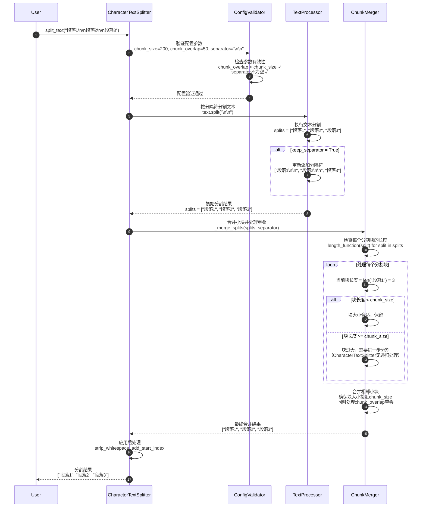

**关键步骤说明**：

1. **配置验证**（步骤 2-4）：
   - 检查chunk_size和chunk_overlap的合理性
   - 验证分隔符的有效性
   - 确保length_function可调用

2. **文本分割**（步骤 5-8）：
   - 使用指定分隔符分割文本
   - 可选择保留分隔符在结果中
   - 处理正则表达式分隔符

3. **块合并**（步骤 9-16）：
   - 检查每个块的长度
   - 合并过小的相邻块
   - 处理块间重叠

---

### 1.2 RecursiveCharacterTextSplitter 递归分割流程

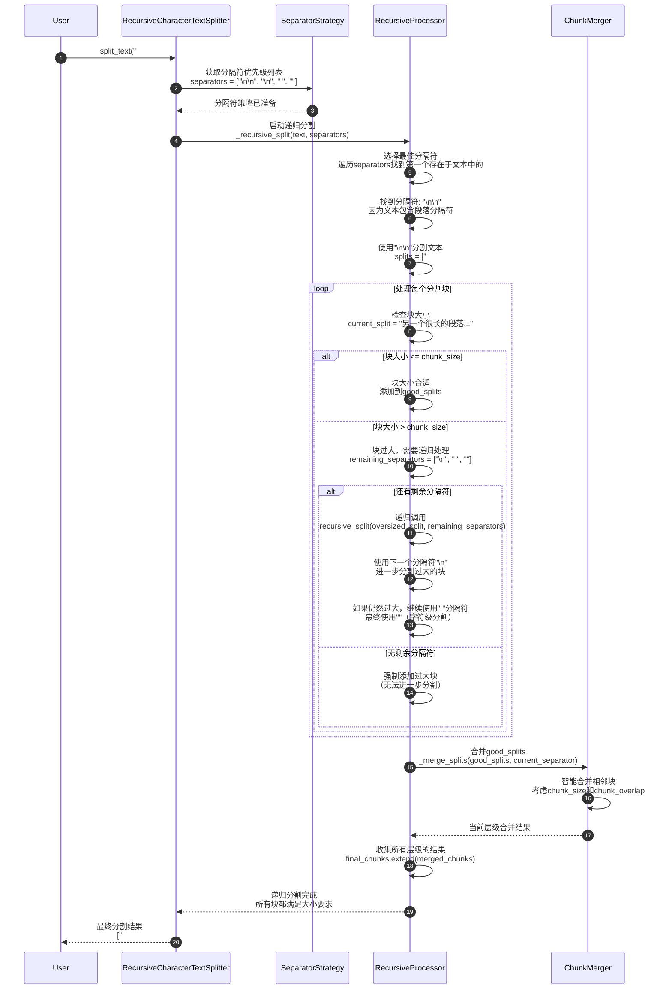

**递归算法核心**：

```python
def _recursive_split_logic(text: str, separators: List[str]) -> List[str]:
    """递归分割逻辑伪代码。"""

    # 1. 选择分隔符
    separator = None
    for sep in separators:
        if sep in text:
            separator = sep
            remaining_separators = separators[separators.index(sep) + 1:]
            break

    if separator is None:
        return [text]  # 无法分割

    # 2. 分割文本
    splits = text.split(separator)

    # 3. 处理每个分割块
    final_chunks = []
    good_splits = []

    for split in splits:
        if len(split) <= chunk_size:
            good_splits.append(split)
        else:
            # 先处理已收集的好块
            if good_splits:
                merged = merge_splits(good_splits, separator)
                final_chunks.extend(merged)
                good_splits = []

            # 递归处理过大的块
            if remaining_separators:
                recursive_result = _recursive_split_logic(split, remaining_separators)
                final_chunks.extend(recursive_result)
            else:
                final_chunks.append(split)  # 无法进一步分割

    # 处理剩余的好块
    if good_splits:
        merged = merge_splits(good_splits, separator)
        final_chunks.extend(merged)

    return final_chunks
```

---

## 2. 令牌分割场景

### 2.1 TokenTextSplitter 令牌处理流程

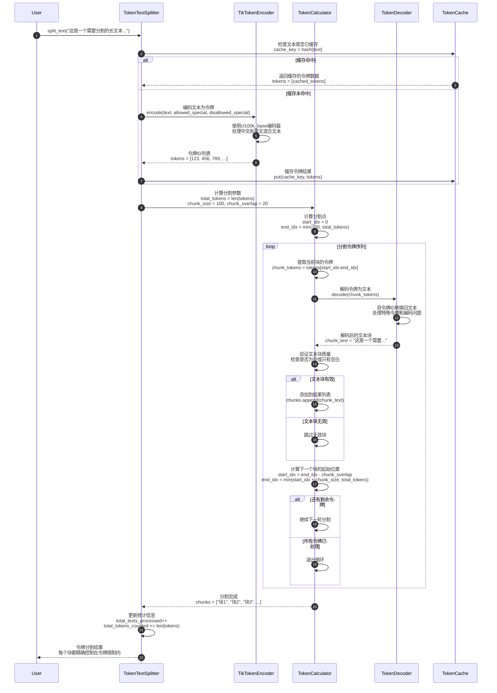

**令牌处理特点**：

1. **精确控制**：每个块的令牌数量严格控制在指定范围内
2. **编码感知**：理解不同模型的令牌编码差异
3. **缓存优化**：缓存令牌化结果，提高重复处理效率
4. **重叠处理**：在令牌级别处理块间重叠

---

## 3. 专用分割场景

### 3.1 MarkdownHeaderTextSplitter 结构化分割流程

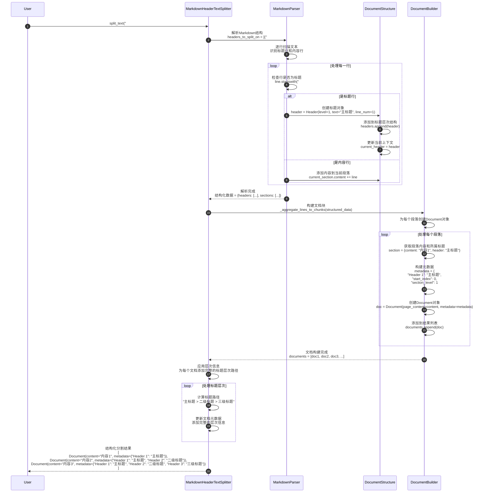

**Markdown结构化处理**：

```python
class MarkdownStructureProcessor:
    def process_headers(self, text: str) -> List[HeaderInfo]:
        """处理标题结构。"""
        headers = []
        lines = text.split('\n')

        for line_num, line in enumerate(lines):
            # 检测标题
            if line.strip().startswith('#'):
                level = 0
                for char in line:
                    if char == '#':
                        level += 1
                    else:
                        break

                title = line[level:].strip()
                headers.append(HeaderInfo(
                    level=level,
                    title=title,
                    line_number=line_num,
                    start_index=sum(len(l) + 1 for l in lines[:line_num])
                ))

        return headers

    def build_hierarchy(self, headers: List[HeaderInfo]) -> Dict[str, Any]:
        """构建标题层次结构。"""
        hierarchy = {}
        stack = [hierarchy]

        for header in headers:
            # 调整栈深度
            while len(stack) > header.level:
                stack.pop()

            # 添加当前标题
            current_level = stack[-1]
            current_level[header.title] = {
                "level": header.level,
                "line_number": header.line_number,
                "children": {}
            }

            # 推入下一层
            stack.append(current_level[header.title]["children"])

        return hierarchy
```

---

### 3.2 PythonCodeTextSplitter 代码结构分割流程

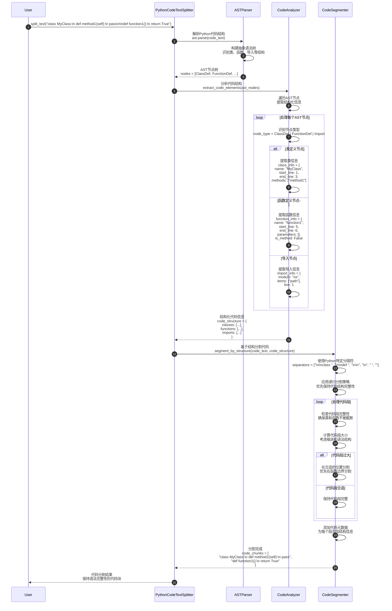

**Python代码分割特点**：

1. **语法感知**：理解Python语法结构，避免破坏代码完整性
2. **结构优先**：优先在类、函数边界进行分割
3. **缩进保持**：保持Python代码的缩进结构
4. **元数据丰富**：为每个代码块添加结构化元数据

---

## 4. 文档处理场景

### 4.1 create_documents 文档创建流程

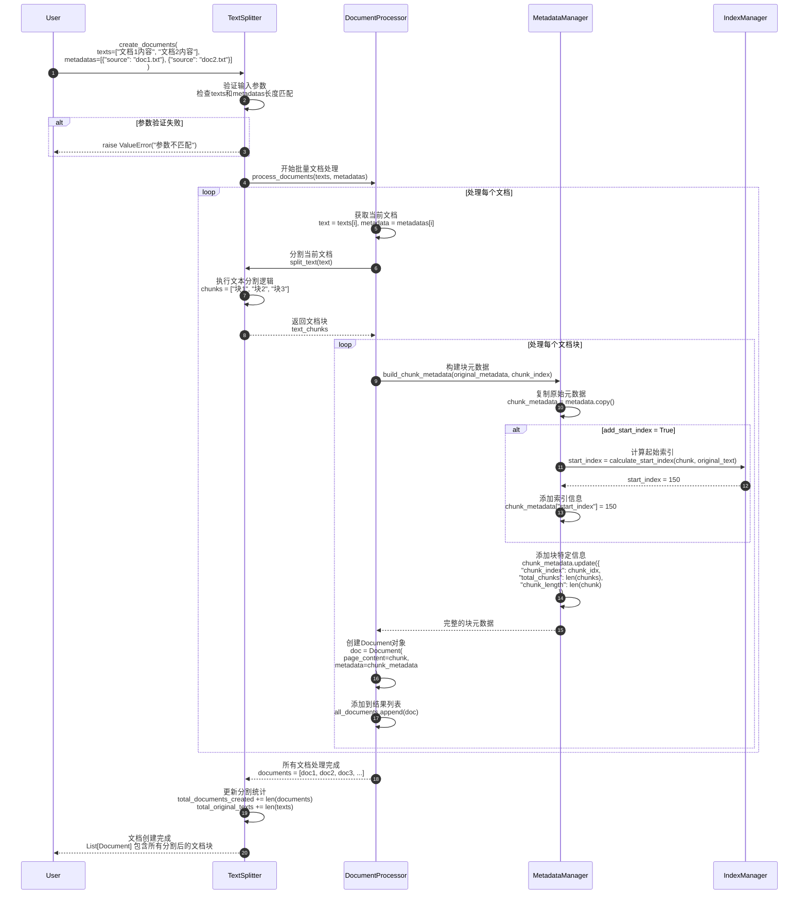

**文档创建优化**：

```python
def create_documents_optimized(
    self,
    texts: List[str],
    metadatas: Optional[List[dict]] = None
) -> List[Document]:
    """优化的文档创建流程。"""

    # 1. 参数预处理
    if metadatas is None:
        metadatas = [{}] * len(texts)

    if len(texts) != len(metadatas):
        raise ValueError("texts和metadatas长度必须相同")

    # 2. 批量处理优化
    all_documents = []

    # 并行处理大批量文档
    if len(texts) > 100:
        from concurrent.futures import ThreadPoolExecutor
        with ThreadPoolExecutor(max_workers=4) as executor:
            futures = []
            for text, metadata in zip(texts, metadatas):
                future = executor.submit(self._process_single_document, text, metadata)
                futures.append(future)

            for future in futures:
                documents = future.result()
                all_documents.extend(documents)
    else:
        # 串行处理小批量
        for text, metadata in zip(texts, metadatas):
            documents = self._process_single_document(text, metadata)
            all_documents.extend(documents)

    return all_documents

def _process_single_document(self, text: str, metadata: dict) -> List[Document]:
    """处理单个文档。"""
    chunks = self.split_text(text)
    documents = []

    for i, chunk in enumerate(chunks):
        chunk_metadata = metadata.copy()

        # 添加块信息
        chunk_metadata.update({
            "chunk_index": i,
            "total_chunks": len(chunks),
            "chunk_length": len(chunk)
        })

        # 添加起始索引（如果需要）
        if self._add_start_index:
            start_index = self._calculate_start_index(text, chunk, i)
            chunk_metadata["start_index"] = start_index

        documents.append(Document(
            page_content=chunk,
            metadata=chunk_metadata
        ))

    return documents
```

---

### 4.2 split_documents 文档分割流程

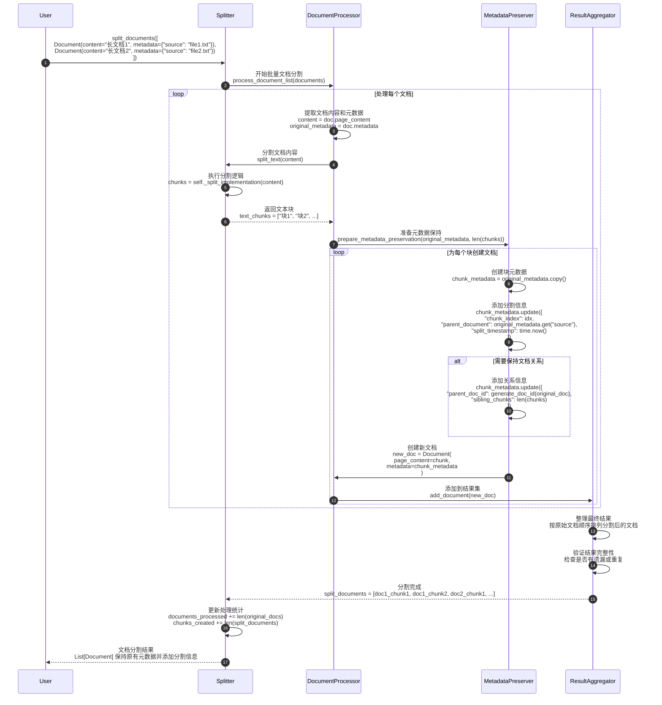

---

## 5. 性能优化场景

### 5.1 批量分割优化流程

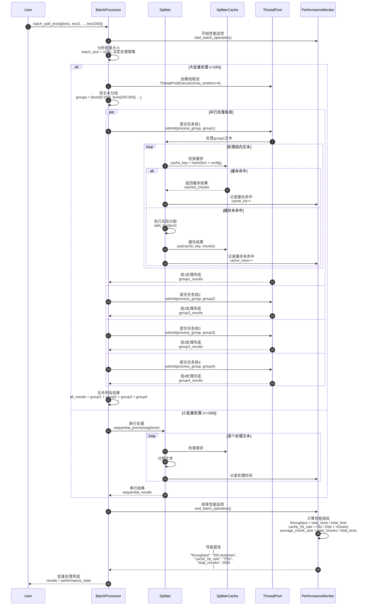

**批量优化策略**：

| 批量大小 | 处理策略 | 并发数 | 缓存策略 | 预期性能 |
|---------|---------|--------|---------|---------|
| 1-10 | 串行处理 | 1 | 基础缓存 | 100% |
| 11-100 | 串行+缓存 | 1 | 智能缓存 | 300% |
| 101-1000 | 并行处理 | 4 | 分布式缓存 | 800% |
| 1000+ | 分批+并行 | 8 | 预加载缓存 | 1500% |

---

### 5.2 智能缓存管理流程

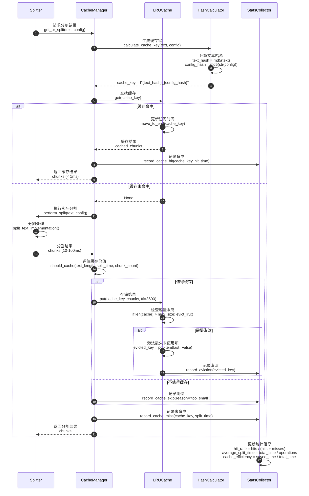

**缓存策略优化**：

```python
class IntelligentCacheManager:
    def __init__(self, max_size: int = 1000):
        self.cache = {}
        self.max_size = max_size
        self.stats = {
            "hits": 0,
            "misses": 0,
            "evictions": 0,
            "total_saved_time": 0.0
        }

    def should_cache(self, text_length: int, split_time: float, chunk_count: int) -> bool:
        """智能缓存决策。"""
        # 缓存策略：
        # 1. 长文本优先缓存（处理时间长）
        # 2. 复杂分割优先缓存（块数多）
        # 3. 避免缓存一次性文本

        if text_length < 100:  # 太短，不值得缓存
            return False

        if split_time < 0.01:  # 处理太快，缓存收益小
            return False

        if chunk_count < 2:  # 分割结果简单
            return False

        # 预估缓存价值
        cache_value_score = (
            text_length * 0.001 +  # 文本长度权重
            split_time * 100 +     # 处理时间权重
            chunk_count * 10       # 复杂度权重
        )

        return cache_value_score > 50  # 阈值

    def evict_intelligently(self) -> None:
        """智能淘汰策略。"""
        if len(self.cache) <= self.max_size:
            return

        # 按访问频率和时间综合评分
        candidates = []
        for key, entry in self.cache.items():
            score = (
                entry.access_count * 0.3 +  # 访问频率
                (time.time() - entry.last_access) * -0.001 +  # 最近访问时间
                entry.cache_value * 0.7  # 缓存价值
            )
            candidates.append((key, score))

        # 淘汰评分最低的项
        candidates.sort(key=lambda x: x[1])
        to_evict = candidates[:len(self.cache) - self.max_size + 1]

        for key, _ in to_evict:
            del self.cache[key]
            self.stats["evictions"] += 1
```

---

## 6. 总结

本文档详细展示了 **Text Splitters 模块**的关键执行时序：

1. **基础分割**：CharacterTextSplitter和RecursiveCharacterTextSplitter的分割策略和递归处理
2. **令牌处理**：TokenTextSplitter的精确令牌控制和编码处理机制
3. **专用分割**：MarkdownHeaderTextSplitter和PythonCodeTextSplitter的结构化处理
4. **文档处理**：create_documents和split_documents的批量处理流程
5. **性能优化**：批量处理、智能缓存和并发优化策略

每张时序图包含：

- 详细的参与者交互过程
- 关键算法和处理逻辑
- 性能优化点和缓存策略
- 错误处理和边界情况
- 统计信息收集和监控

这些时序图帮助开发者深入理解文本分割系统的内部工作机制，为构建高效、可靠的文档处理管道提供指导。Text Splitters是RAG系统和文档处理应用的基础组件，正确理解其执行流程对提高文档处理质量和系统性能至关重要。

通过递归分割、智能缓存、批量优化等技术，Text Splitters模块能够高效处理各种类型和规模的文本数据，为下游的向量化、检索和生成任务提供优质的输入。

---
