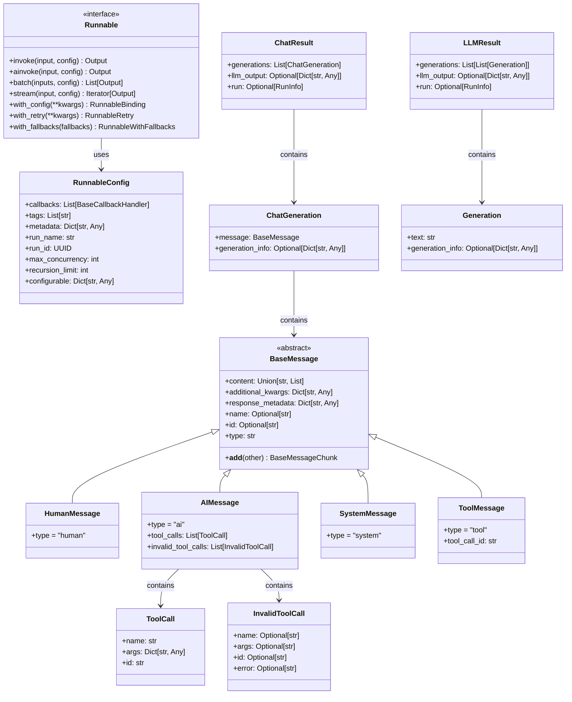
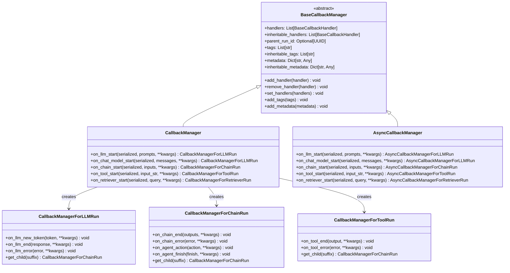

## 1. 核心数据结构概览

LangChain中的关键数据结构形成了整个框架的骨架，包括消息系统、工具调用、回调机制、配置管理等核心组件。

### 1.1 整体数据结构关系图



## 2. 消息系统数据结构

### 2.1 BaseMessage类层次结构

```mermaid
classDiagram
    class BaseMessage {
        <<abstract>>
        #content: Union[str, List[Union[str, Dict]]]
        #additional_kwargs: Dict[str, Any]
        #response_metadata: Dict[str, Any] 
        #name: Optional[str]
        #id: Optional[str]
        +type: str*
        +is_lc_serializable() bool
        +__add__(other) BaseMessageChunk
        +_merge_content(left, right) Any
        +_merge_kwargs(left, right) Dict
        +_merge_metadata(left, right) Dict
    }
    
    class HumanMessage {
        +type = "human"
    }
    
    class AIMessage {
        +type = "ai"
        #tool_calls: List[ToolCall]
        #invalid_tool_calls: List[InvalidToolCall]
    }
    
    class SystemMessage {
        +type = "system"
    }
    
    class ToolMessage {
        +type = "tool"
        #tool_call_id: str
    }
    
    class FunctionMessage {
        +type = "function"
        #name: str
    }
    
    class ChatMessage {
        +type = "chat"
        #role: str
    }
    
    class BaseMessageChunk {
        +get_lc_namespace() List[str]
    }
    
    BaseMessage <|-- HumanMessage
    BaseMessage <|-- AIMessage
    BaseMessage <|-- SystemMessage
    BaseMessage <|-- ToolMessage
    BaseMessage <|-- FunctionMessage
    BaseMessage <|-- ChatMessage
    BaseMessage <|-- BaseMessageChunk
    
    note for BaseMessage : "所有消息类型的基类\n支持内容合并和序列化"
    note for AIMessage : "包含工具调用信息\n支持多模态内容"
    note for ToolMessage : "工具执行结果\n必须包含调用ID"
```

### 2.2 消息内容结构详解

```python
# 消息内容的详细结构定义
from typing import Union, List, Dict, Any, Optional
from pydantic import BaseModel, Field

class TextContent(BaseModel):
    """纯文本内容"""
    type: str = "text"
    text: str

class ImageUrlContent(BaseModel):
    """图片URL内容"""
    type: str = "image_url"
    image_url: Dict[str, str] = Field(description="包含'url'键的字典")

class ImageContent(BaseModel):
    """图片数据内容"""
    type: str = "image"
    source: Dict[str, Any] = Field(description="包含图片数据和格式信息")

class AudioContent(BaseModel):
    """音频内容"""
    type: str = "audio"
    source: Dict[str, Any] = Field(description="音频数据和格式信息")

class VideoContent(BaseModel):
    """视频内容"""
    type: str = "video"
    source: Dict[str, Any] = Field(description="视频数据和格式信息")

class DocumentContent(BaseModel):
    """文档内容"""
    type: str = "document"
    source: Dict[str, Any] = Field(description="文档数据和格式信息")

# 联合类型定义
MessageContent = Union[
    str,  # 简单文本
    TextContent,
    ImageUrlContent,
    ImageContent,
    AudioContent,
    VideoContent,
    DocumentContent,
    Dict[str, Any]  # 自定义内容类型
]
```

### 2.3 工具调用数据结构

```mermaid
classDiagram
    class ToolCall {
        +name: str
        +args: Dict[str, Any]
        +id: str
        +type: str = "function"
        +to_json() Dict[str, Any]
        +from_json(data) ToolCall
    }
    
    class InvalidToolCall {
        +name: Optional[str]
        +args: Optional[str]
        +id: Optional[str]
        +error: Optional[str]
        +type: str = "invalid_tool_call"
    }
    
    class ToolCallChunk {
        +name: Optional[str]
        +args: Optional[str]
        +id: Optional[str]
        +index: Optional[int]
        +__add__(other) ToolCallChunk
    }
    
    ToolCall --> ToolCallChunk : streaming
    
    note for ToolCall : "完整的工具调用\n包含所有必要信息"
    note for InvalidToolCall : "解析失败的工具调用\n保留原始数据用于调试"
    note for ToolCallChunk : "流式工具调用块\n支持增量构建"
```

## 3. 输出和生成数据结构

### 3.1 LLM输出结构

```mermaid
classDiagram
    class LLMResult {
        +generations: List[List[Generation]]
        +llm_output: Optional[Dict[str, Any]]
        +run: Optional[RunInfo]
        +flatten() List[Generation]
    }
    
    class Generation {
        +text: str
        +generation_info: Optional[Dict[str, Any]]
        +type: str = "Generation"
    }
    
    class ChatResult {
        +generations: List[ChatGeneration]
        +llm_output: Optional[Dict[str, Any]]
        +run: Optional[RunInfo]
    }
    
    class ChatGeneration {
        +message: BaseMessage
        +generation_info: Optional[Dict[str, Any]]
        +text: str
        +type: str = "ChatGeneration"
    }
    
    class ChatGenerationChunk {
        +message: BaseMessageChunk
        +generation_info: Optional[Dict[str, Any]]
        +__add__(other) ChatGenerationChunk
    }
    
    class RunInfo {
        +run_id: UUID
    }
    
    LLMResult --> Generation : contains
    ChatResult --> ChatGeneration : contains
    ChatGeneration --> BaseMessage : contains
    ChatGenerationChunk --> BaseMessageChunk : contains
    LLMResult --> RunInfo : optional
    ChatResult --> RunInfo : optional
    
    note for LLMResult : "传统LLM的输出结果\n支持多个生成候选"
    note for ChatResult : "聊天模型的输出结果\n包含结构化消息"
    note for ChatGenerationChunk : "流式聊天生成块\n支持增量合并"
```

### 3.2 生成信息结构

```python
# 生成信息的详细结构
from typing import Dict, Any, Optional
from uuid import UUID

class TokenUsage(BaseModel):
    """Token使用统计"""
    prompt_tokens: int = Field(description="提示词消耗的token数")
    completion_tokens: int = Field(description="生成内容消耗的token数")
    total_tokens: int = Field(description="总token数")

class GenerationInfo(BaseModel):
    """生成信息详情"""
    finish_reason: Optional[str] = Field(
        description="完成原因：stop, length, function_call, content_filter等"
    )
    logprobs: Optional[Dict[str, Any]] = Field(description="对数概率信息")
    token_usage: Optional[TokenUsage] = Field(description="Token使用统计")
    model_name: Optional[str] = Field(description="使用的模型名称")
    system_fingerprint: Optional[str] = Field(description="系统指纹")

class LLMOutput(BaseModel):
    """LLM输出的元信息"""
    token_usage: Optional[TokenUsage] = Field(description="总Token使用统计")
    model_name: Optional[str] = Field(description="模型名称")
    system_fingerprint: Optional[str] = Field(description="系统指纹")
    created: Optional[int] = Field(description="创建时间戳")
    
class StreamEvent(BaseModel):
    """流式事件"""
    event: str = Field(description="事件类型")
    name: str = Field(description="组件名称")
    run_id: UUID = Field(description="运行ID")
    tags: List[str] = Field(default_factory=list, description="标签")
    metadata: Dict[str, Any] = Field(default_factory=dict, description="元数据")
    data: Dict[str, Any] = Field(description="事件数据")
```

## 4. 回调系统数据结构

### 4.1 回调管理器架构



### 4.2 回调处理器基类

```python
# 回调处理器的详细结构
from typing import Any, Dict, List, Optional, Union
from uuid import UUID
from abc import ABC, abstractmethod

class BaseCallbackHandler(ABC):
    """
    回调处理器基类
    
    定义了LangChain执行过程中各种事件的回调接口
    所有自定义回调处理器都应继承此类
    """
    
    ignore_llm: bool = False
    """是否忽略LLM相关事件"""
    
    ignore_chain: bool = False
    """是否忽略链相关事件"""
    
    ignore_agent: bool = False
    """是否忽略Agent相关事件"""
    
    ignore_retriever: bool = False
    """是否忽略检索器相关事件"""
    
    ignore_chat_model: bool = False
    """是否忽略聊天模型相关事件"""
    
    raise_error: bool = False
    """回调异常时是否抛出错误"""
    
    run_inline: bool = False
    """是否同步执行回调"""
    
    # LLM事件回调
    def on_llm_start(
        self,
        serialized: Dict[str, Any],
        prompts: List[str],
        *,
        run_id: UUID,
        parent_run_id: Optional[UUID] = None,
        tags: Optional[List[str]] = None,
        metadata: Optional[Dict[str, Any]] = None,
        **kwargs: Any,
    ) -> Any:
        """LLM开始生成时的回调"""
        pass
    
    def on_llm_new_token(
        self,
        token: str,
        *,
        chunk: Optional[Union[GenerationChunk, ChatGenerationChunk]] = None,
        run_id: UUID,
        parent_run_id: Optional[UUID] = None,
        **kwargs: Any,
    ) -> Any:
        """LLM生成新token时的回调"""
        pass
    
    def on_llm_end(
        self,
        response: LLMResult,
        *,
        run_id: UUID,
        parent_run_id: Optional[UUID] = None,
        **kwargs: Any,
    ) -> Any:
        """LLM完成生成时的回调"""
        pass
    
    def on_llm_error(
        self,
        error: BaseException,
        *,
        run_id: UUID,
        parent_run_id: Optional[UUID] = None,
        **kwargs: Any,
    ) -> Any:
        """LLM生成出错时的回调"""
        pass
    
    # 聊天模型事件回调
    def on_chat_model_start(
        self,
        serialized: Dict[str, Any],
        messages: List[List[BaseMessage]],
        *,
        run_id: UUID,
        parent_run_id: Optional[UUID] = None,
        tags: Optional[List[str]] = None,
        metadata: Optional[Dict[str, Any]] = None,
        **kwargs: Any,
    ) -> Any:
        """聊天模型开始生成时的回调"""
        pass
    
    # 链事件回调
    def on_chain_start(
        self,
        serialized: Dict[str, Any],
        inputs: Dict[str, Any],
        *,
        run_id: UUID,
        parent_run_id: Optional[UUID] = None,
        tags: Optional[List[str]] = None,
        metadata: Optional[Dict[str, Any]] = None,
        **kwargs: Any,
    ) -> Any:
        """链开始执行时的回调"""
        pass
    
    def on_chain_end(
        self,
        outputs: Dict[str, Any],
        *,
        run_id: UUID,
        parent_run_id: Optional[UUID] = None,
        **kwargs: Any,
    ) -> Any:
        """链执行结束时的回调"""
        pass
    
    def on_chain_error(
        self,
        error: BaseException,
        *,
        run_id: UUID,
        parent_run_id: Optional[UUID] = None,
        **kwargs: Any,
    ) -> Any:
        """链执行出错时的回调"""
        pass
    
    # 工具事件回调
    def on_tool_start(
        self,
        serialized: Dict[str, Any],
        input_str: str,
        *,
        run_id: UUID,
        parent_run_id: Optional[UUID] = None,
        tags: Optional[List[str]] = None,
        metadata: Optional[Dict[str, Any]] = None,
        **kwargs: Any,
    ) -> Any:
        """工具开始执行时的回调"""
        pass
    
    def on_tool_end(
        self,
        output: str,
        *,
        run_id: UUID,
        parent_run_id: Optional[UUID] = None,
        **kwargs: Any,
    ) -> Any:
        """工具执行结束时的回调"""
        pass
    
    def on_tool_error(
        self,
        error: BaseException,
        *,
        run_id: UUID,
        parent_run_id: Optional[UUID] = None,
        **kwargs: Any,
    ) -> Any:
        """工具执行出错时的回调"""
        pass
    
    # Agent事件回调
    def on_agent_action(
        self,
        action: AgentAction,
        *,
        run_id: UUID,
        parent_run_id: Optional[UUID] = None,
        **kwargs: Any,
    ) -> Any:
        """Agent执行动作时的回调"""
        pass
    
    def on_agent_finish(
        self,
        finish: AgentFinish,
        *,
        run_id: UUID,
        parent_run_id: Optional[UUID] = None,
        **kwargs: Any,
    ) -> Any:
        """Agent完成任务时的回调"""
        pass

class Run(BaseModel):
    """执行记录"""
    id: UUID = Field(description="运行ID")
    name: str = Field(description="运行名称")
    start_time: Optional[datetime] = Field(description="开始时间")
    end_time: Optional[datetime] = Field(description="结束时间")
    extra: Dict[str, Any] = Field(default_factory=dict, description="额外信息")
    error: Optional[str] = Field(description="错误信息")
    serialized: Dict[str, Any] = Field(description="序列化信息")
    events: List[Dict[str, Any]] = Field(default_factory=list, description="事件列表")
    inputs: Dict[str, Any] = Field(description="输入数据")
    outputs: Optional[Dict[str, Any]] = Field(description="输出数据")
    reference_example_id: Optional[UUID] = Field(description="参考示例ID")
    parent_run_id: Optional[UUID] = Field(description="父运行ID")
    tags: List[str] = Field(default_factory=list, description="标签")
    run_type: str = Field(description="运行类型")
    session_id: Optional[UUID] = Field(description="会话ID")
    session_name: Optional[str] = Field(description="会话名称")
```

## 5. 提示模板数据结构

### 5.1 提示模板类层次结构

```mermaid
classDiagram
    class BasePromptTemplate {
        <<abstract>>
        +input_variables: List[str]
        +input_types: Dict[str, Any]
        +output_parser: Optional[BaseOutputParser]
        +partial_variables: Dict[str, Any]
        +metadata: Optional[Dict[str, Any]]
        +tags: Optional[List[str]]
        +format(**kwargs) str
        +format_prompt(**kwargs) PromptValue
        +partial(**kwargs) BasePromptTemplate
        +save(file_path) void
        +dict() Dict[str, Any]
    }
    
    class PromptTemplate {
        +template: str
        +template_format: str = "f-string"
        +validate_template: bool = False
        +from_template(template) PromptTemplate$
        +from_file(file_path) PromptTemplate$
        +from_examples(examples) PromptTemplate$
    }
    
    class ChatPromptTemplate {
        +messages: List[MessagePromptTemplate]
        +from_template(template) ChatPromptTemplate$
        +from_messages(messages) ChatPromptTemplate$
        +from_role_strings(role_strings) ChatPromptTemplate$
        +append(message) ChatPromptTemplate
        +extend(messages) ChatPromptTemplate
    }
    
    class FewShotPromptTemplate {
        +examples: List[Dict[str, str]]
        +example_prompt: PromptTemplate
        +example_separator: str = "\n\n"
        +prefix: str = ""
        +suffix: str = ""
        +example_selector: Optional[BaseExampleSelector]
        +max_length: Optional[int]
        +get_examples(**kwargs) List[Dict[str, str]]
    }
    
    class PipelinePromptTemplate {
        +final_prompt: BasePromptTemplate
        +pipeline_prompts: List[Tuple[str, BasePromptTemplate]]
        +format(**kwargs) str
    }
    
    BasePromptTemplate <|-- PromptTemplate
    BasePromptTemplate <|-- ChatPromptTemplate
    BasePromptTemplate <|-- FewShotPromptTemplate
    BasePromptTemplate <|-- PipelinePromptTemplate
    
    note for PromptTemplate : "字符串模板\n支持f-string和jinja2格式"
    note for ChatPromptTemplate : "聊天消息模板\n支持角色和系统消息"
    note for FewShotPromptTemplate : "少样本学习模板\n包含示例和选择器"
```

### 5.2 消息提示模板结构

```mermaid
classDiagram
    class MessagePromptTemplate {
        <<abstract>>
        +format(**kwargs) BaseMessage
        +format_messages(**kwargs) List[BaseMessage]
        +input_variables: List[str]
        +additional_kwargs: Dict[str, Any]
    }
    
    class HumanMessagePromptTemplate {
        +prompt: PromptTemplate
        +additional_kwargs: Dict[str, Any]
        +from_template(template) HumanMessagePromptTemplate$
    }
    
    class AIMessagePromptTemplate {
        +prompt: PromptTemplate
        +additional_kwargs: Dict[str, Any]
        +from_template(template) AIMessagePromptTemplate$
    }
    
    class SystemMessagePromptTemplate {
        +prompt: PromptTemplate
        +additional_kwargs: Dict[str, Any]
        +from_template(template) SystemMessagePromptTemplate$
    }
    
    class ChatMessagePromptTemplate {
        +prompt: PromptTemplate
        +role: str
        +additional_kwargs: Dict[str, Any]
        +from_template(template, role) ChatMessagePromptTemplate$
    }
    
    class MessagesPlaceholder {
        +variable_name: str
        +optional: bool = False
        +format_messages(**kwargs) List[BaseMessage]
    }
    
    MessagePromptTemplate <|-- HumanMessagePromptTemplate
    MessagePromptTemplate <|-- AIMessagePromptTemplate
    MessagePromptTemplate <|-- SystemMessagePromptTemplate
    MessagePromptTemplate <|-- ChatMessagePromptTemplate
    MessagePromptTemplate <|-- MessagesPlaceholder
    
    ChatPromptTemplate --> MessagePromptTemplate : contains
    
    note for MessagesPlaceholder : "消息占位符\n用于插入动态消息列表"
```

## 6. 文档和向量存储数据结构

### 6.1 文档结构

```mermaid
classDiagram
    class Document {
        +page_content: str
        +metadata: Dict[str, Any]
        +id: Optional[str]
        +__init__(page_content, metadata, **kwargs)
        +__str__() str
        +__repr__() str
        +dict() Dict[str, Any]
        +copy(*, deep=True) Document
    }
    
    class DocumentChunk {
        +page_content: str
        +metadata: Dict[str, Any]
        +start_index: Optional[int]
        +end_index: Optional[int]
        +chunk_id: Optional[str]
        +parent_id: Optional[str]
    }
    
    class Embedding {
        +vector: List[float]
        +dimension: int
        +model: Optional[str]
        +normalize() Embedding
        +similarity(other) float
        +distance(other) float
    }
    
    class VectorStoreDocument {
        +id: str
        +vector: List[float]
        +document: Document
        +score: Optional[float]
        +similarity_search_result: bool = False
    }
    
    Document <|-- DocumentChunk
    Document --> VectorStoreDocument : contains
    Embedding --> VectorStoreDocument : contains
    
    note for Document : "基础文档类\n包含内容和元数据"
    note for DocumentChunk : "文档分块\n记录位置信息"
    note for VectorStoreDocument : "向量存储中的文档\n包含向量和相似度"
```

### 6.2 向量存储接口

```python
# 向量存储的详细接口定义
from typing import List, Optional, Dict, Any, Tuple, Iterator
from abc import ABC, abstractmethod

class VectorStore(ABC):
    """
    向量存储抽象基类
    
    定义了向量存储的标准接口，包括：
    - 文档添加和删除
    - 相似性搜索
    - 最大边际相关性搜索
    - 检索器接口
    """
    
    @abstractmethod
    def add_texts(
        self,
        texts: Iterable[str],
        metadatas: Optional[List[Dict[str, Any]]] = None,
        **kwargs: Any,
    ) -> List[str]:
        """
        添加文本到向量存储
        
        Args:
            texts: 文本内容迭代器
            metadatas: 对应的元数据列表
            **kwargs: 额外参数
            
        Returns:
            文档ID列表
        """
        pass
    
    def add_documents(
        self,
        documents: List[Document],
        **kwargs: Any,
    ) -> List[str]:
        """
        添加文档到向量存储
        
        Args:
            documents: 文档列表
            **kwargs: 额外参数
            
        Returns:
            文档ID列表
        """
        texts = [doc.page_content for doc in documents]
        metadatas = [doc.metadata for doc in documents]
        return self.add_texts(texts, metadatas, **kwargs)
    
    @abstractmethod
    def similarity_search(
        self,
        query: str,
        k: int = 4,
        **kwargs: Any,
    ) -> List[Document]:
        """
        相似性搜索
        
        Args:
            query: 查询文本
            k: 返回结果数量
            **kwargs: 额外参数
            
        Returns:
            最相似的文档列表
        """
        pass
    
    def similarity_search_with_score(
        self,
        query: str,
        k: int = 4,
        **kwargs: Any,
    ) -> List[Tuple[Document, float]]:
        """
        带相似度分数的搜索
        
        Args:
            query: 查询文本
            k: 返回结果数量
            **kwargs: 额外参数
            
        Returns:
            (文档, 相似度分数) 元组列表
        """
        docs = self.similarity_search(query, k=k, **kwargs)
        return [(doc, 1.0) for doc in docs]  # 默认分数为1.0
    
    def similarity_search_by_vector(
        self,
        embedding: List[float],
        k: int = 4,
        **kwargs: Any,
    ) -> List[Document]:
        """
        基于向量的相似性搜索
        
        Args:
            embedding: 查询向量
            k: 返回结果数量
            **kwargs: 额外参数
            
        Returns:
            最相似的文档列表
        """
        raise NotImplementedError("子类必须实现此方法")
    
    def max_marginal_relevance_search(
        self,
        query: str,
        k: int = 4,
        fetch_k: int = 20,
        lambda_mult: float = 0.5,
        **kwargs: Any,
    ) -> List[Document]:
        """
        最大边际相关性搜索
        
        在相似性和多样性之间平衡的搜索算法
        
        Args:
            query: 查询文本
            k: 返回结果数量
            fetch_k: 候选文档数量
            lambda_mult: 多样性权重 (0=最大多样性, 1=最小多样性)
            **kwargs: 额外参数
            
        Returns:
            搜索结果文档列表
        """
        raise NotImplementedError("子类必须实现此方法")
    
    def delete(
        self,
        ids: Optional[List[str]] = None,
        **kwargs: Any,
    ) -> Optional[bool]:
        """
        删除文档
        
        Args:
            ids: 要删除的文档ID列表
            **kwargs: 额外参数
            
        Returns:
            删除成功返回True，否则返回False
        """
        raise NotImplementedError("删除操作未实现")
    
    def as_retriever(self, **kwargs: Any) -> "VectorStoreRetriever":
        """
        转换为检索器接口
        
        Args:
            **kwargs: 检索器参数
            
        Returns:
            VectorStoreRetriever实例
        """
        from langchain_core.vectorstores import VectorStoreRetriever
        
        return VectorStoreRetriever(
            vectorstore=self,
            **kwargs,
        )

class VectorStoreRetriever(BaseRetriever):
    """
    向量存储检索器
    
    将向量存储包装为Retriever接口
    """
    
    vectorstore: VectorStore
    """底层向量存储"""
    
    search_type: str = "similarity"
    """搜索类型：similarity, mmr, similarity_score_threshold"""
    
    search_kwargs: Dict[str, Any] = Field(default_factory=dict)
    """搜索参数"""
    
    def get_relevant_documents(
        self,
        query: str,
        *,
        callbacks: Optional[Callbacks] = None,
        tags: Optional[List[str]] = None,
        metadata: Optional[Dict[str, Any]] = None,
        run_name: Optional[str] = None,
        **kwargs: Any,
    ) -> List[Document]:
        """
        获取相关文档
        
        Args:
            query: 查询字符串
            callbacks: 回调处理器
            tags: 标签
            metadata: 元数据
            run_name: 运行名称
            **kwargs: 额外参数
            
        Returns:
            相关文档列表
        """
        if self.search_type == "similarity":
            docs = self.vectorstore.similarity_search(query, **self.search_kwargs)
        elif self.search_type == "mmr":
            docs = self.vectorstore.max_marginal_relevance_search(
                query, **self.search_kwargs
            )
        elif self.search_type == "similarity_score_threshold":
            docs_and_similarities = (
                self.vectorstore.similarity_search_with_relevance_scores(
                    query, **self.search_kwargs
                )
            )
            docs = [doc for doc, _ in docs_and_similarities]
        else:
            raise ValueError(f"search_type of {self.search_type} not allowed.")
        
        return docs
```

## 7. 总结

LangChain的数据结构设计体现了以下特点：

### 7.1 设计原则
1. **类型安全**: 广泛使用Pydantic进行数据验证
2. **可扩展性**: 基于抽象基类的继承体系
3. **序列化友好**: 支持JSON序列化和反序列化
4. **向后兼容**: 保持API的稳定性
5. **模块化**: 清晰的模块边界和接口定义

### 7.2 核心概念
1. **消息系统**: 统一的多模态消息处理
2. **工具调用**: 结构化的函数调用机制
3. **回调系统**: 完整的执行追踪和监控
4. **配置管理**: 灵活的运行时配置
5. **向量存储**: 高效的相似性搜索接口

这些数据结构共同构成了LangChain的核心架构，为构建复杂的LLM应用提供了坚实的基础。
