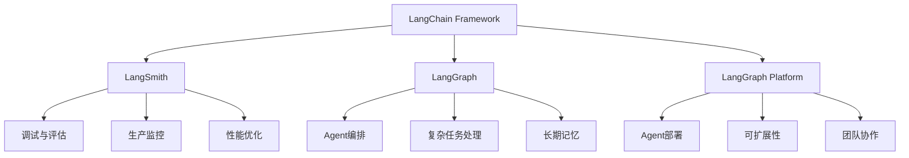
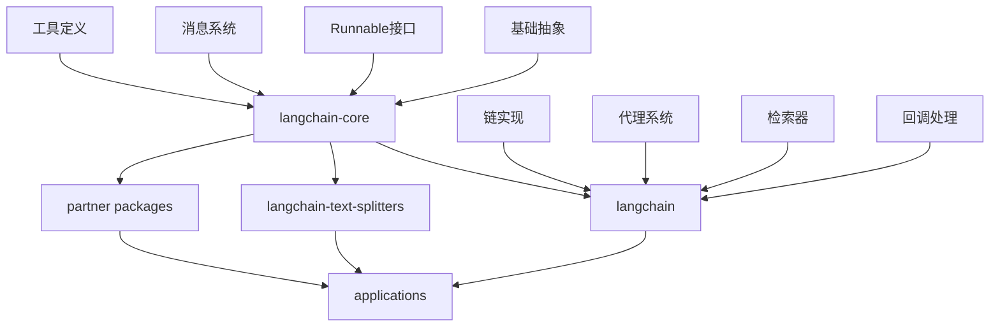
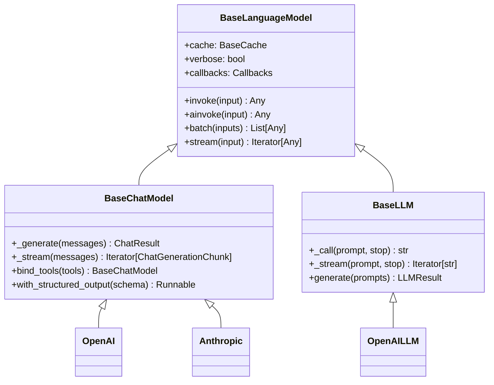
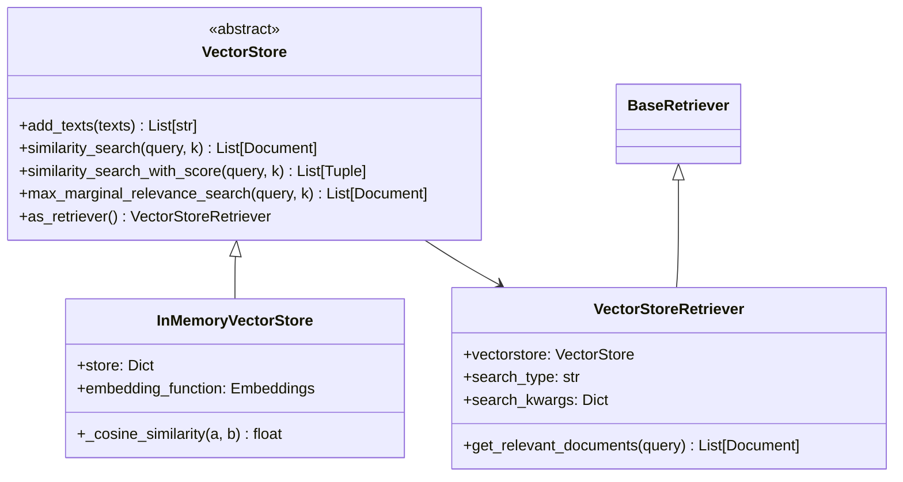
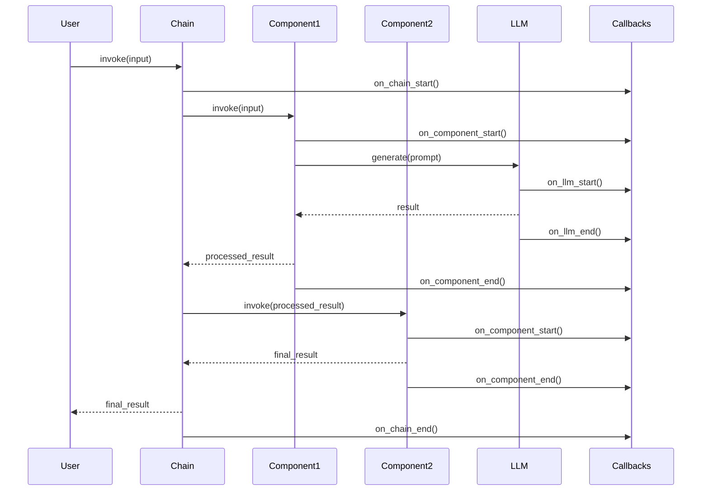
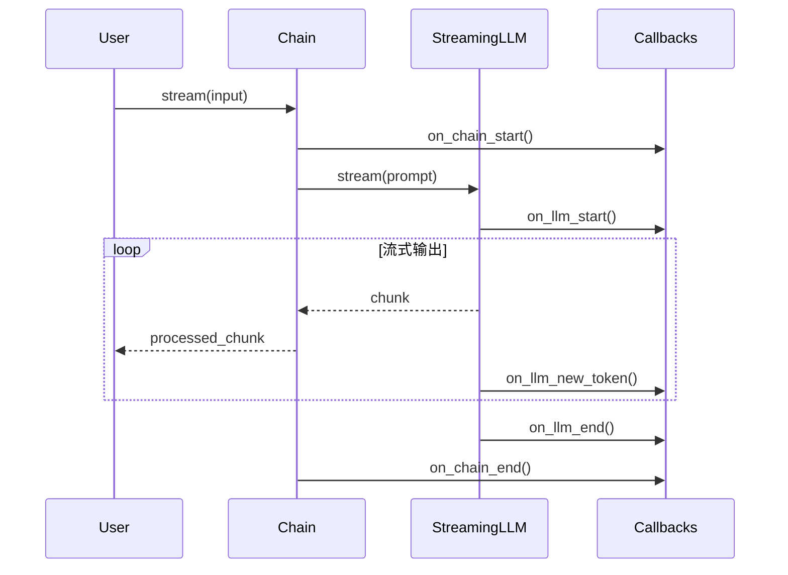
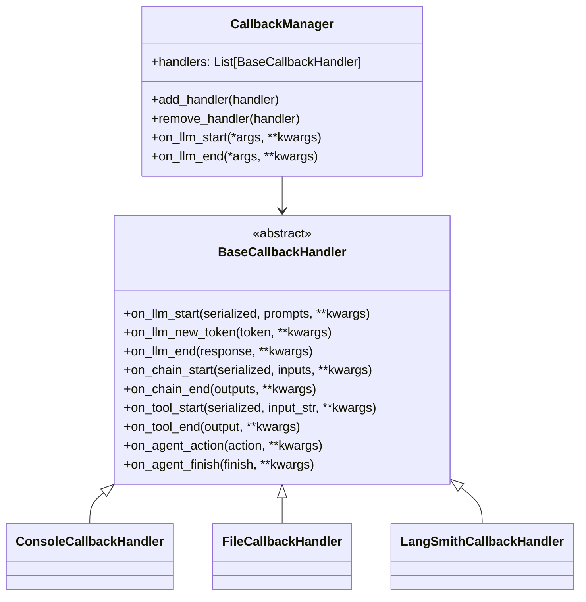
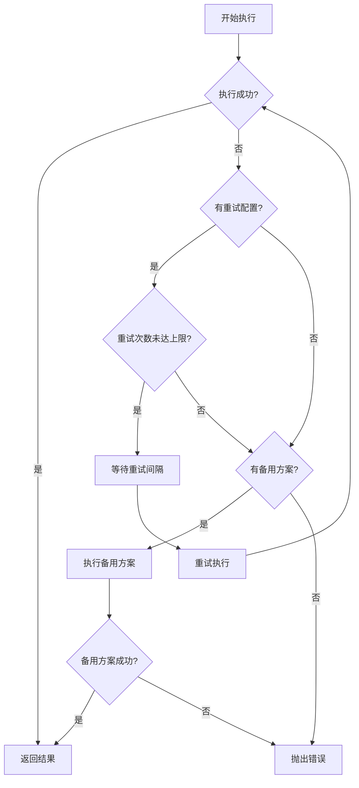

# LangChain 源码剖析 - 总览篇

## 1. 项目概述

LangChain是一个构建LLM驱动应用的开源框架，旨在帮助开发者将不同的组件和第三方集成链接在一起，简化AI应用开发，同时在底层技术演进时保证决策的未来兼容性。

### 1.1 核心价值
- **实时数据增强**: 轻松将LLM连接到多样化的数据源和外部/内部系统
- **模型互操作性**: 支持模型的灵活替换，适应工程团队的实验需求
- **模块化设计**: 基于独立抽象的模块化设计，不依赖特定模型提供商
- **生产就绪**: 经过大规模生产环境验证的稳定组件

### 1.2 生态系统



## 2. 整体架构

### 2.1 项目结构

LangChain采用monorepo架构，主要包含以下核心模块：

```
langchain/
├── libs/
│   ├── core/                    # 核心抽象和基础组件
│   ├── langchain/              # 主要功能实现
│   ├── text-splitters/         # 文本分割器
│   ├── cli/                    # 命令行工具
│   ├── standard-tests/         # 标准测试套件
│   └── partners/               # 合作伙伴集成
├── docs/                       # 文档
└── cookbook/                   # 实用示例
```

### 2.2 核心包依赖关系



### 2.3 核心设计模式

#### 2.3.1 Runnable 接口模式
所有LangChain组件都实现了统一的Runnable接口，提供：

```python
from langchain_core.runnables import Runnable
from typing import Any, List, Optional, Iterator, AsyncIterator

class Runnable:
    """
    LangChain的核心接口，定义了统一的执行模式
    """
    def invoke(self, input: Any, config: Optional[RunnableConfig] = None) -> Any:
        """单次同步执行"""
        pass

    async def ainvoke(self, input: Any, config: Optional[RunnableConfig] = None) -> Any:
        """单次异步执行"""
        pass

    def batch(self, inputs: List[Any], config: Optional[RunnableConfig] = None) -> List[Any]:
        """批量执行"""
        pass

    def stream(self, input: Any, config: Optional[RunnableConfig] = None) -> Iterator[Any]:
        """流式执行"""
        pass

    def astream(self, input: Any, config: Optional[RunnableConfig] = None) -> AsyncIterator[Any]:
        """异步流式执行"""
        pass
```

#### 2.3.2 链式组合模式 (LCEL)

LangChain Expression Language (LCEL) 支持声明式组件组合：

```python
# 顺序链接
chain = prompt | model | output_parser

# 并行执行
parallel_chain = prompt | {
    "answer": model | output_parser,
    "analysis": model | analysis_parser
}

# 条件分支
branch_chain = RunnableBranch(
    (condition1, chain1),
    (condition2, chain2),
    default_chain
)
```

## 3. 核心组件架构

### 3.1 语言模型层级结构



### 3.2 向量存储架构



### 3.3 工具系统架构

```mermaid
classDiagram
    class BaseTool {
        <<abstract>>
        +name: str
        +description: str
        +args_schema: Type[BaseModel]
        +_run(*args, **kwargs) Any
        +_arun(*args, **kwargs) Any
        +invoke(input) Any
        +handle_tool_error: bool
    }

    class Tool {
        +func: Callable
        +coroutine: Callable
    }

    class StructuredTool {
        +func: Callable
        +coroutine: Callable
        +args_schema: Type[BaseModel]
    }

    BaseTool <|-- Tool
    BaseTool <|-- StructuredTool

    note for BaseTool : "实现Runnable接口\n支持同步/异步执行\n提供错误处理机制"
```

## 4. 核心执行流程

### 4.1 基本执行时序图



### 4.2 流式执行时序图



## 5. 配置和回调系统

### 5.1 配置系统

```python
from langchain_core.runnables.config import RunnableConfig
from langchain_core.callbacks import BaseCallbackHandler

class RunnableConfig:
    """
    运行时配置，控制执行行为和追踪
    """
    callbacks: List[BaseCallbackHandler] = None
    tags: List[str] = None
    metadata: Dict[str, Any] = None
    run_name: str = None
    max_concurrency: int = None
    recursion_limit: int = None
    run_id: UUID = None
    configurable: Dict[str, Any] = None
```

### 5.2 回调系统架构



## 6. 错误处理和重试机制

### 6.1 错误处理策略

```python
from langchain_core.runnables import RunnableWithFallbacks

# 添加容错机制
reliable_chain = primary_chain.with_fallbacks([
    backup_chain_1,
    backup_chain_2
])

# 添加重试机制
retry_chain = chain.with_retry(
    stop_after_attempt=3,
    wait_exponential_jitter=True
)
```

### 6.2 错误处理流程



## 7. 性能优化机制

### 7.1 并发执行

```python
# 批量并发执行
results = chain.batch([input1, input2, input3], config={
    "max_concurrency": 5
})

# 并行组合
parallel_chain = RunnableParallel({
    "summary": summarize_chain,
    "analysis": analyze_chain,
    "translation": translate_chain
})
```

### 7.2 缓存机制

```python
from langchain.cache import InMemoryCache, SQLiteCache

# 设置全局缓存
import langchain
langchain.llm_cache = InMemoryCache()

# 或使用持久化缓存
langchain.llm_cache = SQLiteCache(database_path=".langchain.db")
```

## 8. 扩展和自定义

### 8.1 自定义组件模式

```python
from langchain_core.runnables import Runnable

class CustomRunnable(Runnable):
    """
    自定义组件需要实现的基本接口
    """
    def __init__(self, **kwargs):
        super().__init__(**kwargs)

    def invoke(self, input, config=None):
        # 实现核心逻辑
        return self._process(input)

    def _process(self, input):
        # 具体处理逻辑
        pass
```

### 8.2 插件化架构

LangChain通过partner包支持插件化扩展，每个集成都遵循标准接口：

```python
# 模型集成示例
from langchain_core.language_models import BaseChatModel

class CustomChatModel(BaseChatModel):
    def _generate(self, messages, stop=None, **kwargs):
        # 实现特定模型的生成逻辑
        pass

    @property
    def _llm_type(self):
        return "custom-model"
```

## 9. 总结

LangChain的架构设计体现了以下核心思想：

1. **统一接口**: 通过Runnable接口提供一致的执行模式
2. **组合优于继承**: 通过LCEL支持灵活的组件组合
3. **可观测性**: 完整的回调和追踪系统
4. **容错性**: 内置重试和回退机制
5. **高性能**: 支持并发、缓存和流式处理
6. **可扩展性**: 插件化的合作伙伴生态

这种设计使得LangChain既适合快速原型开发，也能支撑复杂的生产应用。

接下来我们将深入分析各个核心模块的具体实现和使用方式。
