## 1. 整体系统架构

### 1.1 LangChain生态系统架构

```mermaid
graph TB
    subgraph "用户应用层"
        A1[RAG应用] 
        A2[聊天机器人]
        A3[代码生成器]
        A4[数据分析工具]
        A5[文档处理系统]
    end
    
    subgraph "LangChain框架层"
        B1[langchain] --> B11[chains - 链式处理]
        B1 --> B12[agents - 智能代理]
        B1 --> B13[memory - 记忆管理]
        B1 --> B14[retrievers - 检索器]
        
        B2[langchain-core] --> B21[runnables - 可运行接口]
        B2 --> B22[language_models - 语言模型]
        B2 --> B23[messages - 消息系统]
        B2 --> B24[prompts - 提示模板]
        B2 --> B25[tools - 工具系统]
        B2 --> B26[callbacks - 回调系统]
        B2 --> B27[vectorstores - 向量存储]
        
        B3[langchain-text-splitters] --> B31[文本分割算法]
    end
    
    subgraph "合作伙伴集成层"
        C1[langchain-openai] --> C11[OpenAI模型]
        C2[langchain-anthropic] --> C21[Claude模型]
        C3[langchain-chroma] --> C31[Chroma向量库]
        C4[langchain-pinecone] --> C41[Pinecone向量库]
        C5[其他集成包...] --> C51[各种模型和工具]
    end
    
    subgraph "外部服务层"
        D1[OpenAI API]
        D2[Anthropic API]
        D3[Hugging Face]
        D4[向量数据库]
        D5[搜索引擎]
        D6[文件系统]
        D7[数据库]
    end
    
    subgraph "开发运维层"
        E1[LangSmith] --> E11[调试追踪]
        E1 --> E12[性能监控]
        E1 --> E13[评估测试]
        
        E2[LangGraph] --> E21[复杂工作流]
        E2 --> E22[Agent编排]
        E2 --> E23[状态管理]
    end
    
    %% 依赖关系
    A1 --> B1
    A2 --> B1
    A3 --> B1
    A4 --> B1
    A5 --> B1
    
    B1 --> B2
    B1 --> B3
    B1 --> C1
    B1 --> C2
    B1 --> C3
    B1 --> C4
    
    C1 --> D1
    C2 --> D2
    C3 --> D4
    C4 --> D4
    C5 --> D3
    C5 --> D5
    C5 --> D6
    C5 --> D7
    
    B1 -.-> E1
    B1 -.-> E2
```

### 1.2 核心模块依赖关系架构

```mermaid
graph LR
    subgraph "LangChain Core 核心抽象层"
        A[Runnable接口] --> A1[统一执行协议]
        A --> A2[组合操作符]
        A --> A3[配置管理]
        
        B[消息系统] --> B1[BaseMessage]
        B --> B2[多模态内容]
        B --> B3[工具调用]
        
        C[语言模型抽象] --> C1[BaseChatModel]
        C --> C2[BaseLLM]
        C --> C3[嵌入模型]
        
        D[工具系统] --> D1[BaseTool]
        D --> D2[@tool装饰器]
        D --> D3[工具调用协议]
        
        E[提示系统] --> E1[PromptTemplate]
        E --> E2[ChatPromptTemplate]
        E --> E3[少样本学习]
        
        F[向量存储] --> F1[VectorStore抽象]
        F --> F2[检索器接口]
        F --> F3[相似性搜索]
        
        G[回调系统] --> G1[执行追踪]
        G --> G2[性能监控]
        G --> G3[错误处理]
    end
    
    subgraph "LangChain 应用层"
        H[链系统] --> H1[RunnableSequence]
        H --> H2[RunnableParallel]
        H --> H3[专用链类型]
        
        I[Agent系统] --> I1[ReAct Agent]
        I --> I2[工具调用Agent]
        I --> I3[计划执行Agent]
        
        J[检索系统] --> J1[文档加载器]
        J --> J2[文本分割器]
        J --> J3[RAG链]
        
        K[记忆系统] --> K1[对话缓冲区]
        K --> K2[向量记忆]
        K --> K3[总结记忆]
    end
    
    %% 依赖关系
    H --> A
    H --> B
    H --> C
    I --> A
    I --> D
    I --> B
    J --> F
    J --> E
    K --> F
    K --> B
```

## 2. 核心执行时序图

### 2.1 基本Runnable执行时序图

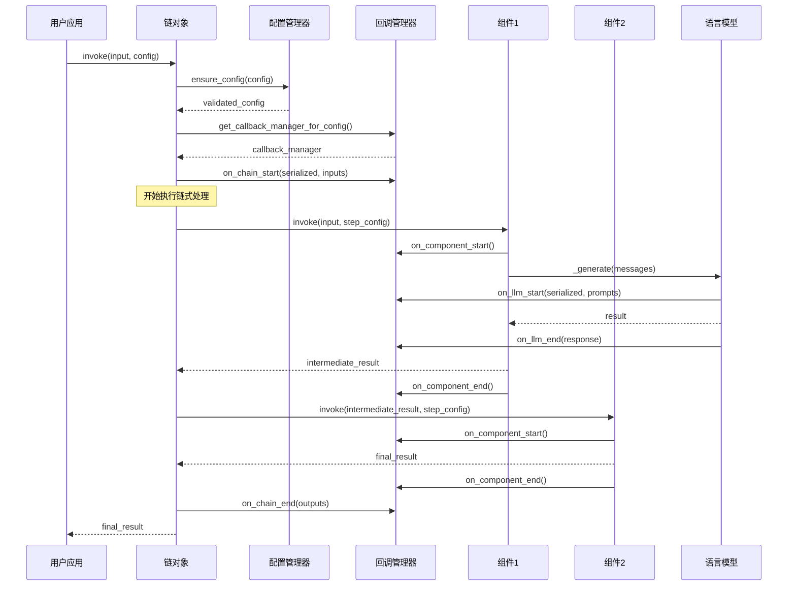

### 2.2 流式执行时序图

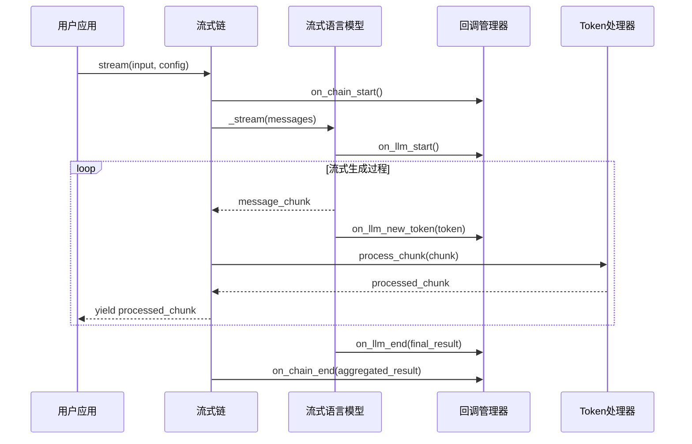

### 2.3 Agent执行时序图

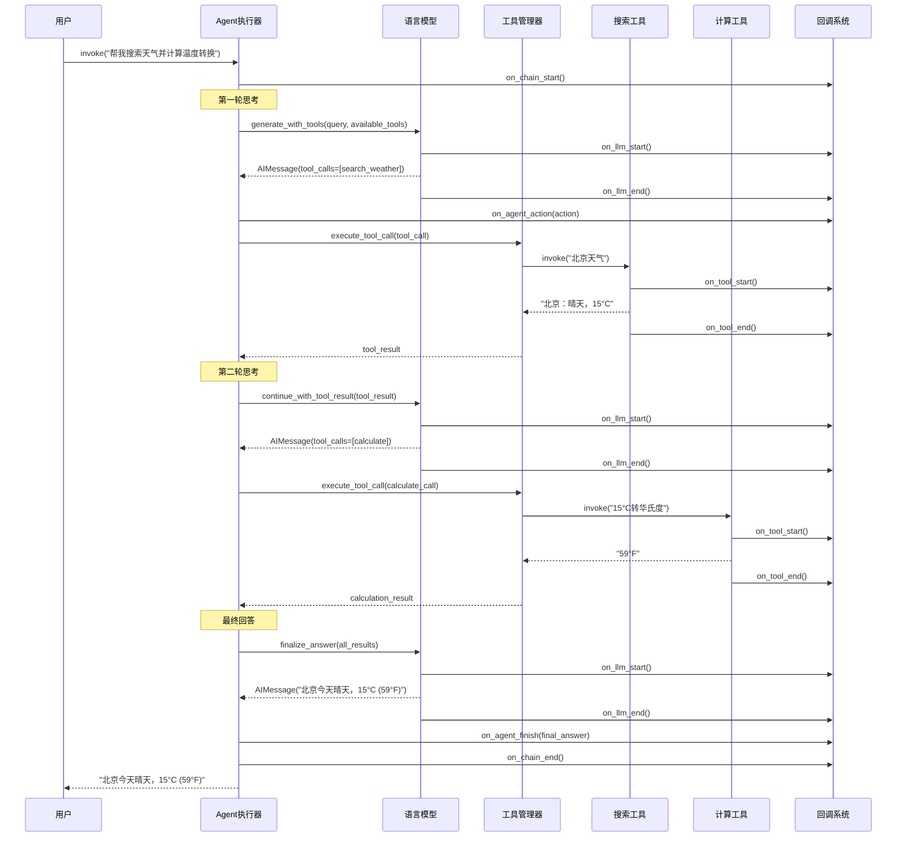

### 2.4 RAG系统执行时序图

```mermaid
sequenceDiagram
    participant User as 用户
    participant RAGChain as RAG链
    participant Retriever as 检索器
    participant VectorStore as 向量存储
    participant Embeddings as 嵌入模型
    participant LLM as 生成模型
    participant Callback as 回调系统
    
    User->>RAGChain: invoke("什么是LangChain？")
    RAGChain->>Callback: on_chain_start()
    
    Note over RAGChain: 检索阶段
    RAGChain->>Retriever: get_relevant_documents(query)
    Retriever->>Callback: on_retriever_start()
    
    Retriever->>Embeddings: embed_query("什么是LangChain？")
    Embeddings->>Callback: on_llm_start()
    Embeddings-->>Retriever: query_vector
    Embeddings->>Callback: on_llm_end()
    
    Retriever->>VectorStore: similarity_search(query_vector, k=4)
    VectorStore-->>Retriever: relevant_documents
    Retriever->>Callback: on_retriever_end(documents)
    Retriever-->>RAGChain: documents
    
    Note over RAGChain: 上下文构建
    RAGChain->>RAGChain: build_context(documents, query)
    
    Note over RAGChain: 生成阶段
    RAGChain->>LLM: generate(context + query)
    LLM->>Callback: on_llm_start()
    
    opt 如果支持流式输出
        loop 流式生成
            LLM-->>RAGChain: chunk
            LLM->>Callback: on_llm_new_token()
            RAGChain-->>User: yield chunk
        end
    else 完整输出
        LLM-->>RAGChain: complete_answer
    end
    
    LLM->>Callback: on_llm_end()
    RAGChain->>Callback: on_chain_end()
    RAGChain-->>User: final_answer
```

## 3. 错误处理和重试机制架构

### 3.1 错误处理流程图

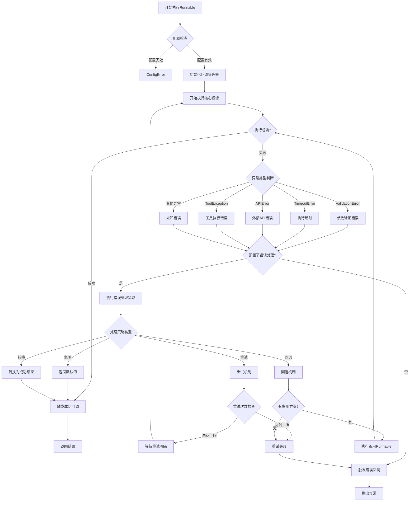

### 3.2 重试机制时序图

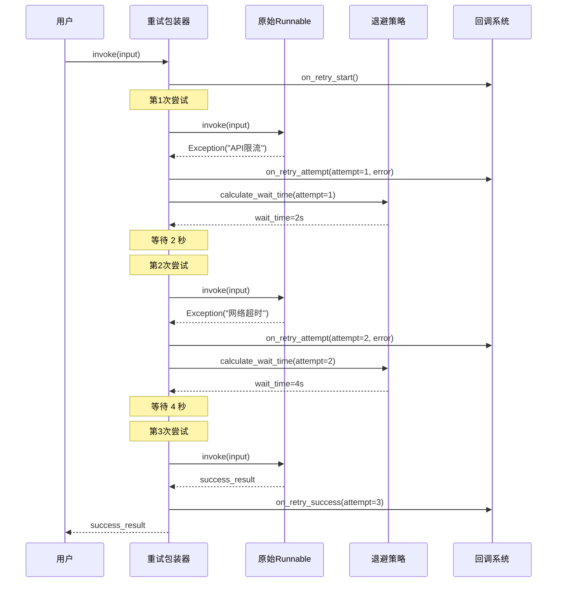

## 4. 并发和批处理架构

### 4.1 批处理执行流程

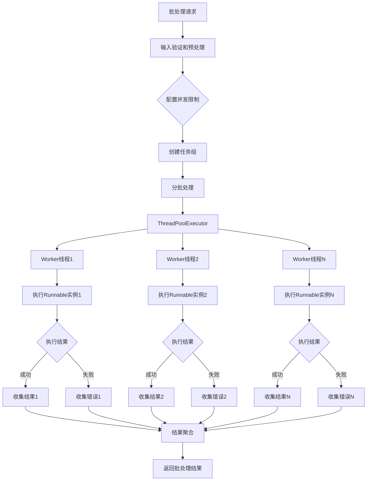

### 4.2 异步执行架构

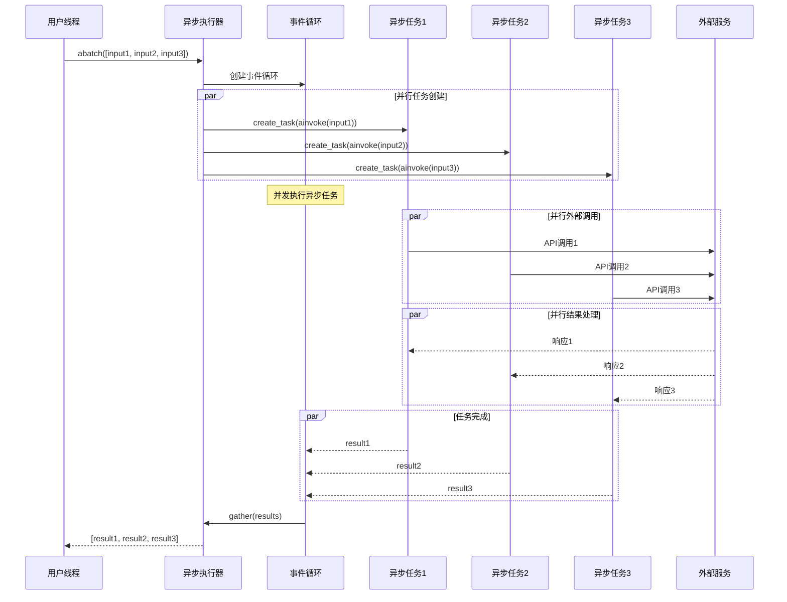

## 5. 缓存系统架构

### 5.1 LLM缓存架构图

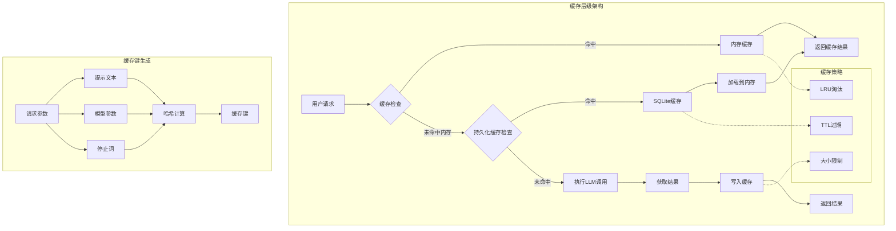

### 5.2 缓存使用时序图

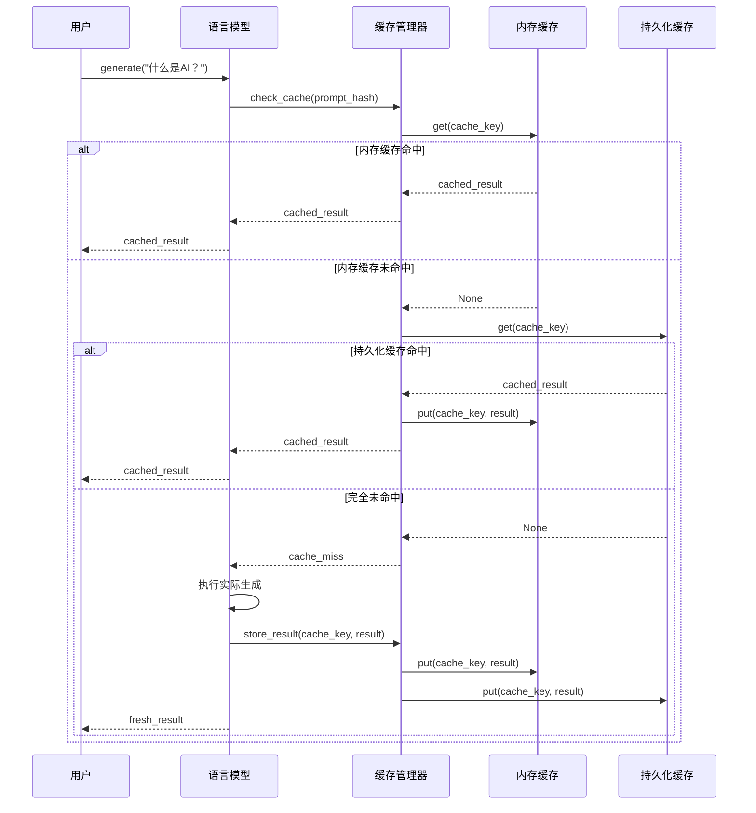

## 6. 监控和可观测性架构

### 6.1 LangSmith集成架构

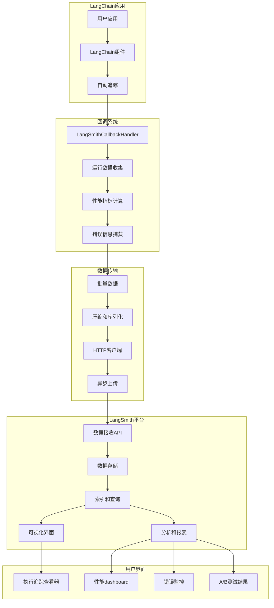

### 6.2 性能监控数据流

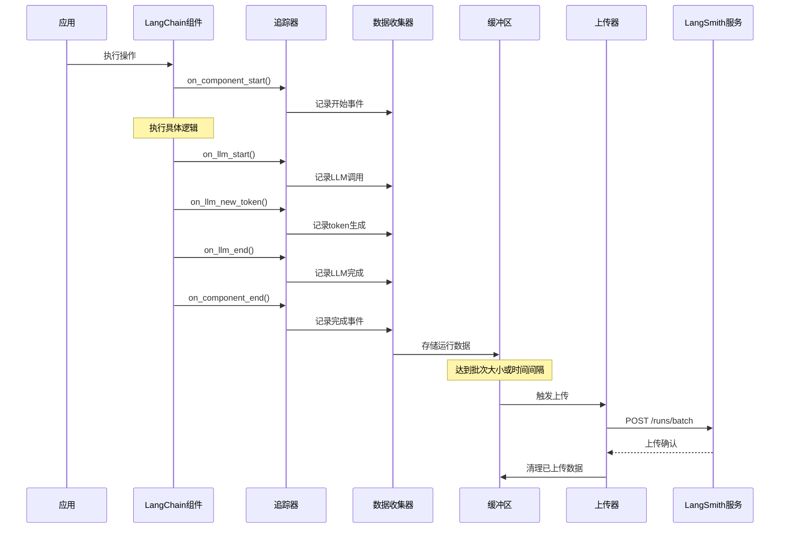

## 7. 安全和权限控制架构

### 7.1 安全检查流程

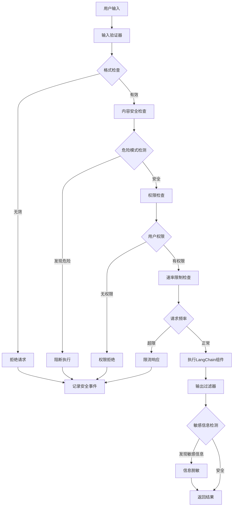

### 7.2 权限控制时序图

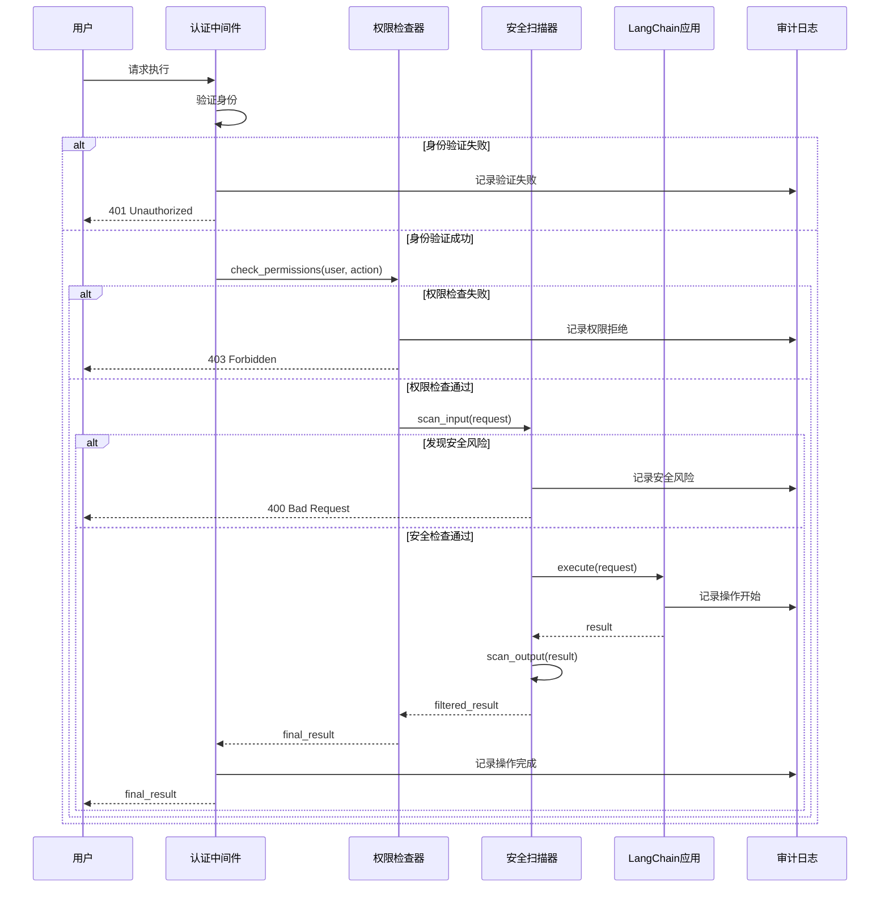

## 8. 总结

LangChain的架构设计体现了现代软件架构的最佳实践：

### 8.1 核心设计原则
1. **模块化**: 清晰的模块边界和职责分离
2. **可扩展性**: 基于接口的设计支持无限扩展
3. **可观测性**: 全面的监控和追踪能力
4. **容错性**: 完善的错误处理和恢复机制
5. **性能优化**: 多层缓存和并发处理
6. **安全性**: 全方位的安全检查和权限控制

### 8.2 架构优势
1. **统一接口**: Runnable提供一致的执行模式
2. **组合灵活**: LCEL支持复杂的工作流编排
3. **异步优先**: 原生支持异步和并发执行
4. **插件生态**: 丰富的合作伙伴集成
5. **开发友好**: 完整的开发和调试工具链

这些架构图和时序图为理解LangChain的内部工作机制提供了清晰的视觉指南，有助于开发者更好地设计和优化基于LangChain的应用系统。
