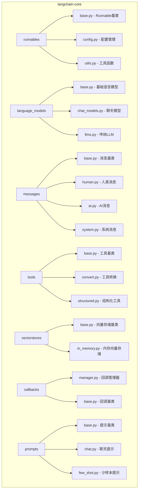

## 1. Core模块 (langchain-core)

Core模块是LangChain生态系统的基础，定义了所有核心抽象和接口。

### 1.1 模块架构图



### 1.2 Runnable接口详解

#### 1.2.1 核心接口定义

```python
# libs/core/langchain_core/runnables/base.py

from abc import ABC, abstractmethod
from typing import Any, Optional, List, Iterator, AsyncIterator, Union, Dict
from langchain_core.callbacks import Callbacks
from langchain_core.runnables.config import RunnableConfig

class Runnable(ABC, Generic[Input, Output]):
    """
    LangChain的核心抽象类，定义了统一的执行接口
    
    所有LangChain组件都应该实现这个接口，包括：
    - 语言模型 (LLMs, Chat Models)
    - 提示模板 (Prompt Templates) 
    - 输出解析器 (Output Parsers)
    - 检索器 (Retrievers)
    - 工具 (Tools)
    - 链 (Chains)
    
    核心方法:
    - invoke: 同步单次调用
    - ainvoke: 异步单次调用
    - batch: 批量调用
    - abatch: 异步批量调用
    - stream: 流式调用
    - astream: 异步流式调用
    """
    
    @abstractmethod
    def invoke(
        self, 
        input: Input, 
        config: Optional[RunnableConfig] = None,
        **kwargs: Any
    ) -> Output:
        """
        同步执行单个输入
        
        Args:
            input: 输入数据，类型由具体实现定义
            config: 运行时配置，包含回调、标签、元数据等
            **kwargs: 额外的关键字参数
            
        Returns:
            处理结果，类型由具体实现定义
            
        Raises:
            NotImplementedError: 子类必须实现此方法
        """
        raise NotImplementedError()
    
    async def ainvoke(
        self, 
        input: Input, 
        config: Optional[RunnableConfig] = None,
        **kwargs: Any
    ) -> Output:
        """
        异步执行单个输入
        
        默认实现会在线程池中执行同步的invoke方法
        子类可以重写此方法提供原生异步实现
        
        Args:
            input: 输入数据
            config: 运行时配置
            **kwargs: 额外的关键字参数
            
        Returns:
            处理结果
        """
        # 默认实现：在线程池中执行同步方法
        return await run_in_executor(
            get_executor_for_config(config),
            self.invoke,
            input,
            config,
            **kwargs
        )
    
    def batch(
        self,
        inputs: List[Input],
        config: Optional[Union[RunnableConfig, List[RunnableConfig]]] = None,
        *,
        max_concurrency: Optional[int] = None,
        **kwargs: Any
    ) -> List[Output]:
        """
        批量处理多个输入
        
        默认实现使用ThreadPoolExecutor并行执行invoke
        子类可以重写此方法提供优化的批量处理
        
        Args:
            inputs: 输入列表
            config: 配置或配置列表
            max_concurrency: 最大并发数
            **kwargs: 额外参数
            
        Returns:
            处理结果列表
        """
        if max_concurrency is None:
            max_concurrency = len(inputs)
        
        configs = get_config_list(config, len(inputs))
        
        with ThreadPoolExecutor(max_workers=max_concurrency) as executor:
            futures = [
                executor.submit(self.invoke, input_item, config_item, **kwargs)
                for input_item, config_item in zip(inputs, configs)
            ]
            return [future.result() for future in futures]
    
    def stream(
        self,
        input: Input,
        config: Optional[RunnableConfig] = None,
        **kwargs: Any
    ) -> Iterator[Output]:
        """
        流式处理单个输入
        
        默认实现直接yield invoke的结果
        支持流式处理的组件应该重写此方法
        
        Args:
            input: 输入数据
            config: 运行时配置
            **kwargs: 额外参数
            
        Yields:
            流式输出块
        """
        # 默认实现：直接返回完整结果
        yield self.invoke(input, config, **kwargs)
    
    async def astream(
        self,
        input: Input,
        config: Optional[RunnableConfig] = None,
        **kwargs: Any
    ) -> AsyncIterator[Output]:
        """
        异步流式处理单个输入
        
        默认实现在线程池中执行stream方法
        
        Args:
            input: 输入数据
            config: 运行时配置
            **kwargs: 额外参数
            
        Yields:
            异步流式输出块
        """
        # 默认实现：在线程池中执行同步stream
        async for chunk in self._astream_from_sync_stream(
            self.stream(input, config, **kwargs), config
        ):
            yield chunk
    
    # 组合操作符重载
    def __or__(self, other: Union["Runnable", Callable]) -> "RunnableSequence":
        """
        管道操作符重载，用于创建链式组合
        
        Example:
            chain = prompt | model | parser
        """
        return RunnableSequence(first=self, last=coerce_to_runnable(other))
    
    def __ror__(self, other: Union["Runnable", Callable]) -> "RunnableSequence":
        """反向管道操作符"""
        return RunnableSequence(first=coerce_to_runnable(other), last=self)
    
    # 配置方法
    def with_config(self, **kwargs: Any) -> "RunnableBinding":
        """
        返回绑定了特定配置的新实例
        
        Args:
            **kwargs: 配置参数
            
        Returns:
            绑定了配置的Runnable实例
        """
        return RunnableBinding(bound=self, kwargs=kwargs)
    
    def with_retry(
        self,
        *,
        retry_if_exception_type: tuple = (Exception,),
        wait_exponential_jitter: bool = True,
        stop_after_attempt: int = 3,
    ) -> "RunnableRetry":
        """
        返回带重试机制的新实例
        
        Args:
            retry_if_exception_type: 需要重试的异常类型
            wait_exponential_jitter: 是否使用指数退避
            stop_after_attempt: 最大重试次数
            
        Returns:
            带重试机制的Runnable实例
        """
        return RunnableRetry(
            bound=self,
            retry_if_exception_type=retry_if_exception_type,
            wait_exponential_jitter=wait_exponential_jitter,
            stop_after_attempt=stop_after_attempt,
        )
    
    def with_fallbacks(
        self,
        fallbacks: List["Runnable"],
        *,
        exception_to_check: tuple = (Exception,),
    ) -> "RunnableWithFallbacks":
        """
        返回带回退机制的新实例
        
        Args:
            fallbacks: 备用Runnable列表
            exception_to_check: 触发回退的异常类型
            
        Returns:
            带回退机制的Runnable实例
        """
        return RunnableWithFallbacks(
            runnable=self,
            fallbacks=fallbacks,
            exception_to_check=exception_to_check,
        )
```

#### 1.2.2 组合模式实现

```python
# libs/core/langchain_core/runnables/base.py

class RunnableSequence(RunnableSerializable[Input, Output]):
    """
    顺序执行的Runnable组合
    
    实现链式调用模式: A | B | C
    其中A的输出作为B的输入，B的输出作为C的输入
    """
    
    def __init__(
        self,
        first: Runnable[Input, Any],
        last: Runnable[Any, Output],
        *,
        name: Optional[str] = None
    ):
        """
        初始化序列
        
        Args:
            first: 第一个Runnable组件
            last: 最后一个Runnable组件（可能是子序列）
            name: 序列名称
        """
        super().__init__(name=name)
        self.first = first
        self.last = last
        
        # 展开嵌套序列以优化执行
        if isinstance(last, RunnableSequence):
            self.steps = [first] + last.steps
        else:
            self.steps = [first, last]
    
    @property
    def InputType(self) -> type:
        """获取输入类型"""
        return self.first.InputType
    
    @property 
    def OutputType(self) -> type:
        """获取输出类型"""
        return self.last.OutputType
    
    def invoke(
        self, 
        input: Input, 
        config: Optional[RunnableConfig] = None,
        **kwargs: Any
    ) -> Output:
        """
        顺序执行所有步骤
        
        Args:
            input: 初始输入
            config: 运行配置
            **kwargs: 额外参数
            
        Returns:
            最终输出
        """
        # 设置回调管理器
        callback_manager = get_callback_manager_for_config(config)
        run_manager = callback_manager.on_chain_start(
            serialized=self.to_json(),
            inputs=input,
            name=config.get("run_name") if config else None,
        )
        
        try:
            # 逐步执行
            current_input = input
            for i, step in enumerate(self.steps):
                # 为每个步骤创建子配置
                step_config = patch_config(
                    config,
                    callbacks=run_manager.get_child(f"seq:step:{i+1}"),
                )
                current_input = step.invoke(current_input, step_config, **kwargs)
            
            # 记录成功完成
            run_manager.on_chain_end(current_input)
            return current_input
            
        except Exception as e:
            # 记录错误
            run_manager.on_chain_error(e)
            raise
    
    def stream(
        self,
        input: Input,
        config: Optional[RunnableConfig] = None,
        **kwargs: Any
    ) -> Iterator[Output]:
        """
        流式执行序列
        
        只有最后一步支持流式输出时，整个序列才能流式输出
        否则只在最后一步开始流式输出
        """
        # 执行除最后一步外的所有步骤
        current_input = input
        for step in self.steps[:-1]:
            current_input = step.invoke(current_input, config, **kwargs)
        
        # 流式执行最后一步
        yield from self.steps[-1].stream(current_input, config, **kwargs)

class RunnableParallel(RunnableSerializable[Input, Dict[str, Any]]):
    """
    并行执行的Runnable组合
    
    同时执行多个Runnable，将结果合并为字典
    Example: {"summary": summarizer, "analysis": analyzer}
    """
    
    def __init__(self, steps_dict: Dict[str, Runnable]):
        """
        初始化并行组合
        
        Args:
            steps_dict: 键为输出字段名，值为对应的Runnable
        """
        super().__init__()
        self.steps_dict = steps_dict
    
    def invoke(
        self,
        input: Input,
        config: Optional[RunnableConfig] = None,
        **kwargs: Any
    ) -> Dict[str, Any]:
        """
        并行执行所有步骤
        
        Args:
            input: 输入（会分发给所有并行步骤）
            config: 运行配置
            **kwargs: 额外参数
            
        Returns:
            包含所有步骤结果的字典
        """
        callback_manager = get_callback_manager_for_config(config)
        run_manager = callback_manager.on_chain_start(
            serialized=self.to_json(),
            inputs=input,
        )
        
        try:
            with ThreadPoolExecutor() as executor:
                # 提交所有任务
                future_to_key = {
                    executor.submit(
                        step.invoke, 
                        input, 
                        patch_config(config, callbacks=run_manager.get_child(f"par:{key}")),
                        **kwargs
                    ): key
                    for key, step in self.steps_dict.items()
                }
                
                # 收集结果
                results = {}
                for future in as_completed(future_to_key):
                    key = future_to_key[future]
                    try:
                        results[key] = future.result()
                    except Exception as e:
                        results[key] = e
                        # 继续执行其他任务
            
            run_manager.on_chain_end(results)
            return results
            
        except Exception as e:
            run_manager.on_chain_error(e)
            raise
```

### 1.3 配置管理系统

#### 1.3.1 RunnableConfig定义

```python
# libs/core/langchain_core/runnables/config.py

from typing import Any, Dict, List, Optional, Union, Callable
from uuid import UUID
from langchain_core.callbacks import BaseCallbackHandler

class RunnableConfig(TypedDict, total=False):
    """
    Runnable执行的配置参数
    
    这个配置会在整个执行链中传递，允许控制：
    - 回调处理
    - 执行标签和元数据
    - 运行标识
    - 递归限制
    - 并发控制
    - 可配置参数
    """
    
    # 回调相关
    callbacks: Optional[List[BaseCallbackHandler]]
    """回调处理器列表，用于监控执行过程"""
    
    # 追踪相关
    tags: Optional[List[str]]
    """标签列表，用于分类和过滤运行记录"""
    
    metadata: Optional[Dict[str, Any]]
    """元数据字典，用于存储额外的运行信息"""
    
    run_name: Optional[str]
    """运行名称，用于标识特定的执行实例"""
    
    run_id: Optional[UUID]
    """运行ID，全局唯一标识符"""
    
    # 执行控制
    max_concurrency: Optional[int]
    """最大并发数，控制并行执行的任务数量"""
    
    recursion_limit: Optional[int]
    """递归深度限制，防止无限递归"""
    
    # 可配置参数
    configurable: Optional[Dict[str, Any]]
    """运行时可配置的参数字典"""

def ensure_config(config: Optional[RunnableConfig] = None) -> RunnableConfig:
    """
    确保配置对象存在
    
    Args:
        config: 可选的配置对象
        
    Returns:
        有效的配置对象
    """
    if config is None:
        return RunnableConfig()
    return config

def patch_config(
    config: Optional[RunnableConfig],
    *,
    deep_copy_locals: Optional[List[str]] = None,
    **kwargs: Any
) -> RunnableConfig:
    """
    修补配置对象，返回新的配置
    
    Args:
        config: 原始配置
        deep_copy_locals: 需要深拷贝的字段列表
        **kwargs: 要更新的配置项
        
    Returns:
        更新后的新配置对象
    """
    config = ensure_config(config)
    new_config = config.copy()
    
    for key, value in kwargs.items():
        if key in deep_copy_locals and value is not None:
            import copy
            new_config[key] = copy.deepcopy(value)
        else:
            new_config[key] = value
    
    return new_config

def merge_configs(*configs: Optional[RunnableConfig]) -> RunnableConfig:
    """
    合并多个配置对象
    
    Args:
        *configs: 要合并的配置对象列表
        
    Returns:
        合并后的配置对象
    """
    merged = RunnableConfig()
    
    for config in configs:
        if config is not None:
            # 合并callbacks
            if config.get("callbacks"):
                merged_callbacks = merged.get("callbacks", [])
                merged_callbacks.extend(config["callbacks"])
                merged["callbacks"] = merged_callbacks
            
            # 合并tags
            if config.get("tags"):
                merged_tags = merged.get("tags", [])
                merged_tags.extend(config["tags"])
                merged["tags"] = merged_tags
            
            # 合并metadata
            if config.get("metadata"):
                merged_metadata = merged.get("metadata", {})
                merged_metadata.update(config["metadata"])
                merged["metadata"] = merged_metadata
            
            # 其他字段直接覆盖
            for key in ["run_name", "run_id", "max_concurrency", "recursion_limit"]:
                if config.get(key) is not None:
                    merged[key] = config[key]
            
            # 合并configurable
            if config.get("configurable"):
                merged_configurable = merged.get("configurable", {})
                merged_configurable.update(config["configurable"])
                merged["configurable"] = merged_configurable
    
    return merged
```

## 2. 语言模型模块 (Language Models)

### 2.1 模块架构

```mermaid
classDiagram
    class BaseLanguageModel {
        <<abstract>>
        +cache: BaseCache
        +verbose: bool
        +callbacks: Callbacks
        +tags: List[str]
        +metadata: Dict[str, Any]
        +invoke(input) Any
        +ainvoke(input) Any
        +batch(inputs) List[Any]
        +stream(input) Iterator[Any]
        +get_token_ids(text) List[int]
    }
    
    class BaseLLM {
        +generate(prompts) LLMResult
        +agenerate(prompts) LLMResult
        +_call(prompt, stop) str
        +_acall(prompt, stop) str
        +_stream(prompt, stop) Iterator[str]
        +_astream(prompt, stop) AsyncIterator[str]
        +get_sub_prompts(params) List[List[str]]
    }
    
    class BaseChatModel {
        +_generate(messages) ChatResult
        +_agenerate(messages) ChatResult
        +_stream(messages) Iterator[ChatGenerationChunk]
        +_astream(messages) AsyncIterator[ChatGenerationChunk]
        +bind_tools(tools) BaseChatModel
        +with_structured_output(schema) Runnable
    }
    
    BaseLanguageModel <|-- BaseLLM
    BaseLanguageModel <|-- BaseChatModel
    
    note for BaseLanguageModel : "实现Runnable接口\n提供缓存、回调、批处理等功能"
    note for BaseLLM : "传统文本生成模型\n输入输出都是字符串"
    note for BaseChatModel : "对话模型\n输入输出是消息对象"
```

### 2.2 BaseChatModel详解

```python
# libs/core/langchain_core/language_models/chat_models.py

from typing import List, Optional, Dict, Any, Union, Iterator, AsyncIterator
from abc import abstractmethod
from langchain_core.language_models.base import BaseLanguageModel
from langchain_core.messages import BaseMessage, BaseMessageChunk
from langchain_core.outputs import ChatResult, ChatGeneration, ChatGenerationChunk
from langchain_core.tools import BaseTool

class BaseChatModel(BaseLanguageModel[BaseMessage], ABC):
    """
    聊天模型基类
    
    定义了与聊天模型交互的标准接口
    支持多种消息类型：HumanMessage, AIMessage, SystemMessage等
    """
    
    @abstractmethod
    def _generate(
        self,
        messages: List[BaseMessage],
        stop: Optional[List[str]] = None,
        run_manager: Optional[CallbackManagerForLLMRun] = None,
        **kwargs: Any,
    ) -> ChatResult:
        """
        生成聊天回复的核心方法
        
        Args:
            messages: 消息列表，包含对话历史
            stop: 停止词列表
            run_manager: 回调管理器
            **kwargs: 模型特定的参数
            
        Returns:
            包含生成结果的ChatResult对象
            
        Note:
            这是子类必须实现的核心方法
        """
        pass
    
    def _stream(
        self,
        messages: List[BaseMessage],
        stop: Optional[List[str]] = None,
        run_manager: Optional[CallbackManagerForLLMRun] = None,
        **kwargs: Any,
    ) -> Iterator[ChatGenerationChunk]:
        """
        流式生成聊天回复
        
        Args:
            messages: 消息列表
            stop: 停止词列表  
            run_manager: 回调管理器
            **kwargs: 额外参数
            
        Yields:
            ChatGenerationChunk对象
            
        Note:
            默认实现直接返回_generate的结果
            支持流式的模型应该重写此方法
        """
        result = self._generate(messages, stop, run_manager, **kwargs)
        for generation in result.generations:
            yield ChatGenerationChunk(
                message=generation.message,
                generation_info=generation.generation_info,
            )
    
    def bind_tools(
        self,
        tools: List[Union[Dict[str, Any], type, Callable, BaseTool]],
        **kwargs: Any,
    ) -> "BaseChatModel":
        """
        绑定工具到聊天模型
        
        返回一个能够调用指定工具的新模型实例
        
        Args:
            tools: 工具列表，支持多种格式
            **kwargs: 工具绑定的额外参数
            
        Returns:
            绑定了工具的新模型实例
            
        Raises:
            NotImplementedError: 如果模型不支持工具调用
        """
        formatted_tools = [self._convert_to_tool_spec(tool) for tool in tools]
        return self.bind(tools=formatted_tools, **kwargs)
    
    def with_structured_output(
        self,
        schema: Union[Dict, type],
        *,
        method: Literal["function_calling", "json_mode"] = "function_calling",
        **kwargs: Any,
    ) -> Runnable[BaseMessage, Union[Dict, BaseModel]]:
        """
        创建结构化输出的模型包装器
        
        Args:
            schema: 输出结构的定义（Pydantic模型或JSON Schema）
            method: 结构化输出的实现方法
            **kwargs: 额外配置参数
            
        Returns:
            返回结构化数据的Runnable实例
        """
        if method == "function_calling":
            return self._create_function_calling_wrapper(schema, **kwargs)
        elif method == "json_mode":
            return self._create_json_mode_wrapper(schema, **kwargs)
        else:
            raise ValueError(f"Unsupported method: {method}")
    
    def invoke(
        self,
        input: Union[
            PromptValue,
            str,
            List[Union[BaseMessage, List[BaseMessage], Tuple[str, str], str, Dict[str, Any]]]
        ],
        config: Optional[RunnableConfig] = None,
        **kwargs: Any,
    ) -> BaseMessage:
        """
        调用聊天模型生成回复
        
        Args:
            input: 输入，支持多种格式
            config: 运行配置
            **kwargs: 额外参数
            
        Returns:
            生成的消息
        """
        # 标准化输入为消息列表
        messages = self._convert_input_to_messages(input)
        
        # 获取回调管理器
        config = ensure_config(config)
        callback_manager = get_callback_manager_for_config(config)
        run_manager = callback_manager.on_llm_start(
            serialized=self.to_json(),
            prompts=[self._messages_to_string(messages)],
            **kwargs,
        )
        
        try:
            # 执行生成
            result = self._generate(messages, run_manager=run_manager, **kwargs)
            
            # 处理回调
            if result.llm_output is not None:
                run_manager.on_llm_end(result)
            
            return result.generations[0].message
            
        except Exception as e:
            run_manager.on_llm_error(e)
            raise
    
    def stream(
        self,
        input: Union[PromptValue, str, List[BaseMessage]],
        config: Optional[RunnableConfig] = None,
        **kwargs: Any,
    ) -> Iterator[BaseMessageChunk]:
        """
        流式调用聊天模型
        
        Args:
            input: 输入
            config: 运行配置
            **kwargs: 额外参数
            
        Yields:
            消息块
        """
        messages = self._convert_input_to_messages(input)
        
        config = ensure_config(config)
        callback_manager = get_callback_manager_for_config(config)
        run_manager = callback_manager.on_llm_start(
            serialized=self.to_json(),
            prompts=[self._messages_to_string(messages)],
            **kwargs,
        )
        
        try:
            generation_chunk = None
            for chunk in self._stream(messages, run_manager=run_manager, **kwargs):
                # 累积chunk用于最终回调
                if generation_chunk is None:
                    generation_chunk = chunk
                else:
                    generation_chunk += chunk
                
                # 触发新token回调
                run_manager.on_llm_new_token(
                    chunk.message.content if chunk.message.content else ""
                )
                
                yield chunk.message
            
            # 触发结束回调
            if generation_chunk is not None:
                run_manager.on_llm_end(
                    LLMResult(generations=[[generation_chunk]])
                )
                
        except Exception as e:
            run_manager.on_llm_error(e)
            raise
    
    def _convert_input_to_messages(self, input: Any) -> List[BaseMessage]:
        """
        将各种输入格式转换为标准消息列表
        
        支持的输入格式：
        - str: 转换为HumanMessage
        - List[BaseMessage]: 直接使用
        - PromptValue: 转换为消息
        - 其他格式...
        """
        if isinstance(input, str):
            return [HumanMessage(content=input)]
        elif isinstance(input, list):
            return convert_to_messages(input)
        elif isinstance(input, PromptValue):
            return input.to_messages()
        else:
            raise ValueError(f"Unsupported input type: {type(input)}")
    
    def _convert_to_tool_spec(self, tool: Any) -> Dict[str, Any]:
        """将工具转换为模型可理解的规格"""
        if isinstance(tool, BaseTool):
            return {
                "type": "function",
                "function": {
                    "name": tool.name,
                    "description": tool.description,
                    "parameters": tool.args_schema.model_json_schema() if tool.args_schema else {}
                }
            }
        # 处理其他工具格式...
        raise ValueError(f"Unsupported tool type: {type(tool)}")
```

### 2.3 消息系统

LangChain的消息系统定义了统一的消息格式，支持多种消息类型。详细的消息类定义和结构请参考《关键数据结构与UML图》文档。

## 3. 工具系统模块 (Tools)

### 3.1 模块架构

```mermaid
graph TB
    subgraph "Tools System"
        A[BaseTool] --> B[Tool]
        A --> C[StructuredTool]
        
        D[@tool装饰器] --> C
        E[convert_runnable_to_tool] --> C
        
        F[BaseToolkit] --> G[具体工具包]
        
        H[ToolCall] --> I[工具调用执行]
        J[ToolMessage] --> I
        
        K[错误处理] --> L[ToolException]
    end
    
    subgraph "工具类型"
        M[函数工具]
        N[API工具]
        O[数据库工具]
        P[文件系统工具]
        Q[网络工具]
    end
    
    A --> M
    A --> N
    A --> O
    A --> P
    A --> Q
```

### 3.2 BaseTool详解

```python
# libs/core/langchain_core/tools/base.py

from typing import Any, Awaitable, Callable, Dict, Optional, Type, Union
from abc import ABC, abstractmethod
from pydantic import BaseModel, Field
from langchain_core.runnables import RunnableSerializable
from langchain_core.callbacks import CallbackManagerForToolRun, AsyncCallbackManagerForToolRun
from langchain_core.messages import ToolCall

class BaseTool(RunnableSerializable[Union[str, Dict, ToolCall], Any]):
    """
    工具基类
    
    定义了LangChain工具的标准接口
    工具是Agent可以调用的外部功能
    """
    
    name: str
    """工具名称，必须唯一且描述性强"""
    
    description: str = ""
    """工具描述，告诉模型何时以及如何使用这个工具"""
    
    args_schema: Optional[Type[BaseModel]] = Field(default=None, exclude=True)
    """参数模式，定义工具接受的参数结构"""
    
    return_direct: bool = False
    """是否直接返回工具结果而不经过Agent的后处理"""
    
    verbose: bool = False
    """是否启用详细日志输出"""
    
    callbacks: Optional[List[BaseCallbackHandler]] = Field(default=None, exclude=True)
    """回调处理器列表"""
    
    callback_manager: Optional[BaseCallbackManager] = Field(default=None, exclude=True)
    """回调管理器"""
    
    tags: Optional[List[str]] = Field(default=None, exclude=True)
    """工具标签，用于分类和过滤"""
    
    metadata: Optional[Dict[str, Any]] = Field(default=None, exclude=True)
    """工具元数据"""
    
    handle_tool_error: Optional[
        Union[bool, str, Callable[[ToolException], str]]
    ] = Field(default=False, exclude=True)
    """错误处理策略"""
    
    handle_validation_error: Optional[
        Union[bool, str, Callable[[ValidationError], str]]
    ] = Field(default=False, exclude=True)
    """验证错误处理策略"""
    
    # 核心抽象方法
    @abstractmethod
    def _run(
        self,
        *args: Any,
        run_manager: Optional[CallbackManagerForToolRun] = None,
        **kwargs: Any,
    ) -> Any:
        """
        同步执行工具
        
        Args:
            *args: 位置参数
            run_manager: 运行管理器
            **kwargs: 关键字参数
            
        Returns:
            工具执行结果
            
        Note:
            子类必须实现此方法
        """
        pass
    
    async def _arun(
        self,
        *args: Any,
        run_manager: Optional[AsyncCallbackManagerForToolRun] = None,
        **kwargs: Any,
    ) -> Any:
        """
        异步执行工具
        
        默认实现会在线程池中执行同步版本
        子类可以重写提供原生异步实现
        
        Args:
            *args: 位置参数
            run_manager: 异步运行管理器
            **kwargs: 关键字参数
            
        Returns:
            工具执行结果
        """
        return await run_in_executor(
            None,
            self._run,
            *args,
            run_manager=run_manager.get_sync() if run_manager else None,
            **kwargs,
        )
    
    def invoke(
        self,
        input: Union[str, Dict, ToolCall],
        config: Optional[RunnableConfig] = None,
        **kwargs: Any,
    ) -> Any:
        """
        调用工具执行
        
        Args:
            input: 工具输入，支持多种格式
            config: 运行配置
            **kwargs: 额外参数
            
        Returns:
            工具执行结果
        """
        config = ensure_config(config)
        callback_manager = get_callback_manager_for_config(config)
        run_manager = callback_manager.on_tool_start(
            serialized=self.to_json(),
            input_str=str(input),
            **kwargs,
        )
        
        try:
            # 解析输入参数
            tool_args, tool_kwargs = self._to_args_and_kwargs(input)
            
            # 添加运行管理器到参数中
            if run_manager:
                tool_kwargs["run_manager"] = run_manager
            
            # 执行工具
            observation = self._run(*tool_args, **tool_kwargs)
            
            # 处理执行结果
            run_manager.on_tool_end(observation)
            return observation
            
        except ToolException as e:
            # 处理工具异常
            if not self.handle_tool_error:
                run_manager.on_tool_error(e)
                raise
            
            observation = self._handle_tool_error(e)
            run_manager.on_tool_end(observation)
            return observation
            
        except ValidationError as e:
            # 处理验证错误
            if not self.handle_validation_error:
                run_manager.on_tool_error(e)
                raise
            
            observation = self._handle_validation_error(e)
            run_manager.on_tool_end(observation)
            return observation
            
        except Exception as e:
            run_manager.on_tool_error(e)
            raise
    
    async def ainvoke(
        self,
        input: Union[str, Dict, ToolCall],
        config: Optional[RunnableConfig] = None,
        **kwargs: Any,
    ) -> Any:
        """异步调用工具"""
        config = ensure_config(config)
        callback_manager = get_async_callback_manager_for_config(config)
        run_manager = await callback_manager.on_tool_start(
            serialized=self.to_json(),
            input_str=str(input),
            **kwargs,
        )
        
        try:
            tool_args, tool_kwargs = self._to_args_and_kwargs(input)
            
            if run_manager:
                tool_kwargs["run_manager"] = run_manager
            
            observation = await self._arun(*tool_args, **tool_kwargs)
            await run_manager.on_tool_end(observation)
            return observation
            
        except Exception as e:
            await run_manager.on_tool_error(e)
            if isinstance(e, (ToolException, ValidationError)):
                return self._handle_error(e)
            raise
    
    def _to_args_and_kwargs(
        self, tool_input: Union[str, Dict, ToolCall]
    ) -> Tuple[Tuple, Dict]:
        """
        将工具输入转换为参数和关键字参数
        
        Args:
            tool_input: 工具输入
            
        Returns:
            (args, kwargs) 元组
        """
        if isinstance(tool_input, str):
            # 简单字符串输入
            if self.args_schema and len(self.args_schema.__fields__) == 1:
                # 单参数工具
                field_name = next(iter(self.args_schema.__fields__))
                return (), {field_name: tool_input}
            else:
                # 无参数模式或多参数，作为单一输入
                return (tool_input,), {}
                
        elif isinstance(tool_input, dict):
            # 字典输入，解析为关键字参数
            if self.args_schema:
                # 验证参数
                validated_args = self.args_schema(**tool_input)
                return (), validated_args.dict()
            else:
                return (), tool_input
                
        elif isinstance(tool_input, ToolCall):
            # ToolCall对象
            return self._to_args_and_kwargs(tool_input.args)
            
        else:
            # 其他类型，直接作为位置参数
            return (tool_input,), {}
    
    def _handle_tool_error(self, error: ToolException) -> str:
        """处理工具异常"""
        if callable(self.handle_tool_error):
            return self.handle_tool_error(error)
        elif isinstance(self.handle_tool_error, str):
            return self.handle_tool_error
        else:
            return f"Tool execution error: {error}"
    
    def _handle_validation_error(self, error: ValidationError) -> str:
        """处理验证错误"""
        if callable(self.handle_validation_error):
            return self.handle_validation_error(error)
        elif isinstance(self.handle_validation_error, str):
            return self.handle_validation_error
        else:
            return f"Validation error: {error}"
    
    @property
    def args(self) -> Dict[str, Any]:
        """获取工具参数的JSON Schema"""
        if self.args_schema:
            return self.args_schema.schema()
        else:
            return {}
    
    @property
    def is_single_input(self) -> bool:
        """判断是否为单输入工具"""
        return (
            self.args_schema is None
            or len(self.args_schema.__fields__) <= 1
        )

class ToolException(Exception):
    """
    工具执行异常
    
    这种异常允许工具在执行失败时向Agent发送错误信息
    而不会终止Agent的执行流程
    """
    pass
```

### 3.3 @tool装饰器实现

```python
# libs/core/langchain_core/tools/convert.py

from typing import Any, Awaitable, Callable, Optional, Type, Union, get_type_hints
from functools import wraps
from inspect import signature
from pydantic import BaseModel, create_model
from langchain_core.tools.simple import Tool
from langchain_core.tools.structured import StructuredTool

def tool(
    name_or_callable: Union[str, Callable],
    *,
    description: Optional[str] = None,
    return_direct: bool = False,
    args_schema: Optional[Type[BaseModel]] = None,
    infer_schema: bool = True,
    parse_docstring: bool = False,
    error_on_invalid_docstring: bool = True,
    **kwargs: Any,
) -> Union[Callable[[Callable], BaseTool], BaseTool]:
    """
    将函数转换为LangChain工具的装饰器
    
    支持多种使用方式：
    1. @tool - 自动推断参数和描述
    2. @tool("工具名") - 指定工具名
    3. @tool(description="描述") - 指定描述
    4. @tool(args_schema=MySchema) - 指定参数模式
    
    Args:
        name_or_callable: 工具名称或被装饰的函数
        description: 工具描述
        return_direct: 是否直接返回结果
        args_schema: 参数模式类
        infer_schema: 是否自动推断参数模式
        parse_docstring: 是否解析docstring获取描述
        error_on_invalid_docstring: docstring解析失败是否报错
        **kwargs: 额外参数
        
    Returns:
        BaseTool实例或装饰器函数
    """
    
    def _create_tool_from_function(func: Callable) -> BaseTool:
        """从函数创建工具"""
        
        # 获取函数签名
        func_signature = signature(func)
        func_name = name_or_callable if isinstance(name_or_callable, str) else func.__name__
        
        # 获取描述
        tool_description = description
        if tool_description is None:
            if parse_docstring and func.__doc__:
                tool_description = _parse_function_docstring(func.__doc__)
            else:
                tool_description = func.__doc__ or f"Tool for {func_name}"
        
        # 创建或推断参数模式
        tool_args_schema = args_schema
        if tool_args_schema is None and infer_schema:
            tool_args_schema = _create_schema_from_function(func, func_name)
        
        # 检查是否为异步函数
        if asyncio.iscoroutinefunction(func):
            # 异步工具
            return StructuredTool(
                name=func_name,
                description=tool_description,
                coroutine=func,
                args_schema=tool_args_schema,
                return_direct=return_direct,
                **kwargs,
            )
        else:
            # 同步工具
            if tool_args_schema:
                return StructuredTool(
                    name=func_name,
                    description=tool_description,
                    func=func,
                    args_schema=tool_args_schema,
                    return_direct=return_direct,
                    **kwargs,
                )
            else:
                return Tool(
                    name=func_name,
                    description=tool_description,
                    func=func,
                    return_direct=return_direct,
                    **kwargs,
                )
    
    # 装饰器逻辑
    if callable(name_or_callable):
        # 直接使用 @tool
        return _create_tool_from_function(name_or_callable)
    else:
        # 使用 @tool("名称") 或 @tool(description="...")
        def decorator(func: Callable) -> BaseTool:
            return _create_tool_from_function(func)
        return decorator

def _create_schema_from_function(func: Callable, name: str) -> Type[BaseModel]:
    """
    从函数签名创建Pydantic参数模式
    
    Args:
        func: 目标函数
        name: 模式类名
        
    Returns:
        Pydantic模型类
    """
    sig = signature(func)
    type_hints = get_type_hints(func)
    
    fields = {}
    for param_name, param in sig.parameters.items():
        # 跳过特殊参数
        if param_name in FILTERED_ARGS:
            continue
        
        # 获取参数类型
        param_type = type_hints.get(param_name, Any)
        
        # 获取默认值
        default_value = ... if param.default is param.empty else param.default
        
        # 创建字段定义
        if param.annotation and hasattr(param.annotation, '__metadata__'):
            # 处理Annotated类型
            fields[param_name] = (param_type, Field(default=default_value))
        else:
            fields[param_name] = (param_type, default_value)
    
    # 创建动态模型
    return create_model(name, **fields)

def _parse_function_docstring(docstring: str) -> str:
    """
    解析函数docstring提取工具描述
    
    支持Google、Numpy和Sphinx格式的docstring
    
    Args:
        docstring: 函数的docstring
        
    Returns:
        提取的描述文本
    """
    lines = docstring.strip().split('\n')
    
    # 提取第一行作为简短描述
    short_desc = lines[0].strip()
    
    # 查找详细描述（在Args:之前的部分）
    detailed_lines = []
    for line in lines[1:]:
        line = line.strip()
        if line.lower().startswith(('args:', 'arguments:', 'parameters:', 'params:')):
            break
        if line:  # 跳过空行
            detailed_lines.append(line)
    
    if detailed_lines:
        return short_desc + '\n\n' + '\n'.join(detailed_lines)
    else:
        return short_desc

# 使用示例
@tool
def calculator(expression: str) -> str:
    """
    计算数学表达式的值
    
    这个工具可以计算基本的数学表达式，包括加减乘除和括号。
    
    Args:
        expression: 要计算的数学表达式，如 "2+3*4"
        
    Returns:
        计算结果的字符串表示
    """
    try:
        # 安全的数学计算（生产环境应该用更安全的方法）
        result = eval(expression)
        return f"计算结果: {result}"
    except Exception as e:
        return f"计算错误: {e}"

@tool("天气查询", description="查询指定城市的当前天气")
def get_weather(city: str) -> str:
    """查询天气信息"""
    # 模拟API调用
    weather_data = {
        "北京": "晴天，15°C",
        "上海": "多云，18°C", 
        "深圳": "小雨，25°C"
    }
    return weather_data.get(city, f"无法获取{city}的天气信息")

# 使用Pydantic模式的高级工具
from pydantic import BaseModel, Field

class SearchArgs(BaseModel):
    """搜索参数"""
    query: str = Field(description="搜索关键词")
    limit: int = Field(default=10, description="返回结果数量", ge=1, le=100)
    category: Optional[str] = Field(default=None, description="搜索类别")

@tool("网络搜索", args_schema=SearchArgs)
def web_search(query: str, limit: int = 10, category: Optional[str] = None) -> str:
    """在网络上搜索信息"""
    # 模拟搜索逻辑
    results = [
        f"搜索结果 {i+1}: {query} 相关内容"
        for i in range(min(limit, 5))
    ]
    return "\n".join(results)
```

这个文档详细解析了LangChain的核心模块，包括Core模块的Runnable接口、语言模型系统和工具系统。每个模块都提供了完整的源码分析、架构图和使用示例。

<function_calls>
<invoke name="todo_write">
<parameter name="merge">true
